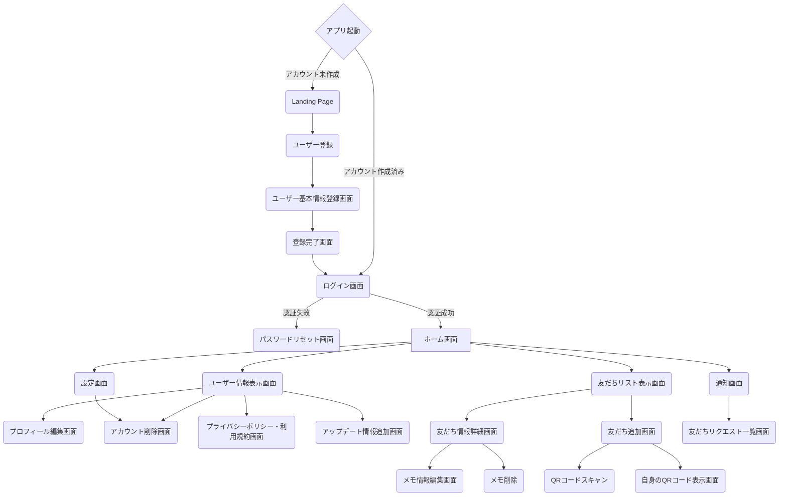

# はじめに
- 本書の目的とターゲットとする読者
- 本書の構成と学習内容

# 1. プロジェクトの立ち上げとチームビルディング

この章では、LinkedPalアプリケーションの企画概要を説明し、チーム開発を成功に導くための準備段階について解説していきます。

まず、「1.1 LinkedPalアプリケーションの企画概要」では、アプリケーションのコンセプトとターゲットユーザー、主要な機能について説明し、プロジェクトの全体像を示します。ここでは、架空の企画書やプロジェクト提案資料などを例に挙げながら、アプリケーションのビジョンを明確に伝えることの重要性を強調します。

次に、「1.2 チームメンバーの役割分担と責務」では、プロジェクトを成功に導くためのチーム構成について説明します。プロジェクトマネージャー、開発リーダー、UIデザイナー、バックエンドエンジニアなど、各メンバーの役割と責務を明確にし、チームとしてのコラボレーションを円滑に進めるためのヒントを提供します。

「1.3 プロジェクト管理ツールの選定と活用方法」では、チーム開発に欠かせないプロジェクト管理ツールについて解説します。Slack、Trello、Jiraなど、代表的なツールを取り上げ、それぞれの特徴や活用方法を説明します。また、ツールを効果的に活用するためのベストプラクティスや、チームメンバー間での情報共有の重要性についても触れます。

最後に、「1.4 コミュニケーションプロトコルの確立」では、チームメンバー間のコミュニケーションを円滑に行うための方法について説明します。定期的なミーティングの設定、議事録の作成、情報共有のルールなど、効果的なコミュニケーションを実現するためのヒントを提供します。

この章を通して、チーム開発を始めるための準備段階の重要性を理解し、プロジェクトを成功に導くためのチームビルディングのために必要なことを学ぶことができるでしょう。

## 1.1 LinkedPalアプリケーションの企画概要

LinkedPalは、プライバシーを重視しながら友人関係を深められるプライベートSNSアプリケーションです。既存のSNSでは、情報が公開されすぎることに抵抗を感じるユーザーをターゲットに、シンプルでコアな機能に特化することで、安心して利用できる環境を提供します。

本アプリケーションの主なコンセプトは以下の3点です：

1. 友人関係を大切にしながらも、プライバシーを守れる
2. QRコードで簡単に友人登録でき、個別のメモ機能で大切な情報を記録・共有できる
3. 友人との絆を深め、思い出を残すためのツール

LinkedPalは、主に以下の2つのユーザーペルソナを想定しています：

1. 学生フレンドリー
   - 清水さくら（20歳、大学生）のような、活発で人付き合いが好きな学生ユーザー
   - 大学の同級生や友人との思い出を残したいが、既存のSNSでは情報が公開されすぎることに抵抗を感じている
   - 新入生との顔合わせ会、サークル活動、飲み会などでLinkedPalを利用する

2. ビジネスフレンドリー
   - 田中太郎（35歳、営業職）のような、几帳面で人当たりが良いビジネスパーソン
   - 顧客や取引先との関係を大切にしたいが、個人的な情報を公開したくないと考えている
   - 営業時のアポイントや会食、プライベートの付き合いなどでLinkedPalを利用する

LinkedPalは、これらのユーザーペルソナが抱える課題を解決するために、以下の主要な機能を提供します：

1. QRコードを使った簡単な友人登録
   - ユーザーはQRコードを読み取るだけで、簡単に友人登録ができます
   - 面倒な手続きが不要で、スムーズに友人関係を築くことができます

2. 友人ごとのメモ機能
   - ユーザーは友人ごとにメモを作成し、大切な情報を記録できます
   - プライベートな情報を安心して管理でき、友人との絆を深められます

3. シンプルで直感的なユーザーインターフェース
   - 余計な機能を排除し、コアな機能に特化することで、シンプルで使いやすいUIを実現します
   - ユーザーは迷うことなくアプリケーションを利用でき、快適なユーザーエクスペリエンスを得られます

LinkedPalは、プライバシーを守りつつ友人関係を大切にしたい学生や対人業務の方々に最適なツールとなります。シンプルながらコアな機能に注力し、思い出の記録やプライベート情報の共有を可能にすることで、ユーザーの日常生活をサポートします。

以上の内容を、企画書としてまとめるのであれば以下のような内容となるでしょうか。

```markdown
# LinkedPal企画書

## 1. プロジェクトの概要
LinkedPalは、プライバシーを重視しながら友人関係を深められるプライベートSNSアプリケーションです。既存のSNSに不満を抱くユーザーに対して、シンプルでコアな機能に特化することで、安心して利用できる環境を提供します。

## 2. ターゲットユーザー
- プライバシーに配慮しながら、友人とのつながりを大切にしたい学生
- 顧客や取引先との関係を築きたいが、個人情報の公開に抵抗があるビジネスパーソン

## 3. 主要な機能
- QRコードを使った簡単な友人登録
- 友人ごとのメモ機能
- シンプルで直感的なユーザーインターフェース

## 4. 競合分析
- 既存のSNSとの差別化：プライバシー保護とシンプルな機能に特化
- ビジネス用SNSとの差別化：プライベートな関係構築に特化

## 5. 開発体制
- プロダクトマネージャー：1名
- デザイナー：1名
- フロントエンドエンジニア：2名
- バックエンドエンジニア：2名
- テストエンジニア：1名

## 6. 開発スケジュール
- 要件定義とデザイン：1ヶ月
- 実装：3ヶ月
- テストとデバッグ：1ヶ月
- リリース準備：1ヶ月
```

このような企画書を通して、LinkedPalのビジョンを明確に伝えることができます。企画書では、プロジェクトの概要、ターゲットユーザー、主要な機能、競合分析、開発体制、開発スケジュールなどを具体的に示すことで、プロジェクトの全体像を関係者に共有することができます。
また、プロジェクト提案資料では、アプリケーションのコンセプトをビジュアル的に表現することで、LinkedPalのビジョンをよりインパクトのある形で伝えることができます。例えば、以下のようなスライドを用いて、LinkedPalの特徴を強調できます：

 

- LinkedPalのロゴとキャッチフレーズ
- ユーザーペルソナを表すイラストとストーリー
- 主要な機能を示すスクリーンショットやモックアップ
- 競合他社との比較表
- 開発ロードマップ

これらの企画書やプロジェクト提案資料を通して、LinkedPalのビジョンを明確かつ魅力的に伝えることができます。プロジェクトの初期段階で、関係者全員がアプリケーションのビジョンを共有することは、開発を円滑に進める上で非常に重要です。共通のビジョンを持つことで、チームメンバーのモチベーションを高め、プロジェクトの成功に向けて一丸となって取り組むことができるのです。

## 1.2 チームメンバーの役割分担と責務

LinkedPalの開発を成功に導くためには、適切なチーム構成と各メンバーの役割分担が不可欠です。ここでは、プロジェクトに関わる主要なメンバーの役割と責務について説明します。

1. プロダクトマネージャー
   - プロジェクト全体の進捗管理と調整を行う
   - チームメンバー間のコミュニケーションを促進し、情報共有を徹底する
   - 予算管理とリソース配分の最適化を図る
   - ステークホルダーとの折衝や報告を行う

2. デザイナー
   - ユーザー調査とペルソナの作成を通じて、ユーザーニーズを明確化する
   - ワイヤーフレームやモックアップを作成し、アプリケーションのUI/UXを設計する
   - デザインガイドラインを作成し、アプリケーションの一貫性を維持する
   - エンジニアと協力して、デザインの実装可能性を検討する

3. フロントエンドエンジニア
   - デザイナーが作成したUIデザインを、AndroidやiOS向けに実装する（本書ではAndroidアプリ開発エンジニアにフォーカスします）
   - Jetpack ComposeやMaterial Designなどの最新技術を活用し、高品質なUIを構築する
   - ユーザーインタラクションやアニメーションの実装を担当する
   - バックエンドエンジニアと連携し、APIとの統合を行う

4. バックエンドエンジニア
   - アプリケーションのサーバーサイドの設計と実装を担当する
   - データベース設計とAPIの開発を行う
   - セキュリティやパフォーマンスに配慮した、スケーラブルなバックエンドシステムを構築する
   - フロントエンドエンジニアと協力して、API仕様の策定と実装を進める

5. テストエンジニア
   - テスト計画の作成とテストケースの設計を行う
   - ユニットテスト、統合テスト、UIテストなどの自動テストを実装する
   - テスト実行とデバッグを通じて、アプリケーションの品質を確保する
   - バグ報告と修正のフォローアップを行う

これらのメンバーが協力して、LinkedPalの開発を進めていきます。各メンバーが自身の専門性を発揮しつつ、他のメンバーとのコラボレーションを円滑に行うことが、プロジェクトの成功につながります。

また、チームメンバーの役割と責務を明確にすることで、以下のようなメリットが得られます：

- メンバー間の dependencies を明らかにし、円滑なコミュニケーションを促進できる
- 各メンバーが自身の責任範囲を理解し、主体的に行動できる
- メンバー間の respect を醸成し、建設的な議論を通じて、より良いソリューションを生み出せる

チーム開発においては、メンバー間の信頼関係と相互理解が何よりも重要です。役割分担と責務を明確にすることで、メンバー間の連携をスムーズにし、プロジェクトを成功に導くことができるのです。

実際のプロジェクトでは、これらの役割分担をチームメンバーの スキルセットや経験に応じて 最適化し、柔軟に調整していくことが求められます。また、プロジェクトの進行に合わせて、メンバーの役割や責務を見直し、必要に応じて再編成することも重要です。たとえばモックアップ作成の段階からフロントエンドエンジニアが深く関わる形もよく見られるスタイルかと思います。

LinkedPalの開発プロジェクトでは、これらの役割分担と責務を念頭に置きながら、チームビルディングとコラボレーションを進めていきます。各メンバーの強みを活かし、互いに尊重し合いながら、高品質なアプリケーションの開発を目指していくことが、プロジェクト成功の鍵となるでしょう。

## 1.3 プロジェクト管理ツールの選定と活用方法

LinkedPalの開発を効率的に進めるためには、適切なプロジェクト管理ツールの選定と活用が欠かせません。ここでは、代表的なプロジェクト管理ツールを紹介し、それぞれの特徴と活用方法について説明します。

1. Slack
   - リアルタイムコミュニケーションを促進するためのチャットツール
   - チャンネルを使って、トピックごとに会話を整理できる
   - チャンネルへの参加が基本的に自由となっており、オープンなコミュニケーションに向いている
   - ファイル共有や統合機能により、情報共有やタスク管理がスムーズに行える
   - LinkedPalの開発では、Slackを使って日常的なコミュニケーションや情報共有を行う

2. Trello
   - カンバン方式のタスク管理ツール
   - カードとボードを使って、タスクの進捗状況を視覚的に管理できる
   - シンプルで直感的なUIにより、チームメンバー全員が容易に利用できる
   - LinkedPalの開発では、Trelloを使ってタスクの割り当てや進捗管理を行う

3. Jira
   - 本格的なプロジェクト管理ツール
   - エピック、ストーリー、タスクなどの階層構造で、プロジェクトの全体像を管理できる
   - スクラムやカンバンなど、様々な開発手法に対応している
   - LinkedPalの開発では、Jiraを使って開発スケジュールや課題管理を行う

4. Confluence
   - ドキュメント共有とコラボレーションのためのツール
   - プロジェクトの仕様書、設計書、議事録などを一元管理できる
   - バージョン管理機能により、ドキュメントの変更履歴を追跡できる
   - LinkedPalの開発では、Confluenceを使ってプロジェクトのドキュメンテーションを行う

5. GitHub
   - バージョン管理システムとしてデファクトスタンダードのGit
   - プルリクエストを使ったコードレビューや、issueを使ったタスク管理が行える
   - CIツールとの連携により、継続的インテグレーション（CI）の実現が容易
   - LinkedPalの開発では、GitHubを使ってソースコードの管理とコラボレーションを行う

これらのツールを効果的に活用するためには、以下のようなベストプラクティスが重要です：

- ツールの使用目的と運用ルールを明確にし、チームメンバー全員で共有する
- 定期的にツールの使用状況をレビューし、必要に応じて改善を行う
- ツール間の連携を検討し、情報の一元管理と自動化を図る
- メンバーのツール習熟度を高めるために、トレーニングや勉強会を実施する

LinkedPalの開発プロジェクトでは、これらのツールを適材適所で活用し、チームメンバー間のコラボレーションを円滑に進めていきます。

また、プロジェクトの規模や特性に応じて、ツールの選定や組み合わせを柔軟に見直していくことも重要です。ツールはあくまでも手段であり、チームにとって最適な環境を構築することが目的であることを忘れてはいけません。たとえば、JiraのカンバンボードはTrelloの主要な機能をカバーしており、多くの場合、Jiraだけでタスク管理を行うことができます。本書では、以下のようなケースを想定し、TrelloとJiraの併用について触れています。

1. 軽量なタスク管理
   - Trelloは、シンプルで直感的なUIが特徴です。プロジェクトの初期段階や、小規模なタスクを管理する際に、Trelloを使うことで、素早くタスクの可視化と管理を行うことができます。
   - Jiraは、より本格的なプロジェクト管理機能を提供しますが、その分、設定や操作が複雑になる傾向があります。プロジェクトの規模や複雑さに応じて、使い分けることが効果的です。

2. 外部ステークホルダーとのコラボレーション
   - Trelloは、シンプルなUIとゲスト招待機能により、外部ステークホルダーとのコラボレーションに適しています。
   - 社外のデザイナーやマーケティングチームなど、開発チーム以外のメンバーとタスクを共有する際に、Trelloを使うことで、スムーズなコミュニケーションが可能になります。

3. 個人のタスク管理
   - Trelloは、個人のタスク管理にも適しています。プロジェクトとは別に、個人の作業やTODOを管理するために、Trelloを使うことができます。
   - 個人のタスクを別のツールで管理することで、プロジェクトのタスクとの混同を防ぎ、生産性を高めることができます。

ただし、ツールの乱立はかえって生産性を損なう恐れがあるため、導入には慎重に検討する必要があります。プロジェクトの規模や複雑さ、チームメンバーのスキルセットなどを考慮し、最適なツールの組み合わせを選択することが重要です。プロジェクトの各フェーズやタスクの性質に応じて、適切なツールを選択し、効率的なタスク管理を目指していく必要があるでしょう。

LinkedPalの開発チームでは、これらのプロジェクト管理ツールを活用しながら、以下のようなコラボレーションを実践していきます：

- Slackでの日常的なコミュニケーションと情報共有
- Trelloでのタスクの可視化と進捗管理
- Jiraでのプロジェクト全体の進捗管理と課題管理
- Confluenceでのドキュメンテーションとナレッジ共有
- GitHubでのソースコード管理とコードレビュー

これらのツールとプラクティスを通じて、チームメンバー間の連携を強化し、プロジェクトの成功に向けて邁進していきます。

プロジェクト管理ツールは、チーム開発になくてはならない存在です。適切なツールを選定し、効果的に活用することで、コミュニケーションの活性化、情報共有の促進、タスク管理の効率化など、様々なメリットを得ることができます。LinkedPalの開発プロジェクトでは、これらのツールを最大限に活用し、高品質なアプリケーションを目指していくことになるでしょう。

## 1.4 コミュニケーションプロトコルの確立

LinkedPalの開発チームがプロジェクトを成功に導くためには、効果的なコミュニケーションが不可欠です。ここでは、チームメンバー間のコミュニケーションを円滑に行うための方法と、コミュニケーションプロトコルの確立について説明します。

1. 定期的なミーティングの設定
   - デイリースクラム：毎日15分程度、チームメンバーが当日の作業予定や進捗状況を共有する
   - スプリントプランニング：スプリントの開始時に、スプリントの目標と取り組むタスクを決定する
   - スプリントレビュー：スプリントの終了時に、成果物のデモンストレーションを行い、フィードバックを得る
   - スプリントレトロスペクティブ：スプリントの振り返りを行い、改善点を話し合う

2. ミーティングのベストプラクティス
   - 議題と目的を明確にし、事前に共有する
   - タイムボックスを設定し、時間を有効活用する
   - 全員が発言できる機会を設ける
   - 決定事項とアクションアイテムを明確にし、議事録に記録する

3. 非同期コミュニケーションの活用
   - Slackなどのチャットツールを使い、リアルタイムでの情報共有を行う
   - ドキュメントやWikiを活用し、プロジェクトの知見を蓄積・共有する
   - プルリクエストやコードレビューを通じて、コードに関する議論を行う

4. 1on1ミーティングの実施
   - マネージャーとメンバーが定期的に1対1で面談を行う
   - メンバーの状況や意見を把握し、適切なサポートを提供する
   - 信頼関係を構築し、オープンなコミュニケーションを促進する

5. コミュニケーションの原則
   - 明確かつ簡潔なコミュニケーションを心がける
   - 相手の立場に立って、敬意を持ってコミュニケーションを行う
   - 建設的なフィードバックを提供し、継続的な改善を目指す
   - 情報の透明性を確保し、チーム全体での情報共有を徹底する

LinkedPalの開発チームでは、これらのコミュニケーションプロトコルを確立し、チームメンバー間の連携を強化していきます。定期的なミーティングを通じて、プロジェクトの進捗や課題を共有し、適切な意思決定を行います。また、非同期コミュニケーションツールを活用することで、情報の共有と蓄積を効率的に行います。

1on1ミーティングを実施することで、メンバーの状況を把握し、適切なサポートを提供します。マネージャーは、メンバーの強みを活かし、成長を支援する役割を担います。

コミュニケーションの原則を徹底することで、チームメンバー間の信頼関係を構築し、建設的な議論を促進します。お互いを尊重し、オープンなコミュニケーションを行うことで、より良いソリューションを生み出すことができます。

プロジェクトの進行に合わせて、コミュニケーションプロトコルを継続的に改善していくことも重要です。定期的にレトロスペクティブを行い、コミュニケーションの課題を特定し、改善策を実施していきます。

LinkedPalの開発プロジェクトでは、これらのコミュニケーションプロトコルを確立し、チームメンバー間の連携を強化することで、プロジェクトの成功を目指していきます。効果的なコミュニケーションは、高品質なアプリケーションを開発するための基盤となるでしょう。

# 2. 要件定義とアプリケーション設計

LinkedPalの開発を進めるにあたり、まず要件定義とアプリケーション設計を行います。この章では、要件収集からアーキテクチャの選定、テスト戦略の策定までの一連のプロセスを説明します。

「2.1 要件収集とユーザーストーリーの作成」では
- ステークホルダーへのインタビューを通じて、アプリケーションに必要な機能と非機能要件を収集します。
- 収集した要件をもとに、ユーザーストーリーを作成し、優先順位を付けます。

「2.2 画面遷移図とワイヤーフレームの作成」では
- 要件をもとに、アプリケーションの画面遷移図を作成します。
- 各画面のワイヤーフレームを作成し、ユーザーインターフェースの概要を視覚化します。

「2.3 APIの設計とドキュメンテーション」では
- アプリケーションが必要とするサーバーサイドのAPIを設計します。
- APIの仕様をドキュメント化し、フロントエンドとバックエンドの開発チームで共有します。

「2.4 アーキテクチャの選定とクリーンアーキテクチャの適用」では
- LinkedPalの開発に適したアーキテクチャを選定します。
- クリーンアーキテクチャの原則を適用し、各レイヤーの役割と責務を明確にします。

「2.5 テスト戦略の策定」では
- アプリケーションの品質を確保するためのテスト戦略を策定します。
- ユニットテスト、統合テスト、UIテストなど、各レベルでのテストの方針を決定します。

この章を通して、LinkedPalの要件を明確化し、アプリケーションの設計を行います。要件定義とアプリケーション設計は、開発を始める前の重要な準備段階であり、プロジェクトの成功を左右する要因となります。

以下の節では、それぞれの項目について詳しく説明していきます。要件収集からテスト戦略の策定までの一連のプロセスを丁寧に解説することで、アプリケーション開発の全体像を理解できるようにします。

## 2.1 要件収集とユーザーストーリーの作成

要件収集は、アプリケーションの目的や機能、非機能要件を明確にするためのプロセスです。LinkedPalの開発では、ステークホルダーへのインタビューを通じて要件を収集し、ユーザーストーリーを作成します。

### 2.1.1 ステークホルダーへのインタビュー
- プロジェクトに関わるステークホルダーを特定します（例：エンドユーザー、プロダクトオーナー、マーケティングチームなど）。
- ステークホルダーにインタビューを行い、アプリケーションに求める機能や要求事項を収集します。
- インタビューでは、オープンエンドの質問を使ってステークホルダーの意見を引き出し、潜在的なニーズを掘り起こします。

インタビューの例：
```
Q: LinkedPalを使ってどのようなことを実現したいですか？
A: プライバシーを守りながら、友人とのつながりを大切にしたいです。

Q: 友人とのつながりを深めるために、どのような機能が必要だと思いますか？
A: 友人ごとにメモを残せる機能があると、大切な思い出を記録できて良いと思います。

Q: プライバシー保護のために、どのような配慮が必要でしょうか？
A: 友人の追加は、QRコードなどの限定的な方法にして、不特定多数からの友人申請を防ぐ必要があります。
```

### 2.1.2 ペルソナの作成
- インタビューで得られた情報をもとに、アプリケーションの典型的なユーザーを表すペルソナを作成します。
- ペルソナには、名前、年齢、職業、ニーズ、ペインなどの属性を設定し、具体的なイメージを持つことが重要です。
- 複数のペルソナを作成することで、異なるタイプのユーザーを考慮に入れた設計が可能になります。

ペルソナの例：
```
名前：鈴木 由美（すずき ゆみ）
年齢：22歳
職業：大学生
ニーズ：同じ趣味を持つ友人と交流を深めたい。プライバシーを守りつつ、大切な思い出を共有したい。
ペイン：SNSでは個人情報の公開範囲を細かく設定できない。友人からの投稿が大量に流れてきて、大切な情報を見逃してしまう。
```

### 2.1.3 ユーザーストーリーの作成

- ペルソナをもとに、アプリケーションに必要な機能を、ユーザーの視点から「ユーザーストーリー」として記述します。
- ユーザーストーリーは、「ユーザーは～したい。なぜなら、～だからだ。」という形式で記述します。
- 各ストーリーには、優先順位とストーリーポイント（実装の難易度や工数の見積もり）を付与します。

ストーリーポイントは、フィボナッチ数列（1、2、3、5、8、13、21）を使って割り当てることが一般的です。例えば１つのスプリントを２週間で実施するような場合、各ポイントの目安は以下の通りです：

- 1ポイント：簡単な機能で、1日以内に実装が完了するもの。
- 2ポイント：1ポイントよりは複雑だが、2〜3日で実装が完了するもの。
- 3ポイント：中程度の複雑さで、3〜5日で実装が完了するもの。
- 5ポイント：複雑な機能で、1週間程度を要するもの。
- 8ポイント：非常に複雑な機能で、2週間（1スプリント）をフルに使ってようやく完了するレベル。
- 13ポイント以上：8ポイントを超えるような大規模な機能は、さらに細かいタスクに分割することを検討する。

ユーザーストーリーの例：
```
- ユーザーは、QRコードを読み取ることで、簡単に友人を追加したい。なぜなら、IDの入力なしでつながりたいからだ。
  - 優先順位：高
  - ストーリーポイント：3

- ユーザーは、友人ごとにメモを残したい。なぜなら、友人との大切な思い出を記録しておきたいからだ。
  - 優先順位：中
  - ストーリーポイント：5
```

ストーリーポイントの割り当ては、チームの経験や過去のデータをもとに微調整していくことが重要です。プロジェクトを進める中で、実際の開発速度や難易度を踏まえてポイントの基準を更新し、より正確な見積もりができるようにしていくことが求められます。

### 2.1.4 要件のまとめと共有
- 収集した要件をまとめ、プロジェクトチーム全体で共有します。
- 要件のまとめには、アプリケーションの目的、ペルソナ、主要な機能、非機能要件などを含めます。
- チームメンバー全員が要件を理解し、プロジェクトのゴールを共有することが重要です。

要件のまとめ例：
```
# LinkedPal要件まとめ

## アプリケーションの目的
- プライバシーを守りながら、友人とのつながりを深めるためのSNSを提供する。

## ペルソナ
1. 鈴木由美（22歳、大学生）
2. 田中太郎（35歳、会社員）

## 主要な機能
- QRコードを使った友人追加
- 友人ごとのメモ機能
- プライバシー保護のための限定公開機能

## 非機能要件
- セキュリティ：個人情報の保護、セキュアな通信
- パフォーマンス：快適なレスポンスタイム、低いバッテリー消費
- ユーザビリティ：シンプルで直感的なUI、アクセシビリティへの配慮
```

要件収集とユーザーストーリーの作成は、アプリケーションの設計と開発の基礎となるプロセスです。ステークホルダーの意見を丁寧に聞き、ペルソナを作成することで、ユーザーの視点に立った設計が可能になります。また、ユーザーストーリーを使って機能を具体化し、優先順位を付けることで、開発の方向性を明確にすることができます。

この節では、要件収集とユーザーストーリーの作成について、具体的な例を交えて説明しました。インタビューの質問例やペルソナ、ユーザーストーリーのサンプルにより要件定義のプロセスがイメージしやすくなったのではないでしょうか。要件のまとめ方と共有の重要性についても触れ、チーム全体で要件を理解することの大切さも示しました。

次の節では、この要件定義をもとに、画面遷移図とワイヤーフレームを作成する方法について説明していきます。

## 2.2 画面遷移図とワイヤーフレームの作成

要件定義が完了したら、次はアプリケーションの画面構成と画面遷移を設計します。画面遷移図とワイヤーフレームを作成することで、アプリケーションの全体像を視覚的に表現し、ユーザーインターフェースの基本的な設計を行います。

### 2.2.1 画面遷移図の作成
- 要件定義で収集した情報をもとに、アプリケーションに必要な画面を洗い出します。
- 画面間の遷移を矢印で示し、全体の画面構成を図式化します。
- 画面遷移図は、開発チームとステークホルダーの間で、アプリケーションの全体像を共有するためのコミュニケーションツールとしても活用します。

画面遷移図の例：


### 2.2.2 ワイヤーフレームの作成
- 画面遷移図で定義した各画面について、ワイヤーフレームを作成します。
- ワイヤーフレームは、画面のレイアウトや配置、ユーザーインターフェースの要素を簡略化して表現します。
- 詳細なデザインは含めず、機能要素の配置とユーザーの操作の流れに焦点を当てます。
- ワイヤーフレームは、デザインや開発の前に、ユーザーインターフェースの基本構造を確認するために使用します。

ワイヤーフレームの例：
```
[ホーム画面]

+--------------------------+
|         LinkedPal        |
+--------------------------+
|    [プロフィール画像]       |
|     [ユーザー名]           |
|                          |
|    [友だちリスト]          |
|    - 友だち1              |
|    - 友だち2              |
|    - 友だち3              |
|                          |
|     [友だち追加ボタン]      |
|    [設定ボタン]            |
+--------------------------+
```

### 2.2.3 ステークホルダーとのレビュー
- 作成した画面遷移図とワイヤーフレームを、ステークホルダーと共有します。
- ステークホルダーからのフィードバックを収集し、必要に応じて修正を行います。
- レビューを通じて、要件の漏れや認識の齟齬を早期に発見し、手戻りを防ぎます。

### 2.2.4 デザインへの引き継ぎ
- 確定した画面遷移図とワイヤーフレームを、UIデザイナーに引き継ぎます。
- UIデザイナーは、ワイヤーフレームをもとに、詳細なビジュアルデザインを作成します。
- デザインの過程でも、ユーザーストーリーや要件を参照し、ユーザー視点でのデザインを心がけます。

画面遷移図とワイヤーフレームの作成は、要件定義で収集した情報を可視化し、アプリケーションの全体像を明確にするための重要なステップです。これらのアウトプットは、開発チーム内だけでなく、ステークホルダーとのコミュニケーションツールとしても活用されます。

画面遷移図は、アプリケーションのナビゲーション構造を表現し、ユーザーがどのように画面間を移動するかを示します。ワイヤーフレームは、各画面の基本的なレイアウトとユーザーインターフェースの要素を視覚化します。これらを組み合わせることで、アプリケーションの使い勝手や操作性を事前に確認することができます。

ステークホルダーとのレビューを通じて、要件の漏れや認識の違いを早期に発見し、修正することが重要です。画面遷移図とワイヤーフレームは、プロジェクトの進行に合わせて適宜更新し、常に最新の状態を保つことが求められます。（一般的には、ワイヤーフレーム等を独立して管理し続けるケースは少なく、後述のデザインプロセスに統合される形でFigma等のツールを利用して管理・共有される形が多いようです）

最終的に、確定した画面遷移図とワイヤーフレームは、UIデザイナーに引き継がれ、詳細なビジュアルデザインの制作につながります。この一連のプロセスを丁寧に進めることで、ユーザー視点に立った使いやすいインターフェースを実現することができるのです。

2.2.5 APIの設計との連携
- 画面遷移図やワイヤーフレームの作成と並行して、APIの設計を行います。
- フロントエンドとバックエンドの開発チームが協力し、想定する画面遷移や機能の実現可能性を検討します。
- 必要に応じて、画面遷移図やワイヤーフレームの修正を行い、APIの設計にフィードバックします。
- この連携により、技術的な制約を考慮した、より実現可能性の高い設計を行うことができます。


2.2.6 エンジニアとの協業
- 画面遷移図やワイヤーフレームの作成には、フロントエンドとバックエンドのエンジニアも初期段階から参加することが望ましいです。
- エンジニアの視点から、技術的な実現可能性や制約事項を検討し、設計に反映することができます。
- デザイナーとエンジニアが協力して設計を進めることで、より実現可能性の高い、高品質なアプリケーションを目指すことができます。

こうして、どの画面でどのような情報要素を表示する必要があるのか？が明確になりました。次の節では、LinkedPalアプリケーションのサーバーサイドで必要となるAPIの設計とドキュメンテーションについて説明します。

## 2.3 APIの設計とドキュメンテーション

LinkedPalアプリケーションのサーバーサイドでは、フロントエンドとのデータのやり取りをするためのAPIを設計する必要があります。APIの設計は、前節で作成した画面遷移図やワイヤーフレームと密接に関連しています。フロントエンドとバックエンドの開発チームが協力し、想定する画面遷移や機能の実現可能性を検討しながら、APIの設計を進めていきます。

### 2.3.1 APIの設計
- フロントエンドが必要とするデータや操作を分析し、APIのエンドポイントを定義します。
- RESTful APIの原則に従い、リソースの命名やHTTPメソッドの使用を統一します。
- 認証や認可の方式を決定し、セキュリティ面での設計も行います。
- レスポンスのフォーマット（JSONなど）を決定します。

APIエンドポイントの例：
```
- POST /api/auth/login：ログイン
- POST /api/auth/register：ユーザー登録
- GET /api/users/{userId}：ユーザー情報の取得
- GET /api/friends/{userId}：友だちリストの取得
- POST /api/friends/{userId}：友だちの追加
- GET /api/memos/{userId}：メモリストの取得
- POST /api/memos/{userId}：メモの作成
- PUT /api/memos/{memoId}：メモの更新
- DELETE /api/memos/{memoId}：メモの削除
```

### 2.3.2 APIドキュメンテーション
- APIの仕様を明確に文書化し、フロントエンドとバックエンドの開発チームで共有します。
- ドキュメンテーションには、エンドポイントのURL、HTTPメソッド、リクエストパラメータ、レスポンスの形式などを記載します。
- ドキュメンテーションツール（Swagger、APIブループリントなど）を使用して、可視化と自動生成を行うことも効果的です。
- サンプルリクエストとレスポンスを含めることで、APIの使用方法をわかりやすく説明します。

APIドキュメンテーションの例：
```
## ユーザー登録

- URL：`POST /api/auth/register`
- リクエストパラメータ：
  - `username`（必須）：ユーザー名
  - `email`（必須）：メールアドレス
  - `password`（必須）：パスワード

- レスポンス（成功時）：
```json
  {
    "userId": "123",
    "username": "john_doe",
    "email": "john@example.com",
    "token": "abc123"
  }
```

- レスポンス（エラー時）：
```json
  {
    "error": "Invalid email address"
  }
```

### 2.3.3 APIの実装とテスト
- 設計したAPIを、サーバーサイドで実装します。
- 単体テストとインテグレーションテストを実施し、APIの動作を検証します。
- ドキュメンテーションと実装の整合性を確認し、必要に応じて更新します。
- フロントエンドの開発チームと協力し、APIの動作を確認します。

### 2.3.4 APIのバージョン管理
- APIの変更や拡張に備えて、バージョン管理の仕組みを導入します。
- バージョン番号をURLに含めるなどの方法で、APIのバージョンを明示します。
- 互換性を維持しながら、APIの更新を行えるようにします。

APIの設計とドキュメンテーションは、フロントエンドとバックエンドの開発チームをつなぐ重要な役割を果たします。明確で一貫性のあるAPI設計は、開発の効率を高め、コードの品質を向上させます。また、わかりやすいドキュメンテーションは、開発者の理解を深め、APIの利用を促進します。

APIの設計では、RESTfulアーキテクチャの原則に従うことが一般的です。リソースベースのURLの設計、適切なHTTPメソッドの使用、ステートレス性の確保などが重要なポイントとなります。また、認証や認可の仕組みを適切に設計し、APIのセキュリティを確保することも欠かせません。

ドキュメンテーションでは、APIの仕様を明確かつ網羅的に記述することが求められます。ドキュメンテーションツールを活用することで、APIの可視化と自動生成が可能になり、ドキュメントの品質と一貫性を維持しやすくなります。サンプルコードを含めることで、開発者にとってより理解しやすいドキュメントになるでしょう。

APIの実装とテストでは、設計とドキュメンテーションに基づいて、サーバーサイドの開発を進めます。単体テストとインテグレーションテストを実施することで、APIの品質を確保し、意図した動作が実現されていることを確認します。また、フロントエンドの開発チームとも連携し、APIの動作を検証することが重要です。

LinkedPalアプリケーションの開発においても、APIの設計とドキュメンテーションを丁寧に行うことで、フロントエンドとバックエンドの連携をスムーズにし、高品質なアプリケーションを実現することができるでしょう。

次の節では、LinkedPalアプリケーションのアーキテクチャ選定とクリーンアーキテクチャの適用について説明します。

## 2.4 アーキテクチャの選定とクリーンアーキテクチャの適用

LinkedPalアプリケーションは、主力プロダクトの１つとして開発する方針が立てられています。したがいまして、長く継続的に開発が行えるよう、保守性と拡張性に優れたアーキテクチャを選定することが重要です。ここでは、クリーンアーキテクチャの概念を導入することとし、その適用方法について説明します。

2.4.1 クリーンアーキテクチャとは
- クリーンアーキテクチャは、ロバート・C・マーティン（通称アンクル・ボブ）が提唱したソフトウェアアーキテクチャの設計手法です。
- ドメインロジック（ビジネスルール）を中心に、それを取り巻く形で各レイヤーを配置します。
- レイヤー間の依存関係を内側（ドメインロジック側）に向けることで、変更に強く、テストしやすい構造を実現します。

クリーンアーキテクチャの主要なレイヤーは以下の通りです：

1. エンティティ（Entities）：アプリケーションのビジネスルールを表現するオブジェクト
2. ユースケース（Use Cases）：アプリケーションの機能や操作を表現するユースケースクラス
3. インターフェース・アダプター（Interface Adapters）：外部との連携を行うコントローラーやプレゼンター
4. フレームワークとドライバー（Frameworks & Drivers）：UIフレームワークやデータベースなどの外部ライブラリやツール

2.4.2 LinkedPalアプリケーションへのクリーンアーキテクチャの適用
- LinkedPalアプリケーションでは、クリーンアーキテクチャの原則を導入し、各レイヤーの役割と責務を明確にします。
- エンティティ層では、ユーザー、友だち、メモなどのドメインオブジェクトを定義します。
- ユースケース層では、ログイン、友だち追加、メモ作成などのアプリケーションの機能を表現するユースケースクラスを実装します。
- インターフェース・アダプター層では、ViewModelやRepositoryなどのクラスを配置し、UIとデータ永続化の実装を隠蔽します。
- フレームワークとドライバー層では、Android SDKやRoom、Retrofitなどの外部ライブラリを使用します。

クリーンアーキテクチャを適用することで、以下のようなメリットが得られます：

- ドメインロジックを中心に設計することで、アプリケーションの核となる部分が明確になります。
- レイヤー間の依存関係を内側に向けることで、外部の変更による影響を最小限に抑えられます。
- 各レイヤーが独立しているため、テストがしやすく、保守性が向上します。
- 新しい機能の追加や変更が容易になり、アプリケーションの拡張性が高まります。

2.4.3 マルチモジュール構成の導入
- LinkedPalアプリケーションでは、クリーンアーキテクチャの各レイヤーをマルチモジュール構成で実装することを検討します。
- マルチモジュール構成では、アプリケーションを複数のモジュールに分割し、それぞれのモジュールが独立して開発・テストできるようにします。
- 例えば、`:domain`、`:usecase`、`:data`、`:presentation`などのモジュールを作成し、それぞれのレイヤーに対応するコードを配置します。
- マルチモジュール構成を導入することで、コードの構造化が進み、モジュール間の依存関係が明確になります。
- また、ビルド時間の短縮や、モジュール単位でのテストの実行が可能になるなど、開発効率の向上も期待できます。

2.4.4 クリーンアーキテクチャ適用時の注意点
- クリーンアーキテクチャを適用する際は、過度な抽象化を避け、アプリケーションの規模や複雑さに応じた設計を心がけることが重要です。
- レイヤー間のインターフェースを定義する際は、変更に強く、かつシンプルなものになるよう注意します。
- 外部ライブラリやフレームワークへの依存は、インターフェース・アダプター層で隔離し、内側のレイヤーへの影響を最小限に抑えます。
- パフォーマンスへの影響を考慮し、必要に応じてレイヤー間のデータ受け渡しを最適化します。

クリーンアーキテクチャを適用したLinkedPalアプリケーションの開発では、以下のようなディレクトリ構成を採用します：

```
LinkedPal/
├── domain/
│   ├── model/
│   └── repository/
├── usecase/
├── data/
│   ├── local/
│   ├── remote/
│   └── repository/
└── presentation/
    ├── view/
    └── viewmodel/
```

このディレクトリ構成により、クリーンアーキテクチャの各レイヤーが明確に分離され、コードの構造化と保守性の向上が図られます。

アーキテクチャの選定とクリーンアーキテクチャの適用は、LinkedPalアプリケーションの開発における重要な意思決定です。クリーンアーキテクチャの原則を理解し、適切に適用することで、保守性と拡張性に優れたアプリケーションを開発することができるでしょう。

また、マルチモジュール構成の導入を検討することで、さらなるコードの構造化と開発効率の向上が期待できます。ただし、過度な抽象化や複雑さを避け、アプリケーションの規模に応じた設計を心がける必要があります。

LinkedPalアプリケーションの開発では、これらの原則を踏まえつつ、柔軟に対応していくことが求められます。クリーンアーキテクチャを適用することで、より高品質で保守性の高いアプリケーションを目指していきましょう。

次の節では、LinkedPalアプリケーションの品質を確保するためのテスト戦略について説明します。

## 2.5 テスト戦略の策定

2.5 テスト戦略の策定

LinkedPalアプリケーションの品質を確保するためには、適切なテスト戦略を策定し、実行することが重要です。ここでは、ユニットテスト、統合テスト、UIテストなど、各レベルでのテストの方針と実践方法について説明します。

2.5.1 テストピラミッドとテスト戦略
- テストピラミッドは、アプリケーションのテスト戦略を視覚化するためのモデルです。
- ピラミッドの下層にはユニットテスト、中層には統合テスト、上層にはUIテストが位置づけられます。
- 下層のテストほど数を多くし、高速で実行できるようにします。上層のテストは数を絞り込み、重要なシナリオに焦点を当てます。

LinkedPalアプリケーションでは、以下のようなテスト戦略を採用します：

1. ユニットテスト：
   - ビジネスロジックや各コンポーネントの機能を独立してテストします。
   - クリーンアーキテクチャのドメイン層とユースケース層に重点を置き、ロジックの正確性を確保します。
   - Mockitoなどのモック化ライブラリを活用し、依存するコンポーネントを分離してテストします。
   - テストカバレッジを高め、迅速なフィードバックループを実現します。

2. 統合テスト：
   - リポジトリ実装などのインフラストラクチャ層と、上位レイヤーとの連携をテストします。
   - データベースやAPIとの通信など、外部システムとの統合シナリオを検証します。
   - 実際のデータを使用したテストを行い、異常系の振る舞いも確認します。

3. UIテスト：
   - エンドツーエンドのユーザーシナリオを検証するために、UIテストを実施します。
   - Espressoなどの自動化フレームワークを使用し、画面遷移やユーザーアクションを自動化します。
   - ユーザーストーリーに基づいたテストケースを作成し、重要な機能の動作を確認します。
   - デバイスやOS環境の違いによる影響を検証するために、複数の環境でテストを実行します。

2.5.2 テスト自動化とCI/CDパイプラインの構築
- テストの自動化を推進し、手動テストの負担を軽減します。
- ユニットテストと統合テストは、ビルドプロセスに組み込み、自動的に実行されるようにします。
- UIテストは、夜間や週末などの定期的なタイミングで自動実行し、レグレッションを検出（回帰テスト。 前にテストしたソフトウェアが変更後もまだ動作するかどうかを、機能テストと非機能テストを再度実行して確認する作業のこと）します。
- CI（継続的インテグレーション）ツールを導入し、コードの変更に応じてテストが自動的に実行されるようにします。
- テスト結果とカバレッジレポートを可視化し、品質の状況を常に把握できるようにします。
- CD（継続的デリバリー）パイプラインを構築し、テストが成功した場合に自動的にデプロイできるようにします。

2.5.3 テスト駆動開発（TDD）の実践
- テスト駆動開発（TDD）は、テストを先に書いてから実装を行う開発手法です。
- TDDを実践することで、テスト可能な設計が促進され、テストの網羅性が向上します。
- 特にクリーンアーキテクチャのドメイン層とユースケース層では、TDDが効果的です。
- テストケースを先に用意することで、要件の明確化とインターフェースの設計が進みます。
- テストとコードを同時に進化させながら、段階的に機能を実装していきます。

2.5.4 テストの改善とメンテナンス
- テストコードもプロダクションコードと同様に、清潔に保ち、メンテナンス性を高める必要があります。
- テストの重複を排除し、テストデータの管理を適切に行います。
- テストの実行速度に留意し、並列実行やテストの分割などの最適化を行います。
- テスト結果を分析し、フィードバックを開発にフィードバックすることで、品質の継続的な改善を図ります。

テスト戦略の策定は、LinkedPalアプリケーションの品質を支える重要な活動です。テストピラミッドに基づいて、各レベルでのテストを適切に計画・実行することが求められます。

ユニットテストでは、クリーンアーキテクチャの原則を活かし、ドメインロジックとユースケースに重点を置いてテストを行います。モック化を活用することで、テストの独立性を高め、迅速なフィードバックを得ることができます。

統合テストでは、インフラストラクチャ層との連携や、外部システムとのインタラクションを検証します。実際のデータを使用したテストを行うことで、システム全体の動作を確認します。

UIテストでは、ユーザーストーリーに基づいたシナリオを自動化し、エンドツーエンドの機能を検証します。UIテストは数を絞り込み、重要な機能に焦点を当てることが大切です。

テストの自動化とCI/CDパイプラインの構築により、品質の継続的な監視と改善が可能になります。TDDの実践は、テスト駆動の設計を促進し、コードの品質と保守性を高めるでしょう。

LinkedPalアプリケーションの開発では、これらのテスト戦略を適切に実行し、高品質なアプリケーションの提供を目指します。テストを開発プロセスに組み込み、常に品質を意識した開発を進めていくことが重要です。

次の章では、いよいよ開発環境の構築とコーディング規約の確立について説明していきます。

# 3. 開発環境の構築とコーディング規約の確立
- 3.1 開発環境のセットアップ
- 3.2 バージョン管理システムの導入
- 3.3 コーディング規約とコードレビュープロセスの確立
- 3.4 CIツールの導入と自動化

# 4. アプリケーションの実装
- 4.1 テスト駆動開発（TDD）の実践
  - 4.1.1 ユーザー登録とログイン
  - 4.1.2 ホーム画面
  - 4.1.3 友だち管理
  - 4.1.4 メモ機能
  - 4.1.5 ユーザー情報管理
- 4.2 コード品質の確保
  - 4.2.1 リファクタリングの継続的実施
  - 4.2.2 Lintの活用
- 4.3 アーキテクチャの適用における留意点

# 5. テストとデバッグ
- 5.1 ユニットテストの実装
- 5.2 UIテストの自動化
- 5.3 APIの動作確認とドキュメンテーション
- 5.4 デバッグとトラブルシューティング

# 6. リリース準備
- 6.1 アプリケーションのパフォーマンス最適化
- 6.2 セキュリティチェックとコードの保護
- 6.3 ユーザードキュメントの作成
- 6.4 ストアへの公開プロセス

# 7. リリース後の運用と保守
- 7.1 ユーザーフィードバックの収集と分析
- 7.2 バグ修正とアップデートの計画
- 7.3 機能追加とアプリケーションの継続的改善
- 7.4 チームの振り返りとレッスンラーンド

# まとめ
- 本書で学んだ内容の振り返り
- モダンなAndroidアプリ開発とチーム開発のベストプラクティス
- 今後の展望とアドバイス

# 付録
- コード品質とリファクタリングのチェックリスト
- よく使われるライブラリとツール
- 参考リソース


