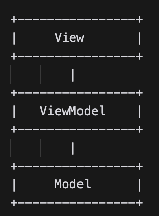
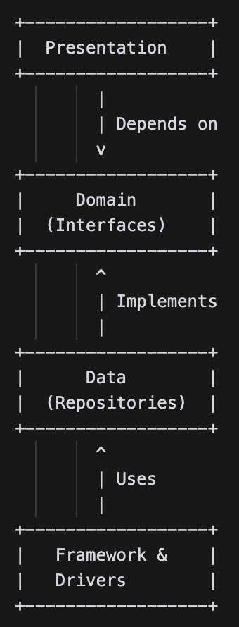

# Androidアプリケーション開発のためのアーキテクチャについて

本ドキュメントは、可能な限りGoogle公式の推奨するベストプラクティスに従うことで、新しいメンバーがプロジェクトに参加しやすい設計を目指すため、その指針となるアーキテクチャについての考え方を整理するものです。ソフトウェア開発を主とする企業においては、既に社内で同様の（あるいはより洗練された）ドキュメントが整備されているものと思いますが、特に受託系のアプリケーション開発において、例えば定期的なリファクタリングやテスト整備の必要性など、発注側の理解を得るために苦労している方々は少なくないものと考えます。形式的にクリーンアーキテクチャではあるがテストコードゼロのプロジェクトなども少なくないものと想像しています。

特に受託系の新しい開発プロジェクトにおいて本ドキュメントを共通認識を持つためのツールとして採用することで、以下のようなメリットがあると考えています。

### 発注企業側のメリット：
- Androidアプリ開発のベストプラクティスを理解し、要件を明確に伝えられる 
- 開発チームとの共通認識を持って、プロジェクトを進められる 
- 品質の高いアプリケーションを得られる可能性が高まる 

### 受注企業側のメリット：
- リファクタリングやテスト整備の重要性を発注企業に理解してもらいやすくなる 
- サポートするOSバージョンや難読化対応等の考え方について自分たちの意見ではなく「一般的なベストプラクティス」を発注企業に説明しやすくなる
- プロジェクトの初期段階から、ベストプラクティスに基づいた開発を進められる 
- 開発チーム内での知識共有やオンボーディングがスムーズになる 


尚、本ドキュメントの性質上、記載されます内容は、最新の技術動向に応じて将来的に変更される可能性があります。

## 1. アーキテクチャ概要

まずは全体感から俯瞰していきましょう。

### 1-1. MVVMアーキテクチャの採用

 

#### 1-1-1. Model: ビジネスロジックとデータを表現するクラス群
データクラスや、データの取得・更新を行うRepositoryクラスが含まれます

```kotlin
// Userデータクラス
data class User(val id: Int, val name: String, val email: String)

// UserRepositoryインターフェース
interface UserRepository {
    suspend fun getUsers(): List<User>
    suspend fun getUserById(id: Int): User?
    suspend fun updateUser(user: User)
}
```

##### 注意点:
- Modelはビジネスロジックに専念し、UIやフレームワークに依存しないようにしましょう 
- Modelクラスは可能な限りシンプルに保ち、単一責任の原則に従うようにしましょう 
 - テスト容易性を考慮し、Modelクラスは独立してテスト可能であるべきです 


##### 1-1-2. Repositoryについて
- データソース（ローカルまたはリモート）からのデータの取得と保存を担当します
- データソースの実装詳細をViewModelから隠蔽し、データの一貫性を保証するものです

###### Repositoryが必要になるタイミング:

複数のデータソースを扱う場合（例: ローカルデータベースとAPIの組み合わせ）
- データの一貫性を保証する必要がある場合
- データ取得のロジックを再利用したい場合

###### Repositoryが過剰になる可能性があるケース:

- シンプルなデータソースしか扱わない場合（例: ローカルデータベースのみ）
- データの一貫性を保証する必要がない場合
- データ取得のロジックが複雑ではなく、再利用の必要性が低い場合

特にRepositoryについては、その役割と必要性を適切に判断し、過剰な設計を避けることが重要です。

#### 1-1-3. View: 
- ユーザーインターフェースを構成するComposable関数
- ユーザーの入力を受け付け、ViewModelに伝達する
- ViewModelから受け取ったデータを表示する
- Composeの宣言的なアプローチにより、UIの構造とデータの流れを明確に表現する

```kotlin
// UserListScreen
@Composable
fun UserListScreen(viewModel: UserListViewModel = viewModel()) {
    val users by viewModel.users.collectAsState()

    LazyColumn {
        items(users) { user ->
            UserItem(user = user, onUserClick = { viewModel.selectUser(user) })
        }
    }
}

// UserItem
@Composable
fun UserItem(user: User, onUserClick: () -> Unit) {
    Row(
        modifier = Modifier
            .fillMaxWidth()
            .clickable(onClick = onUserClick)
            .padding(16.dp)
    ) {
        Column {
            Text(text = user.name, style = MaterialTheme.typography.h6)
            Text(text = user.email, style = MaterialTheme.typography.body1)
        }
    }
}
```

この例では、UserListScreen Composable関数がユーザーリストのUIを構築し、UserItem Composable関数が個々のユーザーアイテムを表現しています。

Composable関数は、他のComposable関数の組み合わせによって構築されます。例えば、UserListScreenではLazyColumnを使用してスクロール可能なリストを作成し、itemsメソッドを使用してUserItemをリストの各項目として表示しています。

UserItemでは、RowとColumnを使用してユーザー情報のレイアウトを作成し、TextComposable関数を使用してユーザーの名前とメールアドレスを表示しています。また、clickableモディファイアを使用して、ユーザーアイテムのクリックイベントを処理しています。

Jetpack Composeを使用することで、宣言的なUIの構築が可能になり、コードの可読性と再利用性が向上します。また、UIの構造とデータの流れを明確に表現することができます。

Composable関数はViewModelと連携して動作します。ViewModelから提供されるデータをComposable関数内で監視し、データの変更に応じてUIを更新します。また、ユーザーの入力をComposable関数内で処理し、ViewModelに伝達することができます。

#### 注意点:
Viewはできる限りシンプルに保ち、ビジネスロジックを含まないようにしましょう
UIの状態はViewModelが管理し、Viewはそれを反映するのみとする形が基本です
Composable関数を適切に分割し、再利用可能な部品として設計することを心がけましょう

```kotlin
@Composable
fun MyScreen() {
    Scaffold(
        topBar = { MyHeader() },
        bottomBar = { MyNavigationBar() },
        content = { paddingValues ->
            Column(
                modifier = Modifier
                    .padding(paddingValues)
                    .fillMaxSize()
            ) {
                MyButton(text = "Click me", onClick = { /* ボタンクリック時の処理 */ })
                MyList(items = listOf("Item 1", "Item 2", "Item 3"))
            }
        }
    )
}

@Composable
fun MyHeader() {
    TopAppBar(
        title = { Text("My App") },
        backgroundColor = MaterialTheme.colors.primary,
        contentColor = MaterialTheme.colors.onPrimary
    )
}

@Composable
fun MyNavigationBar() {
    BottomNavigation {
        val items = listOf("Home", "Settings", "Profile")
        items.forEach { item ->
            BottomNavigationItem(
                icon = { Icon(Icons.Default.Home, contentDescription = item) },
                label = { Text(item) },
                selected = item == "Home",
                onClick = { /* ナビゲーションアイテムクリック時の処理 */ }
            )
        }
    }
}

@Composable
fun MyButton(text: String, onClick: () -> Unit) {
    Button(
        onClick = onClick,
        modifier = Modifier
            .fillMaxWidth()
            .padding(16.dp)
    ) {
        Text(text)
    }
}

@Composable
fun MyList(items: List<String>) {
    LazyColumn {
        items(items) { item ->
            Text(
                text = item,
                modifier = Modifier
                    .fillMaxWidth()
                    .padding(16.dp)
            )
        }
    }
}
```

この例では、MyScreen Composable関数が画面全体を表現しています。Scaffold Composableを使用して、ヘッダー、ナビゲーションバー、コンテンツ領域を定義しています。

MyHeader Composable関数は、TopAppBarを使用してヘッダーを作成しています。ヘッダーにはアプリケーションのタイトルが表示されます。

MyNavigationBar Composable関数は、BottomNavigationを使用してナビゲーションバーを作成しています。ナビゲーションアイテムはBottomNavigationItemを使用して定義され、アイコンとラベルが表示されます。

MyButton Composable関数は、Buttonを使用して再利用可能なボタンを作成しています。ボタンのテキストと、クリック時の処理を引数で受け取ります。

MyList Composable関数は、LazyColumnを使用してリストを作成しています。リストの項目はitemsメソッドを使用して定義され、各項目はテキストとして表示されます。

これらの再利用可能なComposable関数を組み合わせることで、シンプルで効率的な画面を作成することができます。Composable関数を適切に分割することで、コードの可読性と保守性が向上します。

また、Jetpack Composeでは、Modifierを使用してUIの外観と動作をカスタマイズすることができます。この例では、fillMaxWidth、padding、clickableなどのModifierを使用して、UIの見た目を調整しています。

Jetpack Composeを使うことで、UIの構築が宣言的になり、コードの量を減らしながら、再利用性の高いUIコンポーネントを作成することができます。これにより、開発者はアプリケーションのロジックに集中でき、効率的な開発が可能になります。

#### 1-1-4. ViewModel

- ViewとModelの間に位置し、UIロジックとデータバインディングを担当します
- VViewからのユーザー入力を受け取り、Modelに伝達します
- VModelから受け取ったデータをViewに提供します
- VLiveDataやStateFlowを使用し、データの変更をViewに通知します

Jetpack Composeを使用する場合、LiveDataの代わりにStateFlowを使用することが推奨されています。以下に、StateFlowを使用したUserListViewModelの実装例を示します。

```kotlin
// UserListViewModel
class UserListViewModel(private val userRepository: UserRepository) : ViewModel() {
    private val _users = MutableStateFlow<List<User>>(emptyList())
    val users: StateFlow<List<User>> = _users

    init {
        viewModelScope.launch {
            _users.value = userRepository.getUsers()
        }
    }

    fun selectUser(user: User) {
        // ユーザーが選択されたときの処理
    }
}
```

#### 注意点:
ViewModelはアプリケーションのライフサイクルを考慮し、適切なスコープで動作させるよう心がけましょう
ビジネスロジックはViewModelではなくModelに実装するようにしましょう
ViewModelはテスト容易性を考慮し、独立してテスト可能であるべきという考え方を基本としましょう

### 1-2. クリーンアーキテクチャの原則

#### 1-2-1. クリーンアーキテクチャの目的と利点

   - ソフトウェアの構造を理解しやすくし、保守性と拡張性を向上させること
   - ビジネスロジックとUIを分離し、テスト容易性を高めること
   - 変更の影響を局所化し、システムの安定性を確保すること

#### 1-2-2. クリーンアーキテクチャの原則

 

この図で示したいことは、以下の点です。

- Presentationレイヤーは、Domainレイヤーで定義されたインターフェースに依存します。
- Dataレイヤーは、Domainレイヤーで定義されたインターフェースを実装します。
- Dataレイヤーは、Framework & Driversレイヤーを使用してデータの取得や保存を行います。

このようにレイヤー間の依存関係を制限することで、変更の影響を局所化し、システムの保守性と拡張性を向上させることができます。また、各レイヤーの責務を明確に分離することで、コードの理解しやすさとテスト容易性も向上します

繰り返しになりますが、クリーンアーキテクチャの主な目的は、以下の点を実現することです。

- 関心事の分離: UIロジック、ビジネスロジック、データアクセスロジックを分離することで、コードの理解しやすさと保守性を向上させます。
- テスト容易性: 各レイヤーを独立してテストできるようにすることで、テストの書きやすさと信頼性を高めます。

これらの目的は、壮大な理想論ではなく、実際のアプリ開発で直面する問題を解決するための実用的なアプローチです。

それでは、Jetpack Composeを使用したシンプルなAndroidアプリの例を見てみましょう。このアプリは、ユーザーのリストを表示し、ユーザーを選択すると詳細画面に遷移します。

まず、Domainレイヤーでは、ユーザーを表すデータクラスとリポジトリのインターフェースを定義します。

```kotlin
// User.kt
data class User(val id: Int, val name: String, val email: String)

// UserRepository.kt
interface UserRepository {
    suspend fun getUsers(): List<User>
    suspend fun getUserById(id: Int): User?
}
```
次に、Dataレイヤーでは、UserRepositoryの実装を提供します。ここでは、簡単のためにダミーデータを返しています。

```kotlin
// UserRepositoryImpl.kt
class UserRepositoryImpl : UserRepository {
    private val dummyUsers = listOf(
        User(1, "John", "john@example.com"),
        User(2, "Jane", "jane@example.com"),
        User(3, "Mike", "mike@example.com")
    )

    override suspend fun getUsers(): List<User> {
        return dummyUsers
    }

    override suspend fun getUserById(id: Int): User? {
        return dummyUsers.find { it.id == id }
    }
}
```
最後に、Presentationレイヤーでは、Jetpack Composeを使用してUIを構築します。

```kotlin
// UserListScreen.kt
@Composable
fun UserListScreen(userRepository: UserRepository, onUserClick: (User) -> Unit) {
    val users by remember { mutableStateOf(emptyList<User>()) }

    LaunchedEffect(Unit) {
        users = userRepository.getUsers()
    }

    LazyColumn {
        items(users) { user ->
            Text(
                text = user.name,
                modifier = Modifier
                    .fillMaxWidth()
                    .clickable { onUserClick(user) }
                    .padding(16.dp)
            )
        }
    }
}

// UserDetailScreen.kt
@Composable
fun UserDetailScreen(userId: Int, userRepository: UserRepository) {
    val user by remember { mutableStateOf<User?>(null) }

    LaunchedEffect(userId) {
        user = userRepository.getUserById(userId)
    }

    user?.let {
        Column {
            Text(text = it.name, style = MaterialTheme.typography.h6)
            Text(text = it.email)
        }
    }
}
```

このアプローチの利点は、以下の通りです。

1. UserListScreenとUserDetailScreenは、UserRepositoryインターフェースにのみ依存しています。これにより、UIロジックとデータアクセスロジックが分離され、テストが容易になります。 
2. UserRepositoryImplは、Domainレイヤーに定義されたUserRepositoryインターフェースを実装しているため、実装の詳細がUIから隠蔽されています。 
3. 各レイヤーが独立しているため、UserRepositoryImplをモックしてUserListScreenとUserDetailScreenをテストすることができます。これにより、テストの信頼性が向上します 

以下は、UserListScreenのテスト例です。

```kotlin
// UserListScreenTest.kt
@Test
fun userListScreen_displaysUserNames() {
    val userRepository = mock<UserRepository>()
    val users = listOf(
        User(1, "John", "john@example.com"),
        User(2, "Jane", "jane@example.com")
    )
    whenever(userRepository.getUsers()).thenReturn(users)

    composeTestRule.setContent {
        UserListScreen(userRepository) {}
    }

    composeTestRule.onNodeWithText("John").assertExists()
    composeTestRule.onNodeWithText("Jane").assertExists()
}
```

このテストでは、UserRepositoryをモック化し、getUsers()が特定のユーザーリストを返すように設定しています。そして、UserListScreenがユーザーの名前を正しく表示することを検証しています。

このように、クリーンアーキテクチャを適用することで、関心事の分離とテスト容易性を実現できます。これは、壮大な理想論ではなく、実際のアプリ開発で直面する問題を解決するための実用的なアプローチです。

ただし、クリーンアーキテクチャの適用には、プロジェクトの規模や要件に応じた柔軟性も必要です。過度な分割はかえって複雑性を増す可能性があるため、チームで議論を重ね、プロジェクトに適した設計を選択するよう進めていきましょう。

#### 1-2-3. レイヤー構成とそれぞれの責務

- プレゼンテーション層: 
責務: UIの構築、ユーザーインタラクションの処理、UIステートの管理

- Jetpack Composeを使用してUIを宣言的に記述
- ViewModel、LiveData、Stateを使用してUIロジックとビジネスロジックを分離
- ドメイン層で定義されたユースケースを呼び出してデータを取得・更新

例）
```kotlin
@Composable
fun UserListScreen(viewModel: UserListViewModel = hiltViewModel()) {
    val uiState by viewModel.uiState.collectAsState()

    when (uiState) {
        is UserListUiState.Loading -> {
            CircularProgressIndicator(modifier = Modifier.fillMaxSize())
        }
        is UserListUiState.Success -> {
            UserList(uiState.users, onUserClick = { viewModel.onUserClick(it) })
        }
        is UserListUiState.Error -> {
            Text("Error: ${uiState.message}")
        }
    }
}

@Composable
private fun UserList(users: List<User>, onUserClick: (User) -> Unit) {
    LazyColumn {
        items(users) { user ->
            UserItem(user, onUserClick)
        }
    }
}
```

- ドメイン層: 
責務: ビジネスロジックの定義、ユースケースの実装

- データ層とプレゼンテーション層に依存しない 
- ビジネスルールとエンティティを定義 
- リポジトリインターフェースを通じてデータ層とやり取り 

例）
```kotlin
data class User(val id: Int, val name: String, val email: String)

interface UserRepository {
    suspend fun getUsers(): List<User>
    suspend fun getUserById(id: Int): User?
}

class GetUsersUseCase(private val userRepository: UserRepository) {
    suspend operator fun invoke(): List<User> {
        return userRepository.getUsers()
    }
}

class GetUserUseCase(private val userRepository: UserRepository) {
    suspend operator fun invoke(userId: Int): User? {
        return userRepository.getUserById(userId)
    }
}
```

- データ層: 
責務: データの取得、保存、キャッシュ

- ローカルデータベース（Room）、APIクライアント（Retrofit）、SharedPreferencesなどを使用 
- リポジトリクラスを実装し、データソースの詳細をドメイン層から隠蔽 
- データの一貫性と整合性を確保 

例）
```kotlin
interface UserLocalDataSource {
    suspend fun getUsers(): List<User>
    suspend fun getUserById(id: Int): User?
}

interface UserRemoteDataSource {
    suspend fun getUsers(): List<User>
}

class UserRepositoryImpl(
    private val localDataSource: UserLocalDataSource,
    private val remoteDataSource: UserRemoteDataSource
) : UserRepository {
    override suspend fun getUsers(): List<User> {
        val localUsers = localDataSource.getUsers()
        return if (localUsers.isNotEmpty()) {
            localUsers
        } else {
            val remoteUsers = remoteDataSource.getUsers()
            // ローカルデータベースにユーザーを保存
            remoteUsers
        }
    }

    override suspend fun getUserById(id: Int): User? {
        return localDataSource.getUserById(id)
    }
}
```

これらの例は、各レイヤーの責務を明確に分離し、Jetpack Composeを使用してUIを構築する方法を示しています。プレゼンテーション層はドメイン層のユースケースを呼び出し、ドメイン層はリポジトリインターフェースを介してデータ層とやり取りします。データ層は、ローカルおよびリモートのデータソースを管理し、データの一貫性を確保します。

このようにクリーンアーキテクチャを適用することで、各レイヤーの関心事を分離し、テスト容易性と保守性を向上させることができます。ただし、プロジェクトの規模や要件に応じて、レイヤーの分割粒度を適切に調整することが重要です。

#### 1-2-4. レイヤー間の通信方法

レイヤー間の通信方法について、インターフェースを使用した依存関係の逆転とDTOやデータクラスを使用したデータの受け渡しに焦点を当てて説明します。

1. インターフェースを使用してレイヤー間の依存関係を逆転させる
- 上位のレイヤー（例: プレゼンテーション層）が下位のレイヤー（例: データ層）の具体的な実装に依存するのではなく、インターフェースに依存するようにする
- これにより、上位のレイヤーが下位のレイヤーの実装の詳細から切り離され、柔軟性と保守性が向上する
- インターフェースを使用することで、下位のレイヤーの実装を変更しても、上位のレイヤーに影響を与えずに済む

例）
```kotlin
// ドメイン層
interface UserRepository {
    suspend fun getUsers(): List<User>
    suspend fun getUserById(id: Int): User?
}

// データ層
class UserRepositoryImpl(
    private val localDataSource: UserLocalDataSource,
    private val remoteDataSource: UserRemoteDataSource
) : UserRepository {
    // 実装の詳細
}

// プレゼンテーション層
class UserListViewModel(private val getUsersUseCase: GetUsersUseCase) : ViewModel() {
    // UserRepositoryインターフェースに依存し、実装の詳細を知らない
}
```

2. DTOやデータクラスを使用してレイヤー間でデータを受け渡しする

- DTOは「Data Transfer Object」の略で、レイヤー間でデータを受け渡しするために使用するシンプルなデータクラス
- レイヤーごとにDTOやデータクラスを定義し、レイヤー間の結合を緩やかにする
- プレゼンテーション層、ドメイン層、データ層がそれぞれ独自のデータ表現を持つことで、レイヤー間の依存関係を減らす
- 必要に応じて、レイヤー間でデータをマッピングする（例: データ層のDTOをドメイン層のデータクラスに変換する）

例）
```kotlin
// プレゼンテーション層
data class UserUiModel(val id: Int, val name: String, val email: String)

// ドメイン層
data class User(val id: Int, val name: String, val email: String)

// データ層
data class UserDto(
    @SerializedName("id") val id: Int,
    @SerializedName("full_name") val fullName: String,
    @SerializedName("email_address") val emailAddress: String
)

// データ層とドメイン層の間でマッピングを行う
fun UserDto.toUser(): User {
    return User(
        id = id,
        name = fullName,
        email = emailAddress
    )
}
```

これらの例は、インターフェースを使用して依存関係を逆転させ、DTOやデータクラスを使用してレイヤー間でデータを受け渡しする方法を示しています。

プレゼンテーション層はドメイン層のインターフェースに依存し、データ層の実装の詳細を知る必要がありません。各レイヤーは独自のデータ表現を持ち、必要に応じてマッピングを行います。これにより、レイヤー間の結合が緩やかになり、コードの保守性とテスト容易性が向上します。

インターフェースを使用して依存関係を逆転させることで、テスト容易性が向上するメカニズムについて詳しく説明します。

依存関係の逆転（Dependency Inversion Principle）は、以下の2つの原則に基づいています：

- 上位のモジュールは下位のモジュールに依存してはならない。両者は抽象（インターフェース）に依存すべきである。
- 抽象（インターフェース）は詳細（具体的な実装）に依存してはならない。詳細が抽象に依存すべきである。

これらの原則を適用することで、モジュール間の結合度が下がり、テストがしやすくなります。

具体的には、以下のようにテスト容易性が向上します

1. モックの作成が容易になる
- インターフェースに依存することで、テスト対象のコードが具体的な実装ではなく、インターフェースに依存するようになる
- テスト時には、インターフェースの実装をモックに置き換えることができる
- モックを使用することで、テスト対象のコードが依存するオブジェクトの振る舞いを制御できる

例）
```kotlin
class UserListViewModelTest {
    @Test
    fun `getUsers should update uiState with Success when use case returns users`() = runTest {
        // モックの作成
        val getUsersUseCase = mock<GetUsersUseCase>()
        val users = listOf(User(1, "John", "john@example.com"))
        whenever(getUsersUseCase.invoke()).thenReturn(users)

        // テスト対象のViewModelを作成
        val viewModel = UserListViewModel(getUsersUseCase)

        // 検証
        assertEquals(UserListUiState.Success(users), viewModel.uiState.value)
    }
}
```

2. テスト対象のコードを分離できる

- インターフェースを使用することで、テスト対象のコードが依存するオブジェクトの実装から切り離される
- テスト対象のコードは、インターフェースに定義されたメソッドのみを使用する
- 依存オブジェクトの実装の詳細に影響されずにテストを書くことができる

例）
```kotlin
class GetUserUseCaseTest {
    @Test
    fun `invoke should return user when repository returns user`() = runTest {
        // モックの作成
        val userRepository = mock<UserRepository>()
        val user = User(1, "John", "john@example.com")
        whenever(userRepository.getUserById(1)).thenReturn(user)

        // テスト対象のユースケースを作成
        val useCase = GetUserUseCase(userRepository)

        // 検証
        assertEquals(user, useCase.invoke(1))
    }
}
```

3. テストの保守性が向上する

- インターフェースを使用することで、テスト対象のコードと依存オブジェクトの実装が分離される
- 依存オブジェクトの実装が変更されても、インターフェースが変更されない限り、テストを修正する必要がない
- テストの保守性が向上し、リファクタリングやコードの変更が容易になる

これらの利点から、インターフェースを使用して依存関係を逆転させることで、テストの作成が容易になり、テストの保守性も向上します。

ただし、過度なインターフェースの使用は、コードの複雑性を増す可能性があります。インターフェースの導入は、プロジェクトの規模や要件に応じて適切に判断する必要があります。また、インターフェースの設計も重要で、適切な粒度と責務を持つインターフェースを定義することが求められます。そのため、プロジェクトの規模や要件に応じて、適切なレベルでDTOやデータクラスを導入することが重要です。

### 1-2-5. 具体的な実装例

ここでは具体的な実装例として、MVVMアーキテクチャとクリーンアーキテクチャの組み合わせ方、UseCase、Repository、DataSourceの実装例、およびJetpack Composeを使用したプレゼンテーション層の実装例を説明します。

#### 1-2-5-1. MVVMアーキテクチャとクリーンアーキテクチャの組み合わせ方
- プレゼンテーション層にMVVMパターンを適用し、ViewModel、LiveData、StateFlowを使用してUIロジックを管理する
- ドメイン層にUseCaseを配置し、ビジネスロジックを実装する
- データ層にRepository、DataSource、およびDTOを配置し、データの取得と永続化を担当する

#### 1-2-5-2. UseCase、Repository、DataSourceの実装例

UseCase：ビジネスロジックを実装し、Repositoryを使用してデータを取得する
```kotlin
class GetUserUseCase(private val userRepository: UserRepository) {
    suspend operator fun invoke(userId: Int): User? {
        return userRepository.getUserById(userId)
    }
}
```

Repository：DataSourceを使用してデータを取得し、ドメインオブジェクトに変換する
```kotlin
class UserRepositoryImpl(
    private val localDataSource: UserLocalDataSource,
    private val remoteDataSource: UserRemoteDataSource
) : UserRepository {
    override suspend fun getUserById(id: Int): User? {
        val localUser = localDataSource.getUserById(id)
        if (localUser != null) {
            return localUser.toUser()
        }
        val remoteUser = remoteDataSource.getUserById(id)
        remoteUser?.let {
            localDataSource.saveUser(it.toUserEntity())
            return it.toUser()
        }
        return null
    }
}
```

DataSource：APIクライアントやデータベースなどを使用して、データを取得したり永続化したりする
```kotlin
interface UserRemoteDataSource {
    suspend fun getUserById(id: Int): UserDto?
}

class UserRemoteDataSourceImpl(private val api: UserApi) : UserRemoteDataSource {
    override suspend fun getUserById(id: Int): UserDto? {
        return api.getUser(id)
    }
}

@Dao
interface UserDao {
    @Query("SELECT * FROM users WHERE id = :id")
    suspend fun getUserById(id: Int): UserEntity?

    @Insert(onConflict = OnConflictStrategy.REPLACE)
    suspend fun insertUser(user: UserEntity)
}

class UserLocalDataSourceImpl(private val userDao: UserDao) : UserLocalDataSource {
    override suspend fun getUserById(id: Int): UserEntity? {
        return userDao.getUserById(id)
    }

    override suspend fun saveUser(user: UserEntity) {
        userDao.insertUser(user)
    }
}
```

ここまで説明なく突然現れたDAOについて補足説明を入れておきます。

DAOはData Access Objectの略で、データベースなどのデータストレージにアクセスするためのオブジェクトを表します。DAOは通常、データ層に属し、データの取得、挿入、更新、削除などの操作を行います。

Androidアプリ開発では、Room Persistence Libraryを使用する際にDAOを定義することが一般的です。RoomでのDAOは、データベースアクセスのためのインターフェースとして機能し、SQLクエリとJavaまたはKotlinのメソッドをマッピングします。

以下は、RoomでのDAOの例です
```kotlin
@Dao
interface UserDao {
    @Query("SELECT * FROM users")
    fun getAllUsers(): List<UserEntity>

    @Query("SELECT * FROM users WHERE id = :userId")
    fun getUserById(userId: Int): UserEntity?

    @Insert(onConflict = OnConflictStrategy.REPLACE)
    fun insertUser(user: UserEntity)

    @Delete
    fun deleteUser(user: UserEntity)
}
```

このDAOでは、以下の操作を定義しています

- getAllUsers(): usersテーブルから全てのユーザーを取得する
- getUserById(userId: Int): 指定されたuserIdに一致するユーザーを取得する
- insertUser(user: UserEntity): 新しいユーザーを挿入する（既存のユーザーがある場合は置き換える）
- deleteUser(user: UserEntity): 指定されたユーザーを削除する

DAOはデータ層の一部であり、上位のレイヤー（ドメイン層やプレゼンテーション層）からは直接使用されるべきではありません。代わりに、リポジトリパターンを適用し、リポジトリがDAOを使用してデータの取得や永続化を行います。

以下は、リポジトリでDAOを使用する例です
```kotlin
class UserRepositoryImpl(private val userDao: UserDao) : UserRepository {
    override suspend fun getUsers(): List<User> {
        return userDao.getAllUsers().map { it.toUser() }
    }

    override suspend fun getUserById(userId: Int): User? {
        return userDao.getUserById(userId)?.toUser()
    }

    override suspend fun saveUser(user: User) {
        userDao.insertUser(user.toUserEntity())
    }
}
```
このリポジトリでは、DAOのメソッドを呼び出してデータベースにアクセスし、取得したデータをドメインオブジェクト（User）に変換している、ということになります。

DTOとDAOの違いを明確にすると、DTOはレイヤー間でデータを転送するためのオブジェクトであるのに対し、DAOはデータ永続化のためのインターフェースを提供するオブジェクトです。

#### 1-2-5-3. Jetpack Composeを使用したプレゼンテーション層の実装例

ViewModel：UseCaseを使用してデータを取得し、UIステートを管理する
```kotlin
@HiltViewModel
class UserDetailViewModel @Inject constructor(
    private val getUserUseCase: GetUserUseCase,
    savedStateHandle: SavedStateHandle
) : ViewModel() {
    private val userId: Int = savedStateHandle["userId"] ?: throw IllegalArgumentException("No userId provided")

    private val _uiState = MutableStateFlow<UserDetailUiState>(UserDetailUiState.Loading)
    val uiState: StateFlow<UserDetailUiState> = _uiState.asStateFlow()

    init {
        viewModelScope.launch {
            val user = getUserUseCase(userId)
            if (user != null) {
                _uiState.value = UserDetailUiState.Success(user)
            } else {
                _uiState.value = UserDetailUiState.Error("User not found")
            }
        }
    }
}

sealed class UserDetailUiState {
    object Loading : UserDetailUiState()
    data class Success(val user: User) : UserDetailUiState()
    data class Error(val message: String) : UserDetailUiState()
}
```

Composable：ViewModelから提供されるUIステートに基づいてUIを構築する
```kotlin
@Composable
fun UserDetailScreen(viewModel: UserDetailViewModel = hiltViewModel()) {
    val uiState by viewModel.uiState.collectAsState()

    when (uiState) {
        is UserDetailUiState.Loading -> {
            CircularProgressIndicator(modifier = Modifier.fillMaxSize())
        }
        is UserDetailUiState.Success -> {
            val user = uiState.user
            Column(modifier = Modifier.padding(16.dp)) {
                Text(text = user.name, style = MaterialTheme.typography.h6)
                Text(text = user.email)
            }
        }
        is UserDetailUiState.Error -> {
            Text(text = uiState.message)
        }
    }
}
```

これらの実装例は、MVVMアーキテクチャとクリーンアーキテクチャを組み合わせ、UseCase、Repository、DataSourceを適切に配置する方法を示しています。また、Jetpack Composeを使用してUIを宣言的に構築する方法も示しています。

プレゼンテーション層ではViewModel、LiveData、StateFlowを使用してUIロジックを管理し、ドメイン層のUseCaseを呼び出してデータを取得します。データ層では、RepositoryがDataSourceを使用してデータを取得し、必要に応じてドメインオブジェクトに変換します。

実際のプロジェクトでは、これらの実装例を参考にしつつ、プロジェクトの要件や規模に応じて適切にアーキテクチャを調整することが重要です。また、各レイヤーの責務を明確に定義し、レイヤー間の依存関係を適切に管理することで、保守性の高いアプリケーションを開発することができます。


#### 1-2-6. 注意点と議論が生まれやすい部分

クリーンアーキテクチャを適用する際の注意点と議論が生まれやすい部分について、詳細に説明します。

#### 1-2-6-1. レイヤー分割の粒度
- レイヤーを細かく分割しすぎると、コードの複雑性が増し、開発者の認知負荷が高くなる可能性があります
- レイヤー間の依存関係が増えすぎると、コードの理解が難しくなり、逆に保守性が低下します
- プロジェクトの規模や要件に応じて、適切なレイヤー分割の粒度を見極める必要があります

例えば、小規模なプロジェクトでは、ドメイン層とデータ層を明確に分離せず、一つのレイヤーにまとめることも検討できます

```kotlin
// 小規模プロジェクトでのレイヤー分割の例
interface UserRepository {
    suspend fun getUsers(): List<User>
    suspend fun saveUser(user: User)
}

class UserRepositoryImpl(private val api: UserApi, private val dao: UserDao) : UserRepository {
    override suspend fun getUsers(): List<User> {
        val localUsers = dao.getUsers().map { it.toUser() }
        if (localUsers.isNotEmpty()) {
            return localUsers
        }
        val remoteUsers = api.getUsers().map { it.toUser() }
        dao.insertUsers(remoteUsers.map { it.toUserEntity() })
        return remoteUsers
    }

    override suspend fun saveUser(user: User) {
        dao.insertUser(user.toUserEntity())
    }
}
```

#### 1-2-6-2. データの流れについて
- レイヤー間でデータを受け渡しする際、DTOの変換が多くなりすぎると、コードの可読性が低下し、パフォーマンスに影響を与える可能性があります
- 各レイヤーでデータ表現を統一することで、不必要なDTO変換を減らすことができます
- ただし、レイヤー間の依存関係を減らすために、レイヤー固有のデータ表現を使用することも重要です
- プロジェクトの規模や要件に応じて、適切なバランスを見つける必要があります

```kotlin
// データ表現を統一する例
data class User(val id: Int, val name: String, val email: String)

interface UserRepository {
    suspend fun getUsers(): List<User>
}

class UserRepositoryImpl(private val api: UserApi, private val dao: UserDao) : UserRepository {
    override suspend fun getUsers(): List<User> {
        val localUsers = dao.getUsers()
        if (localUsers.isNotEmpty()) {
            return localUsers
        }
        val remoteUsers = api.getUsers()
        dao.insertUsers(remoteUsers)
        return remoteUsers
    }
}
```

#### 1-2-6-3. 実装の一貫性について
- チーム内でクリーンアーキテクチャの解釈や適用方法が異なると、コードの一貫性が失われ、保守性が低下してしまいます
- クリーンアーキテクチャの原則や適用方法について、チーム内で議論を重ね、合意形成を図ることが重要です
- コーディング規約や設計ガイドラインを作成し、全てのメンバーが一貫した方法でコードを書けるようにする必要があります
- コードレビューを通じて、アーキテクチャの適用方法や実装の一貫性をチェックする必要があります

```kotlin
// 設計ガイドラインの例
/*
* ドメイン層
* - ビジネスロジックを含むクラスやインターフェースを配置する
* - UIやデータ永続化の詳細に依存してはならない
* - UseCaseクラスを使用してビジネスロジックを実装する
*/

/*
* データ層
* - データの取得や永続化を担当するクラスやインターフェースを配置する
* - 外部ライブラリやフレームワークの詳細を隠蔽する
* - Repositoryインターフェースを介してデータを提供する
*/
```
これらの注意点を理解し、プロジェクトの特性に合わせて適切に対処することで、クリーンアーキテクチャの利点を最大限に活かすことができます。

レイヤー分割の粒度やデータの流れについては、プロジェクトごとに最適な解が異なる場合があります。チーム内で継続的に議論を行い、フィードバックを取り入れながら、アーキテクチャを進化させていくことが重要です。

また、実装の一貫性を保つために、コーディング規約や設計ガイドラインを作成し、定期的にレビューを行うことも効果的です。これにより、全てのメンバーがクリーンアーキテクチャの原則を理解し、一貫した方法でコードを書くことができます。

クリーンアーキテクチャは万能ではありませんが、適切に適用することで、保守性の高いアプリケーションを開発することができます。プロジェクトの要件や制約を考慮しつつ、クリーンアーキテクチャの原則を柔軟に適用していくことが重要です。


#### 1-2-7. クリーンアーキテクチャを適用するための指針

クリーンアーキテクチャを適用するための指針について、詳細に説明していきます。

#### 1-2-7-1. プロジェクトの規模や要件に応じて、適切なレイヤー分割を行う必要性
- プロジェクトの規模が小さく、複雑なビジネスロジックがない場合は、レイヤーを減らすことを検討しましょう
- プロジェクトの規模が大きく、複雑なビジネスロジックがある場合は、レイヤーを細分化することを検討しましょう
- 各レイヤーの責務を明確に定義し、レイヤー間の依存関係を適切に管理する必要があります
- レイヤー分割は、プロジェクトの成長に合わせて段階的に行うことができるということも考慮しましょう

```kotin
// 小規模プロジェクトでのレイヤー分割の例
data class User(val id: Int, val name: String)

class UserRepository(private val api: UserApi) {
    suspend fun getUsers(): List<User> {
        return api.getUsers().map { it.toUser() }
    }
}

class UserViewModel(private val userRepository: UserRepository) {
    // ...
}

// 大規模プロジェクトでのレイヤー分割の例
data class User(val id: Int, val name: String)

interface UserRepository {
    suspend fun getUsers(): List<User>
}

class UserRepositoryImpl(
    private val userRemoteDataSource: UserRemoteDataSource,
    private val userLocalDataSource: UserLocalDataSource
) : UserRepository {
    override suspend fun getUsers(): List<User> {
        // ...
    }
}

class GetUsersUseCase(private val userRepository: UserRepository) {
    suspend operator fun invoke(): List<User> {
        return userRepository.getUsers()
    }
}

class UserViewModel(private val getUsersUseCase: GetUsersUseCase) {
    // ...
}
```

#### 1-2-7-2. 各レイヤーの責務を明確に定義し、チーム内で共有する
- 各レイヤーの役割と責務を明確に定義し、ドキュメント化していきましょう
- レイヤー間のインタラクションと依存関係のルールを設定しましょう
- 稼働の許す限り具体的な実装例を示し、チームメンバーが一貫した方法でコードを書けるよう心掛けましょう
- 定期的にコードレビューを行い、アーキテクチャの原則に沿っているかを確認する習慣をつけましょう

#### 1-2-7-3. テスト駆動開発（TDD）を取り入れ、テスト容易性を確保しましょう
- TDDを適用し、各レイヤーの機能を独立してテストするのを基本としましょう
- モックやスタブを使用して、レイヤー間の依存関係を切り離してテストするのを基本としましょう
- テストカバレッジを計測し、適切なレベルでテストを実施することを意識しましょう
- テストコードをリファクタリングし、保守性を高める活動を継続的に行いましょう

```kotlin
class GetUsersUseCaseTest {
    @Test
    fun `invoke should return users from repository`() = runTest {
        // Given
        val users = listOf(User(1, "Alice"), User(2, "Bob"))
        val userRepository = mock<UserRepository>()
        whenever(userRepository.getUsers()).thenReturn(users)
        val useCase = GetUsersUseCase(userRepository)

        // When
        val result = useCase()

        // Then
        assertEquals(users, result)
    }
}
```

#### 1-2-7-4. リファクタリングを継続的に行い、アーキテクチャの改善を図る習慣をつけましょう
- 定期的にコードベースをレビューし、改善点を特定する時間を作りましょう
- 重複コードを除去し、コードの再利用性を高める点に注力してレビューしましょう
- 設計原則（SOLID原則など）に基づいてコードをリファクタリングするよう心掛けましょう
- パフォーマンスボトルネックを特定し、最適化を行うことが大切です
- アーキテクチャの変更が必要な場合は、段階的に行い、テストを確実に実行するよう心掛けましょう

これらの指針に従ってクリーンアーキテクチャを適用することで、保守性の高いアプリケーションを開発することができます。ただし、これらの指針はプロジェクトの特性に応じて柔軟に適用する必要があります。

プロジェクトの規模や要件に合わせてレイヤー分割を行い、各レイヤーの責務を明確に定義することが重要です。また、TDDを取り入れることで、テスト容易性を確保し、コードの品質を高めることができます。

継続的なリファクタリングは、アーキテクチャの改善に欠かせません。定期的にコードベースをレビューし、改善点を特定することで、コードの保守性と拡張性を高めることができます。

これらの指針をチーム内で共有し、一貫した方法で適用することで、クリーンアーキテクチャのメリットを最大限に活かすことができるでしょう。

## 2. レイヤー構成
### 2-1. データレイヤー
データレイヤーは、アプリケーションのデータ永続化と外部データソースとのやり取りを担当します。ここでは、Repositoryパターン、Room、Retrofit、SharedPreferencesを使用して、データレイヤーの実装を詳細に説明します。

#### 2-1-1. Repositoryパターン
- データソースの実装詳細をドメインレイヤーから隠蔽し、データアクセスの抽象化を提供する
- ローカルデータソース（Room、SharedPreferences）とリモートデータソース（Retrofit）を統合し、データの一貫性を保証する
- リポジトリは、データの取得、保存、更新、削除などの操作を行うためのインターフェースを定義する
```kotlin
interface UserRepository {
    suspend fun getUsers(): List<User>
    suspend fun getUserById(userId: Int): User?
    suspend fun saveUser(user: User)
    suspend fun deleteUser(userId: Int)
}

class UserRepositoryImpl(
    private val localDataSource: UserLocalDataSource,
    private val remoteDataSource: UserRemoteDataSource
) : UserRepository {
    // リポジトリの実装
}
```

#### 2-1-2. Roomを使用したローカルデータベースの管理

- Roomは、SQLiteデータベースにアクセスするためのORM（Object-Relational Mapping）ライブラリ
- エンティティ、DAO（Data Access Object）、データベースの定義を行う
- エンティティは、データベースのテーブルとマッピングされるKotlinクラス
- DAOは、データベース操作を行うためのインターフェース
- データベースは、RoomDatabaseを拡張したabstractクラスとして定義

```kotlin
@Entity(tableName = "users")
data class UserEntity(
    @PrimaryKey val id: Int,
    @ColumnInfo(name = "name") val name: String,
    @ColumnInfo(name = "email") val email: String
)

@Dao
interface UserDao {
    @Query("SELECT * FROM users")
    suspend fun getAllUsers(): List<UserEntity>

    @Insert(onConflict = OnConflictStrategy.REPLACE)
    suspend fun insertUser(user: UserEntity)

    // その他のDAO操作
}

@Database(entities = [UserEntity::class], version = 1)
abstract class AppDatabase : RoomDatabase() {
    abstract fun userDao(): UserDao
}
```

#### 2-1-3. Retrofitを使用したRESTful APIとの通信
- RetrofitはRESTful APIとの通信を簡略化するためのライブラリ
- APIサービスインターフェースを定義し、Retrofitがそれを実装する
- APIレスポンスをデータクラス（DTO）にマッピングする
- OkHttpクライアントを使用して、ネットワーク設定やインターセプターを定義できる

```kotlin
interface UserApiService {
    @GET("users")
    suspend fun getUsers(): List<UserDto>

    @GET("users/{id}")
    suspend fun getUserById(@Path("id") userId: Int): UserDto

    // その他のAPIエンドポイント
}

data class UserDto(
    @SerializedName("id") val id: Int,
    @SerializedName("name") val name: String,
    @SerializedName("email") val email: String
)

val retrofit = Retrofit.Builder()
    .baseUrl("https://api.example.com/")
    .addConverterFactory(GsonConverterFactory.create())
    .build()

val userApiService = retrofit.create(UserApiService::class.java)
```

#### 2-1-4. SharedPreferencesを使用した軽量なデータ保存
- SharedPreferencesは、キーバリューペアでデータを保存するためのAPIを提供する
- 小さな設定やユーザー設定など、少量のデータを保存するのに適している
- DataStoreを使用することで、SharedPreferencesの代替となるモダンなデータ保存方法を提供できる

```kotlin
class UserPreferences(private val context: Context) {
    private val sharedPreferences = context.getSharedPreferences("user_prefs", Context.MODE_PRIVATE)

    fun saveUserToken(token: String) {
        sharedPreferences.edit().putString("user_token", token).apply()
    }

    fun getUserToken(): String? {
        return sharedPreferences.getString("user_token", null)
    }
}
```

#### 2-1-5. エラーハンドリングについて

Repositoryでの例外処理について、リソースを活用したユーザーフレンドリーなエラーメッセージの表示例を示します。
```kotlin
// Repositoryでの例外処理
interface UserRepository {
    @Throws(IOException::class)
    suspend fun getUser(userId: String): User
}

class UserRepositoryImpl(
    private val userApi: UserApi,
    private val userDao: UserDao,
    private val context: Context
) : UserRepository {
    override suspend fun getUser(userId: String): User {
        return try {
            val user = userApi.getUser(userId)
            userDao.insertUser(user)
            user
        } catch (e: IOException) {
            val cachedUser = userDao.getUserById(userId)
            if (cachedUser != null) {
                cachedUser
            } else {
                throw IOException(context.getString(R.string.error_fetch_user), e)
            }
        }
    }
}
```

これらの要素を必要に応じて適切に組み合わせることで、アプリケーションのデータレイヤーを実装できます。リポジトリパターンを使用してデータソースの詳細を隠蔽し、Room、Retrofit、SharedPreferencesを使用してデータの永続化と取得を行います。

リポジトリは、ローカルデータソースとリモートデータソースを統合し、データの一貫性を保証します。例えば、オフライン時にはローカルデータベースからデータを取得し、オンライン時にはAPIからデータを取得してローカルデータベースを更新するといった処理を行います。

また、リポジトリは、UIレイヤーやドメインレイヤーからのデータアクセスを簡略化します。これにより、データ永続化の詳細をデータレイヤーに閉じ込め、他のレイヤーからの依存を減らすことができます。

データレイヤーの実装には、他にもデータの整合性やエラーハンドリングなどの考慮事項があります。データの整合性を保つために、トランザクションや排他制御を適切に行う必要があります。また、ネットワークエラーやデータベースエラーなどの例外処理を適切に行い、UIレイヤーにエラーを通知する必要があります。

データレイヤーは、アプリケーションのデータ永続化と外部データソースとのやり取りを担当する重要な役割を果たします。適切な設計と実装により、データの一貫性と保守性を確保し、アプリケーションの信頼性を向上させることができます。

### 2-2. ドメインレイヤー
ドメインレイヤーは、アプリケーションのビジネスロジックとユースケースを定義する層です。ここでは、Usecaseクラスと、Repositoryインターフェースについて詳しく説明します。

#### 2-2-1. Usecaseクラス
- 各ユースケースを表現するクラスを作成し、ビジネスロジックを含む
- Repositoryインターフェースを介してデータの取得や更新を行う
- ドメインオブジェクトを使用して、ビジネスルールを適用する
- 一つのユースケースクラスは、単一の責務を持つ（Single Responsibility Principle）
- ユースケースクラスは、UIレイヤーから呼び出され、結果を返す

```kotlin
class GetUserUseCase(private val userRepository: UserRepository) {
    suspend operator fun invoke(userId: Int): User? {
        return userRepository.getUserById(userId)
    }
}

class UpdateUserUseCase(private val userRepository: UserRepository) {
    suspend operator fun invoke(user: User) {
        if (user.name.isBlank()) {
            throw IllegalArgumentException("User name cannot be empty")
        }
        userRepository.saveUser(user)
    }
}
```
#### 2-2-2. Repositoryインターフェース
- データレイヤーとのやり取りをRepositoryインターフェースを介して行う
- ドメインレイヤーは、Repositoryインターフェースに依存するが、実装の詳細は知らない
- Repositoryインターフェースは、ドメインオブジェクトを使用してデータの取得や更新を行う
- 実装をデータレイヤーに委譲することで、ドメインレイヤーの独立性を保つ

```kotlin
interface UserRepository {
    suspend fun getUsers(): List<User>
    suspend fun getUserById(userId: Int): User?
    suspend fun saveUser(user: User)
    suspend fun deleteUser(userId: Int)
}
```
ドメインレイヤーでは、ビジネスロジックとユースケースを中心に設計を行います。各ユースケースを表現するUsecaseクラスを作成し、ビジネスロジックを含めます。Usecaseクラスは、Repositoryインターフェースを介してデータの取得や更新を行います。

例えば、GetUserUseCaseは、UserRepositoryを使用してユーザーデータを取得します。UpdateUserUseCaseは、ユーザー名が空でないことを確認するなどのビジネスルールを適用してから、UserRepositoryを使用してユーザーデータを更新します。

Repositoryインターフェースは、ドメインレイヤーとデータレイヤーの間の抽象化レイヤーとして機能します。ドメインレイヤーは、Repositoryインターフェースに依存しますが、実装の詳細は知りません。これにより、ドメインレイヤーは、データレイヤーの実装から独立することができます。

また、Repositoryインターフェースは、ドメインオブジェクトを使用してデータの取得や更新を行います。これにより、データレイヤーとのやり取りをドメインオブジェクトに基づいて行うことができます。

ドメインレイヤーの設計において、以下の点に注意が必要です：

- ドメインオブジェクトの設計：ドメインオブジェクトは、ビジネスルールを表現し、ドメインの概念を正確に表現する必要があります。
- ユースケースの粒度：ユースケースは、適切な粒度で定義する必要があります。あまりに大きすぎると、保守性が低下します。
- ビジネスロジックの配置：ビジネスロジックは、ドメインオブジェクトとユースケースクラスに配置します。UIレイヤーやデータレイヤーにビジネスロジックを漏らさないようにします。
- ドメインイベントの活用：ドメインイベントを使用して、ドメインオブジェクト間の通信を行うことができます。これにより、ドメインオブジェクトの結合度を下げることができます。

なお、上記ドメインイベントは、ドメインモデル内で発生した重要なビジネスイベントを表現するオブジェクトです。ドメインイベントは、ドメインオブジェクト間の疎結合な通信を実現し、ビジネスロジックの分離を促進します。

ドメインイベントの主な特徴は以下の通りです

1. 不変性：ドメインイベントは、一度発生したら変更できない不変のオブジェクトです。
2. 過去形：ドメインイベントは、過去に発生したイベントを表現するため、過去形の名前が付けられます（例：UserCreated、OrderPlaced）。
3. ドメインオブジェクトとは別のオブジェクト：ドメインイベントは、ドメインオブジェクトとは別のオブジェクトとして定義されます。
4. イベントの発行：ドメインオブジェクトは、特定の条件が満たされたときにドメインイベントを発行します。

ドメインイベントを使用することで、以下のようなメリットがあります

1. ドメインオブジェクト間の疎結合：ドメインオブジェクトは、直接他のオブジェクトを呼び出すのではなく、イベントを発行することで通信を行います。これにより、オブジェクト間の結合度を下げることができます。
2. ビジネスロジックの分離：ドメインイベントを使用することで、イベントを発行する側と、イベントを処理する側のビジネスロジックを分離することができます。
3. 拡張性の向上：新しいイベントを追加することで、既存のコードを変更することなく、新しい機能を追加することができます。

以下は、ドメインイベントを使用した例です

```kotlin
// ドメインイベントの定義
data class UserCreated(val userId: Int, val name: String, val email: String)
data class UserUpdated(val userId: Int, val name: String, val email: String)

// ドメインオブジェクトの定義
class User(val id: Int, var name: String, var email: String) {
    fun update(newName: String, newEmail: String) {
        name = newName
        email = newEmail
        // イベントを発行
        DomainEventPublisher.publish(UserUpdated(id, name, email))
    }

    companion object {
        fun create(id: Int, name: String, email: String): User {
            val user = User(id, name, email)
            // イベントを発行
            DomainEventPublisher.publish(UserCreated(id, name, email))
            return user
        }
    }
}

// イベントパブリッシャーの定義
object DomainEventPublisher {
    private val listeners = mutableListOf<Any>()

    fun subscribe(listener: Any) {
        listeners.add(listener)
    }

    fun publish(event: Any) {
        listeners.forEach { listener ->
            when (listener) {
                is (UserCreated) -> Unit -> listener(event as UserCreated)
                is (UserUpdated) -> Unit -> listener(event as UserUpdated)
            }
        }
    }
}

// イベントリスナーの定義
class UserCreatedListener {
    init {
        DomainEventPublisher.subscribe(this::handleUserCreated)
    }

    private fun handleUserCreated(event: UserCreated) {
        // ユーザー作成時の処理
        println("User created: ${event.userId}")
    }
}

class UserUpdatedListener {
    init {
        DomainEventPublisher.subscribe(this::handleUserUpdated)
    }

    private fun handleUserUpdated(event: UserUpdated) {
        // ユーザー更新時の処理
        println("User updated: ${event.userId}")
    }
}
```

この例では、UserCreatedとUserUpdatedの2つのドメインイベントを定義しています。Userオブジェクトは、createメソッドが呼び出されたときにUserCreatedイベントを発行し、updateメソッドが呼び出されたときにUserUpdatedイベントを発行します。

DomainEventPublisherは、イベントリスナーを管理し、イベントを発行する役割を持ちます。UserCreatedListenerとUserUpdatedListenerは、それぞれのイベントを処理するリスナーです。

ドメインイベントを使用することで、Userオブジェクトは、他のオブジェクトを直接呼び出すことなく、イベントを発行するだけで済みます。これにより、オブジェクト間の結合度を下げ、ビジネスロジックを分離することができます。

また、新しいイベントリスナーを追加することで、既存のコードを変更することなく、新しい機能を追加することができます。

ドメインイベントは、ドメインモデルの設計において重要な概念であり、複雑なビジネスロジックを持つアプリケーションで特に有用です。ドメインイベントを適切に活用することで、ドメインモデルの柔軟性と拡張性を高めることができます。

このようにドメインレイヤーを適切に設計することで、アプリケーションのビジネスロジックを明確に表現し、保守性と拡張性を高めることができます。また、UIレイヤーやデータレイヤーからビジネスロジックを分離することで、変更の影響範囲を最小限に抑えることができます。

ドメインレイヤーは、アプリケーションのコア部分であり、ビジネスの要件を正確に反映する必要があります。適切なユースケースの定義と、ドメインオブジェクトの設計により、ビジネスルールを明確に表現し、アプリケーションの価値を高めることができます。

## 2-3. プレゼンテーションレイヤー
プレゼンテーションレイヤーは、ユーザーインターフェースとユーザーとのインタラクションを担当するレイヤーです。ここでは、MVVMパターンの適用、ViewModelのライフサイクル管理、Composeでのデータとの同期の仕組みについて詳しく説明します。

#### 2-3-1. MVVMパターンの適用
- ViewとViewModelの責務を明確に分離することで、関心の分離を実現する
- Viewは、ユーザーインターフェースの表示と、ユーザーのインタラクションの処理を担当する
- ViewModelは、UIの状態を保持し、ビジネスロジックを含まない
- ViewModelは、ドメインレイヤーのUseCaseを呼び出し、データを取得する
```kotlin
// View（Jetpack Composeを使用）
@Composable
fun UserListScreen(viewModel: UserListViewModel = viewModel()) {
    val uiState by viewModel.uiState.collectAsState()

    when (uiState) {
        is UserListUiState.Loading -> {
            // ロード中の表示
        }
        is UserListUiState.Success -> {
            // ユーザーリストの表示
        }
        is UserListUiState.Error -> {
            // エラーの表示
        }
    }
}

// ViewModel
class UserListViewModel(private val getUsersUseCase: GetUsersUseCase) : ViewModel() {
    private val _uiState = MutableStateFlow<UserListUiState>(UserListUiState.Loading)
    val uiState: StateFlow<UserListUiState> = _uiState

    init {
        viewModelScope.launch {
            try {
                val users = getUsersUseCase()
                _uiState.value = UserListUiState.Success(users)
            } catch (e: Exception) {
                _uiState.value = UserListUiState.Error(e.message ?: "Unknown error")
            }
        }
    }
}
```

#### 2-3-2. ViewModelのライフサイクル管理
- ViewModelProviderを使用してViewModelのインスタンスを作成・管理する
- ViewModelのインスタンスは、画面回転などの構成変更時にも維持される
- ViewModelのスコープは、Viewの存在期間に合わせて管理される
```kotlin
// ViewModelの作成
class UserListActivity : ComponentActivity() {
    private val viewModel: UserListViewModel by viewModels()

    override fun onCreate(savedInstanceState: Bundle?) {
        super.onCreate(savedInstanceState)
        setContent {
            UserListScreen(viewModel)
        }
    }
}

// ViewModelの注入（Hiltを使用）
@HiltViewModel
class UserListViewModel @Inject constructor(
    private val getUsersUseCase: GetUsersUseCase
) : ViewModel() {
    // ...
}
```

#### 2-3-3. Composeでのデータとの同期の仕組み

Jetpack Composeを使用する場合、Data Bindingの概念は直接的には適用されません。Composeでは、UIの状態とロジックがコード内で直接的に結びついているため、XMLレイアウトとデータを別々に定義してバインディングする必要がないためです。

代わりに、Jetpack Composeでは、UIの状態を保持するためにStateや MutableState を使用し、UIの更新はこれらの状態の変更に基づいて自動的にトリガーされます。

以下は、Jetpack Composeを使用してデータとUIを同期する例です

```kotlin
@Composable
fun UserProfileScreen(viewModel: UserProfileViewModel = viewModel()) {
    val name by viewModel.name.collectAsState()
    val email by viewModel.email.collectAsState()

    Column(modifier = Modifier.padding(16.dp)) {
        Text(text = "User Profile", style = MaterialTheme.typography.h5)

        Spacer(modifier = Modifier.height(16.dp))

        TextField(
            value = name,
            onValueChange = { viewModel.updateName(it) },
            label = { Text("Name") }
        )

        Spacer(modifier = Modifier.height(8.dp))

        TextField(
            value = email,
            onValueChange = { viewModel.updateEmail(it) },
            label = { Text("Email") }
        )
    }
}

class UserProfileViewModel : ViewModel() {
    private val _name = MutableStateFlow("")
    val name: StateFlow<String> = _name.asStateFlow()

    private val _email = MutableStateFlow("")
    val email: StateFlow<String> = _email.asStateFlow()

    fun updateName(name: String) {
        _name.value = name
    }

    fun updateEmail(email: String) {
        _email.value = email
    }
}
```
この例では、UserProfileViewModelがUIの状態（nameとemail）を保持しています。@Composable関数内では、collectAsState()を使用してこれらの状態を購読し、UIに表示します。ユーザーがテキストフィールドを編集すると、onValueChangeコールバックを介してビューモデルの状態が更新され、UIが自動的に再構成されるような形となっています。

#### 2-3-4. 状態管理に関する考察

#### 2-3-4-1. StateFlowとLiveDataの使い分け 
StateFlowとLiveDataは、どちらもAndroidアプリケーションでの状態管理に使用されるコンポーネントですが、それぞれ異なる特徴と使用シナリオがあります。

- LiveDataの特徴： 

1. Androidのライフサイクルを考慮した設計になっており、アクティビティやフラグメントのライフサイクルに応じてオブザーバーの登録・解除が自動的に行われる 
2. 値の変更が即座にオブザーバーに通知される 
3. 値の変更は、メインスレッド上で行う必要がある 

- StateFlowの特徴：

1. Kotlinの協調的マルチタスキング（Coroutines）と連携して動作し、非同期データストリームを表現するのに適している
2. 値の変更は、任意のスレッド上で行うことができる
3. 値の変更は、オブザーバーが収集（collect）するまで保持される
4. 最新の値のみを保持し、オブザーバーは最新の値を取得できる

- 使い分けの指針：

1. UIの状態管理や、ライフサイクルに依存するデータの管理には、LiveDataを使用する 
2. 複雑な非同期データの管理や、リアクティブプログラミングが必要な場合は、StateFlowを使用する 
3. Jetpack Composeを使用する場合は、StateFlowを使用することが推奨される 

```kotlin
// StateFlowを使用したViewModel
class UserViewModel(private val userRepository: UserRepository) : ViewModel() {
    private val _uiState = MutableStateFlow<UiState>(UiState.Loading)
    val uiState: StateFlow<UiState> = _uiState.asStateFlow()

    // ...

    sealed class UiState {
        object Loading : UiState()
        data class Success(val user: User) : UiState()
        data class Error(val message: String) : UiState()
    }
}
```

#### 2-3-4-2.  シングルイベントの管理（イベントが1回だけ処理されることを保証） 

シングルイベントとは、ナビゲーションの実行やエラーメッセージの表示など、一度だけ処理する必要があるイベントを指します。LiveDataをそのまま使用すると、画面回転などでイベントが複数回処理されてしまう可能性があります。

- シングルイベントを適切に管理するための方法 

1. イベントを表すクラスを作成し、イベントが処理済みかどうかを示すフラグを持たせる 
2. カスタムのLiveDataクラスを作成し、イベントが処理済みかどうかを管理する 
3. イベントをステートとは別に管理し、ステートの変更とは独立してイベントを処理する 

以下は、カスタムのLiveDataクラスを使用したシングルイベントの管理例です：

```kotlin
class SingleLiveEvent<T> : MutableLiveData<T>() {
    private val pending = AtomicBoolean(false)

    @MainThread
    override fun observe(owner: LifecycleOwner, observer: Observer<in T>) {
        super.observe(owner, { t ->
            if (pending.compareAndSet(true, false)) {
                observer.onChanged(t)
            }
        })
    }

    @MainThread
    override fun setValue(t: T?) {
        pending.set(true)
        super.setValue(t)
    }
}
```

#### 2-3-4-3. Jetpack Composeでの状態管理  

Jetpack Composeは、宣言的なUIツールキットであり、UIの状態管理にも新しいアプローチを提供しています。

- Composeでの状態管理の特徴 

1. 状態ホイスティングという手法を用いて、状態を管理する 
2. 状態を保持するために、State、MutableState、Stateホルダーを使用する 
3. 状態の変更を検知し、自動的にUIを更新する 
4. ViewModel内で状態を管理し、Composable関数に渡すことができる 

以下は、ViewModelとStateFlowを使用したComposeでの状態管理の例です：

```kotlin
@Composable
fun UserScreen(userViewModel: UserViewModel = viewModel()) {
    val uiState by userViewModel.uiState.collectAsState()

    when (uiState) {
        is UserViewModel.UiState.Loading -> {
            CircularProgressIndicator(modifier = Modifier.fillMaxSize())
        }
        is UserViewModel.UiState.Success -> {
            UserProfile(uiState.user)
        }
        is UserViewModel.UiState.Error -> {
            Text(text = uiState.errorMessage)
        }
    }
}

class UserViewModel : ViewModel() {
    private val _uiState = MutableStateFlow<UiState>(UiState.Loading)
    val uiState: StateFlow<UiState> = _uiState.asStateFlow()

    // ...

    sealed class UiState {
        object Loading : UiState()
        data class Success(val user: User) : UiState()
        data class Error(val errorMessage: String) : UiState()
    }
}
```

この例では、UserViewModelがUiStateを管理し、StateFlowを使用してUIの状態変更を通知しています。UserScreen Composable関数は、uiStateを収集し、その状態に応じてUIを構築します。

状態管理は、Androidアプリケーション開発において重要な概念であり、適切な手法を選択することでコードの保守性と拡張性が向上します。StateFlowとLiveDataの使い分け、シングルイベントの管理、Jetpack Composeでの状態管理について理解を深め、プロジェクトの要件に応じて適切な状態管理手法を選択することが重要です。

## 3. 依存性注入 (DI)

本章では、依存性注入（DI）について、特にDagger Hiltに焦点を当てて詳しく説明していきます。Dagger Hiltは、Daggerライブラリの上に構築された、Androidアプリ開発のためのDIライブラリです。

### 3-1. Dagger Hiltの採用
- Dagger Hiltは、Androidアプリ開発におけるDIの実装を簡素化し、ボイラープレートコードを減らすことができます 
- モジュールとコンポーネントの定義が簡潔になり、DIの設定が容易になります 
- Androidのライフサイクルを考慮したスコープ管理が提供されています 

### 3-2. アノテーションの使用について
- @HiltAndroidApp: Applicationクラスに付与し、Hiltの初期化とアプリケーションコンポーネントの生成を行う 
- @AndroidEntryPoint: ActivityやFragment、Serviceなどに付与し、それぞれのコンポーネントを自動生成する 
- @Inject: コンストラクタに付与し、依存関係の注入を行う 

```kotlin
// アプリケーションレベルのDI設定
@HiltAndroidApp
class MyApplication : Application()

// アクティビティレベルのDI設定
@AndroidEntryPoint
class MainActivity : AppCompatActivity() { ... }

// フラグメントレベルのDI設定
@AndroidEntryPoint
class UserFragment : Fragment() { ... }

// ViewModelへの依存関係の注入
@HiltViewModel
class UserViewModel @Inject constructor(
    private val userRepository: UserRepository
) : ViewModel() { ... }

// モジュールの定義
@Module
@InstallIn(SingletonComponent::class)
object AppModule {
    @Provides
    fun provideUserRepository(
        userApi: UserApi,
        userDao: UserDao,
        context: Context
    ): UserRepository {
        return UserRepositoryImpl(userApi, userDao, context)
    }
}
```

### 3-3. コンポーネントの自動生成
- @HiltAndroidAppを付与したApplicationクラスから、アプリケーションコンポーネントが自動生成される 
- @AndroidEntryPointを付与したActivityやFragmentから、それぞれのコンポーネントが自動生成される 
- 自動生成されたコンポーネントは、Hiltによって管理され、依存関係の注入が行われる 

### 3-4. モジュールの定義
- @Moduleアノテーションを付与したクラスで、依存関係の提供方法を定義する 
- @Bindsを使用してインターフェースの実装を提供する 
- @Providesを使用して具体的なオブジェクトを提供する 
- モジュールは、コンポーネントに含まれ、依存関係の解決に使用される 

```kotlin
// RepositoryModule
@Module
@InstallIn(SingletonComponent::class)
abstract class RepositoryModule {
    @Singleton
    @Binds
    abstract fun bindUserRepository(impl: UserRepositoryImpl): UserRepository
}

// DataSourceModule
@Module
@InstallIn(SingletonComponent::class)
object DataSourceModule {
    @Singleton
    @Provides
    fun provideUserLocalDataSource(userDao: UserDao): UserLocalDataSource {
        return UserLocalDataSourceImpl(userDao)
    }
}
```

モジュールの定義について、以下に@Module、@Binds、@Provides、@Singletonアノテーションを中心に詳しく説明します。

#### 3-4-1. @Moduleアノテーション
- @Moduleアノテーションは、クラスに付与し、そのクラスが依存関係の提供方法を定義するモジュールであることを示す
- モジュールは、依存関係の提供方法を定義するメソッドやクラスを含む
- @InstallInアノテーションを使用して、モジュールがインストールされるコンポーネントを指定する

```kotlin
@Module
@InstallIn(SingletonComponent::class)
abstract class RepositoryModule {
    // ...
}
```

#### 3-4-2. @Bindsアノテーション
- @Bindsアノテーションは、モジュール内の抽象メソッドに付与し、インターフェースの実装を提供する
- 抽象メソッドは、インターフェースを引数とし、実装クラスを返り値とする
- Hiltは、@Bindsを使用して宣言された依存関係を自動的に解決する

```kotlin
@Module
@InstallIn(SingletonComponent::class)
abstract class RepositoryModule {
    @Singleton
    @Binds
    abstract fun bindUserRepository(impl: UserRepositoryImpl): UserRepository
}
```

#### 3-4-3. @Providesアノテーション
- @Providesアノテーションは、モジュール内のメソッドに付与し、具体的なオブジェクトを提供する
- メソッドは、依存関係の解決に必要な引数を取り、提供するオブジェクトを返す
- @Providesを使用することで、複雑な初期化ロジックを含むオブジェクトを提供できる

```kotlin
@Module
@InstallIn(SingletonComponent::class)
object DataSourceModule {
    @Singleton
    @Provides
    fun provideUserLocalDataSource(userDao: UserDao): UserLocalDataSource {
        return UserLocalDataSourceImpl(userDao)
    }
}
```

#### 3-4-4. @Singletonアノテーション
- @Singletonアノテーションは、依存関係のライフサイクルがアプリケーション全体で単一のインスタンスであることを示す
- @Singletonを付与したメソッドやクラスは、アプリケーション全体で一度だけインスタンス化される
- Hiltは、@Singletonを使用して宣言された依存関係を自動的に管理する

```kotlin
@Module
@InstallIn(SingletonComponent::class)
abstract class RepositoryModule {
    @Singleton
    @Binds
    abstract fun bindUserRepository(impl: UserRepositoryImpl): UserRepository
}
```
モジュールの定義において、@Bindsと@Providesの使い分けは以下のようになります：

- @Binds: インターフェースの実装を提供する場合に使用する。シンプルな依存関係の提供に適している。 
- @Provides: 具体的なオブジェクトを提供する場合に使用する。複雑な初期化ロジックを含む依存関係の提供に適している。 

また、@Singletonアノテーションは、依存関係のスコープを管理するために使用されます。他にも、@ActivityScoped、@FragmentScopedなどのスコープアノテーションがあり、それぞれのコンポーネントのライフサイクルに応じて依存関係のスコープを管理できます。

モジュールの定義は、依存関係の提供方法を明示的に宣言し、コードの可読性と保守性を向上させます。また、モジュールを適切に分割することで、依存関係の管理を細粒度で行うことができます。

Dagger Hiltでは、これらのアノテーションを使用してモジュールを定義し、依存関係の注入を行います。モジュールの定義を適切に行うことで、アプリケーションのコンポーネント間の依存関係を明確にし、テスト容易性と拡張性を高めることができるでしょう

Dagger Hiltを採用することで、以下のようなメリットがあります

1. 依存関係の管理が簡素化され、ボイラープレートコードが減らせる 
2. Androidのライフサイクルを考慮したスコープ管理が提供される 
3. テスト時の依存関係の入れ替えが容易になる 
4. コードの可読性と保守性が向上する 

ただし、Dagger Hiltの使い方を理解するには、依存性注入の概念とDaggerの基本的な仕組みを把握しておく必要があります。また、過度な抽象化や複雑なモジュールの定義は、かえってコードの複雑性を増す可能性があるため、適切な設計が求められます。

Dagger Hiltを適切に活用することで、アプリケーションのアーキテクチャを改善し、コードの保守性と拡張性を高めることができるでしょう。

## 4. 非同期処理

まずはCoroutinesについての話から始めましょう。Coroutinesは、Kotlinの非同期プログラミングライブラリで、非同期処理をシンプルかつ効率的に行うことができます。

### 4-1. suspendキーワード
- suspendキーワードは、関数に付与し、その関数がCoroutineの中断点となることを示す 
- suspend関数は、Coroutineの中でのみ呼び出すことができ、呼び出し元のCoroutineを中断する 
- suspend関数は、他のsuspend関数を呼び出すことができる 

```kotlin
suspend fun fetchUser(userId: String): User {
    // ネットワークからユーザーデータを取得する処理
}

suspend fun updateUserProfile(user: User) {
    // ユーザープロファイルを更新する処理
}

suspend fun handleUserUpdate(userId: String) {
    val user = fetchUser(userId)
    // ユーザーデータを処理する
    updateUserProfile(user)
}
```

### 4-2. launch
- launchは、新しいCoroutineを開始するために使用される 
- launchは、Coroutineのスコープ内で呼び出され、Coroutineの実行をディスパッチする 
- launchは、戻り値を返さず、Coroutineの完了を待たずに次の行に進む 

```kotlin
viewModelScope.launch {
    try {
        val user = fetchUser(userId)
        // ユーザーデータを処理する
    } catch (e: Exception) {
        // エラーハンドリング
    }
}
```

### 4-3. async
- asyncは、新しいCoroutineを開始し、Deferred<T>オブジェクトを返す 
- Deferred<T>オブジェクトは、Coroutineの実行結果を表す 
- asyncは、Coroutineのスコープ内で呼び出され、Coroutineの実行をディスパッチする 
- await()を呼び出すことで、Coroutineの実行結果を取得できる 

```kotlin
val user = viewModelScope.async { fetchUser(userId) }
val profile = viewModelScope.async { fetchUserProfile(userId) }

try {
    val userData = user.await()
    val profileData = profile.await()
    // ユーザーデータとプロファイルデータを処理する
} catch (e: Exception) {
    // エラーハンドリング
}
```

### 4-4. withContext
- withContextは、指定されたCoroutineDispatcherでコードブロックを実行する 
- withContextは、suspend関数の中で呼び出され、コードブロックの実行が完了するまで呼び出し元のCoroutineを中断する 
- withContextを使用することで、Coroutineを別のスレッドに切り替えることができる 

```kotlin
suspend fun fetchUserFromDatabase(userId: String): User = withContext(Dispatchers.IO) {
    // データベースからユーザーデータを取得する処理
}
```

### 4-5. Dispatchers
- Dispatchersは、Coroutineを実行するスレッドを指定するために使用される 
- Dispatchers.Main: メインスレッド（UIスレッド）で実行される 
- Dispatchers.IO: I/O処理に最適化されたスレッドプールで実行される 
- Dispatchers.Default: CPUを集中的に使用する処理に最適化されたスレッドプールで実行される 
- Dispatchers.Unconfined: 呼び出し元のスレッドで実行される 

Coroutinesを活用することで、以下のようなメリットがあります：

1. 非同期処理をシンプルに記述できる 
2. コールバック地獄を回避できる 
3. 例外処理を統一的に行える 
4. スレッド切り替えを簡単に行える 

ただし、Coroutinesを使用する際は、以下の点に注意が必要です：

1. Coroutineのキャンセルを適切に行う 
2. Coroutineのライフサイクルを管理する 
3. Coroutineのスコープを適切に選択する 
4. 同期的なコードと非同期的なコードを混在させない 

Coroutinesを適切に活用することで、Androidアプリの非同期処理を効率的に行うことができます。特に、ネットワーク通信やデータベースアクセスなどの時間のかかる処理を行う際に、Coroutinesを使用することで、UIの応答性を維持しつつ、バックグラウンド処理を行うことができます。

また、Coroutinesは、ViewModel、Repository、UseCaseなどの各レイヤーで使用することができ、アプリ全体の非同期処理を統一的に管理することができます。

Coroutinesは、Androidアプリ開発における非同期処理の標準的なライブラリとなっており、その使い方を理解することは非常に重要です。Coroutinesを効果的に活用することで、アプリのパフォーマンスを向上させ、ユーザーエクスペリエンスを改善することができるでしょう。

### 4-6 Flowの採用
Flowは、Kotlin Coroutinesの一部で、非同期的にデータストリームを処理するためのライブラリです。Flowを使用することで、データの変更を監視し、リアクティブにデータを処理することができます。

#### 4-6-1. Flowについて
- Flowは、データの変更を監視するために使用される 
- Flowは、データソースからデータを非同期的に取得し、データの変更を通知する 
- Flowは、コールドストリームであり、購読されるまでデータの取得を開始しない 

```kotlin
val userFlow: Flow<User> = userRepository.getUserFlow(userId)
```

#### 4-6-2. データの変更の監視
- Flowは、データソースの変更を監視し、変更があった場合にデータを通知する 
- Room、Retrofit、Firebase Realtimeデータベースなどの様々なデータソースからFlowを作成できる 
- Flowは、データの変更を非同期的に処理するため、UIのブロッキングを回避できる 

```kotlin
@Dao
interface UserDao {
    @Query("SELECT * FROM users WHERE id = :userId")
    fun getUserFlow(userId: String): Flow<User>
}
```

#### 4-6-3. Flowの操作子
Flowは、様々な操作子を提供し、データの変換や結合を行うことができます 
- collect: Flowから発行されたデータを収集する 
- map: Flowから発行されたデータを変換する 
- filter: Flowから発行されたデータをフィルタリングする 
- flatMapLatest: Flowから発行された最新のデータを使用して、別のFlowを作成する 
```kotlin
val userFlow: Flow<User> = userRepository.getUserFlow(userId)
val profileFlow: Flow<Profile> = userFlow.flatMapLatest { user ->
    profileRepository.getProfileFlow(user.profileId)
}

profileFlow.collect { profile ->
    // プロファイルデータを処理する
}
```

#### 4-6-4. Flowのエラーハンドリング
- Flowは、キャッチされなかった例外をFlowCollectorにそのまま伝播する 
- catch操作子を使用することで、Flowの例外をハンドリングできる 
- Flowのエラーハンドリングは、アプリケーションの要件に応じて適切に行う必要がある 

```kotlin
val userFlow: Flow<User> = userRepository.getUserFlow(userId)
userFlow
    .catch { e ->
        // エラーハンドリング
    }
    .collect { user ->
        // ユーザーデータを処理する
    }
```

Flowを採用することで、以下のようなメリットがあります：

1. リアクティブなデータ処理が可能になる 
2. データの変更を監視し、UIを自動的に更新できる 
3. 非同期処理を簡潔に記述できる 
4. ストリーム操作を使用してデータの変換や結合を行える 

ただし、Flowを使用する際は、以下の点に注意が必要です：

1. Flowのライフサイクルを管理する 
2. Flowのキャンセルを適切に行う 
3. Flowの購読とデータの収集を適切に行う 
4. Flowのエラーハンドリングを適切に行う 

Flowは、LiveDataと並んでAndroidアプリ開発におけるリアクティブプログラミングの中心的な役割を果たします。特に、Room、Retrofit、Firebase Realtimeデータベースなどのデータソースと組み合わせることで、データの変更をリアルタイムに監視し、UIを自動的に更新することができます。

また、Flowは、ViewModel、Repository、UseCaseなどの各レイヤーで使用することができ、アプリ全体のデータフローを統一的に管理することができます。

Flowを適切に活用することで、アプリのリアクティブ性を向上させ、ユーザーエクスペリエンスを改善することができるでしょう。Flowは、Kotlin Coroutinesと密接に連携しており、非同期処理とリアクティブプログラミングを組み合わせることで、より効果的なアプリ開発が可能になります。

## 5. ナビゲーション

Navigation Componentは、Androidアプリにおけるナビゲーションを簡素化するためのライブラリです。Navigation Componentを使用することで、画面遷移のフローを定義し、画面遷移を実装することができます。

### 5-1. Navigation Componentの使用
- Navigation Componentは、Android Jetpack の一部で、アプリ内のナビゲーションを管理するためのライブラリ 
- Navigation Componentを使用することで、画面遷移のフローを視覚的に定義し、ナビゲーションロジックを一元管理できる 
- Navigation Componentは、Fragment、Activity、およびカスタムビューをサポートしている 

### 5-2. navigation graphの使用
- navigation graphは、アプリ内のナビゲーションフローを定義するためのXMLリソース 
- navigation graphは、destinations（目的地）とactions（アクション）で構成される 
- destinationsは、アプリ内の画面（Fragment、Activity、カスタムビュー）を表す 
- actionsは、destinationsの間の遷移を表す 

Jetpack ComposeでNavigation Componentを使用する場合、navigation graphの定義はほとんど同じですが、destinations（目的地）はComposable関数として定義されます。

以下は、Jetpack ComposeでNavigation Componentを使用する例です

```kotlin
// navigation graphの定義
@Composable
fun NavGraph(navController: NavHostController) {
    NavHost(
        navController = navController,
        startDestination = "home"
    ) {
        composable("home") {
            HomeScreen(
                onNavigateToDetail = { itemId ->
                    navController.navigate("detail/$itemId")
                }
            )
        }
        composable(
            route = "detail/{itemId}",
            arguments = listOf(navArgument("itemId") { type = NavType.IntType })
        ) { backStackEntry ->
            val itemId = backStackEntry.arguments?.getInt("itemId")
            itemId?.let {
                DetailScreen(itemId = it)
            }
        }
    }
}

// NavHostの設定
@Composable
fun MainScreen() {
    val navController = rememberNavController()
    NavGraph(navController = navController)
}

// HomeScreen
@Composable
fun HomeScreen(onNavigateToDetail: (Int) -> Unit) {
    // ...
    Button(onClick = { onNavigateToDetail(1) }) {
        Text("Navigate to Detail")
    }
    // ...
}

// DetailScreen
@Composable
fun DetailScreen(itemId: Int) {
    // ...
    Text("Item ID: $itemId")
    // ...
}
```
この例では、NavHost Composable関数を使用して、navigation graphを定義しています。composable関数を使用して、各destinationに対応するComposable関数を定義しています。

HomeScreen Composable関数では、onNavigateToDetailコールバックを使用して、DetailScreenへの遷移を実行しています。DetailScreen Composable関数では、itemId引数を使用して、渡されたデータを受け取っています。

Jetpack ComposeでNavigation Componentを使用する場合、以下の点に注意が必要です：

1. Composable関数を使用してdestinationsを定義する 
2. NavHostControllerを使用して画面遷移を制御する 
3. rememberNavControllerを使用してNavHostControllerのインスタンスを作成する 
4. navArgumentを使用して引数を定義し、argumentsパラメータを使用して引数を受け取る 

Jetpack ComposeとNavigation Componentを組み合わせることで、宣言的で再利用可能なUIコンポーネントを使用しながら、アプリのナビゲーションを管理することができます。これにより、コードの可読性と保守性が向上し、より効率的にアプリを開発することができます。

### 5-3. NavControllerの使用
- NavControllerは、Jetpack Composeでもナビゲーションを制御するために使用される 
- rememberNavControllerを使用して、NavHostControllerのインスタンスを作成する 
- navigateメソッドを使用して、目的地への遷移を実行する 
```kotlin
val navController = rememberNavController()
// ...
Button(onClick = { navController.navigate("detail") }) {
    Text("Navigate to Detail")
}
```

### 5-4. NavDirectionsの使用
- NavDirectionsは、Jetpack Composeでも目的地への遷移時にデータを渡すために使用される 
- Sealed classを使用して、NavDirectionsを定義することができる 
- navArgumentを使用して、引数を定義し、argumentsパラメータを使用して引数を受け取る 
```kotlin
sealed class Screen(val route: String) {
    object Home : Screen("home")
    object Detail : Screen("detail/{itemId}") {
        fun createRoute(itemId: Int) = "detail/$itemId"
    }
}

// ...

composable(
    route = Screen.Detail.route,
    arguments = listOf(navArgument("itemId") { type = NavType.IntType })
) { backStackEntry ->
    val itemId = backStackEntry.arguments?.getInt("itemId")
    itemId?.let {
        DetailScreen(itemId = it)
    }
}

// ...

Button(onClick = {
    val route = Screen.Detail.createRoute(1)
    navController.navigate(route)
}) {
    Text("Navigate to Detail")
}
```

### 5-5. 画面遷移のシンプル化とデータ受け渡し
- Jetpack Composeでは、Composable関数を使用して画面を定義するため、画面遷移のコードがシンプルになる
- navArgumentとargumentsパラメータを使用して、データを安全に受け渡すことができる
- Sealed classを使用してナビゲーションを定義することで、型安全性が向上する

```kotlin
@Composable
fun DetailScreen(itemId: Int) {
    // ...
    Text("Item ID: $itemId")
    // ...
}

// ...

composable(
    route = Screen.Detail.route,
    arguments = listOf(navArgument("itemId") { type = NavType.IntType })
) { backStackEntry ->
    val itemId = backStackEntry.arguments?.getInt("itemId")
    itemId?.let {
        DetailScreen(itemId = it)
    }
}
```

NavControllerを使用してナビゲーションを制御し、NavDirectionsを使用してデータを渡すことで、画面遷移をシンプルに実装することができます。

また、Composable関数を使用して画面を定義することで、コードの可読性と再利用性が向上します。navArgumentとargumentsパラメータを使用してデータを受け渡すことで、型安全性が確保され、バグの発生を防ぐことができます。


## 6. テスト戦略
### 6-1. 単体テスト
単体テストについて、特にViewModelのテストとUsecaseとRepositoryのテストに焦点を当てて詳しく説明します。

#### 6-1-1. ViewModelのテスト
- ViewModelは、UIとビジネスロジックの橋渡しをする重要なコンポーネントであり、テストが必要 
- ViewModelのテストでは、ビジネスロジックの正確性と、UIステートの管理が適切に行われているかを検証する 
- テストフレームワークとしては、JUnitとMockitoを使用することが一般的 
```kotlin
class UserProfileViewModelTest {
    private lateinit var viewModel: UserProfileViewModel
    private lateinit var getUserUseCase: GetUserUseCase
    private lateinit var updateUserUseCase: UpdateUserUseCase

    @BeforeEach
    fun setup() {
        getUserUseCase = mock()
        updateUserUseCase = mock()
        viewModel = UserProfileViewModel(getUserUseCase, updateUserUseCase)
    }

    @Test
    fun `getUserProfile should update uiState with Success when use case returns user`() = runTest {
        // Given
        val user = User(1, "John", "john@example.com")
        whenever(getUserUseCase(1)).thenReturn(user)

        // When
        viewModel.getUserProfile(1)

        // Then
        assertEquals(UserProfileUiState.Success(user), viewModel.uiState.value)
    }

    @Test
    fun `updateUserProfile should call updateUserUseCase with correct user`() = runTest {
        // Given
        val user = User(1, "John", "john@example.com")

        // When
        viewModel.updateUserProfile(user)

        // Then
        verify(updateUserUseCase).invoke(user)
    }
}
```

#### 6-1-2. UsecaseとRepositoryのテスト
- UsecaseとRepositoryは、アプリケーションのビジネスロジックとデータ操作を担当するため、テストが必要 
- Usecaseのテストでは、ビジネスロジックの正確性と、Repositoryとのインタラクションが適切に行われているかを検証する 
- Repositoryのテストでは、データソースとのインタラクションとデータの変換が適切に行われているかを検証する 
- テストフレームワークとしては、JUnitとMockitoを使用することが一般的 

```kotlin
class GetUserUseCaseTest {
    private lateinit var useCase: GetUserUseCase
    private lateinit var userRepository: UserRepository

    @BeforeEach
    fun setup() {
        userRepository = mock()
        useCase = GetUserUseCase(userRepository)
    }

    @Test
    fun `invoke should return user when repository returns user`() = runTest {
        // Given
        val user = User(1, "John", "john@example.com")
        whenever(userRepository.getUserById(1)).thenReturn(user)

        // When
        val result = useCase(1)

        // Then
        assertEquals(user, result)
    }
}

class UserRepositoryImplTest {
    private lateinit var repository: UserRepositoryImpl
    private lateinit var localDataSource: UserLocalDataSource
    private lateinit var remoteDataSource: UserRemoteDataSource

    @BeforeEach
    fun setup() {
        localDataSource = mock()
        remoteDataSource = mock()
        repository = UserRepositoryImpl(localDataSource, remoteDataSource)
    }

    @Test
    fun `getUserById should return user from local data source when available`() = runTest {
        // Given
        val user = User(1, "John", "john@example.com")
        whenever(localDataSource.getUserById(1)).thenReturn(user)

        // When
        val result = repository.getUserById(1)

        // Then
        assertEquals(user, result)
        verify(localDataSource).getUserById(1)
        verify(remoteDataSource, never()).getUserById(1)
    }
}
```
これらの例は、ViewModelのテストとUsecaseとRepositoryのテストの基本的なアプローチを示しています。実際のアプリケーションでは、より複雑なシナリオやエッジケースについてもテストを作成する必要があります。

ViewModelのテストでは、ビジネスロジックの正確性とUIステートの管理に焦点を当てます。UsecaseとRepositoryのテストでは、それぞれのコンポーネントの責務に応じたテストを作成します。

単体テストを適切に実施することで、以下のようなメリットがあります

1. コードの品質が向上する 
2. リファクタリングが容易になる 
3. バグの早期発見と修正が可能になる 
4. コードの信頼性が向上する 

ただし、単体テストを実施する際は、以下の点に注意が必要です：

1. テストケースを適切に選択する 
2. モックを適切に使用する 
3. テストの保守性を考慮する 
4. テストの実行速度に注意する 

単体テストは、アプリケーションの品質を維持するために欠かせない手法です。特に、ViewModelやUsecaseなどのビジネスロジックを含むコンポーネントのテストは重要です。

また、単体テストは、コードのリファクタリングや機能追加の際にも役立ちます。既存の機能が正しく動作することを確認しながら、コードの改善を行うことができます。

テスト駆動開発（TDD）を実践することで、テストを先に作成してからコードを実装するアプローチを取ることもできます。これにより、テストの網羅性が向上し、コードの品質が高まります。

単体テストを適切に実施することで、アプリケーションの信頼性と保守性を向上させることができるでしょう。


### 6-2. 統合テスト
特に開発初期には後回しにされがちですが、短期間での継続的なアプリのリリースを実現する上で、人海戦術に頼らない統合テストの存在は極めて重要です。ここでは統合テストについて、特にエンドツーエンドのテストシナリオとEspressoの使用に焦点を当てて詳しく説明します。

#### 6-2-1. エンドツーエンドのテストシナリオ
- エンドツーエンドのテストは、アプリケーションの主要な機能や、ユーザーストーリーに基づいたシナリオをテストする 
- ユーザーの視点からアプリケーションを操作し、期待される結果が得られることを確認する 
- テストシナリオは、アプリケーションの重要な機能をカバーし、ユーザーの主要なタスクを網羅するように設計する 

例）
```
シナリオ1: ユーザーがプロフィールを更新する
1. ユーザーがアプリケーションを起動する
2. ユーザーがログインする
3. ユーザーがプロフィール画面に移動する
4. ユーザーが名前とメールアドレスを編集する
5. ユーザーが保存ボタンをタップする
6. プロフィールが更新されたことを確認する

シナリオ2: ユーザーが商品を検索して購入する
1. ユーザーがアプリケーションを起動する
2. ユーザーが検索バーに商品名を入力する
3. 検索結果が表示されることを確認する
4. ユーザーが商品をタップして詳細画面に移動する
5. ユーザーが購入ボタンをタップする
6. 購入確認画面が表示されることを確認する
7. ユーザーが確認ボタンをタップする
8. 購入完了画面が表示されることを確認する
```

#### 6-2-2. Espressoを使用したUIの操作とアサーション
- Espressoは、Androidアプリケーションのユーザーインターフェースをテストするためのフレームワーク 
- UIの要素を検索、操作、アサーションするためのAPIを提供する 
- アクティビティ、フラグメント、ビューを操作し、それらの状態を検証することができる 

```kotlin
@RunWith(AndroidJUnit4::class)
class UserProfileTest {

    @get:Rule
    val composeTestRule = createAndroidComposeRule<MainActivity>()

    @Test
    fun updateUserProfile() {
        // ユーザーがプロフィール画面に移動する
        composeTestRule.onNodeWithText("Profile").performClick()

        // ユーザーが名前とメールアドレスを編集する
        composeTestRule.onNodeWithText("Name").performTextInput("John Doe")
        composeTestRule.onNodeWithText("Email").performTextInput("john.doe@example.com")

        // ユーザーが保存ボタンをタップする
        composeTestRule.onNodeWithText("Save").performClick()

        // プロフィールが更新されたことを確認する
        composeTestRule.onNodeWithText("John Doe").assertIsDisplayed()
        composeTestRule.onNodeWithText("john.doe@example.com").assertIsDisplayed()
    }
}
```
この例では、Jetpack ComposeのUIテストに使用されるcreateAndroidComposeRuleを使用しています。Espressoと同様の方法で、UIの要素を検索、操作、アサーションすることができます。

エンドツーエンドのテストを実施することで、以下のようなメリットがあります

1. アプリケーションの主要な機能が正しく動作することを確認できる 
2. ユーザーの視点からアプリケーションの品質を検証できる 
3. 異なるコンポーネント間の連携が適切に行われていることを確認できる 
4. リグレッションを防ぐことができる 

ただし、エンドツーエンドのテストを実施する際は、以下の点に注意が必要です

1. テストの実行に時間がかかる場合がある 
2. テストの信頼性が低い場合がある（flaky tests） 
3. テストのメンテナンスコストが高くなる場合がある 
4. テスト用のデータの準備が必要になる場合がある 

エンドツーエンドのテストは、アプリケーションの品質を確保するために重要な役割を果たします。単体テストでカバーできない部分を補完し、ユーザーの視点からアプリケーションを検証することができます。

ただし、エンドツーエンドのテストは、実行時間が長くなる傾向があるため、テストの範囲を適切に選択する必要があります。また、UIの変更に応じてテストを更新する必要があるため、メンテナンスコストが高くなる場合があります。

Espressoは、Androidアプリケーションのエンドツーエンドテストを自動化するための強力なツールです。UIの要素を簡単に操作し、アサーションを行うことができます。また、Jetpack Composeと組み合わせることで、宣言的UIのテストも可能になります。

エンドツーエンドのテストを適切に実施することで、アプリケーションの信頼性と品質を向上させることができるでしょう。単体テストと組み合わせることで、アプリケーションの網羅的なテストが可能になります。

### 6-3. テストフレームワークについて

#### 6-3-1. JUnit
- JUnitは、Javaの単体テストフレームワークであり、Androidアプリケーションのテストにも広く使用されている 
- テストメソッドを定義し、アサーションを使用してテストの結果を検証する 
- テストランナーを提供し、テストの実行と結果の報告を行う 
- Android Studio内でJUnitテストを実行し、テスト結果を確認することができる 

```kotlin
class CalculatorTest {

    private lateinit var calculator: Calculator

    @Before
    fun setup() {
        calculator = Calculator()
    }

    @Test
    fun `addition should return correct result`() {
        // Given
        val a = 2
        val b = 3
        val expectedResult = 5

        // When
        val result = calculator.add(a, b)

        // Then
        assertEquals(expectedResult, result)
    }

    @Test
    fun `division by zero should throw exception`() {
        // Given
        val a = 10
        val b = 0

        // When & Then
        assertThrows<IllegalArgumentException> {
            calculator.divide(a, b)
        }
    }
}
```

#### 6-3-2. Mockito
- Mockitoは、オブジェクトのモック化とスタブ化を行うためのライブラリ
- モックオブジェクトを作成し、メソッドの振る舞いを定義することで、テストを制御することができる
- スタブを使用して、メソッドの戻り値を指定し、テストを単純化することができる
- Mockitoを使用することで、単体テストの依存関係を断ち切り、テストの独立性を高めることができる

```kotlin
class UserViewModelTest {

    private lateinit var viewModel: UserViewModel
    private lateinit var userRepository: UserRepository

    @Before
    fun setup() {
        userRepository = mock(UserRepository::class.java)
        viewModel = UserViewModel(userRepository)
    }

    @Test
    fun `getUser should update liveData with user`() = runTest {
        // Given
        val userId = 1
        val user = User(userId, "John", "john@example.com")
        whenever(userRepository.getUser(userId)).thenReturn(user)

        // When
        viewModel.getUser(userId)

        // Then
        assertEquals(user, viewModel.userLiveData.value)
    }

    @Test
    fun `getUser should update liveData with null when user not found`() = runTest {
        // Given
        val userId = 1
        whenever(userRepository.getUser(userId)).thenReturn(null)

        // When
        viewModel.getUser(userId)

        // Then
        assertNull(viewModel.userLiveData.value)
    }
}
```

#### 6-3-3. Espresso
- Espressoは、Androidアプリケーションのエンドツーエンドテストを自動化するためのフレームワーク 
- アプリケーションのUIを操作し、アサーションを使用して期待される結果を検証する 
- アクティビティ、フラグメント、ビューを操作し、それらの状態を検証することができる 
- Espressoを使用することで、ユーザーインタラクションをシミュレートし、アプリケーションの機能を自動でテストすることができる 

```kotlin
@RunWith(AndroidJUnit4::class)
class LoginActivityTest {

    @get:Rule
    val activityRule = ActivityScenarioRule(LoginActivity::class.java)

    @Test
    fun `login with correct credentials should navigate to main activity`() {
        // Given
        val username = "testuser"
        val password = "testpassword"

        // When
        onView(withId(R.id.username)).perform(typeText(username), closeSoftKeyboard())
        onView(withId(R.id.password)).perform(typeText(password), closeSoftKeyboard())
        onView(withId(R.id.login_button)).perform(click())

        // Then
        intended(hasComponent(MainActivity::class.java.name))
    }

    @Test
    fun `login with incorrect credentials should display error message`() {
        // Given
        val username = "testuser"
        val password = "wrongpassword"

        // When
        onView(withId(R.id.username)).perform(typeText(username), closeSoftKeyboard())
        onView(withId(R.id.password)).perform(typeText(password), closeSoftKeyboard())
        onView(withId(R.id.login_button)).perform(click())

        // Then
        onView(withText("Invalid credentials")).check(matches(isDisplayed()))
    }
}
```

#### 6-3-4. createAndroidComposeRule

createAndroidComposeRuleは、Jetpack Composeを使用したAndroidアプリケーションのUIテストを行うためのルールです。このルールを使用することで、Composeで作成されたUIコンポーネントに対してテストを実行することができます。

createAndroidComposeRuleは、androidx.compose.ui.testパッケージに含まれており、Jetpack Composeの公式テストライブラリの一部です。

以下のように、createAndroidComposeRuleを使用してComposeのUIテストを作成することができます

```kotlin
@RunWith(AndroidJUnit4::class)
class MyComposeTest {

    @get:Rule
    val composeTestRule = createAndroidComposeRule<MainActivity>()

    @Test
    fun myTest() {
        composeTestRule.setContent {
            // テスト対象のComposable関数を指定する
            MyComposable()
        }

        // UIの状態を検証する
        composeTestRule.onNodeWithText("Hello, World!").assertIsDisplayed()

        // UIの操作を行う
        composeTestRule.onNodeWithText("Click me").performClick()

        // UIの状態の変化を検証する
        composeTestRule.onNodeWithText("Button clicked").assertIsDisplayed()
    }
}
```
createAndroidComposeRuleを使用する際の主な手順は以下の通りです

1. @get:Ruleアノテーションを使用して、createAndroidComposeRuleを定義する 
2. createAndroidComposeRuleの型引数に、テストの起点となるアクティビティを指定する 
3. composeTestRule.setContentを使用して、テスト対象のComposable関数を指定する 
4. composeTestRule.onNodeWithXXXを使用して、UIコンポーネントを検索する 
5. assertXXXメソッドを使用して、UIの状態を検証する 
6. performXXXメソッドを使用して、UIの操作を行う 

createAndroidComposeRuleは、Espressoと同様のAPIを提供しているため、Espressoに慣れている開発者にとっても使いやすいライブラリとなっています。

また、createAndroidComposeRuleは、Composeの状態管理機能とシームレスに連携することができます。Composeの状態変更に応じてUIが自動的に更新されるため、UIテストでも状態の変化を検証することができます。

createAndroidComposeRuleを使用することで、以下のようなメリットがあります

1. Composeで作成されたUIコンポーネントに対して、宣言的なテストコードを記述できる 
2. Composeの状態管理機能と連携して、UIの状態変化をテストできる 
3. Espressoと同様のAPIを使用できるため、学習コストが低い 

ただし、createAndroidComposeRuleを使用する際は、以下の点に注意が必要です

1. Composeの構造に基づいたテストコードを記述する必要がある 
2. Composeの状態管理の仕組みを理解した上でテストを実装する必要がある 

createAndroidComposeRuleは、Jetpack Composeを使用したAndroidアプリケーションのUIテストにおいて、非常に有用なツールです。Composeの宣言的なUIの特性を活かしたテストコードを記述することで、UIの正確性と信頼性を確保することができます。Composeの特性を理解し、createAndroidComposeRuleを効果的に活用することが、高品質なAndroidアプリケーションを開発する上で不可欠となります。

これらのテストフレームワークを組み合わせて使用することで、Androidアプリケーションの様々な層に対して効果的なテストを実施することができます。

JUnitを使用して単体テストを作成し、Mockitoを使用して依存関係をモック化することで、コンポーネントの独立性を確保し、テストの信頼性を向上させることができます。

Espressoを使用してエンドツーエンドテストを自動化することで、アプリケーションの機能を網羅的にテストし、ユーザーエクスペリエンスを検証することができます。

これらのテストフレームワークを適切に活用することで、以下のようなメリットがあります

1. バグの早期発見と修正 
 - テストを自動化することで、バグを早期に発見し、修正することができる 
 - テストが失敗した場合、該当する箇所を特定し、バグを修正することができる 
2. リファクタリングの安全性の確保 
 - テストコードがあることで、リファクタリングによる副作用を検出することができる 
 - テストが成功することを確認しながらリファクタリングを進めることで、コードの品質を維持することができる 
3. 開発の生産性の向上 
 - テストを自動化することで、手動テストの時間を削減し、開発の生産性を向上させることができる 
 - テストの実行を自動化することで、継続的なテストが可能になり、品質の高いアプリケーションを開発することができる 

ただし、テストフレームワークを使用する際は、以下の点に注意が必要です

1. テストの保守性 
 - テストコードも通常のコードと同様に保守する必要がある 
 - テストコードの可読性を高め、メンテナンスしやすい構造にする必要がある 
2. テストの実行時間 
 - テストの数が増えるにつれ、テストの実行時間が長くなる可能性がある 
 - テストの並列実行や、テストの選択的な実行を検討し、テストの実行時間を最適化する必要がある 
3. テストデータの管理 
 - テストデータの準備と、テスト実行後のデータのクリーンアップが必要になる 
 - テストデータの管理方法を検討し、テストの信頼性を確保する必要がある 

 JUnit、Mockito、Espressoは、Androidアプリケーションのテストを実施する上で欠かせないツールです。これらのテストフレームワークを適切に組み合わせ、プロジェクトの要件に合わせてテスト戦略を策定することで、高品質なアプリケーションを開発することができるでしょう。

テストの自動化は、開発プロセスにおける重要な要素であり、継続的なテストの実施によって、アプリケーションの品質と信頼性を向上させることができます。テストフレームワークを活用し、効果的なテストを実践することが求められます。

## 7. コード品質とドキュメンテーション

コード品質とドキュメンテーションは、プロジェクトの長期的な保守性と拡張性を確保する上で非常に重要な要素です。ここでは、コーディングスタイルガイド、KDoc、Lintの活用について詳しく説明します。

### 7-1. コーディングスタイルガイドの設定
- コーディングスタイルガイドを設定することで、プロジェクト内のコードの一貫性を保つことができる
- Kotlinの場合は、公式のKotlin Coding Conventionsに従うことが推奨されており、これを適用する
- ktlintやdetektなどのツールを使用して、コードスタイルのチェックと自動整形を行うことができる

```kotlin
// ktlintを使用したコードスタイルのチェック
$ ktlint src/**/*.kt

// ktlintを使用したコードの自動整形
$ ktlint -F src/**/*.kt

// detektを使用したコード品質のチェック
$ detekt --input src --config detekt-config.yml
```

### 7-2. KDocの活用
- KDocは、Kotlinのドキュメンテーションコメントの標準形式 
- クラス、関数、プロパティにKDocコメントを記載することで、コードの可読性と理解性を向上させることができる 
- KDocコメントには、パラメータ、戻り値、例外などの情報を明示的に記載する 
```kotlin
/**
 * Userオブジェクトを表すデータクラス
 *
 * @property id ユーザーID
 * @property name ユーザー名
 * @property email メールアドレス
 */
data class User(val id: Int, val name: String, val email: String)

/**
 * 指定されたIDのユーザーを取得する
 *
 * @param userId ユーザーID
 * @return 指定されたIDのユーザー。見つからない場合はnull
 * @throws IllegalArgumentException ユーザーIDが無効な場合
 */
fun getUserById(userId: Int): User? {
    // ...
}
```

### 7-3. Lintの設定
- Android Lintは、Androidアプリケーションのソースコードを静的に解析し、潜在的な問題を検出するツール 
- Lintを使用することで、バグ、パフォーマンス問題、セキュリティ問題などを早期に発見し、修正することができる 
- プロジェクト固有のLintルールを設定することで、プロジェクトの品質基準に合わせてチェックを行うことができる 

```kotlin
// build.gradleでのLintの設定
android {
    lintOptions {
        // 特定の問題を無視する
        disable 'MissingTranslation', 'UnusedResources'
        
        // 重大度を変更する
        warning 'InvalidPackage'
        error 'NewApi', 'InlineApi'
        
        // HTMLレポートを生成する
        htmlReport true
        htmlOutput file("lint-results.html")
    }
}
```
コード品質とドキュメンテーションを適切に管理することで、以下のようなメリットがあります

1. コードの可読性と保守性の向上
 - 一貫したスタイルとドキュメンテーションにより、コードの可読性が向上する
 - 新しいチームメンバーがプロジェクトに参加する際の理解が容易になる
2. バグの早期発見と修正
 - Lintを使用することで、潜在的なバグを早期に発見し、修正することができる
 - コード品質の問題を自動的に検出することで、レビューの負担を軽減できる
3. ナレッジの共有と継承
 - KDocを使用してドキュメンテーションを充実させることで、コードに関する知見を共有し、継承することができる
 - コードの意図や使用方法が明確になり、将来の保守作業が容易になる

ただし、コード品質とドキュメンテーションを管理する際は、以下の点に注意が必要です

1. ルールの適用範囲
 - プロジェクトの特性に合わせて、適用するルールを選択する必要がある
 - 過剰なルールの適用は、開発の生産性を低下させる可能性がある
2. ドキュメンテーションの更新
 - コードの変更に合わせて、ドキュメンテーションを更新する必要がある
 - 古いドキュメンテーションは、かえって混乱を招く可能性がある
3. チームメンバーの教育
 - コード品質とドキュメンテーションの重要性をチームメンバーに伝え、理解を促す必要がある
 - ガイドラインやベストプラクティスを共有し、チーム全体で実践できるようにする

コード品質とドキュメンテーションは、プロジェクトの長期的な成功に欠かせない要素です。適切なツールとプロセスを導入し、継続的に時間を確保・管理していくことが重要です。

コーディングスタイルガイド、KDoc、Lintを活用し、プロジェクトの品質基準を設定することで、コードの一貫性と可読性を確保することができます。また、ドキュメンテーションを充実させることで、ナレッジの共有と継承が可能になります。

プロジェクトの規模や特性に合わせて、コード品質とドキュメンテーションの管理方法を適切に選択し、チーム全体で実践していくことが求められます。継続的な改善と教育により、高品質なコードとドキュメンテーションを維持し、プロジェクトの長期的な成功を実現することができるでしょう。また、このような営みが必要不可欠であることをステークホルダーに理解・認識してもらうことで、「機能追加ばかりが優先されるあまり技術的負債が蓄積される一方」という状況に陥らないよう、気をつけましょう

## Appendix A: Rooted端末上での動作に関する方針

Rooted端末は、セキュリティ上のリスクが高いため、特にセキュリティ要件が厳しい金融系アプリケーションでは、Rooted端末での動作を制限することが要件とされる場合があります。

### Rooted端末への対応方針：

- アプリケーション起動時にRooted端末であるかどうかを判定する 
- Rooted端末であると判定された場合、アプリケーションの動作を制限するか、エラーメッセージを表示してアプリケーションを終了する 
- Rooted端末の判定ロジックは、定期的に更新し、新しい脱獄手法に対応していく必要がある 

#### Rooted端末の判定方法：

- su コマンドの存在チェック 
- 既知のRootアプリケーションのインストール有無のチェック 
- システムパーティションへの書き込み可能チェック 

具体的には、SafetyNetを使用したRoot検出 Google Play Servicesが提供するSafetyNetを使用することで、Rooted端末を検出できます。SafetyNetは、デバイスの整合性を確認するためのAPIで、Root検出以外にも改ざんの検出などを行うことができます。

```kotlin
val client = SafetyNet.getClient(context)
val request = SafetyNetApi.attest(nonce, apiKey)
request.addOnSuccessListener { response ->
    val jwsResult = response.jwsResult
    // JWSをサーバーに送信して検証する
}.addOnFailureListener { e ->
    // Rooted端末の可能性が高い
}
```

また、su コマンドは、Rooted端末でのみ使用可能になるため、このコマンドの存在を確認することでRoot検出が可能です。

```kotlin
fun isSuAvailable(): Boolean {
    var process: Process? = null
    return try {
        process = Runtime.getRuntime().exec(arrayOf("which", "su"))
        process.waitFor() == 0
    } catch (e: Exception) {
        false
    } finally {
        process?.destroy()
    }
}
```

その他、Rooted端末では、特定のアプリケーションがインストールされている可能性が高いため、これらのアプリケーションの存在をチェックすることでRoot検出が可能です。

```kotlin
fun checkRootApps(): Boolean {
    val rootApps = listOf(
        "com.noshufou.android.su",
        "com.noshufou.android.su.elite",
        "eu.chainfire.supersu",
        "com.koushikdutta.superuser",
        "com.thirdparty.superuser",
        "com.yellowes.su"
    )

    for (app in rootApps) {
        if (isAppInstalled(app)) {
            return true
        }
    }
    return false
}

fun isAppInstalled(packageName: String): Boolean {
    return try {
        context.packageManager.getPackageInfo(packageName, PackageManager.GET_ACTIVITIES)
        true
    } catch (e: PackageManager.NameNotFoundException) {
        false
    }
}
```

またRootBeerは、Rooted端末の検出を行うためのオープンソースライブラリです。このライブラリを使用することで、複数の検出方法を組み合わせて、より信頼性の高いRoot検出が可能になります。

```kotlin
val rootBeer = RootBeer(context)
if (rootBeer.isRooted) {
    // Rooted端末の可能性が高い
} else {
    // Rooted端末ではない可能性が高い
}
```

これらの方法を組み合わせることで、Rooted端末の検出精度を高めることができます。ただし、Root検出は常に100%の精度を保証できるわけではないため、アプリケーションの要件に応じて適切な検出方法を選択する必要があります。

また、新しいRoot化手法が開発された場合、これらの検出方法では検出できない可能性があるため、定期的に最新の情報を収集し、必要に応じて検出ロジックを更新することが重要です。

参考情報：

Google SafetyNet Attestation API: https://developer.android.com/training/safetynet/attestation 
RootBeer Repository: https://github.com/scottyab/rootbeer


## Appendix B: 難読化対応

アプリケーションのリバースエンジニアリングを防ぐため、要件によっては、重要なビジネスロジックや暗号化キーを含むコードは強固に難読化するよう要請される場合があります。

### 難読化対応のベストプラクティス：

- ProGuardを使用して、コードの難読化とリソースの縮小を行う 
- 文字列の暗号化を行い、容易に解読されないようにする 
- ネイティブコードを使用して、重要なロジックを実装する 
- DexGuardなどの商用の難読化ツールの使用を検討する 

ProGuardの設定例：

```
-keep class com.example.app.models.** { *; }
-keepclassmembers class com.example.app.models.** { *; }
-dontwarn okhttp3.internal.platform.*
-dontwarn org.bouncycastle.jsse.BCSSLParameters
-dontwarn org.bouncycastle.jsse.BCSSLSocket
-dontwarn org.bouncycastle.jsse.provider.BouncyCastleJsseProvider
-dontwarn org.conscrypt.*
-dontwarn org.openjsse.javax.net.ssl.SSLParameters
-dontwarn org.openjsse.javax.net.ssl.SSLSocket
-dontwarn org.openjsse.net.ssl.OpenJSSE
```

## Appendix C: 動作保証するAndroidバージョンの考え方

アプリケーションが動作保証するAndroidバージョンを決定する際は、以下の点を考慮する必要があります。

1. ターゲットユーザーのデバイス所有状況 
2. アプリケーションが必要とする機能のサポート状況 
3. 開発リソースとメンテナンスコスト 

### 動作保証バージョンの選定方針

1. MinSDKVersionは、ターゲットユーザーの90%以上をカバーできるバージョンに設定する（ただし90という数字はプロジェクトによって異なると考えます）
2. TargetSDKVersionは、可能な限り最新のバージョンに設定する
3. サポート終了予定のバージョンは、随時サポート対象から除外する

build.gradleでのSDKバージョンの設定例：

```
android {
    compileSdkVersion 30
    defaultConfig {
        applicationId "com.example.app"
        minSdkVersion 21
        targetSdkVersion 30
        versionCode 1
        versionName "1.0"
    }
    // ...
}
```

マーケットシェアを見ることも大事ですが、新しいMinSDKVersionを設定する際は、現在のユーザーベースにどの程度の影響があるかを慎重に評価する必要があります。

アプリケーションの現在のユーザーを分析し、デバイスのAPIレベル分布を把握することが重要です。これには、以下の方法があります：

1. Google Analytics for Firebaseを使用して、ユーザーのデバイス情報を収集する 
2. Google Play Consoleの「Android Vitals」セクションで、アプリケーションのデバイス統計情報を確認する 

これらのデータを分析することで、特定のMinSDKVersionを設定した場合に、どの程度のユーザーが影響を受けるかを見積もることができます。

例えば、現在のMinSDKVersionがAndroid 5.0（API level 21）で、Android 6.0（API level 23）に引き上げることを検討している場合：

1. 現在のユーザーベースのうち、Android 5.0 および Android 5.1 を使用しているユーザーの割合を算出する 
2. この割合が全体の1%程度であれば、MinSDKVersionを引き上げても大きな影響はないと判断できる 
3. 一方で、この割合が5%以上であれば、MinSDKVersionを引き上げることによるユーザー損失の影響を慎重に検討する必要がある 

また、MinSDKVersionを引き上げる際は、以下の点に留意が必要です：

1. 古いAPIレベルを使用しているユーザーには、アプリケーションのアップデートが提供されなくなることを事前に通知する
2. 古いAPIレベルをサポートしたまま、新しい機能を追加する方法を検討する（マルチAPKの使用など）
3. MinSDKVersionを段階的に引き上げる計画を立てる

ユーザーの利便性とアプリケーションの機能要件のバランスを取ることが重要です。現在のユーザーベースへの影響を最小限に抑えつつ、アプリケーションの品質と保守性を向上させるためのMinSDKVersion設定を行うことが理想的です。定期的にユーザーデータを分析し、MinSDKVersionの設定を見直すことで、アプリケーションの長期的な成長と維持に役立てることができます。

