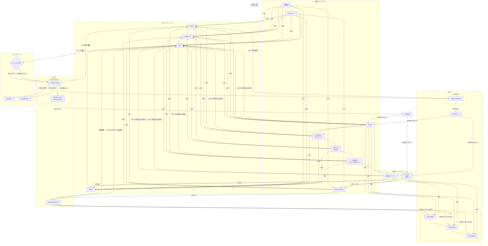
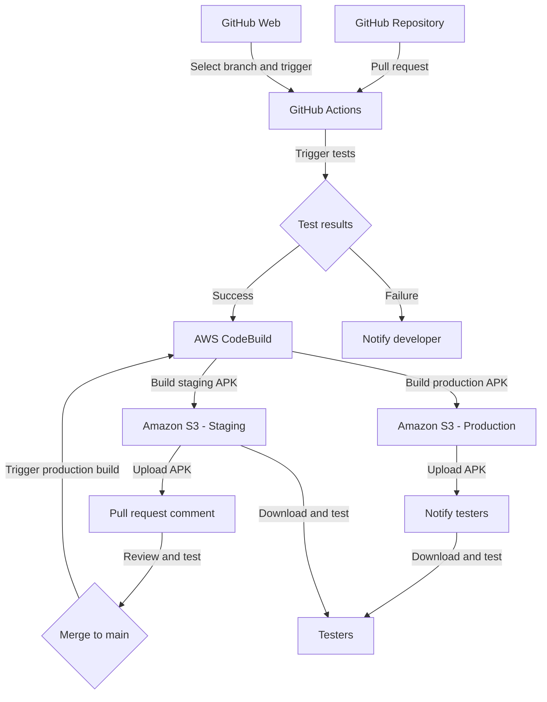
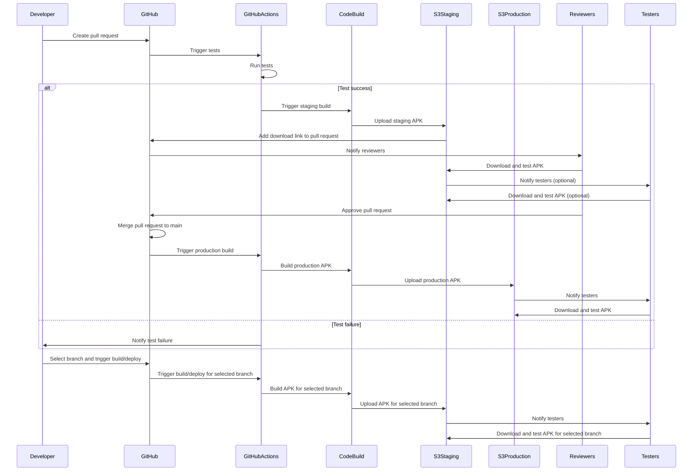
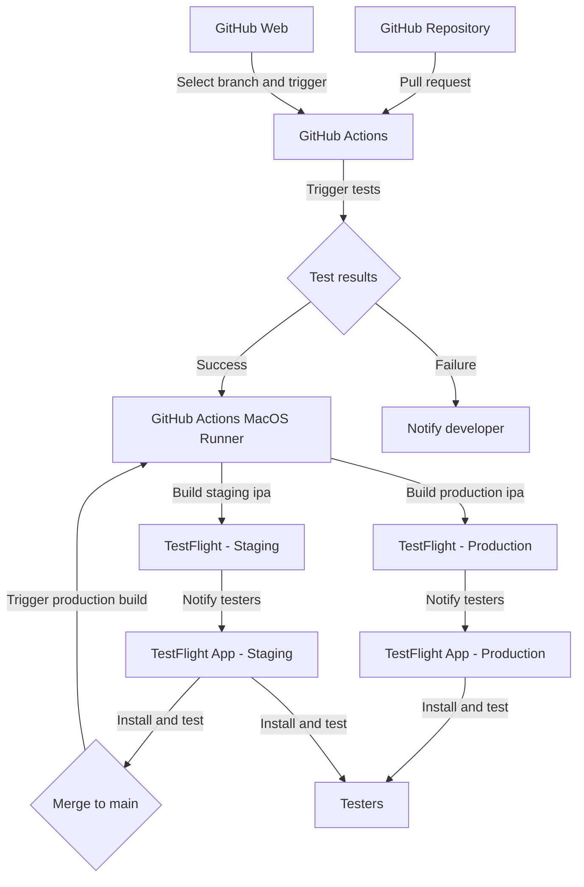
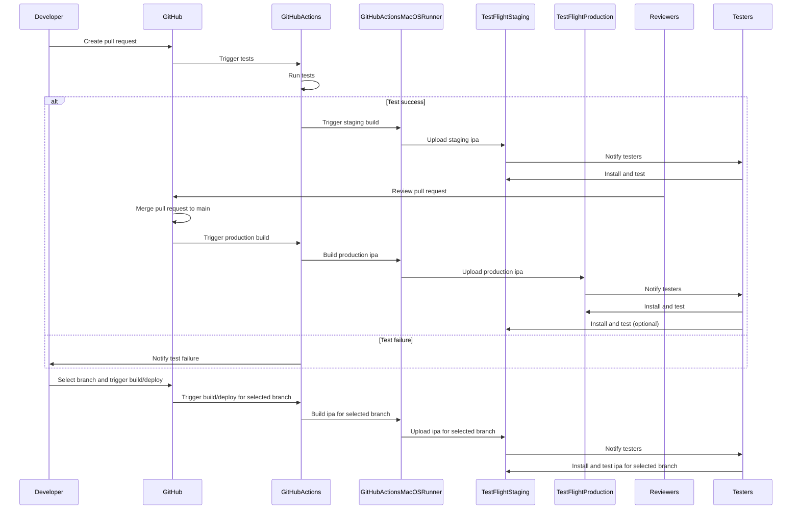

# モバイルアプリの自動ビルドとCI/CDパイプラインの構築

本ドキュメントでは、GitHub上のソースコードを元に、mainブランチへのコミットやプルリクエストをトリガーとして、AWS CodeBuildを用いてAndroidアプリのビルド、あるいはGitHub Actions MacOS Runnerを用いたiOSアプリのビルドを行い、その成果物を社内メンバーに配布、あるいはストアにリリースするためのCI/CDパイプラインの構築方法について説明します。また、GitHub Webでのユーザー入力を通して、指定のブランチでいつでもapkあるいはipaのビルドおよび配布が可能になるようにする方法についても説明します。

## システム全体イメージ



## Androidアプリの自動ビルドとCI/CDパイプラインの構築

## 目的
- コードの品質を維持しつつ、開発プロセスを効率化する
- 環境ごとのビルド設定を容易に切り替えられるようにする
- 自動テストとコードレビューを中心とした効率的なCI/CDプロセスを実現する
- GitHub Webでのユーザー入力を通して、指定のブランチでいつでもapkあるいはipaのビルドおよび配布が可能にする

## パイプラインの概要

1. 開発者がfeatureブランチで作業を行い、プルリクエストを作成する
2. プルリクエストをトリガーに、GitHub Actionsで自動テストとビルドが実行される
3. 自動テストが成功した場合、AWS CodeBuildでステージング環境用またはプロダクション環境用のAPKが生成される
4. ビルドされたAPKは、S3バケットにアップロードされ、プルリクエストにダウンロードリンクが追加される
5. レビュアーは、テスト結果とビルド成果物を確認しながらコードレビューを行う
6. レビューと動作確認が完了したら、プルリクエストをmainブランチにマージする
7. mainブランチへのマージをトリガーに、プロダクション環境用のAPKが生成され、テスターに配布される
8. GitHub Webでのユーザー入力を通して、指定のブランチでいつでもapkあるいはipaのビルドおよび配布が可能になる

## 環境設定

### AWS Systems Manager Parameter Store
- ステージングとプロダクションの環境ごとに、以下のパラメータを設定する
  - APIエンドポイントのURL
  - その他の環境依存の設定値

### GitHub Secrets
- AWS CodeBuildとの連携に必要な認証情報を設定する
  - AWS_ACCESS_KEY_ID
  - AWS_SECRET_ACCESS_KEY
- 環境変数として使用する値を設定する
  - STAGING_API_URL
  - PRODUCTION_API_URL

## ワークフローの設定

### 1. 自動テストの実行
- ユニットテスト、統合テスト、UIテストを実装する
- プルリクエストをトリガーに、GitHub Actionsで自動テストを実行する

```yaml
jobs:
  test:
    runs-on: ubuntu-latest
    steps:
      - uses: actions/checkout@v2

      - name: Set up JDK
        uses: actions/setup-java@v2
        with:
          java-version: '11'
          distribution: 'adopt'

      - name: Run tests
        run: ./gradlew test connectedAndroidTest
```

### 2. ビルドとAPKの生成
- 自動テストが成功した場合、AWS CodeBuildでAPKを生成する
- ステージング環境用とプロダクション環境用のビルドを分ける

```yaml
jobs:
  build:
    needs: test
    if: success()
    runs-on: ubuntu-latest
    steps:
      - uses: actions/checkout@v2

      - name: Build staging APK
        if: github.base_ref == 'develop'
        env:
          API_URL: ${{ secrets.STAGING_API_URL }}
        run: |
          ./gradlew assembleDebug
          aws s3 cp app/build/outputs/apk/debug/app-debug.apk s3://your-bucket/staging/app-debug.apk

      - name: Build production APK
        if: github.base_ref == 'main'
        env:
          API_URL: ${{ secrets.PRODUCTION_API_URL }}
        run: |
          ./gradlew assembleRelease
          aws s3 cp app/build/outputs/apk/release/app-release.apk s3://your-bucket/production/app-release.apk
```

### 3. プルリクエストへのリンク追加
- ビルドされたAPKへのダウンロードリンクをプルリクエストに追加する

```yaml
      - name: Comment on PR
        env:
          PR_NUMBER: ${{ github.event.pull_request.number }}
          GITHUB_TOKEN: ${{ secrets.GITHUB_TOKEN }}
          APK_URL: https://your-bucket.s3.amazonaws.com/staging/app-debug.apk
        run: |
          curl -X POST \
            -H "Authorization: token ${GITHUB_TOKEN}" \
            -d "{\"body\": \"APK is available at: ${APK_URL}\"}" \
            "https://api.github.com/repos/${GITHUB_REPOSITORY}/issues/${PR_NUMBER}/comments"
```

### 4. mainブランチへのマージとリリース
- mainブランチへのマージをトリガーに、プロダクション環境用のAPKを生成する
- 生成されたAPKをテスターに配布する（メールまたはSlackなど）

```yaml
  release:
    if: github.ref == 'refs/heads/main'
    needs: build
    runs-on: ubuntu-latest
    steps:
      - name: Download APK from S3
        run: aws s3 cp s3://your-bucket/production/app-release.apk ./app-release.apk

      - name: Send APK to testers
        run: |
          # テスターへのAPK配布処理を記述する
          # メールまたはSlackなどを使用
```

### 5. GitHub Webからのビルドトリガー

#### 5-1. ワークフローファイルの更新

```yaml
on:
  workflow_dispatch:
    inputs:
      branch:
        description: 'Branch to build and deploy'
        required: true
        default: 'main'

jobs:
  build:
    runs-on: ubuntu-latest

    steps:
      - uses: actions/checkout@v2
        with:
          ref: ${{ github.event.inputs.branch }}

      # ...
```

ここでは、`workflow_dispatch`イベントを使用して、GitHub Webからワークフローを手動で実行できるようにしています。`inputs`セクションで、ビルドとデプロイを行うブランチを指定できるようにしています。

`actions/checkout`アクションの`ref`パラメータに、`${{ github.event.inputs.branch }}`を指定することで、ユーザーが入力したブランチをチェックアウトできます。

#### 5-2. ビルドとデプロイのステップの更新

ビルドとデプロイのステップでは、環境変数やパラメータを使用して、選択されたブランチに基づいて適切なビルド設定を行います。

```yaml
- name: Build Android app
  env:
    BRANCH: ${{ github.event.inputs.branch }}
  run: |
    # ビルドコマンド
    # $BRANCHを使用して、適切なビルド設定を行う

- name: Deploy to AWS S3
  env:
    BRANCH: ${{ github.event.inputs.branch }}
  run: |
    # デプロイコマンド 
    # $BRANCHを使用して、適切なデプロイ先を指定する
```

ここでは、`BRANCH`環境変数を使用して、ユーザーが選択したブランチ名を参照しています。この環境変数を使用して、ビルドとデプロイの設定を適切に行います。

#### 5-3. GitHub Webからのワークフロー実行

1. リポジトリのアクションタブに移動します。
2. 左側のサイドバーから、実行するワークフローを選択します。
3. "Run workflow"ボタンをクリックします。
4. ドロップダウンメニューから、ビルドとデプロイを行うブランチを選択します。
5. "Run workflow"ボタンをクリックして、ワークフローを開始します。

## 注意点
- ビルド設定は、build.gradle.ktsファイル内で環境変数を使用して切り替える
- 機密情報は、GitHub SecretsとAWS Systems Manager Parameter Storeを使用して管理する
- 自動テストを充実させ、手動テストの範囲を最小限に抑える
- プロジェクトの要件に応じて、ワークフローの設定を適宜調整する
- GitHub Webからのトリガーによるビルド・デプロイを適切に設定し、開発チームが柔軟にビルドとデプロイを制御できるようにする

### システム構成図



この構成図では、以下の流れを表現しています：

1. 開発者がプルリクエストを作成すると、GitHub Actionsが自動テストをトリガーします。
2. テストが成功した場合、AWS CodeBuildがステージング環境用とプロダクション環境用のAPKを生成します。
3. 生成されたAPKは、それぞれのAmazon S3バケットにアップロードされます。
4. ステージング環境用のAPKは、プルリクエストにコメントとして追加されます。
5. レビュアーは、プルリクエストのAPKをダウンロードしてレビューとテストを行います。
6. プルリクエストがmainブランチにマージされると、プロダクション環境用のビルドがトリガーされます。
7. プロダクション環境用のAPKが生成され、テスターに通知されます。
8. テスターは、APKをダウンロードしてテストを行います。
9. GitHub Webから、ユーザーが任意のブランチを選択してビルドとデプロイをトリガーできます。

注意点は以下の通りです：

1. テスターは、プロダクション環境用のAPKだけでなく、ステージング環境用のAPKもダウンロードしてテストを行う可能性があります。
2. ステージング環境用のAPKは、プルリクエストにコメントとして追加されるだけでなく、テスターによってダウンロードされテストされる場合があります。
3. GitHub Webからのトリガーにより、ユーザーが任意のブランチでビルドとデプロイを実行できるようになります。

テスターは、開発プロセスの早い段階からアプリのテストに関与することで、潜在的な問題をより早期に発見し、フィードバックを提供することができます。これは、アプリの品質向上と開発サイクルの効率化に役立ちます。

ただし、テスターがステージング環境でのテストに過度に時間を費やすことで、開発プロセスが遅延する可能性があるため、テストの範囲と時期については適切なバランスを取る必要があります。

また、ステージング環境とプロダクション環境でのテスト結果を適切に管理し、問題の追跡とフィードバックの共有を効果的に行うことが重要です。

以上の点を考慮しながら、テスターがステージング環境とプロダクション環境の両方でアプリをテストできる体制を整えることで、より堅牢で効率的な開発プロセスを実現できます。

### シーケンス図



## iOSアプリの自動ビルドとCI/CDパイプラインの構築

本セクションでは、iOSアプリの開発において、TestFlightを活用した自動ビルドと配布の仕組みを実現する方法について説明します。GitHub上のソースコードを元に、mainブランチへのコミットやプルリクエストをトリガーとして、GitHub Actionsを用いてiOSアプリのビルドを行い、その成果物をテスターに配布するCI/CDパイプラインの構築方法を解説します。また、GitHub Webでのユーザー入力を通して、指定のブランチでいつでもipaのビルドおよび配布が可能になるようにする方法についても説明します。

### 目的
- コードの品質を維持しつつ、開発プロセスを効率化する
- 環境ごとのビルド設定を容易に切り替えられるようにする
- 自動テストとコードレビューを中心とした効率的なCI/CDプロセスを実現する
- GitHub Webでのユーザー入力を通して、指定のブランチでいつでもipaのビルドおよび配布が可能にする

### パイプラインの概要

1. 開発者がfeatureブランチで作業を行い、プルリクエストを作成する
2. プルリクエストをトリガーに、GitHub Actionsで自動テストとビルドが実行される
3. 自動テストが成功した場合、GitHub Actionsでステージングおよびプロダクションのビルドジョブでipaファイルが生成される
4. ビルドされたipaファイルは、TestFlightにアップロードされ、テスターに配布される
5. レビュアーは、テスト結果とTestFlightのフィードバックを確認しながらコードレビューを行う
6. レビューと動作確認が完了したら、プルリクエストをmainブランチにマージする
7. mainブランチへのマージをトリガーに、プロダクション環境用のipaファイルが生成され、TestFlightを通じてテスターに配布される
8. GitHub Webでのユーザー入力を通して、指定のブランチでいつでもipaのビルドおよび配布が可能になる

### 環境設定

#### GitHub Secrets
- TestFlightへのアップロードに必要な認証情報を設定する
  - APPLE_APP_SPECIFIC_PASSWORD: App-specific passwordの値
- ステージング/プロダクション環境別の設定値を登録しておく
  - STAGING_API_URL: ステージング環境のAPIエンドポイントURL
  - PRODUCTION_API_URL: 本番環境のAPIエンドポイントURL

#### 証明書とプロビジョニングプロファイルの管理
- iOSアプリのビルドに必要な証明書とプロビジョニングプロファイルをGitHubリポジトリにアップロードし、secretsで暗号化して保存する
  - CERTIFICATES_P12: 証明書ファイルをBase64エンコードした値
  - CERTIFICATES_P12_PASSWORD: 証明書のパスワード
  - PROVISIONING_PROFILE: Provisioning profileファイルをBase64エンコードした値

### ワークフローの設定

#### 1. 自動テストの実行
- ユニットテスト、UIテストを実装する
- プルリクエストをトリガーに、GitHub Actionsで自動テストを実行する

```yaml
jobs:
  test:
    runs-on: macos-latest
    steps:
      - uses: actions/checkout@v2

      - name: Set up Xcode
        uses: maxim-lobanov/setup-xcode@v1
        with:
          xcode-version: latest-stable

      - name: Run tests
        run: |
          xcodebuild test -workspace YourApp.xcworkspace -scheme YourScheme -destination 'platform=iOS Simulator,name=iPhone 12,OS=14.5'
```

#### 2. ビルドジョブの定義
- GitHub Actionsのワークフローファイルに、ステージング用とプロダクション用のビルドジョブを定義する
- 環境変数を使って、APIのエンドポイントURLなどの設定値を切り替える

```yaml
jobs:
  build:
    needs: test
    if: success()
    runs-on: macos-latest
    
    strategy:
      matrix:
        env: [staging, production]
        
    steps:
      - uses: actions/checkout@v2
      
      - name: Set up Xcode
        uses: maxim-lobanov/setup-xcode@v1
        with: 
          xcode-version: latest-stable
          
      - name: Import certificates
        env:
          CERTIFICATES_P12: ${{ secrets.CERTIFICATES_P12 }}
          CERTIFICATES_P12_PASSWORD: ${{ secrets.CERTIFICATES_P12_PASSWORD }}
          KEYCHAIN_PASSWORD: ${{ secrets.KEYCHAIN_PASSWORD }}
        run: |
          echo $CERTIFICATES_P12 | base64 --decode > certificates.p12
          security create-keychain -p $KEYCHAIN_PASSWORD build.keychain
          security default-keychain -s build.keychain
          security unlock-keychain -p $KEYCHAIN_PASSWORD build.keychain
          security import certificates.p12 -k build.keychain -P $CERTIFICATES_P12_PASSWORD -T /usr/bin/codesign
          security set-key-partition-list -S apple-tool:,apple: -s -k $KEYCHAIN_PASSWORD build.keychain
      
      - name: Import provisioning profile
        env:
          PROVISIONING_PROFILE: ${{ secrets.PROVISIONING_PROFILE }}
        run: |
          mkdir -p ~/Library/MobileDevice/Provisioning\ Profiles
          echo $PROVISIONING_PROFILE | base64 --decode > ~/Library/MobileDevice/Provisioning\ Profiles/profile.mobileprovision
      
      - name: Build ipa for ${{ matrix.env }}
        env:
          API_URL: ${{ secrets[format('{0}_API_URL', matrix.env)] }}
        run: |
          xcodebuild -workspace YourApp.xcworkspace -scheme YourScheme -sdk iphoneos -configuration Release archive -archivePath $PWD/build/YourApp.xcarchive
          xcodebuild -exportArchive -archivePath $PWD/build/YourApp.xcarchive -exportOptionsPlist exportOptions.plist -exportPath $PWD/build
      
      - name: Upload ipa to TestFlight
        env:
          APPLE_APP_SPECIFIC_PASSWORD: ${{ secrets.APPLE_APP_SPECIFIC_PASSWORD }}
        run: |  
          xcrun altool --upload-app -t ios -f build/YourApp.ipa -u "appleID@example.com" -p "$APPLE_APP_SPECIFIC_PASSWORD" --verbose
          
  release:
    if: github.ref == 'refs/heads/main'
    needs: build
    runs-on: macos-latest
    
    steps:
      - uses: actions/checkout@v2
      
      - name: Download ipa artifact  
        uses: actions/download-artifact@v2
        with:
          name: YourApp-production
      
      - name: Upload ipa to TestFlight
        env:
          APPLE_APP_SPECIFIC_PASSWORD: ${{ secrets.APPLE_APP_SPECIFIC_PASSWORD }}
        run: |
          xcrun altool --upload-app -t ios -f YourApp.ipa -u "appleID@example.com" -p "$APPLE_APP_SPECIFIC_PASSWORD" --verbose
```

以下、ポイントを説明します。

- `strategy.matrix`を使って、ステージングとプロダクションの2つのビルドジョブを動的に生成しています。
- `Import certificates`と`Import provisioning profile`のステップで、GitHub secretsに保存した証明書とプロビジョニングプロファイルを復号化し、Xcodeビルドで使用できるように設定しています。
- `Build ipa for ${{ matrix.env }}`のステップで、環境変数`API_URL`を使ってAPIのエンドポイントURLを切り替えながら、ipaファイルを生成しています。
- `Upload ipa to TestFlight`のステップで、App-specific passwordを使ってipaファイルをTestFlightにアップロードしています。
- `release`ジョブは、mainブランチへのマージをトリガーに実行され、プロダクション用のipaファイルをTestFlightにアップロードします。

#### 3. GitHub Webからのビルドトリガー

##### 3-1. ワークフローファイルの更新

```yaml
on:
  workflow_dispatch:
    inputs:
      branch:
        description: 'Branch to build and deploy'
        required: true
        default: 'main'

jobs:
  build:
    runs-on: macos-latest

    steps:
      - uses: actions/checkout@v2
        with:
          ref: ${{ github.event.inputs.branch }}

      # ...
```

ここでは、`workflow_dispatch`イベントを使用して、GitHub Webからワークフローを手動で実行できるようにしています。`inputs`セクションで、ビルドとデプロイを行うブランチを指定できるようにしています。

`actions/checkout`アクションの`ref`パラメータに、`${{ github.event.inputs.branch }}`を指定することで、ユーザーが入力したブランチをチェックアウトできます。

##### 3-2. ビルドとデプロイのステップの更新

ビルドとデプロイのステップでは、環境変数やパラメータを使用して、選択されたブランチに基づいて適切なビルド設定を行います。

```yaml
- name: Build iOS app
  env:
    BRANCH: ${{ github.event.inputs.branch }}
  run: |
    # ビルドコマンド
    # $BRANCHを使用して、適切なビルド設定を行う

- name: Deploy to TestFlight
  env:  
    BRANCH: ${{ github.event.inputs.branch }}
  run: |
    # デプロイコマンド
    # $BRANCHを使用して、適切なデプロイ設定を行う
```

ここでは、`BRANCH`環境変数を使用して、ユーザーが選択したブランチ名を参照しています。この環境変数を使用して、ビルドとデプロイの設定を適切に行います。

##### 3-3. GitHub Webからのワークフロー実行

1. リポジトリのアクションタブに移動します。
2. 左側のサイドバーから、実行するワークフローを選択します。
3. "Run workflow"ボタンをクリックします。
4. ドロップダウンメニューから、ビルドとデプロイを行うブランチを選択します。
5. "Run workflow"ボタンをクリックして、ワークフローを開始します。

以上の手順により、GitHub Webからユーザーが任意のブランチを指定して、iOSアプリのビルドとデプロイを実行できるようになります。
これにより、開発チームはGitHub Web上の操作だけで、柔軟にビルドとデプロイを制御できるようになり、さらなる効率化が図れるでしょう。

### 注意点
- ビルド設定は、Xcodeのビルド設定ファイルや環境変数を使用して切り替える
- 機密情報は、GitHub Secretsを使用して管理する
- 自動テストを充実させ、手動テストの範囲を最小限に抑える
- プロジェクトの要件に応じて、ワークフローの設定を適宜調整する
- GitHub Webからのトリガーによるビルド・デプロイを適切に設定し、開発チームが柔軟にビルドとデプロイを制御できるようにする

以上が、GitHub Actionsを使ったiOSアプリのCI/CDパイプラインの構築方法です。
TestFlightを活用することで、ベータ版のアプリを効率的にテスターに配布し、フィードバックを収集することができます。
また、ビルドパラメータの切り替えとCI/CDへの考慮を取り入れることで、効率的で品質の高い開発プロセスを実現することができます。

### システム構成図



このシステム構成図は、iOSアプリのCI/CDパイプラインにおけるTestFlightの役割を示しています。

1. 開発者がプルリクエストを作成すると、GitHub Actionsが自動テストをトリガーします。
2. テストが成功した場合、GitHub Actions MacOS Runnerがステージング環境用とプロダクション環境用のipaファイルを生成します。
3. 生成されたipaファイルは、GitHub Actions MacOS Runnerが直接それぞれのTestFlight環境にアップロードします。
4. TestFlightへのアップロードが完了すると、テスターに通知が送信されます。
5. テスターは、TestFlightアプリを使ってベータ版のアプリをインストールし、テストを行います。
6. ステージング環境でのテストが完了し、プルリクエストがmainブランチにマージされると、プロダクション環境用のビルドがトリガーされます。
7. プロダクション環境用のipaファイルがTestFlightにアップロードされ、テスターに配布されます。
8. GitHub Webから、ユーザーが任意のブランチを選択してビルドとデプロイをトリガーできます。

### シーケンス図



このシーケンス図は、iOSアプリのCI/CDパイプラインにおけるTestFlightを使った自動ビルドと配布の流れを表しています。

1. 開発者がプルリクエストを作成します。
2. GitHub Actionsが自動テストを実行します。
3. テストが成功した場合：
   - GitHub Actions MacOS Runnerがステージング環境用のipaファイルを生成し、TestFlightにアップロードします。
   - TestFlightがテスターに通知を送信し、テスターがアプリをインストールしてテストを行います。
   - レビュアーがプルリクエストをレビューします。
   - プルリクエストがmainブランチにマージされます。
   - プロダクション環境用のビルドがトリガーされ、ipaファイルが生成されてTestFlightにアップロードされます。
   - TestFlightがテスターに通知を送信し、テスターがアプリをインストールしてテストを行います。
4. テストが失敗した場合：
   - 開発者にテスト失敗の通知が送信されます。
5. GitHub Webから、開発者が任意のブランチを選択してビルドとデプロイをトリガーします。
   - GitHub Actionsが選択されたブランチに対してビルドとデプロイを実行します。
   - GitHub Actions MacOS Runnerが選択されたブランチのipaファイルを生成し、TestFlightにアップロードします。
   - TestFlightがテスターに通知を送信し、テスターが選択されたブランチのアプリをインストールしてテストを行います。

以上の内容を踏まえ、iOSアプリの開発においてもAndroidアプリと同様に、自動テストの実行と環境ごとのビルドパラメータの切り替えを考慮したCI/CDパイプラインを構築することで、効率的かつ品質の高い開発プロセスを実現することができます。
さらに、GitHub Webからのトリガーによるビルドとデプロイの機能を追加することで、開発チームはより柔軟にビルドとデプロイを制御できるようになり、さらなる効率化が図れるでしょう。

## ビルド完了時等の通知について

以下は、Slackを使用してビルド完了時に通知を送信する方法についての詳細です。iOSアプリについてはTestFlightにアップロードされた際に、テスターへの通知をTestFlightが実行してくれますが、テスター以外の人たちにもビルドとデプロイの完了を通知する必要はあるでしょう、ということで両方のケースについて説明を加えておきます。

## Androidの場合

### 1. SlackのIncoming Webhookの設定
- Slackアプリを作成し、通知を送信するチャンネルにアプリをインストールします。
- アプリの設定ページで、Incoming Webhookを有効にし、Webhook URLを取得します。

### 2. AWS Systems Manager Parameter Storeへの認証情報の保存
- AWSマネジメントコンソールで、Systems Manager サービスを開きます。
- 「Parameter Store」セクションで、以下のパラメータを作成します。
  - `/your-app/slack/webhook-url`: SlackのIncoming Webhook URL（SecureString型）

### 3. CodeBuildプロジェクトの環境変数の設定
- CodeBuildプロジェクトの設定で、以下の環境変数を追加します。
  - `SLACK_WEBHOOK_URL`: `/your-app/slack/webhook-url`のパラメータ値

### 4. ビルドスペックファイル（buildspec.yml）の更新
- `post_build`フェーズに、以下のようなSlack通知コマンドを追加します。

```yaml
post_build:
  commands:
    - echo Build completed on `date`
    - |
      curl -X POST -H 'Content-type: application/json' --data '{"text":"Android app build completed successfully.\nDownload URL: <S3_DOWNLOAD_URL>"}' $SLACK_WEBHOOK_URL
artifacts:
  files:
    - '**/build/outputs/**/*.apk'
  discard-paths: yes
```

ここでは、`curl`コマンドを使用して、SlackのIncoming Webhook URLにJSONペイロードを送信し、通知を送信しています。`<S3_DOWNLOAD_URL>`は、実際のアプリのダウンロードURLに置き換えてください。

### 5. GitHub Actionsワークフローの更新
- CodeBuildプロジェクトを開始する際に、必要な環境変数を渡すように更新します。

```yaml
- name: Start CodeBuild project
  run: |
    aws codebuild start-build --project-name <YOUR_CODEBUILD_PROJECT_NAME> --source-version ${{ github.event.inputs.branch || github.ref }} --environment-variables-override name=SLACK_WEBHOOK_URL,value=${{ secrets.SLACK_WEBHOOK_URL }},type=PLAINTEXT
```

ここでは、GitHub Secretsを使用して、SlackのWebhook URLをCodeBuildプロジェクトに渡しています。

## iOSアプリの場合

### 1. SlackのIncoming Webhookの設定
- Slackアプリを作成し、通知を送信するチャンネルにアプリをインストールします。
- アプリの設定ページで、Incoming Webhookを有効にし、Webhook URLを取得します。

### 2. GitHub Secretsの設定
- リポジトリの「Settings」→「Secrets」で、以下のシークレットを設定します。
  - `SLACK_WEBHOOK_URL`: SlackのIncoming Webhook URL

### 3. ワークフローファイルの更新
- iOS用のワークフローファイルに、以下のようなSlack通知ステップを追加します。

```yaml
jobs:
  build:
    runs-on: macos-latest

    steps:
      # ...

      - name: Send Slack notification
        if: success()
        env:
          SLACK_WEBHOOK_URL: ${{ secrets.SLACK_WEBHOOK_URL }}
        run: |
          curl -X POST -H 'Content-type: application/json' --data '{"text":"iOS app build completed successfully and uploaded to TestFlight."}' $SLACK_WEBHOOK_URL
```

ここでは、`if: success()`を使って、ビルドとデプロイが成功した場合にのみSlack通知ステップを実行するようにします。`curl`コマンドを使用して、SlackのIncoming Webhook URLにJSONペイロードを送信し、通知を送信します。

以上の手順により、AndroidとiOSアプリのビルドが完了した際に、Slackでビルドとデプロイの完了を通知することができます。
テスター以外の関係者にも、プロセスの進捗状況を効果的に伝えることができるでしょう。

また、Slackを使用することで、ビルド完了通知だけでなく、ビルドの成功/失敗の状況や、アプリのダウンロードURLなどの追加情報を含めることができます。
これにより、関係者がアプリのステータスを常に把握し、迅速にフィードバックを提供できるようになります。

セキュリティ上の理由から、Slack Webhookの認証情報をGitHub Secretsに保存し、ビルドスクリプトやGitHub Actionsワークフローから参照するようにしています。
これにより、認証情報をソースコード内に直接記述することを避けることができます。
