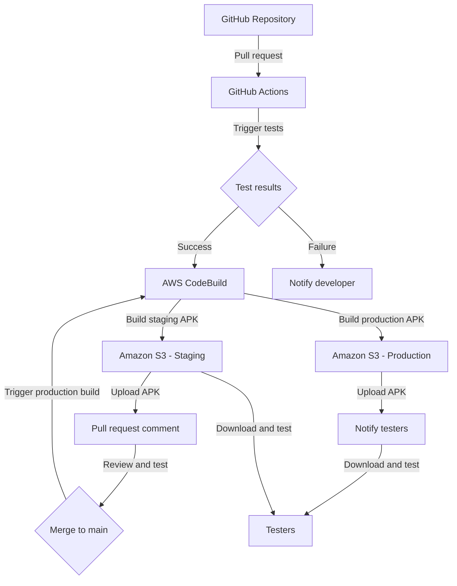
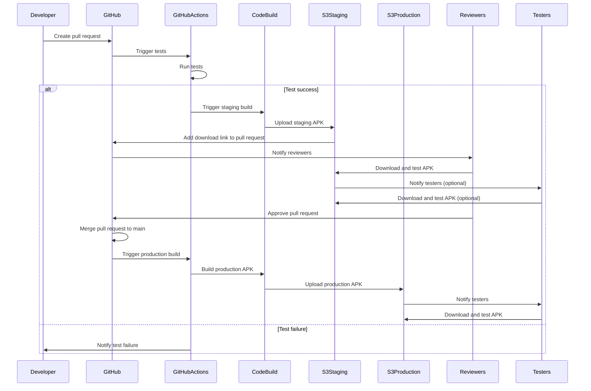
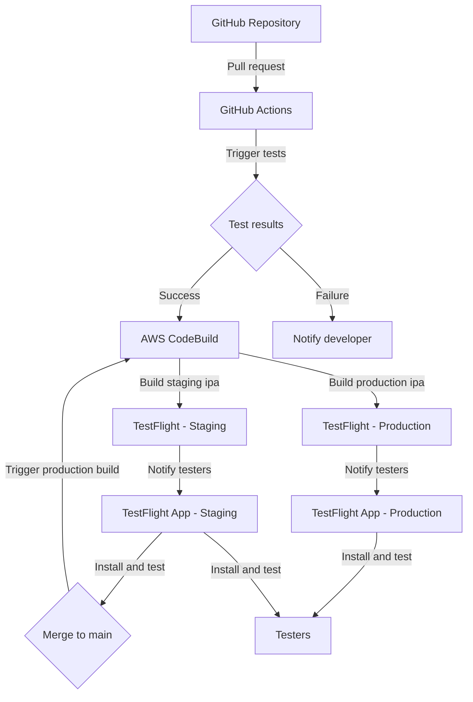
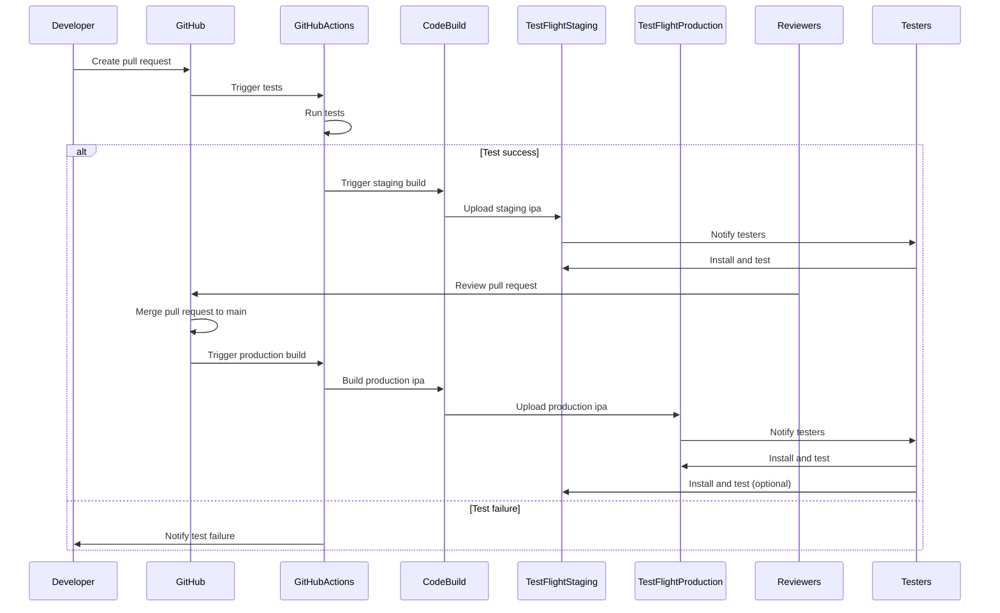

# Androidアプリの自動ビルドとCI/CDパイプラインの構築

本ドキュメントでは、GitHub上のソースコードを元に、mainブランチへのコミットやプルリクエストをトリガーとして、AWS CodeBuildを用いてAndroidアプリのビルドを行い、その成果物を社内メンバーに配布するCI/CDパイプラインの構築方法について説明します。

## 目的
- コードの品質を維持しつつ、開発プロセスを効率化する
- 環境ごとのビルド設定を容易に切り替えられるようにする
- 自動テストとコードレビューを中心とした効率的なCI/CDプロセスを実現する

## パイプラインの概要

1. 開発者がfeatureブランチで作業を行い、プルリクエストを作成する
2. プルリクエストをトリガーに、GitHub Actionsで自動テストとビルドが実行される
3. 自動テストが成功した場合、AWS CodeBuildでステージング環境用またはプロダクション環境用のAPKが生成される
4. ビルドされたAPKは、S3バケットにアップロードされ、プルリクエストにダウンロードリンクが追加される
5. レビュアーは、テスト結果とビルド成果物を確認しながらコードレビューを行う
6. レビューと動作確認が完了したら、プルリクエストをmainブランチにマージする
7. mainブランチへのマージをトリガーに、プロダクション環境用のAPKが生成され、テスターに配布される

## 環境設定

### AWS Systems Manager Parameter Store
- ステージングとプロダクションの環境ごとに、以下のパラメータを設定する
  - APIエンドポイントのURL
  - その他の環境依存の設定値

### GitHub Secrets
- AWS CodeBuildとの連携に必要な認証情報を設定する
  - AWS_ACCESS_KEY_ID
  - AWS_SECRET_ACCESS_KEY
- 環境変数として使用する値を設定する
  - STAGING_API_URL
  - PRODUCTION_API_URL

## ワークフローの設定

### 1. 自動テストの実行
- ユニットテスト、統合テスト、UIテストを実装する
- プルリクエストをトリガーに、GitHub Actionsで自動テストを実行する

```yaml
jobs:
  test:
    runs-on: ubuntu-latest
    steps:
      - uses: actions/checkout@v2

      - name: Set up JDK
        uses: actions/setup-java@v2
        with:
          java-version: '11'
          distribution: 'adopt'

      - name: Run tests
        run: ./gradlew test connectedAndroidTest
```

### 2. ビルドとAPKの生成
- 自動テストが成功した場合、AWS CodeBuildでAPKを生成する
- ステージング環境用とプロダクション環境用のビルドを分ける

```yaml
jobs:
  build:
    needs: test
    if: success()
    runs-on: ubuntu-latest
    steps:
      - uses: actions/checkout@v2

      - name: Build staging APK
        if: github.base_ref == 'develop'
        env:
          API_URL: ${{ secrets.STAGING_API_URL }}
        run: |
          ./gradlew assembleDebug
          aws s3 cp app/build/outputs/apk/debug/app-debug.apk s3://your-bucket/staging/app-debug.apk

      - name: Build production APK
        if: github.base_ref == 'main'
        env:
          API_URL: ${{ secrets.PRODUCTION_API_URL }}
        run: |
          ./gradlew assembleRelease
          aws s3 cp app/build/outputs/apk/release/app-release.apk s3://your-bucket/production/app-release.apk
```

### 3. プルリクエストへのリンク追加
- ビルドされたAPKへのダウンロードリンクをプルリクエストに追加する

```yaml
      - name: Comment on PR
        env:
          PR_NUMBER: ${{ github.event.pull_request.number }}
          GITHUB_TOKEN: ${{ secrets.GITHUB_TOKEN }}
          APK_URL: https://your-bucket.s3.amazonaws.com/staging/app-debug.apk
        run: |
          curl -X POST \
            -H "Authorization: token ${GITHUB_TOKEN}" \
            -d "{\"body\": \"APK is available at: ${APK_URL}\"}" \
            "https://api.github.com/repos/${GITHUB_REPOSITORY}/issues/${PR_NUMBER}/comments"
```

### 4. mainブランチへのマージとリリース
- mainブランチへのマージをトリガーに、プロダクション環境用のAPKを生成する
- 生成されたAPKをテスターに配布する（メールまたはSlackなど）

```yaml
  release:
    if: github.ref == 'refs/heads/main'
    needs: build
    runs-on: ubuntu-latest
    steps:
      - name: Download APK from S3
        run: aws s3 cp s3://your-bucket/production/app-release.apk ./app-release.apk

      - name: Send APK to testers
        run: |
          # テスターへのAPK配布処理を記述する
          # メールまたはSlackなどを使用
```

## 注意点
- ビルド設定は、build.gradle.ktsファイル内で環境変数を使用して切り替える
- 機密情報は、GitHub SecretsとAWS Systems Manager Parameter Storeを使用して管理する
- 自動テストを充実させ、手動テストの範囲を最小限に抑える
- プロジェクトの要件に応じて、ワークフローの設定を適宜調整する

### システム構成図



この構成図では、以下の流れを表現しています：

1. 開発者がプルリクエストを作成すると、GitHub Actionsが自動テストをトリガーします。
2. テストが成功した場合、AWS CodeBuildがステージング環境用とプロダクション環境用のAPKを生成します。
3. 生成されたAPKは、それぞれのAmazon S3バケットにアップロードされます。
4. ステージング環境用のAPKは、プルリクエストにコメントとして追加されます。
5. レビュアーは、プルリクエストのAPKをダウンロードしてレビューとテストを行います。
6. プルリクエストがmainブランチにマージされると、プロダクション環境用のビルドがトリガーされます。
7. プロダクション環境用のAPKが生成され、テスターに通知されます。
8. テスターは、APKをダウンロードしてテストを行います。

注意点は以下の通りです：

1. テスターは、プロダクション環境用のAPKだけでなく、ステージング環境用のAPKもダウンロードしてテストを行う可能性があります。 
2. ステージング環境用のAPKは、プルリクエストにコメントとして追加されるだけでなく、テスターによってダウンロードされテストされる場合があります。 

テスターは、開発プロセスの早い段階からアプリのテストに関与することで、潜在的な問題をより早期に発見し、フィードバックを提供することができます。これは、アプリの品質向上と開発サイクルの効率化に役立ちます。

ただし、テスターがステージング環境でのテストに過度に時間を費やすことで、開発プロセスが遅延する可能性があるため、テストの範囲と時期については適切なバランスを取る必要があります。

また、ステージング環境とプロダクション環境でのテスト結果を適切に管理し、問題の追跡とフィードバックの共有を効果的に行うことが重要です。

以上の点を考慮しながら、テスターがステージング環境とプロダクション環境の両方でアプリをテストできる体制を整えることで、より堅牢で効率的な開発プロセスを実現できます。

### シーケンス図




## iOSアプリの自動ビルドとCI/CDパイプラインの構築

本セクションでは、iOSアプリの開発において、TestFlightを活用した自動ビルドと配布の仕組みを実現する方法について説明します。GitHub上のソースコードを元に、mainブランチへのコミットやプルリクエストをトリガーとして、AWS CodeBuildを用いてiOSアプリのビルドを行い、その成果物をテスターに配布するCI/CDパイプラインの構築方法を解説します。

### 目的
- コードの品質を維持しつつ、開発プロセスを効率化する
- 環境ごとのビルド設定を容易に切り替えられるようにする
- 自動テストとコードレビューを中心とした効率的なCI/CDプロセスを実現する

### パイプラインの概要

1. 開発者がfeatureブランチで作業を行い、プルリクエストを作成する
2. プルリクエストをトリガーに、GitHub Actionsで自動テストとビルドが実行される
3. 自動テストが成功した場合、AWS CodeBuildでステージング環境用またはプロダクション環境用のipaファイルが生成される
4. ビルドされたipaファイルは、TestFlightにアップロードされ、テスターに配布される
5. レビュアーは、テスト結果とTestFlightのフィードバックを確認しながらコードレビューを行う
6. レビューと動作確認が完了したら、プルリクエストをmainブランチにマージする
7. mainブランチへのマージをトリガーに、プロダクション環境用のipaファイルが生成され、TestFlightを通じてテスターに配布される

### 環境設定

#### AWS Systems Manager Parameter Store
- ステージングとプロダクションの環境ごとに、以下のパラメータを設定する
  - APIエンドポイントのURL
  - その他の環境依存の設定値

#### GitHub Secrets
- AWS CodeBuildとの連携に必要な認証情報を設定する
  - AWS_ACCESS_KEY_ID
  - AWS_SECRET_ACCESS_KEY
- 環境変数として使用する値を設定する
  - STAGING_API_URL
  - PRODUCTION_API_URL
- TestFlightへのアップロードに必要な認証情報を設定する
  - APPLE_USERNAME
  - APPLE_APP_SPECIFIC_PASSWORD

#### 証明書とプロビジョニングプロファイルの管理
- iOSアプリのビルドに必要な証明書とプロビジョニングプロファイルをAWS Systems Manager Parameter Storeに保存する
- CodeBuildプロジェクトからこれらのファイルを取得できるようにする

### ワークフローの設定

#### 1. 自動テストの実行
- ユニットテスト、UIテストを実装する
- プルリクエストをトリガーに、GitHub Actionsで自動テストを実行する

```yaml
jobs:
  test:
    runs-on: macos-latest
    steps:
      - uses: actions/checkout@v2

      - name: Set up Xcode
        uses: maxim-lobanov/setup-xcode@v1
        with:
          xcode-version: latest-stable

      - name: Run tests
        run: |
          xcodebuild test -workspace YourApp.xcworkspace -scheme YourScheme -destination 'platform=iOS Simulator,name=iPhone 12,OS=14.5'
```

#### 2. ビルドとipaファイルの生成
- 自動テストが成功した場合、AWS CodeBuildでipaファイルを生成する
- ステージング環境用とプロダクション環境用のビルドを分ける
- 必要な証明書とプロビジョニングプロファイルをParameter Storeから取得する

```yaml
jobs:
  build:
    needs: test
    if: success()
    runs-on: ubuntu-latest
    steps:
      - uses: actions/checkout@v2

      - name: Download certificates and profiles
        run: |
          aws ssm get-parameter --name "/your/certificate/path" --with-decryption --output text --query Parameter.Value > certificate.p12
          aws ssm get-parameter --name "/your/profile/path" --output text --query Parameter.Value > profile.mobileprovision

      - name: Build staging ipa
        if: github.base_ref == 'develop'
        env:
          API_URL: ${{ secrets.STAGING_API_URL }}
        run: |
          aws codebuild start-build --project-name your-staging-project --environment-variables-override name=CERTIFICATE,value=certificate.p12,type=PLAINTEXT name=PROFILE,value=profile.mobileprovision,type=PLAINTEXT

      - name: Build production ipa
        if: github.base_ref == 'main'
        env:
          API_URL: ${{ secrets.PRODUCTION_API_URL }}
        run: |
          aws codebuild start-build --project-name your-production-project --environment-variables-override name=CERTIFICATE,value=certificate.p12,type=PLAINTEXT name=PROFILE,value=profile.mobileprovision,type=PLAINTEXT
```

#### 3. TestFlightへのアップロード
- ビルドされたipaファイルをTestFlightにアップロードする
- テスターに通知を送信する

```yaml
      - name: Upload to TestFlight
        env:
          APPLE_USERNAME: ${{ secrets.APPLE_USERNAME }}
          APPLE_APP_SPECIFIC_PASSWORD: ${{ secrets.APPLE_APP_SPECIFIC_PASSWORD }}
        run: |
          altool --upload-app -f YourApp.ipa -u $APPLE_USERNAME -p $APPLE_APP_SPECIFIC_PASSWORD
```

#### 4. mainブランチへのマージとリリース
- mainブランチへのマージをトリガーに、プロダクション環境用のipaファイルを生成する
- 生成されたipaファイルをTestFlightにアップロードし、テスターに配布する

```yaml
  release:
    if: github.ref == 'refs/heads/main'
    needs: build
    runs-on: ubuntu-latest
    steps:
      - name: Download ipa from S3
        run: aws s3 cp s3://your-bucket/production/YourApp.ipa ./YourApp.ipa

      - name: Upload to TestFlight
        env:
          APPLE_USERNAME: ${{ secrets.APPLE_USERNAME }}
          APPLE_APP_SPECIFIC_PASSWORD: ${{ secrets.APPLE_APP_SPECIFIC_PASSWORD }}
        run: |
          altool --upload-app -f YourApp.ipa -u $APPLE_USERNAME -p $APPLE_APP_SPECIFIC_PASSWORD
```

### 注意点
- ビルド設定は、Xcodeのビルド設定ファイルや環境変数を使用して切り替える
- 機密情報は、GitHub SecretsとAWS Systems Manager Parameter Storeを使用して管理する
- 自動テストを充実させ、手動テストの範囲を最小限に抑える
- プロジェクトの要件に応じて、ワークフローの設定を適宜調整する

以上が、iOSアプリの自動ビルドとCI/CDパイプラインの構築方法です。
TestFlightを活用することで、ベータ版のアプリを効率的にテスターに配布し、フィードバックを収集することができます。
また、ビルドパラメータの切り替えとCI/CDへの考慮を取り入れることで、
効率的で品質の高い開発プロセスを実現することができます。

### システム構成図



このシステム構成図は、iOSアプリのCI/CDパイプラインにおけるTestFlightの役割を示しています。

1. 開発者がプルリクエストを作成すると、GitHub Actionsが自動テストをトリガーします。
2. テストが成功した場合、AWS CodeBuildがステージング環境用とプロダクション環境用のipaファイルを生成します。
3. 生成されたipaファイルは、それぞれのTestFlight環境にアップロードされます。
4. TestFlightへのアップロードが完了すると、テスターに通知が送信されます。
5. テスターは、TestFlightアプリを使ってベータ版のアプリをインストールし、テストを行います。
6. ステージング環境でのテストが完了し、プルリクエストがmainブランチにマージされると、プロダクション環境用のビルドがトリガーされます。
7. プロダクション環境用のipaファイルがTestFlightにアップロードされ、テスターに配布されます。

### シーケンス図



このシーケンス図は、iOSアプリのCI/CDパイプラインにおけるTestFlightを使った自動ビルドと配布の流れを表しています。

1. 開発者がプルリクエストを作成します。
2. GitHub Actionsが自動テストを実行します。
3. テストが成功した場合：
   - CodeBuildがステージング環境用のipaファイルを生成し、TestFlightにアップロードします。
   - TestFlightがテスターに通知を送信し、テスターがアプリをインストールしてテストを行います。
   - レビュアーがプルリクエストをレビューします。
   - プルリクエストがmainブランチにマージされます。
   - プロダクション環境用のビルドがトリガーされ、ipaファイルが生成されてTestFlightにアップロードされます。
   - TestFlightがテスターに通知を送信し、テスターがアプリをインストールしてテストを行います。
4. テストが失敗した場合：
   - 開発者にテスト失敗の通知が送信されます。

以上の内容を踏まえ、iOSアプリの開発においてもAndroidアプリと同様に、自動テストの実行と環境ごとのビルドパラメータの切り替えを考慮したCI/CDパイプラインを構築することで、効率的かつ品質の高い開発プロセスを実現することができます。

## ビルドされたアプリケーションがダウンロード可能になったタイミングでのメール通知について

以下、メールを使用してビルド完了時に通知を送信する方法についての詳細です。

### 1. Amazon Simple Email Service (SES) の設定
- AWSマネジメントコンソールにログインし、SESサービスを開きます。
- 「Email Addresses」セクションで、通知メールの送信元アドレスを検証します。
- 「SMTP Settings」セクションで、SMTPユーザー名とパスワードを取得します。

### 2. AWS Systems Manager Parameter Storeへの認証情報の保存
- AWSマネジメントコンソールで、Systems Manager サービスを開きます。
- 「Parameter Store」セクションで、以下のパラメータを作成します。
  - `/your-app/ses/smtp-username`: SESのSMTPユーザー名
  - `/your-app/ses/smtp-password`: SESのSMTPパスワード（SecureString型）

### 3. CodeBuildプロジェクトの環境変数の設定
- CodeBuildプロジェクトの設定で、以下の環境変数を追加します。
  - `SES_SMTP_USERNAME`: `/your-app/ses/smtp-username`のパラメータ値
  - `SES_SMTP_PASSWORD`: `/your-app/ses/smtp-password`のパラメータ値
  - `NOTIFICATION_EMAIL`: 通知メールの送信先アドレス

### 4. ビルドスペックファイル（buildspec.yml）の更新
- `post_build`フェーズに、以下のようなメール送信コマンドを追加します。

```yaml
post_build:
  commands:
    - echo Build completed on `date`
    - |
      cat << EOM > notification.txt
      Subject: New app build available
      
      A new build of the app is now available for download:
      
      Download URL: <S3_DOWNLOAD_URL> 
      
      Please test the app and provide feedback.
      EOM
    - >
      curl --ssl-reqd 
      --url 'smtps://email-smtp.us-west-2.amazonaws.com:465' 
      --user "$SES_SMTP_USERNAME:$SES_SMTP_PASSWORD" 
      --mail-from 'your-verified-email@example.com' 
      --mail-rcpt "$NOTIFICATION_EMAIL" 
      --upload-file notification.txt
artifacts:
  files:
    - '**/build/outputs/**/*.apk'
  discard-paths: yes

```

ここでは、以下の手順でメールを送信しています。
1. `notification.txt`ファイルを作成し、メールの件名と本文を書き込みます。`<S3_DOWNLOAD_URL>`は、実際のアプリのダウンロードURLに置き換えてください。
2. `curl`コマンドを使用して、SESのSMTPエンドポイントにメールを送信します。
   - `--user`オプションで、SESのSMTPユーザー名とパスワードを指定します。
   - `--mail-from`オプションで、検証済みの送信元メールアドレスを指定します。
   - `--mail-rcpt`オプションで、通知メールの送信先アドレスを指定します。
   - `--upload-file`オプションで、メールの内容が書かれたファイルを指定します。

### 5. GitHub Actionsワークフローの更新
- CodeBuildプロジェクトを開始する際に、必要な環境変数を渡すように更新します。

```yaml
- name: Start CodeBuild project
  run: |
    aws codebuild start-build --project-name <YOUR_CODEBUILD_PROJECT_NAME> --source-version ${{ github.event.inputs.branch || github.ref }} --environment-variables-override name=SES_SMTP_USERNAME,value=${{ secrets.SES_SMTP_USERNAME }},type=PLAINTEXT name=SES_SMTP_PASSWORD,value=${{ secrets.SES_SMTP_PASSWORD }},type=PLAINTEXT name=NOTIFICATION_EMAIL,value=${{ secrets.NOTIFICATION_EMAIL }},type=PLAINTEXT
```

ここでは、GitHub Secretsを使用して、SESの認証情報と通知メールの送信先アドレスをCodeBuildプロジェクトに渡しています。

以上の手順により、ビルドが完了した際に、Amazon SESを使用してメールで通知を送信することができます。メールには、アプリのダウンロードURLを含めることで、テスターがすぐにアプリをダウンロードしてテストを開始できるようになります。

セキュリティ上の理由から、SESの認証情報をGitHub Secretsに保存し、CodeBuildプロジェクトの環境変数として渡すことで、認証情報をビルドスペックファイルに直接記述することを避けています。

また、SESを使用するには、AWSアカウントでSESサービスを設定し、送信元メールアドレスを検証する必要があります。

この方法により、SlackやMicrosoft Teamsなどのチャットツールを使用できない場合でも、メールを介して効果的にビルド完了の通知を送信し、アプリのテストと配布を円滑に進めることができます。

### 6. 補足

パラメータの構成内容について、より詳しく説明します。

AWS Systems Manager Parameter Storeは、設定データや機密データを管理するためのサービスです。パラメータ名は、階層的な構造を持つことができ、スラッシュ（/）を使用してレベルを区切ります。

例えば、`/your-app/ses/smtp-username`というパラメータ名は、以下のような構成を表しています。

- `/your-app`: アプリケーションやプロジェクトのルートレベル。実際のアプリケーション名に置き換えてください。
- `/ses`: AWS SESに関連するパラメータを格納するセクション。
- `/smtp-username`: SESのSMTPユーザー名を格納するパラメータ。

同様に、`/your-app/ses/smtp-password`は、SESのSMTPパスワードを格納するためのパラメータです。

パラメータ名の構成は、アプリケーションや組織のニーズに応じて自由に決定できます。ただし、一貫性のある命名規則を採用し、パラメータの目的を明確に表現することが重要です。

パラメータの値は、平文（String型）または暗号化された値（SecureString型）で保存できます。機密性の高い情報（パスワードなど）は、SecureString型で保存することをお勧めします。SecureString型のパラメータは、AWSのKMSキーを使用して暗号化されます。

パラメータにアクセスするには、AWS SDKまたはCLIを使用します。例えば、AWS CLIを使用してパラメータの値を取得する場合は、以下のようなコマンドを使用します。

```bash
aws ssm get-parameter --name "/your-app/ses/smtp-username"
aws ssm get-parameter --name "/your-app/ses/smtp-password" --with-decryption
```

`--with-decryption`フラグは、SecureString型のパラメータを復号化するために必要です。

CodeBuildプロジェクトでは、これらのパラメータを環境変数として設定することで、ビルドスクリプト内からアクセスできるようになります。

パラメータ名の構成例:

```
/your-app
    /ses
        /smtp-username
        /smtp-password
    /database
        /username
        /password
    /api-keys
        /service1
        /service2
```

この例では、アプリケーションレベル（`/your-app`）の下に、SES、データベース、APIキーに関連するパラメータをグループ化しています。このような構成により、パラメータを整理し、管理しやすくなります。

パラメータストアを活用することで、機密情報をソースコードから分離し、セキュアに管理することができます。また、異なる環境（開発、ステージング、本番）ごとにパラメータを設定することで、環境に応じた設定の切り替えも容易になります。

