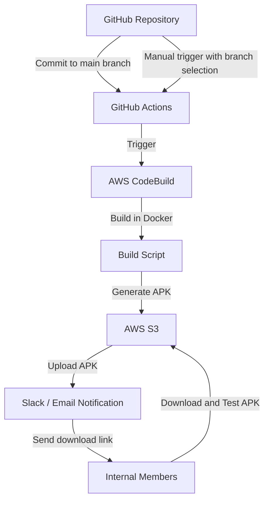
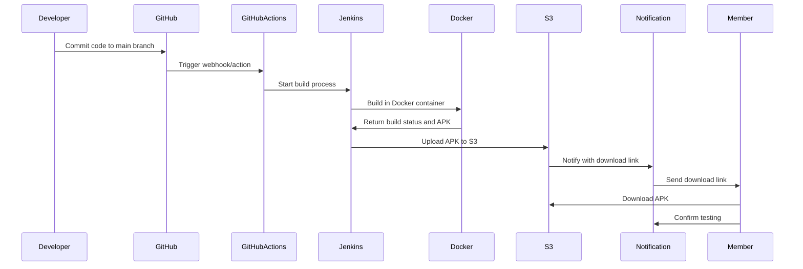
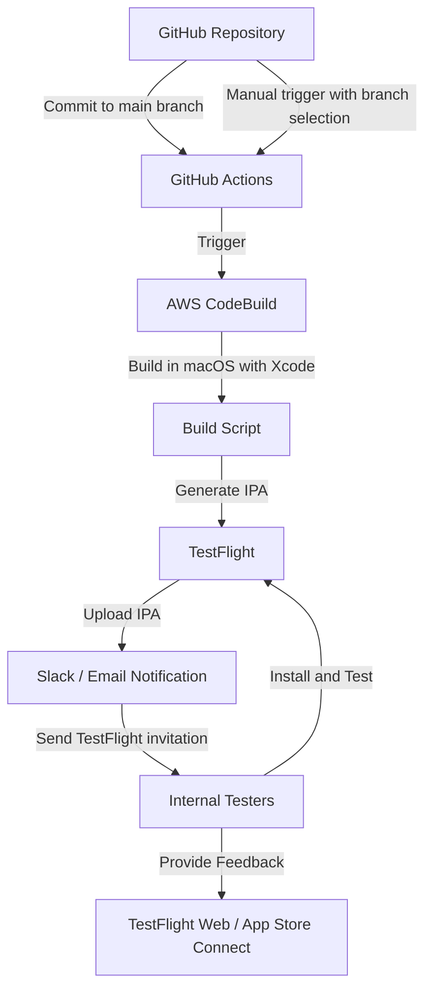
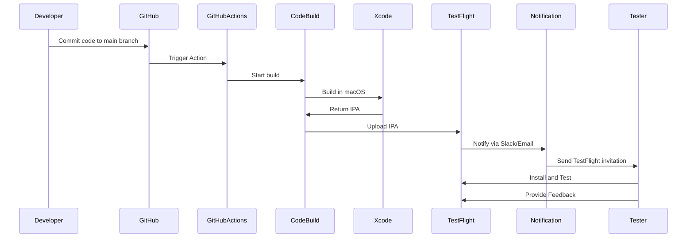

# Androidアプリの自動ビルドと作成されたアプリケーションの配布に関する仕組みについて

まず、GitHub上のソースコードで mainブランチにコミットがある都度、それを検知してサーバ上でAndroidアプリのビルドを行い、出来上がったアプリをサーバー上にアップロードして社内メンバーがそれをダウンロードして動作確認できるような流れを実現するパイプラインについて考えてみました

### 1. リポジトリの監視
- **GitHub Actions**: GitHub Actionsを使用して、mainブランチへのコミットやプルリクエスト、または手動トリガーをトリガーにビルドプロセスを開始します。

### 2. ビルドプロセス
- **AWS CodeBuild**: AWSのマネージドビルドサービスを使うことで、スケーラビリティやメンテナンスの手間を減らせます。

### 3. ビルド環境のセットアップ
- **Docker**: ビルド環境を一貫して管理するためにDockerを使用します。これにより、同じ環境でビルドが行われることが保証されます。
- **Android SDK**: 必要なAndroid SDKや他の依存関係をDockerイメージに含めます。

### 4. ビルドの実行
- **ビルドスクリプト**: GitHub ActionsとCodeBuildで実行されるビルドスクリプトを作成します。このスクリプトは、アプリのビルド、テスト、アーティファクトの生成を行います。
- **ブランチ指定**: GitHub Actionsのワークフローで、ビルドするブランチを手動で指定できるようにします。これにより、mainブランチ以外のブランチもビルドできます。

### 5. ビルドアーティファクトの保存
- **S3**: ビルドされたAPKファイルをAWS S3にアップロードします。S3は高い可用性とスケーラビリティを提供します。
- **アクセス制御**: S3バケットに適切なアクセス制御を設定し、社内メンバーだけがアクセスできるようにします。

### 6. 通知とダウンロード
- **通知サービス**: ビルドが完了したら、SlackやEmailで社内メンバーに通知します。
- **ダウンロードリンク**: S3にアップロードされたAPKのダウンロードリンクを提供します。S3のプリサインドURLを使用すると、一時的なアクセスリンクを生成できます。

### アーキテクチャ図



### シーケンス図



### 全体の流れ
1. GitHubリポジトリのmainブランチにコミットまたはプルリクエストが行われる、または手動でワークフローがトリガーされる。
2. GitHub Actionsがトリガーされ、AWS CodeBuildプロジェクトを開始。手動トリガーの場合、ビルドするブランチを指定可能。
3. CodeBuildが指定されたbuildspec.ymlに従ってビルドを実行。
4. ビルド成果物（APKファイル）がAWS S3にアップロードされる。
5. ビルド完了後、SlackやEmailで社内メンバーに通知され、S3のダウンロードリンクが提供される。
6. 社内メンバーがAPKをダウンロードしてテストを行う。

この設定により、GitHubリポジトリのmainブランチへのコミットやプルリクエスト、または手動トリガーによって、指定したブランチのソースコードを使ってAWS CodeBuildでAndroidアプリのビルドが自動的に行われます。ビルドされたアプリは社内メンバーに配布され、テストやフィードバックに活用できます。

このアーキテクチャにより、GitHubのmainブランチへのコミットが自動的に検知され、ビルドプロセスがAWS上で実行され、生成されたアプリが社内メンバーに提供される一連の流れが実現できます。

### 準備
1. **AWSアカウント**: AWS CodeBuildを使用するために必要です。
2. **IAMユーザー**: CodeBuildと連携するための権限を持ったIAMユーザーを作成します。

### 環境構築の手順

#### 1. AWS CodeBuild プロジェクトの作成
1. **AWSマネジメントコンソール**にログインし、**CodeBuild**サービスを選択します。
2. **ビルドプロジェクトの作成**をクリックします。
3. **プロジェクト名**を入力します。
4. **ソース**セクションで、**ソースプロバイダ**として**GitHub**を選択します。
5. **接続の管理**でGitHubリポジトリへのアクセスを許可します。
6. **環境**セクションで、**マネージド型イメージ**を選択し、適切なイメージ（例：aws/codebuild/standard:4.0）を選びます。
7. **ビルドの仕様**で、ビルドコマンドを含むbuildspec.ymlを定義します。以下はbuildspec.ymlの例です。

```yaml
version: 0.2

phases:
  install:
    runtime-versions:
      java: corretto11
    commands:
      - echo Installing dependencies...
      - ./gradlew dependencies
  build:
    commands:
      - echo Build started on `date`
      - ./gradlew build
  post_build:
    commands:
      - echo Build completed on `date`
artifacts:
  files:
    - '**/build/libs/*.jar'
  discard-paths: yes
```

8. **サービスロール**を選択または新規作成します。CodeBuildがリソースにアクセスするための権限が必要です。

#### 2. IAMユーザーの作成と設定
1. **AWSマネジメントコンソール**で、**IAM**サービスを選択します。
2. **ユーザー**を選択し、新しいユーザーを作成します。
3. **プログラムによるアクセス**を選択し、**次のステップ: 権限**をクリックします。
4. **既存のポリシーを直接アタッチ**を選択し、**AWSCodeBuildDeveloperAccess**ポリシーを選択します。
5. 作成後、アクセスキーIDとシークレットアクセスキーを取得します。

#### 3. GitHub Actions の設定
1. GitHubリポジトリに移動し、**Settings** > **Secrets and variables** > **Actions**にアクセスします。
2. 新しいシークレットを追加します。
   - `AWS_ACCESS_KEY_ID`: 先ほど取得したアクセスキーID
   - `AWS_SECRET_ACCESS_KEY`: 先ほど取得したシークレットアクセスキー
3. `.github/workflows`ディレクトリに新しいワークフローファイルを作成します（例：`build.yml`）。

```yaml
name: Build and Deploy with CodeBuild

on:
  push:
    branches:
      - main
  pull_request:
    branches:
      - main
  workflow_dispatch:
    inputs:
      branch:
        description: 'Branch to build'
        required: true
        default: 'main'

jobs:
  build:
    runs-on: ubuntu-latest
    steps:
      - name: Checkout repository
        uses: actions/checkout@v2
        with:
          ref: ${{ github.event.inputs.branch || github.ref }}

      - name: Set up AWS CLI
        uses: aws-actions/configure-aws-credentials@v1
        with:
          aws-access-key-id: ${{ secrets.AWS_ACCESS_KEY_ID }}
          aws-secret-access-key: ${{ secrets.AWS_SECRET_ACCESS_KEY }}
          aws-region: us-west-2

      - name: Start CodeBuild project
        run: |
          aws codebuild start-build --project-name <YOUR_CODEBUILD_PROJECT_NAME> --source-version ${{ github.event.inputs.branch || github.ref }}
```

このワークフローは、以下のいずれかのイベントでトリガーされます。
- mainブランチへのプッシュ
- mainブランチへのプルリクエスト
- 手動トリガー（workflow_dispatch）

手動トリガーの場合、ビルドするブランチを指定できます。ブランチが指定されない場合は、デフォルトでmainブランチがビルドされます。

`actions/checkout`ステップでは、指定されたブランチまたはデフォルトのブランチがチェックアウトされます。

`aws codebuild start-build`コマンドでは、指定されたブランチまたはデフォルトのブランチが`--source-version`オプションに渡されます。

## iOSアプリのTestFlightを使った自動ビルドと配布について

以下に、本方式を拡張し、TestFlightを組み込んだiOSアプリの自動ビルドと配布の仕組みを実現する場合の手順や対応内容について説明します。

### 1. AWS CodeBuildプロジェクトの設定
- **環境**セクションで、**macOS**を選択し、適切なXcodeのバージョンを選択します。
- **ビルドの仕様**で、iOSアプリのビルドコマンドを含むbuildspec.ymlを定義します。ビルド成果物として、`.ipa`ファイルを指定します。

```yaml
version: 0.2

phases:
  install:
    commands:
      - echo Installing dependencies...
      - pod install
  build:
    commands:
      - echo Build started on `date`
      - xcodebuild -workspace YourApp.xcworkspace -scheme YourScheme -configuration Release -archivePath YourApp.xcarchive archive
      - xcodebuild -exportArchive -archivePath YourApp.xcarchive -exportOptionsPlist exportOptions.plist -exportPath .
  post_build:
    commands:
      - echo Build completed on `date`
artifacts:
  files:
    - '**/*.ipa'
  discard-paths: yes
```

### 2. 証明書とプロビジョニングプロファイルの管理
- iOSアプリのビルドには、適切な証明書とTestFlightで配布するためのプロビジョニングプロファイルが必要です。
- これらのファイルを安全に管理するために、AWS Systems Manager Parameter Storeを使用します。
- 証明書とプロビジョニングプロファイルをParameter Storeにアップロードし、CodeBuildプロジェクトからアクセスできるようにします。

### 3. GitHub Actionsワークフローの設定
- iOSアプリのビルドに必要な証明書とプロビジョニングプロファイルを取得するステップを追加します。
- ビルド成果物（`.ipa`ファイル）をTestFlightにアップロードするステップを追加します。TestFlightへのアップロードには、`altool`コマンドを使用します。

```yaml
jobs:
  build:
    runs-on: ubuntu-latest
    steps:
      - name: Checkout repository
        uses: actions/checkout@v2
        with:
          ref: ${{ github.event.inputs.branch || github.ref }}

      - name: Download certificates and profiles
        run: |
          aws ssm get-parameter --name "/your/certificate/path" --with-decryption --output text --query Parameter.Value > certificate.p12
          aws ssm get-parameter --name "/your/profile/path" --output text --query Parameter.Value > profile.mobileprovision

      - name: Start CodeBuild project
        run: |
          aws codebuild start-build --project-name <YOUR_CODEBUILD_PROJECT_NAME> --source-version ${{ github.event.inputs.branch || github.ref }} --environment-variables name=CERTIFICATE,value=certificate.p12,type=PLAINTEXT name=PROFILE,value=profile.mobileprovision,type=PLAINTEXT

      - name: Upload to TestFlight
        run: |
          altool --upload-app -f YourApp.ipa -u ${{ secrets.APPLE_USERNAME }} -p ${{ secrets.APPLE_APP_SPECIFIC_PASSWORD }}
```

ここで、`secrets.APPLE_USERNAME`はAppleデベロッパーアカウントのメールアドレス、`secrets.APPLE_APP_SPECIFIC_PASSWORD`はアプリ固有のパスワードを指します。これらの機密情報はGitHub Secretsに保存し、ワークフロー内で参照します。

### 4. TestFlightでのテスター管理と通知
- TestFlightにアプリをアップロードしたら、TestFlightのウェブサイトまたはApp Store Connectでテスターを招待します。
- テスターは招待を受け取り、TestFlightアプリを使ってベータ版のアプリをインストールし、フィードバックを提供します。
- TestFlightにアプリが新しくアップロードされたことを、SlackやEmailで開発チームに通知します。

### 5. フィードバックの管理
- テスターからのフィードバックは、TestFlightのウェブサイトまたはApp Store Connectで確認・管理します。

この設定により、iOSアプリの自動ビルドとTestFlightを使った配布の仕組みが実現できます。開発者はコードをプッシュするだけで、アプリのベータ版がテスターに自動的に配布され、フィードバックを収集することができます。

TestFlightを使うことで、より管理しやすく、ユーザーフレンドリーなベータテストの仕組みを構築できます。ただし、TestFlightの利用にはApple Developer Programのメンバーシップが必要であり、テスターの管理やフィードバックの収集にはTestFlightのウェブサイトやApp Store Connectを使う必要があります。

### システム構成図



このシステム構成図は、iOSアプリのTestFlightを使った自動ビルドと配布の流れを示しています。

1. GitHubリポジトリへのコミットやプルリクエスト、または手動トリガー（ブランチ選択可能）がGitHub Actionsをトリガーします。
2. GitHub ActionsがAWS CodeBuildプロジェクトを開始します。
3. CodeBuildがmacOSインスタンス上でXcodeを使用してアプリをビルドします。
4. ビルドスクリプトが実行され、ipaファイルが生成されます。
5. 生成されたipaファイルがTestFlightにアップロードされます。
6. TestFlightへのアップロードが完了すると、Slack/Emailで社内のテスターに通知が送信されます。
7. 社内のテスターはTestFlightアプリを使ってベータ版のアプリをインストールしテストを行います。
8. テスターはTestFlightのウェブサイトやApp Store Connectを通じてフィードバックを提供します。

### シーケンス図



このシーケンス図は、iOSアプリのTestFlightを使った自動ビルドと配布の一連の流れを時系列で表現しています。

1. 開発者がメインブランチにコードをコミットします。
2. GitHubがGitHub Actionsをトリガーします。
3. GitHub ActionsがAWS CodeBuildのビルドを開始します。
4. CodeBuildがmacOSインスタンス上でXcodeを使用してアプリをビルドします。
5. XcodeがビルドしたIPAファイルをCodeBuildに返します。
6. CodeBuildがIPAファイルをTestFlightにアップロードします。
7. TestFlightがSlack/Emailを通じて通知を送信します。
8. 通知を受け取ったテスターがTestFlightの招待を受け取ります。
9. テスターがTestFlightを使ってアプリをインストールしテストします。
10. テスターがTestFlightを通じてフィードバックを提供します。

## ビルドされたアプリケーションがダウンロード可能になったタイミングでのメール通知について

以下、メールを使用してビルド完了時に通知を送信する方法についての詳細です。

### 1. Amazon Simple Email Service (SES) の設定
- AWSマネジメントコンソールにログインし、SESサービスを開きます。
- 「Email Addresses」セクションで、通知メールの送信元アドレスを検証します。
- 「SMTP Settings」セクションで、SMTPユーザー名とパスワードを取得します。

### 2. AWS Systems Manager Parameter Storeへの認証情報の保存
- AWSマネジメントコンソールで、Systems Manager サービスを開きます。
- 「Parameter Store」セクションで、以下のパラメータを作成します。
  - `/your-app/ses/smtp-username`: SESのSMTPユーザー名
  - `/your-app/ses/smtp-password`: SESのSMTPパスワード（SecureString型）

### 3. CodeBuildプロジェクトの環境変数の設定
- CodeBuildプロジェクトの設定で、以下の環境変数を追加します。
  - `SES_SMTP_USERNAME`: `/your-app/ses/smtp-username`のパラメータ値
  - `SES_SMTP_PASSWORD`: `/your-app/ses/smtp-password`のパラメータ値
  - `NOTIFICATION_EMAIL`: 通知メールの送信先アドレス

### 4. ビルドスペックファイル（buildspec.yml）の更新
- `post_build`フェーズに、以下のようなメール送信コマンドを追加します。

```yaml
post_build:
  commands:
    - echo Build completed on `date`
    - |
      cat << EOM > notification.txt
      Subject: New app build available
      
      A new build of the app is now available for download:
      
      Download URL: <S3_DOWNLOAD_URL> 
      
      Please test the app and provide feedback.
      EOM
    - >
      curl --ssl-reqd 
      --url 'smtps://email-smtp.us-west-2.amazonaws.com:465' 
      --user "$SES_SMTP_USERNAME:$SES_SMTP_PASSWORD" 
      --mail-from 'your-verified-email@example.com' 
      --mail-rcpt "$NOTIFICATION_EMAIL" 
      --upload-file notification.txt
artifacts:
  files:
    - '**/build/outputs/**/*.apk'
  discard-paths: yes

```

ここでは、以下の手順でメールを送信しています。
1. `notification.txt`ファイルを作成し、メールの件名と本文を書き込みます。`<S3_DOWNLOAD_URL>`は、実際のアプリのダウンロードURLに置き換えてください。
2. `curl`コマンドを使用して、SESのSMTPエンドポイントにメールを送信します。
   - `--user`オプションで、SESのSMTPユーザー名とパスワードを指定します。
   - `--mail-from`オプションで、検証済みの送信元メールアドレスを指定します。
   - `--mail-rcpt`オプションで、通知メールの送信先アドレスを指定します。
   - `--upload-file`オプションで、メールの内容が書かれたファイルを指定します。

### 5. GitHub Actionsワークフローの更新
- CodeBuildプロジェクトを開始する際に、必要な環境変数を渡すように更新します。

```yaml
- name: Start CodeBuild project
  run: |
    aws codebuild start-build --project-name <YOUR_CODEBUILD_PROJECT_NAME> --source-version ${{ github.event.inputs.branch || github.ref }} --environment-variables-override name=SES_SMTP_USERNAME,value=${{ secrets.SES_SMTP_USERNAME }},type=PLAINTEXT name=SES_SMTP_PASSWORD,value=${{ secrets.SES_SMTP_PASSWORD }},type=PLAINTEXT name=NOTIFICATION_EMAIL,value=${{ secrets.NOTIFICATION_EMAIL }},type=PLAINTEXT
```

ここでは、GitHub Secretsを使用して、SESの認証情報と通知メールの送信先アドレスをCodeBuildプロジェクトに渡しています。

以上の手順により、ビルドが完了した際に、Amazon SESを使用してメールで通知を送信することができます。メールには、アプリのダウンロードURLを含めることで、テスターがすぐにアプリをダウンロードしてテストを開始できるようになります。

セキュリティ上の理由から、SESの認証情報をGitHub Secretsに保存し、CodeBuildプロジェクトの環境変数として渡すことで、認証情報をビルドスペックファイルに直接記述することを避けています。

また、SESを使用するには、AWSアカウントでSESサービスを設定し、送信元メールアドレスを検証する必要があります。

この方法により、SlackやMicrosoft Teamsなどのチャットツールを使用できない場合でも、メールを介して効果的にビルド完了の通知を送信し、アプリのテストと配布を円滑に進めることができます。

### 6. 補足

パラメータの構成内容について、より詳しく説明します。

AWS Systems Manager Parameter Storeは、設定データや機密データを管理するためのサービスです。パラメータ名は、階層的な構造を持つことができ、スラッシュ（/）を使用してレベルを区切ります。

例えば、`/your-app/ses/smtp-username`というパラメータ名は、以下のような構成を表しています。

- `/your-app`: アプリケーションやプロジェクトのルートレベル。実際のアプリケーション名に置き換えてください。
- `/ses`: AWS SESに関連するパラメータを格納するセクション。
- `/smtp-username`: SESのSMTPユーザー名を格納するパラメータ。

同様に、`/your-app/ses/smtp-password`は、SESのSMTPパスワードを格納するためのパラメータです。

パラメータ名の構成は、アプリケーションや組織のニーズに応じて自由に決定できます。ただし、一貫性のある命名規則を採用し、パラメータの目的を明確に表現することが重要です。

パラメータの値は、平文（String型）または暗号化された値（SecureString型）で保存できます。機密性の高い情報（パスワードなど）は、SecureString型で保存することをお勧めします。SecureString型のパラメータは、AWSのKMSキーを使用して暗号化されます。

パラメータにアクセスするには、AWS SDKまたはCLIを使用します。例えば、AWS CLIを使用してパラメータの値を取得する場合は、以下のようなコマンドを使用します。

```bash
aws ssm get-parameter --name "/your-app/ses/smtp-username"
aws ssm get-parameter --name "/your-app/ses/smtp-password" --with-decryption
```

`--with-decryption`フラグは、SecureString型のパラメータを復号化するために必要です。

CodeBuildプロジェクトでは、これらのパラメータを環境変数として設定することで、ビルドスクリプト内からアクセスできるようになります。

パラメータ名の構成例:

```
/your-app
    /ses
        /smtp-username
        /smtp-password
    /database
        /username
        /password
    /api-keys
        /service1
        /service2
```

この例では、アプリケーションレベル（`/your-app`）の下に、SES、データベース、APIキーに関連するパラメータをグループ化しています。このような構成により、パラメータを整理し、管理しやすくなります。

パラメータストアを活用することで、機密情報をソースコードから分離し、セキュアに管理することができます。また、異なる環境（開発、ステージング、本番）ごとにパラメータを設定することで、環境に応じた設定の切り替えも容易になります。