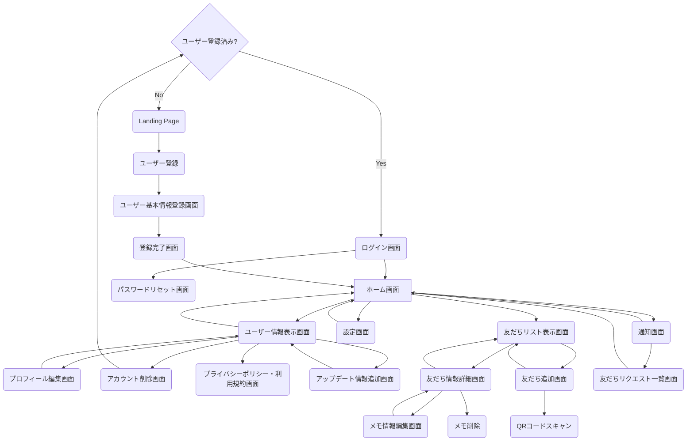

## 1. クリーンアーキテクチャの概要
### 1.1 クリーンアーキテクチャの基本原則
クリーンアーキテクチャは、ソフトウェアシステムを、関心事の分離（Separation of Concerns）の原則に基づいて設計するためのアーキテクチャパターンです。クリーンアーキテクチャの基本原則は以下の通りです：

#### 依存関係のルール
- 外側の層から内側の層への依存のみを許可し、内側の層から外側の層への依存を禁止する 
- これにより、ビジネスロジックが外部フレームワークや UI に依存しない、独立したものになる 

例えば、ユースケース層はフレームワーク・ドライバー層に依存しませんが、フレームワーク・ドライバー層はユースケース層に依存します

#### 関心事の分離
- システムを、異なる役割や責務を持つ複数の層に分割する 
- 各層は独立して開発、テスト、保守できるようにする 

例えば、UIの実装はフレームワーク・ドライバー層の責務であり、ビジネスロジックはユースケース層の責務です

#### 依存性の注入（DI）
- 上位の層が下位の層のインスタンスを直接生成するのではなく、インスタンスの生成と注入を分離する 
- これにより、各層の独立性と再利用性が高まる 

例えば、ユースケース層はリポジトリのインターフェースに依存しますが、その実装はフレームワーク・ドライバー層で行われ、DIを通じてユースケース層に提供されます

#### テスト容易性
- ビジネスロジックを UI やデータベースなどの外部要因から分離することで、ユニットテストが容易になる 
- 各層をモックやスタブに置き換えてテストできるようにする 

例えば、ユースケース層のテストでは、リポジトリの実装をモックに置き換えることで、外部依存なしにテストを実行できます

これらの原則を踏まえ、クリーンアーキテクチャでは、システムを以下の4つの層に分割します：

#### 1. エンティティ層（Entities）
- システムのビジネスルールを表現するオブジェクトを定義する 

例えば、Eコマースアプリケーションであれば、商品や注文などのオブジェクトがこの層に属します

#### 2. ユースケース層（Use Cases）
- システムの機能や操作を表現するユースケースを定義する 
- エンティティ層のビジネスルールを活用し、アプリケーション固有のビジネスルールを実装する 

例えば、「商品を注文する」「注文をキャンセルする」などのユースケースがこの層に属します

#### 3. インタフェース・アダプター層（Interface Adapters）
- ユースケース層とフレームワーク・ドライバー層の間の翻訳を行う 
- UI、データベース、外部サービスなどのインタフェースを、ユースケース層が扱いやすい形に変換する 

例えば、データベースアクセスを行うリポジトリの実装がこの層に属します

#### 4. フレームワーク・ドライバー層（Frameworks & Drivers）
- 外部フレームワーク、ライブラリ、データベース、UI などの具体的な実装を含む 

例えば、Android SDKやデータベースライブラリなどがこの層に属します

### 1.2 各層の責務と相互作用

クリーンアーキテクチャの4つの層は、それぞれ以下のような責務を持ちます

#### 1. エンティティ層
- システムのビジネスルールを表現するオブジェクトを定義する 
- 最も内側の層であり、他の層に依存しない 

#### 2. ユースケース層
- システムの機能や操作を表現するユースケースを定義する 
- エンティティ層のビジネスルールを活用し、アプリケーション固有のビジネスルールを実装する 

#### 3. インタフェース・アダプター層
- ユースケース層とフレームワーク・ドライバー層の間の翻訳を行う 
- UI、データベース、外部サービスなどのインタフェースを、ユースケース層が扱いやすい形に変換する 

#### 4. フレームワーク・ドライバー層
- 外部フレームワーク、ライブラリ、データベース、UI などの具体的な実装を含む 
- 最も外側の層であり、内側の層に依存する 

これらの層は、依存関係のルールに従って相互作用します。内側の層は外側の層に依存せず、外側の層が内側の層に依存します。この相互作用を図で表すと以下のようになります

 

この図では、矢印が依存の方向を表しています。外側の層が内側の層を呼び出すことはできますが、内側の層が外側の層を呼び出すことはできません。

クリーンアーキテクチャのこの構造により、以下のようなメリットが得られます：

- 各層が独立しているため、変更の影響が局所的に留まる 
- ビジネスロジックが UI や外部フレームワークから分離されているため、再利用性と保守性が高い 
- 各層をモックやスタブに置き換えてテストできるため、テスト容易性が高い 

以上が、クリーンアーキテクチャの概要となります。次の章では、これらの原則をAndroidアプリ開発に適用する方法について詳しく説明します。

## 2. クリーンアーキテクチャとAndroidアプリ開発
### 2.1 Androidアプリの一般的なアーキテクチャ

Androidアプリ開発において、一般的に使用されているアーキテクチャパターンはいくつかあります。その中でも、MVCやMVPなどが広く知られていると思います。

- MVC（Model-View-Controller）
  - モデル（Model）：アプリケーションのデータと業務ロジックを担当
  - ビュー（View）：ユーザーインターフェースを担当
  - コントローラー（Controller）：モデルとビューを制御し、アプリケーションの流れを管理

- MVP（Model-View-Presenter）
  - モデル（Model）：アプリケーションのデータと業務ロジックを担当
  - ビュー（View）：ユーザーインターフェースを担当し、プレゼンターからの指示に従って表示を更新
  - プレゼンター（Presenter）：ビューとモデルを仲介し、ユーザーアクションに応じた処理を行う

これらのアーキテクチャパターンは、関心事の分離を目的としていますが、実際のAndroidアプリ開発では、以下のような課題が生じることがあります

1. ビューとロジックの密結合
   - アクティビティやフラグメントが、UIの表示だけでなく、データの取得や処理も行うことが多い
   - これにより、クラスが肥大化し、保守性が低下する

2. テストの難しさ
   - ビューとロジックが密結合していると、ユニットテストが書きにくくなる
   - UIテストは実行に時間がかかり、不安定になりがちである

3. 変更の影響範囲
   - 要件の変更によって、複数の箇所を修正しなければならないことがある
   - これは、関心事の分離が不十分であることが原因である

これらの課題を解決するために、クリーンアーキテクチャの適用が有効と考えています。

### 2.2 クリーンアーキテクチャをAndroidに適用する利点

クリーンアーキテクチャをAndroidアプリ開発に適用することで、以下のような利点が得られます：

1. 関心事の分離
   - UI、ビジネスロジック、データアクセスを独立したレイヤーに分離できる
   - 各レイヤーを独立して開発、テスト、保守できるようになる

2. テスト容易性の向上
   - ビジネスロジックをUIから分離することで、ユニットテストが書きやすくなる
   - 各レイヤーをモックやスタブに置き換えてテストできるようになる

3. 変更の局所化
   - 要件の変更が特定のレイヤーに閉じた修正で済むようになる
   - 他のレイヤーへの影響を最小限に抑えられる

4. フレームワークからの独立性
   - ビジネスロジックがAndroid SDKに依存しないため、他のプラットフォームへの移行が容易になる
   - フレームワークのバージョンアップによる影響を受けにくくなる

具体的には、以下のようにクリーンアーキテクチャをAndroidアプリ開発に適用します：

- プレゼンテーション層（UI）
  - アクティビティ、フラグメント、ビューが担当
  - MVVM（Model-View-ViewModel）パターンを適用し、ビューとロジックを分離
  - ビューモデルがドメイン層のユースケースを呼び出す

- ドメイン層
  - ビジネスロジックを担当するユースケースを配置
  - Android SDKに依存しないようにする
  - インタフェース・アダプター層を介してデータ層にアクセスする

- データ層
  - リポジトリ、データソース、APIクライアントなどを配置
  - ローカルデータベースやWebAPIなどの実装を行う
  - データ層の実装をドメイン層から隠蔽する

以上のように、クリーンアーキテクチャをAndroidアプリ開発に適用することで、関心事の分離、テスト容易性、保守性の向上が期待できます。

次章では、これらの原則に基づいて、実際にLinkedPalアプリケーションの設計を行っていきます。

## 3. クリーンアーキテクチャに基づくAndroidアプリの設計
### 3.1 LinkedPalの要件整理

まずは、LinkedPalアプリケーションのコンセプトを再確認します。LinkedPalは、以下のようなコンセプトを掲げています：

- 友人関係を大切にしながらも、プライバシーを守れるプライベートSNS
- QRコードで簡単に友人登録でき、個別のメモ機能で大切な情報を記録・共有できる
- 友人との絆を深め、思い出を残すためのツール

このコンセプトを念頭に置きながら、ユーザーストーリーを導き出していきます。

#### 3.1.2 画面遷移図の確認

次に、画面遷移図を確認します。画面遷移図は、アプリケーションの画面構成と画面間の遷移を視覚的に表現したものです。LinkedPalの画面遷移図は以下のようになっています：



この画面遷移図から、ユーザーがアプリケーションでどのような動作を行うのかを読み取ることができます。

#### 3.1.3 ユーザーストーリーの作成

画面遷移図を基に、ユーザーストーリーを作成していきます。ユーザーストーリーは、エンドユーザーの視点で、アプリケーションに必要な機能を表現したものです。以下のようなフォーマットで記述します：

```
「ユーザーは、～～したい。なぜなら、～～だからだ。」
```

LinkedPalの画面遷移図から、以下のようなユーザーストーリーを導き出すことができます：

1. ユーザー登録とログイン
   - ユーザーは、アプリを初めて起動したときに、ユーザー登録を行いたい。なぜなら、LinkedPalを利用するためにはアカウントが必要だからだ。
   - ユーザーは、登録済みのアカウントでログインしたい。なぜなら、LinkedPalを利用するためにはログインが必要だからだ。

2. ホーム画面
   - ユーザーは、ログイン後にホーム画面を表示したい。なぜなら、ホーム画面からLinkedPalの主要な機能にアクセスできるからだ。

3. 友だち管理
   - ユーザーは、友だちリストを表示したい。なぜなら、LinkedPalで繋がっている友だちを確認したいからだ。
   - ユーザーは、QRコードを読み取ることで簡単に友だち追加したい。なぜなら、IDの入力なしで友だちを追加できると便利だからだ。
   - ユーザーは、友だちリクエストの通知を受け取りたい。なぜなら、新しい友だちリクエストがあることを知りたいからだ。
   - ユーザーは、友だちの詳細情報を表示したい。なぜなら、そこから友だちからのアップデート（Tweet的なもの）を確認したいからだ。

4. メモ機能
   - ユーザーは、友だちごとにメモを作成・編集・削除したい。なぜなら、友だちとの大切な情報を記録・共有したいからだ。
   - ユーザーは、友だちの詳細情報表示画面において友だちからのアップデートとメモの表示を切り替えて表示したい。なぜならメモとアップデート情報を明確に切り分けて確認したいからだ

5. ユーザー情報管理
   - ユーザーは、自分のプロフィールを編集したい。なぜなら、LinkedPal上の自分の情報を最新に保ちたいからだ。
   - ユーザーは、アカウントを削除したい。なぜなら、LinkedPalを利用しなくなった場合にアカウントを削除できるようにしたいからだ。
   - ユーザーは、アップデート情報を追加したい。なぜなら友だち全員に知っておいてもらいたいことを通知したいからだ
   - ユーザーは、プライバシーポリシーと利用規約を確認したい。なぜなら、LinkedPalを安心して利用するために、プライバシーポリシーと利用規約を理解しておきたいからだ。

これらのユーザーストーリーは、LinkedPalアプリケーションに必要な主要な機能を表しています。ユーザーストーリーを作成することで、エンドユーザーの視点でアプリケーションの要件を整理することができます。

次のステップでは、これらのユーザーストーリーを基に、機能要件の明確化を行います。

#### 3.1.4 機能要件の明確化

ユーザーストーリーを作成したら、次はそれらを基に機能要件を明確化していきます。機能要件とは、アプリケーションが提供すべき機能を具体的に定義したものです。

ユーザーストーリーから導き出されたLinkedPalの主要な機能要件は以下の通りです：

1. ユーザー登録とログイン
   - 新規ユーザー登録機能
     - ユーザーがアプリを初めて起動したときに、ユーザー登録を行える
     - 登録にはメールアドレスとパスワードが必要
     - 登録が完了したら、ユーザー基本情報登録画面に遷移する
   - ログイン機能
     - 登録済みのメールアドレスとパスワードでログインできる
     - ログインが成功したら、ホーム画面に遷移する
   - パスワードリセット機能
     - パスワードを忘れた場合、登録済みのメールアドレスを入力することでパスワードをリセットできる

2. ホーム画面
   - ホーム画面表示機能
     - ログイン後、ホーム画面が表示される
     - ホーム画面には、友だちリスト、設定、通知へのアクセスボタンが表示される

3. 友だち管理
   - 友だちリスト表示機能
     - ホーム画面から友だちリスト画面に遷移できる
     - 友だちリストには、LinkedPalで繋がっている友だちの一覧が表示される
   - 友だち追加機能
     - 友だちリスト画面から友だち追加画面に遷移できる
     - 友だち追加画面では、QRコードをスキャンすることで友だちを追加できる
   - 友だちリクエスト通知機能
     - 新しい友だちリクエストがあると、通知画面に友だちリクエストが表示される
     - 友だちリクエストを承認または拒否できる
   - アップデート情報表示機能
     - 友だちが追加したアップデート情報を友だち情報詳細画面上で確認できる

4. メモ機能
   - メモ作成機能
     - 友だち情報詳細画面からメモ情報編集画面に遷移できる
     - メモ情報編集画面では、友だちに関するメモを新規作成できる
   - メモ編集機能
     - メモ情報編集画面では、既存のメモを編集できる
   - メモ削除機能
     - 友だち情報詳細画面からメモを削除できる

5. ユーザー情報管理
   - プロフィール編集機能
     - ホーム画面からユーザー情報更新画面に遷移できる
     - ユーザー情報表示画面からプロフィール編集画面に遷移できる
     - プロフィール編集画面では、ユーザーの氏名、プロフィール画像などを編集できる
   - アカウント削除機能
     - ユーザー情報更新画面からアカウント削除画面に遷移できる
     - アカウント削除画面では、アカウントを削除できる
     - アカウントを削除すると、ログイン画面に戻る
   - プライバシーポリシー・利用規約表示機能
     - ユーザー情報更新画面からプライバシーポリシー・利用規約画面に遷移できる
     - プライバシーポリシー・利用規約画面では、LinkedPalのプライバシーポリシーと利用規約を確認できる
   - アップデート情報管理機能
     - ユーザー情報表示画面からアップデート情報追加画面に遷移できる
     - アップデート情報追加画面では、テキストデータをTweetのように作成できる


これらの機能要件は、LinkedPalアプリケーションが提供すべき具体的な機能を表しています。機能要件を明確化することで、開発チームはアプリケーションに必要な機能を漏れなく把握することができるようになりました。

次のステップでは、これらの機能要件を満たすために、非機能要件の検討を行います。

#### 3.1.5 非機能要件の検討

機能要件が「アプリケーションが何をするか」を定義するのに対し、非機能要件は「アプリケーションがどのように動作すべきか」を定義します。具体的には、パフォーマンス、セキュリティ、ユーザビリティ、信頼性などの要件が含まれます。

LinkedPalアプリケーションの非機能要件を以下のように検討します：

1. パフォーマンス
   - アプリケーションの起動時間
     - アプリケーションは、ユーザーがアイコンをタップしてから3秒以内に起動する
   - 画面遷移の応答時間
     - 画面遷移は、ユーザーがボタンをタップしてから1秒以内に完了する
   - QRコード読み取りの速度
     - QRコードの読み取りは、ユーザーがカメラをQRコードに向けてから2秒以内に完了する

2. セキュリティ
   - ユーザー情報の保護
     - ユーザーの個人情報（メールアドレス、パスワードなど）は、暗号化して保存する
     - ユーザー情報へのアクセスは、認証と認可のメカニズムで制御する
   - 通信の暗号化
     - アプリケーションとサーバー間の通信は、SSL/TLSを使用して暗号化する

3. ユーザビリティ
   - 直感的なユーザーインターフェース
     - ユーザーインターフェースは、シンプルで分かりやすいデザインにする
     - ユーザーが目的の機能に素早くアクセスできるようにナビゲーションを設計する
   - アクセシビリティ
     - アプリケーションは、視覚障害者や色覚異常者でも使いやすいようにデザインする
     - 適切なコントラストや代替テキストを提供する

4. 信頼性
   - エラー処理
     - アプリケーションは、予期しないエラーが発生した場合でも安全に動作する
     - エラーメッセージをユーザーにわかりやすく表示し、適切な回復方法を提示する
   - データの整合性
     - アプリケーションは、データの不整合が発生しないように設計する
     - データの更新や削除時に、関連するデータも適切に処理する

5. 互換性
   - サポート対象のAndroidバージョン
     - アプリケーションは、Android 8.0（APIレベル26）以上をサポートする
   - 異なる画面サイズへの対応
     - アプリケーションは、様々な画面サイズ（スマートフォン、タブレットなど）に適切に表示される

これらの非機能要件は、LinkedPalアプリケーションが満たすべき品質基準を表しています。非機能要件を検討することで、開発チームはアプリケーションの品質を向上させ、ユーザーの満足度を高めることができます。

非機能要件の検討は、機能要件の実現方法にも影響を与えます。例えば、セキュリティの要件を満たすために、特定のライブラリや暗号化アルゴリズムを使用する必要があるかもしれません。

次のステップでは、ここまでに整理された機能要件と非機能要件を基に、クリーンアーキテクチャの原則に沿ってアプリケーションの設計を行っていくことになります。

### 3.2 クリーンアーキテクチャに基づく設計

クリーンアーキテクチャの原則に沿って、LinkedPalアプリケーションの設計を行います。設計は、以下の3つのレイヤーに分けて進めていきます：

1. プレゼンテーション層
2. ドメイン層
3. データ層

#### 3.2.1 プレゼンテーション層の設計

プレゼンテーション層は、ユーザーインターフェースとユーザーとのインタラクションを担当するレイヤーです。LinkedPalアプリケーションのプレゼンテーション層の設計を以下のように行います：

1. 画面遷移図を基にしたUI設計
   - 画面遷移図を基に、各画面のワイヤーフレームを作成する
   - ワイヤーフレームは、画面のレイアウトとUIコンポーネントの配置を示す
   - ワイヤーフレームを基に、詳細なUIデザインを作成する

2. MVVM（Model-View-ViewModel）パターンの適用
   - プレゼンテーション層にMVVMパターンを適用する
   - UIの状態とロジックをViewModelに集約し、Viewとの依存関係を減らす
   - ViewModelは、ドメイン層のユースケースを呼び出してデータを取得し、Viewに提供する

3. Jetpack Composeの活用
   - UIの実装にJetpack Composeを活用する
   - Jetpack Composeは、宣言的UIの構築を可能にするモダンなUIツールキット
   - コードベースのシンプル化と、UIの状態管理の改善が期待できる

プレゼンテーション層の設計では、MVVM（Model-View-ViewModel）パターンを適用し、Jetpack Composeを使用してUIを構築します。

```kotlin
// 画面の状態を表すデータクラス
data class HomeScreenState(
    val userProfile: UserProfile?,
    val friends: List<Friend>,
    val isLoading: Boolean,
    val error: String?
)

// ViewModelクラス
class HomeScreenViewModel(
    private val getUserProfileUseCase: GetUserProfileUseCase,
    private val getFriendsUseCase: GetFriendsUseCase
) : ViewModel() {
    private val _uiState = MutableStateFlow(HomeScreenState(null, emptyList(), true, null))
    val uiState: StateFlow<HomeScreenState> = _uiState.asStateFlow()

    init {
        viewModelScope.launch {
            try {
                val userProfile = getUserProfileUseCase()
                val friends = getFriendsUseCase()
                _uiState.update { it.copy(userProfile = userProfile, friends = friends, isLoading = false) }
            } catch (e: Exception) {
                _uiState.update { it.copy(error = e.message, isLoading = false) }
            }
        }
    }
}

@Composable
fun HomeScreen(viewModel: HomeScreenViewModel = hiltViewModel()) {
    val uiState by viewModel.uiState.collectAsState()

    Scaffold(
        topBar = {
            TopAppBar(
                title = { Text("LinkedPal") },
                actions = {
                    IconButton(onClick = { /* TODO: Navigate to settings */ }) {
                        Icon(Icons.Default.Settings, contentDescription = "Settings")
                    }
                }
            )
        },
        content = {
            when {
                uiState.isLoading -> {
                    CircularProgressIndicator(modifier = Modifier.fillMaxSize())
                }
                uiState.error != null -> {
                    Text("Error: ${uiState.error}")
                }
                else -> {
                    LazyColumn {
                        item {
                            UserProfileCard(uiState.userProfile)
                        }
                        items(uiState.friends) { friend ->
                            FriendItem(friend)
                        }
                    }
                }
            }
        }
    )
}
```

この`HomeScreen`関数は、以下のようなUIの構成要素を含んでいます：

1. `Scaffold`
   - Materialデザインのレイアウト構造を提供するComposable
   - `topBar`と`content`をプロパティとして受け取る

2. `TopAppBar`
   - 画面の上部に表示されるアプリケーションバー
   - タイトルとアクションアイコン（設定アイコン）を含む

3. `CircularProgressIndicator`
   - データの読み込み中に表示される円形のプログレスインジケータ
   - `uiState.isLoading`がtrueの場合に表示される

4. `Text`
   - エラーメッセージを表示するためのテキストComposable
   - `uiState.error`がnullでない場合に表示される

5. `LazyColumn`
   - リスト形式でコンテンツを表示するためのComposable
   - 大量のデータを効率的に表示できる

6. `UserProfileCard`
   - ユーザープロファイルを表示するためのカスタムComposable
   - `uiState.userProfile`をプロパティとして受け取る

7. `FriendItem`
   - 友だちリストの各項目を表示するためのカスタムComposable
   - `uiState.friends`をリストとして受け取り、各項目ごとに`FriendItem`を呼び出す

これらのComposableを組み合わせることで、ホーム画面のUIが構成されます。`HomeScreenViewModel`から`uiState`を取得し、その状態に応じて適切なComposableが表示されます。

例えば、データの読み込み中は`CircularProgressIndicator`が表示され、エラーが発生した場合は`Text`でエラーメッセージが表示されます。データが正常に読み込まれた場合は、`LazyColumn`の中に`UserProfileCard`とFriendリスト（`FriendItem`のリスト）が表示されます。

それでは、ログイン画面から順に、Jetpack Composeを使用した実装例を示しながら、LinkedPalの画面の開発を進めていきましょう。

まずは、プロジェクトのセットアップとして、必要な依存関係を追加します。`build.gradle`ファイルに以下の依存関係を追加してください：

```groovy
dependencies {
    // Jetpack Compose
    implementation 'androidx.compose.ui:ui:1.2.0'
    implementation 'androidx.compose.material:material:1.2.0'
    implementation 'androidx.compose.ui:ui-tooling-preview:1.2.0'
    implementation 'androidx.lifecycle:lifecycle-runtime-ktx:2.5.1'
    implementation 'androidx.activity:activity-compose:1.5.1'

    // ViewModel
    implementation 'androidx.lifecycle:lifecycle-viewmodel-compose:2.5.1'

    // Navigation
    implementation 'androidx.navigation:navigation-compose:2.5.1'

    // Hilt
    implementation 'com.google.dagger:hilt-android:2.44'
    kapt 'com.google.dagger:hilt-compiler:2.44'
}
```

これらの依存関係は、Jetpack Compose、ViewModel、Navigation、Hiltなどの必要なライブラリを含んでいます。

次に、アプリケーションのエントリーポイントである`MainActivity`を作成します：

```kotlin
@AndroidEntryPoint
class MainActivity : ComponentActivity() {
    override fun onCreate(savedInstanceState: Bundle?) {
        super.onCreate(savedInstanceState)
        setContent {
            LinkedPalTheme {
                Surface(color = MaterialTheme.colors.background) {
                    LinkedPalApp()
                }
            }
        }
    }
}

@Composable
fun LinkedPalApp() {
    val navController = rememberNavController()
    NavHost(navController = navController, startDestination = "login") {
        composable("login") { LoginScreen(navController) }
        composable("register") { RegisterScreen(navController) }
        composable("home") { HomeScreen(navController) }
        composable("add_friend") { AddFriendScreen(navController) }
        composable("chat") { ChatScreen(navController) }
    }
}
```

ここでは、`MainActivity`でJetpack Composeのセットアップを行い、`LinkedPalApp`という関数でアプリケーションのナビゲーションを定義しています。`NavHost`を使用して、各画面に対応する`composable`を定義しています。

次に、ログイン画面の実装を見ていきましょう。

#### 1. ログイン画面

```kotlin
@Composable
fun LoginScreen(navController: NavController, viewModel: LoginViewModel = hiltViewModel()) {
    val uiState by viewModel.uiState.collectAsState()

    Column(
        modifier = Modifier.fillMaxSize(),
        verticalArrangement = Arrangement.Center,
        horizontalAlignment = Alignment.CenterHorizontally
    ) {
        TextField(
            value = uiState.username,
            onValueChange = { viewModel.onUsernameChanged(it) },
            label = { Text("Username") }
        )
        TextField(
            value = uiState.password,
            onValueChange = { viewModel.onPasswordChanged(it) },
            label = { Text("Password") },
            visualTransformation = PasswordVisualTransformation()
        )
        if (uiState.error != null) {
            Text(
                text = uiState.error,
                color = MaterialTheme.colors.error
            )
        }
        Button(
            onClick = { viewModel.onLoginClicked(navController) }
        ) {
            Text("Login")
        }
        TextButton(
            onClick = { navController.navigate("register") }
        ) {
            Text("Register")
        }
    }
}

@HiltViewModel
class LoginViewModel @Inject constructor(
    private val loginUseCase: LoginUseCase
) : ViewModel() {
    private val _uiState = MutableStateFlow(LoginUiState())
    val uiState: StateFlow<LoginUiState> = _uiState.asStateFlow()

    fun onUsernameChanged(username: String) {
        _uiState.update { it.copy(username = username) }
    }

    fun onPasswordChanged(password: String) {
        _uiState.update { it.copy(password = password) }
    }

    fun onLoginClicked(navController: NavController) {
        viewModelScope.launch {
            try {
                loginUseCase(uiState.value.username, uiState.value.password)
                navController.navigate("home")
            } catch (e: Exception) {
                _uiState.update { it.copy(error = e.message) }
            }
        }
    }
}

data class LoginUiState(
    val username: String = "",
    val password: String = "",
    val error: String? = null
)
```

ここでは、`LoginScreen`というComposable関数を定義しています。この関数は、ユーザー名とパスワードの入力フィールド、ログインボタン、エラーメッセージの表示を含んでいます。

`LoginViewModel`は、ログイン画面のビジネスロジックを担当しています。`LoginUseCase`を使用してログイン処理を行い、成功した場合はホーム画面に遷移します。エラーが発生した場合は、エラーメッセージを表示します。

`LoginUiState`は、ログイン画面のUI状態を表すデータクラスです。

次に、ユーザー登録画面の実装を見ていきましょう。

#### 2. ユーザー登録画面

```kotlin
@Composable
fun RegisterScreen(navController: NavController, viewModel: RegisterViewModel = hiltViewModel()) {
    val uiState by viewModel.uiState.collectAsState()

    Column(
        modifier = Modifier.fillMaxSize(),
        verticalArrangement = Arrangement.Center,
        horizontalAlignment = Alignment.CenterHorizontally
    ) {
        TextField(
            value = uiState.username,
            onValueChange = { viewModel.onUsernameChanged(it) },
            label = { Text("Username") }
        )
        TextField(
            value = uiState.email,
            onValueChange = { viewModel.onEmailChanged(it) },
            label = { Text("Email") }
        )
        TextField(
            value = uiState.password,
            onValueChange = { viewModel.onPasswordChanged(it) },
            label = { Text("Password") },
            visualTransformation = PasswordVisualTransformation()
        )
        if (uiState.error != null) {
            Text(
                text = uiState.error,
                color = MaterialTheme.colors.error
            )
        }
        Button(
            onClick = { viewModel.onRegisterClicked(navController) }
        ) {
            Text("Register")
        }
    }
}

@HiltViewModel
class RegisterViewModel @Inject constructor(
    private val registerUseCase: RegisterUseCase
) : ViewModel() {
    private val _uiState = MutableStateFlow(RegisterUiState())
    val uiState: StateFlow<RegisterUiState> = _uiState.asStateFlow()

    fun onUsernameChanged(username: String) {
        _uiState.update { it.copy(username = username) }
    }

    fun onEmailChanged(email: String) {
        _uiState.update { it.copy(email = email) }
    }

    fun onPasswordChanged(password: String) {
        _uiState.update { it.copy(password = password) }
    }

    fun onRegisterClicked(navController: NavController) {
        viewModelScope.launch {
            try {
                registerUseCase(uiState.value.username, uiState.value.email, uiState.value.password)
                navController.navigate("home")
            } catch (e: Exception) {
                _uiState.update { it.copy(error = e.message) }
            }
        }
    }
}

data class RegisterUiState(
    val username: String = "",
    val email: String = "",
    val password: String = "",
    val error: String? = null
)
```

ユーザー登録画面の実装は、ログイン画面と似ています。`RegisterScreen`というComposable関数を定義し、ユーザー名、メールアドレス、パスワードの入力フィールドとユーザー登録ボタンを配置しています。

`RegisterViewModel`は、ユーザー登録のビジネスロジックを担当しています。`RegisterUseCase`を使用してユーザー登録処理を行い、成功した場合はホーム画面に遷移します。エラーが発生した場合は、エラーメッセージを表示します。

`RegisterUiState`は、ユーザー登録画面のUI状態を表すデータクラスです。

次に、ホーム画面の実装を見ていきましょう。

#### 3. ホーム画面

```kotlin
@Composable
fun HomeScreen(navController: NavController, viewModel: HomeViewModel = hiltViewModel()) {
    val uiState by viewModel.uiState.collectAsState()

    Scaffold(
        topBar = {
            TopAppBar(
                title = { Text("LinkedPal") },
                actions = {
                    IconButton(
                        onClick = { /* TODO: Navigate to settings */ }
                    ) {
                        Icon(Icons.Default.Settings, contentDescription = "Settings")
                    }
                }
            )
        },
        floatingActionButton = {
            FloatingActionButton(
                onClick = { navController.navigate("add_friend") }
            ) {
                Icon(Icons.Default.Add, contentDescription = "Add Friend")
            }
        },
        content = { padding ->
            when {
                uiState.isLoading -> {
                    CircularProgressIndicator(modifier = Modifier.fillMaxSize())
                }
                uiState.error != null -> {
                    Text("Error: ${uiState.error}")
                }
                else -> {
                    LazyColumn(contentPadding = padding) {
                        item {
                            UserProfileCard(uiState.userProfile)
                        }
                        items(uiState.friends) { friend ->
                            FriendItem(friend = friend, onItemClick = { navController.navigate("chat") })
                        }
                    }
                }
            }
        }
    )
}

@Composable
fun UserProfileCard(userProfile: UserProfile?) {
    Card(
        modifier = Modifier
            .fillMaxWidth()
            .padding(16.dp)
    ) {
        Column(
            modifier = Modifier.padding(16.dp)
        ) {
            Text(
                text = userProfile?.username ?: "",
                style = MaterialTheme.typography.h6
            )
            Text(
                text = userProfile?.email ?: "",
                style = MaterialTheme.typography.body2
            )
        }
    }
}

@Composable
fun FriendItem(friend: Friend, onItemClick: () -> Unit) {
    Card(
        modifier = Modifier
            .fillMaxWidth()
            .padding(16.dp)
            .clickable(onClick = onItemClick)
    ) {
        Row(
            modifier = Modifier.padding(16.dp),
            verticalAlignment = Alignment.CenterVertically
        ) {
            Icon(
                Icons.Default.Person,
                contentDescription = "Friend Avatar"
            )
            Spacer(modifier = Modifier.width(16.dp))
            Text(
                text = friend.username,
                style = MaterialTheme.typography.h6
            )
        }
    }
}

@HiltViewModel
class HomeViewModel @Inject constructor(
    private val getUserProfileUseCase: GetUserProfileUseCase,
    private val getFriendsUseCase: GetFriendsUseCase
) : ViewModel() {
    private val _uiState = MutableStateFlow(HomeUiState(isLoading = true))
    val uiState: StateFlow<HomeUiState> = _uiState.asStateFlow()

    init {
        viewModelScope.launch {
            try {
                val userProfile = getUserProfileUseCase()
                val friends = getFriendsUseCase()
                _uiState.update { it.copy(userProfile = userProfile, friends = friends, isLoading = false) }
            } catch (e: Exception) {
                _uiState.update { it.copy(error = e.message, isLoading = false) }
            }
        }
    }
}

data class HomeUiState(
    val userProfile: UserProfile? = null,
    val friends: List<Friend> = emptyList(),
    val isLoading: Boolean = false,
    val error: String? = null
)
```

ホーム画面では、ユーザープロフィールと友だちリストを表示します。`HomeScreen`というComposable関数を定義し、`Scaffold`を使用してレイアウトを構成しています。

`UserProfileCard`は、ユーザープロフィールを表示するためのComposableです。`FriendItem`は、友だちリストの各アイテムを表示するためのComposableです。

`HomeViewModel`は、ホーム画面のビジネスロジックを担当しています。`GetUserProfileUseCase`と`GetFriendsUseCase`を使用してデータを取得し、UI状態を更新します。

`HomeUiState`は、ホーム画面のUI状態を表すデータクラスです。

次に、友だち追加画面の実装を見ていきましょう。

#### 4. 友だち追加画面

```kotlin
@Composable
fun AddFriendScreen(navController: NavController, viewModel: AddFriendViewModel = hiltViewModel()) {
    val uiState by viewModel.uiState.collectAsState()

    Scaffold(
        topBar = {
            TopAppBar(
                title = { Text("Add Friend") },
                navigationIcon = {
                    IconButton(onClick = { navController.popBackStack() }) {
                        Icon(Icons.Default.ArrowBack, contentDescription = "Back")
                    }
                }
            )
        },
        content = { padding ->
            Column(
                modifier = Modifier.fillMaxSize().padding(padding),
                verticalArrangement = Arrangement.Center,
                horizontalAlignment = Alignment.CenterHorizontally
            ) {
                Button(
                    onClick = { viewModel.onScanQrCodeClicked() }
                ) {
                    Text("Scan QR Code")
                }
                if (uiState.error != null) {
                    Text(
                        text = uiState.error,
                        color = MaterialTheme.colors.error
                    )
                }
            }
        }
    )

    LaunchedEffect(uiState.scannedUserId) {
        if (uiState.scannedUserId != null) {
            viewModel.onUserIdScanned(navController)
        }
    }
}

@HiltViewModel
class AddFriendViewModel @Inject constructor(
    private val addFriendUseCase: AddFriendUseCase
) : ViewModel() {
    private val _uiState = MutableStateFlow(AddFriendUiState())
    val uiState: StateFlow<AddFriendUiState> = _uiState.asStateFlow()
    fun onScanQrCodeClicked() {
    // TODO: Open QR code scanner
    // Set scannedUserId when QR code is successfully scanned
        _uiState.update { it.copy(scannedUserId = "user123") }
    }

    fun onUserIdScanned(navController: NavController) {
        viewModelScope.launch {
            try {
                addFriendUseCase(uiState.value.scannedUserId!!)
                navController.navigate("home")
            } catch (e: Exception) {
                _uiState.update { it.copy(error = e.message) }
            }
        }
    }
}

data class AddFriendUiState(
    val scannedUserId: String? = null,
    val error: String? = null
)
```

友だち追加画面では、QRコードをスキャンして友だちを追加する機能を提供します。`AddFriendScreen`というComposable関数を定義し、QRコードをスキャンするためのボタンを配置しています。

`AddFriendViewModel`は、友だち追加のビジネスロジックを担当しています。`AddFriendUseCase`を使用して友だち追加処理を行い、成功した場合はホーム画面に遷移します。エラーが発生した場合は、エラーメッセージを表示します。

`AddFriendUiState`は、友だち追加画面のUI状態を表すデータクラスです。

次に、チャット画面（タイムライン画面）の実装を見ていきましょう。

#### 5. チャット画面（タイムライン画面）

```kotlin
@Composable
fun ChatScreen(navController: NavController, viewModel: ChatViewModel = hiltViewModel()) {
    val uiState by viewModel.uiState.collectAsState()

    Scaffold(
        topBar = {
            TopAppBar(
                title = { Text("Chat") },
                navigationIcon = {
                    IconButton(onClick = { navController.popBackStack() }) {
                        Icon(Icons.Default.ArrowBack, contentDescription = "Back")
                    }
                }
            )
        },
        content = { padding ->
            when {
                uiState.isLoading -> {
                    CircularProgressIndicator(modifier = Modifier.fillMaxSize())
                }
                uiState.error != null -> {
                    Text("Error: ${uiState.error}")
                }
                else -> {
                    LazyColumn(
                        modifier = Modifier.fillMaxSize().padding(padding),
                        reverseLayout = true
                    ) {
                        items(uiState.messages) { message ->
                            MessageItem(message)
                        }
                    }
                }
            }
        }
    )
}

@Composable
fun MessageItem(message: Message) {
    Card(
        modifier = Modifier
            .fillMaxWidth()
            .padding(16.dp)
    ) {
        Column(
            modifier = Modifier.padding(16.dp)
        ) {
            Text(
                text = message.sender,
                style = MaterialTheme.typography.subtitle2
            )
            Text(
                text = message.content,
                style = MaterialTheme.typography.body1
            )
        }
    }
}

@HiltViewModel
class ChatViewModel @Inject constructor(
    private val getMessagesUseCase: GetMessagesUseCase
) : ViewModel() {
    private val _uiState = MutableStateFlow(ChatUiState(isLoading = true))
    val uiState: StateFlow<ChatUiState> = _uiState.asStateFlow()

    init {
        viewModelScope.launch {
            try {
                val messages = getMessagesUseCase()
                _uiState.update { it.copy(messages = messages, isLoading = false) }
            } catch (e: Exception) {
                _uiState.update { it.copy(error = e.message, isLoading = false) }
            }
        }
    }
}

data class ChatUiState(
    val messages: List<Message> = emptyList(),
    val isLoading: Boolean = false,
    val error: String? = null
)
```

チャット画面（タイムライン画面）では、メッセージのリストを表示します。`ChatScreen`というComposable関数を定義し、`LazyColumn`を使用してメッセージのリストを表示しています。

`MessageItem`は、個々のメッセージを表示するためのComposableです。

`ChatViewModel`は、チャット画面のビジネスロジックを担当しています。`GetMessagesUseCase`を使用してメッセージのリストを取得し、UI状態を更新します。

`ChatUiState`は、チャット画面のUI状態を表すデータクラスです。

では最後に、メモ追加画面について見ていきましょう。

```kotlin
@Composable
fun MemoScreen(navController: NavController, friendId: String, viewModel: MemoViewModel = hiltViewModel()) {
    val uiState by viewModel.uiState.collectAsState()

    Scaffold(
        topBar = {
            TopAppBar(
                title = { Text("Memo") },
                navigationIcon = {
                    IconButton(onClick = { navController.popBackStack() }) {
                        Icon(Icons.Default.ArrowBack, contentDescription = "Back")
                    }
                }
            )
        },
        content = { padding ->
            Column(
                modifier = Modifier.fillMaxSize().padding(padding).padding(16.dp)
            ) {
                OutlinedTextField(
                    value = uiState.title,
                    onValueChange = { viewModel.onTitleChanged(it) },
                    label = { Text("Title") },
                    modifier = Modifier.fillMaxWidth()
                )
                Spacer(modifier = Modifier.height(16.dp))
                OutlinedTextField(
                    value = uiState.content,
                    onValueChange = { viewModel.onContentChanged(it) },
                    label = { Text("Content") },
                    modifier = Modifier.fillMaxWidth().weight(1f)
                )
                Spacer(modifier = Modifier.height(16.dp))
                Button(
                    onClick = { viewModel.onSaveClicked(friendId, navController) },
                    modifier = Modifier.align(Alignment.End)
                ) {
                    Text("Save")
                }
            }
        }
    )
}

@HiltViewModel
class MemoViewModel @Inject constructor(
    private val saveMemoUseCase: SaveMemoUseCase
) : ViewModel() {
    private val _uiState = MutableStateFlow(MemoUiState())
    val uiState: StateFlow<MemoUiState> = _uiState.asStateFlow()

    fun onTitleChanged(title: String) {
        _uiState.update { it.copy(title = title) }
    }

    fun onContentChanged(content: String) {
        _uiState.update { it.copy(content = content) }
    }

    fun onSaveClicked(friendId: String, navController: NavController) {
        viewModelScope.launch {
            saveMemoUseCase(
                friendId = friendId,
                title = uiState.value.title,
                content = uiState.value.content
            )
            navController.popBackStack()
        }
    }
}

data class MemoUiState(
    val title: String = "",
    val content: String = ""
)
```
メモ登録画面では、メモのタイトルと内容を入力するためのテキストフィールドと、保存ボタンを配置しています。

MemoViewModelは、メモ登録のビジネスロジックを担当しています。SaveMemoUseCaseを使用してメモ保存処理を行い、処理が完了したら前の画面に戻ります。

以上が、LinkedPalアプリケーションの主要な画面の実装例です。実際のアプリケーション開発では、デザイナー等の同僚と協業しながらこれらの画面をさらに洗練させ、エラーハンドリングやローディング状態の表示などを適切に行う必要があります。

また、各画面で使用しているユースケース（`LoginUseCase`、`RegisterUseCase`、`GetUserProfileUseCase`、`GetFriendsUseCase`、`AddFriendUseCase`、`GetMessagesUseCase`）は、ドメイン層に属するクラスで、実際のビジネスロジックを含んでいます。これらのユースケースの実装は、リポジトリインターフェースを介してデータ層とやり取りを行います。

このように、クリーンアーキテクチャの原則に沿って、UI、ビジネスロジック、データアクセスを分離することで、アプリケーションの保守性と拡張性を高めることができます。

実際のアプリケーション開発では、これらのコード例を参考にしながら、プロジェクトの要件に合わせてカスタマイズしていくことが重要です。また、テストの実装やエラーハンドリングの強化など、アプリケーションの品質を向上させるための取り組みも必要です。

Androidアプリ開発におけるクリーンアーキテクチャの適用は、一朝一夕には習得できませんが、実践を重ねることで徐々に理解を深めていくことができると思います。これらのコード例を出発点として、より洗練されたアーキテクチャとコードを目指して学習を続けていきましょう。

次のステップでは、このようなプレゼンテーション層の設計を、ドメイン層やデータ層の設計と組み合わせて、アプリケーション全体のアーキテクチャを構築していきます。

次に、ドメイン層の設計について説明します。

#### 3.2.2 ドメイン層の設計

ドメイン層は、アプリケーションのビジネスロジックを担当する層です。ここでは、ドメインモデル（エンティティ）とユースケースを定義します。

##### ドメインモデル（エンティティ）の定義

まずは、アプリケーションのコアとなるドメインモデルを定義します。LinkedPalアプリケーションでは、以下のようなドメインモデルが考えられます：

```kotlin
data class User(
    val id: String,
    val username: String,
    val email: String
)

data class Friend(
    val id: String,
    val username: String
)

data class Message(
    val id: String,
    val senderId: String,
    val receiverId: String,
    val content: String,
    val timestamp: Long
)

data class Memo(
    val id: String,
    val friendId: String,
    val title: String,
    val content: String
)
```

これらのドメインモデルは、アプリケーションのコアとなるエンティティを表現しています。`User`は、ユーザーを表すモデルで、`Friend`は友だちを表すモデルです。`Message`は、ユーザー間で送受信されるメッセージを表すモデルです。そして`Memo`はユーザーが作成するメモ情報を表します。

##### ユースケースの定義

次に、アプリケーションのビジネスロジックを表現するユースケースを定義します。LinkedPalアプリケーションでは、以下のようなユースケースが考えられます：

```kotlin
class LoginUseCase(private val userRepository: UserRepository) {
    suspend operator fun invoke(username: String, password: String): User {
        return userRepository.login(username, password)
    }
}

class RegisterUseCase(private val userRepository: UserRepository) {
    suspend operator fun invoke(username: String, email: String, password: String): User {
        return userRepository.register(username, email, password)
    }
}

class GetUserProfileUseCase(private val userRepository: UserRepository) {
    suspend operator fun invoke(): User {
        return userRepository.getCurrentUser()
    }
}

class GetFriendsUseCase(private val friendRepository: FriendRepository) {
    suspend operator fun invoke(): List<Friend> {
        return friendRepository.getFriends()
    }
}

class AddFriendUseCase(private val friendRepository: FriendRepository) {
    suspend operator fun invoke(friendId: String) {
        friendRepository.addFriend(friendId)
    }
}

class GetMessagesUseCase(private val messageRepository: MessageRepository) {
    suspend operator fun invoke(): List<Message> {
        return messageRepository.getMessages()
    }
}

class SaveMemoUseCase(private val memoRepository: MemoRepository) {
    suspend operator fun invoke(friendId: String, title: String, content: String) {
        memoRepository.saveMemo(friendId, title, content)
    }
}

class GetMemosUseCase(private val memoRepository: MemoRepository) {
    suspend operator fun invoke(friendId: String): List<Memo> {
        return memoRepository.getMemosForFriend(friendId)
    }
}
```

これらのユースケースは、アプリケーションのビジネスロジックを表現しています。各ユースケースは、リポジトリインターフェースを介してデータ層とやり取りを行います。

例えば、`LoginUseCase`は、`UserRepository`インターフェースを介してユーザーのログイン処理を行います。`GetFriendsUseCase`は、`FriendRepository`インターフェースを介して友だちのリストを取得します。`SaveMemoUseCase`は、`MemoRepository`インターフェースを介してメモの保存処理を行います。`GetMemosUseCase`は、特定の友だちに関連するメモのリストを取得します。

##### リポジトリインターフェースの定義

ユースケースからデータ層にアクセスするために、リポジトリインターフェースを定義します。LinkedPalアプリケーションでは、以下のようなリポジトリインターフェースが考えられます：

```kotlin
interface UserRepository {
    suspend fun login(username: String, password: String): User
    suspend fun register(username: String, email: String, password: String): User
    suspend fun getCurrentUser(): User
}

interface FriendRepository {
    suspend fun getFriends(): List<Friend>
    suspend fun addFriend(friendId: String)
}

interface MessageRepository {
    suspend fun getMessages(): List<Message>
}

interface MemoRepository {
    suspend fun saveMemo(friendId: String, title: String, content: String)
    suspend fun getMemosForFriend(friendId: String): List<Memo>
}
```

これらのリポジトリインターフェースは、データ層の実装を隠蔽し、ドメイン層に対して統一的なインターフェースを提供します。

ユースケースは、これらのリポジトリインターフェースを介してデータ層とやり取りを行います。これにより、ドメイン層とデータ層の結合度を下げ、アプリケーションの保守性と拡張性を高めることができます。

以上が、LinkedPalアプリケーションのドメイン層の設計例です。実際のアプリケーション開発では、これらのドメインモデル、ユースケース、リポジトリインターフェースをプロジェクトの要件に合わせてカスタマイズする必要があります。

ドメイン層の設計では、以下の点に留意しましょう：

1. ドメインモデルは、アプリケーションのコアとなるエンティティを表現するようにする。
2. ユースケースは、アプリケーションのビジネスロジックを表現するようにする。
3. リポジトリインターフェースは、データ層の実装を隠蔽し、ドメイン層に対して統一的なインターフェースを提供するようにする。
4. ドメイン層は、他の層（プレゼンテーション層やデータ層）に依存しないようにする。

これらの点を意識しながらドメイン層を設計することで、クリーンアーキテクチャの原則に沿ったアプリケーションを開発することができます。

ドメイン層の設計は、アプリケーションの核となる部分であるため、慎重に行う必要があります。設計の際には、チームメンバーとの議論を重ね、要件を満たす最適な設計を目指しましょう。

次は、データ層の設計について説明していきます。

ドメイン層は、アプリケーションのビジネスロジックとユースケースを定義するレイヤーです。LinkedPalアプリケーションのドメイン層の設計を以下のように行います：

1. ユースケースの抽出と定義
   - 機能要件から、アプリケーションのユースケースを抽出する
   - 例：「ユーザープロフィールを取得する」「友だちリストを取得する」など
   - ユースケースは、アプリケーションのビジネスルールを表現する
   - ユースケースは、リポジトリインターフェースを介してデータ層にアクセスする

2. ドメインモデルの設計
   - アプリケーションのコアとなるエンティティとそれらの関係を設計する
   - 例：「ユーザー」「友だち」「メモ」など
   - ドメインモデルは、ビジネスルールを反映し、アプリケーションの中心的な概念を表現する

ドメイン層の設計例：

```kotlin
// ドメインモデル
data class User(
    val id: String,
    val name: String,
    val email: String
)

data class Friend(
    val id: String,
    val name: String
)

data class Memo(
    val id: String,
    val title: String,
    val content: String,
    val friendId: String
)

// リポジトリインターフェース
interface UserRepository {
    suspend fun getUserById(id: String): User?
    suspend fun saveUser(user: User)
}

interface FriendRepository {
    suspend fun getFriendsForUser(userId: String): List<Friend>
    suspend fun addFriend(userId: String, friendId: String)
}

// ユースケースの例
class GetUserProfileUseCase(private val userRepository: UserRepository) {
    suspend operator fun invoke(userId: String): User? {
        return userRepository.getUserById(userId)
    }
}

class AddFriendUseCase(
    private val userRepository: UserRepository,
    private val friendRepository: FriendRepository
) {
    suspend operator fun invoke(userId: String, friendId: String) {
        userRepository.getUserById(userId) ?: throw IllegalArgumentException("User not found")
        userRepository.getUserById(friendId) ?: throw IllegalArgumentException("Friend not found")
        friendRepository.addFriend(userId, friendId)
    }
}
```

このようにドメイン層を設計することで、アプリケーションのビジネスロジックを明確に定義し、他のレイヤーから独立して扱うことができます。

次に、データ層の設計について説明します。

#### 3.2.3 データ層の設計

データ層は、アプリケーションのデータの永続化と取得を担当するレイヤーです。LinkedPalアプリケーションのデータ層の設計では、以下の要素について検討します：

1. リポジトリの実装
2. ローカルデータソースの選択と実装
3. リモートデータソースの選択と実装
4. データ転送オブジェクト（DTO）の定義

##### リポジトリの実装

リポジトリは、データ層の中心的な役割を果たします。リポジトリは、データソースの実装を隠蔽し、ドメイン層に対して統一的なインターフェースを提供します。

LinkedPalアプリケーションでは、以下のようなリポジトリの実装が考えられます：

```kotlin
class UserRepositoryImpl(
    private val localDataSource: UserLocalDataSource,
    private val remoteDataSource: UserRemoteDataSource
) : UserRepository {
    override suspend fun login(username: String, password: String): User {
        // ログイン処理の実装
    }

    override suspend fun register(username: String, email: String, password: String): User {
        // ユーザー登録処理の実装
    }

    override suspend fun getCurrentUser(): User {
        // 現在のユーザーを取得する処理の実装
    }
}

class FriendRepositoryImpl(
    private val localDataSource: FriendLocalDataSource,
    private val remoteDataSource: FriendRemoteDataSource
) : FriendRepository {
    override suspend fun getFriends(): List<Friend> {
        // 友だちリストを取得する処理の実装
    }

    override suspend fun addFriend(friendId: String) {
        // 友だちを追加する処理の実装
    }
}

class MemoRepositoryImpl(
    private val localDataSource: MemoLocalDataSource,
    private val remoteDataSource: MemoRemoteDataSource
) : MemoRepository {
    override suspend fun saveMemo(friendId: String, title: String, content: String) {
        // メモを保存する処理の実装
    }

    override suspend fun getMemosForFriend(friendId: String): List<Memo> {
        // 特定の友だちに関連するメモのリストを取得する処理の実装
    }
}

class MessageRepositoryImpl(
    private val localDataSource: MessageLocalDataSource,
    private val remoteDataSource: MessageRemoteDataSource
) : MessageRepository {
    override suspend fun getMessagesForUser(userId: String): List<Message> {
        // ローカルデータソースからメッセージを取得
        val localMessages = localDataSource.getMessagesForUser(userId)
        if (localMessages.isNotEmpty()) {
            return localMessages
        }

        // リモートデータソースからメッセージを取得
        val remoteMessages = remoteDataSource.getMessagesForUser(userId)
        localDataSource.saveMessages(remoteMessages)
        return remoteMessages
    }

    override suspend fun saveMessage(message: Message) {
        localDataSource.saveMessage(message)
        remoteDataSource.saveMessage(message)
    }
}
```

これらのリポジトリの実装クラスは、対応するインターフェースを実装し、`LocalDataSource`と`RemoteDataSource`を使用してデータの永続化と取得を行います。

##### ローカルデータソースの選択と実装

ローカルデータソースは、アプリケーション内のデータを永続化するために使用されます。LinkedPalアプリケーションでは、以下のようなローカルデータソースが考えられます：

- Room（SQLite）：構造化されたデータを扱うために使用します。ユーザー情報、友だち情報、メモ情報などを保存するのに適しています。
- SharedPreferences：キーバリューペアでデータを保存するために使用します。アプリケーションの設定情報などを保存するのに適しています。

以下は、Roomを使用したローカルデータソースの実装例です：

```kotlin
@Entity(tableName = "users")
data class UserEntity(
    @PrimaryKey val id: String,
    val username: String,
    val email: String
)

@Dao
interface UserDao {
    @Insert(onConflict = OnConflictStrategy.REPLACE)
    suspend fun insertUser(user: UserEntity)

    @Query("SELECT * FROM users WHERE id = :id")
    suspend fun getUserById(id: String): UserEntity?
}

class UserLocalDataSourceImpl(private val userDao: UserDao) : UserLocalDataSource {
    override suspend fun saveUser(user: User) {
        userDao.insertUser(user.toUserEntity())
    }

    override suspend fun getUser(id: String): User? {
        return userDao.getUserById(id)?.toUser()
    }

    private fun User.toUserEntity(): UserEntity {
        return UserEntity(id, username, email)
    }

    private fun UserEntity.toUser(): User {
        return User(id, username, email)
    }
}
```

ここでは、`UserEntity`をデータベースのテーブルに対応させ、`UserDao`でデータベース操作を定義しています。`UserLocalDataSourceImpl`は、`UserDao`を使用してデータの保存と取得を行います。

それでは続いてメモ関連のローカルデータソースの実装例を見ていきましょう。

##### メモ関連のローカルデータソースの実装例

```kotlin
@Entity(tableName = "memos")
data class MemoEntity(
    @PrimaryKey val id: String,
    val friendId: String,
    val title: String,
    val content: String
)

@Dao
interface MemoDao {
    @Insert(onConflict = OnConflictStrategy.REPLACE)
    suspend fun insertMemo(memo: MemoEntity)

    @Query("SELECT * FROM memos WHERE friendId = :friendId")
    suspend fun getMemosForFriend(friendId: String): List<MemoEntity>
}

class MemoLocalDataSourceImpl(private val memoDao: MemoDao) : MemoLocalDataSource {
    override suspend fun saveMemo(memo: Memo) {
        memoDao.insertMemo(memo.toMemoEntity())
    }

    override suspend fun getMemosForFriend(friendId: String): List<Memo> {
        return memoDao.getMemosForFriend(friendId).map { it.toMemo() }
    }

    private fun Memo.toMemoEntity(): MemoEntity {
        return MemoEntity(id, friendId, title, content)
    }

    private fun MemoEntity.toMemo(): Memo {
        return Memo(id, friendId, title, content)
    }
}
```

ここでは、`MemoEntity`をデータベースのテーブルに対応させ、`MemoDao`でデータベース操作を定義しています。`MemoLocalDataSourceImpl`は、`MemoDao`を使用してメモの保存と取得を行います。

続いてメッセージに関するローカルデータソースの実装例を見ていくことにします。

```kotlin
@Entity(tableName = "messages")
data class MessageEntity(
    @PrimaryKey val id: String,
    @ColumnInfo(name = "sender_id") val senderId: String,
    @ColumnInfo(name = "receiver_id") val receiverId: String,
    @ColumnInfo(name = "content") val content: String,
    @ColumnInfo(name = "timestamp") val timestamp: Long
)

@Dao
interface MessageDao {
    @Query("SELECT * FROM messages WHERE (sender_id = :userId OR receiver_id = :userId) ORDER BY timestamp DESC")
    suspend fun getMessagesByUserId(userId: String): List<MessageEntity>

    @Insert(onConflict = OnConflictStrategy.REPLACE)
    suspend fun insertMessage(message: MessageEntity)
}

class MessageLocalDataSourceImpl(private val messageDao: MessageDao) : MessageLocalDataSource {
    override suspend fun getMessagesForUser(userId: String): List<Message> {
        return messageDao.getMessagesByUserId(userId).map { it.toMessage() }
    }

    override suspend fun saveMessage(message: Message) {
        messageDao.insertMessage(message.toMessageEntity())
    }

    override suspend fun saveMessages(messages: List<Message>) {
        messageDao.insertMessages(messages.map { it.toMessageEntity() })
    }

    private fun Message.toMessageEntity(): MessageEntity {
        return MessageEntity(id, senderId, receiverId, content, timestamp)
    }

    private fun MessageEntity.toMessage(): Message {
        return Message(id, senderId, receiverId, content, timestamp)
    }
}
```
##### リモートデータソースの選択と実装

リモートデータソースは、サーバーなどの外部システムからデータを取得するために使用されます。LinkedPalアプリケーションでは、以下のようなリモートデータソースが考えられます：

- Retrofit：RESTful APIを使用してデータを取得するために使用します。ユーザー情報、友だち情報、メモ情報などをサーバーから取得するのに適しています。
- Firestore：クラウドデータベースとしてデータを保存・取得するために使用します。リアルタイムでのデータの同期が必要な場合に適しています。

以下は、Retrofitを使用したリモートデータソースの実装例です：

```kotlin
interface UserApi {
    @POST("login")
    suspend fun login(@Body request: LoginRequest): LoginResponse

    @POST("register")
    suspend fun register(@Body request: RegisterRequest): RegisterResponse

    @GET("users/{id}")
    suspend fun getUser(@Path("id") id: String): UserResponse
}

class UserRemoteDataSourceImpl(private val userApi: UserApi) : UserRemoteDataSource {
    override suspend fun login(username: String, password: String): User {
        val response = userApi.login(LoginRequest(username, password))
        return response.user.toUser()
    }

    override suspend fun register(username: String, email: String, password: String): User {
        val response = userApi.register(RegisterRequest(username, email, password))
        return response.user.toUser()
    }

    override suspend fun getUser(id: String): User {
        val response = userApi.getUser(id)
        return response.toUser()
    }

    private fun UserResponse.toUser(): User {
        return User(id, username, email)
    }
}

data class LoginRequest(val username: String, val password: String)
data class LoginResponse(val user: UserResponse)

data class RegisterRequest(val username: String, val email: String, val password: String)
data class RegisterResponse(val user: UserResponse)

data class UserResponse(val id: String, val username: String, val email: String)
```

ここでは、`UserApi`インターフェースでAPIのエンドポイントを定義し、`UserRemoteDataSourceImpl`がそれを使用してデータの取得を行います。`LoginRequest`、`LoginResponse`、`RegisterRequest`、`RegisterResponse`、`UserResponse`は、APIとのデータのやり取りに使用するデータ転送オブジェクト（DTO）です。

それでは続いてメモ関連のリモートデータソースの実装例を見ていきましょう。

```kotlin
interface MemoApi {
    @POST("memos")
    suspend fun saveMemo(@Body request: SaveMemoRequest)

    @GET("memos")
    suspend fun getMemosForFriend(@Query("friendId") friendId: String): List<MemoResponse>
}

class MemoRemoteDataSourceImpl(private val memoApi: MemoApi) : MemoRemoteDataSource {
    override suspend fun saveMemo(friendId: String, title: String, content: String) {
        memoApi.saveMemo(SaveMemoRequest(friendId, title, content))
    }

    override suspend fun getMemosForFriend(friendId: String): List<Memo> {
        return memoApi.getMemosForFriend(friendId).map { it.toMemo() }
    }

    private fun MemoResponse.toMemo(): Memo {
        return Memo(id, friendId, title, content)
    }
}

data class SaveMemoRequest(val friendId: String, val title: String, val content: String)
data class MemoResponse(val id: String, val friendId: String, val title: String, val content: String)
```

ここでは、`MemoApi`インターフェースでAPIのエンドポイントを定義し、`MemoRemoteDataSourceImpl`がそれを使用してメモの保存と取得を行います。`SaveMemoRequest`と`MemoResponse`は、APIとのデータのやり取りに使用するデータ転送オブジェクト（DTO）です。

これらのメモ関連のデータソースの実装を、リポジトリの実装と組み合わせることで、LinkedPalアプリケーションのメモ機能のデータ層の設計が完成します。

データ層の設計において、メモ機能に関連するクラスとインターフェースを適切に定義し、実装することで、メモデータの永続化と取得を効率的に行うことができます。

また、ローカルデータソースとリモートデータソースを適切に組み合わせることで、オフライン時の動作とオンライン時の同期を適切に処理することができます。

それでは最後に、メッセージ関連のリモートデータソースの実装例を見ていくことにしましょう。

```kotlin
interface MessageApi {
    @GET("messages")
    suspend fun getMessagesForUser(@Query("userId") userId: String): List<MessageResponse>

    @POST("messages")
    suspend fun sendMessage(@Body message: MessageRequest)
}

class MessageRemoteDataSourceImpl(private val messageApi: MessageApi) : MessageRemoteDataSource {
    override suspend fun getMessagesForUser(userId: String): List<Message> {
        return messageApi.getMessagesForUser(userId).map { it.toMessage() }
    }

    override suspend fun saveMessage(message: Message) {
        messageApi.sendMessage(message.toMessageRequest())
    }

    private fun MessageResponse.toMessage(): Message {
        return Message(id, senderId, receiverId, content, timestamp)
    }

    private fun Message.toMessageRequest(): MessageRequest {
        return MessageRequest(senderId, receiverId, content, timestamp)
    }
}

data class MessageRequest(
    val senderId: String,
    val receiverId: String,
    val content: String,
    val timestamp: Long
)

data class MessageResponse(
    val id: String,
    val senderId: String,
    val receiverId: String,
    val content: String,
    val timestamp: Long
)
```

##### データ転送オブジェクト（DTO）の定義

データ転送オブジェクト（DTO）は、データ層とドメイン層の間、またはデータ層とリモートシステムの間でデータを受け渡しするために使用されます。DTOは、データの形式を変換し、必要な情報のみを含むように設計されます。

LinkedPalアプリケーションでは、以下のようなDTOが考えられます：

```kotlin
data class UserDto(val id: String, val username: String, val email: String)
data class FriendDto(val id: String, val username: String)
data class MemoDto(val id: String, val friendId: String, val title: String, val content: String)
data class MessageDto(val id: String, val senderId: String, val receiverId: String, val content: String, val timestamp: Long)
```

これらのDTOは、データ層とドメイン層の間で使用され、必要な情報のみを含むようにします。例えば、`UserDto`はユーザーのIDとユーザー名、メールアドレスのみを含み、パスワードなどの機密情報は含みません。

以上が、LinkedPalアプリケーションのデータ層の設計の概要です。データ層の設計では、以下の点に留意しましょう：

1. リポジトリは、データソースの実装を隠蔽し、ドメイン層に対して統一的なインターフェースを提供するようにする。
2. ローカルデータソースとリモートデータソースを適切に選択し、それぞれの特性を活かすようにする。
3. DTOを使用して、データ層とドメイン層の間、またはデータ層とリモートシステムの間でデータを受け渡しするようにする。

データ層の設計は、アプリケーションのパフォーマンスと拡張性に大きな影響を与えます。適切なデータソースの選択と、リポジトリパターンの適用により、データ層の責務を明確に分離し、保守性の高いコードを書くことができます。

これで、LinkedPalアプリケーションの設計について、プレゼンテーション層、ドメイン層、データ層の3つのレイヤーについて詳しく説明しました。次は、ファイルの配置について見ていくことにしましょう。

#### 3.2.4 アプリケーションのフォルダ構成

LinkedPalアプリケーションのフォルダ構成と各クラスの配置は、以下のようになります：

```
AndroidApp/
├── data/
│   ├── datasource/
│   │   ├── local/
│   │   └── remote/
│   ├── repository/
│   └── interfaces/
├── domain/
│   ├── models/
│   └── usecases/
├── presentation/
│   ├── components/
│   ├── screens/
│   └── viewmodels/
└── util/
```

各フォルダとクラスの役割は以下の通りです：

- `data`: データ層に関連するクラスを格納します。
  - `datasource`: データソースの実装クラスを格納します。
    - `local`: ローカルデータソース（Room、SharedPreferencesなど）の実装クラスを格納します。
    - `remote`: リモートデータソース（Retrofit、Firestoreなど）の実装クラスを格納します。
  - `repository`: リポジトリの実装クラスを格納します。
  - `interfaces`: データ層のインターフェース（リポジトリインターフェースなど）を格納します。

- `domain`: ドメイン層に関連するクラスを格納します。
  - `models`: ドメインモデル（エンティティ）のクラスを格納します。
  - `usecases`: ユースケースの実装クラスを格納します。

- `presentation`: プレゼンテーション層に関連するクラスを格納します。
  - `components`: 再利用可能なUIコンポーネント（Button、Cardなど）のComposable関数を格納します。
  - `screens`: アプリケーションの各画面を構成するComposable関数を格納します。
  - `viewmodels`: 画面ごとのViewModelクラスを格納します。

- `util`: アプリケーション全体で使用するユーティリティクラスを格納します。

このフォルダ構成に従って、各クラスを適切なフォルダに配置することで、コードの構造を明確に保ち、保守性と拡張性を高めることができます。

例えば、`LoginScreen`のComposable関数は`presentation/screens`フォルダに、`LoginViewModel`クラスは`presentation/viewmodels`フォルダに配置します。`UserRepository`インターフェースは`data/interfaces`フォルダに、その実装クラスは`data/repository`フォルダに配置します。

フォルダ構成とクラスの配置について議論することで、チームメンバー全員がアプリケーションの構造を理解し、一貫性のあるコードを書くことができます。

以上が、クリーンアーキテクチャに基づくLinkedPalアプリケーションの設計の概要です。実際の商用に向けた設計では、アプリケーションの規模や要件に応じて、より詳細な設計が必要になります。

次のステップでは、これらの設計を実装に落とし込む際の注意点などについて説明していきます。

### 3.3 設計の実装における注意点

クリーンアーキテクチャに基づいて設計したLinkedPalアプリケーションを実装する際には、以下のような点に注意が必要です。

#### 3.3.1 依存関係の管理

クリーンアーキテクチャでは、各レイヤー間の依存関係を適切に管理することが重要です。具体的には、以下のような点に注意しましょう：

- 依存関係の方向性：上位のレイヤー（プレゼンテーション層）から下位のレイヤー（ドメイン層、データ層）への依存は許可されますが、下位のレイヤーから上位のレイヤーへの依存は避けるようにしましょう。
- 依存関係の注入：上位のレイヤーが下位のレイヤーのインスタンスを直接生成するのではなく、依存関係の注入（DI）を用いて、下位のレイヤーのインスタンスを上位のレイヤーに渡すようにしましょう。これにより、各レイヤーの独立性を高めることができます。

Kotlinでは、DIライブラリとしてKoinやDaggerが広く使用されています。LinkedPalアプリケーションでは、Dagger Hiltを使用してDIを実装していくことにします。

#### 3.3.2 レイヤー間のデータの受け渡し

クリーンアーキテクチャでは、各レイヤー間でデータを受け渡しする際には、データ転送オブジェクト（DTO）を使用することが推奨されています。DTOを使用することで、各レイヤーが必要とするデータのみを受け渡しすることができ、レイヤー間の結合度を下げることができます。

LinkedPalアプリケーションでは、以下のようなDTOを定義して、レイヤー間のデータの受け渡しに使用することができます：

- `UserDto`：プレゼンテーション層とドメイン層の間でユーザーデータを受け渡しするためのDTO
- `FriendDto`：プレゼンテーション層とドメイン層の間で友だちデータを受け渡しするためのDTO
- `MemoDto`：プレゼンテーション層とドメイン層の間でメモデータを受け渡しするためのDTO
- `MessageDto`: プレゼンテーション層とドメイン層の間でメッセージデータを受け渡しするためのDTO

#### 3.3.3 エラーハンドリング

アプリケーションの実装では、適切なエラーハンドリングを行うことが重要です。特に、以下のようなエラーについては、適切に処理を行うようにしましょう：

- ネットワークエラー：リモートデータソースへのアクセス時に発生するネットワークエラーについては、適切にハンドリングを行い、ユーザーにエラーメッセージを表示するようにしましょう。
- データベースエラー：ローカルデータソースへのアクセス時に発生するデータベースエラーについては、適切にハンドリングを行い、ユーザーにエラーメッセージを表示するようにしましょう。
- バリデーションエラー：ユーザー入力のバリデーションエラーについては、適切にハンドリングを行い、ユーザーにエラーメッセージを表示するようにしましょう。

Kotlinでは、例外処理を使用してエラーハンドリングを行うことができます。また、Result型を使用することで、関数の戻り値としてエラーを表現することもできます。

#### 3.3.4 テストの実装

クリーンアーキテクチャに基づいて設計されたアプリケーションでは、各レイヤーが独立しているため、テストを書きやすくなっています。LinkedPalアプリケーションでは、以下のようなテストを実装していくことにします：

- ユニットテスト：各レイヤーのクラスやメソッドに対して、ユニットテストを実装しましょう。特に、ドメイン層のユースケースについては、入力データに対する出力データをテストすることが重要です。
- 統合テスト：リポジトリ層とデータソース層の間の連携をテストするために、統合テストを実装しましょう。モックを使用することで、実際のデータベースやAPIへのアクセスをシミュレートすることができます。
- UIテスト：プレゼンテーション層のUIについては、Espressoを使用してUIテストを実装しましょう。ユーザーの操作に対して、期待される画面遷移や表示内容をテストすることが重要です。

テストの実装には、JUnitやMockitoなどのテストフレームワークを使用することができます。また、テストの自動化を行うことで、アプリケーションの品質を継続的に維持することができます。

#### 3.3.5 パフォーマンスの最適化

アプリケーションのパフォーマンスを最適化することは、ユーザー体験を向上させるために重要です。LinkedPalアプリケーションでは、以下のようなパフォーマンス最適化を行うことが推奨されます：

- データベースのインデックス化：データベースのクエリ性能を向上させるために、適切なカラムにインデックスを設定しましょう。
- バックグラウンド処理の活用：長時間の処理はバックグラウンドで実行し、UIスレッドをブロックしないようにしましょう。Kotlinでは、Coroutineを使用することで、簡単にバックグラウンド処理を実装することができます。
- メモリリークの防止：不要になったオブジェクトを適切に解放し、メモリリークを防止しましょう。特に、Contextの扱いには注意が必要です。
- 画像の最適化：大きな画像を読み込む際には、適切にリサイズやキャッシュを行い、メモリ使用量を削減しましょう。

以上が、LinkedPalアプリケーションの設計を実装する際の注意点です。これらの点に注意しながら、クリーンアーキテクチャに基づいた設計を忠実に実装することで、保守性が高く、拡張性のあるアプリケーションを開発することができます。

実装フェーズでは、設計の意図を正しく理解し、コードに反映させることが重要です。また、実装の過程で発生する問題については、設計にフィードバックを行い、必要に応じて設計を修正することも大切です。

クリーンアーキテクチャに基づいたアプリケーション開発は、一朝一夕には習得できませんが、設計と実装のサイクルを繰り返すことで、徐々にスキルを向上させることができます。LinkedPalアプリケーションの開発を通じて、クリーンアーキテクチャの理解を深め、高品質なアプリケーションを開発するためのノウハウを蓄積していきましょう。

次のステップでは、この設計を基に、チーム内でのコミュニケーションと設計のレビューを進めていくことを考えていきましょう。

### 3.4 設計に関するコミュニケーション

クリーンアーキテクチャに基づいたアプリケーション設計は、チーム全体で共有され、議論されるべきものです。設計に関するコミュニケーションを活発に行うことで、以下のようなメリットがあります：

- 設計の理解度の向上：設計についてチームメンバー同士で議論することで、設計の理解度を高めることができます。
- 設計の改善：多様な視点からのフィードバックを得ることで、設計の改善点を発見することができます。
- 実装の効率化：設計についての共通理解があることで、実装フェーズでの手戻りを減らすことができます。

以下では、チーム内でのコミュニケーションと設計のレビューの進め方について説明します。

#### 3.4.1 設計ドキュメントの作成

設計についてチームメンバー同士で議論するためには、設計の内容を明文化したドキュメントが必要です。LinkedPalアプリケーションの設計ドキュメントには、以下のような内容を含めることを想定しています：

- アプリケーションの概要：アプリケーションの目的、ターゲットユーザー、主要な機能などを記載します。

例えば今回であれば以下のような形となるでしょうか。

```markdown
#　アプリ名： LinkedPal

##Concept Statement:

LinkedPalは、友人関係を大切にしながらも、プライバシーを守れるプライベートSNSです。QRコードで簡単に友人登録でき、個別のメモ機能で大切な情報を記録・共有できます。LinkedPalは友人との絆を深め、思い出を残すためのツールとなります

### ユーザーペルソナ1: 学生フレンドリー

名前: 清水さくら
年齢: 20歳
職業: 大学生
性格: 活発で人付き合いが好き
目的: 大学の同級生や友人たちとの思い出を残したい
ペイン: SNSは情報が公開されすぎて気が引ける
利用シーン: 新入生と先輩の顔合わせ会、サークル活動、飲み会など


### ユーザーペルソナ2: ビジネスフレンドリー

名前: 田中太郎
年齢: 35歳
職業: 営業職
性格: 几帳面で人当たりが良い
目的: 顧客や取引先との関係を大切にしたい
ペイン: 個人的な情報を公開したくない
利用シーン: 営業時のアポイント、会食、プライベートの付き合いなど


LinkedPalは、プライバシーを守りつつ友人関係を大切にしたい学生や対人業務の方々に最適なツールとなります。シンプルながらコアな機能に注力し、思い出の記録やプライベート情報の共有を可能にします。

## 主な機能:

- ユーザー情報の登録 
- ログイン・ログアウト 
- 他のユーザーと友だちになる 
- 友だちの情報の表示 
- 友だちのアップデート情報の表示（tweetのような時系列で蓄積されていくものをイメージ） 
- 友だちに対するメモ情報の追加 
- 友だちに対して付加したメモ情報の閲覧 
- 友だち関係の解除 
```

- アーキテクチャの概要：クリーンアーキテクチャの概要と、各レイヤーの責務を記載します。

本書の位置付けからしてアーキテクチャドキュメントは既に存在していますので、それを使うこともできると思いますが、ここで想定する内容としては以下のような情報が含まれているものです。

```markdown
# LinkedPalアプリケーションのアーキテクチャ

## クリーンアーキテクチャ

LinkedPalアプリケーションは、クリーンアーキテクチャに基づいて設計されています。クリーンアーキテクチャは、以下の3つのレイヤーで構成されます：

1. プレゼンテーション層
   - ユーザーインターフェースとユーザーとのインタラクションを担当する
   - MVVM（Model-View-ViewModel）パターンを採用する
   - Jetpack Composeを使用してUIを構築する

2. ドメイン層
   - アプリケーションのビジネスロジックを担当する
   - ユースケースを定義し、リポジトリインターフェースを介してデータ層にアクセスする
   - Android Frameworkに依存しない

3. データ層
   - データの永続化と取得を担当する
   - リポジトリの実装を提供する
   - ローカルデータソース（Room）とリモートデータソース（Retrofit）を使用する

各レイヤーは、依存関係のルール（Dependency Rule）に従って、上位のレイヤーから下位のレイヤーへのみ依存します。
```

- 画面遷移図：アプリケーションの画面遷移を図式化したものを記載します。今回であれば以下のような形となるでしょうか。Figma等のツールを使って、最初から詳細な画面遷移設計を行なっているようなプロジェクトもあるかもしれませんね。どのようなツールを利用するにせよ、画面毎にIDを持たせ、コードとの関連性を明確にしやすい方法でメンテナンスしていくことを推奨します。


- データモデル：各レイヤーで使用するデータモデル（エンティティ、DTO）の定義を記載します。例えば今回であれば以下のような内容になると思います。

```kotlin
// ドメインモデル
data class User(val id: String, val name: String, val email: String)
data class Friend(val id: String, val name: String)
data class Memo(val id: String, val friendId: String, val title: String, val content: String)
data class Message(val id: String, val senderId: String, val receiverId: String, val content: String, val timestamp: Long)
// DTOモデル
data class UserDto(val id: String, val name: String, val email: String)
data class FriendDto(val id: String, val name: String)
data class MemoDto(val id: String, val friendId: String, val title: String, val content: String)
data class MessageDto(val id: String, val senderId: String, val receiverId: String, val content: String, val timestamp: Long)
// Entityモデル（Roomで使用）
@Entity(tableName = "users")
data class UserEntity(
    @PrimaryKey val id: String,
    @ColumnInfo(name = "name") val name: String,
    @ColumnInfo(name = "email") val email: String
)

@Entity(tableName = "friends")
data class FriendEntity(
    @PrimaryKey val id: String,
    @ColumnInfo(name = "name") val name: String
)

@Entity(tableName = "memos")
data class MemoEntity(
    @PrimaryKey val id: String,
    @ColumnInfo(name = "friend_id") val friendId: String,
    @ColumnInfo(name = "title") val title: String,
    @ColumnInfo(name = "content") val content: String
)

@Entity(tableName = "messages")
data class MessageEntity(
    @PrimaryKey val id: String,
    @ColumnInfo(name = "sender_id") val senderId: String,
    @ColumnInfo(name = "receiver_id") val receiverId: String,
    @ColumnInfo(name = "content") val content: String,
    @ColumnInfo(name = "timestamp") val timestamp: Long
)
```

- APIの仕様：アプリケーションが使用するWebAPIの仕様を記載します。例えば今回であれば以下のような形となるでしょうか。

```markdown
# LinkedPal API仕様

## エンドポイント

### ユーザー認証

- POST /auth/login
  - ユーザーのログインを行う
  - リクエストボディ：`{ "email": "user@example.com", "password": "password" }`
  - レスポンス：`{ "token": "jwt_token" }`

- POST /auth/register
  - 新規ユーザーの登録を行う
  - リクエストボディ：`{ "name": "John Doe", "email": "user@example.com", "password": "password" }`
  - レスポンス：`{ "token": "jwt_token" }`

### ユーザー情報

- GET /users/{userId}
  - 指定したユーザーの情報を取得する
  - パスパラメータ：`userId`（ユーザーID）
  - レスポンス：`{ "id": "user_id", "name": "John Doe", "email": "user@example.com" }`

### 友だち

- GET /friends
  - 現在のユーザーの友だちリストを取得する
  - レスポンス：`[ { "id": "friend_id1", "name": "Friend 1" }, { "id": "friend_id2", "name": "Friend 2" } ]`

- POST /friends
  - 新しい友だちを追加する
  - リクエストボディ：`{ "friendId": "friend_id" }`
  - レスポンス：`{ "id": "friend_id", "name": "Friend Name" }`

### メモ

- GET /memos?friendId={friendId}
  - 指定した友だちに関連するメモのリストを取得する
  - クエリパラメータ：`friendId`（友だちID）
  - レスポンス：`[ { "id": "memo_id1", "friendId": "friend_id", "title": "Memo 1", "content": "Memo content 1" }, { "id": "memo_id2", "friendId": "friend_id", "title": "Memo 2", "content": "Memo content 2" } ]`

- POST /memos
  - 新しいメモを作成する
  - リクエストボディ：`{ "friendId": "friend_id", "title": "Memo Title", "content": "Memo Content" }`
  - レスポンス：`{ "id": "memo_id", "friendId": "friend_id", "title": "Memo Title", "content": "Memo Content" }`

- PUT /memos/{memoId}
  - 指定したメモを更新する
  - パスパラメータ：`memoId`（メモID）
  - リクエストボディ：`{ "title": "Updated Memo Title", "content": "Updated Memo Content" }`
  - レスポンス：`{ "id": "memo_id", "friendId": "friend_id", "title": "Updated Memo Title", "content": "Updated Memo Content" }`

- DELETE /memos/{memoId}
  - 指定したメモを削除する
  - パスパラメータ：`memoId`（メモID）
  - レスポンス：空のボディ、ステータスコード204

### メッセージ

- GET /messages?userId={userId}
  - 指定したユーザーに関連するメッセージのリストを取得する
  - クエリパラメータ：`userId`（ユーザーID）
  - レスポンス：`[ { "id": "message_id1", "senderId": "sender_id1", "receiverId": "receiver_id1", "content": "Message content 1", "timestamp": 1620000000 }, { "id": "message_id2", "senderId": "sender_id2", "receiverId": "receiver_id2", "content": "Message content 2", "timestamp": 1620010000 } ]`

- POST /messages
  - 新しいメッセージを送信する
  - リクエストボディ：`{ "senderId": "sender_id", "receiverId": "receiver_id", "content": "Message content", "timestamp": 1620020000 }`
  - レスポンス：`{ "id": "message_id", "senderId": "sender_id", "receiverId": "receiver_id", "content": "Message content", "timestamp": 1620020000 }`
```

- 非機能要件：パフォーマンス、セキュリティ、ユーザビリティなどの非機能要件を記載します。「3.1.5 非機能要件の検討」にて言及された内容と重複しますのでここでは内容は割愛しますが、ドキュメント化してチーム全体で共有することが大事です。

これら設計ドキュメントは、チームメンバー間での設計の共有と議論に役立つ重要なアーティファクトです。設計ドキュメントを適切に更新し、メンテナンスすることで、チームメンバー全員が最新の設計について理解を深めることができます。

また、設計ドキュメントは、実装フェーズでの指針としても機能します。設計ドキュメントに明記された内容に従って実装を進めることで、設計と実装の乖離を防ぎ、品質の高いコードを書くことができます。

設計ドキュメントは、プロジェクトの進行に伴って変更や更新が必要になる場合があります。チームメンバーからのフィードバックを積極的に取り入れ、設計ドキュメントを適宜更新していくことが重要です。

#### 3.4.2 設計レビューの実施

設計ドキュメントを作成したら、チームメンバー全員で設計レビューを実施します。設計レビューでは、以下のようなことを行います：

1. 設計者による説明：設計者が、設計ドキュメントに基づいて設計の概要を説明します。
2. 質疑応答：設計について理解できない点や疑問点があれば、設計者に質問します。
3. フィードバックの収集：設計の改善点や懸念点について、チームメンバーからフィードバックを収集します。
4. 設計の修正：フィードバックを踏まえて、設計を修正します。

設計レビューは、設計の完成度が高まるまで、複数回実施することが推奨されます。

#### 3.4.3 ステークホルダーとのコミュニケーション

クリーンアーキテクチャに基づいたアプリケーション設計は、技術的な側面だけでなく、ビジネス的な側面も考慮する必要があります。そのため、設計についてステークホルダー（プロダクトオーナー、デザイナー、マネージャーなど）とコミュニケーションを取ることが重要です。

ステークホルダーとのコミュニケーションでは、以下のようなことを行います：

1. 設計の説明：ステークホルダーに対して、設計の概要を説明します。その際、技術的な詳細は避け、ビジネス的なメリットを強調するようにします。
2. フィードバックの収集：ステークホルダーから、設計に対するフィードバックを収集します。特に、ユーザー体験や機能要件に関するフィードバックは重要です。
3. 設計の修正：ステークホルダーからのフィードバックを踏まえて、設計を修正します。

ステークホルダーとのコミュニケーションを通じて、アプリケーションの価値を最大化するための設計を目指すことが重要です。

以上が、LinkedPalアプリケーションの設計に関するコミュニケーションの進め方です。チーム内でのコミュニケーションと設計のレビューを丁寧に行うことで、高品質な設計を実現することができます。

設計に関するコミュニケーションは、アプリケーション開発における重要なプロセスです。コミュニケーションを通じて設計を洗練させていくことで、アプリケーションの品質や開発効率を向上させることができるでしょう。

次は、設計の確定とドキュメント化について説明していきます。

### 3.5 設計の確定とドキュメント化

設計のレビューとフィードバックを経て、最終的な設計を確定し、ドキュメント化します。この段階では、以下のようなアクティビティを行います：

1. 設計の最終確認
2. 設計ドキュメントの更新
3. コードベースの準備
4. 設計のバージョン管理

それでは、各アクティビティについて詳しく見ていきましょう。

#### 3.5.1 設計の最終確認

設計レビューとフィードバックを通じて得られた知見をもとに、設計の最終確認を行います。この段階では、以下の点に注意します：

- 全てのステークホルダーから設計についての承認を得る
- 設計が要件を満たしていることを確認する
- 設計が技術的に実現可能であることを確認する
- 設計がチームのコーディング規約に準拠していることを確認する

設計の最終確認が完了したら、設計を確定します。確定した設計は、変更管理のプロセスに従って変更される必要があります。

#### 3.5.2 設計ドキュメントの更新

設計の確定を受けて、設計ドキュメントを更新します。更新された設計ドキュメントには、以下の内容を含めます：

- 設計の全体像を示す概要
- 設計の詳細（クラス図、シーケンス図など）
- 設計の意思決定とその根拠
- 設計の変更履歴

設計ドキュメントは、チームメンバー全員がアクセスできる場所に保存し、バージョン管理します。

#### 3.5.3 コードベースの準備

設計の確定後、実装フェーズに向けてコードベースを準備します。この段階では、以下のようなアクティビティを行います：

- プロジェクトのディレクトリ構造を設計に合わせて整理する
- 設計に基づいて、クラスやインターフェースのスケルトンコードを生成する
- 設計で定義されたデータモデルやDTOのコードを生成する
- 設計で定義されたAPIのインターフェースを生成する

コードベースの準備が完了したら、実装フェーズを開始します。

#### 3.5.4 設計のバージョン管理

設計ドキュメントとコードベースは、バージョン管理システム（GitHubなど）で管理します。バージョン管理を行うことで、以下のようなメリットがあります：

- 設計の変更履歴を追跡できる
- 必要に応じて過去の設計にロールバックできる
- 並行して行われる設計の変更を管理できる

バージョン管理システムを効果的に活用することで、設計の変更をチーム全体で共有し、管理することができます。

設計の確定とドキュメント化は、実装フェーズへの移行を円滑に行うために重要なアクティビティです。

設計の最終確認では、全てのステークホルダーの承認を得ることが重要です。設計が要件を満たし、技術的に実現可能であることを確認することで、実装フェーズでの手戻りを最小限に抑えることができます。

設計ドキュメントの更新では、設計の詳細だけでなく、設計の意思決定とその根拠を明記することが重要です。これにより、設計の背景を理解し、将来の変更の際に参考にすることができます。設計の意思決定とその根拠を明記することは、アーキテクチャ決定記録（Architectural Decision Records、ADR）の考え方に基づいています。ADRは、システムのアーキテクチャに関する意思決定を文書化するためのプラクティスです。

ADRの目的は、以下の通りです：

- アーキテクチャ上の意思決定を明確にする
- 意思決定の背景と理由を記録する
- 将来の変更や保守の際に、意思決定の経緯を追跡できるようにする

ADRを導入することで、設計の意思決定をチームメンバー間で共有し、合意形成を図ることができます。

ADRの具体的な記録方法はチームやプロジェクトによって異なりますが、一般的には以下のような構成で文書化します：

```markdown
# ADR-001: クリーンアーキテクチャの採用

## ステータス
承認済み

## コンテキスト
LinkedPalアプリケーションを開発するにあたり、アプリケーションアーキテクチャの選定が必要である。

## 決定事項
LinkedPalアプリケーションのアーキテクチャとして、クリーンアーキテクチャを採用する。

## 理由
- クリーンアーキテクチャは、関心事の分離を促進し、保守性の高いコードを書くことができる。
- プレゼンテーション層、ドメイン層、データ層の責務を明確に分離することで、変更の影響範囲を限定できる。
- ユニットテストを書きやすく、テスト駆動開発（TDD）を実践しやすい。

## 代替案
- MVC（Model-View-Controller）アーキテクチャ
- MVVM（Model-View-ViewModel）アーキテクチャ
- MVP（Model-View-Presenter）アーキテクチャ

## 結果
クリーンアーキテクチャを採用することで、LinkedPalアプリケーションの保守性と拡張性が向上すると期待される。ただし、学習コストとチームメンバーの習熟度を考慮し、段階的に適用していく必要がある。
```

このようなADRを設計の意思決定ごとに作成し、プロジェクトのリポジトリで管理します。ADRはmarkdown形式で記述することが一般的ですが、チームの好みに合わせて他の形式を使用することもできます。

ADRには、意思決定の背景（コンテキスト）、決定事項、決定の理由、検討した代替案、意思決定の結果を含めます。これにより、意思決定の経緯を追跡し、将来の変更や保守の際に参考にすることができます。

たとえば今回のLinkedPalアプリケーションの設計では、以下のような意思決定についてADRを作成しておくことが考えられます：

- クリーンアーキテクチャの採用
- MVVMパターンの適用
- Jetpack Composeの採用
- ローカルデータソースとしてのRoom、リモートデータソースとしてのRetrofitの選択
- Dagger Hiltを用いた依存性注入の適用

例えばMVVMパターンを適用するという決断に至るまでをイメージしてみましょう。

```markdown
アーキテクト: LinkedPalアプリケーションのプレゼンテーション層のアーキテクチャとして、MVVMパターンを適用しようと考えています。

開発者A: MVVMパターンを選択する理由を教えてください。他の選択肢としてはどのようなパターンがありますか？

アーキテクト: プレゼンテーション層のアーキテクチャパターンとしては、MVCやMVPなども考えられます。しかし、今回のプロジェクトではMVVMパターンが最も適切だと判断しました。

開発者B: MVCやMVPと比較して、MVVMパターンを選択する利点は何ですか？

アーキテクト: MVCパターンは、UIとロジックの分離が不明確になりがちで、コードが複雑になる傾向があります。MVPパターンは、UIとロジックの分離は明確ですが、Presenterが肥大化しやすく、保守性の面で課題があります。一方、MVVMパターンは、UIとビジネスロジックを明確に分離し、ViewModelを介してデータをバインディングすることで、コードの保守性と拡張性を高めることができます。

開発者A: MVVMパターンは、テスタビリティの面でも優れているのでしょうか？

アーキテクト: はい、その通りです。MVVMパターンでは、ViewModelがUIから独立しているため、ユニットテストを書きやすくなります。また、LiveDataやStateFlowを使用することで、UIの状態管理をシンプルに行うことができ、テストの記述も容易になります。

開発者B: MVVMパターンを採用することで、開発チームのスキルセットに影響はありますか？

アーキテクト: MVVMパターンは、Android開発者の間で広く使用されているパターンの一つです。開発チームのほとんどのメンバーが、MVVMパターンの基本的な概念を理解しています。また、Android Jetpackのアーキテクチャコンポーネントは、MVVMパターンを前提に設計されているため、学習コストを最小限に抑えることができます。

開発者A: LinkedPalアプリケーションの要件を考慮した上で、MVVMパターンが最適だと言えますね。

アーキテクト: はい、その通りです。LinkedPalアプリケーションは、ユーザーデータやメモデータなどの状態管理が重要であり、UIとロジックの分離が求められます。また、将来的な機能拡張も見据える必要があります。これらの要件を満たすために、MVVMパターンを採用することが最適だと判断しました。

開発者B: MVVMパターンの採用について、チームメンバー全員で合意が取れたと思います。

アーキテクト: では、MVVMパターンの採用について、ADRにまとめましょう。
```

```markdown
# ADR-002: MVVMパターンの採用

## ステータス
承認済み

## コンテキスト
LinkedPalアプリケーションのプレゼンテーション層のアーキテクチャを決定する必要がある。

## 決定事項
LinkedPalアプリケーションのプレゼンテーション層のアーキテクチャとして、MVVMパターンを採用する。

## 理由
- MVVMパターンは、UIとビジネスロジックを明確に分離し、コードの保守性と拡張性を高めることができる。
- LiveDataやStateFlowを使用することで、UIの状態管理をシンプルに行うことができる。
- ViewModelはUIから独立しているため、ユニットテストを書きやすい。
- Android Jetpackのアーキテクチャコンポーネントは、MVVMパターンを前提に設計されている。

## 代替案
- MVCパターン
- MVPパターン

## 結果
LinkedPalアプリケーションの要件を満たし、開発チームのスキルセットにマッチしていることから、MVVMパターンを採用する。これにより、コードの保守性と拡張性が向上し、テスタビリティも確保できると期待される。
```

このように意思決定をADRとして文書化することで、設計の背景と理由を明確にし、チームメンバー間での理解を深めることができます。

ADRは、設計フェーズだけでなく、実装フェーズや保守フェーズでも作成することができます。プロジェクトの進行に伴って新たな意思決定が必要になった場合は、ADRを追加していきます。

ADRを活用することで、アプリケーションの設計の意思決定を明確に文書化し、チームメンバー間で共有することができます。これにより、設計の理解が深まり、コミュニケーションの効率が向上します。

また、ADRは将来の開発者にとっても貴重な資産となります。ADRを参照することで、過去の意思決定の経緯を理解し、適切な変更や拡張を行うことができます。

LinkedPalアプリケーションの設計においても、実践される場合にはADRを積極的に活用し、設計の意思決定を明確に文書化していくことをお勧めします。

少し話がそれましたが、元の話に戻しましょう。

コードベースの準備では、設計に基づいてクラスやインターフェースのスケルトンコードを生成することで、実装フェーズをスムーズに開始することができます。

設計のバージョン管理は、設計の変更を追跡し、管理するために欠かせません。バージョン管理システムを活用することで、設計の変更によるチームメンバーへの影響を最小限に抑えることができます。

設計の確定とドキュメント化は、設計フェーズの最後のアクティビティですが、実装フェーズへの橋渡しとして重要な役割を果たします。確定した設計に基づいて実装を進めることで、高品質なコードを効率的に書くことができるでしょう。

次章では、いよいよ実装フェーズについて説明していきます。設計の確定を受けて、どのように実装を進めていくのか、詳しく見ていきましょう。

## 4. クリーンアーキテクチャに基づくAndroidアプリの実装

設計フェーズで定義したクリーンアーキテクチャに基づいて、LinkedPalアプリケーションの実装を進めていきます。実装フェーズでは、以下の点に注意しながら、設計を忠実にコードに落とし込んでいきます。

### 4.1 依存関係の管理とDIの適用

クリーンアーキテクチャでは、各レイヤー間の依存関係を適切に管理することが重要です。LinkedPalアプリケーションでは、Dagger Hiltを使用して依存性の注入（DI）を行います。

#### Dagger Hiltの活用

Dagger Hiltは、Daggerライブラリの上に構築された、Androidアプリ開発のためのDIライブラリです。Dagger Hiltを使用することで、以下のようなメリットがあります：

- 依存関係の管理が簡素化され、ボイラープレートコードが減らせる
- Androidのライフサイクルを考慮したスコープ管理が提供される
- テスト時の依存関係の入れ替えが容易になる

Dagger Hiltを活用するために、以下のようなステップを実施します：

1. 依存関係のグラフを定義する
   - アプリケーション全体で共有するインスタンス（Singletonなど）を定義する
   - 各画面やフラグメントで必要なインスタンス（ViewModelなど）を定義する

2. モジュールの作成
   - 依存関係の提供方法を定義するモジュールクラスを作成する
   - @Moduleアノテーションを付与し、@InstallInアノテーションでモジュールのスコープを指定する
   - @Bindsや@Providesアノテーションを使用して、依存関係の提供方法を定義する

3. 依存関係の注入
   - コンストラクタインジェクションを使用して、クラスの依存関係を注入する
   - @Injectアノテーションを付与したコンストラクタを定義する
   - Dagger Hiltが自動的に依存関係を解決し、インスタンスを提供する

#### 4.1.1 依存関係のグラフの定義

依存関係のグラフは、アプリケーション内でオブジェクトがどのように作成され、互いに依存しているかを表現したものです。Dagger Hiltでは、このグラフを定義するために、@Moduleアノテーションを使用します。

LinkedPalアプリケーションでは、以下のようなインスタンスをアプリケーション全体で共有することを想定しています：

- ローカルデータソース（Room Database）
- リモートデータソース（Retrofit Service）
- リポジトリ（UserRepository, FriendRepository, MemoRepository）

これらのインスタンスを提供するためのモジュールを定義していきます。

##### RoomDatabaseのシングルトンインスタンスの提供

まず、RoomDatabaseをアプリケーション全体で共有するために、以下のようなモジュールを定義します：

```kotlin
// AppDatabase.kt
@Database(entities = [UserEntity::class, FriendEntity::class, MemoEntity::class], version = 1)
abstract class AppDatabase : RoomDatabase() {
    abstract fun userDao(): UserDao
    abstract fun friendDao(): FriendDao
    abstract fun memoDao(): MemoDao
    abstract fun messageDao(): MessageDao
}

// DatabaseModule.kt
@Module
@InstallIn(SingletonComponent::class)
object DatabaseModule {
    @Provides
    @Singleton
    fun provideAppDatabase(@ApplicationContext context: Context): AppDatabase {
        return Room.databaseBuilder(
            context,
            AppDatabase::class.java,
            "linked_pal_database"
        ).build()
    }

    @Provides
    @Singleton
    fun provideUserDao(appDatabase: AppDatabase): UserDao {
        return appDatabase.userDao()
    }

    @Provides
    @Singleton
    fun provideFriendDao(appDatabase: AppDatabase): FriendDao {
        return appDatabase.friendDao()
    }

    @Provides
    @Singleton
    fun provideMemoDao(appDatabase: AppDatabase): MemoDao {
        return appDatabase.memoDao()
    }

    @Provides
    @Singleton
    fun provideMessageDao(appDatabase: AppDatabase): MessageDao {
        return appDatabase.messageDao()
    }
}
```

ここでは、`AppDatabase`クラスを定義し、`@Database`アノテーションを使用してデータベースの設定を行っています。また、`DatabaseModule`を定義し、`@Provides`アノテーションを使用して、`AppDatabase`のシングルトンインスタンスと、各エンティティに対応するDAOのシングルトンインスタンスを提供しています。

`@InstallIn(SingletonComponent::class)`は、このモジュールがアプリケーション全体のライフサイクルに関連付けられていることを示しています。

##### Retrofitのシングルトンインスタンスの提供

次に、Retrofitを使用してリモートデータソースにアクセスするために、以下のようなモジュールを定義します：

```kotlin
// ApiService.kt
interface UserApiService {
    @GET("users/{userId}")
    suspend fun getUser(@Path("userId") userId: String): UserResponse
}

interface FriendApiService {
    @GET("friends/{userId}")
    suspend fun getFriends(@Path("userId") userId: String): List<FriendResponse>
}

interface MemoApiService {
    @GET("memos/{userId}")
    suspend fun getMemos(@Path("userId") userId: String): List<MemoResponse>
}

interface MessageApiService {
    @GET("messages/{userId}")
    suspend fun getMessages(@Path("userId") userId: String): List<MessageResponse>
}

// NetworkModule.kt
@Module
@InstallIn(SingletonComponent::class)
object NetworkModule {
    @Provides
    @Singleton
    fun provideRetrofit(): Retrofit {
        return Retrofit.Builder()
            .baseUrl("https://api.example.com/")
            .addConverterFactory(GsonConverterFactory.create())
            .build()
    }

    @Provides
    @Singleton
    fun provideUserApiService(retrofit: Retrofit): UserApiService {
        return retrofit.create(UserApiService::class.java)
    }

    @Provides
    @Singleton
    fun provideFriendApiService(retrofit: Retrofit): FriendApiService {
        return retrofit.create(FriendApiService::class.java)
    }

    @Provides
    @Singleton
    fun provideMemoApiService(retrofit: Retrofit): MemoApiService {
        return retrofit.create(MemoApiService::class.java)
    }

    @Provides
    @Singleton
    fun provideMessageApiService(retrofit: Retrofit): MessageApiService {
        return retrofit.create(MessageApiService::class.java)
    }
}
```

ここでは、各エンティティに対応するAPIサービスのインターフェースを定義し、`NetworkModule`を使用してRetrofitのシングルトンインスタンスと各APIサービスのシングルトンインスタンスを提供しています。

##### リポジトリのシングルトンインスタンスの提供

最後に、リポジトリのシングルトンインスタンスを提供するために、以下のようなモジュールを定義します：

```kotlin
// RepositoryModule.kt
@Module
@InstallIn(SingletonComponent::class)
object RepositoryModule {
    @Provides
    @Singleton
    fun provideUserRepository(
        userLocalDataSource: UserLocalDataSource,
        userRemoteDataSource: UserRemoteDataSource
    ): UserRepository {
        return UserRepositoryImpl(userLocalDataSource, userRemoteDataSource)
    }

    @Provides
    @Singleton
    fun provideFriendRepository(
        friendLocalDataSource: FriendLocalDataSource,
        friendRemoteDataSource: FriendRemoteDataSource
    ): FriendRepository {
        return FriendRepositoryImpl(friendLocalDataSource, friendRemoteDataSource)
    }

    @Provides
    @Singleton
    fun provideMemoRepository(
        memoLocalDataSource: MemoLocalDataSource,
        memoRemoteDataSource: MemoRemoteDataSource
    ): MemoRepository {
        return MemoRepositoryImpl(memoLocalDataSource, memoRemoteDataSource)
    }

    @Provides
    @Singleton
    fun provideMessageRepository(
        messageLocalDataSource: MessageLocalDataSource,
        messageRemoteDataSource: MessageRemoteDataSource
    ): MessageRepository {
        return MessageRepositoryImpl(messageLocalDataSource, messageRemoteDataSource)
    }
}
```

ここでは、各リポジトリの実装クラスのシングルトンインスタンスを提供しています。リポジトリの実装クラスは、対応するローカルデータソースとリモートデータソースのインスタンスを引数として受け取ります。

これらのモジュールを定義することで、アプリケーション全体で共有されるインスタンスをDagger Hiltで管理することができます。Dagger Hiltは、これらのインスタンスの生成と注入を自動的に行ってくれます。

以上が、依存関係のグラフの定義と、アプリケーション全体で共有するインスタンスの提供方法の詳細な説明になります。

#### 4.1.2 画面やフラグメントで必要なインスタンスの定義

Jetpack Composeを使用する場合、UIの構築はComposable関数を使用して行います。Composable関数は、データを受け取り、UIを描画するために必要な要素を返します。

MVVMアーキテクチャでは、ViewModelがUIの状態を管理し、ビジネスロジックを含むことが一般的です。Jetpack Composeを使用する場合も、画面ごとにViewModelを定義し、UIの状態管理を行います。

以下は、`UserListScreen`と`UserListViewModel`の例です：

```kotlin
// UserListViewModel.kt
@HiltViewModel
class UserListViewModel @Inject constructor(
    private val getUsersUseCase: GetUsersUseCase
) : ViewModel() {
    private val _userList = MutableStateFlow<List<User>>(emptyList())
    val userList: StateFlow<List<User>> = _userList.asStateFlow()

    init {
        loadUsers()
    }

    private fun loadUsers() {
        viewModelScope.launch {
            val users = getUsersUseCase()
            _userList.value = users
        }
    }
}

// UserListScreen.kt
@Composable
fun UserListScreen(
    viewModel: UserListViewModel = hiltViewModel()
) {
    val userList by viewModel.userList.collectAsState()

    LazyColumn {
        items(userList) { user ->
            UserListItem(user = user)
        }
    }
}

@Composable
fun UserListItem(user: User) {
    // ...
}
```

ここでは、`UserListViewModel`に`@HiltViewModel`アノテーションを付けることで、Dagger Hiltがこのクラスのインスタンスを作成・注入できるようになります。。`UserListScreen`は、Composable関数として定義され、`UserListViewModel`のインスタンスを`hiltViewModel()`を使用して取得しています。

`hiltViewModel()`は、Dagger HiltとJetpack Composeを連携させるために提供されている関数です。この関数は、現在のComposition（UIツリー）のライフサイクルに合わせてViewModelのインスタンスを提供します。

`UserListScreen`では、`viewModel.userList`をCollectAsStateを使用して監視し、リストの変更を自動的にUIに反映しています。`LazyColumn`と`items`を使用して、ユーザーのリストを表示しています。

##### その他のクラスのインスタンスの提供

Composable関数で使用する他のクラスのインスタンスも、同様の方法で提供することができます。

例えば、Activityやフラグメントで使用するカスタムクラスのインスタンスを提供する場合は、以下のようにします：

```kotlin
// UserDetailFormatter.kt
class UserDetailFormatter @Inject constructor() {
    fun formatUserDetail(user: User): String {
        // ...
    }
}

// UserDetailScreen.kt
@Composable
fun UserDetailScreen(
    user: User,
    userDetailFormatter: UserDetailFormatter = hiltViewModel()
) {
    val formattedUserDetail = userDetailFormatter.formatUserDetail(user)
    // ...
}
```

ここでは、`UserDetailFormatter`のインスタンスを`hiltViewModel()`を使用して取得しています。`UserDetailFormatter`は、`@Inject`アノテーションを付けたコンストラクタを持つクラスとして定義されています。

それでは、LinkedPalの画面遷移図に倣う形で、同様に「ログイン画面」「ユーザー登録画面」「ホーム画面」「友だち追加画面」「チャット画面（タイムライン画面）」についても、見ていくことにしましょう。

##### ログイン画面

```kotlin
// LoginViewModel.kt
@HiltViewModel
class LoginViewModel @Inject constructor(
    private val loginUseCase: LoginUseCase
) : ViewModel() {
    var username by mutableStateOf("")
    var password by mutableStateOf("")
    var loginError by mutableStateOf<String?>(null)

    fun login() {
        viewModelScope.launch {
            try {
                loginUseCase(username, password)
                // ログイン成功後の処理
            } catch (e: Exception) {
                loginError = e.message
            }
        }
    }
}

// LoginScreen.kt
@Composable
fun LoginScreen(
    viewModel: LoginViewModel = hiltViewModel(),
    onLoginSuccess: () -> Unit
) {
    Column {
        TextField(
            value = viewModel.username,
            onValueChange = { viewModel.username = it },
            label = { Text("Username") }
        )
        TextField(
            value = viewModel.password,
            onValueChange = { viewModel.password = it },
            label = { Text("Password") },
            visualTransformation = PasswordVisualTransformation()
        )
        Button(onClick = { viewModel.login() }) {
            Text("Login")
        }
        viewModel.loginError?.let { errorMessage ->
            Text(text = errorMessage, color = Color.Red)
        }
    }

    LaunchedEffect(viewModel.loginError) {
        if (viewModel.loginError == null) {
            onLoginSuccess()
        }
    }
}
```

##### ユーザー登録画面

```kotlin
// RegisterViewModel.kt
@HiltViewModel
class RegisterViewModel @Inject constructor(
    private val registerUseCase: RegisterUseCase
) : ViewModel() {
    var username by mutableStateOf("")
    var email by mutableStateOf("")
    var password by mutableStateOf("")
    var registerError by mutableStateOf<String?>(null)

    fun register() {
        viewModelScope.launch {
            try {
                registerUseCase(username, email, password)
                // 登録成功後の処理
            } catch (e: Exception) {
                registerError = e.message
            }
        }
    }
}

// RegisterScreen.kt
@Composable
fun RegisterScreen(
    viewModel: RegisterViewModel = hiltViewModel(),
    onRegisterSuccess: () -> Unit
) {
    Column {
        TextField(
            value = viewModel.username,
            onValueChange = { viewModel.username = it },
            label = { Text("Username") }
        )
        TextField(
            value = viewModel.email,
            onValueChange = { viewModel.email = it },
            label = { Text("Email") }
        )
        TextField(
            value = viewModel.password,
            onValueChange = { viewModel.password = it },
            label = { Text("Password") },
            visualTransformation = PasswordVisualTransformation()
        )
        Button(onClick = { viewModel.register() }) {
            Text("Register")
        }
        viewModel.registerError?.let { errorMessage ->
            Text(text = errorMessage, color = Color.Red)
        }
    }

    LaunchedEffect(viewModel.registerError) {
        if (viewModel.registerError == null) {
            onRegisterSuccess()
        }
    }
}
```

##### ホーム画面

```kotlin
// HomeViewModel.kt
@HiltViewModel
class HomeViewModel @Inject constructor(
    private val getUserProfileUseCase: GetUserProfileUseCase,
    private val getFriendsUseCase: GetFriendsUseCase
) : ViewModel() {
    private val _userProfile = MutableStateFlow<User?>(null)
    val userProfile: StateFlow<User?> = _userProfile.asStateFlow()

    private val _friends = MutableStateFlow<List<Friend>>(emptyList())
    val friends: StateFlow<List<Friend>> = _friends.asStateFlow()

    init {
        loadUserProfile()
        loadFriends()
    }

    private fun loadUserProfile() {
        viewModelScope.launch {
            val user = getUserProfileUseCase()
            _userProfile.value = user
        }
    }

    private fun loadFriends() {
        viewModelScope.launch {
            val friends = getFriendsUseCase()
            _friends.value = friends
        }
    }
}

// HomeScreen.kt
@Composable
fun HomeScreen(
    viewModel: HomeViewModel = hiltViewModel(),
    onAddFriendClick: () -> Unit,
    onFriendClick: (Friend) -> Unit
) {
    val userProfile by viewModel.userProfile.collectAsState()
    val friends by viewModel.friends.collectAsState()

    Scaffold(
        topBar = {
            TopAppBar(
                title = { Text("LinkedPal") },
                actions = {
                    IconButton(onClick = onAddFriendClick) {
                        Icon(Icons.Default.Add, contentDescription = "Add Friend")
                    }
                }
            )
        },
        content = { padding ->
            Column(modifier = Modifier.padding(padding)) {
                userProfile?.let { user ->
                    Text(text = "Welcome, ${user.username}")
                }
                LazyColumn {
                    items(friends) { friend ->
                        FriendItem(friend = friend, onFriendClick = onFriendClick)
                    }
                }
            }
        }
    )
}

@Composable
fun FriendItem(friend: Friend, onFriendClick: (Friend) -> Unit) {
    // ...
}
```

##### 友だち追加画面

```kotlin
// AddFriendViewModel.kt
@HiltViewModel
class AddFriendViewModel @Inject constructor(
    private val addFriendUseCase: AddFriendUseCase
) : ViewModel() {
    var friendId by mutableStateOf("")
    var addFriendError by mutableStateOf<String?>(null)

    fun addFriend() {
        viewModelScope.launch {
            try {
                addFriendUseCase(friendId)
                // 友だち追加成功後の処理
            } catch (e: Exception) {
                addFriendError = e.message
            }
        }
    }
}

// AddFriendScreen.kt
@Composable
fun AddFriendScreen(
    viewModel: AddFriendViewModel = hiltViewModel(),
    onAddFriendSuccess: () -> Unit
) {
    Column {
        TextField(
            value = viewModel.friendId,
            onValueChange = { viewModel.friendId = it },
            label = { Text("Friend ID") }
        )
        Button(onClick = { viewModel.addFriend() }) {
            Text("Add Friend")
        }
        viewModel.addFriendError?.let { errorMessage ->
            Text(text = errorMessage, color = Color.Red)
        }
    }

    LaunchedEffect(viewModel.addFriendError) {
        if (viewModel.addFriendError == null) {
            onAddFriendSuccess()
        }
    }
}
```

##### チャット画面（タイムライン画面）

```kotlin
// ChatViewModel.kt
@HiltViewModel
class ChatViewModel @Inject constructor(
    private val getMessagesUseCase: GetMessagesUseCase,
    private val sendMessageUseCase: SendMessageUseCase
) : ViewModel() {
    private val _messages = MutableStateFlow<List<Message>>(emptyList())
    val messages: StateFlow<List<Message>> = _messages.asStateFlow()

    var messageContent by mutableStateOf("")

    init {
        loadMessages()
    }

    private fun loadMessages() {
        viewModelScope.launch {
            val messages = getMessagesUseCase()
            _messages.value = messages
        }
    }

    fun sendMessage() {
        viewModelScope.launch {
            sendMessageUseCase(messageContent)
            messageContent = ""
            loadMessages()
        }
    }
}

// ChatScreen.kt
@Composable
fun ChatScreen(viewModel: ChatViewModel = hiltViewModel()) {
    val messages by viewModel.messages.collectAsState()

    Column {
        LazyColumn(modifier = Modifier.weight(1f)) {
            items(messages) { message ->
                MessageItem(message = message)
            }
        }
        Row {
            TextField(
                value = viewModel.messageContent,
                onValueChange = { viewModel.messageContent = it },
                modifier = Modifier.weight(1f)
            )
            Button(onClick = { viewModel.sendMessage() }) {
                Text("Send")
            }
        }
    }
}

@Composable
fun MessageItem(message: Message) {
    // ...
}
```

これらの例では、各画面に対応するViewModelとComposable関数を定義しています。ViewModelは、UIの状態管理とビジネスロジックの処理を担当し、Composable関数は、ViewModelから提供されるデータを使用してUIを構築します。

Dagger Hiltを使用することで、ViewModelのインスタンスをComposable関数に簡単に注入できます。また、Jetpack Composeの状態管理機能を活用することで、UIの状態変更を宣言的に記述できます。

これらの例は、LinkedPalアプリケーションの主要な画面の実装方法を示していますが、実際のアプリケーション開発では、より詳細な実装やエラーハンドリング、UIのカスタマイズなどが必要になります。

以上が、LinkedPalアプリケーションの主要な画面におけるViewModelの定義とJetpack Composeを使用したUIの構築の詳細な説明になります。

次は、これらへの依存性の注入方法について説明していきます。

#### 4.1.3 アプリケーション全体で共有するインスタンスへの依存性の注入方法

「アプリケーション全体で共有するインスタンス」とは、アプリケーションのライフサイクル全体で共有されるオブジェクトを指します。これには、データベースやAPIサービス、リポジトリなどが含まれます。

Dagger Hiltでは、これらのインスタンスをシングルトンとして提供し、アプリケーション全体で共有します。以下の手順で、アプリケーション全体で共有するインスタンスへの依存性の注入を実装します。

##### ステップ1: モジュールの定義

まず、アプリケーション全体で共有するインスタンスを提供するためのモジュールを定義します。モジュールには、`@Module`アノテーションを付け、`@InstallIn(SingletonComponent::class)`でシングルトンコンポーネントにインストールします。

```kotlin
@Module
@InstallIn(SingletonComponent::class)
object DatabaseModule {
    @Provides
    @Singleton
    fun provideAppDatabase(@ApplicationContext context: Context): AppDatabase {
        // ...
    }
}
```

##### ステップ2: インスタンスの提供

次に、モジュール内で`@Provides`アノテーションを使用して、インスタンスを提供するメソッドを定義します。メソッドの戻り値型は、提供するインスタンスの型と一致させます。

```kotlin
@Provides
@Singleton
fun provideUserRepository(
    userLocalDataSource: UserLocalDataSource,
    userRemoteDataSource: UserRemoteDataSource
): UserRepository {
    return UserRepositoryImpl(userLocalDataSource, userRemoteDataSource)
}
```

##### ステップ3: 依存関係の解決

最後に、Dagger Hiltが依存関係を解決します。アプリケーション全体で共有するインスタンスを必要とするクラスのコンストラクタに`@Inject`アノテーションを付けます。

```kotlin
class UserRepositoryImpl @Inject constructor(
    private val userLocalDataSource: UserLocalDataSource,
    private val userRemoteDataSource: UserRemoteDataSource
) : UserRepository {
    // ...
}
```

Dagger Hiltは、コンストラクタの引数の型に基づいて、適切なインスタンスを提供します。

以上が、アプリケーション全体で共有するインスタンスへの依存性の注入方法の詳細な説明になります。

#### 4.1.4 各画面やフラグメントで必要なインスタンスへの依存性の注入方法

「各画面やフラグメントで必要なインスタンス」とは、特定の画面やフラグメントのライフサイクルに合わせて作成・破棄されるオブジェクトを指します。これには、主にViewModelが該当します。

#### 4.1.3 ViewModelへの依存性の注入方法

Dagger Hiltを使用すると、ViewModelへの依存性の注入を簡単に行うことができます。以下の手順で、ViewModelへの依存性の注入を実装します。

##### ステップ1: ViewModelの定義

まず、ViewModelクラスを定義し、`@HiltViewModel`アノテーションを付けます。これにより、Dagger Hiltがこのクラスのインスタンスを作成・注入できるようになります。

```kotlin
@HiltViewModel
class UserListViewModel @Inject constructor(
    private val getUsersUseCase: GetUsersUseCase
) : ViewModel() {
    // ...
}
```

ここでは、`UserListViewModel`が`GetUsersUseCase`を依存性として受け取っています。

##### ステップ2: ViewModelの注入

次に、Composable関数内でViewModelのインスタンスを取得します。Jetpack Composeでは、`hiltViewModel()`関数を使用してViewModelのインスタンスを取得できます。

```kotlin
@Composable
fun UserListScreen(
    viewModel: UserListViewModel = hiltViewModel()
) {
    // ...
}
```

`hiltViewModel()`関数は、現在のComposition（UIツリー）のライフサイクルに合わせてViewModelのインスタンスを提供します。これにより、画面の状態が失われることなく、ViewModelのインスタンスが保持されます。

##### ステップ3: 依存関係の解決

最後に、Dagger Hiltが依存関係を解決します。`@HiltViewModel`アノテーションが付けられたViewModelクラスのコンストラクタには、`@Inject`アノテーションが付けられています。

```kotlin
@HiltViewModel
class UserListViewModel @Inject constructor(
    private val getUsersUseCase: GetUsersUseCase
) : ViewModel() {
    // ...
}
```

Dagger Hiltは、`GetUsersUseCase`のインスタンスを提供するために、以下の手順を実行します：

1. `GetUsersUseCase`のインスタンスを提供するモジュール（`UseCaseModule`など）を探します。
2. モジュール内で`@Provides`または`@Binds`アノテーションが付けられたメソッドを見つけます。
3. メソッドの戻り値型が`GetUsersUseCase`と一致する場合、そのメソッドを使用してインスタンスを提供します。

以下は、`UseCaseModule`の例です：

```kotlin
@Module
@InstallIn(SingletonComponent::class)
object UseCaseModule {
    @Provides
    fun provideGetUsersUseCase(userRepository: UserRepository): GetUsersUseCase {
        return GetUsersUseCase(userRepository)
    }
}
```

この例では、`provideGetUsersUseCase`メソッドが`GetUsersUseCase`のインスタンスを提供しています。Dagger Hiltは、このメソッドを使用して`GetUsersUseCase`のインスタンスを取得し、`UserListViewModel`のコンストラクタに注入します。

Dagger Hiltを使用することで、ViewModelへの依存性の注入を簡潔に記述できます。また、Dagger Hiltが依存関係の解決を自動的に行ってくれるため、開発者はViewModelの実装に専念できます。

この方法は、他のViewModelクラスにも同様に適用できます。例えば、`LoginViewModel`や`RegisterViewModel`、`HomeViewModel`などにも、同じ方法で依存性を注入することができます。

要点をまとめると、以下のようになります：

1. ViewModelクラスに`@HiltViewModel`アノテーションを付ける
2. Composable関数内で`hiltViewModel()`関数を使用してViewModelのインスタンスを取得する
3. Dagger Hiltが依存関係を解決する

この方法により、各画面やフラグメントで必要なViewModelのインスタンスを、適切なライフサイクルに合わせて作成・破棄することができます。

依存関係のグラフの定義と依存性の注入は、クリーンアーキテクチャを実装する上で重要な概念です。Dagger Hiltを使用することで、クリーンアーキテクチャの依存関係を適切に管理し、コードの保守性と拡張性を高めることができます。

### 4.2 テスト戦略

クリーンアーキテクチャに基づいて設計されたアプリケーションでは、各レイヤーが独立しているため、テストを書きやすくなっています。LinkedPalアプリケーションでは、以下のようなテスト戦略を策定します。

### 4.2.1 ユニットテスト（ドメイン層・データ層）
ドメイン層とデータ層のコードに対して、ユニットテストを実施します。ユニットテストでは、以下の点を確認します：

- ユースケースの入力と出力が正しいこと 
- リポジトリの振る舞いが正しいこと 
- データソースの振る舞いが正しいこと 

### 4.2.2 インテグレーションテスト
複数の層をまたがる機能が正しく動作することを確認するために、インテグレーションテストを実施します。以下のようなインテグレーションテストを行います：

- ユースケースとリポジトリの連携が正しく行われること 
- リポジトリとデータソースの連携が正しく行われること 
- ViewModelとユースケースの連携が正しく行われること 

4.3 UIテスト（プレゼンテーション層）
プレゼンテーション層のコードに対して、UIテストを実施します。UIテストでは、以下の点を確認します：

- 画面の表示が正しいこと 
- ユーザーアクションに対する画面の振る舞いが正しいこと 
- 画面遷移が正しく行われること 
- テスト戦略を適切に実施することで、LinkedPalアプリケーションの品質を高め、バグの発生を未然に防ぐことができます。 

次は、コード品質の確保について説明していきます。

### 4.3 コード品質の確保

クリーンアーキテクチャに基づいて実装されたコードは、保守性と拡張性に優れていますが、コード品質を継続的に確保するためには、以下のような取り組みが必要です。

#### 4.3.1 リファクタリングの継続的実施

コードベースを健全に保つために、定期的にリファクタリングを実施します。リファクタリングでは、以下のような点に注意します：

- 重複コードの除去
- 長いメソッドの分割
- 不要な依存関係の削除
- コードの可読性の向上

リファクタリングを行う際は、テストを頼りにして、コードの振る舞いが変わっていないことを確認しながら進めます。

#### 4.3.2 Lintの活用

Lintは、コードの静的解析ツールであり、潜在的なバグやパフォーマンス上の問題を検出することができます。LinkedPalアプリケーションでは、Lintを活用して、以下のようなことを行います：

1. コーディング規約の遵守を確認する
   - Lintは、プロジェクトで定義されたコーディング規約に従っているかどうかをチェックすることができます。
   - コーディング規約を遵守することで、コードの一貫性と可読性を維持することができます。

2. 未使用のリソースを検出する
   - Lintは、アプリケーションで使用されていないリソース（文字列、画像、レイアウトファイルなど）を検出することができます。
   - 未使用のリソースを削除することで、アプリケーションのサイズを削減し、メンテナンス性を向上させることができます。
   - 以下は、未使用のリソースを検出するためのLintの設定例です：

     ```groovy
     android {
         lintOptions {
             disable 'UnusedResources'
             // 未使用のリソースを検出した場合、ビルドを中断する
             abortOnError true
         }
     }
     ```

3. パフォーマンス上の問題を検出する
   - Lintは、パフォーマンスに影響を与える可能性のあるコードを検出することができます。
   - 例えば、非効率なデータベースクエリ、大きなビットマップの使用、UIスレッドでの長時間の処理などを検出することができます。
   - 以下は、パフォーマンス上の問題を検出するためのLintの設定例です：

     ```groovy
     android {
         lintOptions {
             warning 'ScrollViewCount'
             warning 'DrawAllocation'
             warning 'UseSparseArrays'
             // パフォーマンス上の問題を検出した場合、ビルドを中断する
             warningsAsErrors true
         }
     }
     ```

     - `ScrollViewCount`：ScrollViewの中に多くのViewが含まれている場合に警告を出力します。
     - `DrawAllocation`：onDraw()メソッド内でオブジェクトを割り当てている場合に警告を出力します。
     - `UseSparseArrays`：HashMapの代わりにSparseArrayを使用することを推奨します。

Lintの設定をカスタマイズすることで、プロジェクトに適した品質基準を設定することができます。

以下は、Lintの設定例の全体像です：

```groovy
android {
    lintOptions {
        // 特定の問題を無効化する
        disable 'MissingTranslation', 'UnusedResources'
        
        // 重大度を変更する
        warning 'InvalidPackage'
        error 'NewApi', 'InlineApi'
        
        // パフォーマンス上の問題を検出する
        warning 'ScrollViewCount'
        warning 'DrawAllocation'
        warning 'UseSparseArrays'
        
        // 未使用のリソースを検出した場合、ビルドを中断する
        abortOnError true
        
        // パフォーマンス上の問題を検出した場合、ビルドを中断する
        warningsAsErrors true
        
        // HTMLレポートを生成する
        htmlReport true
        htmlOutput file("lint-results.html")
    }
}
```

この設定例では、以下のような項目を設定しています：

- 特定の問題を無効化する
- 重大度を変更する
- パフォーマンス上の問題を検出する
- 未使用のリソースを検出した場合、ビルドを中断する
- パフォーマンス上の問題を検出した場合、ビルドを中断する
- HTMLレポートを生成する

Lintを活用することで、コードの品質を向上させ、潜在的な問題を早期に発見することができます。

リファクタリングとLintの活用により、コードの品質を継続的に確保することができます。

コード品質の確保は、アプリケーションの保守性と拡張性を長期的に維持するために欠かせない取り組みです。定期的なリファクタリングとLintの活用を習慣づけることで、クリーンで健全なコードベースを維持することができるでしょう。

### 4.4 アーキテクチャの適用における留意点

クリーンアーキテクチャを適用する際には、以下のような点に留意が必要です：

- レイヤー間の依存関係のルールを厳守する
- 各レイヤーの責務を明確に分離する
- 過度な抽象化を避け、シンプルさを保つ
- パフォーマンスへの影響を考慮する

また、チーム内で設計の理解を共有し、コーディング規約を統一することも重要です。

クリーンアーキテクチャは、アプリケーションの複雑性が増すにつれて、その真価を発揮します。初期の段階では、過度な設計を避け、シンプルさを保つことが大切です。アプリケーションの成長に合わせて、徐々にアーキテクチャを洗練させていくことが望ましいでしょう。

実装フェーズでは、設計の意図を正しく理解し、コードに忠実に反映することが重要です。また、テストの自動化や、コード品質の確保にも注力することで、長期的に安定したアプリケーションを維持することができるでしょう。

LinkedPalアプリケーションの開発を通じて、クリーンアーキテクチャの適用方法を体得し、高品質なアプリケーション開発のスキルを磨いていきましょう。
次の章では、テスト駆動開発（TDD）の実践を通じて、具体的なテストの書き方を学んでいきます。

## 5. ソフトウェア完成までの最後の一歩

これまでの章で、クリーンアーキテクチャに基づいたアプリケーション設計、Jetpack Composeを使用したUI構築、Dagger Hiltを使用した依存性の注入、そしてユニットテストとインテグレーションテストの方法について学びました。

これらの知識を活かして、実際にLinkedPalアプリケーションのコードを書いていきましょう。テストを書くことで、コードの品質と信頼性が向上し、安心してコードを書くことができます。

### 5.1 テスト駆動開発（TDD）の実践
テスト駆動開発（TDD）は、テストを先に書いてから実際のコードを書くという開発手法です。以下の手順で進めていきます。

### 5.1.1 テストケースの洗い出し

LinkedPalアプリケーションの主要な機能について、以下のようなテストケースが考えられます：

1. ユーザー登録とログイン
   - 正しい入力情報でユーザー登録ができること
   - 誤った入力情報（例：既に使用されているメールアドレス）では登録に失敗すること
   - ユーザー登録後、ユーザー基本情報登録画面に遷移すること
   - 正しい認証情報でログインができること
   - 誤った認証情報ではログインに失敗すること
   - ログイン後、ホーム画面に遷移すること
   - パスワードリセット機能が正しく動作すること

2. ホーム画面
   - ログイン後、ホーム画面が正しく表示されること
   - 友だちリスト、設定、通知へのアクセスボタンが表示されること

3. 友だち管理
   - 友だちリスト画面に友だちの一覧が表示されること
   - 有効なQRコードをスキャンすることで友だちを追加できること
   - 無効なQRコードではエラーメッセージが表示されること
   - 友だちを追加後、友だちリストに新しい友だちが表示されること
   - 友だちリクエストの通知が正しく表示されること
   - 友だちリクエストを承認または拒否できること
   - 友だち情報詳細画面で、友だちが追加したアップデート情報が表示されること

4. メモ機能
   - 友だちを選択し、タイトルと本文を入力してメモを作成できること
   - メモを作成後、メモリストに新しいメモが表示されること
   - メモの詳細画面で、メモの内容が正しく表示されること
   - メモを編集できること
   - メモを削除できること

5. ユーザー情報管理
   - プロフィール編集画面で、ユーザーの氏名、プロフィール画像などを編集できること
   - アカウント削除機能が正しく動作すること
   - プライバシーポリシーと利用規約が表示されること
   - アップデート情報を追加できること
   - アップデート情報が正しく表示されること

これらのテストケースを元に、実際にテストコードを書いていきます。

#### 5.1.2 ユーザー登録とログインのテスト

まず、ユーザー登録とログイン機能のテストから始めましょう。`RegisterViewModelTest`と`LoginViewModelTest`を以下のように実装します：

```kotlin
// RegisterViewModelTest.kt
class RegisterViewModelTest {
    // ...

    @Test
    fun `register with valid data should update uiState to Success`() = runTest {
        // Given
        val username = "testuser"
        val email = "test@example.com"
        val password = "password"
        val user = User("1", username, email)
        registerViewModel.username = username
        registerViewModel.email = email
        registerViewModel.password = password
        coEvery { registerUseCase(username, email, password) } returns user

        // When
        registerViewModel.register()

        // Then
        assertEquals(RegisterUiState.Success, registerViewModel.uiState.value)
    }

    @Test
    fun `register with existing email should update uiState to Error`() = runTest {
        // Given
        val username = "testuser"
        val email = "test@example.com"
        val password = "password"
        registerViewModel.username = username
        registerViewModel.email = email
        registerViewModel.password = password
        coEvery { registerUseCase(username, email, password) } throws UserAlreadyExistsException()

        // When
        registerViewModel.register()

        // Then
        assertTrue(registerViewModel.uiState.value is RegisterUiState.Error)
    }

    @Test
    fun `register with valid data should navigate to UserInfoRegistrationScreen`() = runTest {
        // Given
        val username = "testuser"
        val email = "test@example.com"
        val password = "password"
        val user = User("1", username, email)
        registerViewModel.username = username
        registerViewModel.email = email
        registerViewModel.password = password
        coEvery { registerUseCase(username, email, password) } returns user

        // When
        registerViewModel.register()

        // Then
        assertEquals(ScreenState.UserInfoRegistration, registerViewModel.screenState.value)
    }
}

// LoginViewModelTest.kt
class LoginViewModelTest {
    // ...

    @Test
    fun `login with correct credentials should update uiState to Success`() = runTest {
        // Given
        val email = "test@example.com"
        val password = "password"
        val user = User("1", "Test User", email)
        loginViewModel.email = email
        loginViewModel.password = password
        coEvery { loginUseCase(email, password) } returns user

        // When
        loginViewModel.login()

        // Then
        assertEquals(LoginUiState.Success, loginViewModel.uiState.value)
    }

    @Test
    fun `login with incorrect credentials should update uiState to Error`() = runTest {
        // Given
        val email = "test@example.com"
        val password = "wrongPassword"
        loginViewModel.email = email
        loginViewModel.password = password
        coEvery { loginUseCase(email, password) } throws AuthenticationException()

        // When
        loginViewModel.login()

        // Then
        assertTrue(loginViewModel.uiState.value is LoginUiState.Error)
    }

    @Test
    fun `login with correct credentials should navigate to HomeScreen`() = runTest {
        // Given
        val email = "test@example.com"
        val password = "password"
        val user = User("1", "Test User", email)
        loginViewModel.email = email
        loginViewModel.password = password
        coEvery { loginUseCase(email, password) } returns user

        // When
        loginViewModel.login()

        // Then
        assertEquals(ScreenState.Home, loginViewModel.screenState.value)
    }
}
```

これらのテストが通るように、`RegisterViewModel`と`LoginViewModel`を実装します。

次に、パスワードリセット機能のテストを追加します。`ResetPasswordViewModelTest`を以下のように実装します：

```kotlin
// ResetPasswordViewModelTest.kt
class ResetPasswordViewModelTest {
    // ...

    @Test
    fun `resetPassword with valid email should update uiState to Success`() = runTest {
        // Given
        val email = "test@example.com"
        resetPasswordViewModel.email = email
        coEvery { resetPasswordUseCase(email) } just runs

        // When
        resetPasswordViewModel.resetPassword()

        // Then
        assertEquals(ResetPasswordUiState.Success, resetPasswordViewModel.uiState.value)
    }

    @Test
    fun `resetPassword with invalid email should update uiState to Error`() = runTest {
        // Given
        val email = "invalid@example.com"
        resetPasswordViewModel.email = email
        coEvery { resetPasswordUseCase(email) } throws InvalidEmailException()

        // When
        resetPasswordViewModel.resetPassword()

        // Then
        assertTrue(resetPasswordViewModel.uiState.value is ResetPasswordUiState.Error)
    }

    @Test
    fun `resetPassword with valid email should call resetPasswordUseCase`() = runTest {
        // Given
        val email = "test@example.com"
        resetPasswordViewModel.email = email
        coEvery { resetPasswordUseCase(email) } just runs

        // When
        resetPasswordViewModel.resetPassword()

        // Then
        coVerify { resetPasswordUseCase(email) }
    }
}
```

これらのテストが通るように、`ResetPasswordViewModel`を実装します。

#### 5.1.3 ホーム画面のテスト

ホーム画面の表示と遷移に関するテストを`HomeViewModelTest`に追加します：

```kotlin
// HomeViewModelTest.kt
class HomeViewModelTest {
    // ...

    @Test
    fun `fetchUserProfile should update userProfile`() = runTest {
        // Given
        val user = User("1", "Test User", "test@example.com")
        coEvery { getUserProfileUseCase() } returns user

        // When
        homeViewModel.fetchUserProfile()

        // Then
        assertEquals(user, homeViewModel.userProfile.value)
    }

    @Test
    fun `fetchFriends should update friends`() = runTest {
        // Given
        val friends = listOf(Friend("2", "Friend 1"), Friend("3", "Friend 2"))
        coEvery { getFriendsUseCase() } returns friends

        // When
        homeViewModel.fetchFriends()

        // Then
        assertEquals(friends, homeViewModel.friends.value)
    }

    @Test
    fun `init should fetch userProfile and friends`() = runTest {
        // Given
        val user = User("1", "Test User", "test@example.com")
        val friends = listOf(Friend("2", "Friend 1"), Friend("3", "Friend 2"))
        coEvery { getUserProfileUseCase() } returns user
        coEvery { getFriendsUseCase() } returns friends

        // When
        val viewModel = HomeViewModel(getUserProfileUseCase, getFriendsUseCase)

        // Then
        assertEquals(user, viewModel.userProfile.value)
        assertEquals(friends, viewModel.friends.value)
    }
}
```

これらのテストが通るように、`HomeViewModel`を実装します。

#### 5.1.4 友だち管理のテスト

友だち管理機能に関するテストを`FriendsViewModelTest`と`AddFriendViewModelTest`に追加します：

```kotlin
// FriendsViewModelTest.kt
class FriendsViewModelTest {
    // ...

    @Test
    fun `fetchFriends should update friends`() = runTest {
        // Given
        val friends = listOf(Friend("2", "Friend 1"), Friend("3", "Friend 2"))
        coEvery { getFriendsUseCase() } returns friends

        // When
        friendsViewModel.fetchFriends()

        // Then
        assertEquals(friends, friendsViewModel.friends.value)
    }

    @Test
    fun `acceptFriendRequest should call acceptFriendRequestUseCase`() = runTest {
        // Given
        val friendId = "2"
        coEvery { acceptFriendRequestUseCase(friendId) } just runs

        // When
        friendsViewModel.acceptFriendRequest(friendId)

        // Then
        coVerify { acceptFriendRequestUseCase(friendId) }
    }

    @Test
    fun `rejectFriendRequest should call rejectFriendRequestUseCase`() = runTest {
        // Given
        val friendId = "2"
        coEvery { rejectFriendRequestUseCase(friendId) } just runs

        // When
        friendsViewModel.rejectFriendRequest(friendId)

        // Then
        coVerify { rejectFriendRequestUseCase(friendId) }
    }

    @Test
    fun `fetchFriendUpdates should update friendUpdates`() = runTest {
        // Given
        val friendId = "2"
        val friendUpdates = listOf(UpdateInfo("1", friendId, "Update 1"))
        coEvery { getFriendUpdatesUseCase(friendId) } returns friendUpdates

        // When
        friendsViewModel.fetchFriendUpdates(friendId)

        // Then
        assertEquals(friendUpdates, friendsViewModel.friendUpdates.value)
    }
}

// AddFriendViewModelTest.kt
class AddFriendViewModelTest {
    // ...

    @Test
    fun `addFriend with valid friendId should update uiState to Success`() = runTest {
        // Given
        val friendId = "2"
        addFriendViewModel.friendId = friendId
        coEvery { addFriendUseCase(friendId) } just runs

        // When
        addFriendViewModel.addFriend()

        // Then
        assertEquals(AddFriendUiState.Success, addFriendViewModel.uiState.value)
    }

    @Test
    fun `addFriend with invalid friendId should update uiState to Error`() = runTest {
        // Given
        val friendId = "invalid"
        addFriendViewModel.friendId = friendId
        coEvery { addFriendUseCase(friendId) } throws InvalidFriendIdException()

        // When
        addFriendViewModel.addFriend()

        // Then
        assertTrue(addFriendViewModel.uiState.value is AddFriendUiState.Error)
    }

    @Test
    fun `addFriend with valid friendId should navigate back to FriendsScreen`() = runTest {
        // Given
        val friendId = "2"
        addFriendViewModel.friendId = friendId
        coEvery { addFriendUseCase(friendId) } just runs

        // When
        addFriendViewModel.addFriend()

        // Then
        assertEquals(ScreenState.Friends, addFriendViewModel.screenState.value)
    }

    @Test
    fun `addFriend with valid friendId should update friends list`() = runTest {
        // Given
        val friendId = "2"
        val friend = Friend(friendId, "New Friend")
        addFriendViewModel.friendId = friendId
        coEvery { addFriendUseCase(friendId) } just runs
        coEvery { getFriendsUseCase() } returns listOf(friend)

        // When
        addFriendViewModel.addFriend()

        // Then
        assertEquals(listOf(friend), addFriendViewModel.friends.value)
    }
}
```

これらのテストが通るように、`FriendsViewModel`と`AddFriendViewModel`を実装します。

#### 5.1.5 メモ機能のテスト

メモ機能に関するテストを`MemoViewModelTest`に追加します：

```kotlin
// MemoViewModelTest.kt
class MemoViewModelTest {
    // ...

    @Test
    fun `fetchMemos should update memos`() = runTest {
        // Given
        val friendId = "2"
        val memos = listOf(Memo("1", friendId, "Memo 1", "Content 1"))
        coEvery { getMemosForFriendUseCase(friendId) } returns memos

        // When
        memoViewModel.fetchMemos(friendId)

        // Then
        assertEquals(memos, memoViewModel.memos.value)
    }

    @Test
    fun `saveMemo should call saveMemoUseCase`() = runTest {
        // Given
        val friendId = "2"
        val title = "New Memo"
        val content = "Memo Content"
        memoViewModel.friendId = friendId
        memoViewModel.title = title
        memoViewModel.content = content
        coEvery { saveMemoUseCase(friendId, title, content) } just runs

        // When
        memoViewModel.saveMemo()

        // Then
        coVerify { saveMemoUseCase(friendId, title, content) }
    }

    @Test
    fun `deleteMemo should call deleteMemoUseCase`() = runTest {
        // Given
        val memoId = "1"
        coEvery { deleteMemoUseCase(memoId) } just runs

        // When
        memoViewModel.deleteMemo(memoId)

        // Then
        coVerify { deleteMemoUseCase(memoId) }
    }

    @Test
    fun `fetchMemo should update memo`() = runTest {
        // Given
        val memoId = "1"
        val memo = Memo(memoId, "2", "Memo 1", "Content 1")
        coEvery { getMemoUseCase(memoId) } returns memo

        // When
        memoViewModel.fetchMemo(memoId)

        // Then
        assertEquals(memo, memoViewModel.memo.value)
    }

    @Test
    fun `updateMemo should call updateMemoUseCase`() = runTest {
        // Given
        val memoId = "1"
        val title = "Updated Memo"
        val content = "Updated Content"
        memoViewModel.memoId = memoId
        memoViewModel.title = title
        memoViewModel.content = content
        coEvery { updateMemoUseCase(memoId, title, content) } just runs

        // When
        memoViewModel.updateMemo()

        // Then
        coVerify { updateMemoUseCase(memoId, title, content) }
    }
}
```

これらのテストが通るように、`MemoViewModel`を実装します。

#### 5.1.6 ユーザー情報管理のテスト

ユーザー情報管理機能に関するテストを`ProfileViewModelTest`と`SettingsViewModelTest`に追加します：

```kotlin
// ProfileViewModelTest.kt
class ProfileViewModelTest {
    // ...

    @Test
    fun `updateProfile should call updateProfileUseCase`() = runTest {
        // Given
        val name = "Updated Name"
        val profileImage = "updated_image.jpg"
        profileViewModel.name = name
        profileViewModel.profileImage = profileImage
        coEvery { updateProfileUseCase(name, profileImage) } just runs

        // When
        profileViewModel.updateProfile()

        // Then
        coVerify { updateProfileUseCase(name, profileImage) }
    }

    @Test
    fun `fetchUserProfile should update userProfile`() = runTest {
        // Given
        val user = User("1", "Test User", "test@example.com")
        coEvery { getUserProfileUseCase() } returns user

        // When
        profileViewModel.fetchUserProfile()

        // Then
        assertEquals(user, profileViewModel.userProfile.value)
    }
}

// SettingsViewModelTest.kt
class SettingsViewModelTest {
    // ...

    @Test
    fun `deleteAccount should call deleteAccountUseCase`() = runTest {
        // Given
        coEvery { deleteAccountUseCase() } just runs

        // When
        settingsViewModel.deleteAccount()

        // Then
        coVerify { deleteAccountUseCase() }
    }

    @Test
    fun `fetchPrivacyPolicy should update privacyPolicy`() = runTest {
        // Given
        val privacyPolicy = "Privacy Policy Content"
        coEvery { getPrivacyPolicyUseCase() } returns privacyPolicy

        // When
        settingsViewModel.fetchPrivacyPolicy()

        // Then
        assertEquals(privacyPolicy, settingsViewModel.privacyPolicy.value)
    }

    @Test
    fun `fetchTermsOfService should update termsOfService`() = runTest {
        // Given
        val termsOfService = "Terms of Service Content"
        coEvery { getTermsOfServiceUseCase() } returns termsOfService

        // When
        settingsViewModel.fetchTermsOfService()

        // Then
        assertEquals(termsOfService, settingsViewModel.termsOfService.value)
    }

    @Test
    fun `deleteAccount should navigate to LoginScreen`() = runTest {
        // Given
        coEvery { deleteAccountUseCase() } just runs

        // When
        settingsViewModel.deleteAccount()

        // Then
        assertEquals(ScreenState.Login, settingsViewModel.screenState.value)
    }
}
```

これらのテストが通るように、`ProfileViewModel`と`SettingsViewModel`を実装します。

#### 5.1.7 アップデート情報管理のテスト

アップデート情報管理機能に関するテストを`UpdateInfoViewModelTest`に追加します：

```kotlin
// UpdateInfoViewModelTest.kt
class UpdateInfoViewModelTest {
    // ...

    @Test
    fun `fetchUpdateInfo should update updateInfo`() = runTest {
        // Given
        val updateInfo = listOf(UpdateInfo("1", "Update 1", "Content 1"))
        coEvery { getUpdateInfoUseCase() } returns updateInfo

        // When
        updateInfoViewModel.fetchUpdateInfo()

        // Then
        assertEquals(updateInfo, updateInfoViewModel.updateInfo.value)
    }

    @Test
    fun `addUpdateInfo should call addUpdateInfoUseCase`() = runTest {
        // Given
        val text = "New Update"
        updateInfoViewModel.text = text
        coEvery { addUpdateInfoUseCase(text) } just runs

        // When
        updateInfoViewModel.addUpdateInfo()

        // Then
        coVerify { addUpdateInfoUseCase(text) }
    }

    @Test
    fun `deleteUpdateInfo should call deleteUpdateInfoUseCase`() = runTest {
        // Given
        val updateInfoId = "1"
        coEvery { deleteUpdateInfoUseCase(updateInfoId) } just runs

        // When
        updateInfoViewModel.deleteUpdateInfo(updateInfoId)

        // Then
        coVerify { deleteUpdateInfoUseCase(updateInfoId) }
    }

    @Test
    fun `addUpdateInfo should update updateInfo list`() = runTest {
        // Given
        val text = "New Update"
        val updateInfo = UpdateInfo("1", "1", text)
        updateInfoViewModel.text = text
        coEvery { addUpdateInfoUseCase(text) } just runs
        coEvery { getUpdateInfoUseCase() } returns listOf(updateInfo)

        // When
        updateInfoViewModel.addUpdateInfo()

        // Then
        assertEquals(listOf(updateInfo), updateInfoViewModel.updateInfo.value)
    }
}
```

これらのテストが通るように、`UpdateInfoViewModel`を実装します。

以上が、LinkedPalアプリケーションの主要な機能に対するテストケースの実装例です。

### 5.2 テストコードからアプリケーションコードへの実装

それでは、テスト駆動開発のクライマックスとして、実際にコードを書きながらアプリケーションを完成させていく過程を詳細に説明していきます。

#### 5.2.1 ユーザー登録とログイン機能の実装

まず、`RegisterViewModel`と`LoginViewModel`を実装していきます。テストコードを元に、必要な機能を追加していきましょう。

```kotlin
// RegisterViewModel.kt
class RegisterViewModel(private val registerUseCase: RegisterUseCase) : ViewModel() {
    var username by mutableStateOf("")
    var email by mutableStateOf("")
    var password by mutableStateOf("")
    var uiState by mutableStateOf<RegisterUiState>(RegisterUiState.Idle)
        private set
    var screenState by mutableStateOf<ScreenState>(ScreenState.Register)
        private set

    fun register() {
        viewModelScope.launch {
            try {
                val user = registerUseCase(username, email, password)
                uiState = RegisterUiState.Success
                screenState = ScreenState.UserInfoRegistration
            } catch (e: UserAlreadyExistsException) {
                uiState = RegisterUiState.Error(e.message ?: "An error occurred")
            }
        }
    }
}

// LoginViewModel.kt
class LoginViewModel(private val loginUseCase: LoginUseCase) : ViewModel() {
    var email by mutableStateOf("")
    var password by mutableStateOf("")
    var uiState by mutableStateOf<LoginUiState>(LoginUiState.Idle)
        private set
    var screenState by mutableStateOf<ScreenState>(ScreenState.Login)
        private set

    fun login() {
        viewModelScope.launch {
            try {
                val user = loginUseCase(email, password)
                uiState = LoginUiState.Success
                screenState = ScreenState.Home
            } catch (e: AuthenticationException) {
                uiState = LoginUiState.Error(e.message ?: "An error occurred")
            }
        }
    }
}
```

次に、`RegisterScreen`と`LoginScreen`のComposable関数を実装します。

```kotlin
// RegisterScreen.kt
@Composable
fun RegisterScreen(viewModel: RegisterViewModel = hiltViewModel()) {
    val uiState by viewModel.uiState
    val screenState by viewModel.screenState

    when (uiState) {
        is RegisterUiState.Idle -> {
            // 登録フォームの表示
            Column {
                TextField(
                    value = viewModel.username,
                    onValueChange = { viewModel.username = it },
                    label = { Text("Username") }
                )
                TextField(
                    value = viewModel.email,
                    onValueChange = { viewModel.email = it },
                    label = { Text("Email") }
                )
                TextField(
                    value = viewModel.password,
                    onValueChange = { viewModel.password = it },
                    label = { Text("Password") },
                    visualTransformation = PasswordVisualTransformation()
                )
                Button(onClick = { viewModel.register() }) {
                    Text("Register")
                }
            }
        }
        is RegisterUiState.Success -> {
            // 登録成功メッセージの表示
            Text("Registration successful!")
        }
        is RegisterUiState.Error -> {
            // エラーメッセージの表示
            Text(uiState.message)
        }
    }

    // 画面遷移の処理
    when (screenState) {
        ScreenState.UserInfoRegistration -> {
            // ユーザー情報登録画面への遷移
            NavHost(startDestination = "userInfoRegistration") {
                composable("userInfoRegistration") {
                    UserInfoRegistrationScreen()
                }
            }
        }
        else -> {
            // 何もしない
        }
    }
}

// LoginScreen.kt
@Composable
fun LoginScreen(viewModel: LoginViewModel = hiltViewModel()) {
    val uiState by viewModel.uiState
    val screenState by viewModel.screenState

    when (uiState) {
        is LoginUiState.Idle -> {
            // ログインフォームの表示
            Column {
                TextField(
                    value = viewModel.email,
                    onValueChange = { viewModel.email = it },
                    label = { Text("Email") }
                )
                TextField(
                    value = viewModel.password,
                    onValueChange = { viewModel.password = it },
                    label = { Text("Password") },
                    visualTransformation = PasswordVisualTransformation()
                )
                Button(onClick = { viewModel.login() }) {
                    Text("Login")
                }
            }
        }
        is LoginUiState.Success -> {
            // ログイン成功メッセージの表示
            Text("Login successful!")
        }
        is LoginUiState.Error -> {
            // エラーメッセージの表示
            Text(uiState.message)
        }
    }

    // 画面遷移の処理
    when (screenState) {
        ScreenState.Home -> {
            // ホーム画面への遷移
            NavHost(startDestination = "home") {
                composable("home") {
                    HomeScreen()
                }
            }
        }
        else -> {
            // 何もしない
        }
    }
}
```

これで、ユーザー登録とログイン機能の基本的な実装が完了しました。テストを実行して、全てのテストが通ることを確認しましょう。

#### 5.2.2 ホーム画面の実装

次に、`HomeViewModel`と`HomeScreen`を実装します。

```kotlin
// HomeViewModel.kt
class HomeViewModel(
    private val getUserProfileUseCase: GetUserProfileUseCase,
    private val getFriendsUseCase: GetFriendsUseCase
) : ViewModel() {
    var userProfile by mutableStateOf<User?>(null)
        private set
    var friends by mutableStateOf<List<Friend>>(emptyList())
        private set

    init {
        fetchUserProfile()
        fetchFriends()
    }

    private fun fetchUserProfile() {
        viewModelScope.launch {
            userProfile = getUserProfileUseCase()
        }
    }

    private fun fetchFriends() {
        viewModelScope.launch {
            friends = getFriendsUseCase()
        }
    }
}

// HomeScreen.kt
@Composable
fun HomeScreen(viewModel: HomeViewModel = hiltViewModel()) {
    val userProfile by viewModel.userProfile
    val friends by viewModel.friends

    Scaffold(
        topBar = {
            TopAppBar(
                title = { Text("LinkedPal") }
            )
        },
        content = { padding ->
            Column(modifier = Modifier.padding(padding)) {
                // ユーザープロフィールの表示
                userProfile?.let {
                    Text("Welcome, ${it.username}")
                }

                // 友だちリストの表示
                LazyColumn {
                    items(friends) { friend ->
                        Text(friend.username)
                    }
                }
            }
        }
    )
}
```

#### 5.2.3 友だち管理機能の実装

続いて、`FriendsViewModel`、`AddFriendViewModel`、および対応するComposable関数を実装します。

```kotlin
// FriendsViewModel.kt
class FriendsViewModel(
    private val getFriendsUseCase: GetFriendsUseCase,
    private val acceptFriendRequestUseCase: AcceptFriendRequestUseCase,
    private val rejectFriendRequestUseCase: RejectFriendRequestUseCase,
    private val getFriendUpdatesUseCase: GetFriendUpdatesUseCase
) : ViewModel() {
    var friends by mutableStateOf<List<Friend>>(emptyList())
        private set
    var friendUpdates by mutableStateOf<List<UpdateInfo>>(emptyList())
        private set

    init {
        fetchFriends()
    }

    fun fetchFriends() {
        viewModelScope.launch {
            friends = getFriendsUseCase()
        }
    }

    fun acceptFriendRequest(friendId: String) {
        viewModelScope.launch {
            acceptFriendRequestUseCase(friendId)
            fetchFriends()
        }
    }

    fun rejectFriendRequest(friendId: String) {
        viewModelScope.launch {
            rejectFriendRequestUseCase(friendId)
            fetchFriends()
        }
    }

    fun fetchFriendUpdates(friendId: String) {
        viewModelScope.launch {
            friendUpdates = getFriendUpdatesUseCase(friendId)
        }
    }
}

// AddFriendViewModel.kt
class AddFriendViewModel(
    private val addFriendUseCase: AddFriendUseCase,
    private val getFriendsUseCase: GetFriendsUseCase
) : ViewModel() {
    var friendId by mutableStateOf("")
    var uiState by mutableStateOf<AddFriendUiState>(AddFriendUiState.Idle)
        private set
    var screenState by mutableStateOf<ScreenState>(ScreenState.AddFriend)
        private set
    var friends by mutableStateOf<List<Friend>>(emptyList())
        private set

    fun addFriend() {
        viewModelScope.launch {
            try {
                addFriendUseCase(friendId)
                uiState = AddFriendUiState.Success
                screenState = ScreenState.Friends
                friends = getFriendsUseCase()
            } catch (e: InvalidFriendIdException) {
                uiState = AddFriendUiState.Error(e.message ?: "An error occurred")
            }
        }
    }
}

// FriendsScreen.kt
@Composable
fun FriendsScreen(viewModel: FriendsViewModel = hiltViewModel()) {
    val friends by viewModel.friends

    LazyColumn {
        items(friends) { friend ->
            Text(friend.username)
            Button(onClick = { viewModel.fetchFriendUpdates(friend.id) }) {
                Text("View Updates")
            }
            Button(onClick = { viewModel.acceptFriendRequest(friend.id) }) {
                Text("Accept")
            }
            Button(onClick = { viewModel.rejectFriendRequest(friend.id) }) {
                Text("Reject")
            }
        }
    }
}

// AddFriendScreen.kt
@Composable
fun AddFriendScreen(viewModel: AddFriendViewModel = hiltViewModel()) {
    val uiState by viewModel.uiState
    val screenState by viewModel.screenState

    when (uiState) {
        is AddFriendUiState.Idle -> {
            Column {
                TextField(
                    value = viewModel.friendId,
                    onValueChange = { viewModel.friendId = it },
                    label = { Text("Friend ID") }
                )
                Button(onClick = { viewModel.addFriend() }) {
                    Text("Add Friend")
                }
            }
        }
        is AddFriendUiState.Success -> {
            Text("Friend added successfully!")
        }
        is AddFriendUiState.Error -> {
            Text(uiState.message)
        }
    }

    when (screenState) {
        ScreenState.Friends -> {
            NavHost(startDestination = "friends") {
                composable("friends") {
                    FriendsScreen()
                }
            }
        }
        else -> {
            // 何もしない
        }
    }
}
```

#### 5.2.4 メモ機能の実装

`MemoViewModel`と`MemoScreen`を実装します。

```kotlin
// MemoViewModel.kt
class MemoViewModel(
    private val getMemosForFriendUseCase: GetMemosForFriendUseCase,
    private val saveMemoUseCase: SaveMemoUseCase,
    private val deleteMemoUseCase: DeleteMemoUseCase,
    private val getMemoUseCase: GetMemoUseCase,
    private val updateMemoUseCase: UpdateMemoUseCase
) : ViewModel() {
    var friendId by mutableStateOf("")
    var memos by mutableStateOf<List<Memo>>(emptyList())
        private set
    var memoId by mutableStateOf("")
    var memo by mutableStateOf<Memo?>(null)
        private set
    var title by mutableStateOf("")
    var content by mutableStateOf("")

    fun fetchMemos(friendId: String) {
        viewModelScope.launch {
            memos = getMemosForFriendUseCase(friendId)
        }
    }

    fun saveMemo() {
        viewModelScope.launch {
            saveMemoUseCase(friendId, title, content)
            fetchMemos(friendId)
        }
    }

    fun deleteMemo(memoId: String) {
        viewModelScope.launch {
            deleteMemoUseCase(memoId)
            fetchMemos(friendId)
        }
    }

    fun fetchMemo(memoId: String) {
        viewModelScope.launch {
            memo = getMemoUseCase(memoId)
        }
    }

    fun updateMemo() {
        viewModelScope.launch {
            updateMemoUseCase(memoId, title, content)
            fetchMemos(friendId)
        }
    }
}

// MemoScreen.kt
@Composable
fun MemoScreen(viewModel: MemoViewModel = hiltViewModel()) {
    val memos by viewModel.memos
    val memo by viewModel.memo

    LazyColumn {
        items(memos) { memo ->
            Text(memo.title)
            Text(memo.content)
            Button(onClick = { viewModel.fetchMemo(memo.id) }) {
                Text("Edit")
            }
            Button(onClick = { viewModel.deleteMemo(memo.id) }) {
                Text("Delete")
            }
        }
    }

    memo?.let {
        TextField(
            value = viewModel.title,
            onValueChange = { viewModel.title = it },
            label = { Text("Title") }
        )
        TextField(
            value = viewModel.content,
            onValueChange = { viewModel.content = it },
            label = { Text("Content") }
        )
        Button(onClick = { viewModel.updateMemo() }) {
            Text("Update")
        }
    } ?: run {
        TextField(
            value = viewModel.title,
            onValueChange = { viewModel.title = it },
            label = { Text("Title") }
        )
        TextField(
            value = viewModel.content,
            onValueChange = { viewModel.content = it },
            label = { Text("Content") }
        )
        Button(onClick = { viewModel.saveMemo() }) {
            Text("Save")
        }
    }
}
```

#### 5.2.5 ユーザー情報管理機能の実装

`ProfileViewModel`と`SettingsViewModel`を実装します。

```kotlin
// ProfileViewModel.kt
class ProfileViewModel(
    private val getUserProfileUseCase: GetUserProfileUseCase,
    private val updateProfileUseCase: UpdateProfileUseCase
) : ViewModel() {
    var userProfile by mutableStateOf<User?>(null)
        private set
    var name by mutableStateOf("")
    var profileImage by mutableStateOf("")

    init {
        fetchUserProfile()
    }

    fun fetchUserProfile() {
        viewModelScope.launch {
            userProfile = getUserProfileUseCase()
            name = userProfile?.username ?: ""
            profileImage = userProfile?.profileImageUrl ?: ""
        }
    }

    fun updateProfile() {
        viewModelScope.launch {
            updateProfileUseCase(name, profileImage)
            fetchUserProfile()
        }
    }
}

// SettingsViewModel.kt
class SettingsViewModel(
    private val deleteAccountUseCase: DeleteAccountUseCase,
    private val getPrivacyPolicyUseCase: GetPrivacyPolicyUseCase,
    private val getTermsOfServiceUseCase: GetTermsOfServiceUseCase
) : ViewModel() {
    var privacyPolicy by mutableStateOf("")
        private set
    var termsOfService by mutableStateOf("")
        private set
    var screenState by mutableStateOf<ScreenState>(ScreenState.Settings)
        private set

    init {
        fetchPrivacyPolicy()
        fetchTermsOfService()
    }

    fun deleteAccount() {
        viewModelScope.launch {
            deleteAccountUseCase()
            screenState = ScreenState.Login
        }
    }

    private fun fetchPrivacyPolicy() {
        viewModelScope.launch {
            privacyPolicy = getPrivacyPolicyUseCase()
        }
    }

    private fun fetchTermsOfService() {
        viewModelScope.launch {
            termsOfService = getTermsOfServiceUseCase()
        }
    }
}

// ProfileScreen.kt
@Composable
fun ProfileScreen(viewModel: ProfileViewModel = hiltViewModel()) {
    val userProfile by viewModel.userProfile

    Column {
        userProfile?.let {
            Text("Username: ${it.username}")
            Text("Email: ${it.email}")
        }
        TextField(
            value = viewModel.name,
            onValueChange = { viewModel.name = it },
            label = { Text("Name") }
        )
        // プロフィール画像の選択と表示
        // ...
        Button(onClick = { viewModel.updateProfile() }) {
            Text("Update")
        }
    }
}

// SettingsScreen.kt
@Composable
fun SettingsScreen(viewModel: SettingsViewModel = hiltViewModel()) {
    val privacyPolicy by viewModel.privacyPolicy
    val termsOfService by viewModel.termsOfService
    val screenState by viewModel.screenState

    Column {
        Text(privacyPolicy)
        Text(termsOfService)
        Button(onClick = { viewModel.deleteAccount() }) {
            Text("Delete Account")
        }
    }

    when (screenState) {
        ScreenState.Login -> {
            NavHost(startDestination = "login") {
                composable("login") {
                    LoginScreen()
                }
            }
        }
        else -> {
            // 何もしない
        }
    }
}
```

#### 5.2.6 アップデート情報管理機能の実装

`UpdateInfoViewModel`を実装します。

```kotlin
// UpdateInfoViewModel.kt
class UpdateInfoViewModel(
    private val getUpdateInfoUseCase: GetUpdateInfoUseCase,
    private val addUpdateInfoUseCase: AddUpdateInfoUseCase,
    private val deleteUpdateInfoUseCase: DeleteUpdateInfoUseCase
) : ViewModel() {
    var updateInfo by mutableStateOf<List<UpdateInfo>>(emptyList())
        private set
    var text by mutableStateOf("")

    init {
        fetchUpdateInfo()
    }

    fun fetchUpdateInfo() {
        viewModelScope.launch {
            updateInfo = getUpdateInfoUseCase()
        }
    }

    fun addUpdateInfo() {
        viewModelScope.launch {
            addUpdateInfoUseCase(text)
            text = ""
            fetchUpdateInfo()
        }
    }

    fun deleteUpdateInfo(updateInfoId: String) {
        viewModelScope.launch {
            deleteUpdateInfoUseCase(updateInfoId)
            fetchUpdateInfo()
        }
    }
}

// UpdateInfoScreen.kt
@Composable
fun UpdateInfoScreen(viewModel: UpdateInfoViewModel = hiltViewModel()) {
    val updateInfo by viewModel.updateInfo

    Column {
        LazyColumn {
            items(updateInfo) { info ->
                Text(info.text)
                Button(onClick = { viewModel.deleteUpdateInfo(info.id) }) {
                    Text("Delete")
                }
            }
        }
        TextField(
            value = viewModel.text,
            onValueChange = { viewModel.text = it },
            label = { Text("New Update") }
        )
        Button(onClick = { viewModel.addUpdateInfo() }) {
            Text("Add Update")
        }
    }
}
```

これで、LinkedPalアプリケーションの主要な機能の実装が完了しました。テストを実行して、全ての機能が要件通りに動作することを確認しましょう。

### 5.3 リファクタリングとコード品質の向上

機能の実装が一通り終わったら、リファクタリングを行ってコードの品質を高めていきます。以下のような点に注意してリファクタリングを進めましょう：

1. 重複コードの除去
   - 共通する処理をまとめて関数化する
   - 共通する処理を親クラスに移動する

2. 関数の単一責任化
   - 1つの関数で複数の処理を行っている場合は、関数を分割する
   - 関数名を処理の内容が分かりやすいものに変更する

3. 変数名、関数名の改善
   - 変数名、関数名が処理の内容を適切に表現しているか確認する
   - 必要に応じて、より適切な名前に変更する

4. コメントの追加
   - コードの理解を助けるためのコメントを追加する
   - 複雑な処理にはコメントを付けて説明を加える

5. ログの追加
   - デバッグ時に役立つログを適切な箇所に追加する
   - リリース時にはログを出力しないように設定する

6. エラーハンドリングの改善
   - 適切な箇所でエラーハンドリングを行っているか確認する
   - エラーメッセージをユーザーに分かりやすいものに改善する

7. パフォーマンスの改善
   - パフォーマンスボトルネックになっている箇所がないか確認する
   - 必要に応じて、アルゴリズムやデータ構造を見直す

これらの作業を通じて、コードの可読性、保守性、信頼性を高めていきます。リファクタリングは継続的に行うことが重要です。機能追加や変更の際にも、常にコード品質の向上を意識しながら開発を進めていきましょう。

### 5.4 テストの再実行と追加

リファクタリングによるコードの変更が、既存の機能に影響を与えていないことを確認するために、テストを再実行します。全てのテストが通ることを確認し、必要に応じてテストを修正します。

また、リファクタリングによって新たなテストが必要になることがあります。例えば、関数を分割した場合、分割後の関数それぞれについてテストを追加する必要があります。テストを追加することで、リファクタリング後もコードが正しく動作することを保証します。

### 5.5 コードレビューとフィードバックの反映

リファクタリングが完了したら、コードレビューを実施します。チームメンバーにコードを見てもらい、改善点やフィードバックをもらいます。コードレビューでは、以下のような観点でコードをチェックします：

1. 設計の適切性
   - クリーンアーキテクチャの原則に沿っているか
   - 各レイヤーの責務が適切に分離されているか
   - 依存関係のルールが守られているか

2. コードの可読性
   - 変数名、関数名が適切か
   - コメントが適切に付けられているか
   - インデントやフォーマットが統一されているか

3. パフォーマンス
   - パフォーマンスに問題がある箇所はないか
   - 不必要なデータの取得や計算が行われていないか

4. セキュリティ
   - セキュリティ上の問題がある箇所はないか
   - ユーザー入力のバリデーションが適切に行われているか

5. エラーハンドリング
   - 適切な箇所でエラーハンドリングが行われているか
   - エラーメッセージが適切か

コードレビューで得られたフィードバックを元に、さらなるリファクタリングを行います。この作業を繰り返すことで、コードの品質を高め、チームメンバー全員で最良のコードを目指していきます。


### 5.6 継続的インテグレーションと継続的デリバリー（CI/CD）

アプリケーションの開発と運用を効率化するために、継続的インテグレーション（CI）と継続的デリバリー（CD）のプラクティスを導入することをおすすめします。

- 継続的インテグレーション（CI）
  - コードの変更を頻繁にメインブランチにマージし、自動化されたビルドとテストを行う
  - テストの失敗や品質の問題を早期に発見し、修正することができる

- 継続的デリバリー（CD）
  - CIの延長線上で、アプリケーションを自動的にステージング環境や本番環境にデプロイする
  - 手動のデプロイ作業を減らし、リリースサイクルを短縮することができる

CI/CDパイプラインを構築することで、LinkedPalアプリケーションの開発と運用を更にスムーズに行うことができます。

### 5.7 アプリケーションの完成とリリース

テストを十分に行い、アプリケーションの品質を確認した後は、いよいよリリースの準備です。以下の手順でリリースを進めていきます：

1. 機能テストとUIテストの実施
   - 手動でアプリケーションの動作を確認し、バグや不具合がないことを確認する
   - 自動化されたUIテストを実行し、期待通りの動作をすることを確認する

2. パフォーマンステストの実施
   - アプリケーションのパフォーマンスを測定し、問題がないことを確認する
   - 必要に応じて、パフォーマンスの改善を行う

3. セキュリティテストの実施
   - アプリケーションのセキュリティを検証し、脆弱性がないことを確認する
   - 社外のセキュリティ診断等を利用するプロジェクトもある
   - 必要に応じて、セキュリティの強化を行う

4. ユーザードキュメントの作成
   - ユーザー向けのマニュアルやヘルプドキュメントを作成する
   - アプリケーションの使い方や注意点を分かりやすく説明する

5. ストアへの公開
   - Google Playストアに向けて、アプリケーションを準備する
   - 必要な情報（説明文、スクリーンショット、動画など）を用意する
   - アプリケーションを審査に提出し、公開を待つ

6. ユーザーフィードバックの収集と対応
   - リリース後、ユーザーからのフィードバックを収集する
   - 問題点や改善要望を分析し、アップデートの計画を立てる
   - 定期的にアップデートを行い、アプリケーションの品質を維持・向上する

以上の手順を経て、LinkedPalアプリケーションを世界中のユーザーに届けることができます。リリース後も、ユーザーの声に耳を傾け、継続的な改善を行っていきましょう。

## 6. まとめと展望

本書では、クリーンアーキテクチャに基づいたAndroidアプリケーション開発について、LinkedPalアプリケーションを例に、実践的な手法を学びました。

テスト駆動開発（TDD）を通じて、要件を満たすテストコードを書き、そのテストを通過するようにアプリケーションを実装していく過程を詳しく解説しました。テストを先に書くことで、要件を明確化し、設計の方針を定めることができます。また、テストを通過するように実装を進めることで、常に動作するコードを保ちながら開発を進められます。

実装が完了した後は、リファクタリングを行い、コードの品質を高めていきました。リファクタリングは、コードの可読性、保守性、拡張性を高めるために欠かせない作業です。リファクタリングを習慣づけることで、長期的に品質の高いコードを維持することができます。

また、チームでの開発におけるコードレビューの重要性についても説明しました。コードレビューを通じて、設計の適切性やコードの可読性を検証し、改善点を共有することができます。チームメンバー全員でコードの品質向上に取り組むことが、アプリケーションの成功につながります。

最後に、アプリケーションのリリースまでの流れを説明しました。動作確認、パフォーマンステスト、セキュリティテスト、ユーザビリティテストを経て、問題がないことを確認してからリリースを行います。リリース後も、ユーザーからのフィードバックを積極的に収集し、継続的な改善を行っていくことが重要です。

本書で学んだ知識とスキルを活かして、クリーンアーキテクチャに基づいた高品質なAndroidアプリケーションを開発していただければ幸いです。常に学び続け、新しい技術やベストプラクティスを取り入れながら、エンジニアとしてのスキルを磨いていってください。

読者の皆様のますますのご活躍を心よりお祈りしております。