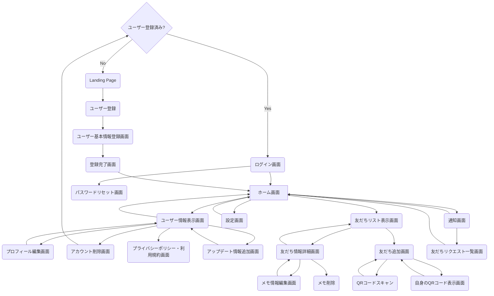
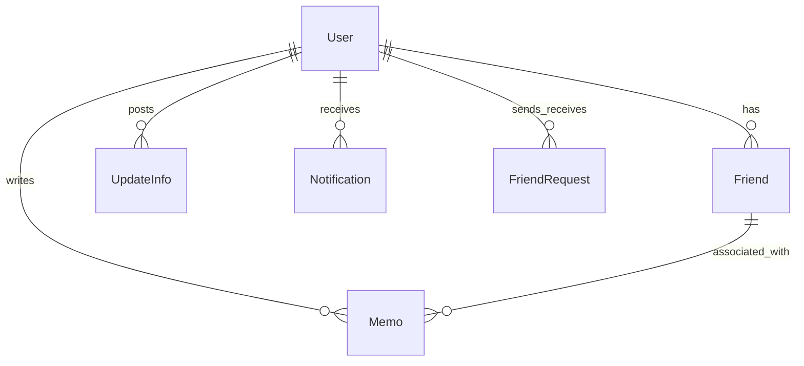

# Androidアプリを作って学ぶ　クリーンアーキテクチャ開発

## 0. はじめに

### 0.1 本書の目的とターゲットとする読者

近年、モバイルアプリケーション開発の現場では、アプリケーションの品質と保守性を向上させるために、クリーンアーキテクチャやMVVMなどのアーキテクチャパターンが広く採用されるようになりました。これらのアーキテクチャパターンは、関心事の分離、テスト容易性、拡張性などの利点を提供し、複雑化するアプリケーション開発において重要な役割を果たしています。

しかし、アーキテクチャパターンを理解し、実際のアプリケーション開発に適用することは、必ずしも容易ではありません。特に、Androidアプリケーション開発において、クリーンアーキテクチャやMVVMを正しく実践するためには、Androidプラットフォーム固有の知識と、アーキテクチャパターンの適用方法を理解する必要があります。

筆者は、Androidアプリケーション開発のためのアーキテクチャドキュメントを作成した際に、この問題に直面しました。アーキテクチャドキュメントは、アプリケーションの設計や構造を説明するために重要ですが、それだけでは不十分であると感じました。アーキテクチャドキュメントの内容を正しく理解し、実践するためには、具体的な実装例やベストプラクティスを示す副読本のようなテキストが必要だと考えました。

そこで、本書の執筆を始めました。本書は、Androidアプリケーション開発におけるクリーンアーキテクチャとMVVMの実践に焦点を当てた技術書です。アーキテクチャドキュメントの内容を補完し、実際のコード例を通してアーキテクチャパターンの適用方法を説明します。

本書のターゲットとする読者は、以下のような方々を想定しています：

1. Androidアプリケーション開発の経験があり、アプリケーションの設計や構造に関心がある方
2. クリーンアーキテクチャやMVVMなどのアーキテクチャパターンを学び、実践したいと考えている方
3. 既存のAndroidアプリケーションをリファクタリングし、品質と保守性を向上させたいと考えている方

ゼロから書籍を執筆し、公開することで、Androidアプリケーション開発におけるクリーンアーキテクチャとMVVMの実践に関する知見を広く共有し、アプリケーションの品質と保守性の向上に貢献したいと考えています。

## 0.2 本書の構成と学習内容

本書は、全7章で構成されており、各章では以下のような内容を学ぶことができます。

第1章では、クリーンアーキテクチャの基本的な概念と原則について説明します。クリーンアーキテクチャの各レイヤーの役割と責任、依存関係のルール、データの流れなどを理解することができます。

第2章では、MVVMアーキテクチャパターンについて説明します。MVVMの構成要素であるModel、View、ViewModelの役割と連携方法を学び、Androidアプリケーション開発におけるMVVMの適用方法を理解することができます。

第3章では、クリーンアーキテクチャとMVVMを組み合わせたアーキテクチャ設計について説明します。具体的なアプリケーション設計の例を通して、クリーンアーキテクチャとMVVMの連携方法を学ぶことができます。

第4章では、設計に基づいたアプリケーションの実装方法について説明します。Kotlinを使用したコード例を通して、クリーンアーキテクチャとMVVMの実装方法を学ぶことができます。依存性の注入、リポジトリパターン、ユースケースの実装などの具体的な手法を理解することができます。

第5章では、テスト駆動開発（TDD）の実践方法について説明します。ユニットテスト、統合テスト、UIテストの書き方と実行方法を学び、アプリケーションの品質を向上させるためのテスト戦略を理解することができます。

第6章では、クリーンアーキテクチャとMVVMの適用範囲と限界について議論します。アーキテクチャパターンの選択基準や、プロジェクトの特性に応じたアーキテクチャの適用方法について学ぶことができます。

第7章では、まとめと今後の展望について述べます。本書で学んだ内容を振り返り、クリーンアーキテクチャとMVVMを活用したAndroidアプリケーション開発の発展性について考察します。

本書を通して、読者の皆さんがAndroidアプリケーション開発におけるクリーンアーキテクチャとMVVMの実践方法を習得し、アプリケーションの設計と実装スキルを向上させることを願っています。また、本書が、アプリケーション開発の現場における品質と保守性の向上に寄与することを期待しています。

それでは、クリーンアーキテクチャとMVVMの世界を探求する旅に出発しましょう。

## 1. クリーンアーキテクチャの概要
### 1.1 クリーンアーキテクチャの基本原則
クリーンアーキテクチャは、ソフトウェアシステムを、関心事の分離（Separation of Concerns）の原則に基づいて設計するためのアーキテクチャパターンです。クリーンアーキテクチャの基本原則は以下の通りです：

#### 依存関係のルール
- 外側の層から内側の層への依存のみを許可し、内側の層から外側の層への依存を禁止する 
- これにより、ビジネスロジックが外部フレームワークや UI に依存しない、独立したものになる 

例えば、ユースケース層はフレームワーク・ドライバー層に依存しませんが、フレームワーク・ドライバー層はユースケース層に依存します

#### 関心事の分離
- システムを、異なる役割や責務を持つ複数の層に分割する 
- 各層は独立して開発、テスト、保守できるようにする 

例えば、UIの実装はフレームワーク・ドライバー層の責務であり、ビジネスロジックはユースケース層の責務です

#### 依存性の注入（DI）
- 上位の層が下位の層のインスタンスを直接生成するのではなく、インスタンスの生成と注入を分離する 
- これにより、各層の独立性と再利用性が高まる 

例えば、ユースケース層はリポジトリのインターフェースに依存しますが、その実装はフレームワーク・ドライバー層で行われ、DIを通じてユースケース層に提供されます

#### テスト容易性
- ビジネスロジックを UI やデータベースなどの外部要因から分離することで、ユニットテストが容易になる 
- 各層をモックやスタブに置き換えてテストできるようにする 

例えば、ユースケース層のテストでは、リポジトリの実装をモックに置き換えることで、外部依存なしにテストを実行できます

これらの原則を踏まえ、クリーンアーキテクチャでは、システムを以下の4つの層に分割します：

#### 1. エンティティ層（Entities）
- システムのビジネスルールを表現するオブジェクトを定義する 

例えば、Eコマースアプリケーションであれば、商品や注文などのオブジェクトがこの層に属します

#### 2. ユースケース層（Use Cases）
- システムの機能や操作を表現するユースケースを定義する 
- エンティティ層のビジネスルールを活用し、アプリケーション固有のビジネスルールを実装する 

例えば、「商品を注文する」「注文をキャンセルする」などのユースケースがこの層に属します

#### 3. インタフェース・アダプター層（Interface Adapters）
- ユースケース層とフレームワーク・ドライバー層の間の翻訳を行う 
- UI、データベース、外部サービスなどのインタフェースを、ユースケース層が扱いやすい形に変換する 

例えば、データベースアクセスを行うリポジトリの実装がこの層に属します

#### 4. フレームワーク・ドライバー層（Frameworks & Drivers）
- 外部フレームワーク、ライブラリ、データベース、UI などの具体的な実装を含む 

例えば、Android SDKやデータベースライブラリなどがこの層に属します

### 1.2 各層の責務と相互作用

クリーンアーキテクチャの4つの層は、それぞれ以下のような責務を持ちます

#### 1. エンティティ層
- システムのビジネスルールを表現するオブジェクトを定義する 
- 最も内側の層であり、他の層に依存しない 

#### 2. ユースケース層
- システムの機能や操作を表現するユースケースを定義する 
- エンティティ層のビジネスルールを活用し、アプリケーション固有のビジネスルールを実装する 

#### 3. インタフェース・アダプター層
- ユースケース層とフレームワーク・ドライバー層の間の翻訳を行う 
- UI、データベース、外部サービスなどのインタフェースを、ユースケース層が扱いやすい形に変換する 

#### 4. フレームワーク・ドライバー層
- 外部フレームワーク、ライブラリ、データベース、UI などの具体的な実装を含む 
- 最も外側の層であり、内側の層に依存する 

これらの層は、依存関係のルールに従って相互作用します。内側の層は外側の層に依存せず、外側の層が内側の層に依存します。この相互作用を図で表すと以下のようになります

 

この図では、矢印が依存の方向を表しています。外側の層が内側の層を呼び出すことはできますが、内側の層が外側の層を呼び出すことはできません。

クリーンアーキテクチャのこの構造により、以下のようなメリットが得られます：

- 各層が独立しているため、変更の影響が局所的に留まる 
- ビジネスロジックが UI や外部フレームワークから分離されているため、再利用性と保守性が高い 
- 各層をモックやスタブに置き換えてテストできるため、テスト容易性が高い 

以上が、クリーンアーキテクチャの概要となります。次の章では、これらの原則をAndroidアプリ開発に適用する方法について詳しく説明します。

## 2. クリーンアーキテクチャとAndroidアプリ開発
### 2.1 Androidアプリの一般的なアーキテクチャ

Androidアプリ開発において、一般的に使用されているアーキテクチャパターンはいくつかあります。その中でも、MVCやMVPなどが広く知られていると思います。

- MVC（Model-View-Controller）
  - モデル（Model）：アプリケーションのデータと業務ロジックを担当
  - ビュー（View）：ユーザーインターフェースを担当
  - コントローラー（Controller）：モデルとビューを制御し、アプリケーションの流れを管理

- MVP（Model-View-Presenter）
  - モデル（Model）：アプリケーションのデータと業務ロジックを担当
  - ビュー（View）：ユーザーインターフェースを担当し、プレゼンターからの指示に従って表示を更新
  - プレゼンター（Presenter）：ビューとモデルを仲介し、ユーザーアクションに応じた処理を行う

これらのアーキテクチャパターンは、関心事の分離を目的としていますが、実際のAndroidアプリ開発では、以下のような課題が生じることがあります

1. ビューとロジックの密結合
   - アクティビティやフラグメントが、UIの表示だけでなく、データの取得や処理も行うことが多い
   - これにより、クラスが肥大化し、保守性が低下する

2. テストの難しさ
   - ビューとロジックが密結合していると、ユニットテストが書きにくくなる
   - UIテストは実行に時間がかかり、不安定になりがちである

3. 変更の影響範囲
   - 要件の変更によって、複数の箇所を修正しなければならないことがある
   - これは、関心事の分離が不十分であることが原因である

これらの課題を解決するために、クリーンアーキテクチャの適用が有効と考えています。

### 2.2 クリーンアーキテクチャをAndroidに適用する利点

クリーンアーキテクチャをAndroidアプリ開発に適用することで、以下のような利点が得られます：

1. 各レイヤーの責務が明確になる
   - 各レイヤーが独立しており、それぞれの責務が明確に定義されています。
   - これにより、チーム内で設計について議論しやすくなり、コードの理解も深まります。

2. インターフェースを通じた依存関係の管理
   - 各レイヤーはインターフェースを通じて連携します。
   - インターフェースを定義することで、レイヤー間の依存関係を明確にし、疎結合な設計を実現できます。

3. テスト容易性の向上
   - 各レイヤーが独立しているため、レイヤーごとにテストを書くことができます。
   - インターフェースを使用してモックやスタブを作成することで、ユニットテストが書きやすくなります。

4. コードレビューの効率化
   - レイヤー間の依存関係が明確になることで、コードレビューの範囲を限定しやすくなります。
   - インターフェースとの整合性をチェックすることで、実装の妥当性を確認できます。

5. 変更の影響範囲の限定
   - 各レイヤーが独立しているため、ある層の変更が他の層に与える影響を最小限に抑えることができます。
   - これにより、機能の追加や変更を行う際の副作用を減らすことができます。

クリーンアーキテクチャは、こうした利点により、`多人数での開発を行う際に特に威力を発揮`します。レイヤー間の責務やインターフェースを明確にすることで、チーム内でのコミュニケーションが円滑になり、設計の理解も深まります。

また、インターフェースとの整合性をチェックすることで、実装の妥当性を機械的に確認できる（例：IDEによる警告が表示される）のも大きなメリットです。コードレビューと合わせて、インターフェースとの整合性チェックを行うことで、より高品質なコードを維持することができます。

クリーンアーキテクチャは、設計の議論から実装、テスト、メンテナンスに至るまで、開発プロセス全体を通して効果を発揮します。特に、複数のチームメンバーが関わる大規模なプロジェクトにおいて、その真価が発揮されるでしょう。

具体的には、以下のようにクリーンアーキテクチャをAndroidアプリ開発に適用します：

- プレゼンテーション層（UI）
  - アクティビティ、フラグメント、ビューが担当
  - MVVM（Model-View-ViewModel）パターンを適用し、ビューとロジックを分離
  - ビューモデルがドメイン層のユースケースを呼び出す

- ドメイン層
  - ビジネスロジックを担当するユースケースを配置
  - Android SDKに依存しないようにする
  - インタフェース・アダプター層を介してデータ層にアクセスする

- データ層
  - リポジトリ、データソース、APIクライアントなどを配置
  - ローカルデータベースやWebAPIなどの実装を行う
  - データ層の実装をドメイン層から隠蔽する

以上のように、クリーンアーキテクチャをAndroidアプリ開発に適用することで、関心事の分離、テスト容易性、保守性の向上が期待できます。

次章では、これらの原則に基づいて、実際にLinkedPalアプリケーションの設計を行っていきます。

## 3. クリーンアーキテクチャに基づくAndroidアプリの設計
### 3.1 LinkedPalの要件整理

 

まずは、LinkedPalアプリケーションのコンセプトを確認します。LinkedPalは、以下のようなコンセプトを掲げています：

- 友人関係を大切にしながらも、プライバシーを守れるプライベートSNS
- QRコードで簡単に友人登録でき、個別のメモ機能で大切な情報を記録・共有できる
- 友人との絆を深め、思い出を残すためのツール

このコンセプトを念頭に置きながら、ユーザーストーリーを導き出していきます。

#### 3.1.2 画面遷移図の確認

次に、画面遷移図を確認します。画面遷移図は、アプリケーションの画面構成と画面間の遷移を視覚的に表現したものです。企画者より提示されたLinkedPalの画面遷移図は以下のようになっているものとしましょう：



この画面遷移図から、ユーザーがアプリケーションでどのような動作を行うのかを読み取ることができます。

#### 3.1.3 ユーザーストーリーの作成

画面遷移図を基に、ユーザーストーリーを作成していきます。ユーザーストーリーは、エンドユーザーの視点で、アプリケーションに必要な機能を表現したものです。以下のようなフォーマットで記述します：

```
「ユーザーは、～～したい。なぜなら、～～だからだ。」
```

LinkedPalの画面遷移図から、以下のようなユーザーストーリーを導き出すことができます：

1. ユーザー登録とログイン
   - ユーザーは、アプリを初めて起動したときに、ユーザー登録を行いたい。なぜなら、LinkedPalを利用するためにはアカウントが必要だからだ。
   - ユーザーは、登録済みのアカウントでログインしたい。なぜなら、LinkedPalを利用するためにはログインが必要だからだ。

2. ホーム画面
   - ユーザーは、ログイン後にホーム画面を表示したい。なぜなら、ホーム画面からLinkedPalの主要な機能にアクセスできるからだ。

3. 友だち管理
   - ユーザーは、友だちリストを表示したい。なぜなら、LinkedPalで繋がっている友だちを確認したいからだ。
   - ユーザーは、QRコードを読み取ることで簡単に友だち追加したい。なぜなら、IDの入力なしで友だちを追加できると便利だからだ。
   - ユーザーは、自身のQRコードを表示することで友だちへの追加を依頼したい。なぜなら簡易な手段で友だち追加を依頼できると便利だからだ。
   - ユーザーは、友だちリクエストの通知を受け取りたい。なぜなら、新しい友だちリクエストがあることを知りたいからだ。
   - ユーザーは、友だちの詳細情報を表示したい。なぜなら、そこから友だちからのアップデート（Tweet的なもの）を確認したいからだ。

4. メモ機能
   - ユーザーは、友だちごとにメモを作成・編集・削除したい。なぜなら、友だちとの大切な情報を記録・共有したいからだ。
   - ユーザーは、友だちの詳細情報表示画面において友だちからのアップデートとメモの表示を切り替えて表示したい。なぜならメモとアップデート情報を明確に切り分けて確認したいからだ

5. ユーザー情報管理
   - ユーザーは、自分のプロフィールを編集したい。なぜなら、LinkedPal上の自分の情報を最新に保ちたいからだ。
   - ユーザーは、アカウントを削除したい。なぜなら、LinkedPalを利用しなくなった場合にアカウントを削除できるようにしたいからだ。
   - ユーザーは、アップデート情報を追加したい。なぜなら友だち全員に知っておいてもらいたいことを通知したいからだ
   - ユーザーは、プライバシーポリシーと利用規約を確認したい。なぜなら、LinkedPalを安心して利用するために、プライバシーポリシーと利用規約を理解しておきたいからだ。

これらのユーザーストーリーは、LinkedPalアプリケーションに必要な主要な機能を表しています。ユーザーストーリーを作成することで、エンドユーザーの視点でアプリケーションの要件を整理することができます。

次のステップでは、これらのユーザーストーリーを基に、機能要件の明確化を行います。

#### 3.1.4 機能要件の明確化

ユーザーストーリーを作成したら、次はそれらを基に機能要件を明確化していきます。機能要件とは、アプリケーションが提供すべき機能を具体的に定義したものです。

ユーザーストーリーから導き出されたLinkedPalの主要な機能要件は以下の通りです：

## 3.1.4 機能要件の明確化

1. ユーザー登録とログイン
   - 新規ユーザー登録機能
     - ユーザーがアプリを初めて起動したときに、ユーザー登録を行える
     - 登録にはメールアドレスとパスワードが必要
     - 登録が完了したら、ユーザー基本情報登録画面に遷移する
     - UI状態：`RegisterUiState`
       - `Idle`：初期状態
       - `Success`：登録成功
       - `Error`：登録エラー
   - ログイン機能
     - 登録済みのメールアドレスとパスワードでログインできる
     - ログインが成功したら、ホーム画面に遷移する
     - UI状態：`LoginUiState`
       - `Idle`：初期状態
       - `Success`：ログイン成功
       - `Error`：ログインエラー
   - パスワードリセット機能
     - パスワードを忘れた場合、登録済みのメールアドレスを入力することでパスワードをリセットできる
     - UI状態：`ResetPasswordUiState`
       - `Idle`：初期状態
       - `Success`：パスワードリセット成功
       - `Error`：パスワードリセットエラー

2. ホーム画面
   - ホーム画面表示機能
     - ログイン後、ホーム画面が表示される
     - ホーム画面には、友だちリスト、設定、通知へのアクセスボタンが表示される
     - 表示切り替えボタンにより「友だちリスト」と「ユーザープロフィール」は切り替えて表示される
     - UI状態：`HomeUiState`
       - `Loading`：データ読み込み中
       - `Content`：データ表示中
       - `Error`：エラー発生

3. 友だち管理
   - 友だちリスト表示機能
     - ホーム画面から友だちリスト画面に遷移できる
     - 友だちリストには、LinkedPalで繋がっている友だちの一覧が表示される
     - UI状態：`FriendsUiState`
       - `Loading`：データ読み込み中
       - `Content`：データ表示中
       - `Error`：エラー発生
   - 友だち追加機能
     - 友だちリスト画面から友だち追加画面に遷移できる
     - 友だち追加画面では、QRコードをスキャンすることで友だちを追加できる
     - UI状態：`AddFriendUiState`
       - `Idle`：初期状態
       - `ScanningQrCode`:QRコード読み取り中
       - `QrCodeScanned`:QRコード読み取り完了
       - `ShowingOwnQrCode`: 自身のQRコード表示中
       - `Loading`: データ読み込み中
       - `Success`：友だち追加成功
       - `Error`：友だち追加エラー
   - 友だちリクエスト通知機能
     - 新しい友だちリクエストがあると、通知画面に友だちリクエストが表示される
     - 友だちリクエストを承認または拒否できる
   - アップデート情報表示機能
     - 友だちが追加したアップデート情報を友だち情報詳細画面上で確認できる

4. メモ機能
   - メモ作成機能
     - 友だち情報詳細画面からメモ情報編集画面に遷移できる
     - メモ情報編集画面では、友だちに関するメモを新規作成できる
     - UI状態：`MemoUiState`
       - `Idle`：初期状態
       - `Success`：メモ作成成功
       - `Error`：メモ作成エラー
   - メモ編集機能
     - メモ情報編集画面では、既存のメモを編集できる
     - UI状態：`MemoUiState`
       - `Idle`：初期状態
       - `Success`：メモ編集成功
       - `Error`：メモ編集エラー
   - メモ削除機能
     - 友だち情報詳細画面からメモを削除できる
     - UI状態：`MemoUiState`
       - `Idle`：初期状態
       - `Success`：メモ削除成功
       - `Error`：メモ削除エラー

5. ユーザー情報管理
   - プロフィール編集機能
     - ホーム画面からユーザー情報更新画面に遷移できる
     - ユーザー情報表示画面からプロフィール編集画面に遷移できる
     - プロフィール編集画面では、ユーザーの氏名、プロフィール画像などを編集できる
     - UI状態：`ProfileUiState`
       - `Idle`：初期状態
       - `Success`：プロフィール編集成功
       - `Error`：プロフィール編集エラー
   - アカウント削除機能
     - ユーザー情報更新画面からアカウント削除画面に遷移できる
     - アカウント削除画面では、アカウントを削除できる
     - アカウントを削除すると、ログイン画面に戻る
     - UI状態：`SettingsUiState`
       - `Idle`：初期状態
       - `Success`：アカウント削除成功
       - `Error`：アカウント削除エラー
   - プライバシーポリシー・利用規約表示機能
     - ユーザー情報更新画面からプライバシーポリシー・利用規約画面に遷移できる
     - プライバシーポリシー・利用規約画面では、LinkedPalのプライバシーポリシーと利用規約を確認できる
   - アップデート情報管理機能
     - ユーザー情報表示画面からアップデート情報追加画面に遷移できる
     - アップデート情報追加画面では、テキストデータをTweetのように作成できる
     - UI状態：`UpdateInfoUiState`
       - `Idle`：初期状態
       - `Success`：アップデート情報追加成功
       - `Error`：アップデート情報追加エラー


これらの機能要件は、LinkedPalアプリケーションが提供すべき具体的な機能を表しています。機能要件を明確化することで、開発チームはアプリケーションに必要な機能を漏れなく把握することができるようになりました。

次のステップでは、これらの機能要件を満たすために、非機能要件の検討を行います。

#### 3.1.5 非機能要件の検討

機能要件が「アプリケーションが何をするか」を定義するのに対し、非機能要件は「アプリケーションがどのように動作すべきか」を定義します。具体的には、パフォーマンス、セキュリティ、ユーザビリティ、信頼性などの要件が含まれます。

LinkedPalアプリケーションの非機能要件を以下のように検討します：

1. パフォーマンス
   - アプリケーションの起動時間
     - アプリケーションは、ユーザーがアイコンをタップしてから3秒以内に起動する
   - 画面遷移の応答時間
     - 画面遷移は、ユーザーがボタンをタップしてから1秒以内に完了する
   - QRコード読み取りの速度
     - QRコードの読み取りは、ユーザーがカメラをQRコードに向けてから2秒以内に完了する

2. セキュリティ
   - ユーザー情報の保護
     - ユーザーの個人情報（メールアドレス、パスワードなど）は、暗号化して保存する
     - ユーザー情報へのアクセスは、認証と認可のメカニズムで制御する
   - 通信の暗号化
     - アプリケーションとサーバー間の通信は、SSL/TLSを使用して暗号化する

3. ユーザビリティ
   - 直感的なユーザーインターフェース
     - ユーザーインターフェースは、シンプルで分かりやすいデザインにする
     - ユーザーが目的の機能に素早くアクセスできるようにナビゲーションを設計する
   - アクセシビリティ
     - アプリケーションは、視覚障害者や色覚異常者でも使いやすいようにデザインする
     - 適切なコントラストや代替テキストを提供する

4. 信頼性
   - エラー処理
     - アプリケーションは、予期しないエラーが発生した場合でも安全に動作する
     - エラーメッセージをユーザーにわかりやすく表示し、適切な回復方法を提示する
   - データの整合性
     - アプリケーションは、データの不整合が発生しないように設計する
     - データの更新や削除時に、関連するデータも適切に処理する

5. 互換性
   - サポート対象のAndroidバージョン
     - アプリケーションは、Android 8.0（APIレベル26）以上をサポートする
   - 異なる画面サイズへの対応
     - アプリケーションは、様々な画面サイズ（スマートフォン、タブレットなど）に適切に表示される

これらの非機能要件は、LinkedPalアプリケーションが満たすべき品質基準を表しています。非機能要件を検討することで、開発チームはアプリケーションの品質を向上させ、ユーザーの満足度を高めることができます。

非機能要件の検討は、機能要件の実現方法にも影響を与えます。例えば、セキュリティの要件を満たすために、特定のライブラリや暗号化アルゴリズムを使用する必要があるかもしれません。

次のステップでは、ここまでに整理された機能要件と非機能要件を基に、クリーンアーキテクチャの原則に沿ってアプリケーションの設計を行っていくことになります。

### 3.2 クリーンアーキテクチャに基づく設計

クリーンアーキテクチャの原則に沿って、LinkedPalアプリケーションの設計を行います。設計は、以下の3つのレイヤーに分けて進めていきます：

1. プレゼンテーション層
2. ドメイン層
3. データ層

#### 3.2.1 プレゼンテーション層の設計

プレゼンテーション層は、ユーザーインターフェースとユーザーとのインタラクションを担当するレイヤーです。LinkedPalアプリケーションのプレゼンテーション層の設計を以下のように行います：

1. 画面遷移図を基にしたUI設計 
   - 画面遷移図を基に、各画面のワイヤーフレームを作成する 
   - ワイヤーフレームは、画面のレイアウトとUIコンポーネントの配置を示す 
   - ワイヤーフレームを基に、詳細なUIデザインを作成する 

2. MVVM（Model-View-ViewModel）パターンの適用 
   - プレゼンテーション層にMVVMパターンを適用する 
   - UIの状態とロジックをViewModelに集約し、Viewとの依存関係を減らす 
   - ViewModelは、ドメイン層のユースケースを呼び出してデータを取得し、Viewに提供する 
   - ViewModelは、UIの状態を表すデータクラスを定義し、管理する 

3. Jetpack Composeの活用 
   - UIの実装にJetpack Composeを活用する 
   - Jetpack Composeは、宣言的UIの構築を可能にするモダンなUIツールキット 
   - コードベースのシンプル化と、UIの状態管理の改善が期待できる 

以下、主要な画面について、その役割と責務、UIステートやイベントの概要を説明します：

##### ログイン画面
- 役割と責務：
  - ユーザーがアプリケーションにログインするための画面
  - メールアドレスとパスワードの入力フィールド、ログインボタン、登録画面へのリンクを提供
- UIステートとイベント：
  - メールアドレスとパスワードの入力状態を管理
  - ログインボタンのクリックイベントを処理
  - ログインの成功または失敗に応じて、適切な画面遷移または

エラーメッセージの表示を行う

##### 登録画面
- 役割と責務：
  - 新規ユーザーがアプリケーションにアカウントを登録するための画面
  - ユーザー名、メールアドレス、パスワードの入力フィールド、登録ボタンを提供
- UIステートとイベント：
  - ユーザー名、メールアドレス、パスワードの入力状態を管理
  - 登録ボタンのクリックイベントを処理
  - 登録の成功または失敗に応じて、適切な画面遷移またはエラーメッセージの表示を行う

##### ホーム画面
- 役割と責務：
  - アプリケーションのメイン画面で、ユーザーの基本情報や友だちリストを表示
  - 友だちリスト、設定、通知へのアクセスボタンを提供
- UIステートとイベント：
  - ユーザー情報と友だちリストのデータを管理
  - 友だちリスト、設定、通知ボタンのクリックイベントを処理
  - 適切な画面遷移を行う

##### 友だち追加画面
- 役割と責務：
  - ユーザーが新しい友だちを追加するための画面
  - QRコードのスキャンまたは表示により、友だちを追加する機能を提供
- UIステートとイベント：
  - QRコードのスキャンまたは表示の状態を管理
  - 友だち追加の成功または失敗に応じて、適切な画面遷移またはエラーメッセージの表示を行う

##### 友だち情報詳細表示画面
- 役割と責務：
  - 選択された友だちの詳細情報を表示する画面
  - 友だちのプロフィール情報、メモ、アップデート情報を表示
- UIステートとイベント：
  - 友だちの詳細情報、メモ、アップデート情報のデータを管理
  - メモの編集または削除イベントを処理

##### メモ追加画面
- 役割と責務：
  - ユーザーが友だちに関するメモを追加または編集するための画面
  - メモのタイトルと本文の入力フィールド、保存ボタンを提供
- UIステートとイベント：
  - メモのタイトルと本文の入力状態を管理
  - 保存ボタンのクリックイベントを処理
  - メモの保存の成功または失敗に応じて、適切な画面遷移またはエラーメッセージの表示を行う

承知しました。それでは、残りの画面についても同様に説明を続けます。

##### ユーザー情報管理画面
- 役割と責務：
  - ユーザーが自分のプロフィール情報を編集するための画面
  - ユーザー名、プロフィール画像、自己紹介文の編集機能を提供
- UIステートとイベント：
  - ユーザー名、プロフィール画像、自己紹介文の入力状態を管理
  - 保存ボタンのクリックイベントを処理
  - プロフィール情報の更新の成功または失敗に応じて、適切な画面遷移またはエラーメッセージの表示を行う

##### 設定画面
- 役割と責務：
  - アプリケーションの設定を行うための画面
  - 通知設定、プライバシー設定、アカウント管理などの機能を提供
- UIステートとイベント：
  - 各設定項目の状態を管理
  - 設定変更イベントを処理
  - 設定変更の成功または失敗に応じて、適切な画面遷移またはエラーメッセージの表示を行う

##### パスワードリセット画面
- 役割と責務：
  - ユーザーがパスワードをリセットするための画面
  - メールアドレスの入力フィールドとパスワードリセットボタンを提供
- UIステートとイベント：
  - メールアドレスの入力状態を管理
  - パスワードリセットボタンのクリックイベントを処理
  - パスワードリセットの成功または失敗に応じて、適切な画面遷移またはエラーメッセージの表示を行う

##### ユーザー情報登録画面
- 役割と責務：
  - ユーザーが登録後に追加のプロフィール情報を入力するための画面
  - ユーザー名、プロフィール画像、自己紹介文の入力フィールドを提供
- UIステートとイベント：
  - ユーザー名、プロフィール画像、自己紹介文の入力状態を管理
  - 登録ボタンのクリックイベントを処理
  - ユーザー情報の登録の成功または失敗に応じて、適切な画面遷移またはエラーメッセージの表示を行う

##### 登録完了画面
- 役割と責務：
  - ユーザー登録が完了したことを知らせるための画面
  - アプリケーションを開始するためのボタンを提供
- UIステートとイベント：
  - 開始ボタンのクリックイベントを処理
  - ホーム画面への遷移を行う

##### 通知画面
- 役割と責務：
  - ユーザーに届いた通知を表示するための画面
  - 友だちリクエストや新着メッセージなどの通知を一覧表示
- UIステートとイベント：
  - 通知のリストデータを管理
  - 通知のタップイベントを処理
  - 適切な画面（友だちリクエスト一覧、チャット画面など）への遷移を行う

##### 友だちリクエスト一覧画面
- 役割と責務：
  - ユーザーに届いた友だちリクエストを一覧表示するための画面
  - 友だちリクエストの承認または拒否を行う機能を提供
- UIステートとイベント：
  - 友だちリクエストのリストデータを管理
  - 承認または拒否ボタンのクリックイベントを処理
  - 友だちリクエストの承認または拒否の成功または失敗に応じて、適切な画面遷移またはエラーメッセージの表示を行う

##### プライバシーポリシー画面
- 役割と責務：
  - アプリケーションのプライバシーポリシーを表示するための画面
  - プライバシーポリシーの内容をスクロール可能なテキストで表示
- UIステートとイベント：
  - プライバシーポリシーのテキストデータを管理
  - 画面のスクロールイベントを処理

##### サービス利用規約画面
- 役割と責務：
  - アプリケーションのサービス利用規約を表示するための画面
  - サービス利用規約の内容をスクロール可能なテキストで表示
- UIステートとイベント：
  - サービス利用規約のテキストデータを管理
  - 画面のスクロールイベントを処理

##### アップデート情報追加画面
- 役割と責務：
  - ユーザーが新しいアップデート情報を投稿するための画面
  - テキスト入力フィールドと投稿ボタンを提供
- UIステートとイベント：
  - アップデート情報のテキスト入力状態を管理
  - 投稿ボタンのクリックイベントを処理
  - アップデート情報の投稿の成功または失敗に応じて、適切な画面遷移またはエラーメッセージの表示を行う

以上で、LinkedPalアプリケーションの主要な画面について、役割と責務、UIステートやイベントの概要を説明しました。

次のステップでは、このようなプレゼンテーション層の設計を、ドメイン層やデータ層の設計と組み合わせて、アプリケーション全体のアーキテクチャを構築していきます。

次に、ドメイン層の設計について説明します。

#### 3.2.2 ドメイン層の設計

ドメイン層は、アプリケーションのビジネスロジックを担当する層です。ここでは、ドメインモデル（エンティティ）とユースケースを定義します。

##### ドメインモデル（エンティティ）の定義

まずは、アプリケーションのコアとなるドメインモデルを定義します。LinkedPalアプリケーションでは、以下のようなドメインモデルが考えられます：

```kotlin
data class User(
    val id: String,
    val username: String,
    val email: String
)

data class Friend(
    val id: String,
    val username: String
)

data class UpdateInfo(
    val id: String,
    val userId: String,
    val content: String,
    val timestamp: Long
)

data class Memo(
    val id: String,
    val friendId: String,
    val title: String,
    val content: String
)

data class Notification(
    val id: String,
    val type: NotificationType,
    val message: String,
    val timestamp: Long
)

enum class NotificationType {
    FRIEND_REQUEST,
    NEW_MESSAGE
}

data class FriendRequest(
    val id: String,
    val senderId: String,
    val receiverId: String,
    val status: FriendRequestStatus,
    val timestamp: Long
)

data class UserInfo(
    val name: String = "",
    val bio: String = "",
    val profileImageUri: Uri? = null
)
```

これらのドメインモデルは、アプリケーションのコアとなるエンティティを表現しています。`User`は、ユーザーを表すモデルで、`Friend`は友だちを表すモデルです。`UpdateInfo`は、ユーザーが投稿するアップデート情報を表すモデルです。`Memo`は、ユーザーが友だちに関連付けて作成するメモを表すモデルです。`Notification`は、友だちリクエストや新着メッセージなどの通知を表すモデルです。`FriendRequest`は、友だちリクエストを表すモデルです。`UserInfo`は、ユーザーの名前、自己紹介、プロフィール画像を表すモデルです。

##### ユースケースの定義

次に、アプリケーションのビジネスロジックを表現するユースケースを定義します。LinkedPalアプリケーションでは、以下のようなユースケースが考えられます：

```kotlin
class LoginUseCase(private val userRepository: UserRepository) {
    suspend operator fun invoke(username: String, password: String): User {
        return userRepository.login(username, password)
    }
}

class RegisterUseCase(private val userRepository: UserRepository) {
    suspend operator fun invoke(username: String, email: String, password: String): User {
        return userRepository.register(username, email, password)
    }
}

class GetUserProfileUseCase(private val userRepository: UserRepository) {
    suspend operator fun invoke(): User {
        return userRepository.getCurrentUser()
    }
}

class GetFriendsUseCase(private val friendRepository: FriendRepository) {
    suspend operator fun invoke(): List<Friend> {
        return friendRepository.getFriends()
    }
}

class AddFriendUseCase(private val friendRepository: FriendRepository) {
    suspend operator fun invoke(friendId: String) {
        friendRepository.addFriend(friendId)
    }
}

class GetUpdateInfoUseCase(private val updateInfoRepository: UpdateInfoRepository) {
    suspend operator fun invoke(userId: String): List<UpdateInfo> {
        return updateInfoRepository.getUpdateInfo(userId)
    }
}

class SaveMemoUseCase(private val memoRepository: MemoRepository) {
    suspend operator fun invoke(friendId: String, title: String, content: String) {
        memoRepository.saveMemo(friendId, title, content)
    }
}

class GetMemosUseCase(private val memoRepository: MemoRepository) {
    suspend operator fun invoke(friendId: String): List<Memo> {
        return memoRepository.getMemosForFriend(friendId)
    }
}

class GetNotificationsUseCase(private val notificationRepository: NotificationRepository) {
    suspend operator fun invoke(): List<Notification> {
        return notificationRepository.getNotifications()
    }
}

class GetFriendRequestsUseCase(private val friendRequestRepository: FriendRequestRepository) {
    suspend operator fun invoke(): List<FriendRequest> {
        return friendRequestRepository.getFriendRequests()
    }
}

class AcceptFriendRequestUseCase(private val friendRequestRepository: FriendRequestRepository) {
    suspend operator fun invoke(friendRequestId: String) {
        friendRequestRepository.acceptFriendRequest(friendRequestId)
    }
}

class RejectFriendRequestUseCase(private val friendRequestRepository: FriendRequestRepository) {
    suspend operator fun invoke(friendRequestId: String) {
        friendRequestRepository.rejectFriendRequest(friendRequestId)
    }
}

class GetPrivacyPolicyUseCase(private val privacyPolicyRepository: PrivacyPolicyRepository) {
    suspend operator fun invoke(): String {
        return privacyPolicyRepository.getPrivacyPolicy()
    }
}

class GetTermsOfServiceUseCase(private val termsOfServiceRepository: TermsOfServiceRepository) {
    suspend operator fun invoke(): String {
        return termsOfServiceRepository.getTermsOfService()
    }
}

class UpdateUserInfoUseCase(private val userRepository: UserRepository) {
    suspend operator fun invoke(userInfo: UserInfo) {
        userRepository.updateUserInfo(userInfo)
    }
}

class AddUpdateInfoUseCase(private val updateInfoRepository: UpdateInfoRepository) {
    suspend operator fun invoke(content: String, imageUrl: String?, userId: String, timestamp: Long) {
        val updateInfo = UpdateInfo(
            id = generateId(),
            content = content,
            imageUrl = imageUrl,
            userId = userId,
            timestamp = timestamp
        )
        updateInfoRepository.addUpdateInfo(updateInfo)
    }
    
    private fun generateId(): String {
        // IDの生成ロジックを実装
        return UUID.randomUUID().toString()
    }
}

class GetFriendDetailUseCase(private val friendRepository: FriendRepository) {
    suspend operator fun invoke(friendId: String): Friend {
        return friendRepository.getFriendDetail(friendId)
    }
}

class GetUpdateInfoListUseCase(private val updateInfoRepository: UpdateInfoRepository) {
    suspend operator fun invoke(friendId: String): List<UpdateInfo> {
        return updateInfoRepository.getUpdateInfoList(friendId)
    }
}

class GetMemoListUseCase(private val memoRepository: MemoRepository) {
    suspend operator fun invoke(friendId: String): List<Memo> {
        return memoRepository.getMemoList(friendId)
    }
}

class ResetPasswordUseCase(private val userRepository: UserRepository) {
    suspend operator fun invoke(email: String) {
        userRepository.resetPassword(email)
    }
}

class DeleteUserAccountUseCase(private val userRepository: UserRepository) {
    suspend operator fun invoke() {
        userRepository.deleteAccount()
    }
}

class SendFriendRequestUseCase(
    private val friendRequestRepository: FriendRequestRepository,
    private val userRepository: UserRepository
) {
    suspend operator fun invoke(receiverId: String) {
        val currentUser = userRepository.getCurrentUser()
        val friendRequest = FriendRequest(
            id = generateId(),
            senderId = currentUser.id,
            receiverId = receiverId,
            status = FriendRequestStatus.PENDING,
            timestamp = System.currentTimeMillis()
        )
        friendRequestRepository.sendFriendRequest(friendRequest)
    }

    private fun generateId(): String {
        // IDの生成ロジックを実装
        return UUID.randomUUID().toString()
    }
}
```

これらのユースケースは、アプリケーションのビジネスロジックを表現しています。各ユースケースは、リポジトリインターフェースを介してデータ層とやり取りを行います。

例えば、`LoginUseCase`は、`UserRepository`インターフェースを介してユーザーのログイン処理を行います。`GetFriendsUseCase`は、`FriendRepository`インターフェースを介して友だちのリストを取得します。`SaveMemoUseCase`は、`MemoRepository`インターフェースを介してメモの保存処理を行います。`GetMemosUseCase`は、特定の友だちに関連するメモのリストを取得します。`GetFriendDetailUseCase`は、特定の友だちの詳細情報を取得します。`GetUpdateInfoListUseCase`は、特定の友だちが投稿したアップデート情報のリストを取得します。`GetMemoListUseCase`は、特定の友だちに関連付けられたメモのリストを取得します。`GetNotificationsUseCase`は、通知のリストを取得します。`GetFriendRequestsUseCase`は、友だちリクエストのリストを取得します。`AcceptFriendRequestUseCase`は、友だちリクエストを承認します。`RejectFriendRequestUseCase`は、友だちリクエストを拒否します。`GetPrivacyPolicyUseCase`は、プライバシーポリシーを取得します。`GetTermsOfServiceUseCase`は、利用規約を取得します。`UpdateUserInfoUseCase`は、ユーザー情報を更新します。

##### リポジトリインターフェースの定義

ユースケースからデータ層にアクセスするために、リポジトリインターフェースを定義します。LinkedPalアプリケーションでは、以下のようなリポジトリインターフェースが考えられます：

```kotlin
interface UserRepository {
    suspend fun login(username: String, password: String): User
    suspend fun register(username: String, email: String, password: String): User
    suspend fun getCurrentUser(): User
    suspend fun updateUserInfo(userInfo: UserInfo)
    suspend fun resetPassword(email: String)
    suspend fun deleteAccount()
}

interface FriendRepository {
    suspend fun getFriends(): List<Friend>
    suspend fun addFriend(friendId: String)
    suspend fun getFriendDetail(friendId: String): Friend
}

interface UpdateInfoRepository {
    suspend fun getUpdateInfoList(friendId: String): List<UpdateInfo>
    suspend fun addUpdateInfo(content: String, timestamp: Long)
}

interface MemoRepository {
    suspend fun saveMemo(memo: Memo)
    suspend fun getMemoList(friendId: String): List<Memo>
}

interface NotificationRepository {
    suspend fun getNotifications(): List<Notification>
}

interface FriendRequestRepository {
    suspend fun getFriendRequests(): List<FriendRequest>
    suspend fun acceptFriendRequest(friendRequestId: String)
    suspend fun rejectFriendRequest(friendRequestId: String)
    suspend fun sendFriendRequest(receiverId: String)
}

interface PrivacyPolicyRepository {
    suspend fun getPrivacyPolicy(): String
}

interface TermsOfServiceRepository {
    suspend fun getTermsOfService(): String
}

```

これらのリポジトリインターフェースは、データ層の実装を隠蔽し、ドメイン層に対して統一的なインターフェースを提供します。

ユースケースは、これらのリポジトリインターフェースを介してデータ層とやり取りを行います。これにより、ドメイン層とデータ層の結合度を下げ、アプリケーションの保守性と拡張性を高めることができます。

以上が、LinkedPalアプリケーションのドメイン層の設計例です。実際のアプリケーション開発では、これらのドメインモデル、ユースケース、リポジトリインターフェースをプロジェクトの要件に合わせてカスタマイズする必要があります。

ドメイン層の設計では、以下の点に留意しましょう：

1. ドメインモデルは、アプリケーションのコアとなるエンティティを表現するようにする。
2. ユースケースは、アプリケーションのビジネスロジックを表現するようにする。
3. リポジトリインターフェースは、データ層の実装を隠蔽し、ドメイン層に対して統一的なインターフェースを提供するようにする。
4. ドメイン層は、他の層（プレゼンテーション層やデータ層）に依存しないようにする。

これらの点を意識しながらドメイン層を設計することで、クリーンアーキテクチャの原則に沿ったアプリケーションを開発することができます。

ドメイン層の設計は、アプリケーションの核となる部分であるため、慎重に行う必要があります。設計の際には、チームメンバーとの議論を重ね、要件を満たす最適な設計を目指しましょう。

LinkedPalアプリケーションのドメイン層の設計を以下のように行います：

1. ユースケースの抽出と定義
   - 機能要件から、アプリケーションのユースケースを抽出する
   - 例：「ユーザープロフィールを取得する」「友だちリストを取得する」など
   - ユースケースは、アプリケーションのビジネスルールを表現する
   - ユースケースは、リポジトリインターフェースを介してデータ層にアクセスする

2. ドメインモデルの設計
   - アプリケーションのコアとなるエンティティとそれらの関係を設計する
   - 例：「ユーザー」「友だち」「メモ」など
   - ドメインモデルは、ビジネスルールを反映し、アプリケーションの中心的な概念を表現する

ドメイン層の設計例：

```kotlin
// ドメインモデル
data class User(
    val id: String,
    val username: String,
    val email: String
)

data class Friend(
    val id: String,
    val username: String,
    val userProfileImage: String?
)

data class Memo(
    val id: String,
    val friendId: String,
    val title: String,
    val content: String
)

data class UpdateInfo(
    val id: String,
    val userId: String,
    val content: String,
    val timestamp: Long
)

data class UserInfo(
    val name: String = "",
    val userId: String,
    val bio: String = "",
    val profileImageUri: Uri? = null
)

data class Notification(
    val id: String,
    val type: NotificationType,
    val message: String,
    val timestamp: Long
)

enum class NotificationType {
    FRIEND_REQUEST,
    NEW_MESSAGE
}


data class FriendRequest(
    val id: String,
    val senderId: String,
    val receiverId: String,
    val status: FriendRequestStatus,
    val timestamp: Long
)

enum class FriendRequestStatus {
    PENDING,
    ACCEPTED,
    REJECTED
}

// リポジトリインターフェース
interface UserRepository {
    suspend fun login(username: String, password: String): User
    suspend fun register(username: String, email: String, password: String): User
    suspend fun getCurrentUser(): User
    suspend fun updateUserInfo(userInfo: UserInfo)
    suspend fun resetPassword(email: String)
    suspend fun deleteAccount(userId: String)
}

interface FriendRepository {
    suspend fun getFriends(): List<Friend>
    suspend fun addFriend(friendId: String)
    suspend fun getFriendDetail(friendId: String): Friend
}

interface UpdateInfoRepository {
    suspend fun getUpdateInfoList(friendId: String): List<UpdateInfo>
    suspend fun addUpdateInfo(content: String, timestamp: Long)
}

interface NotificationRepository {
    suspend fun getNotifications(): List<Notification>
}

interface FriendRequestRepository {
    suspend fun getFriendRequests(): List<FriendRequest>
    suspend fun acceptFriendRequest(friendRequestId: String)
    suspend fun rejectFriendRequest(friendRequestId: String)
    suspend fun sendFriendRequest(receiverId: String)
}

interface PrivacyPolicyRepository {
    suspend fun getPrivacyPolicy(): String
}

interface TermsOfServiceRepository {
    suspend fun getTermsOfService(): String
}

// ユースケースの例
class LoginUseCase(private val userRepository: UserRepository) {
    suspend operator fun invoke(username: String, password: String): User {
        return userRepository.login(username, password)
    }
}

class RegisterUseCase(private val userRepository: UserRepository) {
    suspend operator fun invoke(username: String, email: String, password: String): User {
        return userRepository.register(username, email, password)
    }
}

class ResetPasswordUseCase(private val userRepository: UserRepository) {
    suspend operator fun invoke(email: String) {
        userRepository.resetPassword(email)
    }
}

class DeleteUserAccountUseCase(private val userRepository: UserRepository) {
    suspend operator fun invoke(userId: kotlin.String) {
        val currentUser = userRepository.getCurrentUser()
        userRepository.deleteAccount(currentUser.id)
    }
}

class GetTermsOfServiceUseCase(private val termsOfServiceRepository: TermsOfServiceRepository) {
    suspend operator fun invoke(): String {
        return termsOfServiceRepository.getTermsOfService()
    }
}

class GetPrivacyPolicyUseCase(private val privacyPolicyRepository: PrivacyPolicyRepository) {
    suspend operator fun invoke(): String {
        return privacyPolicyRepository.getPrivacyPolicy()
    }
}

class GetUserProfileUseCase(private val userRepository: UserRepository) {
    suspend operator fun invoke(userId: kotlin.String): User {
        return userRepository.getCurrentUser()
    }
}

lass UpdateUserInfoUseCase(private val userRepository: UserRepository) {
    suspend operator fun invoke(userInfo: UserInfo) {
        userRepository.updateUserInfo(userInfo)
    }
}

class AddFriendUseCase(private val friendRepository: FriendRepository) {
    suspend operator fun invoke(friendId: String) {
        friendRepository.addFriend(friendId)
    }
}

class GetFriendDetailUseCase(private val friendRepository: FriendRepository) {
    suspend operator fun invoke(friendId: String): Friend {
        return friendRepository.getFriendDetail(friendId)
    }
}

class GetUpdateInfoListUseCase(private val updateInfoRepository: UpdateInfoRepository) {
    suspend operator fun invoke(friendId: String): List<UpdateInfo> {
        return updateInfoRepository.getUpdateInfoList(friendId)
    }
}

class AddUpdateInfoUseCase(private val updateInfoRepository: UpdateInfoRepository) {
    suspend operator fun invoke(content: String, imageUrl: String?, userId: String, timestamp: Long) {
        val updateInfo = UpdateInfo(
            id = generateId(),
            content = content,
            userId = userId,
            timestamp = timestamp
        )
        updateInfoRepository.addUpdateInfo(updateInfo)
    }

    private fun generateId(): String {
        // IDの生成ロジックを実装
        return UUID.randomUUID().toString()
    }
}

class SendFriendRequestUseCase(
    private val friendRequestRepository: FriendRequestRepository,
) {
    suspend operator fun invoke(receiverId: String) {
        friendRequestRepository.sendFriendRequest(receiverId)
    }
}

class GetFriendRequestsUseCase(private val friendRequestRepository: FriendRequestRepository) {
    suspend operator fun invoke(): List<FriendRequest> {
        return friendRequestRepository.getFriendRequests()
    }
}

class AcceptFriendRequestUseCase(private val friendRequestRepository: FriendRequestRepository) {
    suspend operator fun invoke(friendRequestId: String) {
        friendRequestRepository.acceptFriendRequest(friendRequestId)
    }
}

class RejectFriendRequestUseCase(private val friendRequestRepository: FriendRequestRepository) {
    suspend operator fun invoke(friendRequestId: String) {
        friendRequestRepository.rejectFriendRequest(friendRequestId)
    }
}

class GetFriendsUseCase(private val friendRepository: FriendRepository) {
    suspend operator fun invoke(): List<Friend> {
        return friendRepository.getFriends()
    }
}

class GetNotificationsUseCase(private val notificationRepository: NotificationRepository) {
    suspend operator fun invoke(): List<Notification> {
        return notificationRepository.getNotifications()
    }
}

class SaveMemoUseCase(private val memoRepository: MemoRepository) {
    suspend operator fun invoke(friendId: String, title: String, content: String) {
        val memo = Memo(
            id = generateId(),
            friendId = friendId,
            title = title,
            content = content
        )
        memoRepository.saveMemo(memo)
    }
    private fun generateId(): String {
        // IDの生成ロジックを実装
        return UUID.randomUUID().toString()
    }
}

class GetMemoListUseCase(private val memoRepository: MemoRepository) {
    suspend operator fun invoke(friendId: String): List<Memo> {
        return memoRepository.getMemoList(friendId)
    }
}
```

このようにドメイン層を設計することで、アプリケーションのビジネスロジックを明確に定義し、他のレイヤーから独立して扱うことができます。

次に、データ層の設計について説明します。

#### 3.2.3 データ層の設計

データ層は、アプリケーションのデータの永続化と取得を担当するレイヤーです。LinkedPalアプリケーションのデータ層の設計では、以下の要素について検討します：

1. リポジトリの実装
2. ローカルデータソースの選択と実装
3. リモートデータソースの選択と実装
4. データ転送オブジェクト（DTO）の定義

##### リポジトリの実装

リポジトリは、データ層の中心的な役割を果たします。リポジトリは、データソースの実装を隠蔽し、ドメイン層に対して統一的なインターフェースを提供します。

LinkedPalアプリケーションでは、以下のようなリポジトリの実装が考えられます：

```kotlin
class UserRepositoryImpl(
    private val userLocalDataSource: UserLocalDataSource,
    private val userRemoteDataSource: UserRemoteDataSource
) : UserRepository {
    override suspend fun login(username: String, password: String): User {
        return userRemoteDataSource.login(username, password)
    }

    override suspend fun register(username: String, email: String, password: String): User {
        val user = userRemoteDataSource.register(username, email, password)
        userLocalDataSource.saveUser(user)
        return user
    }

    override suspend fun getCurrentUser(): User {
        return userLocalDataSource.getUser() ?: throw UserNotFoundException()
    }

    override suspend fun updateUserInfo(userInfo: UserInfo) {
        userRemoteDataSource.updateUserInfo(userInfo)
        userLocalDataSource.updateUserInfo(userInfo)
    }

    override suspend fun resetPassword(email: String) {
        userRemoteDataSource.resetPassword(email)
    }

    override suspend fun deleteAccount(userId: String) {
        userRemoteDataSource.deleteAccount(userId)
        userLocalDataSource.deleteUser()
    }
}

class UserNotFoundException(message: String = "User not found") : Exception(message)

class FriendRepositoryImpl(
    private val friendLocalDataSource: FriendLocalDataSource,
    private val friendRemoteDataSource: FriendRemoteDataSource,
    private val userRepository: UserRepository
) : FriendRepository {
    override suspend fun getFriends(): List<Friend> {
        val localFriends = friendLocalDataSource.getFriends()
        return if (localFriends.isNotEmpty()) {
            localFriends
        } else {
            val userId = getCurrentUserId()
            val remoteFriends = friendRemoteDataSource.getFriends(userId)
            friendLocalDataSource.saveFriends(remoteFriends)
            remoteFriends
        }
    }

    override suspend fun addFriend(friendId: String) {
        val userId = getCurrentUserId()
        val friend = friendRemoteDataSource.addFriend(userId, friendId)
        friendLocalDataSource.addFriend(friend.id)
    }

    override suspend fun getFriendDetail(friendId: String): Friend {
        val localFriend = friendLocalDataSource.getFriend(friendId)
        return localFriend ?: run {
            val remoteFriend = friendRemoteDataSource.getFriendDetail(friendId)
            friendLocalDataSource.saveFriend(remoteFriend)
            remoteFriend
        }
    }

    private suspend fun getCurrentUserId(): String {
        val currentUser = userRepository.getCurrentUser()
        return currentUser.id
    }
}

class MemoRepositoryImpl(
    private val memoLocalDataSource: MemoLocalDataSource,
    private val memoRemoteDataSource: MemoRemoteDataSource
) : MemoRepository {
    override suspend fun getMemoList(friendId: String): List<Memo> {
        val localMemos = memoLocalDataSource.getMemoList(friendId)
        return if (localMemos.isNotEmpty()) {
            localMemos
        } else {
            val remoteMemos = memoRemoteDataSource.getMemoList(friendId)
            memoLocalDataSource.saveMemos(remoteMemos)
            remoteMemos
        }
    }

    override suspend fun saveMemo(memo: Memo) {
        if (memo.id.isBlank()) {
            val newMemo = memoRemoteDataSource.createMemo(memo.friendId, memo.title, memo.content)
            memoLocalDataSource.saveMemo(newMemo)
        } else {
            memoRemoteDataSource.updateMemo(memo.id, memo.title, memo.content)
            memoLocalDataSource.saveMemo(memo)
        }
    }
}

class UpdateInfoRepositoryImpl(
    private val updateInfoLocalDataSource: UpdateInfoLocalDataSource,
    private val updateInfoRemoteDataSource: UpdateInfoRemoteDataSource,
    private val userRepository: UserRepository
) : UpdateInfoRepository {
    override suspend fun getUpdateInfoList(friendId: String): List<UpdateInfo> {
        val localUpdateInfo = updateInfoLocalDataSource.getUpdateInfoList(friendId)
        return if (localUpdateInfo.isNotEmpty()) {
            localUpdateInfo
        } else {
            val remoteUpdateInfo = updateInfoRemoteDataSource.getUpdateInfoList(friendId)
            updateInfoLocalDataSource.saveUpdateInfo(remoteUpdateInfo)
            remoteUpdateInfo
        }
    }

    override suspend fun addUpdateInfo(content: String, timestamp: Long) {
        val userId = getCurrentUserId()
        val updateInfo = updateInfoRemoteDataSource.createUpdateInfo(userId, content, timestamp)
        updateInfoLocalDataSource.addUpdateInfo(updateInfo)
    }

    private suspend fun getCurrentUserId(): String {
        val currentUser = userRepository.getCurrentUser()
        return currentUser.id
    }
}

class NotificationRepositoryImpl(
    private val notificationLocalDataSource: NotificationLocalDataSource,
    private val notificationRemoteDataSource: NotificationRemoteDataSource
) : NotificationRepository {
    override suspend fun getNotifications(): List<Notification> {
        val localNotifications = notificationLocalDataSource.getNotifications()
        return if (localNotifications.isNotEmpty()) {
            localNotifications
        } else {
            val remoteNotifications = notificationRemoteDataSource.getNotifications()
            notificationLocalDataSource.saveNotifications(remoteNotifications)
            remoteNotifications
        }
    }
}

class FriendRequestRepositoryImpl(
    private val friendRequestLocalDataSource: FriendRequestLocalDataSource,
    private val friendRequestRemoteDataSource: FriendRequestRemoteDataSource,
    private val userRepository: UserRepository
) : FriendRequestRepository {
    override suspend fun getFriendRequests(): List<FriendRequest> {
        val localFriendRequests = friendRequestLocalDataSource.getFriendRequests()
        return if (localFriendRequests.isNotEmpty()) {
            localFriendRequests
        } else {
            val remoteFriendRequests = friendRequestRemoteDataSource.getFriendRequests()
            friendRequestLocalDataSource.saveFriendRequests(remoteFriendRequests)
            remoteFriendRequests
        }
    }

    override suspend fun acceptFriendRequest(friendRequestId: String) {
        friendRequestRemoteDataSource.acceptFriendRequest(friendRequestId)
        friendRequestLocalDataSource.acceptFriendRequest(friendRequestId)
    }

    override suspend fun rejectFriendRequest(friendRequestId: String) {
        friendRequestRemoteDataSource.rejectFriendRequest(friendRequestId)
        friendRequestLocalDataSource.rejectFriendRequest(friendRequestId)
    }

    override suspend fun sendFriendRequest(receiverId: String) {
        val senderId = getCurrentUserId()
        val friendRequest = friendRequestRemoteDataSource.sendFriendRequest(senderId, receiverId)
        friendRequestLocalDataSource.sendFriendRequest(friendRequest)
    }

    private suspend fun getCurrentUserId(): String {
        val currentUser = userRepository.getCurrentUser()
        return currentUser.id
    }
}

class PrivacyPolicyRepositoryImpl(
    private val privacyPolicyRemoteDataSource: PrivacyPolicyRemoteDataSource
) : PrivacyPolicyRepository {
    override suspend fun getPrivacyPolicy(): String {
        return privacyPolicyRemoteDataSource.getPrivacyPolicy()
    }
}

class TermsOfServiceRepositoryImpl(
    private val termsOfServiceRemoteDataSource: TermsOfServiceRemoteDataSource
) : TermsOfServiceRepository {
    override suspend fun getTermsOfService(): String {
        return termsOfServiceRemoteDataSource.getTermsOfService()
    }
}
```

これらのリポジトリの実装クラスは、対応するインターフェースを実装し、`LocalDataSource`と`RemoteDataSource`を使用してデータの永続化と取得を行います。また、必要に応じて、ドメインモデルとデータ層のモデル（Entityなど）の間で変換を行うメソッド（toUser()、toUserEntity()など）を定義しています。

##### ローカルデータソースの選択と実装

ローカルデータソースは、アプリケーション内のデータを永続化するために使用されます。LinkedPalアプリケーションでは、以下のようなローカルデータソースが考えられます：

- Room（SQLite）：構造化されたデータを扱うために使用します。ユーザー情報、友だち情報、メモ情報などを保存するのに適しています。
- SharedPreferences：キーバリューペアでデータを保存するために使用します。アプリケーションの設定情報などを保存するのに適しています。

以下は、Roomを使用したローカルデータソースの実装例です：

まず、ローカルデータソースの定義は以下のようになります。

```kotlin
interface UserLocalDataSource {
    suspend fun getUserById(id: String): User?
    suspend fun saveUser(user: User)
    suspend fun updateUserInfo(userInfo: UserInfo)
    suspend fun getUser(): User?
    suspend fun deleteUser()
}

interface FriendLocalDataSource {
    suspend fun getFriends(): List<Friend>
    suspend fun saveFriends(friends: List<Friend>)
    suspend fun addFriend(friendId: String)
    suspend fun getFriend(friendId: String): Friend?
    suspend fun saveFriend(friend: Friend)
}

interface MemoLocalDataSource {
    suspend fun getMemoList(friendId: String): List<Memo>
    suspend fun saveMemo(memo: Memo)
    suspend fun saveMemos(memos: List<Memo>)
}

interface UpdateInfoLocalDataSource {
    suspend fun getUpdateInfoList(friendId: String): List<UpdateInfo>
    suspend fun addUpdateInfo(updateInfo: UpdateInfo)
    suspend fun saveUpdateInfo(updateInfoList: List<UpdateInfo>)
}

interface FriendRequestLocalDataSource {
    suspend fun getFriendRequests(): List<FriendRequest>
    suspend fun saveFriendRequests(friendRequests: List<FriendRequest>)
    suspend fun acceptFriendRequest(friendRequestId: String)
    suspend fun rejectFriendRequest(friendRequestId: String)
    suspend fun sendFriendRequest(friendRequest: FriendRequest)
}

interface NotificationLocalDataSource {
    suspend fun getNotifications(): List<Notification>
    suspend fun saveNotifications(notifications: List<Notification>)
}
```

```kotlin
@Entity(tableName = "users")
data class UserEntity(
    @PrimaryKey val id: String,
    @ColumnInfo(name = "username") val username: String,
    @ColumnInfo(name = "email") val email: String
)

@Dao
interface UserDao {
    @Query("SELECT * FROM users WHERE id = :id")
    suspend fun getUserById(id: String): UserEntity?

    @Insert(onConflict = OnConflictStrategy.REPLACE)
    suspend fun insertUser(user: UserEntity)

    @Query("SELECT * FROM users LIMIT 1")
    suspend fun getUser(): UserEntity?

    @Update
    suspend fun updateUserInfo(user: UserEntity)

    @Query("DELETE FROM users")
    suspend fun deleteUser()
}

class UserLocalDataSourceImpl(private val userDao: UserDao) : UserLocalDataSource {
    override suspend fun getUserById(id: String): User? {
        return userDao.getUserById(id)?.toUser()
    }

    override suspend fun saveUser(user: User) {
        userDao.insertUser(user.toUserEntity())
    }

    override suspend fun getUser(): User? {
        return userDao.getUser()?.toUser()
    }

    override suspend fun updateUserInfo(userInfo: UserInfo) {
        val user = userDao.getUser()?.apply {
            // UserInfoの内容でUserEntityを更新
        }
        user?.let { userDao.updateUserInfo(it) }
    }

    override suspend fun deleteUser() {
        userDao.deleteUser()
    }

    private fun User.toUserEntity(): UserEntity {
        return UserEntity(id, username, email)
    }

    private fun UserEntity.toUser(): User {
        return User(id, username, email)
    }
}
```

ここでは、`UserEntity`をデータベースのテーブルに対応させ、`UserDao`でデータベース操作を定義しています。`UserLocalDataSourceImpl`は、`UserDao`を使用してデータの保存と取得を行います。

それでは続いてメモ関連のローカルデータソースの実装例を見ていきましょう。

##### メモ関連のローカルデータソースの実装例

```kotlin
@Entity(tableName = "memos")
data class MemoEntity(
    @PrimaryKey val id: String,
    @ColumnInfo(name = "friend_id") val friendId: String,
    @ColumnInfo(name = "title") val title: String,
    @ColumnInfo(name = "content") val content: String
)

@Dao
interface MemoDao {
    @Query("SELECT * FROM memos WHERE friend_id = :friendId")
    suspend fun getMemoList(friendId: String): List<MemoEntity>

    @Insert(onConflict = OnConflictStrategy.REPLACE)
    suspend fun insertMemo(memo: MemoEntity)

    @Insert(onConflict = OnConflictStrategy.REPLACE)
    suspend fun insertMemos(memos: List<MemoEntity>)
}

class MemoLocalDataSourceImpl(private val memoDao: MemoDao) : MemoLocalDataSource {
    override suspend fun getMemoList(friendId: String): List<Memo> {
        return memoDao.getMemoList(friendId).map { it.toMemo() }
    }

    override suspend fun saveMemo(memo: Memo) {
        memoDao.insertMemo(memo.toMemoEntity())
    }

    override suspend fun saveMemos(memos: List<Memo>) {
        memoDao.insertMemos(memos.map { it.toMemoEntity() })
    }

    private fun Memo.toMemoEntity(): MemoEntity {
        return MemoEntity(id, friendId, title, content)
    }

    private fun MemoEntity.toMemo(): Memo {
        return Memo(id, friendId, title, content)
    }
}
```

ここでは、`MemoEntity`をデータベースのテーブルに対応させ、`MemoDao`でデータベース操作を定義しています。`MemoLocalDataSourceImpl`は、`MemoDao`を使用してメモの保存と取得を行います。

続いてアップデート情報に関するローカルデータソースの実装例を見ていくことにします。

```kotlin
@Entity(tableName = "update_info")
data class UpdateInfoEntity(
    @PrimaryKey val id: String,
    @ColumnInfo(name = "content") val content: String,
    @ColumnInfo(name = "user_id") val userId: String,
    @ColumnInfo(name = "timestamp") val timestamp: Long
)

@Dao
interface UpdateInfoDao {
    @Query("SELECT * FROM update_info WHERE user_id = :friendId ORDER BY timestamp DESC")
    suspend fun getUpdateInfoList(friendId: String): List<UpdateInfoEntity>

    @Insert(onConflict = OnConflictStrategy.REPLACE)
    suspend fun insertUpdateInfo(updateInfo: UpdateInfoEntity)

    @Insert(onConflict = OnConflictStrategy.REPLACE)
    suspend fun insertUpdateInfoList(updateInfoList: List<UpdateInfoEntity>)
}

class UpdateInfoLocalDataSourceImpl(private val updateInfoDao: UpdateInfoDao) :
    UpdateInfoLocalDataSource {
    override suspend fun getUpdateInfoList(friendId: String): List<UpdateInfo> {
        return updateInfoDao.getUpdateInfoList(friendId).map { it.toUpdateInfo() }
    }

    override suspend fun addUpdateInfo(updateInfo: UpdateInfo) {
        updateInfoDao.insertUpdateInfo(updateInfo.toUpdateInfoEntity())
    }

    override suspend fun saveUpdateInfo(updateInfoList: List<UpdateInfo>) {
        updateInfoDao.insertUpdateInfoList(updateInfoList.map { it.toUpdateInfoEntity() })
    }

    private fun UpdateInfo.toUpdateInfoEntity(): UpdateInfoEntity {
        return UpdateInfoEntity(id, content, userId, timestamp)
    }

    private fun UpdateInfoEntity.toUpdateInfo(): UpdateInfo {
        return UpdateInfo(id, content, userId, timestamp)
    }
}
```

次に、友だち情報に関するローカルデータソースの実装例を見ていくことにしましょう。

```kotlin
@Entity(tableName = "friends")
data class FriendEntity(
    @PrimaryKey val id: String,
    @ColumnInfo(name = "username") val username: String,
    @ColumnInfo(name = "user_profile_image") val userProfileImage: String?
)

@Dao
interface FriendDao {
    @Query("SELECT * FROM friends")
    suspend fun getFriends(): List<FriendEntity>

    @Insert(onConflict = OnConflictStrategy.REPLACE)
    suspend fun insertFriends(friends: List<FriendEntity>)

    @Insert(onConflict = OnConflictStrategy.REPLACE)
    suspend fun insertFriend(friend: FriendEntity)

    @Query("SELECT * FROM friends WHERE id = :friendId")
    suspend fun getFriend(friendId: String): FriendEntity?
}

class FriendLocalDataSourceImpl(private val friendDao: FriendDao) : FriendLocalDataSource {
    override suspend fun getFriends(): List<Friend> {
        return friendDao.getFriends().map { it.toFriend() }
    }

    override suspend fun saveFriends(friends: List<Friend>) {
        friendDao.insertFriends(friends.map { it.toFriendEntity() })
    }

    override suspend fun addFriend(friendId: String) {
        val friendEntity = FriendEntity(friendId, "", null)
        friendDao.insertFriend(friendEntity)
    }

    override suspend fun getFriend(friendId: String): Friend? {
        return friendDao.getFriend(friendId)?.toFriend()
    }

    override suspend fun saveFriend(friend: Friend) {
        friendDao.insertFriend(friend.toFriendEntity())
    }

    private fun Friend.toFriendEntity(): FriendEntity {
        return FriendEntity(id, username, userProfileImage)
    }

    private fun FriendEntity.toFriend(): Friend {
        return Friend(id, username, userProfileImage)
    }
}
```

引き続きまして、通知（Notification）について見ていきましょう。

```kotlin
@Entity(tableName = "notifications")
data class NotificationEntity(
    @PrimaryKey val id: String,
    @ColumnInfo(name = "type") val type: String,
    @ColumnInfo(name = "message") val message: String,
    @ColumnInfo(name = "timestamp") val timestamp: Long
)

@Dao
interface NotificationDao {
    @Query("SELECT * FROM notifications")
    suspend fun getNotifications(): List<NotificationEntity>

    @Insert(onConflict = OnConflictStrategy.REPLACE)
    suspend fun insertNotifications(notifications: List<NotificationEntity>)
}

class NotificationLocalDataSourceImpl(private val notificationDao: NotificationDao) :
    NotificationLocalDataSource {
    override suspend fun getNotifications(): List<Notification> {
        return notificationDao.getNotifications().map { it.toNotification() }
    }

    override suspend fun saveNotifications(notifications: List<Notification>) {
        notificationDao.insertNotifications(notifications.map { it.toNotificationEntity() })
    }

    private fun Notification.toNotificationEntity(): NotificationEntity {
        return NotificationEntity(id, type.name, message, timestamp)
    }

    private fun NotificationEntity.toNotification(): Notification {
        return Notification(id, NotificationType.valueOf(type), message, timestamp)
    }
}
```

##### リモートデータソースの選択と実装

リモートデータソースは、サーバーなどの外部システムからデータを取得するために使用されます。LinkedPalアプリケーションでは、以下のようなリモートデータソースが考えられます：

- Retrofit：RESTful APIを使用してデータを取得するために使用します。ユーザー情報、友だち情報、メモ情報などをサーバーから取得するのに適しています。
- Firestore：クラウドデータベースとしてデータを保存・取得するために使用します。リアルタイムでのデータの同期が必要な場合に適しています。

以下は、Retrofitを使用したリモートデータソースの実装例です：

```kotlin
interface UserApi {
    @POST("auth/login")
    suspend fun login(@Body request: LoginRequest): LoginResponse

    @POST("auth/register")
    suspend fun register(@Body request: RegisterRequest): RegisterResponse

    @GET("users/{userId}")
    suspend fun getUser(@Path("userId") userId: String): UserResponse

    @PUT("users/{userId}")
    suspend fun updateUserInfo(@Path("userId") userId: String, @Body userInfo: UserInfoRequest)

    @POST("auth/reset-password")
    suspend fun resetPassword(@Body request: ResetPasswordRequest)

    @DELETE("users/{userId}")
    suspend fun deleteAccount(@Path("userId") userId: String)
}

interface UserRemoteDataSource {
    suspend fun login(username: String, password: String): User
    suspend fun register(username: String, email: String, password: String): User
    suspend fun getUser(userId: String): User
    suspend fun updateUserInfo(userInfo: UserInfo)
    suspend fun resetPassword(email: String)
    suspend fun deleteAccount(userId: String)
}

class UserRemoteDataSourceImpl(private val userApi: UserApi) : UserRemoteDataSource {
    override suspend fun login(username: String, password: String): User {
        val response = userApi.login(LoginRequest(username, password))
        return response.user.toUser()
    }

    override suspend fun register(username: String, email: String, password: String): User {
        val response = userApi.register(RegisterRequest(username, email, password))
        return response.user.toUser()
    }

    override suspend fun getUser(userId: String): User {
        val response = userApi.getUser(userId)
        return response.toUser()
    }

    override suspend fun updateUserInfo(userInfo: UserInfo) {
        userApi.updateUserInfo(userInfo.userId, userInfo.toUserInfoRequest())
    }

    override suspend fun resetPassword(email: String) {
        userApi.resetPassword(ResetPasswordRequest(email))
    }

    override suspend fun deleteAccount(userId: String) {
        userApi.deleteAccount(userId)
    }

    private fun UserResponse.toUser(): User {
        return User(id, username, email)
    }

    private fun UserInfo.toUserInfoRequest(): UserInfoRequest {
        return UserInfoRequest(name, bio, profileImageUri?.toString())
    }
}

data class LoginRequest(
    val username: String,
    val password: String
)

data class LoginResponse(
    val user: UserResponse
)

data class RegisterRequest(
    val username: String,
    val email: String,
    val password: String
)

data class RegisterResponse(
    val user: UserResponse
)

data class UserResponse(
    val id: String,
    val username: String,
    val email: String
)

data class UserInfoRequest(
    val name: String,
    val bio: String,
    val profileImageUrl: String?
)

data class ResetPasswordRequest(
    val email: String
)
```

ここでは、`UserApi`インターフェースを定義し、各APIエンドポイントに対応するメソッドを宣言しています。`@POST`、`@GET`、`@PUT`、`@DELETE`アノテーションを使用して、HTTPメソッドとエンドポイントのURLを指定しています。

`UserRemoteDataSourceImpl`クラスは、UserApiを使用してリモートデータソースの実装を提供します。各メソッドは、対応するAPIエンドポイントを呼び出し、受信したレスポンスを適切なデータモデルに変換します。

また、APIリクエストとレスポンスのデータモデル（`LoginRequest`、`LoginResponse`、`RegisterRequest`、`RegisterResponse`、`UserResponse`、`UserInfoRequest`、`ResetPasswordRequest`）を定義しています。

それでは続いてメモ関連のリモートデータソースの実装例を見ていきましょう。

```kotlin
interface MemoApi {
    @GET("memos/{friendId}")
    suspend fun getMemoList(@Path("friendId") friendId: String): List<MemoResponse>

    @POST("memos")
    suspend fun createMemo(@Body request: CreateMemoRequest): MemoResponse

    @PUT("memos/{memoId}")
    suspend fun updateMemo(@Path("memoId") memoId: String, @Body request: UpdateMemoRequest)

    @DELETE("memos/{memoId}")
    suspend fun deleteMemo(@Path("memoId") memoId: String)
}

interface MemoRemoteDataSource {
    suspend fun getMemoList(friendId: String): List<Memo>
    suspend fun createMemo(friendId: String, title: String, content: String): Memo
    suspend fun updateMemo(memoId: String, title: String, content: String)
    suspend fun deleteMemo(memoId: String)
}

class MemoRemoteDataSourceImpl(private val memoApi: MemoApi) : MemoRemoteDataSource {
    override suspend fun getMemoList(friendId: String): List<Memo> {
        return memoApi.getMemoList(friendId).map { it.toMemo() }
    }

    override suspend fun createMemo(friendId: String, title: String, content: String): Memo {
        val request = CreateMemoRequest(friendId, title, content)
        return memoApi.createMemo(request).toMemo()
    }

    override suspend fun updateMemo(memoId: String, title: String, content: String) {
        val request = UpdateMemoRequest(title, content)
        memoApi.updateMemo(memoId, request)
    }

    override suspend fun deleteMemo(memoId: String) {
        memoApi.deleteMemo(memoId)
    }

    private fun MemoResponse.toMemo(): Memo {
        return Memo(id, friendId, title, content)
    }
}

data class MemoResponse(
    val id: String,
    val friendId: String,
    val title: String,
    val content: String
)

data class CreateMemoRequest(
    val friendId: String,
    val title: String,
    val content: String
)

data class UpdateMemoRequest(
    val title: String,
    val content: String
)
```

以上で、メモ関連のリモートデータソースの定義が完了しました。`MemoApi`は、メモに関連するAPIエンドポイントを定義し、`MemoRemoteDataSource`はリモートデータソースが提供するメソッドを定義します。`MemoRemoteDataSourceImpl`は、`MemoApi`を使用して`MemoRemoteDataSource`の実装を提供します。

データ層の設計において、メモ機能に関連するクラスとインターフェースを適切に定義し、実装することで、メモデータの永続化と取得を効率的に行うことができます。

また、ローカルデータソースとリモートデータソースを適切に組み合わせることで、オフライン時の動作とオンライン時の同期を適切に処理することができます。

それでは次に、アップデート情報関連のリモートデータソースの実装例を見ていくことにしましょう。

```kotlin
interface UpdateInfoApi {
    @GET("updateInfo/{userId}")
    suspend fun getUpdateInfoList(@Path("userId") userId: String): List<UpdateInfoResponse>

    @POST("updateInfo")
    suspend fun createUpdateInfo(@Body request: CreateUpdateInfoRequest): UpdateInfoResponse
}

interface UpdateInfoRemoteDataSource {
    suspend fun getUpdateInfoList(userId: String): List<UpdateInfo>
    suspend fun createUpdateInfo(userId: String, content: String, timestamp: Long): UpdateInfo
}

class UpdateInfoRemoteDataSourceImpl(private val updateInfoApi: UpdateInfoApi) :
    UpdateInfoRemoteDataSource {
    override suspend fun getUpdateInfoList(userId: String): List<UpdateInfo> {
        return updateInfoApi.getUpdateInfoList(userId).map { it.toUpdateInfo() }
    }

    override suspend fun createUpdateInfo(userId: String, content: String, timestamp: Long): UpdateInfo {
        val request = CreateUpdateInfoRequest(userId, content, timestamp)
        return updateInfoApi.createUpdateInfo(request).toUpdateInfo()
    }

    private fun UpdateInfoResponse.toUpdateInfo(): UpdateInfo {
        return UpdateInfo(id, content, userId, timestamp)
    }
}

data class UpdateInfoResponse(
    val id: String,
    val content: String,
    val userId: String,
    val timestamp: Long
)

data class CreateUpdateInfoRequest(
    val userId: String,
    val content: String,
    val timestamp: Long
)
```

以上で、アップデート情報関連のリモートデータソースの定義が完了しました。`UpdateInfoApi`は、アップデート情報に関連するAPIエンドポイントを定義し、`UpdateInfoRemoteDataSource`はリモートデータソースが提供するメソッドを定義します。`UpdateInfoRemoteDataSourceImpl`は、`UpdateInfoApi`を使用して`UpdateInfoRemoteDataSource`の実装を提供します。

引き続きまして、友だち情報のリモートデータソースについて見ていきましょう。

```kotlin
interface FriendApi {
    @GET("friends/{userId}")
    suspend fun getFriends(@Path("userId") userId: String): List<FriendResponse>

    @POST("friends")
    suspend fun addFriend(@Body request: AddFriendRequest): FriendResponse

    @GET("friends/{friendId}")
    suspend fun getFriendDetail(@Path("friendId") friendId: String): FriendDetailResponse
}

interface FriendRemoteDataSource {
    suspend fun getFriends(userId: String): List<Friend>
    suspend fun addFriend(userId: String, friendId: String): Friend
    suspend fun getFriendDetail(friendId: String): Friend
}

class FriendRemoteDataSourceImpl(private val friendApi: FriendApi) : FriendRemoteDataSource {
    override suspend fun getFriends(userId: String): List<Friend> {
        return friendApi.getFriends(userId).map { it.toFriend() }
    }

    override suspend fun addFriend(userId: String, friendId: String): Friend {
        val request = AddFriendRequest(userId, friendId)
        return friendApi.addFriend(request).toFriend()
    }

    override suspend fun getFriendDetail(friendId: String): Friend {
        return friendApi.getFriendDetail(friendId).toFriend()
    }

    private fun FriendResponse.toFriend(): Friend {
        return Friend(id, username, userProfileImage)
    }

    private fun FriendDetailResponse.toFriend(): Friend {
        return Friend(id, username, userProfileImage)
    }
}

data class FriendResponse(
    val id: String,
    val username: String,
    val userProfileImage: String?
)

data class AddFriendRequest(
    val userId: String,
    val friendId: String
)

data class FriendDetailResponse(
    val id: String,
    val username: String,
    val userProfileImage: String?
)
```

以上で、友だち関連のリモートデータソースの定義が完了しました。`FriendApi`は、友だちに関連するAPIエンドポイントを定義し、`FriendRemoteDataSource`はリモートデータソースが提供するメソッドを定義します。`FriendRemoteDataSourceImpl`は、`FriendApi`を使用して`FriendRemoteDataSource`の実装を提供します。

それでは次に、通知（Notification）のリモートデータソースの実装について見ていきましょう。

```kotlin
interface NotificationApi {
    @GET("notifications")
    suspend fun getNotifications(): List<NotificationResponse>
}

interface NotificationRemoteDataSource {
    suspend fun getNotifications(): List<Notification>
}

class NotificationRemoteDataSourceImpl(private val notificationApi: NotificationApi) :
    NotificationRemoteDataSource {
    override suspend fun getNotifications(): List<Notification> {
        return notificationApi.getNotifications().map { it.toNotification() }
    }

    private fun NotificationResponse.toNotification(): Notification {
        val notificationType = type.toNotificationType()
        return if (notificationType != null) {
            Notification(id, notificationType, message, timestamp)
        } else {
            //todo エラーハンドリングを入れる。とりあえずメッセージ機能はサポートしてないのでデフォルト値を返す形で
            Notification(id, NotificationType.FRIEND_REQUEST, message, timestamp)
        }
    }

    private fun String.toNotificationType(): NotificationType? {
        return when (this) {
            "FRIEND_REQUEST" -> NotificationType.FRIEND_REQUEST
            "NEW_MESSAGE" -> NotificationType.NEW_MESSAGE
            else -> null
        }
    }

}

data class NotificationResponse(
    val id: String,
    val type: String,
    val message: String,
    val timestamp: Long
)
```

上で、通知関連のリモートデータソースの定義が完了しました。`NotificationApi`は、通知に関連するAPIエンドポイントを定義し、`NotificationRemoteDataSource`はリモートデータソースが提供するメソッドを定義します。`NotificationRemoteDataSourceImpl`は、`NotificationApi`を使用して`NotificationRemoteDataSource`の実装を提供します。

それでは引き続きまして友だちリクエストについて見ていきましょう。

```kotlin
interface FriendRequestApi {
    @GET("friendRequests")
    suspend fun getFriendRequests(): List<FriendRequestResponse>

    @POST("friendRequests/{friendRequestId}/accept")
    suspend fun acceptFriendRequest(@Path("friendRequestId") friendRequestId: String)

    @POST("friendRequests/{friendRequestId}/reject")
    suspend fun rejectFriendRequest(@Path("friendRequestId") friendRequestId: String)

    @POST("friendRequests")
    suspend fun sendFriendRequest(@Body request: SendFriendRequestBody): FriendRequestResponse
}

interface FriendRequestRemoteDataSource {
    suspend fun getFriendRequests(): List<FriendRequest>
    suspend fun acceptFriendRequest(friendRequestId: String)
    suspend fun rejectFriendRequest(friendRequestId: String)
    suspend fun sendFriendRequest(senderId: String, receiverId: String): FriendRequest
}

class FriendRequestRemoteDataSourceImpl(private val friendRequestApi: FriendRequestApi) :
    FriendRequestRemoteDataSource {
    override suspend fun getFriendRequests(): List<FriendRequest> {
        return friendRequestApi.getFriendRequests().map { it.toFriendRequest() }
    }

    override suspend fun acceptFriendRequest(friendRequestId: String) {
        friendRequestApi.acceptFriendRequest(friendRequestId)
    }

    override suspend fun rejectFriendRequest(friendRequestId: String) {
        friendRequestApi.rejectFriendRequest(friendRequestId)
    }

    override suspend fun sendFriendRequest(senderId: String, receiverId: String): FriendRequest {
        val request = SendFriendRequestBody(senderId, receiverId)
        return friendRequestApi.sendFriendRequest(request).toFriendRequest()
    }

    private fun FriendRequestResponse.toFriendRequest(): FriendRequest {
        return FriendRequest(
            id = id,
            senderId = senderId,
            receiverId = receiverId,
            status = FriendRequestStatus.valueOf(status),
            timestamp = timestamp
        )
    }
}

data class FriendRequestResponse(
    val id: String,
    val senderId: String,
    val receiverId: String,
    val status: String,
    val timestamp: Long
)

data class SendFriendRequestBody(
    val senderId: String,
    val receiverId: String
)
```

以上で、友だちリクエスト関連のリモートデータソースの定義が完了しました。`FriendRequestApi`は、友だちリクエストに関連するAPIエンドポイントを定義し、`FriendRequestRemoteDataSource`はリモートデータソースが提供するメソッドを定義します。`FriendRequestRemoteDataSourceImpl`は、`FriendRequestApi`を使用して`FriendRequestRemoteDataSource`の実装を提供します。

プライバシーポリシーと利用規約については、ほぼ同じなのでまとめて確認してしまいましょう。

```kotlin
interface PrivacyPolicyApi {
    @GET("privacyPolicy")
    suspend fun getPrivacyPolicy(): PrivacyPolicyResponse
}

interface PrivacyPolicyRemoteDataSource {
    suspend fun getPrivacyPolicy(): String
}

class PrivacyPolicyRemoteDataSourceImpl(private val privacyPolicyApi: PrivacyPolicyApi) : PrivacyPolicyRemoteDataSource {
    override suspend fun getPrivacyPolicy(): String {
        return privacyPolicyApi.getPrivacyPolicy().content
    }
}

data class PrivacyPolicyResponse(
    val content: String
)

interface TermsOfServiceApi {
    @GET("termsOfService")
    suspend fun getTermsOfService(): TermsOfServiceResponse
}

interface TermsOfServiceRemoteDataSource {
    suspend fun getTermsOfService(): String
}

class TermsOfServiceRemoteDataSourceImpl(private val termsOfServiceApi: TermsOfServiceApi) : TermsOfServiceRemoteDataSource {
    override suspend fun getTermsOfService(): String {
        return termsOfServiceApi.getTermsOfService().content
    }
}

data class TermsOfServiceResponse(
    val content: String
)
```

プライバシーポリシーと利用規約のリモートデータソースの定義は非常によく似ています。両者ともシンプルなAPIエンドポイントを持ち、レスポンスとしてコンテンツの文字列を返す形になっています。

LinkedPalアプリケーションのデータ層では、リモートデータソースとして、RESTful APIを使用することを選択しました。各機能に対応するAPIエンドポイントを定義し、Retrofitを使用してAPIとの通信を行います。

リモートデータソースの実装クラスでは、APIインターフェースを使用してAPIとの通信を行い、受信したレスポンスをDTOクラスに変換します。そして、DTOクラスをドメインモデルに変換してリポジトリに返します。

以上が、LinkedPalアプリケーションのリモートデータソースの選択と実装についての説明です。クリーンアーキテクチャの原則に従い、各層の責務を明確に分離することで、保守性と拡張性の高いコードを実現しています。

次は、データ層の設計の最後のパートとして、データ転送オブジェクト（DTO）の定義について詳しく見ていきます。

##### データ転送オブジェクト（DTO）の定義

データ転送オブジェクト（DTO）は、アプリケーションの異なる層間でデータを受け渡しするために使用されるオブジェクトです。一般的に、DTOは以下のような目的で使用されます：

1. リモートデータソース（APIなど）とのデータのやり取り
2. ドメイン層とプレゼンテーション層の間でのデータの受け渡し

DTOは、データを保持するためのシンプルなクラスであり、ビジネスロジックを含みません。DTOは、アプリケーションの各層で使用されるデータモデル（ドメインモデル、エンティティなど）とは異なる構造を持つことがあります。

LinkedPalアプリケーションでは、以下のようなDTOクラスを定義しています：

1. ユーザー関連
   - `LoginRequest`、`LoginResponse`：ログイン機能で使用
   - `RegisterRequest`、`RegisterResponse`：ユーザー登録機能で使用
   - `UserResponse`：ユーザー情報の取得で使用
   - `UserInfoRequest`：ユーザー情報の更新で使用
   - `ResetPasswordRequest`：パスワードリセット機能で使用

2. メモ関連
   - `MemoResponse`：メモの取得で使用
   - `CreateMemoRequest`：メモの作成で使用
   - `UpdateMemoRequest`：メモの更新で使用

3. 友だち関連
   - `FriendResponse`：友だちリストの取得で使用
   - `AddFriendRequest`：友だち追加機能で使用
   - `FriendDetailResponse`：友だち詳細情報の取得で使用

4. アップデート情報関連
   - `UpdateInfoResponse`：アップデート情報の取得で使用
   - `CreateUpdateInfoRequest`：アップデート情報の作成で使用

5. 通知関連
   - `NotificationResponse`：通知の取得で使用

6. 友だちリクエスト関連
   - `FriendRequestResponse`：友だちリクエストの取得で使用
   - `SendFriendRequestBody`：友だちリクエストの送信で使用

7. プライバシーポリシー関連
   - `PrivacyPolicyResponse`：プライバシーポリシーの取得で使用

8. 利用規約関連
   - `TermsOfServiceResponse`：利用規約の取得で使用

これらのDTOクラスは、`data/source/remote/dto`パッケージに配置されています。

DTOクラスを定義する際は、以下の点に留意します：

1. データの必要性：DTOには、その用途に必要なデータのみを含めます。不要なデータを含めることは避けましょう。
2. データの整合性：DTOの構造は、APIのレスポンスやリクエストのフォーマットと一致している必要があります。
3. シリアライズ／デシリアライズ：DTOは、APIとのデータのやり取りで使用されるため、シリアライズ／デシリアライズが可能である必要があります。

DTOを使用することで、アプリケーションの各層の責務を明確に分離し、層間の結合度を下げることができます。また、APIとのデータのやり取りを行う際に、ドメインモデルを直接使用するのではなく、DTOを介することで、APIの変更がドメイン層に与える影響を最小限に抑えることができます。

LinkedPalアプリケーションでは、これらのDTOクラスを使用して、リモートデータソースとリポジトリの間、およびプレゼンテーション層とドメイン層の間でデータを受け渡しています。

以上が、LinkedPalアプリケーションにおけるDTOの定義と役割についての説明です。DTOを適切に定義し、活用することで、クリーンアーキテクチャに基づいた保守性と拡張性の高いアプリケーションを実現しています。

ここまで、LinkedPalアプリケーションの設計について、プレゼンテーション層、ドメイン層、データ層の3つのレイヤーについて詳しく説明しました。次は、ファイルの配置について見ていくことにしましょう。

#### 3.2.4 アプリケーションのフォルダ構成

LinkedPalアプリケーションのフォルダ構成と各クラスの配置は、以下のようになります：

```
LinkedPalApp/
├── data/
│   ├── source/
│   │   ├── local/
│   │   └── remote/
│   ├── repository/
├── domain/
│   ├── models/
│   └── usecases/
|   └── interfaces/
├── presentation/
│   ├── components/
│   ├── screens/
│   │   ├── login/
│   │   ├── register/
│   │   ├── home/
│   │   ├── friends/
│   │   │   ├── detail/
│   │   │   └── add/
│   │   ├── memo/
│   │   ├── notification/
│   │   ├── profile/
│   │   ├── settings/
│   │   ├── update_info/
│   │   ├── user_info_registration/
│   │   └── registration_complete/
│   └── viewmodels/
└── util/
```

各フォルダとクラスの役割は以下の通りです：

- `data`: データ層に関連するクラスを格納します。
  - `source`: データソースの実装クラスを格納します。
    - `local`: ローカルデータソース（Room、SharedPreferencesなど）の実装クラスを格納します。
    - `remote`: リモートデータソース（Retrofit、Firestoreなど）の実装クラスを格納します。
  - `repository`: リポジトリの実装クラスを格納します。

- `domain`: ドメイン層に関連するクラスを格納します。
  - `models`: ドメインモデル（エンティティ）のクラスを格納します。
  - `usecases`: ユースケースの実装クラスを格納します。
  - `interfaces`: データ層に対するインターフェース（リポジトリインターフェース）を格納します。

- `presentation`: プレゼンテーション層に関連するクラスを格納します。
  - `components`: 再利用可能なUIコンポーネント（Button、Cardなど）のComposable関数を格納します。
  - `screens`: アプリケーションの各画面を構成するComposable関数を格納します。
  - `viewmodels`: 画面ごとのViewModelクラスを格納します。

- `util`: アプリケーション全体で使用するユーティリティクラスを格納します。

このフォルダ構成に従って、各クラスを適切なフォルダに配置することで、コードの構造を明確に保ち、保守性と拡張性を高めることができます。

例えば、`LoginScreen`のComposable関数は`presentation/screens`フォルダに、`LoginViewModel`クラスは`presentation/viewmodels`フォルダに配置します。`UserRepository`インターフェースは`data/interfaces`フォルダに、その実装クラスは`data/repository`フォルダに配置します。

フォルダ構成とクラスの配置について議論することで、チームメンバー全員がアプリケーションの構造を理解し、一貫性のあるコードを書くことができます。

以上が、クリーンアーキテクチャに基づくLinkedPalアプリケーションの設計の概要です。実際の商用に向けた設計では、アプリケーションの規模や要件に応じて、より詳細な設計が必要になります。

次のステップでは、これらの設計を実装に落とし込む際の注意点などについて説明していきます。

### 3.3 設計の実装における注意点

クリーンアーキテクチャに基づいて設計したLinkedPalアプリケーションを実装する際には、以下のような点に注意が必要です。

#### 3.3.1 依存関係の管理

クリーンアーキテクチャでは、各レイヤー間の依存関係を適切に管理することが重要です。具体的には、以下のような点に注意しましょう：

- 依存関係の方向性：上位のレイヤー（プレゼンテーション層）から下位のレイヤー（ドメイン層、データ層）への依存は許可されますが、下位のレイヤーから上位のレイヤーへの依存は避けるようにしましょう。
- 依存関係の注入：上位のレイヤーが下位のレイヤーのインスタンスを直接生成するのではなく、依存関係の注入（DI）を用いて、下位のレイヤーのインスタンスを上位のレイヤーに渡すようにしましょう。これにより、各レイヤーの独立性を高めることができます。

Kotlinでは、DIライブラリとしてKoinやDaggerが広く使用されています。LinkedPalアプリケーションでは、Dagger Hiltを使用してDIを実装していくことにします。

#### 3.3.2 レイヤー間のデータの受け渡し

DTOは、プレゼンテーション層とドメイン層の間で、必要なデータのみを受け渡しするために使用されます。これにより、層間の結合度を下げ、関心の分離を実現することができます。

以下は、LinkedPalアプリケーションで使用するDTOの例です：

1. `UserProfileDto`
   - ユーザープロフィール情報を表すDTO
   - プレゼンテーション層からドメイン層へ、またはその逆方向へのデータの受け渡しに使用

```kotlin
data class UserProfileDto(
    val userId: String,
    val name: String,
    val bio: String,
    val profileImageUrl: String?
)
```

2. `FriendDto`
   - 友だち情報を表すDTO
   - プレゼンテーション層からドメイン層へ、またはその逆方向へのデータの受け渡しに使用

```kotlin
data class FriendDto(
    val userId: String,
    val name: String,
    val profileImageUrl: String?
)
```

3. `MemoDto`
   - メモ情報を表すDTO
   - プレゼンテーション層からドメイン層へ、またはその逆方向へのデータの受け渡しに使用

```kotlin
data class MemoDto(
    val memoId: String,
    val friendId: String,
    val title: String,
    val content: String
)
```

4. `UpdateInfoDto`
   - アップデート情報を表すDTO
   - プレゼンテーション層からドメイン層へ、またはその逆方向へのデータの受け渡しに使用

```kotlin
data class UpdateInfoDto(
    val updateInfoId: String,
    val userId: String,
    val content: String,
    val imageUrl: String?,
    val timestamp: Long
)
```

5. `NotificationDto`
   - 通知情報を表すDTO
   - ドメイン層からプレゼンテーション層へのデータの受け渡しに使用

```kotlin
data class NotificationDto(
    val notificationId: String,
    val type: String,
    val message: String,
    val timestamp: Long
)
```

6. `FriendRequestDto`
   - 友だちリクエスト情報を表すDTO
   - ドメイン層からプレゼンテーション層へのデータの受け渡しに使用

```kotlin
data class FriendRequestDto(
    val friendRequestId: String,
    val senderId: String,
    val receiverId: String,
    val status: String,
    val timestamp: Long
)
```

これらのDTOは、プレゼンテーション層とドメイン層の間で必要なデータのみを受け渡しするために使用されます。例えば、`UserProfileViewModel`では、`UserProfileUseCase`を呼び出して`UserProfileDto`を取得し、それをUIに表示するために使用します。

```kotlin
class UserProfileViewModel(
    private val getUserProfileUseCase: GetUserProfileUseCase
) : ViewModel() {
    private val _userProfile = MutableLiveData<UserProfileDto>()
    val userProfile: LiveData<UserProfileDto> = _userProfile

    fun fetchUserProfile(userId: String) {
        viewModelScope.launch {
            try {
                val userProfileDto = getUserProfileUseCase(userId)
                _userProfile.value = userProfileDto
            } catch (e: Exception) {
                // エラーハンドリング
            }
        }
    }
}
```

同様に、他のViewModelでも対応するDTOを使用して、ドメイン層とのデータのやり取りを行います。

DTOを使用することで、プレゼンテーション層とドメイン層の間で必要なデータのみを受け渡しできるようになり、層間の結合度を下げることができます。また、DTOを使用することで、ドメインモデルの詳細な実装をプレゼンテーション層から隠蔽することができ、関心の分離を実現できます。

プレゼンテーション層とドメイン層の間でのデータの受け渡しには、これらのDTOを適切に設計し、活用することが重要です。DTOの設計には、以下の点に留意しましょう：

1. 必要なデータのみを含める
   - DTOには、その用途に必要なデータのみを含めるようにします。不要なデータを含めることは避けましょう。

2. 可読性の高い名前を付ける
   - DTOのプロパティ名は、わかりやすく、意味のある名前を付けるようにします。略語や省略形は避け、明確で一貫性のある名前を使用しましょう。

3. イミュータブルにする
   - DTOはイミュータブルにすることが推奨されます。つまり、DTOのプロパティは、コンストラクタで初期化され、変更不可能にします。これにより、DTOの不変性が保証され、予期しない副作用を防ぐことができます。

LinkedPalアプリケーションの開発において、これらのDTOを適切に設計し、活用することで、プレゼンテーション層とドメイン層の間でのデータの受け渡しを効果的に行うことができます。

#### 3.3.3 エラーハンドリング

アプリケーションの実装では、適切なエラーハンドリングを行うことが重要です。特に、以下のようなエラーについては、適切に処理を行うようにしましょう：

- ネットワークエラー：リモートデータソースへのアクセス時に発生するネットワークエラーについては、適切にハンドリングを行い、ユーザーにエラーメッセージを表示するようにしましょう。
- データベースエラー：ローカルデータソースへのアクセス時に発生するデータベースエラーについては、適切にハンドリングを行い、ユーザーにエラーメッセージを表示するようにしましょう。
- バリデーションエラー：ユーザー入力のバリデーションエラーについては、適切にハンドリングを行い、ユーザーにエラーメッセージを表示するようにしましょう。

Kotlinでは、例外処理を使用してエラーハンドリングを行うことができます。また、Result型を使用することで、関数の戻り値としてエラーを表現することもできます。

#### 3.3.4 テストの実装

クリーンアーキテクチャに基づいて設計されたアプリケーションでは、各レイヤーが独立しているため、テストを書きやすくなっています。LinkedPalアプリケーションでは、以下のようなテストを実装していくことにします：

- ユニットテスト：各レイヤーのクラスやメソッドに対して、ユニットテストを実装しましょう。特に、ドメイン層のユースケースについては、入力データに対する出力データをテストすることが重要です。
- 統合テスト：リポジトリ層とデータソース層の間の連携をテストするために、統合テストを実装しましょう。モックを使用することで、実際のデータベースやAPIへのアクセスをシミュレートすることができます。
- UIテスト：プレゼンテーション層のUIについては、Espressoを使用してUIテストを実装しましょう。ユーザーの操作に対して、期待される画面遷移や表示内容をテストすることが重要です。

テストの実装には、JUnitやMockitoなどのテストフレームワークを使用することができます。また、テストの自動化を行うことで、アプリケーションの品質を継続的に維持することができます。

#### 3.3.5 パフォーマンスの最適化

アプリケーションのパフォーマンスを最適化することは、ユーザー体験を向上させるために重要です。LinkedPalアプリケーションでは、以下のようなパフォーマンス最適化を行うことが推奨されます：

- データベースのインデックス化：データベースのクエリ性能を向上させるために、適切なカラムにインデックスを設定しましょう。
- バックグラウンド処理の活用：長時間の処理はバックグラウンドで実行し、UIスレッドをブロックしないようにしましょう。Kotlinでは、Coroutineを使用することで、簡単にバックグラウンド処理を実装することができます。
- メモリリークの防止：不要になったオブジェクトを適切に解放し、メモリリークを防止しましょう。特に、Contextの扱いには注意が必要です。
- 画像の最適化：大きな画像を読み込む際には、適切にリサイズやキャッシュを行い、メモリ使用量を削減しましょう。

以上が、LinkedPalアプリケーションの設計を実装する際の注意点です。これらの点に注意しながら、クリーンアーキテクチャに基づいた設計を忠実に実装することで、保守性が高く、拡張性のあるアプリケーションを開発することができます。

実装フェーズでは、設計の意図を正しく理解し、コードに反映させることが重要です。また、実装の過程で発生する問題については、設計にフィードバックを行い、必要に応じて設計を修正することも大切です。

クリーンアーキテクチャに基づいたアプリケーション開発は、一朝一夕には習得できませんが、設計と実装のサイクルを繰り返すことで、徐々にスキルを向上させることができます。LinkedPalアプリケーションの開発を通じて、クリーンアーキテクチャの理解を深め、高品質なアプリケーションを開発するためのノウハウを蓄積していきましょう。

次のステップでは、この設計を基に、チーム内でのコミュニケーションと設計のレビューを進めていくことを考えていきましょう。

### 3.4 設計に関するコミュニケーション

クリーンアーキテクチャに基づいたアプリケーション設計は、チーム全体で共有され、議論されるべきものです。設計に関するコミュニケーションを活発に行うことで、以下のようなメリットがあります：

- 設計の理解度の向上：設計についてチームメンバー同士で議論することで、設計の理解度を高めることができます。
- 設計の改善：多様な視点からのフィードバックを得ることで、設計の改善点を発見することができます。
- 実装の効率化：設計についての共通理解があることで、実装フェーズでの手戻りを減らすことができます。

以下では、チーム内でのコミュニケーションと設計のレビューの進め方について説明します。

#### 3.4.1 設計ドキュメントの作成

設計についてチームメンバー同士で議論するためには、設計の内容を明文化したドキュメントが必要です。LinkedPalアプリケーションの設計ドキュメントには、以下のような内容を含めることを想定しています：

- アプリケーションの概要：アプリケーションの目的、ターゲットユーザー、主要な機能などを記載します。

例えば今回であれば以下のような形となるでしょうか。

```markdown
#　アプリ名： LinkedPal

##Concept Statement:

LinkedPalは、友人関係を大切にしながらも、プライバシーを守れるプライベートSNSです。QRコードで簡単に友人登録でき、個別のメモ機能で大切な情報を記録・共有できます。LinkedPalは友人との絆を深め、思い出を残すためのツールとなります

### ユーザーペルソナ1: 学生フレンドリー

名前: 清水さくら
年齢: 20歳
職業: 大学生
性格: 活発で人付き合いが好き
目的: 大学の同級生や友人たちとの思い出を残したい
ペイン: SNSは情報が公開されすぎて気が引ける
利用シーン: 新入生と先輩の顔合わせ会、サークル活動、飲み会など


### ユーザーペルソナ2: ビジネスフレンドリー

名前: 田中太郎
年齢: 35歳
職業: 営業職
性格: 几帳面で人当たりが良い
目的: 顧客や取引先との関係を大切にしたい
ペイン: 個人的な情報を公開したくない
利用シーン: 営業時のアポイント、会食、プライベートの付き合いなど


LinkedPalは、プライバシーを守りつつ友人関係を大切にしたい学生や対人業務の方々に最適なツールとなります。シンプルながらコアな機能に注力し、思い出の記録やプライベート情報の共有を可能にします。

## 主な機能:

- ユーザー情報の登録 
- ログイン・ログアウト 
- 他のユーザーと友だちになる 
- 友だちの情報の表示 
- 友だちのアップデート情報の表示（tweetのような時系列で蓄積されていくものをイメージ） 
- 友だちに対するメモ情報の追加 
- 友だちに対して付加したメモ情報の閲覧 
- 友だち関係の解除 
```

- アーキテクチャの概要：クリーンアーキテクチャの概要と、各レイヤーの責務を記載します。

本書の位置付けからしてアーキテクチャドキュメントは既に存在していますので、それを使うこともできると思いますが、ここで想定する内容としては以下のような情報が含まれているものです。

```markdown
# LinkedPalアプリケーションのアーキテクチャ

## クリーンアーキテクチャ

LinkedPalアプリケーションは、クリーンアーキテクチャに基づいて設計されています。クリーンアーキテクチャは、以下の3つのレイヤーで構成されます：

1. プレゼンテーション層
   - ユーザーインターフェースとユーザーとのインタラクションを担当する
   - MVVM（Model-View-ViewModel）パターンを採用する
   - Jetpack Composeを使用してUIを構築する

2. ドメイン層
   - アプリケーションのビジネスロジックを担当する
   - ユースケースを定義し、リポジトリインターフェースを介してデータ層にアクセスする
   - Android Frameworkに依存しない

3. データ層
   - データの永続化と取得を担当する
   - リポジトリの実装を提供する
   - ローカルデータソース（Room）とリモートデータソース（Retrofit）を使用する

各レイヤーは、依存関係のルール（Dependency Rule）に従って、上位のレイヤーから下位のレイヤーへのみ依存します。
```

- 画面遷移図：アプリケーションの画面遷移を図式化したものを記載します。今回は「 3.1.2 画面遷移図の確認」にて既に示されている画面遷移図を使うことになりますので、ここでは省略します。Figma等のツールを使って、最初から詳細な画面遷移設計を行なっているようなプロジェクトもあるかもしれませんね。どのようなツールを利用するにせよ、画面毎にIDを持たせ、コードとの関連性を明確にしやすい方法でメンテナンスしていくことを推奨します。

- データモデル：各レイヤーで使用するデータモデル（ドメインモデル、Roomで使用するEntityモデル、DTO）の定義を記載します。例えば今回であれば以下のような内容になると思います。

##### ドメインモデル（エンティティ）

ドメインモデルは、アプリケーションのコアとなるビジネスの概念を表現するオブジェクトです。LinkedPalアプリケーションでは、以下のようなエンティティが存在します：

- User：ユーザーを表すエンティティ
- Friend：友だちを表すエンティティ
- Memo：メモを表すエンティティ
- UpdateInfo：アップデート情報を表すエンティティ
- Notification：通知を表すエンティティ
- FriendRequest：友だちリクエストを表すエンティティ

これらのエンティティは、アプリケーションのビジネスルールを表現し、ドメイン層の中心的な概念を表します。エンティティ同士の関係性を視覚的に表現するために、ER図を使用することができます。



上記のER図は、LinkedPalアプリケーションのドメインモデル間の主な関係性を示しています。例えば、Userは複数のFriendを持ち、複数のMemoを書き、複数のUpdateInfoを投稿する、といった関係性が表現されています。

ER図を作成する際は、以下のようなTipsを参考にしてください：

- エンティティ間の関係性を明確に表現する
  - 1対1、1対多、多対多などの関係性を適切に示す
  - 必要に応じて、関連名を付けて関係性を明確にする

- 見やすく整理された図にする
  - エンティティの配置を工夫し、図が煩雑にならないようにする
  - 必要に応じて、エンティティを分割したり、グループ化したりする

- 図の目的を明確にする
  - ER図の目的（エンティティ間の関係性の表現など）を明確にし、それに沿って図を作成する
  - 不要な情報は省略し、図の可読性を維持する

##### データ転送オブジェクト（DTO）

DTOは、プレゼンテーション層とドメイン層の間、およびドメイン層とデータ層の間でデータを受け渡しするために使用されるオブジェクトです。LinkedPalアプリケーションでは、以下のようなDTOが存在します：

- UserProfileDto：ユーザープロフィール情報を表すDTO
- FriendDto：友だち情報を表すDTO
- MemoDto：メモ情報を表すDTO
- UpdateInfoDto：アップデート情報を表すDTO
- NotificationDto：通知情報を表すDTO
- FriendRequestDto：友だちリクエスト情報を表すDTO

DTOは、各レイヤー間で必要なデータのみを受け渡しするために使用され、レイヤー間の結合度を下げる役割を果たします。DTOとエンティティの関係性を明確にすることで、システムの構造をより理解しやすくなります。

DTOとエンティティの関係性を表現する際は、以下のようなTipsを参考にしてください：

- DTOとエンティティのマッピングを明確にする
  - DTOがどのエンティティと関連しているかを明示する
  - 必要に応じて、マッピングの方向（DTOからエンティティ、エンティティからDTOなど）を示す

- DTOの役割を明確にする
  - DTOが各レイヤー間でどのような役割を果たすのかを明示する
  - 例えば、プレゼンテーション層とドメイン層の間でのデータ受け渡しに使用される、など

以上のようなTipsを参考に、データモデル同士の関係性を適切に表現することで、設計ドキュメントの読み手がシステムの全体像をより深く理解できるようになります。

- APIの仕様：APIの仕様は、クライアント側（Androidアプリ）とサーバー側の開発チームの間でのインターフェース調整において重要な役割を果たします。APIの仕様を明確に定義し、共有することで、両チームが連携してシステムを開発することができます。

LinkedPalアプリケーションでは、以下のようなAPIエンドポイントを定義しています：

#### 認証

- POST /auth/login
  - ユーザーのログインを行う

- POST /auth/register
  - 新規ユーザーの登録を行う

#### ユーザー情報

- GET /users/{userId}
  - 指定したユーザーの情報を取得する

- PUT /users/{userId}
  - ユーザー情報を更新する

#### 友だち

- GET /friends/{userId}
  - 指定したユーザーの友だちリストを取得する

- POST /friends
  - 新しい友だちを追加する

- GET /friends/{friendId}
  - 指定した友だちの詳細情報を取得する

#### メモ

- GET /memos/{userId}
  - 指定したユーザーが作成したメモのリストを取得する

- POST /memos
  - 新しいメモを作成する

- PUT /memos/{memoId}
  - 指定したメモを更新する

- DELETE /memos/{memoId}
  - 指定したメモを削除する

#### アップデート情報

- GET /updateInfo/{userId}
  - 指定したユーザーが投稿したアップデート情報のリストを取得する

- POST /updateInfo
  - 新しいアップデート情報を投稿する

#### 通知

- GET /notifications
  - 現在のユーザーの通知リストを取得する

#### 友だちリクエスト

- GET /friendRequests
  - 現在のユーザーが受信した友だちリクエストのリストを取得する

- POST /friendRequests/{friendRequestId}/accept
  - 指定した友だちリクエストを承認する

- POST /friendRequests/{friendRequestId}/reject
  - 指定した友だちリクエストを拒否する

これらのAPIエンドポイントは、クライアント側とサーバー側の間でデータをやり取りするための契約となります。エンドポイントごとに、HTTPメソッド、パス、リクエストパラメータ、レスポンスのフォーマットなどを詳細に定義し、ドキュメント化することが重要です。

APIの仕様を明確に定義し、共有することで、以下のようなメリットがあります：

- クライアント側とサーバー側の開発チームが、APIを介して円滑にコミュニケーションできる
- 両チームが並行して開発を進められる
- APIの変更による影響を事前に把握し、調整できる
- テストの計画と実施がスムーズになる

APIの仕様は、プロジェクトの初期段階から定義し、開発の進行に合わせて適宜更新していくことが重要です。また、APIの仕様変更による影響を関係者に伝え、必要な調整を行うことも大切です。

- 非機能要件：パフォーマンス、セキュリティ、ユーザビリティなどの非機能要件を記載します。「3.1.5 非機能要件の検討」にて言及された内容と重複しますのでここでは内容は割愛しますが、ドキュメント化してチーム全体で共有することが大事です。

これら設計ドキュメントは、チームメンバー間での設計の共有と議論に役立つ重要なアーティファクトです。設計ドキュメントを適切に更新し、メンテナンスすることで、チームメンバー全員が最新の設計について理解を深めることができます。

また、設計ドキュメントは、実装フェーズでの指針としても機能します。設計ドキュメントに明記された内容に従って実装を進めることで、設計と実装の乖離を防ぎ、品質の高いコードを書くことができます。

設計ドキュメントは、プロジェクトの進行に伴って変更や更新が必要になる場合があります。チームメンバーからのフィードバックを積極的に取り入れ、設計ドキュメントを適宜更新していくことが重要です。ドキュメンテーションは手間のかかる作業ですので、このような取り組みを負担なく行えるようにする１つの方法として、本書では「5.3 APIの動作確認とドキュメンテーション」にてFastAPIとSwaggerを利用した具体例を示しております。皆様の参考になれば幸いです。

#### 3.4.2 設計レビューの実施

設計ドキュメントを作成したら、チームメンバー全員で設計レビューを実施します。設計レビューでは、以下のようなことを行います：

1. 設計者による説明：設計者が、設計ドキュメントに基づいて設計の概要を説明します。
2. 質疑応答：設計について理解できない点や疑問点があれば、設計者に質問します。
3. フィードバックの収集：設計の改善点や懸念点について、チームメンバーからフィードバックを収集します。
4. 設計の修正：フィードバックを踏まえて、設計を修正します。

設計レビューは、設計の完成度が高まるまで、複数回実施することが推奨されます。

#### 3.4.3 ステークホルダーとのコミュニケーション

クリーンアーキテクチャに基づいたアプリケーション設計は、技術的な側面だけでなく、ビジネス的な側面も考慮する必要があります。そのため、設計についてステークホルダー（プロダクトオーナー、デザイナー、マネージャーなど）とコミュニケーションを取ることが重要です。

ステークホルダーとのコミュニケーションでは、以下のようなことを行います：

1. 設計の説明：ステークホルダーに対して、設計の概要を説明します。その際、技術的な詳細は避け、ビジネス的なメリットを強調するようにします。
2. フィードバックの収集：ステークホルダーから、設計に対するフィードバックを収集します。特に、ユーザー体験や機能要件に関するフィードバックは重要です。
3. 設計の修正：ステークホルダーからのフィードバックを踏まえて、設計を修正します。

ステークホルダーとのコミュニケーションを通じて、アプリケーションの価値を最大化するための設計を目指すことが重要です。

以上が、LinkedPalアプリケーションの設計に関するコミュニケーションの進め方です。チーム内でのコミュニケーションと設計のレビューを丁寧に行うことで、高品質な設計を実現することができます。

設計に関するコミュニケーションは、アプリケーション開発における重要なプロセスです。コミュニケーションを通じて設計を洗練させていくことで、アプリケーションの品質や開発効率を向上させることができるでしょう。

次は、設計の確定とドキュメント化について説明していきます。

### 3.5 設計の確定とドキュメント化

設計のレビューとフィードバックを経て、最終的な設計を確定し、ドキュメント化します。この段階では、以下のようなアクティビティを行います：

1. 設計の最終確認
2. 設計ドキュメントの更新
3. コードベースの準備
4. 設計のバージョン管理

それでは、各アクティビティについて詳しく見ていきましょう。

#### 3.5.1 設計の最終確認

設計レビューとフィードバックを通じて得られた知見をもとに、設計の最終確認を行います。この段階では、以下の点に注意します：

- 全てのステークホルダーから設計についての承認を得る
- 設計が要件を満たしていることを確認する
- 設計が技術的に実現可能であることを確認する
- 設計がチームのコーディング規約に準拠していることを確認する

設計の最終確認が完了したら、設計を確定します。確定した設計は、変更管理のプロセスに従って変更される必要があります。

#### 3.5.2 設計ドキュメントの更新

設計の確定を受けて、設計ドキュメントを更新します。更新された設計ドキュメントには、以下の内容を含めます：

- 設計の全体像を示す概要
- 設計の詳細（クラス図、シーケンス図など）
- 設計の意思決定とその根拠
- 設計の変更履歴

設計ドキュメントは、チームメンバー全員がアクセスできる場所に保存し、バージョン管理します。

#### 3.5.3 コードベースの準備

設計の確定後、実装フェーズに向けてコードベースを準備します。この段階では、以下のようなアクティビティを行います：

- プロジェクトのディレクトリ構造を設計に合わせて整理する
- 設計に基づいて、クラスやインターフェースのスケルトンコードを生成する
- 設計で定義されたデータモデルやDTOのコードを生成する
- 設計で定義されたAPIのインターフェースを生成する

コードベースの準備が完了したら、実装フェーズを開始します。

#### 3.5.4 設計のバージョン管理

設計ドキュメントとコードベースは、バージョン管理システム（GitHubなど）で管理します。バージョン管理を行うことで、以下のようなメリットがあります：

- 設計の変更履歴を追跡できる
- 必要に応じて過去の設計にロールバックできる
- 並行して行われる設計の変更を管理できる

バージョン管理システムを効果的に活用することで、設計の変更をチーム全体で共有し、管理することができます。

設計の確定とドキュメント化は、実装フェーズへの移行を円滑に行うために重要なアクティビティです。

設計の最終確認では、全てのステークホルダーの承認を得ることが重要です。設計が要件を満たし、技術的に実現可能であることを確認することで、実装フェーズでの手戻りを最小限に抑えることができます。

設計ドキュメントの更新では、設計の詳細だけでなく、設計の意思決定とその根拠を明記することが重要です。これにより、設計の背景を理解し、将来の変更の際に参考にすることができます。設計の意思決定とその根拠を明記することは、アーキテクチャ決定記録（Architectural Decision Records、ADR）の考え方に基づいています。ADRは、システムのアーキテクチャに関する意思決定を文書化するためのプラクティスです。

ADRの目的は、以下の通りです：

- アーキテクチャ上の意思決定を明確にする
- 意思決定の背景と理由を記録する
- 将来の変更や保守の際に、意思決定の経緯を追跡できるようにする

ADRを導入することで、設計の意思決定をチームメンバー間で共有し、合意形成を図ることができます。

ADRの具体的な記録方法はチームやプロジェクトによって異なりますが、一般的には以下のような構成で文書化します：

```markdown
# ADR-001: クリーンアーキテクチャの採用

## ステータス
承認済み

## コンテキスト
LinkedPalアプリケーションを開発するにあたり、アプリケーションアーキテクチャの選定が必要である。

## 決定事項
LinkedPalアプリケーションのアーキテクチャとして、クリーンアーキテクチャを採用する。

## 理由
- クリーンアーキテクチャは、関心事の分離を促進し、保守性の高いコードを書くことができる。
- プレゼンテーション層、ドメイン層、データ層の責務を明確に分離することで、変更の影響範囲を限定できる。
- ユニットテストを書きやすく、テスト駆動開発（TDD）を実践しやすい。

## 代替案
- MVC（Model-View-Controller）アーキテクチャ
- MVVM（Model-View-ViewModel）アーキテクチャ
- MVP（Model-View-Presenter）アーキテクチャ

## 結果
クリーンアーキテクチャを採用することで、LinkedPalアプリケーションの保守性と拡張性が向上すると期待される。ただし、学習コストとチームメンバーの習熟度を考慮し、段階的に適用していく必要がある。
```

このようなADRを設計の意思決定ごとに作成し、プロジェクトのリポジトリで管理します。ADRはmarkdown形式で記述することが一般的ですが、チームの好みに合わせて他の形式を使用することもできます。

ADRには、意思決定の背景（コンテキスト）、決定事項、決定の理由、検討した代替案、意思決定の結果を含めます。これにより、意思決定の経緯を追跡し、将来の変更や保守の際に参考にすることができます。

たとえば今回のLinkedPalアプリケーションの設計では、以下のような意思決定についてADRを作成しておくことが考えられます：

- クリーンアーキテクチャの採用
- MVVMパターンの適用
- Jetpack Composeの採用
- ローカルデータソースとしてのRoom、リモートデータソースとしてのRetrofitの選択
- Dagger Hiltを用いた依存性注入の適用

例えばMVVMパターンを適用するという決断に至るまでをイメージしてみましょう。

```markdown
アーキテクト: LinkedPalアプリケーションのプレゼンテーション層のアーキテクチャとして、MVVMパターンを適用しようと考えています。

開発者A: MVVMパターンを選択する理由を教えてください。他の選択肢としてはどのようなパターンがありますか？

アーキテクト: プレゼンテーション層のアーキテクチャパターンとしては、MVCやMVPなども考えられます。しかし、今回のプロジェクトではMVVMパターンが最も適切だと判断しました。

開発者B: MVCやMVPと比較して、MVVMパターンを選択する利点は何ですか？

アーキテクト: MVCパターンは、UIとロジックの分離が不明確になりがちで、コードが複雑になる傾向があります。MVPパターンは、UIとロジックの分離は明確ですが、Presenterが肥大化しやすく、保守性の面で課題があります。一方、MVVMパターンは、UIとビジネスロジックを明確に分離し、ViewModelを介してデータをバインディングすることで、コードの保守性と拡張性を高めることができます。

開発者A: MVVMパターンは、テスタビリティの面でも優れているのでしょうか？

アーキテクト: はい、その通りです。MVVMパターンでは、ViewModelがUIから独立しているため、ユニットテストを書きやすくなります。また、LiveDataやStateFlowを使用することで、UIの状態管理をシンプルに行うことができ、テストの記述も容易になります。

開発者B: MVVMパターンを採用することで、開発チームのスキルセットに影響はありますか？

アーキテクト: MVVMパターンは、Android開発者の間で広く使用されているパターンの一つです。開発チームのほとんどのメンバーが、MVVMパターンの基本的な概念を理解しています。また、Android Jetpackのアーキテクチャコンポーネントは、MVVMパターンを前提に設計されているため、学習コストを最小限に抑えることができます。

開発者A: LinkedPalアプリケーションの要件を考慮した上で、MVVMパターンが最適だと言えますね。

アーキテクト: はい、その通りです。LinkedPalアプリケーションは、ユーザーデータやメモデータなどの状態管理が重要であり、UIとロジックの分離が求められます。また、将来的な機能拡張も見据える必要があります。これらの要件を満たすために、MVVMパターンを採用することが最適だと判断しました。

開発者B: MVVMパターンの採用について、チームメンバー全員で合意が取れたと思います。

アーキテクト: では、MVVMパターンの採用について、ADRにまとめましょう。
```

```markdown
# ADR-002: MVVMパターンの採用

## ステータス
承認済み

## コンテキスト
LinkedPalアプリケーションのプレゼンテーション層のアーキテクチャを決定する必要がある。

## 決定事項
LinkedPalアプリケーションのプレゼンテーション層のアーキテクチャとして、MVVMパターンを採用する。

## 理由
- MVVMパターンは、UIとビジネスロジックを明確に分離し、コードの保守性と拡張性を高めることができる。
- LiveDataやStateFlowを使用することで、UIの状態管理をシンプルに行うことができる。
- ViewModelはUIから独立しているため、ユニットテストを書きやすい。
- Android Jetpackのアーキテクチャコンポーネントは、MVVMパターンを前提に設計されている。

## 代替案
- MVCパターン
- MVPパターン

## 結果
LinkedPalアプリケーションの要件を満たし、開発チームのスキルセットにマッチしていることから、MVVMパターンを採用する。これにより、コードの保守性と拡張性が向上し、テスタビリティも確保できると期待される。
```

このように意思決定をADRとして文書化することで、設計の背景と理由を明確にし、チームメンバー間での理解を深めることができます。

ADRは、設計フェーズだけでなく、実装フェーズや保守フェーズでも作成することができます。プロジェクトの進行に伴って新たな意思決定が必要になった場合は、ADRを追加していきます。

ADRを活用することで、アプリケーションの設計の意思決定を明確に文書化し、チームメンバー間で共有することができます。これにより、設計の理解が深まり、コミュニケーションの効率が向上します。

また、ADRは将来の開発者にとっても貴重な資産となります。ADRを参照することで、過去の意思決定の経緯を理解し、適切な変更や拡張を行うことができます。

LinkedPalアプリケーションの設計においても、実践される場合にはADRを積極的に活用し、設計の意思決定を明確に文書化していくことをお勧めします。

少し話がそれましたが、元の話に戻しましょう。

コードベースの準備では、設計に基づいてクラスやインターフェースのスケルトンコードを生成することで、実装フェーズをスムーズに開始することができます。

設計のバージョン管理は、設計の変更を追跡し、管理するために欠かせません。バージョン管理システムを活用することで、設計の変更によるチームメンバーへの影響を最小限に抑えることができます。

設計の確定とドキュメント化は、設計フェーズの最後のアクティビティですが、実装フェーズへの橋渡しとして重要な役割を果たします。確定した設計に基づいて実装を進めることで、高品質なコードを効率的に書くことができるでしょう。

次章では、いよいよ実装フェーズについて説明していきます。設計の確定を受けて、どのように実装を進めていくのか、詳しく見ていきましょう。

## 4. クリーンアーキテクチャに基づくAndroidアプリの実装

設計フェーズで定義したクリーンアーキテクチャに基づいて、LinkedPalアプリケーションの実装を進めていきます。実装フェーズでは、以下の点に注意しながら、設計を忠実にコードに落とし込んでいきます。

### 4.1 依存関係の管理とDIの適用

クリーンアーキテクチャでは、各レイヤー間の依存関係を適切に管理することが重要です。LinkedPalアプリケーションでは、Dagger Hiltを使用して依存性の注入（DI）を行います。

#### Dagger Hiltの活用

Dagger Hiltは、Daggerライブラリの上に構築された、Androidアプリ開発のためのDIライブラリです。Dagger Hiltを使用することで、以下のようなメリットがあります：

- 依存関係の管理が簡素化され、ボイラープレートコードが減らせる
- Androidのライフサイクルを考慮したスコープ管理が提供される
- テスト時の依存関係の入れ替えが容易になる

Dagger Hiltを活用するために、以下のようなステップを実施します：

1. 依存関係のグラフを定義する
   - アプリケーション全体で共有するインスタンス（Singletonなど）を定義する
   - 各画面やフラグメントで必要なインスタンス（ViewModelなど）を定義する

2. モジュールの作成
   - 依存関係の提供方法を定義するモジュールクラスを作成する
   - @Moduleアノテーションを付与し、@InstallInアノテーションでモジュールのスコープを指定する
   - @Bindsや@Providesアノテーションを使用して、依存関係の提供方法を定義する

3. 依存関係の注入
   - コンストラクタインジェクションを使用して、クラスの依存関係を注入する
   - @Injectアノテーションを付与したコンストラクタを定義する
   - Dagger Hiltが自動的に依存関係を解決し、インスタンスを提供する

#### 4.1.1 依存関係のグラフの定義

依存関係のグラフは、アプリケーション内でオブジェクトがどのように作成され、互いに依存しているかを表現したものです。Dagger Hiltでは、このグラフを定義するために、@Moduleアノテーションを使用します。

LinkedPalアプリケーションでは、以下のようなインスタンスをアプリケーション全体で共有することを想定しています：

- ローカルデータソース（Room Database）
  - AppDatabase: アプリケーション全体で使用するデータベースインスタンス
  - UserDao
  - FriendDao
  - MemoDao
  - UpdateInfoDao
  - NotificationDao

- - Retrofitを使用したAPIサービス
  - UserApi
  - FriendApi
  - MemoApi
  - UpdateInfoApi
  - NotificationApi
  - FriendRequestApi
  - PrivacyPolicyApi
  - TermsOfServiceApi

- リポジトリ
  - UserRepository
  - FriendRepository
  - MemoRepository
  - UpdateInfoRepository
  - NotificationRepository
  - FriendRequestRepository
  - PrivacyPolicyRepository
  - TermsOfServiceRepository

これらのインスタンスを提供するためのモジュールを定義していきます。

##### RoomDatabaseのシングルトンインスタンスの提供

まず、RoomDatabaseをアプリケーション全体で共有するために、以下のようなモジュールを定義します：

```kotlin
// data/source/local/AppDatabase.kt
@Database(entities = [UserEntity::class, FriendEntity::class, MemoEntity::class, UpdateInfoEntity::class, NotificationEntity::class], version = 1)
abstract class AppDatabase : RoomDatabase() {
    abstract fun userDao(): UserDao
    abstract fun friendDao(): FriendDao
    abstract fun memoDao(): MemoDao
    abstract fun updateInfoDao(): UpdateInfoDao
    abstract fun notificationDao(): NotificationDao
}

// data/di/DatabaseModule.kt
@Module
@InstallIn(SingletonComponent::class)
object DatabaseModule {
    @Provides
    @Singleton
    fun provideAppDatabase(@ApplicationContext context: Context): AppDatabase {
        return Room.databaseBuilder(
            context,
            AppDatabase::class.java,
            "linked_pal_database"
        ).build()
    }

    @Provides
    @Singleton
    fun provideUserDao(appDatabase: AppDatabase): UserDao {
        return appDatabase.userDao()
    }

    @Provides
    @Singleton
    fun provideFriendDao(appDatabase: AppDatabase): FriendDao {
        return appDatabase.friendDao()
    }

    @Provides
    @Singleton
    fun provideMemoDao(appDatabase: AppDatabase): MemoDao {
        return appDatabase.memoDao()
    }

    @Provides
    @Singleton
    fun provideUpdateInfoDao(appDatabase: AppDatabase): UpdateInfoDao {
        return appDatabase.updateInfoDao()
    }

    @Provides
    @Singleton
    fun provideNotificationDao(appDatabase: AppDatabase): NotificationDao {
        return appDatabase.notificationDao()
    }
}
```

ここでは、`AppDatabase`クラスを定義し、`@Database`アノテーションを使用してデータベースの設定を行っています。`AppDatabase`は`data/source/local`ディレクトリに配置します。

また、`DatabaseModule`を定義し、`@Provides`アノテーションを使用して、`AppDatabase`のシングルトンインスタンスと、各エンティティに対応するDAOのシングルトンインスタンスを提供しています。`DatabaseModule`は`data/di`ディレクトリに配置します。

`@InstallIn(SingletonComponent::class)` は、このモジュールがアプリケーション全体のライフサイクルに関連付けられていることを示しています。

##### Retrofitのシングルトンインスタンスの提供

次に、Retrofitを使用してリモートデータソースにアクセスするために、以下のようなモジュールを定義します。なお、ここでは簡便化のために、すべてのAPIエンドポイントを`LinkedPalApi`という1つのインターフェースにまとめています。アプリケーションの規模が大きくなり、APIの責務が複雑になってきた場合は、機能ごとにインターフェースを分割することを検討するのが良いと思います。APIインターフェースの設計は、アプリケーションの成長に合わせて柔軟に変更できるようにしておくことが重要です。

```kotlin
// data/source/remote/service/LinkedPalApi.kt
interface LinkedPalApi {
    @GET("users/{userId}")
    suspend fun getUser(@Path("userId") userId: String): UserResponse

    @PUT("users/{userId}")
    suspend fun updateUserInfo(@Path("userId") userId: String, @Body userInfo: UserInfoRequest)

    // 他のApiインターフェースの定義も同様に抜粋して記載していく（FriendApi, MemoApi, UpdateInfoApi, NotificationApi, FriendRequestApi, PrivacyPolicyApi, TermsOfServiceApi）...
}
```
次に、`AppModule`を定義し、`@Provides`アノテーションを使用して、LinkedPalApiのインスタンスを提供するためのメソッドを定義します。

```kotlin
@Module
@InstallIn(SingletonComponent::class)
object AppModule {
    @Provides
    @Singleton
    fun provideLinkedPalApi(): LinkedPalApi {
        return Retrofit.Builder()
            .baseUrl("https://api.example.com/")
            .addConverterFactory(GsonConverterFactory.create())
            .build()
            .create(LinkedPalApi::class.java)
    }
}
```
これにより、アプリケーション全体で共有されるLinkedPalApiのインスタンスを、Dagger Hiltで管理することができます。

APIサービスのインターフェース（`LinkedPalApi`）は`data/source/remote/service`ディレクトリに配置し、`AppModule`は`di`ディレクトリに配置します。

##### リポジトリのシングルトンインスタンスの提供

最後に、リポジトリのシングルトンインスタンスを提供するために、以下のようなモジュールを定義します：

```kotlin
// data/di/RepositoryModule.kt
@Module
@InstallIn(SingletonComponent::class)
object RepositoryModule {
    @Provides
    @Singleton
    fun provideUserRepository(
        userLocalDataSource: UserLocalDataSource,
        userRemoteDataSource: UserRemoteDataSource
    ): UserRepository {
        return UserRepositoryImpl(userLocalDataSource, userRemoteDataSource)
    }

    @Provides
    @Singleton
    fun provideFriendRepository(
        friendLocalDataSource: FriendLocalDataSource,
        friendRemoteDataSource: FriendRemoteDataSource,
        userRepository: UserRepository
    ): FriendRepository {
        return FriendRepositoryImpl(friendLocalDataSource, friendRemoteDataSource, userRepository)
    }

    @Provides
    @Singleton
    fun provideMemoRepository(
        memoLocalDataSource: MemoLocalDataSource,
        memoRemoteDataSource: MemoRemoteDataSource
    ): MemoRepository {
        return MemoRepositoryImpl(memoLocalDataSource, memoRemoteDataSource)
    }

    @Provides
    @Singleton
    fun provideUpdateInfoRepository(
        updateInfoLocalDataSource: UpdateInfoLocalDataSource,
        updateInfoRemoteDataSource: UpdateInfoRemoteDataSource,
        userRepository: UserRepository
    ): UpdateInfoRepository {
        return UpdateInfoRepositoryImpl(updateInfoLocalDataSource, updateInfoRemoteDataSource, userRepository)
    }

    @Provides
    @Singleton
    fun provideNotificationRepository(
        notificationLocalDataSource: NotificationLocalDataSource,
        notificationRemoteDataSource: NotificationRemoteDataSource
    ): NotificationRepository {
        return NotificationRepositoryImpl(notificationLocalDataSource, notificationRemoteDataSource,)
    }

    @Provides
    @Singleton
    fun provideFriendRequestRepository(
        friendRequestLocalDataSource: FriendRequestLocalDataSource,
        friendRequestRemoteDataSource: FriendRequestRemoteDataSource,
        userRepository: UserRepository
    ): FriendRequestRepository {
        return FriendRequestRepositoryImpl( friendRequestLocalDataSource,friendRequestRemoteDataSource, userRepository)
    }

    @Provides
    @Singleton
    fun providePrivacyPolicyRepository(
        privacyPolicyRemoteDataSource: PrivacyPolicyRemoteDataSource
    ): PrivacyPolicyRepository {
        return PrivacyPolicyRepositoryImpl(privacyPolicyRemoteDataSource)
    }

    @Provides
    @Singleton
    fun provideTermsOfServiceRepository(
        termsOfServiceRemoteDataSource: TermsOfServiceRemoteDataSource
    ): TermsOfServiceRepository {
        return TermsOfServiceRepositoryImpl(termsOfServiceRemoteDataSource)
    }
}
```

ここでは、各リポジトリの実装クラスのシングルトンインスタンスを提供しています。リポジトリの実装クラスは、対応するローカルデータソースとリモートデータソースのインスタンスを引数として受け取ります。`RepositoryModule`は`data/di`ディレクトリに配置します。

これらのモジュールを定義することで、アプリケーション全体で共有されるインスタンスをDagger Hiltで管理することができます。Dagger Hiltは、これらのインスタンスの生成と注入を自動的に行ってくれます。

#### 4.1.2 画面やフラグメントで必要なインスタンスの定義

Jetpack Composeを使用する場合、UIの構築はComposable関数を使用して行います。Composable関数は、データを受け取り、UIを描画するために必要な要素を返します。

MVVMアーキテクチャでは、ViewModelがUIの状態を管理し、ビジネスロジックを含むことが一般的です。Jetpack Composeを使用する場合も、画面ごとにViewModelを定義し、UIの状態管理を行います。

以下では、Dagger HiltとJetpack Composeを使用したViewModelのインスタンス化と注入の一般的な方法を説明します。

##### ViewModelのインスタンス化と注入の一般的な方法

1. ViewModelクラスに`@HiltViewModel`アノテーションを付与し、`ViewModel`クラスを継承します。
2. ViewModelのコンストラクタに`@Inject`アノテーションを付与し、必要な依存関係（UseCaseなど）を注入します。
3. Composable関数内で`hiltViewModel()`関数を呼び出し、ViewModelのインスタンスを取得します。

以下は、`LoginViewModel`と`LoginScreen`の例です：

```kotlin
// presentation/viewmodel/LoginViewModel.kt
@HiltViewModel
class LoginViewModel @Inject constructor(
    private val loginUseCase: LoginUseCase
) : ViewModel() {
    // ...
}

// presentation/screen/LoginScreen.kt
@Composable
fun LoginScreen(
    viewModel: LoginViewModel = hiltViewModel(),
    onLoginSuccess: () -> Unit
) {
    // ...
}
```

##### その他のクラスのインスタンス化と注入

Composable関数で使用する他のクラス（フォーマッターなど）のインスタンスも、同様の方法で提供することができます。

例えば、`UserDetailFormatter`クラスを以下のように定義し、Composable関数で使用します：

```kotlin
// presentation/formatter/UserDetailFormatter.kt
class UserDetailFormatter @Inject constructor() {
    fun formatUserDetail(user: User): String {
        // ...
    }
}

// presentation/screen/UserDetailScreen.kt
@Composable
fun UserDetailScreen(
    user: User,
    userDetailFormatter: UserDetailFormatter = hiltViewModel()
) {
    val formattedUserDetail = userDetailFormatter.formatUserDetail(user)
    // ...
}
```

以上が、Dagger HiltとJetpack Composeを使用したViewModelとその他のクラスのインスタンス化と注入の方法についての説明です。

次は、これらへの依存性の注入方法について説明していきます。

#### 4.1.3 アプリケーション全体で共有するインスタンスへの依存性の注入方法

「4.1.1 依存関係のグラフの定義」で定義したモジュールを使用して、アプリケーション全体で共有するインスタンスへの依存性を注入する方法について説明します。

Dagger Hiltでは、`@Inject`アノテーションを使用してコンストラクタインジェクションを行います。アプリケーション全体で共有するインスタンスを必要とするクラスのコンストラクタに`@Inject`アノテーションを付け、モジュールで提供されるインスタンスを受け取ります。

以下は、リポジトリの実装クラスへの依存性の注入の例です：

```kotlin
class UserRepositoryImpl @Inject constructor(
    private val userLocalDataSource: UserLocalDataSource,
    private val userRemoteDataSource: UserRemoteDataSource
) : UserRepository {
    // ...
}

class FriendRepositoryImpl @Inject constructor(
    private val friendLocalDataSource: FriendLocalDataSource,
    private val friendRemoteDataSource: FriendRemoteDataSource,
    private val userRepository: UserRepository
) : FriendRepository {
    // ...
}
```

上記の例では、`UserRepositoryImpl`と`FriendRepositoryImpl`のコンストラクタに`@Inject`アノテーションを付けています。Dagger Hiltは、これらのクラスのインスタンスを作成する際に、`@Inject`アノテーションが付けられたコンストラクタの引数の型に基づいて、適切なインスタンスを提供します。

これらのインスタンスは、`RepositoryModule`で定義されたプロバイダメソッドによって提供されます。Dagger Hiltは、必要に応じてモジュールのプロバイダメソッドを呼び出し、インスタンスを取得して注入します。

同様に、他のクラス（ビューモデル、ユースケースなど）でも、コンストラクタに`@Inject`アノテーションを付けることで、アプリケーション全体で共有するインスタンスへの依存性を注入することができます。

```kotlin
class LoginViewModel @Inject constructor(
    private val loginUseCase: LoginUseCase
) : ViewModel() {
    // ...
}

class LoginUseCase @Inject constructor(
    private val userRepository: UserRepository
) {
    // ...
}
```

このように、Dagger Hiltのコンストラクタインジェクションを使用することで、アプリケーション全体で共有するインスタンスを簡単に注入できます。

次は、「各画面やフラグメントで必要なインスタンスへの依存性の注入方法」について説明していきます。

#### 4.1.4 各画面やフラグメントで必要なインスタンスへの依存性の注入方法

ここでは、画面やフラグメントのライフサイクルに合わせて作成・破棄されるオブジェクト、主にViewModelへの依存性の注入方法について説明します。

Dagger Hiltを使用すると、ViewModelへの依存性の注入を簡単に行うことができます。以下の手順で、ViewModelへの依存性の注入を実装します。

##### ステップ1: ViewModelの定義

まず、ViewModelクラスを定義し、`@HiltViewModel`アノテーションを付けます。これにより、Dagger Hiltがこのクラスのインスタンスを作成・注入できるようになります。

```kotlin
@HiltViewModel
class UserListViewModel @Inject constructor(
    private val getUsersUseCase: GetUsersUseCase
) : ViewModel() {
    // ...
}
```

ここでは、`UserListViewModel`が`GetUsersUseCase`を依存性として受け取っています。

##### ステップ2: ViewModelの注入

次に、Composable関数内でViewModelのインスタンスを取得します。Jetpack Composeでは、`hiltViewModel()`関数を使用してViewModelのインスタンスを取得できます。

```kotlin
@Composable
fun UserListScreen(
    viewModel: UserListViewModel = hiltViewModel()
) {
    // ...
}
```

`hiltViewModel()`関数は、現在のComposition（UIツリー）のライフサイクルに合わせてViewModelのインスタンスを提供します。これにより、画面の状態が失われることなく、ViewModelのインスタンスが保持されます。

##### ステップ3: 依存関係の解決

最後に、Dagger Hiltが依存関係を解決します。`@HiltViewModel`アノテーションが付けられたViewModelクラスのコンストラクタには、`@Inject`アノテーションが付けられています。

```kotlin
@HiltViewModel
class UserListViewModel @Inject constructor(
    private val getUsersUseCase: GetUsersUseCase
) : ViewModel() {
    // ...
}
```

Dagger Hiltは、`GetUsersUseCase`のインスタンスを提供するために、以下の手順を実行します：

1. `GetUsersUseCase`のインスタンスを提供するモジュール（`UseCaseModule`など）を探します。
2. モジュール内で`@Provides`または`@Binds`アノテーションが付けられたメソッドを見つけます。
3. メソッドの戻り値型が`GetUsersUseCase`と一致する場合、そのメソッドを使用してインスタンスを提供します。

以下は、`UseCaseModule`の例です：

```kotlin
@Module
@InstallIn(SingletonComponent::class)
object UseCaseModule {
    @Provides
    fun provideGetUsersUseCase(userRepository: UserRepository): GetUsersUseCase {
        return GetUsersUseCase(userRepository)
    }
}
```

この例では、`provideGetUsersUseCase`メソッドが`GetUsersUseCase`のインスタンスを提供しています。Dagger Hiltは、このメソッドを使用して`GetUsersUseCase`のインスタンスを取得し、`UserListViewModel`のコンストラクタに注入します。

Dagger Hiltを使用することで、ViewModelへの依存性の注入を簡潔に記述できます。また、Dagger Hiltが依存関係の解決を自動的に行ってくれるため、開発者はViewModelの実装に専念できます。

この方法は、他のViewModelクラスにも同様に適用できます。例えば、`LoginViewModel`や`RegisterViewModel`、`HomeViewModel`などにも、同じ方法で依存性を注入することができます。

要点をまとめると、以下のようになります：

1. ViewModelクラスに`@HiltViewModel`アノテーションを付ける
2. Composable関数内で`hiltViewModel()`関数を使用してViewModelのインスタンスを取得する
3. Dagger Hiltが依存関係を解決する

この方法により、各画面やフラグメントで必要なViewModelのインスタンスを、適切なライフサイクルに合わせて作成・破棄することができます。

それでは、LinkedPalアプリケーションの各画面のViewModelに対して、依存性の注入を適用していきましょう。

1. LoginViewModel

```kotlin
@HiltViewModel
class LoginViewModel @Inject constructor(
    private val loginUseCase: LoginUseCase
) : ViewModel() {
    // ...
}

@Composable
fun LoginScreen(
    viewModel: LoginViewModel = hiltViewModel(),
    onLoginSuccess: (UserDto) -> Unit
) {
    // ...
}
```

2. RegisterViewModel

```kotlin
@HiltViewModel
class RegisterViewModel @Inject constructor(
    private val registerUseCase: RegisterUseCase
) : ViewModel() {
    // ...
}

@Composable
fun RegisterScreen(
    viewModel: RegisterViewModel = hiltViewModel(),
    onRegisterSuccess: (UserDto) -> Unit
) {
    // ...
}
```

3. HomeViewModel

```kotlin
@HiltViewModel
class HomeViewModel @Inject constructor(
    private val getUserProfileUseCase: GetUserProfileUseCase,
    private val getFriendsUseCase: GetFriendsUseCase
) : ViewModel() {
    // ...
}

@Composable
fun HomeScreen(
    viewModel: HomeViewModel = hiltViewModel(),
    onAddFriendClick: () -> Unit,
    onFriendClick: (FriendDto) -> Unit
) {
    // ...
}
```

4. AddFriendViewModel

```kotlin
@HiltViewModel
class AddFriendViewModel @Inject constructor(
    private val addFriendUseCase: AddFriendUseCase
) : ViewModel() {
    // ...
}

@Composable
fun AddFriendScreen(
    viewModel: AddFriendViewModel = hiltViewModel(),
    onAddFriendSuccess: (FriendDto) -> Unit
) {
    // ...
}
```

5. FriendDetailViewModel

```kotlin
@HiltViewModel
class FriendDetailViewModel @Inject constructor(
    private val getFriendDetailUseCase: GetFriendDetailUseCase,
    private val getUpdateInfoListUseCase: GetUpdateInfoListUseCase,
    private val getMemoListUseCase: GetMemoListUseCase
) : ViewModel() {
    // ...
}

@Composable
fun FriendDetailScreen(navController: NavController, friendId: String, viewModel: FriendDetailViewModel = hiltViewModel()) {
    // ...
}
```

6. MemoViewModel

```kotlin
@HiltViewModel
class MemoViewModel @Inject constructor(
    private val saveMemoUseCase: SaveMemoUseCase
) : ViewModel() {
    // ...
}

@Composable
fun MemoScreen(
    friendId: String,
    viewModel: MemoViewModel = hiltViewModel(),
    onMemoSaved: () -> Unit
) {
    // ...
}
```

7. UserProfileViewModel

```kotlin
@HiltViewModel
class UserProfileViewModel @Inject constructor(
    private val getUserProfileUseCase: GetUserProfileUseCase,
    private val updateUserInfoUseCase: UpdateUserInfoUseCase
) : ViewModel() {
    // ...
}

@Composable
fun UserProfileScreen(
    viewModel: UserProfileViewModel = hiltViewModel(),
    onProfileUpdated: () -> Unit
) {
    // ...
}
```

8. SettingsViewModel

```kotlin
@HiltViewModel
class SettingsViewModel @Inject constructor(
    private val logoutUseCase: LogoutUseCase,
    private val deleteAccountUseCase: DeleteAccountUseCase
) : ViewModel() {
    // ...
}

@Composable
fun SettingsScreen(
    viewModel: SettingsViewModel = hiltViewModel(),
    onLogout: () -> Unit,
    onAccountDeleted: () -> Unit
) {
    // ...
}
```

9. ResetPasswordViewModel

```kotlin
@HiltViewModel
class ResetPasswordViewModel @Inject constructor(
    private val resetPasswordUseCase: ResetPasswordUseCase
) : ViewModel() {
    // ...
}

@Composable
fun ResetPasswordScreen(
    viewModel: ResetPasswordViewModel = hiltViewModel(),
    onPasswordResetSent: () -> Unit
) {
    // ...
}
```

10. UserInfoRegistrationViewModel

```kotlin
@HiltViewModel
class UserInfoRegistrationViewModel @Inject constructor(
    private val updateUserInfoUseCase: UpdateUserInfoUseCase
) : ViewModel() {
    // ...
}

@Composable
fun UserInfoRegistrationScreen(
    viewModel: UserInfoRegistrationViewModel = hiltViewModel(),
    onUserInfoRegistered: () -> Unit
) {
    // ...
}
```

11. NotificationViewModel

```kotlin
@HiltViewModel
class NotificationViewModel @Inject constructor(
    private val getNotificationsUseCase: GetNotificationsUseCase
) : ViewModel() {
    // ...
}

@Composable
fun NotificationScreen(viewModel: NotificationViewModel = hiltViewModel()) {
    // ...
}
```

12. FriendRequestsViewModel

```kotlin
@HiltViewModel
class FriendRequestsViewModel @Inject constructor(
    private val getFriendRequestsUseCase: GetFriendRequestsUseCase,
    private val acceptFriendRequestUseCase: AcceptFriendRequestUseCase,
    private val rejectFriendRequestUseCase: RejectFriendRequestUseCase
) : ViewModel() {
    // ...
}

@Composable
fun FriendRequestsScreen(viewModel: FriendRequestsViewModel = hiltViewModel()) {
    // ...
}
```

13. PrivacyPolicyViewModel

```kotlin
@HiltViewModel
class PrivacyPolicyViewModel @Inject constructor(
    private val getPrivacyPolicyUseCase: GetPrivacyPolicyUseCase
) : ViewModel() {
    // ...
}

@Composable
fun PrivacyPolicyScreen(viewModel: PrivacyPolicyViewModel = hiltViewModel()) {
    // ...
}
```

14. TermsOfServiceViewModel

```kotlin
@HiltViewModel
class TermsOfServiceViewModel @Inject constructor(
    private val getTermsOfServiceUseCase: GetTermsOfServiceUseCase
) : ViewModel() {
    // ...
}

@Composable
fun TermsOfServiceScreen(viewModel: TermsOfServiceViewModel = hiltViewModel()) {
    // ...
}
```

15. UpdateInfoViewModel

```kotlin
@HiltViewModel
class UpdateInfoViewModel @Inject constructor(
    private val addUpdateInfoUseCase: AddUpdateInfoUseCase
) : ViewModel() {
    // ...
}

@Composable
fun UpdateInfoScreen(
    viewModel: UpdateInfoViewModel = hiltViewModel(),
    onUpdateInfoAdded: () -> Unit
) {
    // ...
}
```

これらの例では、各画面のViewModelに`@HiltViewModel`アノテーションを付け、コンストラクタで必要なユースケースを注入しています。そして、対応するComposable関数内で`hiltViewModel()`関数を使用してViewModelのインスタンスを取得しています。

この方法により、LinkedPalアプリケーションの各画面で必要なViewModelのインスタンスに、適切な依存性を注入することができます。

以上、各画面のViewModelに対して、Dagger Hiltを使用して依存性の注入を行う方法を示しました。

### 4.2 テスト戦略について

#### 4.2.1 テストの目的とクリーンアーキテクチャとの関係性

テストの主な目的は、ソフトウェアが設計通りに機能し、予期しない動作をしないことを保証することです。これには、機能テスト、非機能テスト、リグレッションテストなどが含まれます。クリーンアーキテクチャは、ソフトウェア設計の方法論であり、変更容易性、テスト容易性、そして独立性を目指します。テストとクリーンアーキテクチャは密接に関連しており、クリーンアーキテクチャの適用は、テストをより簡単に、そしてよりシステマティックに行うことを可能にします。

クリーンアーキテクチャにおける各層（エンティティ層、ユースケース層、インターフェイスアダプター層、フレームワーク＆ドライバー層）は、それぞれ独立してテスト可能であるべきです。これにより、特定の層に変更が加えられた場合でも、その影響を局所化しやすくなり、全体のシステムに対する影響を最小限に抑えることができます。この独立性は、モックやスタブなどのテストダブルを使用して、依存関係をコントロールしやすくすることからも得られます。

#### 4.2.2 テストの重要性と、品質保証への貢献

テストは、ソフトウェア開発プロセスの中で非常に重要な役割を果たします。開発初期段階でのテストにより、バグを早期に発見し、修正コストを削減することができます。また、テストはソフトウェアの品質を継続的に監視し、向上させる手段でもあります。品質の高いソフトウェアを提供することは、顧客満足度の向上、信頼性の確保、そして最終的には企業のブランド価値の向上につながります。

クリーンアーキテクチャを採用することで、テストがより容易になり、品質保証の効率が向上します。特に、ドメイン層（ビジネスロジックを含む）での厳格なユニットテストにより、アプリケーションのコアとなる機能の正確性を保証できます。また、クリーンアーキテクチャはレイヤー間の依存関係を明確に定義するため、統合テストやシステムテストの際にも、どのコンポーネントが関連しているのか、そしてテストの焦点をどこに当てるべきかが明確になります。

さらに、クリーンアーキテクチャは、テストの自動化を支援します。自動化されたテストは、開発プロセスにおいて継続的なフィードバックを提供し、品質の維持と向上を実現します。継続的インテグレーション（CI）と継続的デリバリー（CD）のプラクティスと組み合わせることで、新たなコードの追加や既存コードの変更が行われた際に、自動的にテストを実行し、問題を早期に検出することが可能になります。これは、ソフトウェア開発の迅速化と品質向上の両方を実現する上で非常に重要です。

クリーンアーキテクチャにおいて、各層が独立しているため、テストの自動化も層ごとに分けて考えることができます。例えば、ビジネスロジックを含むドメイン層のユニットテストは、他の外部要素（データベースや外部サービスなど）から独立して行えるため、テストの速度と精度が向上します。同様に、インタフェースアダプター層やプレゼンテーション層のテストでは、実際のユーザーインタフェースやAPIの動作を検証することで、エンドユーザーにとっての実際の使用経験を確かめることが可能になります。

テスト戦略においては、これらのテストレベル間でのバランスを適切に取ることが重要です。クリーンアーキテクチャは、その構造により、テストの焦点を明確にし、テスト作業を適切に分配することを支援します。結果として、より効率的で効果的なテストプロセスを構築することができ、全体としてのソフトウェアの品質保証に貢献することができます。

また、テスト戦略は単にバグを検出し修正するためだけではなく、ソフトウェアの設計とアーキテクチャそのものを改善するための手段でもあります。クリーンアーキテクチャの原則に従って設計されたソフトウェアは、変更に対して柔軟であり、将来の要件変更や機能追加に対応しやすい構造を持っています。テストを通じてこれらの特性を継続的に検証し、改善することで、長期的に持続可能なソフトウェア開発を実現することができます。

このように、テスト戦略はクリーンアーキテクチャを採用する上で不可欠な要素であり、ソフトウェアの品質、開発の効率、そして最終的な製品の成功に大きく貢献します。

#### 4.2.3 テストピラミッドとクリーンアーキテクチャ

#### 4.2.3.1 テストピラミッドの理解と適用


テストピラミッドは、ソフトウェアテストのさまざまな種類を効率的に組み合わせるためのガイドです。このモデルでは、ベースをユニットテストが、中間層を統合テストが、そして頂点をUIテストが占めます。ピラミッドの各レベルは、テストの範囲と実行速度に応じて異なり、ユニットテストが最も多く、UIテストが最も少ない数量を推奨します。

- **ユニットテスト**: システムの最も小さな単位（関数やメソッド）をテストし、高速で実行でき、安定しています。クリーンアーキテクチャにおいて、ドメイン層とデータ層のビジネスロジックやデータ操作の正確さを保証するために不可欠です。
- **統合テスト**: 複数のコンポーネントやシステムが正しく連携して機能するかをテストします。クリーンアーキテクチャにおけるインタフェースアダプター層で、外部システムやAPI、データベースとの統合部分を重点的に検証します。
- **UIテスト**: ユーザーインターフェイス全体を対象としたテストで、エンドツーエンドのユーザー体験を検証します。プレゼンテーション層で行われ、最終的な製品がユーザーの期待に沿った動作をするかを確認します。

クリーンアーキテクチャを採用したシステムでは、このテストピラミッドの概念を活用して、テストの適切なバランスと焦点を定めることが重要です。

#### 4.2.3.2 各レイヤーでのテストの焦点

- **プレゼンテーション層のテスト**: この層では、ユーザーが直接触れる部分、つまりUIのテストが中心になります。UIテストやユーザーインタラクションのシナリオテストを通じて、ユーザー体験の質を保証します。クリーンアーキテクチャでは、プレゼンテーション層はビジネスロジックから分離されているため、UIテストによってビジネスロジックのエラーが紛れ込むことなく、純粋にユーザーインタフェースの問題に焦点を当てることができます。

- **ドメイン層のテスト**: ビジネスロジックやアプリケーションの核となる機能を担うドメイン層では、ユニットテストが重要になります。この層のテストでは、アプリケーションがビジネスルールを正確に実行できるかを確認し、モックを用いて外部システムとの依存関係を排除します。ここでのテストは、システムの安定性と信頼性の基盤を形成します。

- **データ層のテスト**: データの永続化と取得を担当するデータ層では、データベースとの統合テストが中心になります。この層のテストでは、データモデルの正確性、データの永続化と読み出しのロジック、そしてデータベースやファイルシステムとのインタラクションが正しく機能することを検証します。データ層のテストでは、実際のデータベースを使用するか、またはインメモリデータベースやモックオブジェクトを使用して依存関係をシミュレートします。このアプローチにより、データの整合性とアクセス層のコードの正確性が確保されます。

データ層のテストは、アプリケーションのデータの信頼性と整合性を保証する上で不可欠です。データがアプリケーションのさまざまな部分に正しく流れ、期待通りに処理されることを保証することで、全体のシステムの堅牢性を高めることができます。

#### 4.2.3.3 テストピラミッドを用いたクリーンアーキテクチャのテスト戦略

クリーンアーキテクチャにおけるテストピラミッドの適用は、テストの効率性と効果性を最大化するために重要です。各レイヤーに焦点を当てたテストを実施することで、開発チームは以下の利点を享受できます：

- **高速で安定したフィードバックループ**: ユニットテストを多くすることで、小さな変更でもすぐにフィードバックを得られます。これにより、開発初期段階での問題発見と修正が容易になります。
- **統合ポイントの検証**: 統合テストにより、システムの異なる部分が予期した通りに連携して動作することを保証します。これは、特に外部システムやサービスとのインタラクションが重要なアプリケーションにとって重要です。
- **ユーザー体験の保証**: UIテストにより、エンドユーザーに直接影響する部分が正しく動作することを確認します。これにより、リリース前の最終確認として、ユーザー体験の質を保証することができます。

テストピラミッドとクリーンアーキテクチャの原則を組み合わせることで、開発プロセス全体を通じて高品質なソフトウェアの提供が可能になります。このアプローチにより、開発チームはより迅速に、かつ信頼性の高いソフトウェアを市場に提供することができるようになります。

#### 4.2.4 ユニットテストの重要性

#### 4.2.4.1 ユニットテストの定義とクリーンアーキテクチャにおける役割

**ユニットテスト**は、ソフトウェアの最小単位（通常は関数やメソッド）を個別にテストするプロセスです。これらのテストは、コードが予期した通りに動作し、特定の入力に対して正確な出力を提供することを保証するために行われます。ユニットテストの主な目的は、開発の初期段階でバグを特定し、修正することによって、ソフトウェアの品質を向上させることです。

クリーンアーキテクチャにおける**ユニットテストの役割**は特に重要です。クリーンアーキテクチャは、ソフトウェアを複数の独立したレイヤーに分割することを推奨しています。特に、ビジネスロジックが中心となる**ドメイン層**では、ユニットテストによってその正確さと信頼性を保証することができます。ドメイン層のコードが独立しているため、外部システムやUIから隔離してテストすることが可能になり、開発プロセスの早い段階で問題を発見し、修正することができます。

#### 4.2.4.2 モックオブジェクトとテストダブルの活用方法

**モックオブジェクト**と**テストダブル**は、ユニットテストを行う際に外部依存関係を模倣（モック）するために使用されます。これらは、テスト対象のコードが他のシステムコンポーネントと連携する際の動作をシミュレートするために役立ちます。

- **モックオブジェクト**は、テスト対象のコードが依存するオブジェクトの振る舞いを模倣するために使用されます。例えば、データベースへのクエリや外部サービスへのAPIコールを行うオブジェクトをモックして、特定のレスポンスを返すように設定することができます。これにより、実際の外部依存性に頼ることなく、テストを行うことが可能になります。

- **テストダブル**は、モックの一種であり、テスト対象のコードが期待するインターフェースを実装するが、実際の実装とは異なる振る舞いをするオブジェクトです。スタブ、フェイク、スパイなど、特定のテストシナリオに適したさまざまな種類のテストダブルがあります。

クリーンアーキテクチャにおいて、**モックオブジェクト**と**テストダブル**の活用は、各レイヤーが他のレイヤーや外部のシステムとどのように連携するかを正確にテストするために不可欠です。特に、ドメイン層やデータアクセス層におけるビジネスロジックやデータ管理ロジックを、外部システムの影響を受けずにテストすることができます。

このように、ユニットテスト、モックオブジェクト、そしてテストダブルは、クリーンアーキテクチャにおけるソフトウェア開発プロセスにおいて中心的な役割を担います。これらを効果的に活用することで、各レイヤーの責務が明確に分離され、それぞれが独立して機能することを保証すると同時に、システム全体としての堅牢性と信頼性を向上させることができます。

- **ビジネスロジックの隔離と保護**: モックオブジェクトとテストダブルを使用することで、ビジネスロジックが外部環境やサービスに依存しないようにすることができます。これにより、開発者はビジネスロジックの正確性とパフォーマンスに集中することができ、外部依存性による不確実性を排除します。

- **テストの速度と安定性の向上**: 実際のデータベースや外部APIにアクセスする代わりに、モックオブジェクトやテストダブルを使用することで、テストの実行速度が大幅に向上し、テスト結果の安定性も保証されます。これは、CI/CDパイプラインにおいて特に重要であり、開発プロセスの効率化に寄与します。

- **リファクタリングと新機能追加の容易性**: 信頼できるユニットテストスイートがあれば、コードベースのリファクタリングや新機能の追加が容易になります。ユニットテストがしっかりと構築されていれば、変更によって既存の機能が壊れるリスクを最小限に抑えることができます。

- **開発者の自信の向上**: ユニットテストにより、コードが正しく機能することを確認できれば、開発者は新しいコードを安心して追加し、既存のコードを改善することができます。これにより、全体としての開発プロセスの質が向上します。

ユニットテストの戦略をクリーンアーキテクチャの原則と組み合わせることで、より高品質なソフトウェアを効率的に開発することが可能になります。モックオブジェクトとテストダブルを適切に活用することで、外部依存性から自由な、信頼性の高いテスト環境を構築でき、これが全体のソフトウェア開発プロジェクトの成功に貢献します。

#### 4.2.5 統合テストの実施方法

統合テストは、ユニットテストとは異なり、アプリケーションの異なるコンポーネントやシステムが互いに正しく連携して機能することを検証するプロセスです。このセクションでは、クリーンアーキテクチャにおける統合テストのアプローチと、インタフェース・アダプター層と外部システムとの統合に焦点を当てます。

#### 4.2.5.1 クリーンアーキテクチャにおける統合テストのアプローチ

クリーンアーキテクチャでは、ソフトウェアを複数の独立したレイヤーに分割することで、変更やテストが容易になります。統合テストにおいては、特にインタフェース・アダプター層のコンポーネントが、ドメイン層と外部システム（データベース、ウェブAPI、外部ライブラリなど）と正しく連携することを検証することが重要です。

- **統合テストの計画**: クリーンアーキテクチャにおける統合テストを計画する際には、どのコンポーネントやシステム間の連携をテストするかを明確に定義する必要があります。これには、依存関係のマッピングや連携のフローを理解することが含まれます。
- **隔離されたテスト環境**: 統合テストは、できるだけ隔離された環境で実施するべきです。これにより、テスト結果に外部の変動が影響を及ぼすことを避け、再現性と信頼性を高めることができます。
- **テストデータの管理**: 統合テストにおいては、テストデータの準備と管理が重要になります。特定のテストシナリオに適したデータセットを用意し、テストの実行前後でデータベースや外部システムの状態を適切に管理することが必要です。

#### 4.2.5.2 インタフェース・アダプター層と外部システムとの統合

- **インタフェース・アダプター層の役割**: インタフェース・アダプター層は、外部の世界（UI、データベース、外部APIなど）とドメイン層（アプリケーションの核心ロジック）との間の通信を担います。統合テストでは、この層のコンポーネントが外部システムと正しく連携することを確認する必要があります。
- **統合ポイントのテスト**: 特定の統合ポイント（例えば、データベースアクセスレイヤーや外部APIとのインタラクション）に注目し、それらが想定通りに機能することを検証します。これには、エンドポイントのテスト、データの書き込みと読み出しの正確性の検証、外部サービスからのレスポンスの処理などが含まれます。
- **自動化とツールの利用**: 統合テストの効率化と効果の向上のために、自動化ツールやフレームワークを活用することが推奨されます。自動化されたテストスイートを構築することで、開発プロセスの一部として統合テストを継続的に実行し、迅速なフィードバックを得ることが可能になります。これにより、バグの早期発見と修正、ソフトウェアの品質向上が図れます。

- **継続的インテグレーション (CI)**: 統合テストを継続的インテグレーションのプロセスに組み込むことで、新たなコードのコミットごとにテストを自動実行し、統合の問題を早期に検出できます。CIツールは、テストの実行結果を迅速に開発チームにフィードバックし、ソフトウェアのリリースサイクルを加速させます。

- **エンドツーエンド (E2E) テストとの関係**: 統合テストは、しばしばエンドツーエンドテストと連携して行われます。エンドツーエンドテストでは、アプリケーションをユーザーの視点からテストし、ユーザーが経験するフロー全体が正しく機能することを確認します。統合テストが各コンポーネント間の連携を検証するのに対し、エンドツーエンドテストは、それらのコンポーネントが連携して全体としてのユーザー体験をどのように提供するかを検証します。

クリーンアーキテクチャにおける統合テストの実施は、ソフトウェア開発プロセスにおいて、アプリケーションの各層が正しく連携し、期待通りに機能することを保証する上で不可欠です。自動化されたテスト、CI/CDのプラクティスと組み合わせることで、ソフトウェアの開発とメンテナンスがより迅速かつ効率的になり、最終的な製品の品質と信頼性が向上します。

#### 4.2.6 UI/エンドツーエンドテストのガイドライン

UIテストとエンドツーエンドテストは、ユーザーにとって最も直接的なインタラクションを提供するアプリケーションの側面を検証します。これらのテストは、実際のユーザー体験をシミュレートすることで、機能全体が期待通りに動作することを保証します。Androidアプリ開発における「createAndroidComposeRule」および「Espresso」の利用は、UIテストとエンドツーエンドテストの実施において中心的な役割を果たします。

#### 4.2.6.1 UIテストフレームワークの選定と活用

- **createAndroidComposeRuleの活用**: Jetpack Composeを使用してUIを構築している場合、`createAndroidComposeRule`はUIテストのための強力なツールです。このルールを利用することで、Jetpack Composeによって構築されたUIコンポーネントのテストが容易になります。`createAndroidComposeRule`は、テスト環境の初期化やテスト中のUIコンポーネントへのアクセスを簡単にし、UIの状態やイベントをテストする際の信頼性を高めます。

- **Espressoの利用**: Espressoは、AndroidのUIテストを行うためのフレームワークです。Espressoを使用することで、開発者はアプリケーション内のインタラクションや状態遷移を自動的にテストすることが可能になります。Espressoは、アクティビティ間のナビゲーション、テキスト入力、ボタンクリックなどの一般的なユーザー操作をシミュレートできるため、エンドツーエンドテストの実行にも適しています。

#### 4.2.6.2 エンドツーエンドテストの計画と実行

- **テストシナリオの定義**: エンドツーエンドテストを効果的に実行するためには、実際のユーザーの使用パターンを反映したテストシナリオを定義することが重要です。これには、アプリケーションを通じた一連のアクションや、特定の機能を使用した結果の検証が含まれます。

- **自動化テストの構築**: `createAndroidComposeRule`や`Espresso`を使用して、定義したテストシナリオに基づいた自動化テストを構築します。自動化されたテストは、アプリケーションのリリース前に網羅的なテストカバレッジを提供し、手動テストでは見逃されがちなエッジケースを検出するのに役立ちます。

- **継続的インテグレーションの統合**: UIテストとエンドツーエンドテストの自動化スクリプトを継続的インテグレーション（CI）パイプラインに統合することで、新しいコードのコミットやプルリクエストが発生した際にテストを自動的に実行できます。これにより、開発プロセス全体を通じてアプリケーションの品質を維持し、リリース前のバグ検出率を向上させることが可能になります。CIパイプラインへの統合は、開発の各段階で問題を早期に発見し、修正することを容易にし、最終的には製品の品質を保証する重要な手段です。

- **テスト結果の分析と改善**: 自動化されたUIテストやエンドツーエンドテストを実行した後は、テスト結果を詳細に分析し、失敗したテストケースに対して原因を調査します。特定の問題が発見された場合、それらを修正し、関連するテストケースを再度実行して問題が解決されたことを確認することが重要です。このプロセスを通じて、アプリケーションの安定性とユーザー体験の質を継続的に向上させることができます。

#### 4.2.6.3 まとめ

UIテストとエンドツーエンドテストは、アプリケーション開発プロセスにおいて極めて重要な役割を果たします。特にAndroidアプリ開発においては、`createAndroidComposeRule`や`Espresso`といった強力なツールを活用することで、開発者はアプリケーションの各機能が正確に動作し、予期しないバグがないことを効率的に確認することができます。自動化されたテストを継続的インテグレーションパイプラインに統合することにより、品質保証のプロセスをさらに強化し、高品質な製品のリリースを実現することができます。最終的に、これらのテスト戦略の適用は、エンドユーザーにとって満足のいく製品を提供する上で不可欠な要素となります。

#### 4.2.7 テストカバレッジと品質指標

テストカバレッジと品質指標は、ソフトウェア開発プロセスにおいて品質保証を行う上で重要な要素です。これらの指標を適切に設定し、評価することで、アプリケーションの品質を定量的に測定し、改善することが可能になります。

#### 4.2.7.1 テストカバレッジの目標設定と評価

- **テストカバレッジの定義**: テストカバレッジは、テストプロセスがアプリケーションコードのどの程度をカバーしているかを示す指標です。これには、コードラインのカバレッジ、関数やメソッドのカバレッジ、分岐（条件）のカバレッジなどが含まれます。

- **目標設定**: テストカバレッジの目標はプロジェクトによって異なりますが、一般的には高いカバレッジを目指すことが望ましいです。しかし、100%のカバレッジが常に現実的、または必要ではありません。重要なのは、ビジネスロジックやユーザーにとって重要な機能が適切にテストされていることです。目標を設定する際には、プロジェクトのリスク、リソース、および優先順位を考慮することが重要です。

- **評価方法**: テストカバレッジの評価には、専用のツールを使用します。これらのツールは、テスト実行時にどのコードが実行されたかを追跡し、全体のカバレッジを計算します。カバレッジが目標に達していない場合、不足している部分に対する追加のテストケースを作成する必要があります。

#### 4.2.7.2 品質指標とテスト結果の解釈

- **品質指標の定義**: ソフトウェアの品質指標には、テストカバレッジの他にも、バグの発見率、修正時間、再発率、ユーザーからのフィードバックなど、さまざまな指標があります。これらの指標を総合的に評価することで、アプリケーションの品質をより包括的に理解することができます。

- **テスト結果の解釈**: テスト結果を解釈する際には、単にテストがパスしたかどうかだけでなく、テストが何を示しているかを理解することが重要です。例えば、テストカバレッジが高いにも関わらずバグが多い場合、テストケースが不十分であるか、重要なシナリオがカバーされていない可能性があります。また、品質指標を定期的にレビューし、改善のためのアクションプランを立てることが重要です。

#### 4.2.7.3 まとめ

テストカバレッジと品質指標は、ソフトウェアの品質を保証し、継続的な改善を促進するための重要なツールです。適切な目標設定、ツールの活用、そしてテスト結果の詳細な解釈によって、開発チームはアプリケーションの弱点を特定し、それらを効果的に改善することができます。また、品質指標を定期的にレビューすることで、プロジェクト全体の進捗を監視し、将来的な品質の向上につながる戦略を立てることが可能になります。

品質指標とテストカバレッジの目標は、プロジェクトの初期段階でチーム全体で合意し、プロジェクトの進行とともにこれらの目標を適宜見直し、調整することが重要です。このプロセスにより、開発チームは常に品質向上を目指し、最終的にはユーザーにとって価値の高い製品を提供することができます。

テストカバレッジと品質指標を用いた品質保証のプロセスは、特に複雑なシステムや高い信頼性が求められるアプリケーション開発において不可欠です。これらの指標を効果的に活用することで、バグの早期発見と修正、機能の安定性の確保、そしてユーザーエクスペリエンスの向上が実現します。最終的には、これらの努力がプロジェクトの成功に寄与し、競争力のある製品の開発につながることになるわけです。

#### 4.2.8 自動化テストの組み込み

自動化テストは、ソフトウェア開発プロセスにおける品質保証の重要な要素です。手動テストに比べて、自動化テストは多くのメリットを提供しますが、その導入と運用にはいくつかのチャレンジも伴います。

#### 4.2.8.1 自動化テストのメリットとチャレンジ

- **メリット**:
  - **効率性の向上**: 自動化テストは、一度設定すれば何度も繰り返し実行できるため、テストの実行時間を大幅に短縮できます。これにより、手動テストに比べて多くの時間とリソースを節約できます。
  - **一貫性と再現性**: 自動化テストは、同じテストケースを毎回同じ条件で実行するため、テストの一貫性と再現性が保証されます。これにより、テスト結果の信頼性が向上します。
  - **エラーの早期発見**: 継続的インテグレーション(CI)環境で自動化テストを実行することで、コード変更のたびにテストが自動的に実行され、エラーやバグを早期に発見できます。
  
- **チャレンジ**:
  - **初期投資の必要性**: 自動化テストの設定には、テストスクリプトの作成やテスト環境の構築など、初期投資が必要です。特に複雑なアプリケーションの場合、この作業には相応の時間とリソースがかかる場合があります。
  - **維持管理の負担**: アプリケーションの機能追加や変更に伴い、テストケースの更新や修正が頻繁に必要になります。自動化テストの維持管理には、継続的な努力が求められます。
  - **テストカバレッジの課題**: 自動化できるテストの範囲には限界があり、全てのシナリオやエッジケースをカバーすることは難しい場合があります。また、UIの変更など、一部のテストは自動化が困難な場合もあります。

#### 4.2.8.2 継続的インテグレーション(CI)/継続的デリバリー(CD)とテスト自動化

- **CI/CDとの統合**: 自動化テストをCI/CDパイプラインに統合することで、コード変更のたびに自動でテストを実行し、品質保証のプロセスを効率化できます。これにより、開発チームは新しい機能の迅速なリリースと、同時に品質の維持を実現することが可能になります。
  
- **フィードバックループの短縮**: CI/CDパイプラインに自動化テストを統合することで、開発者はコード変更後すぐにテスト結果を受け取ることができます。これにより、問題が発見された場合に迅速に修正することが可能になり、全体の開発サイクルを加速します。

#### 4.2.8.3 まとめ

自動化テストの組み込みは、ソフトウェア開発の効率化と品質向上に大きく貢献します。CI/CDパイプラインとの統合により、継続的なテストとフィードバックが可能になり、開発プロセス全体の速度と信頼性が向上します。しかし、自動化テストの導入と維持管理には、適切な計画とリソースの投資が必要であり、テストカバレッジや自動化の限界にも留意する必要があります。

自動化テストを成功させるためには、以下の点に注意を払うことが重要です：

- **段階的な導入**: 自動化テストの全面的な導入は時間とコストがかかるため、最も重要な機能や頻繁に変更がある部分から段階的に導入することが効果的です。
- **チーム全体のコミットメント**: 自動化テストの維持と拡張はチーム全体の努力が必要です。開発者、テスター、プロジェクトマネージャーなど、関連するすべてのステークホルダーが自動化テストの価値を理解し、コミットメントすることが成功の鍵です。
- **継続的な改善**: 自動化テストは一度設定すれば終わりではなく、アプリケーションの変更に応じて継続的に更新・改善する必要があります。定期的なレビューを行い、テストカバレッジの拡大やテストプロセスの最適化を図りましょう。

最終的に、自動化テストとCI/CDの統合は、より迅速に高品質なソフトウェアを市場に提供するための強力な手段です。適切に管理された自動化テストは、バグの早期発見、開発サイクルの短縮、そして最終的にはユーザー満足度の向上に直接つながります。自動化テストの戦略的な導入と運用により、ソフトウェア開発プロジェクトはその品質と効率の両方を大きく向上させることができます。

#### 4.2.9 テストの計画と管理

テストプロセスを効果的に運用するには、適切なテストケースの設計と管理、テスト活動のスケジューリング、そしてリソースの割り当てが重要になります。これらのステップを通じて、テストの効率性と効果性を最大化し、プロジェクトの品質保証を支援します。

#### 4.2.9.1 テストケースの設計と管理方法

- **テストケースの設計**: 効果的なテストケースを設計するためには、アプリケーションの要件と仕様を詳細に理解する必要があります。テストケースは、アプリケーションが満たすべきビジネスロジック、機能、および非機能要件（パフォーマンス、セキュリティなど）を網羅的にカバーする必要があります。また、正常系のテストだけでなく、異常系やエッジケースも考慮に入れることが重要です。

- **管理方法**: テストケースの管理には、テストケースの作成、実行、更新、および結果の追跡を効率化するテスト管理ツールの利用が推奨されます。これらのツールを使用することで、テストケースの共有、レビュー、およびチーム間でのコラボレーションが容易になります。また、テスト結果の履歴を保持することで、テストの改善点を特定し、将来のテスト計画に活かすことが可能になります。

#### 4.2.9.2 テスト活動のスケジューリングとリソース割り当て

- **スケジューリング**: テスト活動のスケジューリングは、プロジェクトのタイムラインと緊密に連携する必要があります。開発サイクルの早い段階でテストを開始し、リリースに向けて継続的にテストを実行することが重要です。また、特定のリリースマイルストーンやイテレーションの終了時に、集中的なリグレッションテストやスモークテストを計画することで、アプリケーションの安定性を保証します。

- **リソース割り当て**: テスト活動に必要なリソース（人的リソース、テスト環境、テストデータなど）を適切に割り当てることが、テストの成功に不可欠です。テストチームのスキルセットと容量を評価し、各テストフェーズやテストタイプに適したリソースを割り当てる必要があります。また、高品質なテストデータの準備や、実際の運用環境を模倣したテスト環境の構築も、テストの正確性と効果性を高めるために重要です。

#### 4.2.9.3 まとめ

テストの計画と管理は、ソフトウェア開発プロジェクトにおける品質保証の基盤を形成します。効果的なテストケースの設計と管理、テスト活動の適切なスケジューリング、リソースの効率的な割り当てを通じて、開発チームはアプリケーションの品質を継続的に向上させることができます。これにより、リリース時には高い信頼性とユーザー満足度を実現する製品を提供することが可能になります。

- **テストプロセスの透明性の確保**: テスト管理ツールを活用することで、テスト活動の進捗状況、テストカバレッジ、発見されたバグの状況などをリアルタイムで把握することができます。これにより、プロジェクトマネージャーやステークホルダーに対して、テストプロセスの透明性を高め、プロジェクトの品質管理状況を明確に伝えることが可能になります。

- **リスクベースのテスト戦略の採用**: プロジェクトには限られたリソースと時間しかないため、リスクベースのアプローチを用いて、最も重要なテストケースから優先的に実行することが重要です。これは、アプリケーションの重要な機能や以前にバグが多く見つかった機能に焦点を当て、リソースを最も効果的に利用する方法です。

- **フィードバックループの強化**: テストプロセスにおけるフィードバックループを強化することで、テスト結果に基づいて迅速に改善策を講じることができます。開発チームとテストチーム間のコミュニケーションを促進し、テストの知見を共有することで、テストプロセスの継続的な改善を図ります。

テストの計画と管理におけるこれらの原則を遵守することで、開発チームは効率的かつ効果的なテストプロセスを構築し、アプリケーションの品質と安定性を確保することができます。最終的には、これらの努力が結実し、エンドユーザーに価値を提供する製品のリリースに貢献します。

#### 4.2.10 テスト文書化と知識共有

テストプロセスの透明性と効率性を高めるためには、テスト戦略の文書化と知識の共有が不可欠です。これにより、チームメンバー間での理解とコミュニケーションが向上し、テスト活動の一貫性と再現性が保証されます。

#### 4.2.10.1 テスト戦略の文書化の重要性

- **明確なガイドラインの提供**: テスト戦略の文書化は、テストの目的、範囲、アプローチ、およびスケジュールに関する明確なガイドラインを提供します。これにより、新しいチームメンバーもプロジェクトに迅速に貢献できるようになり、全員が一貫したテスト基準に従って作業できるようになります。

- **品質基準の確立**: テスト戦略文書は、プロジェクトの品質基準と期待値を明記することで、テストの目標と成功基準を定義します。これにより、テスト活動がプロジェクトの品質目標に対してどのように寄与しているかを明確にすることができます。

- **透明性とトレーサビリティの向上**: 文書化されたテスト戦略は、テストプロセスの透明性を向上させ、テスト活動とプロジェクト要件との間のトレーサビリティを確立します。これにより、ステークホルダーはテストの進捗と成果を簡単に追跡し、評価することができます。

#### 4.2.10.2 チーム内でのテスト知識の共有とコラボレーション

- **知識共有セッションの実施**: 定期的にテスト知識共有セッションを実施することで、チームメンバーが最新のテスト技術、ツール、ベストプラクティスについて学び、意見を交換できる機会を提供します。これにより、テストの品質と効率を継続的に向上させることができます。

- **コラボレーションツールの活用**: プロジェクト管理ツールやコミュニケーションツールを活用して、テストドキュメント、テストケース、テスト結果などの情報を共有します。これにより、チームメンバー間でのコラボレーションが促進され、テスト活動に関する情報が常に最新の状態に保たれます。

- **フィードバックループの確立**: テストプロセスにおけるフィードバックの重要性を認識し、定期的なレビューとフィードバックセッションを通じて、テストプロセスと成果物を継続的に改善します。これにより、テスト戦略の効果を最大化し、プロジェクト全体の品質向上に寄与します。

#### 4.2.10.3 まとめ

テスト戦略の文書化と知識共有は、高品質なソフトウェアを開発し、維持するための基盤を提供します。これにより、チーム内での明確なコミュニケーションが促進され、全員が共通の目標に向かって効率的に作業することが可能になります。テストの計画、実行、および結果の評価を通じて得られた知識を共有することで、チームはより強固な協力体制を築き、プロジェクトの成功に貢献することができます。

文書化されたテスト戦略と共有されたテスト知識は、プロジェクトのリスクを軽減し、品質保証のプロセスを強化します。これは、テスト活動が予定通りに実行され、期待される品質レベルが達成されることを保証するための重要なステップです。また、将来のプロジェクトや同様の問題に直面する場合の参照資料としても機能します。

テスト文書化と知識共有は、チームのスキル向上、プロセスの改善、そして製品品質の向上に不可欠です。これにより、開発チームはテスト活動をより戦略的にアプローチし、効率的かつ効果的なテストプロセスを実現することができるでしょう。さらに、これらのプラクティスは、プロジェクトステークホルダーとの信頼関係を築き、テストの価値を明確に伝えることにも貢献します。

プロジェクトのあらゆる段階でテスト文書化と知識共有に注力することで、開発チームは品質の高いソフトウェアを一貫して提供する能力を高めることができます。このアプローチは、チーム全体が品質に対する共通の理解を持ち、最終的な製品がユーザーの期待を満たすことを保証するための鍵となります。

#### 4.2.10.4 参考情報

テスト戦略文書の作成に際して含めるべき主要な要素とその概要を示すガイドラインです。

####  テスト戦略文書のサンプル概要

1. **文書の概要 (Document Overview)**
   - 文書の目的と範囲を明確に説明します。このセクションでは、テスト戦略文書がカバーするプロジェクトや機能の概要を提供します。

2. **テストの目的 (Objectives of Testing)**
   - プロジェクトにおけるテストの全体的な目的と、テストを通じて達成したい具体的な目標を定義します。品質保証の基準や成功の指標もこのセクションで説明します。

3. **テスト範囲 (Scope of Testing)**
   - テストの範囲を明確にし、どの機能がテストの対象となるか、またどのようなテストが実施されるかをリストアップします。また、テストから除外される項目も記載します。

4. **テストアプローチ (Test Approach)**
   - 使用されるテストアプローチやテストタイプ（ユニットテスト、統合テスト、システムテスト、受け入れテストなど）について説明します。各テストレベルでの主要な活動やテストの焦点もここで説明します。

5. **テスト環境 (Test Environment)**
   - テストが実施される環境について詳細に説明します。これには、ハードウェア、ソフトウェア、ネットワーク設定、およびテストデータの準備に関する情報が含まれます。

6. **テスト計画とスケジュール (Test Planning and Schedule)**
   - テスト活動のタイムライン、各テストフェーズのスケジュール、重要なマイルストーンやデリバリーの日付を含む詳細なテスト計画を提供します。

7. **リソース計画 (Resource Planning)**
   - テストに必要な人的リソース、ツール、およびその他のリソースについて説明します。各テスト活動に割り当てられるチームメンバーの役割と責任もここで定義します。

8. **リスク管理 (Risk Management)**
   - テストプロセスに関連する潜在的なリスクを識別し、それらのリスクを軽減または回避するための戦略を提供します。

9. **品質保証活動 (Quality Assurance Activities)**
   - テスト以外の品質保証活動（コードレビュー、静的解析など）について説明し、品質を確保するための全体的なアプローチを定義します。

10. **文書管理 (Document Management)**
    - テスト関連文書のバージョン管理、変更管理プロセス、アクセス権限に関する情報を提供します。

これらのセクションを含むテスト戦略文書は、プロジェクトのテストプロセスを効果的にガイドし、プロジェクトチーム全体が一貫した理解と方向性を持つことを保証します。テスト戦略の文書化により、以下のような追加的な利点が得られます：

- **コミュニケーションの改善**: プロジェクトメンバー間での明確なコミュニケーションが促進され、誤解を防ぎます。
- **効率的なリソース配分**: テストリソース（人員、時間、ツール）が最も必要とされるテスト活動に効率的に割り当てられます。
- **品質の向上**: 明確なテスト目標と基準を設定することで、製品の品質向上に直接貢献します。
- **リスクの特定と管理**: プロジェクトにおける潜在的なリスクを特定し、対策を講じることができます。

テスト戦略文書は、プロジェクトのライフサイクル全体を通じて継続的にレビューおよび更新されるべき生きた文書です。プロジェクトの進行、要件の変更、またはテストプロセスからの学びに基づいて、文書を適宜調整することが重要です。

テスト戦略文書の作成と維持は、高品質なソフトウェア製品の開発に不可欠なプロセスです。この文書を活用することで、テストプロセスがプロジェクトの目標と一致し、期待される結果を達成することができるようになります。また、プロジェクトチームは、テスト活動を通じて得られた知識と経験を共有し、未来のプロジェクトに活かすことができる貴重な資源を持つことになります。

それでは次は、コード品質の確保について説明していきます。

### 4.3 コード品質の確保

クリーンアーキテクチャに基づいて実装されたコードは、保守性と拡張性に優れていますが、コード品質を継続的に確保するためには、以下のような取り組みが必要です。

#### 4.3.1 リファクタリングの継続的実施

コードベースを健全に保つために、定期的にリファクタリングを実施します。リファクタリングでは、以下のような点に注意します：

- 重複コードの除去
- 長いメソッドの分割
- 不要な依存関係の削除
- コードの可読性の向上

リファクタリングを行う際は、テストを頼りにして、コードの振る舞いが変わっていないことを確認しながら進めます。

#### 4.3.2 Lintの活用

Lintは、コードの静的解析ツールであり、潜在的なバグやパフォーマンス上の問題を検出することができます。LinkedPalアプリケーションでは、Lintを活用して、以下のようなことを行います：

1. コーディング規約の遵守を確認する
   - Lintは、プロジェクトで定義されたコーディング規約に従っているかどうかをチェックすることができます。
   - コーディング規約を遵守することで、コードの一貫性と可読性を維持することができます。

2. 未使用のリソースを検出する
   - Lintは、アプリケーションで使用されていないリソース（文字列、画像、レイアウトファイルなど）を検出することができます。
   - 未使用のリソースを削除することで、アプリケーションのサイズを削減し、メンテナンス性を向上させることができます。
   - 以下は、未使用のリソースを検出するためのLintの設定例です：

     ```groovy
     android {
         lintOptions {
             disable 'UnusedResources'
             // 未使用のリソースを検出した場合、ビルドを中断する
             abortOnError true
         }
     }
     ```

3. パフォーマンス上の問題を検出する
   - Lintは、パフォーマンスに影響を与える可能性のあるコードを検出することができます。
   - 例えば、非効率なデータベースクエリ、大きなビットマップの使用、UIスレッドでの長時間の処理などを検出することができます。
   - 以下は、パフォーマンス上の問題を検出するためのLintの設定例です：

     ```groovy
     android {
         lintOptions {
             warning 'ScrollViewCount'
             warning 'DrawAllocation'
             warning 'UseSparseArrays'
             // パフォーマンス上の問題を検出した場合、ビルドを中断する
             warningsAsErrors true
         }
     }
     ```

     - `ScrollViewCount`：ScrollViewの中に多くのViewが含まれている場合に警告を出力します。
     - `DrawAllocation`：onDraw()メソッド内でオブジェクトを割り当てている場合に警告を出力します。
     - `UseSparseArrays`：HashMapの代わりにSparseArrayを使用することを推奨します。

Lintの設定をカスタマイズすることで、プロジェクトに適した品質基準を設定することができます。

以下は、Lintの設定例の全体像です：

```groovy
android {
    lintOptions {
        // 特定の問題を無効化する
        disable 'MissingTranslation', 'UnusedResources'
        
        // 重大度を変更する
        warning 'InvalidPackage'
        error 'NewApi', 'InlineApi'
        
        // パフォーマンス上の問題を検出する
        warning 'ScrollViewCount'
        warning 'DrawAllocation'
        warning 'UseSparseArrays'
        
        // 未使用のリソースを検出した場合、ビルドを中断する
        abortOnError true
        
        // パフォーマンス上の問題を検出した場合、ビルドを中断する
        warningsAsErrors true
        
        // HTMLレポートを生成する
        htmlReport true
        htmlOutput file("lint-results.html")
    }
}
```

この設定例では、以下のような項目を設定しています：

- 特定の問題を無効化する
- 重大度を変更する
- パフォーマンス上の問題を検出する
- 未使用のリソースを検出した場合、ビルドを中断する
- パフォーマンス上の問題を検出した場合、ビルドを中断する
- HTMLレポートを生成する

Lintを活用することで、コードの品質を向上させ、潜在的な問題を早期に発見することができます。

リファクタリングとLintの活用により、コードの品質を継続的に確保することができます。

コード品質の確保は、アプリケーションの保守性と拡張性を長期的に維持するために欠かせない取り組みです。定期的なリファクタリングとLintの活用を習慣づけることで、クリーンで健全なコードベースを維持することができるでしょう。

### 4.4 アーキテクチャの適用における留意点

クリーンアーキテクチャを適用する際には、以下のような点に留意が必要です：

- レイヤー間の依存関係のルールを厳守する
- 各レイヤーの責務を明確に分離する
- 過度な抽象化を避け、シンプルさを保つ
- パフォーマンスへの影響を考慮する

また、チーム内で設計の理解を共有し、コーディング規約を統一することも重要です。

クリーンアーキテクチャは、アプリケーションの複雑性が増すにつれて、その真価を発揮します。初期の段階では、過度な設計を避け、シンプルさを保つことが大切です。アプリケーションの成長に合わせて、徐々にアーキテクチャを洗練させていくことが望ましいでしょう。

実装フェーズでは、設計の意図を正しく理解し、コードに忠実に反映することが重要です。また、テストの自動化や、コード品質の確保にも注力することで、長期的に安定したアプリケーションを維持することができるでしょう。

LinkedPalアプリケーションの開発を通じて、クリーンアーキテクチャの適用方法を体得し、高品質なアプリケーション開発のスキルを磨いていきましょう。
次の章では、テスト駆動開発（TDD）の実践を通じて、具体的なテストの書き方を学んでいきます。

## 5. ソフトウェア完成までの最後の一歩

これまでの章で、クリーンアーキテクチャに基づいたアプリケーション設計、Jetpack Composeを使用したUI構築、Dagger Hiltを使用した依存性の注入、そしてユニットテストとインテグレーションテストの方法について学びました。

これらの知識を活かして、実際にLinkedPalアプリケーションのコードを書いていきましょう。テストを書くことで、コードの品質と信頼性が向上し、安心してコードを書くことができます。

### 5.1 テスト駆動開発（TDD）の実践
テスト駆動開発（TDD）は、テストを先に書いてから実際のコードを書くという開発手法です。以下の手順で進めていきます。

### 5.1.1 テストケースの洗い出し

そうですね。「5.1.1 テストケースの洗い出し」を見直して、これまでのアップデート内容を踏まえて必要なテストケースを追加していきましょう。

#### 5.1.1 テストケースの洗い出し

LinkedPalアプリケーションの主要な機能について、以下のようなテストケースが考えられます：

1. ユーザー登録とログイン
   - 正しい入力情報でユーザー登録ができること
   - 誤った入力情報（例：既に使用されているメールアドレス）では登録に失敗すること
   - ユーザー登録後、ユーザー基本情報登録画面に遷移すること
   - 正しい認証情報でログインができること
   - 誤った認証情報ではログインに失敗すること
   - ログイン後、ホーム画面に遷移すること
   - パスワードリセット機能が正しく動作すること

2. ホーム画面
   - ログイン後、ホーム画面が正しく表示されること
   - 表示切り替え、設定、通知へのアクセスボタンが表示されること
   - デフォルトでは「友だちリスト」が表示されていること
   - 表示切り替えボタンをタップすると、「友だちリスト」と「ユーザープロフィール」が切り替わって表示されること
   - 「友だちリスト」が表示されている状態で、友だちのリストが正しく表示されること
   - 「ユーザープロフィール」が表示されている状態で、ユーザーの氏名、プロフィール画像、自己紹介文などが正しく表示されること

3. 友だち管理
   - 友だちリスト画面に友だちの一覧が表示されること
   - 有効なQRコードをスキャンすることで友だちを追加できること
   - 無効なQRコードではエラーメッセージが表示されること
   - 友だちを追加後、友だちリストに新しい友だちが表示されること
   - 友だちリクエストの通知が正しく表示されること
   - 友だちリクエストを承認または拒否できること
   - 友だち情報詳細画面で、友だちが追加したアップデート情報が表示されること

4. メモ機能
   - 友だちを選択し、タイトルと本文を入力してメモを作成できること
   - メモを作成後、メモリストに新しいメモが表示されること
   - メモの詳細画面で、メモの内容が正しく表示されること
   - メモを編集できること
   - メモを削除できること

5. ユーザー情報管理
   - プロフィール編集画面で、ユーザーの氏名、プロフィール画像などを編集できること
   - アカウント削除機能が正しく動作すること
   - プライバシーポリシーと利用規約が表示されること
   - アップデート情報を追加できること
   - アップデート情報が正しく表示されること

6. ユーザー基本情報登録
   - ユーザー基本情報（氏名、自己紹介、プロフィール画像）を登録できること
   - 登録後、登録完了画面に遷移すること

7. 登録完了画面
   - 登録完了メッセージが正しく表示されること
   - 「開始する」ボタンをクリックするとホーム画面に遷移すること

8. 通知画面
   - 通知の一覧が正しく表示されること
   - 通知をタップすると、対応する画面（友だちリクエスト一覧、チャット画面など）に遷移すること

9. 友だちリクエスト一覧画面
   - 受信した友だちリクエストの一覧が表示されること
   - 友だちリクエストを承認または拒否できること

10. プライバシーポリシー画面
    - プライバシーポリシーの内容が正しく表示されること

11. サービス利用規約画面
    - サービス利用規約の内容が正しく表示されること

12. 依存性注入（Dagger Hilt）
    - ViewModelへの依存性注入が正しく行われること
    - アプリケーション全体で共有するインスタンスへの依存性注入が正しく行われること

これらのテストケースにより、LinkedPalアプリケーションの主要な機能がすべてテストでカバーされるようになります。

また、Dagger Hiltを使用した依存性注入についても、テストケースに盛り込みました。これにより、ViewModelやアプリケーション全体で共有するインスタンスへの依存性注入が正しく行われていることについても確認できます。

次のステップでは、これらのテストケースを元に、実際にテストコードを書いていきます。

#### 5.1.2 ユーザー登録とログインのテスト

まず、ユーザー登録とログイン機能のテストから始めましょう。`RegisterViewModelTest`と`LoginViewModelTest`を以下のように実装します：

```kotlin
// RegisterViewModelTest.kt
class RegisterViewModelTest {
    private lateinit var registerViewModel: RegisterViewModel
    private val registerUseCase: RegisterUseCase = mockk()
    class UserAlreadyExistsException : Exception()
    @Before
    fun setUp() {
        registerViewModel = RegisterViewModel(registerUseCase)
    }

    fun UserDto.toUser(): User {
        return User(
            id = this.id,
            username = this.name,
            email = this.email
        )
    }

    @Test
    fun `register with valid data should update uiState to Success`() = runTest {
        // Given
        val username = "testuser"
        val email = "test@example.com"
        val password = "password"
        val userDto = UserDto("1", username, email)
        val user = userDto.toUser()
        registerViewModel.username = username
        registerViewModel.email = email
        registerViewModel.password = password
        coEvery { registerUseCase(username, email, password) } returns user

        // When
        registerViewModel.register()

        // Then
        assertEquals(RegisterUiState.Success(userDto), registerViewModel.uiState.value)
    }

    @Test
    fun `register with existing email should update uiState to Error`() = runTest {
        // Given
        val username = "testuser"
        val email = "test@example.com"
        val password = "password"
        registerViewModel.username = username
        registerViewModel.email = email
        registerViewModel.password = password
        coEvery { registerUseCase(username, email, password) } throws UserAlreadyExistsException()

        // When
        registerViewModel.register()

        // Then
        assertTrue(registerViewModel.uiState.value is RegisterUiState.Error)
    }

    @Test
    fun `register with valid data should navigate to UserInfoRegistrationScreen`() = runTest {
        // Given
        val username = "testuser"
        val email = "test@example.com"
        val password = "password"
        val userDto = UserDto("1", username, email)
        val user = userDto.toUser()
        registerViewModel.username = username
        registerViewModel.email = email
        registerViewModel.password = password
        coEvery { registerUseCase(username, email, password) } returns user

        // When
        registerViewModel.register()

        // Then
        assertEquals(ScreenState.UserInfoRegistration, registerViewModel.screenState.value)
    }
}

// LoginViewModelTest.kt
class LoginViewModelTest {
    private lateinit var loginViewModel: LoginViewModel
    private val loginUseCase: LoginUseCase = mockk()
    class AuthenticationException : Exception()
    @Before
    fun setUp() {
        loginViewModel = LoginViewModel(loginUseCase)
    }

    fun UserDto.toUser(): User {
        return User(
            id = this.id,
            username = this.name,
            email = this.email
        )
    }

    @Test
    fun `login with correct credentials should update uiState to Success`() = runTest {
        // Given
        val email = "test@example.com"
        val password = "password"
        val userDto = UserDto("1", "Test User", email)
        loginViewModel.email = email
        loginViewModel.password = password
        val user = userDto.toUser()
        coEvery { loginUseCase(email, password) } returns user

        // When
        loginViewModel.login()

        // Then
        assertEquals(LoginUiState.Success(userDto), loginViewModel.uiState.value)
    }

    @Test
    fun `login with incorrect credentials should update uiState to Error`() = runTest {
        // Given
        val email = "test@example.com"
        val password = "wrongPassword"
        loginViewModel.email = email
        loginViewModel.password = password
        coEvery { loginUseCase(email, password) } throws AuthenticationException()

        // When
        loginViewModel.login()

        // Then
        assertTrue(loginViewModel.uiState.value is LoginUiState.Error)
    }

    @Test
    fun `login with correct credentials should navigate to HomeScreen`() = runTest {
        // Given
        val email = "test@example.com"
        val password = "password"
        val userDto = UserDto("1", "Test User", email)
        val user = userDto.toUser()
        loginViewModel.email = email
        loginViewModel.password = password
        coEvery { loginUseCase(email, password) } returns user

        // When
        loginViewModel.login()

        // Then
        assertEquals(ScreenState.Home, loginViewModel.screenState.value)
    }
}
```

これらのテストが通るように、`RegisterViewModel`と`LoginViewModel`を実装します。

次に、パスワードリセット機能のテストを追加します。`ResetPasswordViewModelTest`を以下のように実装します：

```kotlin
// ResetPasswordViewModelTest.kt
class ResetPasswordViewModelTest {
    // ...

    @Test
    fun `resetPassword with valid email should update uiState to Success`() = runTest {
        // Given
        val email = "test@example.com"
        resetPasswordViewModel.email = email
        coEvery { resetPasswordUseCase(email) } just runs

        // When
        resetPasswordViewModel.resetPassword()

        // Then
        assertEquals(ResetPasswordUiState.Success, resetPasswordViewModel.uiState.value)
    }

    @Test
    fun `resetPassword with invalid email should update uiState to Error`() = runTest {
        // Given
        val email = "invalid@example.com"
        resetPasswordViewModel.email = email
        coEvery { resetPasswordUseCase(email) } throws InvalidEmailException()

        // When
        resetPasswordViewModel.resetPassword()

        // Then
        assertTrue(resetPasswordViewModel.uiState.value is ResetPasswordUiState.Error)
    }

    @Test
    fun `resetPassword with valid email should call resetPasswordUseCase`() = runTest {
        // Given
        val email = "test@example.com"
        resetPasswordViewModel.email = email
        coEvery { resetPasswordUseCase(email) } just runs

        // When
        resetPasswordViewModel.resetPassword()

        // Then
        coVerify { resetPasswordUseCase(email) }
    }
}
```

これらのテストが通るように、`ResetPasswordViewModel`を実装します。

#### 5.1.3 ホーム画面のテスト

ホーム画面の表示と遷移に関するテストを`HomeViewModelTest`に追加します：

```kotlin
// HomeViewModelTest.kt
class HomeViewModelTest {
    // ...

    @Test
    fun `fetchUserProfile should update userProfile`() = runTest {
        // Given
        val userDto = UserDto("1", "Test User", "test@example.com")
        coEvery { getUserProfileUseCase() } returns userDto

        // When
        homeViewModel.fetchUserProfile()

        // Then
        assertEquals(userDto, homeViewModel.userProfile.value)
    }

    @Test
    fun `fetchFriends should update friends`() = runTest {
        // Given
        val friendDtos = listOf(FriendDto("2", "Friend 1"), FriendDto("3", "Friend 2"))
        coEvery { getFriendsUseCase() } returns friendDtos

        // When
        homeViewModel.fetchFriends()

        // Then
        assertEquals(friendDtos, homeViewModel.friends.value)
    }

    @Test
    fun `init should fetch userProfile and friends`() = runTest {
        // Given
        val userDto = UserDto("1", "Test User", "test@example.com")
        val friendDtos = listOf(FriendDto("2", "Friend 1"), FriendDto("3", "Friend 2"))
        coEvery { getUserProfileUseCase() } returns userDto
        coEvery { getFriendsUseCase() } returns friendDtos

        // When
        val viewModel = HomeViewModel(getUserProfileUseCase, getFriendsUseCase)

        // Then
        assertEquals(userDto, viewModel.userProfile.value)
        assertEquals(friendDtos, viewModel.friends.value)
    }

    @Test
    fun `switchTab should update selectedTab`() = runTest {
        // Given
        val targetTab = 1

        // When
        homeViewModel.switchTab(targetTab)

        // Then
        assertEquals(targetTab, homeViewModel.selectedTab.value)
    }
}
```

これらのテストが通るように、`HomeViewModel`を実装します。

#### 5.1.4 友だち管理のテスト

友だち管理機能に関するテストを`FriendsViewModelTest`と`AddFriendViewModelTest`に追加します：

```kotlin
// FriendsViewModelTest.kt
class FriendsViewModelTest {
    // ...

    @Test
    fun `fetchFriends should update friends`() = runTest {
        // Given
        val friendDtos = listOf(FriendDto("2", "Friend 1"), FriendDto("3", "Friend 2"))
        coEvery { getFriendsUseCase() } returns friendDtos

        // When
        friendsViewModel.fetchFriends()

        // Then
        assertEquals(friendDtos, friendsViewModel.friends.value)
    }

    @Test
    fun `acceptFriendRequest should call acceptFriendRequestUseCase`() = runTest {
        // Given
        val friendId = "2"
        coEvery { acceptFriendRequestUseCase(friendId) } just runs

        // When
        friendsViewModel.acceptFriendRequest(friendId)

        // Then
        coVerify { acceptFriendRequestUseCase(friendId) }
    }

    @Test
    fun `rejectFriendRequest should call rejectFriendRequestUseCase`() = runTest {
        // Given
        val friendId = "2"
        coEvery { rejectFriendRequestUseCase(friendId) } just runs

        // When
        friendsViewModel.rejectFriendRequest(friendId)

        // Then
        coVerify { rejectFriendRequestUseCase(friendId) }
    }

    @Test
    fun `fetchFriendUpdates should update friendUpdates`() = runTest {
        // Given
        val friendId = "2"
        val updateInfoDtos = listOf(UpdateInfoDto("1", friendId, "Update 1", 1620000000))
        coEvery { getFriendUpdatesUseCase(friendId) } returns updateInfoDtos

        // When
        friendsViewModel.fetchFriendUpdates(friendId)

        // Then
        assertEquals(updateInfoDtos, friendsViewModel.friendUpdates.value)
    }
}

// AddFriendViewModelTest.kt
class AddFriendViewModelTest {
    // ...

    @Test
    fun `addFriend with valid friendId should update uiState to Success`() = runTest {
        // Given
        val friendId = "2"
        val friendDto = FriendDto(friendId, "New Friend")
        addFriendViewModel.friendId = friendId
        coEvery { addFriendUseCase(friendId) } returns friendDto

        // When
        addFriendViewModel.addFriend()

        // Then
        assertEquals(AddFriendUiState.Success(friendDto), addFriendViewModel.uiState.value)
    }

    @Test
    fun `addFriend with invalid friendId should update uiState to Error`() = runTest {
        // Given
        val friendId = "invalid"
        addFriendViewModel.friendId = friendId
        coEvery { addFriendUseCase(friendId) } throws InvalidFriendIdException()

        // When
        addFriendViewModel.addFriend()

        // Then
        assertTrue(addFriendViewModel.uiState.value is AddFriendUiState.Error)
    }

    @Test
    fun `addFriend with valid friendId should navigate back to FriendsScreen`() = runTest {
        // Given
        val friendId = "2"
        val friendDto = FriendDto(friendId, "New Friend")
        addFriendViewModel.friendId = friendId
        coEvery { addFriendUseCase(friendId) } returns friendDto

        // When
        addFriendViewModel.addFriend()

        // Then
        assertEquals(ScreenState.Friends, addFriendViewModel.screenState.value)
    }

    @Test
    fun `addFriend with valid friendId should update friends list`() = runTest {
        // Given
        val friendId = "2"
        val friendDto = FriendDto(friendId, "New Friend")
        addFriendViewModel.friendId = friendId
        coEvery { addFriendUseCase(friendId) } returns friendDto
        coEvery { getFriendsUseCase() } returns listOf(friendDto)

        // When
        addFriendViewModel.addFriend()

        // Then
        assertEquals(listOf(friendDto), addFriendViewModel.friends.value)
    }
}
```

これらのテストが通るように、`FriendsViewModel`と`AddFriendViewModel`を実装します。

#### 5.1.5 メモ機能のテスト

メモ機能に関するテストを`MemoViewModelTest`に追加します：

```kotlin
// MemoViewModelTest.kt
class MemoViewModelTest {
    // ...

    @Test
    fun `fetchMemos should update memos`() = runTest {
        // Given
        val friendId = "2"
        val memoDtos = listOf(MemoDto("1", friendId, "Memo 1", "Content 1"))
        coEvery { getMemosForFriendUseCase(friendId) } returns memoDtos

        // When
        memoViewModel.fetchMemos(friendId)

        // Then
        assertEquals(memoDtos, memoViewModel.memos.value)
    }

    @Test
    fun `saveMemo should call saveMemoUseCase`() = runTest {
        // Given
        val friendId = "2"
        val title = "New Memo"
        val content = "Memo Content"
        val memoDto = MemoDto("1", friendId, title, content)
        memoViewModel.friendId = friendId
        memoViewModel.title = title
        memoViewModel.content = content
        coEvery { saveMemoUseCase(friendId, title, content) } returns memoDto

        // When
        memoViewModel.saveMemo()

        // Then
        coVerify { saveMemoUseCase(friendId, title, content) }
    }

    @Test
    fun `deleteMemo should call deleteMemoUseCase`() = runTest {
        // Given
        val memoId = "1"
        coEvery { deleteMemoUseCase(memoId) } just runs

        // When
        memoViewModel.deleteMemo(memoId)

        // Then
        coVerify { deleteMemoUseCase(memoId) }
    }

    @Test
    fun `fetchMemo should update memo`() = runTest {
        // Given
        val memoId = "1"
        val memoDto = MemoDto(memoId, "2", "Memo 1", "Content 1")
        coEvery { getMemoUseCase(memoId) } returns memoDto

        // When
        memoViewModel.fetchMemo(memoId)

        // Then
        assertEquals(memoDto, memoViewModel.memo.value)
    }

    @Test
    fun `updateMemo should call updateMemoUseCase`() = runTest {
        // Given
        val memoId = "1"
        val title = "Updated Memo"
        val content = "Updated Content"
        val memoDto = MemoDto(memoId, "2", title, content)
        memoViewModel.memoId = memoId
        memoViewModel.title = title
        memoViewModel.content = content
        coEvery { updateMemoUseCase(memoId, title, content) } returns memoDto

        // When
        memoViewModel.updateMemo()

        // Then
        coVerify { updateMemoUseCase(memoId, title, content) }
    }
}
```

これらのテストが通るように、`MemoViewModel`を実装します。

#### 5.1.6 ユーザー情報管理のテスト

ユーザー情報管理機能に関するテストを`ProfileViewModelTest`と`SettingsViewModelTest`に追加します：

```kotlin
// ProfileViewModelTest.kt
class ProfileViewModelTest {
    // ...
    @Test
    fun `updateProfile should call updateProfileUseCase`() = runTest {
        // Given
        val name = "Updated Name"
        val profileImage = "updated_image.jpg"
        val userDto = UserDto("1", name, "test@example.com", profileImage)
        profileViewModel.name = name
        profileViewModel.profileImage = profileImage
        coEvery { updateProfileUseCase(name, profileImage) } returns userDto

        // When
        profileViewModel.updateProfile()

        // Then
        coVerify { updateProfileUseCase(name, profileImage) }
    }

    @Test
    fun `fetchUserProfile should update userProfile`() = runTest {
        // Given
        val userDto = UserDto("1", "Test User", "test@example.com", "profile.jpg")
        coEvery { getUserProfileUseCase() } returns userDto

        // When
        profileViewModel.fetchUserProfile()

        // Then
        assertEquals(userDto, profileViewModel.userProfile.value)
    }
}

// SettingsViewModelTest.kt
class SettingsViewModelTest {
    // ...

    @Test
    fun `deleteAccount should call deleteAccountUseCase`() = runTest {
        // Given
        coEvery { deleteAccountUseCase() } just runs

        // When
        settingsViewModel.deleteAccount()

        // Then
        coVerify { deleteAccountUseCase() }
    }

    @Test
    fun `fetchPrivacyPolicy should update privacyPolicy`() = runTest {
        // Given
        val privacyPolicy = "Privacy Policy Content"
        coEvery { getPrivacyPolicyUseCase() } returns privacyPolicy

        // When
        settingsViewModel.fetchPrivacyPolicy()

        // Then
        assertEquals(privacyPolicy, settingsViewModel.privacyPolicy.value)
    }

    @Test
    fun `fetchTermsOfService should update termsOfService`() = runTest {
        // Given
        val termsOfService = "Terms of Service Content"
        coEvery { getTermsOfServiceUseCase() } returns termsOfService

        // When
        settingsViewModel.fetchTermsOfService()

        // Then
        assertEquals(termsOfService, settingsViewModel.termsOfService.value)
    }

    @Test
    fun `deleteAccount should navigate to LoginScreen`() = runTest {
        // Given
        coEvery { deleteAccountUseCase() } just runs

        // When
        settingsViewModel.deleteAccount()

        // Then
        assertEquals(ScreenState.Login, settingsViewModel.screenState.value)
    }
}
```

これらのテストが通るように、`ProfileViewModel`と`SettingsViewModel`を実装します。

#### 5.1.7 アップデート情報管理のテスト

アップデート情報管理機能に関するテストを`UpdateInfoViewModelTest`に追加します：

```kotlin
// UpdateInfoViewModelTest.kt
class UpdateInfoViewModelTest {
    // ...

    @Test
    fun `fetchUpdateInfo should update updateInfo`() = runTest {
        // Given
        val updateInfoDtos = listOf(UpdateInfoDto("1", "1", "Update 1", 1620000000))
        coEvery { getUpdateInfoUseCase() } returns updateInfoDtos

        // When
        updateInfoViewModel.fetchUpdateInfo()

        // Then
        assertEquals(updateInfoDtos, updateInfoViewModel.updateInfo.value)
    }

    @Test
    fun `addUpdateInfo should call addUpdateInfoUseCase`() = runTest {
        // Given
        val text = "New Update"
        val updateInfoDto = UpdateInfoDto("1", "1", text, 1620000000)
        updateInfoViewModel.text = text
        coEvery { addUpdateInfoUseCase(text) } returns updateInfoDto

        // When
        updateInfoViewModel.addUpdateInfo()

        // Then
        coVerify { addUpdateInfoUseCase(text) }
    }

    @Test
    fun `deleteUpdateInfo should call deleteUpdateInfoUseCase`() = runTest {
        // Given
        val updateInfoId = "1"
        coEvery { deleteUpdateInfoUseCase(updateInfoId) } just runs

        // When
        updateInfoViewModel.deleteUpdateInfo(updateInfoId)

        // Then
        coVerify { deleteUpdateInfoUseCase(updateInfoId) }
    }

    @Test
    fun `addUpdateInfo should update updateInfo list`() = runTest {
        // Given
        val text = "New Update"
        val updateInfoDto = UpdateInfoDto("1", "1", text, 1620000000)
        updateInfoViewModel.text = text
        coEvery { addUpdateInfoUseCase(text) } returns updateInfoDto
        coEvery { getUpdateInfoUseCase() } returns listOf(updateInfoDto)

        // When
        updateInfoViewModel.addUpdateInfo()

        // Then
        assertEquals(listOf(updateInfoDto), updateInfoViewModel.updateInfo.value)
    }
}
```

これらのテストが通るように、`UpdateInfoViewModel`を実装します。

#### 5.1.8 ユーザー基本情報登録画面のテスト

```kotlin
@HiltAndroidTest
class UserInfoRegistrationScreenTest {
    @get:Rule
    val composeTestRule = createAndroidComposeRule<MainActivity>()

    @Inject
    lateinit var userRepository: UserRepository

    @Before
    fun setup() {
        hiltRule.inject()
    }

    @Test
    fun userInfoRegistration_validInput_navigatesToRegistrationComplete() = runTest {
        // Given
        val name = "John Doe"
        val bio = "Hello, I'm John!"
        val profileImageUri = Uri.parse("file:///path/to/image.jpg")
        composeTestRule.setContent {
            UserInfoRegistrationScreen(onUserInfoRegistered = {})
        }

        // When
        composeTestRule.onNodeWithTag("NameTextField").performTextInput(name)
        composeTestRule.onNodeWithTag("BioTextField").performTextInput(bio)
        composeTestRule.onNodeWithTag("ProfileImageButton").performClick()
        // Select an image...
        composeTestRule.onNodeWithTag("RegisterButton").performClick()

        // Then
        composeTestRule.onNodeWithText("Registration Complete!").assertIsDisplayed()
        val userInfo = userRepository.getUserInfo()
        assertEquals(name, userInfo.name)
        assertEquals(bio, userInfo.bio)
        assertEquals(profileImageUri, userInfo.profileImageUri)
    }
}
```

#### 5.1.9 登録完了画面のテスト

```kotlin
@HiltAndroidTest
class RegistrationCompleteScreenTest {
    @get:Rule
    val composeTestRule = createAndroidComposeRule<MainActivity>()

    @Test
    fun registrationComplete_clickContinue_navigatesToHome() {
        // Given
        composeTestRule.setContent {
            RegistrationCompleteScreen(onContinueClicked = {})
        }

        // When
        composeTestRule.onNodeWithText("Continue").performClick()

        // Then
        composeTestRule.onNodeWithText("Home").assertIsDisplayed()
    }
}
```

#### 5.1.10 通知画面のテスト

```kotlin
@HiltAndroidTest
class NotificationScreenTest {
    @get:Rule
    val composeTestRule = createAndroidComposeRule<MainActivity>()

    @Inject
    lateinit var notificationRepository: NotificationRepository

    @Before
    fun setup() {
        hiltRule.inject()
    }

    @Test
    fun notificationScreen_displaysNotifications() {
        // Given
        val notifications = listOf(
            Notification("1", NotificationType.FRIEND_REQUEST, "Friend request", 123456789),
            Notification("2", NotificationType.NEW_MESSAGE, "New message", 987654321)
        )
        notificationRepository.saveNotifications(notifications)
        composeTestRule.setContent {
            NotificationScreen()
        }

        // Then
        composeTestRule.onNodeWithText("Friend request").assertIsDisplayed()
        composeTestRule.onNodeWithText("New message").assertIsDisplayed()
    }

    @Test
    fun notificationScreen_clickNotification_navigatesToCorrespondingScreen() {
        // Given
        val notifications = listOf(
            Notification("1", NotificationType.FRIEND_REQUEST, "Friend request", 123456789),
            Notification("2", NotificationType.NEW_MESSAGE, "New message", 987654321)
        )
        notificationRepository.saveNotifications(notifications)
        composeTestRule.setContent {
            NotificationScreen()
        }

        // When
        composeTestRule.onNodeWithText("Friend request").performClick()

        // Then
        composeTestRule.onNodeWithText("Friend Requests").assertIsDisplayed()

        // When
        composeTestRule.onNodeWithText("New message").performClick()

        // Then
        composeTestRule.onNodeWithText("Chat").assertIsDisplayed()
    }
}
```

#### 5.1.11 友だちリクエスト一覧画面のテスト

```kotlin
@HiltAndroidTest
class FriendRequestsScreenTest {
    @get:Rule
    val composeTestRule = createAndroidComposeRule<MainActivity>()

    @Inject
    lateinit var friendRequestRepository: FriendRequestRepository

    @Before
    fun setup() {
        hiltRule.inject()
    }

    @Test
    fun friendRequestsScreen_displaysFriendRequests() {
        // Given
        val friendRequests = listOf(
            FriendRequest("1", "User1", "user1.jpg"),
            FriendRequest("2", "User2", "user2.jpg")
        )
        friendRequestRepository.saveFriendRequests(friendRequests)
        composeTestRule.setContent {
            FriendRequestsScreen()
        }

        // Then
        composeTestRule.onNodeWithText("User1").assertIsDisplayed()
        composeTestRule.onNodeWithText("User2").assertIsDisplayed()
    }

    @Test
    fun friendRequestsScreen_acceptFriendRequest() {
        // Given
        val friendRequest = FriendRequest("1", "User1", "user1.jpg")
        friendRequestRepository.saveFriendRequests(listOf(friendRequest))
        composeTestRule.setContent {
            FriendRequestsScreen()
        }

        // When
        composeTestRule.onNodeWithText("Accept").performClick()

        // Then
        val friendRequests = friendRequestRepository.getFriendRequests()
        assertTrue(friendRequests.isEmpty())
    }

    @Test
    fun friendRequestsScreen_rejectFriendRequest() {
        // Given
        val friendRequest = FriendRequest("1", "User1", "user1.jpg")
        friendRequestRepository.saveFriendRequests(listOf(friendRequest))
        composeTestRule.setContent {
            FriendRequestsScreen()
        }

        // When
        composeTestRule.onNodeWithText("Reject").performClick()

        // Then
        val friendRequests = friendRequestRepository.getFriendRequests()
        assertTrue(friendRequests.isEmpty())
    }
}
```

#### 5.1.12 プライバシーポリシー画面のテスト

```kotlin
@HiltAndroidTest
class PrivacyPolicyScreenTest {
    @get:Rule
    val composeTestRule = createAndroidComposeRule<MainActivity>()

    @Inject
    lateinit var privacyPolicyRepository: PrivacyPolicyRepository

    @Before
    fun setup() {
        hiltRule.inject()
    }

    @Test
    fun privacyPolicyScreen_displaysPrivacyPolicy() {
        // Given
        val privacyPolicy = "Privacy Policy content..."
        privacyPolicyRepository.savePrivacyPolicy(privacyPolicy)
        composeTestRule.setContent {
            PrivacyPolicyScreen()
        }

        // Then
        composeTestRule.onNodeWithText(privacyPolicy).assertIsDisplayed()
    }
}
```

#### 5.1.13 サービス利用規約画面のテスト

```kotlin
@HiltAndroidTest
class TermsOfServiceScreenTest {
    @get:Rule
    val composeTestRule = createAndroidComposeRule<MainActivity>()

    @Inject
    lateinit var termsOfServiceRepository: TermsOfServiceRepository

    @Before
    fun setup() {
        hiltRule.inject()
    }

    @Test
    fun termsOfServiceScreen_displaysTermsOfService() {
        // Given
        val termsOfService = "Terms of Service content..."
        termsOfServiceRepository.saveTermsOfService(termsOfService)
        composeTestRule.setContent {
            TermsOfServiceScreen()
        }

        // Then
        composeTestRule.onNodeWithText(termsOfService).assertIsDisplayed()
    }
}
```

#### 5.1.14 依存性注入（Dagger Hilt）のテスト

Dagger Hiltを使用した依存性注入が正しく行われていることを確認するために、以下のようなテストを実装します。

##### ViewModelへの依存性注入のテスト

ViewModelへの依存性注入が正しく行われていることを確認するために、`ViewModelTest`クラスを作成し、以下のようなテストを実装します。

```kotlin
// presentation/viewmodel/LoginViewModelTest.kt
@HiltAndroidTest
class LoginViewModelTest {
    @get:Rule
    var hiltRule = HiltAndroidRule(this)

    @Inject
    lateinit var loginUseCase: LoginUseCase

    @Before
    fun setup() {
        hiltRule.inject()
    }

    @Test
    fun `when view model is initialized, loginUseCase should be injected`() {
        val viewModel = LoginViewModel(loginUseCase)
        assertNotNull(viewModel.loginUseCase)
    }
}
```

このテストでは、`LoginViewModel`のインスタンス化時に`LoginUseCase`が正しく注入されていることを確認しています。`@HiltAndroidTest`アノテーションを使用して、Dagger HiltのテストサポートをEnableにし、`@Inject`アノテーションを使用して`LoginUseCase`を注入しています。

同様の方法で、他のViewModelについても依存性注入のテストを実装します。

##### アプリケーション全体で共有するインスタンスへの依存性注入のテスト

アプリケーション全体で共有するインスタンスへの依存性注入が正しく行われていることを確認するために、`AppModuleTest`クラスを作成し、以下のようなテストを実装します。

```kotlin
// di/AppModuleTest.kt
@HiltAndroidTest
class AppModuleTest {
    @get:Rule
    var hiltRule = HiltAndroidRule(this)

    @Inject
    lateinit var userRepository: UserRepository

    @Inject
    lateinit var friendRepository: FriendRepository

    @Before
    fun setup() {
        hiltRule.inject()
    }

    @Test
    fun `when app module is initialized, userRepository should be injected`() {
        assertNotNull(userRepository)
    }

    @Test
    fun `when app module is initialized, friendRepository should be injected`() {
        assertNotNull(friendRepository)
    }
}
```

このテストでは、`AppModule`で提供されるリポジトリ（`UserRepository`と`FriendRepository`）が正しく注入されていることを確認しています。`@Inject`アノテーションを使用してリポジトリを注入し、`@Before`アノテーションを付けたメソッドで`hiltRule.inject()`を呼び出すことで、テストクラスにDagger Hiltの依存性注入を適用しています。

同様の方法で、他のアプリケーション全体で共有するインスタンスについても依存性注入のテストを実装します。これらのテストを実装することで、Dagger Hiltを使用した依存性注入が正しく行われていることを確認できます。

#### テストファイルの配置場所

テストファイルは、以下のようなディレクトリ構成で配置します。

```
app/
├── src/
│   ├── main/
│   │   ├── java/
│   │   │   └── com.example.linkedpal/
│   │   │       ├── data/
│   │   │       ├── di/
│   │   │       ├── domain/
│   │   │       └── presentation/
│   │   └── res/
│   └── test/
│       └── java/
│           └── com.example.linkedpal/
│               ├── data/
│               ├── di/
│               ├── domain/
│               └── presentation/
└── build.gradle
```

- `ViewModelTest`クラスは、`app/src/test/java/com.example.linkedpal/presentation/viewmodel/`ディレクトリに配置します。
- `AppModuleTest`クラスは、`app/src/test/java/com.example.linkedpal/di/`ディレクトリに配置します。

テストファイルは、プロダクションコードと同じパッケージ構造で配置することで、テストの対象となるクラスと同じパッケージに配置し、可読性と保守性を向上させます。

以上が、LinkedPalアプリケーションの主要な機能に対するテストケースの実装例です。

### 5.2 テストコードからアプリケーションコードへの実装

テスト駆動開発（TDD）のアプローチに従って、まずテストコードを書き、そのテストがパスするようにアプリケーションコードを実装していきます。以下の手順で進めます：

1. テストクラスを作成し、テストケースを実装する
2. テストを実行し、失敗することを確認する（レッド）
3. テストがパスするように、最小限のコードを実装する（グリーン）
4. 必要に応じてコードをリファクタリングし、テストがパスすることを確認する（リファクタリング）
5. 次のテストケースに進む

#### テストの実行方法

Androidアプリケーションのテストは、AndroidStudioを使用して実行することができます。以下の手順でテストを実行します：

1. AndroidStudioで、テストを実行したいモジュール（appモジュールなど）を選択する
2. 画面上部の「Run」メニューから「Edit Configurations」を選択する
3. 「+」ボタンをクリックし、「Android JUnit」を選択する
4. テスト構成の名前を入力し、テストを実行するモジュールを選択する
5. 「Class」フィールドで、実行したいテストクラスを選択する（すべてのテストを実行する場合は空欄のままにする）
6. 「OK」をクリックして構成を保存する
7. 画面上部の「Run」メニューから、作成したテスト構成を選択し、「Run」をクリックする

テストの実行結果は、AndroidStudioの「Run」ウィンドウに表示されます。テストが失敗した場合は、失敗の原因となったアサーションや例外が表示されます。

また、Gradleコマンドを使用してテストを実行することもできます。プロジェクトのルートディレクトリで以下のコマンドを実行します：

```bash
./gradlew test
```

このコマンドは、プロジェクト内のすべてのテストを実行します。特定のテストクラスやメソッドを実行する場合は、以下のようにオプションを指定します：

```bash
./gradlew test --tests "com.example.linkedpal.presentation.viewmodel.LoginViewModelTest"
```

テストの実行結果は、`app/build/reports/tests`ディレクトリにHTMLレポートとして出力されます。

それでは、LinkedPalアプリケーションの各画面について、テストコードからアプリケーションコードへの実装を進めていきましょう。

#### 5.2.1 ユーザー登録とログイン機能の実装

まず、`RegisterViewModel`と`LoginViewModel`を実装していきます。テストコードを元に、必要な機能を追加していきましょう。

```kotlin
// RegisterViewModel.kt
@HiltViewModel
class RegisterViewModel(
    private val registerUseCase: RegisterUseCase
) : ViewModel() {
    var username by mutableStateOf("")
    var email by mutableStateOf("")
    var password by mutableStateOf("")
    private val _uiState = MutableStateFlow<RegisterUiState>(RegisterUiState.Idle)
    var uiState: StateFlow<RegisterUiState> = _uiState.asStateFlow()
    private val _screenState = MutableStateFlow<ScreenState>(ScreenState.Register)
    var screenState: StateFlow<ScreenState> = _screenState.asStateFlow()

    fun register() {
        viewModelScope.launch {
            try {
                val user = registerUseCase(username, email, password)
                val userDto = user.toUserDto()
                _uiState.value = RegisterUiState.Success(userDto)
                _screenState.value = ScreenState.UserInfoRegistration
            } catch (e: UserAlreadyExistsException) {
                _uiState.value = RegisterUiState.Error(e.message ?: "An error occurred")
            }
        }
    }

    fun User.toUserDto(): UserDto {
        return UserDto(
            id = this.id,
            name = this.username,
            email = this.email
        )
    }
}

// RegisterUiState.kt
sealed class RegisterUiState {
    object Idle : RegisterUiState()
    data class Success(val userDto: UserDto) : RegisterUiState()
    data class Error(val message: String) : RegisterUiState()
}

// LoginViewModel.kt
@HiltViewModel
class LoginViewModel @Inject constructor(
    private val loginUseCase: LoginUseCase
) : ViewModel() {
    private val _uiState = MutableStateFlow<LoginUiState>(LoginUiState.Idle)
    val uiState: StateFlow<LoginUiState> = _uiState.asStateFlow()
    private val _screenState = MutableStateFlow<ScreenState>(ScreenState.Register)
    var screenState: StateFlow<ScreenState> = _screenState.asStateFlow()
    var email by mutableStateOf("")
    var password by mutableStateOf("")

    fun login() {
        viewModelScope.launch {
            try {
                val user = loginUseCase(email, password)
                val userDto = user.toUserDto()
                //val userDto = loginUseCase(email, password)
                _uiState.value = LoginUiState.Success(userDto)
                _screenState.value = ScreenState.Home
            } catch (e: AuthenticationException) {
                _uiState.value = LoginUiState.Error(e.message ?: "An error occurred")
            }
        }
    }
    fun User.toUserDto(): UserDto {
        return UserDto(
            id = this.id,
            name = this.username,
            email = this.email
        )
    }
}

// LoginUiState.kt
sealed class LoginUiState {
    object Idle : LoginUiState()
    data class Success(val userDto: UserDto) : LoginUiState()
    data class Error(val message: String) : LoginUiState()
}
```

次に、`RegisterScreen`と`LoginScreen`のComposable関数を実装します。

```kotlin
// RegisterScreen.kt
@Composable
fun RegisterScreen(
    viewModel: RegisterViewModel = hiltViewModel(),
    onRegisterSuccess: (UserDto) -> Unit
) {
    val uiState by viewModel.uiState.collectAsState()
    Column {
        TextField(
            value = viewModel.username,
            onValueChange = { viewModel.username = it },
            label = { Text("Username") }
        )
        TextField(
            value = viewModel.email,
            onValueChange = { viewModel.email = it },
            label = { Text("Email") }
        )
        TextField(
            value = viewModel.password,
            onValueChange = { viewModel.password = it },
            label = { Text("Password") },
            visualTransformation = PasswordVisualTransformation()
        )
        Button(onClick = { viewModel.register() }) {
            Text("Register")
        }
        when (uiState) {
            is RegisterUiState.Success -> {
                val userDto = (uiState as RegisterUiState.Success).userDto
                LaunchedEffect(userDto) {
                    onRegisterSuccess(userDto)
                }
            }
            is RegisterUiState.Error -> {
                Text((uiState as RegisterUiState.Error).message)
            }
            else -> {}
        }
    }
}

// LoginScreen.kt
@Composable
fun LoginScreen(
    viewModel: LoginViewModel = hiltViewModel(),
    onLoginSuccess: (UserDto) -> Unit
) {
    val uiState by viewModel.uiState.collectAsState()
    Column {
        TextField(
            value = viewModel.email,
            onValueChange = { viewModel.email = it },
            label = { Text("Email") }
        )
        TextField(
            value = viewModel.password,
            onValueChange = { viewModel.password = it },
            label = { Text("Password") },
            visualTransformation = PasswordVisualTransformation()
        )
        Button(onClick = { viewModel.login() }) {
            Text("Login")
        }
        when (uiState) {
            is LoginUiState.Success -> {
                val userDto = (uiState as LoginUiState.Success).userDto
                LaunchedEffect(userDto) {
                    onLoginSuccess(userDto)
                }
            }
            is LoginUiState.Error -> {
                Text((uiState as LoginUiState.Error).message)
            }
            else -> {}
        }
    }
}
```

これで、ユーザー登録とログイン機能の基本的な実装が完了しました。テストを実行して、全てのテストが通ることを確認しましょう。

次に、パスワードリセット機能のテストを追加します。`ResetPasswordViewModelTest`を以下のように実装します：

```kotlin
// ResetPasswordViewModelTest.kt
class ResetPasswordViewModelTest {
    // ...

    @Test
    fun `resetPassword with valid email should update uiState to Success`() = runTest {
        // Given
        val email = "test@example.com"
        resetPasswordViewModel.email = email
        coEvery { resetPasswordUseCase(email) } just runs

        // When
        resetPasswordViewModel.resetPassword()

        // Then
        assertEquals(ResetPasswordUiState.Success, resetPasswordViewModel.uiState.value)
    }

    @Test
    fun `resetPassword with invalid email should update uiState to Error`() = runTest {
        // Given
        val email = "invalid@example.com"
        resetPasswordViewModel.email = email
        coEvery { resetPasswordUseCase(email) } throws InvalidEmailException()

        // When
        resetPasswordViewModel.resetPassword()

        // Then
        assertTrue(resetPasswordViewModel.uiState.value is ResetPasswordUiState.Error)
    }

    @Test
    fun `resetPassword with valid email should call resetPasswordUseCase`() = runTest {
        // Given
        val email = "test@example.com"
        resetPasswordViewModel.email = email
        coEvery { resetPasswordUseCase(email) } just runs

        // When
        resetPasswordViewModel.resetPassword()

        // Then
        coVerify { resetPasswordUseCase(email) }
    }
}
```

これらのテストが通るように、`ResetPasswordViewModel`を実装します。

```kotlin
// ResetPasswordViewModel.kt
class ResetPasswordViewModel(
    private val resetPasswordUseCase: ResetPasswordUseCase
) : ViewModel() {
    var email by mutableStateOf("")
    var uiState by mutableStateOf<ResetPasswordUiState>(ResetPasswordUiState.Idle)
        private set

    fun resetPassword() {
        viewModelScope.launch {
            try {
                resetPasswordUseCase(email)
                uiState = ResetPasswordUiState.Success
            } catch (e: InvalidEmailException) {
                uiState = ResetPasswordUiState.Error(e.message ?: "Invalid email")
            }
        }
    }
}

// ResetPasswordUiState.kt
sealed class ResetPasswordUiState {
    object Idle : ResetPasswordUiState()
    object Success : ResetPasswordUiState()
    data class Error(val message: String) : ResetPasswordUiState()
}
```

次に、`ResetPasswordScreen`のComposable関数を実装します。

```kotlin
// ResetPasswordScreen.kt
@Composable
fun ResetPasswordScreen(
    viewModel: ResetPasswordViewModel = hiltViewModel(),
    onPasswordResetSent: () -> Unit
) {
    Column {
        TextField(
            value = viewModel.email,
            onValueChange = { viewModel.email = it },
            label = { Text("Email") }
        )
        Button(onClick = { viewModel.resetPassword() }) {
            Text("Reset Password")
        }
        when (val state = viewModel.uiState) {
            is ResetPasswordUiState.Success -> {
                LaunchedEffect(Unit) {
                    onPasswordResetSent()
                }
            }
            is ResetPasswordUiState.Error -> {
                Text(state.message)
            }
            else -> {}
        }
    }
}
```

以上で、ユーザー登録、ログイン、パスワードリセット機能の実装が完了しました。テストを実行して、全てのテストが通ることを確認しましょう。

次は、ホーム画面の実装に進みます。

#### 5.2.3 ホーム画面の実装

`HomeViewModel`と`HomeScreen`を更新します。

```kotlin
// HomeViewModel.kt
class HomeViewModel(
    private val getUserProfileUseCase: GetUserProfileUseCase,
    private val getFriendsUseCase: GetFriendsUseCase
) : ViewModel() {
    private val _userProfile = MutableStateFlow<UserDto?>(null)
    val userProfile: StateFlow<UserDto?> = _userProfile.asStateFlow()

    private val _friends = MutableStateFlow<List<FriendDto>>(emptyList())
    val friends: StateFlow<List<FriendDto>> = _friends.asStateFlow()

    private val _selectedTab = MutableStateFlow(0)
    val selectedTab: StateFlow<Int> = _selectedTab.asStateFlow()

    init {
        fetchUserProfile()
        fetchFriends()
    }

    fun fetchUserProfile() {
        viewModelScope.launch {
            val userDto = getUserProfileUseCase()
            _userProfile.value = userDto
        }
    }

    fun fetchFriends() {
        viewModelScope.launch {
            val friendDtos = getFriendsUseCase()
            _friends.value = friendDtos
        }
    }

    fun switchTab(tabIndex: Int) {
        _selectedTab.value = tabIndex
    }
}

// HomeScreen.kt
@Composable
fun HomeScreen(
    viewModel: HomeViewModel = hiltViewModel(),
    onAddFriendClick: () -> Unit,
    onFriendClick: (FriendDto) -> Unit,
    onSettingsClick: () -> Unit,
    onNotificationsClick: () -> Unit
) {
    val userProfile by viewModel.userProfile.collectAsState()
    val friends by viewModel.friends.collectAsState()
    val selectedTab by viewModel.selectedTab.collectAsState()

    Scaffold(
        topBar = {
            TopAppBar(
                title = { Text("LinkedPal") },
                actions = {
                    IconButton(onClick = onSettingsClick) {
                        Icon(Icons.Default.Settings, contentDescription = "Settings")
                    }
                    IconButton(onClick = onNotificationsClick) {
                        Icon(Icons.Default.Notifications, contentDescription = "Notifications")
                    }
                }
            )
        },
        content = { padding ->
            Column(modifier = Modifier.padding(padding)) {
                TabRow(selectedTabIndex = selectedTab) {
                    Tab(
                        text = { Text("Friends") },
                        selected = selectedTab == 0,
                        onClick = { viewModel.switchTab(0) }
                    )
                    Tab(
                        text = { Text("Profile") },
                        selected = selectedTab == 1,
                        onClick = { viewModel.switchTab(1) }
                    )
                }
                when (selectedTab) {
                    0 -> {
                        LazyColumn {
                            items(friends) { friendDto ->
                                FriendItem(
                                    friend = friendDto.toFriend(),
                                    onFriendClick = { onFriendClick(friendDto) }
                                )
                            }
                        }
                        FloatingActionButton(
                            onClick = onAddFriendClick,
                            modifier = Modifier.align(Alignment.BottomEnd)
                        ) {
                            Icon(Icons.Default.Add, contentDescription = "Add Friend")
                        }
                    }
                    1 -> {
                        userProfile?.let { userDto ->
                            Text(text = "Welcome, ${userDto.name}")
                            // その他のプロフィール情報を表示
                        }
                    }
                }
            }
        }
    )
}

private fun FriendDto.toFriend(): Friend {
    return Friend(id, name)
}
```

次に、`FriendsViewModel`、`AddFriendViewModel`、および対応するComposable関数の実装を更新します。

#### 5.2.4 友だち管理機能の実装

```kotlin
// FriendsViewModel.kt
class FriendsViewModel(
    private val getFriendsUseCase: GetFriendsUseCase,
    private val acceptFriendRequestUseCase: AcceptFriendRequestUseCase,
    private val rejectFriendRequestUseCase: RejectFriendRequestUseCase,
    private val getFriendDetailUseCase: GetFriendDetailUseCase,
    private val getUpdateInfoListUseCase: GetUpdateInfoListUseCase,
    private val getMemoListUseCase: GetMemoListUseCase
) : ViewModel() {
    private val _friends = MutableStateFlow<List<FriendDto>>(emptyList())
    val friends: StateFlow<List<FriendDto>> = _friends.asStateFlow()

    private val _friendDetail = MutableStateFlow<FriendDto?>(null)
    val friendDetail: StateFlow<FriendDto?> = _friendDetail.asStateFlow()

    private val _updateInfoList = MutableStateFlow<List<UpdateInfoDto>>(emptyList())
    val updateInfoList: StateFlow<List<UpdateInfoDto>> = _updateInfoList.asStateFlow()

    private val _memoList = MutableStateFlow<List<MemoDto>>(emptyList())
    val memoList: StateFlow<List<MemoDto>> = _memoList.asStateFlow()

    init {
        fetchFriends()
    }

    fun fetchFriends() {
        viewModelScope.launch {
            val friendDtos = getFriendsUseCase()
            _friends.value = friendDtos
        }
    }

    fun acceptFriendRequest(friendId: String) {
        viewModelScope.launch {
            acceptFriendRequestUseCase(friendId)
            fetchFriends()
        }
    }

    fun rejectFriendRequest(friendId: String) {
        viewModelScope.launch {
            rejectFriendRequestUseCase(friendId)
            fetchFriends()
        }
    }

    fun fetchFriendDetail(friendId: String) {
        viewModelScope.launch {
            val friendDto = getFriendDetailUseCase(friendId)
            _friendDetail.value = friendDto
            fetchUpdateInfoList(friendId)
            fetchMemoList(friendId)
        }
    }

    private fun fetchUpdateInfoList(friendId: String) {
        viewModelScope.launch {
            val updateInfoDtos = getUpdateInfoListUseCase(friendId)
            _updateInfoList.value = updateInfoDtos
        }
    }

    private fun fetchMemoList(friendId: String) {
        viewModelScope.launch {
            val memoDtos = getMemoListUseCase(friendId)
            _memoList.value = memoDtos
        }
    }
}

// AddFriendViewModel.kt
class AddFriendViewModel(
    private val addFriendUseCase: AddFriendUseCase
) : ViewModel() {
    var friendId by mutableStateOf("")
    var uiState by mutableStateOf<AddFriendUiState>(AddFriendUiState.Idle)
        private set
    var screenState by mutableStateOf<ScreenState>(ScreenState.AddFriend)
        private set
    private val _friends = MutableStateFlow<List<FriendDto>>(emptyList())
    val friends: StateFlow<List<FriendDto>> = _friends.asStateFlow()

    fun addFriend() {
        viewModelScope.launch {
            try {
                val friendDto = addFriendUseCase(friendId)
                uiState = AddFriendUiState.Success(friendDto)
                screenState = ScreenState.Friends
                _friends.value = _friends.value + friendDto
            } catch (e: InvalidFriendIdException) {
                uiState = AddFriendUiState.Error(e.message ?: "An error occurred")
            }
        }
    }
}

// FriendsScreen.kt
@Composable
fun FriendsScreen(
    viewModel: FriendsViewModel = hiltViewModel(),
    onFriendClick: (String) -> Unit
) {
    val friends by viewModel.friends.collectAsState()

    LazyColumn {
        items(friends) { friendDto ->
            FriendItem(
                friendDto = friendDto,
                onFriendClick = { onFriendClick(friendDto.id) }
            )
        }
    }
}

@Composable
fun FriendItem(
    friendDto: FriendDto,
    onFriendClick: () -> Unit
) {
    Row(
        modifier = Modifier
            .clickable(onClick = onFriendClick)
            .padding(16.dp),
        verticalAlignment = Alignment.CenterVertically
    ) {
        AsyncImage(
            model = friendDto.userProfileImage,
            contentDescription = "Friend Profile Image",
            modifier = Modifier
                .size(48.dp)
                .clip(CircleShape)
        )
        Spacer(modifier = Modifier.width(16.dp))
        Text(text = friendDto.name)
    }
}

// AddFriendScreen.kt
@Composable
fun AddFriendScreen(
    viewModel: AddFriendViewModel = hiltViewModel(),
    onFriendAdded: () -> Unit
) {
    Column(
        modifier = Modifier.padding(16.dp),
        verticalArrangement = Arrangement.Center,
        horizontalAlignment = Alignment.CenterHorizontally
    ) {
        TextField(
            value = viewModel.friendId,
            onValueChange = { viewModel.friendId = it },
            label = { Text("Friend ID") },
            modifier = Modifier.fillMaxWidth()
        )
        Spacer(modifier = Modifier.height(16.dp))
        Button(
            onClick = {
                viewModel.addFriend()
            },
            modifier = Modifier.align(Alignment.End)
        ) {
            Text("Add Friend")
        }
    }

    when (val state = viewModel.uiState) {
        is AddFriendUiState.Success -> {
            val friendDto = state.friendDto
            LaunchedEffect(friendDto) {
                onFriendAdded()
            }
        }
        is AddFriendUiState.Error -> {
            Text(state.message)
        }
        else -> {}
    }
}

// FriendDetailScreen.kt
@Composable
fun FriendDetailScreen(
    viewModel: FriendsViewModel = hiltViewModel(),
    friendId: String
) {
    val friendDetail by viewModel.friendDetail.collectAsState()
    val updateInfoList by viewModel.updateInfoList.collectAsState()
    val memoList by viewModel.memoList.collectAsState()

    LaunchedEffect(friendId) {
        viewModel.fetchFriendDetail(friendId)
    }

    Column {
        friendDetail?.let { friendDto ->
            Text(text = friendDto.name)
            // その他の友だち詳細情報を表示
        }

        Text("Updates")
        LazyColumn {
            items(updateInfoList) { updateInfoDto ->
                // アップデート情報を表示
            }
        }

        Text("Memos")
        LazyColumn {
            items(memoList) { memoDto ->
                // メモを表示
            }
        }
    }
}
```

次は、メモ機能の実装に進みます。

#### 5.2.5 メモ機能の実装

`MemoViewModel`と`MemoScreen`を更新します。

```kotlin
// MemoViewModel.kt
class MemoViewModel(
    private val saveMemoUseCase: SaveMemoUseCase,
    private val getMemoListUseCase: GetMemoListUseCase
) : ViewModel() {
    var friendId by mutableStateOf("")
    var title by mutableStateOf("")
    var content by mutableStateOf("")

    private val _memoList = MutableStateFlow<List<MemoDto>>(emptyList())
    val memoList: StateFlow<List<MemoDto>> = _memoList.asStateFlow()

    private val _uiState = MutableStateFlow<MemoUiState>(MemoUiState.Idle)
    val uiState: StateFlow<MemoUiState> = _uiState.asStateFlow()

    fun fetchMemoList(friendId: String) {
        viewModelScope.launch {
            val memoDtos = getMemoListUseCase(friendId)
            _memoList.value = memoDtos
        }
    }

    fun saveMemo() {
        viewModelScope.launch {
            try {
                saveMemoUseCase(friendId, title, content)
                _uiState.value = MemoUiState.Success
                fetchMemoList(friendId)
                clearInputFields()
            } catch (e: Exception) {
                _uiState.value = MemoUiState.Error(e.message ?: "An error occurred")
            }
        }
    }

    private fun clearInputFields() {
        title = ""
        content = ""
    }
}

// MemoScreen.kt
@Composable
fun MemoScreen(
    viewModel: MemoViewModel = hiltViewModel(),
    friendId: String
) {
    val memoList by viewModel.memoList.collectAsState()
    val uiState by viewModel.uiState.collectAsState()

    LaunchedEffect(friendId) {
        viewModel.friendId = friendId
        viewModel.fetchMemoList(friendId)
    }

    Column {
        TextField(
            value = viewModel.title,
            onValueChange = { viewModel.title = it },
            label = { Text("Title") },
            modifier = Modifier.fillMaxWidth()
        )
        TextField(
            value = viewModel.content,
            onValueChange = { viewModel.content = it },
            label = { Text("Content") },
            modifier = Modifier.fillMaxWidth()
        )
        Button(
            onClick = { viewModel.saveMemo() },
            modifier = Modifier.align(Alignment.End)
        ) {
            Text("Save")
        }

        LazyColumn {
            items(memoList) { memoDto ->
                MemoItem(memoDto = memoDto)
            }
        }
    }

    when (uiState) {
        is MemoUiState.Success -> {
            // メモ保存成功時の処理
        }
        is MemoUiState.Error -> {
            // メモ保存失敗時の処理
        }
        else -> {}
    }
}

@Composable
fun MemoItem(memoDto: MemoDto) {
    Column(modifier = Modifier.padding(16.dp)) {
        Text(text = memoDto.title, style = MaterialTheme.typography.h6)
        Text(text = memoDto.content, style = MaterialTheme.typography.body1)
    }
}
```

次に、ユーザー情報管理機能の実装を更新します。

#### 5.2.6 ユーザー情報管理機能の実装

`ProfileViewModel`と`SettingsViewModel`を更新します。

```kotlin
// ProfileViewModel.kt
class ProfileViewModel(
    private val getUserProfileUseCase: GetUserProfileUseCase,
    private val updateUserInfoUseCase: UpdateUserInfoUseCase
) : ViewModel() {
    private val _userProfile = MutableStateFlow<UserDto?>(null)
    val userProfile: StateFlow<UserDto?> = _userProfile.asStateFlow()

    private val _uiState = MutableStateFlow<ProfileUiState>(ProfileUiState.Idle)
    val uiState: StateFlow<ProfileUiState> = _uiState.asStateFlow()

    init {
        fetchUserProfile()
    }

    fun fetchUserProfile() {
        viewModelScope.launch {
            val userDto = getUserProfileUseCase()
            _userProfile.value = userDto
        }
    }

    fun updateUserInfo(userInfo: UserInfo) {
        viewModelScope.launch {
            try {
                updateUserInfoUseCase(userInfo)
                _uiState.value = ProfileUiState.Success
                fetchUserProfile()
            } catch (e: Exception) {
                _uiState.value = ProfileUiState.Error(e.message ?: "An error occurred")
            }
        }
    }
}

// SettingsViewModel.kt
class SettingsViewModel(
    private val logoutUseCase: LogoutUseCase,
    private val deleteUserAccountUseCase: DeleteUserAccountUseCase,
    private val getPrivacyPolicyUseCase: GetPrivacyPolicyUseCase,
    private val getTermsOfServiceUseCase: GetTermsOfServiceUseCase
) : ViewModel() {
    private val _uiState = MutableStateFlow<SettingsUiState>(SettingsUiState.Idle)
    val uiState: StateFlow<SettingsUiState> = _uiState.asStateFlow()

    private val _privacyPolicy = MutableStateFlow("")
    val privacyPolicy: StateFlow<String> = _privacyPolicy.asStateFlow()

    private val _termsOfService = MutableStateFlow("")
    val termsOfService: StateFlow<String> = _termsOfService.asStateFlow()

    init {
        fetchPrivacyPolicy()
        fetchTermsOfService()
    }

    fun logout() {
        viewModelScope.launch {
            try {
                logoutUseCase()
                _uiState.value = SettingsUiState.LogoutSuccess
            } catch (e: Exception) {
                _uiState.value = SettingsUiState.Error(e.message ?: "An error occurred")
            }
        }
    }

    fun deleteAccount() {
        viewModelScope.launch {
            try {
                deleteUserAccountUseCase()
                _uiState.value = SettingsUiState.DeleteAccountSuccess
            } catch (e: Exception) {
                _uiState.value = SettingsUiState.Error(e.message ?: "An error occurred")
            }
        }
    }

    private fun fetchPrivacyPolicy() {
        viewModelScope.launch {
            val privacyPolicy = getPrivacyPolicyUseCase()
            _privacyPolicy.value = privacyPolicy
        }
    }

    private fun fetchTermsOfService() {
        viewModelScope.launch {
            val termsOfService = getTermsOfServiceUseCase()
            _termsOfService.value = termsOfService
        }
    }
}

// ProfileScreen.kt
@Composable
fun ProfileScreen(
    viewModel: ProfileViewModel = hiltViewModel(),
    onProfileUpdated: () -> Unit
) {
    val userProfile by viewModel.userProfile.collectAsState()
    val uiState by viewModel.uiState.collectAsState()

    Column {
        userProfile?.let { userDto ->
            Text("Username: ${userDto.username}")
            Text("Email: ${userDto.email}")
        }

        // プロフィール編集用のUIコンポーネントを配置
        // ...

        Button(
            onClick = {
                val updatedUserInfo = UserInfo(
                    name = "", // 入力された名前を取得
                    bio = "", // 入力された自己紹介を取得
                    profileImageUri = null // 選択されたプロフィール画像のURIを取得
                )
                viewModel.updateUserInfo(updatedUserInfo)
            }
        ) {
            Text("Update Profile")
        }
    }

    when (uiState) {
        is ProfileUiState.Success -> {
            LaunchedEffect(Unit) {
                onProfileUpdated()
            }
        }
        is ProfileUiState.Error -> {
            Text(uiState.message)
        }
        else -> {}
    }
}

// SettingsScreen.kt
@Composable
fun SettingsScreen(
    viewModel: SettingsViewModel = hiltViewModel(),
    onLogout: () -> Unit,
    onDeleteAccount: () -> Unit
) {
    val uiState by viewModel.uiState.collectAsState()
    val privacyPolicy by viewModel.privacyPolicy.collectAsState()
    val termsOfService by viewModel.termsOfService.collectAsState()

    Column {
        Button(onClick = { viewModel.logout() }) {
            Text("Logout")
        }

        Button(onClick = { viewModel.deleteAccount() }) {
            Text("Delete Account")
        }

        Text("Privacy Policy")
        Text(privacyPolicy)

        Text("Terms of Service")
        Text(termsOfService)
    }

    when (uiState) {
        is SettingsUiState.LogoutSuccess -> {
            LaunchedEffect(Unit) {
                onLogout()
            }
        }
        is SettingsUiState.DeleteAccountSuccess -> {
            LaunchedEffect(Unit) {
                onDeleteAccount()
            }
        }
        is SettingsUiState.Error -> {
            Text(uiState.message)
        }
        else -> {}
    }
}
```

次に、アップデート情報管理機能の実装を更新します。

#### 5.2.7 アップデート情報管理機能の実装

`UpdateInfoViewModel`を更新します。

```kotlin
// UpdateInfoViewModel.kt
class UpdateInfoViewModel(
    private val addUpdateInfoUseCase: AddUpdateInfoUseCase
) : ViewModel() {
    var content by mutableStateOf("")
    var imageUrl by mutableStateOf<String?>(null)

    private val _uiState = MutableStateFlow<UpdateInfoUiState>(UpdateInfoUiState.Idle)
    val uiState: StateFlow<UpdateInfoUiState> = _uiState.asStateFlow()

    private val _updateInfoList = MutableStateFlow<List<UpdateInfoDto>>(emptyList())
    val updateInfoList: StateFlow<List<UpdateInfoDto>> = _updateInfoList.asStateFlow()

    fun addUpdateInfo() {
        viewModelScope.launch {
            try {
                val timestamp = System.currentTimeMillis()
                addUpdateInfoUseCase(content, imageUrl, "", timestamp)
                _uiState.value = UpdateInfoUiState.Success
                clearInputFields()
            } catch (e: Exception) {
                _uiState.value = UpdateInfoUiState.Error(e.message ?: "An error occurred")
            }
        }
    }

    private fun clearInputFields() {
        content = ""
        imageUrl = null
    }
}

// UpdateInfoScreen.kt
@Composable
fun UpdateInfoScreen(
    viewModel: UpdateInfoViewModel = hiltViewModel(),
    onUpdateInfoAdded: () -> Unit
) {
    val uiState by viewModel.uiState.collectAsState()

    Column {
        TextField(
            value = viewModel.content,
            onValueChange = { viewModel.content = it },
            label = { Text("Content") },
            modifier = Modifier.fillMaxWidth()
        )

        // 画像選択用のUIコンポーネントを配置
        // ...

        Button(
            onClick = { viewModel.addUpdateInfo() },
            modifier = Modifier.align(Alignment.End)
        ) {
            Text("Add Update Info")
        }
    }

    when (uiState) {
        is UpdateInfoUiState.Success -> {
            LaunchedEffect(Unit) {
                onUpdateInfoAdded()
            }
        }
        is UpdateInfoUiState.Error -> {
            Text(uiState.message)
        }
        else -> {}
    }
}
```

#### 5.2.8 ユーザー基本情報登録画面の実装

```kotlin
// UserInfoRegistrationViewModel.kt
@HiltViewModel
class UserInfoRegistrationViewModel @Inject constructor(
    private val updateUserInfoUseCase: UpdateUserInfoUseCase
) : ViewModel() {
    var name by mutableStateOf("")
        private set
    var bio by mutableStateOf("")
        private set
    var profileImageUri by mutableStateOf<Uri?>(null)
        private set

    fun updateName(name: String) {
        this.name = name
    }

    fun updateBio(bio: String) {
        this.bio = bio
    }

    fun updateProfileImage(uri: Uri?) {
        profileImageUri = uri
    }

    fun registerUserInfo() {
        viewModelScope.launch {
            updateUserInfoUseCase(UserInfo(name, bio, profileImageUri))
        }
    }
}

// UserInfoRegistrationScreen.kt
@Composable
fun UserInfoRegistrationScreen(
    viewModel: UserInfoRegistrationViewModel = hiltViewModel(),
    onUserInfoRegistered: () -> Unit
) {
    val name by viewModel.name
    val bio by viewModel.bio
    val profileImageUri by viewModel.profileImageUri

    val launcher = rememberLauncherForActivityResult(
        contract = ActivityResultContracts.GetContent(),
        onResult = { uri ->
            viewModel.updateProfileImage(uri)
        }
    )

    Column {
        TextField(
            value = name,
            onValueChange = viewModel::updateName,
            label = { Text("Name") },
            modifier = Modifier.testTag("NameTextField")
        )
        TextField(
            value = bio,
            onValueChange = viewModel::updateBio,
            label = { Text("Bio") },
            modifier = Modifier.testTag("BioTextField")
        )
        Button(
            onClick = { launcher.launch("image/*") },
            modifier = Modifier.testTag("ProfileImageButton")
        ) {
            Text("Select Profile Image")
        }
        Button(
            onClick = {
                viewModel.registerUserInfo()
                onUserInfoRegistered()
            },
            modifier = Modifier.testTag("RegisterButton")
        ) {
            Text("Register")
        }
    }
}
```

`UserInfoRegistrationViewModel`は、ユーザー基本情報（名前、自己紹介、プロフィール画像）の状態を管理し、`UpdateUserInfoUseCase`を使用してユーザー情報を更新します。

`UserInfoRegistrationScreen`は、ユーザー基本情報を入力するためのUIを提供し、`UserInfoRegistrationViewModel`と連携してユーザー情報の登録を行います。

#### 5.2.9 登録完了画面の実装

```kotlin
// RegistrationCompleteScreen.kt
@Composable
fun RegistrationCompleteScreen(onContinueClicked: () -> Unit) {
    Column {
        Text("Registration Complete!")
        Button(
            onClick = onContinueClicked,
            modifier = Modifier.testTag("ContinueButton")
        ) {
            Text("Continue")
        }
    }
}
```

`RegistrationCompleteScreen`は、ユーザー登録が完了したことを示すシンプルな画面です。"Continue"ボタンをクリックすると、`onContinueClicked`コールバックが呼び出され、次の画面に遷移します。

#### 5.2.10 通知画面の実装

```kotlin
// NotificationViewModel.kt
@HiltViewModel
class NotificationViewModel @Inject constructor(
    private val getNotificationsUseCase: GetNotificationsUseCase
) : ViewModel() {
    private val _notifications = MutableStateFlow<List<Notification>>(emptyList())
    val notifications: StateFlow<List<Notification>> = _notifications.asStateFlow()

    init {
        viewModelScope.launch {
            _notifications.value = getNotificationsUseCase()
        }
    }
}

// NotificationScreen.kt
@Composable
fun NotificationScreen(
    viewModel: NotificationViewModel = hiltViewModel(),
    onNotificationClicked: (Notification) -> Unit
) {
    val notifications by viewModel.notifications.collectAsState()

    LazyColumn {
        items(notifications) { notification ->
            NotificationItem(
                notification = notification,
                onClick = { onNotificationClicked(notification) }
            )
        }
    }
}

// NotificationItem.kt
@Composable
fun NotificationItem(notification: Notification, onClick: () -> Unit) {
    Row(
        modifier = Modifier
            .clickable(onClick = onClick)
            .padding(16.dp)
    ) {
        Text(notification.message)
    }
}
```

`NotificationViewModel`は、`GetNotificationsUseCase`を使用して通知のリストを取得し、`notifications`状態として保持します。

`NotificationScreen`は、通知のリストを表示するためのUIを提供し、`NotificationViewModel`から通知データを取得します。各通知は`NotificationItem`コンポーザブルを使用して表示され、クリックすると`onNotificationClicked`コールバックが呼び出されます。

#### 5.2.11 友だちリクエスト一覧画面の実装

```kotlin
// FriendRequestsViewModel.kt
@HiltViewModel
class FriendRequestsViewModel @Inject constructor(
    private val getFriendRequestsUseCase: GetFriendRequestsUseCase,
    private val acceptFriendRequestUseCase: AcceptFriendRequestUseCase,
    private val rejectFriendRequestUseCase: RejectFriendRequestUseCase
) : ViewModel() {
    private val _friendRequests = MutableStateFlow<List<FriendRequest>>(emptyList())
    val friendRequests: StateFlow<List<FriendRequest>> = _friendRequests.asStateFlow()

    init {
        viewModelScope.launch {
            _friendRequests.value = getFriendRequestsUseCase()
        }
    }

    fun acceptFriendRequest(friendRequestId: String) {
        viewModelScope.launch {
            acceptFriendRequestUseCase(friendRequestId)
            _friendRequests.value = getFriendRequestsUseCase()
        }
    }

    fun rejectFriendRequest(friendRequestId: String) {
        viewModelScope.launch {
            rejectFriendRequestUseCase(friendRequestId)
            _friendRequests.value = getFriendRequestsUseCase()
        }
    }
}

// FriendRequestsScreen.kt
@Composable
fun FriendRequestsScreen(
    viewModel: FriendRequestsViewModel = hiltViewModel()
) {
    val friendRequests by viewModel.friendRequests.collectAsState()

    LazyColumn {
        items(friendRequests) { friendRequest ->
            FriendRequestItem(
                friendRequest = friendRequest,
                onAccept = { viewModel.acceptFriendRequest(friendRequest.id) },
                onReject = { viewModel.rejectFriendRequest(friendRequest.id) }
            )
        }
    }
}

// FriendRequestItem.kt
@Composable
fun FriendRequestItem(
    friendRequest: FriendRequest,
    onAccept: () -> Unit,
    onReject: () -> Unit
) {
    Row(
        modifier = Modifier.padding(16.dp)
    ) {
        Text(friendRequest.username)
        Button(
            onClick = onAccept,
            modifier = Modifier.testTag("AcceptButton")
        ) {
            Text("Accept")
        }
        Button(
            onClick = onReject,
            modifier = Modifier.testTag("RejectButton")
        ) {
            Text("Reject")
        }
    }
}
```

`FriendRequestsViewModel`は、`GetFriendRequestsUseCase`を使用して友だちリクエストのリストを取得し、`friendRequests`状態として保持します。また、`AcceptFriendRequestUseCase`と`RejectFriendRequestUseCase`を使用して、友だちリクエストの承認と拒否を行います。

`FriendRequestsScreen`は、友だちリクエストのリストを表示するためのUIを提供し、`FriendRequestsViewModel`から友だちリクエストデータを取得します。各友だちリクエストは`FriendRequestItem`コンポーザブルを使用して表示され、"Accept"と"Reject"ボタンを提供します。

#### 5.2.12 プライバシーポリシー画面の実装

```kotlin
// PrivacyPolicyViewModel.kt
@HiltViewModel
class PrivacyPolicyViewModel @Inject constructor(
    private val getPrivacyPolicyUseCase: GetPrivacyPolicyUseCase
) : ViewModel() {
    private val _privacyPolicy = MutableStateFlow("")
    val privacyPolicy: StateFlow<String> = _privacyPolicy.asStateFlow()

    init {
        viewModelScope.launch {
            _privacyPolicy.value = getPrivacyPolicyUseCase()
        }
    }
}

// PrivacyPolicyScreen.kt
@Composable
fun PrivacyPolicyScreen(
    viewModel: PrivacyPolicyViewModel = hiltViewModel()
) {
    val privacyPolicy by viewModel.privacyPolicy.collectAsState()

    Text(privacyPolicy)
}
```

`PrivacyPolicyViewModel`は、`GetPrivacyPolicyUseCase`を使用してプライバシーポリシーの内容を取得し、`privacyPolicy`状態として保持します。

`PrivacyPolicyScreen`は、プライバシーポリシーの内容を表示するシンプルな画面です。`PrivacyPolicyViewModel`から`privacyPolicy`の内容を取得し、`Text`コンポーザブルを使用して表示します。

#### 5.2.13 サービス利用規約画面の実装

```kotlin
// TermsOfServiceViewModel.kt
@HiltViewModel
class TermsOfServiceViewModel @Inject constructor(
    private val getTermsOfServiceUseCase: GetTermsOfServiceUseCase
) : ViewModel() {
    private val _termsOfService = MutableStateFlow("")
    val termsOfService: StateFlow<String> = _termsOfService.asStateFlow()

    init {
        viewModelScope.launch {
            _termsOfService.value = getTermsOfServiceUseCase()
        }
    }
}

// TermsOfServiceScreen.kt
@Composable
fun TermsOfServiceScreen(
    viewModel: TermsOfServiceViewModel = hiltViewModel()
) {
    val termsOfService by viewModel.termsOfService.collectAsState()

    Text(termsOfService)
}
```

`TermsOfServiceViewModel`は、`GetTermsOfServiceUseCase`を使用してサービス利用規約の内容を取得し、`termsOfService`状態として保持します。

`TermsOfServiceScreen`は、サービス利用規約の内容を表示するシンプルな画面です。`TermsOfServiceViewModel`から`termsOfService`の内容を取得し、`Text`コンポーザブルを使用して表示します。

#### 5.2.14 依存性注入（Dagger Hilt）の実装

Dagger Hiltの依存性注入の実装は、`UserInfoRegistrationViewModel`、`NotificationViewModel`、`FriendRequestsViewModel`、`PrivacyPolicyViewModel`、`TermsOfServiceViewModel`の例で示したように、`@HiltViewModel`アノテーションを使用してViewModelクラスに適用します。

また、`NetworkModule`、`DatabaseModule`、`RepositoryModule`、`UseCaseModule`などのモジュールクラスを作成し、`@Module`アノテーションと`@InstallIn`アノテーションを使用して、依存関係の提供方法を定義します。

これらのモジュールクラスは、`di`パッケージ内に配置します。

```kotlin
// di/NetworkModule.kt
@Module
@InstallIn(SingletonComponent::class)
object NetworkModule {
    // Retrofitの依存関係を提供するメソッドを定義
}

// di/DatabaseModule.kt
@Module
@InstallIn(SingletonComponent::class)
object DatabaseModule {
    // RoomDatabaseの依存関係を提供するメソッドを定義
}

// di/RepositoryModule.kt
@Module
@InstallIn(SingletonComponent::class)
object RepositoryModule {
    // リポジトリの依存関係を提供するメソッドを定義
}

// di/UseCaseModule.kt
@Module
@InstallIn(ViewModelComponent::class)
object UseCaseModule {
    // UseCaseの依存関係を提供するメソッドを定義
}
```

これらのモジュールクラスを作成することで、アプリケーション全体で共有されるインスタンス（Singletonなど）や、ViewModelで必要なインスタンス（UseCaseなど）の依存関係を管理することができます。

以上で、主要な機能のアプリケーションコードの実装が完了しました。テストを実行して、すべてのテストが通ることを確認しましょう。

次は、より詳細な画面の実装や、ナビゲーションの設定など、アプリケーションの完成に向けた作業を進めていきます。

### 5.3 APIの動作確認とドキュメンテーション

LinkedPalアプリケーションでは、バックエンドとの通信にRESTful APIを使用しています。APIの動作確認とドキュメンテーションを効率的に行うために、FastAPIとSwaggerを使用します。

FastAPIは、PythonベースのWebフレームワークで、高速で使いやすいAPIの構築に適しています。FastAPIを使用することで、APIエンドポイントの定義やリクエスト/レスポンスの検証を簡単に行うことができます。

Swaggerは、OpenAPI仕様に基づいてAPIドキュメントを自動生成するツールです。FastAPIとSwaggerを組み合わせることで、APIドキュメントを半自動的に生成し、最新の状態に保つことができます。

以下は、FastAPIとSwaggerを使用してAPIを実装する例です：

```python
from fastapi import FastAPI
from pydantic import BaseModel

app = FastAPI()

class User(BaseModel):
    id: str
    name: str
    email: str

@app.get("/users/{user_id}", response_model=User)
async def get_user(user_id: str):
    # ユーザー情報を取得するロジックを実装する
    return User(id=user_id, name="John Doe", email="john@example.com")

@app.post("/users", response_model=User)
async def create_user(user: User):
    # ユーザーを作成するロジックを実装する
    return user
```

上記のコードでは、FastAPIを使用して `/users/{user_id}` と `/users` のエンドポイントを定義しています。各エンドポイントは、リクエストとレスポンスの型を明示的に定義しています。

FastAPIアプリケーションを起動すると、自動的にSwaggerUIが生成され、ブラウザから API ドキュメントにアクセスできます。Swagger UIでは、APIのエンドポイントやパラメータ、レスポンスの型などが視覚的に表示され、APIの動作を確認することができます。

また、Swagger UIには "Try it out" ボタンがあり、実際にAPIにリクエストを送信して動作を確認することができます。これにより、APIの動作検証が容易になります。

FastAPIとSwaggerを使用することで、以下のようなメリットがあります：

1. APIの定義とドキュメンテーションが一元化される
2. APIドキュメントが自動的に生成され、最新の状態に保たれる
3. APIの動作を視覚的に確認できる
4. APIの動作検証が容易になる

LinkedPalアプリケーションの開発において、FastAPIとSwaggerを活用することで、APIの開発とテストを効率化し、ドキュメントの品質を向上させることができます。

以下は、LinkedPal APIの主要なエンドポイントを実装した例です：

はい、「5.3 APIの動作確認とドキュメンテーション」の中の「LinkedPal APIの主要なエンドポイントを実装した例」を、4章までのアップデートの内容に合わせて更新していきます。

```python
from fastapi import FastAPI, Path, Body, HTTPException
from pydantic import BaseModel
from typing import List
from datetime import datetime

app = FastAPI()

# リクエスト/レスポンスモデルの定義

class User(BaseModel):
    id: str
    name: str
    email: str

class UserUpdateRequest(BaseModel):
    name: str
    bio: str
    profileImageUrl: str

class Friend(BaseModel):
    id: str
    name: str

class AddFriendRequest(BaseModel):
    userId: str
    friendId: str

class Memo(BaseModel):
    id: str
    friendId: str
    title: str
    content: str

class CreateMemoRequest(BaseModel):
    friendId: str
    title: str
    content: str

class UpdateInfo(BaseModel):
    id: str
    userId: str
    content: str
    timestamp: int

class CreateUpdateInfoRequest(BaseModel):
    userId: str
    content: str
    timestamp: int

class Notification(BaseModel):
    id: str
    type: str
    message: str
    timestamp: int

class FriendRequest(BaseModel):
    id: str
    senderId: str
    receiverId: str
    status: str
    timestamp: int

class PrivacyPolicy(BaseModel):
    content: str

class TermsOfService(BaseModel):
    content: str

# APIエンドポイントの実装

@app.post("/auth/login", response_model=User)
async def login(email: str = Body(...), password: str = Body(...)):
    # ログイン処理を実装する
    return User(id="user_id", name="John Doe", email=email)

@app.post("/auth/register", response_model=User)
async def register(name: str = Body(...), email: str = Body(...), password: str = Body(...)):
    # 登録処理を実装する
    return User(id="user_id", name=name, email=email)

@app.post("/auth/reset-password")
async def reset_password(email: str = Body(...)):
    # パスワードリセット処理を実装する
    return {"message": "Password reset email sent"}

@app.get("/users/{user_id}", response_model=User)
async def get_user(user_id: str = Path(...)):
    # ユーザー情報を取得する処理を実装する
    return User(id=user_id, name="John Doe", email="john@example.com")

@app.put("/users/{user_id}", response_model=User)
async def update_user(user_id: str = Path(...), user: UserUpdateRequest = Body(...)):
    # ユーザー情報を更新する処理を実装する
    return User(id=user_id, name=user.name, email="john@example.com")

@app.delete("/users/{user_id}")
async def delete_user(user_id: str = Path(...)):
    # ユーザーアカウントを削除する処理を実装する
    return {"message": "User account deleted"}

@app.get("/friends/{user_id}", response_model=List[Friend])
async def get_friends(user_id: str = Path(...)):
    # 友だちリストを取得する処理を実装する
    return [Friend(id="friend_id1", name="Friend 1"), Friend(id="friend_id2", name="Friend 2")]

@app.post("/friends", response_model=Friend)
async def add_friend(request: AddFriendRequest = Body(...)):
    # 友だちを追加する処理を実装する
    return Friend(id=request.friendId, name="Friend Name")

@app.get("/friends/{friend_id}", response_model=Friend)
async def get_friend_detail(friend_id: str = Path(...)):
    # 友だちの詳細情報を取得する処理を実装する
    return Friend(id=friend_id, name="Friend Name")

@app.get("/memos/{friend_id}", response_model=List[Memo])
async def get_memo_list(friend_id: str = Path(...)):
    # 特定の友だちに関連するメモのリストを取得する処理を実装する
    return [Memo(id="memo_id1", friendId=friend_id, title="Memo 1", content="Memo content 1"),
            Memo(id="memo_id2", friendId=friend_id, title="Memo 2", content="Memo content 2")]

@app.post("/memos", response_model=Memo)
async def create_memo(request: CreateMemoRequest = Body(...)):
    # 新しいメモを作成する処理を実装する
    return Memo(id="memo_id", friendId=request.friendId, title=request.title, content=request.content)

@app.put("/memos/{memo_id}", response_model=Memo)
async def update_memo(memo_id: str = Path(...), request: CreateMemoRequest = Body(...)):
    # メモを更新する処理を実装する
    return Memo(id=memo_id, friendId=request.friendId, title=request.title, content=request.content)

@app.delete("/memos/{memo_id}", status_code=204)
async def delete_memo(memo_id: str = Path(...)):
    # メモを削除する処理を実装する
    return None

@app.get("/updateInfo/{user_id}", response_model=List[UpdateInfo])
async def get_update_info_list(user_id: str = Path(...)):
    # 特定のユーザーが投稿したアップデート情報のリストを取得する処理を実装する
    return [UpdateInfo(id="update_info_id1", userId=user_id, content="Update info content 1", timestamp=1620000000),
            UpdateInfo(id="update_info_id2", userId=user_id, content="Update info content 2",  timestamp=1620010000)]

@app.post("/updateInfo", response_model=UpdateInfo)
async def create_update_info(request: CreateUpdateInfoRequest = Body(...)):
    # 新しいアップデート情報を投稿する処理を実装する
    return UpdateInfo(id="update_info_id", userId=request.userId, content=request.content, timestamp=request.timestamp)

@app.get("/notifications", response_model=List[Notification])
async def get_notifications():
    # 現在のユーザーの通知リストを取得する処理を実装する
    return [Notification(id="notification_id1", type="FRIEND_REQUEST", message="You have a new friend request", timestamp=1620000000),
            Notification(id="notification_id2", type="NEW_MESSAGE", message="You have a new message", timestamp=1620010000)]

@app.get("/friendRequests", response_model=List[FriendRequest])
async def get_friend_requests():
    # 現在のユーザーが受信した友だちリクエストのリストを取得する処理を実装する
    return [FriendRequest(id="friend_request_id1", senderId="user_id1", receiverId="current_user_id", status="PENDING", timestamp=1620000000),
            FriendRequest(id="friend_request_id2", senderId="user_id2", receiverId="current_user_id", status="PENDING", timestamp=1620010000)]

@app.post("/friendRequests/{friend_request_id}/accept", status_code=200)
async def accept_friend_request(friend_request_id: str = Path(...)):
    # 友だちリクエストを承認する処理を実装する
    return None

@app.post("/friendRequests/{friend_request_id}/reject", status_code=200)
async def reject_friend_request(friend_request_id: str = Path(...)):
    # 友だちリクエストを拒否する処理を実装する
    return None

@app.post("/friendRequests", response_model=FriendRequest)
async def send_friend_request(receiver_id: str = Body(...)):
    # 友だちリクエストを送信する処理を実装する
    return FriendRequest(id="friend_request_id", senderId="current_user_id", receiverId=receiver_id, status="PENDING", timestamp=1620000000)

@app.get("/privacyPolicy", response_model=PrivacyPolicy)
async def get_privacy_policy():
    # プライバシーポリシーを取得する処理を実装する
    return PrivacyPolicy(content="Privacy Policy content...")

@app.get("/termsOfService", response_model=TermsOfService)
async def get_terms_of_service():
    # 利用規約を取得する処理を実装する
    return TermsOfService(content="Terms of Service content...")
```

この実装例では、LinkedPal APIの主要なエンドポイントを定義し、リクエストとレスポンスのモデルを定義しています。各エンドポイントには、適切なHTTPメソッド、パス、リクエスト/レスポンスモデルが設定されています。

実際の処理は、各エンドポイントの関数内で実装する必要があります。テスト用途を前提とし、この例では処理の実装は省略され、ダミーデータを返すようにしています。

FastAPIとSwaggerを使用することで、APIの開発と文書化を効率的に行うことができます。LinkedPal APIの仕様変更や新しいエンドポイントの追加に合わせて、APIドキュメントが自動的に更新されるため、フロントエンドとバックエンドの開発者間のコミュニケーションが円滑になります。

この実装例を参考に、LinkedPal APIの詳細な処理を実装していくことができます。APIの動作を確認しながら開発を進めつつ、ドキュメントのアップデートが自動的に行えるようになることで開発者体験は大きく向上し、その後の開発をスムーズに進めることができるでしょう。

### 5.4 作ったアプリをビルドしてみよう

#### 5.4.1 Android アプリのエントリーポイント（MainActivity）の実装

`MainActivity`は、アプリケーションの起動時に呼び出される最初のアクティビティです。ここでは、Jetpack Composeを使用してUIを構築し、ナビゲーションを設定します。

```kotlin
@AndroidEntryPoint
class MainActivity : ComponentActivity() {
    override fun onCreate(savedInstanceState: Bundle?) {
        super.onCreate(savedInstanceState)
        setContent {
            LinkedPalTheme {
                val navController = rememberNavController()
                NavHost(navController = navController, startDestination = "login") {
                    composable("login") { LoginScreen(navController) }
                    composable("register") { RegisterScreen(navController) }
                    composable("home") { HomeScreen(navController) }
                    // その他の画面のナビゲーションを設定
                }
            }
        }
    }
}
```

`@AndroidEntryPoint`アノテーションを使用して、Dagger Hiltによる依存性注入を有効にします。

#### 5.4.2 Dagger Hilt を使用した依存性注入の設定

Dagger Hiltを使用するために、以下のようなモジュールを作成し、依存性の提供方法を定義します。

```kotlin
// AppModule.kt
@Module
@InstallIn(SingletonComponent::class)
object AppModule {
    @Provides
    @Singleton
    fun provideLinkedPalApi(): LinkedPalApi {
        return Retrofit.Builder()
            .baseUrl("http://localhost:8000/")
            .addConverterFactory(GsonConverterFactory.create())
            .build()
            .create(LinkedPalApi::class.java)
    }
}

// RepositoryModule.kt
@Module
@InstallIn(SingletonComponent::class)
object RepositoryModule {
    @Provides
    @Singleton
    fun provideUserRepository(api: LinkedPalApi): UserRepository {
        return UserRepositoryImpl(api)
    }

    // その他のリポジトリを提供するメソッドを定義
}

// UseCaseModule.kt
@Module
@InstallIn(ViewModelComponent::class)
object UseCaseModule {
    @Provides
    fun provideLoginUseCase(repository: UserRepository): LoginUseCase {
        return LoginUseCase(repository)
    }

    // その他のユースケースを提供するメソッドを定義
}
```

これらのモジュールを作成することで、アプリケーション全体で必要な依存関係を管理できます。

#### 5.4.3 Retrofit を使用した FastAPI サーバーとの通信設定

Retrofitを使用して、FastAPIサーバーとの通信を行うためのインターフェースを定義します。

```kotlin
@Module
@InstallIn(SingletonComponent::class)
object AppModule {
    @Provides
    @Singleton
    fun provideLinkedPalApi(@Named("baseUrl") baseUrl: String): LinkedPalApi {
        return Retrofit.Builder()
            .baseUrl(baseUrl)
            .addConverterFactory(GsonConverterFactory.create())
            .build()
            .create(LinkedPalApi::class.java)
    }

    @Provides
    @Named("baseUrl")
    fun provideBaseUrl(): String {
        return if (BuildConfig.DEBUG) {
            "http://localhost:8000/"
        } else {
            "https://api.example.com/"
        }
    }
}
```

この例では、`@Named`アノテーションを使用して、`baseUrl`をインジェクションしています。`provideBaseUrl`メソッドでは、`BuildConfig.DEBUG`の値に応じて、デバッグビルド時はローカルホストのURLを、リリースビルド時はプロダクション環境のURLを返すようにしています。こうすることでマシンローカルで立ち上げているFastApiサーバーと接続検証ができるようになります。

`BuildConfig`は、Gradleの`buildConfigField`を使用して、ビルド時に生成されるクラスです。`build.gradle`ファイルに以下のような設定を追加することで、`DEBUG`フラグを定義できます：

```kotlin
android {
    // ...

    buildTypes {
        release {
            isMinifyEnabled = false
            buildConfigField("boolean", "DEBUG", "false")
            proguardFiles(
                getDefaultProguardFile("proguard-android-optimize.txt"),
                "proguard-rules.pro"
            )
        }
        debug {
            buildConfigField("boolean", "DEBUG", "true")
        }
    }
}
```

この設定により、デバッグビルド時は`BuildConfig.DEBUG`が`true`に、リリースビルド時は`false`になります。

実際のアプリケーション開発では、これらの情報を適切に活用し、プロジェクトの要件に合わせて設計を行うことが重要です。

#### 5.4.4 アプリのビルドと実行手順

1. Android Studioで「Run」ボタンをクリックするか、ターミナルで以下のコマンドを実行してアプリをビルドします。

```
./gradlew assembleDebug
```

2. ビルドが成功したら、エミュレーターまたは実機でアプリを実行します。

```
./gradlew installDebug
```

これで、作成したLinkedPalアプリをビルドして実行できるようになりました。

次に、FastAPIサーバーを利用したアプリ開発とテストの自動化について説明します。

### 5.5 FastAPIサーバーを利用したアプリ開発とテストの自動化

#### 5.5.1 FastAPIサーバーの利用方法

1. `test-server`フォルダの構成

`test-server`フォルダには、以下のようなファイルとディレクトリが含まれます：

- `main.py`: FastAPIアプリケーションのエントリーポイントです。APIエンドポイントの定義や設定が記述されています。

```python
from fastapi import FastAPI
from routers import auth, users, friends, memos, update_info, notifications, friend_requests

app = FastAPI()

app.include_router(auth.router)
app.include_router(users.router)
app.include_router(friends.router)
app.include_router(memos.router)
app.include_router(update_info.router)
app.include_router(notifications.router)
app.include_router(friend_requests.router)

@app.get("/")
async def root():
    return {"message": "Welcome to the LinkedPal test server"}
```

- `models.py`: APIで使用するデータモデルを定義するファイルです。Pydanticを使用してデータモデルを定義します。

```python
from pydantic import BaseModel

class User(BaseModel):
    id: str
    name: str
    email: str

class Friend(BaseModel):
    id: str
    name: str

class Memo(BaseModel):
    id: str
    title: str
    content: str
    friend_id: str

class UpdateInfo(BaseModel):
    id: str
    content: str
    image_url: str
    user_id: str
    timestamp: int

class Notification(BaseModel):
    id: str
    message: str
    type: str

class FriendRequest(BaseModel):
    id: str
    sender_id: str
    receiver_id: str
    status: str
    timestamp: int

class PrivacyPolicy(BaseModel):
    content: str

class TermsOfService(BaseModel):
    content: str
```

- `crud.py`: データベースに対するCRUD（Create、Read、Update、Delete）操作を実装するファイルです。

```python
from models import User, Friend, Memo, UpdateInfo, Notification, FriendRequest, PrivacyPolicy, TermsOfService

# CRUDの処理を実装する（省略）
```

- `schemas.py`: APIのリクエストとレスポンスのスキーマを定義するファイルです。Pydanticを使用してスキーマを定義します。

```python
from pydantic import BaseModel

class UserCreate(BaseModel):
    name: str
    email: str

class FriendCreate(BaseModel):
    name: str

class MemoCreate(BaseModel):
    title: str
    content: str
    friend_id: str

class UpdateInfoCreate(BaseModel):
    content: str
    image_url: str
    user_id: str
    timestamp: int

class FriendRequestCreate(BaseModel):
    sender_id: str
    receiver_id: str
    timestamp: int

# その他のスキーマを定義する（省略）
```

- `routers/`: APIエンドポイントを機能ごとに分割したルーターを格納するディレクトリです。

  - `auth.py`: 認証関連のエンドポイントを定義するファイルです。
  - `users.py`: ユーザー関連のエンドポイントを定義するファイルです。
  - `friends.py`: 友だち関連のエンドポイントを定義するファイルです。
  - `memos.py`: メモ関連のエンドポイントを定義するファイルです。
  - `update_info.py`: アップデート情報関連のエンドポイントを定義するファイルです。
  - `notifications.py`: 通知関連のエンドポイントを定義するファイルです。
  - `friend_requests.py`: 友だちリクエスト関連のエンドポイントを定義するファイルです。

- `tests/`: APIエンドポイントのテストスクリプトを格納するディレクトリです。

- `requirements.txt`: FastAPIサーバーが依存するPythonパッケージのリストを記述するファイルです。

```
fastapi
uvicorn
pydantic
python-jose
```

- `docker-compose.yml`: FastAPIサーバーをDockerコンテナで実行するための設定ファイルです。

```yaml
version: '3'

services:
  app:
    build: .
    ports:
      - "8000:8000"
    volumes:
      - .:/app
    command: uvicorn main:app --host 0.0.0.0 --port 8000 --reload
```

2. FastAPIサーバーの設定

`main.py`ファイルでは、FastAPIアプリケーションのインスタンスを作成し、各機能に対応するルーターを登録します。また、CORS（Cross-Origin Resource Sharing）の設定や、認証ミドルウェアの追加なども行います。

3. FastAPIサーバーの起動

`docker-compose.yml`ファイルを使用して、FastAPIサーバーをDockerコンテナで起動します。これにより、開発環境の構築が簡単になり、アプリ開発者は容易にFastAPIサーバーを利用できます。

`requirements.txt`ファイルに記載されたPythonパッケージをインストールし、FastAPIサーバーの依存関係を解決します。

`main.py`ファイルを実行することで、FastAPIサーバーが起動します。アプリ開発者は、指定されたURLでAPIエンドポイントにアクセスできるようになります。

#### 5.5.2 テストスクリプトの実装

`test-server`フォルダ内の`tests/`ディレクトリには、APIエンドポイントのテストスクリプトが格納されます。テストスクリプトは、モバイルアプリのリクエストの正しさと、レスポンスを受け取った時の挙動を確認するために使用されます。

1. テストスクリプトの構成
   
   テストスクリプトは、以下のような構成で実装されます。

   - `test_users.py`: ユーザー関連のAPIエンドポイントをテストするスクリプトです。ユーザーの登録、ログイン、情報取得などのテストを行います。

```python
from fastapi.testclient import TestClient
from main import app

client = TestClient(app)

def test_get_user():
    response = client.get("/users/1")
    assert response.status_code == 200
    assert response.json() == {
        "id": "1",
        "name": "John Doe",
        "email": "john@example.com"
    }

def test_get_user_not_found():
    response = client.get("/users/999")
    assert response.status_code == 404
    assert response.json() == {"detail": "User not found"}
```
   
   - `test_friends.py`: 友だち関連のAPIエンドポイントをテストするスクリプトです。友だちの追加、削除、一覧取得などのテストを行います。
   
   - `test_memos.py`: メモ関連のAPIエンドポイントをテストするスクリプトです。メモの作成、編集、削除、一覧取得などのテストを行います。
   
   - `test_notifications.py`: 通知関連のAPIエンドポイントをテストするスクリプトです。通知の取得、既読化などのテストを行います。
   
   - `conftest.py`: テストの設定や前処理を行うためのファイルです。テスト用のデータベースの初期化、テストクライアントの作成などを行います。

2. テストの実装方法
   
   テストスクリプトは、以下のような手順で実装されます。

   - テストケースの定義: 各APIエンドポイントに対して、正常系と異常系のテストケースを定義します。レスポンスのステータスコード、レスポンスデータの内容、エラーメッセージなどを検証します。
   
   - テストデータの準備: テストケースごとに、必要なテストデータを準備します。ユーザーの作成、友だちの追加、メモの作成などを行います。
   
   - リクエストの送信: FastAPIの`TestClient`を使用して、APIエンドポイントにリクエストを送信します。必要なパラメータや認証情報を適切に設定します。
   
   - レスポンスの検証: レスポンスのステータスコード、レスポンスデータの内容、エラーメッセージなどを検証します。期待される結果と実際の結果を比較し、テストの合否を判定します。
   
   - テストデータのクリーンアップ: テストケースの実行後、作成したテストデータを削除し、データベースを初期状態に戻します。

3. エラー系のテスト
   
   エラー系のテストは、以下のようなケースを想定して実装します。

   - 認証エラー: 無効なトークンや認証情報を使用した場合のテストを行います。適切なエラーレスポンスが返されることを検証します。
   
   - バリデーションエラー: リクエストパラメータが不正な場合のテストを行います。適切なエラーメッセージが返されることを検証します。
   
   - リソース不足エラー: 存在しないユーザーやメモにアクセスした場合のテストを行います。適切なエラーレスポンスが返されることを検証します。
   
   - データベースエラー: データベースへの接続エラーや、データの整合性エラーが発生した場合のテストを行います。適切なエラーハンドリングが行われることを検証します。

4. テストの自動化
   
   テストスクリプトは、CIツールと連携させることで、コードの変更時に自動的に実行されるようにすることができます。以下のような手順で自動化を行います。

   - CIツールの設定: GitHubActionsやCircleCIなどのCIツールを設定し、リポジトリへのプッシュやプルリクエストをトリガーにテストを実行するようにします。
   
   - テスト用データベースの設定: CIツール上でテスト用のデータベースを用意し、テスト実行前にデータベースを初期化するようにします。
   
   - テストの実行: CIツール上でテストスクリプトを実行し、テストの結果を記録します。
   
   - テスト結果の通知: テストの結果をSlackやメールなどで通知するように設定します。テストが失敗した場合は、開発者に通知し、適切な対応を促します。

テストスクリプトを適切に実装し、自動化することで、モバイルアプリのリクエストの正しさと、レスポンスを受け取った時の挙動を継続的に検証することができます。これにより、APIの品質を維持し、リグレッションを防ぐことができます。

また、テストスクリプトは、APIの仕様変更や新機能の追加に合わせて適宜更新していく必要があります。テストを常に最新の状態に保つことで、APIの信頼性を高め、モバイルアプリの品質向上につなげることができます。

FastAPIサーバーを利用することで、アプリ開発者はバックエンドAPIを容易に利用でき、開発の効率化を図ることができます。また、テストの自動化により、APIの品質を維持し、リグレッションを防ぐことができます。


#### 5.5.3 モバイルアプリのテストコードの実装

モバイルアプリのテストコードでは、テストサーバーのAPIエンドポイントに実際にリクエストを送信し、レスポンスを検証します。これにより、モバイルアプリとテストサーバー間の連携が正しく機能することを確認できます。

1. テストフレームワークの選択
   
   モバイルアプリのテストコードを実装するために、適切なテストフレームワークを選択する必要があります。Androidアプリの場合は、JUnitやEspressoなどのテストフレームワークが広く使用されています。

   - JUnit: Androidの単体テストを実行するためのフレームワークです。JavaまたはKotlinを使用して、クラスやメソッドのテストを記述することができます。

   - Espresso: Androidアプリのユーザーインターフェイス（UI）テストを自動化するためのフレームワークです。UIの操作や表示内容の検証を行うことができます。

2. APIリクエストの送信とレスポンスの検証
   
   モバイルアプリのテストコードでは、テストサーバーのAPIエンドポイントにリクエストを送信し、レスポンスを検証します。以下は、Retrofitを使用してAPIリクエストを送信し、レスポンスを検証するサンプルコードです。

   ```kotlin
   @RunWith(AndroidJUnit4::class)
   class UserApiTest {
       private lateinit var api: UserApi
   
       @Before
       fun setup() {
           val retrofit = Retrofit.Builder()
               .baseUrl("http://localhost:8000/")
               .addConverterFactory(GsonConverterFactory.create())
               .build()
           api = retrofit.create(UserApi::class.java)
       }
   
       @Test
       fun getUserTest() = runBlocking {
           val response = api.getUser("1")
           Assert.assertEquals(200, response.code())
           Assert.assertEquals("John Doe", response.body()?.name)
           Assert.assertEquals("john@example.com", response.body()?.email)
       }
   
       @Test
       fun getUserNotFoundTest() = runBlocking {
           val response = api.getUser("999")
           Assert.assertEquals(404, response.code())
           Assert.assertEquals("User not found", response.errorBody()?.string())
       }
   }
   ```

   このサンプルコードでは、以下の手順でテストが実行されます：

   1. `@Before`アノテーションが付いたメソッドで、Retrofitのインスタンスを作成し、`UserApi`インターフェースを初期化します。
   2. `getUserTest()`テストメソッドでは、`/users/1`エンドポイントにGETリクエストを送信し、レスポンスのステータスコードとボディの内容を検証します。
   3. `getUserNotFoundTest()`テストメソッドでは、`/users/999`エンドポイントにGETリクエストを送信し、レスポンスのステータスコードとエラーメッセージを検証します。

3. UIテストの自動化
   
   Espressoを使用することで、モバイルアプリのUIテストを自動化することができます。以下は、Espressoを使用してログイン画面のUIテストを実装するサンプルコードです。

   ```kotlin
   @RunWith(AndroidJUnit4::class)
   class LoginActivityTest {
       @Rule
       @JvmField
       val activityRule = ActivityTestRule(LoginActivity::class.java)
   
       @Test
       fun loginSuccessTest() {
           onView(withId(R.id.emailEditText)).perform(typeText("john@example.com"), closeSoftKeyboard())
           onView(withId(R.id.passwordEditText)).perform(typeText("password"), closeSoftKeyboard())
           onView(withId(R.id.loginButton)).perform(click())
   
           intended(hasComponent(HomeActivity::class.java.name))
       }
   
       @Test
       fun loginFailureTest() {
           onView(withId(R.id.emailEditText)).perform(typeText("john@example.com"), closeSoftKeyboard())
           onView(withId(R.id.passwordEditText)).perform(typeText("wrongpassword"), closeSoftKeyboard())
           onView(withId(R.id.loginButton)).perform(click())
   
           onView(withText("Invalid email or password")).check(matches(isDisplayed()))
       }
   }
   ```

   このサンプルコードでは、以下の手順でテストが実行されます：

   1. `ActivityTestRule`を使用して、`LoginActivity`を起動します。
   2. `loginSuccessTest()`テストメソッドでは、メールアドレスとパスワードを入力し、ログインボタンをクリックします。ログインが成功し、`HomeActivity`に遷移することを検証します。
   3. `loginFailureTest()`テストメソッドでは、メールアドレスと誤ったパスワードを入力し、ログインボタンをクリックします。ログインが失敗し、エラーメッセージが表示されることを検証します。


### 5.6 アプリで実際に接続してみる

#### 5.6.1 アプリからFastAPIサーバーへのリクエスト送信

ここでは、作成したLinkedPalアプリからFastAPIサーバーへのリクエストを送信し、サーバーとの通信が正常に行われることを確認します。

例えば、ログイン機能の場合、以下のようなコードを使用してリクエストを送信します。

```kotlin
// LoginViewModel.kt
class LoginViewModel(private val loginUseCase: LoginUseCase) : ViewModel() {
    // ...
    fun login(email: String, password: String) {
        viewModelScope.launch {
            try {
                val user = loginUseCase(email, password)
                // ログイン成功時の処理
            } catch (e: Exception) {
                // ログイン失敗時の処理
            }
        }
    }
}

// LoginUseCase.kt
class LoginUseCase(private val userRepository: UserRepository) {
    suspend operator fun invoke(email: String, password: String): User {
        return userRepository.login(email, password)
    }
}

// UserRepositoryImpl.kt
class UserRepositoryImpl(private val api: LinkedPalApi) : UserRepository {
    override suspend fun login(email: String, password: String): User {
        val response = api.login(LoginRequest(email, password))
        return response.user
    }
}
```

#### 5.6.2 サーバーからのレスポンスの処理

FastAPIサーバーからのレスポンスを適切に処理し、アプリの状態を更新します。

例えば、ログイン成功時には、ユーザー情報を保持し、ホーム画面に遷移します。

```kotlin
// LoginViewModel.kt
class LoginViewModel(private val loginUseCase: LoginUseCase) : ViewModel() {
    private val _loginResult = MutableLiveData<Result<User>>()
    val loginResult: LiveData<Result<User>> = _loginResult

    fun login(email: String, password: String) {
        viewModelScope.launch {
            try {
                val user = loginUseCase(email, password)
                _loginResult.value = Result.Success(user)
                // ホーム画面に遷移
            } catch (e: Exception) {
                _loginResult.value = Result.Error(e)
            }
        }
    }
}
```

#### 5.6.3 実際のデータを使ったアプリの動作確認

FastAPIサーバーから取得した実際のデータを使って、アプリの動作を確認します。

例えば、ホーム画面では、サーバーから取得したユーザー情報や友だちリストを表示します。

```kotlin
// HomeViewModel.kt
class HomeViewModel(
    private val getUserProfileUseCase: GetUserProfileUseCase,
    private val getFriendsUseCase: GetFriendsUseCase
) : ViewModel() {
    private val _userProfile = MutableStateFlow<UserDto?>(null)
    val userProfile: StateFlow<UserDto?> = _userProfile.asStateFlow()

    private val _friends = MutableStateFlow<List<FriendDto>>(emptyList())
    val friends: StateFlow<List<FriendDto>> = _friends.asStateFlow()

    init {
        fetchUserProfile()
        fetchFriends()
    }

    private fun fetchUserProfile() {
        viewModelScope.launch {
            try {
                val userDto = getUserProfileUseCase()
                _userProfile.value = userDto
            } catch (e: Exception) {
                // エラー処理
            }
        }
    }

    private fun fetchFriends() {
        viewModelScope.launch {
            try {
                val friendDtos = getFriendsUseCase()
                _friends.value = friendDtos
            } catch (e: Exception) {
                // エラー処理
            }
        }
    }
}
```

以上で、作成したLinkedPalアプリがFastAPIサーバーと正常に連携し、実際のデータを使って動作することを確認できました。

この新しい構成により、読者はアプリ開発の一連の流れを理解し、クリーンアーキテクチャに基づいた設計の利点を実感できるでしょう。また、FastAPIサーバーとの連携により、アプリの動作をより現実的なものにすることができます。

---

LinkedPalアプリケーションの開発において、FastAPIを使用してバックエンドAPIを提供することで、アプリ開発者はより効率的に開発を進めることができます。ここでは、FastAPIサーバーの利用方法と、テストの自動化について説明します。

### 5.7 新しい要件への対応

クリーンアーキテクチャに基づいて設計されたLinkedPalアプリケーションは、新しい要件や変更に柔軟に対応することができます。ここでは、企画者の強い希望で急遽「updateInfo」に画像を追加することになった、という状況を例に、クリーンアーキテクチャがどのように変更を容易にするかを説明します。

#### 5.7.1 ドメインモデルの更新

まず、ドメイン層の `UpdateInfo` モデルを更新し、画像URLのプロパティを追加します。

```kotlin
data class UpdateInfo(
    val id: String,
    val content: String,
    val imageUrl: String?, // 画像URLを追加
    val userId: String,
    val timestamp: Long
)
```

#### 5.7.2 リポジトリとデータソースの更新

次に、データ層の `UpdateInfoRepository` インターフェースと、対応するデータソース（`UpdateInfoLocalDataSource`、`UpdateInfoRemoteDataSource`）を更新します。

```kotlin
interface UpdateInfoRepository {
    suspend fun getUpdateInfoForUser(userId: String): List<UpdateInfo>
    suspend fun addUpdateInfo(updateInfo: UpdateInfo)
}

// UpdateInfoLocalDataSourceとUpdateInfoRemoteDataSourceも同様に更新
```

#### 5.7.3 ユースケースの更新

ドメイン層の `AddUpdateInfoUseCase` を更新し、画像URLを含む `UpdateInfo` を扱えるようにします。

```kotlin
class AddUpdateInfoUseCase(private val updateInfoRepository: UpdateInfoRepository) {
    suspend operator fun invoke(content: String, imageUrl: String?, userId: String, timestamp: Long) {
        val updateInfo = UpdateInfo(
            id = generateId(),
            content = content,
            imageUrl = imageUrl,
            userId = userId,
            timestamp = timestamp
        )
        updateInfoRepository.addUpdateInfo(updateInfo)
    }
    
    private fun generateId(): String {
        // IDの生成ロジックを実装
        return UUID.randomUUID().toString()
    }
}
```

#### 5.7.4 プレゼンテーション層の更新

最後に、プレゼンテーション層の `UpdateInfoViewModel` と `UpdateInfoScreen` を更新し、画像の選択と表示を行えるようにします。

```kotlin
// UpdateInfoViewModel.ktを更新
class UpdateInfoViewModel(
    private val addUpdateInfoUseCase: AddUpdateInfoUseCase
) : ViewModel() {
    var content by mutableStateOf("")
    var imageUrl by mutableStateOf<String?>(null)
    // ...

    fun addUpdateInfo() {
        viewModelScope.launch {
            addUpdateInfoUseCase(content, imageUrl, getCurrentUserId(), getCurrentTimestamp())
            // ...
        }
    }
    
    fun selectImage(uri: Uri?) {
        imageUrl = uri?.toString()
    }
}

// UpdateInfoScreen.ktを更新
@Composable
fun UpdateInfoScreen(
    viewModel: UpdateInfoViewModel = hiltViewModel()
) {
    // ...

    val launcher = rememberLauncherForActivityResult(
        contract = ActivityResultContracts.GetContent(),
        onResult = { uri ->
            viewModel.selectImage(uri)
        }
    )

    Column {
        // ...

        // 画像の選択ボタンを追加
        Button(onClick = { launcher.launch("image/*") }) {
            Text("Select Image")
        }

        // 選択した画像を表示
        viewModel.imageUrl?.let { imageUrl ->
            AsyncImage(
                model = imageUrl,
                contentDescription = "Update Info Image"
            )
        }
        // ...
    }
}
```

プレゼンテーション層では、`ActivityResultContracts.GetContent()`を使用して画像の選択を行い、選択された画像のURIを`UpdateInfoViewModel`に渡します。`UpdateInfoScreen`では、選択ボタンと選択された画像の表示を追加します。

以上の変更により、LinkedPalアプリケーションに画像を含む「updateInfo」を追加する新しい要件が実現されました。クリーンアーキテクチャに従って設計されたアプリケーションでは、変更が特定の層に限定され、他の層への影響が最小限に抑えられます。これにより、新しい要件や変更に柔軟に対応することができます。

また、クリーンアーキテクチャを採用していることで、以下のようなメリットがあります：

1. テストの容易性：各層が独立しているため、ユニットテストが書きやすくなります。新しい要件に対するテストを追加することも簡単です。

2. 再利用性の向上：ドメイン層のビジネスロジックは、UIや外部サービスから独立しているため、他のプロジェクトでも再利用しやすくなります。

3. 保守性の向上：各層の責務が明確に分離されているため、コードの理解と保守が容易になります。

このように、クリーンアーキテクチャを適用することで、LinkedPalアプリケーションは新しい要件や変更に対して柔軟に対応することができます。アプリケーションの成長と変化に合わせて、クリーンアーキテクチャの利点を活かしながら開発を進めていくことができるでしょう。

#### 5.7.5 テストの更新

新しい要件に対応するために、既存のテストを更新し、必要に応じて新しいテストを追加します。クリーンアーキテクチャに基づいたLinkedPalアプリケーションでは、各層が独立しているため、テストの修正や追加の影響範囲は限定的です。

例えば、`UpdateInfo`に画像を追加する要件の場合、以下のようなテストの更新が必要になります：

1. `UpdateInfo`のドメインモデルに関連するテストの更新

```kotlin
// UpdateInfoTest.kt
class UpdateInfoTest {
    @Test
    fun `UpdateInfo should have correct properties`() {
        val updateInfo = UpdateInfo(
            id = "update_info_id",
            content = "Update content",
            imageUrl = "https://example.com/image.jpg",  // 画像URLを含めてテスト
            userId = "user_id",
            timestamp = 1620000000
        )

        assertEquals("update_info_id", updateInfo.id)
        assertEquals("Update content", updateInfo.content)
        assertEquals("https://example.com/image.jpg", updateInfo.imageUrl)  // 画像URLのプロパティをテスト
        assertEquals("user_id", updateInfo.userId)
        assertEquals(1620000000, updateInfo.timestamp)
    }
}
```

`UpdateInfo`のドメインモデルに画像URLのプロパティを追加したため、関連するテストを更新します。この例では、`UpdateInfo`のプロパティが正しく設定されていることを確認するテストを更新し、画像URLのプロパティが正しく設定されていることを検証しています。

2. `AddUpdateInfoUseCase`のテストの更新

```kotlin
// AddUpdateInfoUseCaseTest.kt
class AddUpdateInfoUseCaseTest {
    private val updateInfoRepository: UpdateInfoRepository = mockk()
    private val addUpdateInfoUseCase = AddUpdateInfoUseCase(updateInfoRepository)

    @Test
    fun `addUpdateInfo should add UpdateInfo with image URL`() = runTest {
        val content = "Update content"
        val imageUrl = "https://example.com/image.jpg"
        val userId = "user_id"
        val timestamp = 1620000000L

        coEvery { updateInfoRepository.addUpdateInfo(any()) } just runs

        addUpdateInfoUseCase(content, imageUrl, userId, timestamp)

        coVerify {
            updateInfoRepository.addUpdateInfo(
                UpdateInfo(
                    id = any(),
                    content = content,
                    imageUrl = imageUrl,
                    userId = userId,
                    timestamp = timestamp
                )
            )
        }
    }
}
```

`AddUpdateInfoUseCase`の引数に画像URLを追加したため、ユースケースのテストを更新します。この例では、`addUpdateInfo`メソッドが呼び出されたときに、リポジトリの`addUpdateInfo`メソッドが適切な`UpdateInfo`オブジェクトで呼び出されることを確認しています。画像URLが正しく渡されていることを検証するために、`coVerify`ブロック内で画像URLを含む`UpdateInfo`オブジェクトを確認しています。

3. `UpdateInfoViewModel`のテストの更新

```kotlin
// UpdateInfoViewModelTest.kt
class UpdateInfoViewModelTest {
    private val addUpdateInfoUseCase: AddUpdateInfoUseCase = mockk()
    private val updateInfoViewModel = UpdateInfoViewModel(addUpdateInfoUseCase)

    @Test
    fun `selectImage should update imageUrl`() {
        val imageUri = Uri.parse("content://media/external/images/media/1")

        updateInfoViewModel.selectImage(imageUri)

        assertEquals(imageUri.toString(), updateInfoViewModel.imageUrl)
    }

    @Test
    fun `addUpdateInfo should call addUpdateInfoUseCase with correct arguments`() = runTest {
        val content = "Update content"
        val imageUrl = "https://example.com/image.jpg"
        updateInfoViewModel.content = content
        updateInfoViewModel.imageUrl = imageUrl

        coEvery { addUpdateInfoUseCase(any(), any(), any(), any()) } just runs

        updateInfoViewModel.addUpdateInfo()

        coVerify {
            addUpdateInfoUseCase(
                content = content,
                imageUrl = imageUrl,
                userId = any(),
                timestamp = any()
            )
        }
    }
}
```

`UpdateInfoViewModel`に画像の選択機能を追加したため、ViewModelのテストを更新します。この例では、2つのテストを追加しています。

- `selectImage`メソッドをテストし、選択された画像のURIが正しく`imageUrl`プロパティに設定されることを確認します。
- `addUpdateInfo`メソッドをテストし、`addUpdateInfoUseCase`が正しい引数で呼び出されることを確認します。画像URLが正しく渡されていることを検証するために、`coVerify`ブロック内で画像URLを含む引数を確認しています。

4. `UpdateInfoScreen`のUIテストの更新

```kotlin
// UpdateInfoScreenTest.kt
@HiltAndroidTest
class UpdateInfoScreenTest {
    @get:Rule
    val composeTestRule = createAndroidComposeRule<MainActivity>()

    @Test
    fun updateInfoScreen_displaysImageSelectionButton() {
        composeTestRule.setContent {
            UpdateInfoScreen()
        }

        composeTestRule.onNodeWithText("Select Image").assertExists()
    }

    @Test
    fun updateInfoScreen_displaysSelectedImage() {
        val imageUri = Uri.parse("content://media/external/images/media/1")
        composeTestRule.setContent {
            val viewModel = UpdateInfoViewModel(addUpdateInfoUseCase = mockk())
            viewModel.selectImage(imageUri)
            UpdateInfoScreen(viewModel = viewModel)
        }

        composeTestRule.onNodeWithContentDescription("Update Info Image").assertExists()
    }
}
```

`UpdateInfoScreen`に画像の選択ボタンと表示を追加したため、UIテストを更新します。この例では、2つのテストを追加しています。

- 画像選択ボタンが表示されることを確認するテストを追加します。`composeTestRule.onNodeWithText("Select Image").assertExists()`を使用して、"Select Image"というテキストを持つボタンが存在することを検証しています。
- 選択された画像が表示されることを確認するテストを追加します。`composeTestRule.setContent`内で`UpdateInfoViewModel`のインスタンスを作成し、`selectImage`メソッドを呼び出して画像のURIを設定します。その後、`composeTestRule.onNodeWithContentDescription("Update Info Image").assertExists()`を使用して、"Update Info Image"というコンテンツ説明を持つ画像が存在することを検証しています。

テストの更新は、クリーンアーキテクチャの利点を活かすための重要な手順です。各レイヤーが独立しているため、テストの修正や追加の影響範囲が限定的になります。これにより、新しい要件に対するテストを効率的に追加できます。

また、テストを更新することで、新しい機能が意図した通りに動作することを確認できます。これにより、アプリケーションの品質を維持しながら、新しい機能を安心して追加できます。

#### 5.7.6 APIドキュメントの更新

LinkedPalアプリケーションでは、FastAPIとSwaggerを使用してAPIの開発と文書化を行っています。新しい要件に対応してAPIを変更した場合、APIドキュメントも簡単に更新することができます。

例えば、`updateInfo`エンドポイントに画像URLのパラメータを追加する場合、以下のようにFastAPIのコードを更新します：

```python
class CreateUpdateInfoRequest(BaseModel):
    userId: str
    content: str
    imageUrl: str = None  # 画像URLのパラメータを追加
    timestamp: int

@app.post("/updateInfo", response_model=UpdateInfo)
async def create_update_info(request: CreateUpdateInfoRequest = Body(...)):
    return UpdateInfo(
        id="update_info_id",
        userId=request.userId,
        content=request.content,
        imageUrl=request.imageUrl,  # 画像URLを含めて返す
        timestamp=request.timestamp
    )
```

FastAPIを使用しているため、このコードの変更だけでAPIドキュメントが自動的に更新されます。SwaggerUIで確認すると、`updateInfo`エンドポイントのリクエストボディに`imageUrl`パラメータが追加され、レスポンスにも`imageUrl`フィールドが含まれるようになります。

このように、FastAPIとSwaggerを使用することで、APIの変更に合わせてドキュメントを簡単に更新できます。これにより、フロントエンドとバックエンドの開発者間のコミュニケーションが円滑になり、APIの利用方法や変更点を明確に伝えることができます。

クリーンアーキテクチャとFastAPI、Swaggerを組み合わせることで、LinkedPalアプリケーションは新しい要件や変更に柔軟に対応しながら、品質を維持し、ドキュメントを最新の状態に保つことができます。これにより、アプリケーションの開発と保守がより効率的になり、チーム全体の生産性が向上します。

ここでは、クリーンアーキテクチャに基づいたテスト戦略により、新しい要件に対するテストの追加や修正が限定的な範囲で行えることを示しました。これにより、開発者は新しい機能を安心して追加できます。

また、FastAPIとSwaggerを使用することで、APIの変更に合わせてドキュメントを自動的に更新できることを説明しました。これにより、フロントエンドとバックエンドの開発者間のコミュニケーションが円滑になり、APIの利用方法や変更点を明確に伝えることができます。

これらの追加点は、クリーンアーキテクチャとモダンな開発ツールを組み合わせることで、アプリケーションの開発と保守がより効率的になることを示しています。読者は、具体的な例を通じて、クリーンアーキテクチャがもたらす恩恵をより深く理解することができるのではないでしょうか？

### 5.6 リファクタリングとコード品質の向上

機能の実装が一通り終わったら、リファクタリングを行ってコードの品質を高めていきます。以下のような点に注意してリファクタリングを進めましょう：

1. 重複コードの除去
   - 共通する処理をまとめて関数化する
   - 共通する処理を親クラスに移動する

2. 関数の単一責任化
   - 1つの関数で複数の処理を行っている場合は、関数を分割する
   - 関数名を処理の内容が分かりやすいものに変更する

3. 変数名、関数名の改善
   - 変数名、関数名が処理の内容を適切に表現しているか確認する
   - 必要に応じて、より適切な名前に変更する

4. コメントの追加
   - コードの理解を助けるためのコメントを追加する
   - 複雑な処理にはコメントを付けて説明を加える

5. ログの追加
   - デバッグ時に役立つログを適切な箇所に追加する
   - リリース時にはログを出力しないように設定する

6. エラーハンドリングの改善
   - 適切な箇所でエラーハンドリングを行っているか確認する
   - エラーメッセージをユーザーに分かりやすいものに改善する

7. パフォーマンスの改善
   - パフォーマンスボトルネックになっている箇所がないか確認する
   - 必要に応じて、アルゴリズムやデータ構造を見直す

これらの作業を通じて、コードの可読性、保守性、信頼性を高めていきます。リファクタリングは継続的に行うことが重要です。機能追加や変更の際にも、常にコード品質の向上を意識しながら開発を進めていきましょう。

### 5.8 テストの再実行と追加

リファクタリングによるコードの変更が、既存の機能に影響を与えていないことを確認するために、テストを再実行します。全てのテストが通ることを確認し、必要に応じてテストを修正します。

また、リファクタリングによって新たなテストが必要になることがあります。例えば、関数を分割した場合、分割後の関数それぞれについてテストを追加する必要があります。テストを追加することで、リファクタリング後もコードが正しく動作することを保証します。

### 5.8 コードレビューとフィードバックの反映

リファクタリングが完了したら、コードレビューを実施します。チームメンバーにコードを見てもらい、改善点やフィードバックをもらいます。コードレビューでは、以下のような観点でコードをチェックします：

1. 設計の適切性
   - クリーンアーキテクチャの原則に沿っているか
   - 各レイヤーの責務が適切に分離されているか
   - 依存関係のルールが守られているか

2. コードの可読性
   - 変数名、関数名が適切か
   - コメントが適切に付けられているか
   - インデントやフォーマットが統一されているか

3. パフォーマンス
   - パフォーマンスに問題がある箇所はないか
   - 不必要なデータの取得や計算が行われていないか

4. セキュリティ
   - セキュリティ上の問題がある箇所はないか
   - ユーザー入力のバリデーションが適切に行われているか

5. エラーハンドリング
   - 適切な箇所でエラーハンドリングが行われているか
   - エラーメッセージが適切か

コードレビューで得られたフィードバックを元に、さらなるリファクタリングを行います。この作業を繰り返すことで、コードの品質を高め、チームメンバー全員で最良のコードを目指していきます。

### 5.9 アプリケーションの完成とリリース

テストを十分に行い、アプリケーションの品質を確認した後は、いよいよリリースの準備です。以下の手順でリリースを進めていきます：

1. 機能テストとUIテストの実施
   - 手動でアプリケーションの動作を確認し、バグや不具合がないことを確認する
   - 自動化されたUIテストを実行し、期待通りの動作をすることを確認する

2. パフォーマンステストの実施
   - アプリケーションのパフォーマンスを測定し、問題がないことを確認する
   - 必要に応じて、パフォーマンスの改善を行う

3. セキュリティテストの実施
   - アプリケーションのセキュリティを検証し、脆弱性がないことを確認する
   - 社外のセキュリティ診断等を利用するプロジェクトもある
   - 必要に応じて、セキュリティの強化を行う

4. ユーザードキュメントの作成
   - ユーザー向けのマニュアルやヘルプドキュメントを作成する
   - アプリケーションの使い方や注意点を分かりやすく説明する

5. ストアへの公開
   - Google Playストアに向けて、アプリケーションを準備する
   - 必要な情報（説明文、スクリーンショット、動画など）を用意する
   - アプリケーションを審査に提出し、公開を待つ

6. ユーザーフィードバックの収集と対応
   - リリース後、ユーザーからのフィードバックを収集する
   - 問題点や改善要望を分析し、アップデートの計画を立てる
   - 定期的にアップデートを行い、アプリケーションの品質を維持・向上する

以上の手順を経て、LinkedPalアプリケーションを世界中のユーザーに届けることができます。リリース後も、ユーザーの声に耳を傾け、継続的な改善を行っていきましょう。


## 6. クリーンアーキテクチャの適用範囲と限界

クリーンアーキテクチャは、ソフトウェア開発における優れた設計原則とプラクティスを提供しますが、すべてのプロジェクトに適しているわけではありません。ここでは、クリーンアーキテクチャの適用範囲と限界について議論し、読者がクリーンアーキテクチャを適切に評価し、自身のプロジェクトへの適用を判断できるようにします。

### 6.1 クリーンアーキテクチャが適している状況

クリーンアーキテクチャは、以下のような状況で特に効果を発揮します。

1. 中規模から大規模のプロジェクト
   - クリーンアーキテクチャは、プロジェクトの複雑性が増すにつれてその真価を発揮します。
   - 中規模から大規模のプロジェクトでは、クリーンアーキテクチャの原則に従うことで、コードの構造化と保守性が向上します。

2. 長期的なメンテナンスが必要なプロジェクト
   - クリーンアーキテクチャは、変更に強い設計を促進します。
   - 長期的なメンテナンスが必要なプロジェクトでは、クリーンアーキテクチャの適用によって、将来の変更や拡張に対する適応力が高まります。

3. ドメインロジックが複雑なプロジェクト
   - クリーンアーキテクチャは、ドメインロジックを中心に設計を構築します。
   - ドメインロジックが複雑なプロジェクトでは、クリーンアーキテクチャを適用することで、ビジネスルールの表現と管理が容易になります。

### 6.2 クリーンアーキテクチャが適さない状況

一方で、以下のような状況では、クリーンアーキテクチャの適用が適切でない場合があります。

1. 小規模で単純なプロジェクト
   - クリーンアーキテクチャは、ある程度の複雑性を持つプロジェクトで真価を発揮します。
   - 小規模で単純なプロジェクトでは、クリーンアーキテクチャの適用によるオーバーヘッドが、得られるメリットを上回る可能性があります。

2. 短期的なプロジェクト
   - クリーンアーキテクチャの適用には、初期の設計と実装に一定の時間と労力が必要です。
   - 短期的なプロジェクトや、頻繁に要件が変更されるプロジェクトでは、クリーンアーキテクチャの適用が適切でない場合があります。

3. 特定のフレームワークやライブラリに強く依存するプロジェクト
   - クリーンアーキテクチャは、フレームワークやライブラリからの独立性を重視します。
   - 特定のフレームワークやライブラリに強く依存するプロジェクトでは、クリーンアーキテクチャの原則に完全に従うことが難しい場合があります。

### 6.3 クリーンアーキテクチャ適用時の課題とオーバーヘッド

クリーンアーキテクチャを適用する際には、以下のような課題やオーバーヘッドが生じる可能性があります。

1. 学習コスト
   - クリーンアーキテクチャの理解と適用には、一定の学習コストが必要です。
   - チームメンバー全員がクリーンアーキテクチャの原則を理解し、適切に実践できるようになるには時間がかかります。

2. 初期の設計と実装の時間
   - クリーンアーキテクチャに基づいた設計と実装には、初期の段階で一定の時間と労力が必要です。
   - 特に、レイヤー間の境界を定義し、依存関係を適切に管理するには、慎重な設計が求められます。

3. コードの複雑性の増加
   - クリーンアーキテクチャの適用によって、コードの構造が複雑になる場合があります。
   - レイヤー間のインターフェースや、依存関係の注入などの仕組みが増えることで、コードの理解と維持にコストがかかる可能性があります。

これらの課題やオーバーヘッドを適切に管理し、クリーンアーキテクチャの適用によるメリットとのバランスを取ることが重要です。プロジェクトの特性や目的に合わせて、クリーンアーキテクチャの適用範囲を適切に判断する必要があります。

クリーンアーキテクチャは、すべてのプロジェクトに適用できる万能な解決策ではありません。しかし、適切な状況で適用することで、コードの構造化、保守性の向上、変更への適応力の強化などの恩恵を受けることができます。プロジェクトの特性を見極め、クリーンアーキテクチャの適用が適切かどうかを慎重に判断することが重要です。

## 7. まとめと展望

本書では、クリーンアーキテクチャに基づいたAndroidアプリケーション開発について、LinkedPalアプリケーションを例に、実践的な手法を学びました。

テスト駆動開発（TDD）を通じて、要件を満たすテストコードを書き、そのテストを通過するようにアプリケーションを実装していく過程を詳しく解説しました。テストを先に書くことで、要件を明確化し、設計の方針を定めることができます。また、テストを通過するように実装を進めることで、常に動作するコードを保ちながら開発を進められます。

実装が完了した後は、リファクタリングを行い、コードの品質を高めていきました。リファクタリングは、コードの可読性、保守性、拡張性を高めるために欠かせない作業です。リファクタリングを習慣づけることで、長期的に品質の高いコードを維持することができます。

また、チームでの開発におけるコードレビューの重要性についても説明しました。コードレビューを通じて、設計の適切性やコードの可読性を検証し、改善点を共有することができます。チームメンバー全員でコードの品質向上に取り組むことが、アプリケーションの成功につながります。

最後に、アプリケーションのリリースまでの流れを説明しました。動作確認、パフォーマンステスト、セキュリティテスト、ユーザビリティテストを経て、問題がないことを確認してからリリースを行います。リリース後も、ユーザーからのフィードバックを積極的に収集し、継続的な改善を行っていくことが重要です。

本書で学んだ知識とスキルを活かして、クリーンアーキテクチャに基づいた高品質なAndroidアプリケーションを開発していただければ幸いです。常に学び続け、新しい技術やベストプラクティスを取り入れながら、エンジニアとしてのスキルを磨いていってください。

読者の皆様のますますのご活躍を心よりお祈りしております。


# Appendix A. コードの可読性と保守性に関するベストプラクティス

## A.1 命名規則

適切な命名規則に従うことは、コードの可読性と保守性を大きく向上させます。ここでは、クラス名、変数名、関数名の命名規則について説明し、意味のある名前をつけることの重要性を強調します。

### A.1.1 クラス名の命名規則

クラス名は、以下の規則に従って命名します。

1. 名詞または名詞句を使用する
2. パスカルケース（アッパーキャメルケース）を使用する
   - 各単語の先頭を大文字にする
   - 例：`UserProfile`、`LoginViewController`

3. 明確で説明的な名前をつける
   - クラスの責務や目的が一目でわかるような名前をつける
   - 例：`UserRepository`、`LoginUseCase`

4. 略語や省略形を避ける
   - 略語や省略形は、コードの理解を困難にする可能性がある
   - 例：`UPRepo`ではなく`UserProfileRepository`を使用する

### A.1.2 変数名の命名規則

変数名は、以下の規則に従って命名します。

1. 名詞または名詞句を使用する
2. キャメルケースを使用する
   - 先頭の単語は小文字で始め、後続の各単語の先頭を大文字にする
   - 例：`userId`、`loginButton`

3. 明確で説明的な名前をつける
   - 変数の内容や目的が一目でわかるような名前をつける
   - 例：`userName`、`isLoggedIn`

4. ブール値を表す変数には、`is`、`has`、`can`などの接頭辞をつける
   - 例：`isValid`、`hasError`、`canSubmit`

5. 一時的な変数には、`temp`、`tmp`などの接頭辞をつける
   - 例：`tempValue`、`tmpResult`

### A.1.3 関数名の命名規則

関数名は、以下の規則に従って命名します。

1. 動詞または動詞句を使用する
2. キャメルケースを使用する
   - 先頭の単語は小文字で始め、後続の各単語の先頭を大文字にする
   - 例：`getUserProfile`、`calculateTotal`

3. 明確で説明的な名前をつける
   - 関数の目的や動作が一目でわかるような名前をつける
   - 例：`fetchUserData`、`updateLoginStatus`

4. ブール値を返す関数には、`is`、`has`、`can`などの接頭辞をつける
   - 例：`isValidEmail`、`hasPermission`、`canAccessResource`

5. 副作用のない関数（参照透過性を持つ関数）には、`get`などの接頭辞をつける
   - 例：`getFormattedDate`、`getMaxValue`

### A.1.4 意味のある名前をつけることの重要性

意味のある名前をつけることは、コードの可読性と保守性を大きく向上させます。以下は、意味のある名前をつけることの重要性を示す例です。

1. コードの理解を容易にする
   - 明確で説明的な名前は、コードの目的や動作を即座に伝えます
   - 例：`isValidEmail`は、メールアドレスの検証を行う関数であることを明確に示しています

2. コードの保守性を向上させる
   - 意味のある名前は、コードの変更や拡張を容易にします
   - 例：`UserRepository`は、ユーザーデータの永続化を担当するクラスであることを明確に示しています

3. コミュニケーションを円滑にする
   - 意味のある名前は、開発者間のコミュニケーションを促進します
   - 例：`LoginUseCase`は、ログイン機能のユースケースを表すクラスであることを明確に示しています

意味のある名前をつけることは、一見すると些細なことに思えるかもしれません。しかし、長期的に見ると、コードの可読性と保守性に大きな影響を与えます。適切な命名規則に従い、意味のある名前をつけることを習慣づけることが重要です。

### A.1.5 まとめ

命名規則は、コードの可読性と保守性を大きく向上させるための重要な要素です。クラス名、変数名、関数名には、明確で説明的な名前をつけ、適切な命名規則に従うことが求められます。意味のある名前をつけることで、コードの理解を容易にし、保守性を向上させ、開発者間のコミュニケーションを円滑にすることができます。

LinkedPalアプリケーションの開発においても、これらの命名規則とベストプラクティスに従うことで、より読みやすく、保守性の高いコードを書くことができるでしょう。

## A.2 コメントとドキュメンテーション

適切なコメントとドキュメンテーションは、コードの理解を助け、保守性を向上させます。ここでは、コードにコメントを書く際のガイドラインを提供し、ドキュメンテーションの重要性と書き方のコツを説明します。

### A.2.1 コメントを書く際のガイドライン

コメントを書く際は、以下のガイドラインに従います。

1. コメントは、コードの意図や目的を説明する
   - コードが「何を行うか」ではなく、「なぜそれを行うのか」を説明する
   - 例：「ユーザーIDをキャッシュから取得する」ではなく、「パフォーマンス向上のためにユーザーIDをキャッシュから取得する」と説明する

2. コメントは簡潔で明確にする
   - 冗長な説明や不要な情報は避ける
   - 例：「このメソッドは、ユーザーIDを受け取り、ユーザー情報を取得します。ユーザー情報はUserDtoオブジェクトとして返されます。」ではなく、「指定されたユーザーIDのユーザー情報を取得する」と簡潔に説明する

3. コードの変更に合わせてコメントを更新する
   - コードを変更した場合は、対応するコメントも更新する
   - 例：メソッドのシグネチャを変更した場合、そのメソッドのドキュメンテーションコメントも更新する

4. 不要なコメントは避ける
   - 自明な内容や冗長な情報を含むコメントは避ける
   - 例：`// ユーザー名を取得する`のようなコメントは、`getUserName()`というメソッド名から自明であるため不要

5. コメントのフォーマットを一貫させる
   - プロジェクト全体で同じコメントのフォーマットを使用する
   - 例：JavaDocスタイルのコメントを使用する、行コメントには`//`を使用するなど

### A.2.2 ドキュメンテーションの重要性

ドキュメンテーションは、コードの理解を助け、保守性を向上させるために重要です。以下は、ドキュメンテーションの重要性を示す例です。

1. コードの理解を容易にする
   - 適切なドキュメンテーションは、コードの目的や使用方法を明確に説明します
   - 例：クラスやメソッドの役割、引数や戻り値の意味、使用上の注意点などを説明することで、コードの理解を助けます

2. コードの保守性を向上させる
   - ドキュメンテーションは、コードの変更や拡張を容易にします
   - 例：ドキュメンテーションを参照することで、変更による影響範囲を把握し、必要な修正を行うことができます

3. チームのコミュニケーションを円滑にする
   - ドキュメンテーションは、開発者間の知識共有を促進します
   - 例：新しいチームメンバーがプロジェクトに参加する際、ドキュメンテーションを参照することで、コードの概要や構造を理解することができます

### A.2.3 ドキュメンテーションの書き方のコツ

効果的なドキュメンテーションを書くためのコツを以下に示します。

1. 読者を意識する
   - ドキュメンテーションの読者が誰であるかを考え、適切な情報を提供する
   - 例：APIのドキュメンテーションでは、開発者が必要とする情報（エンドポイント、リクエスト/レスポンスの形式など）を中心に説明する

2. 明確で簡潔な表現を使用する
   - わかりやすい言葉や表現を使い、簡潔に説明する
   - 例：専門用語や略語は、必要に応じて説明を添える

3. サンプルコードやユースケースを提供する
   - サンプルコードやユースケースを示すことで、理解を深めることができる
   - 例：APIのドキュメンテーションでは、リクエストとレスポンスの例を示す

4. 視覚的な要素を活用する
   - 図やフローチャート、表などの視覚的な要素を使って、情報を効果的に伝える
   - 例：複雑な処理の流れを示すフローチャートを使用する

5. 定期的に更新する
   - コードの変更に合わせて、ドキュメンテーションを定期的に更新する
   - 例：新しい機能の追加や、既存の機能の変更に合わせて、ドキュメンテーションを更新する

### A.2.4 まとめ

適切なコメントとドキュメンテーションは、コードの理解を助け、保守性を向上させるために重要です。コメントを書く際は、ガイドラインに従い、コードの意図や目的を明確に説明することが求められます。また、ドキュメンテーションは、コードの理解を容易にし、保守性を向上させ、チームのコミュニケーションを円滑にするために不可欠です。

LinkedPalアプリケーションの開発以外の現場においても、これらのコメントとドキュメンテーションのベストプラクティスに従うことで、よりわかりやすく、保守性の高いコードを書くことができるでしょう。また、適切なドキュメンテーションを作成することで、チーム内の知識共有や新しいメンバーのオンボーディングを円滑に行うことができます。

## A.3 関数の単一責任原則

関数の単一責任原則（Single Responsibility Principle）は、関数が単一の責任を持つべきであるという原則です。ここでは、関数の単一責任原則について説明し、関数の長さと複雑性を適切に管理することの重要性を強調します。

### A.3.1 関数の単一責任原則とは

関数の単一責任原則は、以下のように定義できます。

> 関数は、単一の責任を持つべきである。つまり、関数は、1つのことを行い、それを適切に行うべきである。

この原則に従うことで、以下のようなメリットがあります。

1. 関数の理解が容易になる
   - 関数が単一の責任を持つことで、関数の目的や動作が明確になります
   - 例：`calculateTotal`という関数は、合計金額の計算という単一の責任を持ち、その目的が明確です

2. 関数のテストが容易になる
   - 単一の責任を持つ関数は、テストケースを書きやすくなります
   - 例：`isValidEmail`という関数は、メールアドレスの検証という単一の責任を持つため、テストケースを書きやすくなります

3. 関数の再利用性が向上する
   - 単一の責任を持つ関数は、他の部分で再利用しやすくなります
   - 例：`formatDate`という関数は、日付のフォーマットという単一の責任を持つため、他の部分で再利用しやすくなります

4. 関数の保守性が向上する
   - 単一の責任を持つ関数は、変更の影響範囲が限定的になります
   - 例：`calculateDiscount`という関数は、割引金額の計算という単一の責任を持つため、変更による影響範囲が限定的になります

### A.3.2 関数の長さと複雑性の管理

関数の単一責任原則を適用するには、関数の長さと複雑性を適切に管理することが重要です。

1. 関数の長さを短くする
   - 関数の長さが長くなると、複数の責任を持つ可能性が高くなります
   - 目安として、関数の長さは20〜30行以内に収めることを推奨します
   - 例：長い関数を複数の短い関数に分割することで、それぞれの関数が単一の責任を持つようにします

2. 関数の複雑性を低くする
   - 関数の複雑性が高くなると、理解が難しくなり、エラーが発生しやすくなります
   - 制御フロー文（if文、for文など）の数を最小限に抑えることを推奨します
   - 例：複雑な条件分岐を、複数の関数に分割することで、それぞれの関数が単一の責任を持つようにします

3. 関数のパラメータを少なくする
   - 関数のパラメータが多くなると、関数の責任が不明確になる可能性があります
   - 目安として、関数のパラメータは3つ以内に収めることを推奨します
   - 例：多くのパラメータを持つ関数を、複数の関数に分割することで、それぞれの関数が単一の責任を持つようにします

4. 関数の抽象度を適切に設定する
   - 関数の抽象度が高すぎると、関数の責任が不明確になる可能性があります
   - 関数の抽象度が低すぎると、関数の再利用性が低くなります
   - 例：適切な抽象度を持つ関数を設計することで、関数の責任を明確にし、再利用性を高めます

### A.3.3 単一責任原則の適用例

LinkedPalアプリケーションの開発において、関数の単一責任原則を適用した例を以下に示します。

1. `UserRepository`クラスの`getUser`関数
   - `getUser`関数は、ユーザー情報を取得するという単一の責任を持ちます
   - この関数は、ユーザー情報の取得に特化しており、他の責任を持ちません

```kotlin
class UserRepository(
    private val userLocalDataSource: UserLocalDataSource,
    private val userRemoteDataSource: UserRemoteDataSource
) {
    suspend fun getUser(userId: String): User {
        return userLocalDataSource.getUser(userId) ?: run {
            val user = userRemoteDataSource.getUser(userId)
            userLocalDataSource.saveUser(user)
            user
        }
    }
}
```

2. `LoginViewModel`クラスの`login`関数
   - `login`関数は、ログイン処理を行うという単一の責任を持ちます
   - この関数は、ログイン処理に特化しており、他の責任を持ちません

```kotlin
class LoginViewModel(private val loginUseCase: LoginUseCase) : ViewModel() {
    private val _loginResult = MutableLiveData<Result<User>>()
    val loginResult: LiveData<Result<User>> = _loginResult

    fun login(email: String, password: String) {
        viewModelScope.launch {
            try {
                val user = loginUseCase(email, password)
                _loginResult.value = Result.Success(user)
            } catch (e: Exception) {
                _loginResult.value = Result.Error(e)
            }
        }
    }
}
```

これらの例では、それぞれの関数が単一の責任を持ち、その責任に特化しています。このように、関数の単一責任原則を適用することで、コードの理解性、テスト容易性、再利用性、保守性を向上させることができます。

### A.3.4 まとめ

関数の単一責任原則は、関数が単一の責任を持つべきであるという原則です。この原則を適用することで、関数の理解性、テスト容易性、再利用性、保守性を向上させることができます。関数の単一責任原則を適用するには、関数の長さと複雑性を適切に管理することが重要です。

LinkedPal以外のアプリケーションの開発においても、関数の単一責任原則を意識してコードを書くことで、よりクリーンで保守性の高いコードを実現できます。関数の責任を明確にし、長さと複雑性を適切に管理することで、コードの品質を向上させることができるでしょう。

## A.4 コードの構造化

コードの構造化は、コードをセクションやグループに分割することで、コードの可読性と保守性を向上させる方法です。ここでは、コードをセクションやグループに分割することの重要性を説明し、コードの構造化によって可読性と保守性が向上することを示します。

### A.4.1 コードをセクションやグループに分割する重要性

コードをセクションやグループに分割することには、以下のような重要性があります。

1. コードの可読性の向上
   - コードを論理的なセクションやグループに分割することで、コードの構造が明確になり、可読性が向上します
   - 例：関連する機能をグループ化することで、コードの全体像を把握しやすくなります

2. コードの保守性の向上
   - コードをセクションやグループに分割することで、変更の影響範囲を限定することができ、保守性が向上します
   - 例：特定の機能に関連するコードが1つのセクションにまとめられていれば、その機能の変更が他の部分に影響を与えにくくなります

3. コードの再利用性の向上
   - コードをセクションやグループに分割することで、再利用可能な部分を識別しやすくなります
   - 例：共通する処理をユーティリティ関数としてグループ化することで、他の部分で再利用しやすくなります

4. コードの理解の容易さ
   - コードをセクションやグループに分割することで、コードの構造を理解しやすくなります
   - 例：関連する処理が1つのセクションにまとめられていれば、そのセクションの役割や責任を理解しやすくなります

### A.4.2 コードの構造化の方法

コードを構造化するには、以下のような方法があります。

1. 関数やメソッドの分割
   - 長い関数やメソッドを、論理的なまとまりごとに分割します
   - 例：複数の処理が含まれる関数を、それぞれの処理を担当する複数の関数に分割します

2. クラスやモジュールの分割
   - 大きなクラスやモジュールを、責任や機能ごとに分割します
   - 例：複数の責任を持つクラスを、単一の責任を持つ複数のクラスに分割します

3. レイヤーの分割
   - アプリケーションを、プレゼンテーション層、ドメイン層、データ層などのレイヤーに分割します
   - 例：クリーンアーキテクチャを適用することで、レイヤーごとに責任を分離します

4. パッケージやディレクトリの分割
   - 関連するクラスやモジュールを、パッケージやディレクトリごとにグループ化します
   - 例：機能や責任ごとにパッケージを分割することで、コードの構造を明確にします

### A.4.3 コードの構造化の適用例

LinkedPalアプリケーションの開発において、コードの構造化を適用した例を以下に示します。

1. レイヤーの分割
   - LinkedPalアプリケーションは、クリーンアーキテクチャに基づいて、プレゼンテーション層、ドメイン層、データ層に分割されています
   - これにより、各レイヤーの責任が明確になり、変更の影響範囲が限定的になります

```
LinkedPalApp/
├── data/
│   ├── datasource/
│   ├── repository/
│   └── service/
├── domain/
│   ├── model/
│   └── usecase/
└── presentation/
```

2. パッケージの分割
   - LinkedPalアプリケーションでは、機能や責任ごとにパッケージを分割しています
   - 例えば、presentation層の`screens`に、各画面に対応するパッケージが配置され、domain層の `usecase`パッケージに、ユースケースに関連するクラスを配置しています

```
LinkedPalApp/
├── data/
│   ├── datasource/
│   │   ├── local/
│   │   └── remote/
│   ├── repository/
│   └── interfaces/
├── domain/
│   ├── models/
│   └── usecases/
├── presentation/
│   ├── components/
│   │   ├── CommonButton.kt
│   │   └── CommonTextField.kt
│   ├── screens/
│   │   ├── login/
│   │   ├── register/
│   │   ├── home/
│   │   ├── friends/
│   │   │   ├── detail/
│   │   │   └── add/
│   │   ├── memo/
│   │   ├── notification/
│   │   ├── profile/
│   │   ├── settings/
│   │   ├── update_info/
│   │   ├── user_info_registration/
│   │   └── registration_complete/
│   └── viewmodels/
└── util/
```

3. 関数の分割
   - LinkedPalアプリケーションでは、長い関数や複雑な関数を、論理的なまとまりごとに分割しています
   - 例えば、`LoginViewModel`の`login`関数では、ログイン処理を`loginUseCase`に委譲することで、関数の責任を明確にしています

```kotlin
class LoginViewModel(private val loginUseCase: LoginUseCase) : ViewModel() {
    fun login(email: String, password: String) {
        viewModelScope.launch {
            try {
                val user = loginUseCase(email, password)
                // ログイン成功時の処理
            } catch (e: Exception) {
                // ログイン失敗時の処理
            }
        }
    }
}
```

これらの例では、コードの構造化によって、コードの可読性と保守性が向上していることがわかります。レイヤーやパッケージの分割によって、コードの全体像を把握しやすくなり、関数の分割によって、関数の責任が明確になっています。

### A.4.4 まとめ

コードの構造化は、コードをセクションやグループに分割することで、コードの可読性と保守性を向上させる方法です。関数やメソッドの分割、クラスやモジュールの分割、レイヤーの分割、パッケージやディレクトリの分割などの方法があります。

LinkedPalア以外のプリケーションの開発においても、コードの構造化を適用することで、よりクリーンで保守性の高いコードを実現できます。レイヤーやパッケージの分割、関数の分割などを意識してコードを書くことで、コードの品質を向上させることができるでしょう。

コードの構造化は、コードの可読性と保守性を向上させるための重要な方法です。この詳細な説明によって、読者はコードの構造化の重要性と適用方法について理解を深めることができるでしょう。

## A.5 エラーハンドリングとロギング

適切なエラーハンドリングとロギングは、アプリケーションの信頼性と保守性を向上させるために重要です。ここでは、適切なエラーハンドリングとロギングの重要性を説明し、エラーメッセージとログの書き方のベストプラクティスを提供します。

### A.5.1 適切なエラーハンドリングの重要性

適切なエラーハンドリングには、以下のような重要性があります。

1. アプリケーションの信頼性の向上
   - エラーを適切に処理することで、アプリケーションの予期しない動作を防ぎ、信頼性を向上させることができます
   - 例：エラーが発生した場合に、適切にエラーをキャッチし、リカバリー処理を行うことで、アプリケーションのクラッシュを防ぐことができます

2. ユーザーエクスペリエンスの向上
   - エラーを適切に処理し、わかりやすいエラーメッセージを表示することで、ユーザーエクスペリエンスを向上させることができます
   - 例：ネットワークエラーが発生した場合に、ユーザーにわかりやすいエラーメッセージを表示し、再試行の方法を提示することができます

3. デバッグの容易さ
   - エラーを適切にハンドリングし、ログに記録することで、デバッグを容易にすることができます
   - 例：エラーが発生した場合に、エラーの詳細情報をログに記録することで、原因の特定が容易になります

4. セキュリティの向上
   - 適切なエラーハンドリングにより、セキュリティ上の脆弱性を防ぐことができます
   - 例：エラーメッセージに機密情報を含めないことで、情報漏洩を防ぐことができます

### A.5.2 適切なロギングの重要性

適切なロギングには、以下のような重要性があります。

1. アプリケーションの動作の可視化
   - ログを記録することで、アプリケーションの動作を可視化し、問題の特定を容易にすることができます
   - 例：重要な処理の開始と終了をログに記録することで、処理の流れを追跡することができます

2. パフォーマンスの監視
   - ログを分析することで、アプリケーションのパフォーマンスを監視し、ボトルネックを特定することができます
   - 例：処理にかかる時間をログに記録することで、パフォーマンス上の問題を特定することができます

3. 障害の原因特定
   - エラーが発生した場合に、ログを分析することで、障害の原因を特定することができます
   - 例：エラーが発生した時点のログを分析することで、エラーの原因となった処理や入力データを特定することができます

4. コンプライアンスの確保
   - 法規制などで求められるログを適切に記録することで、コンプライアンスを確保することができます
   - 例：個人情報の取り扱いに関するログを記録することで、適切な管理を証明することができます

### A.5.3 エラーメッセージの書き方のベストプラクティス

エラーメッセージを書く際には、以下のようなベストプラクティスに従います。

1. 明確で具体的なメッセージにする
   - エラーの内容や原因を明確に伝えるメッセージにします
   - 例：「エラーが発生しました」ではなく、「ユーザーの認証に失敗しました。入力されたパスワードが正しくありません」のように具体的に記述します

2. 一貫性のある書式にする
   - エラーメッセージの書式を一貫性のあるものにします
   - 例：「[エラーコード] エラーメッセージ」のように、エラーコードとエラーメッセージを組み合わせた書式を使用します

3. ユーザーにわかりやすい言葉を使う
   - 技術的な専門用語を避け、ユーザーにわかりやすい言葉を使用します
   - 例：「SQLException」ではなく、「データベースへの接続に失敗しました」のようにわかりやすい言葉で表現します

4. 機密情報を含めない
   - エラーメッセージに機密情報を含めないようにします
   - 例：エラーメッセージにAPIキーやパスワードを含めないようにします

5. 再現性の高い情報を含める
   - エラーの再現性を高めるために、必要な情報をエラーメッセージに含めます
   - 例：エラーが発生した入力値や、エラーが発生した行番号などを含めます

### A.5.4 ログの書き方のベストプラクティス

ログを書く際には、以下のようなベストプラクティスに従います。

1. 適切なログレベルを使う
   - 情報の重要度に応じて、適切なログレベル（ERROR、WARN、INFO、DEBUGなど）を使い分けます
   - 例：エラーは`ERROR`レベル、警告は`WARN`レベル、一般的な情報は`INFO`レベルでログを記録します

2. 一貫性のある書式にする
   - ログの書式を一貫性のあるものにします
   - 例：「[タイムスタンプ] [ログレベル] [クラス名] [メソッド名] ログメッセージ」のように、必要な情報を含めた書式を使用します

3. 適切な粒度でログを記録する
   - 適切な粒度でログを記録し、ログの量が多すぎたり少なすぎたりしないようにします
   - 例：重要な処理の開始と終了、エラーが発生した場合などに、適切なログを記録します

4. 機密情報をマスクする
   - ログに機密情報を含める場合は、マスクするなどの対策を行います
   - 例：クレジットカード番号や個人情報などの機密情報をマスクしてログに記録します

5. 構造化されたログを使う
   - 構造化されたログ（JSONなど）を使用することで、ログの解析を容易にします
   - 例：ログをJSONフォーマットで記録することで、ログ解析ツールでの処理が容易になります

### A.5.5 LinkedPalアプリケーションでのエラーハンドリングとロギングの例

LinkedPalアプリケーションでは、以下のようにエラーハンドリングとロギングを行っています。

1. ViewModel での try-catch によるエラーハンドリング

```kotlin
class LoginViewModel(private val loginUseCase: LoginUseCase) : ViewModel() {
    fun login(email: String, password: String) {
        viewModelScope.launch {
            try {
                val user = loginUseCase(email, password)
                // ログイン成功時の処理
            } catch (e: Exception) {
                // ログイン失敗時の処理
                Log.e("LoginViewModel", "Login failed", e)
                // エラーメッセージをUIに表示する処理
            }
        }
    }
}
```

2. UseCase での Result 型を使ったエラーハンドリング

```kotlin
class LoginUseCase(private val userRepository: UserRepository) {
    suspend operator fun invoke(email: String, password: String): Result<User> {
        return try {
            val user = userRepository.loginUser(email, password)
            Result.Success(user)
        } catch (e: Exception) {
            Log.e("LoginUseCase", "Login failed", e)
            Result.Error(e)
        }
    }
}
```

3. Timber を使ったロギング

```kotlin
class LoginViewModel(private val loginUseCase: LoginUseCase) : ViewModel() {
    fun login(email: String, password: String) {
        viewModelScope.launch {
            try {
                val user = loginUseCase(email, password)
                Timber.i("User logged in: ${user.id}")
                // ログイン成功時の処理
            } catch (e: Exception) {
                Timber.e(e, "Login failed")
                // エラーメッセージをUIに表示する処理
            }
        }
    }
}
```

これらの例では、try-catchを使ったエラーハンドリング、Result型を使ったエラーの伝播、Timberを使った構造化ロギングが行われています。これにより、エラーが適切に処理され、ログが効果的に記録されています。

### A.5.6 まとめ

適切なエラーハンドリングとロギングは、アプリケーションの信頼性と保守性を向上させるために重要です。エラーメッセージを明確で具体的なものにし、ログを適切な粒度で構造化することで、問題の特定とデバッグを容易にすることができます。

LinkedPalアプリケーションの開発においても、エラーハンドリングとロギングのベストプラクティスに従うことで、より信頼性が高く、保守性の高いアプリケーションを実現できます。try-catchを使ったエラーハンドリング、Result型を使ったエラーの伝播、Timberを使った構造化ロギングなどの手法を適切に活用することが重要です。

エラーハンドリングとロギングは、アプリケーションの品質を向上させるための重要な要素です。この詳細な説明によって、読者はエラーハンドリングとロギングの重要性とベストプラクティスについて理解を深めることができるでしょう。

## A.6 コードレビューとリファクタリング

コードレビューとリファクタリングは、コードの品質を維持し、改善するための重要な手法です。ここでは、コードレビューの重要性と実施方法、リファクタリングのタイミングと手法について説明します。

### A.6.1 コードレビューの重要性

コードレビューには、以下のような重要性があります。

1. コードの品質の向上
   - 他の開発者による客観的な視点で、コードの問題点や改善点を指摘することができます
   - 例：コードの可読性、パフォーマンス、セキュリティなどの観点から、コードをレビューすることで品質を向上させることができます

2. 知識の共有
   - コードレビューを通じて、開発者間で知識やベストプラクティスを共有することができます
   - 例：レビュアーが知っている効果的な手法やパターンを共有することで、チーム全体のスキルアップにつながります

3. バグの早期発見
   - コードレビューにより、バグや潜在的な問題を早期に発見し、修正することができます
   - 例：コードレビューで指摘されたバグを修正することで、本番環境での障害を未然に防ぐことができます

4. コードの一貫性の確保
   - コードレビューを通じて、チーム内でのコーディングスタイルや規約の一貫性を確保することができます
   - 例：コーディング規約に沿っているかをレビューすることで、コードの一貫性を維持することができます

### A.6.2 コードレビューの実施方法

コードレビューを効果的に実施するための方法を以下に示します。

1. レビュー対象の選定
   - レビューが必要なコードを選定します。重要な変更や複雑な部分を優先的にレビューします
   - 例：新機能の実装や、重要なバグ修正などを優先的にレビューします

2. レビュアーの選定
   - 適切な知識と経験を持つレビュアーを選定します
   - 例：レビュー対象のコードに関連する機能や技術に詳しい開発者をレビュアーとして選定します

3. レビューの実施
   - コードの可読性、パフォーマンス、セキュリティ、バグの有無などの観点からレビューを実施します
   - 例：コードの理解しやすさ、適切なコメントの有無、エラーハンドリングの適切さなどをチェックします

4. フィードバックの提供
   - レビュー結果をわかりやすくまとめ、改善点や修正依頼をフィードバックします
   - 例：コードの問題点を具体的に指摘し、改善案を提示します

5. フィードバックの反映
   - レビュアーからのフィードバックを元に、コードの修正や改善を行います
   - 例：指摘された問題点を修正し、改善案を取り入れてコードを更新します

### A.6.3 リファクタリングのタイミング

リファクタリングを行うべきタイミングを以下に示します。

1. 新機能の実装前後
   - 新機能を実装する前に、既存のコードをリファクタリングすることで、新機能の実装がスムーズになります
   - 新機能の実装後に、追加されたコードをリファクタリングすることで、コードの品質を維持することができます

2. バグ修正時
   - バグ修正時に、関連するコードをリファクタリングすることで、将来的なバグの発生を防ぐことができます
   - 例：バグの原因となったコードの構造を改善することで、同様のバグが再発するリスクを減らすことができます

3. パフォーマンスチューニング時
   - パフォーマンスの問題が発生した際に、関連するコードをリファクタリングすることで、パフォーマンスを改善することができます
   - 例：ボトルネックとなっている部分のコードを最適化することで、アプリケーションの応答性を向上させることができます

4. コードレビュー時
   - コードレビューで指摘された問題点を修正する際に、リファクタリングを行うことができます
   - 例：コードレビューで指摘された可読性の問題を解決するために、コードの構造を改善します

### A.6.4 リファクタリングの手法

リファクタリングを行う際の代表的な手法を以下に示します。

1. 関数の抽出
   - 長い関数や複雑な関数から、一部の処理を別の関数に抽出します
   - 例：複数の責務を持つ関数から、単一の責務を持つ複数の関数に分割します

2. 変数の抽出
   - 複雑な式から、一部の計算結果を変数に抽出します
   - 例：複雑な条件式の結果を変数に代入することで、コードの可読性を向上させます

3. 条件分岐の簡素化
   - 複雑な条件分岐を、より簡潔で理解しやすい形に書き換えます
   - 例：ネストされた条件分岐を、早期リターンを使った形に書き換えます

4. コードの重複の除去
   - 重複したコードを、共通の関数やクラスに抽出します
   - 例：同じような処理を行っている複数の箇所を、共通の関数にまとめます

5. クラスの抽出
   - 大きすぎるクラスから、一部の責務を別のクラスに抽出します
   - 例：複数の責務を持つクラスを、単一の責務を持つ複数のクラスに分割します

### A.6.5 LinkedPalアプリケーションでのコードレビューとリファクタリングの例

LinkedPalアプリケーションの開発では、以下のようにコードレビューとリファクタリングを行うことを推奨していました。

1. プルリクエストを使ったコードレビュー
   - 新しい機能やバグ修正のコードは、プルリクエストを作成し、他の開発者がレビューを行います
   - レビュアーは、コードの可読性、パフォーマンス、セキュリティなどの観点からレビューを行い、フィードバックを提供します
   - フィードバックを受けて、開発者はコードの修正や改善を行います

2. Ktlintを使ったコードスタイルのチェック
   - コードレビュー前に、Ktlintを使ってコードスタイルのチェックを行います
   - これにより、コーディング規約の一貫性を保ち、可読性の高いコードを維持することができます

3. ViewModelのリファクタリング例

- `LoginViewModel`では、`loginUseCase`の呼び出し結果を処理する際に、以下のようなリファクタリングを行うことができます。

```kotlin
class LoginViewModel(private val loginUseCase: LoginUseCase) : ViewModel() {
    private val _loginResult = MutableLiveData<Result<User>>()
    val loginResult: LiveData<Result<User>> = _loginResult

    fun login(email: String, password: String) {
        viewModelScope.launch {
            val result = loginUseCase(email, password)
            _loginResult.value = result
        }
    }
}
```

- このリファクタリングにより、以下の改善が達成されます。
  1. `login`関数は`Result<User>`を直接返さない。代わりに、`MutableLiveData`を使用してログインの結果を保持し、`LiveData`を通じてUIに結果を通知する。
  2. `viewModelScope`を使用して、`loginUseCase`の呼び出しを非同期で行う。これにより、UIのブロッキングを防ぎ、アプリのレスポンシブ性を維持する。
  3. `loginUseCase`の呼び出し結果を`_loginResult`に設定することで、UIに自動的に通知される。

- この方法は、JetpackのガイドラインとMVVMのベストプラクティスに沿っており、以下のようなメリットがあります。
  1. UIとビジネスロジックの分離を促進する。
  2. アプリケーションの状態管理を適切に行える。
  3. UIのテストを容易にする。

- `LoginScreen`（または`LoginFragment`）では、`loginResult`をオブザーブすることで、ログインの結果に基づいてUIを更新することができます。

```kotlin
@Composable
fun LoginScreen(viewModel: LoginViewModel = hiltViewModel()) {
    val loginResult by viewModel.loginResult.observeAsState()

    when (loginResult) {
        is Result.Success -> {
            // ログイン成功時の処理
        }
        is Result.Error -> {
            // ログイン失敗時の処理
        }
        else -> {
            // 初期状態またはロード中の処理
        }
    }

    // 残りのUIコード
}
```

4. UseCase のリファクタリング
   - `GetFriendsUseCase`では、`invoke`メソッドの実装を、より簡潔で理解しやすい形にリファクタリングできます

```kotlin
class GetFriendsUseCase(private val friendRepository: FriendRepository) {
    suspend operator fun invoke(): Result<List<Friend>> {
        return try {
            val friends = friendRepository.getFriends()
            Result.Success(friends)
        } catch (e: Exception) {
            Result.Error(e)
        }
    }
}
```

このリファクタリングにより、friendRepository.getFriends()の呼び出しをtry-catch式で囲み、成功時と失敗時の処理を明示的に分離することで、コードの意図がより明確になります。

### A.6.6 まとめ

コードレビューとリファクタリングは、コードの品質を維持し、改善するための重要な手法です。コードレビューを通じて、コードの問題点を早期に発見し、修正することができます。また、リファクタリングを適切なタイミングで行うことで、コードの可読性や保守性を向上させることができます。

LinkedPalアプリケーションの開発においても、コードレビューとリファクタリングを積極的に取り入れることで、より品質の高いコードを維持することができます。プルリクエストを使ったコードレビューや、Ktlintを使ったコードスタイルのチェックなどの手法を活用し、継続的にコードの改善を行っていくことが重要です。

コードレビューとリファクタリングは、アプリケーションの長期的な品質と保守性を確保するための鍵です。コードレビューとリファクタリングの重要性と実施方法について皆様の理解が深まれば幸いです。
