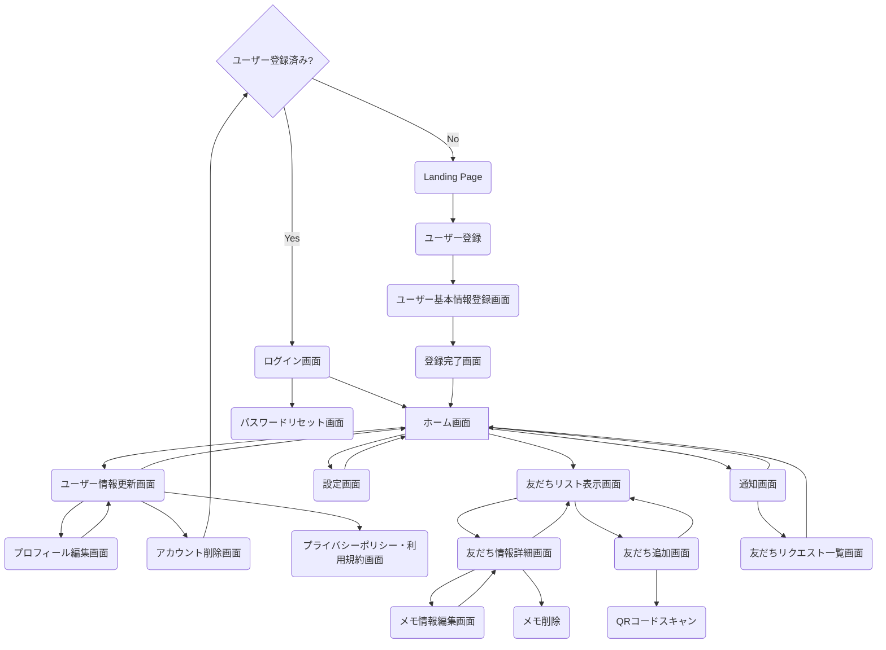

## 1. クリーンアーキテクチャの概要
### 1.1 クリーンアーキテクチャの基本原則
クリーンアーキテクチャは、ソフトウェアシステムを、関心事の分離（Separation of Concerns）の原則に基づいて設計するためのアーキテクチャパターンです。クリーンアーキテクチャの基本原則は以下の通りです：

#### 依存関係のルール
- 外側の層から内側の層への依存のみを許可し、内側の層から外側の層への依存を禁止する 
- これにより、ビジネスロジックが外部フレームワークや UI に依存しない、独立したものになる 

例えば、ユースケース層はフレームワーク・ドライバー層に依存しませんが、フレームワーク・ドライバー層はユースケース層に依存します

#### 関心事の分離
- システムを、異なる役割や責務を持つ複数の層に分割する 
- 各層は独立して開発、テスト、保守できるようにする 

例えば、UIの実装はフレームワーク・ドライバー層の責務であり、ビジネスロジックはユースケース層の責務です

#### 依存性の注入（DI）
- 上位の層が下位の層のインスタンスを直接生成するのではなく、インスタンスの生成と注入を分離する 
- これにより、各層の独立性と再利用性が高まる 

例えば、ユースケース層はリポジトリのインターフェースに依存しますが、その実装はフレームワーク・ドライバー層で行われ、DIを通じてユースケース層に提供されます

#### テスト容易性
- ビジネスロジックを UI やデータベースなどの外部要因から分離することで、ユニットテストが容易になる 
- 各層をモックやスタブに置き換えてテストできるようにする 

例えば、ユースケース層のテストでは、リポジトリの実装をモックに置き換えることで、外部依存なしにテストを実行できます

これらの原則を踏まえ、クリーンアーキテクチャでは、システムを以下の4つの層に分割します：

#### 1. エンティティ層（Entities）
- システムのビジネスルールを表現するオブジェクトを定義する 

例えば、Eコマースアプリケーションであれば、商品や注文などのオブジェクトがこの層に属します

#### 2. ユースケース層（Use Cases）
- システムの機能や操作を表現するユースケースを定義する 
- エンティティ層のビジネスルールを活用し、アプリケーション固有のビジネスルールを実装する 

例えば、「商品を注文する」「注文をキャンセルする」などのユースケースがこの層に属します

#### 3. インタフェース・アダプター層（Interface Adapters）
- ユースケース層とフレームワーク・ドライバー層の間の翻訳を行う 
- UI、データベース、外部サービスなどのインタフェースを、ユースケース層が扱いやすい形に変換する 

例えば、データベースアクセスを行うリポジトリの実装がこの層に属します

#### 4. フレームワーク・ドライバー層（Frameworks & Drivers）
- 外部フレームワーク、ライブラリ、データベース、UI などの具体的な実装を含む 

例えば、Android SDKやデータベースライブラリなどがこの層に属します

### 1.2 各層の責務と相互作用

クリーンアーキテクチャの4つの層は、それぞれ以下のような責務を持ちます

#### 1. エンティティ層
- システムのビジネスルールを表現するオブジェクトを定義する 
- 最も内側の層であり、他の層に依存しない 

#### 2. ユースケース層
- システムの機能や操作を表現するユースケースを定義する 
- エンティティ層のビジネスルールを活用し、アプリケーション固有のビジネスルールを実装する 

#### 3. インタフェース・アダプター層
- ユースケース層とフレームワーク・ドライバー層の間の翻訳を行う 
- UI、データベース、外部サービスなどのインタフェースを、ユースケース層が扱いやすい形に変換する 

#### 4. フレームワーク・ドライバー層
- 外部フレームワーク、ライブラリ、データベース、UI などの具体的な実装を含む 
- 最も外側の層であり、内側の層に依存する 

これらの層は、依存関係のルールに従って相互作用します。内側の層は外側の層に依存せず、外側の層が内側の層に依存します。この相互作用を図で表すと以下のようになります

 

この図では、矢印が依存の方向を表しています。外側の層が内側の層を呼び出すことはできますが、内側の層が外側の層を呼び出すことはできません。

クリーンアーキテクチャのこの構造により、以下のようなメリットが得られます：

- 各層が独立しているため、変更の影響が局所的に留まる 
- ビジネスロジックが UI や外部フレームワークから分離されているため、再利用性と保守性が高い 
- 各層をモックやスタブに置き換えてテストできるため、テスト容易性が高い 

以上が、クリーンアーキテクチャの概要となります。次の章では、これらの原則をAndroidアプリ開発に適用する方法について詳しく説明します。

## 2. クリーンアーキテクチャとAndroidアプリ開発
### 2.1 Androidアプリの一般的なアーキテクチャ

Androidアプリ開発において、一般的に使用されているアーキテクチャパターンはいくつかあります。その中でも、MVCやMVPなどが広く知られていると思います。

- MVC（Model-View-Controller）
  - モデル（Model）：アプリケーションのデータと業務ロジックを担当
  - ビュー（View）：ユーザーインターフェースを担当
  - コントローラー（Controller）：モデルとビューを制御し、アプリケーションの流れを管理

- MVP（Model-View-Presenter）
  - モデル（Model）：アプリケーションのデータと業務ロジックを担当
  - ビュー（View）：ユーザーインターフェースを担当し、プレゼンターからの指示に従って表示を更新
  - プレゼンター（Presenter）：ビューとモデルを仲介し、ユーザーアクションに応じた処理を行う

これらのアーキテクチャパターンは、関心事の分離を目的としていますが、実際のAndroidアプリ開発では、以下のような課題が生じることがあります

1. ビューとロジックの密結合
   - アクティビティやフラグメントが、UIの表示だけでなく、データの取得や処理も行うことが多い
   - これにより、クラスが肥大化し、保守性が低下する

2. テストの難しさ
   - ビューとロジックが密結合していると、ユニットテストが書きにくくなる
   - UIテストは実行に時間がかかり、不安定になりがちである

3. 変更の影響範囲
   - 要件の変更によって、複数の箇所を修正しなければならないことがある
   - これは、関心事の分離が不十分であることが原因である

これらの課題を解決するために、クリーンアーキテクチャの適用が有効と考えています。

### 2.2 クリーンアーキテクチャをAndroidに適用する利点

クリーンアーキテクチャをAndroidアプリ開発に適用することで、以下のような利点が得られます：

1. 関心事の分離
   - UI、ビジネスロジック、データアクセスを独立したレイヤーに分離できる
   - 各レイヤーを独立して開発、テスト、保守できるようになる

2. テスト容易性の向上
   - ビジネスロジックをUIから分離することで、ユニットテストが書きやすくなる
   - 各レイヤーをモックやスタブに置き換えてテストできるようになる

3. 変更の局所化
   - 要件の変更が特定のレイヤーに閉じた修正で済むようになる
   - 他のレイヤーへの影響を最小限に抑えられる

4. フレームワークからの独立性
   - ビジネスロジックがAndroid SDKに依存しないため、他のプラットフォームへの移行が容易になる
   - フレームワークのバージョンアップによる影響を受けにくくなる

具体的には、以下のようにクリーンアーキテクチャをAndroidアプリ開発に適用します：

- プレゼンテーション層（UI）
  - アクティビティ、フラグメント、ビューが担当
  - MVVM（Model-View-ViewModel）パターンを適用し、ビューとロジックを分離
  - ビューモデルがドメイン層のユースケースを呼び出す

- ドメイン層
  - ビジネスロジックを担当するユースケースを配置
  - Android SDKに依存しないようにする
  - インタフェース・アダプター層を介してデータ層にアクセスする

- データ層
  - リポジトリ、データソース、APIクライアントなどを配置
  - ローカルデータベースやWebAPIなどの実装を行う
  - データ層の実装をドメイン層から隠蔽する

以上のように、クリーンアーキテクチャをAndroidアプリ開発に適用することで、関心事の分離、テスト容易性、保守性の向上が期待できます。

次章では、これらの原則に基づいて、実際にLinkedPalアプリケーションの設計を行っていきます。

## 3. クリーンアーキテクチャに基づくAndroidアプリの設計
### 3.1 LinkedPalの要件整理

まずは、LinkedPalアプリケーションのコンセプトを再確認します。LinkedPalは、以下のようなコンセプトを掲げています：

- 友人関係を大切にしながらも、プライバシーを守れるプライベートSNS
- QRコードで簡単に友人登録でき、個別のメモ機能で大切な情報を記録・共有できる
- 友人との絆を深め、思い出を残すためのツール

このコンセプトを念頭に置きながら、ユーザーストーリーを導き出していきます。

#### 3.1.2 画面遷移図の確認

次に、画面遷移図を確認します。画面遷移図は、アプリケーションの画面構成と画面間の遷移を視覚的に表現したものです。LinkedPalの画面遷移図は以下のようになっています：



この画面遷移図から、ユーザーがアプリケーションでどのような動作を行うのかを読み取ることができます。

#### 3.1.3 ユーザーストーリーの作成

画面遷移図を基に、ユーザーストーリーを作成していきます。ユーザーストーリーは、エンドユーザーの視点で、アプリケーションに必要な機能を表現したものです。以下のようなフォーマットで記述します：

```
「ユーザーは、～～したい。なぜなら、～～だからだ。」
```

LinkedPalの画面遷移図から、以下のようなユーザーストーリーを導き出すことができます：

1. ユーザー登録とログイン
   - ユーザーは、アプリを初めて起動したときに、ユーザー登録を行いたい。なぜなら、LinkedPalを利用するためにはアカウントが必要だからだ。
   - ユーザーは、登録済みのアカウントでログインしたい。なぜなら、LinkedPalを利用するためにはログインが必要だからだ。

2. ホーム画面
   - ユーザーは、ログイン後にホーム画面を表示したい。なぜなら、ホーム画面からLinkedPalの主要な機能にアクセスできるからだ。

3. 友だち管理
   - ユーザーは、友だちリストを表示したい。なぜなら、LinkedPalで繋がっている友だちを確認したいからだ。
   - ユーザーは、QRコードを読み取ることで簡単に友だち追加したい。なぜなら、IDの入力なしで友だちを追加できると便利だからだ。
   - ユーザーは、友だちリクエストの通知を受け取りたい。なぜなら、新しい友だちリクエストがあることを知りたいからだ。

4. メモ機能
   - ユーザーは、友だちごとにメモを作成・編集・削除したい。なぜなら、友だちとの大切な情報を記録・共有したいからだ。

5. ユーザー情報管理
   - ユーザーは、自分のプロフィールを編集したい。なぜなら、LinkedPal上の自分の情報を最新に保ちたいからだ。
   - ユーザーは、アカウントを削除したい。なぜなら、LinkedPalを利用しなくなった場合にアカウントを削除できるようにしたいからだ。
   - ユーザーは、プライバシーポリシーと利用規約を確認したい。なぜなら、LinkedPalを安心して利用するために、プライバシーポリシーと利用規約を理解しておきたいからだ。

これらのユーザーストーリーは、LinkedPalアプリケーションに必要な主要な機能を表しています。ユーザーストーリーを作成することで、エンドユーザーの視点でアプリケーションの要件を整理することができます。

次のステップでは、これらのユーザーストーリーを基に、機能要件の明確化を行います。

#### 3.1.4 機能要件の明確化

ユーザーストーリーを作成したら、次はそれらを基に機能要件を明確化していきます。機能要件とは、アプリケーションが提供すべき機能を具体的に定義したものです。

ユーザーストーリーから導き出されたLinkedPalの主要な機能要件は以下の通りです：

1. ユーザー登録とログイン
   - 新規ユーザー登録機能
     - ユーザーがアプリを初めて起動したときに、ユーザー登録を行える
     - 登録にはメールアドレスとパスワードが必要
     - 登録が完了したら、ユーザー基本情報登録画面に遷移する
   - ログイン機能
     - 登録済みのメールアドレスとパスワードでログインできる
     - ログインが成功したら、ホーム画面に遷移する
   - パスワードリセット機能
     - パスワードを忘れた場合、登録済みのメールアドレスを入力することでパスワードをリセットできる

2. ホーム画面
   - ホーム画面表示機能
     - ログイン後、ホーム画面が表示される
     - ホーム画面には、友だちリスト、設定、通知へのアクセスボタンが表示される

3. 友だち管理
   - 友だちリスト表示機能
     - ホーム画面から友だちリスト画面に遷移できる
     - 友だちリストには、LinkedPalで繋がっている友だちの一覧が表示される
   - 友だち追加機能
     - 友だちリスト画面から友だち追加画面に遷移できる
     - 友だち追加画面では、QRコードをスキャンすることで友だちを追加できる
   - 友だちリクエスト通知機能
     - 新しい友だちリクエストがあると、通知画面に友だちリクエストが表示される
     - 友だちリクエストを承認または拒否できる

4. メモ機能
   - メモ作成機能
     - 友だち情報詳細画面からメモ情報編集画面に遷移できる
     - メモ情報編集画面では、友だちに関するメモを新規作成できる
   - メモ編集機能
     - メモ情報編集画面では、既存のメモを編集できる
   - メモ削除機能
     - 友だち情報詳細画面からメモを削除できる

5. ユーザー情報管理
   - プロフィール編集機能
     - ホーム画面からユーザー情報更新画面に遷移できる
     - ユーザー情報更新画面からプロフィール編集画面に遷移できる
     - プロフィール編集画面では、ユーザーの氏名、プロフィール画像などを編集できる
   - アカウント削除機能
     - ユーザー情報更新画面からアカウント削除画面に遷移できる
     - アカウント削除画面では、アカウントを削除できる
     - アカウントを削除すると、ログイン画面に戻る
   - プライバシーポリシー・利用規約表示機能
     - ユーザー情報更新画面からプライバシーポリシー・利用規約画面に遷移できる
     - プライバシーポリシー・利用規約画面では、LinkedPalのプライバシーポリシーと利用規約を確認できる

これらの機能要件は、LinkedPalアプリケーションが提供すべき具体的な機能を表しています。機能要件を明確化することで、開発チームはアプリケーションに必要な機能を漏れなく把握することができるようになりました。

次のステップでは、これらの機能要件を満たすために、非機能要件の検討を行います。

#### 3.1.5 非機能要件の検討

機能要件が「アプリケーションが何をするか」を定義するのに対し、非機能要件は「アプリケーションがどのように動作すべきか」を定義します。具体的には、パフォーマンス、セキュリティ、ユーザビリティ、信頼性などの要件が含まれます。

LinkedPalアプリケーションの非機能要件を以下のように検討します：

1. パフォーマンス
   - アプリケーションの起動時間
     - アプリケーションは、ユーザーがアイコンをタップしてから3秒以内に起動する
   - 画面遷移の応答時間
     - 画面遷移は、ユーザーがボタンをタップしてから1秒以内に完了する
   - QRコード読み取りの速度
     - QRコードの読み取りは、ユーザーがカメラをQRコードに向けてから2秒以内に完了する

2. セキュリティ
   - ユーザー情報の保護
     - ユーザーの個人情報（メールアドレス、パスワードなど）は、暗号化して保存する
     - ユーザー情報へのアクセスは、認証と認可のメカニズムで制御する
   - 通信の暗号化
     - アプリケーションとサーバー間の通信は、SSL/TLSを使用して暗号化する

3. ユーザビリティ
   - 直感的なユーザーインターフェース
     - ユーザーインターフェースは、シンプルで分かりやすいデザインにする
     - ユーザーが目的の機能に素早くアクセスできるようにナビゲーションを設計する
   - アクセシビリティ
     - アプリケーションは、視覚障害者や色覚異常者でも使いやすいようにデザインする
     - 適切なコントラストや代替テキストを提供する

4. 信頼性
   - エラー処理
     - アプリケーションは、予期しないエラーが発生した場合でも安全に動作する
     - エラーメッセージをユーザーにわかりやすく表示し、適切な回復方法を提示する
   - データの整合性
     - アプリケーションは、データの不整合が発生しないように設計する
     - データの更新や削除時に、関連するデータも適切に処理する

5. 互換性
   - サポート対象のAndroidバージョン
     - アプリケーションは、Android 8.0（APIレベル26）以上をサポートする
   - 異なる画面サイズへの対応
     - アプリケーションは、様々な画面サイズ（スマートフォン、タブレットなど）に適切に表示される

これらの非機能要件は、LinkedPalアプリケーションが満たすべき品質基準を表しています。非機能要件を検討することで、開発チームはアプリケーションの品質を向上させ、ユーザーの満足度を高めることができます。

非機能要件の検討は、機能要件の実現方法にも影響を与えます。例えば、セキュリティの要件を満たすために、特定のライブラリや暗号化アルゴリズムを使用する必要があるかもしれません。

次のステップでは、ここまでに整理された機能要件と非機能要件を基に、クリーンアーキテクチャの原則に沿ってアプリケーションの設計を行っていくことになります。

### 3.2 クリーンアーキテクチャに基づく設計

クリーンアーキテクチャの原則に沿って、LinkedPalアプリケーションの設計を行います。設計は、以下の3つのレイヤーに分けて進めていきます：

1. プレゼンテーション層
2. ドメイン層
3. データ層

#### 3.2.1 プレゼンテーション層の設計

プレゼンテーション層は、ユーザーインターフェースとユーザーとのインタラクションを担当するレイヤーです。LinkedPalアプリケーションのプレゼンテーション層の設計を以下のように行います：

1. 画面遷移図を基にしたUI設計
   - 画面遷移図を基に、各画面のワイヤーフレームを作成する
   - ワイヤーフレームは、画面のレイアウトとUIコンポーネントの配置を示す
   - ワイヤーフレームを基に、詳細なUIデザインを作成する

2. MVVM（Model-View-ViewModel）パターンの適用
   - プレゼンテーション層にMVVMパターンを適用する
   - UIの状態とロジックをViewModelに集約し、Viewとの依存関係を減らす
   - ViewModelは、ドメイン層のユースケースを呼び出してデータを取得し、Viewに提供する

3. Jetpack Composeの活用
   - UIの実装にJetpack Composeを活用する
   - Jetpack Composeは、宣言的UIの構築を可能にするモダンなUIツールキット
   - コードベースのシンプル化と、UIの状態管理の改善が期待できる

プレゼンテーション層の設計では、MVVM（Model-View-ViewModel）パターンを適用し、Jetpack Composeを使用してUIを構築します。

```kotlin
// 画面の状態を表すデータクラス
data class HomeScreenState(
    val userProfile: UserProfile?,
    val friends: List<Friend>,
    val isLoading: Boolean,
    val error: String?
)

// ViewModelクラス
class HomeScreenViewModel(
    private val getUserProfileUseCase: GetUserProfileUseCase,
    private val getFriendsUseCase: GetFriendsUseCase
) : ViewModel() {
    private val _uiState = MutableStateFlow(HomeScreenState(null, emptyList(), true, null))
    val uiState: StateFlow<HomeScreenState> = _uiState.asStateFlow()

    init {
        viewModelScope.launch {
            try {
                val userProfile = getUserProfileUseCase()
                val friends = getFriendsUseCase()
                _uiState.update { it.copy(userProfile = userProfile, friends = friends, isLoading = false) }
            } catch (e: Exception) {
                _uiState.update { it.copy(error = e.message, isLoading = false) }
            }
        }
    }
}

@Composable
fun HomeScreen(viewModel: HomeScreenViewModel = hiltViewModel()) {
    val uiState by viewModel.uiState.collectAsState()

    Scaffold(
        topBar = {
            TopAppBar(
                title = { Text("LinkedPal") },
                actions = {
                    IconButton(onClick = { /* TODO: Navigate to settings */ }) {
                        Icon(Icons.Default.Settings, contentDescription = "Settings")
                    }
                }
            )
        },
        content = {
            when {
                uiState.isLoading -> {
                    CircularProgressIndicator(modifier = Modifier.fillMaxSize())
                }
                uiState.error != null -> {
                    Text("Error: ${uiState.error}")
                }
                else -> {
                    LazyColumn {
                        item {
                            UserProfileCard(uiState.userProfile)
                        }
                        items(uiState.friends) { friend ->
                            FriendItem(friend)
                        }
                    }
                }
            }
        }
    )
}
```

この`HomeScreen`関数は、以下のようなUIの構成要素を含んでいます：

1. `Scaffold`
   - Materialデザインのレイアウト構造を提供するComposable
   - `topBar`と`content`をプロパティとして受け取る

2. `TopAppBar`
   - 画面の上部に表示されるアプリケーションバー
   - タイトルとアクションアイコン（設定アイコン）を含む

3. `CircularProgressIndicator`
   - データの読み込み中に表示される円形のプログレスインジケータ
   - `uiState.isLoading`がtrueの場合に表示される

4. `Text`
   - エラーメッセージを表示するためのテキストComposable
   - `uiState.error`がnullでない場合に表示される

5. `LazyColumn`
   - リスト形式でコンテンツを表示するためのComposable
   - 大量のデータを効率的に表示できる

6. `UserProfileCard`
   - ユーザープロファイルを表示するためのカスタムComposable
   - `uiState.userProfile`をプロパティとして受け取る

7. `FriendItem`
   - 友だちリストの各項目を表示するためのカスタムComposable
   - `uiState.friends`をリストとして受け取り、各項目ごとに`FriendItem`を呼び出す

これらのComposableを組み合わせることで、ホーム画面のUIが構成されます。`HomeScreenViewModel`から`uiState`を取得し、その状態に応じて適切なComposableが表示されます。

例えば、データの読み込み中は`CircularProgressIndicator`が表示され、エラーが発生した場合は`Text`でエラーメッセージが表示されます。データが正常に読み込まれた場合は、`LazyColumn`の中に`UserProfileCard`とFriendリスト（`FriendItem`のリスト）が表示されます。

それでは、ログイン画面から順に、Jetpack Composeを使用した実装例を示しながら、LinkedPalの画面の開発を進めていきましょう。

まずは、プロジェクトのセットアップとして、必要な依存関係を追加します。`build.gradle`ファイルに以下の依存関係を追加してください：

```groovy
dependencies {
    // Jetpack Compose
    implementation 'androidx.compose.ui:ui:1.2.0'
    implementation 'androidx.compose.material:material:1.2.0'
    implementation 'androidx.compose.ui:ui-tooling-preview:1.2.0'
    implementation 'androidx.lifecycle:lifecycle-runtime-ktx:2.5.1'
    implementation 'androidx.activity:activity-compose:1.5.1'

    // ViewModel
    implementation 'androidx.lifecycle:lifecycle-viewmodel-compose:2.5.1'

    // Navigation
    implementation 'androidx.navigation:navigation-compose:2.5.1'

    // Hilt
    implementation 'com.google.dagger:hilt-android:2.44'
    kapt 'com.google.dagger:hilt-compiler:2.44'
}
```

これらの依存関係は、Jetpack Compose、ViewModel、Navigation、Hiltなどの必要なライブラリを含んでいます。

次に、アプリケーションのエントリーポイントである`MainActivity`を作成します：

```kotlin
@AndroidEntryPoint
class MainActivity : ComponentActivity() {
    override fun onCreate(savedInstanceState: Bundle?) {
        super.onCreate(savedInstanceState)
        setContent {
            LinkedPalTheme {
                Surface(color = MaterialTheme.colors.background) {
                    LinkedPalApp()
                }
            }
        }
    }
}

@Composable
fun LinkedPalApp() {
    val navController = rememberNavController()
    NavHost(navController = navController, startDestination = "login") {
        composable("login") { LoginScreen(navController) }
        composable("register") { RegisterScreen(navController) }
        composable("home") { HomeScreen(navController) }
        composable("add_friend") { AddFriendScreen(navController) }
        composable("chat") { ChatScreen(navController) }
    }
}
```

ここでは、`MainActivity`でJetpack Composeのセットアップを行い、`LinkedPalApp`という関数でアプリケーションのナビゲーションを定義しています。`NavHost`を使用して、各画面に対応する`composable`を定義しています。

次に、ログイン画面の実装を見ていきましょう。

#### 1. ログイン画面

```kotlin
@Composable
fun LoginScreen(navController: NavController, viewModel: LoginViewModel = hiltViewModel()) {
    val uiState by viewModel.uiState.collectAsState()

    Column(
        modifier = Modifier.fillMaxSize(),
        verticalArrangement = Arrangement.Center,
        horizontalAlignment = Alignment.CenterHorizontally
    ) {
        TextField(
            value = uiState.username,
            onValueChange = { viewModel.onUsernameChanged(it) },
            label = { Text("Username") }
        )
        TextField(
            value = uiState.password,
            onValueChange = { viewModel.onPasswordChanged(it) },
            label = { Text("Password") },
            visualTransformation = PasswordVisualTransformation()
        )
        if (uiState.error != null) {
            Text(
                text = uiState.error,
                color = MaterialTheme.colors.error
            )
        }
        Button(
            onClick = { viewModel.onLoginClicked(navController) }
        ) {
            Text("Login")
        }
        TextButton(
            onClick = { navController.navigate("register") }
        ) {
            Text("Register")
        }
    }
}

@HiltViewModel
class LoginViewModel @Inject constructor(
    private val loginUseCase: LoginUseCase
) : ViewModel() {
    private val _uiState = MutableStateFlow(LoginUiState())
    val uiState: StateFlow<LoginUiState> = _uiState.asStateFlow()

    fun onUsernameChanged(username: String) {
        _uiState.update { it.copy(username = username) }
    }

    fun onPasswordChanged(password: String) {
        _uiState.update { it.copy(password = password) }
    }

    fun onLoginClicked(navController: NavController) {
        viewModelScope.launch {
            try {
                loginUseCase(uiState.value.username, uiState.value.password)
                navController.navigate("home")
            } catch (e: Exception) {
                _uiState.update { it.copy(error = e.message) }
            }
        }
    }
}

data class LoginUiState(
    val username: String = "",
    val password: String = "",
    val error: String? = null
)
```

ここでは、`LoginScreen`というComposable関数を定義しています。この関数は、ユーザー名とパスワードの入力フィールド、ログインボタン、エラーメッセージの表示を含んでいます。

`LoginViewModel`は、ログイン画面のビジネスロジックを担当しています。`LoginUseCase`を使用してログイン処理を行い、成功した場合はホーム画面に遷移します。エラーが発生した場合は、エラーメッセージを表示します。

`LoginUiState`は、ログイン画面のUI状態を表すデータクラスです。

次に、ユーザー登録画面の実装を見ていきましょう。

#### 2. ユーザー登録画面

```kotlin
@Composable
fun RegisterScreen(navController: NavController, viewModel: RegisterViewModel = hiltViewModel()) {
    val uiState by viewModel.uiState.collectAsState()

    Column(
        modifier = Modifier.fillMaxSize(),
        verticalArrangement = Arrangement.Center,
        horizontalAlignment = Alignment.CenterHorizontally
    ) {
        TextField(
            value = uiState.username,
            onValueChange = { viewModel.onUsernameChanged(it) },
            label = { Text("Username") }
        )
        TextField(
            value = uiState.email,
            onValueChange = { viewModel.onEmailChanged(it) },
            label = { Text("Email") }
        )
        TextField(
            value = uiState.password,
            onValueChange = { viewModel.onPasswordChanged(it) },
            label = { Text("Password") },
            visualTransformation = PasswordVisualTransformation()
        )
        if (uiState.error != null) {
            Text(
                text = uiState.error,
                color = MaterialTheme.colors.error
            )
        }
        Button(
            onClick = { viewModel.onRegisterClicked(navController) }
        ) {
            Text("Register")
        }
    }
}

@HiltViewModel
class RegisterViewModel @Inject constructor(
    private val registerUseCase: RegisterUseCase
) : ViewModel() {
    private val _uiState = MutableStateFlow(RegisterUiState())
    val uiState: StateFlow<RegisterUiState> = _uiState.asStateFlow()

    fun onUsernameChanged(username: String) {
        _uiState.update { it.copy(username = username) }
    }

    fun onEmailChanged(email: String) {
        _uiState.update { it.copy(email = email) }
    }

    fun onPasswordChanged(password: String) {
        _uiState.update { it.copy(password = password) }
    }

    fun onRegisterClicked(navController: NavController) {
        viewModelScope.launch {
            try {
                registerUseCase(uiState.value.username, uiState.value.email, uiState.value.password)
                navController.navigate("home")
            } catch (e: Exception) {
                _uiState.update { it.copy(error = e.message) }
            }
        }
    }
}

data class RegisterUiState(
    val username: String = "",
    val email: String = "",
    val password: String = "",
    val error: String? = null
)
```

ユーザー登録画面の実装は、ログイン画面と似ています。`RegisterScreen`というComposable関数を定義し、ユーザー名、メールアドレス、パスワードの入力フィールドとユーザー登録ボタンを配置しています。

`RegisterViewModel`は、ユーザー登録のビジネスロジックを担当しています。`RegisterUseCase`を使用してユーザー登録処理を行い、成功した場合はホーム画面に遷移します。エラーが発生した場合は、エラーメッセージを表示します。

`RegisterUiState`は、ユーザー登録画面のUI状態を表すデータクラスです。

次に、ホーム画面の実装を見ていきましょう。

#### 3. ホーム画面

```kotlin
@Composable
fun HomeScreen(navController: NavController, viewModel: HomeViewModel = hiltViewModel()) {
    val uiState by viewModel.uiState.collectAsState()

    Scaffold(
        topBar = {
            TopAppBar(
                title = { Text("LinkedPal") },
                actions = {
                    IconButton(
                        onClick = { /* TODO: Navigate to settings */ }
                    ) {
                        Icon(Icons.Default.Settings, contentDescription = "Settings")
                    }
                }
            )
        },
        floatingActionButton = {
            FloatingActionButton(
                onClick = { navController.navigate("add_friend") }
            ) {
                Icon(Icons.Default.Add, contentDescription = "Add Friend")
            }
        },
        content = { padding ->
            when {
                uiState.isLoading -> {
                    CircularProgressIndicator(modifier = Modifier.fillMaxSize())
                }
                uiState.error != null -> {
                    Text("Error: ${uiState.error}")
                }
                else -> {
                    LazyColumn(contentPadding = padding) {
                        item {
                            UserProfileCard(uiState.userProfile)
                        }
                        items(uiState.friends) { friend ->
                            FriendItem(friend = friend, onItemClick = { navController.navigate("chat") })
                        }
                    }
                }
            }
        }
    )
}

@Composable
fun UserProfileCard(userProfile: UserProfile?) {
    Card(
        modifier = Modifier
            .fillMaxWidth()
            .padding(16.dp)
    ) {
        Column(
            modifier = Modifier.padding(16.dp)
        ) {
            Text(
                text = userProfile?.username ?: "",
                style = MaterialTheme.typography.h6
            )
            Text(
                text = userProfile?.email ?: "",
                style = MaterialTheme.typography.body2
            )
        }
    }
}

@Composable
fun FriendItem(friend: Friend, onItemClick: () -> Unit) {
    Card(
        modifier = Modifier
            .fillMaxWidth()
            .padding(16.dp)
            .clickable(onClick = onItemClick)
    ) {
        Row(
            modifier = Modifier.padding(16.dp),
            verticalAlignment = Alignment.CenterVertically
        ) {
            Icon(
                Icons.Default.Person,
                contentDescription = "Friend Avatar"
            )
            Spacer(modifier = Modifier.width(16.dp))
            Text(
                text = friend.username,
                style = MaterialTheme.typography.h6
            )
        }
    }
}

@HiltViewModel
class HomeViewModel @Inject constructor(
    private val getUserProfileUseCase: GetUserProfileUseCase,
    private val getFriendsUseCase: GetFriendsUseCase
) : ViewModel() {
    private val _uiState = MutableStateFlow(HomeUiState(isLoading = true))
    val uiState: StateFlow<HomeUiState> = _uiState.asStateFlow()

    init {
        viewModelScope.launch {
            try {
                val userProfile = getUserProfileUseCase()
                val friends = getFriendsUseCase()
                _uiState.update { it.copy(userProfile = userProfile, friends = friends, isLoading = false) }
            } catch (e: Exception) {
                _uiState.update { it.copy(error = e.message, isLoading = false) }
            }
        }
    }
}

data class HomeUiState(
    val userProfile: UserProfile? = null,
    val friends: List<Friend> = emptyList(),
    val isLoading: Boolean = false,
    val error: String? = null
)
```

ホーム画面では、ユーザープロフィールと友だちリストを表示します。`HomeScreen`というComposable関数を定義し、`Scaffold`を使用してレイアウトを構成しています。

`UserProfileCard`は、ユーザープロフィールを表示するためのComposableです。`FriendItem`は、友だちリストの各アイテムを表示するためのComposableです。

`HomeViewModel`は、ホーム画面のビジネスロジックを担当しています。`GetUserProfileUseCase`と`GetFriendsUseCase`を使用してデータを取得し、UI状態を更新します。

`HomeUiState`は、ホーム画面のUI状態を表すデータクラスです。

次に、友だち追加画面の実装を見ていきましょう。

#### 4. 友だち追加画面

```kotlin
@Composable
fun AddFriendScreen(navController: NavController, viewModel: AddFriendViewModel = hiltViewModel()) {
    val uiState by viewModel.uiState.collectAsState()

    Scaffold(
        topBar = {
            TopAppBar(
                title = { Text("Add Friend") },
                navigationIcon = {
                    IconButton(onClick = { navController.popBackStack() }) {
                        Icon(Icons.Default.ArrowBack, contentDescription = "Back")
                    }
                }
            )
        },
        content = { padding ->
            Column(
                modifier = Modifier.fillMaxSize().padding(padding),
                verticalArrangement = Arrangement.Center,
                horizontalAlignment = Alignment.CenterHorizontally
            ) {
                Button(
                    onClick = { viewModel.onScanQrCodeClicked() }
                ) {
                    Text("Scan QR Code")
                }
                if (uiState.error != null) {
                    Text(
                        text = uiState.error,
                        color = MaterialTheme.colors.error
                    )
                }
            }
        }
    )

    LaunchedEffect(uiState.scannedUserId) {
        if (uiState.scannedUserId != null) {
            viewModel.onUserIdScanned(navController)
        }
    }
}

@HiltViewModel
class AddFriendViewModel @Inject constructor(
    private val addFriendUseCase: AddFriendUseCase
) : ViewModel() {
    private val _uiState = MutableStateFlow(AddFriendUiState())
    val uiState: StateFlow<AddFriendUiState> = _uiState.asStateFlow()
    fun onScanQrCodeClicked() {
    // TODO: Open QR code scanner
    // Set scannedUserId when QR code is successfully scanned
        _uiState.update { it.copy(scannedUserId = "user123") }
    }

    fun onUserIdScanned(navController: NavController) {
        viewModelScope.launch {
            try {
                addFriendUseCase(uiState.value.scannedUserId!!)
                navController.navigate("home")
            } catch (e: Exception) {
                _uiState.update { it.copy(error = e.message) }
            }
        }
    }
}

data class AddFriendUiState(
    val scannedUserId: String? = null,
    val error: String? = null
)
```

友だち追加画面では、QRコードをスキャンして友だちを追加する機能を提供します。`AddFriendScreen`というComposable関数を定義し、QRコードをスキャンするためのボタンを配置しています。

`AddFriendViewModel`は、友だち追加のビジネスロジックを担当しています。`AddFriendUseCase`を使用して友だち追加処理を行い、成功した場合はホーム画面に遷移します。エラーが発生した場合は、エラーメッセージを表示します。

`AddFriendUiState`は、友だち追加画面のUI状態を表すデータクラスです。

次に、チャット画面（タイムライン画面）の実装を見ていきましょう。

#### 5. チャット画面（タイムライン画面）

```kotlin
@Composable
fun ChatScreen(navController: NavController, viewModel: ChatViewModel = hiltViewModel()) {
    val uiState by viewModel.uiState.collectAsState()

    Scaffold(
        topBar = {
            TopAppBar(
                title = { Text("Chat") },
                navigationIcon = {
                    IconButton(onClick = { navController.popBackStack() }) {
                        Icon(Icons.Default.ArrowBack, contentDescription = "Back")
                    }
                }
            )
        },
        content = { padding ->
            when {
                uiState.isLoading -> {
                    CircularProgressIndicator(modifier = Modifier.fillMaxSize())
                }
                uiState.error != null -> {
                    Text("Error: ${uiState.error}")
                }
                else -> {
                    LazyColumn(
                        modifier = Modifier.fillMaxSize().padding(padding),
                        reverseLayout = true
                    ) {
                        items(uiState.messages) { message ->
                            MessageItem(message)
                        }
                    }
                }
            }
        }
    )
}

@Composable
fun MessageItem(message: Message) {
    Card(
        modifier = Modifier
            .fillMaxWidth()
            .padding(16.dp)
    ) {
        Column(
            modifier = Modifier.padding(16.dp)
        ) {
            Text(
                text = message.sender,
                style = MaterialTheme.typography.subtitle2
            )
            Text(
                text = message.content,
                style = MaterialTheme.typography.body1
            )
        }
    }
}

@HiltViewModel
class ChatViewModel @Inject constructor(
    private val getMessagesUseCase: GetMessagesUseCase
) : ViewModel() {
    private val _uiState = MutableStateFlow(ChatUiState(isLoading = true))
    val uiState: StateFlow<ChatUiState> = _uiState.asStateFlow()

    init {
        viewModelScope.launch {
            try {
                val messages = getMessagesUseCase()
                _uiState.update { it.copy(messages = messages, isLoading = false) }
            } catch (e: Exception) {
                _uiState.update { it.copy(error = e.message, isLoading = false) }
            }
        }
    }
}

data class ChatUiState(
    val messages: List<Message> = emptyList(),
    val isLoading: Boolean = false,
    val error: String? = null
)
```

チャット画面（タイムライン画面）では、メッセージのリストを表示します。`ChatScreen`というComposable関数を定義し、`LazyColumn`を使用してメッセージのリストを表示しています。

`MessageItem`は、個々のメッセージを表示するためのComposableです。

`ChatViewModel`は、チャット画面のビジネスロジックを担当しています。`GetMessagesUseCase`を使用してメッセージのリストを取得し、UI状態を更新します。

`ChatUiState`は、チャット画面のUI状態を表すデータクラスです。

では最後に、メモ追加画面について見ていきましょう。

```kotlin
@Composable
fun MemoScreen(navController: NavController, friendId: String, viewModel: MemoViewModel = hiltViewModel()) {
    val uiState by viewModel.uiState.collectAsState()

    Scaffold(
        topBar = {
            TopAppBar(
                title = { Text("Memo") },
                navigationIcon = {
                    IconButton(onClick = { navController.popBackStack() }) {
                        Icon(Icons.Default.ArrowBack, contentDescription = "Back")
                    }
                }
            )
        },
        content = { padding ->
            Column(
                modifier = Modifier.fillMaxSize().padding(padding).padding(16.dp)
            ) {
                OutlinedTextField(
                    value = uiState.title,
                    onValueChange = { viewModel.onTitleChanged(it) },
                    label = { Text("Title") },
                    modifier = Modifier.fillMaxWidth()
                )
                Spacer(modifier = Modifier.height(16.dp))
                OutlinedTextField(
                    value = uiState.content,
                    onValueChange = { viewModel.onContentChanged(it) },
                    label = { Text("Content") },
                    modifier = Modifier.fillMaxWidth().weight(1f)
                )
                Spacer(modifier = Modifier.height(16.dp))
                Button(
                    onClick = { viewModel.onSaveClicked(friendId, navController) },
                    modifier = Modifier.align(Alignment.End)
                ) {
                    Text("Save")
                }
            }
        }
    )
}

@HiltViewModel
class MemoViewModel @Inject constructor(
    private val saveMemoUseCase: SaveMemoUseCase
) : ViewModel() {
    private val _uiState = MutableStateFlow(MemoUiState())
    val uiState: StateFlow<MemoUiState> = _uiState.asStateFlow()

    fun onTitleChanged(title: String) {
        _uiState.update { it.copy(title = title) }
    }

    fun onContentChanged(content: String) {
        _uiState.update { it.copy(content = content) }
    }

    fun onSaveClicked(friendId: String, navController: NavController) {
        viewModelScope.launch {
            saveMemoUseCase(
                friendId = friendId,
                title = uiState.value.title,
                content = uiState.value.content
            )
            navController.popBackStack()
        }
    }
}

data class MemoUiState(
    val title: String = "",
    val content: String = ""
)
```
メモ登録画面では、メモのタイトルと内容を入力するためのテキストフィールドと、保存ボタンを配置しています。

MemoViewModelは、メモ登録のビジネスロジックを担当しています。SaveMemoUseCaseを使用してメモ保存処理を行い、処理が完了したら前の画面に戻ります。

以上が、LinkedPalアプリケーションの主要な画面の実装例です。実際のアプリケーション開発では、デザイナー等の同僚と協業しながらこれらの画面をさらに洗練させ、エラーハンドリングやローディング状態の表示などを適切に行う必要があります。

また、各画面で使用しているユースケース（`LoginUseCase`、`RegisterUseCase`、`GetUserProfileUseCase`、`GetFriendsUseCase`、`AddFriendUseCase`、`GetMessagesUseCase`）は、ドメイン層に属するクラスで、実際のビジネスロジックを含んでいます。これらのユースケースの実装は、リポジトリインターフェースを介してデータ層とやり取りを行います。

このように、クリーンアーキテクチャの原則に沿って、UI、ビジネスロジック、データアクセスを分離することで、アプリケーションの保守性と拡張性を高めることができます。

実際のアプリケーション開発では、これらのコード例を参考にしながら、プロジェクトの要件に合わせてカスタマイズしていくことが重要です。また、テストの実装やエラーハンドリングの強化など、アプリケーションの品質を向上させるための取り組みも必要です。

Androidアプリ開発におけるクリーンアーキテクチャの適用は、一朝一夕には習得できませんが、実践を重ねることで徐々に理解を深めていくことができると思います。これらのコード例を出発点として、より洗練されたアーキテクチャとコードを目指して学習を続けていきましょう。

次のステップでは、このようなプレゼンテーション層の設計を、ドメイン層やデータ層の設計と組み合わせて、アプリケーション全体のアーキテクチャを構築していきます。

次に、ドメイン層の設計について説明します。

#### 3.2.2 ドメイン層の設計

ドメイン層は、アプリケーションのビジネスロジックを担当する層です。ここでは、ドメインモデル（エンティティ）とユースケースを定義します。

##### ドメインモデル（エンティティ）の定義

まずは、アプリケーションのコアとなるドメインモデルを定義します。LinkedPalアプリケーションでは、以下のようなドメインモデルが考えられます：

```kotlin
data class User(
    val id: String,
    val username: String,
    val email: String
)

data class Friend(
    val id: String,
    val username: String
)

data class Message(
    val id: String,
    val senderId: String,
    val receiverId: String,
    val content: String,
    val timestamp: Long
)

data class Memo(
    val id: String,
    val friendId: String,
    val title: String,
    val content: String
)
```

これらのドメインモデルは、アプリケーションのコアとなるエンティティを表現しています。`User`は、ユーザーを表すモデルで、`Friend`は友だちを表すモデルです。`Message`は、ユーザー間で送受信されるメッセージを表すモデルです。そして`Memo`はユーザーが作成するメモ情報を表します。

##### ユースケースの定義

次に、アプリケーションのビジネスロジックを表現するユースケースを定義します。LinkedPalアプリケーションでは、以下のようなユースケースが考えられます：

```kotlin
class LoginUseCase(private val userRepository: UserRepository) {
    suspend operator fun invoke(username: String, password: String): User {
        return userRepository.login(username, password)
    }
}

class RegisterUseCase(private val userRepository: UserRepository) {
    suspend operator fun invoke(username: String, email: String, password: String): User {
        return userRepository.register(username, email, password)
    }
}

class GetUserProfileUseCase(private val userRepository: UserRepository) {
    suspend operator fun invoke(): User {
        return userRepository.getCurrentUser()
    }
}

class GetFriendsUseCase(private val friendRepository: FriendRepository) {
    suspend operator fun invoke(): List<Friend> {
        return friendRepository.getFriends()
    }
}

class AddFriendUseCase(private val friendRepository: FriendRepository) {
    suspend operator fun invoke(friendId: String) {
        friendRepository.addFriend(friendId)
    }
}

class GetMessagesUseCase(private val messageRepository: MessageRepository) {
    suspend operator fun invoke(): List<Message> {
        return messageRepository.getMessages()
    }
}

class SaveMemoUseCase(private val memoRepository: MemoRepository) {
    suspend operator fun invoke(friendId: String, title: String, content: String) {
        memoRepository.saveMemo(friendId, title, content)
    }
}

class GetMemosUseCase(private val memoRepository: MemoRepository) {
    suspend operator fun invoke(friendId: String): List<Memo> {
        return memoRepository.getMemosForFriend(friendId)
    }
}
```

これらのユースケースは、アプリケーションのビジネスロジックを表現しています。各ユースケースは、リポジトリインターフェースを介してデータ層とやり取りを行います。

例えば、`LoginUseCase`は、`UserRepository`インターフェースを介してユーザーのログイン処理を行います。`GetFriendsUseCase`は、`FriendRepository`インターフェースを介して友だちのリストを取得します。`SaveMemoUseCase`は、`MemoRepository`インターフェースを介してメモの保存処理を行います。`GetMemosUseCase`は、特定の友だちに関連するメモのリストを取得します。

##### リポジトリインターフェースの定義

ユースケースからデータ層にアクセスするために、リポジトリインターフェースを定義します。LinkedPalアプリケーションでは、以下のようなリポジトリインターフェースが考えられます：

```kotlin
interface UserRepository {
    suspend fun login(username: String, password: String): User
    suspend fun register(username: String, email: String, password: String): User
    suspend fun getCurrentUser(): User
}

interface FriendRepository {
    suspend fun getFriends(): List<Friend>
    suspend fun addFriend(friendId: String)
}

interface MessageRepository {
    suspend fun getMessages(): List<Message>
}

interface MemoRepository {
    suspend fun saveMemo(friendId: String, title: String, content: String)
    suspend fun getMemosForFriend(friendId: String): List<Memo>
}
```

これらのリポジトリインターフェースは、データ層の実装を隠蔽し、ドメイン層に対して統一的なインターフェースを提供します。

ユースケースは、これらのリポジトリインターフェースを介してデータ層とやり取りを行います。これにより、ドメイン層とデータ層の結合度を下げ、アプリケーションの保守性と拡張性を高めることができます。

以上が、LinkedPalアプリケーションのドメイン層の設計例です。実際のアプリケーション開発では、これらのドメインモデル、ユースケース、リポジトリインターフェースをプロジェクトの要件に合わせてカスタマイズする必要があります。

ドメイン層の設計では、以下の点に留意しましょう：

1. ドメインモデルは、アプリケーションのコアとなるエンティティを表現するようにする。
2. ユースケースは、アプリケーションのビジネスロジックを表現するようにする。
3. リポジトリインターフェースは、データ層の実装を隠蔽し、ドメイン層に対して統一的なインターフェースを提供するようにする。
4. ドメイン層は、他の層（プレゼンテーション層やデータ層）に依存しないようにする。

これらの点を意識しながらドメイン層を設計することで、クリーンアーキテクチャの原則に沿ったアプリケーションを開発することができます。

ドメイン層の設計は、アプリケーションの核となる部分であるため、慎重に行う必要があります。設計の際には、チームメンバーとの議論を重ね、要件を満たす最適な設計を目指しましょう。

次は、データ層の設計について説明していきます。

ドメイン層は、アプリケーションのビジネスロジックとユースケースを定義するレイヤーです。LinkedPalアプリケーションのドメイン層の設計を以下のように行います：

1. ユースケースの抽出と定義
   - 機能要件から、アプリケーションのユースケースを抽出する
   - 例：「ユーザープロフィールを取得する」「友だちリストを取得する」など
   - ユースケースは、アプリケーションのビジネスルールを表現する
   - ユースケースは、リポジトリインターフェースを介してデータ層にアクセスする

2. ドメインモデルの設計
   - アプリケーションのコアとなるエンティティとそれらの関係を設計する
   - 例：「ユーザー」「友だち」「メモ」など
   - ドメインモデルは、ビジネスルールを反映し、アプリケーションの中心的な概念を表現する

ドメイン層の設計例：

```kotlin
// ドメインモデル
data class User(
    val id: String,
    val name: String,
    val email: String
)

data class Friend(
    val id: String,
    val name: String
)

data class Memo(
    val id: String,
    val title: String,
    val content: String,
    val friendId: String
)

// リポジトリインターフェース
interface UserRepository {
    suspend fun getUserById(id: String): User?
    suspend fun saveUser(user: User)
}

interface FriendRepository {
    suspend fun getFriendsForUser(userId: String): List<Friend>
    suspend fun addFriend(userId: String, friendId: String)
}

// ユースケースの例
class GetUserProfileUseCase(private val userRepository: UserRepository) {
    suspend operator fun invoke(userId: String): User? {
        return userRepository.getUserById(userId)
    }
}

class AddFriendUseCase(
    private val userRepository: UserRepository,
    private val friendRepository: FriendRepository
) {
    suspend operator fun invoke(userId: String, friendId: String) {
        userRepository.getUserById(userId) ?: throw IllegalArgumentException("User not found")
        userRepository.getUserById(friendId) ?: throw IllegalArgumentException("Friend not found")
        friendRepository.addFriend(userId, friendId)
    }
}
```

このようにドメイン層を設計することで、アプリケーションのビジネスロジックを明確に定義し、他のレイヤーから独立して扱うことができます。

次に、データ層の設計について説明します。

#### 3.2.3 データ層の設計

データ層は、アプリケーションのデータの永続化と取得を担当するレイヤーです。LinkedPalアプリケーションのデータ層の設計では、以下の要素について検討します：

1. リポジトリの実装
2. ローカルデータソースの選択と実装
3. リモートデータソースの選択と実装
4. データ転送オブジェクト（DTO）の定義

##### リポジトリの実装

リポジトリは、データ層の中心的な役割を果たします。リポジトリは、データソースの実装を隠蔽し、ドメイン層に対して統一的なインターフェースを提供します。

LinkedPalアプリケーションでは、以下のようなリポジトリの実装が考えられます：

```kotlin
class UserRepositoryImpl(
    private val localDataSource: UserLocalDataSource,
    private val remoteDataSource: UserRemoteDataSource
) : UserRepository {
    override suspend fun login(username: String, password: String): User {
        // ログイン処理の実装
    }

    override suspend fun register(username: String, email: String, password: String): User {
        // ユーザー登録処理の実装
    }

    override suspend fun getCurrentUser(): User {
        // 現在のユーザーを取得する処理の実装
    }
}

class FriendRepositoryImpl(
    private val localDataSource: FriendLocalDataSource,
    private val remoteDataSource: FriendRemoteDataSource
) : FriendRepository {
    override suspend fun getFriends(): List<Friend> {
        // 友だちリストを取得する処理の実装
    }

    override suspend fun addFriend(friendId: String) {
        // 友だちを追加する処理の実装
    }
}

class MemoRepositoryImpl(
    private val localDataSource: MemoLocalDataSource,
    private val remoteDataSource: MemoRemoteDataSource
) : MemoRepository {
    override suspend fun saveMemo(friendId: String, title: String, content: String) {
        // メモを保存する処理の実装
    }

    override suspend fun getMemosForFriend(friendId: String): List<Memo> {
        // 特定の友だちに関連するメモのリストを取得する処理の実装
    }
}

class MessageRepositoryImpl(
    private val localDataSource: MessageLocalDataSource,
    private val remoteDataSource: MessageRemoteDataSource
) : MessageRepository {
    override suspend fun getMessagesForUser(userId: String): List<Message> {
        // ローカルデータソースからメッセージを取得
        val localMessages = localDataSource.getMessagesForUser(userId)
        if (localMessages.isNotEmpty()) {
            return localMessages
        }

        // リモートデータソースからメッセージを取得
        val remoteMessages = remoteDataSource.getMessagesForUser(userId)
        localDataSource.saveMessages(remoteMessages)
        return remoteMessages
    }

    override suspend fun saveMessage(message: Message) {
        localDataSource.saveMessage(message)
        remoteDataSource.saveMessage(message)
    }
}
```

これらのリポジトリの実装クラスは、対応するインターフェースを実装し、`LocalDataSource`と`RemoteDataSource`を使用してデータの永続化と取得を行います。

##### ローカルデータソースの選択と実装

ローカルデータソースは、アプリケーション内のデータを永続化するために使用されます。LinkedPalアプリケーションでは、以下のようなローカルデータソースが考えられます：

- Room（SQLite）：構造化されたデータを扱うために使用します。ユーザー情報、友だち情報、メモ情報などを保存するのに適しています。
- SharedPreferences：キーバリューペアでデータを保存するために使用します。アプリケーションの設定情報などを保存するのに適しています。

以下は、Roomを使用したローカルデータソースの実装例です：

```kotlin
@Entity(tableName = "users")
data class UserEntity(
    @PrimaryKey val id: String,
    val username: String,
    val email: String
)

@Dao
interface UserDao {
    @Insert(onConflict = OnConflictStrategy.REPLACE)
    suspend fun insertUser(user: UserEntity)

    @Query("SELECT * FROM users WHERE id = :id")
    suspend fun getUserById(id: String): UserEntity?
}

class UserLocalDataSourceImpl(private val userDao: UserDao) : UserLocalDataSource {
    override suspend fun saveUser(user: User) {
        userDao.insertUser(user.toUserEntity())
    }

    override suspend fun getUser(id: String): User? {
        return userDao.getUserById(id)?.toUser()
    }

    private fun User.toUserEntity(): UserEntity {
        return UserEntity(id, username, email)
    }

    private fun UserEntity.toUser(): User {
        return User(id, username, email)
    }
}
```

ここでは、`UserEntity`をデータベースのテーブルに対応させ、`UserDao`でデータベース操作を定義しています。`UserLocalDataSourceImpl`は、`UserDao`を使用してデータの保存と取得を行います。

それでは続いてメモ関連のローカルデータソースの実装例を見ていきましょう。

##### メモ関連のローカルデータソースの実装例

```kotlin
@Entity(tableName = "memos")
data class MemoEntity(
    @PrimaryKey val id: String,
    val friendId: String,
    val title: String,
    val content: String
)

@Dao
interface MemoDao {
    @Insert(onConflict = OnConflictStrategy.REPLACE)
    suspend fun insertMemo(memo: MemoEntity)

    @Query("SELECT * FROM memos WHERE friendId = :friendId")
    suspend fun getMemosForFriend(friendId: String): List<MemoEntity>
}

class MemoLocalDataSourceImpl(private val memoDao: MemoDao) : MemoLocalDataSource {
    override suspend fun saveMemo(memo: Memo) {
        memoDao.insertMemo(memo.toMemoEntity())
    }

    override suspend fun getMemosForFriend(friendId: String): List<Memo> {
        return memoDao.getMemosForFriend(friendId).map { it.toMemo() }
    }

    private fun Memo.toMemoEntity(): MemoEntity {
        return MemoEntity(id, friendId, title, content)
    }

    private fun MemoEntity.toMemo(): Memo {
        return Memo(id, friendId, title, content)
    }
}
```

ここでは、`MemoEntity`をデータベースのテーブルに対応させ、`MemoDao`でデータベース操作を定義しています。`MemoLocalDataSourceImpl`は、`MemoDao`を使用してメモの保存と取得を行います。

続いてメッセージに関するローカルデータソースの実装例を見ていくことにします。

```kotlin
@Entity(tableName = "messages")
data class MessageEntity(
    @PrimaryKey val id: String,
    @ColumnInfo(name = "sender_id") val senderId: String,
    @ColumnInfo(name = "receiver_id") val receiverId: String,
    @ColumnInfo(name = "content") val content: String,
    @ColumnInfo(name = "timestamp") val timestamp: Long
)

@Dao
interface MessageDao {
    @Query("SELECT * FROM messages WHERE (sender_id = :userId OR receiver_id = :userId) ORDER BY timestamp DESC")
    suspend fun getMessagesByUserId(userId: String): List<MessageEntity>

    @Insert(onConflict = OnConflictStrategy.REPLACE)
    suspend fun insertMessage(message: MessageEntity)
}

class MessageLocalDataSourceImpl(private val messageDao: MessageDao) : MessageLocalDataSource {
    override suspend fun getMessagesForUser(userId: String): List<Message> {
        return messageDao.getMessagesByUserId(userId).map { it.toMessage() }
    }

    override suspend fun saveMessage(message: Message) {
        messageDao.insertMessage(message.toMessageEntity())
    }

    override suspend fun saveMessages(messages: List<Message>) {
        messageDao.insertMessages(messages.map { it.toMessageEntity() })
    }

    private fun Message.toMessageEntity(): MessageEntity {
        return MessageEntity(id, senderId, receiverId, content, timestamp)
    }

    private fun MessageEntity.toMessage(): Message {
        return Message(id, senderId, receiverId, content, timestamp)
    }
}
```
##### リモートデータソースの選択と実装

リモートデータソースは、サーバーなどの外部システムからデータを取得するために使用されます。LinkedPalアプリケーションでは、以下のようなリモートデータソースが考えられます：

- Retrofit：RESTful APIを使用してデータを取得するために使用します。ユーザー情報、友だち情報、メモ情報などをサーバーから取得するのに適しています。
- Firestore：クラウドデータベースとしてデータを保存・取得するために使用します。リアルタイムでのデータの同期が必要な場合に適しています。

以下は、Retrofitを使用したリモートデータソースの実装例です：

```kotlin
interface UserApi {
    @POST("login")
    suspend fun login(@Body request: LoginRequest): LoginResponse

    @POST("register")
    suspend fun register(@Body request: RegisterRequest): RegisterResponse

    @GET("users/{id}")
    suspend fun getUser(@Path("id") id: String): UserResponse
}

class UserRemoteDataSourceImpl(private val userApi: UserApi) : UserRemoteDataSource {
    override suspend fun login(username: String, password: String): User {
        val response = userApi.login(LoginRequest(username, password))
        return response.user.toUser()
    }

    override suspend fun register(username: String, email: String, password: String): User {
        val response = userApi.register(RegisterRequest(username, email, password))
        return response.user.toUser()
    }

    override suspend fun getUser(id: String): User {
        val response = userApi.getUser(id)
        return response.toUser()
    }

    private fun UserResponse.toUser(): User {
        return User(id, username, email)
    }
}

data class LoginRequest(val username: String, val password: String)
data class LoginResponse(val user: UserResponse)

data class RegisterRequest(val username: String, val email: String, val password: String)
data class RegisterResponse(val user: UserResponse)

data class UserResponse(val id: String, val username: String, val email: String)
```

ここでは、`UserApi`インターフェースでAPIのエンドポイントを定義し、`UserRemoteDataSourceImpl`がそれを使用してデータの取得を行います。`LoginRequest`、`LoginResponse`、`RegisterRequest`、`RegisterResponse`、`UserResponse`は、APIとのデータのやり取りに使用するデータ転送オブジェクト（DTO）です。

それでは続いてメモ関連のリモートデータソースの実装例を見ていきましょう。

```kotlin
interface MemoApi {
    @POST("memos")
    suspend fun saveMemo(@Body request: SaveMemoRequest)

    @GET("memos")
    suspend fun getMemosForFriend(@Query("friendId") friendId: String): List<MemoResponse>
}

class MemoRemoteDataSourceImpl(private val memoApi: MemoApi) : MemoRemoteDataSource {
    override suspend fun saveMemo(friendId: String, title: String, content: String) {
        memoApi.saveMemo(SaveMemoRequest(friendId, title, content))
    }

    override suspend fun getMemosForFriend(friendId: String): List<Memo> {
        return memoApi.getMemosForFriend(friendId).map { it.toMemo() }
    }

    private fun MemoResponse.toMemo(): Memo {
        return Memo(id, friendId, title, content)
    }
}

data class SaveMemoRequest(val friendId: String, val title: String, val content: String)
data class MemoResponse(val id: String, val friendId: String, val title: String, val content: String)
```

ここでは、`MemoApi`インターフェースでAPIのエンドポイントを定義し、`MemoRemoteDataSourceImpl`がそれを使用してメモの保存と取得を行います。`SaveMemoRequest`と`MemoResponse`は、APIとのデータのやり取りに使用するデータ転送オブジェクト（DTO）です。

これらのメモ関連のデータソースの実装を、リポジトリの実装と組み合わせることで、LinkedPalアプリケーションのメモ機能のデータ層の設計が完成します。

データ層の設計において、メモ機能に関連するクラスとインターフェースを適切に定義し、実装することで、メモデータの永続化と取得を効率的に行うことができます。

また、ローカルデータソースとリモートデータソースを適切に組み合わせることで、オフライン時の動作とオンライン時の同期を適切に処理することができます。

それでは最後に、メッセージ関連のリモートデータソースの実装例を見ていくことにしましょう。

```kotlin
interface MessageApi {
    @GET("messages")
    suspend fun getMessagesForUser(@Query("userId") userId: String): List<MessageResponse>

    @POST("messages")
    suspend fun sendMessage(@Body message: MessageRequest)
}

class MessageRemoteDataSourceImpl(private val messageApi: MessageApi) : MessageRemoteDataSource {
    override suspend fun getMessagesForUser(userId: String): List<Message> {
        return messageApi.getMessagesForUser(userId).map { it.toMessage() }
    }

    override suspend fun saveMessage(message: Message) {
        messageApi.sendMessage(message.toMessageRequest())
    }

    private fun MessageResponse.toMessage(): Message {
        return Message(id, senderId, receiverId, content, timestamp)
    }

    private fun Message.toMessageRequest(): MessageRequest {
        return MessageRequest(senderId, receiverId, content, timestamp)
    }
}

data class MessageRequest(
    val senderId: String,
    val receiverId: String,
    val content: String,
    val timestamp: Long
)

data class MessageResponse(
    val id: String,
    val senderId: String,
    val receiverId: String,
    val content: String,
    val timestamp: Long
)
```

##### データ転送オブジェクト（DTO）の定義

データ転送オブジェクト（DTO）は、データ層とドメイン層の間、またはデータ層とリモートシステムの間でデータを受け渡しするために使用されます。DTOは、データの形式を変換し、必要な情報のみを含むように設計されます。

LinkedPalアプリケーションでは、以下のようなDTOが考えられます：

```kotlin
data class UserDto(val id: String, val username: String, val email: String)
data class FriendDto(val id: String, val username: String)
data class MemoDto(val id: String, val friendId: String, val title: String, val content: String)
data class MessageDto(val id: String, val senderId: String, val receiverId: String, val content: String, val timestamp: Long)
```

これらのDTOは、データ層とドメイン層の間で使用され、必要な情報のみを含むようにします。例えば、`UserDto`はユーザーのIDとユーザー名、メールアドレスのみを含み、パスワードなどの機密情報は含みません。

以上が、LinkedPalアプリケーションのデータ層の設計の概要です。データ層の設計では、以下の点に留意しましょう：

1. リポジトリは、データソースの実装を隠蔽し、ドメイン層に対して統一的なインターフェースを提供するようにする。
2. ローカルデータソースとリモートデータソースを適切に選択し、それぞれの特性を活かすようにする。
3. DTOを使用して、データ層とドメイン層の間、またはデータ層とリモートシステムの間でデータを受け渡しするようにする。

データ層の設計は、アプリケーションのパフォーマンスと拡張性に大きな影響を与えます。適切なデータソースの選択と、リポジトリパターンの適用により、データ層の責務を明確に分離し、保守性の高いコードを書くことができます。

これで、LinkedPalアプリケーションの設計について、プレゼンテーション層、ドメイン層、データ層の3つのレイヤーについて詳しく説明しました。次は、ファイルの配置について見ていくことにしましょう。

#### 3.2.4 アプリケーションのフォルダ構成

LinkedPalアプリケーションのフォルダ構成と各クラスの配置は、以下のようになります：

```
AndroidApp/
├── data/
│   ├── datasource/
│   │   ├── local/
│   │   └── remote/
│   ├── repository/
│   └── interfaces/
├── domain/
│   ├── models/
│   └── usecases/
├── presentation/
│   ├── components/
│   ├── screens/
│   └── viewmodels/
└── util/
```

各フォルダとクラスの役割は以下の通りです：

- `data`: データ層に関連するクラスを格納します。
  - `datasource`: データソースの実装クラスを格納します。
    - `local`: ローカルデータソース（Room、SharedPreferencesなど）の実装クラスを格納します。
    - `remote`: リモートデータソース（Retrofit、Firestoreなど）の実装クラスを格納します。
  - `repository`: リポジトリの実装クラスを格納します。
  - `interfaces`: データ層のインターフェース（リポジトリインターフェースなど）を格納します。

- `domain`: ドメイン層に関連するクラスを格納します。
  - `models`: ドメインモデル（エンティティ）のクラスを格納します。
  - `usecases`: ユースケースの実装クラスを格納します。

- `presentation`: プレゼンテーション層に関連するクラスを格納します。
  - `components`: 再利用可能なUIコンポーネント（Button、Cardなど）のComposable関数を格納します。
  - `screens`: アプリケーションの各画面を構成するComposable関数を格納します。
  - `viewmodels`: 画面ごとのViewModelクラスを格納します。

- `util`: アプリケーション全体で使用するユーティリティクラスを格納します。

このフォルダ構成に従って、各クラスを適切なフォルダに配置することで、コードの構造を明確に保ち、保守性と拡張性を高めることができます。

例えば、`LoginScreen`のComposable関数は`presentation/screens`フォルダに、`LoginViewModel`クラスは`presentation/viewmodels`フォルダに配置します。`UserRepository`インターフェースは`data/interfaces`フォルダに、その実装クラスは`data/repository`フォルダに配置します。

フォルダ構成とクラスの配置について議論することで、チームメンバー全員がアプリケーションの構造を理解し、一貫性のあるコードを書くことができます。

以上が、クリーンアーキテクチャに基づくLinkedPalアプリケーションの設計の概要です。実際の商用に向けた設計では、アプリケーションの規模や要件に応じて、より詳細な設計が必要になります。

次のステップでは、これらの設計を実装に落とし込む際の注意点などについて説明していきます。

### 3.3 設計の実装における注意点

クリーンアーキテクチャに基づいて設計したLinkedPalアプリケーションを実装する際には、以下のような点に注意が必要です。

#### 3.3.1 依存関係の管理

クリーンアーキテクチャでは、各レイヤー間の依存関係を適切に管理することが重要です。具体的には、以下のような点に注意しましょう：

- 依存関係の方向性：上位のレイヤー（プレゼンテーション層）から下位のレイヤー（ドメイン層、データ層）への依存は許可されますが、下位のレイヤーから上位のレイヤーへの依存は避けるようにしましょう。
- 依存関係の注入：上位のレイヤーが下位のレイヤーのインスタンスを直接生成するのではなく、依存関係の注入（DI）を用いて、下位のレイヤーのインスタンスを上位のレイヤーに渡すようにしましょう。これにより、各レイヤーの独立性を高めることができます。

Kotlinでは、DIライブラリとしてKoinやDaggerが広く使用されています。LinkedPalアプリケーションでは、Dagger Hiltを使用してDIを実装していくことにします。

#### 3.3.2 レイヤー間のデータの受け渡し

クリーンアーキテクチャでは、各レイヤー間でデータを受け渡しする際には、データ転送オブジェクト（DTO）を使用することが推奨されています。DTOを使用することで、各レイヤーが必要とするデータのみを受け渡しすることができ、レイヤー間の結合度を下げることができます。

LinkedPalアプリケーションでは、以下のようなDTOを定義して、レイヤー間のデータの受け渡しに使用することができます：

- `UserDto`：プレゼンテーション層とドメイン層の間でユーザーデータを受け渡しするためのDTO
- `FriendDto`：プレゼンテーション層とドメイン層の間で友だちデータを受け渡しするためのDTO
- `MemoDto`：プレゼンテーション層とドメイン層の間でメモデータを受け渡しするためのDTO
- `MessageDto`: プレゼンテーション層とドメイン層の間でメッセージデータを受け渡しするためのDTO

#### 3.3.3 エラーハンドリング

アプリケーションの実装では、適切なエラーハンドリングを行うことが重要です。特に、以下のようなエラーについては、適切に処理を行うようにしましょう：

- ネットワークエラー：リモートデータソースへのアクセス時に発生するネットワークエラーについては、適切にハンドリングを行い、ユーザーにエラーメッセージを表示するようにしましょう。
- データベースエラー：ローカルデータソースへのアクセス時に発生するデータベースエラーについては、適切にハンドリングを行い、ユーザーにエラーメッセージを表示するようにしましょう。
- バリデーションエラー：ユーザー入力のバリデーションエラーについては、適切にハンドリングを行い、ユーザーにエラーメッセージを表示するようにしましょう。

Kotlinでは、例外処理を使用してエラーハンドリングを行うことができます。また、Result型を使用することで、関数の戻り値としてエラーを表現することもできます。

#### 3.3.4 テストの実装

クリーンアーキテクチャに基づいて設計されたアプリケーションでは、各レイヤーが独立しているため、テストを書きやすくなっています。LinkedPalアプリケーションでは、以下のようなテストを実装していくことにします：

- ユニットテスト：各レイヤーのクラスやメソッドに対して、ユニットテストを実装しましょう。特に、ドメイン層のユースケースについては、入力データに対する出力データをテストすることが重要です。
- 統合テスト：リポジトリ層とデータソース層の間の連携をテストするために、統合テストを実装しましょう。モックを使用することで、実際のデータベースやAPIへのアクセスをシミュレートすることができます。
- UIテスト：プレゼンテーション層のUIについては、Espressoを使用してUIテストを実装しましょう。ユーザーの操作に対して、期待される画面遷移や表示内容をテストすることが重要です。

テストの実装には、JUnitやMockitoなどのテストフレームワークを使用することができます。また、テストの自動化を行うことで、アプリケーションの品質を継続的に維持することができます。

#### 3.3.5 パフォーマンスの最適化

アプリケーションのパフォーマンスを最適化することは、ユーザー体験を向上させるために重要です。LinkedPalアプリケーションでは、以下のようなパフォーマンス最適化を行うことが推奨されます：

- データベースのインデックス化：データベースのクエリ性能を向上させるために、適切なカラムにインデックスを設定しましょう。
- バックグラウンド処理の活用：長時間の処理はバックグラウンドで実行し、UIスレッドをブロックしないようにしましょう。Kotlinでは、Coroutineを使用することで、簡単にバックグラウンド処理を実装することができます。
- メモリリークの防止：不要になったオブジェクトを適切に解放し、メモリリークを防止しましょう。特に、Contextの扱いには注意が必要です。
- 画像の最適化：大きな画像を読み込む際には、適切にリサイズやキャッシュを行い、メモリ使用量を削減しましょう。

以上が、LinkedPalアプリケーションの設計を実装する際の注意点です。これらの点に注意しながら、クリーンアーキテクチャに基づいた設計を忠実に実装することで、保守性が高く、拡張性のあるアプリケーションを開発することができます。

実装フェーズでは、設計の意図を正しく理解し、コードに反映させることが重要です。また、実装の過程で発生する問題については、設計にフィードバックを行い、必要に応じて設計を修正することも大切です。

クリーンアーキテクチャに基づいたアプリケーション開発は、一朝一夕には習得できませんが、設計と実装のサイクルを繰り返すことで、徐々にスキルを向上させることができます。LinkedPalアプリケーションの開発を通じて、クリーンアーキテクチャの理解を深め、高品質なアプリケーションを開発するためのノウハウを蓄積していきましょう。

次のステップでは、この設計を基に、チーム内でのコミュニケーションと設計のレビューを進めていくことを考えていきましょう。

### 3.4 設計に関するコミュニケーション

クリーンアーキテクチャに基づいたアプリケーション設計は、チーム全体で共有され、議論されるべきものです。設計に関するコミュニケーションを活発に行うことで、以下のようなメリットがあります：

- 設計の理解度の向上：設計についてチームメンバー同士で議論することで、設計の理解度を高めることができます。
- 設計の改善：多様な視点からのフィードバックを得ることで、設計の改善点を発見することができます。
- 実装の効率化：設計についての共通理解があることで、実装フェーズでの手戻りを減らすことができます。

以下では、チーム内でのコミュニケーションと設計のレビューの進め方について説明します。

#### 3.4.1 設計ドキュメントの作成

設計についてチームメンバー同士で議論するためには、設計の内容を明文化したドキュメントが必要です。LinkedPalアプリケーションの設計ドキュメントには、以下のような内容を含めることを想定しています：

- アプリケーションの概要：アプリケーションの目的、ターゲットユーザー、主要な機能などを記載します。

例えば今回であれば以下のような形となるでしょうか。

```markdown
#　アプリ名： LinkedPal

##Concept Statement:

LinkedPalは、友人関係を大切にしながらも、プライバシーを守れるプライベートSNSです。QRコードで簡単に友人登録でき、個別のメモ機能で大切な情報を記録・共有できます。LinkedPalは友人との絆を深め、思い出を残すためのツールとなります

### ユーザーペルソナ1: 学生フレンドリー

名前: 清水さくら
年齢: 20歳
職業: 大学生
性格: 活発で人付き合いが好き
目的: 大学の同級生や友人たちとの思い出を残したい
ペイン: SNSは情報が公開されすぎて気が引ける
利用シーン: 新入生と先輩の顔合わせ会、サークル活動、飲み会など


### ユーザーペルソナ2: ビジネスフレンドリー

名前: 田中太郎
年齢: 35歳
職業: 営業職
性格: 几帳面で人当たりが良い
目的: 顧客や取引先との関係を大切にしたい
ペイン: 個人的な情報を公開したくない
利用シーン: 営業時のアポイント、会食、プライベートの付き合いなど


LinkedPalは、プライバシーを守りつつ友人関係を大切にしたい学生や対人業務の方々に最適なツールとなります。シンプルながらコアな機能に注力し、思い出の記録やプライベート情報の共有を可能にします。

## 主な機能:

- ユーザー情報の登録 
- ログイン・ログアウト 
- 他のユーザーと友だちになる 
- 友だちの情報の表示 
- 友だちのアップデート情報の表示（tweetのような時系列で蓄積されていくものをイメージ） 
- 友だちに対するメモ情報の追加 
- 友だちに対して付加したメモ情報の閲覧 
- 友だち関係の解除 
```

- アーキテクチャの概要：クリーンアーキテクチャの概要と、各レイヤーの責務を記載します。

本書の位置付けからしてアーキテクチャドキュメントは既に存在していますので、それを使うこともできると思いますが、ここで想定する内容としては以下のような情報が含まれているものです。

```markdown
# LinkedPalアプリケーションのアーキテクチャ

## クリーンアーキテクチャ

LinkedPalアプリケーションは、クリーンアーキテクチャに基づいて設計されています。クリーンアーキテクチャは、以下の3つのレイヤーで構成されます：

1. プレゼンテーション層
   - ユーザーインターフェースとユーザーとのインタラクションを担当する
   - MVVM（Model-View-ViewModel）パターンを採用する
   - Jetpack Composeを使用してUIを構築する

2. ドメイン層
   - アプリケーションのビジネスロジックを担当する
   - ユースケースを定義し、リポジトリインターフェースを介してデータ層にアクセスする
   - Android Frameworkに依存しない

3. データ層
   - データの永続化と取得を担当する
   - リポジトリの実装を提供する
   - ローカルデータソース（Room）とリモートデータソース（Retrofit）を使用する

各レイヤーは、依存関係のルール（Dependency Rule）に従って、上位のレイヤーから下位のレイヤーへのみ依存します。
```

- 画面遷移図：アプリケーションの画面遷移を図式化したものを記載します。今回であれば以下のような形となるでしょうか。Figma等のツールを使って、最初から詳細な画面遷移設計を行なっているようなプロジェクトもあるかもしれませんね。どのようなツールを利用するにせよ、画面毎にIDを持たせ、コードとの関連性を明確にしやすい方法でメンテナンスしていくことを推奨します。


- データモデル：各レイヤーで使用するデータモデル（エンティティ、DTO）の定義を記載します。例えば今回であれば以下のような内容になると思います。

```kotlin
// ドメインモデル
data class User(val id: String, val name: String, val email: String)
data class Friend(val id: String, val name: String)
data class Memo(val id: String, val friendId: String, val title: String, val content: String)
data class Message(val id: String, val senderId: String, val receiverId: String, val content: String, val timestamp: Long)
// DTOモデル
data class UserDto(val id: String, val name: String, val email: String)
data class FriendDto(val id: String, val name: String)
data class MemoDto(val id: String, val friendId: String, val title: String, val content: String)
data class MessageDto(val id: String, val senderId: String, val receiverId: String, val content: String, val timestamp: Long)
// Entityモデル（Roomで使用）
@Entity(tableName = "users")
data class UserEntity(
    @PrimaryKey val id: String,
    @ColumnInfo(name = "name") val name: String,
    @ColumnInfo(name = "email") val email: String
)

@Entity(tableName = "friends")
data class FriendEntity(
    @PrimaryKey val id: String,
    @ColumnInfo(name = "name") val name: String
)

@Entity(tableName = "memos")
data class MemoEntity(
    @PrimaryKey val id: String,
    @ColumnInfo(name = "friend_id") val friendId: String,
    @ColumnInfo(name = "title") val title: String,
    @ColumnInfo(name = "content") val content: String
)

@Entity(tableName = "messages")
data class MessageEntity(
    @PrimaryKey val id: String,
    @ColumnInfo(name = "sender_id") val senderId: String,
    @ColumnInfo(name = "receiver_id") val receiverId: String,
    @ColumnInfo(name = "content") val content: String,
    @ColumnInfo(name = "timestamp") val timestamp: Long
)
```

- APIの仕様：アプリケーションが使用するWebAPIの仕様を記載します。例えば今回であれば以下のような形となるでしょうか。

```markdown
# LinkedPal API仕様

## エンドポイント

### ユーザー認証

- POST /auth/login
  - ユーザーのログインを行う
  - リクエストボディ：`{ "email": "user@example.com", "password": "password" }`
  - レスポンス：`{ "token": "jwt_token" }`

- POST /auth/register
  - 新規ユーザーの登録を行う
  - リクエストボディ：`{ "name": "John Doe", "email": "user@example.com", "password": "password" }`
  - レスポンス：`{ "token": "jwt_token" }`

### ユーザー情報

- GET /users/{userId}
  - 指定したユーザーの情報を取得する
  - パスパラメータ：`userId`（ユーザーID）
  - レスポンス：`{ "id": "user_id", "name": "John Doe", "email": "user@example.com" }`

### 友だち

- GET /friends
  - 現在のユーザーの友だちリストを取得する
  - レスポンス：`[ { "id": "friend_id1", "name": "Friend 1" }, { "id": "friend_id2", "name": "Friend 2" } ]`

- POST /friends
  - 新しい友だちを追加する
  - リクエストボディ：`{ "friendId": "friend_id" }`
  - レスポンス：`{ "id": "friend_id", "name": "Friend Name" }`

### メモ

- GET /memos?friendId={friendId}
  - 指定した友だちに関連するメモのリストを取得する
  - クエリパラメータ：`friendId`（友だちID）
  - レスポンス：`[ { "id": "memo_id1", "friendId": "friend_id", "title": "Memo 1", "content": "Memo content 1" }, { "id": "memo_id2", "friendId": "friend_id", "title": "Memo 2", "content": "Memo content 2" } ]`

- POST /memos
  - 新しいメモを作成する
  - リクエストボディ：`{ "friendId": "friend_id", "title": "Memo Title", "content": "Memo Content" }`
  - レスポンス：`{ "id": "memo_id", "friendId": "friend_id", "title": "Memo Title", "content": "Memo Content" }`

- PUT /memos/{memoId}
  - 指定したメモを更新する
  - パスパラメータ：`memoId`（メモID）
  - リクエストボディ：`{ "title": "Updated Memo Title", "content": "Updated Memo Content" }`
  - レスポンス：`{ "id": "memo_id", "friendId": "friend_id", "title": "Updated Memo Title", "content": "Updated Memo Content" }`

- DELETE /memos/{memoId}
  - 指定したメモを削除する
  - パスパラメータ：`memoId`（メモID）
  - レスポンス：空のボディ、ステータスコード204

### メッセージ

- GET /messages?userId={userId}
  - 指定したユーザーに関連するメッセージのリストを取得する
  - クエリパラメータ：`userId`（ユーザーID）
  - レスポンス：`[ { "id": "message_id1", "senderId": "sender_id1", "receiverId": "receiver_id1", "content": "Message content 1", "timestamp": 1620000000 }, { "id": "message_id2", "senderId": "sender_id2", "receiverId": "receiver_id2", "content": "Message content 2", "timestamp": 1620010000 } ]`

- POST /messages
  - 新しいメッセージを送信する
  - リクエストボディ：`{ "senderId": "sender_id", "receiverId": "receiver_id", "content": "Message content", "timestamp": 1620020000 }`
  - レスポンス：`{ "id": "message_id", "senderId": "sender_id", "receiverId": "receiver_id", "content": "Message content", "timestamp": 1620020000 }`
```

- 非機能要件：パフォーマンス、セキュリティ、ユーザビリティなどの非機能要件を記載します。「3.1.5 非機能要件の検討」にて言及された内容と重複しますのでここでは内容は割愛しますが、ドキュメント化してチーム全体で共有することが大事です。

これら設計ドキュメントは、チームメンバー間での設計の共有と議論に役立つ重要なアーティファクトです。設計ドキュメントを適切に更新し、メンテナンスすることで、チームメンバー全員が最新の設計について理解を深めることができます。

また、設計ドキュメントは、実装フェーズでの指針としても機能します。設計ドキュメントに明記された内容に従って実装を進めることで、設計と実装の乖離を防ぎ、品質の高いコードを書くことができます。

設計ドキュメントは、プロジェクトの進行に伴って変更や更新が必要になる場合があります。チームメンバーからのフィードバックを積極的に取り入れ、設計ドキュメントを適宜更新していくことが重要です。

#### 3.4.2 設計レビューの実施

設計ドキュメントを作成したら、チームメンバー全員で設計レビューを実施します。設計レビューでは、以下のようなことを行います：

1. 設計者による説明：設計者が、設計ドキュメントに基づいて設計の概要を説明します。
2. 質疑応答：設計について理解できない点や疑問点があれば、設計者に質問します。
3. フィードバックの収集：設計の改善点や懸念点について、チームメンバーからフィードバックを収集します。
4. 設計の修正：フィードバックを踏まえて、設計を修正します。

設計レビューは、設計の完成度が高まるまで、複数回実施することが推奨されます。

#### 3.4.3 ステークホルダーとのコミュニケーション

クリーンアーキテクチャに基づいたアプリケーション設計は、技術的な側面だけでなく、ビジネス的な側面も考慮する必要があります。そのため、設計についてステークホルダー（プロダクトオーナー、デザイナー、マネージャーなど）とコミュニケーションを取ることが重要です。

ステークホルダーとのコミュニケーションでは、以下のようなことを行います：

1. 設計の説明：ステークホルダーに対して、設計の概要を説明します。その際、技術的な詳細は避け、ビジネス的なメリットを強調するようにします。
2. フィードバックの収集：ステークホルダーから、設計に対するフィードバックを収集します。特に、ユーザー体験や機能要件に関するフィードバックは重要です。
3. 設計の修正：ステークホルダーからのフィードバックを踏まえて、設計を修正します。

ステークホルダーとのコミュニケーションを通じて、アプリケーションの価値を最大化するための設計を目指すことが重要です。

以上が、LinkedPalアプリケーションの設計に関するコミュニケーションの進め方です。チーム内でのコミュニケーションと設計のレビューを丁寧に行うことで、高品質な設計を実現することができます。

設計に関するコミュニケーションは、アプリケーション開発における重要なプロセスです。コミュニケーションを通じて設計を洗練させていくことで、アプリケーションの品質や開発効率を向上させることができるでしょう。

次は、設計の確定とドキュメント化について説明していきます。

### 3.5 設計の確定とドキュメント化

設計のレビューとフィードバックを経て、最終的な設計を確定し、ドキュメント化します。この段階では、以下のようなアクティビティを行います：

1. 設計の最終確認
2. 設計ドキュメントの更新
3. コードベースの準備
4. 設計のバージョン管理

それでは、各アクティビティについて詳しく見ていきましょう。

#### 3.5.1 設計の最終確認

設計レビューとフィードバックを通じて得られた知見をもとに、設計の最終確認を行います。この段階では、以下の点に注意します：

- 全てのステークホルダーから設計についての承認を得る
- 設計が要件を満たしていることを確認する
- 設計が技術的に実現可能であることを確認する
- 設計がチームのコーディング規約に準拠していることを確認する

設計の最終確認が完了したら、設計を確定します。確定した設計は、変更管理のプロセスに従って変更される必要があります。

#### 3.5.2 設計ドキュメントの更新

設計の確定を受けて、設計ドキュメントを更新します。更新された設計ドキュメントには、以下の内容を含めます：

- 設計の全体像を示す概要
- 設計の詳細（クラス図、シーケンス図など）
- 設計の意思決定とその根拠
- 設計の変更履歴

設計ドキュメントは、チームメンバー全員がアクセスできる場所に保存し、バージョン管理します。

#### 3.5.3 コードベースの準備

設計の確定後、実装フェーズに向けてコードベースを準備します。この段階では、以下のようなアクティビティを行います：

- プロジェクトのディレクトリ構造を設計に合わせて整理する
- 設計に基づいて、クラスやインターフェースのスケルトンコードを生成する
- 設計で定義されたデータモデルやDTOのコードを生成する
- 設計で定義されたAPIのインターフェースを生成する

コードベースの準備が完了したら、実装フェーズを開始します。

#### 3.5.4 設計のバージョン管理

設計ドキュメントとコードベースは、バージョン管理システム（GitHubなど）で管理します。バージョン管理を行うことで、以下のようなメリットがあります：

- 設計の変更履歴を追跡できる
- 必要に応じて過去の設計にロールバックできる
- 並行して行われる設計の変更を管理できる

バージョン管理システムを効果的に活用することで、設計の変更をチーム全体で共有し、管理することができます。

設計の確定とドキュメント化は、実装フェーズへの移行を円滑に行うために重要なアクティビティです。

設計の最終確認では、全てのステークホルダーの承認を得ることが重要です。設計が要件を満たし、技術的に実現可能であることを確認することで、実装フェーズでの手戻りを最小限に抑えることができます。

設計ドキュメントの更新では、設計の詳細だけでなく、設計の意思決定とその根拠を明記することが重要です。これにより、設計の背景を理解し、将来の変更の際に参考にすることができます。設計の意思決定とその根拠を明記することは、アーキテクチャ決定記録（Architectural Decision Records、ADR）の考え方に基づいています。ADRは、システムのアーキテクチャに関する意思決定を文書化するためのプラクティスです。

ADRの目的は、以下の通りです：

- アーキテクチャ上の意思決定を明確にする
- 意思決定の背景と理由を記録する
- 将来の変更や保守の際に、意思決定の経緯を追跡できるようにする

ADRを導入することで、設計の意思決定をチームメンバー間で共有し、合意形成を図ることができます。

ADRの具体的な記録方法はチームやプロジェクトによって異なりますが、一般的には以下のような構成で文書化します：

```markdown
# ADR-001: クリーンアーキテクチャの採用

## ステータス
承認済み

## コンテキスト
LinkedPalアプリケーションを開発するにあたり、アプリケーションアーキテクチャの選定が必要である。

## 決定事項
LinkedPalアプリケーションのアーキテクチャとして、クリーンアーキテクチャを採用する。

## 理由
- クリーンアーキテクチャは、関心事の分離を促進し、保守性の高いコードを書くことができる。
- プレゼンテーション層、ドメイン層、データ層の責務を明確に分離することで、変更の影響範囲を限定できる。
- ユニットテストを書きやすく、テスト駆動開発（TDD）を実践しやすい。

## 代替案
- MVC（Model-View-Controller）アーキテクチャ
- MVVM（Model-View-ViewModel）アーキテクチャ
- MVP（Model-View-Presenter）アーキテクチャ

## 結果
クリーンアーキテクチャを採用することで、LinkedPalアプリケーションの保守性と拡張性が向上すると期待される。ただし、学習コストとチームメンバーの習熟度を考慮し、段階的に適用していく必要がある。
```

このようなADRを設計の意思決定ごとに作成し、プロジェクトのリポジトリで管理します。ADRはmarkdown形式で記述することが一般的ですが、チームの好みに合わせて他の形式を使用することもできます。

ADRには、意思決定の背景（コンテキスト）、決定事項、決定の理由、検討した代替案、意思決定の結果を含めます。これにより、意思決定の経緯を追跡し、将来の変更や保守の際に参考にすることができます。

たとえば今回のLinkedPalアプリケーションの設計では、以下のような意思決定についてADRを作成しておくことが考えられます：

- クリーンアーキテクチャの採用
- MVVMパターンの適用
- Jetpack Composeの採用
- ローカルデータソースとしてのRoom、リモートデータソースとしてのRetrofitの選択
- Dagger Hiltを用いた依存性注入の適用

これらの意思決定をADRとして文書化することで、設計の背景と理由を明確にし、チームメンバー間での理解を深めることができます。

ADRは、設計フェーズだけでなく、実装フェーズや保守フェーズでも作成することができます。プロジェクトの進行に伴って新たな意思決定が必要になった場合は、ADRを追加していきます。

ADRを活用することで、アプリケーションの設計の意思決定を明確に文書化し、チームメンバー間で共有することができます。これにより、設計の理解が深まり、コミュニケーションの効率が向上します。

また、ADRは将来の開発者にとっても貴重な資産となります。ADRを参照することで、過去の意思決定の経緯を理解し、適切な変更や拡張を行うことができます。

LinkedPalアプリケーションの設計においても、実践される場合にはADRを積極的に活用し、設計の意思決定を明確に文書化していくことをお勧めします。

少し話がそれましたが、元の話に戻しましょう。

コードベースの準備では、設計に基づいてクラスやインターフェースのスケルトンコードを生成することで、実装フェーズをスムーズに開始することができます。

設計のバージョン管理は、設計の変更を追跡し、管理するために欠かせません。バージョン管理システムを活用することで、設計の変更によるチームメンバーへの影響を最小限に抑えることができます。

設計の確定とドキュメント化は、設計フェーズの最後のアクティビティですが、実装フェーズへの橋渡しとして重要な役割を果たします。確定した設計に基づいて実装を進めることで、高品質なコードを効率的に書くことができるでしょう。

次章では、いよいよ実装フェーズについて説明していきます。設計の確定を受けて、どのように実装を進めていくのか、詳しく見ていきましょう。

