# セキュリティに厳格な企業向けAPI基盤に関するシステム要件について（AWSバージョン）

## 1. 概要
本文書は、AWS上でAmazon Bedrock (Claude API)、Azure OpenAI Service APIをはじめとする各種APIサービスを利用する際に、セキュリティ、監査、およびユーザー管理の要件を満たすためのシステムアーキテクチャについて定義するものです。本アーキテクチャでは、AWS以外のサービス上にあるAPIを利用する場合も、AWS上のAPI Gatewayで認証することでシングルサインオン（SSO）の状態を実現することを目的としています。具体的には、Azure OpenAI APIやGoogle Gemini APIsとAWSのAPI基盤を専用線（バーチャル）で接続し、これらの外部APIへのリクエストもAWS API Gatewayを経由させます。これにより、ユーザーはAWS IAMの認証情報を使用して外部APIにアクセスできるようになり、シームレスな認証・認可の仕組みを実現します。

## 2. 目的
本システムは、以下の目的を達成することを目指します。
- Amazon Bedrock (Claude API)、Azure OpenAI Service API、Gemini APIなど、複数のAPIサービスへの安全なアクセスを提供する。
- AWS IAM (Identity and Access Management) を活用して、シングルサインオン（SSO）を実現し、ユーザー管理を一元化する。
- すべてのAPIサービスの利用状況を一元的に監査ログとして記録し、セキュリティとコンプライアンスの要件を満たす。
- ユーザーアカウントのプロビジョニングから、APIの利用までの一連のプロセスを効率化し、ユーザーエクスペリエンスを向上させる。
- 互換性を崩すようなAPIの抽象化は行わず、Azure OpenAI APIや Bedrock Claude API等の既存ライブラリをそのまま利用できるような開発者フレンドリーな設計とする

## 3. システムアーキテクチャ

提案するシステムアーキテクチャは以下の通りです。

```mermaid
graph TD
    subgraph User
        A[User]
    end

    subgraph Mobile/Desktop App
        B[Mobile/Desktop App]
    end

    subgraph AWS IAM
        C[AWS IAM]
    end

    subgraph API Management
        D[Amazon API Gateway]
        E[Load Balancer: AWS ALB/NLB]
    end

    subgraph Web Application Layer
        F1[Azure OpenAI API Server -ECS Cluster-]
        F2[Google Gemini API Server -ECS Cluster-]
    end

    subgraph Message Queue
        G[Amazon SQS]
    end

    subgraph AWS API Endpoints
        I[Claude API: Amazon Bedrock]
    end

    subgraph External API Endpoints
        J[Azure OpenAI Service APIs]
        K[Google Gemini APIs]
        L[Other External APIs]
    end

    subgraph Data Storage
        M[Amazon S3]
        N[Amazon S3 Glacier]
    end

    subgraph Security & Access Management
        O[AWS Secrets Manager]
        P[AWS IAM]
    end

    subgraph Monitoring & Logging
        Q[Amazon CloudWatch]
        R[AWS CloudTrail]
        LogS3[Amazon S3 for Log Storage]
        Glue[AWS Glue]
        Athena[Amazon Athena]
    end

    subgraph Compliance Management
        S[AWS Config]
        T[AWS Control Tower]
    end

    subgraph Batch Processing Automation
        U[AWS Batch]
    end

    subgraph VPC
        subgraph Private Subnet
            PrivateSQS[Amazon SQS]
        end
    end

    subgraph External Networks
        AzureNetwork[Azure Network]
        GoogleNetwork[Google Cloud Network]
    end

    A -->|Authentication Request| C
    C -->|Authentication Response| A

    A -->|Authenticated Request| B
    B -->|Request with Access Token| D

    D -->|/azure-openai/proxy+| F1
    D -->|/gemini/proxy+| F2
    D -->|/bedrock-claude| I

    F1 -->|Enqueue Request| G
    F2 -->|Enqueue Request| G

    G -->|Dequeue Request| PrivateSQS
    PrivateSQS -->|Enqueue Response| G

    G -->|Dequeue Request| AzureNetwork
    AzureNetwork -->|Azure Private Link| J
    J -->|Response| AzureNetwork
    AzureNetwork -->|Enqueue Response| G

    G -->|Dequeue Request| GoogleNetwork
    GoogleNetwork -->|Google Private Service Connect| K
    K -->|Response| GoogleNetwork
    GoogleNetwork -->|Enqueue Response| G

    G -->|Dequeue Request| L
    L -->|Response| G

    I -->|Response| D

    G -->|Enqueue Response| F1
    G -->|Enqueue Response| F2

    F1 -->|Response| D
    F2 -->|Response| D

    D -->|Response| B
    B -->|Response| A

    F1 -->|Store Data| M
    F2 -->|Store Data| M

    F1 -->|Archive Data| N
    F2 -->|Archive Data| N

    O -->|Manage Secrets| F1
    O -->|Manage Secrets| F2

    P -->|Manage Access| F1
    P -->|Manage Access| F2

    Q -->|Monitor| F1
    Q -->|Monitor| F2
    Q -->|Monitor| G
    Q -->|Monitor| PrivateSQS
    Q -->|Monitor| I

    R -->|Log| F1
    R -->|Log| F2
    R -->|Log| G
    R -->|Log| PrivateSQS
    R -->|Log| I

    Q -->|Long-term Logs| LogS3
    LogS3 -->|Transform and Partition| Glue
    Glue -->|Optimized Data| Athena

    S -->|Enforce Policy| F1
    S -->|Enforce Policy| F2

    T -->|Define Standards| F1
    T -->|Define Standards| F2

    U -->|Automate| C
    U -->|Automate| M
    U -->|Automate| N
```

## 4. コンポーネントの説明

- **API Endpoints**:

  - **Claude API (Amazon Bedrock)**: Amazon Bedrock上のClaude APIを利用して、リクエストに対して応答を生成する。API Gatewayを介して、AWSのネットワーク内でサービスにアクセスする。
    - API Gatewayは、インターネットゲートウェイ、NAT デバイス、VPN 接続、または AWS Direct Connect 接続を必要とせずに、AWS内部のネットワークを介してAmazon Bedrock APIに接続します。
    - API Gatewayは、Amazon Bedrock APIへの通信をAWSのネットワーク内に制限し、IAMロールとポリシーを使用してアクセス制御を行います。

  - **Azure OpenAI Service APIs**: Azure OpenAI Serviceが提供するAPIを利用して、リクエストに対して応答を生成する。Azure Private Link経由で、Azure仮想ネットワーク内のプライベートエンドポイントを介してサービスにアクセスする。
    - Azure Private Linkは、Azure上のサービスをプライベートエンドポイントに接続し、仮想ネットワーク内からのみアクセス可能にします。
    - プライベートエンドポイントは、Azure OpenAI Service APIへの通信をAzureのネットワーク内に制限し、ネットワークセキュリティグループ（NSG）を使用してアクセス制御を行います。
  - **Google Gemini APIs**: Google Gemini APIを利用して、リクエストに対して応答を生成する。Google Private Service Connect経由で、Google Cloud VPC内のプライベートエンドポイントを介してサービスにアクセスする。
    - Google Private Service Connectは、Google Cloud上のサービスをVPC内のプライベートエンドポイントに接続し、VPC内からのみアクセス可能にします。
    - プライベートエンドポイントは、Google Gemini APIへの通信をGoogle Cloudのネットワーク内に制限し、ファイアウォールルールを使用してアクセス制御を行います。
  - **Other External APIs**: その他の外部APIサービスを利用して、リクエストに対して応答を生成する。可能な限り、プライベートネットワーク経由でのアクセスを確保する。
    - 外部APIプロバイダーが提供するプライベート接続オプション（専用線、VPN、PrivateLink など）を使用して、セキュアな接続を確立します。
    - プライベート接続が利用できない場合は、APIの利用を最小限に留め、強力な認証とデータ暗号化を適用します。

- **API Gateway**: 
  - Amazon API Gatewayを利用して、全てのリクエストを管理する。
  - 認証、認可、レート制限、キャッシング、リクエスト/レスポンスのロギングなどを設定する。
  - AWS IAMを用いたアクセストークンベースの認証・認可を行う。
  - Multi-Factor Authentication (MFA)を必須とする。
  - 外部APIへのリクエストは、メッセージキュー（Amazon SQS）を介して行い、レスポンスもSQSを通じて受信する。
  - パスベースのルーティングを使用して、`/azure-openai/`、`/bedrock-claude/`、`/gemini/`の各パスを適切なAPIサーバーに振り分ける。

    **仕様の背景** 

    既存のAzure OpenAI APIやBedrock Claude3のAPIライブラリをそのまま使用したいという開発者の要件を考慮すると、パスベースのルーティングが最も適切な方法だと考えられます。

    パスベースのルーティングを採用することで、以下のようなメリットがあります：

    1. 既存のライブラリとの互換性
    - 開発者は、Azure OpenAI APIやBedrock Claude3のAPIに対応した既存のライブラリを修正することなく使用できます。
    - ライブラリは、それぞれのAPIエンドポイントに対してリクエストを送信するように設計されているため、パスベースのルーティングにシームレスに適合します。

    2. APIエンドポイントの明確な分離
    - `/azure-openai/`と`/bedrock-claude/`のように、APIごとに異なるパスを割り当てることで、エンドポイントを明確に分離できます。
    - これにより、開発者はコード内で使用するAPIを明示的に指定でき、可読性と保守性が向上します。

    3. 柔軟性と拡張性
    - 将来的に新しいAPIを追加する場合も、新しいパスを割り当てるだけで容易に対応できます。
    - 既存のライブラリやクライアントコードに影響を与えることなく、APIの追加や変更が可能です。

    4. シンプルな実装
    - API Gatewayでパスベースのルーティングを設定するのは比較的シンプルです。
    - 各APIのエンドポイントに対応するパスとターゲットを定義するだけで、ルーティングが機能します。

    パスベースのルーティングを採用する場合、API Gatewayの設定例は以下のようになります：

    ```
    /azure-openai/{proxy+}:
    target: https://api.openai.com/{proxy}
    methods: ANY

    /bedrock-claude/{proxy+}:
    target: https://api.bedrock.anthropic.com/{proxy}
    methods: ANY
    ```

    この設定では、`/azure-openai/`で始まるパスへのリクエストは`https://api.openai.com/`にルーティングされ、`/bedrock-claude/`で始まるパスへのリクエストは`https://api.bedrock.anthropic.com/`にルーティングされます。`{proxy+}`は、それぞれのAPIのエンドポイントパスを表します。

    開発者は、既存のライブラリを使用する際に、APIのベースURLをAPI Gatewayのエンドポイント（例: `https://api.example.com/azure-openai/`）に設定するだけで、シームレスに利用できます。

    ただし、パスベースのルーティングを採用する場合は、APIのパスが重複しないように注意する必要があります。また、API Gatewayのセキュリティ設定（認証、認可、レート制限など）を適切に行い、各APIへのアクセスを適切に制御することが重要です。

- **Load Balancer**:
  - AWS Application Load Balancer (ALB)またはNetwork Load Balancer (NLB)を使用して、リージョン内でのトラフィック分散を行う。
  - AWS Global Acceleratorを使用して、グローバルなロードバランシングを行う。
  - ALBは、VPC内のプライベートサブネットに配置し、インターネットからのアクセスは受け付けない。

- **Web Application Layer**:
  - Amazon Elastic Container Service (ECS)を使用して、APIごとに独立したサーバー（ECSクラスター）を用意する。
    - Azure OpenAI API Server: Azure OpenAI APIリクエストを処理するECSクラスター。
    - Bedrock Claude API Server: Bedrock Claude APIリクエストを処理するECSクラスター。
    - Google Gemini API Server: Google Gemini APIリクエストを処理するECSクラスター。
  - 各APIサーバーは、VPC内のプライベートサブネットにデプロイし、インターネットからの直接アクセスは制限する。
  - APIサーバーは、メッセージキュー（Amazon SQS）を介して外部APIエンドポイントと通信し、リクエストの送信とレスポンスの取得を行う。

- **Message Queue**: 
  - Amazon Simple Queue Service (SQS)を使用して、リクエストおよびレスポンスの処理を非同期で行い、システムのスケーラビリティと回復性を向上させる。
  - VPC内のプライベートサブネットにSQSを配置し、外部APIへのリクエストとレスポンスの中継を行う。
  - AWS PrivateLinkを使用して、AWSサービスとの通信を行う。
  - 外部ネットワークとの通信は、専用線やVPNなどのセキュアな接続を使用する。

- **Data Storage**:
  - Amazon S3を使用して、オブジェクトストレージを提供し、効率的にデータを保存する。
  - 保存時の暗号化（SSE-S3, SSE-KMS）とクライアント側の暗号化を実装する。
  - VPC内のプライベートサブネットからのみアクセス可能にし、インターネットからのアクセスは制限する。
  - Amazon S3 Glacierを使用して、長期的なデータ保存とアーカイブを行う。

- **Security & Access Management**:
  - AWS Identity and Access Management (IAM)を使用して、認証と認可を管理する。
  - AWS Secrets Managerを使用して、API キー、データベース認証情報などのシークレットを安全に管理する。
  - AWS WAFやVPCエンドポイント、セキュリティグループ、NACLを活用し、ネットワークレベルのセキュリティを強化する。
  - VPC内のプライベートサブネットにリソースを配置し、インターネットからの直接アクセスを制限する。

- **Monitoring & Logging**:
  - Amazon CloudWatchを使用して、システム全体のメトリクスとログを収集、分析する。
  - AWS CloudTrailを使用して、API呼び出しや各AWSサービスのイベントを記録し、監査やセキュリティ分析に利用する。
  - APIリクエストとレスポンス、ユーザーアクションの監査ログを収集し、コンプライアンス要件に対応する。
  - CloudWatch Logsから長期保存対象のログをAmazon S3 (LogS3) にエクスポートし、AWS Glueを使用してデータを変換、パーティショニングする。
  - Amazon Athenaを使用して、最適化されたログデータに対してクエリと分析を行う。

- **Compliance Management**:
  - AWS Configを使用して、AWSリソースの設定変更を継続的に監視、評価し、リソースがコンプライアンス要件に準拠しているかを確認する。
  - AWS Control Towerを使用して、マルチアカウント環境の一貫したセットアップ、ガバナンス、コンプライアンスの管理を行う。
  - 外部APIプロバイダーのコンプライアンス要件にも対応し、必要な監査証跡を確保する。

- **Batch Processing Automation**:
  - AWS Batchを使用して、ユーザーアカウントの一括作成などのバッチ処理を管理、実行、スケーリングする。
  - 入力データのバリデーションとサニタイズを徹底し、不正なデータの流入を防止する。
  - VPC内のプライベートサブネットにAWS Batchリソースを配置し、セキュアな実行環境を確保する。

なお、外部APIプロバイダーとの接続においては、以下のセキュリティ要件を満たすことが重要です。

- **最小特権アクセス**: 各APIへのアクセスは、必要最小限の権限を持つIAMロールまたはサービスアカウントに限定します。
- **通信の暗号化**: すべてのAPI通信は、TLS（Transport Layer Security）を使用して暗号化します。
- **アクセス監視**: CloudTrail、Azure Monitor、Google Cloud Auditログを使用して、外部APIへのアクセスを監視し、異常なアクティビティを検出します。
- **コンプライアンス**: 外部APIプロバイダーのコンプライアンス certification（SOC 2、ISO 27001 など）を確認し、規制要件を満たしていることを確認します。

これらの対策により、外部APIプロバイダーとのセキュアな接続を確保し、データの機密性と整合性を維持することができます。

## 5. アクセス制御
- AWS IAMを使用して、ユーザー認証と認可を一元的に管理する。
- Amazon API Gatewayで、IAMロールとポリシーを使用したスコープベースのアクセス制御を行う。
- AWS IAMロールとSQSの認証を使用して、各APIエンドポイントへのアクセスを制御する。
- 外部APIプロバイダーのアクセス制御要件にも対応し、適切な認証・認可の仕組みを実装する。

## 6. 監査ログ
- Amazon SQSを経由するすべてのAPIリクエストと応答を監査ログとして記録する。
- 監査ログはAmazon CloudWatchとAWS CloudTrailに統合し、一元的に管理・分析する。
- 外部APIプロバイダーの監査ログ要件にも対応し、必要なログの収集と保持を行う。

## 7. ユーザープロビジョニング
- AWS IAM上でユーザーアカウントを管理する。
- AWS Batchを使用して、CSVファイルを基にしたユーザーアカウントの一括作成と更新を自動化する。
- ユーザーアカウントの作成時に、必要なスコープ（権限）を割り当てる。
- 外部APIプロバイダーのユーザー管理要件にも対応し、一元的なユーザー管理を実現する。

## 8. 詳細
まず、前提としてユーザーは社内ネットワーク向けのIDは所有しているものの、AWS IAM向けのIDは所有していない、というような企業における運用を見据えて、希望したユーザーにAWS IAMのアカウントを払い出すフローから、アクセストークンを使用してAPIを利用するまでのライフサイクルを含む全体のフローを示していくことにします。

### 全体のライフサイクルフロー

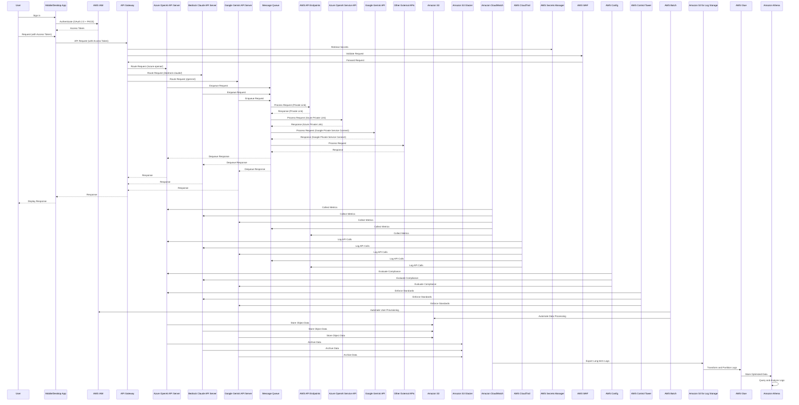

### 1. ユーザープロビジョニングプロセスのフロー

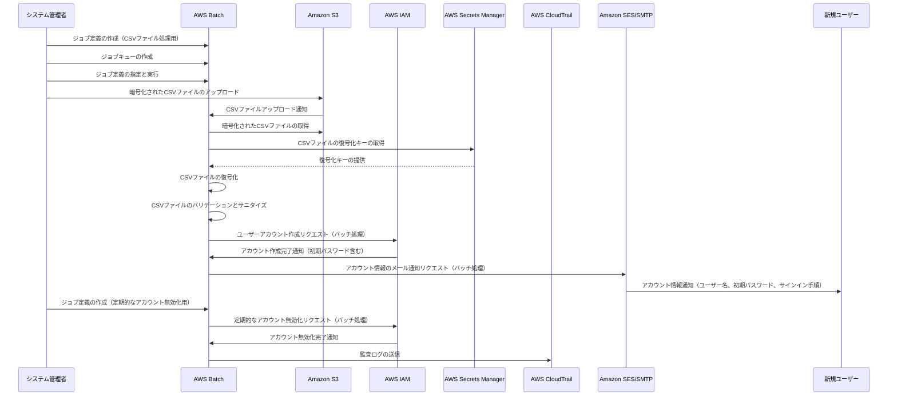

このフローでは、以下の点が特に重要です。

1. **CSVファイルの暗号化**: システム管理者はCSVファイルを暗号化してからAmazon S3にアップロードします。暗号化キーはAWS Secrets Managerで管理されます。

2. **データの検証とサニタイズ**: AWS Batchは、CSVファイルを復号化した後、データのバリデーションとサニタイズを行います。これにより、不正なデータの流入を防ぎます。

3. **監査ログの生成**: ユーザープロビジョニングのプロセス全体を通して、監査ログが生成されAWS CloudTrailに送信されます。これにより、プロセスの透明性が確保され、異常な動作を検知できます。

4. **自動化された処理**: CSVファイルのアップロードから、ユーザーアカウントの作成、通知、無効化まで、AWS Batchを使用して自動化されています。これにより、手動のエラーを減らし、効率性を高めます。

5. **セキュリティの強化**: 暗号化、Secrets Manager、データの検証、監査ログなどの機能により、プロセス全体のセキュリティが強化されています。また、定期的なアカウント無効化するなどの運用も考慮する必要があります。

### 詳細なプロセスフロー

### 1. CSVファイルの準備とアップロード

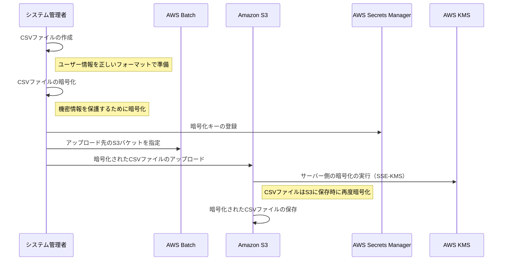

注意点:
- CSVファイルのフォーマットを正しく定義し、システム管理者に周知する
- 機密情報を含むCSVファイルは必ず暗号化する
- 暗号化キーは安全に管理し、アクセス制御を適切に設定する
- Amazon S3でサーバー側の暗号化（SSE-KMS）を使用し、保存時のデータを保護する

### 2. CSVファイルの検証と処理

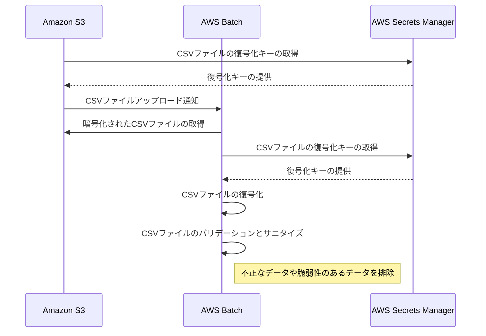

注意点:
- Amazon S3とAWS Batchの間の通信は、セキュアな方法（HTTPS、VPC内の通信など）で行う
- 復号化キーの取得には適切な認証と認可を設定する
- バリデーションとサニタイズのルールを明確に定義し、定期的に見直す

### 3. ユーザーアカウントの自動作成と通知

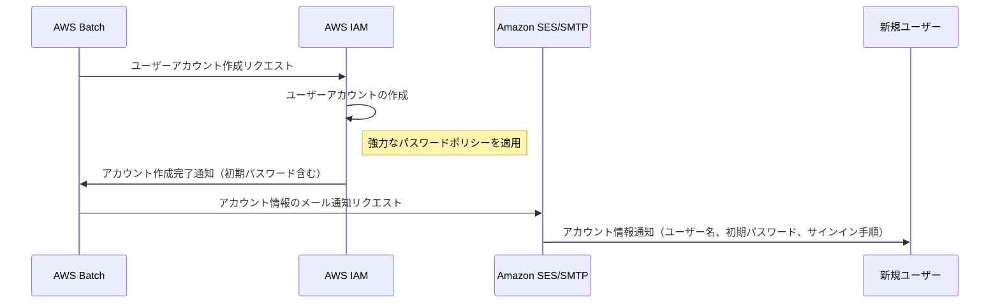

注意点:
- ユーザーアカウントの作成時に、強力なパスワードポリシーを適用する
- 初期パスワードは、ユーザーが初回サインイン時に変更するよう設定する
- メールによる通知は、セキュアな方法（TLS暗号化など）で行う

### 4. アカウントの無効化と監査ログの生成

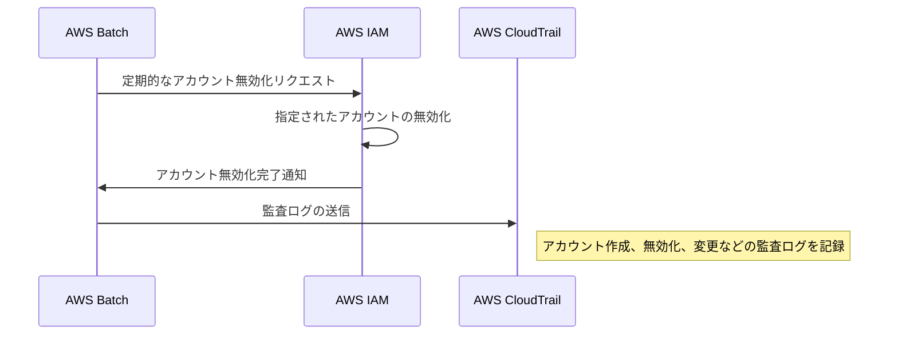

注意点:
- アカウントの無効化は、組織のポリシーに基づいて定期的に行う
- 無効化の基準を明確に定義し、例外処理のプロセスも用意する
- 監査ログは、不正アクセスや異常な動作の検知に役立てる

### 5. プロセス全体の自動化と監視

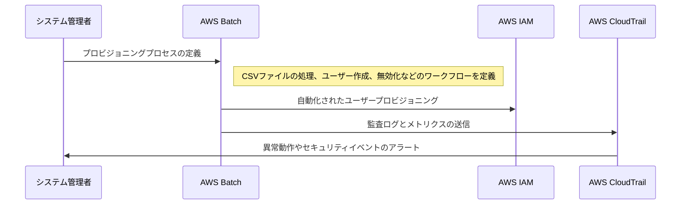

注意点:
- 自動化されたワークフローは、定期的に見直し、改善する
- 監視および監査の仕組みを導入し、セキュリティ上の問題をいち早く検知する
- 監査ログやメトリクスは、適切な期間保持し、定期的にレビューする

このように、ユーザープロビジョニングのプロセスにおいては、セキュリティ、コンプライアンス、効率性、監視の観点から、様々な注意点があります。これらを適切に設計・実装し、継続的に改善していくことが重要です。

### 2. 払い出されたAWS IAMのアカウントを使ってユーザーが自分のアクセストークンを取得するフロー

### 1. ユーザー認証の開始

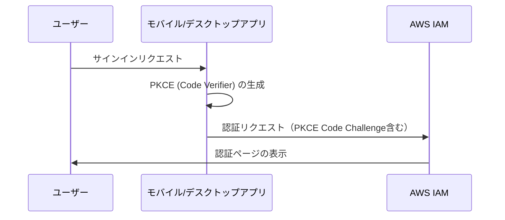

注意点:
- PKCEを使用して、認可コードグラントフローのセキュリティを強化する
- リダイレクトURIのホワイトリストを適切に管理する

### 2. ユーザーの認証と認可

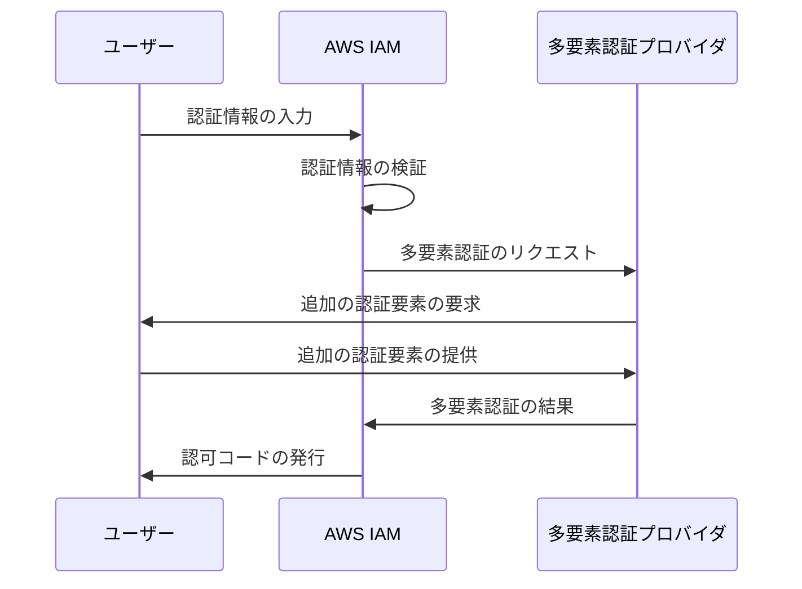

注意点:
- 多要素認証（MFA）を必須とし、セキュリティを強化する
- 認証に使用する要素（生体認証、ハードウェアキーなど）を適切に選択する

### 3. アクセストークンの取得

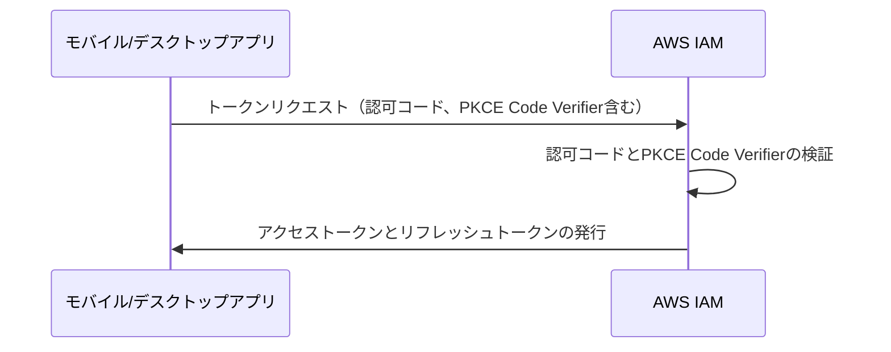

注意点:
- アクセストークンの有効期間を短く設定し、リフレッシュトークンを使用して定期的に更新する
- リフレッシュトークンの有効期間とローテーションポリシーを適切に設定する

### 4. アクセストークンの利用とセキュアな保存

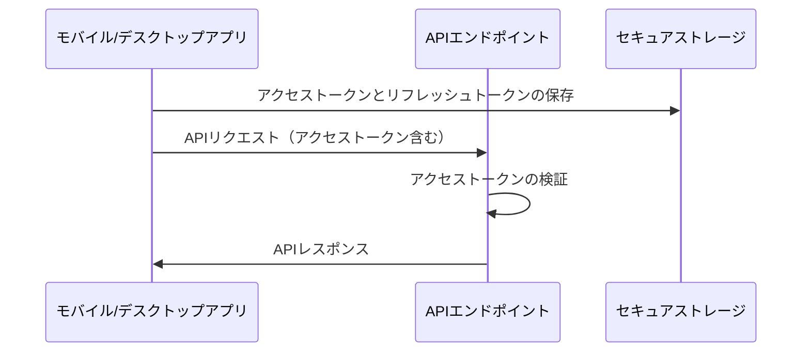

注意点:
- アクセストークンとリフレッシュトークンは、セキュアストレージ（KeychainやSecure Storageなど）に保存する
- アクセストークンを使用するすべての通信はHTTPS経由で行う

### 5. ログアウトとトークンの失効

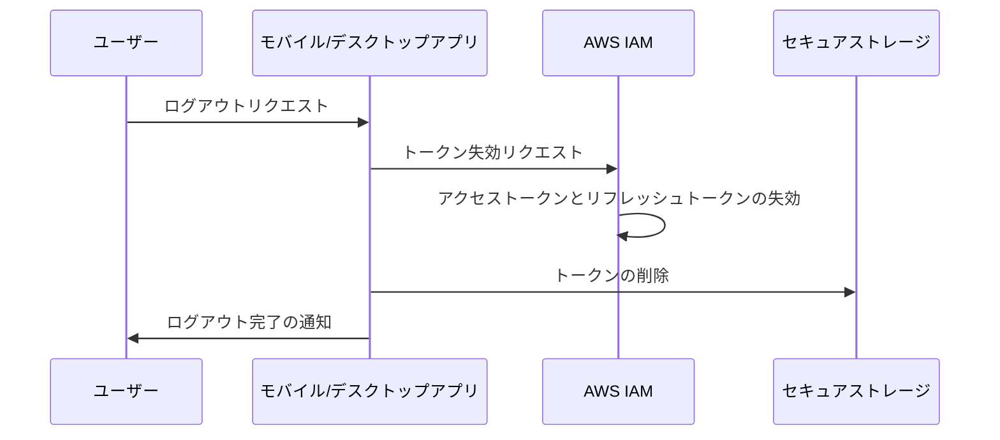

注意点:
- ログアウト時には、AWS IAMでトークンを確実に失効させる
- アプリケーション側でもトークンを削除し、不正利用を防ぐ

このフローでは、PKCEを用いたセキュアな認可コードグラントフロー、多要素認証、トークンのセキュアな保存と利用、適切なログアウト処理など、セキュリティとユーザビリティの両面から重要な点が強調されています。

#### 具体的な実装例

以下に、Python を用いた OAuth 2.0 の認可コードグラントフロー（PKCE）とAPIリクエストの例を示します。

```python
import requests
import json
import secrets
import hashlib
import base64

# PKCE のコードベリファイアとチャレンジを生成
def generate_pkce_codes():
    code_verifier = secrets.token_urlsafe(32)
    code_challenge = base64.urlsafe_b64encode(
        hashlib.sha256(code_verifier.encode()).digest()
    ).rstrip(b'=').decode('utf-8')
    return code_verifier, code_challenge

# 認証リクエストのための URL を構築
def build_auth_url(client_id, redirect_uri, code_challenge):
    auth_url = f"https://auth.example.com/oauth2/authorize?client_id={client_id}&response_type=code&redirect_uri={redirect_uri}&scope=openid%20profile%20offline_access&code_challenge={code_challenge}&code_challenge_method=S256"
    return auth_url

# トークンリクエスト
def request_tokens(auth_code, redirect_uri, client_id, code_verifier):
    token_url = "https://auth.example.com/oauth2/token"
    headers = {"Content-Type": "application/x-www-form-urlencoded"}
    data = {
        "grant_type": "authorization_code",
        "client_id": client_id,
        "code": auth_code,
        "redirect_uri": redirect_uri,
        "code_verifier": code_verifier
    }
    response = requests.post(token_url, headers=headers, data=data)
    return response.json()

# APIリクエストを送信（HTTPS）
def call_api(access_token):
    api_url = "https://api.example.com/v1/resource"
    headers = {
        "Authorization": f"Bearer {access_token}",
        "Content-Type": "application/json"
    }
    response = requests.get(api_url, headers=headers, verify=True)
    return response.json()

# メインの処理フロー
def main():
    client_id = "your_client_id"
    redirect_uri = "your_redirect_uri"
    
    # PKCE コードの生成
    code_verifier, code_challenge = generate_pkce_codes()
    
    # 認証リクエストの URL 構築と表示
    auth_url = build_auth_url(client_id, redirect_uri, code_challenge)
    print(f"以下の URL にアクセスして認証を行ってください：\n{auth_url}")
    
    # 認可コードの入力
    auth_code = input("認可コードを入力してください：")
    
    # トークンのリクエスト
    token_response = request_tokens(auth_code, redirect_uri, client_id, code_verifier)
    access_token = token_response["access_token"]
    refresh_token = token_response["refresh_token"]
    
    # APIのコール
    api_response = call_api(access_token)
    print(f"APIレスポンス：\n{api_response}")

if __name__ == "__main__":
    main()
```

### セキュリティの考慮点

- **多要素認証（MFA）の適用**：ユーザー認証時に多要素認証を必須とすることで、不正アクセスのリスクを大幅に減らすことができます。
- **トークンのセキュアな保存**：アクセストークンとリフレッシュトークンは、Keychainや Secure Storage などのセキュアストレージに保存し、不正アクセスから保護する必要があります。
- **最小権限の原則の適用**：アクセストークンに付与するスコープ（権限）は、アプリケーションが必要とする最小限のものに留めるべきです。
- **トークンの定期的な更新**：アクセストークンの有効期間を短く設定し、リフレッシュトークンを使って定期的に新しいアクセストークンを取得することが推奨されます。
- **ログアウト時のトークン失効**：ユーザーがログアウトした際には、AWS IAM 上でトークンを確実に失効させ、不正利用を防ぐ必要があります。
- **セキュアな通信**：
    - APIのエンドポイントURLには、必ず https:// を使用します。
    - requests ライブラリを使用する場合、verify=True を指定して、サーバー証明書の検証を行うこととします。
    - モバイルアプリでは、証明書ピンニングを実装することで、中間者攻撃のリスクをさらに減らすことができます

これらの点に注意しながら、セキュアなトークン管理とAPI利用の仕組みを実装することが重要です。

また、コード例で示したように、PKCE を用いた認可コードグラントフローを採用することで、クライアントシークレットを持たないネイティブアプリケーションにおいてもセキュリティを高く保つことができます。

実際のアプリケーション開発においては、ここで示した原則とベストプラクティスを踏まえつつ、利用シーンや要件に合わせて適切な実装を行っていく必要があります。セキュリティは常に最優先事項の一つとして捉え、定期的な見直しと改善を続けていくことが大切です。

### アクセストークンの払い出しについて

アクセストークンの払い出しについては、モバイルアプリやデスクトップアプリにおけるセキュリティとユーザビリティの確保が重要です。以下に、主要な考慮点と対策を示します。

### モバイルアプリ・デスクトップアプリへのアクセストークン払い出しの考慮点

1. **セキュアストレージの利用**
   - アクセストークンとリフレッシュトークンは、セキュアストレージに保存する必要があります。
   - iOS: Keychain Services API を利用
   - Android: AndroidX Security Library の EncryptedSharedPreferences を利用
   - Windows: Data Protection API（DPAPI）を利用
   - macOS: Keychain Services API を利用
   - Linux: libsecret を利用

2. **PKCE（Proof Key for Code Exchange）の利用**
   - 認可コードグラントフローにおいて、PKCE を利用することで、認可コードの盗用リスクを軽減できます。
   - PKCE は、クライアントシークレットを持たないネイティブアプリケーションにおけるセキュリティ対策として有効です。

3. **アクセストークンの有効期間**
   - アクセストークンの有効期間は、可能な限り短く設定します。
   - 有効期間が切れたアクセストークンは、リフレッシュトークンを用いて更新します。

4. **リフレッシュトークンの管理**
   - リフレッシュトークンは、アクセストークンよりも長い有効期間を持ちますが、定期的なローテーションが推奨されます。
   - リフレッシュトークンの有効期限が切れた場合は、ユーザーに再認証を求める必要があります。

5. **セキュアな通信**
   - アクセストークンの送受信は、常に HTTPS を使用して暗号化します。
   - モバイルアプリでは、証明書ピンニングを実装することで、中間者攻撃のリスクを軽減できます。

6. **ログアウト時のトークン失効**
   - ユーザーがログアウトした際には、AWS IAM 上でアクセストークンとリフレッシュトークンを失効させる必要があります。
   - アプリケーション側でもトークンを安全に削除し、不正利用を防ぎます。

### アクセストークン払い出しの具体例（Python）

以下に、Python を用いた PKCE 対応の認可コードグラントフローの例を示します。

```python
import requests
import secrets
import hashlib
import base64

# PKCE のコードベリファイアとチャレンジを生成
def generate_pkce_codes():
    code_verifier = secrets.token_urlsafe(32)
    code_challenge = base64.urlsafe_b64encode(
        hashlib.sha256(code_verifier.encode()).digest()
    ).rstrip(b'=').decode('utf-8')
    return code_verifier, code_challenge

# 認証リクエストのための URL を構築
def build_auth_url(client_id, redirect_uri, code_challenge):
    auth_url = f"https://auth.example.com/oauth2/authorize?client_id={client_id}&response_type=code&redirect_uri={redirect_uri}&scope=openid%20profile%20offline_access&code_challenge={code_challenge}&code_challenge_method=S256"
    return auth_url

# トークンリクエスト
def request_tokens(client_id, redirect_uri, auth_code, code_verifier):
    token_url = "https://auth.example.com/oauth2/token"
    headers = {"Content-Type": "application/x-www-form-urlencoded"}
    data = {
        "client_id": client_id,
        "grant_type": "authorization_code",
        "code": auth_code,
        "redirect_uri": redirect_uri,
        "code_verifier": code_verifier
    }
    response = requests.post(token_url, headers=headers, data=data)
    return response.json()
```

この例では、以下の流れでアクセストークンを取得します。

1. `generate_pkce_codes` 関数で、PKCE のコードベリファイアとチャレンジを生成します。
2. `build_auth_url` 関数で、認証リクエストのための URL を構築します。この URL にはコードチャレンジが含まれます。
3. 構築された URL にユーザーをリダイレクトし、認証と認可を行います。
4. 認可サーバから認可コードを取得します。
5. `request_tokens` 関数で、認可コードとコードベリファイアを使用してトークンをリクエストします。

取得したアクセストークンとリフレッシュトークンは、セキュアストレージに安全に保存する必要があります。また、アクセストークンの有効期限が切れた場合は、リフレッシュトークンを使用して新しいアクセストークンを取得します。

### まとめ

モバイルアプリやデスクトップアプリにおけるアクセストークンの払い出しでは、セキュリティとユーザビリティのバランスを取ることが重要です。PKCE を利用した認可コードグラントフロー、セキュアストレージの活用、適切なトークン管理など、セキュリティのベストプラクティスに従いながら、ユーザーにとって使いやすい認証・認可フローを実現することが求められます。

また、アプリケーションのライフサイクル全体を通して、セキュリティの継続的な改善とモニタリングが不可欠です。新しい脅威や脆弱性が発見された場合には、迅速に対応策を講じる必要があります。

セキュリティは常に最優先事項の一つとして捉え、ユーザーの信頼を獲得・維持するための取り組みを続けていくことが、モバイルアプリやデスクトップアプリの成功には欠かせません。

### 3. アクセストークンを使ってユーザーがAPIを利用し始める際のフロー

ユーザーがアプリケーションにサインインし、アクセストークンを取得した後は、そのトークンを使用して Amazon API Gateway 経由で各 API へのアクセスを行うことになります。アプリケーション内でのトークンの保存は、プラットフォームごとのベストプラクティスに従って、セキュアに行われる必要があります。

以下に、アクセストークンを使ってユーザーがAPIを利用し始める際のフローを詳細に説明します。

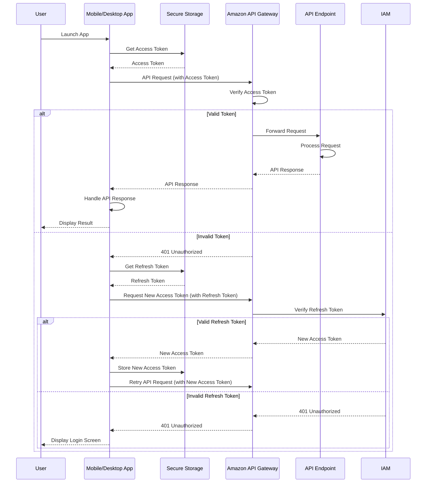

このシーケンス図では、以下の流れが表現されています。

1. ユーザーがモバイル/デスクトップアプリを起動します。
2. アプリは、セキュアストレージからアクセストークンを取得します。
3. アプリは、取得したアクセストークンを使用してAmazon API Gatewayを介してAPIエンドポイントにリクエストを送信します。 
4. API Gatewayは、アクセストークンの検証を行います。
5. 有効なトークンの場合、API Gatewayはリクエストを対応するAPIエンドポイントに転送します。APIエンドポイントはリクエストを処理し、レスポンスをAPI Gatewayに返します。API Gatewayはレスポンスをアプリに返し、アプリは結果をユーザーに表示します。
6. 無効なトークンの場合、API Gatewayは401 Unauthorizedレスポンスを返します。
7. アプリは、セキュアストレージからリフレッシュトークンを取得します。
8. アプリは、リフレッシュトークンを使用して新しいアクセストークンをリクエストします。
9. API Gatewayは、AWS IAMにリフレッシュトークンの検証を依頼します。
10. 有効なリフレッシュトークンの場合、IAMは新しいアクセストークンを発行し、API Gatewayを通じてアプリに返します。アプリは新しいアクセストークンをセキュアストレージに保存し、APIリクエストを再試行します。
11. 無効なリフレッシュトークンの場合、IAMは401 Unauthorizedレスポンスを返します。API Gatewayはこれをアプリに伝え、アプリはログイン画面を表示します。

このフローは、ユーザーがアプリを起動してから、APIを利用するまでの一連の手順を示しています。アクセストークンの取得、APIリクエストの送信、トークンの更新、エラー処理などの主要な手順が含まれています。

実際のアプリケーションでは、このフローをベースに、より詳細な処理や例外処理、ユーザーインターフェースとの連携などが実装されることになります。また、セキュリティ上の考慮事項として、アクセストークンとリフレッシュトークンの安全な保存、トークンの有効期限の管理、セキュアな通信の実装などが重要になります。

### 1. アクセストークンのセキュアな保存

#### Android の場合

```kotlin
// アクセストークンを EncryptedSharedPreferences に保存
val encryptedPrefs = EncryptedSharedPreferences.create(
    "secret_prefs",
    masterKeyAlias,
    context,
    EncryptedSharedPreferences.PrefKeyEncryptionScheme.AES256_SIV,
    EncryptedSharedPreferences.PrefValueEncryptionScheme.AES256_GCM
)
encryptedPrefs.edit().putString("access_token", accessToken).apply()
```

#### iOS の場合

```swift
// アクセストークンを Keychain に保存
let accessToken = "your_access_token"
let data = Data(accessToken.utf8)
let query: [String: Any] = [
    kSecClass as String: kSecClassGenericPassword,
    kSecAttrAccount as String: "AccessToken",
    kSecValueData as String: data
]
SecItemAdd(query as CFDictionary, nil)
```

### 2. APIリクエストの送信

#### Android (Kotlin) の場合

```kotlin
// アクセストークンを取得
val encryptedPrefs = EncryptedSharedPreferences.create(
    "secret_prefs",
    masterKeyAlias,
    context,
    EncryptedSharedPreferences.PrefKeyEncryptionScheme.AES256_SIV,
    EncryptedSharedPreferences.PrefValueEncryptionScheme.AES256_GCM
)
val accessToken = encryptedPrefs.getString("access_token", null)

// APIリクエストを送信
val client = OkHttpClient()
val request = Request.Builder()
    .url("https://api.example.com/v1/resource")
    .addHeader("Content-Type", "application/json")
    .addHeader("Authorization", "Bearer $accessToken")
    .post(requestBody)
    .build()
val response = client.newCall(request).execute()
```

#### iOS (Swift) の場合

```swift
// アクセストークンを取得
let query: [String: Any] = [
    kSecClass as String: kSecClassGenericPassword,
    kSecAttrAccount as String: "AccessToken",
    kSecReturnData as String: true
]
var item: CFTypeRef?
let status = SecItemCopyMatching(query as CFDictionary, &item)
guard status == errSecSuccess else { /* handle error */ }
let accessToken = String(data: item as! Data, encoding: .utf8)

// APIリクエストを送信
let url = URL(string: "https://api.example.com/v1/resource")!
var request = URLRequest(url: url)
request.httpMethod = "POST"
request.addValue("application/json", forHTTPHeaderField: "Content-Type")
request.addValue("Bearer \(accessToken!)", forHTTPHeaderField: "Authorization")
request.httpBody = requestBody
let task = URLSession.shared.dataTask(with: request) { data, response, error in
    // レスポンスの処理
}
task.resume()
```

これらの例では、以下の流れでAPIリクエストを送信しています。

1. セキュアストレージ（Android の場合は EncryptedSharedPreferences、iOS の場合は Keychain）からアクセストークンを取得します。
2. 取得したアクセストークンを使用して、API Gateway の対応するエンドポイントに対してリクエストを送信します。このとき、`Authorization` ヘッダーに `Bearer {アクセストークン}` を指定します。
3. APIからのレスポンスを受信し、適切に処理します。

### 3. エラーハンドリングとトークンの更新

APIリクエストを送信する際には、以下のようなエラーハンドリングとトークンの更新処理が必要です。

- **401 Unauthorized エラー**: アクセストークンが無効または期限切れの場合に発生します。この場合、リフレッシュトークンを使用して新しいアクセストークンを取得する必要があります。
- **リフレッシュトークンの使用**: リフレッシュトークンを使用して新しいアクセストークンを取得する際は、セキュアストレージからリフレッシュトークンを読み込み、適切なエンドポイントにリクエストを送信します。取得した新しいアクセストークンは、セキュアストレージに保存します。
- **リフレッシュトークンの更新**: リフレッシュトークン自体の有効期限が切れた場合は、ユーザーに再認証を求める必要があります。

以下に、リフレッシュトークンを使用して新しいアクセストークンを取得する例を示します。

#### Android (Kotlin) の場合

```kotlin
// リフレッシュトークンを取得
val refreshToken = encryptedPrefs.getString("refresh_token", null)

// 新しいアクセストークンをリクエスト
val client = OkHttpClient()
val requestBody = FormBody.Builder()
    .add("grant_type", "refresh_token")
    .add("refresh_token", refreshToken)
    .add("client_id", clientId)
    .build()
val request = Request.Builder()
    .url("https://auth.example.com/oauth2/token")
    .post(requestBody)
    .build()
val response = client.newCall(request).execute()
val responseBody = response.body?.string()
val jsonObject = JSONObject(responseBody)
val newAccessToken = jsonObject.getString("access_token")

// 新しいアクセストークンをセキュアストレージに保存
encryptedPrefs.edit().putString("access_token", newAccessToken).apply()
```

#### iOS (Swift) の場合

```swift
// リフレッシュトークンを取得
let refreshTokenQuery: [String: Any] = [
    kSecClass as String: kSecClassGenericPassword,
    kSecAttrAccount as String: "RefreshToken",
    kSecReturnData as String: true
]
var refreshTokenItem: CFTypeRef?
let refreshTokenStatus = SecItemCopyMatching(refreshTokenQuery as CFDictionary, &refreshTokenItem)
guard refreshTokenStatus == errSecSuccess else { /* handle error */ }
let refreshToken = String(data: refreshTokenItem as! Data, encoding: .utf8)

// 新しいアクセストークンをリクエスト
let url = URL(string: "https://auth.example.com/oauth2/token")!
var request = URLRequest(url: url)
request.httpMethod = "POST"
let requestBody = "grant_type=refresh_token&refresh_token=\(refreshToken!)&client_id=\(clientId)"
request.httpBody = requestBody.data(using: .utf8)
let task = URLSession.shared.dataTask(with: request) { data, response, error in
    guard let data = data else { /* handle error */ }
    let jsonObject = try? JSONSerialization.jsonObject(with: data, options: []) as? [String: Any]
    let newAccessToken = jsonObject?["access_token"] as? String
    
    // 新しいアクセストークンをセキュアストレージに保存
    let newAccessTokenData = newAccessToken?.data(using: .utf8)
    let newAccessTokenQuery: [String: Any] = [
        kSecClass as String: kSecClassGenericPassword,
        kSecAttrAccount as String: "AccessToken",
        kSecValueData as String: newAccessTokenData!
    ]
    SecItemAdd(newAccessTokenQuery as CFDictionary, nil)
}
task.resume()
```

これらの例では、以下の流れで新しいアクセストークンを取得しています。

1. セキュアストレージからリフレッシュトークンを取得します。
2. リフレッシュトークンを使用して、新しいアクセストークンをリクエストします。
3. 取得した新しいアクセストークンをセキュアストレージに保存します。

### まとめ

アクセストークンを使ってユーザーがAPIを利用し始める際には、以下の点が重要です。

1. アクセストークンをセキュアストレージに安全に保存する。
2. 保存されたアクセストークンを使用して、適切にAPIリクエストを送信する。
3. APIレスポンスのエラーハンドリングを適切に行う。
4. 必要に応じて、リフレッシュトークンを使用して新しいアクセストークンを取得する。

これらの点に留意しながら、ユーザーにとって使いやすく、セキュリティに優れたAPIの利用環境を提供することが重要です。また、アプリケーションのライフサイクル全体を通して、セキュリティの継続的な改善とモニタリングを行うことが必要不可欠です。

### 4. API通信に関わる全体の流れ

アクセストークンを使用してAPIリクエストを行い、そのリクエストが正常に処理されると同時に監査ログが蓄積されていくフローについて、以下に示します。

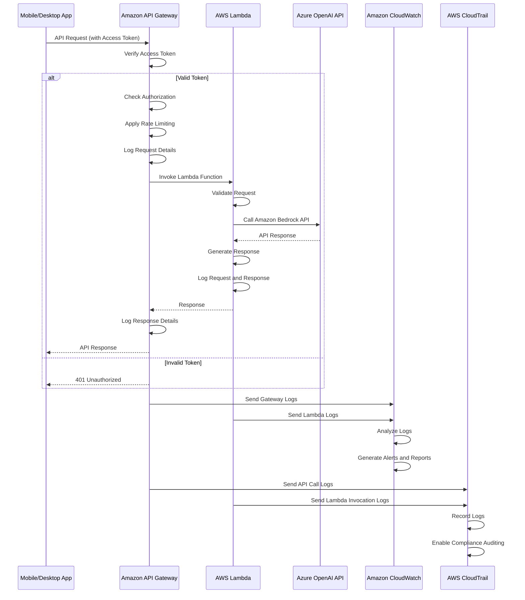

このシーケンス図では、以下の流れが表現されています。

1. モバイル/デスクトップアプリが、アクセストークンを含めてAPIリクエストを送信します。
2. Amazon API Gatewayは、アクセストークンの検証、認可の確認、レート制限の適用、リクエストの詳細のログ記録を行います。
3. 有効なトークンの場合、API Gatewayは対応するAWS Lambda関数を呼び出します。無効なトークンの場合は、401 Unauthorizedレスポンスを返します。
4. Lambda関数は、リクエストの検証、Amazon Bedrock APIの呼び出し、レスポンスの生成、リクエストとレスポンスの詳細のログ記録を行います。
5. レスポンスは、Lambda関数からAPI Gatewayを経由してモバイル/デスクトップアプリに返されます。
6. API GatewayとLambda関数のログは、Amazon CloudWatchに送信されます。
7. CloudWatchは、ログの分析、アラートとレポートの生成を行います。
8. API GatewayとLambda関数の呼び出しログは、AWS CloudTrailに送信されます。
9. CloudTrailは、ログを記録し、コンプライアンス監査を可能にします。

このフローは、APIリクエストの処理における主要な手順と、監査ログの生成および分析の流れを示しています。実際のシステムでは、各コンポーネント間のやりとりや、ログの詳細な内容、アラートとレポートの具体的な基準などが定義されることになります。

### 1. APIリクエストの送信

#### Android (Kotlin) の場合

```kotlin
// アクセストークンを取得
val accessToken = encryptedPrefs.getString("access_token", null)

// APIリクエストを送信
val client = OkHttpClient()
val requestBody = RequestBody.create(MediaType.parse("application/json"), jsonPayload)
val request = Request.Builder()
    .url("https://api.example.com/v1/resource")
    .addHeader("Content-Type", "application/json")
    .addHeader("Authorization", "Bearer $accessToken")
    .post(requestBody)
    .build()
val response = client.newCall(request).execute()

// レスポンスの処理
val responseBody = response.body?.string()
// ...
```

#### iOS (Swift) の場合

```swift
// アクセストークンを取得
let accessToken = // ... Keychainからアクセストークンを取得 ...

// APIリクエストを送信
let url = URL(string: "https://api.example.com/v1/resource")!
var request = URLRequest(url: url)
request.httpMethod = "POST"
request.addValue("application/json", forHTTPHeaderField: "Content-Type")
request.addValue("Bearer \(accessToken)", forHTTPHeaderField: "Authorization")
request.httpBody = jsonPayload.data(using: .utf8)
let task = URLSession.shared.dataTask(with: request) { data, response, error in
    // レスポンスの処理
    // ...
}
task.resume()
```

### 2. API Gatewayでのリクエスト処理

API Gatewayは、受信したリクエストに対して以下の処理を行います。

1. 認証: Authorization ヘッダーからアクセストークンを抽出し、AWS IAMに対してトークンの有効性を確認します。

- アクセストークンの有効期限が切れている場合、API Gatewayは401 Unauthorizedレスポンスを返します。
- クライアントは、リフレッシュトークンを使用して新しいアクセストークンをリクエストする必要があります。

2. 認可: アクセストークンに含まれるスコープ（権限）を確認し、リクエストされたリソースへのアクセス権限があるかどうかを確認します。
3. レート制限: リクエストの頻度を監視し、設定されたレート制限を超えた場合はリクエストを拒否します。
4. ロギング: リクエストと応答の詳細を記録し、監査ログとして保存します。

アクセストークンの有効期限は、セキュリティと利便性のバランスを考慮して設定します。一般的には、数時間から数日の間で設定されます。有効期限が切れたアクセストークンは、リフレッシュトークンを使用して更新することができます。
リフレッシュトークンは、アクセストークンよりも長い有効期限を持ち、アクセストークンの更新に使用されます。リフレッシュトークンの有効期限が切れた場合、ユーザーは再度認証を行ってリフレッシュトークンを取得する必要があります。
API Gatewayでは、AWS IAMと連携してアクセストークンとリフレッシュトークンの管理を行います。これにより、トークンのライフサイクル全体をセキュアに管理することができます。

### 3. Lambda関数での処理

API Gatewayを通過したリクエストは、Lambda関数で処理されます。

1. **リクエストの検証**: リクエストのパラメータや payload を検証し、不正な値がないかチェックします。
2. **Amazon Bedrock APIの呼び出し**: リクエストに基づいて、Amazon Bedrock APIを呼び出します。
3. **レスポンスの生成**: Amazon Bedrock APIからの応答を元に、クライアントに返すレスポンスを生成します。
4. **ロギング**: リクエストとレスポンスの詳細を記録し、Lambda関数のログとして保存します。

Lambda関数のセキュリティを確保するために、以下の点に留意します。

- **最小特権の原則**: Lambda関数の実行ロールには、必要最小限の権限のみを付与します。これにより、Lambda関数が不正にアクセスされた場合の影響を最小限に抑えることができます。
- **環境変数の暗号化**: Lambda関数で使用するシークレット情報（APIキー、データベース接続文字列など）は、AWS Key Management Service（KMS）を使用して暗号化します。暗号化された環境変数は、Lambda関数の実行時に復号化されます。
- **ネットワーク制御**: Lambda関数をVPC内に配置し、セキュリティグループとネットワークACLを使用して、不要な通信を制限します。
- **コードの安全性**: Lambda関数のコードは、脆弱性やセキュリティ上の欠陥がないように徹底的にレビューし、定期的に更新します。

これらの対策を講じることで、Lambda関数を安全に実行し、APIバックエンドとしての信頼性を高めることができます。

### 4. 監査ログの蓄積

API GatewayとLambda関数で生成されたログは、監査ログとして一元的に管理されます。

1. **Amazon CloudWatch**: CloudWatch は、AWS のサービスやアプリケーションから生成されたメトリックとログを収集し、モニタリングするためのサービスです。API GatewayとLambda関数のログは、CloudWatch に送信されます。
2. **ログの種類**: 監査ログには、以下のようなログが含まれます。

    - API Gatewayのアクセスログ（認証、認可、レート制限の結果など）
    - Lambda関数のアクセスログ（リクエストとレスポンスの詳細、エラー情報など）
    - AWS IAMの認証ログ（サインイン、サインアウト、IAMポリシー評価の結果など）
    - Amazon Bedrock APIの使用状況ログ（呼び出されたAPIの種類、パラメータ、レスポンス時間など）

3. **ログの分析**: 収集されたログは、CloudWatchのログ分析機能を使用して分析されます。CloudWatchでは、ログデータに対して複雑なクエリを実行し、パターンやトレンドを発見することができます。
4. **アラートとレポート**: CloudWatchで定義されたルールに基づいて、異常な動作やセキュリティ上の脅威が検出された場合、アラートが生成されます。また、定期的にログデータを集計し、レポートを生成することもできます。
5. **AWS CloudTrail**: CloudTrail は、AWS アカウント内のイベントを記録し、監査証跡を提供するサービスです。API GatewayとLambda関数の呼び出しログは、CloudTrail に送信され、コンプライアンス監査に利用されます。

監査ログのセキュリティを確保するために、以下の点に留意します。

- **ログデータの暗号化**: CloudWatch Logsに保存されるログデータは、AWS Key Management Service（KMS）を使用してサーバー側で暗号化します。これにより、不正アクセスからログデータを保護します。
- **アクセス制御**: CloudWatch LogsとCloudTrailへのアクセスは、IAMポリシーを使用して厳密に制御します。ログデータへのアクセスは、必要最小限の権限を持つユーザーやロールに限定します。
- **ログの長期保存**: 法規制や組織のポリシーに基づいて、監査ログを長期間保存します。CloudWatch Logsの保存期間を設定し、定期的にログデータをAmazon S3にエクスポートします。
- **ログのアーカイブ**: 長期保存が必要なログデータは、Amazon S3 Glacierを使用してアーカイブします。アーカイブされたログデータは、必要に応じて取り出すことができます。

これらの対策により、監査ログの機密性、整合性、可用性を維持し、セキュリティインシデントの調査や法規制への対応に役立てることができます。

### 5. セキュリティとコンプライアンス

監査ログの蓄積は、セキュリティとコンプライアンスの観点から重要な役割を果たします。

1. **不正アクセスの検知**: 監査ログを分析することで、不正なアクセス試行や異常な動作を検知することができます。
2. **インシデント対応**: セキュリティインシデントが発生した場合、監査ログを使用して原因を特定し、適切な対応を行うことができます。
3. **コンプライアンス**: 監査ログは、法規制や業界標準への準拠を示すための重要な証跡となります。必要に応じて、監査ログをコンプライアンスレポートに含めることができます。

### まとめ

アクセストークンを使用したAPIリクエストの処理と、それに伴う監査ログの蓄積は、安全で信頼性の高いシステムを運用するために不可欠なプロセスです。

1. アプリケーションからのAPIリクエストは、適切なアクセストークンを含める必要があります。
2. API Gatewayは、アクセストークンの検証、認可、レート制限、ロギングを行います。
3. Lambda関数は、リクエストの処理とレスポンスの生成を行い、詳細なログを記録します。
4. 監査ログは、CloudWatchとCloudTrailを使用して一元的に管理され、分析とアラート生成に利用されます。
5. 監査ログは、セキュリティとコンプライアンスの観点から重要な役割を果たします。

これらの要素を適切に設計・実装することで、安全で信頼性が高く、法規制に準拠したシステムを構築することができます。定期的なログのレビューとシステムの監視を行い、継続的な改善に努めることが重要です。

## その他、重要な検討事項や非機能要件（NFR）

**障害対策と回復性**

- 各コンポーネントの障害シナリオと対策方法

    - Amazon API Gateway: 複数のリージョンにデプロイし、リージョン間でのフェイルオーバーを設定する。
    - AWS Lambda: 複数のアベイラビリティゾーン（AZ）にLambda関数を配置し、1つのAZで障害が発生した場合でも他のAZで処理を継続する。
    - データベース: Amazon RDS のマルチAZ配置により、1つのAZで障害が発生した場合でも別のAZで運用を継続する。

- システム全体の回復性向上策

    - データのバックアップ: Amazon S3にデータを定期的にバックアップし、障害時の復旧に備える。
    - フェールオーバー構成: AWS Route 53を使用して、プライマリーリージョンで障害が発生した場合にセカンダリーリージョンにトラフィックを切り替える。

**パフォーマンスとスケーラビリティ**

- 想定される負荷とパフォーマンス要件

    - 1日あたりのアクティブユーザー数: 10,000人
    - ピーク時の同時接続数: 1,000
    - APIレスポンスタイム: 99パーセンタイルで1秒以内

- オートスケーリングと負荷分散

    - AWS Lambda: 自動的にスケールアウト/インし、負荷に応じて並列実行数を調整する。
    - Amazon ECS: サービスのオートスケーリング設定により、CPUとメモリ使用率に基づいてタスク数を自動的に調整する。
    - Elastic Load Balancing: Application Load Balancer（ALB）を使用して、複数のLambda関数やECSタスク間で負荷を分散する。

**運用とメンテナンス**

- 監視とログ管理

    - Amazon CloudWatch: 各コンポーネントのメトリクスを収集し、ダッシュボードで可視化する。
    - Amazon CloudWatch Logs: Lambda関数やECSタスクのログを一元的に管理し、異常検知やトレンド分析に活用する。
    - アラート設定: 重大なエラーやパフォーマンス低下が発生した場合に、運用チームにアラートを通知する。

- メンテナンス作業

    - Amazon EC2のOSパッチ適用: AWS Systems Managerを使用して、定期的にOSパッチを適用する。
    - データ更新: AWS Batchを使用して、定期的にデータの更新処理を実行する。
    - メンテナンス体制: 専任の運用チーム（3名）が24時間365日でシステムを監視。

**セキュリティと継続的改善**

- 定期的なセキュリティ活動

    - 脆弱性スキャン: AWS Inspector、Amazon GuardDuty、サードパーティ製ツールを使用して、定期的にシステムの脆弱性をスキャンし、検出された脆弱性に対処する。
    - ペネトレーションテスト: 年1回以上、外部の専門機関によるペネトレーションテストを実施し、システムのセキュリティ耐性を評価する。
    - セキュリティ監査: AWS Security Hub、AWS Audit Managerを使用して、AWSのベストプラクティスとコンプライアンス要件への準拠状況を継続的に監視・監査する。
    - セキュリティトレーニング: 開発者と運用チームに対して、定期的にセキュリティトレーニングを実施し、セキュリティ意識の向上を図る。

- インシデント対応

    - インシデント対応計画: セキュリティインシデントの検知、封じ込め、調査、復旧のためのプロセスと体制を定義したインシデント対応計画を策定する。
    - インシデント対応演習: 年1回以上、インシデント対応計画に基づいた机上演習や実践的な演習を行い、対応力の向上を図る。

これらの継続的なセキュリティ活動を通じて、システムのセキュリティレベルを維持・向上させ、新たな脅威や脆弱性に対する耐性を高めていくことが重要です。また、セキュリティ活動で得られた知見を開発プロセスにフィードバックし、セキュアな設計・実装の継続的な改善につなげていくことが求められます。

## Appendix 部署ごとのAPI利用料請求

各部署のAPI利用状況を把握し、適切に利用料を請求するためには、以下のような仕組みの追加が必要となると考えられます。

### Amazon API Gateway
- 部署ごとにAPIキーを発行し、APIへのアクセスを制御する。
- 各リクエストのAPIキーから、リクエスト元の部署を特定する。
- 部署ごとのAPI利用状況（リクエスト数、データ転送量など）を記録する。

### ログ基盤 (Amazon CloudWatch、AWS CloudTrail)
- API Gatewayから収集したAPI利用ログを、部署ごとに集計・分析する。
- 日次・月次の利用状況レポートを生成し、課金の根拠とする。

### ID管理 (AWS IAM)
- 各部署に対応したIAMグループを作成し、ユーザーを割り当てる。
- グループごとにAPI GatewayのAPIキーを発行し、アクセス権を管理する。

### 課金システム（外部システムまたはAWS Lambda）
- ログ基盤から集計されたAPI利用状況データを取得する。
- 部署ごとに利用料を計算し、課金データを生成する。
- 課金データを基に、経理システムへの連携や請求書の発行を行う。

## Appendix2 ユーザ登録のためのCSVの例

CSVファイルに含めるべきユーザーデータの項目は、システムの管理や運用に必要な情報を網羅しつつ、個人情報保護の観点から過剰な情報を含めないようにすることが重要です。以下は、このシステムの管理に適したユーザーデータの項目例です。

1. ユーザーID（必須）: システム内で一意なユーザーの識別子。社員番号等を想定
2. 名前（必須）: ユーザーの氏名。
3. メールアドレス（必須）: ユーザーの連絡先メールアドレス。
4. 部署（必須）: ユーザーが所属する部署。
5. 役職: ユーザーの役職情報。
6. 電話番号: ユーザーの連絡先電話番号。
7. 利用開始日（必須）: ユーザーのシステム利用開始日。
8. 利用終了日: ユーザーのシステム利用終了日。
9. アカウントステータス（必須）: ユーザーアカウントの状態（有効/無効）。

以下は、サンプルユーザーデータを含むCSVファイルの例です。

```csv
user_id,name,email,department,job_title,phone,start_date,end_date,status
001,山田太郎,taro.yamada@example.com,営業部,主任,03-1234-5678,2023/04/01,,active
002,鈴木花子,hanako.suzuki@example.com,人事部,課長,03-2345-6789,2023/04/01,,active
003,佐藤一郎,ichiro.sato@example.com,システム部,部長,03-3456-7890,2023/04/01,,active
004,田中裕子,yuko.tanaka@example.com,経理部,担当,03-4567-8901,2023/04/01,2023/06/30,inactive
005,高橋健一,kenichi.takahashi@example.com,営業部,課長代理,03-5678-9012,2023/04/01,,active
```

この例では、各ユーザーについて以下の情報が含まれています。

- ユーザーID: 001から005までの一意の識別子。
- 名前: ユーザーの氏名。
- メールアドレス: ユーザーの連絡先メールアドレス。
- 部署: 営業部、人事部、システム部、経理部など、ユーザーが所属する部署。部署コードなどが存在する場合はそちらの方がおそらく便利
- 役職: 主任、課長、部長、担当など、ユーザーの役職。役職コードなど存在する場合はそちらの方がおそらく便利
- 電話番号: ユーザーの連絡先電話番号。
- 利用開始日: 全ユーザーが2023/04/01からシステムの利用を開始。
- 利用終了日: ユーザーID 004の田中裕子さんは2023/06/30でシステムの利用を終了。他のユーザーは空欄。
- アカウントステータス: ユーザーID 004の田中裕子さんは"inactive"、他のユーザーは"active"。

これらの項目は、システムの管理や利用状況の分析に必要な基本的な情報をカバーしています。ただし、実際のシステムでは、組織の構造やニーズに応じて、項目の追加や変更が必要になる場合があります。また、CSVファイルにはパスワードなどの機密情報を直接含めるべきではありません。

CSVファイルのフォーマットや項目の定義については、関連部署と協議の上、組織のポリシーに沿って決定することをお勧めします。

## Appendix3 開発を進めるにあたっての推奨

開発を始める際は、以下の順序で進めていくことをお勧めします。

1. **インフラストラクチャの構築**
   - AWS上に必要なリソース（VPC、Amazon S3、AWS Lambda、Amazon API Gatewayなど）を作成します。
   - 開発環境、ステージング環境、本番環境を分けて構築することで、安全で効率的な開発が可能になります。

2. **認証・認可機能の実装**
   - AWS IAMとAmazon Cognitoを使用してユーザー認証を実装します。
   - 各コンポーネントでのロールベースのアクセス制御（RBAC）を設定します。

3. **APIの開発**
   - Amazon API Gatewayの設定（ルーティング、レート制限、キャッシュなど）を行います。
   - AWS LambdaやAmazon ECSを使用してバックエンドのAPIを開発し、デプロイします。

4. **フロントエンドの開発**
   - ユーザーインターフェースを設計し、APIと連携するフロントエンドアプリケーションを開発します。
   - モバイルアプリやデスクトップアプリの場合は、プラットフォームごとの開発を進めます。

5. **データ処理の実装**
   - AWS Batchを使用して、CSVファイルのアップロードと処理を自動化します。
   - ユーザープロビジョニングの処理を実装し、AWS IAMとの同期を設定します。

6. **ログ収集と監視の設定**
   - Amazon CloudWatchとAWS CloudTrailを使用して、各コンポーネントのログ収集と監視を設定します。
   - アラートとダッシュボードを作成し、システムの健全性を可視化します。

7. **セキュリティ対策の実施**
   - セキュリティグループやネットワークACLを使用して、ネットワークレベルのセキュリティを確保します。
   - AWS Secrets Managerを使用して、機密情報（APIキー、データベース認証情報など）を安全に管理します。

8. **テストとデプロイ**
   - 単体テスト、結合テスト、負荷テストを実施し、システムの品質を確保します。
   - AWS CodePipelineとAWS CodeDeployを使用して、自動化されたデプロイメントパイプラインを構築します。

これらのステップは、並行して進めることができる部分もあります。例えば、インフラストラクチャの構築とAPIの開発は、同時に着手することが可能です。

開発を進める際は、設計ドキュメントを参照しつつ、詳細な設計を行います。その際、各コンポーネントの責任範囲を明確にし、疎結合な設計を心がけることが重要です。また、開発の進捗状況を定期的にステークホルダーに報告し、フィードバックを得ながら、柔軟に計画を調整していくことが求められます。

これらの点に留意しつつ、段階的に開発を進めていくことで、効果的なシステムの構築が可能になります。

なお、こうしたシステムを開発するにあたって、以下のようなコンポーネントやAPIが必要になると想定しています。

1. ユーザー管理コンポーネント
   - ユーザー情報の登録、更新、削除を行うAPI
   - ユーザー認証、認可を行うAPI
   - パスワードリセット、アカウントロックアウトなどの機能を提供するAPI

2. 部署・役職管理コンポーネント（ただし役職等で利用可能なサービスを制限する、利用量に応じて部署に課金する等の処理が不要であれば開発も不要と思われる）
   - 部署・役職情報の登録、更新、削除を行うAPI
   - 部署・役職とユーザーの関連付けを管理するAPI

3. AWS IAM連携コンポーネント
   - ユーザー情報をAWS IAMと同期するためのAPI
   - AWS IAMのグループ情報を取得・管理するAPI

4. CSVファイル処理コンポーネント
   - CSVファイルのアップロード、ダウンロード機能を提供するAPI
   - CSVファイルのバリデーション、データ変換を行うAPI

5. 監査ログ管理コンポーネント
   - 各種の操作ログを記録するAPI
   - 監査ログの検索、集計、レポート生成を行うAPI

6. Amazon API Gateway
   - 認証、認可、レート制限、キャッシングなどの機能を提供
   - 各APIへのルーティングを制御

7. Webフロントエンド
   - ユーザー管理、部署・役職管理などの管理者向け機能を提供
   - CSVファイルのアップロード、ダウンロードのUIを提供

8. モバイルアプリ
   - iOS、Android向けのネイティブアプリ

9. デスクトップアプリ
   - Windows、macOS向けのデスクトップアプリ

10. バッチ処理コンポーネント
    - ユーザーデータの定期的な同期、更新を行うバッチ処理
    - レポートの定期的な生成、配信を行うバッチ処理

11. 通知コンポーネント
    - メールによるアカウント情報の通知、アラートの送信を行うAPI
    - Amazon SNSを使用したプッシュ通知の送信を行うAPI

12. 課金管理コンポーネント（ただし利用量に応じて部署に課金する等の処理が不要であれば開発も不要と思われる）
    - 部署ごとのAPI利用状況を集計するバッチ処理
    - 利用料の計算、請求データの生成を行うAPI

これらのコンポーネントやAPIは、システムの要件や設計によって変動する可能性があります。開発を進める際は、各コンポーネントの責務を明確にし、疎結合な設計を心がけることが重要です。

また、開発の優先順位づけを行い、MVP（Minimum Viable Product）を定義することも効果的です。MVPを早期にリリースし、ユーザーからのフィードバックを取り入れながら、段階的に機能を拡充していくアプローチが推奨されます。

これらのコンポーネントやAPIを適切に設計・実装し、全体として整合性のあるシステムを構築していくことが、プロジェクトの成功のカギとなります。

### APIのイメージ

役割ごとにカテゴライズした上で、APIの一覧をまとめてみました。

1. ユーザー管理
   - CSVファイルのアップロード
     - POST /users/csv/upload
   - CSVファイルのダウンロード
     - GET /users/csv/download
   - ユーザー情報の同期状況の取得
     - GET /users/sync/status
   - ユーザーの一時的な無効化
     - PUT /users/{userId}/disable
   - ユーザーの一時的な無効化の解除
     - PUT /users/{userId}/enable
   - ユーザーの削除
     - DELETE /users/{userId}

2. AWS IAM連携
   - ユーザー情報の同期の開始
     - POST /iam/sync/start
   - ユーザー情報の同期状況の取得
     - GET /iam/sync/status
   - グループ情報の取得
     - GET /iam/groups
   - グループへのユーザーの追加
     - POST /iam/groups/{groupId}/members
   - グループからのユーザーの削除
     - DELETE /iam/groups/{groupId}/members/{userId}

3. 監査ログ管理
   - 操作ログの記録
     - POST /audit/logs
   - 監査ログの検索
     - GET /audit/logs/search
   - 監査ログのレポート生成
     - GET /audit/logs/report

4. 通知
   - メール通知の送信
     - POST /notifications/email
   - プッシュ通知の送信
     - POST /notifications/push

5. システム管理
   - システム設定の取得
     - GET /system/settings
   - システム設定の更新
     - PUT /system/settings
   - システムヘルスの取得
     - GET /system/health

6. APIキー管理
   - APIキーの発行
     - POST /apikeys
   - APIキーの無効化
     - PUT /apikeys/{apiKey}/revoke
   - APIキーの利用状況の取得
     - GET /apikeys/{apiKey}/usage

7. 部署ごとの利用状況管理
   - 部署ごとの利用状況の取得
     - GET /departments/{departmentId}/usage
   - 全部署の利用状況のサマリーの取得
     - GET /departments/usage/summary

これらのAPIは、システムの要件に応じて追加、変更、削除が必要になる可能性があります。また、各APIの詳細な仕様（リクエストパラメータ、レスポンスフォーマットなど）は、設計フェーズでより詳細に定義する必要があります。

APIの設計においては、RESTfulの原則に従い、適切なHTTPメソッドやURLの構造化、ステータスコードの使用などに留意することが重要です。また、認証・認可の仕組みや、エラーハンドリング、APIバージョニングなどの横断的な事項についても、統一的な方針を定めておく必要があります。

これらのAPIを適切に設計・実装し、クライアントアプリケーションやバックエンドシステムとの連携を円滑に行うことで、全体としてユーザビリティの高いシステムを構築することができます。


## Appendix4 APIの利用制限について

AWS IAM のアクセストークンに含まれるスコープ（権限）の情報を利用して、Amazon API Gateway でユーザー単位やサービス単位でのアクセス制御を行うことが可能です。これにより、アクセストークン単位で許可する API 種別を制限し、許可されていない API へのアクセスをブロックできます。

### 説明

1. **AWS IAM でスコープを定義**:
   - 各 API サービス（AWS Lambda、Amazon Bedrock、AWS OpenAI Service API）を AWS IAM にリソースとして登録する際に、API ごとに必要なスコープ（権限）を定義します。
   - 例えば、"user_info_read"、"user_info_write"、"claude_api_access"、"openai_api_access" などのスコープを定義します。

2. **アクセストークンのスコープ**:
   - ユーザーが認証を行う際、必要なスコープを指定してアクセストークンを取得します。
   - 取得したアクセストークンには、許可されたスコープの情報が含まれます。

3. **API Gateway でのスコープベースのアクセス制御**:
   - Amazon API Gateway は、受信したリクエストに含まれるアクセストークンを検証します。
   - アクセストークンに含まれるスコープ情報を確認し、リクエストされた API に対して必要なスコープが許可されているかどうかをチェックします。
   - 必要なスコープが許可されている場合、リクエストを対応する API サービスにルーティングします。
   - 必要なスコープが許可されていない場合、API Gateway はアクセス拒否のエラーレスポンスを返します。

4. **API サービスでのスコープ検証**:
   - 各 API サービスは、受信したリクエストに含まれるアクセストークンを検証します。
   - アクセストークンに含まれるスコープ情報を確認し、API の実行に必要なスコープが許可されているかどうかを再度チェックします。
   - これにより、API Gateway を通過したリクエストに対しても、API サービス側でアクセス制御を行うことができます。

### 注意事項

1. **スコープの粒度**:
   - スコープの定義は、API の機能や要件に応じて適切な粒度で行う必要があります。
   - スコープが粗すぎると、きめ細かなアクセス制御ができなくなります。一方、スコープが細かすぎると、管理が複雑になります。

2. **スコープの命名規則**:
   - スコープの命名規則を定義し、一貫性のある名前付けを行います。
   - 例えば、"resource:action" の形式（"user:read"、"claude:execute" など）を採用することが一般的です。

3. **クライアントアプリケーションの設定**:
   - クライアントアプリケーション（モバイルアプリやデスクトップアプリ）では、必要なスコープを指定してアクセストークンをリクエストするように設定します。
   - AWS SDK や AWS Amplify などの認証ライブラリを使用することで、スコープの指定を簡単に行うことができます。

4. **エラーハンドリング**:
   - API Gateway と API サービスでは、適切なエラーレスポンスを返すようにします。
   - アクセス拒否のエラーは、HTTP ステータスコード 403（Forbidden）を使用することが一般的です。
   - エラーレスポンスには、適切なエラーメッセージやエラーコードを含めることが重要です。

### まとめ

この設計により、AWS IAM のスコープベースのアクセス制御を活用して、アクセストークン単位で許可する API 種別を制限することができます。Amazon API Gateway は、アクセストークンに含まれるスコープ情報を確認し、許可されていない API へのアクセスをブロックします。

また、API サービス側でもスコープの検証を行うことで、多層的なアクセス制御を実現できます。これにより、API の不正利用を防止し、セキュリティを強化することができます。

ただし、スコープの設計には注意が必要です。適切な粒度でスコープを定義し、わかりやすい命名規則を採用することが重要です。また、クライアントアプリケーションの設定や、エラーハンドリングにも配慮が必要です。

### サンプル

チャットAPIですと、どちらかというと「よくわからず無制限に料金の高いAPIを呼ばせたくない」と言った意味合いが強いであろうと想定されますので、「文字列関係のAPIならOK」「文字列と音声はOK」「動画も含め全てOK」と言ったグラデーションの付け方になるものと予想します。そのような観点では、以下のようなスコープ設計が考えられます。

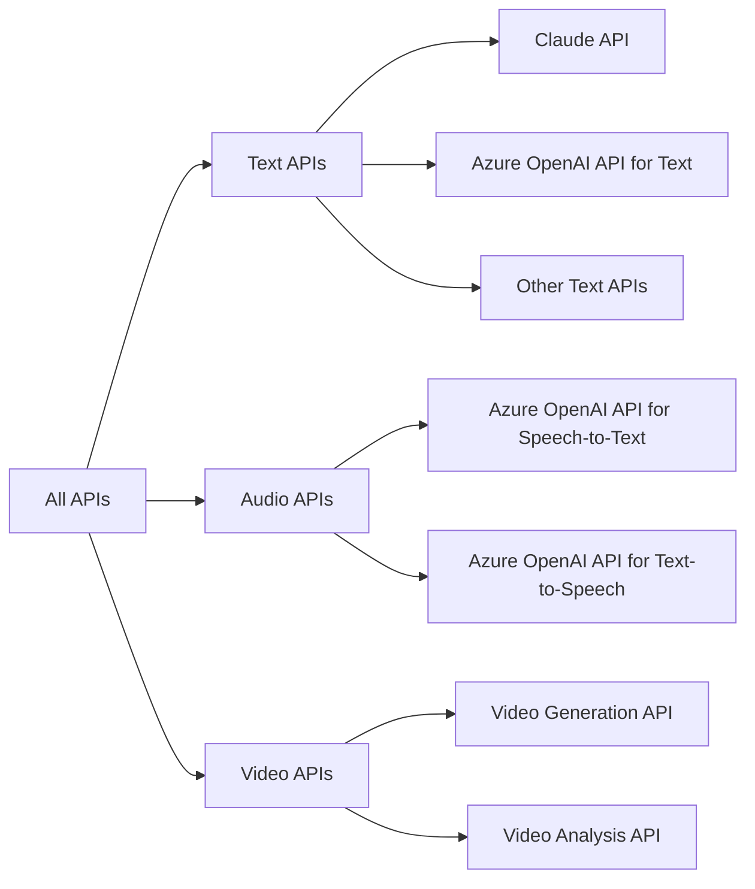

この例では、以下のようなスコープ設計を採用しています。

1. **All APIs**: すべてのAPIにアクセスできるスコープ。管理者や特権ユーザー向け。

2. **Text APIs**: テキスト関連のAPIにアクセスできるスコープ。
   - Claude API: Claude APIにアクセスできるスコープ。
   - AWS OpenAI Service Text APIs: AWS OpenAI Serviceのテキスト関連のAPIにアクセスできるスコープ。  
   - Other Text APIs: その他のテキスト関連のAPIにアクセスできるスコープ。

3. **Audio APIs**: 音声関連のAPIにアクセスできるスコープ。
   - AWS OpenAI Service Speech-to-Text API: AWS OpenAI Serviceの音声をテキストに変換するAPIにアクセスできるスコープ。  
   - AWS OpenAI Service Text-to-Speech API: AWS OpenAI Serviceのテキストを音声に変換するAPIにアクセスできるスコープ。

4. **Video APIs**: 動画関連のAPIにアクセスできるスコープ。
   - Video Generation API: 動画生成APIにアクセスできるスコープ。
   - Video Analysis API: 動画解析APIにアクセスできるスコープ。

このようなスコープ設計により、以下のような利用制限を実現できます。

- ユーザーAには「Text APIs」のみを許可し、テキスト関連のAPIに限定してアクセスを許可する。
- ユーザーBには「Text APIs」と「Audio APIs」を許可し、テキストと音声関連のAPIへのアクセスを許可する。
- ユーザーCには「All APIs」を許可し、すべてのAPIへのアクセスを許可する。

また、スコープの組み合わせを利用することで、より細かな制御も可能です。例えば、「Claude API」と「AWS OpenAI Service Speech-to-Text API」のみを許可するといった設定が可能です。

これらのスコープ設計を実際のシステムに適用する際は、以下の点に留意します。

1. **スコープの命名規則**: 
   - スコープの名前は、APIの種類や機能を反映したわかりやすい名前にします。
   - 例えば、`text_apis`、`audio_apis`、`video_apis`、`claude_api`、`openai_text_apis` などの名前を使用します。

2. **AWS IAM でのスコープ定義**:
   - 各APIサービスをAWS IAMにリソースとして登録する際に、対応するスコープを定義します。
   - スコープの説明や表示名も適切に設定し、ユーザーにわかりやすい情報を提供します。

3. **API Gateway でのスコープ検証**:
   - Amazon API Gatewayにスコープベースのアクセス制御を実装します。
   - 受信したリクエストのアクセストークンに含まれるスコープを確認し、許可された APIへのアクセスのみを許可します。

4. **ユーザーへの周知**:
   - ユーザーに対して、利用可能なスコープとその意味を明確に説明します。
   - ドキュメントやユーザーガイドで、スコープの概念と設定方法を解説します。

このように、APIの種類や機能に基づいたスコープ設計を行うことで、チャットAPIを中心としたシステムにおける利用制限とコスト管理を実現できます。ユーザーのニーズや組織のポリシーに合わせて、スコープの粒度や組み合わせを調整することが重要です。

また、スコープの設計は、システムの成長や変化に伴って継続的に見直しが必要です。新しいAPIの追加や、ユーザーからのフィードバックを基に、スコープ設計を改善していくことが望ましいでしょう。