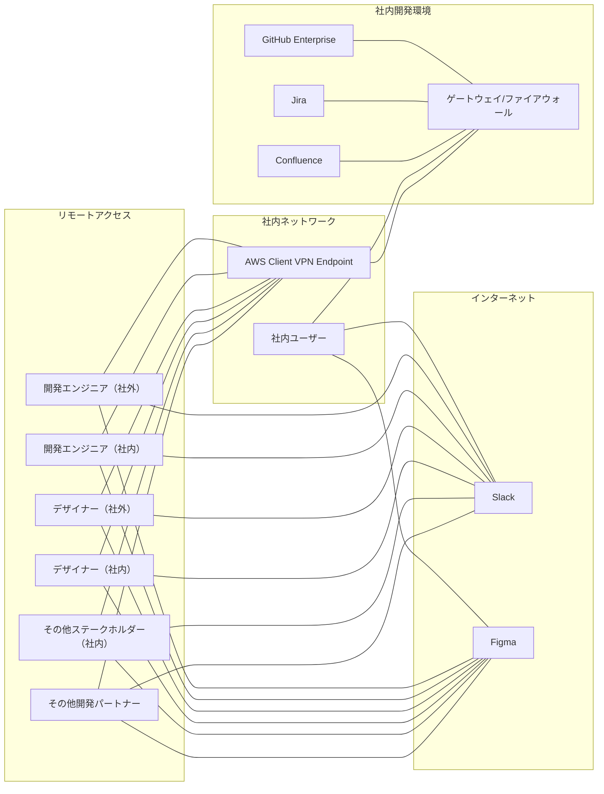

# 固定IPからのアクセスを実現するための方法に関する考察

コラボレーションツールやGitHubへのアクセス制限を行う際、AWS Client VPNやProxyサーバを利用するシステム構築について、運用面での手軽さとセキュリティの両面から考えると、以下のような方法が考えられます。

1. AWS Client VPNの利用:
   - 利点:
     - AWSのマネージドサービスであり、設定と運用が比較的容易。
     - 高い可用性とスケーラビリティを提供。
     - IPsecベースの暗号化により、セキュアな通信が可能。
   - 欠点:
     - AWSの利用料金がかかる。
     - VPNクライアントソフトウェアのインストールと設定が必要。

2. 自前のProxyサーバの構築:
   - 利点:
     - 自社のインフラ内で構築できるため、コストを抑えられる可能性がある。
     - きめ細かいアクセス制御が可能。
     - 既存のインフラとの統合が容易。
   - 欠点:
     - サーバの構築、設定、メンテナンスに手間がかかる。
     - 可用性とスケーラビリティの確保が自社の責任となる。
     - セキュリティ対策の実装と運用が自社の責任となる。

3. クラウドベースのProxyサービスの利用:
   - 利点:
     - 設定と運用が比較的容易。
     - スケーラビリティと可用性が高い。
     - セキュリティ対策の一部がサービス提供者により担保される。
   - 欠点:
     - サービス利用料金がかかる。
     - 自社のインフラとの統合に手間がかかる場合がある。

運用面での手軽さとセキュリティを両立するには、AWS Client VPNやクラウドベースのProxyサービスの利用が適しているでしょう。ただし、費用対効果や既存インフラとの親和性も考慮する必要があります。

自社でProxyサーバを構築する場合は、運用負荷とセキュリティリスクを適切に管理できる体制が必要です。また、アクセス制御だけでなく、ログ管理、モニタリング、アラート設定など、総合的なセキュリティ対策を講じることが重要です。

以下は、AWS VPN Clientを利用した場合の社内システムとクラウドサービス（GitHub、Figma、Jira、Confluence）との接続を表現したシステム図です。

システム図の説明:
1. GitHub Enterprise、Jira、Confluenceは社内開発環境内にホストされており、ゲートウェイ/ファイアウォールの背後に位置しています。
2. 社内ネットワークには、AWS Client VPN Endpointが設置されており、これを介してリモートアクセスユーザーからのアクセスを受け入れます。
3. 社内開発環境には、ゲートウェイ/ファイアウォールが設置されており、社内ネットワークからの直接アクセスとVPN Endpointを経由したアクセスをチェックし、許可されたアクセスのみを背後のシステムに転送します。
4. 社内ユーザーは、社内ネットワークから直接社内開発環境のゲートウェイ/ファイアウォールにアクセスし、GitHub Enterprise、Jira、Confluenceにアクセスします。
5. リモートアクセスを行う社内の開発エンジニア、デザイナー、その他のステークホルダーは、インターネット経由でVPN Endpointに接続し、社内開発環境のゲートウェイ/ファイアウォールを通過して、GitHub Enterprise、Jira、Confluenceにアクセスします。
6. キッティング済みPCを渡された社外の開発エンジニア、デザイナー、その他の開発パートナーは、インターネット経由でVPN Endpointに接続し、社内開発環境のゲートウェイ/ファイアウォールを通過して、GitHub Enterprise、Jira、Confluenceにアクセスします。
7. 全てのユーザーは、インターネット経由で直接Slack、Figmaなどのサービスにアクセスできます。

この構成では、社内開発環境へのアクセスは、社内ネットワークからの直接アクセスとVPN経由のアクセスに制限されますが、Slack、Figmaなどのインターネットサービスへのアクセスは、全てのユーザーが直接行うことができます。これにより、コラボレーションツールへのアクセスの利便性を確保しつつ、社内開発環境のセキュリティを維持できます。

ただし、以下の点に留意が必要です。

- インターネットサービスへのアクセスに関するセキュリティポリシーの策定と適用
- 社内ネットワークからのインターネットアクセスの監視とログ管理
- ここでは固定IPの話にフォーカスしており、（例えばGitHubへのアクセス等に必要となる）ユーザー認証については別途行われる前提であること
- 社内開発環境とインターネットサービス間のデータ転送に関するセキュリティ対策
- エンドポイントデバイスのセキュリティ管理（マルウェア対策、パッチ管理など）

これらを適切に管理することで、インターネットサービスの利便性を活用しつつ、全体的なセキュリティを確保できます。
