もちろんです。コード例の一貫性を改善した、省略なしの原稿案を作成いたします。以下が更新された原稿です：

```markdown
# MVPからMVVMへの段階的移行ガイド

## 1. はじめに

大規模なAndroidアプリケーションをMVP（Model-View-Presenter）アーキテクチャからMVVM（Model-View-ViewModel）アーキテクチャに移行する過程は、複雑で時間のかかるプロセスです。さらに、MVVMに移行した後も、巨大なViewModelの最適化が必要になることがあります。このガイドでは、MVPからMVVMへの段階的な移行方法と、その後のViewModel最適化について説明します。

## 2. 移行プロセスの概要

移行プロセスは以下の主要なステップで構成されます：

1. CommonInterfaceの導入
2. 巨大Presenterの段階的分割
3. 共通UIコンポーネントの管理
4. PresenterからViewModelへの段階的移行
5. Jetpack Composeの導入
6. 巨大ViewModelの最適化

## 3. 詳細なプロセス

### 3.1 CommonInterfaceの導入

最初のステップとして、ViewとPresenter/ViewModelの間にCommonInterfaceを導入します。

```kotlin
interface CommonInterface {
    fun loadData()
    fun processUserAction(action: String)
    // 他の共通メソッド
}
```

このインターフェースを導入することで、後続の変更をより容易に行うことができます。

#### CommonInterfaceの役割と限界

CommonInterfaceは以下の点で有用です：

- 共通の操作を定義し、ViewがPresenterやViewModelと相互作用する際の一貫性を提供します。
- 段階的な移行を可能にし、一部の画面がPresenterを使用し、他の画面がViewModelを使用する中間状態を管理しやすくします。

しかし、以下の限界があります：

- PresenterとViewModelの根本的な違い（例：ライフサイクル管理、状態保持など）をすべて抽象化することは困難です。
- ViewModelの特定の機能（例：StateFlow、SavedStateHandle）をインターフェースで完全にカバーすることは難しいです。

### 3.2 巨大Presenterの段階的分割

巨大なPresenterを一度に分割するのではなく、段階的に小さな部分に分けていきます。

1. 初期状態（巨大Presenter）
2. 一部機能の切り出し
3. さらなる機能の切り出し
4. 最終的な分割状態

各段階で、以下のステップを繰り返します：

a. 特定の機能を特定し、新しいPresenterとして切り出す
b. 元のPresenterから切り出した機能を削除する
c. 新しいPresenterとCommonInterfaceを接続する
d. テストを追加/更新し、機能が正しく動作することを確認する

```kotlin
class UserProfilePresenter : CommonInterface {
    override fun loadData() {
        // ユーザープロフィールのロードロジック
    }

    override fun processUserAction(action: String) {
        // ユーザーアクションの処理ロジック
    }
}

class UserPostsPresenter : CommonInterface {
    override fun loadData() {
        // ユーザーの投稿のロードロジック
    }

    override fun processUserAction(action: String) {
        // 投稿関連のユーザーアクション処理ロジック
    }
}
```

### 3.3 共通UIコンポーネントの管理

複数のタブや画面で共通して使用されるUIコンポーネント（例：通知ダイアログ、スピナー、ヘッダー、フッターなど）の管理は、アプリケーションのアーキテクチャに大きな影響を与えます。これらのコンポーネントを適切に管理することで、巨大Presenterの問題を軽減し、MVVMへの移行をスムーズに行うことができます。

#### a. 共通UIコンポーネント用の状態管理クラス作成

共通UIコンポーネント専用の状態管理クラス（例：`UIStateRepository`）を作成します。このクラスは、アプリケーション全体で共有されるUIの状態を管理します。

```kotlin
class UIStateRepository @Inject constructor() {
    private val _isLoading = MutableStateFlow(false)
    val isLoading: StateFlow<Boolean> = _isLoading.asStateFlow()

    private val _notificationMessage = MutableStateFlow<String?>(null)
    val notificationMessage: StateFlow<String?> = _notificationMessage.asStateFlow()

    fun showLoading() {
        _isLoading.value = true
    }

    fun hideLoading() {
        _isLoading.value = false
    }

    fun showNotification(message: String) {
        _notificationMessage.value = message
    }

    fun clearNotification() {
        _notificationMessage.value = null
    }
}
```

#### b. SharedUIViewModelの作成

`UIStateRepository`を利用する`SharedUIViewModel`を作成します。このViewModelは、アプリケーション全体で共有されるUIの状態を提供します。

```kotlin
@HiltViewModel
class SharedUIViewModel @Inject constructor(
    private val uiStateRepository: UIStateRepository
) : ViewModel() {
    val isLoading = uiStateRepository.isLoading
    val notificationMessage = uiStateRepository.notificationMessage
}
```

#### c. 各ViewModelからの状態更新

各タブや画面のViewModelは、`UIStateRepository`を利用して共通UIコンポーネントの状態を更新します。

```kotlin
@HiltViewModel
class UserProfileViewModel @Inject constructor(
    private val uiStateRepository: UIStateRepository,
    private val userRepository: UserRepository
) : ViewModel() {

    fun loadUserProfile(userId: String) {
        viewModelScope.launch {
            uiStateRepository.showLoading()
            try {
                val userProfile = userRepository.getUserProfile(userId)
                // プロフィールの処理
            } catch (e: Exception) {
                uiStateRepository.showNotification("エラーが発生しました: ${e.message}")
            } finally {
                uiStateRepository.hideLoading()
            }
        }
    }
}
```

#### d. View（ActivityやFragment）での状態観察

`SharedUIViewModel`をActivityやFragmentで取得し、共通UIコンポーネントの状態を監視・表示します。

```kotlin
@AndroidEntryPoint
class MainActivity : AppCompatActivity() {
    private val sharedUIViewModel: SharedUIViewModel by viewModels()
    private lateinit var binding: ActivityMainBinding

    override fun onCreate(savedInstanceState: Bundle?) {
        super.onCreate(savedInstanceState)
        binding = ActivityMainBinding.inflate(layoutInflater)
        setContentView(binding.root)

        lifecycleScope.launch {
            repeatOnLifecycle(Lifecycle.State.STARTED) {
                sharedUIViewModel.isLoading.collect { isLoading ->
                    showHideLoadingSpinner(isLoading)
                }
            }
        }

        lifecycleScope.launch {
            repeatOnLifecycle(Lifecycle.State.STARTED) {
                sharedUIViewModel.notificationMessage.collect { message ->
                    message?.let { showNotificationDialog(it) }
                }
            }
        }
    }

    private fun showHideLoadingSpinner(show: Boolean) {
        binding.loadingSpinner.isVisible = show
    }

    private fun showNotificationDialog(message: String) {
        // 通知ダイアログの表示ロジック
    }
}
```

### 3.4 PresenterからViewModelへの段階的移行

Presenterを十分に小さく分割したら、各PresenterをViewModelに移行し始めます。この過程は完全に透過的ではない可能性があるため、以下の実践的なアプローチを採用します：

#### a. 段階的な移行

1. CommonInterfaceを実装したシンプルなViewModelから始めます。
2. 徐々にViewModel特有の機能を追加していきます。

```kotlin
// 初期段階のViewModel（CommonInterfaceを実装）
class UserProfileViewModel : ViewModel(), CommonInterface {
    private val _userData = MutableStateFlow<UserData?>(null)
    val userData: StateFlow<UserData?> = _userData.asStateFlow()

    override fun loadData() {
        viewModelScope.launch {
            // データ読み込みロジック
            _userData.value = fetchUserData()
        }
    }

    override fun processUserAction(action: String) {
        // ユーザーアクション処理ロジック
    }
}

// 進化したViewModel
class EvolutionaryUserProfileViewModel @Inject constructor(
    private val userRepository: UserRepository,
    private val uiStateRepository: UIStateRepository
) : ViewModel() {
    private val _userData = MutableStateFlow<UserData?>(null)
    val userData: StateFlow<UserData?> = _userData.asStateFlow()

    fun loadUserData() {
        viewModelScope.launch {
            uiStateRepository.showLoading()
            try {
                _userData.value = userRepository.getUserData()
            } catch (e: Exception) {
                uiStateRepository.showNotification("データの読み込みに失敗しました")
            } finally {
                uiStateRepository.hideLoading()
            }
        }
    }

    fun updateUserProfile(newProfile: UserProfile) {
        viewModelScope.launch {
            uiStateRepository.showLoading()
            try {
                userRepository.updateUserProfile(newProfile)
                _userData.value = userRepository.getUserData() // 更新後のデータを再取得
                uiStateRepository.showNotification("プロフィールを更新しました")
            } catch (e: Exception) {
                uiStateRepository.showNotification("プロフィールの更新に失敗しました")
            } finally {
                uiStateRepository.hideLoading()
            }
        }
    }
}
```

#### b. アダプターパターンの使用

PresenterとViewModelの間にアダプターレイヤーを導入します。

```kotlin
class UserProfileViewModelAdapter(private val viewModel: UserProfileViewModel) : CommonInterface {
    override fun loadData() {
        viewModel.loadUserData()
    }

    override fun processUserAction(action: String) {
        when (action) {
            "UPDATE_PROFILE" -> viewModel.updateUserProfile(/* 新しいプロフィール情報 */)
            // 他のアクション
        }
    }
}
```

#### c. View側の段階的な更新

1. 初期段階では、ViewはCommonInterfaceを通じて画面描画します。
2. ViewModel特有の機能（StateFlowなど）を利用する準備ができたら、View側のコードを更新します。

```kotlin
// 初期段階
class UserProfileActivity : AppCompatActivity() {
    private lateinit var userDataProvider: CommonInterface
    private lateinit var binding: ActivityUserProfileBinding

    override fun onCreate(savedInstanceState: Bundle?) {
        super.onCreate(savedInstanceState)
        binding = ActivityUserProfileBinding.inflate(layoutInflater)
        setContentView(binding.root)

        userDataProvider = ViewModelProvider(this).get(UserProfileViewModel::class.java)
        userDataProvider.loadData()
        // UIの更新ロジック（従来の方法）
    }
}

// 進化後
@AndroidEntryPoint
class EvolutionaryUserProfileActivity : AppCompatActivity() {
    private val viewModel: EvolutionaryUserProfileViewModel by viewModels()
    private lateinit var binding: ActivityUserProfileBinding

    override fun onCreate(savedInstanceState: Bundle?) {
        super.onCreate(savedInstanceState)
        binding = ActivityUserProfileBinding.inflate(layoutInflater)
        setContentView(binding.root)

        lifecycleScope.launch {
            repeatOnLifecycle(Lifecycle.State.STARTED) {
                viewModel.userData.collect { userData ->
                    updateUI(userData)
                }
            }
        }

        binding.updateProfileButton.setOnClickListener {
            viewModel.updateUserProfile(/* 新しいプロフィール情報 */)
        }

        viewModel.loadUserData()
    }

    private fun updateUI(userData: UserData?) {
        userData?.let {
            binding.userNameTextView.text = it.name
            binding.userEmailTextView.text = it.email
            // その他のUI更新ロジック
        }
    }
}
```

### 3.5 Jetpack Composeの導入

従来のViewをJetpack Composeに段階的に移行します。

```kotlin
@Composable
fun UserProfileScreen(viewModel: EvolutionaryUserProfileViewModel = viewModel()) {
    val userData by viewModel.userData.collectAsState()
    
    Column {
        userData?.let { user ->
            Text(text = "Name: ${user.name}")
            Text(text = "Email: ${user.email}")
            // その他のUI要素
        }
        
        Button(onClick = { viewModel.updateUserProfile(/* 新しいプロフィール情報 */) }) {
            Text("Update Profile")
        }
    }
    
    LaunchedEffect(Unit) {
        viewModel.loadUserData()
    }
}
```

### 3.6 巨大ViewModelの最適化

MVVMに移行した後、時間の経過とともに一部のViewModelが肥大化し、管理が難しくなる場合があります。このような巨大ViewModelを最適化するためのアプローチを以下に示します。

#### a. 責任ごとのViewModel分割

巨大なViewModelを、異なる責任や機能ドメインに基づいて複数の小さなViewModelに分割します。

```kotlin
// 分割前の巨大ViewModel
class UserProfileViewModel : ViewModel() {
    // ユーザー情報、投稿リスト、フォロワーリストなどの全ての状態と操作
}

// 分割後
@HiltViewModel
class UserInfoViewModel @Inject constructor(
    private val userRepository: UserRepository
) : ViewModel() {
    // ユーザーの基本情報に関する状態と操作
}

@HiltViewModel
class UserPostsViewModel @Inject constructor(
    private val postsRepository: PostsRepository
) : ViewModel() {
    // ユーザーの投稿リストに関する状態と操作
}

@HiltViewModel
class UserFollowersViewModel @Inject constructor(
    private val followersRepository: FollowersRepository
) : ViewModel() {
    // ユーザーのフォロワーリストに関する状態と操作
}
```
#### b. UseCase/Interactorの導入

ビジネスロジックをViewModelから分離し、UseCase（またはInteractor）に移動させます。これにより、ViewModelはUI状態の管理に集中できます。

```kotlin
class GetUserInfoUseCase @Inject constructor(
    private val userRepository: UserRepository
) {
    suspend operator fun invoke(userId: String): Result<UserInfo> {
        return try {
            val userInfo = userRepository.getUserInfo(userId)
            Result.success(userInfo)
        } catch (e: Exception) {
            Result.failure(e)
        }
    }
}

@HiltViewModel
class UserInfoViewModel @Inject constructor(
    private val getUserInfoUseCase: GetUserInfoUseCase,
    private val uiStateRepository: UIStateRepository
) : ViewModel() {
    private val _userInfo = MutableStateFlow<UserInfo?>(null)
    val userInfo: StateFlow<UserInfo?> = _userInfo.asStateFlow()

    fun loadUserInfo(userId: String) {
        viewModelScope.launch {
            uiStateRepository.showLoading()
            getUserInfoUseCase(userId)
                .onSuccess { userInfo ->
                    _userInfo.value = userInfo
                }
                .onFailure { error ->
                    uiStateRepository.showNotification("エラーが発生しました: ${error.message}")
                }
            uiStateRepository.hideLoading()
        }
    }
}
```

#### c. 状態管理の分離

UI状態の管理を専用のStateHolderクラスに委譲します。これにより、ViewModelの役割がさらに明確になり、テストも容易になります。

```kotlin
data class UserInfoState(
    val userInfo: UserInfo? = null,
    val isLoading: Boolean = false,
    val error: String? = null
)

@HiltViewModel
class UserInfoViewModel @Inject constructor(
    private val getUserInfoUseCase: GetUserInfoUseCase,
    private val uiStateRepository: UIStateRepository
) : ViewModel() {
    private val _state = MutableStateFlow(UserInfoState())
    val state: StateFlow<UserInfoState> = _state.asStateFlow()

    fun loadUserInfo(userId: String) {
        viewModelScope.launch {
            _state.update { it.copy(isLoading = true) }
            uiStateRepository.showLoading()
            getUserInfoUseCase(userId)
                .onSuccess { userInfo ->
                    _state.update { it.copy(userInfo = userInfo, isLoading = false, error = null) }
                }
                .onFailure { error ->
                    _state.update { it.copy(error = error.message, isLoading = false) }
                    uiStateRepository.showNotification("エラーが発生しました: ${error.message}")
                }
            uiStateRepository.hideLoading()
        }
    }
}
```

#### d. 共有ViewModelの活用

複数の画面やフラグメントで共有される状態がある場合、ActivityやNavigation Graphのスコープで共有ViewModelを使用します。

```kotlin
@HiltViewModel
class SharedUserViewModel @Inject constructor() : ViewModel() {
    private val _userId = MutableStateFlow<String?>(null)
    val userId: StateFlow<String?> = _userId.asStateFlow()

    fun setUserId(id: String) {
        _userId.value = id
    }
}

// 使用例（Fragment）
@AndroidEntryPoint
class UserProfileFragment : Fragment() {
    private val sharedViewModel: SharedUserViewModel by activityViewModels()
    private val userInfoViewModel: UserInfoViewModel by viewModels()

    override fun onViewCreated(view: View, savedInstanceState: Bundle?) {
        super.onViewCreated(view, savedInstanceState)
        viewLifecycleOwner.lifecycleScope.launch {
            repeatOnLifecycle(Lifecycle.State.STARTED) {
                sharedViewModel.userId.collect { userId ->
                    userId?.let { userInfoViewModel.loadUserInfo(it) }
                }
            }
        }
    }
}
```

## 4. 移行プロセスの図解

以下は、全体的な移行プロセスを視覚化した図です。

```mermaid
graph TD

    subgraph "6.ViewModel最適化"
        A6[Screen 1] --> B6[ViewModel A1]
        A6 --> E6[ViewModel A2]
        Z6[Screen 2] --> F6[ViewModel B]
        Y6[Screen 3] --> H6[ViewModel C]
        B6 --> I6[UseCase]
        E6 --> I6
        F6 --> I6
        H6 --> I6
        I6 --> C6[Model]
        G6[SharedUIViewModel] --> A6
        G6 --> Z6
        G6 --> Y6
    end

    subgraph "5.完全MVVM構造（Compose導入）"
        A5[Screen 1] --> B5[ViewModel A]
        Z5[Screen 2] --> E5[ViewModel B]
        Y5[Screen 3] --> F5[ViewModel C]
        B5 --> C5[Model]
        E5 --> C5
        F5 --> C5
        G5[SharedUIViewModel] --> A5
        G5 --> Z5
        G5 --> Y5
    end

    subgraph "4.PresenterとViewModel混在"
        A4[View 1] --> B4[ViewModel A]
        Z4[View 2] --> E4[ViewModel B]
        Y4[View 3] --> F4[Presenter C]
        B4 --> C4[Model]
        E4 --> C4
        F4 --> C4
        G4[SharedUIViewModel] --> A4
        G4 --> Z4
        G4 --> Y4
    end

    subgraph "3.共通UIコンポーネント管理の導入"
        A3[View 1] --> D3[CommonInterface]
        Z3[View 2] --> D3
        Y3[View 3] --> D3
        D3 --> B3[Presenter A]
        D3 --> E3[Presenter B]
        D3 --> F3[Presenter C]
        B3 --> C3[Model]
        E3 --> C3
        F3 --> C3
        G3[SharedUIViewModel] --> A3
        G3 --> Z3
        G3 --> Y3
    end

    subgraph "2.Presenter分割とCommonInterface導入"
        A2[View 1] --> D2[CommonInterface]
        Z2[View 2] --> D2
        Y2[View 3] --> D2
        D2 --> B2[Presenter A]
        D2 --> E2[Presenter B]
        D2 --> F2[Presenter C]
        B2 --> C2[Model]
        E2 --> C2
        F2 --> C2
    end

    subgraph "1.初期MVP構造（巨大Presenter）"
        A1[View 1] --> B1[巨大Presenter]
        Z1[View 2] --> B1
        Y1[View 3] --> B1
        B1 --> C1[Model]
    end

    1 -->|"Presenter分割とCommonInterface導入"| 2
    2 -->|"共通UIコンポーネント管理の導入"| 3
    3 -->|"段階的なViewModel移行"| 4
    4 -->|"完全なMVVM化とCompose導入"| 5
    5 -->|"ViewModel最適化"| 6

    classDef default fill:#f9f,stroke:#333,stroke-width:2px;
    classDef interface fill:#ff9,stroke:#333,stroke-width:2px;
    classDef viewmodel fill:#9f9,stroke:#333,stroke-width:2px;
    classDef compose fill:#f99,stroke:#333,stroke-width:2px;
    classDef bigPresenter fill:#f66,stroke:#333,stroke-width:2px;
    classDef sharedViewModel fill:#9ff,stroke:#333,stroke-width:2px;
    classDef useCase fill:#ff9,stroke:#333,stroke-width:2px;

    class D2,D3 interface;
    class B4,E4,B5,E5,F5,B6,E6,F6,H6 viewmodel;
    class A5,Z5,Y5,A6,Z6,Y6 compose;
    class B1 bigPresenter;
    class G3,G4,G5,G6 sharedViewModel;
    class I6 useCase;
```



## 5. 実装時の注意点

1. **リファクタリングの優先順位を決定する**：最も問題のある、または変更頻度の高い部分から始める
2. **各段階でテストを追加・更新し、既存機能が破壊されていないことを確認する**
3. **パフォーマンスを継続的にモニタリングする**
4. **チーム全体で設計の一貫性を維持する**
5. **段階的な変更を行い、各段階で動作確認とコードレビューを行う**
6. **CommonInterfaceの限界を理解し、必要に応じてアダプターパターンを使用する**
7. **View側のコードも段階的に更新し、ViewModel特有の機能を活用できるようにする**
8. **共通UIコンポーネントの状態管理を中央集権化し、各ViewModelから適切に利用する**
9. **依存性注入を活用して、SharedUIViewModelを効率的に共有する**
10. **ViewModelの責任を明確に定義し、必要に応じて分割する**
11. **ビジネスロジックをUseCaseに抽出し、ViewModelをUI状態管理に集中させる**
12. **状態管理のためのStateHolderクラスの使用を検討する**
13. **共有が必要な状態については、適切なスコープの共有ViewModelを使用する**

## 6. 結論

MVPからMVVMへの移行、そしてその後のViewModel最適化は、継続的な改善プロセスの一部です。このガイドで説明した段階的なアプローチを採用することで、リスクを最小限に抑えつつ、徐々にアプリケーションアーキテクチャをモダンなものとし、最適化することができます。

初期の移行段階では、CommonInterfaceやアダプターパターンなどのテクニックが有用です。その後、ViewModelが肥大化した場合は、責任の分割、UseCaseの導入、状態管理の分離などの手法を用いて最適化を行います。

共通UIコンポーネントの管理や共有ViewModelの適切な使用は、アプリケーション全体の一貫性と効率性を高めます。また、Jetpack Composeの導入により、UI層の柔軟性と表現力が向上します。

このプロセス全体を通じて、コードの保守性、テスト容易性、そして拡張性が向上し、長期的にはアプリケーションの品質と開発効率の向上につながります。各段階で学んだことを活かし、必要に応じてプロセスを調整しながら進めることが重要です。

最終的には、責任が明確で、テスト可能で保守性の高い、モダンなアーキテクチャを持つアプリケーションを実現することができるでしょう。この継続的な改善プロセスは、アプリケーションの寿命を通じて続けられるべきものです。

## 7. 巨大ViewModelと機能しないViewへの対処

プロジェクトによっては、MVPからMVVMへの移行過程で、巨大なPresenterを単に巨大なViewModelに置き換えてしまい、結果として既存のViewがほとんど機能しなくなってしまうケースがあります。このような状況は、アプリケーション全体の機能を損なう可能性があり、緊急の対処が必要です。

### 7.1 問題の概要

1. 巨大なPresenterが巨大なViewModelに変換されている。
2. ViewModelの構造がPresenterと大きく異なるため、既存のViewが適切に機能しない。
3. Viewの大部分を書き直す必要がある。

### 7.2 対処アプローチ

この状況に対処するためのアプローチを以下に示します：

1. **段階的な巻き戻しと再構築**：
   - 完全に機能しないViewとViewModelのペアを、一時的に元のPresenter-Viewの構造に近い状態に戻します。
   - その後、段階的にMVVMパターンに移行していきます。

2. **アダプターパターンの導入**：
   - 既存のViewとViewModelの間にアダプターレイヤーを導入し、互換性を維持します。

3. **ハイブリッドアプローチ**：
   - アプリケーションの一部をMVPのまま維持し、他の部分を段階的にMVVMに移行します。

### 7.3 段階的な改善プロセス

1. **現状の評価**：
   - 機能しなくなったViewの範囲を特定します。
   - ViewModelの構造と、元のPresenterの構造の違いを分析します。

2. **緊急の修正**：
   - アプリケーションの基本機能を復元するための最小限の修正を行います。

3. **アダプターの導入**：
   - ViewとViewModel間のアダプターを作成し、既存のViewの動作を可能な限り維持します。

4. **段階的なView/ViewModel再構築**：
   - 優先度の高い部分から、ViewとViewModelのペアを適切なMVVM構造に再構築します。

5. **テストの追加と更新**：
   - 各ステップでユニットテストと統合テストを追加・更新します。

### 7.4 具体的な実装例

#### モダンなアプローチでのアダプターパターンの導入

```kotlin
// 依存性注入用のモジュール
@Module
@InstallIn(SingletonComponent::class)
object AppModule {
    @Provides
    @Singleton
    fun provideUserRepository(): UserRepository = UserRepositoryImpl()
}

// UseCase
class GetUserProfileUseCase @Inject constructor(
    private val userRepository: UserRepository
) {
    suspend operator fun invoke(userId: String): UserProfile =
        userRepository.getUserProfile(userId)
}

// ViewModel
@HiltViewModel
class UserProfileViewModel @Inject constructor(
    private val getUserProfileUseCase: GetUserProfileUseCase
) : ViewModel() {
    private val _state = MutableStateFlow(UserProfileState())
    val state: StateFlow<UserProfileState> = _state.asStateFlow()

    fun loadUserProfile(userId: String) {
        viewModelScope.launch {
            _state.update { it.copy(isLoading = true) }
            try {
                val profile = getUserProfileUseCase(userId)
                _state.update { it.copy(userProfile = profile, isLoading = false, error = null) }
            } catch (e: Exception) {
                _state.update { it.copy(error = e.message, isLoading = false) }
            }
        }
    }

    fun updateUserProfile(profile: UserProfile) {
        viewModelScope.launch {
            _state.update { it.copy(isLoading = true) }
            try {
                // ここで実際のプロフィール更新ロジックを実行
                // 例: userRepository.updateUserProfile(profile)
                _state.update { it.copy(userProfile = profile, isLoading = false, error = null) }
            } catch (e: Exception) {
                _state.update { it.copy(error = e.message, isLoading = false) }
            }
        }
    }
}

data class UserProfileState(
    val userProfile: UserProfile? = null,
    val isLoading: Boolean = false,
    val error: String? = null
)

// アダプター
class UserProfileViewAdapter(private val viewModel: UserProfileViewModel) {
    private var viewReference: WeakReference<UserProfileActivity>? = null

    fun attachView(view: UserProfileActivity) {
        viewReference = WeakReference(view)
        observeViewModel(view.lifecycleScope)
    }

    fun detachView() {
        viewReference = null
    }

    private fun observeViewModel(coroutineScope: CoroutineScope) {
        coroutineScope.launch {
            viewModel.state.collect { state ->
                viewReference?.get()?.updateUI(state)
            }
        }
    }

    fun onUpdateProfileClicked(newProfile: UserProfile) {
        viewModel.updateUserProfile(newProfile)
    }
}

// 既存のView（Activity）
@AndroidEntryPoint
class UserProfileActivity : AppCompatActivity() {
    private lateinit var binding: ActivityUserProfileBinding
    private lateinit var adapter: UserProfileViewAdapter
    private val viewModel: UserProfileViewModel by viewModels()

    override fun onCreate(savedInstanceState: Bundle?) {
        super.onCreate(savedInstanceState)
        binding = ActivityUserProfileBinding.inflate(layoutInflater)
        setContentView(binding.root)

        adapter = UserProfileViewAdapter(viewModel)
        adapter.attachView(this)

        setupUI()
    }

    private fun setupUI() {
        binding.updateProfileButton.setOnClickListener {
            // 新しいプロフィール情報を取得するロジック
            val newProfile = UserProfile(
                name = binding.nameEditText.text.toString(),
                email = binding.emailEditText.text.toString()
            )
            adapter.onUpdateProfileClicked(newProfile)
        }
    }

    fun updateUI(state: UserProfileState) {
        binding.progressBar.isVisible = state.isLoading
        
        state.userProfile?.let { profile ->
            binding.nameTextView.text = profile.name
            binding.emailTextView.text = profile.email
            // その他のUI更新ロジック
        }
        
        state.error?.let { error ->
            showError(error)
        }
    }

    private fun showError(message: String) {
        Toast.makeText(this, message, Toast.LENGTH_LONG).show()
    }

    override fun onDestroy() {
        super.onDestroy()
        adapter.detachView()
    }
}

// データクラス
data class UserProfile(
    val name: String,
    val email: String
    // その他のプロフィール情報
)

// テスト例
@HiltAndroidTest
class UserProfileViewModelTest {

    @get:Rule
    var hiltRule = HiltAndroidRule(this)

    @Inject
    lateinit var getUserProfileUseCase: GetUserProfileUseCase

    private lateinit var viewModel: UserProfileViewModel

    @Before
    fun setup() {
        hiltRule.inject()
        viewModel = UserProfileViewModel(getUserProfileUseCase)
    }

    @Test
    fun `loadUserProfile success should update userProfile`() = runTest {
        val testProfile = UserProfile("Test User", "test@example.com")
        whenever(getUserProfileUseCase(any())).thenReturn(testProfile)

        viewModel.loadUserProfile("userId")

        assertEquals(testProfile, viewModel.state.value.userProfile)
        assertNull(viewModel.state.value.error)
        assertFalse(viewModel.state.value.isLoading)
    }

    @Test
    fun `loadUserProfile failure should update error`() = runTest {
        val errorMessage = "Error loading profile"
        whenever(getUserProfileUseCase(any())).thenThrow(RuntimeException(errorMessage))

        viewModel.loadUserProfile("userId")

        assertNull(viewModel.state.value.userProfile)
        assertEquals(errorMessage, viewModel.state.value.error)
        assertFalse(viewModel.state.value.isLoading)
    }

    @Test
    fun `updateUserProfile success should update userProfile`() = runTest {
        val newProfile = UserProfile("Updated User", "updated@example.com")
        
        viewModel.updateUserProfile(newProfile)

        assertEquals(newProfile, viewModel.state.value.userProfile)
        assertNull(viewModel.state.value.error)
        assertFalse(viewModel.state.value.isLoading)
    }

    @Test
    fun `updateUserProfile failure should update error`() = runTest {
        val errorMessage = "Error updating profile"
        val newProfile = UserProfile("Updated User", "updated@example.com")
        
        // モックの設定（実際のアプリケーションコードでは、この部分は必要ありません）
        doAnswer {
            throw RuntimeException(errorMessage)
        }.whenever(getUserProfileUseCase).invoke(any())

        viewModel.updateUserProfile(newProfile)

        assertNull(viewModel.state.value.userProfile)
        assertEquals(errorMessage, viewModel.state.value.error)
        assertFalse(viewModel.state.value.isLoading)
    }
}
```

**解説**：

- **依存性注入の活用**：`Hilt`を使用して依存性を注入し、テスト容易性を向上させています。
- **UseCaseの導入**：ビジネスロジックを`GetUserProfileUseCase`に分離しています。
- **StateFlowの使用**：`MutableStateFlow`と`StateFlow`を使用して、状態の監視を可能にしています。
- **アダプターの改善**：`WeakReference`を使用してメモリリークを防止しつつ、`collect`を使用して状態を監視しています。
- **テストの追加**：`UserProfileViewModel`のテストを追加し、ビジネスロジックの検証を行っています。

### 7.5 注意点

- **メモリリークの防止**：`WeakReference`を使用してViewへの参照を保持し、`detachView`で解放します。
- **ライフサイクルの管理**：`collect`を使用する際は、ViewModelの`viewModelScope`内で行い、適切にキャンセルされるようにします。
- **テストの重要性**：移行中は特にテストが重要です。ユニットテストとUIテストを活用して、機能が正しく動作することを確認してください。

### 7.6 長期的な戦略

1. **段階的なモジュール化**：
   - アプリケーションを機能ごとのモジュールに分割し、各モジュールを独立してMVVMに移行します。

2. **新機能のMVVM実装**：
   - 新しい機能は最初からMVVMパターンで実装します。

3. **継続的なリファクタリング**：
   - 定期的にコードベースを見直し、MVVMベストプラクティスに沿って改善を続けます。

4. **チーム教育**：
   - チームメンバーにMVVMパターンとクリーンアーキテクチャの原則について継続的な教育を提供します。

巨大なPresenterから巨大なViewModelへの直接的な変換によって引き起こされた問題に直面した場合でも、このようなアプローチを採用することで、段階的にアプリケーションを正常な状態に戻し、最終的には健全なMVVM構造に移行することができます。重要なのは、急激な変更を避け、各ステップでアプリケーションの機能を維持しながら、継続的に改善を進めることです。