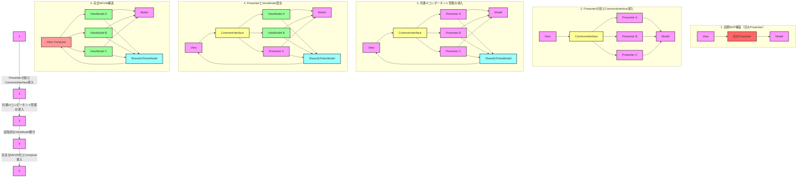

# MVPからMVVMへの段階的移行ガイド

## 1. はじめに

大規模なAndroidアプリケーションをMVP（Model-View-Presenter）アーキテクチャからMVVM（Model-View-ViewModel）アーキテクチャに移行する過程は、複雑で時間のかかるプロセスです。特に、巨大なPresenterを扱う場合や、複数のタブと共通UIコンポーネントを持つ画面構造の場合、一度に全ての変更を行うことは現実的ではありません。このガイドでは、段階的なアプローチを用いて、リスクを最小限に抑えつつ効果的に移行を行う方法を説明します。

## 2. 移行プロセスの概要

移行プロセスは以下の主要なステップで構成されます：

1. CommonInterfaceの導入
2. 巨大Presenterの段階的分割
3. 共通UIコンポーネントの管理
4. PresenterからViewModelへの段階的移行
5. Jetpack Composeの導入

## 3. 詳細なプロセス

### 3.1 CommonInterfaceの導入

最初のステップとして、ViewとPresenter/ViewModelの間にCommonInterfaceを導入します。

```kotlin
interface CommonInterface {
    fun loadData()
    fun processUserAction(action: String)
    // 他の共通メソッド
}
```

このインターフェースを導入することで、後続の変更をより容易に行うことができます。

#### CommonInterfaceの役割と限界

CommonInterfaceは以下の点で有用です：

- 共通の操作を定義し、ViewがPresenterやViewModelと相互作用する際の一貫性を提供します。
- 段階的な移行を可能にし、一部の画面がPresenterを使用し、他の画面がViewModelを使用する中間状態を管理しやすくします。

しかし、以下の限界があります：

- PresenterとViewModelの根本的な違い（例：ライフサイクル管理、状態保持など）をすべて抽象化することは困難です。
- ViewModelの特定の機能（例：LiveData、StateFlow、SavedStateHandle）をインターフェースで完全にカバーすることは難しいです。

### 3.2 巨大Presenterの段階的分割

巨大なPresenterを一度に分割するのではなく、段階的に小さな部分に分けていきます。

1. 初期状態（巨大Presenter）
2. 一部機能の切り出し
3. さらなる機能の切り出し
4. 最終的な分割状態

各段階で、以下のステップを繰り返します：

a. 特定の機能を特定し、新しいPresenterとして切り出す  
b. 元のPresenterから切り出した機能を削除する  
c. 新しいPresenterとCommonInterfaceを接続する  
d. テストを追加/更新し、機能が正しく動作することを確認する  

```kotlin
class PresenterA : CommonInterface {
    override fun loadData() {
        // 実装
    }
    // 他のメソッド
}

class RemainingPresenter : CommonInterface {
    // 残りの機能
}
```

### 3.3 共通UIコンポーネントの管理

複数のタブや画面で共通して使用されるUIコンポーネント（例：通知ダイアログ、Spinner、ヘッダー、フッターなど）の管理は、アプリケーションのアーキテクチャに大きな影響を与えます。これらのコンポーネントを適切に管理することで、巨大Presenterの問題を軽減し、MVVMへの移行をスムーズに行うことができます。

#### a. 共通UIコンポーネント用のViewModel作成

共通UIコンポーネント専用のViewModelを作成します。このViewModelは、アプリケーション全体で共有されるUIの状態を管理します。

```kotlin
class SharedUIViewModel : ViewModel() {
    private val _isLoading = MutableStateFlow(false)
    val isLoading: StateFlow<Boolean> = _isLoading.asStateFlow()

    private val _notificationMessage = MutableStateFlow<String?>(null)
    val notificationMessage: StateFlow<String?> = _notificationMessage.asStateFlow()

    fun showLoading() {
        _isLoading.value = true
    }

    fun hideLoading() {
        _isLoading.value = false
    }

    fun showNotification(message: String) {
        _notificationMessage.value = message
    }

    fun clearNotification() {
        _notificationMessage.value = null
    }
}
```

#### b. 依存性注入の活用

Dagger HiltやKoinなどの依存性注入フレームワークを使用して、SharedUIViewModelをアプリケーション全体で共有します。

```kotlin
@HiltViewModel
class SharedUIViewModel @Inject constructor() : ViewModel() {
    // 実装
}

@AndroidEntryPoint
class MainActivity : AppCompatActivity() {
    private val sharedUIViewModel: SharedUIViewModel by viewModels()

    // 実装
}
```

#### c. 共通UIコンポーネントの表示ロジック

共通UIコンポーネントの表示ロジックを、各画面のViewModelから分離し、ActivityやFragmentレベルで管理します。

```kotlin
class MainActivity : AppCompatActivity() {
    private val sharedUIViewModel: SharedUIViewModel by viewModels()

    override fun onCreate(savedInstanceState: Bundle?) {
        super.onCreate(savedInstanceState)
        setContentView(R.layout.activity_main)

        lifecycleScope.launch {
            sharedUIViewModel.isLoading.collect { isLoading ->
                showHideLoadingSpinner(isLoading)
            }
        }

        lifecycleScope.launch {
            sharedUIViewModel.notificationMessage.collect { message ->
                message?.let { showNotificationDialog(it) }
            }
        }
    }

    private fun showHideLoadingSpinner(show: Boolean) {
        // スピナーの表示/非表示ロジック
    }

    private fun showNotificationDialog(message: String) {
        // 通知ダイアログの表示ロジック
    }
}
```

#### d. 各タブ/画面のViewModelからの利用

各タブや画面のViewModelは、必要に応じてSharedUIViewModelを参照し、共通UIコンポーネントの状態を更新します。

```kotlin
@HiltViewModel
class TabViewModel @Inject constructor(
    private val sharedUIViewModel: SharedUIViewModel
) : ViewModel() {

    fun loadData() {
        sharedUIViewModel.showLoading()
        viewModelScope.launch {
            try {
                // データ読み込みロジック
                sharedUIViewModel.hideLoading()
            } catch (e: Exception) {
                sharedUIViewModel.hideLoading()
                sharedUIViewModel.showNotification("エラーが発生しました")
            }
        }
    }
}
```

この方法により、共通UIコンポーネントの管理を中央集権化し、各タブや画面のViewModelをよりスリムに保つことができます。

### 3.4 PresenterからViewModelへの段階的移行

Presenterを十分に小さく分割したら、各PresenterをViewModelに移行し始めます。この過程は完全に透過的ではない可能性があるため、以下の実践的なアプローチを採用します：

#### a. 段階的な移行：

1. CommonInterfaceを実装したシンプルなViewModelから始めます。
2. 徐々にViewModel特有の機能を追加していきます。

```kotlin
// 初期段階のViewModel（CommonInterfaceを実装）
class UserViewModel : ViewModel(), CommonInterface {
    override fun loadData() {
        // ViewModelの実装（初期段階ではPresenterと似た実装）
    }
    // 他のメソッド
}

// 段階的に進化したViewModel
class EvolutionaryUserViewModel : ViewModel(), CommonInterface {
    private val _userData = MutableStateFlow<UserData?>(null)
    val userData: StateFlow<UserData?> = _userData.asStateFlow()

    override fun loadData() {
        viewModelScope.launch {
            // 非同期でデータを取得
            _userData.value = fetchUserData()
        }
    }
    // 他のメソッド
}
```

#### b. アダプターパターンの使用：

PresenterとViewModelの間にアダプターレイヤーを導入します。

```kotlin
class UserViewModelAdapter(private val viewModel: UserViewModel) : CommonInterface {
    override fun loadData() {
        viewModel.loadData()
    }
    // 他のメソッド
}
```

#### c. View側の段階的な更新：

1. 初期段階では、ViewはCommonInterfaceを通じて相互作用します。
2. ViewModel特有の機能（LiveData、StateFlowなど）を利用する準備ができたら、View側のコードを更新します。

```kotlin
// 初期段階
class UserProfileActivity : AppCompatActivity() {
    private lateinit var userDataProvider: CommonInterface

    override fun onCreate(savedInstanceState: Bundle?) {
        super.onCreate(savedInstanceState)
        userDataProvider = ViewModelProvider(this).get(UserViewModel::class.java)
        userDataProvider.loadData()
        // UIの更新ロジック（従来の方法）
    }
}

// 進化後
class EvolutionaryUserProfileActivity : AppCompatActivity() {
    private val viewModel: EvolutionaryUserViewModel by viewModels()

    override fun onCreate(savedInstanceState: Bundle?) {
        super.onCreate(savedInstanceState)
        lifecycleScope.launch {
            viewModel.userData.collect { userData ->
                // UIの更新ロジック（Flow使用）
            }
        }
        viewModel.loadData()
    }
}
```

### 3.5 Jetpack Composeの導入

最後に、従来のViewをJetpack Composeに段階的に移行します。

```kotlin
@Composable
fun MyScreen(viewModel: MyViewModel) {
    val uiState by viewModel.uiState.collectAsState()
    
    // Compose UI
}
```

## 4. 移行プロセスの図解

以下は、全体的な移行プロセスを視覚化した図です。今回は共通UIコンポーネントの管理を含めています：



## 5. 実装時の注意点

1. リファクタリングの優先順位を決定する：最も問題のある、または変更頻度の高い部分から始める
2. 各段階でテストを追加・更新し、既存機能が破壊されていないことを確認する
3. パフォーマンスを継続的にモニタリングする
4. チーム全体で設計の一貫性を維持する
5. 段階的な変更を行い、各段階で動作確認とコードレビューを行う
6. CommonInterfaceの限界を理解し、必要に応じてアダプターパターンを使用する
7. View側のコードも段階的に更新し、ViewModel特有の機能を活用できるようにする
8. 共通UIコンポーネントの状態管理を中央集権化し、各ViewModelから適切に利用する
9. 依存性注入を活用して、SharedUIViewModelを効率的に共有する

## 6. 結論

MVPからMVVMへの移行、特に巨大なPresenterや複数のタブを持つ画面構造を扱う場合は、一夜にして行えるものではありません。このガイドで説明した段階的なアプローチを採用することで、リスクを最小限に抑えつつ、徐々にアプリケーションアーキテクチャを近代化することができます。

CommonInterfaceは完全な解決策ではありませんが、移行プロセスを管理し、段階的な変更を可能にする有用なツールです。アダプターパターンやView側のコードの段階的な更新、さらには共通UIコンポーネントの中央集権的管理など、補完的なテクニックを組み合わせることで、より滑らかな移行が可能になります。

共通UIコンポーネントの管理を適切に行うことで、巨大Presenterの問題を軽減し、各画面やタブのViewModelをよりスリムに保つことができます。これにより、コードの保守性と再利用性が向上し、将来的な機能追加や変更がより容易になります。

各段階で学んだことを活かし、必要に応じてプロセスを調整しながら進めることが重要です。最終的には、よりテスト可能で保守性の高い、モダンなアーキテクチャを持つアプリケーションを実現することができるでしょう。