# プロセスを眺めて学ぶプロダクト開発入門
 

## はじめに

本書は、プロダクト開発の全体像を理解することを目的としています。特に、プロダクト開発の経験が少ない方や、エンジニアやデザイナーとのチームワークに不慣れな方を対象としています。

近年、多くの企業で自社サービスの内製化が進んでいます。しかし、プロダクト開発の経験が少ないメンバーが集められ、いきなりチームを組んで開発を進めることを求められるケースが少なくありません。そのような状況で、「何から手をつけたらいいのか」「どのようにチームを運営していけばいいのか」と戸惑ってしまうのは自然なことです。

本書は、そのような方々が、プロダクト開発の全体像を把握し、チームでの開発に必要な知識を身につけるための一助となることを目指しています。プロダクト開発のステップを追いながら、各フェーズで必要となる考え方やベストプラクティスを解説していきます。

また、サンプルプロジェクトを通じて、具体的な実践方法をイメージしやすくなるよう工夫しました。架空のアプリケーション「LinkedPal」の開発を例に、企画から運用までの流れを追体験できます。

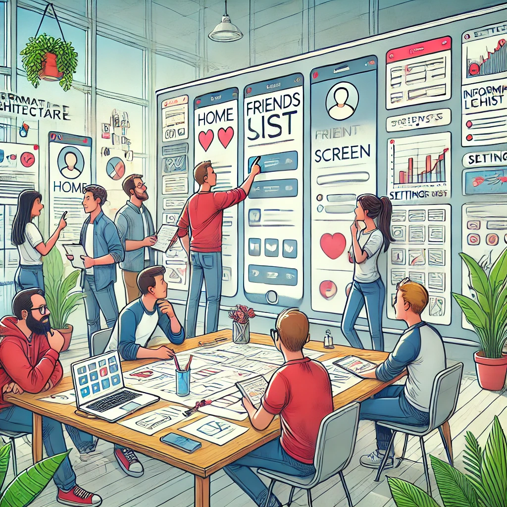

本書を読み進めることで、以下のような理解が得られるでしょう。

1. プロダクト開発の全体的な流れと、各フェーズの目的
2. ユーザー中心の設計思想と、チームコラボレーションの重要性
3. アジャイル開発の考え方と、実践における留意点
4. 品質を確保するためのテストの種類と、自動化の方法
5. リリース後の継続的な改善と、データ分析の活用方法

本書は、プロダクト開発の第一歩を踏み出すための地図として活用いただければ幸いです。実際のプロダクト開発では、様々な困難に直面するかもしれません。しかし、本書で得た知識を基礎に、チームで知恵を出し合いながら、一つ一つ課題を乗り越えていくことが大切です。

プロダクト開発は、決して一人では成し遂げられません。多様なスキルを持つメンバーが協力し合うことで、はじめて価値あるプロダクトが生まれます。本書を手に取ったあなたが、チームの一員として活躍されることを心から願っています。

それでは、プロダクト開発の世界への第一歩を踏み出しましょう。

## 1. プロダクト開発の概要

プロダクト開発は、新しい製品やサービスを生み出すプロセスです。アイデアを具体化し、ユーザーに価値を届けるまでの一連の流れを指します。ここでは、プロダクト開発の主なステップと、チームコラボレーションの重要性について説明します。

 

### 1.1 プロダクト開発のステップ

プロダクト開発は、一般的に以下のようなステップで進められます。

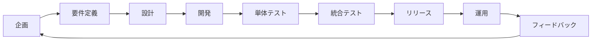

1. 企画：プロダクトのアイデアを出し、コンセプトを固めます。ユーザーのニーズや市場の動向を調査し、実現可能性を検討します。

2. 設計：プロダクトの機能や仕様を決定します。ユーザーインターフェース（UI）やユーザー体験（UX）のデザインを行います。技術的な設計も同時に進めます。

3. 開発：設計に基づいて、実際にプロダクトを開発します。エンジニアがコーディングを行い、機能を実装していきます。

4. テスト：開発されたプロダクトが、意図した通りに動作するかをテストします。不具合を見つけ、修正します。ユーザビリティテストも行います。

5. リリース：完成したプロダクトを、ユーザーに公開します。モバイルアプリの場合は、ストアへの申請が必要です。

6. 運用：リリース後も、ユーザーの反応を見ながら、継続的に改善を行います。新しい機能の追加や、不具合の修正などを行います。

これらのステップは、順番に進むだけでなく、必要に応じて前のステップに戻ることもあります。アジャイル開発手法では、短いサイクルでこれらのステップを繰り返し、フィードバックを得ながらプロダクトを改善していきます。

### 1.2 チームコラボレーションの重要性

プロダクト開発では、様々な専門性を持つメンバーが協力して進めていきます。エンジニア、デザイナー、プロダクトマネージャー、マーケターなど、それぞれの役割を持つメンバーがチームを組んで取り組みます。

 

チームでの協力が重要な理由は、以下の通りです。

1. 多様な視点：メンバーの専門性や経験が異なることで、様々な視点からプロダクトを検討できます。これにより、ユーザーにとって価値のあるプロダクトを生み出しやすくなります。

2. 効率的な開発：メンバーが得意分野を担当することで、効率的にプロダクトを開発できます。並行して作業を進められるため、開発スピードが上がります。

3. 高い品質：メンバー同士でレビューやフィードバックを行うことで、品質の高いプロダクトを作ることができます。blindspotに気づきやすくなります。

4. モチベーションの向上：チームで協力して進めることで、メンバーのモチベーションが高まります。目標に向かって、互いに支え合う関係性が生まれます。

#### 1.2.1 コラボレーションツールの活用

チームコラボレーションを成功させるためには、適切なツールを活用することが重要です。以下のようなツールを導入することで、コミュニケーションとコラボレーションを円滑に進められます。

 

1. プロジェクト管理ツール（Trello、Asana、Jiraなど）
   - タスクの管理と進捗状況の可視化に役立ちます。
   - メンバー全員がプロジェクトの状況を把握できるようになり、効率的な作業が可能になります。
   - ガントチャートを活用することで、プロジェクトのスケジュールを管理できます。

2. コミュニケーションツール（Slack、Microsoft Teamsなど）
   - メンバー間のコミュニケーションを促進します。
   - チャットやビデオ通話、ファイル共有などの機能を活用することで、円滑な情報共有が可能になります。
   - 議論の内容を保存できるため、後から振り返ることもできます。

3. ドキュメント共有ツール（Google Drive、Dropbox、Confluenceなど）
   - 各種ドキュメントを一元的に管理することができます。
   - メンバー全員がアクセスできるようにすることで、情報の共有と活用が容易になります。
   - バージョン管理機能により、ドキュメントの変更履歴を追跡できます。

4. デザインコラボレーションツール（Figma、Invision、Zeplinなど）
   - デザイナーとエンジニア、プロダクトマネージャーなどが、デザインを共有し、議論することができます。
   - コメント機能やプロトタイピング機能を活用することで、デザインの改善とコミュニケーションが円滑になります。

これらのツールを効果的に組み合わせることで、チームコラボレーションを円滑に進められます。ツールの導入に際しては、チームメンバーの習熟度を考慮し、必要に応じてトレーニングを行うことも大切です。

#### 1.2.2 ベストプラクティス

チームコラボレーションを成功させるためには、以下のようなベストプラクティスを実践することが重要です。

 

1. 明確なゴールと役割分担
   - プロジェクトの目的と目標を明確に定義し、メンバー全員で共有します。
   - 各メンバーの役割と責任を明確にし、互いの専門性を尊重し合います。

2. 定期的なミーティングとコミュニケーション
   - デイリースクラムなどの定期的なミーティングを行い、進捗状況の共有と課題の早期発見を行います。アジャイル開発では、デイリースクラム、スプリントレビュー、レトロスペクティブなどのミーティングが一般的です。それぞれのミーティングの目的と内容を理解し、効果的に進めることが重要です。
   - 対面とオンラインのコミュニケーションをバランス良く活用し、メンバー間の連携を図ります。ミーティング以外にも、チャットツールやドキュメント共有ツールなどを状況に応じて使い分け、効率的なコミュニケーションを実現します。
   - プロジェクトの全体像と進捗状況を一目で把握できるよう、ガントチャートを活用します。ガントチャートは、タスクの期間、依存関係、担当者などを視覚的に表現するツールであり、プロジェクト管理に欠かせません。ただし、ガントチャートが形骸化しないよう、常に最新の状態に更新することが重要です。
   - ミーティングの効果を最大化するために、事前の準備が欠かせません。ミーティング前にAgendaを用意し、報告事項があるメンバーが書き込んでおきます。時間配分も決めておくことで、効率的なミーティングが実現できます。
   - ミーティングを行った際は、議事録を必ず作成します。議事録には、議論の内容、決定事項、宿題（アクションアイテム）などを明確に記載します。議事録は、後から参加するメンバーや、将来のプロジェクトのために、議論の経緯を追跡できる重要な資料となります。議事録の作成には、音声認識やAIによる要約など、テクノロジーを活用することで、手間を減らすことができます。
   - ミーティングで決まった宿題（アクションアイテム）は、必ず担当者とデッドラインを明確にし、チケット（タスク管理システム上のタスク）として登録します。チケットには、タスクの内容、担当者、期限などを記載し、進捗状況を追跡できるようにします。これにより、タスクの抜け漏れを防ぎ、プロジェクトの進捗を円滑に管理することができます。
   - ミーティングを効果的に進めるためには、ファシリテーターの存在が重要です。ファシリテーターは、全員が平等に発言できる環境を作り、建設的な議論を促進する役割を担います。議論が脱線したり、感情的になったりしないよう、適切にコントロールすることが求められます。

3. 心理的安全性の確保
   - メンバーが自由に意見を述べられる環境を作ります。
   - 失敗を恐れずにチャレンジできるように、メンバーを支援します。
   - 多様性を尊重し、互いの価値観を認め合います。

4. 継続的な改善
   - 定期的にプロジェクトの振り返りを行い、改善点を話し合います。
   - メンバーのフィードバックを積極的に取り入れ、プロセスの最適化を図ります。
   - ベストプラクティスを共有し、チーム全体のスキルアップを目指します。

これらのベストプラクティスを実践することで、チームの力を最大限に引き出し、高いパフォーマンスを発揮することができます。

プロダクト開発におけるチームコラボレーションは、プロジェクトの成功に大きな影響を与えます。適切なツールを活用し、ベストプラクティスを実践することで、メンバー間のコミュニケーションとコラボレーションを円滑に進められます。

特に、プロダクトマネージャーは、チームをリードする立場として、これらのプラクティスを率先して実践することが求められます。明確なゴール設定、適切なタスク管理、定期的なコミュニケーションを通じて、チームメンバーをサポートし、プロジェクトを成功に導いていきましょう。

本書で紹介したツールやベストプラクティスを活用することで、プロダクト開発の現場をより良いものに変えていくことができるはずです。一人ひとりが自分の役割を理解し、チームの一員として協力し合うことが、優れたプロダクトを生み出すための鍵となります。

#### 1.2.3 プロダクト開発における各プレイヤーの役割

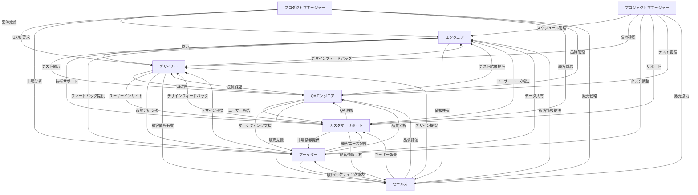

1. プロダクトマネージャー

 

   - プロダクトのビジョンと戦略を定義し、チームを導く。
   - ユーザーのニーズを理解し、プロダクトの方向性を決定する。
   - 開発チームとステークホルダー間のコミュニケーションを促進し、プロジェクトを円滑に進める。
   - プロジェクトのスコープ、スケジュール、リソースを管理する。
   - データに基づいて意思決定を行い、プロダクトの成果を測定する。

2. デザイナー

 

   - ユーザー体験（UX）とユーザーインターフェース（UI）のデザインを担当する。
   - ユーザーの課題を理解し、使いやすく魅力的なデザインを創造する。
   - プロトタイプを作成し、ユーザーテストを実施して、デザインを改善する。
   - デザインシステムを構築し、一貫性のあるデザインを実現する。
   - エンジニアと協力して、デザインの実装可能性を検討する。

3. エンジニア

 

   - プロダクトの技術的な実現を担当する。
   - アーキテクチャを設計し、コードを実装する。
   - テストを行い、品質を確保する。
   - 技術的な課題を解決し、パフォーマンスを最適化する。
   - デザイナーやプロダクトマネージャーと協力して、要件を理解し、実現する。

4. マーケター

 

   - 市場調査を行い、ターゲットユーザーを理解する。
   - プロダクトのポジショニングと差別化を明確にする。
   - プロモーション戦略を立案し、実行する。
   - ユーザーからのフィードバックを収集し、プロダクトの改善に活かす。
   - 競合他社の動向を把握し、戦略に反映する。

5. セールス

 

   - プロダクトの価値を顧客に伝え、販売する。
   - 顧客のニーズを理解し、プロダクトの改善点を提案する。
   - 市場の動向を把握し、販売戦略を最適化する。
   - 顧客との関係を構築し、継続的な利用を促進する。

6. カスタマーサポート

 

   - ユーザーからの問い合わせに対応し、サポートを提供する。
   - ユーザーの課題を理解し、プロダクトの改善点を提案する。
   - ユーザーとの関係を構築し、満足度を高める。
   - 頻出する問題を分析し、ドキュメントやFAQを整備する。

これらの役割は、相互に関連しており、密接なコミュニケーションとコラボレーションが不可欠です。特に、プロダクトマネージャーは全体を俯瞰し、各プレイヤーの力を引き出し、調整することが求められます。

また、プロダクトマネージャーは、サービスデザインだけでなく、プロジェクト管理、データ分析、マーケティングなど、幅広いスキルを身につける必要があります。単に「お願い」するだけでなく、自らの責任で主体的にプロジェクトを推進していく姿勢が重要です。

ベンダーに依存しすぎず、自社でプロダクト開発のノウハウを蓄積していくことが、長期的な競争力の源泉となります。プロダクトマネージャーは、この点を認識し、チームをリードしていく必要があるでしょう。

本書では、プロダクト開発における各プレイヤーの役割と、それを統括するプロダクトマネージャーの重要性について説明しました。自分の役割を理解し、主体的に行動することが、プロダクト開発の成功につながります。

プロダクトマネージャーをはじめとする全てのプレイヤーが、自らの責任を果たし、協力し合うことで、優れたプロダクトを生み出していくことができるのです。

なお、企業の規模や組織文化によってプロダクトマネージャー、プロジェクトマネージャー、サービスデザイナー、UIデザイナーなど、もう少し役割が細分化される場合もあると思います。一般的には、以下のような傾向があるとされています。

1. 大企業での役割分担
   - 大規模な組織では、専門性を重視し、役割を細分化する傾向があります。
   - プロダクトマネージャーは製品戦略を、プロジェクトマネージャーはプロジェクト管理を、サービスデザイナーは全体的なユーザー体験を、UIデザイナーは個別の画面デザインを担当するなど、それぞれの専門領域に特化します。
   - 専門性が高まる一方で、コミュニケーションのオーバーヘッドが増える可能性があります。

2. 中小企業での役割分担
   - 限られたリソースの中で、個人が複数の役割を兼任することが多くなります。
   - プロダクトマネージャーがプロジェクト管理も行ったり、デザイナーがサービスデザインからUIデザインまで担当したりするなど、柔軟な役割分担が求められます。
   - 個人の能力を最大限に活かすことができる一方で、専門性が不足する可能性があります。

役割を細分化することのメリットは、以下の通りです。

- 専門性が高まり、高度な知識やスキルを活かすことができる。
- 責任の所在が明確になり、アカウンタビリティが向上する。
- キャリアパスが明確になり、専門家としてのスキルを磨くことができる。

一方で、デメリットも存在します。

- コミュニケーションのオーバーヘッドが増え、意思決定が遅くなる可能性がある。
- 全体像を見失いがちになり、部分最適に陥るリスクがある。
- 柔軟性が失われ、変化への対応が遅れる可能性がある。

理想的には、専門性を維持しつつ、柔軟なコラボレーションが可能な体制を構築することが重要です。そのためには、以下のような取り組みが有効です。

1. 明確なビジョンと目標の共有
   - プロダクトのビジョンと目標を全員で共有し、一丸となって取り組む。
   - 各役割の担当者が、全体像を理解し、自分の役割を認識する。

2. 密接なコミュニケーションの促進
   - 定期的なミーティングやワークショップを通じて、情報共有と議論の場を設ける。
   - 部門間の壁を越えて、積極的にコミュニケーションを図る。

3. 柔軟性と適応力の重視
   - 役割分担にとらわれず、状況に応じて柔軟に対応する。
   - 変化を受け入れ、早めに方向修正を行う。

4. 継続的な学習と成長
   - 他の領域の知識やスキルを学び、T字型の人材を育成する。
   - 経験を共有し、チーム全体のレベルアップを図る。

プロダクト開発における役割分担は、組織の規模や文化に応じて最適化することが重要です。専門性を活かしつつ、柔軟なコラボレーションを実現することで、高い生産性とイノベーションを実現することができるでしょう。

プロダクトマネージャーは、このような役割分担の在り方を理解し、チームを適切に運営していくことが求められます。状況に応じて柔軟に対応しながら、メンバーの力を引き出し、プロダクトの成功に導いていく必要があります。

ここまででは、プロダクト開発における役割分担の傾向と、それぞれのメリット・デメリットについて解説しました。専門性と柔軟性のバランスを取ることが、プロダクト開発の鍵となります。

読者の皆さんも、自社の状況を踏まえて、最適な役割分担を検討してみてください。そして、それぞれの役割の担当者が、主体的に行動し、協力し合える環境を作っていくことが重要です。

プロダクト開発の概要として、開発のステップとチームコラボレーションの重要性を説明しました。次の章からは、各フェーズの詳細について見ていきましょう。

## 2. 企画とプロジェクト立ち上げ

プロダクト開発の最初のステップは、企画フェーズです。このフェーズでは、プロダクトのアイデアを出し、コンセプトを固めていきます。また、プロジェクトを立ち上げるために必要な準備も行います。

 

### 2.1 プロダクトの目的とターゲットユーザーの定義

プロダクトを企画する際、まず明確にすべきなのは、プロダクトの目的とターゲットユーザーです。この部分は特に重要で、プロダクトの方向性を決定づける部分です。しっかりと時間をかけて検討しましょう。

プロダクト開発の背景には、大きく分けて2つのパターンがあります。

1. 全く新しい領域への進出を目指す新規プロダクトの開発
2. 既存顧客のさらなる販売拡大を目的としたプロダクトの開発

どちらのパターンにおいても、プロダクトの目的とターゲットユーザーを明確にすることが重要ですが、アプローチ方法には違いがあります。それぞれのパターンに応じた進め方を見ていきましょう。

#### 新規プロダクトの企画

新規プロダクトの企画では、まず社会のニーズや市場のトレンドを分析することから始めます。

1. 社会課題の発見
   - 現代社会が抱える問題や、将来的に予測される課題を洗い出す
   - まだ解決されていない領域や、既存の解決策では不十分な部分を探る

2. 技術トレンドの把握
   - 最新のテクノロジーや、今後の技術発展の方向性を調査する
   - 新しい技術を活用することで、これまでにない価値提供が可能かを検討する

3. 市場機会の特定
   - 潜在的な市場ニーズを見つける
   - 競合他社の動向を分析し、参入余地のある領域を探る

これらの分析を通じて、社会の課題を解決し、ユーザーに新しい価値を提供できるプロダクトのアイデアを生み出します。

例えば、本書でサンプルとして登場します仮想のプロジェクト「LinkedPal」の場合、既存のSNSの課題であるプライバシー問題に着目し、それを解決する新しいコンセプトのSNSを提案しています。技術面では、暗号化技術の進歩を活用することで、よりセキュアなプラットフォームの実現を目指しているとも言えます。

次に、ターゲットユーザーを明確にするために、前述のユーザーリサーチ（インタビューやアンケートなど）を実施します。

新規プロダクトの企画において、ターゲットユーザー像を明確にすることは非常に重要ですが、同時に難易度の高いタスクでもあります。革新的なプロダクトの場合、既存の顧客データや市場情報だけでは、ユーザーニーズを的確に捉えきれないことも少なくありません。

そこで重要になるのが、仮説検証のプロセスです。まずは、市場調査や先行事例の分析などから、ターゲットユーザーに関する仮説を立てます。例えば、LinkedPalの場合、以下のような仮説が考えられるでしょう。

- プライバシーに敏感な若年層が、新たなSNSを求めている
- ビジネスでのコミュニケーションにおいても、セキュリティが重視される傾向にある

このような仮説を起点に、ユーザーリサーチを実施します。リサーチの手法としては、以下のようなものが挙げられます。

 

1. インタビュー調査
   - 仮説に合致するユーザー属性の人々に、インタビューを行う
   - プロダクトのコンセプトを提示し、率直な意見や反応を引き出す
   - ユーザーの課題意識や期待を深掘りし、仮説の妥当性を検証する

2. アンケート調査
   - Webアンケートなどを通じて、大規模な調査を実施する
   - 仮説に基づいた設問を用意し、ユーザーの意識や行動を定量的に把握する
   - 得られたデータを分析し、仮説の裏付けを取る

3. ユーザビリティテスト
   - プロトタイプを用意し、実際にユーザーに使ってもらう
   - ユーザーの行動観察や、フィードバックの収集を通じて、使い勝手や印象を確認する
   - 仮説で想定したユーザー像と、実際の利用者の反応を照らし合わせる

これらのリサーチを通じて得られた知見をもとに、当初の仮説を修正・補強していきます。例えば、LinkedPalのリサーチの結果、以下のような発見があったとします。

- プライバシー重視の傾向は、若年層だけでなく、幅広い年代で見られた
- セキュリティ面での安心感だけでなく、使いやすさも重視されている

こうした気づきを反映し、ターゲットユーザー像を再定義します。これを受けて、プロダクトの機能や設計にも修正を加えていくことになるでしょう。

大切なのは、一度の検証で完璧なユーザー像を定義しようとしないことです。仮説と検証を繰り返す中で、徐々にユーザー理解を深めていくことが重要です。特に、プロダクトの革新性が高い場合、ユーザー自身もニーズを明確に言語化できないことがあります。リサーチを重ねる中で、潜在的なニーズを掘り起こしていくことが求められるのです。

また、検証プロセスにおいては、社内の関係者を巻き込むことも大切です。リサーチの結果を共有し、ユーザー像についての議論を重ねることで、プロダクト開発の方向性を合わせていくことができます。特に、エンジニアやデザイナーなど、開発に直接携わるメンバーの理解を得ることは欠かせません。

仮説検証を効果的に進めるためには、適切な指標を設定することも重要です。例えば、LinkedPalの場合、以下のような指標が考えられます。

- プライバシー設定の利用率
- 友だち数の平均値
- 1日あたりのアクティブユーザー数
- 口コミでの拡散率

これらの指標を追跡することで、ユーザー像の妥当性を定量的に評価することができます。また、指標の変化を見ることで、プロダクトの改善点や新たな仮説のヒントを得ることもできるでしょう。

新規プロダクトにおけるユーザー像の定義は、一筋縄ではいきません。仮説と検証を地道に繰り返す中で、ユーザー理解を深め、プロダクトを磨き上げていく必要があります。チーム全体で仮説検証のプロセスを共有し、ユーザー視点でのプロダクト開発を推進することが、成功への鍵となるでしょう。

#### 既存顧客をベースにしたプロダクトの企画

一方、既存顧客をベースにしたプロダクトの企画では、顧客データの分析と社内ヒアリングがポイントになります。


1. 顧客データの分析
   - 社内の顧客データベースを分析し、ターゲット層の特徴を把握する
   - 購買履歴や問い合わせ履歴など、様々なデータを活用する

2. 営業やサポート部門へのヒアリング
   - 顧客と直接接している営業やサポートの声を拾う
   - 顧客の生の声から、ニーズや課題を発見する

3. ターゲット層の課題やニーズの深掘り
   - 既存プロダクトやサービスでは満たされていない、ターゲット層特有の課題やニーズを見つける
   - 潜在的なニーズを掘り起こすことも重要

4. 課題解決のためのプロダクトのあり方を検討
   - 洗い出した課題やニーズを解決するために、どのようなプロダクトが求められているかを考える
   - 既存プロダクトの拡張や、新規プロダクトの開発など、様々な選択肢を検討する

既存顧客をベースにしたプロダクト開発では、ユーザーのニーズや課題がより具体的に見えているため、的確なソリューションを提供しやすいというメリットがあります。一方で、既存事業との関係性や、社内リソースの制約など、考慮すべき点も多くなります。

いずれのパターンにおいても、プロダクトの目的とターゲットユーザーを定義したら、それをプロダクト企画書としてまとめます。企画書には、以下のような項目を盛り込みます。

1. プロダクトの概要
   - プロダクトの目的や、提供する価値を簡潔に説明する
   - 新規プロダクトの場合は、社会課題の解決や新しい価値提供について言及する
   - 既存プロダクトとの差別化ポイントがあれば明示する

2. ターゲットユーザー
   - ペルソナを具体的に記述する
   - 各ペルソナの課題やニーズ、価値観などを明示する
   - 新規プロダクトの場合は、想定されるユーザー像とその根拠を説明する
   - 既存顧客をターゲットとする場合は、その層の特徴や課題を詳述する

3. 主な機能
   - プロダクトの主要な機能を列挙する
   - 各機能が、どのようにユーザーの課題を解決するのかを説明する
   - 新規プロダクトの場合は、革新的な機能やユニークな価値提供について強調する

4. 市場と競合
   - 想定する市場規模や、競合サービスの状況を整理する
   - 自社プロダクトの優位性を明示する
   - 新規プロダクトの場合は、参入する市場の魅力度や成長性についても言及する
   - 既存事業とのシナジーがある場合は、その点についても触れる

5. 収支計画
   - プロダクトの収益モデルを説明する
   - 初期開発コストや、ランニングコストの見積もりを示す
   - 新規プロダクトの場合は、投資対効果や回収見込みについても言及する
   - 既存事業への影響がある場合は、その点も考慮する

以上のように、新規プロダクトの企画と、既存顧客をベースにした企画では、アプローチ方法に違いがあります。新規プロダクトの場合は、社会のニーズや技術トレンドを踏まえた革新的なアイデアが求められる一方、既存顧客ベースの場合は、顧客データの分析と課題解決の着眼点が重要になります。

プロダクト開発の背景に合わせて、適切な企画アプローチを選択することが、成功への第一歩となるでしょう。いずれにせよ、プロダクトの目的とターゲットユーザーを明確にすることが、プロダクト開発の根幹をなすことに変わりはありません。

自社の状況とプロダクトの特性を見極め、最適な企画プロセスを設計していきましょう。ユーザーの課題解決を第一に考え、価値あるプロダクトを生み出すことが、私たち開発者の使命です。

### 2.2 要件定義とユーザーストーリーの作成

プロダクトの目的とターゲットユーザーが明確になったら、次は要件定義を行います。要件定義とは、プロダクトに必要な機能や性能を具体的に列挙することです。

LinkedPalの場合、プロダクトの目的として以下の3点が挙げられています。

1. 友人関係を大切にしながらも、プライバシーを守れる
2. 個別のメモ機能で大切な情報を記録・共有できる
3. 友人との絆を深め、思い出を残すためのツール

これらの目的を達成するために、具体的にどのような機能が必要になるでしょうか。LinkedPalのターゲットユーザーである、以下の2つのペルソナを念頭に置きながら考えてみましょう。


1. 学生ペルソナ「清水さくら（20歳、大学生）」
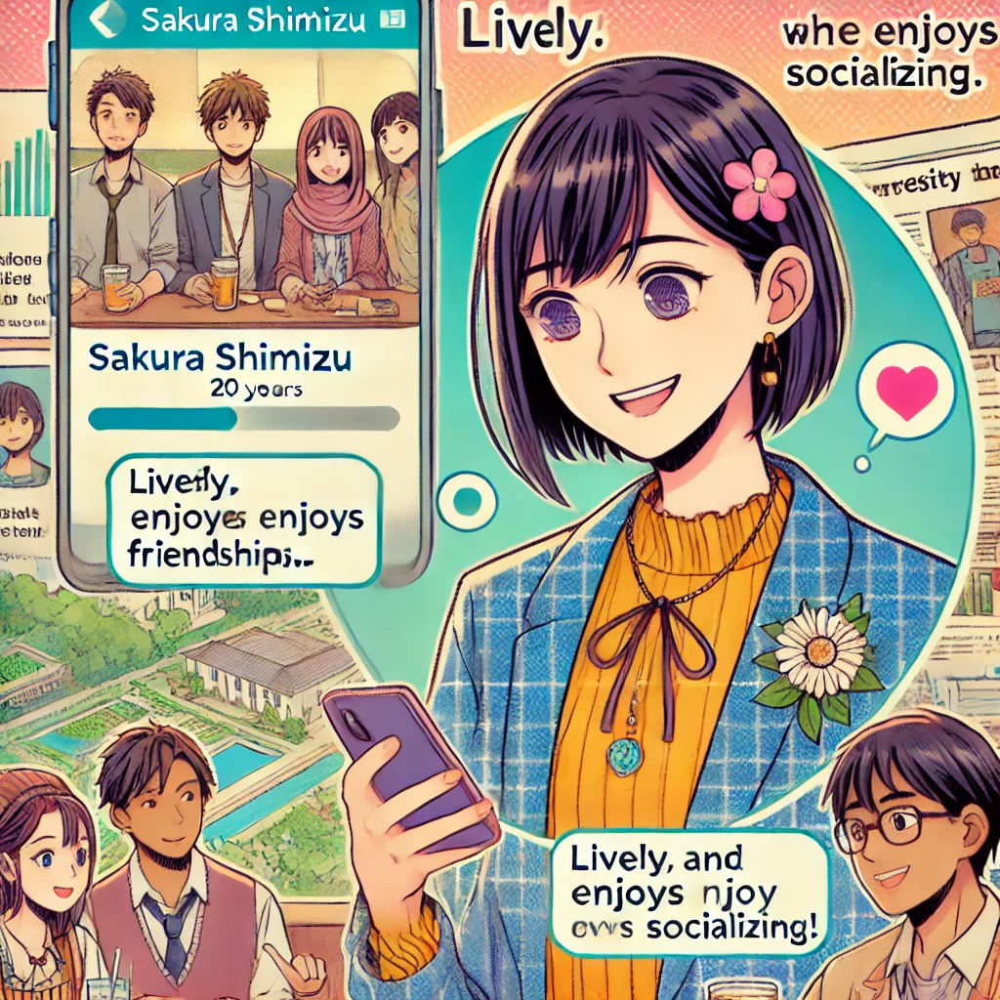
   - プロフィール
     - 活発で人付き合いが好きな性格
     - プライバシーを気にしつつも、友人との思い出を大切にしたい
   - ニーズ
     - 友人との交流を深めたい
     - プライベートな情報を守りたい
   - 行動パターン
     - 新入生との顔合わせ会、サークル活動、飲み会などでLinkedPalを利用
     - 友人との思い出をLinkedPalのメモ機能に残す

2. ビジネスパーソンペルソナ「田中太郎（35歳、営業職）」
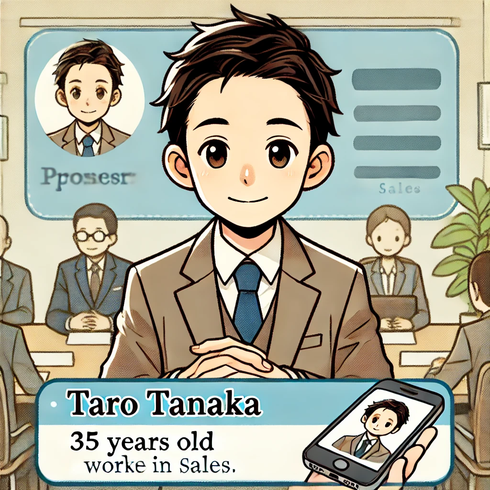
   - プロフィール
     - 几帳面で人当たりが良い性格
     - 顧客や取引先との関係を大切にしたいが、個人的な情報は公開したくない
   - ニーズ
     - 仕事上の人間関係を管理したい
     - プライベートな交流は限定的に行いたい
   - 行動パターン
     - 営業時のアポイントや会食の際にLinkedPalを利用
     - 顧客ごとにメモを残し、対応履歴を管理する

これらのペルソナを見ると、プライバシー保護に関する要件が重要であることが分かります。特に、以下の点が重要になるでしょう。

- 友人関係の非公開性：自分と誰が友だちであるかを、他のユーザーから確認できないようにする
- 投稿の限定公開：投稿の公開範囲を、特定の友だちのみに限定できる
- セキュアな環境の提供：個人情報を安心して預けられるよう、適切なセキュリティ対策を行う

要件定義を進める上で、ユーザーストーリーを活用すると効果的です。ユーザーストーリーとは、ユーザーの視点から見た機能の要求事項を、簡潔な文章で表現したものです。

ユーザーストーリーの基本的な書式は、以下の通りです：
```
ある<ロール>として、<目的>のために、<機能>を使用したい。
```
- <ロール>：ペルソナや、ユーザーの役割
- <目的>：ユーザーが達成したいこと
- <機能>：目的を達成するための手段

先に挙げたペルソナを基に、LinkedPalの場合、以下のようなユーザーストーリーが考えられます。

```
プライバシーを重視する学生として、友人関係を守るために、自分の友だちリストを他のユーザーから見えないようにしたい。
```

```
ビジネスパーソンとして、特定の友人とだけ情報を共有するために、投稿の公開範囲を設定できる機能が欲しい。
```

```
プライバシーを重視するユーザーとして、LinkedPalに個人情報を安心して預けられる環境を整えてほしい。
```

このようなユーザーストーリーを作成することで、プロダクトに必要な機能を、ユーザーの視点で具体化することができます。

ユーザーストーリーは、要件定義だけでなく、優先順位づけにも役立ちます。ユーザーにとっての価値や重要度を考慮し、優先的に実装すべき機能を決めていくことが可能です。

また、ユーザーストーリーは、開発チームとステークホルダー間のコミュニケーションツールとしても機能します。マーケティングや営業、経営陣など、様々な立場の人々が、ユーザー視点でプロダクトを理解することを助けるのです。

要件定義とユーザーストーリーの作成を通じて、LinkedPalのコアバリューであるプライバシー保護を、具体的な機能として落とし込んでいきましょう。ユーザーの視点に立ち、価値あるプロダクトを開発することが、我々に課せられた使命なのです。

この企画フェーズでの検討内容は、次のデザインやUI/UXの段階で活かされていきます。ユーザーのニーズを的確に捉えた企画が、プロダクトの成功に大きく影響するのです。

### 2.3 プロダクト戦略とLinkedPalの差別化

要件定義とユーザーストーリーの作成を通じて、プロダクトの中核的な価値を明確にすることが重要です。例えばLinkedPalの場合、以下の2点について、プロダクト戦略の観点から検討しておく必要があります。

1. 徹底したプライバシー保護
   - LinkedPalの最大の特徴は、ユーザーのプライバシーを徹底的に守ることにあります
   - 特に、友だちリストは完全に非公開とし、他のユーザーが自分の友人関係を知る手段を一切与えないことが重要です
   - このプライバシー保護の姿勢を、要件定義やユーザーストーリーに明確に盛り込むことが求められます

2. 既存のSNSとの差別化
   - LinkedPalが成功するためには、既存のSNSとは一線を画す独自の価値を提供する必要があります
   - メッセージング機能など、他のSNSで一般的な機能は、初期段階では導入せず、LinkedPalならではの価値を前面に打ち出すことが重要です
   - ユーザーからのフィードバックを元に、必要な機能を段階的に追加していく戦略が有効でしょう

これらのプロダクト戦略を踏まえて、要件定義とユーザーストーリーを練り上げていくことが重要です。LinkedPalの中核的な価値を実現するために、どのような機能が必要で、どのような体験を提供するべきかを、プロダクト戦略の観点から検討していきます。

この検討結果は、次の章で議論するデザインとUI/UXにも大きく影響してきます。プロダクト戦略で定めた方向性を、デザインの隅々まで浸透させることが、LinkedPalの成功につながるのです。

プロダクトマネージャーとデザインチームは、密に連携をとりながら、プロダクト戦略とデザインの整合性を保っていく必要があります。両者が一体となって、LinkedPalの価値を最大化するプロダクト開発を進めていきましょう。

次の章では、デザインとUI/UXについて、詳しく見ていきましょう。

# 3. デザインとUI/UX

企画フェーズで定義したプロダクトの目的やターゲットユーザーをもとに、次はデザインとUI/UXを具体化していきます。ユーザー体験（UX）を考慮しながら、ユーザーインターフェース（UI）のデザインを進めることが重要です。

## 3.1 ユーザー体験（UX）デザインの重要性

UXデザインとは、ユーザーがプロダクトを通じて得られる体験を設計することです。単に機能を提供するだけでなく、ユーザーが抱える課題を解決し、満足度の高い体験を提供することが目的です。UXデザインでは、ユーザーの要求や行動を深く理解することが重要であり、ユーザー調査やペルソナの作成などの手法が用いられます。


例えばLinkedPalのUXデザインでは、以下のような点に留意することになるでしょう：

1. プライバシー保護の徹底
   - 友人関係の完全な非公開を実現し、他のユーザーが自分の友だちリストを知る手段を完全に排除する
   - 設定で友だちリストを公開するオプションは設けず、プライバシー保護を徹底する

2. 既存のSNSとの差別化
   - メッセージング機能は初期段階では導入せず、LinkedPalならではの価値を前面に打ち出す
   - ユーザーからのフィードバックを元に、必要に応じてメッセージング機能の導入を検討する

3. シンプルで直感的な操作性
   - ユーザーが迷わずに目的の機能にたどり着けるよう、シンプルで直感的なナビゲーションを設計する
   - 例えば、ホーム画面には、LinkedPalの中核的な機能へのショートカットを配置し、アクセスしやすくする

4. ペルソナに合わせた体験の最適化
   - ターゲットユーザーである学生やビジネスパーソンなど、ペルソナごとの行動パターンや目的を考慮し、最適な体験を提供する
   - 例えば、学生向けには友人との交流を促進する機能を、ビジネスパーソン向けには人脈管理の機能を前面に出すなど、メリハリをつける

これらの点を踏まえ、LinkedPalのUX設計では、プライバシー保護を徹底しつつ、既存のSNSとは一線を画す独自の価値を提供することを目指すことになります。

## 3.2 ユーザーインターフェース（UI）デザインのプロセス

UIデザインは、UXデザインで定義された体験を、具体的な画面デザインとして表現していくプロセスです。LinkedPalのUIデザインを例にとると、以下のようなステップを踏んでいくことになるでしょう。

### 1. 情報設計 


   - LinkedPalの主要な画面として、ここではホーム画面、友だちリスト画面、設定画面などを例に挙げ、それぞれの情報設計について詳しく説明します。ただし、これらの画面はあくまで一例であり、他の画面についても同様のアプローチで情報設計を進めていくことが重要です。
   - 全ての画面に共通する設計上の留意点として、以下の3点を挙げておきます。
     - プライバシー保護：LinkedPalの中核的な価値であるプライバシー保護を、全ての画面のデザインに反映させること
     - シンプルで直感的なデザイン：ユーザーが迷うことなく操作できるよう、シンプルで直感的なレイアウトを心がけること
     - ブランドの一貫性：色使いやデザインの統一感を保ち、LinkedPalのブランドイメージを全ての画面で表現すること

   - 1.1 ホーム画面の情報設計
     - ホーム画面は、ユーザーがアプリを起動した際に最初に目にする画面であり、LinkedPalの中核的な価値を伝える重要な役割を担います。
     - 画面の上部には、ユーザーのプロフィール情報を簡潔に表示し、アプリの利用状況（友だち数など）を一目で確認できるようにします。
     - 画面の中央部には、LinkedPalの主要な機能へのショートカットを配置します。例えば、「友だちを追加する」「思い出を振り返る」などのアクションボタンを大きく配置し、ユーザーがすぐに目的の機能にアクセスできるようにします。
     - 画面の下部には、ナビゲーションバーを設置し、他の主要画面（友だちリスト画面、設定画面など）への移動を容易にします。
     - ホーム画面の背景には、LinkedPalのブランドイメージを表現する画像やイラストを使用し、アプリの世界観を演出します。
     - 全体的に、シンプルで直感的なレイアウトを心がけ、ユーザーが迷うことなくアプリを利用できるようにします。

   - 1.2 友だちリスト画面の情報設計
     - 友だちリスト画面は、ユーザーが自分の友人関係を管理するための重要な画面です。
     - 画面の上部には、友だち数の表示と、友だちを検索するための検索ボックスを配置します。
     - 画面の中央部には、友だちのリストを表示します。各友だちの情報（プロフィール画像、名前など）をコンパクトに表示し、タップすることで詳細画面に移動できるようにします。
     - リストの表示形式は、アルファベット順やグループ別など、ユーザーが選択できるようにします。これにより、ユーザーは自分の好みに合わせて友だちリストを整理できます。
     - 友だちリストの下部には、新しい友だちを追加するためのボタンを配置します。タップすると、QRコードのスキャンや直接IDの入力など、友だち追加の方法を選択する画面に遷移します。
     - 全体的に、友だちリストをシンプルかつ見やすく表示することを重視し、ユーザーがストレスなく友人管理を行えるようにします。

   - 1.3 設定画面の情報設計
     - 設定画面は、ユーザーがアプリの各種設定を行うための画面であり、特にプライバシーに関する設定項目が重要です。
     - 画面の上部には、ユーザーのプロフィール情報（名前、プロフィール画像など）を表示し、タップすることでプロフィール編集画面に移動できるようにします。
     - 画面の中央部には、各種設定項目をカテゴリ別に整理して表示します。カテゴリとしては、「アカウント設定」「プライバシー設定」「通知設定」などが考えられます。
     - 特に「プライバシー設定」のカテゴリは、LinkedPalの中核的な価値に関わる重要な項目であるため、目立つ位置に配置し、アイコンなどを用いて視覚的に強調します。
     - ただし、プライバシー設定の項目は最小限に絞り、シンプルで分かりやすい構成を心がけます。友だちリストの非公開設定など、LinkedPalの基本的なプライバシー保護機能は、設定項目として表示せず、アプリの標準動作として説明します。
     - 全体的に、設定項目をシンプルかつ論理的に配置することで、ユーザーが迷うことなく必要な設定を行えるようにします。

   - 1.4 その他の画面の情報設計
     - ここでは主要な3つの画面を例に挙げましたが、LinkedPalには他にも多くの画面が存在します。
     - プロフィール画面、通知画面、友だち追加画面、メモ作成画面など、それぞれの画面についても同様のアプローチで情報設計を行います。
     - 各画面の役割と、配置すべき情報、ユーザーの動線を明確にし、プライバシー保護とシンプルさ、ブランドの一貫性を保つことが重要です。
     - 全ての画面について、ワイヤーフレームを作成し、画面遷移やナビゲーションの流れを確認します。
     - 必要に応じて、各画面の設計をブラッシュアップし、ユーザーにとって最適なUIを目指します。

    アプリ全体を通して、一貫したデザインの考え方を適用することが重要です。主要な画面だけでなく、全ての画面について同様の情報設計のアプローチを取ることで、ユーザーは迷うことなくアプリを利用でき、プロダクトの価値を最大限に享受できるはずです。

    情報設計は、UIデザインの基礎となる重要なプロセスです。ここで定めた設計方針が、その後のデザインプロセスに大きな影響を与えます。プライバシー保護、シンプルさ、ブランドの一貫性といった プロダクトの中核的な価値を、情報設計の段階から十分に考慮することが求められます。

### 2. ワイヤーフレーム


   - ワイヤーフレームの作成では、手書きのスケッチから始め、徐々に詳細度を上げていきます。
   - 各画面のワイヤーフレームを並べて、全体的な画面遷移やナビゲーションの流れを確認します。
   - ワイヤーフレームのレビューでは、UXデザイナーだけでなく、プロダクトマネージャーやエンジニアも巻き込み、多様な視点からフィードバックを得ます。
   - フィードバックをもとに、ワイヤーフレームを改善し、より使いやすく直感的なUIの設計を目指します。

### 3. デザインコンセプトの設定

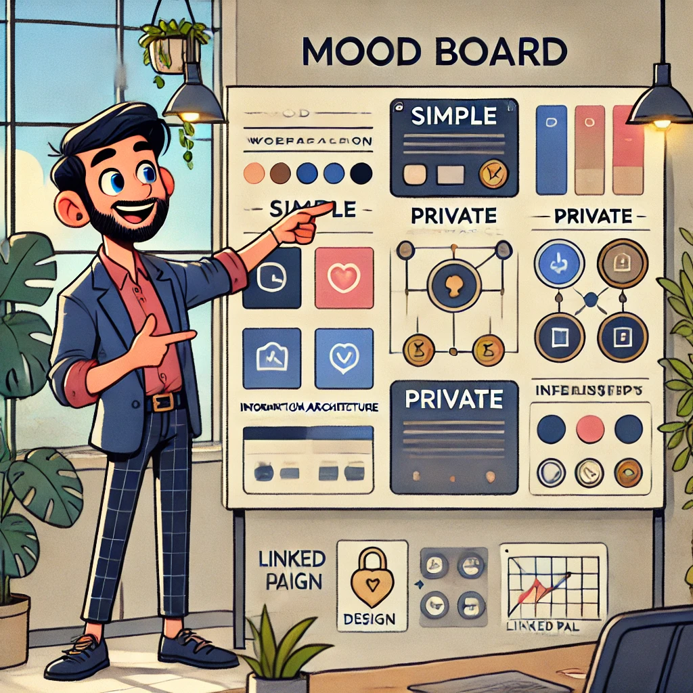

   - 例えば、LinkedPalではデザインコンセプトを、「Simple, Private, Unique」の3つのキーワードで表現します。
   - 「Simple」は、シンプルで直感的なUIデザインを通じて、ユーザーの操作性を高めることを意味します。
   - 「Private」は、プライバシー保護を徹底し、ユーザーが安心して利用できるプラットフォームを目指すことを表します。
   - 「Unique」は、既存のSNSとは一線を画す独自の価値を提供し、LinkedPalならではの体験を追求することを意味します。
   - デザインコンセプトに基づいて、カラーパレットを設定します。
   - メインカラーには、信頼感と安心感を与えるネイビーブルーを採用し、LinkedPalのプライバシー重視の姿勢を表現します。
   - アクセントカラーには、洗練さと上品さを感じさせるゴールドを用いて、LinkedPalのユニークな価値を強調します。
   - タイポグラフィでは、読みやすさと見やすさを重視し、ゴシック体を採用します。
   - アイコンやボタンのデザインには、シンプルでエレガントなスタイルを採用し、UIの一貫性を保ちます。
   - デザインコンセプトをまとめたムードボードを作成し、チーム内で共有して議論を行います。
   - ムードボードには、カラーパレットやタイポグラフィ、参考となる他社デザインの事例などを盛り込みます。

### 4. 詳細デザインとプロトタイピング


   - ワイヤーフレームとデザインコンセプトをもとに、詳細な画面デザインを作成します。
   - アイコンやボタンなど、UIの各要素をデザインし、統一感のある画面に仕上げます。
   - インタラクションデザインも考慮し、ボタンのタップ時のフィードバックや画面遷移のアニメーションなどを設計します。
   - プロトタイピングツールを使い、画面遷移やアニメーションを再現し、インタラクションの実際の動きを確認します。

### 5. ユーザーテストとデザインの改善

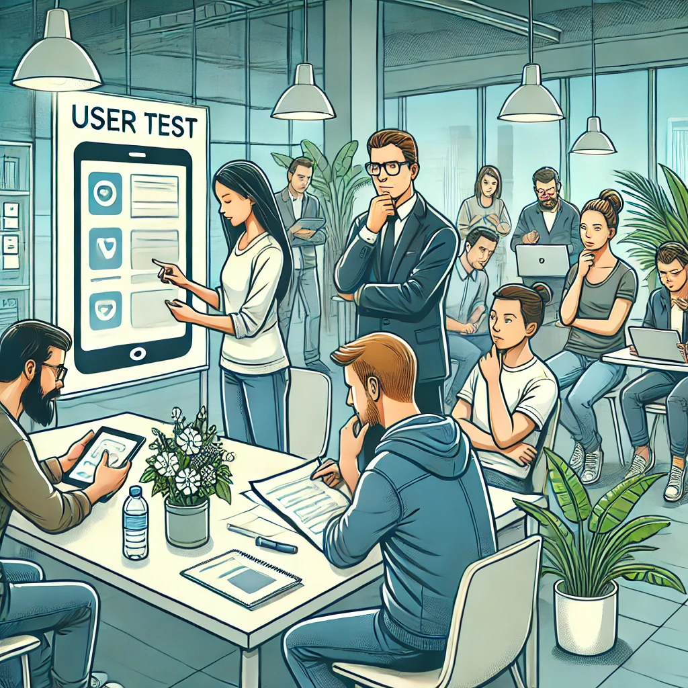

   - プロトタイプを使って、実際のユーザーにデザインの使い勝手を評価してもらいます。
   - ユーザーの反応や行動を観察し、改善点を見つけます。
   - 例えば、プライバシー設定の説明が分かりにくいという意見が多かった場合、表現を見直すなどの対応を行います。
   - ユーザーテストの結果をもとに、デザインを改善し、より使いやすいUIを目指します。

これらのステップを経て、プロダクトのUIデザインを磨き上げていきます。LinkedPalのケースでは特に情報設計の段階では、中核的な価値であるプライバシー保護をどのように表現するかが重要なポイントとなります。

ホーム画面、友だちリスト画面、設定画面のそれぞれで、プライバシー保護の考え方を反映しつつ、ユーザーにとって直感的で使いやすいデザインを心がけます。

また、ワイヤーフレームやプロトタイプは、開発チームとの連携にも役立ちます。デザインの実装可能性について、エンジニアと議論しながら進めることで、実現性の高いUIを設計することができるでしょう。

LinkedPalのUIデザインについては、シンプルさ、プライバシー保護、ユニークさのバランスを取ることが重要です。これらの価値を体現するデザインを追求することが価値につながっていくでしょう。

## 3.3 プライバシーを徹底するUIデザインという切り口

LinkedPalの最大の特徴は、徹底したプライバシー保護にあります。特に、友だちリストは他のユーザーから完全に隠蔽し、自分が誰と友だちであるかを知る手段を一切与えません。この価値をUIデザインでどのように実現するか、詳しく見ていきましょう。

1. 友だちリストの完全非公開
   - LinkedPalでは、友だちリストは自分にしか見えない仕様とする
   - 他のユーザーが自分の友だちリストを閲覧したり、友だちを経由して知ったりする方法を完全に排除する
   - 設定で友だちリストを公開するオプションは設けず、プライバシー保護を徹底する

2. 友だち追加のプロセスを限定的に
   - 新しい友だちを追加する方法を、QRコードや直接IDの入力など、限定的な手段に絞る
   - 他のユーザーから友だちリクエストを受け取る機能は設けず、能動的に友だちを追加する仕組みとする
   - これにより、他のユーザーが自分に友だちリクエストを送る方法がなくなり、プライバシー保護が強化される

3. プライバシー保護を前面に打ち出すデザイン
   - UIデザインの中で、プライバシー保護を前面に押し出し、LinkedPalの最大の価値をアピールする
   - 例えば、ホーム画面やプロフィール画面に、「友だちリストは完全に非公開です」などのメッセージを大きく表示する
   - アイコンやイラストを使って、プライバシー保護の仕組みをビジュアル的に分かりやすく伝える

4. プライバシーに関する説明の充実
   - アプリ内のチュートリアルやヘルプセンターで、LinkedPalのプライバシー保護の仕組みについて丁寧に説明する
   - 友だちリストが完全に非公開であることや、友だち追加の方法が限定的であることなど、LinkedPalならではのプライバシー保護の特徴を強調する
   - 分かりやすい言葉や図解を用いて、ユーザーが安心して利用できるよう配慮する

5. ユーザーからのフィードバックを重視
   - プライバシー保護に関するユーザーの意見や要望に真摯に耳を傾け、随時改善を図る
   - ユーザーの声を基に、プライバシー保護の仕組みをさらに強化していく
   - ユーザーとの対話を通じて、LinkedPalがプライバシー保護に真剣に取り組む姿勢を示す

LinkedPalでは、友だちリストの完全非公開を徹底することで、ユーザーのプライバシーを最大限に守ります。同時に、UIデザインを通じてこの価値を前面に打ち出し、ユーザーに安心と信頼を与えることが重要です。

プライバシー保護を最優先しつつ、シンプルで使いやすいUIデザインを追求することで、LinkedPalは他のSNSとは一線を画す、ユニークなプラットフォームとしての地位を確立できるでしょう。

UIデザインは、LinkedPalの価値を体現する重要な手段です。プライバシー保護という中核的な価値を、デザインの隅々に行き渡らせることが、LinkedPalの成功につながります。

デザインチームは、この方針をしっかりと理解し、プロダクト全体に一貫して反映させることが求められます。エンジニアリングチームとも密に連携し、プライバシー保護の仕組みを確実に実装していくことが重要です。

当然、こうした「プロダクトとしてコアとなる価値」については、デザイナーやエンジニアだけではなく、プロダクトチームメンバー間でしっかりと共有し、この理念を実現するため、チーム一丸となって最大限の努力を払っていく必要があるでしょう。

次の章では、いよいよ開発フェーズに入ります。デザインの成果物をもとに、実際のアプリケーション開発が進められていきます。

# 4. 開発とテスト

デザインフェーズで作成されたUIデザインをもとに、いよいよ開発フェーズに入ります。このフェーズでは、設計された機能を実際のアプリケーションとして実装していきます。同時に、品質を確保するためのテストも行われます。

## 4.1 開発手法の選定

プロダクト開発における開発手法は、大きくウォーターフォール型とアジャイル型に分けられます。ウォーターフォール型は、要件定義、設計、実装、テスト、リリースという一連のフェーズを順番に進めていく従来型の開発手法です。一方、アジャイル型は、短いイテレーションを繰り返しながら、フィードバックを得て開発を進めていく手法です。

プロジェクトの特性に応じて、適切な開発手法を選定することが重要です。例えば、以下のような場合は、ウォーターフォール型が適しているかもしれません。

- 要件が明確で、大きな変更の可能性が低い場合
- 厳密な納期が決まっており、計画通りに進める必要がある場合
- 大規模で複雑なシステムを開発する場合

一方、以下のような場合は、アジャイル型が適しているでしょう。

- 要件が不明確で、変更の可能性が高い場合
- 早期にプロトタイプを作成し、フィードバックを得ながら開発を進めたい場合
- 市場の変化に素早く対応する必要がある場合

ただし、これらはあくまで一般論であり、実際のプロジェクトでは、ウォーターフォール型とアジャイル型のハイブリッドアプローチを取ることも多いです。例えば、全体の計画はウォーターフォール型で管理しつつ、個別の機能開発ではアジャイル型を取り入れるなどです。

大切なのは、プロジェクトの目的や制約条件を踏まえ、チームの特性も考慮した上で、最適な開発手法を選択することです。また、選択した手法に固執するのではなく、プロジェクトの進行に合わせて柔軟に見直していくことが重要です。

### LinkedPalにおける開発手法の選定

LinkedPalの開発では、新しい機能を素早くリリースし、ユーザーのフィードバックを取り入れながら改善していくことを重視しています。また、開発チームのメンバーは、アジャイル開発の経験が豊富です。このようなことを前提とし、LinkedPalの開発では、アジャイル型の開発手法、特にスクラムを採用することにしました。


ただし、アジャイル開発がすべてのプロジェクトに適しているわけではありません。LinkedPalの事例は、あくまで一つの選択肢であることを念頭に置いてください。

LinkedPalの開発を例に、具体的なアジャイルプラクティスを見てみましょう：

1. スクラム
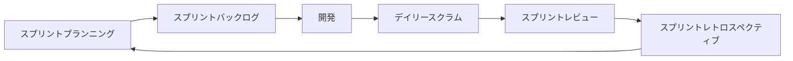

   - 開発チームは、2週間から1ヶ月程度の短い期間（スプリント）で開発を行います。
   - スプリントの開始時に、実装する機能（ユーザーストーリー）を選択し、ゴールを設定します。ユーザーストーリーは、ユーザーの視点で書かれた機能要件のことで、「○○のユーザーとして、××ができるようにしたい」といった形式で表現されます。
   - 各ユーザーストーリーには、ストーリーポイントと呼ばれる相対的な見積もり単位を割り当てます。ストーリーポイントは、タスクの複雑さや工数を表す指標で、チームが経験や議論を通じて設定します。LinkedPalの開発チームでは、1スプリントを2週間と設定し、以下のようなストーリーポイントの基準を採用しています。
     - 1ポイント: 1日以内で完了できる簡単なタスク
     - 2ポイント: 2~3日程度で完了できる、一般的な複雑さのタスク
     - 3ポイント: 4~5日程度を要する、やや複雑なタスク
     - 5ポイント: 1週間以上を要する、非常に複雑なタスク
     - 8ポイント以上: 1スプリントで完了が困難な大規模なタスク。可能な限り分割することが推奨される
   - スプリントの開始時のスプリントプランニングでは、チームの velocity（1スプリントで完了できるストーリーポイントの合計）を考慮して、スプリントで実装するユーザーストーリーを選択します。
   - 例えばLinkedPalの開発チームでは、以下のようなプラクティスを採用します。
     - 1人あたり1スプリント中にアサインされるタスクの合計ストーリーポイントは、8ポイントを超えないようにする。これにより、個人に過度な負荷がかかることを防ぎ、持続可能な開発ペースを維持する。
     - チーム全体でスプリントゴールを達成することを最優先とし、自分のタスクが早めに終わった場合は、他のチームメンバーのタスクを手伝う。これにより、チームとしての生産性を高め、スプリントゴールの達成確率を上げる。
     - 8ポイントを超えるストーリーは、複数のストーリーに分割する。これにより、タスクの複雑さを管理しやすくし、進捗の把握や課題の早期発見につなげる。
   - スプリントの終了時に、開発したソフトウェアをレビューし、フィードバックを得ます。このレビューは「スプリントレビュー」と呼ばれ、開発チームがスプリントの成果をステークホルダーにデモし、フィードバックを得る場となります。
   - フィードバックをもとに、次のスプリントの計画を立てます。この計画を「スプリントプランニング」と呼び、次のスプリントで実装するユーザーストーリーを選択し、タスクを見積もります。
   QAエンジニアがデイリースクラムに参加することで得られるメリットを具体的に説明するのは、とても良いアイデアだと思います。仕様変更のリアルタイムでのキャッチアップやテストケースの迅速な修正は、アジャイル開発におけるQAエンジニアの重要な役割の一つです。
   - スプリント期間中、各ロールは以下のような役割を果たします。
     - プロダクトマネージャー: スプリントゴールとの整合性を確認し、優先順位の調整を行う。ステークホルダーとのコミュニケーションを取り、フィードバックを開発チームに伝える。
     - スクラムマスター（またはプロジェクトマネージャー）: 開発チームが最大限のパフォーマンスを発揮できるよう、障害を取り除き、プロセスの改善を促す。デイリースクラムなどの会議をファシリテートし、チームのコミュニケーションを促進する。
     - デザイナー: 開発チームと協力し、UIデザインを実装に落とし込む。ユーザーテストの結果をもとに、デザインの改善を提案する。
     - QAエンジニア: 開発チームと協力し、テストケースの作成と実行を行う。バグや課題を開発チームに報告し、修正を促す。ユーザーストーリーの受け入れ基準を満たしているかを確認する。QAエンジニアは、デイリースクラムに参加することで、仕様変更をリアルタイムでキャッチアップし、テストケースを迅速に修正することができる。これにより、テストの網羅性を維持し、品質の高いプロダクトを提供することに貢献する。

2. カンバン
   - タスクの進捗状況を可視化するために、カンバンボードを使用します。
   - カンバンボードは、「ToDo」「In Progress」「Done」などのカラムで構成されます。
   - タスクをカードとして表現し、進捗に合わせてカードを移動させていきます。例えば、開発が完了したタスクは「In Progress」から「Done」に移動します。
   - チームメンバー全員がタスクの状況を把握できるようになり、ボトルネックの発見や課題の早期解決につながります。

3. ペアプログラミング
   - 2人のエンジニアが1台のコンピュータを使って、協力してコーディングを行います。
   - 1人がコーディングを行い（ドライバー）、もう1人がレビューを行う（ナビゲーター）ことで、品質の向上を図ります。
   - エンジニア同士の知識共有やスキル向上にも役立ちます。

これらのアジャイルプラクティスを取り入れることで、柔軟性と品質の高い開発を目指します。開発チームは、ユーザーからのフィードバックを得ながら、継続的に機能を改善していきます。

## 4.2 テストの重要性と種類

アプリケーションの品質を確保するために、開発と並行してテストを行うことが重要です。テストには、以下のような種類があります。


1. ユニットテスト
   - 個々の機能（メソッドやクラスなど）が、意図した通りに動作するかを検証するテストです。
   - 開発者が実装と同時にユニットテストを作成し、機能の正確性を担保します。
   - ユニットテストを自動化することで、機能の変更によって生じるバグを早期に発見できます。

2. 統合テスト
   - 複数の機能を組み合わせて、機能間の連携が正しく行われるかを検証するテストです。
   - APIとデータベースの連携や、画面遷移などの動作を確認します。
   - 統合テストも自動化することで、リグレッションバグ（過去に動作していた機能が、変更によって動作しなくなること）を防ぐことができます。

3. UIテスト
   - 実際にアプリケーションを操作して、ユーザーインターフェースの動作を確認するテストです。
   - ボタンのタップや入力など、ユーザーアクションをシミュレートして動作を検証します。
   - UIテストを自動化することで、手動テストの工数を削減し、テストカバレッジを向上させることができます。

LinkedPalの開発では、これらのテストを自動化し、継続的に実行することを目指します。例えばテストの自動化には、JUnitやEspressoなどのテストフレームワークを活用します。

また、テストだけでなく、静的コード解析ツールを導入することで、コードの品質を維持することも検討すべきでしょう。静的コード解析とは、プログラムを実行せずにコードを解析し、潜在的なバグや脆弱性、コーディング規約の違反などを検出する手法です。例えばAndroidアプリ開発では、ktlintやdetektなどのツールを使って、コーディング規約の遵守やコードの複雑度をチェックし、可読性と保守性の高いコードを実現します。

## 4.3 コードの品質を保つプラクティス
開発における重要なプラクティスの一つが、コードの品質を保つことです。リーダブルで保守性の高いコードを書くことは、プロダクトの長期的な成功に欠かせません。具体的には、以下のような取り組みが有効です。

- コーディング規約の策定と遵守
- コードレビューの実施
- リファクタリングの継続的な実施
- 自動化されたコード解析ツールの導入

これらの取り組みを通じて、コードの品質を高く保ち、持続的な開発を実現することが重要です。

開発フェーズでは、アジャイル開発手法を取り入れ、短いイテレーションで機能を実装していきます。同時に、ユニットテスト、統合テスト、UIテストを自動化し、品質の高いアプリケーションを目指します。テストを重視することで、バグの早期発見とリグレッションの防止が可能になります。

開発チームは、これらの開発プラクティスを適用しながら、ユーザーにとって価値のあるアプリケーションを、効率的に開発していきます。

次の章では、開発されたアプリケーションをリリースするための準備について説明します。パフォーマンスの最適化やセキュリティ面での対策など、リリース前に行うべきタスクを見ていきましょう。

# 5. リリース準備

開発フェーズでアプリケーションの実装が完了したら、いよいよリリースに向けた準備を行います。リリース前には、パフォーマンスの最適化やセキュリティ面での対策など、様々なタスクが必要です。また、社内での最終チェックや、ユーザードキュメントの作成なども重要なステップとなります。

## 5.1 ドッグフーディング期間の設定

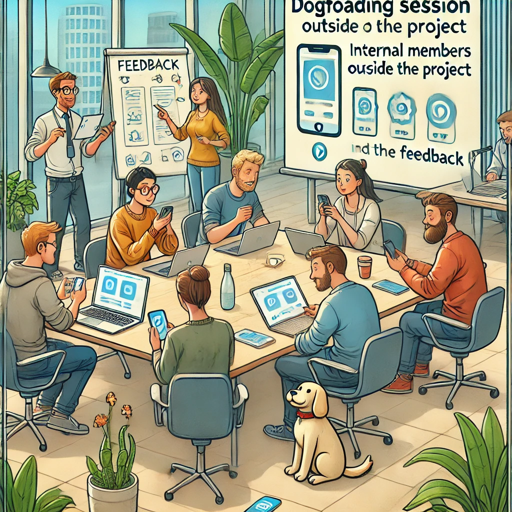

リリース前に、社内での最終チェックを行うために、ドッグフーディング期間を設けることをお勧めします。ドッグフーディングとは、開発チームが自分たちの作ったプロダクトを実際に使ってみることを指します。この期間に、開発に直接関わっていない他の社内メンバーにもアプリケーションを使ってもらい、フィードバックを収集します。

ドッグフーディング期間のメリットは以下の通りです。

1. 社内の他部署の視点からのフィードバックが得られる
2. 実際の使用感を通じて、ユーザビリティの改善点が明らかになる
3. バグや不具合の発見につながる
4. 社内メンバーのプロダクトへの理解と共感が深まる
5. リリースに向けての社内の結束とテンションが高まる

ドッグフーディング期間の設定方法は、プロダクトの規模や組織の体制によって異なりますが、一般的には1〜2週間程度が適当です。この期間中、社内メンバーには実際にアプリケーションを使ってもらい、フィードバックをまとめてもらいます。開発チームは、フィードバックをもとに、優先度の高い改善点から順次対応していきます。

ドッグフーディング期間を効果的に運用するためには、以下の点に留意しましょう。

- 参加者には、アプリケーションの目的や主要な機能について事前に説明する
- フィードバックの収集方法を明確にし、参加者に周知する（例：専用のフォームやチャットチャンネルを用意する）
- 収集したフィードバックは、開発チームで迅速に共有し、対応方針を決める
- 参加者には、フィードバックへの対応状況を適宜報告し、改善点を共有する

ドッグフーディング期間を設けることで、社内メンバーの力を結集し、より良いプロダクトを生み出すことができるでしょう。また、リリースに向けての一体感も醸成できます。

## 5.2 アプリケーションのパフォーマンス最適化


ユーザーに快適に使ってもらうためには、アプリケーションのパフォーマンスを最適化することが重要です。リリース準備では、以下のようなパフォーマンス最適化を行います。

1. メモリ使用量の最適化
   - メモリリークを防ぐために、不要になったオブジェクトを適切に解放する
   - メモリ使用量を計測し、大量のメモリを消費する箇所を特定して改善する
   - 画像など、大きなデータを扱う場合は、適切な圧縮やリサイズを行う

2. 起動時間の短縮
   - アプリケーションの起動時間が長いと、ユーザー体験が損なわれる
   - 起動時に必要な処理を最小限に抑え、バックグラウンドでの処理を活用する
   - レイアウトファイルの最適化や、コードの効率化によって起動時間を短縮する

3. バッテリー消費の抑制
   - バックグラウンドでの処理や、頻繁な通信によるバッテリー消費を抑制する
   - GPSやBluetoothなどのハードウェアセンサーの使用を最適化する
   - バッテリー消費量を計測し、消費の多い箇所を特定して改善する

4. ネットワーク通信の最適化
   - 大量のデータ通信によって、パフォーマンスが低下することがある
   - 通信データの圧縮や、キャッシュの活用によって、通信量を削減する
   - 通信エラーやタイムアウトに適切に対処し、ユーザーに適切なフィードバックを提供する

開発チームは、これらのパフォーマンス最適化を行うことで、ユーザーにとって快適で使いやすいアプリケーションを提供します。

## 5.3 セキュリティチェックとコードの保護

アプリケーションのセキュリティを確保することは、ユーザーの信頼を得るために欠かせません。リリース準備では、以下のようなセキュリティ対策を行います。


1. 脆弱性の診断
   - コードの脆弱性を自動的に検出するツールを使って、セキュリティ上の問題を洗い出す
   - SQLインジェクションやクロスサイトスクリプティングなど、代表的な脆弱性をチェックする
   - 脆弱性が見つかった場合は、適切に修正を行う

2. 機密情報の保護
   - APIキーやデータベースの認証情報など、機密情報を適切に保護する
   - 機密情報をコードに直接埋め込むことは避け、安全な方法で管理する
   - 暗号化や難読化によって、機密情報が外部から読み取られることを防ぐ

3. 通信の暗号化
   - アプリケーションとサーバー間の通信は、SSL/TLSによって暗号化する
   - 適切な証明書を使用し、中間者攻撃を防ぐ
   - 脆弱な暗号化アルゴリズムや、古いプロトコルバージョンの使用は避ける

4. コード難読化
   - リバースエンジニアリングによってコードが解析されることを防ぐために、コードの難読化を行う
   - 変数名や関数名を意味の分からない名前に変更したり、不要なコードを挿入したりすることで、コードの理解を困難にする
   - 自動的にコードを難読化するツールを活用する

開発チームは、これらのセキュリティ対策を行うことで、ユーザーの個人情報を保護し、アプリケーションへの信頼を高めていきます。

## 5.4 ユーザードキュメントの作成


アプリケーションのリリースに際しては、ユーザーがアプリケーションを適切に使用できるようにするための、ドキュメントの作成が必要です。リリース準備では、以下のようなユーザードキュメントを作成します。

1. ユーザーマニュアル
   - アプリケーションの基本的な使い方を説明するドキュメント
   - 画面の構成や、各機能の使い方を、ステップバイステップで説明する
   - スクリーンショットや図解を交えて、わかりやすく解説する

2. よくある質問（FAQ）
   - ユーザーから寄せられる、よくある質問とその回答をまとめたドキュメント
   - アプリケーションの使い方や、トラブルシューティングに関する情報を提供する
   - ユーザーが自己解決できるように、できるだけ具体的な回答を用意する

3. リリースノート
   - 新しいバージョンのアプリケーションで追加された機能や、改善された点をまとめたドキュメント
   - ユーザーに新機能を知ってもらい、アップデートを促進するために重要
   - 変更点を明確に説明し、ユーザーが混乱しないようにする

これらのユーザードキュメントは、アプリケーションの公式サイトやアプリストアの説明欄に掲載し、ユーザーがいつでも参照できるようにします。

## 5.5 ストアへの公開プロセス

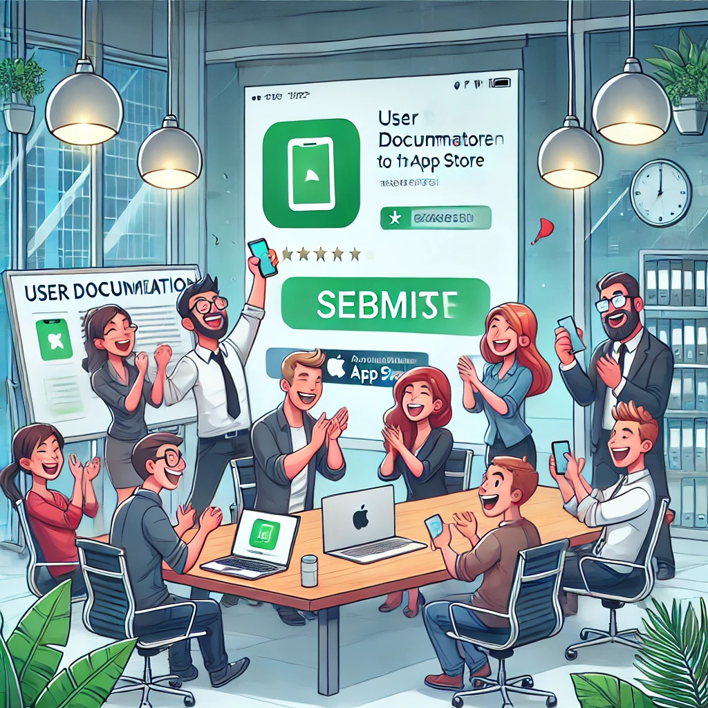

アプリケーションの開発が完了し、リリース準備が整ったら、いよいよアプリストアへの公開を行います。一般的なアプリストアへの公開プロセスは、以下のような手順で進められます。

1. 申請準備
   - アプリストアの開発者登録を行い、デベロッパーアカウントを作成する
   - アプリケーションの説明文やスクリーンショットを準備する
   - 必要なアイコンや画像を用意する

2. アプリケーションの登録
   - アプリストアのデベロッパーコンソールから、新しいアプリケーションを登録する
   - アプリケーションの基本情報や、説明文、画像などを入力する
   - 適切なカテゴリを選択し、必要に応じて年齢制限を設定する

3. バイナリファイルのアップロード
   - 開発環境で作成したアプリケーションのバイナリファイルを、デベロッパーコンソールにアップロードする
   - 必要に応じて、異なるデバイス向けの複数のバイナリファイルを用意する
   - アップロードしたバイナリファイルに、バージョン情報を設定する

4. 審査と公開
   - アップロードしたバイナリファイルは、アプリストアの審査を受ける
   - 審査では、アプリケーションがアプリストアのポリシーに準拠しているかがチェックされる
   - 審査に合格すると、アプリケーションがアプリストアで公開される

開発チームは、これらのプロセスを経て、アプリケーションをアプリストアで公開します。公開後は、ユーザーからのフィードバックに耳を傾け、継続的にアプリケーションを改善していきます。

リリース準備のフェーズでは、パフォーマンスの最適化やセキュリティ対策、ユーザードキュメントの作成など、様々なタスクが行われます。これらの作業を丁寧に行うことで、ユーザーに高品質のアプリケーションを提供することができるのです。

次の章では、リリース後のアプリケーションの運用と保守について説明します。ユーザーからのフィードバックを元に、アプリケーションを継続的に改善していく方法を見ていきましょう。

# 6. リリース後の運用と保守

リリース後のアプリケーションの運用と保守は、ユーザーに継続的に価値を提供し、アプリの成功を左右する重要なフェーズです。ここでは、クラッシュレポートやエラーログの活用、データドリブンな機能改善、サーバーサイドの運用と保守、ユーザーコミュニティの活用について説明します。

## 6.1 ユーザーフィードバックの収集と分析

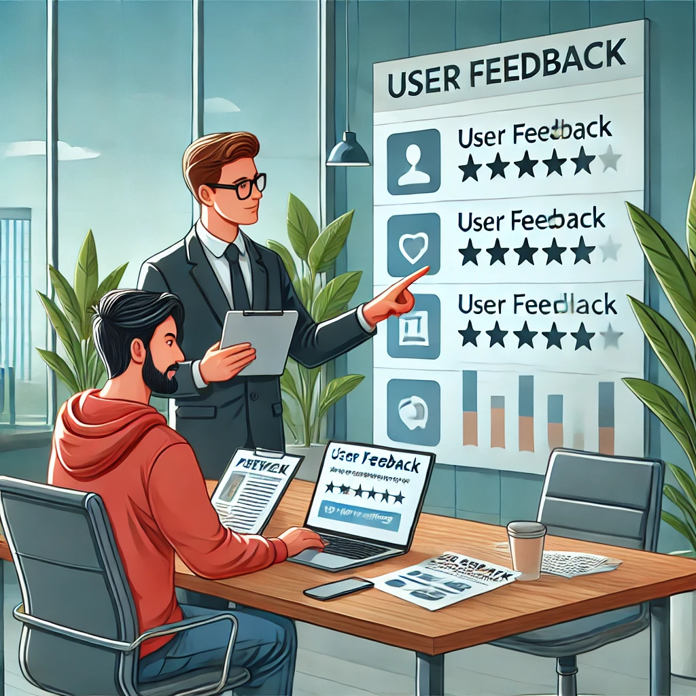

リリース後のアプリケーションを改善するために、ユーザーからのフィードバックを積極的に収集することが重要です。LinkedPalの運用では、以下のような方法でフィードバックを収集します。

1. アプリストアのレビュー
   - Google PlayやAppStoreでのユーザーレビューを定期的にチェックする
   - 評価の高いレビューと、評価の低いレビューの両方に注目する
   - レビューで挙げられた問題点や改善要望を整理し、優先順位をつける

2. ユーザーサポート
   - ユーザーからの問い合わせやサポートリクエストを丁寧に対応する
   - よくある問題や要望を分析し、FAQの更新や機能改善につなげる
   - ユーザーとのコミュニケーションを通じて、アプリケーションに対する理解を深める

3. アナリティクスツール
   - Google Analyticsなどのアナリティクスツールを導入し、ユーザーの行動を分析する
   - 画面の滞在時間や、機能の使用頻度などを計測し、ユーザーの嗜好を把握する
   - 分析結果をもとに、改善すべき点を特定する

開発チームは、これらの方法で収集したフィードバックを分析し、アプリケーションの改善に活かしていきます。

## 6.2 バグ修正とアップデートの計画


リリース後のアプリケーションには、バグ修正や新機能の追加など、継続的なアップデートが必要です。LinkedPalの運用では、以下のようなプロセスでアップデートを行います。

1. バグの優先順位付け
   - ユーザーから報告されたバグや、開発チームが発見したバグを整理する
   - バグの重大度や影響度に応じて、修正の優先順位をつける
   - 優先度の高いバグから順に、修正対応を行う

2. アップデートの計画
   - 新機能の追加や、既存機能の改善など、アップデートの内容を計画する
   - ユーザーからの要望や、市場のトレンドを考慮しながら、アップデートの方向性を決める
   - 定期的なアップデートを行うことで、ユーザーの満足度を高める

3. テストとリリース
   - アップデートした機能やバグ修正が、意図した通りに動作するかをテストする
   - リグレッションテストを行い、既存の機能に問題がないことを確認する
   - テストが完了したら、アップデート版のアプリケーションをGoogle Playで公開する

開発チームは、これらのプロセスを通じて、アプリケーションの品質を維持し、ユーザーの満足度を高めていきます。

## 6.3 機能追加とアプリケーションの継続的改善


リリース後のアプリケーションは、市場の変化やユーザーのニーズに合わせて、継続的に進化させていく必要があります。以下のような観点で、アプリケーションの改善を図るのが良いでしょう。

1. 新機能の追加
   - ユーザーからの要望や、競合アプリの動向を考慮しながら、新しい機能を企画する
   - 新機能が、アプリケーションの価値を高めるものであるかを検討する
   - 新機能の開発には、適切なリソースを割り当て、計画的に実施する

2. ユーザーインターフェースの改善
   - ユーザーの行動分析や、フィードバックをもとに、ユーザーインターフェースの改善点を洗い出す
   - 画面の構成や、ナビゲーションの流れなど、ユーザビリティを向上させる
   - デザインの一新など、大幅な変更を行う場合は、ユーザーに丁寧に説明する

3. パフォーマンスの継続的な最適化
   - リリース後も、パフォーマンスの計測と改善を継続的に行う
   - メモリ使用量やバッテリー消費など、ユーザーに影響の大きい項目に注力する
   - パフォーマンスの改善によって、ユーザーの満足度を高める

開発チームは、これらの観点でアプリケーションの継続的な改善を図ることで、ユーザーに長く愛されるアプリケーションを目指します。

LinkedInが開発した名刺管理アプリ「CardMunch」は、継続的な改善における各プレイヤーの協力の好例です。リリース後、ユーザーからのフィードバックを基に、以下のような改善が行われました。

マーケティングチームは、ユーザーインタビューや利用データの分析を通じて、ユーザーが名刺交換後のフォローアップに課題を感じていることを発見しました。この課題を解決するために、「名刺交換した相手とのコミュニケーションを促進する機能」が必要であるという仮説を立てました。

プロダクトマネージャーは、この仮説を検証するために、デザインチームとエンジニアリングチームを巻き込んでブレインストーミングを行いました。その結果、「名刺交換した相手とのメッセージ機能」と「名刺交換時の会話内容を記録する機能」の2つのアイデアが提案されました。

デザインチームは、これらのアイデアを基に、ユーザー体験を考慮した画面設計とインタラクションデザインを行いました。メッセージ機能については、LinkedInのメッセージ機能とシームレスに連携し、ユーザーがストレスなくコミュニケーションを始められるよう設計しました。また、会話内容の記録機能については、音声入力にも対応し、ユーザーの入力負荷を軽減するデザインを提案しました。

エンジニアリングチームは、これらのデザインを実装するために、LinkedInのAPIとの連携や、音声認識技術の導入などの技術的な検討を行いました。また、パフォーマンスやセキュリティにも配慮しつつ、高品質なコードを効率的に開発するために、テスト自動化や継続的インテグレーションの仕組みを整えました。

これらのプレイヤーが協力し、仮説検証と継続的な改善を重ねることで、CardMunchはリリース後もユーザーに支持され続けるアプリケーションに成長しました。メッセージ機能と会話内容の記録機能は、ユーザーの名刺交換後のフォローアップを促進し、アプリケーションの価値を大きく高めることに成功しました。

私たちもプロダクト開発にこのようなアプローチを取り入れ、リリース後の継続的な改善に取り組むことが重要です。各プレイヤーが専門性を活かしながら協力し、ユーザーのニーズに応えていくことが、アプリケーションの長期的な成功につながるでしょう。

## 6.4 チームの振り返りとレッスンラーンド


リリース後の運用を通じて得られた知見は、次のプロジェクトに活かしていくことが重要です。LinkedPalの開発チームでは、以下のようなプロセスで、プロジェクトの振り返りとレッスンラーンドを行います。

1. 振り返りミーティングの実施
   - プロジェクトの終了後、チームメンバー全員で振り返りミーティングを行う
   - プロジェクトの良かった点と、改善すべき点を出し合う
   - 個々のメンバーの成長や、チームとしての成果を共有する

2. レッスンラーンドの文書化
   - 振り返りミーティングで出た意見をもとに、レッスンラーンドを文書化する
   - プロジェクトで得られた知見や、改善点を整理する
   - 文書化された知見を、社内で共有し、他のプロジェクトでも活用できるようにする

3. 次のプロジェクトへの反映
   - レッスンラーンドで得られた知見を、次のプロジェクトの計画に反映する
   - 過去のプロジェクトの失敗を繰り返さないよう、注意する
   - 成功事例は、積極的に取り入れ、プロジェクトの成功確率を高める

開発チームは、これらのプロセスを通じて、プロジェクトの経験を組織の知見として蓄積し、継続的な改善を図っていきます。

リリース後の運用と保守は、アプリケーションの価値を高め、ユーザーの満足度を維持するために欠かせないプロセスです。ユーザーからのフィードバックを丁寧に分析し、バグ修正や機能追加、パフォーマンス改善などを継続的に行うことが重要です。

また、プロジェクトの振り返りとレッスンラーンドを行うことで、開発チームは継続的に成長していくことができます。過去の経験を活かし、より良いアプリケーションを開発していくことが、プロダクトの長期的な成功につながるでしょう。

## 6.5 クラッシュレポートとエラーログの活用

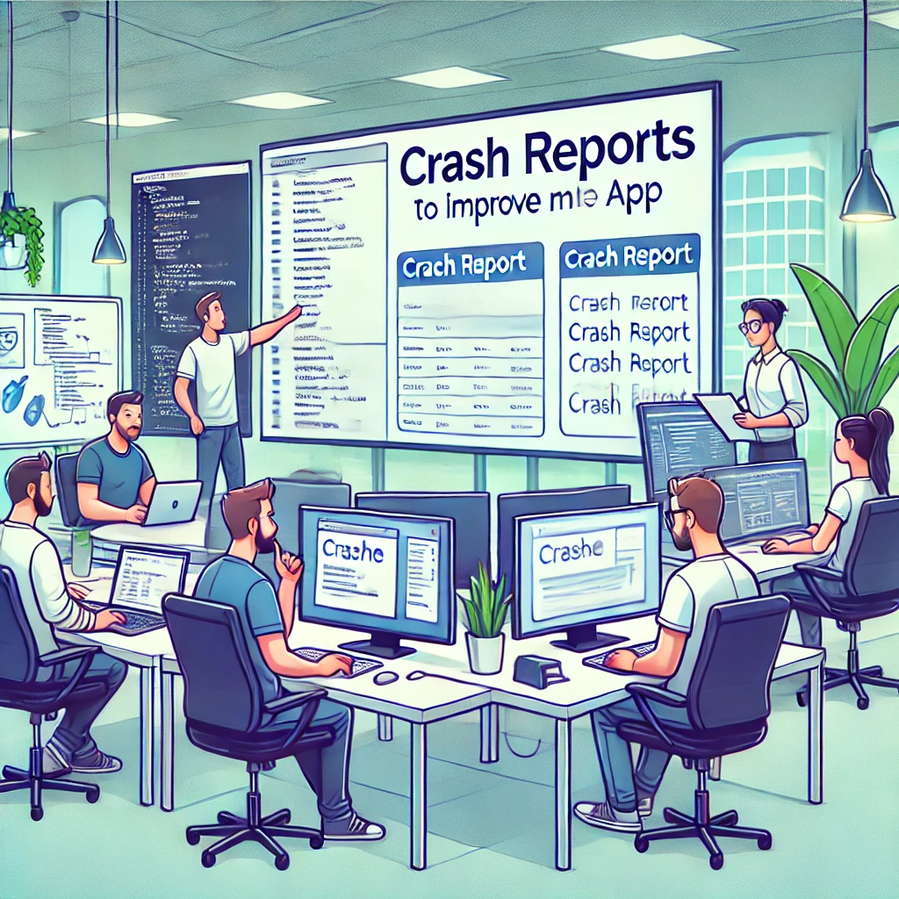

アプリのリリース後も、クラッシュレポートやエラーログを収集し分析することは、アプリの品質を維持・向上するために欠かせません。これらのデータを活用することで、バグ修正の優先順位付けや、アプリのパフォーマンス改善に役立てることができます。

クラッシュレポートの収集には、Crashlyticsなどのツールを利用するのが一般的です。これらのツールを導入することで、アプリがクラッシュした際の詳細な情報（デバイス情報、スタックトレースなど）を自動的に収集することができます。収集されたレポートを分析することで、クラッシュの原因を特定し、修正につなげることができるのです。

エラーログの収集・分析も同様に重要です。アプリの実行中に発生したエラーを記録し、定期的にレビューすることで、アプリのボトルネックを特定し、改善のための手がかりを得ることができます。エラーログの収集には、ロギングライブラリを使用したり、クラウドサービスを活用したりするのが一般的です。

クラッシュレポートやエラーログから得られる情報は、バグ修正の優先順位付けにも役立ちます。より多くのユーザーに影響を与えている問題や、重大度の高い問題から優先的に対応することで、効率的にアプリの品質を改善することができるのです。

開発チームでは、これらのデータを定期的にレビューし、アプリの品質向上に活用するのが良いでしょう。クラッシュレポートやエラーログの分析を通じて、ユーザーに安定したアプリ体験を提供することを目指しましょう。

## 6.6 データドリブンな機能改善

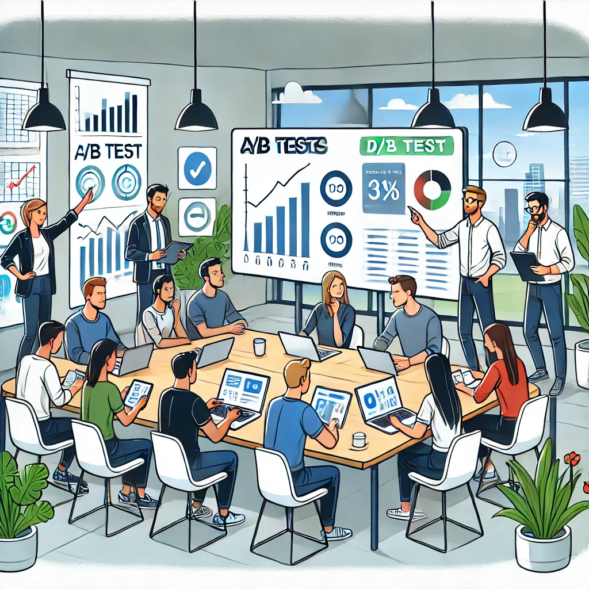

リリース後のアプリ改善において、ユーザーの行動データに基づいた意思決定は非常に重要です。A/Bテストなどの手法を用いることで、新機能のアイデアや改善案の効果を定量的に評価し、データに基づいた判断を下すことができます。

A/Bテストとは、ユーザーを無作為に2つ以上のグループに分け、それぞれに異なるバージョンの機能を提供し、その効果を比較する手法です。例えば、新しいUIデザインが、ユーザーのエンゲージメントを高めるかどうかを検証したい場合、現在のデザインと新デザインをそれぞれのグループに提供し、ユーザーの行動を分析します。クリック率や滞在時間などの指標を比較することで、新デザインの効果を定量的に評価することができるのです。

LinkedPalの開発でA/Bテストを積極的に活用し、データドリブンな意思決定を行っていくとします。例えば新しい友だち追加機能の導入を検討する際、A/Bテストを実施し、ユーザーの反応を分析します。そして、そのテスト結果をもとに、機能の改善を重ね、ユーザー満足度の向上を図ります。

また、ユーザーの行動データを分析することで、アプリの改善点を見つけ出すこともできます。例えば、特定の画面での離脱率が高い場合、その画面のユーザビリティに問題がある可能性があります。データを詳細に分析し、改善案を立案・実行することで、ユーザー体験の向上につなげることができるのです。

データドリブンな意思決定は、アプリの成長に欠かせないアプローチです。開発チームは、データ分析の専門家と連携し、ユーザーの行動を継続的に分析していくのが良いでしょう。データに基づいた機能改善を通じて、ユーザーに価値あるアプリ体験を提供し続けることを目指しましょう。

## 6.7 サーバーサイドの運用と保守


モバイルアプリの多くは、バックエンドのサーバーシステムと連携して動作します。アプリの安定運用を維持するためには、サーバーサイドの適切な運用と保守が欠かせません。

開発チームでは、以下のような取り組みを通じて、サーバーサイドの運用と保守を行っていきます。

1. 負荷対策
   - ユーザー数の増加に伴い、サーバーへのトラフィックも増加します。
   - 負荷分散やオートスケーリングなどの手法を用いて、トラフィックの変動に柔軟に対応します。
   - パフォーマンステストを実施し、ボトルネックを特定して改善を図ります。

2. セキュリティ対策
   - サーバーシステムには、常に最新のセキュリティパッチを適用し、脆弱性を解消します。
   - 定期的なセキュリティ監査を実施し、潜在的なリスクを洗い出して対策を講じます。
   - 不正アクセスやサービス妨害攻撃などのセキュリティインシデントに備え、監視と通報の体制を整えます。

3. 監視と警告
   - サーバーの稼働状況を24時間365日監視し、異常を早期に検知します。
   - CPU使用率やメモリ使用量、レスポンスタイムなどの指標を監視し、閾値を超えた場合には警告を発します。
   - 監視と警告のシステムを整備することで、問題の早期発見と迅速な対応を可能にします。

4. バックアップとリカバリ
   - 定期的なデータのバックアップを行い、データ損失のリスクに備えます。
   - 障害発生時には、バックアップからのデータリカバリを迅速に行い、サービスの復旧を図ります。
   - バックアップとリカバリの手順を明確に定義し、定期的に訓練を行います。

サーバーサイドの運用と保守は、アプリの安定稼働を支える重要な基盤です。開発チームは、運用の自動化やインフラのコード化など、効率的な運用を目指した取り組みも進めていきます。

継続的な改善を通じて、ユーザーに安心して使っていただけるアプリ基盤を提供し続けることが、プロダクトチームの使命です。

## 6.8 ユーザーコミュニティの活用

特にLinkedPalのようなソーシャルアプリにおいて、ユーザーコミュニティの存在は非常に重要です。ユーザー同士の交流を促進し、アプリへの愛着を深めてもらうことで、アプリの継続的な成長を促すことができます。

開発チームでは、以下のような取り組みを通じて、ユーザーコミュニティの活性化を図っていくのが良いでしょう。

1. 公式コミュニティの運営
   - Facebookグループや公式フォーラムなどのコミュニティプラットフォームを設置し、ユーザー同士の交流の場を提供します。
   - コミュニティマネージャーを設置し、ユーザーとの対話を通じて、要望や問題点の把握に努めます。
   - ユーザーの投稿に積極的に反応し、アプリ運営に対する信頼を高めていきます。

2. ユーザーイベントの開催
   - オフラインでのユーザーイベントを定期的に開催し、コミュニティの結束力を高めます。
   - イベントでは、アプリの新機能の紹介や、ユーザー同士の交流の場を提供します。
   - ユーザーの声を直接聞くことで、アプリ改善のためのアイデアを得ることもできます。

3. ユーザー主導のコンテンツ創出
   - ユーザー同士が協力して、面白いコンテンツを生み出せるような仕組みを用意します。
   - 例えば、共同編集可能なWikiページを設置し、ユーザーがアプリの使い方やTipsを共有できるようにします。
   - ユーザー主導のコンテンツ創出を促進することで、コミュニティの活性化と、アプリの価値向上を図ります。

4. ユーザーの声の反映
   - コミュニティから寄せられたフィードバックやアイデアを、アプリの改善に活かします。
   - ユーザーの声を反映して実現した機能や改善点は、コミュニティで積極的に共有します。
   - ユーザーの声が反映されていることを示すことで、コミュニティとの信頼関係を強化します。

開発チームは、ユーザーコミュニティをアプリ成長のための重要な原動力と位置づけています。ユーザーとの積極的な対話と協力を通じて、より魅力的で価値あるアプリへと成長させていくことを目指します。

次の章では、本書のまとめとして、モダンなモバイルアプリ開発とチーム開発のベストプラクティスについて振り返ります。

# 7. まとめ

本書では、サンプル事例としてLinkedPalアプリケーションの開発を交え、モダンなプロダクト開発とチーム開発のベストプラクティスについて学びました。ここでは、本書の内容を振り返り、重要なポイントを整理します。

## 7.1 本書で学んだ内容の振り返り

1. プロダクト開発の全体像
   - プロダクト開発は、企画、設計、開発、テスト、リリース、運用の各フェーズから成る
   - 各フェーズで、異なる専門性を持つメンバーが協力して、プロダクトを作り上げる

2. チームコラボレーションの重要性
   - プロダクト開発では、メンバー間のコミュニケーションとコラボレーションが欠かせない
   - チームメンバーの多様性を活かし、様々な視点からプロダクトを検討することが重要

3. ユーザー中心の設計
   - プロダクトの設計では、ユーザーの視点に立つことが重要
   - ペルソナを作成し、ユーザーストーリーを通じて、ユーザーの課題を理解する
   - ユーザー体験（UX）を重視し、使いやすく価値のあるプロダクトを目指す

4. 開発プロセスの改善
   - アジャイル開発などの手法を取り入れ、フィードバックを得ながら開発を進める
   - テストを重視し、品質の高いプロダクトを効率的に開発する
   - 自動化を活用し、開発作業の効率化とミスの防止を図る

5. リリース後の継続的な改善
   - リリース後も、ユーザーからのフィードバックを収集し、プロダクトを改善し続ける
   - 機能追加やパフォーマンス最適化など、ユーザーの満足度を高める取り組みが重要
   - プロジェクトの振り返りを行い、得られた知見を次のプロジェクトに活かしていく

これらの学びを通じて、読者の皆さんは、モダンなプロダクト開発に必要なスキルと知識を身につけることができたと思います。

## 7.2 今後の展望とアドバイス

プロダクト開発の世界は、常に変化し続けています。新しい技術やツール、ベストプラクティスが次々と登場する中で、プロダクト開発に関わる全ての人には、継続的な学習が求められます。

本書で学んだ内容を土台に、さらに知識を深めていくためには、以下のようなアドバイスが参考になるでしょう。

1. コミュニティへの参加
   - 自分の専門分野のコミュニティに参加し、他のメンバーと交流する
   - 勉強会やカンファレンスに参加し、最新のトレンドを追う
   - 他分野のコミュニティにも参加し、多様な視点を身につける

2. 情報収集と学習
   - 専門書や記事を読み、知識を深める
   - 他社の事例や、ユーザーの声に耳を傾け、学びを得る
   - 自分の興味のある分野に特化した知識を身につける

3. 実践的なプロジェクトへの取り組み
   - 社内外のプロジェクトに積極的に関わり、実践的なスキルを磨く
   - 新しい手法やツールに挑戦し、学びを深める
   - プロジェクトの振り返りを通じて、経験を知見に変えていく

4. チームでのコラボレーションスキルの向上
   - チームでのプロジェクトを通じて、コミュニケーションとコラボレーションのスキルを磨く
   - 他のメンバーの良い点を吸収し、自分の成長に活かす
   - チームの多様性を尊重し、互いの強みを活かし合う

プロダクト開発は、様々な専門性を持つメンバーが協力し合うことで成功に導かれます。本書で得た知識を活かし、さらなる学びを重ねていくことで、より優れたプロダクトを生み出すことができるでしょう。

## 7.3 プロダクト開発チームの強化

プロダクト開発の成功には、強力な開発チームの存在が欠かせません。メンバー一人ひとりの力を引き出し、チームとしての パフォーマンスを最大限に発揮させるためには、チームビルディングとメンバーの成長支援が重要なポイントとなります。

1. チームビルディング
   - 多様なスキルや経験を持つメンバーで構成されたチームを作ることが理想的です。
   - メンバー同士の信頼関係を築くために、コミュニケーションの機会を積極的に設けます。
   - 定期的なチームミーティングやワークショップを通じて、メンバー間の相互理解を深めていきます。
   - チーム内の役割分担を明確にし、メンバーがお互いの強みを活かし合える環境を整えます。

2. メンバーの成長支援
   - メンバー１人ひとりのスキルアップを支援する仕組みを用意します。
   - 社内勉強会や外部セミナーへの参加を奨励し、メンバーの継続的な学習を促します。
   - メンバーのスキルマップを作成し、それぞれの強みと弱みを可視化します。
   - メンバーの弱みを克服するための支援や、強みを伸ばすための機会を提供します。

3. 心理的安全性の確保
   - チームメンバーが安心して意見を言い合える環境を作ることが重要です。
   - リーダーは、メンバーの多様な意見を尊重し、オープンなコミュニケーションを促進します。
   - 失敗を恐れずにチャレンジできる風土を醸成し、メンバーの主体性を引き出します。
   - 定期的な1on1ミーティングを通じて、メンバーの不安や悩みに耳を傾けます。

4. 建設的なフィードバック
   - メンバー同士が建設的なフィードバックを交換し合える文化を作ります。
   - フィードバックは、相手の成長を促すための前向きなものであるべきです。
   - フィードバックの際は、具体的な事実に基づいて、改善案とともに伝えることが大切です。
   - 定期的なレビューの機会を設け、メンバー同士がフィードバックを交換し合います。

開発チームでは、これらの取り組みを通じて、強力なプロダクト開発チームの構築を目指すのが良いでしょう。メンバー一人ひとりが持てる力を最大限に発揮し、協力し合うことで、よりよいプロダクト開発が実現できると信じています。

## 7.4 セキュリティとプライバシー保護

今回例として示しましたLinkedPalは、ユーザーのプライバシーを守ることをプロダクトの中核的な価値として掲げています。ユーザーの個人情報を適切に保護し、セキュリティを確保することは、LinkedPalの開発において最優先の課題です。

1. セキュリティ設計と運用
   - アプリケーションの設計段階から、セキュリティを考慮した設計を行います。
   - 機密情報の暗号化、安全な通信プロトコルの採用、脆弱性対策など、多層的なセキュリティ対策を講じます。
   - 定期的なセキュリティ監査を実施し、システムの脆弱性を洗い出して改善します。
   - セキュリティインシデントに備えて、緊急時対応計画を策定し、定期的に訓練を行います。

2. プライバシー保護
   - ユーザーの個人情報を適切に取り扱うための、社内ルールを整備します。
   - 個人情報の収集は必要最小限にとどめ、利用目的を明示します。
   - ユーザーが自分の情報をコントロールできるよう、プライバシー設定を充実させます。
   - 社内の全従業員に対して、プライバシー保護の重要性を浸透させるための教育を行います。

3. コンプライアンス
   - GDPRをはじめとする、各国のプライバシー保護法規を遵守します。
   - プライバシーポリシーを明文化し、ユーザーに分かりやすく説明します。
   - 個人情報の取り扱いに関する社内体制を整備し、適切な管理を行います。
   - プライバシー保護の専門家と連携し、コンプライアンス体制の継続的な改善を図ります。

4. 啓発活動
   - セキュリティとプライバシー保護に対する意識を、社内全体で高めていきます。
   - 定期的な社内セミナーを開催し、最新のセキュリティ動向や、プライバシー保護の重要性を共有します。
   - 社内報やイントラネットを通じて、セキュリティとプライバシーに関する情報を積極的に発信します。
   - 社外のセキュリティコミュニティとも積極的に交流し、最新の知見を取り入れていきます。

開発チームは、セキュリティとプライバシー保護を、プロダクトの信頼性を支える重要な柱と位置づけ、ユーザーに安心して使っていただけるよう、継続的にセキュリティとプライバシー保護の強化に取り組んでいくことを心がける必要があります。

## 7.5 アクションプラン

本書で学んだ内容を実践に移すために、以下のようなアクションプランを提案します。

1. 短期的な取り組み（1〜3ヶ月）
   - プロダクト開発プロセスの現状を洗い出し、改善点を特定する。
   - チームメンバー全員で、アジャイル開発の基本的な考え方を学ぶ。
   - ユーザー中心の設計手法を導入し、ペルソナの作成とユーザーストーリーの作成を始める。
   - テストの自動化を進め、継続的インテグレーションの仕組みを整える。
   - クラッシュレポートやエラーログの収集と分析を始める。
   - ユーザーコミュニティの立ち上げと、ユーザーとのコミュニケーションを開始する。

2. 中期的な取り組み（3〜6ヶ月）
   - アジャイル開発の実践を本格化し、スプリントを重ねながらプロセスを改善する。
   - デザインシステムの構築を進め、UIの一貫性を高める。
   - 自動テストの対象を拡大し、リグレッションテストを自動化する。
   - A/Bテストを導入し、データドリブンな意思決定を行う。
   - セキュリティとプライバシー保護の施策を実施し、社内の意識を高める。
   - プロダクト開発チームの強化に向けて、メンバーの育成計画を立てる。

3. 長期的な取り組み（6ヶ月〜）
   - プロダクト開発プロセスの定着を図り、継続的な改善を行う。
   - 新技術の導入を検討し、プロダクトの革新を図る。
   - データ分析基盤を強化し、ユーザー行動の理解を深める。
   - セキュリティとプライバシー保護の取り組みを継続し、社内文化として根付かせる。
   - プロダクト開発チームの多様性を高め、イノベーションを促進する。
   - 他社との協業やオープンイノベーションを検討し、新しい価値の創出を目指す。

以上のようなアクションプランを、開発チームの状況に合わせてカスタマイズしていくことが重要です。一度に全てを実行するのではなく、優先順位をつけて、着実に一歩ずつ前進していくことが大切です。

定期的に進捗を振り返り、PDCAサイクルを回しながら、継続的な改善を図っていきましょう。本書で得た知識を活かし、より良いプロダクト開発を目指して、チーム一丸となって取り組んでいくことが、成功への近道となるはずです。

プロダクト開発は、様々な専門性を持つメンバーが協力し合うことで成功に導かれます。本書で得た知見を活かし、読者の皆さんが、より優れたプロダクトを生み出していくことを期待しています。

# 付録1: 用語について

- アジャイル開発
  - アジャイル開発とは、短いイテレーションを繰り返しながら、フィードバックを得て開発を進めていく手法です。
  - 代表的なアジャイル開発手法として、スクラム、エクストリームプログラミング（XP）、カンバンなどがあります。
  - アジャイル開発では、ユーザーとのコミュニケーションを重視し、変化に柔軟に対応することを目指します。
  - セルフオーガナイズドなチームを作り、メンバーの自律性を尊重することも特徴の一つです。

- デイリースクラム
  - アジャイル開発において、毎日行われる短いミーティングのこと。
  - 各メンバーが、前日の進捗、当日の予定、作業の障害となっていることを共有する。
  - 進捗状況の可視化と課題の早期発見、メンバー間の協力関係の構築を目的とする。
  - 通常15分以内に収めることが推奨されている。

- スプリントレビュー
  - スプリント（開発サイクル）の終了時に行われるミーティングのこと。
  - 開発チームがスプリントの成果物を実演し、ステークホルダーからフィードバックを得る。
  - 成果物が要求を満たしているか、市場にフィットしているかを確認する。
  - フィードバックをもとに、次のスプリントの計画を立てる。

- レトロスペクティブ
  - スプリントの終了時に行われる、開発プロセスの振り返りミーティングのこと。
  - スプリントを通して、うまくいったこと、改善すべきことを話し合う。
  - チームの作業方法の継続的な改善を目的とする。
  - 話し合いの結果を次のスプリントで実践し、PDCAサイクルを回す。

- リーンスタートアップ
  - リーンスタートアップとは、新しいプロダクトやサービスを開発する際の方法論です。
  - 仮説検証のサイクルを高速で回すことで、市場のニーズに合ったプロダクトを素早く開発することを目指します。
  - MVPを作成し、早期にユーザーからのフィードバックを得ることを重視します。
  - ピボットの概念を取り入れ、仮説が間違っていた場合は方向転換することも厭いません。

- プロダクト開発の各ロール
  - プロダクトマネージャー
    - プロダクトのビジョンと戦略を定め、開発チームを導くリーダーです。
    - ユーザーのニーズを理解し、プロダクトのロードマップを策定します。
    - エンジニアリングチームだけでなく、他部門とのコミュニケーションも担います。
    
  - デザイナー
    - ユーザー体験（UX）とユーザーインターフェース（UI）の設計を担当します。
    - ユーザー調査やペルソナの作成を通じて、ユーザーの課題を理解します。
    - プロトタイプを作成し、ユーザーテストを実施してデザインを洗練させます。

  - エンジニア
    - プロダクトの実装を担当します。
    - アーキテクチャ設計、コーディング、テスト、デプロイなど、開発全般を担います。
    - 新しい技術の導入を検討し、プロダクトの品質向上を図ります。

- アクセシビリティ
  - アクセシビリティとは、誰もがプロダクトを使いやすくするための設計指針です。
  - 視覚障害者、聴覚障害者、運動機能障害者など、様々な障害を持つユーザーに配慮します。
  - 色のコントラストやフォントサイズ、キーボードでの操作性など、多様な観点から設計を行います。
  - WAI-ARIAなどの標準規格に準拠し、支援技術との互換性を確保することも重要です。

# 付録2: チェックリストなど

### プロダクト開発のチェックリスト
  - 企画フェーズ
    - [ ] プロダクトのビジョンと目的を明確にする
    - [ ] ターゲットユーザーを特定し、ペルソナを作成する
    - [ ] 競合分析を行い、差別化要因を明確にする
    - [ ] プロダクトの主要な機能を定義する
    - [ ] MVPの範囲を決定する
    - [ ] 事業の成立性を検証し、収支計画を作成する
    - [ ] プロジェクトのスケジュールとマイルストーンを設定する
    
  - 設計フェーズ
    - [ ] ユーザーストーリーとユースケースを作成する
    - [ ] 情報設計とワイヤーフレームを作成する
    - [ ] UIデザインとプロトタイプを作成する
    - [ ] 技術的な実現可能性を検討し、アーキテクチャ設計を行う
    - [ ] 非機能要件（パフォーマンス、セキュリティ、互換性など）を定義する
    - [ ] データ設計とAPI設計を行う
    - [ ] 開発環境とツールを選定する

  - 開発フェーズ
    - [ ] タスクを詳細化し、優先順位をつける
    - [ ] コーディング規約を定め、品質を確保する
    - [ ] ユニットテストと結合テストを実施する
    - [ ] 自動ビルドとデプロイの仕組みを整える
    - [ ] コードレビューを行い、品質を高める
    - [ ] 開発の進捗を管理し、遅延リスクに対処する
    - [ ] 技術的な課題や障害を適切に管理する

  - リリースフェーズ
    - [ ] ここまで開発に関わっていなかったメンバーも巻き込みドッグフーディングを行う
    - [ ] 受け入れテストを実施し、リリース判定を行う
    - [ ] リリース手順を確認し、リリース作業を実施する
    - [ ] ユーザーマニュアルとリリースノートを整備する
    - [ ] カスタマーサポートの体制を整える
    - [ ] リリース後のフィードバック収集の仕組みを用意する
    - [ ] 緊急時の対応計画を策定する
    - [ ] リリース後の広報・プロモーション計画を立てる

  - 運用・保守フェーズ
    - [ ] 障害監視と対応の体制を整備する
    - [ ] 定期的なメンテナンスとアップデートを実施する
    - [ ] ユーザーからのフィードバックを収集し、改善につなげる
    - [ ] データ分析に基づいて、機能改善を検討する
    - [ ] セキュリティ脆弱性の監視と対応を行う
    - [ ] サービスのスケーラビリティを確保し、負荷変動に対処する
    - [ ] 運用コストの最適化を図る

※プロダクトの特性や開発体制によって、チェック項目の重要度は変わってくるので、自社の状況に合わせてカスタマイズすることが大切です。このチェックリストを基本としつつ、プロジェクトごとに適切な項目を追加・修正していくとよいでしょう。

### よく使われるツールとサービス
  - プロジェクト管理ツール
    - Trello
    - Asana
    - Jira
    - GitHub Projects
  - コミュニケーションツール
    - Slack
    - Microsoft Teams
    - Discord
    - Zoom
  - デザインツール
    - Figma
    - Sketch
    - Adobe XD
    - InVision
  - 開発ツール
    - Android Studio
    - Xcode
    - Visual Studio Code
    - GitHub
    - GitLab
    - Bitbucket
  - テストツール
    - Appium
    - Selenium
    - Espresso
    - JUnit
    - XCTest
  - アナリティクスツール
    - Google Analytics
    - Firebase
    - Mixpanel
    - Amplitude

### プロダクト開発の振り返りシート

プロジェクト名： 

日付： 


1. Keep（継続すべきこと）
   - プロジェクトの中で、うまくいっていると感じること、続けるべきことを書き出してください。
   - 例：毎日のスタンドアップミーティングは、情報共有に役立っている。

2. Problem（改善すべきこと）
   - プロジェクトの中で、課題や改善点だと感じることを書き出してください。
   - 例：コードレビューのプロセスに時間がかかりすぎている。

3. Try（新しく試してみること）
   - プロジェクトの改善のために、新しく試してみたいアイデアを書き出してください。
   - 例：ペアプログラミングを導入し、コードの品質を高める。

4. 象（みんなが知っている真実）
   - プロジェクトの中で、誰もが感じているが、なかなか口に出せないことを書き出してください。
   - 例：新しい技術の導入に時間がかかりすぎている。

5. 死んだ魚（早めに対処すべき問題）
   - 放置すると、プロジェクトに悪影響を及ぼしそうな問題を書き出してください。
   - 例：テストの自動化が進んでおらず、リグレッションリスクが高い。

6. 嘔吐（ぶっちゃけ）
   - プロジェクトについて、普段言えないことを自由に書き出してください。
   - 例：デザインの決定プロセスに、エンジニアの意見が反映されていない。

このシートを定期的に（例えばスプリントのレトロスペクティブなどで）チームメンバー全員で埋めて共有することで、プロジェクトの課題や改善点を洗い出し、より良い開発プロセスを作っていくことができるでしょう。

#### 振り返りシートの活用におけるベストプラクティス

1. 個別での意見収集
   - 振り返りシートは、まず各メンバーが個別に記入することをおすすめします。他人の意見に影響されずに、自分の考えを率直に書き出すことが大切です。
   - 個別で記入した後、シートを持ち寄って共有するようにしましょう。

2. 全員での共有と議論
   - 個別に記入したシートを全員で共有し、記載内容について議論します。
   - 共通する意見や、異なる視点からの意見に着目し、活発な意見交換を行いましょう。
   - 議論の際は、批判的になりすぎないように注意が必要です。建設的な提案や、解決策の探索に重点を置くことが大切です。

3. TODOの明確化
   - 振り返りで出た意見を基に、具体的なTODO（改善のための行動）を明確にしていきます。
   - 「何を」「いつまでに」「誰が」行うのかを明確にし、実行可能な形で落とし込みましょう。
   - TODOは優先順位をつけ、重要度の高いものから着手するようにします。

4. 定期的な振り返りの実施
   - 振り返りは、一度きりではなく、定期的に実施することが重要です。
   - プロジェクトの節目（スプリントの終了時など）に合わせて、定期的に振り返りを行いましょう。
   - 継続的な改善のサイクルを回すことで、プロジェクトを常に良い方向に導くことができます。

5. ファシリテーターの役割
   - 振り返りの場では、ファシリテーターの存在が重要です。
   - ファシリテーターは、全員が平等に発言できる環境を作り、建設的な議論を促進する役割を担います。
   - 議論が脱線したり、感情的になったりしないよう、適切にコントロールすることが求められます。

これらのベストプラクティスを踏まえて、振り返りシートを活用することで、プロジェクトの改善につなげることができるでしょう。振り返りは、チームの成長とプロジェクトの成功に欠かせないプロセスです。

定期的な振り返りを通じて、チームメンバー同士の理解を深め、より良いコラボレーションを実現していきましょう。振り返りで得られた気づきを、次のアクションにつなげていくことが大切です。

本書で提示した振り返りシートとベストプラクティスが、読者の皆さんのプロジェクトにおける継続的改善の一助となれば幸いです。