# Azure OpenAI API等の利用に際して監査ログ等の整備が求められるような企業におけるシステム構成に関する一考察

Azure OpenAI APIのエンドポイントを金融系の企業等に向けて構築する際には、高いセキュリティ、スケーラビリティ、データの蓄積・管理が重要な要件となります。
以下は、1万程度の同時接続を見込んだアーキテクチャです。

## アーキテクチャの概要

1. **Azure OpenAI API エンドポイント**
   - Azure OpenAI APIを利用して、リクエストに対して応答を生成します。
   - Azure Private Linkを使用して、仮想ネットワーク内のプライベートエンドポイントを介してサービスにアクセスします。

2. **API Gateway**
   - Azure API Managementを利用して、全てのリクエストを管理します。
   - 認証、認可、レート制限、キャッシング、リクエスト/レスポンスのロギングなどを設定します。
   - OAuth 2.0とAzure ADを用いたアクセストークンベースの認証・認可を行います。
   - Multi-Factor Authentication (MFA)を必須とします。

3. **ロードバランサー**
   - Azure Front Doorを使用して、グローバルなロードバランシングを行います。
   - Azure Load Balancerを利用して、リージョン内でのトラフィック分散を行います。

4. **Webアプリケーション層**
   - Azure App ServiceやAzure Kubernetes Service (AKS) を使用して、スケーラブルなWebアプリケーションをホスティングします。
   - 複数のインスタンスやレプリカを配置し、高可用性を確保します。
   - WebアプリケーションはAPIリクエストを処理し、Azure OpenAI APIに対してリクエストを送信し、レスポンスを取得します。

5. **メッセージキュー**
   - Azure Service Busを使用して、リクエストおよびレスポンスの処理を非同期で行い、システムのスケーラビリティと回復性を向上させます。

6. **データストレージ**
   - Azure Blob Storageを使用して、バイナリデータを効率的に保存します。
   - 保存時の暗号化（SSE）とクライアント側の暗号化を実装します。
   - Azure Data Lake Storage Gen2を使用して、ログデータを格納し、分析ワークロードに対応します。

7. **セキュリティ＆アクセス管理**
   - Azure Active Directoryを使用して、認証と認可を管理します。
   - Azure Key Vaultを使用して、暗号化キー、APIキー、シークレットを安全に管理します。
   - Azure Firewallや、サービスエンドポイント、ネットワークセキュリティグループ（NSG）を活用し、ネットワークレベルのセキュリティを強化します。

8. **監視＆ログ管理**
   - Azure MonitorとAzure Log Analyticsを使用して、システム全体のメトリクスとログを収集、分析します。
   - Azure Sentinelを使用して、セキュリティ関連のイベントを集約し、脅威の検出と対応を行います。
   - APIリクエストとレスポンス、ユーザーアクションの監査ログを収集し、コンプライアンス要件に対応します。

9. **コンプライアンス管理**
   - Azure Policyを使用して、Azure リソースがコンプライアンス要件に準拠しているかを継続的に評価し、強制します。
   - Azure Blueprintsを使用して、環境の一貫したデプロイと管理を行います。

10. **バッチ処理の自動化**
    - Azure Data Factoryを使用して、ユーザーアカウントの一括作成などのバッチ処理を自動化し、監視します。
    - 入力データのバリデーションとサニタイズを徹底し、不正なデータの流入を防止します。

ここでは、セキュリティ、コンプライアンス、可用性、監視、自動化の側面に重点を置いています。これにより、金融機関の厳しい要件に対応しつつ、Azure OpenAI APIを安全かつ効率的に利用できるエンドポイントを提供できると考えます。

## システム全体構成図
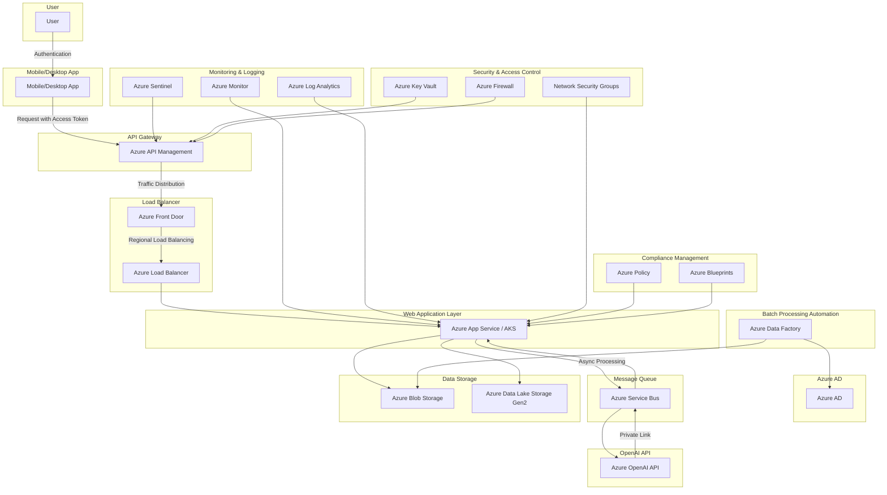

### フローの例

1. ユーザーがデスクトップアプリまたは別の部署のWebアプリケーションからリクエストを送信します。
2. リクエストはAPI Gatewayに到達し、認証と認可が行われます。
3. 認可されたリクエストはロードバランサーによってWebアプリケーション層に分散されます。
4. Webアプリケーションはメッセージキューを使用してリクエストを非同期で処理し、Azure OpenAI APIにリクエストを送信します。
5. Azure OpenAI APIからのレスポンスを受け取った後、Webアプリケーションはレスポンスを処理し、バイナリデータをAzure Blob Storageに保存します。
6. 保存されたデータの情報を含むレスポンスがユーザーに返されます。
7. 全ての操作はAzure MonitorとAzure Log Analyticsによって監視され、必要に応じてアラートが発生します。

### スケーラビリティのポイント

- **Azure App ServiceまたはAKS** を使用することで、負荷に応じてスケールアウト/スケールインが可能です。
- **メッセージキュー** を使用することで、リクエスト処理のボトルネックを回避します。
- **API Gateway** と **ロードバランサー** の設定を最適化することで、高負荷環境でも安定したパフォーマンスを実現します。

この構成により、セキュアかつスケーラブルなAzure OpenAI APIのエンドポイントを構築し、要件を満たすことが可能です。

まず、前提としてユーザーは社内ネットワーク向けのIDは所有しているものの、Azure AD向けのIDは所有していない、というような企業における運用を見据えて、希望したユーザーにAzure ADのアカウントを払い出すフローから、アクセストークンを使用してAPIを利用するまでのライフサイクルを含む全体のフローを示していくことにします。

### 全体のライフサイクルフロー

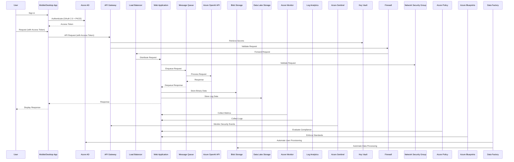

### 1. ユーザープロビジョニングプロセスのフロー

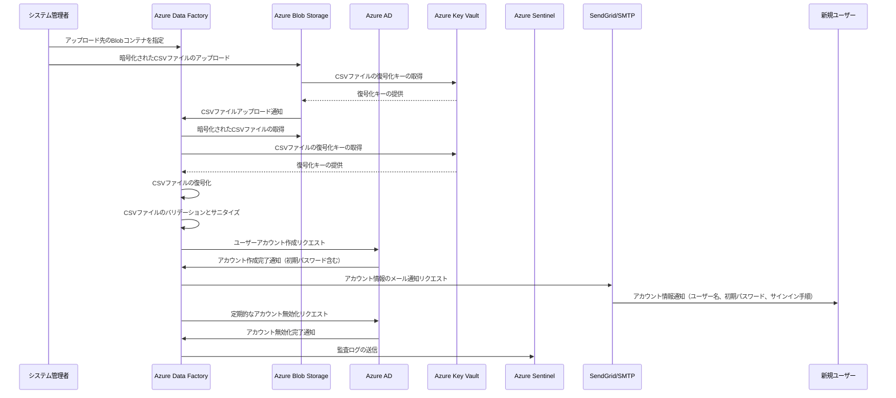

このフローでは、以下の点が特に重要です。

1. **CSVファイルの暗号化**: システム管理者はCSVファイルを暗号化してからBlobストレージにアップロードします。暗号化キーはAzure Key Vaultで管理されます。

2. **データの検証とサニタイズ**: Azure Data Factoryは、CSVファイルを復号化した後、データのバリデーションとサニタイズを行います。これにより、不正なデータの流入を防ぎます。

3. **監査ログの生成**: ユーザープロビジョニングのプロセス全体を通して、監査ログが生成されAzure Sentinelに送信されます。これにより、プロセスの透明性が確保され、異常な動作を検知できます。

4. **自動化された処理**: CSVファイルのアップロードから、ユーザーアカウントの作成、通知、無効化まで、Azure Data Factoryを使用して自動化されています。これにより、手動のエラーを減らし、効率性を高めます。

5. **セキュリティの強化**: 暗号化、Key Vault、データの検証、監査ログなどの機能により、プロセス全体のセキュリティが強化されています。

### 詳細なプロセスフロー

### 1. CSVファイルの準備とアップロード

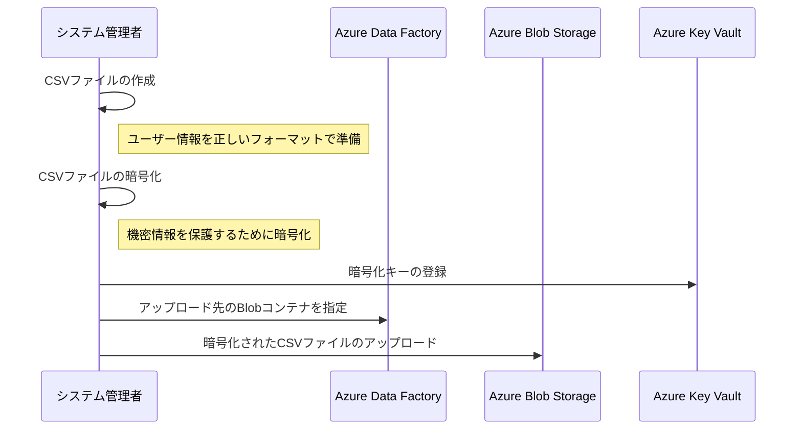

注意点:
- CSVファイルのフォーマットを正しく定義し、システム管理者に周知する
- 機密情報を含むCSVファイルは必ず暗号化する
- 暗号化キーは安全に管理し、アクセス制御を適切に設定する

### 2. CSVファイルの検証と処理

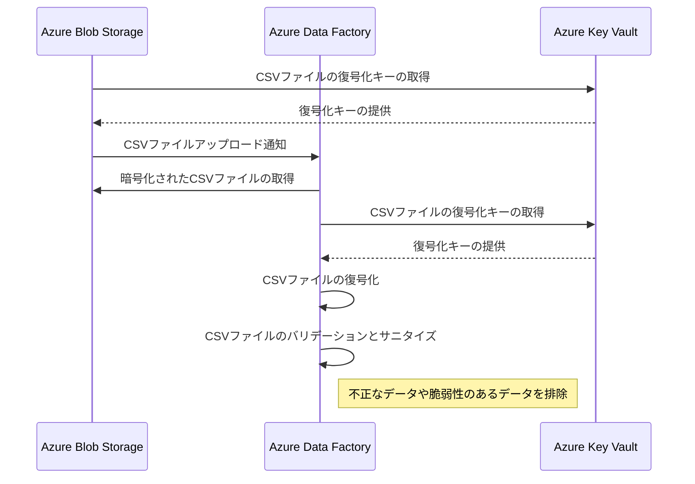

注意点:
- BlobストレージとData Factoryの間の通信は、セキュアな方法（HTTPS、仮想ネットワーク内の通信など）で行う
- 復号化キーの取得には適切な認証と認可を設定する
- バリデーションとサニタイズのルールを明確に定義し、定期的に見直す

### 3. ユーザーアカウントの自動作成と通知

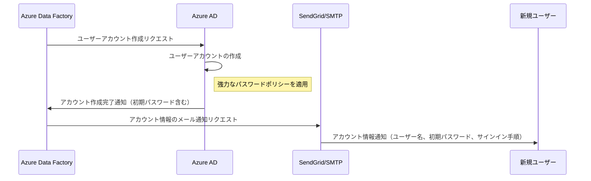

注意点:
- ユーザーアカウントの作成時に、強力なパスワードポリシーを適用する
- 初期パスワードは、ユーザーが初回サインイン時に変更するよう設定する
- メールによる通知は、セキュアな方法（TLS暗号化など）で行う

### 4. アカウントの無効化と監査ログの生成

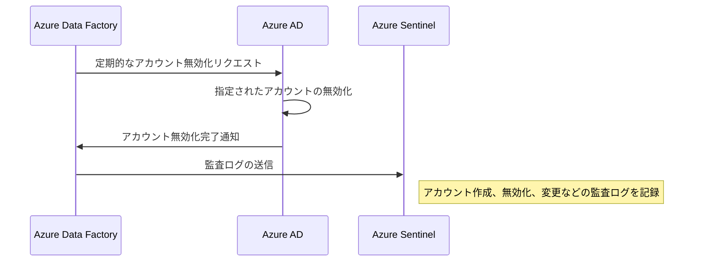

注意点:
- アカウントの無効化は、組織のポリシーに基づいて定期的に行う
- 無効化の基準を明確に定義し、例外処理のプロセスも用意する
- 監査ログは、不正アクセスや異常な動作の検知に役立てる

### 5. プロセス全体の自動化と監視

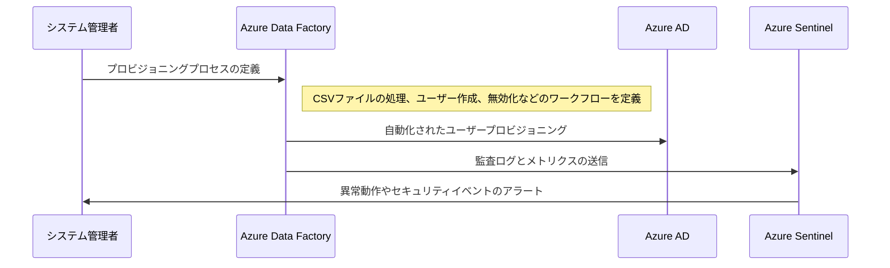

注意点:
- 自動化されたワークフローは、定期的に見直し、改善する
- 監視および監査の仕組みを導入し、セキュリティ上の問題をいち早く検知する
- 監査ログやメトリクスは、適切な期間保持し、定期的にレビューする

このように、ユーザープロビジョニングのプロセスにおいては、セキュリティ、コンプライアンス、効率性、監視の観点から、様々な注意点があります。これらを適切に設計・実装し、継続的に改善していくことが重要です。

### 2. 払い出されたAzure ADのアカウントを使ってユーザーが自分のアクセストークンを取得するフロー

### 1. ユーザー認証の開始

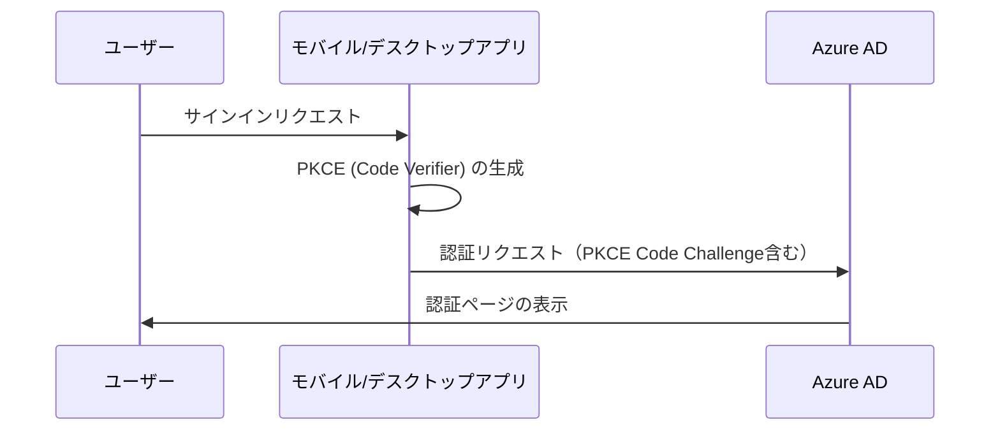

注意点:
- PKCEを使用して、認可コードグラントフローのセキュリティを強化する
- リダイレクトURIのホワイトリストを適切に管理する

### 2. ユーザーの認証と認可

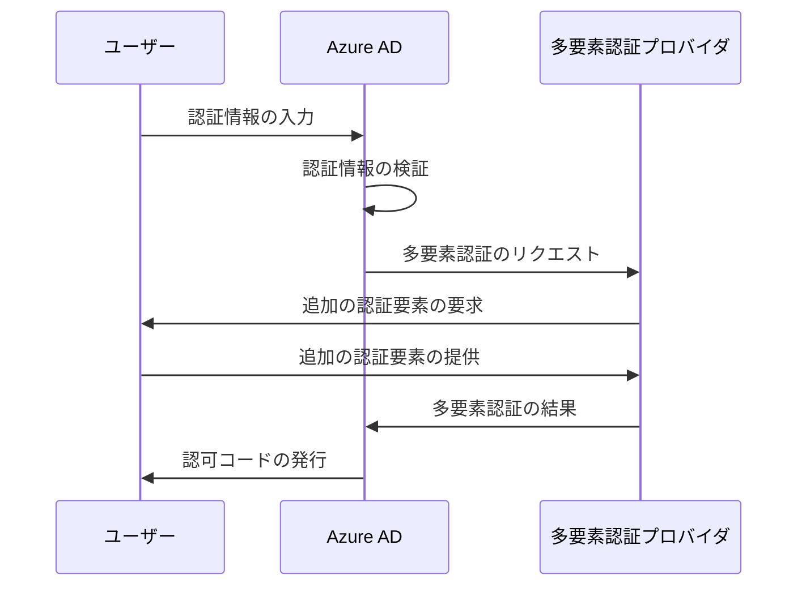

注意点:
- 多要素認証（MFA）を必須とし、セキュリティを強化する
- 認証に使用する要素（生体認証、ハードウェアキーなど）を適切に選択する

### 3. アクセストークンの取得

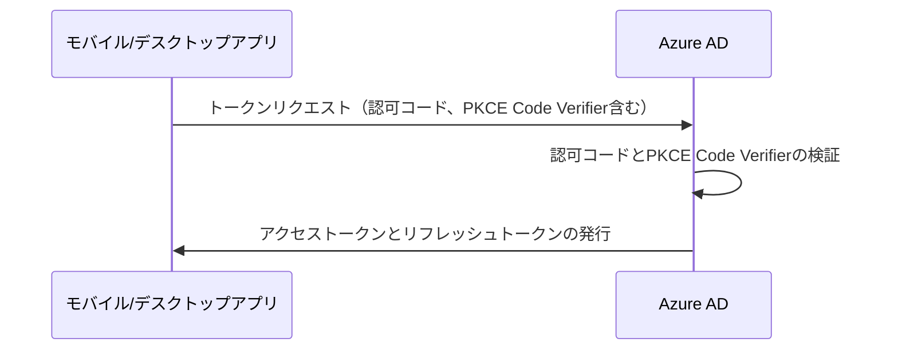

注意点:
- アクセストークンの有効期間を短く設定し、リフレッシュトークンを使用して定期的に更新する
- リフレッシュトークンの有効期間とローテーションポリシーを適切に設定する

### 4. アクセストークンの利用とセキュアな保存

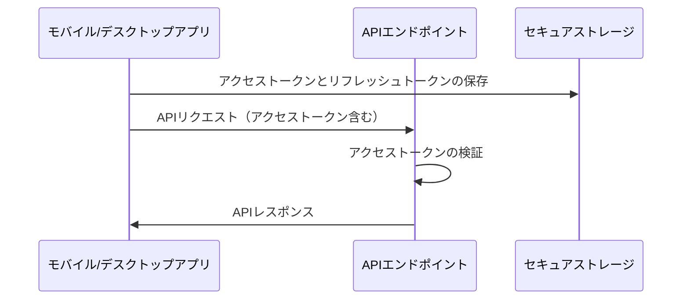

注意点:
- アクセストークンとリフレッシュトークンは、セキュアストレージ（KeychainやSecure Storageなど）に保存する
- アクセストークンを使用するすべての通信はHTTPS経由で行う

### 5. ログアウトとトークンの失効

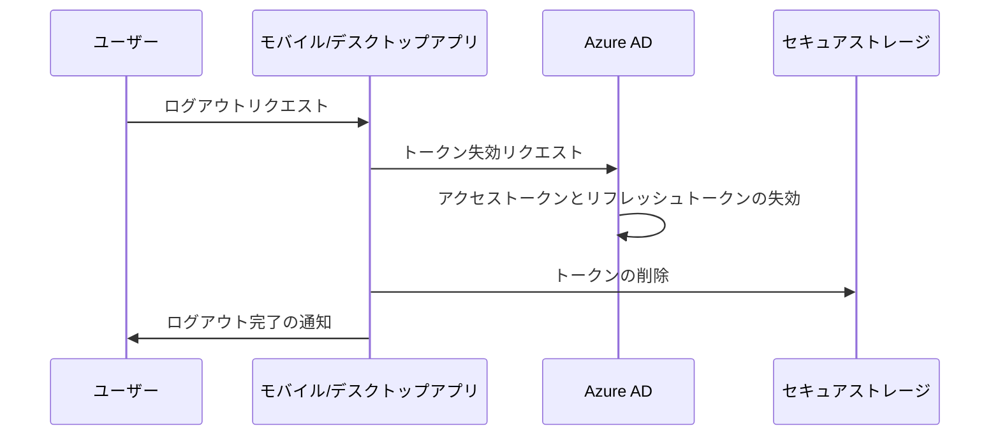

注意点:
- ログアウト時には、Azure ADでトークンを確実に失効させる
- アプリケーション側でもトークンを削除し、不正利用を防ぐ

このフローでは、PKCEを用いたセキュアな認可コードグラントフロー、多要素認証、トークンのセキュアな保存と利用、適切なログアウト処理など、セキュリティとユーザビリティの両面から重要な点が強調されています。

#### 具体的な実装例

以下に、Python を用いた OAuth 2.0 の認可コードグラントフロー（PKCE）とAPIリクエストの例を示します。

```python
import requests
import json
import secrets
import hashlib
import base64

# PKCE のコードベリファイアとチャレンジを生成
def generate_pkce_codes():
    code_verifier = secrets.token_urlsafe(32)
    code_challenge = base64.urlsafe_b64encode(
        hashlib.sha256(code_verifier.encode()).digest()
    ).rstrip(b'=').decode('utf-8')
    return code_verifier, code_challenge

# 認証リクエストのための URL を構築
def build_auth_url(client_id, redirect_uri, code_challenge):
    auth_url = f"https://login.microsoftonline.com/{tenant_id}/oauth2/v2.0/authorize?client_id={client_id}&response_type=code&redirect_uri={redirect_uri}&scope=openid%20profile%20offline_access&code_challenge={code_challenge}&code_challenge_method=S256"
    return auth_url

# トークンリクエスト
def request_tokens(auth_code, redirect_uri, client_id, code_verifier):
    token_url = f"https://login.microsoftonline.com/{tenant_id}/oauth2/v2.0/token"
    headers = {"Content-Type": "application/x-www-form-urlencoded"}
    data = {
        "grant_type": "authorization_code",
        "client_id": client_id,
        "code": auth_code,
        "redirect_uri": redirect_uri,
        "code_verifier": code_verifier
    }
    response = requests.post(token_url, headers=headers, data=data)
    return response.json()

# APIリクエスト
def call_api(access_token):
    api_url = "https://api.example.com/resource"
    headers = {"Authorization": f"Bearer {access_token}"}
    response = requests.get(api_url, headers=headers)
    return response.json()

# メインの処理フロー
def main():
    client_id = "your_client_id"
    redirect_uri = "your_redirect_uri"
    
    # PKCE コードの生成
    code_verifier, code_challenge = generate_pkce_codes()
    
    # 認証リクエストの URL 構築と表示
    auth_url = build_auth_url(client_id, redirect_uri, code_challenge)
    print(f"以下の URL にアクセスして認証を行ってください：\n{auth_url}")
    
    # 認可コードの入力
    auth_code = input("認可コードを入力してください：")
    
    # トークンのリクエスト
    token_response = request_tokens(auth_code, redirect_uri, client_id, code_verifier)
    access_token = token_response["access_token"]
    refresh_token = token_response["refresh_token"]
    
    # APIのコール
    api_response = call_api(access_token)
    print(f"APIレスポンス：\n{api_response}")

if __name__ == "__main__":
    main()
```

### セキュリティの考慮点

- **多要素認証（MFA）の適用**：ユーザー認証時に多要素認証を必須とすることで、不正アクセスのリスクを大幅に減らすことができます。
- **トークンのセキュアな保存**：アクセストークンとリフレッシュトークンは、Keychainや Secure Storage などのセキュアストレージに保存し、不正アクセスから保護する必要があります。
- **最小権限の原則の適用**：アクセストークンに付与するスコープ（権限）は、アプリケーションが必要とする最小限のものに留めるべきです。
- **トークンの定期的な更新**：アクセストークンの有効期間を短く設定し、リフレッシュトークンを使って定期的に新しいアクセストークンを取得することが推奨されます。
- **ログアウト時のトークン失効**：ユーザーがログアウトした際には、Azure AD 上でトークンを確実に失効させ、不正利用を防ぐ必要があります。

これらの点に注意しながら、セキュアなトークン管理とAPI利用の仕組みを実装することが重要です。

また、コード例で示したように、PKCE を用いた認可コードグラントフローを採用することで、クライアントシークレットを持たないネイティブアプリケーションにおいてもセキュリティを高く保つことができます。

実際のアプリケーション開発においては、ここで示した原則とベストプラクティスを踏まえつつ、利用シーンや要件に合わせて適切な実装を行っていく必要があります。セキュリティは常に最優先事項の一つとして捉え、定期的な見直しと改善を続けていくことが大切です。

### アクセストークンの払い出しについて

アクセストークンの払い出しについては、モバイルアプリやデスクトップアプリにおけるセキュリティとユーザビリティの確保が重要です。以下に、主要な考慮点と対策を示します。

### モバイルアプリ・デスクトップアプリへのアクセストークン払い出しの考慮点

1. **セキュアストレージの利用**
   - アクセストークンとリフレッシュトークンは、セキュアストレージに保存する必要があります。
   - iOS: Keychain Services API を利用
   - Android: AndroidX Security Library の EncryptedSharedPreferences を利用
   - Windows: Data Protection API（DPAPI）を利用
   - macOS: Keychain Services API を利用
   - Linux: libsecret を利用

2. **PKCE（Proof Key for Code Exchange）の利用**
   - 認可コードグラントフローにおいて、PKCE を利用することで、認可コードの盗用リスクを軽減できます。
   - PKCE は、クライアントシークレットを持たないネイティブアプリケーションにおけるセキュリティ対策として有効です。

3. **アクセストークンの有効期間**
   - アクセストークンの有効期間は、可能な限り短く設定します。
   - 有効期間が切れたアクセストークンは、リフレッシュトークンを用いて更新します。

4. **リフレッシュトークンの管理**
   - リフレッシュトークンは、アクセストークンよりも長い有効期間を持ちますが、定期的なローテーションが推奨されます。
   - リフレッシュトークンの有効期限が切れた場合は、ユーザーに再認証を求める必要があります。

5. **セキュアな通信**
   - アクセストークンの送受信は、常に HTTPS を使用して暗号化します。
   - モバイルアプリでは、証明書ピンニングを実装することで、中間者攻撃のリスクを軽減できます。

6. **ログアウト時のトークン失効**
   - ユーザーがログアウトした際には、Azure AD 上でアクセストークンとリフレッシュトークンを失効させる必要があります。
   - アプリケーション側でもトークンを安全に削除し、不正利用を防ぎます。

### アクセストークン払い出しの具体例（Python）

以下に、Python を用いた PKCE 対応の認可コードグラントフローの例を示します。

```python
import requests
import secrets
import hashlib
import base64

# PKCE のコードベリファイアとチャレンジを生成
def generate_pkce_codes():
    code_verifier = secrets.token_urlsafe(32)
    code_challenge = base64.urlsafe_b64encode(
        hashlib.sha256(code_verifier.encode()).digest()
    ).rstrip(b'=').decode('utf-8')
    return code_verifier, code_challenge

# 認証リクエストのための URL を構築
def build_auth_url(tenant_id, client_id, redirect_uri, code_challenge):
    auth_url = f"https://login.microsoftonline.com/{tenant_id}/oauth2/v2.0/authorize?client_id={client_id}&response_type=code&redirect_uri={redirect_uri}&scope=openid%20profile%20offline_access&code_challenge={code_challenge}&code_challenge_method=S256"
    return auth_url

# トークンリクエスト
def request_tokens(tenant_id, client_id, redirect_uri, auth_code, code_verifier):
    token_url = f"https://login.microsoftonline.com/{tenant_id}/oauth2/v2.0/token"
    headers = {"Content-Type": "application/x-www-form-urlencoded"}
    data = {
        "client_id": client_id,
        "grant_type": "authorization_code",
        "code": auth_code,
        "redirect_uri": redirect_uri,
        "code_verifier": code_verifier
    }
    response = requests.post(token_url, headers=headers, data=data)
    return response.json()
```

この例では、以下の流れでアクセストークンを取得します。

1. `generate_pkce_codes` 関数で、PKCE のコードベリファイアとチャレンジを生成します。
2. `build_auth_url` 関数で、認証リクエストのための URL を構築します。この URL にはコードチャレンジが含まれます。
3. 構築された URL にユーザーをリダイレクトし、認証と認可を行います。
4. 認可サーバから認可コードを取得します。
5. `request_tokens` 関数で、認可コードとコードベリファイアを使用してトークンをリクエストします。

取得したアクセストークンとリフレッシュトークンは、セキュアストレージに安全に保存する必要があります。また、アクセストークンの有効期限が切れた場合は、リフレッシュトークンを使用して新しいアクセストークンを取得します。

### まとめ

モバイルアプリやデスクトップアプリにおけるアクセストークンの払い出しでは、セキュリティとユーザビリティのバランスを取ることが重要です。PKCE を利用した認可コードグラントフロー、セキュアストレージの活用、適切なトークン管理など、セキュリティのベストプラクティスに従いながら、ユーザーにとって使いやすい認証・認可フローを実現することが求められます。

また、アプリケーションのライフサイクル全体を通して、セキュリティの継続的な改善とモニタリングが不可欠です。新しい脅威や脆弱性が発見された場合には、迅速に対応策を講じる必要があります。

セキュリティは常に最優先事項の一つとして捉え、ユーザーの信頼を獲得・維持するための取り組みを続けていくことが、モバイルアプリやデスクトップアプリの成功には欠かせません。

### 3. アクセストークンを使ってユーザーがAPIを利用し始める際のフロー

ユーザーがアプリケーションにサインインし、アクセストークンを取得した後は、そのトークンを使用してAzure OpenAI APIへのアクセスを行うことになります。アプリケーション内でのトークンの保存は、プラットフォームごとのベストプラクティスに従って、セキュアに行われる必要があります。

以下に、アクセストークンを使ってユーザーがAPIを利用し始める際のフローを詳細に説明します。

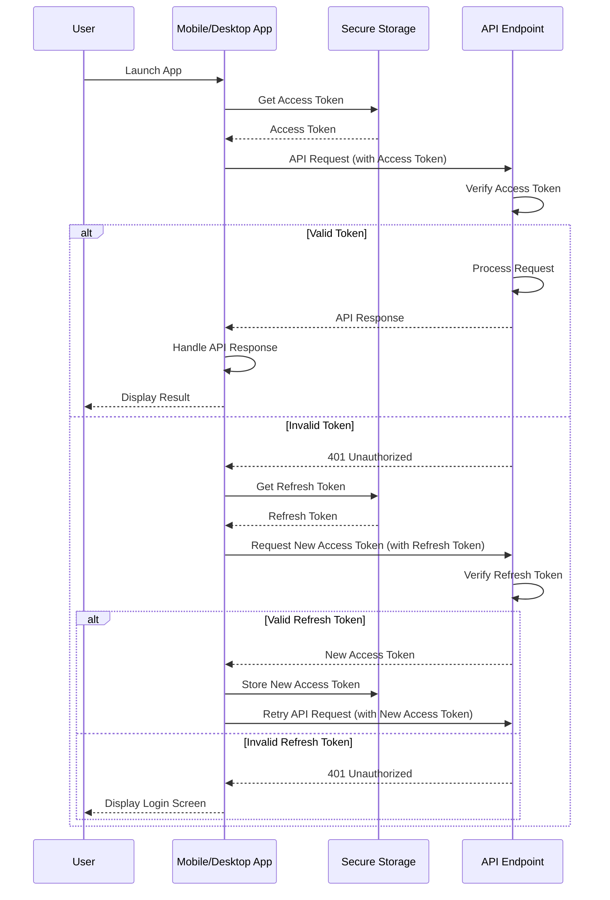

このシーケンス図では、以下の流れが表現されています。

1. ユーザーがモバイル/デスクトップアプリを起動します。
2. アプリは、セキュアストレージからアクセストークンを取得します。
3. アプリは、取得したアクセストークンを使用してAPIエンドポイントにリクエストを送信します。
4. APIエンドポイントは、アクセストークンの検証を行います。
5. 有効なトークンの場合、APIエンドポイントはリクエストを処理し、レスポンスをアプリに返します。アプリはレスポンスを処理し、結果をユーザーに表示します。
6. 無効なトークンの場合、APIエンドポイントは401 Unauthorizedレスポンスを返します。
7. アプリは、セキュアストレージからリフレッシュトークンを取得します。
8. アプリは、リフレッシュトークンを使用して新しいアクセストークンをリクエストします。
9. APIエンドポイントは、リフレッシュトークンの検証を行います。
10. 有効なリフレッシュトークンの場合、APIエンドポイントは新しいアクセストークンを発行し、アプリに返します。アプリは新しいアクセストークンをセキュアストレージに保存し、APIリクエストを再試行します。
11. 無効なリフレッシュトークンの場合、APIエンドポイントは401 Unauthorizedレスポンスを返します。アプリはログイン画面を表示します。

このフローは、ユーザーがアプリを起動してから、APIを利用するまでの一連の手順を示しています。アクセストークンの取得、APIリクエストの送信、トークンの更新、エラー処理などの主要な手順が含まれています。

実際のアプリケーションでは、このフローをベースに、より詳細な処理や例外処理、ユーザーインターフェースとの連携などが実装されることになります。また、セキュリティ上の考慮事項として、アクセストークンとリフレッシュトークンの安全な保存、トークンの有効期限の管理、セキュアな通信の実装などが重要になります。

### 1. アクセストークンのセキュアな保存

#### Android の場合

```kotlin
// アクセストークンを EncryptedSharedPreferences に保存
val encryptedPrefs = EncryptedSharedPreferences.create(
    "secret_prefs",
    masterKeyAlias,
    context,
    EncryptedSharedPreferences.PrefKeyEncryptionScheme.AES256_SIV,
    EncryptedSharedPreferences.PrefValueEncryptionScheme.AES256_GCM
)
encryptedPrefs.edit().putString("access_token", accessToken).apply()
```

#### iOS の場合

```swift
// アクセストークンを Keychain に保存
let accessToken = "your_access_token"
let data = Data(accessToken.utf8)
let query: [String: Any] = [
    kSecClass as String: kSecClassGenericPassword,
    kSecAttrAccount as String: "AccessToken",
    kSecValueData as String: data
]
SecItemAdd(query as CFDictionary, nil)
```

### 2. APIリクエストの送信

#### Android (Kotlin) の場合

```kotlin
// アクセストークンを取得
val encryptedPrefs = EncryptedSharedPreferences.create(
    "secret_prefs",
    masterKeyAlias,
    context,
    EncryptedSharedPreferences.PrefKeyEncryptionScheme.AES256_SIV,
    EncryptedSharedPreferences.PrefValueEncryptionScheme.AES256_GCM
)
val accessToken = encryptedPrefs.getString("access_token", null)

// APIリクエストを送信
val client = OkHttpClient()
val request = Request.Builder()
    .url("https://api.openai.com/v1/engines/davinci-codex/completions")
    .addHeader("Content-Type", "application/json")
    .addHeader("Authorization", "Bearer $accessToken")
    .post(requestBody)
    .build()
val response = client.newCall(request).execute()
```

#### iOS (Swift) の場合

```swift
// アクセストークンを取得
let query: [String: Any] = [
    kSecClass as String: kSecClassGenericPassword,
    kSecAttrAccount as String: "AccessToken",
    kSecReturnData as String: true
]
var item: CFTypeRef?
let status = SecItemCopyMatching(query as CFDictionary, &item)
guard status == errSecSuccess else { /* handle error */ }
let accessToken = String(data: item as! Data, encoding: .utf8)

// APIリクエストを送信
let url = URL(string: "https://api.openai.com/v1/engines/davinci-codex/completions")!
var request = URLRequest(url: url)
request.httpMethod = "POST"
request.addValue("application/json", forHTTPHeaderField: "Content-Type")
request.addValue("Bearer \(accessToken!)", forHTTPHeaderField: "Authorization")
request.httpBody = requestBody
let task = URLSession.shared.dataTask(with: request) { data, response, error in
    // レスポンスの処理
}
task.resume()
```

これらの例では、以下の流れでAPIリクエストを送信しています。

1. セキュアストレージ（Android の場合は EncryptedSharedPreferences、iOS の場合は Keychain）からアクセストークンを取得します。
2. 取得したアクセストークンを使用して、Azure OpenAI API のエンドポイントに対してリクエストを送信します。このとき、`Authorization` ヘッダーに `Bearer {アクセストークン}` を指定します。
3. APIからのレスポンスを受信し、適切に処理します。

### 3. エラーハンドリングとトークンの更新

APIリクエストを送信する際には、以下のようなエラーハンドリングとトークンの更新処理が必要です。

- **401 Unauthorized エラー**: アクセストークンが無効または期限切れの場合に発生します。この場合、リフレッシュトークンを使用して新しいアクセストークンを取得する必要があります。
- **リフレッシュトークンの使用**: リフレッシュトークンを使用して新しいアクセストークンを取得する際は、セキュアストレージからリフレッシュトークンを読み込み、適切なエンドポイントにリクエストを送信します。取得した新しいアクセストークンは、セキュアストレージに保存します。
- **リフレッシュトークンの更新**: リフレッシュトークン自体の有効期限が切れた場合は、ユーザーに再認証を求める必要があります。

以下に、リフレッシュトークンを使用して新しいアクセストークンを取得する例を示します。

#### Android (Kotlin) の場合

```kotlin
// リフレッシュトークンを取得
val refreshToken = encryptedPrefs.getString("refresh_token", null)

// 新しいアクセストークンをリクエスト
val client = OkHttpClient()
val requestBody = FormBody.Builder()
    .add("grant_type", "refresh_token")
    .add("refresh_token", refreshToken)
    .add("client_id", clientId)
    .build()
val request = Request.Builder()
    .url("https://login.microsoftonline.com/{tenant_id}/oauth2/v2.0/token")
    .post(requestBody)
    .build()
val response = client.newCall(request).execute()
val responseBody = response.body?.string()
val jsonObject = JSONObject(responseBody)
val newAccessToken = jsonObject.getString("access_token")

// 新しいアクセストークンをセキュアストレージに保存
encryptedPrefs.edit().putString("access_token", newAccessToken).apply()
```

#### iOS (Swift) の場合

```swift
// リフレッシュトークンを取得
let refreshTokenQuery: [String: Any] = [
    kSecClass as String: kSecClassGenericPassword,
    kSecAttrAccount as String: "RefreshToken",
    kSecReturnData as String: true
]
var refreshTokenItem: CFTypeRef?
let refreshTokenStatus = SecItemCopyMatching(refreshTokenQuery as CFDictionary, &refreshTokenItem)
guard refreshTokenStatus == errSecSuccess else { /* handle error */ }
let refreshToken = String(data: refreshTokenItem as! Data, encoding: .utf8)

// 新しいアクセストークンをリクエスト
let url = URL(string: "https://login.microsoftonline.com/{tenant_id}/oauth2/v2.0/token")!
var request = URLRequest(url: url)
request.httpMethod = "POST"
let requestBody = "grant_type=refresh_token&refresh_token=\(refreshToken!)&client_id=\(clientId)"
request.httpBody = requestBody.data(using: .utf8)
let task = URLSession.shared.dataTask(with: request) { data, response, error in
    guard let data = data else { /* handle error */ }
    let jsonObject = try? JSONSerialization.jsonObject(with: data, options: []) as? [String: Any]
    let newAccessToken = jsonObject?["access_token"] as? String
    
    // 新しいアクセストークンをセキュアストレージに保存
    let newAccessTokenData = newAccessToken?.data(using: .utf8)
    let newAccessTokenQuery: [String: Any] = [
        kSecClass as String: kSecClassGenericPassword,
        kSecAttrAccount as String: "AccessToken",
        kSecValueData as String: newAccessTokenData!
    ]
    SecItemAdd(newAccessTokenQuery as CFDictionary, nil)
}
task.resume()
```

これらの例では、以下の流れで新しいアクセストークンを取得しています。

1. セキュアストレージからリフレッシュトークンを取得します。
2. リフレッシュトークンを使用して、新しいアクセストークンをリクエストします。
3. 取得した新しいアクセストークンをセキュアストレージに保存します。

### まとめ

アクセストークンを使ってユーザーがAPIを利用し始める際には、以下の点が重要です。

1. アクセストークンをセキュアストレージに安全に保存する。
2. 保存されたアクセストークンを使用して、適切にAPIリクエストを送信する。
3. APIレスポンスのエラーハンドリングを適切に行う。
4. 必要に応じて、リフレッシュトークンを使用して新しいアクセストークンを取得する。

これらの点に留意しながら、ユーザーにとって使いやすく、セキュリティに優れたAPIの利用環境を提供することが重要です。また、アプリケーションのライフサイクル全体を通して、セキュリティの継続的な改善とモニタリングを行うことが必要不可欠です。

### 4. API通信に関わる全体の流れ

アクセストークンを使用してAPIリクエストを行い、そのリクエストが正常に処理されると同時に監査ログが蓄積されていくフローについて、以下に示します。

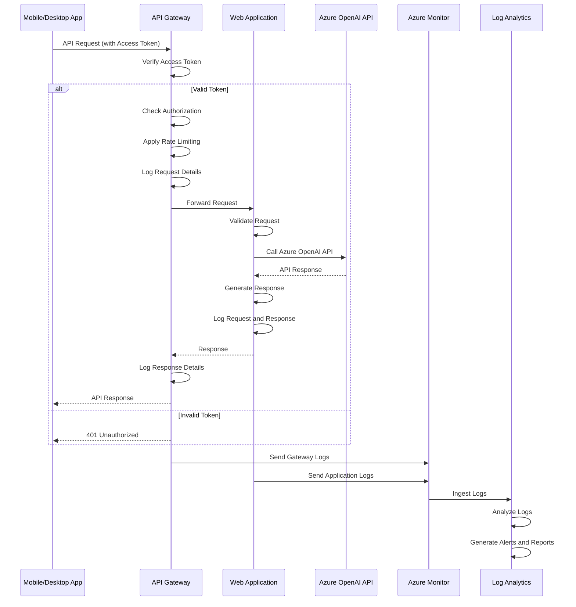

このシーケンス図では、以下の流れが表現されています。

1. モバイル/デスクトップアプリが、アクセストークンを含めてAPIリクエストを送信します。
2. API Gatewayは、アクセストークンの検証、認可の確認、レート制限の適用、リクエストの詳細のログ記録を行います。
3. 有効なトークンの場合、APIゲートウェイはリクエストをWebアプリケーションに転送します。無効なトークンの場合は、401 Unauthorizedレスポンスを返します。
4. Webアプリケーションは、リクエストの検証、Azure OpenAI APIの呼び出し、レスポンスの生成、リクエストとレスポンスの詳細のログ記録を行います。
5. レスポンスは、Webアプリケーションから API Gateway を経由してモバイル/デスクトップアプリに返されます。
6. API Gateway とWebアプリケーションのログは、Azure Monitor に送信されます。
7. Azure Monitor は、ログをLog Analyticsに取り込みます。
8. Log Analytics は、取り込まれたログの分析、アラートとレポートの生成を行います。

このフローは、APIリクエストの処理における主要な手順と、監査ログの生成および分析の流れを示しています。実際のシステムでは、各コンポーネント間のやりとりや、ログの詳細な内容、アラートとレポートの具体的な基準などが定義されることになります。

### 1. APIリクエストの送信

#### Android (Kotlin) の場合

```kotlin
// アクセストークンを取得
val accessToken = encryptedPrefs.getString("access_token", null)

// APIリクエストを送信
val client = OkHttpClient()
val requestBody = RequestBody.create(MediaType.parse("application/json"), jsonPayload)
val request = Request.Builder()
    .url("https://api.openai.com/v1/engines/davinci-codex/completions")
    .addHeader("Content-Type", "application/json")
    .addHeader("Authorization", "Bearer $accessToken")
    .post(requestBody)
    .build()
val response = client.newCall(request).execute()

// レスポンスの処理
val responseBody = response.body?.string()
// ...
```

#### iOS (Swift) の場合

```swift
// アクセストークンを取得
let accessToken = // ... Keychainからアクセストークンを取得 ...

// APIリクエストを送信
let url = URL(string: "https://api.openai.com/v1/engines/davinci-codex/completions")!
var request = URLRequest(url: url)
request.httpMethod = "POST"
request.addValue("application/json", forHTTPHeaderField: "Content-Type")
request.addValue("Bearer \(accessToken)", forHTTPHeaderField: "Authorization")
request.httpBody = jsonPayload.data(using: .utf8)
let task = URLSession.shared.dataTask(with: request) { data, response, error in
    // レスポンスの処理
    // ...
}
task.resume()
```

### 2. API Gatewayでのリクエスト処理

API Gatewayは、受信したリクエストに対して以下の処理を行います。

1. **認証**: `Authorization` ヘッダーからアクセストークンを抽出し、Azure ADに対してトークンの有効性を確認します。
2. **認可**: アクセストークンに含まれるスコープ（権限）を確認し、リクエストされたリソースへのアクセス権限があるかどうかを確認します。
3. **レート制限**: リクエストの頻度を監視し、設定されたレート制限を超えた場合はリクエストを拒否します。
4. **ロギング**: リクエストと応答の詳細を記録し、監査ログとして保存します。

### 3. Webアプリケーション層での処理

API Gatewayを通過したリクエストは、Webアプリケーション層で処理されます。

1. **リクエストの検証**: リクエストのパラメータや payload を検証し、不正な値がないかチェックします。
2. **Azure OpenAI APIの呼び出し**: リクエストに基づいて、Azure OpenAI APIを呼び出します。このとき、必要に応じてレスポンスのキャッシュを利用します。
3. **レスポンスの生成**: Azure OpenAI APIからの応答を元に、クライアントに返すレスポンスを生成します。
4. **ロギング**: リクエストとレスポンスの詳細を記録し、アプリケーションログとして保存します。

### 4. 監査ログの蓄積

API Gatewayとアプリケーション層で生成されたログは、監査ログとして一元的に管理されます。

1. **Azure Monitor**: Azure Monitor は、Azure サービスから生成されたメトリックとログを収集し、可視化するための中心的なサービスです。API Gatewayとアプリケーション層のログは、Azure Monitor に送信されます。
2. **ログの種類**: 監査ログには、以下のようなログが含まれます。
   - API Gatewayのアクセスログ（認証、認可、レート制限の結果など）
   - アプリケーション層のアクセスログ（リクエストとレスポンスの詳細、エラー情報など）
   - Azure ADの認証ログ（サインイン、サインアウト、条件付きアクセスの結果など）
   - Azure OpenAI APIの使用状況ログ（呼び出されたAPIの種類、パラメータ、レスポンス時間など）
3. **ログの分析**: 収集されたログは、Azure Log Analyticsを使用して分析されます。Log Analyticsでは、ログデータに対して複雑なクエリを実行し、パターンやトレンドを発見することができます。
4. **アラートとレポート**: Log Analyticsで定義されたルールに基づいて、異常な動作やセキュリティ上の脅威が検出された場合、アラートが生成されます。また、定期的にログデータを集計し、レポートを生成することもできます。

### 5. セキュリティとコンプライアンス

監査ログの蓄積は、セキュリティとコンプライアンスの観点から重要な役割を果たします。

1. **不正アクセスの検知**: 監査ログを分析することで、不正なアクセス attempts や異常な動作を検知することができます。
2. **インシデント対応**: セキュリティインシデントが発生した場合、監査ログを使用して原因を特定し、適切な対応を行うことができます。
3. **コンプライアンス**: 監査ログは、法規制や業界標準への準拠を示すための重要な証跡となります。必要に応じて、監査ログをコンプライアンスレポートに含めることができます。

### まとめ

アクセストークンを使用したAPIリクエストの処理と、それに伴う監査ログの蓄積は、安全で信頼性の高いシステムを運用するために不可欠なプロセスです。

1. アプリケーションからのAPIリクエストは、適切なアクセストークンを含める必要があります。
2. API Gatewayは、アクセストークンの検証、認可、レート制限、ロギングを行います。
3. Webアプリケーション層は、リクエストの処理とレスポンスの生成を行い、詳細なログを記録します。
4. 監査ログは、Azure MonitorとLog Analyticsを使用して一元的に管理され、分析とアラート生成に利用されます。
5. 監査ログは、セキュリティとコンプライアンスの観点から重要な役割を果たします。

これらの要素を適切に設計・実装することで、安全で信頼性が高く、法規制に準拠したシステムを構築することができます。定期的なログのレビューとシステムの監視を行い、継続的な改善に努めることが重要です。

## その他、重要な検討事項や非機能要件（NFR）

**障害対策と回復性**

- 各コンポーネントの障害シナリオと対策方法
  - API Gateway: 障害時にはトラフィックを別のリージョンにルーティングする。
  - Web Application: 複数のインスタンスを配置し、1つのインスタンスが失敗した場合でも他のインスタンスが引き継ぐ。
  - データベース: マルチAZ構成により、1つのAZで障害が発生した場合でも別のAZで運用を継続する。

- システム全体の回復性向上策
  - データのバックアップ: Azure Backupを使用して、定期的にデータのバックアップを取得する。
  - フェールオーバー構成: Azure Traffic Managerを使用して、プライマリーリージョンで障害が発生した場合にセカンダリーリージョンにトラフィックを切り替える。

**パフォーマンスとスケーラビリティ**

- 想定される負荷とパフォーマンス要件
  - 1日あたりのアクティブユーザー数: 10,000人
  - ピーク時の同時接続数: 1,000
  - APIレスポンスタイム: 99パーセンタイルで1秒以内

- オートスケーリングと負荷分散
  - Azure App Service: CPUの使用率に基づいて、インスタンス数を自動的にスケールアウト/インする。
  - Azure Kubernetes Service (AKS): Horizontal Pod Autoscalerを使用して、負荷に応じてPodの数を自動的に調整する。
  - Azure API Management: 負荷に応じてAPIゲートウェイのインスタンスをスケールアウト/インする。

**運用とメンテナンス**

- 監視とログ管理
  - Azure Monitor: 各コンポーネントのメトリクスを収集し、ダッシュボードで可視化する。
  - Azure Log Analytics: 各コンポーネントのログを一元的に管理し、異常検知やトレンド分析に活用する。
  - アラート設定: 重大なエラーやパフォーマンス低下が発生した場合に、運用チームにアラートを通知する。

- メンテナンス作業
  - Windows Update/Linux パッチ適用: 毎月第2火曜日の夜間に実施。
  - データ更新: 毎週日曜日の早朝に実施。
  - メンテナンス体制: 専任の運用チーム（3名）が24時間365日でシステムを監視。


## Appendix 部署ごとのAPI利用料請求

各部署のAPI利用状況を把握し、適切に利用料を請求するためには、以下のような仕組みの追加が必要となると考えられます。

### API Gateway (Azure API Management)
- 部署ごとにサブスクリプションキーを発行し、APIへのアクセスを制御する。
- 各リクエストのサブスクリプションキーから、リクエスト元の部署を特定する。
- 部署ごとのAPI利用状況（リクエスト数、データ転送量など）を記録する。

### ログ基盤 (Azure Monitor、Azure Log Analytics)
- API Gatewayから収集したAPI利用ログを、部署ごとに集計・分析する。
- 日次・月次の利用状況レポートを生成し、課金の根拠とする。

### ID管理 (Azure Active Directory)
- 各部署に対応したAzure ADのグループを作成し、ユーザーを割り当てる。
- グループごとにAPI Management上のサブスクリプションキーを発行し、アクセス権を管理する。

### 課金システム（外部システムまたはAzure Functions）
- ログ基盤から集計されたAPI利用状況データを取得する。
- 部署ごとに利用料を計算し、課金データを生成する。
- 課金データを基に、経理システムへの連携や請求書の発行を行う。

## Appendix2 ユーザ登録のためのCSVの例

CSVファイルに含めるべきユーザーデータの項目は、システムの管理や運用に必要な情報を網羅しつつ、個人情報保護の観点から過剰な情報を含めないようにすることが重要です。以下は、このシステムの管理に適したユーザーデータの項目例です。

1. ユーザーID（必須）: システム内で一意なユーザーの識別子。社員番号等を想定
2. 名前（必須）: ユーザーの氏名。
3. メールアドレス（必須）: ユーザーの連絡先メールアドレス。
4. 部署（必須）: ユーザーが所属する部署。
5. 役職: ユーザーの役職情報。
6. 電話番号: ユーザーの連絡先電話番号。
7. 利用開始日（必須）: ユーザーのシステム利用開始日。
8. 利用終了日: ユーザーのシステム利用終了日。
9. アカウントステータス（必須）: ユーザーアカウントの状態（有効/無効）。

以下は、サンプルユーザーデータを含むCSVファイルの例です。

```csv
user_id,name,email,department,job_title,phone,start_date,end_date,status
001,山田太郎,taro.yamada@example.com,営業部,主任,03-1234-5678,2023/04/01,,active
002,鈴木花子,hanako.suzuki@example.com,人事部,課長,03-2345-6789,2023/04/01,,active
003,佐藤一郎,ichiro.sato@example.com,システム部,部長,03-3456-7890,2023/04/01,,active
004,田中裕子,yuko.tanaka@example.com,経理部,担当,03-4567-8901,2023/04/01,2023/06/30,inactive
005,高橋健一,kenichi.takahashi@example.com,営業部,課長代理,03-5678-9012,2023/04/01,,active
```

この例では、各ユーザーについて以下の情報が含まれています。

- ユーザーID: 001から005までの一意の識別子。
- 名前: ユーザーの氏名。
- メールアドレス: ユーザーの連絡先メールアドレス。
- 部署: 営業部、人事部、システム部、経理部など、ユーザーが所属する部署。部署コードなどが存在する場合はそちらの方がおそらく便利
- 役職: 主任、課長、部長、担当など、ユーザーの役職。役職コードなど存在する場合はそちらの方がおそらく便利
- 電話番号: ユーザーの連絡先電話番号。
- 利用開始日: 全ユーザーが2023/04/01からシステムの利用を開始。
- 利用終了日: ユーザーID 004の田中裕子さんは2023/06/30でシステムの利用を終了。他のユーザーは空欄。
- アカウントステータス: ユーザーID 004の田中裕子さんは"inactive"、他のユーザーは"active"。

これらの項目は、システムの管理や利用状況の分析に必要な基本的な情報をカバーしています。ただし、実際のシステムでは、組織の構造やニーズに応じて、項目の追加や変更が必要になる場合があります。また、CSVファイルにはパスワードなどの機密情報を直接含めるべきではありません。

CSVファイルのフォーマットや項目の定義については、関連部署と協議の上、組織のポリシーに沿って決定することをお勧めします。

## Appendix3 開発を進めるにあたっての推奨

開発を始める際は、以下の順序で進めていくことをお勧めします。

1. **インフラストラクチャの構築**
   - Azure上に必要なリソース（仮想ネットワーク、ストレージアカウント、App Service、Azure Functionsなど）を作成します。
   - 開発環境、ステージング環境、本番環境を分けて構築することで、安全で効率的な開発が可能になります。

2. **認証・認可機能の実装**
   - Azure ADを使用してユーザー認証を実装します。
   - 各コンポーネントでのロールベースのアクセス制御（RBAC）を設定します。

3. **APIの開発**
   - API Gatewayの設定（ルーティング、レート制限、キャッシュなど）を行います。
   - バックエンドのAPIを開発し、Azure App ServiceやAzure Functionsにデプロイします。

4. **フロントエンドの開発**
   - ユーザーインターフェースを設計し、APIと連携するフロントエンドアプリケーションを開発します。
   - モバイルアプリやデスクトップアプリの場合は、プラットフォームごとの開発を進めます。

5. **データ処理の実装**
   - Azure Data Factoryを使用して、CSVファイルのアップロードと処理を自動化します。
   - ユーザープロビジョニングの処理を実装し、Azure ADとの同期を設定します。

6. **ログ収集と監視の設定**
   - Azure MonitorとAzure Log Analyticsを使用して、各コンポーネントのログ収集と監視を設定します。
   - アラートとダッシュボードを作成し、システムの健全性を可視化します。

7. **セキュリティ対策の実施**
   - ネットワークセキュリティグループ（NSG）やAzure Firewallを使用して、ネットワークレベルのセキュリティを確保します。
   - Azure Key Vaultを使用して、機密情報（APIキー、接続文字列など）を安全に管理します。

8. **テストとデプロイ**
   - 単体テスト、結合テスト、負荷テストを実施し、システムの品質を確保します。
   - 自動化されたデプロイメントパイプラインを構築し、継続的なデリバリーを実現します。

これらのステップは、並行して進めることができる部分もあります。例えば、インフラストラクチャの構築とAPIの開発は、同時に着手することが可能です。

開発を進める際は、デザインドキュメントを参照しつつ、詳細な設計を行います。その際、各コンポーネントの責任範囲を明確にし、疎結合な設計を心がけることが重要です。また、開発の進捗状況を定期的にステークホルダーに報告し、フィードバックを得ながら、柔軟に計画を調整していくことが求められます。

これらの点に留意しつつ、段階的に開発を進めていくことで、効果的なシステムの構築が可能になります。

なお、こうしたシステムを開発するにあたって、以下のようなコンポーネントやAPIが必要になると想定しています。

1. ユーザー管理コンポーネント
   - ユーザー情報の登録、更新、削除を行うAPI
   - ユーザー認証、認可を行うAPI
   - パスワードリセット、アカウントロックアウトなどの機能を提供するAPI

2. 部署・役職管理コンポーネント（ただし役職等で利用可能なサービスを制限する、利用量に応じて部署に課金する等の処理が不要であれば開発も不要と思われる）
   - 部署・役職情報の登録、更新、削除を行うAPI
   - 部署・役職とユーザーの関連付けを管理するAPI

3. Azure AD連携コンポーネント
   - ユーザー情報をAzure ADと同期するためのAPI
   - Azure ADのグループ情報を取得・管理するAPI

4. CSVファイル処理コンポーネント
   - CSVファイルのアップロード、ダウンロード機能を提供するAPI
   - CSVファイルのバリデーション、データ変換を行うAPI

5. 監査ログ管理コンポーネント
   - 各種の操作ログを記録するAPI
   - 監査ログの検索、集計、レポート生成を行うAPI

6. API Gateway
   - 認証、認可、レート制限、キャッシングなどの機能を提供
   - 各APIへのルーティングを制御

7. Webフロントエンド
   - ユーザー管理、部署・役職管理などの管理者向け機能を提供
   - CSVファイルのアップロード、ダウンロードのUIを提供

8. モバイルアプリ
   - iOS、Android向けのネイティブアプリ

9. デスクトップアプリ
   - Windows、macOS向けのデスクトップアプリ

10. バッチ処理コンポーネント
    - ユーザーデータの定期的な同期、更新を行うバッチ処理
    - レポートの定期的な生成、配信を行うバッチ処理

11. 通知コンポーネント
    - メールによるアカウント情報の通知、アラートの送信を行うAPI
    - プッシュ通知による重要な情報の通知を行うAPI

12. 課金管理コンポーネント（ただし利用量に応じて部署に課金する等の処理が不要であれば開発も不要と思われる）
    - 部署ごとのAPI利用状況を集計するバッチ処理
    - 利用料の計算、請求データの生成を行うAPI

これらのコンポーネントやAPIは、システムの要件や設計によって変動する可能性があります。開発を進める際は、各コンポーネントの責務を明確にし、疎結合な設計を心がけることが重要です。

また、開発の優先順位づけを行い、MVP（Minimum Viable Product）を定義することも効果的です。MVPを早期にリリースし、ユーザーからのフィードバックを取り入れながら、段階的に機能を拡充していくアプローチが推奨されます。

これらのコンポーネントやAPIを適切に設計・実装し、全体として整合性のあるシステムを構築していくことが、プロジェクトの成功のカギとなります。

### APIのイメージ

役割ごとにカテゴライズした上で、APIの一覧をまとめてみました。

1. ユーザー管理
   - CSVファイルのアップロード
     - POST /users/csv/upload
   - CSVファイルのダウンロード
     - GET /users/csv/download
   - ユーザー情報の同期状況の取得
     - GET /users/sync/status
   - ユーザーの一時的な無効化
     - PUT /users/{userId}/disable
   - ユーザーの一時的な無効化の解除
     - PUT /users/{userId}/enable
   - ユーザーの削除
     - DELETE /users/{userId}

2. Azure AD連携
   - ユーザー情報の同期の開始
     - POST /azuread/sync/start
   - ユーザー情報の同期状況の取得
     - GET /azuread/sync/status
   - グループ情報の取得
     - GET /azuread/groups
   - グループへのユーザーの追加
     - POST /azuread/groups/{groupId}/members
   - グループからのユーザーの削除
     - DELETE /azuread/groups/{groupId}/members/{userId}

3. 監査ログ管理
   - 操作ログの記録
     - POST /audit/logs
   - 監査ログの検索
     - GET /audit/logs/search
   - 監査ログのレポート生成
     - GET /audit/logs/report

4. 通知
   - メール通知の送信
     - POST /notifications/email
   - プッシュ通知の送信
     - POST /notifications/push

5. システム管理
   - システム設定の取得
     - GET /system/settings
   - システム設定の更新
     - PUT /system/settings
   - システムヘルスの取得
     - GET /system/health

6. APIキー管理
   - APIキーの発行
     - POST /apikeys
   - APIキーの無効化
     - PUT /apikeys/{apiKey}/revoke
   - APIキーの利用状況の取得
     - GET /apikeys/{apiKey}/usage

7. 部署ごとの利用状況管理
   - 部署ごとの利用状況の取得
     - GET /departments/{departmentId}/usage
   - 全部署の利用状況のサマリーの取得
     - GET /departments/usage/summary

これらのAPIは、システムの要件に応じて追加、変更、削除が必要になる可能性があります。また、各APIの詳細な仕様（リクエストパラメータ、レスポンスフォーマットなど）は、設計フェーズでより詳細に定義する必要があります。

APIの設計においては、RESTfulの原則に従い、適切なHTTPメソッドやURLの構造化、ステータスコードの使用などに留意することが重要です。また、認証・認可の仕組みや、エラーハンドリング、APIバージョニングなどの横断的な事項についても、統一的な方針を定めておく必要があります。

これらのAPIを適切に設計・実装し、クライアントアプリケーションやバックエンドシステムとの連携を円滑に行うことで、全体としてユーザビリティの高いシステムを構築することができます。

## Appendix4 Claude3等、利用APIの拡張について

システム設計の観点からしますと、抽象化されたAPIレイヤーを設けて、サービスに合わせてリクエストを整形して各サービスAPIに投げるという形がスマートに見えますが、アプリケーション開発者側の立場からしますと、それぞれのサービスが提供するライブラリやSDKをそのまま利用できる方が開発効率が高まるとして歓迎される場合が多いと思われます。このような場合は、各サービスへのリクエストを直接エンドポイントで振り分けるようなアーキテクチャの方が良いでしょう。

以下に、リクエスト先のエンドポイントレベルで振り分けるアーキテクチャを示します。このアプローチでは、API Gatewayがリクエストを各サービスのエンドポイントに直接ルーティングする役割を果たします。

### システム構成図

ClaudeのAPIを法人がデータ保護の観点からAWSのBedrockなどを前提に利用する場合も考慮し、Azureベースのアーキテクチャに組み込む方法を示します。ここでは、AWSのサービスを統合するための構成を考えています。

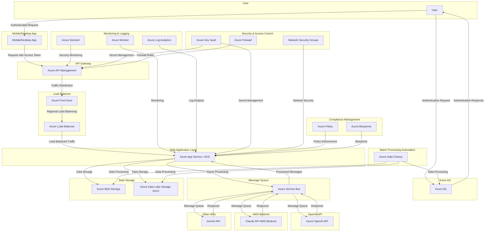

### 説明

1. **ユーザー認証**:
   - ユーザーはモバイル/デスクトップアプリからAzure ADを通じて認証され、アクセストークンを取得します。

2. **リクエスト送信**:
   - 認証されたユーザーはアクセストークンを使用して、APIリクエストをAzure API Management (API Gateway)に送信します。

3. **リクエストルーティング**:
   - API GatewayはリクエストをAzure Front Door (グローバルロードバランサー)に渡し、そこからAzure Load Balancer (リージョナルロードバランサー)を通じてWebアプリケーション層にルーティングします。

4. **非同期処理**:
   - Webアプリケーション層はリクエストをAzure Service Bus (メッセージキュー)に送り、そこからAzure OpenAI API、Claude API (AWS Bedrock)、Gemini APIなどの各バックエンドサービスと連携して処理を行います。

5. **データストレージ**:
   - 処理結果やその他のデータはAzure Blob StorageやAzure Data Lake Storage Gen2に保存されます。

6. **監査・モニタリング**:
   - すべてのリクエストとレスポンスはAzure Monitor、Azure Log Analytics、Azure Sentinelを使用して監視およびログに記録されます。

7. **セキュリティ管理**:
   - Azure Key Vaultで秘密情報を管理し、Azure FirewallとNetwork Security Groupsでネットワークセキュリティを強化します。

8. **コンプライアンス管理**:
   - Azure PolicyとAzure Blueprintsを使用して、コンプライアンスを確保し、運用ポリシーを適用します。

9. **バッチ処理自動化**:
   - Azure Data Factoryを使用して、データのバッチ処理と自動化を行い、データの取り込みや変換を効率化します。

### AWS Bedrock (Claude API)の統合

- **AWS Bedrock (Claude API)**: Azure Service Busを使用してリクエストを送信し、AWS BedrockのClaude APIにリクエストをルーティングします。AWSのセキュリティおよびデータ保護ポリシーに従い、リクエストとレスポンスのデータを適切に管理します。

### 注意事項

1. **ネットワーク接続**:
   - AzureとAWSの間で安全なネットワーク接続を確保するために、VPCピアリングやVPN接続を使用します。

2. **データ保護**:
   - 各クラウドプロバイダーのデータ保護規約に従い、データの暗号化とアクセス制御を適用します。

3. **監査とコンプライアンス**:
   - クロスクラウドの監査とコンプライアンス管理を強化するために、Azure Sentinelなどを活用してセキュリティイベントを統合管理します。

### まとめ

この構成により、ユーザーはAzure ADを通じて認証され、API Gatewayを経由してAzure OpenAI API、Claude API (AWS Bedrock)、Gemini APIを利用できます。クロスクラウド環境でのセキュリティとコンプライアンスを確保しつつ、各サービスの利用を効率的に管理します。

### 補足

1. **認証と認可**:
   - Azure ADとAWSのIAMを併用する場合、ユーザー管理の複雑さが増す可能性があります。
   - シングルサインオン（SSO）の仕組みを導入し、ユーザーエクスペリエンスを向上させることを検討してください。

2. **データの一貫性**:
   - 複数のクラウドサービスを利用する場合、データの一貫性を保つことが重要です。
   - データの同期や整合性を維持するための仕組み（データレプリケーションなど）を検討してください。

3. **モニタリングとログ管理**:
   - クロスクラウド環境では、各クラウドサービスのモニタリングとログ管理を統合する必要があります。
   - Azure SentinelとAWS Security Hubなどを活用して、包括的なセキュリティ監視体制を整えてください。

4. **コスト管理**:
   - 複数のクラウドサービスを利用する場合、コスト管理が複雑になる可能性があります。
   - 各クラウドのコスト管理ツールを活用し、総合的なコストの可視化と最適化に取り組んでください。

5. **パフォーマンスと可用性**:
   - クロスクラウド環境では、ネットワークレイテンシーやサービスの可用性に影響する可能性があります。
   - 重要なサービスについては、リージョンの選択や冗長化構成を検討し、パフォーマンスと可用性を確保してください。

6. **コンプライアンス**:
   - 複数のクラウドプロバイダーを利用する場合、コンプライアンス要件への対応が複雑になる可能性があります。
   - 各クラウドのコンプライアンス認証（ISO、SOC、PCI DSSなど）を確認し、全体としてのコンプライアンスを管理してください。

7. **API Gatewayの設定**:
   - API Gatewayでのルーティング設定が複雑になる可能性があります。
   - 各サービスのエンドポイントやパラメータの違いを吸収し、クライアントアプリケーションへの影響を最小限に抑える工夫が必要です。

例えばAzureADベースのシングルサインオン（SSO）を導入する場合、以下のようなアーキテクチャが考えられます。

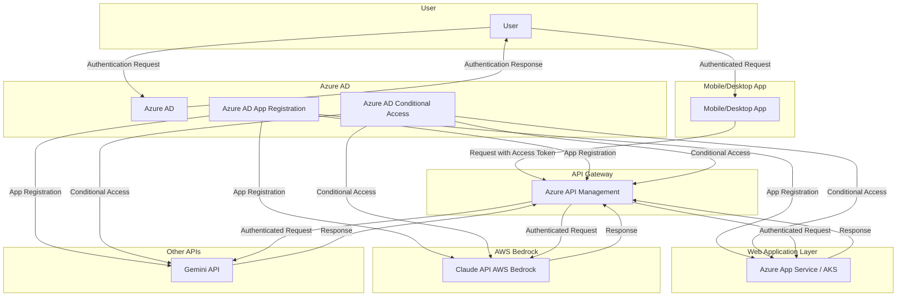

### 説明

1. **Azure AD認証**:
   - ユーザーはAzure ADを通じて認証され、アクセストークンを取得します。

2. **Azure AD App Registration**:
   - 各APIサービス（Azure App Service、AWS Bedrock、Gemini API）をAzure ADにアプリケーションとして登録します。
   - これにより、Azure ADはアクセストークンを発行し、各サービスへのアクセスを制御できます。

3. **Azure AD Conditional Access**:
   - Azure ADの条件付きアクセスポリシーを設定し、各サービスへのアクセスを制御します。
   - 例えば、特定の場所やデバイスからのアクセスを制限したり、多要素認証を要求したりできます。

4. **API Gateway**:
   - Azure API Managementは、Azure ADから発行されたアクセストークンを検証し、各サービスへのリクエストをルーティングします。
   - API Gatewayは、トークンのスコープや条件付きアクセスポリシーに基づいて、アクセス制御を行います。

5. **APIサービス**:
   - 各APIサービス（Azure App Service、AWS Bedrock、Gemini API）は、Azure ADから発行されたアクセストークンを検証し、リクエストを処理します。
   - 各サービスは、Azure ADのアプリケーション登録情報を使用して、トークンの検証とアクセス制御を行います。

### 注意事項

1. **AWS Bedrock (Claude API)との統合**:
   - AWS BedrockのClaude APIをAzure ADと統合するには、AWS Identity and Access Management (IAM)とのフェデレーション設定が必要です。
   - Azure ADとAWS IAMの間でトラストを確立し、シームレスな認証フローを実現します。

2. **トークン交換**:
   - 必要に応じて、Azure ADのアクセストークンをAWSやその他のサービスで使用できるトークンに交換する仕組みを導入します。
   - トークン交換は、Azure AD App RegistrationとAWS IAMの設定を使用して実現します。

3. **アクセス制御の一元化**:
   - Azure ADを中心とした一元的なアクセス制御を実現するために、各サービスのアクセス制御設定をAzure ADと同期する必要があります。
   - Azure ADのアプリケーション登録情報やロール定義を、各サービスの設定に反映します。

4. **モニタリングとログ管理**:
   - シングルサインオンの動作を監視し、認証・認可のログを一元的に管理します。
   - Azure MonitorやAzure SentinelをAWS CloudTrailと統合し、包括的なモニタリングとログ管理を実現します。

### まとめ

この設計により、Azure ADを中心としたシングルサインオンを実現し、クロスクラウド環境でのAPIサービス利用を効率化できます。ユーザーはAzure ADを通じて認証され、Azure AD App RegistrationとConditional Accessを使用して、各サービスへのアクセスが制御されます。API Gatewayは、Azure ADから発行されたアクセストークンを検証し、リクエストを適切なサービスにルーティングします。

ただし、AWSやその他のクラウドサービスとの統合には、追加の設定と考慮事項があります。トークン交換や、アクセス制御の一元化、モニタリングとログ管理など、クロスクラウド環境特有の課題に対処する必要があります。

この設計をベースに、各クラウドサービスの認証・認可機能を活用しつつ、シームレスなシングルサインオンを実現していくことが重要です。また、運用面でのベストプラクティスを取り入れ、セキュリティとユーザーエクスペリエンスのバランスを取ることが求められます。

### その他考察

AzureADベースのシングルサインオン（SSO）を導入することには、AWS側を完全に分けて開発するようなスタイルと比較して以下のような優位性が考えられます。

1. **ユーザーエクスペリエンスの向上**:
   - ユーザーは一度の認証で複数のサービスにアクセスできるため、利便性が向上します。
   - パスワードの管理が簡素化され、ユーザーの負担が軽減されます。

2. **セキュリティの強化**:
   - Azure ADの条件付きアクセス機能を活用して、アクセス制御を細かく設定できます。
   - 多要素認証（MFA）の適用や、リスクベースの認証により、セキュリティが向上します。

3. **アクセス管理の一元化**:
   - ユーザーのプロビジョニングやアクセス権の管理をAzure ADで一元的に行えます。
   - 各サービスごとにアクセス管理を行う必要がなくなり、管理コストが削減されます。

4. **監査とコンプライアンス**:
   - Azure ADのログ機能を活用して、認証・認可の監査ログを一元的に取得できます。
   - 各サービスの監査ログとの統合が容易になり、コンプライアンス対応が強化されます。

5. **開発の効率化**:
   - 各サービスでの認証・認可の実装が不要になるため、開発工数が削減されます。
   - アクセストークンの検証など、共通的な処理をAPI Gatewayに集約できます。

一方で、各サービスでIDを発行して監査ログを取得する場合と比較すると、以下のようなデメリットも考えられます。

1. **初期設定の複雑さ**:
   - Azure ADとの連携設定や、各サービスでのアプリケーション登録が必要になります。
   - 特にAWS BedrockとのフェデレーションはAzure ADとは異なる概念のため、設定が複雑になる可能性があります。

2. **依存関係の増加**:
   - 認証・認可の機能をAzure ADに依存することになるため、Azure ADの障害がシステム全体に影響を及ぼす可能性があります。
   - 各サービスでIDを発行する場合と比べて、依存関係が増加します。

3. **カスタマイズの制限**:
   - Azure ADの機能を使用するため、認証・認可のカスタマイズ性が制限される可能性があります。
   - 各サービスでIDを発行する場合と比べて、細かな認証・認可の制御が難しくなる可能性があります。

これらの点を考慮し、システムの要件や優先順位に基づいて、適切なアプローチを選択する必要があります。ユーザーエクスペリエンスとセキュリティを重視するのであれば、AzureADベースのSSOが適しています。一方、各サービスの独立性や柔軟性を重視するのであれば、サービスごとのID発行と監査ログ取得が適している可能性があります。

また、両者のアプローチを組み合わせることも可能です。例えば、Azure ADをプライマリーの認証プロバイダーとして使用しつつ、特定のサービスでは独自のID発行と監査ログ取得を行うといった、ハイブリッドなアプローチも考えられます。

システムの性質や組織の方針、開発リソースなどを総合的に判断して、最適なアプローチを選択することが重要です。また、選択したアプローチに基づいて、セキュリティとユーザビリティのバランスを取りつつ、堅牢な認証・認可の仕組みを設計・実装していく必要があります。