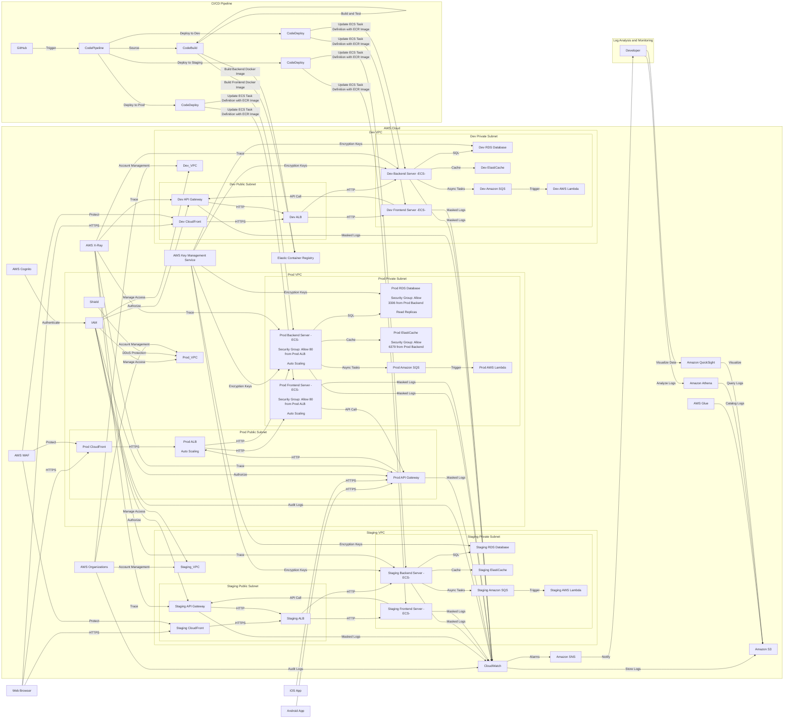
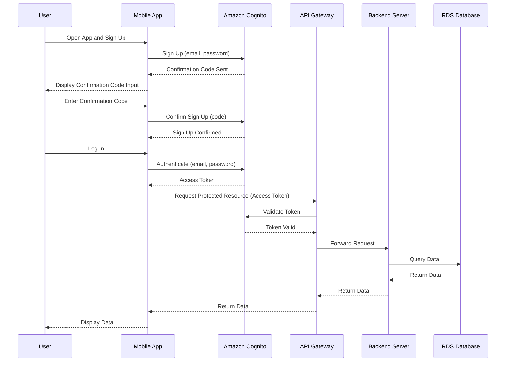
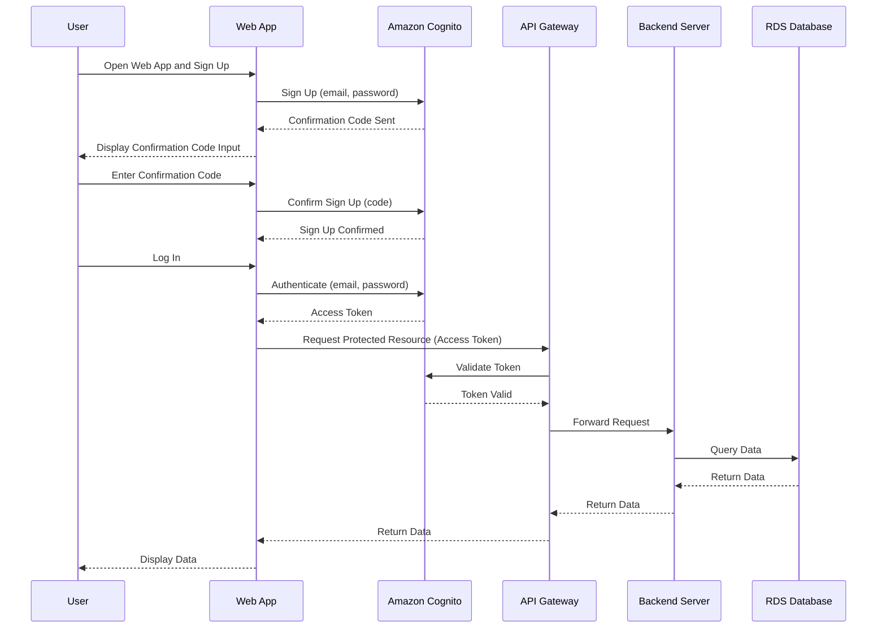

# AWS上にサービスを構築する場合のアーキテクチャに関する一考察

以下のシステム構成図は、AWSクラウド環境でのプロダクション、ステージング、および開発の3つの異なるVPC（Virtual Private Cloud）におけるフルスタックアプリケーションのデプロイメントと運用管理の全体像を示しています。各環境は独立したVPCに配置され、セキュリティとスケーラビリティを確保しています。

### 全体構成の概要

1. **AWS Cloud**:
    - **Prod VPC (Production Environment)**: プロダクション環境のVPC。高可用性とスケーラビリティを確保しています。
    - **Staging VPC (Staging Environment)**: ステージング環境のVPC。プロダクション環境と同様の設定で、テストおよび検証に使用されます。
    - **Dev VPC (Development Environment)**: 開発環境のVPC。開発者が新機能や修正を試すための環境です。

### 各環境の詳細構成

#### Prod VPC (Production Environment)
- **Public Subnet**:
    - **Prod ALB**: Application Load Balancer。自動スケーリングをサポートし、トラフィックをFrontendおよびBackendサーバーに分散します。
    - **Prod API Gateway**: APIリクエストのエントリーポイント。認証とリクエストのルーティングを行います。
    - **Prod CloudFront**: CDNサービス。静的コンテンツのキャッシングと高速配信を提供します。

- **Private Subnet**:
    - **Prod Frontend Server (ECS)**: フロントエンドアプリケーションをホストします。セキュリティグループによりALBからのトラフィックを許可します。
    - **Prod Backend Server (ECS)**: バックエンドアプリケーションをホストします。同様に、ALBからのトラフィックを許可します。
    - **Prod RDS Database**: リレーショナルデータベースサービス。バックエンドサーバーからのSQLクエリを受け付けます。
    - **Prod ElastiCache**: メモリキャッシュサービス。バックエンドサーバーからのキャッシュリクエストを処理します。
    - **Prod Amazon SQS**: メッセージキューサービス。非同期タスクの管理に使用されます。
    - **Prod AWS Lambda**: サーバーレスコンピューティングサービス。SQSメッセージの処理などに使用されます。

#### Staging VPC (Staging Environment) & Dev VPC (Development Environment)
- **Public Subnet**:
    - **Staging/Dev ALB**: Application Load Balancer。プロダクションと同様の役割。
    - **Staging/Dev API Gateway**: API Gateway。プロダクションと同様の役割。
    - **Staging/Dev CloudFront**: CloudFront。プロダクションと同様の役割。

- **Private Subnet**:
    - **Staging/Dev Frontend Server (ECS)**: フロントエンドサーバー。プロダクションと同様の役割。
    - **Staging/Dev Backend Server (ECS)**: バックエンドサーバー。プロダクションと同様の役割。
    - **Staging/Dev RDS Database**: RDSデータベース。プロダクションと同様の役割。
    - **Staging/Dev ElastiCache**: ElastiCache。プロダクションと同様の役割。
    - **Staging/Dev Amazon SQS**: Amazon SQS。プロダクションと同様の役割。
    - **Staging/Dev AWS Lambda**: AWS Lambda。プロダクションと同様の役割。

### 共通サービス
- **AWS Cognito**: ユーザー認証と認可を管理します。
- **IAM (Identity and Access Management)**: AWSリソースへのアクセスを管理します。各環境のVPCにアクセス権限を付与します。
- **AWS Organizations**: 複数のAWSアカウントを統合管理します。各環境のVPCにアカウント管理を提供します。
- **AWS KMS (Key Management Service)**: データの暗号化キーを管理します。各環境のRDSおよびBackendサーバーに対して暗号化キーを提供します。
- **AWS CloudWatch**: ログとメトリクスの収集および監視を行います。各コンポーネントの監視データを収集します。
- **AWS X-Ray**: 分散トレースを提供し、各環境のAPIGおよびBackendサーバーのパフォーマンスを分析します。
- **AWS WAF (Web Application Firewall)**: CloudFrontの保護を行います。各環境のCloudFrontに対するセキュリティ対策を提供します。
- **Elastic Container Registry (ECR)**: Dockerイメージを保存します。
- **Amazon Athena**: クエリサービス。ログデータをSQLでクエリし、分析を行います。
- **Amazon QuickSight**: データの可視化を行います。
- **AWS Glue**: データカタログとETLサービス。ログデータの管理を行います。
- **Amazon S3**: オブジェクトストレージサービス。ログやデータを保存します。
- **Amazon SNS**: 通知サービス。CloudWatchアラームなどの通知を開発者に送信します。

### CI/CD Pipeline
- **GitHub**: ソースコードリポジトリ。コードの変更が発生すると、パイプラインがトリガーされます。
- **CodePipeline (CP)**: 継続的デリバリーのパイプライン。ビルド、テスト、デプロイを自動化します。
- **CodeBuild (CB)**: 継続的インテグレーションサービス。コードをビルドし、Dockerイメージを作成します。
- **CodeDeploy (CD)**: アプリケーションのデプロイを管理します。各環境（Dev, Staging, Prod）にECSタスク定義を更新してデプロイします。

### データフローの詳細
1. **ユーザーアクセス**:
   - **Webブラウザ**: CloudFrontを経由してALBに接続し、Frontendサーバーにリクエストを送信します。
   - **モバイルアプリ (Android/iOS)**: API Gatewayを経由してバックエンドにリクエストを送信します。

2. **Frontendサーバー**: API Gatewayを呼び出してバックエンドサーバーにアクセスします。
3. **Backendサーバー**: RDSデータベースに対してSQLクエリを実行し、ElastiCacheを使用してキャッシュデータを管理し、Amazon SQSを使って非同期タスクを処理します。
4. **Lambda関数**: SQSメッセージをトリガーとして非同期処理を実行します。

### ログの分析と監視
- **CloudWatch**: 各環境のログとメトリクスを収集します。
- **Athena**: S3に保存されたログデータに対してSQLクエリを実行します。
- **QuickSight**: データを可視化し、レポートを作成します。
- **SNS**: CloudWatchアラームをトリガーとして開発者に通知を送信します。

この構成により、各環境（Dev, Staging, Prod）でのセキュアでスケーラブルなアプリケーションデプロイメントが実現され、ユーザー認証、データ管理、監視および分析が効果的に行われます。

### ユーザー登録のシーケンス (モバイルアプリ経由)

### 各ステップの説明 (モバイルアプリ経由)

1. **ユーザー登録**
   - ユーザーがモバイルアプリを開き、サインアップを開始します。
   - モバイルアプリはユーザーのメールアドレスとパスワードを使ってCognitoにサインアップリクエストを送信します。
   - Cognitoは確認コードを生成し、ユーザーのメールアドレスに送信します。
   - モバイルアプリはユーザーに確認コードの入力を求めます。

2. **サインアップの確認**
   - ユーザーが確認コードを入力します。
   - モバイルアプリは確認コードを使ってCognitoにサインアップ確認リクエストを送信します。
   - Cognitoはサインアップを確認し、モバイルアプリに応答します。

3. **ログインと認証**
   - ユーザーがモバイルアプリでログインします。
   - モバイルアプリはユーザーのメールアドレスとパスワードを使ってCognitoに認証リクエストを送信します。
   - Cognitoは認証を行い、アクセストークンを発行してモバイルアプリに返します。

4. **保護されたリソースへのアクセス**
   - モバイルアプリはアクセストークンを使ってAPI Gatewayに保護されたリソースへのリクエストを送信します。
   - API GatewayはCognitoにトークンの検証を依頼します。
   - Cognitoはトークンを検証し、その結果をAPI Gatewayに返します。
   - API Gatewayはリクエストをバックエンドサーバーに転送します。
   - バックエンドサーバーはRDSデータベースに対してデータクエリを実行します。
   - RDSデータベースはクエリ結果をバックエンドサーバーに返します。
   - バックエンドサーバーはデータをAPI Gatewayに返します。
   - API Gatewayはデータをモバイルアプリに返します。
   - モバイルアプリはユーザーにデータを表示します。

### ユーザー登録のシーケンス (Webアプリ経由)

### 各ステップの説明 (Webアプリ経由)

1. **ユーザー登録**
   - ユーザーがWebアプリを開き、サインアップを開始します。
   - Webアプリはユーザーのメールアドレスとパスワードを使ってCognitoにサインアップリクエストを送信します。
   - Cognitoは確認コードを生成し、ユーザーのメールアドレスに送信します。
   - Webアプリはユーザーに確認コードの入力を求めます。

2. **サインアップの確認**
   - ユーザーが確認コードを入力します。
   - Webアプリは確認コードを使ってCognitoにサインアップ確認リクエストを送信します。
   - Cognitoはサインアップを確認し、Webアプリに応答します。

3. **ログインと認証**
   - ユーザーがWebアプリでログインします。
   - Webアプリはユーザーのメールアドレスとパスワードを使ってCognitoに認証リクエストを送信します。
   - Cognitoは認証を行い、アクセストークンを発行してWebアプリに返します。

4. **保護されたリソースへのアクセス**
   - Webアプリはアクセストークンを使ってAPI Gatewayに保護されたリソースへのリクエストを送信します。
   - API GatewayはCognitoにトークンの検証を依頼します。
   - Cognitoはトークンを検証し、その結果をAPI Gatewayに返します。
   - API Gatewayはリクエストをバックエンドサーバーに転送します。
   - バックエンドサーバーはRDSデータベースに対してデータクエリを実行します。
   - RDSデータベースはクエリ結果をバックエンドサーバーに返します。
   - バックエンドサーバーはデータをAPI Gatewayに返します。
   - API GatewayはデータをWebアプリに返します。
   - Webアプリはユーザーにデータを表示します。