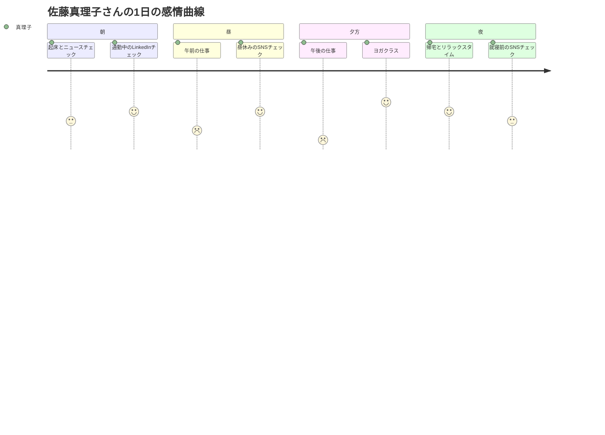
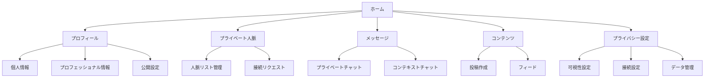
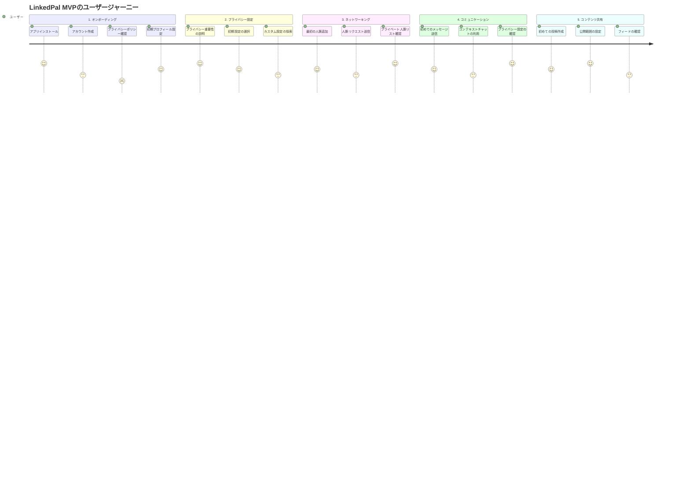
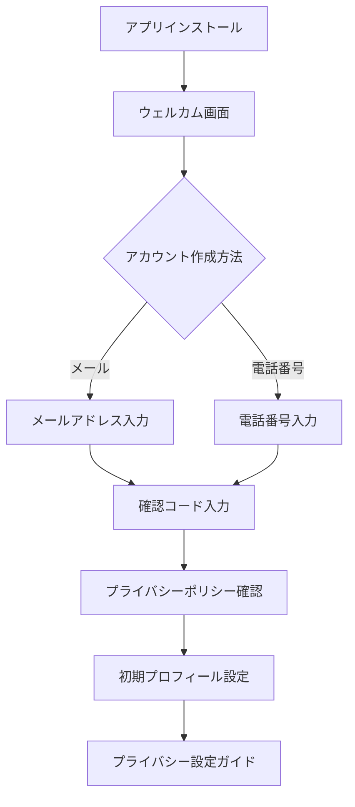
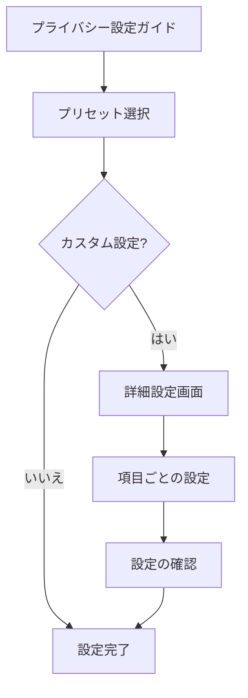
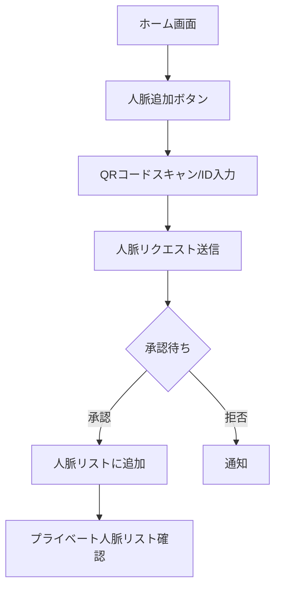
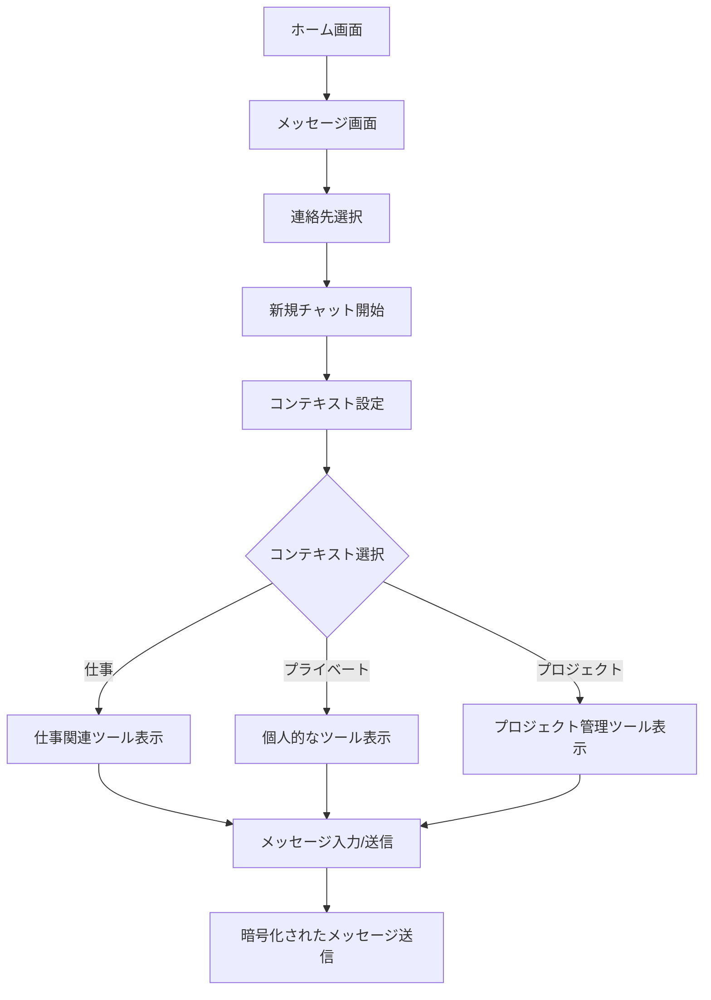
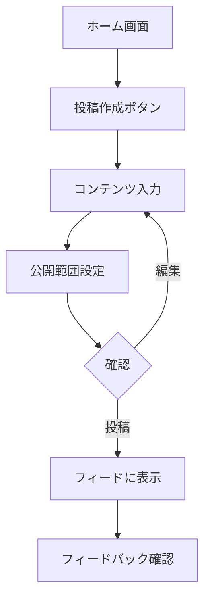

# 事例で学ぶプロダクト開発入門 UI/UX編（仮題）

# 0. はじめに

ここは全部書き上げてから最後に書く

# 1. ユーザーリサーチとペルソナ作成

## 1-1. ターゲットユーザーの定義とマネタイズ戦略

LinkedPalは、プライバシーを重視し、洗練された交流空間を求めるユーザーをターゲットとしたプレミアムなソーシャルネットワークサービスです。広告やノイズにあふれた既存のSNSとは一線を画し、有料でも質の高い体験を求めるユーザー層に焦点を当てます。

市場調査とユーザーインタビューの結果を踏まえ、LinkedPalのターゲットユーザーを以下のように定義します：

1. 若手社会人（25-35歳）- 主要ターゲット
   - 特徴：キャリア形成期にあり、質の高い人脈形成に高い価値を見出す
   - ニーズ：仕事上の人脈と私生活のバランス管理、選択的な情報共有
   - プライバシー意識：非常に高く、デジタルプライバシーに投資する意思がある
   - 行動パターン：目的志向型のSNS利用、プレミアムサービスへの抵抗が低い
   - マネタイズポテンシャル：月額課金型のプレミアムサービスに高い支払い意思

2. 中堅社会人（36-50歳）- 主要ターゲット
   - 特徴：確立されたキャリアと、質を重視する傾向が強い
   - ニーズ：専門的なネットワーキング、高度なプライバシーコントロール
   - プライバシー意識：個人情報とオンライン上の評判管理に非常に敏感
   - 行動パターン：選別的なSNS利用、高品質サービスへの投資意欲が高い
   - マネタイズポテンシャル：高額のプレミアム機能やコンサルティングサービスへの支払い意思が非常に高い

3. 大学生・大学院生（22-25歳）- セカンダリーターゲット
   - 特徴：キャリアの入り口にあり、質の高いネットワーキングの重要性を認識し始めている
   - ニーズ：就職活動や研究に関連する人脈形成、プライバシーを考慮した情報管理
   - プライバシー意識：高まりつつあり、将来のキャリアを見据えた慎重な情報共有を望む
   - 行動パターン：新しいサービスへの適応が早く、価値を感じれば有料サービスも利用
   - マネタイズポテンシャル：割引された学生プランや、卒業後の完全版へのアップグレードに可能性

この再定義されたターゲット設定に基づき、LinkedPalのマネタイズ戦略を以下のように構築します：

1. プレミアムサブスクリプションモデル
   - 広告なしの洗練されたインターフェース
   - 高度なプライバシー設定とコントロール機能
   - 専門家によるプライバシーコンサルティング

2. 段階的な料金プラン
   - 基本プラン：核となるプライバシー保護機能と限定的なネットワーキング機能
   - プロフェッショナルプラン：高度な人脈管理ツールとデータ分析機能
   - エンタープライズプラン：組織全体でのプライバシー管理とネットワーキングソリューション

3. 付加価値サービス
   - プライバシーに配慮したイベントやウェビナーの開催（有料参加）
   - プライバシー保護技術に関する教育コンテンツ
   - 専門家によるプロフィール最適化サービス

4. パートナーシップとエコシステム
   - プライバシー技術企業とのコラボレーション
   - 選別されたキャリア支援サービスとの連携（収益シェア型）

この戦略により、LinkedPalは広告に依存せず、ユーザーの価値に直接訴求するビジネスモデルを構築します。質の高いサービスを提供することで、ユーザーの信頼を獲得し、長期的な関係性を築くことを目指します。

プロダクトの設計とUI/UX開発においては、この戦略を念頭に置き、プレミアム感と高度な機能性を両立させる必要があります。ユーザーに「支払う価値がある」と感じてもらえるよう、視覚的な洗練さと機能の充実を図ります。

以降のユーザーリサーチやペルソナ作成では、これらのターゲットユーザーの特性と、彼らが求める価値を深く掘り下げていきます。プレミアムな体験を求めるユーザーのニーズを的確に捉え、それをUIやUXに反映させることが、LinkedPalの成功につながる鍵となります。

## 1-2. ユーザーインタビューの実施方法

ユーザーインタビューの重要性を説明し、以下の手順を詳細に解説します：

a) インタビュー対象者の選定
   - 各ターゲット層から5-10名ずつ選出
   - 多様性を確保（性別、専攻/職種、地域など）

b) インタビューガイドの作成
   - 半構造化インタビューの形式を採用
   - 主要な質問項目：
     - 現在のSNS利用状況
     - プライバシーに関する懸念
     - 人間関係管理の課題
     - 理想のSNSの特徴

c) インタビューの実施
   - 対面またはオンラインで30-45分程度
   - ラポールの構築方法
   - 深掘り質問のテクニック

d) インタビュー結果の分析
   - 質的データ分析の手法（テーマティックアナリシスなど）
   - 共通点と相違点の抽出
   - インサイトの導出


## 1-3. ペルソナの作成と詳細化

LinkedPalの主要ターゲットに基づいて、2つの代表的なペルソナを作成します。

### ペルソナ1: 佐藤 真理子（さとう まりこ）

- 年齢: 32歳
- 職業: IT企業のプロジェクトマネージャー
- 年収: 800万円

**背景:**
真理子は、大手IT企業で5年間プロジェクトマネージャーとして働いています。キャリア志向が強く、仕事上の人脈作りに積極的です。プライベートでは、趣味のヨガを通じて心身のバランスを保っています。

**目標:**
- 仕事上のネットワークを拡大し、キャリアアップにつなげたい
- プライベートと仕事の人間関係を適切に管理したい
- オンライン上の評判を戦略的に構築したい

**懸念:**
- SNS上での不用意な投稿が、キャリアに悪影響を与える可能性
- 個人情報の漏洩やプライバシーの侵害

**行動パターン:**
- 朝はニュースアプリでビジネス情報をチェック
- 通勤中にLinkedInで業界動向や人脈の更新を確認
- 昼休みや帰宅後にInstagramで友人の近況をチェック
- 週末にはヨガのコミュニティで新しい人々と交流

**価値観:**
- プロフェッショナリズムとワークライフバランスを重視
- 質の高い情報と人脈を大切にする
- プライバシーとセキュリティに高い関心がある

**LinkedPalへの期待:**
- 仕事用と私用の人脈を明確に分離できる機能
- 高度なプライバシー設定によるコンテンツの選択的共有
- 専門性の高いネットワーキング機会の提供

### ペルソナ2: 山田 健太郎（やまだ けんたろう）

- 年齢: 45歳
- 職業: 製薬会社の研究開発部門マネージャー
- 年収: 1,200万円

**背景:**
健太郎は、大手製薬会社で15年以上のキャリアを持つ研究者です。最近、マネージャーに昇進し、リーダーシップスキルの向上に力を入れています。家族を大切にし、週末は家族との時間を優先しています。

**目標:**
- 業界内外の専門家とのネットワークを構築し、最新の研究動向を把握したい
- チームのパフォーマンスを向上させるためのリーダーシップスキルを磨きたい
- 家族との絆を深めながら、プロフェッショナルとしての成長も続けたい

**懸念:**
- 機密性の高い研究情報の漏洩
- オンライン上での過度な露出が、プロフェッショナルとしての評判に影響を与える可能性
- 仕事とプライベートの境界が曖昧になることへの不安

**行動パターン:**
- 朝は科学系ニュースサイトで最新情報をチェック
- 仕事中は専門的なオンラインフォーラムで情報交換
- 帰宅後、家族との時間を過ごした後、学術論文データベースで研究をフォロー
- 月に1-2回、業界セミナーやネットワーキングイベントに参加

**価値観:**
- 科学的厳密性と倫理を重視
- 継続的な学習と自己改善を大切にする
- 家族との時間とプロフェッショナルとしての成長のバランスを重視

**LinkedPalへの期待:**
- 高度なプライバシー設定と情報セキュリティ機能
- 専門分野に特化したネットワーキングと情報共有の場
- 家族や親しい友人との私的なコミュニケーション空間の確保

## 1-4. ユーザーのニーズと課題の特定

これらのペルソナを基に、LinkedPalが解決すべき主要なニーズと課題を以下のように特定します：

1. プライバシーとセキュリティの強化
   - ニーズ: 高度なプライバシー設定と情報セキュリティ
   - 課題: 既存のSNSではプライバシー設定が複雑で分かりにくい

2. コンテキストに応じた人脈管理
   - ニーズ: 仕事用と私用の人脈を明確に分離し管理したい
   - 課題: 現在のSNSでは人脈の文脈に応じた管理が困難

3. 選択的情報共有
   - ニーズ: 特定のグループやコンテキストに応じて情報を共有したい
   - 課題: 既存のプラットフォームでは共有範囲の細かい制御が難しい

4. 専門的ネットワーキング
   - ニーズ: 業界や専門分野に特化した質の高いネットワーキング
   - 課題: 一般的なSNSでは専門性の高い交流が難しい

5. オンライン評判の戦略的管理
   - ニーズ: プロフェッショナルとしての評判を戦略的に構築・管理したい
   - 課題: 現在のSNSでは個人のブランディングが難しい

6. ワークライフバランスの支援
   - ニーズ: プロフェッショナルな成長と私生活の充実を両立したい
   - 課題: 既存のプラットフォームではしばしば仕事と私生活の境界が曖昧になる

7. 高品質な情報と交流
   - ニーズ: ノイズの少ない、質の高い情報と交流を求めている
   - 課題: 広告やスパムの多い既存のSNSでは、価値ある情報の取得が困難

8. 継続的学習とスキル向上
   - ニーズ: キャリア発展につながる学習機会や情報を得たい
   - 課題: 一般的なSNSでは、専門的な学習コンテンツへのアクセスが限られている

これらのニーズと課題に対応することで、LinkedPalは既存のSNSとは差別化された、プレミアムな体験を提供することができます。UI/UXデザインにおいては、これらの要素を効果的に組み込み、ユーザーに直感的で価値ある体験を提供することが重要となります。

次のステップでは、これらのニーズと課題に基づいて、具体的な機能要件とUI/UXデザインの方向性を検討していきます。

## 2. ユーザージャーニーマップの作成

ユーザージャーニーマップは、ユーザーがプロダクトと関わる一連の体験を可視化するツールです。LinkedPalの主要ペルソナである佐藤真理子さんの1日の流れに沿って、ユーザージャーニーマップを作成します。

### 2.1 ユーザーの行動パターンの分析

佐藤真理子さんの典型的な平日の行動パターンを時系列で整理します：

1. 朝 (6:30-8:00): 起床、朝食、ニュースチェック
2. 通勤 (8:00-9:00): 電車でLinkedInチェック
3. 午前の仕事 (9:00-12:00): プロジェクトマネジメント、ミーティング
4. 昼休み (12:00-13:00): ランチ、InstagramでPrivateなSNSチェック
5. 午後の仕事 (13:00-18:00): プロジェクト作業、クライアントとの連絡
6. 退社後 (18:00-19:30): ヨガクラス参加
7. 夜 (19:30-23:00): 帰宅、夕食、リラックスタイム、SNSチェック

### 2.2 タッチポイントの特定

LinkedPalと真理子さんが接触する可能性のある具体的な場面を列挙します：

1. 朝のニュースフィード確認
2. 通勤中のプロフェッショナルネットワーク更新
3. 昼休みの友人との交流
4. 仕事中のクライアント情報確認
5. ヨガクラスでの新しい出会い記録
6. 夜のリラックスタイムでのコンテンツ閲覧

### 2.3 ペインポイントと機会の発見

各タッチポイントでの課題と、LinkedPalが提供できる解決策を分析します：

1. 朝のニュースフィード確認
   - ペインポイント: 関連性の低い情報が多く、時間を無駄にしてしまう
   - 機会: AIを活用した高度なパーソナライゼーションで、関連性の高い情報を提供

2. 通勤中のプロフェッショナルネットワーク更新
   - ペインポイント: プライベートな情報が混ざり、集中できない
   - 機会: コンテキストに応じた情報表示の切り替え機能を提供

3. 昼休みの友人との交流
   - ペインポイント: 仕事関連の通知が入り、リラックスできない
   - 機会: 時間帯やロケーションに応じた通知設定の自動化

4. 仕事中のクライアント情報確認
   - ペインポイント: 機密情報の取り扱いに不安がある
   - 機会: 高度な暗号化とアクセス制御機能の提供

5. ヨガクラスでの新しい出会い記録
   - ペインポイント: プライベートな人脈を仕事の人脈と混ぜたくない
   - 機会: コンテキストに応じた人脈管理機能の提供

6. 夜のリラックスタイムでのコンテンツ閲覧
   - ペインポイント: 仕事関連の情報が表示され、オフモードに入れない
   - 機会: ユーザーの気分や状況に応じたコンテンツフィルタリング機能

### 2.4 感情曲線の描画

真理子さんの1日の感情の変化を可視化してみます。


この図は、真理子さんの1日の感情の変化を表現しています。朝は期待と少しの不安、昼は仕事の忙しさでストレスが高まり、夕方のヨガで回復し、夜はリラックスした状態を示しています。

### 2.5 インサイトの導出

このユーザージャーニーマップから、以下のようなインサイトが得られます：

1. コンテキストスイッチの重要性：仕事モードとプライベートモードの切り替えをスムーズにサポートする機能が必要
2. 高度なプライバシー設定：状況に応じて適切な情報共有レベルを自動的に設定する機能が有用
3. インテリジェントな通知管理：ユーザーの状況を考慮した適切なタイミングでの通知提供
4. パーソナライズされたコンテンツ提供：ユーザーの気分や状況に応じた適切な情報フィルタリング
5. セキュアな情報管理：高度な暗号化とアクセス制御によるビジネス情報の保護

これらのインサイトを基に、LinkedPalのUI/UX設計の優先順位を決定し、具体的な機能設計に落とし込んでいきます。例えば：

- コンテキストに応じた自動モード切替機能
- 直感的なプライバシー設定インターフェース
- AI駆動の通知最適化システム
- ユーザーの状態を考慮したコンテンツレコメンデーション機能
- ビジネス用の高セキュリティモード

次のステップでは、これらのインサイトを基に、具体的な情報アーキテクチャの設計に移っていきます。ユーザージャーニーマップで得られた知見を活かし、ユーザーの文脈に沿った、直感的で価値のある体験を設計することが重要です。

## 3. 情報アーキテクチャの設計

### 3.1 LinkedPalの核となる特徴の反映

「他の人に自分が誰と友達であるかを知る手段を一切提供しない」という特徴を情報アーキテクチャの中心に据えます：

1. 非公開の人脈管理
   - ユーザーの人脈リストは完全に非公開
   - 「友達の友達」機能の排除
   - 共通の友達表示の廃止

2. コンテキストベースの接続
   - 直接のつながりのみを許可
   - 第三者を介した接続提案の排除

3. プライバシーファーストの設計
   - デフォルトで全ての情報を非公開に設定
   - 段階的な情報公開オプションの提供

### 3.2 MVP (Minimum Viable Product) の定義

LinkedPalのMVPとして、以下の核となる機能に焦点を当てます：

1. セキュアなプロフィール作成
2. プライベートな人脈管理
3. コンテキストベースのメッセージング
4. 基本的なコンテンツ共有（投稿）
5. 高度なプライバシー設定

これらの要素を考慮し、情報アーキテクチャを以下のように構築します：



### 3.3 ユーザーフローとカスタマージャーニー

以下は、新規ユーザーがLinkedPalを使い始めてから、主要機能を使いこなすまでの流れを表現しています。



このジャーニーマップは、ユーザーの感情の起伏とともに、LinkedPalの主要機能の使用順序を示しています。次に、各セクションの詳細なユーザーフローを見ていきましょう。

#### 1. オンボーディングフロー



#### 2. プライバシー設定フロー



#### 3. ネットワーキングフロー



#### 4. コミュニケーションフロー

LinkedPalの核となる「プライバシー保護」と「コンテキストに応じたコミュニケーション」の概念を考慮すると、以下のように整理するのが適切だと思います：

##### メッセージング機能の再定義

LinkedPalでは、すべてのチャットを「プライベート」として扱い、その中でコンテキストを設定できるようにします。つまり、「プライベートチャット」と「コンテキストチャット」を別々の機能として分けるのではなく、単一のメッセージング機能の中でコンテキスト設定を可能にします。

1. プライベートメッセージング
   - すべてのメッセージングは基本的にプライベート（1対1）です。
   - エンドツーエンドの暗号化を使用し、高度なプライバシーを確保します。

2. コンテキスト設定
   - 各チャットに対して、ユーザーがコンテキスト（例：仕事、プライベート、プロジェクトXなど）を設定できます。
   - コンテキスト設定により、関連する情報やツールが提供されます。

3. コンテキストベースの機能
   - 仕事コンテキスト：ファイル共有、タスク管理機能の統合
   - プライベートコンテキスト：イベント計画、写真共有機能の強化
   - プロジェクトコンテキスト：進捗管理、リソース共有機能の提供

再定義に基づいて、メッセージングのユーザーフローを見てみましょう：



このフローでは：

1. ユーザーは連絡先を選択し、新しいチャットを開始します。
2. チャットを開始する際に、コンテキストを設定するオプションがあります。
3. 選択されたコンテキストに基づいて、関連するツールや機能が提供されます。
4. すべてのメッセージは暗号化されて送信され、高度なプライバシーが確保されます。

この方法により、LinkedPalは以下の利点を提供します：

- すべてのコミュニケーションにおいて高度なプライバシーを確保
- コンテキストに応じた柔軟なコミュニケーション環境の提供
- ユーザーのワークフローに合わせた効率的なツールとリソースの統合

この仕様により、LinkedPalのコア機能であるプライバシー保護とコンテキストベースのコミュニケーションがより明確になり、ユーザーにとってより直感的で価値のある体験を提供できるでしょう。

#### 5. コンテンツ共有フロー



これらの詳細なフロー図は、LinkedPalのMVPにおける主要な機能とその使用順序を示しています。各ステップでプライバシーを重視していることが分かります。例えば、ネットワーキングでは直接的な接続のみを許可し、コンテンツ共有では公開範囲の設定を必須としています。

このようなユーザーフローとカスタマージャーニーの組み合わせにより、開発チームはユーザーの体験をより深く理解し、各ステップでのプライバシー保護とユーザビリティのバランスを取ることができます。また、新規ユーザーが段階的にアプリの機能を理解し、使いこなしていく過程も明確になります。

#### 3.4 段階的な機能拡張計画

MVPリリース後の段階的な機能拡張を計画します：

Phase 1 (MVP):
- 基本的なプロフィール、人脈管理、メッセージング、投稿機能
- 高度なプライバシー設定

Phase 2:
- コンテキストベースのフィード最適化
- セキュアなファイル共有

Phase 3:
- プロフェッショナルグループ機能
- 匿名化されたネットワーク分析

Phase 4:
- AIを活用したプライバシー推奨設定
- 高度なコンテンツキュレーション

この情報アーキテクチャと段階的開発計画により、LinkedPalの核となる「完全なプライバシー保護」という特徴を維持しつつ、最小限の機能セットでの迅速なリリースが可能になります。ユーザーは基本的な機能を通じてLinkedPalの価値を体験し、徐々に高度な機能が追加されることで、長期的なエンゲージメントを促進できます。

次のステップでは、このMVPを中心としたワイヤーフレームとUIデザインを作成し、コア機能の使いやすさとプライバシー保護の視覚化に焦点を当てていきます。

# 4. ワイヤーフレームの作成

ワイヤーフレームの作成は、UI/UXデザインプロセスの重要なステップです。LinkedPalの例を使って、ワイヤーフレーム作成のプロセスを詳しく見ていきましょう。

a) 低忠実度ワイヤーフレームの作成
   - 手書きまたはデジタルツール（Figma, Sketch, Adobe XDなど）を使用
   - 主要な画面の基本レイアウトを素早くスケッチ

例：手書きのラフスケッチ
```
+---------------------+
|  LinkedPal  [≡] [🔔]|
|---------------------|
| [🏠] [👥] [✉] [👤] |
|---------------------|
|  [検索バー]         |
|---------------------|
|  [投稿1]            |
|  ---------------    |
|  [投稿2]            |
|  ---------------    |
|  [投稿3]            |
|                     |
+---------------------+
```

b) 主要な画面レイアウトの設計
   - ホーム画面、プロフィール画面、人脈管理画面、設定画面など、主要な画面のレイアウトを設計
   - 各画面の要素を配置し、大まかな構造を決定

例：ホーム画面のデジタルワイヤーフレーム
```
+---------------------+
|  LinkedPal  [≡] [🔔]|
|---------------------|
| [🏠] [👥] [✉] [👤] |
|---------------------|
|  [検索バー]         |
|---------------------|
|  [投稿作成ボックス] |
|---------------------|
|  [投稿1]            |
|  [ユーザー名]       |
|  [投稿内容]         |
|  [アクションボタン] |
|---------------------|
|  [投稿2]            |
|  ...                |
+---------------------+
```

c) コンテンツの配置と優先順位付け
   - 各画面で最も重要な情報や機能を特定し、目立つ位置に配置
   - ユーザーの行動パターンと目的を考慮して要素を配置

例：プロフィール画面の優先順位
1. プロフィール写真とユーザー名（最上部）
2. 自己紹介文（写真の下）
3. 友達数と共通の友達（自己紹介の下）
4. 最近の投稿（画面中央）
5. 興味・関心タグ（投稿の下）
6. プライバシー設定へのリンク（画面下部）

d) ナビゲーションフローの可視化
   - 画面間の遷移を矢印で示し、ユーザーの動線を可視化
   - 主要なタスクの完了までの流れを確認

例：友達追加のナビゲーションフロー
```
[ホーム画面] → [検索] → [検索結果] → [ユーザープロフィール] → [友達追加ボタン] → [プライバシー設定確認] → [追加完了]
```

ワイヤーフレーム作成時の注意点と工夫：

1. 一貫性の確保：
   - すべての画面で共通のヘッダーとナビゲーションバーを使用
   - ボタンやアイコンの配置を統一

2. プライバシー重視の設計：
   - 投稿や情報共有時に、公開範囲設定を目立つ位置に配置
   - プライバシー設定へのアクセスを容易にする

3. 効率的な人脈管理：
   - 友達リスト画面でグループ分けやタグ付け機能を提供
   - 共通の友達や興味を持つユーザーを推薦する機能を配置

4. 直感的な操作性：
   - 重要なアクションボタンを親指が届きやすい位置に配置
   - スワイプやジェスチャーを活用した操作を検討

5. フィードバックの提供：
   - アクション完了時のフィードバック表示位置を決定
   - エラーメッセージの表示方法を検討

ワイヤーフレームのイテレーション：

初期のワイヤーフレームを作成後、チーム内でレビューを行い、フィードバックを収集します。そのフィードバックを基に、以下のような改善を行います：

- ユーザビリティの向上：操作が難しい部分を特定し、改善
- 情報の整理：過剰な情報を削減し、重要な要素を強調
- 一貫性の確保：画面間の遷移や要素の配置を統一
- プライバシー強化：プライバシー関連の設定や情報をより分かりやすく配置

ワイヤーフレームは、UI/UXデザインの基礎となる重要な要素です。この段階で十分な検討と改善を行うことで、後の詳細なデザイン作業がスムーズになり、ユーザーにとって使いやすいアプリケーションの開発につながります。

次のステップでは、これらのワイヤーフレームを基に、より詳細なインタラクションデザインを行っていきます。

おっしゃる通りですね。ASCII artでの表現には限界があり、HTML等を使用すればより詳細で視覚的に分かりやすい表現ができます。後のステージでより精緻な表現に移行するのは良いアイデアです。

では、インタラクションデザインについて進めていきましょう。

# 5. インタラクションデザイン

インタラクションデザインは、ユーザーとアプリケーションとのやり取りを設計する重要なプロセスです。LinkedPalの例を使って、以下の要素を含むインタラクションデザインを考えていきます。

a) ユーザーアクションの定義
   - アプリ内で想定される主要なユーザーアクションをリストアップ
   - 各アクションの目的と期待される結果を明確化

例：
1. 友達追加
2. 投稿作成
3. プライバシー設定の変更
4. メッセージ送信
5. プロフィール編集

b) システムフィードバックの設計
   - ユーザーアクションに対する適切なフィードバックを設計
   - エラー状態や成功状態の表示方法を決定

例：友達追加のフィードバック
- 成功時: 緑色のチェックマークと「友達に追加しました」というメッセージを表示
- 失敗時: 赤色の警告アイコンと具体的なエラーメッセージを表示（「ネットワークエラーが発生しました。再試行してください。」など）

c) マイクロインタラクションの考案
   - 小さな動作や反応を設計し、ユーザー体験を向上
   - アプリの個性や品質感を表現

例：
1. いいねボタンを押すと、ハートアイコンが拡大縮小するアニメーション
2. 投稿をスワイプすると、返信やシェアのオプションが表示される
3. プライバシー設定を変更すると、鍵アイコンが閉じるアニメーション

d) ジェスチャーとアニメーションの検討
   - タッチスクリーンデバイスに適したジェスチャーを選択
   - スムーズな画面遷移やコンテンツの更新方法を設計

例：
1. 画面を下にプルして更新
2. 左右スワイプで友達リストとグループリストを切り替え
3. ピンチイン・アウトで写真やマップをズーム

e) 状態遷移の設計
   - 異なる状態間の移行をスムーズにする設計
   - ローディング状態、エラー状態、空の状態などの表示方法を決定

例：投稿リストの状態遷移
1. 初期ローディング状態: スケルトンスクリーンを表示
2. データ取得成功: スムーズにコンテンツをフェードイン
3. データなし: 友達を追加するよう促すメッセージを表示
4. エラー状態: エラーメッセージと再試行ボタンを表示

f) アクセシビリティへの配慮
   - 様々なユーザーが利用できるよう、アクセシビリティを考慮したインタラクションを設計
   - スクリーンリーダーのサポートや、キーボード操作の対応を検討

例：
1. すべてのボタンに適切なラベルを付与し、スクリーンリーダーで認識可能に
2. カラーだけでなく、形状や文字でも状態を表現（色覚異常者への配慮）
3. タッチターゲットを十分な大きさに設定（運動機能障害者への配慮）

インタラクションデザインの具体例：友達追加プロセス

1. ユーザーが「友達追加」ボタンをタップ
2. ボタンが押下状態になり、わずかに縮小するアニメーション
3. 確認ダイアログがフェードインで表示
4. ユーザーが「追加」を選択
5. ダイアログがフェードアウトし、ローディングインジケータを表示
6. 追加処理が完了したら、成功メッセージを表示し、友達リストを更新
7. 友達リストに新しい友達がスライドインで追加される

このようなインタラクションデザインにより、ユーザーは操作の結果を視覚的に理解でき、アプリケーションの反応を直感的に把握することができます。また、マイクロインタラクションやアニメーションにより、アプリケーションに個性を持たせ、ユーザー体験を向上させることができます。

さて、LinkedPalの核となる価値提案である「プライバシー保護、特に友人関係の非公開」を念頭に置いて、インタラクションデザインを更に深掘りしていきましょう。この重要なコンセプトを反映させたインタラクションデザインの例を見ていきます。

友人関係の非公開性を強調したインタラクションデザイン：

1. プロフィール閲覧時のプライバシー強調

a) ユーザーアクション：
   他のユーザーのプロフィールを閲覧する

b) システムフィードバック：
   - プロフィール画面上部に「このユーザーの友達リストは非公開です」というメッセージを表示
   - 友達数は表示するが、具体的な友達リストへのリンクは存在しない

c) マイクロインタラクション：
   - プロフィール画面を開く際、鍵アイコンが閉じるアニメーションを表示し、プライバシー保護を視覚的に強調

2. 友達追加プロセスのプライバシー設定

a) ユーザーアクション：
   新しい友達を追加する

b) システムフィードバック：
   - 友達追加の確認ダイアログに「この友達関係は他のユーザーには表示されません」という説明を追加
   - プライバシー設定のオプションを提供（例：「この友達とのみ共通の友達を表示する」）

c) マイクロインタラクション：
   - 友達追加ボタンをタップすると、小さな鍵アイコンがボタン上に現れ、プライバシーが保護されていることを示す

3. 共通の友達表示の制限

a) ユーザーアクション：
   他のユーザーとの共通の友達を確認しようとする

b) システムフィードバック：
   - 「プライバシー保護のため、共通の友達は表示されません」というメッセージを表示
   - 代わりに、共通の興味や属性（所属組織、出身地など）を表示し、つながりのヒントを提供

c) マイクロインタラクション：
   - 共通の友達セクションをタップすると、鍵アイコンが揺れるアニメーションを表示し、情報が保護されていることを示す

4. プライバシー設定の可視化

a) ユーザーアクション：
   プライバシー設定を確認・変更する

b) システムフィードバック：
   - プライバシー設定画面で、現在の設定状態を視覚的に表現（例：友達リストの非公開状態を大きな閉じた鍵アイコンで表示）
   - 設定変更時に、変更の影響を説明するポップアップを表示

c) マイクロインタラクション：
   - 設定をオン/オフする際、スイッチと連動して鍵アイコンが開閉するアニメーションを表示

5. 検索結果の匿名化

a) ユーザーアクション：
   ユーザー検索を行う

b) システムフィードバック：
   - 検索結果に「友達の友達」や「〇〇さんとのつながり」などの情報を表示せず、ユーザー名と基本プロフィールのみを表示
   - 「プライバシー保護のため、ユーザー間のつながりは表示されません」という説明を検索結果の上部に表示

c) マイクロインタラクション：
   - 検索バーにフォーカスが当たると、小さな鍵アイコンが現れ、プライバシーが保護された検索であることを示す

これらのインタラクションデザインにより、ユーザーは常にプライバシーが保護されていることを意識し、安心してアプリを利用できます。視覚的なフィードバックやマイクロインタラクションを通じて、LinkedPalの核となる価値提案を効果的に伝えることができます。

同時に、プライバシー保護と使いやすさのバランスを取ることも重要です。ユーザーが必要な情報にアクセスできなくなったり、機能の使用が著しく制限されたりしないよう注意する必要があります。

次のステップでは、これらのインタラクションデザインを実現するための詳細なビジュアルデザインに進みます。プライバシー保護を強調しつつ、使いやすく魅力的なインターフェースをどのように設計するか、具体的に検討していきましょう。

# 6. ビジュアルデザイン

ビジュアルデザインは、アプリケーションの見た目を決定し、ユーザー体験に大きな影響を与えます。LinkedPalの核となる「プライバシー保護」の概念を視覚的に表現しながら、使いやすく魅力的なデザインを作り上げていきます。

a) カラーパレットの選定
   - 主要カラー：信頼感と安心感を与える濃紺（#1A237E）
   - アクセントカラー：プライバシー保護を象徴する金色（#FFD700）
   - 背景色：清潔感のある白（#FFFFFF）
   - テキストカラー：読みやすさを考慮した濃いグレー（#333333）

b) タイポグラフィの決定
   - ヘッドライン：Roboto Bold（サイズ: 24px）
   - 本文：Roboto Regular（サイズ: 16px）
   - 小さな文字：Roboto Light（サイズ: 12px）

c) アイコンとイラストレーションのスタイル設定
   - シンプルで直線的なアイコンデザイン
   - プライバシー関連のアイコンは金色で統一
   - カスタムイラストレーション：プライバシー保護をテーマにしたフラットデザイン

d) レイアウトとグリッドシステム
   - 8pxのベースライングリッドを使用
   - コンテンツは左揃えで配置し、読みやすさを確保
   - 重要な要素には十分な余白を設ける

e) プライバシー保護を強調するデザイン要素
   - 鍵アイコンの活用：各セクションのヘッダーに小さな金色の鍵アイコンを配置
   - プライバシーシールド：プロフィール画面の背景に半透明の盾のイラストを配置
   - セキュアモードの視覚化：画面上部にセキュアモードを示す細いバーを配置

f) インタラクション要素のデザイン
   - ボタン：角丸の長方形、押下時に少し暗くなるエフェクト
   - スイッチ：オン/オフ時に鍵アイコンが開閉するアニメーション
   - プルダウンメニュー：展開時に軽い影をつけ、階層を表現

g) カスタムUIコンポーネント
   - プライバシーレベルインジケーター：鍵アイコンの数で設定レベルを表示
   - 友達追加ボタン：通常の「+」アイコンに小さな鍵を組み合わせたデザイン
   - セキュアメッセージバブル：通常のメッセージバブルに鍵アイコンを付加

具体的なデザイン例：

1. ホーム画面
   ```
   [ヘッダー: LinkedPal ロゴ + 鍵アイコン]
   [セキュアモードバー]
   [ナビゲーションメニュー]
   [投稿作成ボックス（鍵付きテキストエリア）]
   [投稿フィード]
     - 各投稿にプライバシー設定を示す小さな鍵アイコン
     - いいねボタンは心型＋鍵のカスタムデザイン
   ```

2. プロフィール画面
   ```
   [プロフィール写真（盾のイラストをオーバーレイ）]
   [ユーザー名]
   [プライバシーレベルインジケーター]
   [自己紹介文（鍵付きテキストエリア）]
   [興味・関心タグ（各タグに小さな鍵アイコン）]
   [最近の投稿（プライバシー設定付き）]
   ```

3. プライバシー設定画面
   ```
   [ヘッダー: プライバシー設定]
   [全体的なプライバシーレベル設定（スライダー＋鍵アイコン）]
   [詳細設定セクション]
     - 友達リストの公開設定（スイッチ＋鍵アニメーション）
     - 投稿のデフォルト公開範囲（ドロップダウン＋鍵アイコン）
     - プロフィール情報の公開設定（チェックボックス＋鍵アイコン）
   [保存ボタン（押下時に鍵が閉じるアニメーション）]
   ```

これらのデザイン要素を組み合わせることで、LinkedPalの核となる「プライバシー保護」の概念を視覚的に強調しつつ、使いやすく魅力的なインターフェースを実現できます。ユーザーは常にプライバシーが守られていることを視覚的に確認でき、安心してアプリを利用できるでしょう。

次のステップでは、これらのビジュアルデザインを基に、より詳細なプロトタイプを作成し、実際のユーザビリティテストを行っていきます。デザインが実際のユーザーにどのように受け入れられるか、使いやすさとプライバシー保護のバランスが適切かを検証していくことになります。

# 7. プロトタイプの作成

a) ツールの選択
   - 今回はFigmaを使用してプロトタイプを作成します。Figmaは協働作業に適しており、ウェブブラウザで動作するため、チーム全体で共有しやすいというメリットがあります。

b) 高忠実度プロトタイプの作成
   1. 主要画面のデザイン
      - ホーム画面、プロフィール画面、プライバシー設定画面など、主要な画面をビジュアルデザインに基づいて作成
      - 実際のコンテンツ（テキスト、画像）を使用し、現実的な見た目を再現

   2. コンポーネントの作成
      - 再利用可能なUI要素（ボタン、入力フィールド、カード）をコンポーネント化
      - プライバシー関連の特殊コンポーネント（鍵付きボタン、プライバシーレベルインジケーター）を作成

   3. レスポンシブデザインの考慮
      - 異なる画面サイズに対応できるよう、Auto Layoutを活用
      - モバイルとタブレット両方のレイアウトを用意

c) インタラクティブな要素の実装
   1. ナビゲーションのプロトタイピング
      - 画面間の遷移をFigmaのプロトタイピング機能で設定
      - タブバーやメニューのインタラクションを実装

   2. フォーム要素の動作
      - 入力フィールドのフォーカス状態を設定
      - ドロップダウンメニューの開閉をプロトタイプ化

   3. プライバシー設定の操作
      - プライバシーレベルスライダーの動作を実装
      - 設定変更時のフィードバックを視覚化

d) アニメーションとトランジションの追加
   1. 画面遷移アニメーション
      - プッシュ、スライド、フェードなどの適切なトランジションを設定

   2. マイクロインタラクション
      - ボタン押下時の反応（スケール変更、色変更）を追加
      - プライバシー関連の特殊アニメーション（鍵の開閉）を実装
        - Figmaの外部プラグイン（LottieFiles）を使用して複雑なアニメーションを追加

   3. フィードバックアニメーション
      - 設定変更時の確認アニメーションを追加
      - エラー状態やローディング状態のアニメーションを実装

e) プロトタイプのテストと改善
   1. 内部テスト
      - デザインチーム内でプロトタイプを共有し、フィードバックを収集
      - 不自然な動きや不整合を特定し修正

   2. ステークホルダーレビュー
      - プロダクトマネージャーやエンジニアとプロトタイプを共有
      - 技術的な実現可能性や事業目標との整合性を確認

   3. ユーザーテスト
      - 少数のターゲットユーザーにプロトタイプを試用してもらい、フィードバックを収集
      - 操作性や理解度に関する問題点を特定

   4. イテレーション
      - 収集したフィードバックに基づいてプロトタイプを改善
      - 必要に応じて新しい画面や機能を追加

具体的なプロトタイプの例：

1. ホーム画面からプロフィール画面への遷移
   - タブバーの「プロフィール」アイコンをタップすると、画面が右からスライドインしてプロフィール画面に遷移
   - プロフィール画面が表示されると同時に、背景の盾のイラストがフェードインするアニメーション

2. プライバシー設定の変更
   - プライバシーレベルスライダーを動かすと、リアルタイムでプライバシーレベルインジケーターの鍵アイコンが変化
   - 設定を保存すると、画面全体に金色の波紋が広がるアニメーションでフィードバックを提供

3. 友達追加プロセス
   - 「友達追加」ボタンをタップすると、ボタンが軽く押し込まれる視覚効果
   - 確認ダイアログがフェードインで表示され、「追加」を選択すると鍵が閉じるアニメーションが再生

このようなプロトタイプを作成することで、LinkedPalの特徴であるプライバシー保護の概念を、視覚的かつインタラクティブに表現することができます。ユーザーは実際の操作感を体験でき、開発チームは実装前に詳細なユーザー体験を確認することができます。

プロトタイプの作成後は、次のステップであるユーザビリティテストに進み、実際のユーザーからのフィードバックを得て、さらなる改善を行っていきます。

はい、では次のステップであるユーザビリティテストについて詳しく見ていきましょう。

# 8. ユーザビリティテスト

ユーザビリティテストは、実際のユーザーにプロトタイプを使用してもらい、デザインの使いやすさや効果を評価する重要なプロセスです。LinkedPalのユーザビリティテストを以下のように進めていきます。

a) テスト計画の立案
   1. テスト目的の設定
      - プライバシー保護機能の理解度と使いやすさの評価
      - 全体的なナビゲーションの分かりやすさの確認
      - ユーザーの期待とアプリの機能の一致度の検証

   2. 参加者の選定
      - ターゲットユーザーに近い5-8名の参加者を募集
      - 年齢、職業、SNS利用頻度などの属性を考慮

   3. テスト環境の準備
      - オンラインテストツール（例：Maze, UserTesting）の設定
      - 対面テストの場合は、テストルームと録画機材の準備

b) タスクシナリオの作成
   1. アカウント作成とプロフィール設定
      - アプリを初めて起動し、アカウントを作成する
      - プロフィール情報を入力し、プライバシー設定を行う

   2. 友達追加とプライバシー管理
      - 新しい友達を追加し、その友達とのプライバシー設定を調整する
      - 友達リストの可視性を確認し、必要に応じて変更する

   3. 投稿作成と公開範囲設定
      - 新しい投稿を作成し、適切な公開範囲を設定する
      - 既存の投稿の公開範囲を変更する

   4. プライバシーレベルの確認と調整
      - 現在のプライバシーレベルを確認する
      - プライバシーレベルを変更し、その影響を理解する

c) モデレーション技術の解説
   1. シンキングアラウド法の使用
      - 参加者に思考や感情を声に出して話してもらう
      - 「なぜその操作をしたのか」「何を期待していたか」を聞き出す

   2. 非誘導的な質問の使用
      - 「この機能は使いやすいですか？」ではなく「この機能についてどう思いますか？」
      - 参加者の自然な反応を引き出す

   3. 観察とノートテイキング
      - 参加者の表情や躊躇する場面を注意深く観察
      - 気づいた点をリアルタイムでノートに記録

d) テストの実施
   1. 導入
      - テストの目的と進め方を説明
      - 参加者の権利（いつでも中止できることなど）を伝える

   2. タスク実行
      - 準備したタスクシナリオに沿ってテストを進行
      - 各タスクの完了時間と成功率を記録

   3. フォローアップインタビュー
      - テスト後に全体的な印象や改善点についてヒアリング
      - 特に困難だったタスクや印象に残った機能について詳しく聞く

e) 結果の分析と改善点の抽出
   1. 定量的データの分析
      - タスク完了率、所要時間、エラー率などを集計
      - ベンチマークと比較して問題箇所を特定

   2. 定性的データの分析
      - 参加者のコメントや行動からパターンを見出す
      - 特に頻出した問題や好評だった点をリストアップ

   3. 改善案の作成
      - 特定された問題点に対する具体的な改善案を提案
      - プライオリティを付けて改善のロードマップを作成

具体的な改善例：

1. プライバシー設定の簡素化
   問題点：プライバシー設定の詳細さが高く、ユーザーが混乱している
   改善案：プリセットの設定レベルを用意し、詳細設定は別画面に移動

2. 友達追加プロセスの明確化
   問題点：友達追加時のプライバシー設定が分かりにくい
   改善案：友達追加時にプライバシー設定の簡単な説明を追加し、視覚的にも分かりやすく表現

3. プライバシーレベルの可視化改善
   問題点：現在のプライバシーレベルが一目で分かりにくい
   改善案：ホーム画面にプライバシーレベルを示すインジケーターを常時表示

これらの改善点を基に、プロトタイプを修正し、必要に応じて再度テストを行います。このイテレーティブなプロセスを通じて、ユーザビリティと機能性のバランスが取れた、使いやすいアプリケーションを目指します。

次のステップでは、これらのテスト結果と改善案を踏まえて、アクセシビリティの考慮に焦点を当てていきます。

# 9. アクセシビリティの考慮

a) WCAGガイドラインの解説
   Web Content Accessibility Guidelines (WCAG) 2.1に基づき、以下の4つの原則を考慮します：

   1. 知覚可能（Perceivable）
   2. 操作可能（Operable）
   3. 理解可能（Understandable）
   4. 堅牢（Robust）

b) カラーコントラストの確認
   1. テキストと背景のコントラスト比を確認
      - 大きなテキスト（18pt以上）：最低3:1
      - 小さなテキスト：最低4.5:1
   2. Figmaのプラグイン「Stark」を使用してコントラストをチェック
   3. プライバシー関連の重要な情報には、より高いコントラスト比（7:1以上）を適用

c) スクリーンリーダー対応の設計
   1. 全ての画像に適切な代替テキストを追加
   2. フォーム要素にラベルを適切に関連付け
   3. ヘッダー構造を適切に設定し、コンテンツの階層を明確に
   4. プライバシー設定の変更をスクリーンリーダーで適切に通知

d) キーボードナビゲーションの実装
   1. 全ての機能をキーボードのみで操作可能に
   2. フォーカスの順序を論理的に設定
   3. フォーカスされた要素を視覚的に明確に表示
   4. ショートカットキーを実装し、ドキュメント化

e) テキストのサイズと読みやすさ
   1. テキストサイズを変更可能に設計
   2. 行間隔や文字間隔を適切に設定
   3. 長文のテキストには左揃えを使用

f) 動きのあるコンテンツへの配慮
   1. アニメーションの再生時間を3秒以内に制限
   2. 点滅するコンテンツを避ける（てんかん発作の防止）
   3. アニメーションを停止するオプションを提供

g) 入力支援
   1. エラーメッセージを明確かつ具体的に表示
   2. 入力フォームにプレースホルダーテキストと例を提供
   3. 必須項目を明確に表示

h) 多言語対応
   1. 言語切り替え機能を実装
   2. 右から左に読む言語（アラビア語など）のレイアウトも考慮

LinkedPalにおけるアクセシビリティ対応の具体例：

1. プライバシー設定画面
   - 各設定項目に明確なラベルと説明を付与
   - スイッチのON/OFF状態をテキストでも表現（例：「公開」「非公開」）
   - 設定変更時に音声フィードバックを提供

2. 友達追加プロセス
   - 各ステップを明確に区分し、進行状況を視覚的・音声的に通知
   - 友達追加ボタンに適切な代替テキストを設定（例：「〇〇さんを友達に追加」）
   - キーボードでも全プロセスを完了できるよう設計

3. 投稿作成フォーム
   - 公開範囲設定をドロップダウンメニューで提供し、キーボード操作可能に
   - 文字数制限をリアルタイムで視覚的・音声的に通知
   - 添付画像にalt属性を追加する機能を実装

4. 通知システム
   - 重要な通知（プライバシー設定の変更など）は、視覚・聴覚・触覚（バイブレーション）で伝達
   - 通知の優先度設定を可能にし、ユーザーが必要な情報を適切に受け取れるよう配慮

5. ヘルプとドキュメント
   - アクセシビリティ機能の使用方法を詳細に説明したヘルプページを作成
   - チュートリアルビデオに字幕と音声解説を追加

これらのアクセシビリティ対応を実装することで、LinkedPalはより多くのユーザーに利用されやすくなります。プライバシー保護という核となる機能を、様々な能力や状況のユーザーが利用できるようになり、アプリケーションの価値が高まります。

次のステップでは、これらのアクセシビリティ対応を含めた設計を、異なるデバイスやスクリーンサイズに対応させるためのレスポンシブデザインについて検討していきます。

# 10. レスポンシブデザイン

レスポンシブデザインは、様々なデバイスやスクリーンサイズで最適な表示と操作性を提供するために重要です。LinkedPalのようなソーシャルアプリケーションでは、特に重要な要素となります。

a) ブレークポイントの設定
   1. モバイル: 360px - 767px
   2. タブレット: 768px - 1023px
   3. デスクトップ: 1024px以上

   これらのブレークポイントに基づいて、レイアウトを調整します。

b) フレキシブルレイアウトの設計
   1. Flexboxやグリッドシステムを活用
      - メインコンテンツエリアを柔軟に調整
      - サイドバーやナビゲーションの配置を画面サイズに応じて変更

   2. パーセンテージベースのサイジング
      - 固定幅ではなく、相対的な幅を使用
      - 例: メインコンテンツエリアを画面幅の70%に設定

   3. ビューポートユニットの活用
      - 高さや幅をvhやvwで指定し、画面サイズに応じて調整

c) タッチターゲットサイズの最適化
   1. モバイルデバイス向けに十分な大きさのタッチエリアを確保
      - ボタンやリンクは最低44x44ピクセル
      - タップ可能な要素間に十分なスペースを設ける

   2. デスクトップ向けには、より小さいサイズも許容
      - ただし、最小でも24x24ピクセルは確保

d) コンテンツの優先順位付けと再配置
   1. モバイルファーストアプローチ
      - まずモバイル向けのデザインを作成し、そこから拡張

   2. プログレッシブ・エンハンスメント
      - 基本的な機能をすべてのデバイスで利用可能に
      - 画面サイズが大きくなるにつれて、追加機能や詳細情報を表示

   3. コンテンツの重要度に基づいた配置
      - 重要な情報や操作をページ上部に配置
      - スクロールせずに見える範囲に核となる機能を配置

LinkedPalにおけるレスポンシブデザインの具体例：

1. ホーム画面
   - モバイル:
     * 単一カラムレイアウト
     * ナビゲーションをボトムバーに配置
     * プライバシー設定へのクイックアクセスボタンを画面上部に配置
   - タブレット:
     * 2カラムレイアウトに変更（投稿フィードと友達リスト）
     * ナビゲーションをサイドバーに移動
   - デスクトップ:
     * 3カラムレイアウト（投稿フィード、友達リスト、おすすめコンテンツ）
     * ヘッダーにナビゲーションを配置

2. プロフィール画面
   - モバイル:
     * 縦長レイアウト（プロフィール情報 → 最近の投稿 → 友達リスト）
     * プライバシー設定へのリンクを目立つ位置に配置
   - タブレット/デスクトップ:
     * 2カラムレイアウト（左: プロフィール情報、右: 最近の投稿と友達リスト）
     * プライバシーダッシュボードを右カラムの上部に配置

3. プライバシー設定画面
   - モバイル:
     * アコーディオン形式で設定項目をグループ化
     * 1画面に表示する情報量を制限
   - タブレット/デスクトップ:
     * タブ形式で設定項目をカテゴリ分け
     * サイドバーに設定カテゴリを表示し、素早いナビゲーションを可能に

4. 友達追加プロセス
   - モバイル:
     * ステップバイステップのウィザード形式
     * 各ステップを別画面で表示
   - タブレット/デスクトップ:
     * モーダルウィンドウ内で全ステップを1画面に表示
     * プログレスバーで進行状況を可視化

5. 通知センター
   - モバイル:
     * フルスクリーンで表示
     * タブで通知タイプを切り替え
   - タブレット/デスクトップ:
     * ドロップダウンメニュー形式で表示
     * 複数の通知タイプを同時に表示

これらのレスポンシブデザイン対応により、LinkedPalは様々なデバイスで最適な体験を提供できます。特にプライバシー関連の機能は、どのデバイスでも簡単にアクセスできるよう配慮しています。

次のステップでは、これらのデザイン要素を統一的に管理し、一貫性のあるユーザー体験を提供するためのUIコンポーネントライブラリの作成について検討していきます。

# 11. UIコンポーネントライブラリの作成

UIコンポーネントライブラリは、アプリケーション全体で一貫したデザインを維持し、開発効率を向上させるために重要です。LinkedPalのプライバシー重視の特徴を反映させたコンポーネントライブラリを作成していきます。

a) 再利用可能なUIコンポーネントの特定
   1. 基本要素
      - ボタン（プライマリ、セカンダリ、テキストリンク）
      - 入力フィールド（テキスト、数字、日付、複数行）
      - チェックボックス、ラジオボタン
      - ドロップダウンメニュー
      - アイコン（特にプライバシー関連）

   2. 複合コンポーネント
      - ナビゲーションバー
      - カード（投稿、プロフィール）
      - モーダルダイアログ
      - タブコントロール
      - リスト項目（友達リスト、通知）

   3. LinkedPal固有のコンポーネント
      - プライバシーレベルインジケーター
      - 友達追加ボタン（プライバシー設定付き）
      - セキュアメッセージバブル
      - プライバシー設定スライダー

b) コンポーネントの設計と実装
   1. デザインシステムの確立
      - カラーパレット、タイポグラフィ、スペーシングの定義
      - アイコンセットの作成（特にプライバシー関連アイコン）

   2. コンポーネントの設計
      - 各コンポーネントの視覚的デザインを作成
      - アクセシビリティガイドラインに準拠
      - レスポンシブデザインを考慮

   3. Figmaでのコンポーネント実装
      - Auto Layoutを活用して柔軟なコンポーネントを作成
      - バリアントを使用して異なる状態やスタイルを管理

c) バリエーションとステートの定義
   1. ボタンの例：
      - バリエーション：プライマリ、セカンダリ、テキストリンク
      - ステート：デフォルト、ホバー、アクティブ、無効
      - サイズ：小、中、大

   2. プライバシーレベルインジケーターの例：
      - バリエーション：低、中、高
      - ステート：デフォルト、アクティブ
      - サイズ：コンパクト、標準

d) ドキュメンテーションの作成
   1. 使用ガイドライン
      - 各コンポーネントの使用目的と適切な文脈を説明
      - プライバシー関連コンポーネントの重要性を強調

   2. 実装ガイド
      - コンポーネントの技術的な実装方法を説明
      - プロパティとカスタマイズオプションの一覧

   3. アクセシビリティ情報
      - 各コンポーネントのアクセシビリティ対応を説明
      - スクリーンリーダー対応や键盤ナビゲーションの方法を記述

   4. ベストプラクティスとアンチパターン
      - コンポーネントの適切な使用例と避けるべき使用例を示す

LinkedPalのUIコンポーネントライブラリの具体例：

1. プライバシー設定スイッチ
   - デザイン：通常のトグルスイッチに鍵アイコンを追加
   - バリエーション：2段階（公開/非公開）、3段階（公開/友達のみ/非公開）
   - アクセシビリティ：状態を音声で通知、色だけでなくアイコンでも状態を表現

2. セキュアメッセージ入力フィールド
   - デザイン：通常の入力フィールドに暗号化アイコンを追加
   - 機能：入力中は文字を「*」で表示、送信前に再確認プロンプトを表示
   - アクセシビリティ：フィールドの目的と特殊機能を音声で説明

3. プライバシーレベルインジケーター
   - デザイン：3段階の鍵アイコンと色で表現（緑：高、黄：中、赤：低）
   - インタラクション：タップでプライバシー設定画面に直接アクセス
   - レスポンシブ：小さい画面では省略表示、タップで詳細を展開

4. 友達リストカード
   - デザイン：ユーザーアイコン、名前、プライバシー関係性を表示
   - 機能：スワイプでアクションメニューを表示（メッセージ、プライバシー設定変更）
   - アクセシビリティ：関係性とプライバシー設定を明確に音声で伝える

このUIコンポーネントライブラリを作成することで、LinkedPalの開発チームは一貫したデザインと機能を効率的に実装できます。特にプライバシーに関連するコンポーネントを重点的に設計することで、アプリケーションの核となる価値を視覚的に強調し、ユーザーに安心感を与えることができます。

次のステップでは、これらのコンポーネントを使用して作成されたデザインを、チーム内外でレビューし、最終的な承認を得るプロセスについて検討していきます。

# 12. デザインレビューとイテレーション

デザインレビューは、作成したデザインの品質を確保し、プロジェクトの目標に合致していることを確認するための重要なステップです。LinkedPalのプライバシー重視の特性を考慮しながら、このプロセスを進めていきます。

a) デザインクリティークの実施方法
   1. 内部レビュー
      - デザインチーム内での初期レビュー
      - 週1回の定期的なデザインクリティークセッションを設定

   2. クロスファンクショナルレビュー
      - プロダクトマネージャー、エンジニア、マーケティングチームを含めたレビュー
      - 2週間に1回のペースで実施

   3. ステークホルダーレビュー
      - 経営陣や主要ステークホルダーを交えた月1回のレビュー

b) フィードバックの収集と整理
   1. 構造化されたフィードバックフォーマット
      - 良い点（Pros）
      - 改善点（Cons）
      - 質問（Questions）
      - アイデア（Ideas）

   2. フィードバック管理ツールの活用
      - FigmaのコメントMashi機能を使用
      - Notion等でフィードバックを一元管理

   3. フィードバックの優先順位付け
      - 重要度と緊急度のマトリックスを使用
      - プライバシー関連のフィードバックを高優先度に設定

c) デザインの改善とイテレーション
   1. フィードバックに基づく改善案の作成
      - 各フィードバックに対する対応方針を決定
      - 改善案をチームで議論し、合意形成

   2. プロトタイプの更新
      - 改善案を反映したプロトタイプを作成
      - A/Bテストの実施（必要に応じて）

   3. イテレーションサイクルの設定
      - 2週間ごとのスプリントでデザインを更新
      - 各スプリントでの目標と成果物を明確化

d) 最終デザインの承認プロセス
   1. デザインドキュメントの作成
      - デザイン決定の根拠と過程を文書化
      - ユーザーリサーチの結果やフィードバックの要約を含める

   2. 最終プレゼンテーションの実施
      - ステークホルダー向けに最終デザインをプレゼン
      - プライバシー保護の実現方法を重点的に説明

   3. 承認と次のステップの決定
      - 最終デザインの承認を得る
      - 実装フェーズへの移行計画を立案

LinkedPalのデザインレビューとイテレーションの具体例：

1. プライバシー設定画面のレビュー
   - 初期デザイン：複雑な設定オプションを詳細に表示
   - フィードバック：
     * ユーザーが選択肢過多で混乱する可能性がある（Con）
     * プリセット設定を提供してはどうか（Idea）
   - 改善案：
     * 3段階のプリセット（高、中、低）を追加
     * 詳細設定は別タブに移動
   - イテレーション：
     * プリセット選択画面のプロトタイプを作成
     * ユーザーテストで理解度と使いやすさを確認

2. 友達追加プロセスのレビュー
   - 初期デザイン：標準的な友達追加フロー
   - フィードバック：
     * プライバシー設定が後回しになっている（Con）
     * 追加時にプライバシーレベルを設定できるようにしては（Idea）
   - 改善案：
     * 友達追加確認時にプライバシーレベル選択を統合
     * プライバシー設定の重要性を説明するツールチップを追加
   - イテレーション：
     * 新しい友達追加フローのプロトタイプを作成
     * A/Bテストで従来のフローと比較

3. ホーム画面のプライバシーインジケーターレビュー
   - 初期デザイン：画面上部に小さくプライバシーレベルを表示
   - フィードバック：
     * プライバシー状態が目立たない（Con）
     * ユーザーが常にプライバシー状態を意識できるようにすべき（Idea）
   - 改善案：
     * プライバシーインジケーターを大きくし、色とアイコンで状態を明確に
     * タップでクイック設定を可能に
   - イテレーション：
     * 新しいプライバシーインジケーターのデザインバリエーションを作成
     * ユーザーテストで視認性と理解度を確認

このようなデザインレビューとイテレーションのプロセスを通じて、LinkedPalのUI/UXデザインは継続的に改善されていきます。プライバシー保護という核心的な価値を常に念頭に置きながら、ユーザビリティと機能性のバランスを取るデザインを目指します。

最終的に承認されたデザインは、開発チームに引き継がれ、実装フェーズへと移行します。デザインチームは実装中も開発チームと密に連携し、デザインの意図が正確に反映されるようサポートしていきます。

# Appendix A: デザインシステムの構築と管理

1. デザインシステムの定義と重要性
   - コンポーネントライブラリとの違い
   - デザインシステムがもたらす一貫性と効率性

2. デザインシステムの構成要素
   - デザイン原則
   - カラーパレット
   - タイポグラフィ
   - スペーシングとレイアウト
   - コンポーネントライブラリ
   - アイコンとイラストレーション
   - 音声とアニメーション

3. デザインシステムの構築プロセス
   - 現状分析とニーズの特定
   - デザイン言語の確立
   - コンポーネントの設計と実装
   - ドキュメンテーションの作成

4. デザインシステムの管理と更新
   - バージョン管理の方法
   - 変更のプロセスと承認フロー
   - チーム全体での採用促進

5. デザインシステムのツールと技術
   - Figma, Sketch, Adobe XDなどのデザインツール
   - Storybook, Zeplinなどの開発者向けツール
   - バージョン管理とコラボレーションのためのプラットフォーム

6. LinkedPalのデザインシステム事例
   - プライバシー重視の設計原則
   - セキュリティを視覚化するコンポーネント
   - 一貫したプライバシー設定UIの実現

# Appendix B: デザイン倫理とプライバシー

1. デザイン倫理の基本原則
   - ユーザーの利益を最優先する
   - 透明性と誠実性を保つ
   - 包括性と多様性を考慮する

2. プライバシー重視のデザイン原則
   - プライバシー・バイ・デザイン
   - データ最小化の原則
   - ユーザーコントロールの重要性

3. ダークパターンとその回避
   - 一般的なダークパターンの例
   - ダークパターンが及ぼす悪影響
   - 倫理的な代替デザインの提案

4. データ収集と使用に関する倫理的考慮事項
   - 必要最小限のデータ収集
   - 明確な同意取得プロセス
   - データ使用の透明性確保

5. 倫理的なデザイン決定のフレームワーク
   - 倫理的影響評価の実施方法
   - ステークホルダー分析
   - トレードオフの検討と意思決定プロセス

6. LinkedPalにおける倫理的デザインの実践
   - プライバシー設定の透明性と使いやすさ
   - ユーザーデータの取り扱いに関する明確なコミュニケーション
   - 倫理的な友達推薦システムの設計
