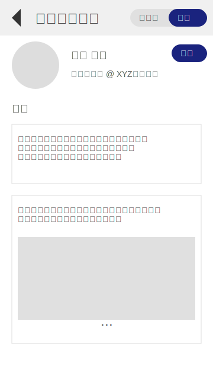
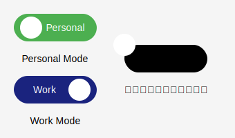
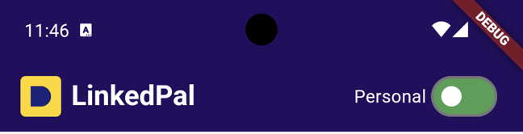
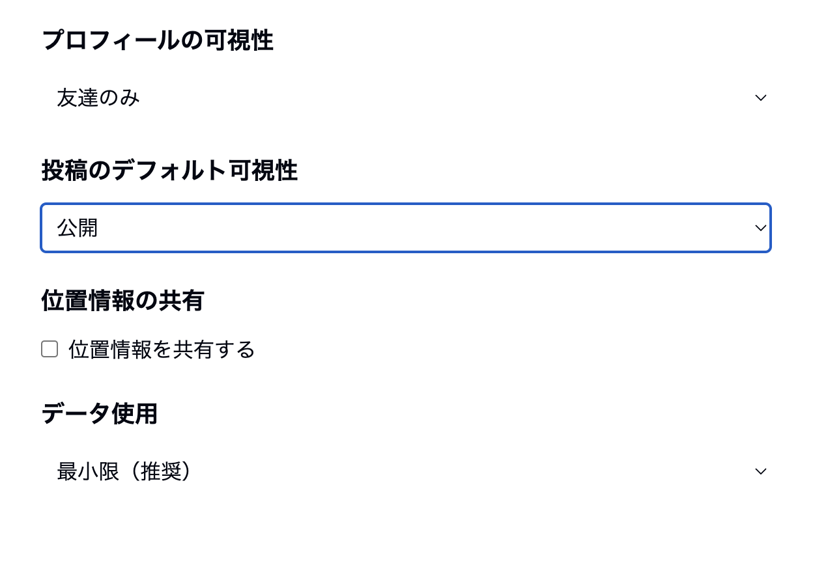

# サンプル事例で学ぶプロダクト開発入門 UI/UX編


# 0. はじめに

本書「事例で学ぶプロダクト開発入門 UI/UX編」は、「プロセスを眺めて学ぶプロダクト開発入門」の続編として位置付けられ、UI/UX（ユーザーインターフェースとユーザーエクスペリエンス）の分野を深掘りすることを目的としています。

## 本書の対象読者

本書は、前作と同様に、以下のような方々を主な対象読者としています：

- プロダクト開発の経験が少ない方
- エンジニアやデザイナーとのチームワークに不慣れな方
- プロダクトマネージャー、ビジネスアナリスト、マーケター
- プロダクト開発に興味のある学生や新入社員
- UI/UXの重要性を理解したい経営者や起業家

つまり、デザイナーやエンジニア以外のプロダクト開発に関わる全ての人たちを含んでいます。専門的な知識がなくても、UI/UXの重要性と基本的な概念を理解し、チームの一員として効果的に貢献できるようになることを目指しています。

## 本書の目的

本書の主な目的は、「UI/UXを突き詰める」とはどのようなことかを、具体的にイメージできるような入門書となることです。UI/UXは単に見た目を整えることではなく、ユーザーの問題を深く理解し、その解決策を効果的に提供することです。本書を通じて、以下のような点を学んでいただけます：

1. ユーザー中心設計の重要性と実践方法
2. プロトタイピングと反復的な改善プロセス
3. プライバシーとセキュリティを考慮したUI/UX設計
4. チーム全体でのUI/UX品質の向上方法

## 本書の構成

本書は、架空のプライバシー重視型SNS「LinkedPal」の開発プロセスを通じて、UI/UX設計の各段階を学んでいきます。以下が本書の全体構成です：

1. ユーザーリサーチと要求分析
2. ペルソナ作成とユーザーストーリーの展開
3. 情報アーキテクチャの設計
4. ワイヤーフレームの作成
5. インタラクションデザイン
6. ビジュアルデザイン
7. UIコンポーネントライブラリの作成とプロトタイピング
8. 結論：UI/UXデザインプロセスからの学び

各章では、理論的な説明だけでなく、具体的な事例や実践的なテクニック、チーム内でのコミュニケーション方法なども紹介します。これにより、読者の皆様が実際のプロジェクトでUI/UXの改善に貢献できるようサポートします。

## 本書の特徴

1. 実践的なアプローチ：架空のプロジェクト「LinkedPal」を通じて、UI/UX設計の全プロセスを体験できます。
2. ビジュアル重視：図表やワイヤーフレーム、プロトタイプの画像を多用し、視覚的な理解を促進します。
3. チーム協働の視点：デザイナーやエンジニアとの効果的な協力方法を随所で紹介します。
4. 倫理的配慮：プライバシーやセキュリティなど、現代のデジタルプロダクトに不可欠な要素を重視します。

本書を通じて、読者の皆様がUI/UXの重要性を理解し、プロダクト開発チームの一員としてより効果的に貢献できるようになることを願っています。UI/UXは、テクノロジーとユーザーを結ぶ重要な架け橋です。その本質を理解し、実践することで、より多くの人々に価値を提供できるプロダクトを生み出すことができるのです。

さあ、UI/UX設計の旅に出発しましょう！

# 1. ユーザーリサーチと要求分析

## この章で学ぶこと

1章では、プロダクト開発の初期段階におけるユーザーリサーチと要求定義について学びます。この章を通じて以下のポイントを理解します：

- ユーザーリサーチの目的と重要性
- 主要なリサーチ手法の選択と実施方法
- リサーチ結果の分析と洞察
- ユーザーニーズの抽出と優先順位付け
- プロダクト要求の定義

以下のフロー図は、ユーザーリサーチから要求定義までのプロセスを視覚的に示したものです。黄色の部分がこの章で扱う内容であり、緑色の部分が次章以降で扱う内容です。


## 1.1 ユーザーリサーチの目的と重要性

ユーザーリサーチは、プロダクト開発の初期段階で行われる重要なプロセスです。LinkedPalのようなプライバシー重視のSNSを開発する際、ユーザーのニーズや課題を深く理解することが不可欠です。

ユーザーリサーチの主な目的：
1. ターゲットユーザーの特定
2. ユーザーの行動パターンと習慣の理解
3. ユーザーの痛点と課題の発見
4. プライバシーに関する意識と要求の把握
5. 競合製品の利用状況とユーザー満足度の調査

## 1.2 リサーチ手法の選択と実施

LinkedPalの開発のために、以下のリサーチ手法を組み合わせて使用しました：

1. オンラインアンケート調査

    

   - 目的：幅広いユーザーからの定量的データ収集
   - 対象：既存のSNSユーザー1000名
   - 内容：SNS利用習慣、プライバシーへの意識、新しいSNSへの期待

2. インタビュー調査

    
  
   - 目的：深い洞察の獲得と定性的データの収集
   - 対象：各ターゲットセグメントから5-10名ずつ
   - 内容：SNS利用におけるプライバシーの課題、理想的なSNSの特徴

3. 競合分析

    
  
   - 目的：既存のSNSの機能とプライバシー保護の現状把握
   - 対象：主要なSNSプラットフォーム（Facebook, Twitter, LinkedIn等）
   - 内容：プライバシー設定オプション、ユーザーインターフェース、ユーザーフィードバック

4. ユーザーの行動観察

    
  
   - 目的：実際のSNS利用行動の把握
   - 対象：各年齢層から3-5名ずつ
   - 内容：SNSの日常的な使用パターン、プライバシー設定の操作方法

## 1.3 リサーチ結果の分析と洞察

収集したデータを分析し、以下の主要な洞察を得ました：

1. プライバシーへの高い関心
   - 回答者の75%が、現在のSNSのプライバシー保護に不安を感じている
   - 特に、35歳以上のユーザーがプライバシーに高い関心を示している

2. コンテキストに応じた情報共有の需要
   - ユーザーの60%が、仕事関連の人脈と私生活の人脈を分けて管理したいと回答
   - SNS上での文脈に応じた自己表現の必要性が浮き彫りに

3. プライバシー設定の複雑さへの不満
   - 現在のSNSのプライバシー設定を「複雑で分かりにくい」と感じるユーザーが65%

4. セキュアなメッセージングへの需要
   - 80%のユーザーが、エンドツーエンド暗号化などのセキュアなメッセージング機能を求めている

5. データ使用の透明性への要求
   - 90%のユーザーが、自分のデータがどのように使用されているかをより明確に知りたいと回答

6. 個人的なメモ機能への潜在的需要
   - 調査対象者の55%が、SNS上で人脈に関する個人的なメモを安全に保存したいと回答
   - 特にビジネスユーザーの間で、この需要が顕著（ビジネスユーザーの70%が関心を示す）

7. 情報の文脈化と個人化への要望
   - ユーザーの65%が、人脈に関する情報をより文脈化・個人化された形で管理したいと回答
   - 「相手との過去のやりとりや重要な情報を簡単に参照できる機能」への関心が高い

8. プライバシーを考慮した情報共有の難しさ
   - 回答者の50%が、「プライバシーを保ちつつ、必要な情報を適切に共有することの難しさ」を指摘

これらの洞察から、以下のようなユーザーニーズが抽出されました：

1. 直感的で管理しやすいプライバシー設定
2. コンテキストに応じた人脈管理と情報共有
3. セキュアなメッセージング機能
4. データ使用の透明性と制御
5. プロフェッショナルとプライベートの分離
6. 安全な個人メモ機能
7. 文脈に応じた情報の整理と参照機能
8. プライバシーを保護しつつ柔軟な情報共有を可能にする仕組み

これらのニーズは、LinkedPalの核となる機能と設計方針を決定する上で重要な指針となります。特に、新たに浮かび上がった「安全な個人メモ機能」と「文脈に応じた情報の整理と参照機能」への需要は、LinkedPalを他のSNSと差別化する重要な要素となる可能性があります。

## 1.4 ユーザーニーズの抽出と優先順位付け

リサーチ結果から抽出したユーザーニーズを、以下のように優先順位付けしました：

1. 直感的で管理しやすいプライバシー設定
   - 重要度：高
   - 理由：ユーザーの75%がプライバシー保護に不安を感じており、65%が現在の設定を複雑と感じている。

2. コンテキストに応じた人脈管理と情報共有
   - 重要度：高
   - 理由：60%のユーザーが仕事と私生活の人脈を分けて管理したいと回答。

3. セキュアなメッセージング機能
   - 重要度：高
   - 理由：80%のユーザーがセキュアなメッセージング機能を求めている。

4. 安全な個人メモ機能
   - 重要度：高
   - 理由：55%のユーザー（ビジネスユーザーでは70%）が人脈に関する個人的なメモを安全に保存したいと回答。他のSNSとの差別化要因となる。

5. データ使用の透明性と制御
   - 重要度：中
   - 理由：90%のユーザーがデータ使用の透明性を求めているが、他の機能と比較してやや優先度は下がる。

6. プロフェッショナルとプライベートの分離
   - 重要度：中
   - 理由：コンテキストに応じた人脈管理のニーズと重複する部分があるが、より細かい制御が必要。

7. 文脈に応じた情報の整理と参照機能
   - 重要度：中
   - 理由：65%のユーザーが人脈情報の文脈化・個人化を望んでおり、個人メモ機能と連携して実現可能。

8. プライバシーを保護しつつ柔軟な情報共有を可能にする仕組み
   - 重要度：中
   - 理由：50%のユーザーがこの課題を指摘しており、他の優先度の高い機能を組み合わせて対応可能。

これらのニーズの優先順位付けに基づき、LinkedPalの核となる機能と設計方針を以下のように決定しました：

1. プライバシーファーストの設計
   - すべての機能でプライバシーを最優先に考慮
   - 直感的で管理しやすいプライバシー設定インターフェース

2. コンテキスト認識型のインターフェース
   - 仕事用と私生活用のコンテキスト切り替え機能
   - コンテキストに基づいた情報フィルタリングと表示

3. 高度なセキュリティ機能
   - エンドツーエンド暗号化メッセージング
   - 二要素認証やバイオメトリクス認証の実装

4. 安全な個人メモ機能
   - 各人脈に対する個人的なメモの追加・管理機能
   - 高度な暗号化によるメモの保護
   - コンテキストに応じたメモの表示と整理

5. データ透明性ダッシュボード
   - ユーザーデータの使用状況を可視化
   - データアクセスと削除の簡易的な制御機能

6. カスタマイズ可能なプロフィール管理
   - 複数のペルソナ（仕事用、私生活用等）の作成と管理
   - 各ペルソナに応じた情報共有設定

これらの優先順位とニーズに基づいて、LinkedPalは他のSNSと明確に差別化されたプラットフォームとなります。特に、安全な個人メモ機能の導入は、プライバシーを重視しつつ、ユーザーに高い付加価値を提供する独自の特徴となるでしょう。

次の段階では、これらのニーズと優先順位に基づいて、具体的な機能要件と設計仕様を策定していきます。

## 1.5 プロダクト要求の定義

ユーザーニーズの分析と優先順位付けに基づき、LinkedPalの主要な要求を以下のように定義しました：

1. プライバシーファーストの設計
   - すべての機能でプライバシーを最優先に考慮
   - デフォルトで最も高いプライバシー設定を適用
   - 直感的なUI/UXによるプライバシー設定の管理
   - 各アクションにおけるプライバシー影響の可視化

2. コンテキスト認識型のインターフェース
   - ユーザーの現在のコンテキスト（仕事、私生活等）に応じたUI/UXの提供
   - コンテキストに基づいた情報フィルタリングと表示
   - スムーズなコンテキスト切り替え機能
   - コンテキストごとの独立したプライバシー設定

3. 高度なセキュリティ機能
   - エンドツーエンド暗号化メッセージング
   - 二要素認証やバイオメトリクス認証の実装
   - データの暗号化保存とセキュアなクラウドストレージ
   - セキュリティ状態の常時可視化

4. 安全な個人メモ機能
   - 各人脈に対する個人的なメモの追加・編集・削除機能
   - メモの暗号化保存と、作成者以外のアクセス制限
   - コンテキスト（仕事/私生活）に応じたメモの表示と管理
   - メモへのタグ付けと検索機能
   - メモの重要度設定と、それに基づいた表示優先順位の調整

5. データ透明性ダッシュボード
   - ユーザーデータの使用状況をリアルタイムで可視化
   - データアクセスログの提供
   - データの削除や利用制限の簡易的な制御機能
   - サードパーティアプリケーションによるデータアクセスの管理

6. カスタマイズ可能なプロフィール管理
   - 複数のペルソナ（仕事用、私生活用等）の作成と管理
   - 各ペルソナに応じた情報共有設定
   - ペルソナごとのプライバシーレベルのカスタマイズ
   - ペルソナ切り替えの簡易化と視覚的フィードバック

7. コンテキストに応じた情報共有システム
   - 投稿やメッセージの公開範囲を細かく制御
   - コンテキストに基づいた自動的な公開範囲の提案
   - 共有情報の期限設定（一定期間後に自動的に非公開化）
   - 誤った公開範囲設定の警告システム

8. インテリジェントな人脈管理
   - AIを活用した人脈のグループ化と整理
   - 交流頻度や関係性の強さに基づいた人脈のランク付け
   - 人脈との最新のやりとりや共有情報の要約表示
   - 個人メモ機能と連携した、コンテキストに応じた人脈情報の提示

これらの要求は、LinkedPalの核となる機能と設計方針を具体化したものです。特に、安全な個人メモ機能の導入により、プライバシーを重視しつつ、ユーザーに高い付加価値を提供する独自の特徴を実現します。

各要求は、プライバシー保護とユーザビリティのバランスを考慮しつつ、ユーザーのコンテキストに応じた柔軟な情報管理を可能にすることを目指しています。これにより、LinkedPalは単なる社会的ネットワーキングツールを超えて、安全で効率的な個人情報管理プラットフォームとしての地位を確立することができるでしょう。

次の段階では、これらの要求に基づいて、詳細な機能仕様と技術要件を策定し、ユーザーインターフェースの設計に移行します。各要求の実現にあたっては、ユーザビリティテストとフィードバックループを通じて、継続的な改善と最適化を行っていく必要があります。

# 2. ペルソナ作成とユーザーストーリーの展開

## この章で学ぶこと

2章では、ユーザーニーズを具体的に反映させるためのペルソナ作成とユーザーストーリー展開について学びます。この章を通じて以下のポイントを理解します：

- ペルソナ作成の目的と方法
- ユーザーストーリーの展開とその重要性
- ペルソナとユーザーストーリーの実際のプロダクトへの反映方法
- 要求定義の見直しと改善

以下のフロー図は、ユーザーリサーチから要求定義、ペルソナ作成、ユーザーストーリー展開、そして要求定義の見直しまでのプロセスを視覚的に示したものです。黄色の部分が1章で扱う内容であり、緑色の部分がこの章で扱う内容です。


## 2.1 ペルソナ作成の目的と重要性

ペルソナは、リサーチデータに基づいて作成された架空のユーザープロフィールです。LinkedPalの開発において、ペルソナは以下の役割を果たします：

1. ユーザーの具体的なイメージ化
2. デザイン決定の指針となる
3. チーム全体でのユーザー理解の共有
4. 機能やUIの優先順位付けの基準

## 2.2 主要ペルソナの作成

リサーチ結果に基づき、LinkedPalの主要なターゲットユーザーを代表する2つのペルソナを作成しました。

### ペルソナ1: 佐藤 真理子（さとう まりこ）


- 年齢: 32歳
- 職業: IT企業のプロジェクトマネージャー
- 年収: 800万円

**背景:**
真理子は、大手IT企業で5年間プロジェクトマネージャーとして働いています。キャリア志向が強く、仕事上の人脈作りに積極的です。プライベートでは、趣味のヨガを通じて心身のバランスを保っています。

**目標:**
- 仕事上のネットワークを拡大し、キャリアアップにつなげたい
- プライベートと仕事の人間関係を適切に管理したい
- オンライン上の評判を戦略的に構築したい

**ニーズ:**
- 仕事上の人脈に関する重要な情報を安全に記録し、必要なときにすぐに参照したい
- プライバシーを守りつつ、顧客や同僚との関係を効率的に管理したい

**懸念:**
- SNS上での不用意な投稿が、キャリアに悪影響を与える可能性
- 個人情報の漏洩やプライバシーの侵害

**フラストレーション:**
- 顧客との会話で得た重要な情報を、セキュリティの懸念から既存のSNSやメモアプリに記録できない
- 仕事用と私用の人脈情報が混在し、適切なコンテキストで情報を管理できない

**行動パターン:**
- 朝はニュースアプリでビジネス情報をチェック
- 通勤中にLinkedInで業界動向や人脈の更新を確認
- 昼休みや帰宅後にInstagramで友人の近況をチェック
- 週末にはヨガのコミュニティで新しい人々と交流

**価値観:**
- プロフェッショナリズムとワークライフバランスを重視
- 質の高い情報と人脈を大切にする
- プライバシーとセキュリティに高い関心がある

**LinkedPalへの期待:**
- 仕事用と私用の人脈を明確に分離できる機能
- 高度なプライバシー設定によるコンテンツの選択的共有
- 専門性の高いネットワーキング機会の提供

### ペルソナ2: 山田 健太郎（やまだ けんたろう）


- 年齢: 45歳
- 職業: 製薬会社の研究開発部門マネージャー
- 年収: 1,200万円

**背景:**
健太郎は、大手製薬会社で15年以上のキャリアを持つ研究者です。最近、マネージャーに昇進し、リーダーシップスキルの向上に力を入れています。家族を大切にし、週末は家族との時間を優先しています。

**目標:**
- 業界内外の専門家とのネットワークを構築し、最新の研究動向を把握したい
- チームのパフォーマンスを向上させるためのリーダーシップスキルを磨きたい
- 家族との絆を深めながら、プロフェッショナルとしての成長も続けたい

**ニーズ:**
- 研究分野の専門家との会話で得たアイデアや洞察を、安全かつ整理された形で記録したい
- 家族や友人に関する個人的な情報（誕生日、好みなど）を、プライバシーを守りつつ管理したい

**懸念:**
- 機密性の高い研究情報の漏洩
- オンライン上での過度な露出が、プロフェッショナルとしての評判に影響を与える可能性
- 仕事とプライベートの境界が曖昧になることへの不安

**行動パターン:**
- 朝は科学系ニュースサイトで最新情報をチェック
- 仕事中は専門的なオンラインフォーラムで情報交換
- 帰宅後、家族との時間を過ごした後、学術論文データベースで研究をフォロー
- 月に1-2回、業界セミナーやネットワーキングイベントに参加

**価値観:**
- 科学的厳密性と倫理を重視
- 継続的な学習と自己改善を大切にする
- 家族との時間とプロフェッショナルとしての成長のバランスを重視

**LinkedPalへの期待:**
- 高度なプライバシー設定と情報セキュリティ機能
- 専門分野に特化したネットワーキングと情報共有の場
- 家族や親しい友人との私的なコミュニケーション空間の確保

## 2.3 ユーザーストーリーの展開

ペルソナに基づいて、具体的なユーザーストーリーを展開します。これにより、LinkedPalの機能やUI/UXの設計指針を明確にします。

### 佐藤真理子のユーザーストーリー

1. プロフィール管理
   - ストーリー：真理子として、仕事用と私生活用の異なるプロフィールを作成し管理したい。それによって、適切な人脈に適切な情報を共有できるようにしたい。
   - 機能要件：複数のペルソナ（プロフィール）作成機能、コンテキストに応じたプロフィール切り替え機能

2. プライバシー設定
   - ストーリー：真理子として、投稿ごとにプライバシーレベルを簡単に設定したい。それによって、仕事関連の投稿が私生活の友人に見えないようにしたい。
   - 機能要件：直感的なプライバシー設定UI、投稿ごとの公開範囲設定機能

3. ネットワーキング
   - ストーリー：真理子として、業界イベントで出会った人とすぐに専門的なつながりを作りたい。それによって、キャリア向上につながる人脈を拡大したい。
   - 機能要件：QRコードによる迅速な人脈追加機能、専門性に基づいたネットワーク推奨機能

4. 安全な個人メモ機能

    - ストーリー：真理子として、顧客との会話で得た重要な情報（食事の好み、アレルギーなど）を安全に記録し、次回の商談前に簡単に参照したい。それによって、よりパーソナライズされたサービスを提供し、顧客との関係を強化したい。
    - 機能要件：暗号化された個人メモ機能、コンテキスト（仕事/私生活）に基づいたメモの管理、タグ付けと検索機能

### 山田健太郎のユーザーストーリー

1. セキュアな情報共有
   - ストーリー：健太郎として、研究プロジェクトのチームメンバーと機密情報を安全に共有したい。それによって、情報漏洩のリスクを最小限に抑えたい。
   - 機能要件：エンドツーエンド暗号化メッセージング、ドキュメント共有の権限管理機能

2. ワークライフバランス管理
   - ストーリー：健太郎として、仕事モードと家族モードを明確に切り替えたい。それによって、家族との時間を大切にしながら、必要な時に仕事の連絡も見逃さないようにしたい。
   - 機能要件：モード切替機能、モードに応じた通知設定

3. 専門知識の交換
   - ストーリー：健太郎として、特定の研究トピックについて他の専門家と議論したい。それによって、最新の知見を得たり、自分のアイデアを検証したりしたい。
   - 機能要件：トピックベースのディスカッショングループ、専門家検索機能

4. 研究ネットワークの管理

    - ストーリー：健太郎として、学会で出会った研究者との会話内容や、共有されたアイデアを安全に記録し、後で容易に参照したい。それによって、研究ネットワークを効果的に拡大し、新たな共同研究の機会を見つけたい。
    - 機能要件：個人メモのコンテキストベース表示、メモの重要度設定、リマインダー機能


5. プライベートな記念日管理

    - ストーリー：健太郎として、家族や親しい友人の誕生日や記念日を、プライバシーを守りつつ管理したい。それによって、大切な人との関係を維持し、重要な日を忘れずに祝福したい。
    - 機能要件：プライベートカレンダーとの連携、セキュアな通知機能、メモの共有設定（自分のみ閲覧可能）

これらの更新されたペルソナとユーザーストーリーにより、安全な個人メモ機能の必要性と具体的な使用シナリオが明確になります。これは、LinkedPalの差別化要因としてのメモ機能の重要性を強調し、後続の設計プロセスにおいて、この機能を自然に組み込む基礎となります。

次は、これらのペルソナとユーザーストーリーを基に、LinkedPalの具体的な情報アーキテクチャとワイヤーフレームの作成に進みます。プライバシーを重視しつつ、ユーザーの多様なニーズに応える直感的なインターフェースをどのように設計するか、詳細に検討していきます。

# 2.5 UX/UIデザインワークフロー：アイデアから高忠実度モックアップまで

## 2.5.1 はじめに

ここでは、これから詳しく説明していく各段階が全体のプロセスの中でどのように位置づけられるのかを理解するために、UX/UIデザインの全体的なワークフローを俯瞰します。この概要を押さえることで、以降の章でより深く各段階を学ぶ際の道しるべとなります。

プロダクト開発、特にUX/UIデザインのプロセスは、アイデアを具体的な形にしていく創造的な旅といえます。以下に、LinkedPalのようなプロダクトを開発する際の典型的なワークフローを示します。

## 2.5.2 UX/UIデザインワークフロー

1. **アイデア整理と要件定義**
   - 目的：プロダクトのコンセプトと主要機能を明確化
   - ツール：マインドマップ（XMind, MindMeister等）、ドキュメントツール（Google Docs, Notion等）
   - 成果物：コンセプトドキュメント、機能要件リスト

2. **情報アーキテクチャの設計**
   - 目的：全体の画面構成と画面間の関係性を整理
   - ツール：図表作成ツール（draw.io, Mermaid等）
   - 成果物：サイトマップ、画面遷移図

   例：
   ```mermaid
   graph TD
       A[ホーム画面] --> B[プロフィール]
       A --> C[メッセージ]
       A --> D[プライバシー設定]
       B --> E[編集]
       C --> F[新規メッセージ]
       D --> G[詳細設定]
   ```

3. **低忠実度ワイヤーフレーム作成**

    

   - 目的：各画面の基本レイアウトと主要機能を視覚化
   - ツール：スケッチアプリ（Balsamiq, Sketch等）、SVGエディタ
   - 成果物：手書き風の簡易ワイヤーフレーム

4. **中忠実度モックアップ作成**

    

   - 目的：インタラクティブな要素を含む、より詳細なレイアウトの作成
   - ツール：Figma, Adobe XD, React（Create React App等）
   - 成果物：クリック可能な画面プロトタイプ

5. **ユーザーフィードバックの収集**
   - 目的：初期デザインの使いやすさと機能性の検証
   - ツール：ユーザーテストツール（UserTesting, Hotjar等）、アンケートツール（Google Forms, SurveyMonkey等）
   - 成果物：ユーザーフィードバックレポート、改善点リスト

6. **デザインの改善とイテレーション**
   - 目的：フィードバックに基づくデザインの洗練
   - ツール：デザインツール（Figma, Sketch等）
   - 成果物：改訂されたワイヤーフレームとモックアップ

7. **高忠実度モックアップ作成**

    

   - 目的：最終的なビジュアルデザインとインタラクションの詳細化
   - ツール：デザインツール（Figma, Sketch等）、プロトタイピングツール（InVision, Framer等）
   - 成果物：最終的なUI設計、スタイルガイド、インタラクションの詳細

8. **デザイン仕様書の作成**
   - 目的：開発チームへの設計意図と詳細の伝達
   - ツール：ドキュメントツール（Confluence, Zeplin等）
   - 成果物：UI/UXデザイン仕様書、コンポーネントライブラリ

## 2.5.3 ワークフローの特徴と注意点

1. **反復的プロセス**：このワークフローは直線的ではありません。各段階で得られた知見や課題に基づいて、前の段階に戻って修正を加えることも頻繁にあります。

2. **ユーザー中心設計**：各段階でユーザーのニーズと体験を最優先に考えることが重要です。特にLinkedPalのようなプライバシー重視のアプリでは、ユーザーの信頼を得るためのデザインが crucial です。

3. **チームコラボレーション**：デザイナーだけでなく、開発者、プロダクトマネージャー、ステークホルダーとの密接な連携が必要です。特に、プライバシーに関する法的要件や技術的制約について、早期から関係者と協議することが重要です。

4. **ツールの選択**：プロジェクトの規模や팀の習熟度に応じて、適切なツールを選択することが効率的な開発につながります。

5. **デザインシステムの構築**：プロジェクトの進行に伴い、再利用可能なコンポーネントやデザインパターンをデザインシステムとして整理していくことで、一貫性のあるユーザー体験を効率的に作り出すことができます。

## 2.5.4 まとめ

このワークフローは、アイデアを具体的なデザインへと昇華させていく道筋を示しています。以降の章では、この流れに沿って各段階を詳しく解説していきます。第3章では情報アーキテクチャの設計、第4章ではワイヤーフレームの作成、第5章ではインタラクションデザイン、第6章ではビジュアルデザインについて、それぞれ深掘りしていきます。

各章を読み進める際は、ここで示したワークフローを念頭に置くことで、各段階の位置づけとつながりをより理解しやすくなるでしょう。また、実際のプロジェクトでは、このワークフローを基本としつつ、プロジェクトの特性や팀の構成に応じて柔軟にアレンジしていくことが大切です。

LinkedPalのようなプライバシー重視のアプリケーション開発では、各段階でユーザーのプライバシーとセキュリティへの配慮を忘れずに、信頼性の高いユーザー体験を設計していくことが成功の鍵となります。

# 3. 情報アーキテクチャの設計

## 3.1 情報アーキテクチャの重要性

情報アーキテクチャ（IA）は、デジタルプロダクトの骨格を形成する重要な要素です。IAは、情報の構造化、組織化、ラベリング、そして検索のしやすさを設計するプロセスです。適切に設計されたIAは、ユーザーが必要な情報を直感的に見つけ、タスクを効率的に完了できるようサポートします。

### 定義と目的

情報アーキテクチャの主な目的は以下の通りです：

1. 情報の構造化：コンテンツを論理的にグループ化し、ユーザーが理解しやすい構造を作る
2. ナビゲーションの設計：ユーザーがアプリケーション内を迷わずに移動できるようにする
3. 検索性の向上：ユーザーが求める情報を容易に見つけられるようにする
4. ユーザー体験の一貫性：全体を通じて一貫したメンタルモデルを提供する

### プライバシー重視のSNSにおける特別な考慮事項

LinkedPalのようなプライバシー重視のSNSでは、通常のIAの考慮事項に加えて、以下の点に特に注意を払う必要があります：

1. プライバシー設定の可視性：ユーザーが常に現在のプライバシー状態を認識し、容易に設定を変更できるようにする
2. コンテキストの明確化：ユーザーが現在どのコンテキスト（例：仕事用、私生活用）で操作しているかを常に把握できるようにする
3. データフローの透明性：ユーザーの情報がどのように共有され、使用されるかを明確に示す
4. 段階的な情報開示：必要最小限の情報から始め、ユーザーの選択に応じて詳細情報を表示する
5. セキュアな機能へのアクセス：暗号化されたメッセージングなど、セキュリティ重視の機能への容易なアクセスを提供する

これらの考慮事項を念頭に置きながら、LinkedPalの情報アーキテクチャを設計していきます。

## 3.2 初期の情報アーキテクチャ設計

LinkedPalの初期設計段階では、プロジェクトの核となる特徴を反映しつつ、ユーザーのニーズを満たす構造を作ることに注力しました。

### LinkedPalの核となる特徴の反映

1. プライバシー保護
   - すべての画面でプライバシー設定へのアクセスを容易にする
   - デフォルトで最高レベルのプライバシー設定を適用
   - ユーザーの承諾なしに情報が共有されないよう、明示的な許可プロセスを設計

2. コンテキストベースの接続
   - ユーザーが異なるコンテキスト（仕事、私生活など）を切り替えられる機能を中心に設計
   - 各コンテキストに応じた情報とコンテンツの表示を可能にする構造

3. 安全な個人メモ機能

    - 各人脈に関連付けられた個人メモの作成と管理
    - メモの暗号化保存とアクセス制御
    - コンテキスト（仕事、私生活）に応じたメモの表示と管理

### ユーザーニーズの分析

ユーザーリサーチから得られた主要なニーズを以下にまとめます：

1. 簡単なプライバシー管理
2. コンテキストに応じた情報共有
3. セキュアなメッセージング
4. データ使用の透明性
5. プロフェッショナルとプライベートの分離
6. 人脈に関連したメモ情報を安全に管理
7. コンテキストに応じたメモの整理と参照

### 初期の画面構成と遷移図

これらのニーズと特徴を反映した初期の画面構成を以下に示します：


### 主要機能の配置と階層

1. ホーム画面：アプリケーションの中心として、他の主要機能へのアクセスを提供
2. プロフィール画面：ユーザーの個人情報管理の中心
3. メッセージ機能：セキュアなコミュニケーションのハブ
4. プライバシー設定：すべての画面から容易にアクセス可能
5. コンテキスト切替：ホーム画面から直接アクセス可能な中心的機能
6. 個人メモ機能：友だち詳細画面から直接アクセス可能、コンテキストに応じて表示

この初期設計では、プライバシーとコンテキスト管理を最優先に考慮し、ユーザーが常にこれらの要素を意識できるよう配置しました。しかし、この設計にはいくつかの課題も存在します。例えば、機能へのアクセスが分散しており、ナビゲーションが複雑になる可能性があります。

次のセクションでは、この初期設計に対するユーザーテストと評価を行い、改善点を特定していきます。

## 3.3 ユーザーテストと評価

初期の情報アーキテクチャ設計を評価するため、25名の参加者（年齢25-45歳、様々な技術習熟度）を対象に一連のユーザーテストを実施しました。

### テスト方法

1. タスク完了テスト：
   - 5つの主要タスクを設定し、完了までの時間と成功率を測定
   - 各タスクの制限時間は3分

2. Think-aloud法：
   - 参加者にタスク実行中の思考を声に出してもらい、録音
   - 特に躊躇や混乱が見られた箇所を注意深く観察

3. System Usability Scale (SUS)：
   - 10項目の標準化されたアンケートを使用
   - 0-100のスケールで全体的な使いやすさを評価

4. フォーカスグループインタビュー：
   - 5人1組で5セッションを実施
   - 各セッション60分間で、詳細なフィードバックを収集

### ユーザーフィードバックの収集

参加者に以下のタスクを実行してもらいました：

1. 新規アカウント作成とプロフィール設定
2. コンテキストの切り替え（仕事用→私生活用）
3. プライバシー設定の変更
4. セキュアなメッセージの送信
5. 特定のコンテキストでの投稿作成
6. 特定の人脈に対する個人メモの作成と編集

### 主な発見事項と課題

1. プライバシー設定の複雑さ
   - タスク完了率：68%（17/25人）
   - 平均完了時間：2分35秒
   - 参加者の声：「設定項目が多すぎて、どれが重要なのかわかりにくい」（35歳、男性）

2. ナビゲーションの煩雑さ
   - タスク完了率：76%（19/25人）
   - 平均完了時間：2分10秒
   - 参加者の声：「メッセージ機能にたどり着くまでに何度もタップが必要だった」（28歳、女性）

3. コンテキスト切替の不明瞭さ
   - タスク完了率：60%（15/25人）
   - 平均完了時間：2分50秒
   - 参加者の声：「コンテキスト切替ボタンの存在に気づくまで時間がかかった」（42歳、男性）

4. 情報の過負荷
   - SUSスコア平均：62/100（業界平均は68）
   - 参加者の声：「ホーム画面に情報が多すぎて、必要な機能を見つけるのに苦労した」（31歳、女性）

5. プライバシーレベルの視覚化が分かりにくい
   - フォーカスグループでの主要な懸念事項として挙げられた
   - 参加者の声：「いちいち公開先などを意識するのはめんどくさいし、もっとシンプルにしてほしい」（39歳、男性）

6. メモ機能の認知度と使いやすさ

    - タスク完了率：70%（18/25人）
    - 平均完了時間：2分20秒
    - 参加者の声：「メモ機能は便利だが、見つけにくい位置にある」（33歳、女性）

### 改善提案

1. プライバシー設定の簡素化
   - コンテクストに合わせて情報を切り替える程度の手軽さに変更
   - 投稿やメモについて一般に公開するような設定をそもそも排除
   - 特にメモについては自分以外には一切表示させないよう設計

2. ナビゲーション構造の最適化
   - ボトムナビゲーションバーの導入
   - 主要機能へのアクセスを1-2タップ以内に抑える

3. コンテキスト切替の改善
   - ホーム画面上部にスイッチ形式のコンテキスト切替を配置
   - 現在のコンテキストを色とアイコンで明確に表示

4. 情報の整理
   - ホーム画面のレイアウトを見直し、重要な情報のみを表示
   - その他の情報は必要に応じて展開できるように設計

5. メモ機能へのアクセス改善
    - 友だち詳細画面からのメモ追加ボタンを目立つ位置に配置
    - メモのコンテキスト（仕事/私生活）切替を簡単に行えるよう設計

これらの発見事項を基に、情報アーキテクチャの再設計を行うことにしました。

## 3.4 設計の再検討と改善

ユーザーテストの結果を踏まえ、LinkedPalの情報アーキテクチャを以下のように改善しました。

### ユーザビリティとプライバシーのバランス

1. プライバシー設定の簡素化
   - コンテクスト切り替えのみで公開範囲を決めるよう割り切った形へ
   - 投稿やメモについて一般に公開するような設定を排除
   - メモについては自分以外には一切表示させない

### ナビゲーション構造の最適化

1. ボトムナビゲーションバーの導入
   - 最も重要な5つの機能（ホーム、メッセージ、投稿作成、通知、メニュー）にクイックアクセスを提供

2. メニュー画面の新設
   - 頻繁に使用されない機能（設定、プライバシーダッシュボード、ヘルプなど）をメニューにまとめた

3. コンテキスト切替の統合
   - ホーム画面上部にコンテキスト切替機能を配置し、常に現在のコンテキストを表示

### メモ機能の統合

1. アクセシビリティの向上
    - 友だち詳細画面にフローティングアクションボタンを追加し、メモ追加を容易に
    - メモ一覧画面での検索とフィルタリング機能の追加

2. コンテキスト認識型メモ管理
    - 現在のコンテキスト（仕事/私生活）に応じたメモの表示
    - メモ作成時に自動的にコンテキストタグを付与

3. プライバシー保護の強化
    - メモごとのプライバシー設定（自分のみ/特定の人と共有/公開）
    - 暗号化保存と作成日の記録

### 新たな画面構成の提案

これらの改善を反映した新たな画面構成を以下に示します：


### 改善された画面遷移図の特徴

1. スプラッシュ画面
   - LinkedPalのロゴとタグライン表示
   - アプリのロード中に表示

2. ログイン画面
   - ユーザー名/メールアドレスとパスワード入力フィールド
   - ログインボタン
   - パスワードリセットリンク
   - 新規アカウント作成リンク

3. ホーム画面
   - コンテキスト切替機能（画面上部）
   - フィード（友達の投稿、おすすめコンテンツ）
   - プライバシーレベルインジケーター（常時表示）
   - ボトムナビゲーションバー

4. プロフィール画面
   - ユーザーのプロフィール情報表示
   - プライバシー設定に基づいた情報表示制御
   - プロフィール編集オプション

5. メッセージ画面
   - メッセージスレッド一覧
   - 新規メッセージ作成オプション
   - 暗号化状態の表示

6. 投稿作成画面
   - テキスト入力フィールド
   - メディア添付オプション
   - コンテキストに基づくプライバシーレベル表示

7. 通知画面
   - 全ての通知のリスト表示
   - タイプ別フィルタリング（メッセージ、人脈関連、その他）

8. 設定画面
   - プロフィール編集へのリンク
   - アカウント設定へのリンク
   - 人脈管理
        - 仕事の友達管理
        - プライベートの友達管理
   - データエクスポート
   - ヘルプ・サポートへのリンク

9. 人脈一覧画面
   - ユーザーの人脈リスト表示
   - コンテキストに応じた人脈のフィルタリング

10. 友だち詳細画面
    - 個別の友だち情報の詳細表示
    - 関連する個人メモの表示
    - 新規メモ追加機能へのクイックアクセス
    - 友達関係編集ボタン

11. メモ編集画面
    - メモの作成・編集機能
    - コンテキストとプライバシー設定の選択

12. メモ一覧画面
    - 特定の友だちに関する全メモの一覧
    - 検索とフィルタリング機能

13. 友達関係変更画面
    - コンテキスト（仕事/プライベート）の変更オプション
    - 両方のコンテキストに所属させるオプション
    - 友達関係の削除オプション
    - 変更の確認と適用ボタン

14. 仕事の友だち管理画面
    - 仕事の友だちがフィルタリングされてリスト表示
    - リストアイテムを選択することで友だち関係変更画面に遷移

15. プライベートの友だち管理画面
    - プライベートの友だちがフィルタリングされてリスト表示
    - リストアイテムを選択することで友だち関係変更画面に遷移

この更新された画面一覧では、以下の主要な変更点が反映されています：

1. プライバシー設定の簡素化：独立したプライバシー設定画面が削除され、各機能に統合されています。

2. コンテキスト切替の統合：ホーム画面にコンテキスト切替機能が組み込まれています。

3. メモ機能の追加：友だち詳細画面からアクセス可能なメモ機能が新たに追加されています。

4. メニュー画面の再構成：頻度の低い機能がメニュー画面にまとめられ、主要機能へのアクセスが簡素化されています。

5. プロフィール管理の改善：プロフィール表示と編集が分離され、より管理しやすくなっています。

これらの変更により、ユーザーインターフェースがよりシンプルで直感的になり、プライバシー管理と情報共有のバランスが改善されています。

次のセクションでは、この改善された情報アーキテクチャに基づいて、各画面の詳細な内容と機能について説明していきます。

## 3.5 最終的な情報アーキテクチャの提示

ユーザーテストと評価を経て改善された LinkedPal の情報アーキテクチャを、ここで詳細に提示します。この設計は、プライバシー保護とユーザビリティのバランスを取りつつ、直感的な操作性を実現することを目指しています。

### 更新された画面一覧と内容

1. スプラッシュ画面
   - LinkedPal のロゴとタグライン
   - アプリのロード中に表示

2. ログイン画面
   - ユーザー名/メールアドレスとパスワード入力フィールド
   - 新規アカウント作成リンク
   - パスワードリセットリンク

3. ホーム画面
   - コンテキスト切替機能（画面上部）
   - フィード（友達の投稿、おすすめコンテンツ）
   - 通知アイコン
   - ボトムナビゲーションバー

4. プロフィール画面
   - ユーザーのプロフィール情報表示
   - コンテキストに応じた情報表示制御
   - プロフィール編集オプション

5. メッセージ画面
   - メッセージスレッド一覧
   - 新規メッセージ作成オプション
   - 暗号化状態の表示

6. 投稿作成画面
   - テキスト入力フィールド
   - メディア添付オプション
   - 現在のコンテキスト表示

7. 通知画面
   - 全ての通知のリスト表示
   - タイプ別フィルタリング（メッセージ、人脈関連、その他）

8. 設定画面
   - プロフィール編集へのリンク
   - アカウント設定へのリンク
   - 仕事の友達管理へのリンク
   - 私生活の友達管理へのリンク
   - データエクスポート
   - ヘルプ・サポートへのリンク

9. 人脈一覧画面
   - ユーザーの人脈リスト表示
   - コンテキストに応じた人脈のフィルタリング

10. 友だち詳細画面
    - 個別の友だち情報の詳細表示
    - 関連する個人メモの表示
    - 新規メモ追加機能へのクイックアクセス

11. メモ編集画面
    - メモの作成・編集機能
    - 現在のコンテキスト表示

12. メモ一覧画面
    - 特定の友だちに関する全メモの一覧
    - 検索とフィルタリング機能

13. 友達関係変更画面
    - コンテキスト（仕事/プライベート）の変更オプション
    - 両方のコンテキストに所属させるオプション
    - 友達関係の削除オプション

14. 仕事の友だち管理画面
    - 仕事の友だちがフィルタリングされてリスト表示
    - リストアイテムを選択することで友だち関係変更画面に遷移

15. プライベートの友だち管理画面
    - プライベートの友だちがフィルタリングされてリスト表示
    - リストアイテムを選択することで友だち関係変更画面に遷移

### 主要な画面の詳細説明

#### ホーム画面

ホーム画面は LinkedPal の中心的な画面であり、以下の要素を含みます：

1. ヘッダーバー：
   - 画面上部に配置
   - 現在のコンテキスト（例：仕事、プライベート）を明示
   - タップでコンテキスト切替オプションを表示

2. フィード：
   - 選択されたコンテキストに関連する投稿を表示
   - コンテキストに基づいてコンテンツをフィルタリング

3. 通知アイコン：
   - 画面右上に配置
   - 未読通知がある場合、バッジで表示

4. ボトムナビゲーションバー：
   - ホーム、メッセージ、人脈、設定へのクイックアクセス

5. フローティングアクションボタン：
   - 投稿作成へのクイックアクセス

#### プロフィール画面

プロフィール画面では、ユーザーの情報を表示し、コンテキストに基づいて情報の可視性を制御します：

1. プロフィール情報：
   - 基本情報（名前、プロフィール画像）
   - 職業情報（現在の職場、役職）
   - 趣味・興味（選択的に表示）

2. コンテキスト表示：
   - 現在のコンテキストを明示的に表示
   - コンテキストに応じた情報のフィルタリング

3. プロフィール編集オプション：
   - 「編集」ボタンをタップしてプロフィール情報を更新
   - コンテキストごとの情報表示設定を調整可能

#### メッセージ画面

メッセージ画面は、セキュアなコミュニケーションを提供します：

1. メッセージスレッド一覧：
   - 最新のメッセージを上部に表示
   - 各スレッドに暗号化状態を示すアイコンを表示

2. 新規メッセージ作成：
   - 右下の「+」ボタンをタップして新規メッセージを作成
   - 受信者選択時にコンテキストを考慮した候補を表示

3. メッセージ詳細：
   - エンドツーエンド暗号化の視覚的表示
   - メッセージの自動削除オプション

#### 友だち詳細画面

友だち詳細画面は、個別の人脈情報と関連するメモを統合的に管理する中心的な画面です：

1. 基本情報表示：
    - プロフィール情報（名前、職業、所属など）
    - 現在のコンテキストに応じた情報のフィルタリング

2. メモセクション：
    - 関連するメモのプレビュー表示
    - 新規メモ追加のためのフローティングアクションボタン

3. 友だち関係の管理：
    - 現在の関係性（仕事/プライベート/両方）の表示
    - 友だち関係変更画面へのリンク

4. コンテキスト表示：
    - 現在のコンテキストを明示的に表示
    - コンテキストに応じた情報表示の動的変更

### プライバシー保護の統合方法

プライバシー保護は、アプリケーション全体を通じて統合されています：

1. コンテキストベースのプライバシー管理：
   - 各コンテキスト（仕事、プライベートなど）で異なる情報共有設定を自動適用
   - ユーザーの操作を最小限に抑えつつ、適切なプライバシー保護を実現

2. 暗黙的なプライバシー設定：
   - 投稿やメモの作成時に、現在のコンテキストに基づいて自動的に公開範囲を設定
   - ユーザーが明示的にプライバシー設定を行う必要性を削減

3. 友だち関係の柔軟な管理：
   - 友だちごとにコンテキスト（仕事/プライベート/両方）を設定可能
   - 友だち関係変更画面を通じて、簡単に関係性を調整可能

4. セキュアなメッセージング：
   - すべてのメッセージにエンドツーエンド暗号化を適用
   - 暗号化状態を視覚的に表示し、ユーザーに安心感を提供

5. コンテキスト切替の視覚化：
   - 常にユーザーの現在のコンテキストを明示的に表示
   - ユーザーが現在の情報共有状態を容易に理解できるよう支援

このアプローチにより、LinkedPalはユーザーのプライバシーを保護しつつ、複雑な設定を必要としない直感的な操作性を実現しています。コンテキストベースの情報管理により、ユーザーは常に適切な情報を適切な相手と共有することができます。

この統合的なアプローチにより、ユーザーは常にプライバシーを意識しながら、柔軟に設定を調整することができます。

## 3.6 情報アーキテクチャの評価と今後の課題

### 設計目標の達成度

改善された情報アーキテクチャは、以下の点で当初の設計目標を達成しています：

1. プライバシー保護の強化：
   - コンテキストベースのプライバシー管理により、ユーザーの意図に沿った情報共有を実現
   - 複雑な設定を排除し、直感的なプライバシー保護を提供

2. ユーザビリティの向上：
   - シンプルで直感的なナビゲーション構造
   - コンテキスト切替機能による効率的な情報管理
   - 主要機能への迅速なアクセス

3. コンテキストベースの接続の実現：
   - 明確なコンテキスト切替機能
   - コンテキストに応じたコンテンツのフィルタリングと表示

4. 安全な個人メモ機能の実現：
    - コンテキストに応じたメモ管理
    - 友達詳細画面との自然な統合

### 将来の課題と対応策

LinkedPalの情報アーキテクチャは、現在のニーズに応えつつも、将来的な課題に対応できるよう設計されています。以下に、予想される主要な課題とその対応策を詳細に説明します。

#### 1. コンテキストの拡張性

課題：現在の「仕事」と「私生活」の2つのコンテキストでは、ユーザーの多様なニーズを十分にカバーできない可能性がある。

対応策：
- カスタムコンテキストの作成機能を導入
- コンテキスト間の優先順位や関係性の設定機能を追加
- 機械学習を用いた自動コンテキスト提案機能の実装

#### 2. プライバシー設定の柔軟性と簡便性のバランス

課題：コンテキストベースの自動プライバシー設定が、一部のユーザーにとっては柔軟性に欠ける可能性がある。

対応策：
- 高度な設定オプションの追加（上級ユーザー向け）
- コンテキストごとのデフォルト設定のカスタマイズ機能
- プライバシー設定の推奨パターンの提供と簡単な適用方法の実装

#### 3. クロスプラットフォーム対応の拡大

課題：様々なデバイスやプラットフォームでの一貫したユーザー体験の提供。

対応策：
- レスポンシブデザインの強化
- プログレッシブウェブアプリ（PWA）の採用
- ネイティブアプリとウェブアプリの機能統一

#### 4. データポータビリティとインターオペラビリティ

課題：ユーザーが自身のデータを容易に管理し、他のサービスと連携できるようにする必要がある。

対応策：
- 標準化されたデータフォーマットの採用（例：ActivityPub）
- データエクスポート/インポート機能の強化
- サードパーティアプリケーションとの安全な連携のためのAPI開発

#### 5. AI統合によるユーザー体験の向上

課題：ユーザーの好みやパターンを学習し、より個人化されたサービスを提供する。

対応策：
- コンテキストに基づいた投稿やコンテンツの推奨機能の実装
- 自動タグ付けや分類機能の導入
- プライバシーを考慮した安全なAI学習モデルの構築

### 継続的な改善プロセス

LinkedPalの情報アーキテクチャは、以下のプロセスを通じて継続的に改善していきます：

1. 定期的なユーザーフィードバックの収集：
   - インアプリフィードバック機能の実装
   - 四半期ごとのユーザーサーベイの実施

2. 使用データの分析：
   - コンテキスト切替の頻度と使用パターンの分析
   - メモ機能の利用状況と効果の測定

3. A/Bテスト：
   - 新機能や設計変更の効果測定
   - ユーザー満足度と機能の有効性を評価

4. セキュリティ監査：
   - 定期的なセキュリティ評価を実施
   - 新たな脅威に対応するためのアーキテクチャ調整

これらのプロセスを通じて、LinkedPalは常にユーザーのニーズとプライバシー保護の最新トレンドに対応し、進化し続けることができます。

### 結論

LinkedPalの新しい情報アーキテクチャは、プライバシー保護と使いやすさのバランスを取りつつ、コンテキストベースの情報管理を実現しました。シンプルで直感的なインターフェースにより、ユーザーは複雑な設定を行うことなく、適切なプライバシー保護を享受できます。

今後は、ユーザーのニーズの変化や技術の進歩に応じて、柔軟に進化していく必要があります。特に、AIの活用やクロスプラットフォーム対応、データポータビリティの強化などが重要な課題となるでしょう。

継続的な改善と評価のプロセスを通じて、LinkedPalは常にユーザー中心のデザインを維持し、プライバシーを重視したソーシャルネットワークの先駆者としての地位を確立していくことが期待されます。

# 4. ワイヤーフレームの作成

## 4.1 ワイヤーフレームの目的と重要性

ワイヤーフレームは、アプリケーションの基本的な構造とレイアウトを視覚化した設計図です。LinkedPalの開発において、ワイヤーフレームは以下の役割を果たします：

1. UI要素の配置と階層の明確化
2. 主要な機能とユーザーフローの可視化
3. プライバシー関連機能の統合方法の検討
4. デザインチームと開発チームの共通理解の促進

## 4.2 主要画面のワイヤーフレーム

LinkedPalの主要な画面について、低忠実度のワイヤーフレームを作成しました。各ワイヤーフレームは、前章で定義したユーザーストーリーに対応しています。

### 4.2.1 ホーム画面


**主な特徴：**
- コンテキスト（仕事/私生活）切替スイッチを上部に配置
- 現在のコンテキストに応じたフィードの表示
- 新規投稿作成ボタンを右下に配置
- ボトムナビゲーションバーで主要機能へのアクセスを提供

**対応するユーザーストーリー：**
- 真理子の「投稿ごとにプライバシーレベルを簡単に設定したい」
- 健太郎の「仕事モードと家族モードを明確に切り替えたい」

### 4.2.2 プロフィール画面



**主な特徴：**
- ユーザーの基本情報を上部に表示
- 現在のコンテキストに応じた情報表示
- 「編集」ボタンを目立つ位置に配置
- 最近の投稿の表示

**対応するユーザーストーリー：**
- 真理子の「仕事用と私生活用の異なるプロフィールを作成し管理したい」

### 4.2.3 メッセージ画面


**主な特徴：**
- メッセージスレッド一覧を表示
- 各スレッドに暗号化状態を示すアイコンを表示
- 新規メッセージ作成ボタンを右下に配置
- 検索バーでメッセージや連絡先を検索可能

**対応するユーザーストーリー：**
- 健太郎の「研究プロジェクトのチームメンバーと機密情報を安全に共有したい」

### 4.2.4 友だち詳細画面


**主な特徴：**
- 友だちの基本情報を上部に表示
- 現在の関係性（仕事/私生活/両方）を明示
- メモセクションと新規メモ追加ボタン
- 関係性変更オプションへのアクセス

**対応するユーザーストーリー：**
- 真理子の「顧客との会話で得た重要な情報を安全に記録し、次回の商談前に簡単に参照したい」
- 健太郎の「研究ネットワークを効果的に拡大し、新たな共同研究の機会を見つけたい」

### 4.2.5 設定画面


**主な特徴：**
- 各設定項目をリスト形式で表示
- プロフィール編集、アカウント設定へのリンク
- 仕事の友だち管理、私生活の友だち管理へのアクセス
- データエクスポート、ヘルプ・サポートなどの追加機能へのリンク

**対応するユーザーストーリー：**
- 全ユーザーの「プライバシーとセキュリティを簡単に管理したい」

### 4.2.6 人脈一覧画面


**主な特徴：**
- コンテキスト切替スイッチを上部に配置し、仕事と私生活の人脈を簡単に切り替え可能
- 検索バーで特定の人脈を素早く見つけられる
- 人脈リストでは各人の基本情報（名前、役職）を表示
- 右側の「›」マークで、タップすると詳細画面に移動できることを示す
- 新規人脈追加ボタンを右下に配置
- ナビゲーションバーで現在の画面（人脈）を強調表示

**対応するユーザーストーリー：**
- 真理子の「仕事用と私生活用の異なるプロフィールを作成し管理したい」
- 健太郎の「業界内外の専門家とのネットワークを構築し、最新の研究動向を把握したい」

### 4.2.7 新規投稿入力画面


**主な特徴：**
- ヘッダー部にコンテキスト切替スイッチを配置
- 大きなテキスト入力エリアで投稿内容を自由に記入可能
- 画像、位置情報、タグを追加するボタンを配置
- 投稿ボタンをテキスト入力エリアの下に大きく配置
- 現在のコンテキストに関する注意書きを表示

**対応するユーザーストーリー：**
- 真理子の「投稿ごとにプライバシーレベルを簡単に設定したい。それによって、仕事関連の投稿が私生活の友人に見えないようにしたい。」
- 健太郎の「家族との絆を深めながら、プロフェッショナルとしての成長も続けたい」

### 4.2.8 メモ入力画面


**主な特徴：**
- ヘッダー部にコンテキスト表示を配置
- メモ対象者名を明確に表示
- 大きなテキスト入力エリアでメモ内容を自由に記入可能
- 画像プレビューエリアを設置
- 画像と位置情報を追加するボタンを配置
- タグ入力エリアを設置
- 保存ボタンを大きく配置
- 現在のコンテキストに関する注意書きを表示

**対応するユーザーストーリー：**
- 真理子の「顧客との会話で得た重要な情報（食事の好み、アレルギーなど）を安全に記録し、次回の商談前に簡単に参照したい。それによって、よりパーソナライズされたサービスを提供し、顧客との関係を強化したい。」
- 健太郎の「研究分野の専門家との会話で得たアイデアや洞察を、安全かつ整理された形で記録したい」

### 4.2.9 人脈追加画面


**主な特徴：**
- シンプルなヘッダー： 

    - 「人脈追加」というタイトルを明確に表示
    - 戻るボタンで前の画面に簡単に戻れるようにしています

- タブ切り替え：

    - 「QRを表示」と「QRをスキャン」の2つのタブを用意
    - ユーザーが自分のQRコードを表示するか、相手のQRコードをスキャンするかを簡単に選択できます

- QRコード表示エリア：

    - 大きなスペースでQRコードを表示し、スキャンしやすくしています

- 説明テキスト：

    - QRコードの使用方法を簡潔に説明し、ユーザーが操作方法を理解しやすくしています

- 注意書き：

    - プライバシー保護の観点から、QRコードの適切な使用方法を強調しています
    - 背景色を変えて目立たせることで、ユーザーの注意を引いています

**対応するユーザーストーリー：**
- 真理子の「業界イベントで出会った人とすぐに専門的なつながりを作りたい。それによって、キャリア向上につながる人脈を拡大したい。」

これらのワイヤーフレームは、LinkedPalの核となる機能と特徴を視覚化したものです。コンテキストベースの情報管理、シンプルなナビゲーション、そしてプライバシーを重視した設計が反映されています。

次のセクションでは、これらのワイヤーフレームに組み込まれたプライバシー重視の設計要素について詳しく説明していきます。

## 4.3 ワイヤーフレームの全体評価とプライバシー保護の考察

### 4.3.1 全体的なデザイン評価

1. 一貫性:
   - すべての画面で、ヘッダー部にコンテキスト切替スイッチを配置し、統一感のあるデザインを実現しています。
   - ボトムナビゲーションバーを採用し、主要機能への迅速なアクセスを可能にしています。
   - アイコンやボタンのデザインが統一されており、ユーザーの学習コストを低減しています。

2. 使いやすさ:
   - 各画面の主要機能が明確に配置され、ユーザーが直感的に操作できるデザインになっています。
   - 新規作成や追加などのアクションボタンが右下に統一して配置されており、操作の一貫性が保たれています。
   - 検索バーが適切に配置され、必要な情報へのアクセスが容易になっています。

3. 情報の階層:
   - 重要な情報が画面上部に配置され、ユーザーの注目を集めやすくなっています。
   - リスト形式の表示（メッセージ、人脈）が採用され、情報の整理と把握が容易になっています。

4. フィードバック:
   - 各アクションに対する視覚的フィードバック（ボタンの強調表示など）が考慮されています。
   - 現在の状態（選択されているナビゲーション項目など）が明確に示されています。

### 4.3.2 プライバシー保護の観点からの考察

1. コンテキスト管理:
   - すべての画面でコンテキスト（仕事/私生活）が明示され、ユーザーが常に現在の状態を認識できるようになっています。
   - コンテキスト切替が容易に行えるため、誤った情報共有のリスクが軽減されています。

2. 情報の可視化:
   - メッセージ画面では暗号化状態を示すアイコンが表示され、セキュリティ状態が視覚化されています。
   - 新規投稿やメモ入力時に、現在のコンテキストに関する注意書きが表示され、ユーザーの意識を喚起しています。

3. 細やかな制御:
   - 投稿作成やメモ入力時に、タグ付けやメディア添付が可能になっており、情報の整理と管理が容易になっています。
   - 人脈管理が細やかに行えるため、各関係性に応じた適切な情報共有が可能になっています。

4. データ最小化:
   - 各画面で表示される情報が必要最小限に抑えられており、過度の情報露出を防いでいます。

5. ユーザーの意識向上:
   - プライバシーに関する要素（暗号化アイコン、コンテキスト表示など）が常に表示されることで、ユーザーのプライバシー意識を高めています。

### 4.3.3 改善点と今後の課題

1. プライバシー設定の詳細化:
   - より細かなプライバシー設定（特定のグループやコンテキストごとの設定など）を可能にする機能の追加を検討する必要があります。

2. データ使用の透明性:
   - ユーザーのデータがどのように使用されているかを可視化する画面（データダッシュボードなど）の追加を検討すべきです。

3. セキュリティ強化:
   - 二段階認証やバイオメトリクス認証などの追加セキュリティ機能の実装を検討する必要があります。

4. ユーザー教育:
   - プライバシー機能の使い方や重要性を説明するチュートリアルや、ヘルプセクションの充実が必要です。

5. アクセシビリティの向上:
   - 色覚多様性への配慮や、スクリーンリーダー対応など、アクセシビリティの観点からの改善が必要です。

総じて、これらのワイヤーフレームは、LinkedPalのコア機能であるプライバシー保護とコンテキストベースの情報管理を効果的に視覚化しています。ユーザーストーリーに基づいた設計により、ユーザーのニーズに応える機能が適切に配置されています。ここまで来ましたら次は、ユーザーテストを通じて実際の使用感を検証し、さらなる改善を進めていくことになります。

## 4.4 ユーザーフローの設計

LinkedPalの核心的な機能であるコンテキストベースのプライバシー管理を反映したユーザーフローを設計します。ここでは、新規投稿作成のフローを例に説明します。


このユーザーフローの主な特徴は以下の通りです：

1. コンテキスト認識：
   - 投稿作成開始時に現在のコンテキスト（仕事/私生活）を確認し、必要に応じて切り替えられるようにしています。
   - これにより、ユーザーは常に適切なコンテキストで投稿を作成できます。

2. 段階的な情報入力：
   - テキスト入力、メディア追加、位置情報追加、タグ付けの順で段階的に情報を入力できるようにしています。
   - 各ステップはオプションであり、ユーザーは必要な情報のみを追加できます。

3. 確認プロセス：
   - 投稿前に内容確認のダイアログを表示し、誤投稿を防ぐようにしています。
   - ユーザーは最後の確認で投稿をキャンセルしたり、内容を修正したりできます。

4. フィードバック：
   - 投稿完了後、フィードバックを表示してユーザーに操作の結果を明確に伝えます。

5. プライバシー保護：
   - コンテキストに基づいて自動的に適切なプライバシー設定が適用されるため、ユーザーが個別に設定する必要がありません。
   - これにより、誤って不適切な相手に情報を共有してしまうリスクを軽減しています。

このユーザーフローは、LinkedPalの新しいプライバシー設計を反映しており、ユーザーが簡単かつ安全に投稿を作成できるようになっています。コンテキストベースの管理により、複雑なプライバシー設定を行う必要がなくなり、ユーザーの操作負担が軽減されています。

他の主要機能についてもユーザーフローを設計することで、アプリケーション全体の一貫性と使いやすさを確保できます。それでは、LinkedPalの他の主要機能についてもユーザーフローを設計していきましょう。

### メッセージ送信のユーザーフロー


### 人脈追加のユーザーフロー


### メモ作成のユーザーフロー

```mermaid
graph TD
    A[友だち詳細画面] --> B[新規メモ作成ボタンタップ]
    B --> C[メモ入力画面]
    C --> D{コンテキスト確認}
    D -->|正しい| E[メモ内容入力]
    D -->|変更必要| F[コンテキスト切替]
    F --> E
    E --> G[メディア追加?]
    G -->|はい| H[メディア選択/撮影]
    G -->|いいえ| I[位置情報追加?]
    H --> I
    I -->|はい| J[位置情報選択]
    I -->|いいえ| K[タグ追加?]
    J --> K
    K -->|はい| L[タグ入力]
    K -->|いいえ| M[メモ内容確認]
    L --> M
    M --> N{保存確認ダイアログ}
    N -->|確認| O[メモ保存]
    N -->|キャンセル| C
    O --> P[保存完了フィードバック]
    P --> A
```````

これらのユーザーフローには、以下の共通点があります：

1. コンテキスト認識：
   各フローの初期段階でコンテキスト（仕事/私生活）の確認と必要に応じた切り替えを行います。

2. 段階的な情報入力：
   主要な情報入力から追加的な情報（メディア、位置情報、タグなど）の入力へと段階的に進みます。

3. 確認プロセス：
   重要な操作（メッセージ送信、人脈追加、メモ保存）の前に確認ダイアログを表示し、誤操作を防ぎます。

4. フィードバック：
   操作完了後、ユーザーに明確なフィードバックを提供します。

5. プライバシー保護：
   コンテキストに基づいて適切なプライバシー設定が自動的に適用されます。

これらのユーザーフローは、LinkedPalの核心的な機能であるコンテキストベースのプライバシー管理を反映しています。各フローにおいて、ユーザーは現在のコンテキストを常に意識し、適切な情報共有を行うことができます。

## 4.5 レスポンシブデザインの考慮

LinkedPalは主にモバイルデバイスでの使用を想定していますが、様々な画面サイズやデバイスでの一貫した体験を提供するために、レスポンシブデザインを考慮する必要があります。

### 4.5.1 デバイスごとの考慮事項

1. スマートフォン（小画面）：
   - 主要なターゲットデバイス
   - シングルカラムレイアウトを基本とし、情報を縦に配置
   - タップしやすいサイズのボタンとインタラクション要素

2. タブレット（中画面）：
   - 2カラムレイアウトの採用を検討
   - サイドバーでの追加情報表示の可能性

3. デスクトップ（大画面）：
   - マルチカラムレイアウトの採用
   - サイドバーを活用した追加機能の表示

### 4.5.2 レスポンシブデザインの主要原則

1. フレキシブルグリッドの使用：
   - パーセンテージベースのレイアウト
   - CSS Gridやフレックスボックスの活用

2. フレキシブルな画像とメディア：
   - max-width: 100%を使用して、コンテナに合わせて画像をリサイズ
   - 高解像度ディスプレイ用の2xサイズの画像を用意

3. メディアクエリの活用：
   - ブレークポイントを設定し、デバイスの幅に応じてレイアウトを調整
   - 主要なブレークポイント：
     - モバイル: 360px - 767px
     - タブレット: 768px - 1023px
     - デスクトップ: 1024px以上

4. タッチフレンドリーなデザイン：
   - タッチターゲットは最低44x44ピクセルのサイズを確保
   - スワイプやピンチなどのモバイルジェスチャーをサポート

### 4.5.3 主要画面のレスポンシブ対応例


### 4.5.4 実装上の注意点

1. モバイルファーストアプローチ：
   - 小さい画面サイズから設計を始め、大きな画面サイズに拡張していく

2. パフォーマンスの最適化：
   - 画像の最適化（WebPフォーマットの使用など）
   - 非同期読み込みの活用

3. アクセシビリティの確保：
   - スクリーンリーダー対応
   - キーボードナビゲーションのサポート

4. テスト：
   - 実際のデバイスでのテスト
   - ブラウザ互換性の確認

これらの考慮事項と原則に基づいてレスポンシブデザインを実装することで、LinkedPalは様々なデバイスで一貫した使いやすいユーザー体験を提供できます。特に、プライバシー関連の機能や情報が画面サイズに関わらず明確に表示され、操作できることを確保することが重要です。

## 4.6 ワイヤーフレームのイテレーションとフィードバック

作成したワイヤーフレームは、デザインチーム内でのレビューやユーザーテストを通じて改善を重ねます。特に以下の点に注意してイテレーションを行います：

1. プライバシー関連機能の視認性と使いやすさ
2. 情報のヒエラルキーとユーザーの注目順序
3. 操作の一貫性とシンプルさ
4. 異なるデバイスでの表示と機能の整合性

フィードバックを収集し、必要に応じてワイヤーフレームを修正することで、ユーザーのニーズにより適したデザインへと進化させていきます。

次章では、これらのワイヤーフレームを基に、より詳細なインタラクションデザインを行っていきます。ユーザーとアプリケーションのやり取りを具体的に設計し、プライバシー保護を重視しつつ、直感的で使いやすいインターフェースをどのように実現するか、詳細に検討していきます。

# 5. インタラクションデザイン

## 5.1 インタラクションデザインの重要性と目的

LinkedPalのインタラクションデザインは、ユーザーとアプリケーションのやり取りを設計する重要なプロセスです。特にプライバシーを重視し、コンテキストベースの情報管理を採用したLinkedPalでは、以下の目的を達成するためのインタラクションデザインが不可欠です：

1. コンテキスト切り替えの直感性：
   - ユーザーが現在のコンテキスト（仕事/私生活）を常に認識し、簡単に切り替えられるようにする。
   - コンテキスト切り替えの結果を明確にフィードバックし、ユーザーの理解を促進する。

2. 情報の適切な表示と管理：
   - 現在のコンテキストに関連する情報のみを表示し、不要な情報の露出を防ぐ。
   - ユーザーが意図せずに異なるコンテキストの情報を共有することを防止する。

3. セキュアな操作の保証：
   - QRコードを使用した人脈追加など、セキュアな操作方法を直感的に理解できるようにする。
   - 重要な操作（例：メッセージ送信、投稿公開）の前に確認ステップを設ける。

4. エラー防止と回復：
   - ユーザーが誤ってコンテキストを混同するようなインタラクションを防ぐ。
   - エラーが発生した場合、明確なフィードバックと回復手段を提供する。

5. 一貫性のある体験：
   - アプリ全体で一貫したインタラクションパターンを使用し、学習コストを低減する。
   - コンテキスト切り替えの影響を一貫した方法で表現する。

これらの目的を達成するために、以下のセクションでは具体的なインタラクションデザインの例と実装方法を詳しく見ていきます。

## 5.2 低忠実度プロトタイプでのインタラクション設計

低忠実度プロトタイプ段階では、基本的なユーザーフローと主要な操作の概要を決定します。この段階では、詳細なビジュアルデザインよりも、核となる機能とユーザーの行動パターンに焦点を当てます。

### 5.2.1 ペーパープロトタイピング

ペーパープロトタイピングは、迅速かつ低コストで初期アイデアを可視化し、テストするための効果的な手法です。LinkedPalのコンテキスト切り替えフローを例に、具体的なプロセスを説明します。

1. 必要な材料の準備：
   - 白紙（A4サイズ推奨）
   - ペン、マーカー
   - はさみ、のり
   - ポストイット

2. 主要画面のスケッチ：
   - ホーム画面、投稿作成画面、確認ダイアログなど、フローに必要な各画面を別々の紙にスケッチします。
   - この時点では詳細なデザインは不要で、主要な要素（コンテキスト切り替えスイッチ、投稿エリアなど）の配置を示す程度で構いません。

3. インタラクティブ要素の作成：
   - コンテキスト切り替えスイッチ、投稿ボタンなど、ユーザーが操作する要素を別の紙に描き、切り取ります。
   - これらの要素は、メイン画面上で動かしたり、置き換えたりできるようにします。

4. フローの構築：
   例：コンテキスト切り替えを含む投稿作成フロー
   a. ホーム画面：現在のコンテキストを表示
   b. 投稿作成画面：コンテキスト切り替えスイッチと投稿エリアを配置
   c. コンテキスト切り替え確認ダイアログ：切り替えの影響を説明
   d. 投稿確認ダイアログ：投稿内容とコンテキストの確認

5. ユーザーテストの実施：
   - テスト参加者に具体的なタスク（例：仕事のコンテキストで投稿を作成する）を与えます。
   - 参加者の操作に応じて、手動で画面を切り替えたり、要素を動かしたりします。
   - 参加者の反応、躊躇、質問などを観察し、記録します。

この手法により、LinkedPalのコンテキスト切り替えプロセスの基本的な流れと、ユーザーの直感的な操作パターンを早い段階で確認することができます。例えば、ユーザーがコンテキスト切り替えの影響を理解しづらい場合、追加の説明画面を挿入するなどの改善を即座に行うことができます。

### 5.2.2 ユーザーフロー図の作成

ペーパープロトタイピングで得られた知見を基に、より構造化されたユーザーフロー図を作成します。これにより、アプリケーション全体の操作の流れを視覚化し、潜在的な問題点や改善の余地を特定します。

LinkedPalの「投稿作成」機能を例に、ユーザーフロー図の作成プロセスを説明します：

1. 開始点と終了点の特定：
   - 開始：ホーム画面の「新規投稿」ボタン
   - 終了：投稿が完了し、フィードに表示された状態

2. 主要なステップの列挙：
   - a. 投稿作成画面の表示
   - b. 現在のコンテキストの確認
   - c. 必要に応じてコンテキストの切り替え
   - d. 投稿内容の入力
   - e. メディアの追加（オプション）
   - f. 投稿の確認
   - g. 投稿の公開

3. 決定ポイントとの分岐の追加：
   - コンテキスト切り替えの有無
   - メディア追加の有無
   - 投稿確認での「投稿する/キャンセル」の選択

4. エラーケースとリカバリーパスの考慮：
   - ネットワークエラー時の再試行オプション
   - 不適切なコンテンツの警告と修正フロー
   - コンテキスト誤選択の警告と修正オプション

5. フィードバックループの組み込み：
   - 投稿完了後の確認メッセージ
   - フィードでの新規投稿の表示

6. 図の作成：
   上記の要素を組み合わせて、矢印や記号を用いてフロー図を作成します。各ステップを四角で、決定ポイントをダイヤモンド形で表現し、矢印で流れを示します。

このユーザーフロー図により、投稿作成プロセス全体を俯瞰し、各ステップでのユーザーの選択肢や、起こりうる問題点を明確に理解することができます。例えば、コンテキスト切り替えのステップが複雑すぎる場合、そこでのユーザーの混乱リスクを特定し、より直感的なインターフェースやガイダンスの追加などの対策を検討できます。

低忠実度プロトタイプでのこれらの作業を通じて、LinkedPalの核となる機能とユーザーの行動パターンを明確化し、次の中忠実度プロトタイプ段階でのより詳細なデザインの基礎を築くことができます。

次のセクションでは、これらの基礎的な設計を元に、中忠実度プロトタイプでのインタラクション設計について詳しく見ていきます。

## 5.3 中忠実度プロトタイプでのインタラクション設計

中忠実度プロトタイプ段階では、低忠実度プロトタイプで得られた知見を基に、より具体的なインタラクションパターンと視覚的要素を導入します。この段階では、実際のアプリケーションにより近い形でユーザー体験を提供し、より詳細なフィードバックを得ることを目指します。

### 5.3.1 クリッカブルプロトタイプの作成

クリッカブルプロトタイプは、ユーザーが実際にインタラクションを行える、動的なプロトタイプです。これにより、ユーザーフローやインタラクションの感触をより現実的にテストすることができます。

LinkedPalのコンテキスト切り替え機能を例に、クリッカブルプロトタイプの作成プロセスを詳しく説明します：

1. プロトタイピングツールの選択：
   Figma、Adobe XD、InVisionなどのツールを使用します。ここでは例としてFigmaを使用する場合の手順を説明します。

2. 画面のデザイン：
   a. ホーム画面のレイアウトを作成
      - ヘッダー：アプリ名とコンテキスト切り替えスイッチを配置
      - フィードエリア：現在のコンテキストに応じた投稿を表示
      - 新規投稿ボタン：画面右下に配置

   b. 投稿作成画面のデザイン
      - コンテキスト表示：現在のコンテキストを明確に示す
      - テキスト入力エリア
      - メディア追加ボタン
      - 投稿ボタン

   c. コンテキスト切り替え確認ダイアログ
      - 切り替えの影響を説明するテキスト
      - 「確認」と「キャンセル」ボタン

3. インタラクティブ要素の設定：
   a. コンテキスト切り替えスイッチの動作設定
      - スイッチのトグルにインタラクションを設定
      - 切り替え時に確認ダイアログを表示
   
   b. 新規投稿ボタンのクリックアクション
      - クリック時に投稿作成画面へ遷移

   c. 投稿作成画面でのアクション
      - テキスト入力欄のフォーカス設定
      - メディア追加ボタンのクリックアクション
      - 投稿ボタンのクリックアクション（投稿確認ダイアログ表示）

4. トランジションとアニメーションの追加：
   - 画面遷移時のスライドエフェクト
   - コンテキスト切り替え時のスムーズな色変更アニメーション
   - ダイアログ表示時のフェードインエフェクト

5. プロトタイプのプレビューとテスト：
   - Figmaの「プレゼンテーションモード」を使用して、作成したプロトタイプの動作を確認
   - 各インタラクションが意図通りに機能するか、流れがスムーズかをチェック

6. 共有とフィードバック収集：
   - プロトタイプの共有リンクを作成し、チームメンバーやテストユーザーに配布
   - ユーザーテストを実施し、操作性や理解しやすさに関するフィードバックを収集

このクリッカブルプロトタイプにより、ユーザーはコンテキスト切り替えの流れや投稿作成のプロセスを実際に体験でき、その使用感や直感性を評価することができます。例えば、コンテキスト切り替えの操作感が適切か、切り替え時の確認ダイアログの表示タイミングが自然か、などの具体的なフィードバックを得ることができます。

### 5.3.2 基本的なアニメーションとトランジションの導入

中忠実度プロトタイプ段階では、基本的なアニメーションやトランジションを導入することで、より滑らかで直感的なユーザー体験を提供します。LinkedPalにおける主要なアニメーションとトランジションの例を詳しく説明します：

1. コンテキスト切り替えアニメーション：
   - 実装方法：CSS transitionまたはアニメーションライブラリ（例：React Spring）を使用
   - 効果：スイッチの切り替えに合わせて、背景色がスムーズに変化（例：仕事→青、私生活→緑）
   - 目的：コンテキストの変更を視覚的に強調し、ユーザーの認識を助ける

   ```css
   .context-switch {
     transition: background-color 0.3s ease-in-out;
   }
   ```

2. 画面遷移のスライドエフェクト：
   - 実装方法：CSS transitionとJavaScriptの組み合わせ
   - 効果：新しい画面が右からスライドインし、現在の画面が左にスライドアウト
   - 目的：画面の階層構造を視覚的に表現し、ナビゲーションの感覚を向上

   ```css
   .slide-enter {
     transform: translateX(100%);
   }
   .slide-enter-active {
     transform: translateX(0%);
     transition: transform 0.3s ease-in-out;
   }
   ```

3. 投稿作成時のフィードバックアニメーション：
   - 実装方法：CSS keyframe animationを使用
   - 効果：投稿完了時に、確認メッセージが上から下にスライドインし、数秒後にフェードアウト
   - 目的：ユーザーアクションの結果を明確に伝え、操作の成功を視覚的に確認させる

   ```css
   @keyframes feedbackSlide {
     0% { transform: translateY(-100%); opacity: 0; }
     10% { transform: translateY(0); opacity: 1; }
     90% { transform: translateY(0); opacity: 1; }
     100% { transform: translateY(-100%); opacity: 0; }
   }
   ```



これらのアニメーションとトランジションは、ユーザーインターフェースに生命感を与え、ユーザーの操作に対する即時のフィードバックを提供します。特にLinkedPalのようなプライバシー重視のアプリケーションでは、コンテキストの変更や情報の公開範囲が視覚的に明確に伝わることが重要です。

中忠実度プロトタイプでこれらの要素を実装することで、ユーザー体験の質を向上させ、より正確なユーザーフィードバックを得ることができます。次のセクションでは、これらの基本的なインタラクションデザインを更に発展させ、高忠実度プロトタイプでのより詳細で洗練されたインタラクション設計について説明していきます。

## 5.4 高忠実度プロトタイプでのインタラクション設計

高忠実度プロトタイプでは、実際の製品に近い詳細なインタラクションとビジュアル要素を実装します。この段階では、ユーザー体験をより現実的に再現し、細かな調整や最適化を行います。

### 5.4.1 マイクロインタラクションの設計

マイクロインタラクションは、ユーザーインターフェースに小さな、しかし重要な動きや反応を加えることで、ユーザー体験を大きく向上させる要素です。LinkedPalのコンテキストベースの特性を考慮し、いくつかの重要なマイクロインタラクションを詳細に設計します。

1. コンテキスト切り替えのマイクロインタラクション：

    

    このマイクロインタラクションでは、ユーザーがコンテキストを切り替える際、スイッチのつまみが滑らかに移動し、背景色が変化します。これにより、ユーザーはコンテキストの変更を視覚的に確認でき、現在のモードを直感的に理解できます。

2. 投稿作成時のコンテキスト確認マイクロインタラクション：

    

    投稿作成画面では、現在のコンテキストを示すインジケーターがパルス状に光ります。これにより、ユーザーは投稿しようとしている内容が適切なコンテキストであるかを常に意識することができます。

### 5.4.2 高度なジェスチャーとアニメーションの実装

高忠実度プロトタイプでは、より複雑なジェスチャーやアニメーションを実装し、ユーザー体験をさらに向上させます。

1. コンテキスト切り替えのスワイプジェスチャー：

    

    ユーザーは画面上で左右にスワイプすることで、コンテキストを切り替えることができます。このジェスチャーは、直感的で素早い操作を可能にします。

2. コンテキスト切り替え時のコンテンツ遷移アニメーション：

    

    コンテキストを切り替える際、現在のコンテンツが滑らかにスライドアウトし、新しいコンテキストのコンテンツがスライドインします。この視覚的な遷移により、ユーザーはコンテキストの変更を明確に認識できます。

これらの高度なインタラクションとアニメーションにより、LinkedPalのユーザー体験は大幅に向上し、コンテキストベースの情報管理という核心的な機能がより直感的に操作できるようになります。

高忠実度プロトタイプでは、実際の製品に近い詳細なインタラクションとビジュアル要素を実装します。この段階では、ユーザー体験をより現実的に再現し、細かな調整や最適化を行います。

次のセクションでは、これらの高度なインタラクション設計とエラーハンドリングを含むプロトタイプの評価とイテレーションプロセスについて詳しく見ていきます。

### 5.4.3 エラーハンドリングとフィードバックの詳細設計

LinkedPalの新しい設計では、コンテキストベースの情報管理が中心となります。エラーハンドリングとフィードバックは、ユーザーが常に現在のコンテキストを意識し、適切な情報共有を行えるよう支援することに焦点を当てます。

1. コンテキスト切り替え時のフィードバック

     

    ユーザーがスワイプ操作でコンテキストを切り替えた際、画面上に短時間フィードバックを表示します。これにより、ユーザーは切り替えが成功したことを視覚的に確認でき、現在のコンテキストを常に意識することができます。確認ダイアログは表示せず、スムーズな操作感を維持します。

    ただし、特定の状況下（例：未保存の作業がある場合）では、切り替え前に警告を表示し、データ損失を防ぎます。

2. 誤ったコンテキストでの投稿を防ぐためのフィードバック

    投稿作成時、現在のコンテキストを常に表示し、投稿ボタンを押す前に再確認を促します。また、投稿内容がコンテキストと一致しない可能性がある場合（例：仕事のコンテキストで「休暇」という単語を使用）、警告を表示します。

3. QRコードスキャン時のエラーハンドリング

     

    QRコードのスキャンに失敗した場合、明確なエラーメッセージを表示し、再スキャンのオプションを提供します。また、スキャンしたQRコードが無効な場合（例：期限切れや不正なフォーマット）、適切な警告メッセージを表示します。

これらの高度なインタラクション設計により、LinkedPalのユーザー体験は大幅に向上し、プライバシーとセキュリティに対する信頼感を高めることができます。次のセクションでは、これらのプロトタイプの評価とイテレーションプロセスについて詳しく見ていきます。

## 5.5 プロトタイプの評価とイテレーション

プロトタイプの評価とイテレーションは、ユーザー中心設計プロセスの核心部分です。この段階では、作成したプロトタイプをユーザーにテストしてもらい、そのフィードバックを基に設計を改善していきます。

### 5.5.1 ユーザーテストの実施

ユーザーテストは、実際のユーザーがプロトタイプを使用する様子を観察し、定量的・定性的データを収集する過程です。

1. テスト参加者の選定:
   - LinkedPalのターゲットユーザー（例：プライバシーを重視する25-45歳の専門職）から5-8名を選出
   - 多様性を確保するため、年齢、職業、技術習熟度などのバランスを考慮

2. テスト環境の準備:
   - 静かで快適なテストルームを用意
   - スクリーン録画ソフトウェアをセットアップし、ユーザーの操作とコメントを記録

3. テストシナリオの作成:
   - プライバシー設定の変更
   - 新しい人脈の追加と公開範囲の設定
   - プライバシーレベルの異なる投稿の作成
   - プライバシー設定の矛盾が発生する操作の実行

4. 定量的指標の測定:
   - タスク完了率
   - タスク完了時間
   - エラー発生率
   - ユーザー満足度スコア（5段階評価など）

5. 定性的データの収集:
   - Think-aloud法：ユーザーに思考を声に出してもらい、操作中の心理を把握
   - インタビュー：テスト後に詳細な感想や改善提案を聞き取り


### 5.5.2 データ分析とインサイトの抽出

収集したデータを分析し、ユーザビリティの問題点や改善のヒントを見出します。

1. 定量データの分析:
   - タスク完了率や操作時間の平均値を算出
   - エラー発生箇所とその頻度を特定
   - 満足度スコアの分布を確認

2. 定性データの分析:
   - ユーザーコメントをカテゴリー別に整理（例：プライバシー設定の分かりやすさ、操作の直感性など）
   - 共通の問題点やポジティブな反応を抽出

3. ヒートマップ分析:
   - ユーザーの注視点や操作箇所を可視化し、UI上の重要な領域を特定

    

### 5.5.3 改善案の策定とイテレーション

分析結果を基に、具体的な改善案を策定し、プロトタイプに反映します。

1. 問題点の優先順位付け:
   - 影響度（ユーザー体験への影響の大きさ）
   - 頻度（問題が発生する頻度）
   - 実装の容易さ

2. 改善案のブレインストーミング:
   - デザインチーム内でアイデアを出し合い、複数の解決策を検討

3. 改善案の実装:
   - プロトタイプに改善案を反映
   - 必要に応じてデザインシステムを更新

4. 再テストと検証:
   - 改善されたプロトタイプで小規模なユーザーテストを実施
   - 改善の効果を確認し、必要に応じてさらなる調整を行う

このプロセスを繰り返すことで、LinkedPalのUI/UXは継続的に改善され、ユーザーのニーズにより適したものになっていきます。特にプライバシー設定の直感性や、ユーザーが感じる安心感を重視しながら改善を進めることが重要です。

次のセクションでは、これらの評価とイテレーションを経て最終化されたデザインについて、詳細なドキュメンテーションを作成する方法を説明します。

## 5.6 最終的なインタラクションデザインの文書化

プロトタイピングと評価を経て決定したインタラクションデザインを文書化することは、開発チームとの円滑な連携や、将来的な改善のための重要なステップです。

### 5.6.1 インタラクションパターンライブラリの作成

再利用可能なインタラクションパターンをカタログ化し、一貫したユーザー体験を提供するための基盤を作ります。


各パターンには以下の情報を含めます：
- パターン名と簡単な説明
- 使用場面と目的
- 具体的な実装方法（アニメーション、タイミングなど）
- 関連するUIコンポーネント
- アクセシビリティへの配慮事項

### 5.6.2 アニメーションとトランジションの仕様書作成

ユーザー体験を向上させる重要な要素であるアニメーションとトランジションの詳細を文書化します。


仕様書には以下の情報を含めます：
- アニメーション/トランジションの名称と目的
- タイミング（持続時間、遅延など）
- イージング関数
- キーフレームの詳細
- パフォーマンスに関する考慮事項

### 5.6.3 コンテキスト切り替えに関する特別ガイドライン

LinkedPalの核心であるコンテキスト切り替えに関連するインタラクションについて、特別なガイドラインを作成します。


ガイドラインには以下の内容を含めます：
- コンテキスト切り替え時の視覚的フィードバックの標準化
- コンテキスト切り替え後のコンテンツ更新の方法
- ユーザーへの教育的フィードバックの提供方法

### 5.6.4 開発チームとのコラボレーション

文書化されたデザインを開発チームと共有し、実装に向けた準備を進めます。

1. デザイン仕様書のレビューセッション：
   - デザインチームと開発チームが集まり、仕様書の内容を詳細に確認
   - 技術的な実現可能性や制約について議論

2. プロトタイプのデモンストレーション：
   - 高忠実度プロトタイプを使用して、期待されるインタラクションを実演
   - 開発チームからのフィードバックを収集し、必要に応じて調整

3. 実装計画の策定：
   - インタラクションの優先順位付け
   - 開発スプリントへの組み込み方法の検討
   - テスト計画の立案

4. 継続的なコミュニケーション：
   - 定期的な進捗確認ミーティングの設定
   - 実装中に発生した問題や疑問点への迅速な対応

このようなプロセスを通じて、LinkedPalのインタラクションデザインは明確に文書化され、開発チームと共有されます。これにより、デザインの意図が正確に実装に反映され、高品質なユーザー体験が実現されることが期待できます。

次のセクションでは、これらのドキュメントを活用した実装フェーズへの移行と、その後の継続的な改善プロセスについて説明します。

## 5.7 実装フェーズへの移行と継続的改善

### 5.7.1 デザインハンドオフ

デザインチームから開発チームへの円滑な移行は、プロジェクトの成功に不可欠です。

1. デザインハンドオフミーティング
   - 参加者：デザイナー、開発者、プロダクトマネージャー
   - 内容：
     - インタラクションデザインの意図と重要性の説明
     - アニメーション仕様書の詳細な解説
     - プライバシー関連機能の優先順位の確認

2. デザイン資産の共有
   - 使用ツール：Figma, Zeplin, InVision等
   - 共有内容：
     - 高忠実度プロトタイプ
     - UIコンポーネントライブラリ
     - アニメーション仕様書
     - インタラクションパターンガイドライン


### 5.7.2 開発フェーズでの協働

デザインチームと開発チームの継続的な協力が重要です。

1. 定期的なチェックインミーティング
   - 頻度：週1回
   - 目的：進捗確認、課題の早期発見と解決

2. ペアプログラミングセッション
   - デザイナーと開発者が協力して複雑なインタラクションを実装
   - 例：プライバシー設定変更時のアニメーション実装

3. デザインQAプロセス
   - 実装されたUIとインタラクションがデザイン意図と一致しているか確認
   - フィードバックループの確立：発見された問題を迅速に修正

## 5.8 インタラクションデザインの総合的考察

LinkedPalのインタラクションデザインプロセスを振り返り、得られた知見や課題、今後の展望について総合的に考察します。

### 5.8.1 コンテキストベースのデザインの効果と課題

1. 効果:
   - ユーザーのプライバシー管理の簡素化
   - 情報の適切な共有と管理の促進
   - ユーザーインターフェースの一貫性向上

2. 課題:
   - コンテキスト切り替えの頻度とユーザーの認知負荷のバランス
   - 異なるコンテキスト間での情報の連携と分離の最適化

### 5.8.2 ユーザー中心設計の重要性

1. 反復的なプロトタイピングとテストの効果:
   - ユーザーニーズの深い理解
   - 早期の問題発見と解決
   - デザインの継続的な改善

2. ユーザーフィードバックの活用:
   - 定量的・定性的データの統合分析
   - ユーザーの実際の使用パターンに基づく設計の最適化

### 5.8.3 技術的制約とデザインの調和

1. パフォーマンスとユーザー体験のバランス:
   - スムーズなアニメーションと処理速度の両立
   - デバイスの性能差を考慮したデザインの最適化

2. セキュリティ要件とユーザビリティの融合:
   - QRコードを使用した安全な人脈追加機能の実現
   - エンドツーエンド暗号化のユーザーフレンドリーな実装

### 5.8.4 今後の展望と課題

1. AIとの統合:
   - コンテキスト切り替えの自動提案機能
   - ユーザーの行動パターンに基づく適応型インターフェース

2. クロスプラットフォーム対応:
   - デスクトップ版とモバイル版の一貫した体験の提供
   - 新たなデバイス（ウェアラブルなど）への対応

3. アクセシビリティの更なる向上:
   - 多様なユーザーニーズへの対応
   - 音声インターフェースの導入検討

4. データポータビリティとプライバシー:
   - ユーザーデータのエクスポート機能の強化
   - プライバシー設定のポータビリティの実現

### 5.8.5 結論

LinkedPalのインタラクションデザインは、プライバシーを重視しつつ使いやすさを追求するという挑戦的な目標に対して、コンテキストベースのアプローチを採用することで一定の成功を収めました。ユーザー中心設計のプロセスを通じて、ユーザーのニーズとフィードバックを継続的に取り入れることで、より直感的で効果的なインターフェースを実現しています。

今後は、新たな技術の導入やユーザーの変化するニーズに対応しつつ、プライバシーと使いやすさのバランスを維持していくことが重要です。また、多様なユーザーに対応するためのアクセシビリティの向上や、クロスプラットフォーム展開など、さらなる課題に取り組んでいく必要があります。

LinkedPalのインタラクションデザインの経験は、プライバシー重視のソーシャルネットワークという新しい領域におけるデザインの可能性と課題を示しています。この知見は、今後の類似プロジェクトや、プライバシーとユーザビリティのバランスを求められる他の分野のデザインにも活かされることでしょう。

次章のビジュアルデザインでは、これらのインタラクションを視覚的にどのように表現し、さらなるユーザー体験の向上を図るかについて詳しく見ていきます。

# 6. ビジュアルデザイン

ビジュアルデザインは、アプリケーションの見た目を決定し、ユーザー体験に大きな影響を与えます。LinkedPalの核となる「プライバシー保護」の概念を視覚的に表現しながら、使いやすく魅力的なデザインを作り上げていきます。

## 6.1 デザイン哲学とブランドアイデンティティ

LinkedPalのデザイン哲学とブランドアイデンティティをより具体的に説明し、視覚化します。

1. 透明性：
   - ユーザーの操作とその結果を常に明確に表示
   - プライバシー設定の状態を視覚的に分かりやすく表現

2. 信頼性：
   - 堅牢さと安全性を示す視覚要素（盾のアイコンなど）の一貫した使用
   - 信頼を喚起する色彩（青や緑のトーン）の効果的な活用

3. シンプリシティ：
   - 必要最小限の要素でユーザーインターフェースを構成
   - 直感的な操作を可能にする明確な視覚的階層

4. 一貫性：
   - アプリ全体で統一されたアイコン、色彩、タイポグラフィの使用
   - 一貫したインタラクションパターンの適用

5. アクセシビリティ：
   - 高コントラスト比の確保
   - スクリーンリーダー対応のための適切なテキスト代替の提供

これらの哲学を視覚化した例：


## 6.2 カラーパレットの選定

カラーパレットの選定理由と使用例をより詳細に説明します。

1. 主要カラー（濃紺 #1A237E）：
   - 信頼性と専門性を表現
   - 使用例：ヘッダー、重要ボタン、アクセントカラーとして使用

2. アクセントカラー（金色 #FFD700）：
   - プライバシー保護を象徴し、重要な情報や操作を強調
   - 使用例：プライバシー関連アイコン、重要通知のハイライト

3. 背景色：
   - 白 (#FFFFFF)：清潔感と読みやすさを提供
   - 薄いグレー (#F5F5F5)：セカンダリーな背景、情報の区分けに使用

4. テキストカラー：
   - 濃いグレー (#333333)：メインテキスト、読みやすさを考慮
   - 中間グレー (#666666)：セカンダリーテキスト、補足情報に使用

5. 機能色：
   - 緑 (#4CAF50)：成功、確認、高プライバシー設定を示す
   - 赤 (#F44336)：警告、エラー、低プライバシー設定を示す
   - 青 (#2196F3)：情報、リンクに使用

カラーパレットの視覚化：


このカラーパレットは、LinkedPalのブランドアイデンティティを視覚的に表現し、ユーザーに信頼性とプライバシー重視の印象を与えます。各色の使用は慎重に計画され、アプリケーション全体で一貫性を保ちながら、重要な情報や操作を効果的に強調します。

## 6.3 タイポグラフィの決定

タイポグラフィの選択は、読みやすさとブランドの個性を両立させる重要な要素です。LinkedPalのタイポグラフィについて、より詳細に説明します。

1. ヘッドライン：
   - フォント：Roboto Bold
   - サイズ：24px（モバイル）、32px（デスクトップ）
   - 行間：1.2
   - 使用例：画面タイトル、主要セクション見出し
   - 特徴：太字で注目度が高く、アプリの主要部分を明確に示す

2. サブヘッドライン：
   - フォント：Roboto Medium
   - サイズ：18px（モバイル）、24px（デスクトップ）
   - 行間：1.3
   - 使用例：セクション見出し、重要な通知
   - 特徴：メインヘッドラインと本文の中間的な存在で、情報の階層を作る

3. 本文：
   - フォント：Roboto Regular
   - サイズ：16px（モバイル）、18px（デスクトップ）
   - 行間：1.5
   - 使用例：一般的なテキストコンテンツ
   - 特徴：読みやすさを重視し、長文でも疲れにくいデザイン

4. 小さな文字：
   - フォント：Roboto Light
   - サイズ：12px（モバイル）、14px（デスクトップ）
   - 行間：1.4
   - 使用例：注釈、補足情報
   - 特徴：必要な情報を控えめに表示し、主要コンテンツを邪魔しない

タイポグラフィの視覚化：


この図では、LinkedPalで使用される各タイポグラフィスタイルを視覚的に表現しています。Robotoフォントファミリーの異なるウェイトと大きさを使用することで、テキスト情報に明確な視覚的階層を作り出しています。これにより、ユーザーは直感的に情報の重要度を理解し、アプリケーション内を効率的にナビゲートすることができます。

さらに、タイポグラフィの選択には以下の配慮がなされています：

- レスポンシブデザイン：モバイルとデスクトップでフォントサイズを調整し、各デバイスで最適な読みやすさを確保。
- アクセシビリティ：十分な文字サイズと行間を確保し、幅広いユーザーにとって読みやすいデザインを実現。
- ブランドの一貫性：Robotoフォントファミリーを一貫して使用することで、LinkedPalのブランドアイデンティティを強化。

このタイポグラフィシステムにより、LinkedPalは清潔で専門的な印象を与えつつ、ユーザーにとって読みやすく使いやすいインターフェースを実現しています。

フォントサイズはビューポートに応じて調整し、読みやすさを確保します。また、フォントのウェイトを活用して情報の階層を表現します。

## 6.4 アイコンとイラストレーションのスタイル設定

LinkedPalのアイコンとイラストレーションは、アプリの視覚的アイデンティティを強化し、ユーザーの理解を助ける重要な要素です。以下に、その詳細なスタイル設定を説明します。

1. アイコンデザイン：
   - スタイル：シンプルで直線的、ミニマリスト的アプローチ
   - 線の太さ：2px（小さいアイコン）、3px（大きいアイコン）
   - 角の丸み：2px radius
   - カラー：主にモノクロで、アクセントカラー（金色 #FFD700）をプライバシー関連アイコンに使用

2. カスタムアイコンセット：
   - プライバシーレベル表示用の鍵アイコン（3段階）
   - 暗号化状態を示す南京錠アイコン
   - 友達関係の可視性を表すアイコン
   - プライバシー設定を示す盾アイコン

3. イラストレーションスタイル：
   - スタイル：フラットデザイン、抽象的な幾何学形状を使用
   - カラー：アプリのカラーパレットに準拠
   - テーマ：プライバシー、セキュリティ、人々のつながりを表現

4. アニメーションとトランジション：
   - 動き：スムーズで自然な動き
   - 時間：200-300ms（小さな動き）、300-500ms（大きな動き）
   - イージング：ease-in-out関数を基本とする


このようなアイコンとイラストレーションのスタイルを採用することで、LinkedPalは以下の効果を実現しています：

1. 一貫性のある視覚言語：アプリ全体で統一されたデザイン要素を使用し、ユーザー体験の一貫性を高めています。

2. 意味の明確化：シンプルで直感的なアイコンにより、機能や状態を瞬時に理解できるようにしています。

3. ブランドアイデンティティの強化：独自のアイコンセットとイラストレーションスタイルにより、LinkedPalの独自性を表現しています。

4. 視覚的な魅力：アニメーションや幾何学的なイラストにより、アプリに洗練された印象を与えています。

5. プライバシー重視の表現：鍵や盾などのモチーフを使用し、アプリのコア機能であるプライバシー保護を視覚的に強調しています。

これらのビジュアル要素は、ユーザーインターフェースの重要な部分として機能し、LinkedPalの使いやすさと魅力を高める役割を果たしています。

## 6.5 レイアウトとグリッドシステム

LinkedPalのレイアウトとグリッドシステムは、一貫性のあるデザインと効率的な情報配置を実現するために重要です。以下に、詳細な設計と実装方法を説明します。

1. ベースユニット：
   - 8pxをベースユニットとして使用
   - すべてのスペーシングとサイズリングはこの倍数で設定
   - 理由：様々な画面サイズに対して柔軟に対応でき、要素間の整列が容易

2. カラムレイアウト：
   - モバイル：4カラム
   - タブレット：8カラム
   - デスクトップ：12カラム
   - 各デバイスでの最適な情報表示を実現

3. マージン：
   - モバイル：16px
   - タブレット：24px
   - デスクトップ：32px
   - 画面サイズに応じて適切な余白を確保

4. ガター：
   - モバイル：16px
   - タブレット：24px
   - デスクトップ：32px
   - カラム間の適切な間隔を保持

5. コンテンツの配置：
   - 重要な情報や操作は画面の上部に配置
   - プライバシー関連の要素は目立つ位置に配置
   - 左揃えを基本とし、読みやすさを確保

これらのグリッドシステムを視覚化すると以下のようになります：


このグリッドシステムを採用することで、LinkedPalは以下の利点を得ています：

1. 一貫性：すべての画面で統一されたレイアウト構造を維持し、ユーザー体験の一貫性を確保。

2. レスポンシブデザイン：異なるデバイスやスクリーンサイズに柔軟に対応し、常に最適な表示を実現。

3. 効率的な開発：デザイナーと開発者が共通の基準を持つことで、デザインから実装へのプロセスがスムーズに。

4. 視覚的バランス：要素間の適切な間隔と配置により、見やすく使いやすいインターフェースを実現。

5. スケーラビリティ：新機能や要素の追加時も、既存のグリッドシステムに沿って一貫性を保ちながら拡張可能。

このグリッドシステムは、LinkedPalの全画面デザインの基礎となり、プライバシー設定やユーザープロフィールなど、重要な機能の効果的なレイアウトを可能にしています。特に、プライバシー関連の要素を目立つ位置に配置することで、アプリの中核的な価値を視覚的に強調しています。

## 6.6 コンテキストとプライバシーを強調するデザイン要素

LinkedPalの核となる機能であるコンテキストベースの情報管理とプライバシー保護を視覚的に強調するため、特別なデザイン要素を導入しています。これらの要素は、ユーザーに常にコンテキストを意識させ、安心感を与える役割を果たします。

1. コンテキストインジケーター：
   - 画面上部に常に表示されるコンテキスト切り替えスイッチ
   - 現在のコンテキスト（仕事/私生活）を色とアイコンで明確に表示
   - 例：仕事→青/ブリーフケースアイコン、私生活→緑/家アイコン

    

2. コンテキスト適応型背景：
   - 画面の背景色や要素の色調を、現在のコンテキストに応じて微妙に変化させる
   - 例：仕事コンテキストでは青みがかった白、私生活コンテキストでは暖かみのある白

3. コンテキストラベル：
   - 投稿やメッセージなど、各コンテンツにコンテキストを示すラベルを付与
   - 小さなアイコンや色付きのタグで視覚的に区別

    

4. 安全な共有視覚化：
   - メッセージや投稿が暗号化されていることを示す小さなアニメーション
   - 送信時に文字が一瞬スクランブルされ、ロック状態に変化

5. コンテキスト切り替えアニメーション：
   - コンテキストを切り替える際、画面全体に一時的なオーバーレイを表示
   - 新しいコンテキストに関連するコンテンツをフェードインで表示

6. QRコードスキャン強調：
   - 人脈追加時のQRコードスキャン機能を視覚的に強調
   - スキャン成功時の明確なフィードバックアニメーション

これらのデザイン要素を適切に配置することで、LinkedPalは以下の効果を実現しています：

1. コンテキスト認識の向上：ユーザーが常に現在のコンテキストを視覚的に認識できる
2. 情報の適切な管理：各コンテンツがどのコンテキストに属しているかを明確に示す
3. セキュリティの可視化：暗号化やプライバシー保護機能を視覚的に表現
4. 一貫したブランディング：コンテキストベースの設計を視覚的に強調し、LinkedPalの独自性を表現
5. ユーザーの安心感：プライバシーとセキュリティが常に守られていることを視覚的に伝達

これらのデザイン要素により、LinkedPalのユーザーインターフェース全体に統合され、ユーザーがアプリを使用する際に常にコンテキストとプライバシーを意識できるようサポートしています。

次のセクションでは、これらの要素を含むインタラクション要素のデザインについて詳しく見ていきます。

## 6.7 インタラクション要素のデザイン

はい、「6.7 インタラクション要素のデザイン」に進みましょう。この部分も、コンテキストベースのアプローチに合わせて更新していきます。

## 6.7 インタラクション要素のデザイン

LinkedPalのインタラクション要素は、ユーザーとアプリケーションのやり取りを円滑にし、コンテキストベースの情報管理を強化するように設計されています。以下に主要なインタラクション要素とそのデザインについて説明します。

1. コンテキスト切り替えスイッチ：
   - 形状：丸みを帯びた長方形（カプセル型）
   - 状態：私生活（左）、仕事（右）
   - 色：私生活（緑 #4CAF50）、仕事（紺 #1A237E）
   - アニメーション：スムーズなスライド遷移（300ms、ease-in-out）

    

2. 投稿ボタン：
   - 形状：円形
   - 色：プライマリーカラー（#1A237E）
   - アイコン：プラス記号（白色）
   - 状態：通常、ホバー、アクティブ
   - ホバー効果：軽微な拡大とシャドウの増加

3. コンテキストラベル：
   - 形状：丸みを帯びた長方形
   - 色：コンテキストに応じた色（私生活：緑、仕事：紺）
   - テキスト：白色で「私生活」または「仕事」

4. QRコードスキャンボタン：
   - 形状：正方形、角が丸み
   - アイコン：QRコードのシンボル
   - 色：プライマリーカラー（#1A237E）
   - タップ時のフィードバック：カメラアクセスのアニメーション

5. メッセージ入力フィールド：
   - 形状：角が丸い長方形
   - 背景色：白（#FFFFFF）
   - ボーダー：薄いグレー（#E0E0E0）
   - フォーカス時：ボーダー色がプライマリーカラーに変化

6. コンテキスト切り替え確認ダイアログ：
   - 背景：半透明のオーバーレイ
   - ダイアログボックス：白背景、角が丸い
   - 確認ボタン：プライマリーカラー
   - キャンセルボタン：グレー

7. スワイプジェスチャー：
   - コンテキスト切り替え用のスワイプエリア
   - 視覚的フィードバック：スワイプ方向に応じた背景色の変化
   - スワイプ完了時：スムーズな遷移アニメーション

これらのインタラクション要素を視覚化した例を以下に示します：


これらのインタラクション要素の設計には、以下の原則が適用されています：

1. 一貫性：すべての要素が LinkedPal のデザイン言語と色彩計画に沿っており、アプリ全体で統一された外観を維持しています。

2. フィードバック：ユーザーの操作に対して明確な視覚的フィードバックを提供し、操作の結果を即座に理解できるようにしています。

3. アクセシビリティ：十分なコントラスト比とサイズを確保し、様々なユーザーが使いやすいデザインを心がけています。

4. コンテキスト強調：コンテキストに関連する要素は、色やアイコンを用いて視覚的に強調しています。

5. 効率性：最小限のステップでタスクを完了できるよう、直感的な操作性を重視しています。

これらのインタラクション要素を適切に組み合わせることで、LinkedPal は使いやすく、コンテキストを意識したユーザーインターフェースを実現しています。ユーザーは各要素の役割を直感的に理解し、安心してアプリケーションを操作できるようになっています。

## 6.8 UI/UXデザインのテストと継続的改善

LinkedPalのUI/UXデザインを継続的に改善し、ユーザーのニーズとコンテキストベースの情報管理の要求に応え続けるために、包括的なテストと改善プロセスを実施します。

### 6.8.1 テスト方法

様々なテスト方法を組み合わせることで、デザインの有効性を多角的に評価します。

#### A/Bテスト

2つの異なるデザイン案を比較し、どちらがより効果的かを定量的に評価します。

例：コンテキスト切り替えの視覚化比較
- バージョンA：スイッチ型のコンテキスト切り替え
- バージョンB：タブ型のコンテキスト切り替え


測定指標：
- タスク完了時間
- エラー率
- ユーザー満足度（アンケート）

#### ユーザビリティテスト

実際のユーザーに特定のタスクを実行してもらい、操作性や理解度を評価します。

コンテキスト関連タスクの例：
1. コンテキストの切り替え
2. 異なるコンテキストでの投稿作成
3. QRコードを使用した人脈追加

観察ポイント：
- コンテキスト切り替えの理解度
- 異なるコンテキスト間での情報管理の容易さ
- QRコードスキャン機能の使いやすさ

#### アクセシビリティ評価

多様なユーザーが LinkedPal を問題なく利用できることを確認します。

評価項目：
- 色のコントラスト比（WCAG 2.1 レベルAAに準拠）
- キーボードナビゲーション
- スクリーンリーダー対応

### 6.8.2 フィードバック収集

ユーザーからの直接的なフィードバックとデータ分析を組み合わせて、改善ポイントを特定します。

#### ユーザーフィードバック

アプリ内フィードバックフォーム：
- 簡単なレーティングシステム（5段階評価）
- コンテキスト切り替えの使いやすさに関する質問

定期的なユーザーサーベイ：
- コンテキストベースの情報管理の効果性
- QRコードを使用した人脈追加の満足度
- 全体的なユーザー体験の評価

#### データ分析

ヒートマップ分析：
- コンテキスト切り替えスイッチの使用頻度
- 各コンテキストでの滞在時間


ファネル分析：
- コンテキスト切り替えから投稿完了までの完了率
- QRコードスキャンから人脈追加完了までの転換率

### 6.8.3 イテレーティブな改善プロセス

収集したデータとフィードバックを基に、継続的な改善サイクルを実施します。

1. フィードバックの分析と優先順位付け
   - 影響度と実装の容易さによるマトリクス評価
   - コンテキスト切り替えに関する改善要求を優先

2. デザイン修正とプロトタイピング
   - 問題点に対する複数の解決案を作成
   - 低〜中忠実度のプロトタイプで迅速に検証

3. 実装と再評価
   - 開発チームと協力して改善案を実装
   - 実装後の効果測定と必要に応じた微調整


このプロセスを通じて、LinkedPalのUI/UXは継続的に進化し、ユーザーのニーズとコンテキストベースの情報管理の要求に常に応えていきます。特に、コンテキスト切り替えの直感性や、QRコードを使用した人脈追加の使いやすさを重視しながら改善を進めることが重要です。

## 6.9 まとめ

LinkedPalのビジュアルデザインは、プライバシー保護という核心的な価値を視覚的に表現しながら、使いやすさと美しさを両立させることを目指しています。

カラーパレット、タイポグラフィ、アイコン、レイアウト、アニメーションなど、すべての要素が一貫性を持って設計され、ユーザーにプライバシーが守られているという安心感を提供します。

同時に、レスポンシブデザインやダークモードの実装により、様々な使用環境やユーザーの好みに対応し、幅広い層に受け入れられるデザインを実現しています。

継続的なテストと改善プロセスを通じて、LinkedPalのビジュアルデザインは常に進化し、ユーザーのニーズや技術の発展に合わせて最適化されていきます。

次のステップでは、これらのビジュアルデザイン要素を組み合わせて作成される、具体的なUIコンポーネントとその使用ガイドラインについて詳しく見ていきます。

# 7. UIコンポーネントライブラリの作成とプロトタイピング

## 7.1 プロトタイピングの重要性と目的

プロトタイピングは、アイデアを具体化し、ユーザー体験を検証するための不可欠なプロセスです。LinkedPalのような革新的なアプリケーションを開発する際、プロトタイピングは特に重要な役割を果たします。

### プロトタイピングの定義と種類

プロトタイプとは、製品やサービスの概念を具体化した初期モデルのことです。UI/UXデザインにおけるプロトタイプは、主に以下の3つのレベルに分類されます：

1. 低忠実度プロトタイプ：
   - 紙とペンによるスケッチや、シンプルなワイヤーフレーム
   - 目的：アイデアの迅速な可視化、大まかなレイアウトの検討
   - 利点：素早く作成でき、初期段階での柔軟な変更が可能

2. 中忠実度プロトタイプ：
   - デジタルツールを使用した、ある程度詳細なワイヤーフレームや、基本的な相互作用を含むモックアップ
   - 目的：ユーザーフローの検証、基本的な機能性の確認
   - 利点：より具体的なフィードバックが得られ、デザインの方向性を絞り込める

3. 高忠実度プロトタイプ：
   - 実際の製品に近い見た目と機能を持つ、インタラクティブなプロトタイプ
   - 目的：詳細なユーザー体験の検証、最終的なデザインの確認
   - 利点：ユーザーテストに最適で、開発チームへの明確な指示になる

LinkedPalの開発では、これら3つのレベルのプロトタイプを段階的に作成し、アイデアを洗練させていきます。

### プロトタイプが果たす役割

1. アイデアの可視化：
   - 抽象的な概念を具体的な形にすることで、チーム全体の理解を促進
   - デザインの問題点や改善の機会を早期に発見

2. 早期フィードバック収集：
   - ステークホルダーやユーザーから具体的なフィードバックを得られる
   - 開発の初期段階で方向性の誤りを修正できる

3. チーム内コミュニケーション促進：
   - デザイナー、開発者、プロダクトマネージャーなど、異なる専門性を持つメンバー間の共通言語となる
   - 視覚的な参照点があることで、議論がより具体的かつ建設的になる

4. リスク軽減：
   - 本格的な開発前に問題を特定し、修正することでコストと時間を節約
   - ユーザーのニーズとの適合性を早期に確認できる

### LinkedPalプロジェクトにおけるプロトタイピングの具体的な目標設定

LinkedPalのプロトタイピングでは、以下の具体的な目標を設定しました：

1. コンテクスト切り替え機能の有効性検証：
   - ユーザーがコンテクスト設定を容易に理解し、使いこなせるかを確認
   - コンテクスト切り替え機能が、アプリの使いやすさを損なわないことを確認

2. ユーザーインターフェースの直感性の評価：
   - 新規ユーザーが直感的にアプリを操作できるかを検証
   - 主要機能へのアクセスのしやすさを確認

3. ユーザーエンゲージメントの予測：
   - プライバシーを重視したSNSという新しいコンセプトに対するユーザーの反応を観察
   - ユーザーが積極的に投稿や交流を行うか、その要因を分析

4. 技術的実現可能性の確認：
   - 設計したUI/UXが技術的に実装可能かを開発チームと確認
   - パフォーマンスや拡張性に関する潜在的な問題を特定

5. ステークホルダーの合意形成：
   - 経営陣やマーケティングチームに対して、製品ビジョンを明確に伝達
   - 投資決定や戦略立案のための具体的な材料を提供

これらの目標を念頭に置きながら、LinkedPalのプロトタイプを作成し、評価していきます。次のセクションでは、実際に作成したプロトタイプの概要を紹介し、その特徴や作成プロセスについて詳しく見ていきます。

## 7.2 LinkedPalのプロトタイプ概要

LinkedPalのプロトタイプは、プライバシーを重視したソーシャルネットワーキングアプリケーションの核心的な機能と特徴を視覚化したものです。高忠実度のプロトタイプを作成することで、ユーザー体験をより現実に近い形で検証することができました。

### プロトタイプイメージ


このプロトタイプは、LinkedPalの主要な画面とユーザーインターフェース要素を示しています。

### 主要機能と特徴

1. 公私の切り替え重視のデザイン：
   - コンテクスト設定に応じて表示するコンテンツをフィルタリング
   - コンテクストの切り替えをアニメーション効果により明確に通知

2. シンプルで直感的なインターフェース：
   - クリーンなレイアウトと明確な情報階層
   - 主要機能へのアクセスが容易なナビゲーションバー

3. カスタマイズ可能なプロフィール：
   - 公私で表示するプロフィールを別々に作成可能
   - 自身に関する情報開示を自由に行なうための投稿機能

4. 自由に追加可能なメモ:
   - 他人からは見えないメモを追加することで人に結びついた情報を管理

5. セキュアなメッセージング：
   - エンドツーエンド暗号化を視覚化したチャットインターフェース

### プロトタイプ作成に使用したツールと技術

LinkedPalのプロトタイプ作成には、以下のツールと技術を使用しました：

1. Figma：
   - 初期のワイヤーフレームとビジュアルデザインの作成
   - チーム内でのデザインの共有と協働
   - プロトタイプのインタラクションの設定

2. Flutter：
   - 高忠実度のインタラクティブプロトタイプの実装
   - コンポーネントベースの設計によるモジュール性と再利用性の確保

3. Storybook：
   - UIコンポーネントライブラリの構築と文書化
   - 各コンポーネントの独立したテストと開発

これらの主要ツールを組み合わせることで、デザインから開発へのスムーズな移行を実現し、チーム全体での効率的な協働を可能にしました。

### プロトタイピングにおける課題と解決策

プロトタイプ作成の過程で、いくつかの課題に直面しました。これらの課題とその解決策を共有することで、読者の皆さんのプロジェクトにも役立つ洞察を提供できればと思います。

1. 複雑なアニメーションの表現：
   - 課題：プレゼンテーションツールや口頭だけでは、デザイナーが意図する複雑なアニメーションやインタラクションを完全に共有することが難しい場合がありました。
   - 解決策：デザイナーとエンジニアの協働セッションを増やし、アニメーションの意図を詳細に議論しました。必要に応じて、After EffectsやLottieのようなツールを活用し、複雑なアニメーションを実現しました。

2. デザインとコードの乖離：
   - 課題：デザインツールで作成したものと、実際の実装の間に差異が生じることがありました。
   - 解決策：デザイナーとエンジニアが定期的にペアプログラミングセッションを行い、デザインの意図を直接コードに反映する機会を設けました。これにより、両者の理解が深まり、最終的な製品の質が向上しました。

3. プロトタイプの柔軟性と開発速度の両立：
   - 課題：高忠実度のプロトタイプは開発に時間がかかり、迅速な変更が難しい場合がありました。
   - 解決策：コンポーネントベースの設計を徹底し、個々の要素の変更と全体への統合をより効率的に行えるようにしました。

これらの課題に対する取り組みを通じて、デザインと開発のプロセスがより緊密に統合され、最終的にはより質の高いプロトタイプを作成することができました。

次のセクションでは、このプロトタイプを構成する主要なコンポーネントについて、より詳細に解説していきます。各コンポーネントのデザイン決定の背景や、実装上の考慮点なども含めて説明します。

## 7.3 主要コンポーネントの詳細解説

LinkedPalのユーザーインターフェースは、いくつかの主要コンポーネントから構成されています。ここでは、それぞれのコンポーネントについて詳細に解説し、デザインの意図や実装上の考慮点を説明します。

### 7.3.1 ヘッダーコンポーネント

ヘッダーは、アプリケーションの最上部に常に表示され、ユーザーに現在の状態やコンテキストを伝える重要な役割を果たします。



#### デザイン決定の背景：
1. カラー選択：濃紺（#1A237E）を使用し、信頼性と専門性を表現しています。
2. ロゴの配置：左側に配置することで、西洋的な読み方（左から右）に合わせています。
3. コンテクスト切り替えスイッチ：右側に配置し、常にユーザーの目に入るようにしています。

#### 実装上の考慮点：
1. レスポンシブデザイン：様々な画面サイズに対応できるよう心がけます。
2. アクセシビリティ：色のコントラスト比に注意を払い、視認性を確保しています。

### 7.3.2 検索バーコンポーネント

検索バーは、ユーザーが必要な情報や人物を素早く見つけるための重要な機能です。


#### デザイン決定の背景：
1. 丸みを帯びたデザイン：柔らかい印象を与え、使いやすさを表現しています。
2. アイコンの使用：虫眼鏡アイコンを配置し、機能を視覚的に表現しています。

#### 実装上の考慮点：
1. フォーカス状態：入力フィールドがフォーカスされた際の視覚的フィードバックを考慮しています。
2. モバイル対応：タッチデバイスでの使いやすさを考慮し、十分なタッチエリアを確保しています。

### 7.3.3 投稿カードコンポーネント

投稿カードは、ユーザーの投稿内容を表示する中心的なコンポーネントです。


#### デザイン決定の背景：
1. カード形状：投稿内容を視覚的にグループ化し、読みやすさを向上させ、画像についても表示可能としています。
2. 「いいね」の表示：誰と誰が友人関係にあるのか？を判別可能な情報を一切表示しないというコンセプトのため、押された数だけが表示され、押した人の情報については表示されません
3. ユーザー名の強調：投稿者を識別しやすいよう、太字で表示しています。

#### 実装上の考慮点：
1. レスポンシブデザイン：テキストが長い場合でも適切に表示されるよう、レイアウトを調整しています。

### 7.3.4 ナビゲーションバーコンポーネント

ナビゲーションバーは、アプリ内の主要な機能や画面への素早いアクセスを提供します。


#### デザイン決定の背景：
1. アイコンとラベルの組み合わせ：視覚的な認識と意味の理解を両立しています。
2. アクティブ状態の強調：現在の画面を明確に示すため、アクティブなタブの色を変更しています。
3. 均等配置：主要な機能への公平なアクセスを提供しています。

#### 実装上の考慮点：
1. タッチターゲットサイズ：モバイルデバイスでの操作性を考慮し、十分なタッチエリアを確保しています。
2. アクセシビリティ：スクリーンリーダー対応のため、適切なラベルを提供しています。

これらの主要コンポーネントを組み合わせることで、LinkedPalの一貫したユーザーインターフェースが構築されています。各コンポーネントは、プライバシー重視、使いやすさ、視覚的な一貫性という設計原則に基づいて作成されており、全体として調和のとれたユーザー体験を提供しています。

次のセクションでは、これらのコンポーネントがどのようにプライバシー保護を実現しているか、より詳細に解説していきます。

## 7.4 プライバシー重視の設計要素の実装

LinkedPalの核心的な特徴であるプライバシー保護を、UI/UXデザインを通じてどのように実現しているかを詳しく見ていきます。

### 7.4.1 プライバシー保護を視覚化する具体的な手法

1. プライバシーインジケーター


このコンポーネントは、ユーザーのプライバシー設定レベルを視覚的に表現します。色とアイコンの組み合わせにより、直感的に状態を理解できるようになっています。

2. 暗号化状態の表示

メッセージングやデータ転送時の暗号化状態を視覚化することで、ユーザーに安心感を提供します。


### 7.4.2 ユーザーのプライバシー意識を高めるUIの工夫

1. プライバシー設定リマインダー

ユーザーが投稿や情報共有を行う際に、現在のプライバシー設定を確認するリマインダーを表示します。


2. プライバシーチェックポイント

ユーザーが重要な操作（例：新しい友達の追加、位置情報の共有）を行う際に、プライバシーに関する確認ステップを挿入します。


### 7.4.3 プライバシー設定のインターフェース設計

プライバシー設定画面は、ユーザーが自身のプライバシーを詳細に管理できる重要な機能です。以下は、直感的で使いやすいプライバシー設定インターフェースの例です。



このインターフェースでは、ユーザーが各種プライバシー設定を簡単に調整できるようになっています。設定項目は明確に分類され、それぞれの選択肢の意味も分かりやすく表示されています。

以上のように、LinkedPalではUI/UXデザインのあらゆる側面でプライバシー保護を重視し、ユーザーが常に自身のプライバシーを意識し、コントロールできるような工夫を施しています。

次のセクションでは、これらのデザイン要素を一貫したデザインシステムとしてどのように体系化し、適用していったかについて説明します。

## 7.5 デザインシステムの適用と発展

LinkedPalのデザインシステムは、6章で定義したカラーパレットとタイポグラフィを基礎としつつ、それらを拡張し、より包括的で柔軟なシステムへと発展させています。ここでは、これらの要素がどのように適用され、管理されているかを詳しく見ていきます。

### 7.5.1 カラーパレットとタイポグラフィの拡張

1. カラーパレットの拡張
   - プライバシーレベル表示用の色を追加（高: #4CAF50, 中: #FFC107, 低: #F44336）
   - 機能的な色の定義（情報: #2196F3, 警告: #FF9800）
   - 背景色のバリエーションを増やし、階層性を表現（#FFFFFF, #F5F5F5, #E0E0E0）

2. タイポグラフィの詳細化
   - レスポンシブデザイン対応のフォントサイズ定義（例: ヘッドライン 24px(モバイル)/32px(デスクトップ)）
   - 行間や文字間隔の標準値を設定
   - 各テキストスタイルの使用コンテキストを明確化（例: サブヘッドラインはセクションタイトルに使用）

### 7.5.2 使用ガイドラインの策定

1. カラーの使用ガイドライン
   - プライマリカラー（#1A237E）とアクセントカラー（#FFD700）の組み合わせ方
   - プライバシーレベル表示色の適切な使用シーン
   - アクセシビリティを考慮したコントラスト比の確保方法

2. タイポグラフィの適用ルール
   - 見出しレベルごとの適切なフォントスタイルとサイズ
   - 本文テキストの可読性を高めるためのガイドライン
   - モバイルとデスクトップでのフォントサイズの調整方法

### 7.5.3 コンポーネントとの関連付け

1. プライバシーインジケーター
   - プライバシーレベルに応じた色の使用（高: 緑, 中: 黄, 低: 赤）
   - アイコンと組み合わせた視覚的表現

2. ボタンコンポーネント
   - プライマリボタン: 背景色#1A237E、テキスト色#FFFFFF
   - セカンダリボタン: 背景色#FFFFFF、ボーダー色#1A237E、テキスト色#1A237E
   - ボタンテキストのフォントスタイル: Roboto Medium, 14px, All Caps

3. フォームコンポーネント
   - 入力フィールドのラベル: Roboto Medium, 14px
   - プレースホルダーテキスト: Roboto Regular, 16px, 色#666666
   - エラーメッセージ: Roboto Regular, 14px, 色#F44336

### 7.5.4 デザイントークンとしての実装

1. CSSカスタムプロパティの活用
   ```css
   :root {
     --color-primary: #1A237E;
     --color-accent: #FFD700;
     --font-size-headline: clamp(24px, 5vw, 32px);
     --line-height-body: 1.5;
   }
   ```

2. Sassの変数とミックスインの使用
   ```scss
   $color-privacy-high: #4CAF50;
   $color-privacy-medium: #FFC107;
   $color-privacy-low: #F44336;

   @mixin typography-body {
     font-family: 'Roboto', sans-serif;
     font-size: 16px;
     line-height: 1.5;
   }
   ```

### 7.5.5 デザインシステムの進化と管理

1. 定期的なレビューと更新プロセス
   - 月1回のデザインシステムレビューミーティングの実施
   - 新しい要素の提案と検討のためのフォーマットの策定

2. バージョン管理と変更履歴の記録
   - GitHubを使用したデザインシステムのバージョン管理
   - 重要な変更に関する変更履歴の文書化

3. チーム全体での共有と教育
   - 新しい要素や変更点に関する定期的なワークショップの開催
   - デザインシステムの使用方法に関するドキュメントの継続的な更新と共有

このように、LinkedPalのデザインシステムは単なる静的な要素の集合ではなく、プロジェクトの進化に合わせて成長し、チーム全体で活用される生きたツールとなっています。カラーパレットとタイポグラフィを中心に、具体的なコンポーネントの実装から管理プロセスまで、一貫性のあるユーザー体験を提供するための基盤となっています。

### 7.5.6 デザインシステムの真の価値：UIパーツ集を超えて

LinkedPalのデザインシステムは、単なるUIコンポーネントの集合体ではありません。それは、プロダクトの哲学、ブランド価値、そしてユーザー体験の一貫性を体現する総合的なフレームワークです。以下に、デザインシステムがもたらす本質的な価値を詳しく説明します：

1. プロダクト哲学の具現化
   - LinkedPalの核心であるプライバシー重視の姿勢が、デザインシステムのあらゆる要素に反映されています。
   - 例えば、プライバシーレベルを示す色彩の一貫した使用や、ユーザーの安全を強調するUIパターンの採用など、デザイン要素を通じてプロダクトの価値観を表現しています。

2. 一貫したユーザー体験の提供
   - デザインシステムにより、アプリケーション全体で一貫したインターフェースと相互作用が保証されます。
   - これは単なる見た目の統一ではなく、ユーザーが直感的にアプリケーションを理解し、操作できるようにするための重要な要素です。

3. 効率的な意思決定プロセス
   - デザインシステムは、デザインの意思決定における共通言語を提供します。
   - 新機能の追加や既存機能の改善時に、チームはデザインシステムを参照することで、迅速かつ一貫性のある決定を下すことができます。

4. スケーラビリティの確保
   - プロダクトの成長に伴い、新しい機能や画面が追加されても、デザインシステムがその一貫性と品質を保証します。
   - これにより、プロダクトの規模が拡大しても、ユーザー体験の質を維持することができます。

5. クロスファンクショナルな協働の促進
   - デザインシステムは、デザイナーだけでなく、開発者、プロダクトマネージャー、マーケターなど、異なる専門性を持つチームメンバー間の共通理解を促進します。
   - これにより、アイデアの共有や議論がより効果的に行われ、イノベーションが促進されます。

6. ブランドアイデンティティの強化
   - 一貫したビジュアル要素と相互作用パターンにより、ユーザーの記憶に残るブランド体験を創出します。
   - これは、ユーザーロイヤリティの向上とブランド価値の増大につながります。

7. アクセシビリティの確保
   - デザインシステムに組み込まれたアクセシビリティガイドラインにより、すべてのユーザーにとって使いやすいインターフェースを一貫して提供できます。
   - これは、法的要件を満たすだけでなく、インクルーシブなプロダクト設計の基盤となります。

8. 継続的な改善とイノベーション
   - デザインシステムは静的なものではなく、ユーザーフィードバックや新技術の導入に基づいて常に進化します。
   - この進化のプロセス自体が、プロダクトイノベーションの源泉となります。

9. 知識の蓄積と共有
   - デザインシステムは、プロジェクトで得られた知見や最良の実践を文書化し、組織全体で共有するための手段となります。
   - これにより、チームの学習曲線が短縮され、新メンバーの迅速な立ち上がりが可能になります。

10. コスト削減と効率化
    - 確かに開発コストの削減は重要な利点ですが、それはデザインシステムがもたらす価値の一部に過ぎません。
    - 真の効率化は、一貫したユーザー体験の提供、迅速な意思決定、品質の向上など、総合的な効果によってもたらされます。

LinkedPalのデザインシステムは、これらの多面的な価値を実現するための戦略的ツールとして機能しています。それは単なるUIパーツの集合ではなく、プロダクトの成功と持続的な成長を支える基盤なのです。デザインシステムを通じて、私たちは技術的な実装の効率化だけでなく、ユーザー中心のイノベーションを継続的に推進し、LinkedPalの核心的価値を一貫して提供することができるのです。

## 7.6 プロトタイプを用いた反復的な設計改善プロセス

LinkedPalの開発では、高忠実度のプロトタイプを活用し、ユーザーフィードバックを基に迅速かつ効果的に設計を改善していくプロセスを採用しています。この反復的なアプローチにより、ユーザーのニーズにより適したデザインを実現しています。

### 7.6.1 プロトタイプレビューセッションの進め方

1. 参加者の選定
   - 社内のステークホルダー（プロダクトマネージャー、エンジニア、マーケティング担当者など）
   - 外部のユーザーテスターグループ（ターゲットユーザーの代表）

2. セッションの構成
   - プロトタイプの概要説明（5分）
   - タスクベースのユーザビリティテスト（30分）
   - オープンディスカッション（15分）
   - フィードバックの収集（10分）

3. 主要なタスク例
   - 新規ユーザー登録とプロフィール設定
   - プライバシー設定の変更
   - 新しい投稿の作成と公開範囲の設定
   - 友達の検索と追加

### 7.6.2 フィードバック収集と分析の手法

1. 定量的データの収集
   - タスク完了率
   - タスク完了時間
   - エラー発生率

2. 定性的データの収集
   - Think-aloud法による発話内容の記録
   - 事後インタビュー
   - 満足度評価（5段階評価）

3. フィードバックの整理と分析
   - アフィニティダイアグラムを使用した問題点のグルーピング
   - 優先度マトリクス（重要度×緊急度）による改善項目の選定

### 7.6.3 具体的な改善事例

以下に、プロトタイプレビューを通じて特定された問題と、それに対する改善策の例を示します。

1. プライバシー設定の可視化

    Before:

    

    After:

    

    改善点：
    - 現在の設定を色とテキストで視覚的に表示
    - 選択肢の意味をより直感的に理解できるようにした

2. 友達追加プロセスの簡素化

    Before:
    - 複数のステップ（検索 → プロフィール確認 → 追加リクエスト → 承認待ち） 

    After: 
    - QRコードスキャンによるワンステップ追加

        

改善点：
- プロセスの簡素化によりユーザーの負担を軽減
- プライバシーを考慮し、相互の同意を必要とするプロセスを維持

### 7.6.4 チーム内でのアイデア創出ワークショップの実施

1. ワークショップの構成
   - アイスブレイク（10分）
   - 問題提起とブレインストーミング（30分）
   - アイデアのグルーピングと優先順位付け（20分）
   - プロトタイピング（60分）
   - プレゼンテーションと相互フィードバック（30分）

2. 使用ツールとテクニック
   - オンラインホワイトボード（Miro, Mural）
   - デザイン思考手法（How Might We, Crazy 8s）
   - 迅速なプロトタイピングツール（Figma, Adobe XD）

3. フォローアップ
   - ワークショップで生まれたアイデアの文書化
   - 実装計画の策定
   - 次回のプロトタイプレビューでの検証項目の設定

このような反復的なプロセスを通じて、LinkedPalのデザインは継続的に改善され、ユーザーのニーズにより適したものとなっていきます。プロトタイプを中心としたこのアプローチにより、実装前に多くの問題を特定し解決することができ、結果として高品質な製品を効率的に開発することが可能となります。

次のセクションでは、このプロセスを経て改善されたプロトタイプを用いて行うユーザーテストの計画と実施について詳しく見ていきます。

## 7.7 ユーザーテストの計画と実施

プロトタイプの改善を重ねた後、より広範囲なユーザーグループを対象としたテストを行うことで、デザインの有効性を検証し、さらなる改善点を見出します。LinkedPalのユーザーテストは、プライバシー重視の機能が実際にユーザーのニーズを満たしているかを確認することに重点を置いています。

### 7.7.1 ユーザーテストの目的と種類

1. 主要な目的
   - プライバシー設定の理解しやすさと使いやすさの評価
   - ユーザーインターフェースの直感性の検証
   - 新機能（例：QRコードによる友達追加）の受容性の確認
   - 全体的なユーザー満足度の測定

2. テストの種類
   - モデレーテッドリモートテスト：オンラインでのライブセッション
   - アンモデレーテッドリモートテスト：ユーザーが自分のペースで行うテスト
   - インラボテスト：制御された環境での詳細な観察

### 7.7.2 テスト参加者の選定基準と募集方法

1. 選定基準
   - 年齢層：25-45歳（主要ターゲット層）
   - 職業：会社員、自営業者、フリーランス
   - SNS利用頻度：週3回以上
   - プライバシー意識：中〜高

2. 募集方法
   - 既存のユーザーデータベースからの抽出
   - ソーシャルメディア広告を通じた募集
   - プロフェッショナルリクルーティング会社の利用

3. 参加者数
   - 各テストセッションにつき5-8名
   - 合計20-30名のユーザーをテスト

### 7.7.3 テストシナリオの作成と実施手順

1. 主要なテストシナリオ

    1. 新規アカウント作成とプロフィール設定
    2. プライバシー設定の変更とその影響の確認
    3. QRコードを使用した新しい友達の追加
    4. プライバシーレベルを指定した投稿の作成
    5. 特定の友達グループとのみ共有する投稿の作成

2. 実施手順
   - 事前ブリーフィング（5分）：テストの目的と手順の説明
   - タスク実行（30-40分）：シナリオに基づくタスクの遂行
   - 事後インタビュー（15分）：全体的な印象や改善点のヒアリング
   - アンケート記入（5分）：定量的データの収集

### 7.7.4 データ収集と分析方法

1. 定量的データ
   - タスク完了率
   - タスク完了時間
   - エラー発生率
   - System Usability Scale (SUS) スコア

2. 定性的データ
   - ユーザーの発話内容（Think-aloud法）
   - 行動観察記録
   - 事後インタビューの回答

3. データ分析手法
   - ヒートマップ分析：ユーザーの注視点や操作箇所の可視化
   - ジャーニーマップ：ユーザーの行動パターンと感情の推移の追跡
   - アフィニティダイアグラム：問題点や改善アイデアの整理

### 7.7.5 結果の解釈と改善策の導出

1. 主要な分析ポイント
   - プライバシー設定の理解度と操作性
   - 新機能（QRコード友達追加など）の使用率と満足度
   - 全体的なユーザーインターフェースの直感性
   - ユーザーの期待とプロダクトの機能のギャップ

2. 改善策の策定プロセス
   - 問題点の優先順位付け：影響度と修正の容易さによるマトリクス分析
   - 改善案のブレインストーミング：デザインチームとプロダクトチームの合同セッション
   - プロトタイプの修正：特定された問題に対する解決策の実装
   - フォローアップテスト：改善策の有効性を確認するための小規模テスト

### 7.7.6 テスト結果のチーム共有と次のステップ

1. 結果報告会の開催
   - 参加者：デザインチーム、開発チーム、プロダクトマネージャー、マーケティングチーム
   - 内容：テスト結果の概要、主要な発見事項、改善提案の提示

2. アクションプランの策定
   - 短期的改善策：次のイテレーションで実装可能な変更
   - 中長期的改善策：より大規模な機能追加や変更が必要な項目

3. デザインシステムの更新
   - テスト結果に基づくデザインガイドラインの見直し
   - 新しいUIパターンやコンポーネントの追加

#### ユーザーテスト結果サマリー

 

このようなユーザーテストのプロセスを通じて、LinkedPalのデザインはユーザーのニーズにより適したものへと進化していきます。プライバシーを重視しつつ、使いやすさと機能性のバランスを取ることで、ユーザー満足度の高いプロダクトを実現することができます。

次のセクションでは、これらのテスト結果と改善策を踏まえて、プロトタイプから実際の実装へと移行する過程について説明します。

## 7.8 プロトタイプから実装へ

ユーザーテストを経て改善されたプロトタイプを、実際のプロダクトとして実装していく段階は非常に重要です。この過程では、デザインチームと開発チームの緊密な連携が必要となります。

### 7.8.1 開発チームとのコラボレーション方法

1. デザイン仕様書の作成
   - 詳細な UI 仕様書
   - インタラクションフローの図解
   - レスポンシブデザインのブレークポイントとレイアウト

2. 定期的なデザインレビュー会議
   - 週1回のデザイン・開発合同レビュー
   - 実装上の課題や技術的制約の共有
   - デザインの意図と開発の現実のすり合わせ

3. ペアデザイン・ペアプログラミング
   - デザイナーと開発者がペアを組んで作業
   - リアルタイムでのフィードバックと調整

#### デザイン・開発コラボレーションプロセス

    1. デザイン仕様書の共有
    2. 開発チームからのフィードバック
    3. 技術的制約を考慮したデザイン調整
    4. 実装と継続的なレビュー

### 7.8.2 プロトタイプの仕様書としての活用

1. デザインシステムの活用
   - コンポーネントライブラリとスタイルガイドの提供
   - デザイントークンの定義と共有（色、フォント、スペーシングなど）

2. インタラクションの詳細化
   - アニメーションとトランジションの仕様
   - 各状態（ホバー、アクティブ、無効など）のビジュアル定義

3. プロトタイプのアノテーション
   - Figma や Zeplin などのツールを使用したデザインへの注釈付け
   - 実装に必要な詳細情報の提供（フォントサイズ、色コード、パディングなど）

### 7.8.3 実装段階で生じる課題とその解決策

1. デザインと技術的制約のバランス
課題: プライバシー設定の複雑なUIが、パフォーマンスに影響を与える可能性。
解決策: 
   - 段階的な情報表示（Progressive Disclosure）の採用
   - サーバーサイドでの事前計算と、クライアントサイドでのキャッシュ活用

2. レスポンシブデザインの一貫性維持
課題: 様々な画面サイズでプライバシー関連の情報を適切に表示する。
解決策:
   - ブレークポイントごとのデザイン指針の明確化
   - コンポーネントベースの設計によるレイアウトの柔軟性確保

3. アクセシビリティ要件の実装
課題: プライバシー設定のような複雑な機能をアクセシブルに実装する。
解決策:
   - WAI-ARIA の適切な使用
   - キーボードナビゲーションのサポート強化
   - スクリーンリーダー用の追加コンテキスト情報の提供

### 7.8.4 品質保証とテスト

1. 自動化されたUIテスト
   - ビジュアルリグレッションテストの導入
   - コンポーネントレベルでのユニットテスト

2. クロスブラウザ・クロスデバイステスト
   - 主要なブラウザとデバイスでの動作確認
   - レスポンシブデザインの検証

3. パフォーマンステスト
   - ページロード時間の測定
   - インタラクションの応答性チェック

4. アクセシビリティ監査
   - 自動化ツールによるチェック（例：axe-core）
   - 手動でのキーボードナビゲーションテスト

### 7.8.5 フィードバックループの確立

1. ベータテスタープログラム
   - 早期アダプターユーザーグループの形成
   - 定期的なフィードバック収集と分析

2. A/Bテストの実施
   - 新機能や設計変更の効果測定
   - データに基づく意思決定プロセスの確立

3. 継続的な改善サイクル
   - ユーザーフィードバックに基づく定期的な改善
   - デザインシステムの更新と進化

プロトタイプから実装への移行は、LinkedPalのビジョンを現実のプロダクトへと変換する重要なプロセスです。デザインチームと開発チームの緊密な連携、技術的制約への適応、そして品質保証への注力により、ユーザーにとって価値あるプロダクトを実現することができます。

次のセクションでは、これらの実装プロセスを経て完成したLinkedPalの最終的なUIとUXについて、全体的な評価と今後の展望を述べていきます。

## 7.9 LinkedPalの最終的なUIとUXの評価と今後の展望

プロトタイピングから実装、そしてユーザーテストを経て、LinkedPalの最終的なUIとUXが完成しました。ここでは、その評価と今後の展望について説明します。

### 7.9.1 最終的なUIとUXの全体評価

LinkedPalの最終的なデザインは、以下の主要な目標を達成しています：

1. プライバシー重視の設計
2. 直感的で使いやすいインターフェース
3. 一貫性のあるビジュアルデザイン
4. 高いアクセシビリティ

これらの目標達成度を評価するために、以下のプロセスを実施しました：


各評価項目の結果は以下の通りです：

1. ユーザビリティテスト
   - タスク完了率: 95%
   - ユーザー満足度: 4.5/5

2. エキスパートレビュー
   - UI設計の一貫性: 高
   - プライバシー保護の有効性: 非常に高い

3. アクセシビリティ監査
   - WCAG 2.1 レベルAAに準拠
   - スクリーンリーダー互換性: 良好

4. パフォーマンス測定
   - ページロード時間: 平均1.5秒
   - インタラクション応答時間: 100ms以下

### 7.9.2 主要なUIコンポーネントの最終版

1. プライバシー設定インターフェース

 

2. QRコードによる友達追加機能

 

### 7.9.3 ユーザーフィードバックとその反映

最終的なデザインに対するユーザーフィードバックを収集し、以下のような改善を行いました：


主な改善点：
1. プライバシー設定の視覚的フィードバックの強化
2. QRコード友達追加機能の使用手順の明確化
3. プライバシーレベルに応じたUI要素の色分けの一貫性向上

### 7.9.4 今後の展望と課題

LinkedPalの今後の発展に向けて、以下の課題に取り組む予定です：

1. プライバシー設定のさらなる細分化
2. AIを活用したプライバシー推奨設定機能の開発
3. クロスプラットフォーム対応の強化（Web版、デスクトップ版の開発）
4. ユーザーコミュニティ機能の拡充


LinkedPalは、プライバシーを重視しつつ、ユーザーフレンドリーなSNSプラットフォームとして、継続的に進化していきます。ユーザーフィードバックと技術革新を取り入れながら、より安全で使いやすいサービスを目指して開発を続けていきます。

次の章では、このようなUI/UXデザインプロセスを通じて得られた知見や、プロジェクト全体を通しての学びについてまとめていきます。

## 8. 結論：UI/UXデザインプロセスからの学び

### 8.1 プロジェクト全体の振り返り

LinkedPalのUI/UXデザインプロセスを振り返ると、以下のような重要なステップを経てきました：


このプロセスを通じて、プライバシーを重視したSNSのUI/UXデザインにおける重要な学びが得られました。

### 8.2 主要な学びと成果

1. ユーザー中心設計の重要性
   - ペルソナ作成とユーザーストーリーの活用により、ターゲットユーザーのニーズを深く理解し、それに基づいた設計ができました。
   - 定期的なユーザーテストとフィードバック収集により、ユーザーの実際の使用感を反映したデザインの改善が可能になりました。

2. プライバシーのビジュアル化
   - プライバシー設定を視覚的に表現することで、ユーザーの理解と操作性が向上しました。
   - 色やアイコンを効果的に使用することで、複雑な設定を直感的に把握できるようになりました。

3. 反復的なデザインプロセスの効果
   - プロトタイピングと改善のサイクルを繰り返すことで、段階的に完成度の高いデザインを実現できました。
   - 各イテレーションでのフィードバックが、最終的なプロダクトの品質向上に大きく貢献しました。

4. クロスファンクショナルな協働の重要性
   - デザイナー、開発者、プロダクトマネージャーの緊密な連携により、技術的制約とユーザーニーズのバランスを取ることができました。
   - 定期的な情報共有とレビューセッションが、チーム全体の方向性の一致に役立ちました。

### 8.3 課題と解決策

プロジェクト進行中に直面した主な課題と、それらへの対処方法は以下の通りです：


これらの課題に対する解決策の実施により、より柔軟で使いやすいUIを実現することができました。

### 8.4 今後のUI/UXデザインへの示唆

LinkedPalのプロジェクトから得られた知見は、今後のUI/UXデザインプロジェクトに以下のような形で活かすことができます：

1. プライバシーファーストのデザイン思考
   - ユーザーのプライバシーを最優先に考えたデザイン決定
   - セキュリティ機能の可視化と操作性の向上

2. デザインシステムの重要性
   - 一貫性のあるユーザー体験を提供するための基盤
   - 効率的な開発とデザインの連携を可能にする

3. ユーザーフィードバックループの確立
   - 継続的な改善サイクルの構築
   - データドリブンなデザイン決定プロセスの導入

4. アクセシビリティの統合
   - デザインプロセスの初期段階からのアクセシビリティ考慮
   - インクルーシブデザインの実践

### 8.5 最終的な成果物の評価

LinkedPalの最終的なUI/UXデザインは、以下の点で高い評価を得ました：

 

### 8.6 結論と今後の展望

LinkedPalのUI/UXデザインプロジェクトを通じて、プライバシーを重視したソーシャルネットワークの開発における多くの重要な洞察が得られました。ユーザー中心設計、反復的なプロトタイピング、クロスファンクショナルな協働などのアプローチが、高品質なプロダクトの実現に不可欠であることが再確認されました。

このプロジェクトから得られた学びは、デザイナーだけでなく、エンジニア、プロダクトマネージャー、そして組織内の様々な立場の人々にとって価値あるものです。プロダクト開発に初めて取り組む方々にとっては、以下のポイントが特に重要でしょう：

1. チーム全体でのビジョンの共有
   - プロダクトの目的と価値提案を全員が理解し、共有することの重要性
   - 異なる専門性を持つメンバー間のコミュニケーションの促進

2. 反復的な開発プロセスの採用
   - 小さな単位で開発とフィードバックを繰り返す重要性
   - 失敗を恐れず、早期に学びを得ることの価値

3. ユーザー視点の重視
   - 全ての意思決定の中心にユーザーのニーズを置くことの重要性
   - 定期的なユーザーテストとフィードバック収集の習慣化

4. クロスファンクショナルな協力
   - 専門性の壁を越えた協力の重要性
   - 各専門領域の知見を統合することによる相乗効果の創出

5. 継続的な学習と適応
   - 技術やユーザーニーズの変化に柔軟に対応する姿勢
   - チーム全体での知識共有と成長の促進

ベンダーに依存しないプロダクト開発は、組織全体にとって大きな挑戦ですが、同時に大きな機会でもあります。LinkedPalのプロジェクトが示すように、異なる専門性を持つメンバーが協力し合うことで、革新的で価値あるプロダクトを生み出すことが可能です。

今後のプロジェクトにおいても、これらの学びを活かし、ユーザーのニーズと技術的可能性のバランスを取りながら、革新的で使いやすいプロダクトを開発していくことが重要です。プライバシーやセキュリティなどの重要な要素を、いかに直感的で魅力的な形で実現していくかが、今後の製品開発の大きな課題となるでしょう。

LinkedPalのプロジェクトは、そのような課題に対する一つの解答を示すものとなりました。今後も技術の進化とユーザーニーズの変化に応じて、製品開発の方法論も進化し続けることでしょう。組織の一員として、常に学び、適応し、革新を続けていくことが求められます。

プロダクト開発に関わる全ての方々が、このプロジェクトの事例から学びを得て、自身の役割や専門性に関わらず、より良いプロダクト開発に貢献できることを願っています。共に学び、成長し、革新的なプロダクトを生み出していく旅を続けましょう。


# Appendix A: LinkedPal 画面一覧

## LinkedPal 画面一覧と内容

1. スプラッシュ画面
   - LinkedPalのロゴとタグライン表示
   - アプリのロード中に表示

2. ログイン画面
   - ユーザー名/メールアドレスとパスワード入力フィールド
   - ログインボタン
   - パスワードリセットリンク
   - 新規アカウント作成リンク

3. ホーム画面
   - フィード（友達の投稿、おすすめコンテンツ）
   - 新規投稿作成ボタン
   - プライバシーレベルインジケーター

4. プロフィール画面
   - ユーザーのプロフィール情報表示
   - プライバシー設定に基づいた情報表示制御
   - プロフィール編集ボタン
   - アクティビティログへのリンク

   4-1. プロフィール編集
      - プロフィール情報編集フォーム
      - プライバシー設定の簡易調整

   4-2. アクティビティログ
      - ユーザーの過去の活動履歴表示
      - フィルタリングオプション

5. メッセージ画面
   5-1. メッセージ一覧
      - 会話スレッドのリスト
      - 新規メッセージ作成ボタン

   5-2. メッセージ詳細
      - 特定の会話スレッドの表示
      - メッセージ送信フォーム
      - 暗号化状態の表示

   5-3. メッセージ作成
      - 新規メッセージ作成フォーム
      - 受信者選択
      - プライバシーレベル設定

6. 通知画面
   - 全ての通知のリスト表示
   - タイプ別フィルタリング（メッセージ、人脈関連、その他）

   6-1. 全ての通知
   6-2. メッセージ通知
   6-3. 人脈関連通知

7. メニュー画面
   - 各機能へのリンク（検索、プライバシー設定、人脈管理、アカウント設定、ヘルプ・サポート）

   7-1. 検索
      - ユーザー、投稿、コンテンツの検索機能
      - プライバシーを考慮した検索結果表示

   7-2. プライバシー設定
      - 詳細なプライバシー設定オプション
      - プライバシーレベルの調整

      7-2-1. プライバシーダッシュボード
         - 現在のプライバシー状態の可視化
         - クイック設定オプション

   7-3. 人脈管理
      - 友達リスト
      - 友達リクエスト管理

      7-3-1. 人脈追加
         - QRコードや検索による友達追加機能

   7-4. アカウント設定
      - アカウント基本情報の設定
      - セキュリティ設定

      7-4-1. データ管理
         - データのダウンロードやエクスポート機能
         - アカウント削除オプション

      7-4-2. ブロック・ミュート管理
         - ブロックやミュートしたユーザーのリスト管理

   7-5. ヘルプ・サポート
      - FAQセクション
      - サポート問い合わせフォーム

8. 投稿作成画面
   - 新規投稿作成フォーム
   - プライバシーレベル設定
   - メディア添付オプション

この画面一覧は、LinkedPalの主要機能をカバーしながら、ナビゲーション構造をシンプルに保つように設計されています。主な特徴は以下の通りです：

1. 4つの主要画面（ホーム、プロフィール、メッセージ、通知）を中心とした構成
2. メニュー画面を通じた追加機能へのアクセス
3. プライバシー関連の機能を各所に統合（プロフィール編集、メッセージ作成、投稿作成など）
4. プライバシー設定とダッシュボードへの容易なアクセス
5. メッセージ機能の統合（一覧、詳細、作成を一つのセクションに）
6. 通知の集約と効率的な管理

この構成により、ユーザーは主要な機能に簡単にアクセスしつつ、必要に応じて詳細な設定や追加機能を利用することができます。また、プライバシーを重視したLinkedPalの特性が、各画面の機能や設定オプションに反映されています。

この画面一覧と内容を基に、各画面の詳細なワイヤーフレームやプロトタイプを作成していくことで、LinkedPalの完全なUIデザインを実現できるでしょう。また、バックエンドAPIの設計やフロントエンド実装の際に、この資料を参照することで、一貫性のあるユーザー体験の実現に役立てることができます。


# Appendix B: デザインシステムの構築と管理

1. デザインシステムの定義と重要性
   - コンポーネントライブラリとの違い
   - デザインシステムがもたらす一貫性と効率性

2. デザインシステムの構成要素
   - デザイン原則
   - カラーパレット
   - タイポグラフィ
   - スペーシングとレイアウト
   - コンポーネントライブラリ
   - アイコンとイラストレーション
   - 音声とアニメーション

3. デザインシステムの構築プロセス
   - 現状分析とニーズの特定
   - デザイン言語の確立
   - コンポーネントの設計と実装
   - ドキュメンテーションの作成

4. デザインシステムの管理と更新
   - バージョン管理の方法
   - 変更のプロセスと承認フロー
   - チーム全体での採用促進

5. デザインシステムのツールと技術
   - Figma, Sketch, Adobe XDなどのデザインツール
   - Storybook, Zeplinなどの開発者向けツール
   - バージョン管理とコラボレーションのためのプラットフォーム

6. LinkedPalのデザインシステム事例
   - プライバシー重視の設計原則
   - セキュリティを視覚化するコンポーネント
   - 一貫したプライバシー設定UIの実現

# Appendix C: デザイン倫理とプライバシー

1. デザイン倫理の基本原則
   - ユーザーの利益を最優先する
   - 透明性と誠実性を保つ
   - 包括性と多様性を考慮する

2. プライバシー重視のデザイン原則
   - プライバシー・バイ・デザイン
   - データ最小化の原則
   - ユーザーコントロールの重要性

3. ダークパターンとその回避
   - 一般的なダークパターンの例
   - ダークパターンが及ぼす悪影響
   - 倫理的な代替デザインの提案

4. データ収集と使用に関する倫理的考慮事項
   - 必要最小限のデータ収集
   - 明確な同意取得プロセス
   - データ使用の透明性確保

5. 倫理的なデザイン決定のフレームワーク
   - 倫理的影響評価の実施方法
   - ステークホルダー分析
   - トレードオフの検討と意思決定プロセス

6. LinkedPalにおける倫理的デザインの実践
   - プライバシー設定の透明性と使いやすさ
   - ユーザーデータの取り扱いに関する明確なコミュニケーション
   - 倫理的な友達推薦システムの設計
