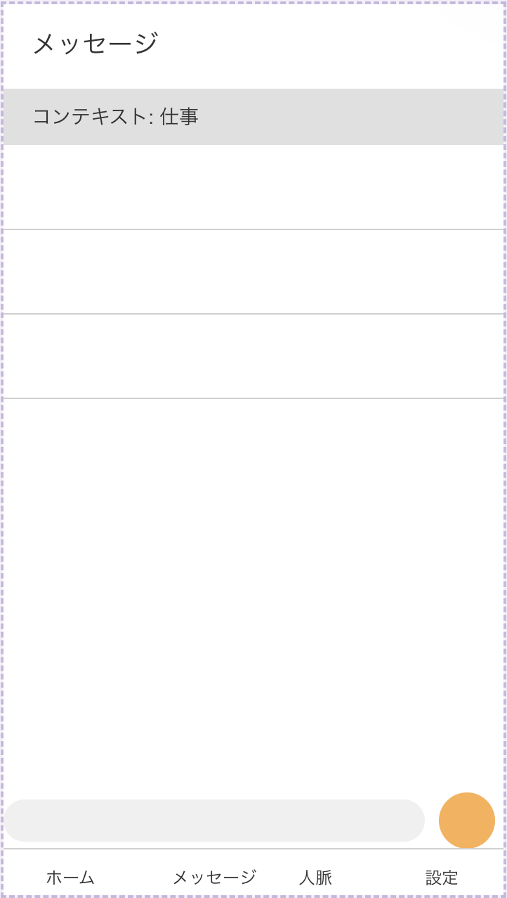
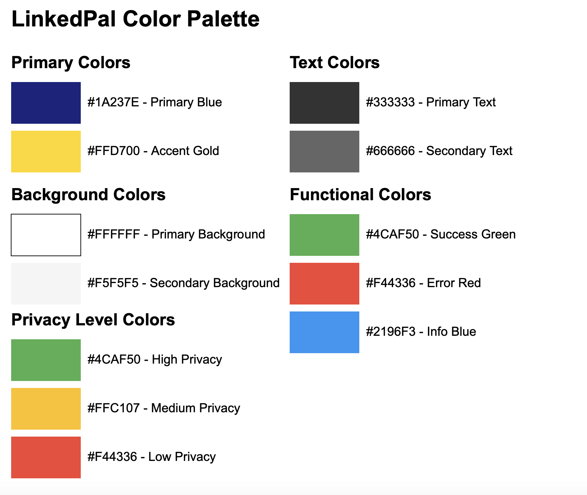
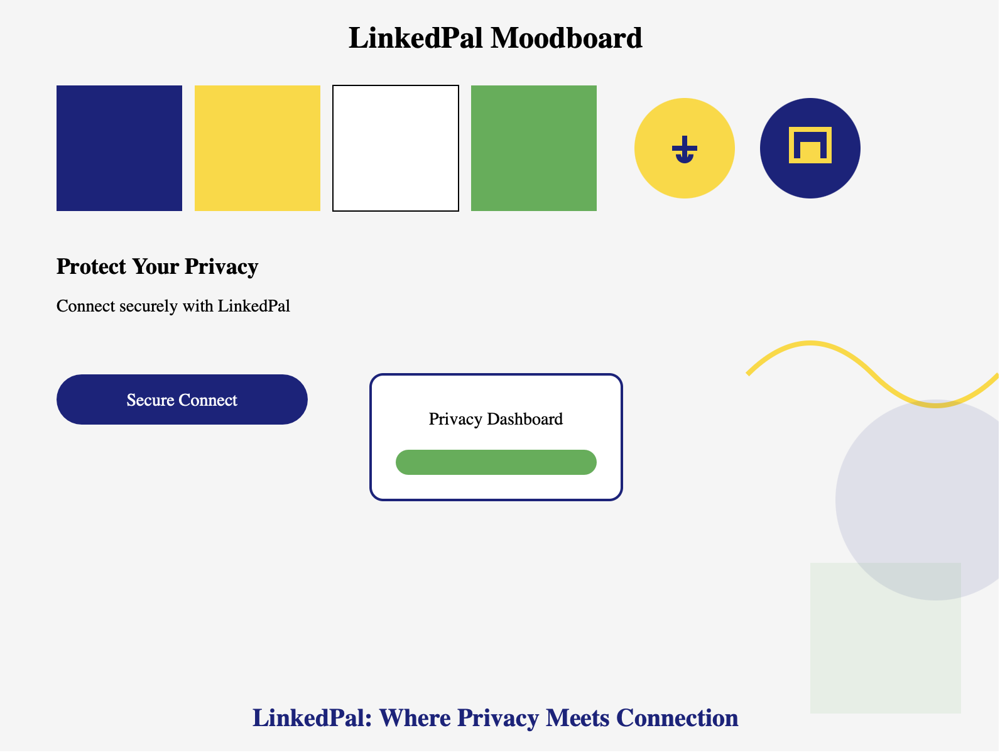

# 事例で学ぶプロダクト開発入門 UI/UX編（仮題）

# 0. はじめに

ここは全部書き上げてから最後に書く

# 1. ユーザーリサーチとペルソナ作成

## 1-1. ターゲットユーザーの定義とマネタイズ戦略

LinkedPalは、プライバシーを重視し、洗練された交流空間を求めるユーザーをターゲットとしたプレミアムなソーシャルネットワークサービスです。広告やノイズにあふれた既存のSNSとは一線を画し、有料でも質の高い体験を求めるユーザー層に焦点を当てます。

市場調査とユーザーインタビューの結果を踏まえ、LinkedPalのターゲットユーザーを以下のように定義します：

1. 若手社会人（25-35歳）- 主要ターゲット
   - 特徴：キャリア形成期にあり、質の高い人脈形成に高い価値を見出す
   - ニーズ：仕事上の人脈と私生活のバランス管理、選択的な情報共有
   - プライバシー意識：非常に高く、デジタルプライバシーに投資する意思がある
   - 行動パターン：目的志向型のSNS利用、プレミアムサービスへの抵抗が低い
   - マネタイズポテンシャル：月額課金型のプレミアムサービスに高い支払い意思

2. 中堅社会人（36-50歳）- 主要ターゲット
   - 特徴：確立されたキャリアと、質を重視する傾向が強い
   - ニーズ：専門的なネットワーキング、高度なプライバシーコントロール
   - プライバシー意識：個人情報とオンライン上の評判管理に非常に敏感
   - 行動パターン：選別的なSNS利用、高品質サービスへの投資意欲が高い
   - マネタイズポテンシャル：高額のプレミアム機能やコンサルティングサービスへの支払い意思が非常に高い

3. 大学生・大学院生（22-25歳）- セカンダリーターゲット
   - 特徴：キャリアの入り口にあり、質の高いネットワーキングの重要性を認識し始めている
   - ニーズ：就職活動や研究に関連する人脈形成、プライバシーを考慮した情報管理
   - プライバシー意識：高まりつつあり、将来のキャリアを見据えた慎重な情報共有を望む
   - 行動パターン：新しいサービスへの適応が早く、価値を感じれば有料サービスも利用
   - マネタイズポテンシャル：割引された学生プランや、卒業後の完全版へのアップグレードに可能性

この再定義されたターゲット設定に基づき、LinkedPalのマネタイズ戦略を以下のように構築します：

1. プレミアムサブスクリプションモデル
   - 広告なしの洗練されたインターフェース
   - 高度なプライバシー設定とコントロール機能
   - 専門家によるプライバシーコンサルティング

2. 段階的な料金プラン
   - 基本プラン：核となるプライバシー保護機能と限定的なネットワーキング機能
   - プロフェッショナルプラン：高度な人脈管理ツールとデータ分析機能
   - エンタープライズプラン：組織全体でのプライバシー管理とネットワーキングソリューション

3. 付加価値サービス
   - プライバシーに配慮したイベントやウェビナーの開催（有料参加）
   - プライバシー保護技術に関する教育コンテンツ
   - 専門家によるプロフィール最適化サービス

4. パートナーシップとエコシステム
   - プライバシー技術企業とのコラボレーション
   - 選別されたキャリア支援サービスとの連携（収益シェア型）

この戦略により、LinkedPalは広告に依存せず、ユーザーの価値に直接訴求するビジネスモデルを構築します。質の高いサービスを提供することで、ユーザーの信頼を獲得し、長期的な関係性を築くことを目指します。

プロダクトの設計とUI/UX開発においては、この戦略を念頭に置き、プレミアム感と高度な機能性を両立させる必要があります。ユーザーに「支払う価値がある」と感じてもらえるよう、視覚的な洗練さと機能の充実を図ります。

以降のユーザーリサーチやペルソナ作成では、これらのターゲットユーザーの特性と、彼らが求める価値を深く掘り下げていきます。プレミアムな体験を求めるユーザーのニーズを的確に捉え、それをUIやUXに反映させることが、LinkedPalの成功につながる鍵となります。

## 1-2. ユーザーインタビューの実施方法

ユーザーインタビューの重要性を説明し、以下の手順を詳細に解説します：

a) インタビュー対象者の選定
   - 各ターゲット層から5-10名ずつ選出
   - 多様性を確保（性別、専攻/職種、地域など）

b) インタビューガイドの作成
   - 半構造化インタビューの形式を採用
   - 主要な質問項目：
     - 現在のSNS利用状況
     - プライバシーに関する懸念
     - 人間関係管理の課題
     - 理想のSNSの特徴

c) インタビューの実施
   - 対面またはオンラインで30-45分程度
   - ラポールの構築方法
   - 深掘り質問のテクニック

d) インタビュー結果の分析
   - 質的データ分析の手法（テーマティックアナリシスなど）
   - 共通点と相違点の抽出
   - インサイトの導出


## 1-3. ペルソナの作成と詳細化

LinkedPalの主要ターゲットに基づいて、2つの代表的なペルソナを作成します。

### ペルソナ1: 佐藤 真理子（さとう まりこ）

- 年齢: 32歳
- 職業: IT企業のプロジェクトマネージャー
- 年収: 800万円

**背景:**
真理子は、大手IT企業で5年間プロジェクトマネージャーとして働いています。キャリア志向が強く、仕事上の人脈作りに積極的です。プライベートでは、趣味のヨガを通じて心身のバランスを保っています。

**目標:**
- 仕事上のネットワークを拡大し、キャリアアップにつなげたい
- プライベートと仕事の人間関係を適切に管理したい
- オンライン上の評判を戦略的に構築したい

**懸念:**
- SNS上での不用意な投稿が、キャリアに悪影響を与える可能性
- 個人情報の漏洩やプライバシーの侵害

**行動パターン:**
- 朝はニュースアプリでビジネス情報をチェック
- 通勤中にLinkedInで業界動向や人脈の更新を確認
- 昼休みや帰宅後にInstagramで友人の近況をチェック
- 週末にはヨガのコミュニティで新しい人々と交流

**価値観:**
- プロフェッショナリズムとワークライフバランスを重視
- 質の高い情報と人脈を大切にする
- プライバシーとセキュリティに高い関心がある

**LinkedPalへの期待:**
- 仕事用と私用の人脈を明確に分離できる機能
- 高度なプライバシー設定によるコンテンツの選択的共有
- 専門性の高いネットワーキング機会の提供

### ペルソナ2: 山田 健太郎（やまだ けんたろう）

- 年齢: 45歳
- 職業: 製薬会社の研究開発部門マネージャー
- 年収: 1,200万円

**背景:**
健太郎は、大手製薬会社で15年以上のキャリアを持つ研究者です。最近、マネージャーに昇進し、リーダーシップスキルの向上に力を入れています。家族を大切にし、週末は家族との時間を優先しています。

**目標:**
- 業界内外の専門家とのネットワークを構築し、最新の研究動向を把握したい
- チームのパフォーマンスを向上させるためのリーダーシップスキルを磨きたい
- 家族との絆を深めながら、プロフェッショナルとしての成長も続けたい

**懸念:**
- 機密性の高い研究情報の漏洩
- オンライン上での過度な露出が、プロフェッショナルとしての評判に影響を与える可能性
- 仕事とプライベートの境界が曖昧になることへの不安

**行動パターン:**
- 朝は科学系ニュースサイトで最新情報をチェック
- 仕事中は専門的なオンラインフォーラムで情報交換
- 帰宅後、家族との時間を過ごした後、学術論文データベースで研究をフォロー
- 月に1-2回、業界セミナーやネットワーキングイベントに参加

**価値観:**
- 科学的厳密性と倫理を重視
- 継続的な学習と自己改善を大切にする
- 家族との時間とプロフェッショナルとしての成長のバランスを重視

**LinkedPalへの期待:**
- 高度なプライバシー設定と情報セキュリティ機能
- 専門分野に特化したネットワーキングと情報共有の場
- 家族や親しい友人との私的なコミュニケーション空間の確保

## 1-4. ユーザーのニーズと課題の特定

これらのペルソナを基に、LinkedPalが解決すべき主要なニーズと課題を以下のように特定します：

1. プライバシーとセキュリティの強化
   - ニーズ: 高度なプライバシー設定と情報セキュリティ
   - 課題: 既存のSNSではプライバシー設定が複雑で分かりにくい

2. コンテキストに応じた人脈管理
   - ニーズ: 仕事用と私用の人脈を明確に分離し管理したい
   - 課題: 現在のSNSでは人脈の文脈に応じた管理が困難

3. 選択的情報共有
   - ニーズ: 特定のグループやコンテキストに応じて情報を共有したい
   - 課題: 既存のプラットフォームでは共有範囲の細かい制御が難しい

4. 専門的ネットワーキング
   - ニーズ: 業界や専門分野に特化した質の高いネットワーキング
   - 課題: 一般的なSNSでは専門性の高い交流が難しい

5. オンライン評判の戦略的管理
   - ニーズ: プロフェッショナルとしての評判を戦略的に構築・管理したい
   - 課題: 現在のSNSでは個人のブランディングが難しい

6. ワークライフバランスの支援
   - ニーズ: プロフェッショナルな成長と私生活の充実を両立したい
   - 課題: 既存のプラットフォームではしばしば仕事と私生活の境界が曖昧になる

7. 高品質な情報と交流
   - ニーズ: ノイズの少ない、質の高い情報と交流を求めている
   - 課題: 広告やスパムの多い既存のSNSでは、価値ある情報の取得が困難

8. 継続的学習とスキル向上
   - ニーズ: キャリア発展につながる学習機会や情報を得たい
   - 課題: 一般的なSNSでは、専門的な学習コンテンツへのアクセスが限られている

これらのニーズと課題に対応することで、LinkedPalは既存のSNSとは差別化された、プレミアムな体験を提供することができます。UI/UXデザインにおいては、これらの要素を効果的に組み込み、ユーザーに直感的で価値ある体験を提供することが重要となります。

次のステップでは、これらのニーズと課題に基づいて、具体的な機能要件とUI/UXデザインの方向性を検討していきます。

## 2. ユーザージャーニーマップの作成

ユーザージャーニーマップは、ユーザーがプロダクトと関わる一連の体験を可視化するツールです。LinkedPalの主要ペルソナである佐藤真理子さんの1日の流れに沿って、ユーザージャーニーマップを作成します。

### 2.1 ユーザーの行動パターンの分析

佐藤真理子さんの典型的な平日の行動パターンを時系列で整理します：

1. 朝 (6:30-8:00): 起床、朝食、ニュースチェック
2. 通勤 (8:00-9:00): 電車でLinkedInチェック
3. 午前の仕事 (9:00-12:00): プロジェクトマネジメント、ミーティング
4. 昼休み (12:00-13:00): ランチ、InstagramでPrivateなSNSチェック
5. 午後の仕事 (13:00-18:00): プロジェクト作業、クライアントとの連絡
6. 退社後 (18:00-19:30): ヨガクラス参加
7. 夜 (19:30-23:00): 帰宅、夕食、リラックスタイム、SNSチェック

### 2.2 タッチポイントの特定

LinkedPalと真理子さんが接触する可能性のある具体的な場面を列挙します：

1. 朝のニュースフィード確認
2. 通勤中のプロフェッショナルネットワーク更新
3. 昼休みの友人との交流
4. 仕事中のクライアント情報確認
5. ヨガクラスでの新しい出会い記録
6. 夜のリラックスタイムでのコンテンツ閲覧

### 2.3 ペインポイントと機会の発見

各タッチポイントでの課題と、LinkedPalが提供できる解決策を分析します：

1. 朝のニュースフィード確認
   - ペインポイント: 関連性の低い情報が多く、時間を無駄にしてしまう
   - 機会: AIを活用した高度なパーソナライゼーションで、関連性の高い情報を提供

2. 通勤中のプロフェッショナルネットワーク更新
   - ペインポイント: プライベートな情報が混ざり、集中できない
   - 機会: コンテキストに応じた情報表示の切り替え機能を提供

3. 昼休みの友人との交流
   - ペインポイント: 仕事関連の通知が入り、リラックスできない
   - 機会: 時間帯やロケーションに応じた通知設定の自動化

4. 仕事中のクライアント情報確認
   - ペインポイント: 機密情報の取り扱いに不安がある
   - 機会: 高度な暗号化とアクセス制御機能の提供

5. ヨガクラスでの新しい出会い記録
   - ペインポイント: プライベートな人脈を仕事の人脈と混ぜたくない
   - 機会: コンテキストに応じた人脈管理機能の提供

6. 夜のリラックスタイムでのコンテンツ閲覧
   - ペインポイント: 仕事関連の情報が表示され、オフモードに入れない
   - 機会: ユーザーの気分や状況に応じたコンテンツフィルタリング機能

### 2.4 感情曲線の描画

真理子さんの1日の感情の変化を可視化してみます。


この図は、真理子さんの1日の感情の変化を表現しています。朝は期待と少しの不安、昼は仕事の忙しさでストレスが高まり、夕方のヨガで回復し、夜はリラックスした状態を示しています。

### 2.5 インサイトの導出

このユーザージャーニーマップから、以下のようなインサイトが得られます：

1. コンテキストスイッチの重要性：仕事モードとプライベートモードの切り替えをスムーズにサポートする機能が必要
2. 高度なプライバシー設定：状況に応じて適切な情報共有レベルを自動的に設定する機能が有用
3. インテリジェントな通知管理：ユーザーの状況を考慮した適切なタイミングでの通知提供
4. パーソナライズされたコンテンツ提供：ユーザーの気分や状況に応じた適切な情報フィルタリング
5. セキュアな情報管理：高度な暗号化とアクセス制御によるビジネス情報の保護

これらのインサイトを基に、LinkedPalのUI/UX設計の優先順位を決定し、具体的な機能設計に落とし込んでいきます。例えば：

- コンテキストに応じた自動モード切替機能
- 直感的なプライバシー設定インターフェース
- AI駆動の通知最適化システム
- ユーザーの状態を考慮したコンテンツレコメンデーション機能
- ビジネス用の高セキュリティモード

次のステップでは、これらのインサイトを基に、具体的な情報アーキテクチャの設計に移っていきます。ユーザージャーニーマップで得られた知見を活かし、ユーザーの文脈に沿った、直感的で価値のある体験を設計することが重要です。

## 3. 情報アーキテクチャの設計

### 3.1 LinkedPalの核となる特徴の反映

「他の人に自分が誰と友達であるかを知る手段を一切提供しない」という特徴を情報アーキテクチャの中心に据えます：

1. 非公開の人脈管理
   - ユーザーの人脈リストは完全に非公開
   - 「友達の友達」機能の排除
   - 共通の友達表示の廃止

2. コンテキストベースの接続
   - 直接のつながりのみを許可
   - 第三者を介した接続提案の排除

3. プライバシーファーストの設計
   - デフォルトで全ての情報を非公開に設定
   - 段階的な情報公開オプションの提供

### 3.2 MVP (Minimum Viable Product) の定義

LinkedPalのMVPとして、以下の核となる機能に焦点を当てます：

1. セキュアなプロフィール作成
2. プライベートな人脈管理
3. コンテキストベースのメッセージング
4. 基本的なコンテンツ共有（投稿）
5. 高度なプライバシー設定

これらの要素を考慮し、情報アーキテクチャを以下のように構築します：


### 3.3 ユーザーフローとカスタマージャーニー

以下は、新規ユーザーがLinkedPalを使い始めてから、主要機能を使いこなすまでの流れを表現しています。


このジャーニーマップは、ユーザーの感情の起伏とともに、LinkedPalの主要機能の使用順序を示しています。次に、各セクションの詳細なユーザーフローを見ていきましょう。

#### 1. オンボーディングフロー


#### 2. プライバシー設定フロー


#### 3. ネットワーキングフロー


#### 4. コミュニケーションフロー

LinkedPalの核となる「プライバシー保護」と「コンテキストに応じたコミュニケーション」の概念を考慮すると、以下のように整理するのが適切だと思います：

##### メッセージング機能の再定義

LinkedPalでは、すべてのチャットを「プライベート」として扱い、その中でコンテキストを設定できるようにします。つまり、「プライベートチャット」と「コンテキストチャット」を別々の機能として分けるのではなく、単一のメッセージング機能の中でコンテキスト設定を可能にします。

1. プライベートメッセージング
   - すべてのメッセージングは基本的にプライベート（1対1）です。
   - エンドツーエンドの暗号化を使用し、高度なプライバシーを確保します。

2. コンテキスト設定
   - 各チャットに対して、ユーザーがコンテキスト（例：仕事、プライベート、プロジェクトXなど）を設定できます。
   - コンテキスト設定により、関連する情報やツールが提供されます。

3. コンテキストベースの機能
   - 仕事コンテキスト：ファイル共有、タスク管理機能の統合
   - プライベートコンテキスト：イベント計画、写真共有機能の強化
   - プロジェクトコンテキスト：進捗管理、リソース共有機能の提供

再定義に基づいて、メッセージングのユーザーフローを見てみましょう：


このフローでは：

1. ユーザーは連絡先を選択し、新しいチャットを開始します。
2. チャットを開始する際に、コンテキストを設定するオプションがあります。
3. 選択されたコンテキストに基づいて、関連するツールや機能が提供されます。
4. すべてのメッセージは暗号化されて送信され、高度なプライバシーが確保されます。

この方法により、LinkedPalは以下の利点を提供します：

- すべてのコミュニケーションにおいて高度なプライバシーを確保
- コンテキストに応じた柔軟なコミュニケーション環境の提供
- ユーザーのワークフローに合わせた効率的なツールとリソースの統合

この仕様により、LinkedPalのコア機能であるプライバシー保護とコンテキストベースのコミュニケーションがより明確になり、ユーザーにとってより直感的で価値のある体験を提供できるでしょう。

#### 5. コンテンツ共有フロー


これらの詳細なフロー図は、LinkedPalのMVPにおける主要な機能とその使用順序を示しています。各ステップでプライバシーを重視していることが分かります。例えば、ネットワーキングでは直接的な接続のみを許可し、コンテンツ共有では公開範囲の設定を必須としています。

このようなユーザーフローとカスタマージャーニーの組み合わせにより、開発チームはユーザーの体験をより深く理解し、各ステップでのプライバシー保護とユーザビリティのバランスを取ることができます。また、新規ユーザーが段階的にアプリの機能を理解し、使いこなしていく過程も明確になります。

### 3.4 段階的な機能拡張計画

MVPリリース後の段階的な機能拡張を計画します：

Phase 1 (MVP):
- 基本的なプロフィール、人脈管理、メッセージング、投稿機能
- 高度なプライバシー設定

Phase 2:
- コンテキストベースのフィード最適化
- セキュアなファイル共有

Phase 3:
- プロフェッショナルグループ機能
- 匿名化されたネットワーク分析

Phase 4:
- AIを活用したプライバシー推奨設定
- 高度なコンテンツキュレーション

この情報アーキテクチャと段階的開発計画により、LinkedPalの核となる「完全なプライバシー保護」という特徴を維持しつつ、最小限の機能セットでの迅速なリリースが可能になります。ユーザーは基本的な機能を通じてLinkedPalの価値を体験し、徐々に高度な機能が追加されることで、長期的なエンゲージメントを促進できます。

次のステップでは、このMVPを中心としたワイヤーフレームとUIデザインを作成し、コア機能の使いやすさとプライバシー保護の視覚化に焦点を当てていきます。


# 4. ワイヤーフレームの作成

ワイヤーフレームの作成は、UI/UXデザインプロセスの重要なステップです。LinkedPalの例を使って、ワイヤーフレーム作成のプロセスを詳しく見ていきましょう。

## 4.1 低忠実度ワイヤーフレームの作成

まず、主要な画面の基本レイアウトを素早くスケッチします。これは手書きまたはシンプルなデジタルツールを使用して行います。

例：ホーム画面の低忠実度ワイヤーフレーム

```
+---------------------+
|  LinkedPal  [≡] [🔔]|
|---------------------|
| [🏠] [👥] [✉] [👤]   |
|---------------------|
|  [検索バー]          |
|---------------------|
|  [投稿1]            |
|  ---------------    |
|  [投稿2]            |
|  ---------------    |
|  [投稿3]            |
|                     |
+---------------------+
```

## 4.2 主要な画面レイアウトの設計

次に、主要な画面のより詳細なレイアウトを設計します。

### 4.2.1 ホーム画面


```svg
<svg width="360" height="640" xmlns="http://www.w3.org/2000/svg">
  <rect width="360" height="640" fill="#f0f0f0"/>
  
  <!-- ヘッダー -->
  <rect y="0" width="360" height="60" fill="#ffffff"/>
  <text x="20" y="35" font-family="Arial" font-size="18" fill="#333333">LinkedPal</text>
  <circle cx="320" cy="30" r="15" fill="#e0e0e0"/>
  
  <!-- ナビゲーションバー -->
  <rect y="60" width="360" height="50" fill="#ffffff"/>
  <text x="30" y="90" font-family="Arial" font-size="12" fill="#333333">🏠</text>
  <text x="120" y="90" font-family="Arial" font-size="12" fill="#333333">👥</text>
  <text x="210" y="90" font-family="Arial" font-size="12" fill="#333333">✉</text>
  <text x="300" y="90" font-family="Arial" font-size="12" fill="#333333">👤</text>
  
  <!-- 検索バー -->
  <rect x="10" y="120" width="340" height="40" rx="20" fill="#ffffff"/>
  <text x="30" y="145" font-family="Arial" font-size="14" fill="#999999">検索...</text>
  
  <!-- 投稿 -->
  <rect x="10" y="170" width="340" height="100" fill="#ffffff"/>
  <rect x="10" y="280" width="340" height="100" fill="#ffffff"/>
  <rect x="10" y="390" width="340" height="100" fill="#ffffff"/>
</svg>
```

### 4.2.2 プロフィール画面


```svg
<svg width="360" height="640" xmlns="http://www.w3.org/2000/svg">
  <rect width="360" height="640" fill="#f0f0f0"/>
  
  <!-- ヘッダー -->
  <rect y="0" width="360" height="200" fill="#4caf50"/>
  <circle cx="180" cy="100" r="50" fill="#ffffff"/>
  <text x="120" y="180" font-family="Arial" font-size="18" fill="#ffffff">佐藤 真理子</text>
  
  <!-- プロフィール情報 -->
  <rect y="200" width="360" height="400" fill="#ffffff"/>
  <text x="20" y="230" font-family="Arial" font-size="16" fill="#333333">職業: プロジェクトマネージャー</text>
  <text x="20" y="260" font-family="Arial" font-size="16" fill="#333333">業界: IT</text>
  <text x="20" y="290" font-family="Arial" font-size="16" fill="#333333">スキル: リーダーシップ, アジャイル開発</text>
  
  <!-- プライバシー設定 -->
  <rect y="320" width="360" height="40" fill="#e8f5e9"/>
  <text x="20" y="345" font-family="Arial" font-size="14" fill="#1b5e20">プライバシー設定を確認</text>
  
  <!-- 編集ボタン -->
  <rect x="260" y="380" width="80" height="40" rx="20" fill="#4caf50"/>
  <text x="280" y="405" font-family="Arial" font-size="14" fill="#ffffff">編集</text>
  
  <!-- ナビゲーションバー -->
  <rect y="600" width="360" height="40" fill="#ffffff"/>
  <line x1="0" y1="600" x2="360" y2="600" stroke="#d0d0d0" stroke-width="1"/>
  <text x="30" y="625" font-family="Arial" font-size="12" fill="#333333">ホーム</text>
  <text x="120" y="625" font-family="Arial" font-size="12" fill="#333333">メッセージ</text>
  <text x="210" y="625" font-family="Arial" font-size="12" fill="#333333">人脈</text>
  <text x="300" y="625" font-family="Arial" font-size="12" fill="#333333">設定</text>
</svg>
```

### 4.2.3 メッセージ画面



```svg
<svg width="360" height="640" xmlns="http://www.w3.org/2000/svg">
  <rect width="360" height="640" fill="#f0f0f0"/>
  
  <!-- ヘッダー -->
  <rect y="0" width="360" height="60" fill="#ffffff"/>
  <text x="20" y="35" font-family="Arial" font-size="18" fill="#333333">メッセージ</text>
  
  <!-- コンテキスト選択 -->
  <rect y="60" width="360" height="40" fill="#e0e0e0"/>
  <text x="20" y="85" font-family="Arial" font-size="14" fill="#333333">コンテキスト: 仕事</text>
  
  <!-- メッセージリスト -->
  <rect y="100" width="360" height="500" fill="#ffffff"/>
  <line x1="0" y1="160" x2="360" y2="160" stroke="#d0d0d0" stroke-width="1"/>
  <line x1="0" y1="220" x2="360" y2="220" stroke="#d0d0d0" stroke-width="1"/>
  <line x1="0" y1="280" x2="360" y2="280" stroke="#d0d0d0" stroke-width="1"/>
  
  <!-- メッセージ入力欄 -->
  <rect x=0 y="560" width="360" height="40" fill="#0fffff"/>
  <rect x="0" y="565" width="300" height="30" rx="15" fill="#f0f0f0"/>
  <circle cx="330" cy="580" r="20" fill="#fcaf50"/>
  
  <!-- ナビゲーションバー -->
  <rect y="600" width="360" height="40" fill="#ffffff"/>
  <line x1="0" y1="600" x2="360" y2="600" stroke="#d0d0d0" stroke-width="1"/>
  <text x="30" y="625" font-family="Arial" font-size="12" fill="#333333">ホーム</text>
  <text x="120" y="625" font-family="Arial" font-size="12" fill="#333333">メッセージ</text>
  <text x="210" y="625" font-family="Arial" font-size="12" fill="#333333">人脈</text>
  <text x="300" y="625" font-family="Arial" font-size="12" fill="#333333">設定</text>
</svg>
```

## 4.3 コンテンツの配置と優先順位付け

各画面で最も重要な情報や機能を特定し、目立つ位置に配置します。例えば、プロフィール画面の優先順位は以下のようになります：

1. プロフィール写真とユーザー名（最上部）
2. 自己紹介文（写真の下）
3. プライバシー設定へのリンク（目立つ位置に）
4. 最近の投稿（画面中央）
5. 興味・関心タグ（投稿の下）

## 4.4 ナビゲーションフローの可視化

主要なタスクの完了までの流れを視覚化します。例えば、人脈追加のフローは以下のようになります：


## 4.5 ワイヤーフレーム作成時の注意点と工夫

1. 一貫性の確保：
   - すべての画面で共通のヘッダーとナビゲーションバーを使用
   - ボタンやアイコンの配置を統一

2. プライバシー重視の設計：
   - プライバシー設定へのアクセスを容易にする
   - 情報共有時の公開範囲設定を明確に表示

3. 効率的な人脈管理：
   - 直接的な人脈追加のみを許可
   - コンテキストに応じた人脈表示機能を提供

4. 直感的な操作性：
   - 重要なアクションボタンを操作しやすい位置に配置
   - スワイプやジェスチャーを活用した操作を検討

5. フィードバックの提供：
   - アクション完了時のフィードバック表示を明確に
   - エラーメッセージの表示方法を工夫

## 4.6 ワイヤーフレームのイテレーション

初期のワイヤーフレームを作成後、チーム内でレビューを行い、フィードバックを収集します。そのフィードバックを基に、以下のような改善を行います：

- ユーザビリティの向上：操作が難しい部分を特定し、改善
- 情報の整理：過剰な情報を削減し、重要な要素を強調
- 一貫性の確保：画面間の遷移や要素の配置を統一
- プライバシー強化：プライバシー関連の設定や情報をより分かりやすく配置

### 一貫性の確保の例：ナビゲーションバーの統一

現状のデザインでは、ナビゲーションバーの位置が画面によって異なっています。これを統一することで、ユーザーエクスペリエンスを向上させることができます。

改善前：
- ホーム画面：ナビゲーションバーが上部に配置
- プロフィール画面：ナビゲーションバーが下部に配置
- メッセージ画面：ナビゲーションバーが下部に配置

改善後：全ての画面でナビゲーションバーを下部に統一

例として、ホーム画面のナビゲーションバーを下部に移動した改善版を示します：


```svg
<svg width="360" height="640" xmlns="http://www.w3.org/2000/svg">
  <rect width="360" height="640" fill="#f0f0f0"/>
  
  <!-- ヘッダー -->
  <rect y="0" width="360" height="60" fill="#ffffff"/>
  <text x="20" y="35" font-family="Arial" font-size="18" fill="#333333">LinkedPal</text>
  <circle cx="320" cy="30" r="15" fill="#e0e0e0"/>
  
  <!-- 検索バー -->
  <rect x="10" y="70" width="340" height="40" rx="20" fill="#ffffff"/>
  <text x="30" y="95" font-family="Arial" font-size="14" fill="#999999">検索...</text>
  
  <!-- 投稿 -->
  <rect x="10" y="120" width="340" height="100" fill="#ffffff"/>
  <rect x="10" y="230" width="340" height="100" fill="#ffffff"/>
  <rect x="10" y="340" width="340" height="100" fill="#ffffff"/>
  
  <!-- ナビゲーションバー（下部に移動） -->
  <rect y="600" width="360" height="40" fill="#ffffff"/>
  <line x1="0" y1="600" x2="360" y2="600" stroke="#d0d0d0" stroke-width="1"/>
  <text x="30" y="625" font-family="Arial" font-size="12" fill="#333333">🏠</text>
  <text x="120" y="625" font-family="Arial" font-size="12" fill="#333333">👥</text>
  <text x="210" y="625" font-family="Arial" font-size="12" fill="#333333">✉</text>
  <text x="300" y="625" font-family="Arial" font-size="12" fill="#333333">👤</text>
</svg>
```

この改善により、全ての画面で一貫したレイアウトが実現され、ユーザーの操作性が向上します。同様に、他の要素についても一貫性を確保することで、直感的で使いやすいインターフェースを実現できます。

こ右下プロセスを通じて、LinkedPalの核となる「プライバシー保護」と「コンテキストベースのコミュニケーション」の概念を視覚的に表現し、ユーザーにとって使いやすいアプリケーションの基礎を築きます。

次のステップでは、これらのワイヤーフレームを基に、より詳細なインタラクションデザインを行っていきます。

# 5. インタラクションデザイン

インタラクションデザインは、ユーザーとアプリケーションとのやり取りを設計する重要なプロセスです。LinkedPalの例を使って、以下の要素を含むインタラクションデザインを詳細に見ていきます。

## 5.1 ユーザーアクションの定義と最適化

アプリ内で想定される主要なユーザーアクションをリストアップし、各アクションの目的と期待される結果を明確化します。

### 主要ユーザーアクション：

1. 友達追加
2. 投稿作成
3. プライバシー設定の変更
4. メッセージ送信
5. プロフィール編集

### アクション最適化の例：友達追加プロセス

1. 現状分析：
   - 標準的なSNSの友達追加は、検索→プロフィール確認→リクエスト送信の流れ
   - プライバシー設定は後から行うことが多い

2. LinkedPalでの最適化：
   - 検索→プロフィール確認→プライバシーレベル設定→リクエスト送信
   - プライバシー設定を統合することで、ユーザーの意識を高める

3. 期待される結果：
   - ユーザーが友達関係を作る際に、プライバシーを意識的に考慮するようになる
   - 不適切なプライバシー設定による情報漏洩リスクの低減

## 5.2 システムフィードバックの設計

ユーザーアクションに対する適切なフィードバックを設計し、エラー状態や成功状態の表示方法を決定します。

### フィードバック設計の原則：

1. 即時性：アクションの結果をすぐに表示
2. 明確性：ユーザーが理解しやすい言葉と視覚要素を使用
3. 一貫性：アプリ全体で統一されたフィードバックスタイルを維持
4. コンテキスト適応：状況に応じて適切なフィードバック方法を選択

### 具体例：プライバシー設定変更時のフィードバック

1. 視覚的フィードバック：
   - 設定変更直後に、画面上部にバナーを表示
   - 色とアイコンを使用して変更の重要度を示す（例：赤色と警告アイコンで重要な変更を強調）

2. テキストメッセージ：
   - 「プライバシー設定を[高]に変更しました。これにより、あなたの投稿は友達にのみ公開されます。」

3. アニメーション：
   - 設定変更に合わせて、プライバシーレベルインジケーターのアニメーションを表示
   - 例：低→高への変更時、鍵アイコンが閉じるアニメーション

4. 触覚フィードバック：
   - モバイルデバイスの場合、設定変更時に短い振動を発生

5. 確認要求：
   - 重要な設定変更の場合、確認ダイアログを表示
   - 「この変更により、200人のフォロワーがあなたの投稿を見られなくなります。変更を確定しますか？」

## 5.3 マイクロインタラクションの考案

小さな動作や反応を設計し、ユーザー体験を向上させ、アプリの個性や品質感を表現します。

### マイクロインタラクションの重要性：

1. ユーザーエンゲージメントの向上
2. ブランドの個性の表現
3. 操作の直感性の向上
4. フィードバックの強化

### LinkedPalのマイクロインタラクション例：

1. プライバシーレベル変更：
   - スライダーを動かすと、背景色がグラデーションで変化
   - 低（赤）→中（黄）→高（緑）と、色で直感的にレベルを表現

2. セキュアメッセージ送信：
   - 送信ボタンを押すと、メッセージがエンベロープに包まれるアニメーション
   - エンベロープが閉じられ、鍵がかかる様子を表現

3. フレンドリクエスト承認：
   - 承認ボタンをタップすると、ユーザーアイコンが軽く弾む
   - 承認完了時に、小さな紙吹雪アニメーションを表示

4. 投稿のいいね：
   - いいねボタンをタップすると、ハートアイコンが拡大縮小
   - 同時に、小さな鍵アイコンが現れ、プライバシーが保護されていることを示唆

5. プロフィール編集：
   - 編集完了時、プロフィール画像が一瞬光るエフェクト
   - 変更箇所が軽く点滅し、何が更新されたかを示す

これらのマイクロインタラクションは、LinkedPalの核となるプライバシー保護の概念を視覚的に強化し、ユーザーに安心感と楽しさを提供します。

## 5.4 ジェスチャーとアニメーションの検討

タッチスクリーンデバイスに適したジェスチャーを選択し、スムーズな画面遷移やコンテンツの更新方法を設計します。

### ジェスチャーの設計原則：

1. 直感性：一般的に使用されているジェスチャーを基本とする
2. 一貫性：アプリ全体で統一されたジェスチャーを使用
3. フィードバック：ジェスチャーの認識と結果を明確に示す
4. アクセシビリティ：代替操作方法を常に提供する

### LinkedPalのジェスチャーとアニメーション例：

1. プライバシーダッシュボード：
   - 下から上へのスワイプでダッシュボードを表示
   - ダッシュボードが下から滑らかに上昇するアニメーション

2. フレンドリスト操作：
   - 左スワイプでアクションメニューを表示（メッセージ、設定変更など）
   - 右スワイプで友達を非表示（アーカイブ）
   - スワイプに合わせて、メニューや非表示アイコンが徐々に表示されるアニメーション

3. メッセージの詳細表示：
   - メッセージをピンチアウトで拡大表示
   - 拡大時に、メッセージの暗号化状態や送信時刻などの詳細情報をフェードイン

4. 投稿の共有範囲変更：
   - 投稿を長押しし、上下にドラッグして共有範囲を変更
   - ドラッグに合わせて、背景色が変化し、鍵アイコンが開閉するアニメーション

5. タイムライン更新：
   - 画面を下にプルして更新
   - 更新中は、LinkedPalのロゴが回転するアニメーションを表示

これらのジェスチャーとアニメーションにより、ユーザーはより直感的にアプリを操作でき、同時にプライバシー保護の概念を視覚的に体験することができます。

## 5.5 状態遷移の設計

異なる状態間の移行をスムーズにする設計を行い、ローディング状態、エラー状態、空の状態などの表示方法を決定します。

### 状態遷移設計の重要性：

1. ユーザーの混乱を防ぐ
2. アプリの信頼性と安定性を示す
3. ユーザー体験の一貫性を保つ
4. エラーからの回復を支援する

### LinkedPalの状態遷移設計例：

1. タイムラインのローディング状態：
   - スケルトンスクリーンを表示
   - 投稿のアウトラインをグレーで表示し、左から右へのアニメーションで読み込み中を表現

2. メッセージ送信の状態遷移：
   - 送信中：メッセージの横に小さな砂時計アイコンを表示
   - 送信成功：砂時計がチェックマークに変化、メッセージ背景が薄い緑色に
   - 送信失敗：砂時計が警告アイコンに変化、メッセージ背景が薄い赤色に

3. プライバシー設定変更の状態遷移：
   - 変更中：設定項目の横にスピナーを表示
   - 変更成功：スピナーが緑のチェックマークに変化、短い振動フィードバック
   - 変更失敗：スピナーが赤の警告アイコンに変化、エラーメッセージをトースト表示

4. フレンドリストの空の状態：
   - イラスト付きのメッセージを表示：「新しい友達を見つけましょう！」
   - 「友達を追加」ボタンを目立つ位置に配置
   - 友達追加のヒントやチュートリアルへのリンクを提供

5. ネットワークエラー状態：
   - エラーメッセージと再試行ボタンを表示
   - オフライン時に編集した内容は自動保存し、再接続時に同期することを通知

これらの状態遷移設計により、ユーザーは常にアプリの状態を理解し、適切なアクションを取ることができます。特にプライバシーに関連する操作では、状態の変化を明確に伝えることで、ユーザーに安心感を提供します。

## 5.6 アクセシビリティへの配慮

様々なユーザーが利用できるよう、アクセシビリティを考慮したインタラクションを設計します。スクリーンリーダーのサポートや、キーボード操作の対応を検討します。

### アクセシビリティ設計の原則：

1. 知覚可能性：情報とUIコンポーネントをユーザーが知覚できるように提示
2. 操作可能性：UIコンポーネントとナビゲーションを操作可能に
3. 理解可能性：情報と操作を理解可能に
4. 堅牢性：支援技術を含む幅広いユーザーエージェントで利用可能に

### LinkedPalのアクセシビリティ対応例：

1. スクリーンリーダー対応：
   - すべてのボタンとインタラクティブ要素に適切なラベルを付与
   - プライバシー設定の変更をスクリーンリーダーで明確に通知
   - 画像に代替テキストを提供し、プライバシーに配慮した説明を含める

2. キーボードナビゲーション：
   - すべての機能をキーボードのみで操作可能に設計
   - フォーカスの順序を論理的に設定し、現在のフォーカス位置を視覚的に強調
   - プライバシー設定へのショートカットキーを提供（例：Ctrl+P）

3. 色覚異常への対応：
   - プライバシーレベルを色だけでなく、形状やテキストでも表現
   - 高コントラストモードを提供し、テキストと背景のコントラスト比を確保

4. 運動機能障害への配慮：
   - タッチターゲットを十分な大きさに設定（最小44x44ピクセル）
   - ジェスチャー操作の代替として、ボタンによる操作オプションを提供
   - 長押しやダブルタップの操作に、代替の単一タップオプションを用意

5. 聴覚障害への対応：
   - 音声通知に加えて、視覚的な通知オプションを提供
   - 動画コンテンツに字幕を追加し、プライバシーに配慮した詳細な説明を含める

6. 認知障害への配慮：
   - 複雑な操作を段階的に案内するチュートリアルモードを提供
   - プライバシー設定の変更時に、変更内容と影響を分かりやすく説明
   - 情報の整理と優先順位付けを明確にし、認知負荷を軽減

これらのアクセシビリティ対応により、LinkedPalは幅広いユーザーにとって使いやすいアプリケーションとなります。プライバシー保護という中核的な機能を、様々な能力や状況のユーザーが利用できるようにすることで、アプリケーションの価値が大きく向上します。

## 5.7 プライバシー重視のインタラクションデザイン

LinkedPalの核となる価値提案である「プライバシー保護、特に友人関係の非公開」を念頭に置いて、インタラクションデザインをさらに深掘りします。

### 5.7.1 プロフィール閲覧時のプライバシー強調

a) ユーザーアクション：
   他のユーザーのプロフィールを閲覧する

b) システムフィードバック：
   - プロフィール画面上部に「このユーザーの友達リストは非公開です」というメッセージを表示
   - 友達数は表示するが、具体的な友達リストへのリンクは存在しない

c) マイクロインタラクション：
   - プロフィール画面を開く際、鍵アイコンが閉じるアニメーションを表示し、プライバシー保護を視覚的に強調
   - プロフィール情報の各セクションにホバーすると、そのセクションの公開範囲が一時的に表示される

### 5.7.2 友達追加プロセスのプライバシー設定

a) ユーザーアクション：
   新しい友達を追加する

b) システムフィードバック：
   - 友達追加の確認ダイアログに「この友達関係は他のユーザーには表示されません」という説明を追加
   - プライバシー設定のオプションを提供（例：「この友達とのみ共通の友達を表示する」）

c) マイクロインタラクション：
   - 友達追加ボタンをタップすると、小さな鍵アイコンがボタン上に現れ、プライバシーが保護されていることを示す
   - プライバシー設定を選択する際、各オプションの影響を視覚的にプレビュー表示

### 5.7.3 共通の友達表示の制限

a) ユーザーアクション：
   他のユーザーとの共通の友達を確認しようとする

b) システムフィードバック：
   - 「プライバシー保護のため、共通の友達は表示されません」というメッセージを表示
   - 代わりに、共通の興味や属性（所属組織、出身地など）を表示し、つながりのヒントを提供

c) マイクロインタラクション：
   - 共通の友達セクションをタップすると、鍵アイコンが揺れるアニメーションを表示し、情報が保護されていることを示す
   - 代替情報（共通の興味など）が徐々にフェードインして表示される

### 5.7.4 プライバシー設定の可視化

a) ユーザーアクション：
   プライバシー設定を確認・変更する

b) システムフィードバック：
   - プライバシー設定画面で、現在の設定状態を視覚的に表現（例：友達リストの非公開状態を大きな閉じた鍵アイコンで表示）
   - 設定変更時に、変更の影響を説明するポップアップを表示

c) マイクロインタラクション：
   - 設定をオン/オフする際、スイッチと連動して鍵アイコンが開閉するアニメーションを表示
   - 設定変更後、影響を受ける情報や機能が一時的にハイライト表示される

### 5.7.5 検索結果の匿名化

a) ユーザーアクション：
   ユーザー検索を行う

b) システムフィードバック：
   - 検索結果に「友達の友達」や「〇〇さんとのつながり」などの情報を表示せず、ユーザー名と基本プロフィールのみを表示
   - 「プライバシー保護のため、ユーザー間のつながりは表示されません」という説明を検索結果の上部に表示

c) マイクロインタラクション：
   - 検索バーにフォーカスが当たると、小さな鍵アイコンが現れ、プライバシーが保護された検索であることを示す
   - 検索結果が表示される際、各ユーザーのプロフィールカードが徐々にフェードインし、プライバシーフィルターが適用されたような視覚効果を演出

## 5.8 インタラクションデザインの評価と改善

設計したインタラクションデザインの有効性を評価し、継続的に改善していくプロセスについて説明します。

### 5.8.1 ユーザーテストの実施

1. タスク完了率の測定
   - 特定のインタラクションを完了できたユーザーの割合を測定
   - 例：プライバシー設定の変更を90秒以内に完了できたユーザーの割合

2. ユーザビリティテスト
   - 実際のユーザーに課題を与え、操作の様子を観察
   - 思考発話法を用いて、ユーザーの意図と行動のズレを把握

3. アイトラッキング調査
   - ユーザーの視線の動きを追跡し、インターフェースの注目箇所を分析
   - プライバシー関連の情報や操作が適切に認識されているか確認

### 5.8.2 定量的データの分析

1. ユーザーエンゲージメントの測定
   - プライバシー設定ページの訪問頻度
   - プライバシーレベルの変更頻度

2. エラー率の分析
   - 特定のインタラクションでのエラー発生率を測定
   - エラーが多発する箇所を特定し、改善策を検討

3. パフォーマンス指標の追跡
   - 画面遷移やアニメーションのスムーズさを定量的に評価
   - フレームレートやレスポンス時間を測定

### 5.8.3 ユーザーフィードバックの収集と分析

1. アプリ内フィードバック機能
   - 特定のインタラクション後に、簡単な評価を求める
   - 例：プライバシー設定変更後に「この操作は簡単でしたか？」と尋ねる

2. ユーザーインタビュー
   - 定期的にユーザーと直接対話し、詳細なフィードバックを収集
   - プライバシー機能の使用感や改善要望を聞き取る

3. 分析ツールの活用
   - ヒートマップやユーザーフロー分析ツールを使用
   - ユーザーの行動パターンを可視化し、インタラクションの問題点を特定

### 5.8.4 継続的な改善プロセス

1. A/Bテストの実施
   - 異なるインタラクションデザインを同時に提供し、効果を比較
   - 例：プライバシー設定の2つの異なるレイアウトをテスト

2. イテレーティブな設計プロセス
   - 収集したデータとフィードバックに基づいて、定期的に設計を見直し
   - 小さな変更を頻繁に行い、その効果を測定

3. ユーザーセグメント分析
   - 異なるユーザーグループ（年齢層、利用頻度など）ごとにインタラクションの効果を分析
   - セグメントごとに最適化されたインタラクションを検討

この評価と改善のプロセスを通じて、LinkedPalのインタラクションデザインは継続的に進化し、ユーザーにとってより使いやすく、プライバシーを意識した体験を提供することができます。

## 5.9 まとめ

インタラクションデザインは、LinkedPalのユーザー体験を形作る重要な要素です。特にプライバシー保護という中核的な価値を、視覚的かつ直感的に表現することが求められます。

適切なフィードバック、わかりやすいジェスチャー、スムーズな状態遷移、アクセシビリティへの配慮など、多角的な視点からインタラクションを設計することで、ユーザーは安心してアプリを使用できるようになります。

また、継続的な評価と改善のプロセスを通じて、ユーザーのニーズや行動の変化に柔軟に対応し、常に最適なインタラクション体験を提供することが重要です。

LinkedPalのインタラクションデザインは、「プライバシーを守りながら、人々をつなぐ」という理念を体現するものであり、それぞれの機能やアクションにおいて、この理念が反映されるよう注意深く設計されています。

次のステップでは、これらのインタラクションデザインを実現するための詳細なビジュアルデザインに進みます。プライバシー保護を強調しつつ、使いやすく魅力的なインターフェースをどのように設計するか、具体的に検討していきましょう。

# 6. ビジュアルデザイン

ビジュアルデザインは、アプリケーションの見た目を決定し、ユーザー体験に大きな影響を与えます。LinkedPalの核となる「プライバシー保護」の概念を視覚的に表現しながら、使いやすく魅力的なデザインを作り上げていきます。

## 6.1 デザイン哲学とブランドアイデンティティ

LinkedPalのビジュアルデザインは、以下の哲学に基づいて構築されます：

1. 透明性：プライバシー保護を視覚的に明確に表現
2. 信頼性：安心感を与える色彩と形状の使用
3. シンプリシティ：不要な装飾を排除し、機能性を重視
4. 一貫性：アプリ全体で統一されたデザイン言語の使用
5. アクセシビリティ：多様なユーザーが利用しやすいデザイン

これらの哲学を反映させたブランドアイデンティティを確立し、ビジュアルデザインの基礎とします。

## 6.2 カラーパレットの選定

LinkedPalの核となる価値観を反映したカラーパレットを選定します：

1. 主要カラー：
   - 濃紺（#1A237E）：信頼感と安心感を与える
   - 使用例：ヘッダー、重要なボタン、アクセントとして

2. アクセントカラー：
   - 金色（#FFD700）：プライバシー保護を象徴
   - 使用例：プライバシー関連のアイコン、重要な通知

3. 背景色：
   - 白（#FFFFFF）：清潔感と読みやすさを提供
   - 薄いグレー（#F5F5F5）：セカンダリーな背景として使用

4. テキストカラー：
   - 濃いグレー（#333333）：メインテキスト、読みやすさを考慮
   - 中間グレー（#666666）：セカンダリーテキスト

5. 機能色：
   - 緑（#4CAF50）：成功、確認、高プライバシー設定
   - 赤（#F44336）：警告、エラー、低プライバシー設定
   - 青（#2196F3）：情報、リンク
  



カラーコントラストに注意を払い、WCAG 2.1のガイドラインに準拠したカラーパレットを使用します。

## 6.3 タイポグラフィの決定

読みやすさとブランドの個性を両立するタイポグラフィを選択します：

1. ヘッドライン：
   - フォント：Roboto Bold
   - サイズ：24px（モバイル）、32px（デスクトップ）
   - 行間：1.2
   - 使用例：画面タイトル、主要セクション見出し

2. サブヘッドライン：
   - フォント：Roboto Medium
   - サイズ：18px（モバイル）、24px（デスクトップ）
   - 行間：1.3
   - 使用例：セクション見出し、重要な通知

3. 本文：
   - フォント：Roboto Regular
   - サイズ：16px（モバイル）、18px（デスクトップ）
   - 行間：1.5
   - 使用例：一般的なテキストコンテンツ

4. 小さな文字：
   - フォント：Roboto Light
   - サイズ：12px（モバイル）、14px（デスクトップ）
   - 行間：1.4
   - 使用例：注釈、補足情報


フォントサイズはビューポートに応じて調整し、読みやすさを確保します。また、フォントのウェイトを活用して情報の階層を表現します。

## 6.4 アイコンとイラストレーションのスタイル設定



LinkedPalの特性を反映したアイコンとイラストレーションのスタイルを確立します：

1. アイコンデザイン：
   - シンプルで直線的なスタイル
   - 線の太さ：2px（小さいアイコン）、3px（大きいアイコン）
   - 角の丸み：2px
   - プライバシー関連のアイコンは金色（#FFD700）で統一

2. カスタムアイコンセット：
   - プライバシーレベル表示用の鍵アイコン（3段階）
   - 暗号化状態を示す南京錠アイコン
   - 友達関係の可視性を表すアイコン

3. イラストレーションスタイル：
   - フラットデザイン
   - 抽象的な幾何学形状を用いたミニマルなスタイル
   - プライバシー保護をテーマにしたモチーフ（鍵、盾、エンベロープなど）

4. アニメーションとトランジション：
   - スムーズで自然な動き
   - アニメーション時間：200-300ms（小さな動き）、300-500ms（大きな動き）
   - イージング：ease-in-out関数を基本とする

これらのアイコンとイラストレーションは、LinkedPalのプライバシー保護の概念を視覚的に強化し、ユーザーに直感的な理解を促します。

## 6.5 レイアウトとグリッドシステム

一貫性のあるレイアウトを実現するためのグリッドシステムを設計します：

1. ベースユニット：
   - 8pxをベースユニットとして使用
   - すべてのスペーシングとサイズリングはこの倍数で設定

2. カラムレイアウト：
   - モバイル：4カラム
   - タブレット：8カラム
   - デスクトップ：12カラム

3. マージン：
   - モバイル：16px
   - タブレット：24px
   - デスクトップ：32px

4. ガター：
   - モバイル：16px
   - タブレット：24px
   - デスクトップ：32px

5. コンテンツの配置：
   - 重要な情報や操作は画面の上部に配置
   - プライバシー関連の要素は目立つ位置に配置
   - 左揃えを基本とし、読みやすさを確保

このグリッドシステムを使用することで、レスポンシブデザインの実装が容易になり、一貫性のあるレイアウトを実現できます。

## 6.6 プライバシー保護を強調するデザイン要素

LinkedPalの核となるプライバシー保護の概念を視覚的に強調するデザイン要素を導入します：

1. プライバシーシールド：
   - プロフィール画面の背景に半透明の盾のイラストを配置
   - ユーザーのプライバシーが保護されていることを視覚的に表現

2. セキュアモードバー：
   - 画面上部に細いバーを配置し、現在のプライバシーモードを表示
   - 色とアイコンで直感的に状態を伝える（例：緑色で高セキュリティ、赤色で低セキュリティ）

3. プライバシーレベルインジケーター：
   - 各コンテンツやセクションにプライバシーレベルを示すアイコンを配置
   - 鍵アイコンの数（1-3）で設定レベルを表示

4. 暗号化ビジュアル：
   - メッセージや投稿が暗号化されていることを示す小さなアニメーション
   - 例：送信時に文字が一瞬スクランブルされ、ロック状態に変化

5. プライバシー設定ハイライト：
   - プライバシー関連の設定項目を視覚的に目立たせる
   - 例：設定画面でプライバシーセクションを別の背景色で強調

これらのデザイン要素により、ユーザーは常にプライバシー保護を意識しながらアプリを使用することができます。

## 6.7 インタラクション要素のデザイン

ユーザーとアプリのインタラクションを視覚的に表現するデザインを作成します：

1. ボタン：
   - 形状：角丸の長方形（半径8px）
   - 状態：通常、ホバー、アクティブ、無効
   - プライマリーボタン：濃紺背景、白テキスト
   - セカンダリーボタン：白背景、濃紺ボーダー、濃紺テキスト
   - プライバシー関連ボタン：金色のアクセント

2. フォーム要素：
   - 入力フィールド：下線スタイル、フォーカス時に下線が濃くなるアニメーション
   - チェックボックス・ラジオボタン：カスタムデザインで、プライバシー設定用に特別なスタイルを用意
   - ドロップダウン：クリックするとなめらかに展開するアニメーション

3. スイッチ：
   - プライバシー設定用のカスタムスイッチ
   - オン/オフ時に鍵アイコンが開閉するアニメーション

4. プログレスバーとローダー：
   - 円形のローダーアニメーション（プライバシー保護の進行状況を表現）
   - プライバシー設定の変更時に表示するプログレスバー

5. ツールチップとポップオーバー：
   - プライバシー関連の説明を表示する際に使用
   - 半透明の背景と鋭角な形状で、情報の「保護」を視覚的に表現

これらのインタラクション要素は、ユーザーの操作に対する明確なフィードバックを提供し、アプリの反応性を高めます。

## 6.8 データ可視化とインフォグラフィックス

プライバシー関連のデータや統計を効果的に表示するためのビジュアルデザインを作成します：

1. プライバシースコアチャート：
   - レーダーチャートを使用してユーザーのプライバシー設定を可視化
   - 各軸がプライバシーの異なる側面を表し、充填部分が保護レベルを示す

2. データ使用量グラフ：
   - 棒グラフやライングラフを使用してデータ共有量を時系列で表示
   - カラーグラデーションで安全性レベルを表現（緑：安全、赤：要注意）

3. ネットワーク可視化：
   - ユーザーのネットワークを抽象的に表現（個人情報を露出せずに）
   - ノードとエッジを使用し、接続の強さをプライバシー設定に基づいて表現

4. セキュリティヒートマップ：
   - アプリ使用状況や設定をヒートマップで表示
   - 色の濃さでプライバシーリスクのレベルを表現

これらのデータ可視化により、ユーザーは自身のプライバシー状況を直感的に理解し、必要な対策を講じることができます。

## 6.9 ビジュアルデザインのテストと改善

作成したビジュアルデザインの有効性を評価し、継続的に改善するプロセスを確立します：

1. A/Bテスト：
   - 異なるカラースキームやレイアウトを小規模なユーザーグループにテスト
   - ユーザーエンゲージメントや理解度を測定し、最適なデザインを選択

2. ユーザビリティテスト：
   - プロトタイプを使用してユーザーの反応を観察
   - 視線追跡やヒートマップ分析を活用し、注目箇所や見落とされがちな要素を特定

3. アクセシビリティ評価：
   - 色覚異常シミュレーションツールを使用してカラーパレットを検証
   - スクリーンリーダー対応をテストし、必要に応じて代替テキストを最適化

4. パフォーマンス評価：
   - ページロード時間やアニメーションのスムーズさを測定
   - 必要に応じてアセットの最適化やアニメーションの軽量化を実施

5. ユーザーフィードバックの収集：
   - アプリ内でフィードバックフォームを提供
   - 定期的なユーザーサーベイを実施し、ビジュアルデザインに関する意見や改善要望を収集

6. イテレーティブな改善：
   - 収集したデータとフィードバックに基づいて定期的にデザインを見直し
   - 小規模な変更を頻繁に行い、その効果を測定

これらのテストと改善プロセスを通じて、LinkedPalのビジュアルデザインは継続的に進化し、ユーザーにとってより魅力的で使いやすいものになります。

## 6.10 レスポンシブデザインの実装

異なるデバイスやスクリーンサイズに対応するレスポンシブデザインを実装します：

1. ブレークポイントの設定：
   - モバイル: 360px - 767px
   - タブレット: 768px - 1023px
   - デスクトップ: 1024px以上

2. フレキシブルレイアウト：
   - Flexboxやグリッドシステムを活用
   - パーセンテージベースのサイジングを使用
   - ビューポートユニット（vwやvh）を適切に活用

3. 画像とメディアの最適化：
   - 異なる解像度の画像を用意し、適切なものを表示（srcset属性の使用）
   - SVGアイコンを活用し、高解像度ディスプレイでも鮮明に表示

4. タイポグラフィのスケーリング：
   - フォントサイズにvwユニットを使用し、画面サイズに応じて自動調整
   - 最小・最大サイズを設定し、極端な変化を防ぐ

5. タッチターゲットの最適化：
   - モバイルデバイス向けに十分な大きさのタッチエリアを確保（最低44x44ピクセル）
   - デスクトップ版ではよりコンパクトなデザインも許容

6. コンテンツの優先順位付けと再配置：
   - モバイルファーストアプローチを採用
   - 画面サイズに応じて要素の配置や表示・非表示を調整

例：プロフィール画面のレスポンシブデザイン

- モバイル：
  * 縦長レイアウト（プロフィール情報 → 最近の投稿 → 友達リスト）
  * プライバシー設定へのリンクを画面上部に固定表示

- タブレット：
  * 2カラムレイアウト（左: プロフィール情報、右: 最近の投稿と友達リスト）
  * プライバシーダッシュボードを右カラムの上部に配置

- デスクトップ：
  * 3カラムレイアウト（左: プロフィール情報、中央: 最近の投稿、右: 友達リストとプライバシーダッシュボード）
  * サイドバーにクイックアクセスプライバシー設定を表示

## 6.11 アニメーションとトランジション

ユーザー体験を向上させるアニメーションとトランジションを設計します：

1. 基本原則：
   - 目的を持ったアニメーションのみを使用
   - パフォーマンスを考慮し、軽量なアニメーションを心がける
   - アクセシビリティに配慮し、必要に応じてアニメーションを無効にできるオプションを提供

2. マイクロインタラクション：
   - ボタン押下時の反応（スケール変更、色変更）
   - フォーム要素のフォーカス状態の変化
   - スイッチのオン/オフ時のアニメーション

3. ページトランジション：
   - 画面遷移時のスムーズなフェードまたはスライド効果
   - プライバシーレベルの変更に応じた背景色の緩やかな変化

4. コンテンツのロードアニメーション：
   - スケルトンスクリーンを使用し、コンテンツの構造を予め表示
   - データ取得後、コンテンツを滑らかにフェードイン

5. プライバシー関連のアニメーション：
   - 設定変更時の鍵アイコンの開閉アニメーション
   - データ暗号化を視覚化するスクランブルエフェクト
   - プライバシーシールドのフェードインアニメーション

6. フィードバックアニメーション：
   - 成功時の緑色のチェックマークアニメーション
   - エラー時の赤色の警告アイコンのシェイクアニメーション

7. データ可視化アニメーション：
   - グラフや図表の段階的な描画アニメーション
   - プライバシースコアの更新時のスムーズな変化

これらのアニメーションとトランジションにより、LinkedPalの使用感が向上し、プライバシー保護の概念をより強く印象付けることができます。

## 6.12 ダークモードの実装

ユーザーの好みや使用環境に合わせたダークモードを実装します：

1. カラーパレットの調整：
   - 背景色：濃紺（#0A1929）
   - テキスト色：薄いグレー（#E0E0E0）
   - アクセントカラー：金色（#FFD700）をより明るい色調に調整

2. コントラスト比の確保：
   - テキストと背景のコントラスト比が4.5:1以上になるよう調整
   - 重要な情報や操作要素は、より高いコントラスト比（7:1以上）を確保

3. アイコンとイラストレーションの調整：
   - 線の太さを若干太くし、視認性を向上
   - 明るい色のアイコンには薄い影を追加し、背景との分離を強調

4. プライバシー関連の視覚要素：
   - プライバシーシールドの透明度を上げ、より目立たせる
   - セキュアモードバーの色を調整し、暗い背景でも識別しやすくする

5. トグル機能の実装：
   - ユーザーが簡単にライト/ダークモードを切り替えられる機能を追加
   - システム設定に連動して自動的に切り替わるオプションも提供

6. スムーズな遷移：
   - モード切替時にはスムーズなトランジションを適用し、急激な変化を避ける

ダークモードの実装により、ユーザーは異なる光環境下でも快適にアプリを使用でき、バッテリー消費の軽減にも貢献します。

## 6.13 まとめ

LinkedPalのビジュアルデザインは、プライバシー保護という核心的な価値を視覚的に表現しながら、使いやすさと美しさを両立させることを目指しています。

カラーパレット、タイポグラフィ、アイコン、レイアウト、アニメーションなど、すべての要素が一貫性を持って設計され、ユーザーにプライバシーが守られているという安心感を提供します。

同時に、レスポンシブデザインやダークモードの実装により、様々な使用環境やユーザーの好みに対応し、幅広い層に受け入れられるデザインを実現しています。

継続的なテストと改善プロセスを通じて、LinkedPalのビジュアルデザインは常に進化し、ユーザーのニーズや技術の発展に合わせて最適化されていきます。

次のステップでは、これらのビジュアルデザイン要素を組み合わせて作成される、具体的なUIコンポーネントとその使用ガイドラインについて詳しく見ていきます。

# 7. プロトタイプの作成

a) ツールの選択
   - 今回はFigmaを使用してプロトタイプを作成します。Figmaは協働作業に適しており、ウェブブラウザで動作するため、チーム全体で共有しやすいというメリットがあります。

b) 高忠実度プロトタイプの作成
   1. 主要画面のデザイン
      - ホーム画面、プロフィール画面、プライバシー設定画面など、主要な画面をビジュアルデザインに基づいて作成
      - 実際のコンテンツ（テキスト、画像）を使用し、現実的な見た目を再現

   2. コンポーネントの作成
      - 再利用可能なUI要素（ボタン、入力フィールド、カード）をコンポーネント化
      - プライバシー関連の特殊コンポーネント（鍵付きボタン、プライバシーレベルインジケーター）を作成

   3. レスポンシブデザインの考慮
      - 異なる画面サイズに対応できるよう、Auto Layoutを活用
      - モバイルとタブレット両方のレイアウトを用意

c) インタラクティブな要素の実装
   1. ナビゲーションのプロトタイピング
      - 画面間の遷移をFigmaのプロトタイピング機能で設定
      - タブバーやメニューのインタラクションを実装

   2. フォーム要素の動作
      - 入力フィールドのフォーカス状態を設定
      - ドロップダウンメニューの開閉をプロトタイプ化

   3. プライバシー設定の操作
      - プライバシーレベルスライダーの動作を実装
      - 設定変更時のフィードバックを視覚化

d) アニメーションとトランジションの追加
   1. 画面遷移アニメーション
      - プッシュ、スライド、フェードなどの適切なトランジションを設定

   2. マイクロインタラクション
      - ボタン押下時の反応（スケール変更、色変更）を追加
      - プライバシー関連の特殊アニメーション（鍵の開閉）を実装
        - Figmaの外部プラグイン（LottieFiles）を使用して複雑なアニメーションを追加

   3. フィードバックアニメーション
      - 設定変更時の確認アニメーションを追加
      - エラー状態やローディング状態のアニメーションを実装

e) プロトタイプのテストと改善
   1. 内部テスト
      - デザインチーム内でプロトタイプを共有し、フィードバックを収集
      - 不自然な動きや不整合を特定し修正

   2. ステークホルダーレビュー
      - プロダクトマネージャーやエンジニアとプロトタイプを共有
      - 技術的な実現可能性や事業目標との整合性を確認

   3. ユーザーテスト
      - 少数のターゲットユーザーにプロトタイプを試用してもらい、フィードバックを収集
      - 操作性や理解度に関する問題点を特定

   4. イテレーション
      - 収集したフィードバックに基づいてプロトタイプを改善
      - 必要に応じて新しい画面や機能を追加

具体的なプロトタイプの例：

1. ホーム画面からプロフィール画面への遷移
   - タブバーの「プロフィール」アイコンをタップすると、画面が右からスライドインしてプロフィール画面に遷移
   - プロフィール画面が表示されると同時に、背景の盾のイラストがフェードインするアニメーション

2. プライバシー設定の変更
   - プライバシーレベルスライダーを動かすと、リアルタイムでプライバシーレベルインジケーターの鍵アイコンが変化
   - 設定を保存すると、画面全体に金色の波紋が広がるアニメーションでフィードバックを提供

3. 友達追加プロセス
   - 「友達追加」ボタンをタップすると、ボタンが軽く押し込まれる視覚効果
   - 確認ダイアログがフェードインで表示され、「追加」を選択すると鍵が閉じるアニメーションが再生

このようなプロトタイプを作成することで、LinkedPalの特徴であるプライバシー保護の概念を、視覚的かつインタラクティブに表現することができます。ユーザーは実際の操作感を体験でき、開発チームは実装前に詳細なユーザー体験を確認することができます。

プロトタイプの作成後は、次のステップであるユーザビリティテストに進み、実際のユーザーからのフィードバックを得て、さらなる改善を行っていきます。

はい、では次のステップであるユーザビリティテストについて詳しく見ていきましょう。

# 8. ユーザビリティテスト

ユーザビリティテストは、実際のユーザーにプロトタイプを使用してもらい、デザインの使いやすさや効果を評価する重要なプロセスです。LinkedPalのユーザビリティテストを以下のように進めていきます。

a) テスト計画の立案
   1. テスト目的の設定
      - プライバシー保護機能の理解度と使いやすさの評価
      - 全体的なナビゲーションの分かりやすさの確認
      - ユーザーの期待とアプリの機能の一致度の検証

   2. 参加者の選定
      - ターゲットユーザーに近い5-8名の参加者を募集
      - 年齢、職業、SNS利用頻度などの属性を考慮

   3. テスト環境の準備
      - オンラインテストツール（例：Maze, UserTesting）の設定
      - 対面テストの場合は、テストルームと録画機材の準備

b) タスクシナリオの作成
   1. アカウント作成とプロフィール設定
      - アプリを初めて起動し、アカウントを作成する
      - プロフィール情報を入力し、プライバシー設定を行う

   2. 友達追加とプライバシー管理
      - 新しい友達を追加し、その友達とのプライバシー設定を調整する
      - 友達リストの可視性を確認し、必要に応じて変更する

   3. 投稿作成と公開範囲設定
      - 新しい投稿を作成し、適切な公開範囲を設定する
      - 既存の投稿の公開範囲を変更する

   4. プライバシーレベルの確認と調整
      - 現在のプライバシーレベルを確認する
      - プライバシーレベルを変更し、その影響を理解する

c) モデレーション技術の解説
   1. シンキングアラウド法の使用
      - 参加者に思考や感情を声に出して話してもらう
      - 「なぜその操作をしたのか」「何を期待していたか」を聞き出す

   2. 非誘導的な質問の使用
      - 「この機能は使いやすいですか？」ではなく「この機能についてどう思いますか？」
      - 参加者の自然な反応を引き出す

   3. 観察とノートテイキング
      - 参加者の表情や躊躇する場面を注意深く観察
      - 気づいた点をリアルタイムでノートに記録

d) テストの実施
   1. 導入
      - テストの目的と進め方を説明
      - 参加者の権利（いつでも中止できることなど）を伝える

   2. タスク実行
      - 準備したタスクシナリオに沿ってテストを進行
      - 各タスクの完了時間と成功率を記録

   3. フォローアップインタビュー
      - テスト後に全体的な印象や改善点についてヒアリング
      - 特に困難だったタスクや印象に残った機能について詳しく聞く

e) 結果の分析と改善点の抽出
   1. 定量的データの分析
      - タスク完了率、所要時間、エラー率などを集計
      - ベンチマークと比較して問題箇所を特定

   2. 定性的データの分析
      - 参加者のコメントや行動からパターンを見出す
      - 特に頻出した問題や好評だった点をリストアップ

   3. 改善案の作成
      - 特定された問題点に対する具体的な改善案を提案
      - プライオリティを付けて改善のロードマップを作成

具体的な改善例：

1. プライバシー設定の簡素化
   問題点：プライバシー設定の詳細さが高く、ユーザーが混乱している
   改善案：プリセットの設定レベルを用意し、詳細設定は別画面に移動

2. 友達追加プロセスの明確化
   問題点：友達追加時のプライバシー設定が分かりにくい
   改善案：友達追加時にプライバシー設定の簡単な説明を追加し、視覚的にも分かりやすく表現

3. プライバシーレベルの可視化改善
   問題点：現在のプライバシーレベルが一目で分かりにくい
   改善案：ホーム画面にプライバシーレベルを示すインジケーターを常時表示

これらの改善点を基に、プロトタイプを修正し、必要に応じて再度テストを行います。このイテレーティブなプロセスを通じて、ユーザビリティと機能性のバランスが取れた、使いやすいアプリケーションを目指します。

次のステップでは、これらのテスト結果と改善案を踏まえて、アクセシビリティの考慮に焦点を当てていきます。

# 9. アクセシビリティの考慮

a) WCAGガイドラインの解説
   Web Content Accessibility Guidelines (WCAG) 2.1に基づき、以下の4つの原則を考慮します：

   1. 知覚可能（Perceivable）
   2. 操作可能（Operable）
   3. 理解可能（Understandable）
   4. 堅牢（Robust）

b) カラーコントラストの確認
   1. テキストと背景のコントラスト比を確認
      - 大きなテキスト（18pt以上）：最低3:1
      - 小さなテキスト：最低4.5:1
   2. Figmaのプラグイン「Stark」を使用してコントラストをチェック
   3. プライバシー関連の重要な情報には、より高いコントラスト比（7:1以上）を適用

c) スクリーンリーダー対応の設計
   1. 全ての画像に適切な代替テキストを追加
   2. フォーム要素にラベルを適切に関連付け
   3. ヘッダー構造を適切に設定し、コンテンツの階層を明確に
   4. プライバシー設定の変更をスクリーンリーダーで適切に通知

d) キーボードナビゲーションの実装
   1. 全ての機能をキーボードのみで操作可能に
   2. フォーカスの順序を論理的に設定
   3. フォーカスされた要素を視覚的に明確に表示
   4. ショートカットキーを実装し、ドキュメント化

e) テキストのサイズと読みやすさ
   1. テキストサイズを変更可能に設計
   2. 行間隔や文字間隔を適切に設定
   3. 長文のテキストには左揃えを使用

f) 動きのあるコンテンツへの配慮
   1. アニメーションの再生時間を3秒以内に制限
   2. 点滅するコンテンツを避ける（てんかん発作の防止）
   3. アニメーションを停止するオプションを提供

g) 入力支援
   1. エラーメッセージを明確かつ具体的に表示
   2. 入力フォームにプレースホルダーテキストと例を提供
   3. 必須項目を明確に表示

h) 多言語対応
   1. 言語切り替え機能を実装
   2. 右から左に読む言語（アラビア語など）のレイアウトも考慮

LinkedPalにおけるアクセシビリティ対応の具体例：

1. プライバシー設定画面
   - 各設定項目に明確なラベルと説明を付与
   - スイッチのON/OFF状態をテキストでも表現（例：「公開」「非公開」）
   - 設定変更時に音声フィードバックを提供

2. 友達追加プロセス
   - 各ステップを明確に区分し、進行状況を視覚的・音声的に通知
   - 友達追加ボタンに適切な代替テキストを設定（例：「〇〇さんを友達に追加」）
   - キーボードでも全プロセスを完了できるよう設計

3. 投稿作成フォーム
   - 公開範囲設定をドロップダウンメニューで提供し、キーボード操作可能に
   - 文字数制限をリアルタイムで視覚的・音声的に通知
   - 添付画像にalt属性を追加する機能を実装

4. 通知システム
   - 重要な通知（プライバシー設定の変更など）は、視覚・聴覚・触覚（バイブレーション）で伝達
   - 通知の優先度設定を可能にし、ユーザーが必要な情報を適切に受け取れるよう配慮

5. ヘルプとドキュメント
   - アクセシビリティ機能の使用方法を詳細に説明したヘルプページを作成
   - チュートリアルビデオに字幕と音声解説を追加

これらのアクセシビリティ対応を実装することで、LinkedPalはより多くのユーザーに利用されやすくなります。プライバシー保護という核となる機能を、様々な能力や状況のユーザーが利用できるようになり、アプリケーションの価値が高まります。

次のステップでは、これらのアクセシビリティ対応を含めた設計を、異なるデバイスやスクリーンサイズに対応させるためのレスポンシブデザインについて検討していきます。

# 10. レスポンシブデザイン

レスポンシブデザインは、様々なデバイスやスクリーンサイズで最適な表示と操作性を提供するために重要です。LinkedPalのようなソーシャルアプリケーションでは、特に重要な要素となります。

a) ブレークポイントの設定
   1. モバイル: 360px - 767px
   2. タブレット: 768px - 1023px
   3. デスクトップ: 1024px以上

   これらのブレークポイントに基づいて、レイアウトを調整します。

b) フレキシブルレイアウトの設計
   1. Flexboxやグリッドシステムを活用
      - メインコンテンツエリアを柔軟に調整
      - サイドバーやナビゲーションの配置を画面サイズに応じて変更

   2. パーセンテージベースのサイジング
      - 固定幅ではなく、相対的な幅を使用
      - 例: メインコンテンツエリアを画面幅の70%に設定

   3. ビューポートユニットの活用
      - 高さや幅をvhやvwで指定し、画面サイズに応じて調整

c) タッチターゲットサイズの最適化
   1. モバイルデバイス向けに十分な大きさのタッチエリアを確保
      - ボタンやリンクは最低44x44ピクセル
      - タップ可能な要素間に十分なスペースを設ける

   2. デスクトップ向けには、より小さいサイズも許容
      - ただし、最小でも24x24ピクセルは確保

d) コンテンツの優先順位付けと再配置
   1. モバイルファーストアプローチ
      - まずモバイル向けのデザインを作成し、そこから拡張

   2. プログレッシブ・エンハンスメント
      - 基本的な機能をすべてのデバイスで利用可能に
      - 画面サイズが大きくなるにつれて、追加機能や詳細情報を表示

   3. コンテンツの重要度に基づいた配置
      - 重要な情報や操作をページ上部に配置
      - スクロールせずに見える範囲に核となる機能を配置

LinkedPalにおけるレスポンシブデザインの具体例：

1. ホーム画面
   - モバイル:
     * 単一カラムレイアウト
     * ナビゲーションをボトムバーに配置
     * プライバシー設定へのクイックアクセスボタンを画面上部に配置
   - タブレット:
     * 2カラムレイアウトに変更（投稿フィードと友達リスト）
     * ナビゲーションをサイドバーに移動
   - デスクトップ:
     * 3カラムレイアウト（投稿フィード、友達リスト、おすすめコンテンツ）
     * ヘッダーにナビゲーションを配置

2. プロフィール画面
   - モバイル:
     * 縦長レイアウト（プロフィール情報 → 最近の投稿 → 友達リスト）
     * プライバシー設定へのリンクを目立つ位置に配置
   - タブレット/デスクトップ:
     * 2カラムレイアウト（左: プロフィール情報、右: 最近の投稿と友達リスト）
     * プライバシーダッシュボードを右カラムの上部に配置

3. プライバシー設定画面
   - モバイル:
     * アコーディオン形式で設定項目をグループ化
     * 1画面に表示する情報量を制限
   - タブレット/デスクトップ:
     * タブ形式で設定項目をカテゴリ分け
     * サイドバーに設定カテゴリを表示し、素早いナビゲーションを可能に

4. 友達追加プロセス
   - モバイル:
     * ステップバイステップのウィザード形式
     * 各ステップを別画面で表示
   - タブレット/デスクトップ:
     * モーダルウィンドウ内で全ステップを1画面に表示
     * プログレスバーで進行状況を可視化

5. 通知センター
   - モバイル:
     * フルスクリーンで表示
     * タブで通知タイプを切り替え
   - タブレット/デスクトップ:
     * ドロップダウンメニュー形式で表示
     * 複数の通知タイプを同時に表示

これらのレスポンシブデザイン対応により、LinkedPalは様々なデバイスで最適な体験を提供できます。特にプライバシー関連の機能は、どのデバイスでも簡単にアクセスできるよう配慮しています。

次のステップでは、これらのデザイン要素を統一的に管理し、一貫性のあるユーザー体験を提供するためのUIコンポーネントライブラリの作成について検討していきます。

# 11. UIコンポーネントライブラリの作成

UIコンポーネントライブラリは、アプリケーション全体で一貫したデザインを維持し、開発効率を向上させるために重要です。LinkedPalのプライバシー重視の特徴を反映させたコンポーネントライブラリを作成していきます。

a) 再利用可能なUIコンポーネントの特定
   1. 基本要素
      - ボタン（プライマリ、セカンダリ、テキストリンク）
      - 入力フィールド（テキスト、数字、日付、複数行）
      - チェックボックス、ラジオボタン
      - ドロップダウンメニュー
      - アイコン（特にプライバシー関連）

   2. 複合コンポーネント
      - ナビゲーションバー
      - カード（投稿、プロフィール）
      - モーダルダイアログ
      - タブコントロール
      - リスト項目（友達リスト、通知）

   3. LinkedPal固有のコンポーネント
      - プライバシーレベルインジケーター
      - 友達追加ボタン（プライバシー設定付き）
      - セキュアメッセージバブル
      - プライバシー設定スライダー

b) コンポーネントの設計と実装
   1. デザインシステムの確立
      - カラーパレット、タイポグラフィ、スペーシングの定義
      - アイコンセットの作成（特にプライバシー関連アイコン）

   2. コンポーネントの設計
      - 各コンポーネントの視覚的デザインを作成
      - アクセシビリティガイドラインに準拠
      - レスポンシブデザインを考慮

   3. Figmaでのコンポーネント実装
      - Auto Layoutを活用して柔軟なコンポーネントを作成
      - バリアントを使用して異なる状態やスタイルを管理

c) バリエーションとステートの定義
   1. ボタンの例：
      - バリエーション：プライマリ、セカンダリ、テキストリンク
      - ステート：デフォルト、ホバー、アクティブ、無効
      - サイズ：小、中、大

   2. プライバシーレベルインジケーターの例：
      - バリエーション：低、中、高
      - ステート：デフォルト、アクティブ
      - サイズ：コンパクト、標準

d) ドキュメンテーションの作成
   1. 使用ガイドライン
      - 各コンポーネントの使用目的と適切な文脈を説明
      - プライバシー関連コンポーネントの重要性を強調

   2. 実装ガイド
      - コンポーネントの技術的な実装方法を説明
      - プロパティとカスタマイズオプションの一覧

   3. アクセシビリティ情報
      - 各コンポーネントのアクセシビリティ対応を説明
      - スクリーンリーダー対応や键盤ナビゲーションの方法を記述

   4. ベストプラクティスとアンチパターン
      - コンポーネントの適切な使用例と避けるべき使用例を示す

LinkedPalのUIコンポーネントライブラリの具体例：

1. プライバシー設定スイッチ
   - デザイン：通常のトグルスイッチに鍵アイコンを追加
   - バリエーション：2段階（公開/非公開）、3段階（公開/友達のみ/非公開）
   - アクセシビリティ：状態を音声で通知、色だけでなくアイコンでも状態を表現

2. セキュアメッセージ入力フィールド
   - デザイン：通常の入力フィールドに暗号化アイコンを追加
   - 機能：入力中は文字を「*」で表示、送信前に再確認プロンプトを表示
   - アクセシビリティ：フィールドの目的と特殊機能を音声で説明

3. プライバシーレベルインジケーター
   - デザイン：3段階の鍵アイコンと色で表現（緑：高、黄：中、赤：低）
   - インタラクション：タップでプライバシー設定画面に直接アクセス
   - レスポンシブ：小さい画面では省略表示、タップで詳細を展開

4. 友達リストカード
   - デザイン：ユーザーアイコン、名前、プライバシー関係性を表示
   - 機能：スワイプでアクションメニューを表示（メッセージ、プライバシー設定変更）
   - アクセシビリティ：関係性とプライバシー設定を明確に音声で伝える

このUIコンポーネントライブラリを作成することで、LinkedPalの開発チームは一貫したデザインと機能を効率的に実装できます。特にプライバシーに関連するコンポーネントを重点的に設計することで、アプリケーションの核となる価値を視覚的に強調し、ユーザーに安心感を与えることができます。

次のステップでは、これらのコンポーネントを使用して作成されたデザインを、チーム内外でレビューし、最終的な承認を得るプロセスについて検討していきます。

# 12. デザインレビューとイテレーション

デザインレビューは、作成したデザインの品質を確保し、プロジェクトの目標に合致していることを確認するための重要なステップです。LinkedPalのプライバシー重視の特性を考慮しながら、このプロセスを進めていきます。

a) デザインクリティークの実施方法
   1. 内部レビュー
      - デザインチーム内での初期レビュー
      - 週1回の定期的なデザインクリティークセッションを設定

   2. クロスファンクショナルレビュー
      - プロダクトマネージャー、エンジニア、マーケティングチームを含めたレビュー
      - 2週間に1回のペースで実施

   3. ステークホルダーレビュー
      - 経営陣や主要ステークホルダーを交えた月1回のレビュー

b) フィードバックの収集と整理
   1. 構造化されたフィードバックフォーマット
      - 良い点（Pros）
      - 改善点（Cons）
      - 質問（Questions）
      - アイデア（Ideas）

   2. フィードバック管理ツールの活用
      - FigmaのコメントMashi機能を使用
      - Notion等でフィードバックを一元管理

   3. フィードバックの優先順位付け
      - 重要度と緊急度のマトリックスを使用
      - プライバシー関連のフィードバックを高優先度に設定

c) デザインの改善とイテレーション
   1. フィードバックに基づく改善案の作成
      - 各フィードバックに対する対応方針を決定
      - 改善案をチームで議論し、合意形成

   2. プロトタイプの更新
      - 改善案を反映したプロトタイプを作成
      - A/Bテストの実施（必要に応じて）

   3. イテレーションサイクルの設定
      - 2週間ごとのスプリントでデザインを更新
      - 各スプリントでの目標と成果物を明確化

d) 最終デザインの承認プロセス
   1. デザインドキュメントの作成
      - デザイン決定の根拠と過程を文書化
      - ユーザーリサーチの結果やフィードバックの要約を含める

   2. 最終プレゼンテーションの実施
      - ステークホルダー向けに最終デザインをプレゼン
      - プライバシー保護の実現方法を重点的に説明

   3. 承認と次のステップの決定
      - 最終デザインの承認を得る
      - 実装フェーズへの移行計画を立案

LinkedPalのデザインレビューとイテレーションの具体例：

1. プライバシー設定画面のレビュー
   - 初期デザイン：複雑な設定オプションを詳細に表示
   - フィードバック：
     * ユーザーが選択肢過多で混乱する可能性がある（Con）
     * プリセット設定を提供してはどうか（Idea）
   - 改善案：
     * 3段階のプリセット（高、中、低）を追加
     * 詳細設定は別タブに移動
   - イテレーション：
     * プリセット選択画面のプロトタイプを作成
     * ユーザーテストで理解度と使いやすさを確認

2. 友達追加プロセスのレビュー
   - 初期デザイン：標準的な友達追加フロー
   - フィードバック：
     * プライバシー設定が後回しになっている（Con）
     * 追加時にプライバシーレベルを設定できるようにしては（Idea）
   - 改善案：
     * 友達追加確認時にプライバシーレベル選択を統合
     * プライバシー設定の重要性を説明するツールチップを追加
   - イテレーション：
     * 新しい友達追加フローのプロトタイプを作成
     * A/Bテストで従来のフローと比較

3. ホーム画面のプライバシーインジケーターレビュー
   - 初期デザイン：画面上部に小さくプライバシーレベルを表示
   - フィードバック：
     * プライバシー状態が目立たない（Con）
     * ユーザーが常にプライバシー状態を意識できるようにすべき（Idea）
   - 改善案：
     * プライバシーインジケーターを大きくし、色とアイコンで状態を明確に
     * タップでクイック設定を可能に
   - イテレーション：
     * 新しいプライバシーインジケーターのデザインバリエーションを作成
     * ユーザーテストで視認性と理解度を確認

このようなデザインレビューとイテレーションのプロセスを通じて、LinkedPalのUI/UXデザインは継続的に改善されていきます。プライバシー保護という核心的な価値を常に念頭に置きながら、ユーザビリティと機能性のバランスを取るデザインを目指します。

最終的に承認されたデザインは、開発チームに引き継がれ、実装フェーズへと移行します。デザインチームは実装中も開発チームと密に連携し、デザインの意図が正確に反映されるようサポートしていきます。


Appendix A: LinkedPal 画面一覧と遷移図

本Appendixでは、LinkedPalアプリケーションの全画面のワイヤーフレームと、それらの画面間の遷移を示します。この資料は、UI/UXデザインの全体像を把握するとともに、バックエンドおよびフロントエンド開発の際の参照として活用することができます。

A.1 画面遷移図

[ここに画面遷移を示すfigma図を挿入]

A.2 画面一覧

1. スプラッシュ画面
   [SVG画像]
   
2. ログイン画面
   [SVG画像]

3. ホーム画面
   [SVG画像]

4. プロフィール画面
   [SVG画像]

5. メッセージ一覧画面
   [SVG画像]

6. メッセージ詳細画面
   [SVG画像]

7. 人脈一覧画面
   [SVG画像]

8. 人脈追加画面
   [SVG画像]

9. プライバシー設定画面
   [SVG画像]

10. 投稿作成画面
    [SVG画像]


各画面の説明：
1. スプラッシュ画面: アプリ起動時に表示される初期画面...
2. ログイン画面: ユーザー認証を行う画面...

[以下、各画面について簡単な説明を記述]

この画面一覧と遷移図は、LinkedPalの全体的なユーザーフローを示しています。バックエンドAPIの設計やフロントエンド実装の際に、この資料を参照することで、一貫性のあるユーザー体験の実現に役立てることができます。
```

# Appendix B: デザインシステムの構築と管理

1. デザインシステムの定義と重要性
   - コンポーネントライブラリとの違い
   - デザインシステムがもたらす一貫性と効率性

2. デザインシステムの構成要素
   - デザイン原則
   - カラーパレット
   - タイポグラフィ
   - スペーシングとレイアウト
   - コンポーネントライブラリ
   - アイコンとイラストレーション
   - 音声とアニメーション

3. デザインシステムの構築プロセス
   - 現状分析とニーズの特定
   - デザイン言語の確立
   - コンポーネントの設計と実装
   - ドキュメンテーションの作成

4. デザインシステムの管理と更新
   - バージョン管理の方法
   - 変更のプロセスと承認フロー
   - チーム全体での採用促進

5. デザインシステムのツールと技術
   - Figma, Sketch, Adobe XDなどのデザインツール
   - Storybook, Zeplinなどの開発者向けツール
   - バージョン管理とコラボレーションのためのプラットフォーム

6. LinkedPalのデザインシステム事例
   - プライバシー重視の設計原則
   - セキュリティを視覚化するコンポーネント
   - 一貫したプライバシー設定UIの実現

# Appendix C: デザイン倫理とプライバシー

1. デザイン倫理の基本原則
   - ユーザーの利益を最優先する
   - 透明性と誠実性を保つ
   - 包括性と多様性を考慮する

2. プライバシー重視のデザイン原則
   - プライバシー・バイ・デザイン
   - データ最小化の原則
   - ユーザーコントロールの重要性

3. ダークパターンとその回避
   - 一般的なダークパターンの例
   - ダークパターンが及ぼす悪影響
   - 倫理的な代替デザインの提案

4. データ収集と使用に関する倫理的考慮事項
   - 必要最小限のデータ収集
   - 明確な同意取得プロセス
   - データ使用の透明性確保

5. 倫理的なデザイン決定のフレームワーク
   - 倫理的影響評価の実施方法
   - ステークホルダー分析
   - トレードオフの検討と意思決定プロセス

6. LinkedPalにおける倫理的デザインの実践
   - プライバシー設定の透明性と使いやすさ
   - ユーザーデータの取り扱いに関する明確なコミュニケーション
   - 倫理的な友達推薦システムの設計
