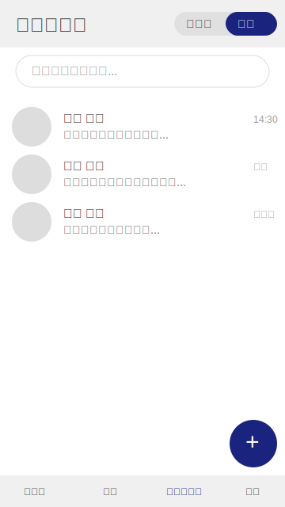
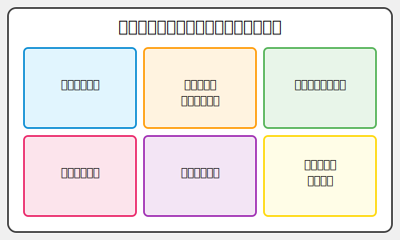
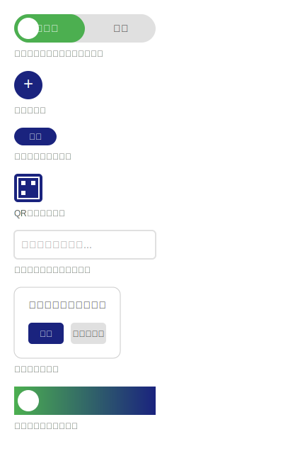

# サンプル事例で学ぶプロダクト開発入門 UI/UX編


# 0. はじめに

本書「サンプル事例で学ぶプロダクト開発入門 UI/UX編」は、プロダクト開発チームに新たに加わった方々を主な対象としています。UI/UXデザインの基礎と実践的なスキルを身につけるためのガイドとして活用していただけるでしょう。

## 本書の対象読者

本書は、以下のような方々を主な読者として想定しています：

- プロダクト開発の経験が浅く、チーム内での自身の役割をより深く理解したい方
- エンジニアやデザイナーとの協働に不慣れな方
- プロダクトマネージャー、ビジネスアナリスト、マーケターとしてのスキルを向上させたい方
- UI/UXデザインの重要性を理解し、チームにより大きく貢献したいエンジニアの方
- 前作「プロセスを眺めて学ぶプロダクト開発入門」を読み、実践的なUI/UXデザインのプロセスをさらに学びたい方

## 本書の目的

本書の主な目的は、UI/UXデザインがプロダクト開発において果たす重要な役割を理解し、チーム全体でどのように協働してユーザー中心の製品を作り上げていくかを学ぶことです。特に以下の点に重点を置いています：

1. UI/UXデザインの基本概念と重要性
2. デザイン思考とユーザー中心設計のプロセス
3. プロトタイピングの手法と効果的な活用方法
4. チーム全体でのデザインプロセスへの関わり方

## 本書の特徴

1. 実践的なアプローチ：架空のプロジェクト「LinkedPal」を通じて、UI/UX設計の全プロセスを体験できます。
2. チーム協働の視点：デザイナー、エンジニア、プロダクトマネージャーなど、異なる役割間の効果的な協力方法を随所で紹介します。
3. 早期段階からの協働強調：企画初期からデザイナーやエンジニアが参画することの重要性を示します。
4. プロトタイピングの重視：アイデアの可視化と迅速なフィードバック取得の手段としてのプロトタイピングの価値を強調します。

本書を通じて、読者の皆さんがUI/UXデザインの重要性を理解し、チームの一員としてプロダクト開発に積極的に貢献できるようになることを目指しています。デザイナーは単にグラフィックを作成する役割ではなく、ユーザー体験全体を設計する重要な存在であること、そしてエンジニアを含むチーム全体が早期からデザインプロセスに関わることの価値を、具体的な事例を通じて学んでいきましょう。

それでは、UI/UXデザインを中心としたプロダクト開発の旅に出発しましょう！

# 1. ユーザーリサーチと要求分析

## この章で学ぶこと

1章では、プロダクト開発の初期段階で行うユーザーリサーチと要求分析について学びます。この章を通じて以下のポイントを理解します：

1. ユーザーリサーチの目的と重要性
2. 効果的なリサーチ手法の選択と実施方法
3. リサーチ結果の分析と洞察の抽出プロセス
4. ユーザーニーズの抽出と優先順位付けの方法
5. プロダクト要求の定義と具体化の手順

以下の図は、ユーザーリサーチから要求定義までのプロセスを視覚的に示したものです：


この章を通じて、ユーザー中心設計の基礎となるリサーチと分析のスキルを身につけ、効果的なプロダクト開発の第一歩を踏み出すことができます。

## 1.1 ユーザーリサーチの目的と重要性

ユーザーリサーチは、プロダクト開発の初期段階で行われる重要なプロセスです。新しいSNSを開発する際、ユーザーのニーズや課題を深く理解することが不可欠です。

ユーザーリサーチの主な目的：
1. ターゲットユーザーの特定
2. ユーザーの行動パターンと習慣の理解
3. ユーザーの痛点と課題の発見
4. プライバシーに関する意識と要求の把握
5. 競合製品の利用状況とユーザー満足度の調査

## 1.2 リサーチ手法の選択と実施

一般的に、ユーザーリサーチでは以下の手法が用いられます：

1. オンラインアンケート調査：幅広いユーザーからの定量的データ収集
2. インタビュー調査：深い洞察の獲得と定性的データの収集
3. 競合分析：既存の製品の機能とユーザー満足度の評価
4. ユーザー行動観察：実際の利用行動の観察と分析

架空のプロジェクトLinkedPalの場合、以下のようなアプローチを取ったと仮定します：

1. **オンラインアンケート調査**

   

   - 目的：幅広いユーザーからの定量的データ収集
   - 対象：既存のSNSユーザー1000名
   - 内容：SNS利用習慣、プライバシーへの意識、新しいSNSへの期待

2. **インタビュー調査**

   

   - 目的：深い洞察の獲得と定性的データの収集
   - 対象：各ターゲットセグメントから5-10名ずつ
   - 内容：SNS利用におけるプライバシーの課題、理想的なSNSの特徴

3. **競合分析**

   

   - 目的：既存のSNSの機能とプライバシー保護の現状把握
   - 対象：主要なSNSプラットフォーム（Facebook, Twitter, LinkedIn等）
   - 内容：プライバシー設定オプション、ユーザーインターフェース、ユーザーフィードバック

4. **ユーザーの行動観察**

   

   - 目的：実際のSNS利用行動の把握
   - 対象：各年齢層から3-5名ずつ
   - 内容：SNSの日常的な使用パターン、プライバシー設定の操作方法

## 1.3 リサーチ結果の分析と洞察

ユーザーリサーチの結果は、プロダクトの改善点や新機能のアイデアを得るために重要です。一般的に、以下のような洞察が得られる可能性があります：

1. ユーザーの多様性
   - 年齢、性別、文化的背景による使用パターンの違い
   - 異なるユーザーグループごとの特徴的なニーズや課題

2. 製品やサービスの利用コンテキスト
   - 使用環境（家庭、職場、屋外など）による要求の変化
   - 時間帯や季節による利用傾向の変動

3. ユーザーの潜在的ニーズ
   - 明示的に表現されない要望や期待
   - 現状の不満や困りごとから推測される改善点

4. 製品やサービスの認知と理解
   - ユーザーの製品理解度と実際の機能とのギャップ
   - ブランドイメージと製品の実態の整合性

5. 使用頻度と継続利用の要因
   - 初回使用から継続利用に至るユーザージャーニー
   - 製品やサービスの長期的な価値提案

6. 競合製品との比較評価
   - ユーザーが感じる自社製品の強みと弱み
   - 競合他社の製品特徴に対するユーザーの反応

これらの一般的な洞察を踏まえつつ、LinkedPalの場合、以下のようなSNS特有の洞察が得られたと仮定しましょう：

1. **コンテキストに応じた情報共有の需要**
   - ユーザーの60%が、仕事関連の人脈と私生活の人脈を分けて管理したいと回答したと想定
   - SNS上での文脈に応じた自己表現の必要性が浮き彫りになったと仮定

2. **情報開示範囲設定の複雑さへの不満**
   - 現在のSNSの情報開示範囲設定を「複雑で分かりにくい」と感じるユーザーが65%いたと仮定

3. **セキュアなメッセージングへの需要**
   - 80%のユーザーが、エンドツーエンド暗号化などのセキュアなメッセージング機能を求めていたと想定

4. **個人的なメモ機能への潜在的需要**
   - 調査対象者の55%が、SNS上で人脈に関する個人的なメモを安全に保存したいと回答したと仮定
   - 特にビジネスユーザーの間で、この需要が顕著だったと想定（ビジネスユーザーの70%が関心を示したと仮定）

5. **情報の文脈化と個人化への要望**
   - ユーザーの65%が、人脈に関する情報をより文脈化・個人化された形で管理したいと回答したと想定
   - 「相手との過去のやりとりや重要な情報を簡単に参照できる機能」への関心が高かったと仮定

6. **プライバシーを考慮した情報共有の難しさ**
   - 回答者の50%が、「自分の友だちリストを他人が物色するのが煩わしい」を指摘したと想定
      (例)
      - 友だちの友だち（知らない人）からの友だち申請
      - 「あの友だちを紹介してくれ」としつこく頼まれる

これらの洞察は、LinkedPalのような新しいSNSの設計に重要な示唆を与えると考えられます。

## 1.4 ユーザーニーズの抽出と優先順位付け

一般的なアプローチは以下のようになります：

1. ニーズの分類：
   - 機能的ニーズ（製品やサービスが果たすべき基本的機能）
   - 感情的ニーズ（使用体験から得られる満足感や安心感）
   - 社会的ニーズ（製品使用による社会的地位や所属感）

2. 優先順位付けの基準：
   - 影響度：そのニーズを満たすことによる利用者への影響の大きさ
   - 頻度：ニーズが発生する頻度
   - 実現可能性：技術的、経済的に実現できる可能性
   - 戦略的重要性：企業の長期的な目標との整合性

3. 優先順位付けの手法：
   - カスタマージャーニーマップ：ユーザーの行動に沿ってニーズを可視化
   - KANOモデル：ニーズを基本機能、性能機能、魅力的機能に分類
   - MoSCoWメソッド：Must, Should, Could, Won'tで優先度を決定

これをベースに、LinkedPalの場合、以下のようなプロセスで優先順位付けを行ったと仮定しましょう：

1. 抽出されたユーザーニーズ（仮定）：
   - 直感的で管理しやすいコンテキスト設定
   - コンテキストに応じた人脈管理と情報共有
   - セキュアなメッセージング機能
   - 安全な個人メモ機能
   - 自分が誰と友だちであるか？を他人が知る手段を徹底的に排除

2. 優先順位付けの結果（仮定）：

   a. 直感的で管理しやすいコンテキスト設定
      - 重要度：高
      - 理由：ユーザーの75%がいわゆる「誤爆」に不安を感じており、65%が既存SNSの共有対象の設定方法を複雑と感じていたと想定

   b. コンテキストに応じた人脈管理と情報共有
      - 重要度：高
      - 理由：60%のユーザーが仕事と私生活の人脈を分けて管理したいと回答したと仮定

   c. セキュアなメッセージング機能
      - 重要度：高
      - 理由：80%のユーザーがやり取りしているメッセージを他人に覗かれることに対して嫌悪感を持ち、End-to-Endで暗号化されるセキュアなメッセージング機能を求めていたと想定

   d. 安全な個人メモ機能
      - 重要度：中
      - 理由：55%のユーザー（ビジネスユーザーでは70%）が人脈に関する個人的なメモを安全に保存したいと回答したと仮定。ここは特に他のSNSとの差別化要因となる可能性があると判断

   e. コンテキストに応じた情報の整理と参照機能
      - 重要度：中
      - 理由：65%のユーザーが仕事関係の人たちとプライベートの知人とで情報を出し分けることを望んでおり、個人メモ機能と連携して実現可能と考えられたと仮定

なお、「自分が誰と友だちであるか？を他人が知る手段を徹底的に排除」という要件については機能ではなく、「そのような機能を実装しない」という選択の話になるため、上記リストには含めていません。

このような優先順位付けに基づき、LinkedPalの核となる機能と設計方針を以下のように決定したと仮定しましょう：

1. プライバシーファーストの設計
   - すべての機能でプライバシーを最優先に考慮
   - 自分が誰と友だちであるか？を他人が知る手段を徹底的に排除することを優先する

2. コンテキスト認識型のインターフェース
   - 仕事用と私生活用のコンテキスト切り替え機能
   - コンテキストに基づいた情報フィルタリングと表示

3. 高度なセキュリティ機能
   - End-to-End暗号化メッセージング
   - 二要素認証やバイオメトリクス認証の実装による覗き見防止

4. 安全な個人メモ機能
   - 各人脈に対する個人的なメモの追加・管理機能
   - 高度な暗号化によるメモの保護
   - コンテキストに応じたメモの表示と整理

5. カスタマイズ可能なプロフィール管理
   - 複数のペルソナ（仕事用、私生活用等）の作成と管理
   - 各ペルソナに応じた情報共有設定

## 1.5 プロダクト要求の定義

一般的なアプローチ：

1. 要求の種類：
   - 機能要求：システムが実行すべき具体的な機能
   - 非機能要求：性能、セキュリティ、使いやすさなどの品質特性

2. 要求定義のプロセス：
   - ステークホルダーの特定とヒアリング
   - ユーザーストーリーの作成
   - 要求の文書化と検証
   - プロトタイプを用いた要求の可視化

3. 要求の評価基準：
   - 明確性：曖昧さがなく、誤解の余地がないこと
   - 検証可能性：要求が満たされたかを客観的に判断できること
   - 一貫性：要求間で矛盾がないこと
   - トレーサビリティ：要求の出所や関連する決定事項を追跡できること

LinkedPalの場合、以下のような主要な要求が定義されたと仮定します：

1. コンテキスト認識型のインターフェース
   - ユーザーの現在のコンテキスト（仕事、私生活等）に応じたUI/UXの提供
   - コンテキストに基づいた情報フィルタリングと表示
   - スムーズなコンテキスト切り替え機能
   - コンテキストごとの独立したプライバシー設定

2. 高度なセキュリティ機能
   - エンドツーエンド暗号化メッセージング
   - 二要素認証やバイオメトリクス認証の実装
   - データの暗号化保存とセキュアなクラウドストレージ
   - セキュリティ状態の常時可視化

3. 安全な個人メモ機能
   - 各人脈に対する個人的なメモの追加・編集・削除機能
   - メモの暗号化保存と、作成者以外のアクセス制限
   - コンテキスト（仕事/私生活）に応じたメモの表示と管理
   - メモへのタグ付けと検索機能
   - メモの重要度設定と、それに基づいた表示優先順位の調整

4. カスタマイズ可能なプロフィール管理
   - 複数のペルソナ（仕事用、私生活用等）の作成と管理
   - 各ペルソナに応じた情報共有設定

これらの要求は、LinkedPalの核となる機能と設計方針を具体化したものと考えられます。特に、安全な個人メモ機能の導入により、プライバシーを重視しつつ、ユーザーに高い付加価値を提供する独自の特徴を実現することを目指していると想定されます。

各要求は、コンテキスト管理とユーザビリティのバランスを考慮しつつ、ユーザーのコンテキストに応じた柔軟な情報管理を可能にすることを目指していると考えられます。

次の段階では、これらの要求に基づいて、詳細な機能仕様と技術要件を策定し、ユーザーインターフェースの設計に移行するような流れとなります。

# 2. ペルソナ作成とユーザーストーリーの展開

## この章で学ぶこと

ユーザーリサーチから得られた洞察を、具体的な製品設計に反映させるためには、ユーザーのニーズと行動を明確に可視化する必要があります。この章では、そのための強力なツールであるペルソナ作成とユーザーストーリーの展開について学びます。

ペルソナは、リサーチデータに基づいて作成された架空のユーザープロフィールです。これにより、チーム全体で具体的なユーザーイメージを共有し、ユーザー中心の設計を促進することができます。一方、ユーザーストーリーは、ユーザーの視点から見た機能や要求を簡潔に記述したものです。これらを組み合わせることで、ユーザーのニーズに即した製品開発が可能になります。

本章を通じて、効果的なペルソナの作成方法、ユーザーストーリーの展開プロセス、そしてこれらをプロダクト開発全体でどのように活用するかを理解していきます。また、LinkedPalプロジェクトの具体例を通じて、これらの手法の実践的な適用方法も学んでいきます。

本章の内容は、以下の図で示すプロセスの一部を詳しく扱います。この図は、ユーザーリサーチから始まり、ペルソナ作成、ユーザーストーリー展開を経て、最終的な要求定義に至るまでの全体的な流れを示しています。


黄色で示された部分は前章で扱った内容で、緑色で示された部分が本章で詳しく説明する内容です。この図を参照しながら、各セクションの位置づけを理解しつつ読み進めてください。

## 2.1 ペルソナ作成の目的と重要性

製品開発において、「誰のために作るのか」を明確にすることは極めて重要です。ペルソナは、この問いに対する具体的な答えを提供してくれます。単なる統計データや抽象的なユーザー像ではなく、名前や顔、具体的な行動パターンを持つペルソナを作ることで、開発チームは真のユーザーニーズに焦点を当てることができます。

ペルソナの主な役割は、ユーザーを具体的にイメージ化することです。これにより、チームメンバー全員が共通のユーザー理解を持つことができ、デザインや機能の決定において一貫性のある判断が可能になります。また、ペルソナは機能やUIの優先順位付けの基準としても活用でき、「このペルソナにとって、この機能はどれほど重要か？」といった議論を促進します。

さらに、ペルソナはマーケティングや営業活動にも活用できます。ターゲットユーザーを具体的に描くことで、より効果的なコミュニケーション戦略を立てることができるのです。

LinkedPalプロジェクトでは、プライバシーを重視するSNSという特性を踏まえ、ペルソナ作成に特に注力しました。例えば、プライバシー意識の高い専門職のユーザーや、仕事と私生活の境界を明確にしたいユーザーなど、LinkedPalのコアバリューに直結するペルソナを設定しました。これにより、プライバシー設定の使いやすさやコンテキスト切り替え機能の重要性など、LinkedPalの特徴的な機能の必要性を明確に示すことができました。

次のセクションでは、このような効果的なペルソナを作成するための具体的な方法について詳しく見ていきます。

はい、承知しました。2.2章以降についても、読みやすさを重視しながら、一般的な原則とLinkedPalの具体例のバランスを取る形でブラッシュアップしていきます。以下に2.2章から2.5章までの改善案を示します。

## 2.2 効果的なペルソナの作成方法

ペルソナの作成は、単なる想像の産物ではなく、綿密なデータ分析に基づいた作業です。効果的なペルソナを作るには、以下のステップを踏むことが重要です。

まず、定量的データと定性的データの両方を収集します。アンケートやウェブ解析などの定量データは、大きなトレンドや傾向を把握するのに役立ちます。一方、インタビューや観察などの定性データは、ユーザーの行動や感情をより深く理解するのに有効です。

次に、収集したデータを分析し、共通のパターンや特徴を見出します。この段階で、ユーザーを複数のセグメントに分類することが多いでしょう。各セグメントの特徴を明確にし、そこから代表的なペルソナを作り上げていきます。

効果的なペルソナには、以下の要素が含まれます：
- 基本情報（名前、年齢、職業など）
- 行動パターン
- 目標と動機
- 課題や不満点
- 価値観

これらの要素を組み合わせることで、リアルで共感できるキャラクターが生まれます。

LinkedPalプロジェクトであれば、プライバシー意識の高さや、仕事と私生活の境界の明確さなどを考慮し、以下のようなペルソナを作成することになるでしょう。

### ペルソナ1: 佐藤 真理子（さとう まりこ）


- 年齢: 32歳
- 職業: IT企業のプロジェクトマネージャー
- 年収: 800万円

**背景:**
真理子は、大手IT企業で5年間プロジェクトマネージャーとして働いています。キャリア志向が強く、仕事上の人脈作りに積極的です。プライベートでは、趣味のヨガを通じて心身のバランスを保っています。

**目標:**
- 仕事上のネットワークを拡大し、キャリアアップにつなげたい
- プライベートと仕事の人間関係を適切に管理したい
- オンライン上の評判を戦略的に構築したい

**ニーズ:**
- 仕事上の人脈に関する重要な情報を安全に記録し、必要なときにすぐに参照したい
- プライバシーを守りつつ、顧客や同僚との関係を効率的に管理したい

**懸念:**
- SNS上での不用意な投稿が、キャリアに悪影響を与える可能性
- 個人情報の漏洩やプライバシーの侵害

**フラストレーション:**
- 顧客との会話で得た重要な情報を、セキュリティの懸念から既存のSNSやメモアプリに記録できない
- 仕事用と私用の人脈情報が混在し、適切なコンテキストで情報を管理できない

**行動パターン:**
- 朝はニュースアプリでビジネス情報をチェック
- 通勤中にLinkedInで業界動向や人脈の更新を確認
- 昼休みや帰宅後にInstagramで友人の近況をチェック
- 週末にはヨガのコミュニティで新しい人々と交流

**価値観:**
- プロフェッショナリズムとワークライフバランスを重視
- 質の高い情報と人脈を大切にする
- プライバシーとセキュリティに高い関心がある

**LinkedPalへの期待:**
- 仕事用と私用の人脈を明確に分離できる機能
- 高度なプライバシー設定によるコンテンツの選択的共有
- 専門性の高いネットワーキング機会の提供

### ペルソナ2: 山田 健太郎（やまだ けんたろう）


- 年齢: 45歳
- 職業: 製薬会社の研究開発部門マネージャー
- 年収: 1,200万円

**背景:**
健太郎は、大手製薬会社で15年以上のキャリアを持つ研究者です。最近、マネージャーに昇進し、リーダーシップスキルの向上に力を入れています。家族を大切にし、週末は家族との時間を優先しています。

**目標:**
- 業界内外の専門家とのネットワークを構築し、最新の研究動向を把握したい
- チームのパフォーマンスを向上させるためのリーダーシップスキルを磨きたい
- 家族との絆を深めながら、プロフェッショナルとしての成長も続けたい

**ニーズ:**
- 研究分野の専門家との会話で得たアイデアや洞察を、安全かつ整理された形で記録したい
- 家族や友人に関する個人的な情報（誕生日、好みなど）を、プライバシーを守りつつ管理したい

**懸念:**
- 機密性の高い研究情報の漏洩
- オンライン上での過度な露出が、プロフェッショナルとしての評判に影響を与える可能性
- 仕事とプライベートの境界が曖昧になることへの不安

**行動パターン:**
- 朝は科学系ニュースサイトで最新情報をチェック
- 仕事中は専門的なオンラインフォーラムで情報交換
- 帰宅後、家族との時間を過ごした後、学術論文データベースで研究をフォロー
- 月に1-2回、業界セミナーやネットワーキングイベントに参加

**価値観:**
- 科学的厳密性と倫理を重視
- 継続的な学習と自己改善を大切にする
- 家族との時間とプロフェッショナルとしての成長のバランスを重視

**LinkedPalへの期待:**
- 高度なプライバシー設定と情報セキュリティ機能
- 専門分野に特化したネットワーキングと情報共有の場
- 家族や親しい友人との私的なコミュニケーション空間の確保

これらのペルソナは、LinkedPalの主要な機能であるコンテキスト切り替えやプライバシー設定の重要性を裏付けるものとなっています。

## 2.3 ユーザーストーリーの展開

ペルソナが「誰」を表すのに対し、ユーザーストーリーは「何を」「なぜ」行うのかを簡潔に表現します。典型的なユーザーストーリーは、「〜として、私は〜したい。なぜなら〜だからだ。」という形式で書かれます。

ユーザーストーリーの作成プロセスは以下のようになります：

1. ブレインストーミング：チーム全体でペルソナの行動や目標について自由に意見を出し合います。
2. ストーリーの優先順位付け：出されたストーリーの中から、重要度や実現可能性に基づいて優先順位を決めます。
3. 受け入れ基準の設定：各ストーリーが「完了」したと言えるための具体的な基準を設定します。

さらに、ユーザーストーリーマッピングという手法を用いると、個々のストーリーの関連性や全体像を把握しやすくなります。これはプロダクトの機能を俯瞰的に見るのに役立ち、リリース計画の策定にも活用できます。

LinkedPalのユーザーストーリー例：

### 佐藤真理子のユーザーストーリー

1. 真理子として、アプリ内でのコンテキスト（仕事/私生活）を簡単に切り替えたい。それによって、適切な情報を適切な相手と共有できるようにしたい。

2. 真理子として、仕事用と私生活用の異なるプロフィールを作成し管理したい。それによって、各コンテキストに適した自己紹介ができるようにしたい。

3. 真理子として、業界イベントで出会った人とすぐにつながりを作りたい。それによって、キャリア向上につながる人脈を効率的に拡大したい。

4. 真理子として、仕事関連の投稿が私生活の友人に見えないようにしたい。それによって、プロフェッショナルなイメージを維持しつつ、私生活でも自由に投稿できるようにしたい。

5. 真理子として、顧客との会話で得た重要な情報を安全に記録し、次回の商談前に簡単に参照したい。それによって、よりパーソナライズされたサービスを提供し、顧客との関係を強化したい。

### 山田健太郎のユーザーストーリー

1. 健太郎として、研究プロジェクトのチームメンバーと機密情報を安全に共有したい。それによって、情報漏洩のリスクを最小限に抑えたい。

2. 健太郎として、仕事モードと家族モードを明確に切り替えたい。それによって、家族との時間を大切にしながら、必要な時に仕事の連絡も見逃さないようにしたい。

3. 健太郎として、学会で出会った研究者との会話内容や、共有されたアイデアを安全に記録し、後で容易に参照したい。それによって、研究ネットワークを効果的に拡大し、新たな共同研究の機会を見つけたい。

4. 健太郎として、家族や親しい友人の誕生日や記念日を、プライバシーを守りつつ管理したい。それによって、大切な人との関係を維持し、重要な日を忘れずに祝福したい。
これらのユーザーストーリーは、LinkedPalの核心的機能であるプライバシー管理やコンテキスト切り替えの必要性を明確に示しています。

## 2.4 ペルソナとユーザーストーリーの活用

ペルソナとユーザーストーリーは、製品開発の様々な段階で活用できる強力なツールです。
まず、製品機能の優先順位付けに役立ちます。「このペルソナにとって、この機能はどれほど重要か？」という問いを立てることで、真に必要な機能を見極めることができます。
次に、ユーザーインターフェースのデザインに大きく貢献します。ペルソナの特性や行動パターンを考慮することで、より直感的で使いやすいインターフェースを設計できます。
さらに、マーケティング戦略の立案にも活用できます。ペルソナの属性や価値観を理解することで、より効果的なメッセージングやチャネル選択が可能になります。
カスタマーサポートの改善にも役立ちます。ペルソナやユーザーストーリーを参考に、よくある質問や問題を予測し、適切なサポート体制を整えることができます。

LinkedPalでは、これらの手法を以下のように活用できるでしょう：

1. 機能の優先順位付け：
- 「コンテキスト切り替え機能」を最優先機能として位置づけました。これは、仕事と私生活を明確に分けたいというペルソナ（例：佐藤真理子）のニーズに直接応えるものです。

2. UI/UXデザイン：
- ホーム画面に常に表示されるコンテキスト切り替えスイッチを実装しました。これは、「コンテキストを簡単に切り替えたい」というユーザーストーリーに基づいています。
- プライバシー設定をより直感的に操作できるよう、視覚的なスライダーを採用しました。これは、プライバシー意識の高いペルソナ（例：山田健太郎）のニーズに対応しています。

3. マーケティング戦略：
- 「プライバシーを重視しつつ、効果的なネットワーキングが可能」というメッセージを前面に出しました。これは、キャリア志向が強く、同時にプライバシーも重視するペルソナの特徴を反映しています。

4. カスタマーサポート：
- プライバシー設定に関するFAQを充実させ、サポートチームへの研修も強化しました。これは、「プライバシー設定の変更方法がわからない」というユーザーストーリーに基づいています。

## 2.5 プロダクト要求の定義と見直し

ペルソナとユーザーストーリーを基に、具体的なプロダクト要求を定義していきます。このプロセスは以下のように進めます：

1. ユーザーストーリーからの要求抽出：各ストーリーを詳細に分析し、必要な機能や特徴を洗い出します。
2. 非機能要求の考慮：パフォーマンス、セキュリティ、使いやすさなどの品質特性も要求として定義します。
3. 要求の優先順位付け：ビジネス目標やリソースを考慮し、要求に優先順位を付けます。
4. プロトタイピングと要求の検証：初期のプロトタイプを作成し、要求が適切に反映されているか確認します。
5. 反復的な要求定義プロセス：ユーザーフィードバックや新たな洞察を基に、要求を継続的に見直し、改善します。

LinkedPalの具体的な要求定義例：

1. コンテキスト切り替え機能
   - 要求：ユーザーが「仕事」と「私生活」のコンテキストを瞬時に切り替えられること
   - 優先度：最高
   - 受け入れ基準：
     - ホーム画面から2タップ以内で切り替えが完了すること
     - コンテキスト切り替え後、表示される情報が即座に更新されること
     - 誤操作防止のため、切り替え時に確認ダイアログを表示すること

2. プライバシー設定の柔軟性
   - 要求：ユーザーが投稿ごとに公開範囲を細かく設定できること
   - 優先度：高
   - 受け入れ基準：
     - 「全体公開」「友達のみ」「特定のグループのみ」「非公開」の選択肢を提供すること
     - 設定変更が3ステップ以内で完了すること
     - 設定変更後、即座に反映されること

3. セキュアなメッセージング機能
   - 要求：エンドツーエンド暗号化されたメッセージのやり取りが可能であること
   - 優先度：高
   - 受け入れ基準：
     - すべてのメッセージがデフォルトで暗号化されること
     - 暗号化状態が視覚的に確認できること
     - メッセージの送受信が従来のSNSと同程度の速度で行えること

4. QRコードによる友達追加機能
   - 要求：QRコードをスキャンすることで簡単に友達を追加できること
   - 優先度：中
   - 受け入れ基準：
     - QRコードの生成と読み取りが5秒以内に完了すること
     - 追加時にコンテキスト（仕事/私生活）を選択できること
     - セキュリティのため、QRコードの有効期限を設定できること

このように、ペルソナとユーザーストーリーを起点とした要求定義プロセスにより、ユーザーのニーズに真に応える製品開発が可能になります。

## 2.6 デザインの真の意味：プロセス全体を通じた価値創造

ここまでの章を読み進めてきた皆さんの中には、「UIデザインの話がほとんど出てこないのはなぜだろう？」と疑問に思った方もいるかもしれません。しかし、ここで重要な点を強調したいと思います。ペルソナの作成からユーザーストーリーの展開、そして要求定義に至るこれらのプロセスすべてが、実は「デザイン」の一部なのです。

デザインとは、単に見た目を整えることや美しい画面を作ることだけではありません。それは、ユーザーの深い理解に基づいて、問題を特定し、解決策を構築していく創造的なプロセス全体を指します。デザイナーの役割は、絵を描くことだけに留まりません。むしろ、製品開発の最も初期の段階から関与し、ユーザーの声を製品に反映させていく重要な役割を担っているのです。

LinkedPalのような革新的な製品を生み出すためには、デザイナーがこのような初期段階から積極的に関与することが不可欠です。ユーザーリサーチの設計、ペルソナの作成、ユーザーストーリーの展開、そして要求定義のプロセスすべてにおいて、デザイナーの創造的思考と問題解決能力が重要な役割を果たします。

このアプローチにより、単に見た目が美しいだけでなく、真にユーザーのニーズに応え、価値を提供する製品を作り出すことができるのです。次章から本格的に取り組む具体的なUIデザインも、これらの基盤があってこそ、その真価を発揮することができます。

プロダクト開発に携わる皆さん、特にエンジニアやプロダクトマネージャーの方々は、このようなデザインの広義の意味を理解し、初期段階からデザイナーと協働することの重要性を認識してください。それこそが、革新的で優れた製品を生み出す鍵となるのです。

# 2.5 UX/UIデザインワークフロー：アイデアから高忠実度モックアップまで

前章では、ペルソナの作成とユーザーストーリーの展開について学び、プロダクト要求の定義までのプロセスを見てきました。これらの作業は、ユーザー中心設計の基礎となる重要なステップです。この章では、それらの知見を具体的なUX/UIデザインへと発展させていく過程を探ります。
UX/UIデザインのプロセスは、アイデアを具体的な形にしていく創造的な旅といえます。この全体像を把握することで、次章以降で詳しく学ぶ各デザインフェーズの位置づけと重要性をより深く理解することができるでしょう。
このワークフローを理解することは、デザイナーだけでなく、プロダクトマネージャーやエンジニアにとっても非常に重要です。なぜなら、このプロセスを通じて、チーム全体がユーザーのニーズと製品ビジョンを共有し、効果的に協働することができるからです。
それでは、LinkedPalプロジェクトを例に、UX/UIデザインワークフローの各段階を詳しく見ていきましょう。

## 2.5.1 UX/UIデザインワークフロー

以下に、LinkedPalのようなプロダクトを開発する際の典型的なワークフローを示します。

1. **アイデア整理と要件定義**
   - 目的：プロダクトのコンセプトと主要機能を明確化
   - ツール：マインドマップ（XMind, MindMeister等）、ドキュメントツール（Google Docs, Notion等）
   - 成果物：コンセプトドキュメント、機能要件リスト

2. **情報アーキテクチャの設計**
   - 目的：全体の画面構成と画面間の関係性を整理
   - ツール：図表作成ツール（draw.io, Mermaid等）
   - 成果物：サイトマップ、画面遷移図

   例：
   ```mermaid
   graph TD
       A[ホーム画面] --> B[プロフィール]
       A --> C[メッセージ]
       A --> D[プライバシー設定]
       B --> E[編集]
       C --> F[新規メッセージ]
       D --> G[詳細設定]
   ```

3. **低忠実度ワイヤーフレーム作成**

    

   - 目的：各画面の基本レイアウトと主要機能を視覚化
   - ツール：スケッチアプリ（Balsamiq, Sketch等）、SVGエディタ
   - 成果物：手書き風の簡易ワイヤーフレーム

4. **中忠実度モックアップ作成**

    

   - 目的：インタラクティブな要素を含む、より詳細なレイアウトの作成
   - ツール：Figma, Adobe XD, React（Create React App等）
   - 成果物：クリック可能な画面プロトタイプ

5. **ユーザーフィードバックの収集**
   - 目的：初期デザインの使いやすさと機能性の検証
   - ツール：ユーザーテストツール（UserTesting, Hotjar等）、アンケートツール（Google Forms, SurveyMonkey等）
   - 成果物：ユーザーフィードバックレポート、改善点リスト

6. **デザインの改善とイテレーション**
   - 目的：フィードバックに基づくデザインの洗練
   - ツール：デザインツール（Figma, Sketch等）
   - 成果物：改訂されたワイヤーフレームとモックアップ

7. **高忠実度モックアップ作成**

    

   - 目的：最終的なビジュアルデザインとインタラクションの詳細化
   - ツール：デザインツール（Figma, Sketch等）、プロトタイピングツール（InVision, Framer等）
   - 成果物：最終的なUI設計、スタイルガイド、インタラクションの詳細

8. **デザイン仕様書の作成**
   - 目的：開発チームへの設計意図と詳細の伝達
   - ツール：ドキュメントツール（Confluence, Zeplin等）
   - 成果物：UI/UXデザイン仕様書、コンポーネントライブラリ

## 2.5.2 ワークフローの特徴と注意点

1. **反復的プロセス**：このワークフローは直線的ではありません。各段階で得られた知見や課題に基づいて、前の段階に戻って修正を加えることも頻繁にあります。

2. **ユーザー中心設計**：各段階でユーザーのニーズと体験を最優先に考えることが重要です。特にLinkedPalのようなプライバシー重視のアプリでは、ユーザーの信頼を得るためのデザインが crucial です。

3. **チームコラボレーション**：デザイナーだけでなく、開発者、プロダクトマネージャー、ステークホルダーとの密接な連携が必要です。特に、プライバシーに関する法的要件や技術的制約について、早期から関係者と協議することが重要です。

4. **ツールの選択**：プロジェクトの規模や팀の習熟度に応じて、適切なツールを選択することが効率的な開発につながります。

5. **デザインシステムの構築**：プロジェクトの進行に伴い、再利用可能なコンポーネントやデザインパターンをデザインシステムとして整理していくことで、一貫性のあるユーザー体験を効率的に作り出すことができます。

## 2.5.3 まとめ

このワークフローは、アイデアを具体的なデザインへと昇華させていく道筋を示しています。以降の章では、この流れに沿って各段階を詳しく解説していきます。第3章では情報アーキテクチャの設計、第4章ではワイヤーフレームの作成、第5章ではインタラクションデザイン、第6章ではビジュアルデザインについて、それぞれ深掘りしていきます。

各章を読み進める際は、ここで示したワークフローを念頭に置くことで、各段階の位置づけとつながりをより理解しやすくなるでしょう。また、実際のプロジェクトでは、このワークフローを基本としつつ、プロジェクトの特性や팀の構成に応じて柔軟にアレンジしていくことが大切です。

LinkedPalのようなプライバシー重視のアプリケーション開発では、各段階でユーザーのプライバシーとセキュリティへの配慮を忘れずに、信頼性の高いユーザー体験を設計していくことが成功の鍵となります。

# 3. 情報アーキテクチャの設計

## この章で学ぶこと

情報アーキテクチャの設計は、ユーザーがアプリケーション内で迷うことなく必要な情報にアクセスできるようにするための重要なプロセスです。この章では、LinkedPalの核心的機能であるプライバシー保護とコンテキストベースの情報管理を実現するための情報アーキテクチャの設計プロセスについて学びます。

私たちは以下のポイントを中心に探っていきます：

まず、情報アーキテクチャの重要性と目的について理解を深めます。特に、プライバシーを重視するSNSにおいて、情報構造がユーザー体験にどのような影響を与えるかを考察します。

次に、初期の情報アーキテクチャ設計のプロセスに踏み込みます。LinkedPalの核となる特徴をどのように反映させるか、ユーザーニーズをどのように情報構造に落とし込むか、そして初期の画面構成と遷移図をどのように作成するかを学びます。

設計後は、ユーザーテストと評価の段階に移ります。情報アーキテクチャを評価する手法、ユーザーフィードバックの収集と分析方法、そしてそこから得られた主な発見事項と課題の特定方法について詳しく見ていきます。

評価結果を基に、設計の再検討と改善を行います。ここでは、ユーザビリティとプライバシーのバランスをとる方法、ナビゲーション構造を最適化する手法、そして改善された情報階層と関連性の設計について学びます。

最後に、最終的な情報アーキテクチャの評価方法を探ります。設計目標の達成度をどのように評価するか、プライバシー保護をどのように統合的にアプローチするか、そして将来の課題と対応策をどのように考えるかを検討します。

さらに、情報アーキテクチャの継続的改善プロセスについても触れます。ユーザーフィードバックと使用データの分析手法、A/Bテストとセキュリティ評価の重要性、そして進化する技術とユーザーニーズにどのように対応していくかを考えます。

以下の図は、情報アーキテクチャ設計のプロセスを視覚的に示したものです：


この章を通じて、プライバシーを重視したSNSの情報アーキテクチャ設計の複雑さと、ユーザー中心設計の重要性を理解することができるでしょう。また、情報構造がユーザー体験にどのように影響を与えるかを学び、効果的な情報アーキテクチャを設計するためのスキルを身につけることができます。

## 3.1 情報アーキテクチャの重要性

情報アーキテクチャ（IA）は、デジタルプロダクトの骨格を形成する重要な要素です。それは、情報の構造化、組織化、ラベリング、そして検索のしやすさを設計するプロセスです。適切に設計されたIAは、ユーザーが必要な情報を直感的に見つけ、タスクを効率的に完了できるようサポートします。

情報アーキテクチャの主な目的は、ユーザーがアプリケーション内で迷子になることなく、スムーズに目的を達成できるようにすることです。具体的には、情報の論理的な構造化、直感的なナビゲーションの設計、効率的な検索機能の提供、そして一貫性のあるユーザー体験の実現を目指します。

LinkedPalのようなプライバシーを重視するSNSでは、通常の情報アーキテクチャの考慮事項に加えて、特別な注意を払うべき点があります。例えば、ユーザーが現在どのコンテキスト（仕事用か私生活用か）で操作しているかを常に明確に認識できるようにする必要があります。また、ユーザーの入力した情報が誰に対して共有されるのかを明確に示すことも重要です。さらに、暗号化されたメッセージングなど、セキュリティを重視する機能への容易なアクセスを提供することも求められます。

これらの要素を適切に設計することで、ユーザーはアプリケーション内で安心して行動し、プライバシーを守りながら必要な情報を共有することができるようになります。

## 3.2 初期の情報アーキテクチャ設計

LinkedPalの初期設計段階では、プロジェクトの核となる特徴を反映しつつ、ユーザーのニーズを満たす構造を作ることに注力しました。この過程では、プライバシー保護とコンテキストベースの接続という二つの重要な要素を中心に据えています。

プライバシー保護に関しては、ユーザーの承諾なしに情報が共有されないよう、明示的な許可プロセスを設計しました。また、セキュアなメッセージング機能を中心的な位置に置くことで、ユーザーが安心してコミュニケーションを取れるようにしています。

コンテキストベースの接続については、ユーザーが異なるコンテキスト（仕事、私生活など）を簡単に切り替えられる機能を中心に設計しました。各コンテキストに応じた情報とコンテンツの表示を可能にすることで、ユーザーが状況に適した形で情報を管理できるようにしています。

これらの特徴を踏まえつつ、ユーザーリサーチから得られた主要なニーズ、例えば簡単なプライバシー管理、コンテキストに応じた情報共有、セキュアなメッセージング、プロフェッショナルとプライベートの分離などを、情報構造に反映させていきました。

初期の画面構成と遷移図は、これらの要素を考慮して作成されました。

初期の画面構成をより具体的に見ていきましょう。LinkedPalの主要な画面構成は以下のようになっています：

1. ホーム画面：
   アプリケーションの中心として、以下の要素を配置しました。
   - 上部にコンテキスト切り替えスイッチ（仕事/私生活）
   - 中央にフィード表示エリア（現在のコンテキストに応じた投稿を表示）
   - 下部にナビゲーションバー（メッセージ、プロフィール、設定へのアクセス）
   - 右下に新規投稿ボタン

2. プロフィール画面：
   - ユーザーの基本情報表示エリア
   - コンテキストごとのプロフィール切り替えタブ
   - プロフィール編集ボタン
   - ユーザーの投稿履歴表示エリア

3. メッセージ画面：
   - メッセージスレッド一覧
   - 各スレッドに暗号化状態を示すアイコン
   - 新規メッセージ作成ボタン
   - 検索バー（メッセージや連絡先の検索用）

4. 設定画面：
   - プライバシー設定セクション
   - アカウント設定セクション
   - 通知設定セクション
   - セキュリティ設定セクション

5. 新規投稿作成画面：
   - コンテキスト表示・切り替えオプション
   - テキスト入力エリア
   - メディア追加ボタン
   - プライバシー設定オプション
   - 投稿ボタン

これらの画面間の遷移は、主にホーム画面の下部ナビゲーションバーを通じて行われます。また、コンテキストの切り替えは、どの画面からでも上部のスイッチを使って行えるよう設計しました。

特に注目すべき点として、コンテキスト切り替え機能をすべての画面で一貫して表示することで、ユーザーが常に現在のコンテキストを意識できるようにしています。また、プライバシー設定へのアクセスを容易にするため、設定画面へのリンクを常に表示し、新規投稿作成時にもプライバシーオプションを明示的に提示しています。

しかし、この初期設計には課題もあります。例えば、コンテキスト切り替え後の画面遷移や情報の更新方法が明確でない点や、プライバシー設定の複雑さがユーザーの負担になる可能性がある点などが挙げられます。

これらの課題を踏まえ、次のセクションではユーザーテストと評価を通じて、この初期設計をさらに改善していく過程を見ていきます。

## 3.3 ユーザーテストと評価

初期の情報アーキテクチャ設計を評価するため、多様な背景を持つ25名の参加者（年齢25-45歳、様々な技術習熟度）を対象に一連のユーザーテストを実施しました。このプロセスを通じて、設計の強みと弱みを特定し、改善点を明らかにすることを目指しました。

### テスト方法

テストは主に以下の4つの方法を組み合わせて行いました：

1. タスク完了テスト：
   参加者に5つの主要タスク（例：コンテキストの切り替え、プライバシー設定の変更、新規投稿の作成など）を与え、完了までの時間と成功率を測定しました。各タスクの制限時間は3分と設定し、ユーザーの行動を観察しました。

2. Think-aloud法：
   参加者にタスク実行中の思考を声に出してもらい、その様子を録音しました。特に躊躇や混乱が見られた箇所を注意深く観察し、記録しました。

3. 事後インタビュー：
   タスク完了後、参加者の全体的な印象や改善点についてヒアリングを行いました。特に、難しいと感じた点や改善してほしい点について詳しく聞き取りました。

4. System Usability Scale (SUS)：
   10項目の標準化されたアンケートを使用して、アプリケーション全体の使いやすさを0-100のスケールで評価しました。

### 主な発見事項と課題

テストの結果、以下のような主要な発見事項と課題が明らかになりました：

1. コンテキスト切替の不明瞭さ：
   - タスク完了率は60%（15/25人）にとどまり、平均完了時間は2分50秒でした。
   - 多くの参加者が「コンテキスト切替がどこにあるのかわからなかった」と報告しました。
   - ある参加者（42歳、男性）は「切り替えた後、何が変わったのかわかりにくい」とコメントしました。

2. ナビゲーションの煩雑さ：
   - タスク完了率は76%（19/25人）で、平均完了時間は2分10秒でした。
   - 参加者の多くが、目的の機能にたどり着くまでに複数回のタップが必要だと感じていました。
   - ある参加者（28歳、女性）は「メッセージ機能にたどり着くまでに何度もタップが必要だった」と述べました。

3. プライバシー設定の複雑さ：
   - タスク完了率は68%（17/25人）で、平均完了時間は2分35秒でした。
   - 多くの参加者が、プライバシー設定の選択肢が多すぎて混乱していました。
   - ある参加者（35歳、男性）は「設定項目が多すぎて、どれが重要なのかわかりにくい」とフィードバックしました。

4. 情報の過負荷：
   - SUSスコアの平均は62/100で、業界平均の68を下回りました。
   - 多くの参加者が、画面上の情報量が多すぎると感じていました。
   - ある参加者（31歳、女性）は「ホーム画面に情報が多すぎて、必要な機能を見つけるのに苦労した」と報告しました。

これらの発見に基づき、以下のような改善案が提案されました：

1. コンテキスト切替の改善：
   - ホーム画面上部にスイッチ形式のコンテキスト切り替えを配置
   - 切り替え時の視覚的フィードバックを強化（例：背景色の変化、アニメーション効果）

2. ナビゲーション構造の最適化：
   - ボトムナビゲーションバーの導入
   - 主要機能へのアクセスを1-2タップ以内に抑える

3. プライバシー設定の簡素化：
   - コンテキストに応じた自動プライバシー設定の導入
   - 設定項目のグループ化と階層化

4. 情報の整理：
   - ホーム画面のレイアウトを見直し、重要な情報のみを表示
   - 情報の階層化を導入し、必要に応じて詳細情報を展開できるように設計

これらの改善案を基に、次のセクションでは情報アーキテクチャの再設計を行っていきます。

## 3.4 設計の再検討と改善

ユーザーテストから得られた洞察を基に、LinkedPalの情報アーキテクチャを以下のように改善しました。この過程では、ユーザビリティとプライバシー保護のバランスを取ることに特に注意を払いました。

### 3.4.1 改善された情報構造

1. コアコンセプト
   私たちは、コンテキスト（仕事/私生活）を中心とした情報管理という当初のビジョンを維持しつつ、よりユーザーフレンドリーな形で実現することに注力しました。プライバシーとセキュリティの強化、そして直感的なナビゲーションをさらに重視しています。

2. 主要セクション
   アプリの主要セクションを以下の4つに整理しました：
   - ホーム
   - メッセージ
   - 人脈
   - 設定
   これにより、ユーザーが必要な機能に素早くアクセスできるようになりました。

3. コンテキスト管理
   すべてのセクションでコンテキスト切替機能を提供し、視覚的にも明確に区別できるようにしました。例えば、仕事コンテキストでは青色のテーマ、私生活コンテキストでは緑色のテーマを使用し、ユーザーが現在のコンテキストを瞬時に認識できるようにしています。

4. プライバシー管理
   プライバシー管理を簡素化し、以下の機能を導入しました：
   - コンテキストベースの自動プライバシー設定
   - より分かりやすい暗号化メッセージングのサポート
   - 各人脈に関する個人メモ機能の追加

### 3.4.2 情報階層と関連性

改善された情報構造を視覚化するため、以下のような図を作成しました：


この図は、LinkedPalの主要な情報構造と、ユーザーの一般的な行動パターンに基づいた関連性を示しています。

### 3.4.3 主要な改善点

1. コンテキスト切替の中央化
   - 画面上部に常時表示されるコンテキスト切替スイッチを導入
   - 切替時の視覚的フィードバックを強化（背景色の変化、アニメーション効果）

2. ナビゲーション構造の最適化
   - ボトムナビゲーションバーを導入し、主要機能（ホーム、メッセージ、人脈、設定）への直接アクセスを提供
   - 各セクション内での階層的ナビゲーションを簡素化

3. プライバシー設定の簡素化
   - コンテキストに基づいた自動プライバシー設定を導入
   - 詳細設定は設定セクションに集約し、段階的に表示

4. 情報の整理と個人化
   - ホームセクションを現在のコンテキストに関連する情報のハブとして再設計
   - 人脈セクションにおけるコンテキストベースの情報管理とメモ機能の統合

これらの改善により、LinkedPalはユーザーのプライバシーを保護しつつ、使いやすさと直感性を向上させることができました。コンテキストベースの情報管理という核心的な機能を、より効果的かつ分かりやすい形で実現する基盤が整いました。

次のセクションでは、この改善された情報アーキテクチャの評価と、今後の課題について詳しく見ていきます。

## 3.5 最終的な情報アーキテクチャの評価

LinkedPalの改善された情報アーキテクチャは、プライバシー保護とユーザビリティのバランスを取りつつ、直感的な操作性を実現することを目指して設計されました。ここでは、最終的な情報構造の評価と今後の課題について説明します。

### 3.5.1 主要な構造要素の評価

ここで示す評価は、情報アーキテクチャの設計段階での初期評価であることをご理解ください。この評価は、実際のユーザーテストや詳細なプロトタイピングの前段階で、設計チーム内部で行った理論的な評価と、ごく限られた数のステークホルダーからのフィードバックに基づいています。より包括的なユーザー評価とテストについては、後続の章で詳しく説明します。

この初期評価の目的は、次のステップであるプロトタイピングと詳細なユーザーテストに進む前に、設計の方向性が正しいかを確認することです。以下に、各要素についての初期評価を示します：

1. コンテキスト管理：
   - 仕事と私生活の2つの主要コンテキストを明確に区別
   - すべての主要セクションでのコンテキスト切替機能の実装
   初期評価：設計意図としては、ユーザーが現在のコンテキストを常に認識でき、切り替えも容易になるはずです。ただし、実際の使いやすさは後続のユーザーテストで検証する必要があります。

2. 主要セクション：
   - ホーム：コンテキストに応じたフィード表示
   - メッセージ：暗号化されたコミュニケーション
   - 人脈：コンテキストベースの人脈管理
   - 設定：プライバシーとアカウント管理
   初期評価：理論上は、シンプルで直感的なナビゲーション構造により、ユーザーが必要な機能に素早くアクセスできるはずです。この仮説は、後続のプロトタイピングとユーザーテストで検証します。

3. プライバシー保護機能：
   - コンテキストに基づく自動的な情報共有設定
   - 暗号化メッセージング
   - 個人メモ機能
   初期評価：設計上は、プライバシー設定が簡素化され、ユーザーの負担が軽減されるはずです。ただし、実際の効果と使いやすさは、詳細なユーザーテストを通じて確認する必要があります。

これらの初期評価は、後続のプロトタイピングとユーザーテストの方向性を決めるための指針となります。実際のユーザー反応や使用感については、次の章以降で詳しく検証していきます。

### 3.5.2 設計目標に対する初期評価

ここでは、設計段階で設定した目標に対する初期評価を行います。これは、プロトタイピングやユーザーテストの前段階での理論的な評価であり、実際の達成度は後続のプロセスで詳細に検証します。

1. プライバシー保護の強化：
   - 目標：コンテキストベースの情報管理により、意図しない情報共有を防止し、直感的なプライバシー制御を実現する。
   - 初期評価：設計上は、ユーザーがコンテキストを意識しやすくなり、プライバシー管理が容易になるはずです。ただし、実際の効果はユーザーテストで検証が必要です。

2. ユーザビリティの向上：
   - 目標：シンプルで一貫したナビゲーション構造とコンテキスト切替による効率的な情報アクセスを実現する。
   - 初期評価：設計上は、タスク完了時間の短縮が期待できます。具体的な改善度は、プロトタイプを用いたユーザーテストで測定します。

3. コンテキストベースの接続：
   - 目標：明確なコンテキスト分離と切替機能、コンテキストに応じた情報フィルタリングを実現する。
   - 初期評価：設計では、ユーザーがコンテキストの意義を理解しやすい構造を目指しました。実際の理解度と使用感は、詳細なユーザーテストで確認します。

これらの初期評価は、プロトタイピングとユーザーテストの方向性を決める指針となります。実際の達成度は、次章以降で詳しく検証していきます。

### 3.5.3 今後の課題と対応の方向性

設計段階で予想される課題と、それに対する対応の方向性を以下に示します。これらは、プロトタイピングとユーザーテストを通じて、より具体的に検証し、解決策を練っていく必要があります。

1. コンテキストの拡張性：
   - 予想される課題：現在の2つのコンテキストでは不十分な可能性がある。
   - 対応の方向性：カスタムコンテキスト作成機能や、コンテキスト間の関係性設定機能の導入を検討。プロトタイピング段階で、これらの機能の必要性と実現可能性を探ります。

2. プライバシー設定の柔軟性：
   - 予想される課題：自動設定が一部ユーザーのニーズを満たさない可能性がある。
   - 対応の方向性：高度な設定オプションや、コンテキストごとのカスタマイズ機能の追加を検討。ユーザーテストを通じて、どの程度の柔軟性が必要かを見極めます。

3. クロスプラットフォーム対応：
   - 予想される課題：異なるデバイスでの一貫した体験提供が難しい可能性がある。
   - 対応の方向性：レスポンシブな情報構造設計、プラットフォーム間でのデータ同期方法の検討。プロトタイピング段階で、異なるデバイスでの表示と操作性をテストします。

これらの課題と対応の方向性は、プロトタイピングとユーザーテストのプロセスを通じて、より具体的に検証し、必要に応じて設計の修正や新たな解決策の検討を行っていきます。次章以降で、これらの課題にどのように取り組んでいくかを詳しく見ていきます。

### 3.5.4 継続的な改善プロセス

LinkedPalの情報アーキテクチャは、一度の設計で完成するものではありません。ユーザーのニーズや技術の進歩に合わせて常に進化し続ける必要があります。そのため、私たちは以下のような継続的な改善プロセスを確立しました。

1. ユーザーフィードバック収集

定期的なサーベイとインアプリフィードバック機能を実装しました。例えば、新機能リリース後に短いアンケートをポップアップ表示し、ユーザーの反応を即時に収集します。また、四半期ごとにユーザーインタビューを実施し、より深い洞察を得ることにしています。

具体的には、「コンテキスト切替機能の使いやすさ」や「プライバシー設定の分かりやすさ」などについて、1-5のスケールで評価してもらい、その理由も聞き取ります。これにより、定量的・定性的な両面からユーザー体験を把握できます。

2. 使用データ分析

ユーザーの行動パターンを詳細に分析することで、情報アーキテクチャの効果を客観的に評価します。例えば、コンテキスト切替の頻度や、各機能の利用頻度を測定し、ユーザーが本当に必要としている機能を特定します。

ヒートマップ分析も活用し、ユーザーがどの部分をよくタップしているか、どの情報をよく見ているかを可視化します。この結果に基づいて、よく使う機能をより目立つ位置に移動したり、あまり使われていない機能を見直したりします。

3. A/Bテスト

新機能や改善案の効果を検証するため、A/Bテストを積極的に実施します。例えば、プライバシー設定の新しいUIを開発した場合、ユーザーの一部にのみ新UIを提供し、残りのユーザーには従来のUIを表示します。そして、両グループのユーザー行動を比較し、どちらがより効果的かを判断します。

具体的には、設定の変更頻度、設定画面での滞在時間、ヘルプページへのアクセス頻度などを指標として用います。これにより、データに基づいた意思決定が可能になります。

4. セキュリティ評価

プライバシーを重視するLinkedPalにとって、セキュリティの継続的な評価は極めて重要です。そのため、四半期ごとにセキュリティ監査を実施し、情報アーキテクチャにセキュリティ上の脆弱性がないかを確認します。

また、新たなセキュリティ脅威が発見された場合、即座に情報構造の見直しを行います。例えば、特定のユーザー情報へのアクセス方法に脆弱性が見つかった場合、その情報へのアクセスパスを再設計し、より安全な構造に変更します。

これらのプロセスを継続的に実施することで、LinkedPalの情報アーキテクチャは常に最適な状態を維持し、ユーザーのニーズとセキュリティ要件の両方を満たし続けることができます。さらに、これらのプロセスから得られた洞察は、今後の機能開発や製品戦略の立案にも活用されます。

このように、情報アーキテクチャの設計は終わりのない旅路であり、常にユーザーと向き合い、改善を続けていく姿勢が重要です。LinkedPalチームは、この継続的な改善プロセスを通じて、より優れたユーザー体験と強固なプライバシー保護を実現していくことを約束します。

次章では、この情報アーキテクチャを基に、具体的なワイヤーフレームの作成プロセスについて詳しく見ていきます。

# 4. ワイヤーフレームの作成

## この章で学ぶこと

4章では、情報アーキテクチャを視覚化し、ユーザーインターフェースの基本構造を設計するワイヤーフレーム作成プロセスについて学びます。この章を通じて以下のポイントを理解します：

1. ワイヤーフレームの目的と重要性
2. 低忠実度から高忠実度までのワイヤーフレームの種類と用途
3. ユーザーフローとナビゲーション構造の視覚化手法
4. 主要画面のレイアウト設計プロセス
5. プライバシーとセキュリティに関する考慮事項の反映方法
6. レスポンシブデザインの考慮点
7. ワイヤーフレームの評価とイテレーションプロセス

以下の図は、ワイヤーフレーム作成プロセスの概要を示しています：


## 4.1 ワイヤーフレームの目的と重要性

ワイヤーフレームは、アプリケーションの基本的な構造とレイアウトを視覚化した設計図です。主な目的は以下の通りです：

1. UI要素の配置と階層の明確化
2. 主要な機能とユーザーフローの可視化
3. デザインチームと開発チームの共通理解の促進
4. 早期段階でのユーザビリティ問題の特定

LinkedPalのようなプライバシー重視のSNSの場合、このフェーズでは以下のような議論が行われることになったでしょう：

- コンテキスト切替機能をどのように視覚的に表現し、ユーザーに分かりやすく提示するか
- プライバシー設定へのアクセスをどのように設計し、ユーザーが容易に管理できるようにするか
- セキュアなメッセージング機能をUIのどこに配置し、どのように表現するか

これらの議論を通じて、LinkedPalの核心的な機能を効果的に視覚化する方法を探ることになったと考えられます。

## 4.2 低忠実度ワイヤーフレームの作成

低忠実度ワイヤーフレームは、アイデアを素早く視覚化し、基本的なレイアウトを検討するために使用します。主な特徴は以下の通りです：

1. シンプルな線と形状を使用
2. 詳細なデザイン要素を含まない
3. 素早く作成と修正が可能
4. アイデアの初期段階での議論を促進

低忠実度ワイヤーフレームの作成手順：

1. 紙とペンを使用してスケッチを作成
2. 主要な UI 要素の配置を決定
3. ナビゲーション構造を示す
4. 複数の案を並行して作成し、比較検討

LinkedPalプロジェクトでは、この段階で以下のような検討が行われることになると考えられます：

- コンテキスト切替スイッチの配置案：画面上部、サイドメニュー、またはボトムナビゲーションバーの一部として
- プライバシー設定へのアクセス方法：専用のアイコン、設定メニュー内、またはコンテキスト切替と連動
- メッセージング機能の表現：暗号化状態を示すアイコンの配置や、セキュアなチャットルームの視覚的表現

これらの案を複数作成し、チーム内で議論することで、LinkedPalの核心的機能を効果的に表現するレイアウトのアイデアが生まれていくことになります。

## 4.3 ユーザーフローとナビゲーション構造の設計

ユーザーフローとナビゲーション構造の設計は、アプリケーション内でのユーザーの行動パターンと画面遷移を可視化するプロセスです。主な目的は以下の通りです：

1. ユーザーの目標達成プロセスの明確化
2. 画面間の関係性と遷移の把握
3. ポテンシャルなユーザビリティ問題の早期発見
4. 効率的なタスク完了のための最適なパスの設計

ユーザーフロー図の作成手順：

1. 主要なユーザータスクの特定
2. タスク完了に必要な画面の列挙
3. 画面間の遷移と決定ポイントの図示
4. 代替パスやエラー状態の考慮

LinkedPalプロジェクトでは、この段階で以下のようなユーザーフローが検討されたかもしれません：

1. 新規ユーザー登録とプロフィール設定フロー
2. コンテキスト切替とフィード表示の変更フロー
3. セキュアなメッセージングフロー
4. プライバシー設定変更フロー

例えば、LinkedPalのコンテキスト切替とフィード表示の変更フローは以下のように視覚化できるでしょう：


また、セキュアなメッセージングフローは以下のように表現できるかもしれません：


これらのユーザーフロー図を作成することで、LinkedPalの主要機能の操作性と、プライバシー保護機能のユーザビリティを向上させるための洞察が得られたことでしょう。例えば、コンテキスト切替時の確認ステップの必要性や、メッセージの暗号化プロセスの視覚化の重要性などが明確になったかもしれません。

ユーザーフローとナビゲーション構造の設計は、後続のワイヤーフレーム作成やプロトタイピングの基礎となり、一貫性のあるユーザー体験を実現するための重要なステップとなります。

## 4.4 主要画面のワイヤーフレーム作成

主要画面のワイヤーフレーム作成は、アプリケーションの中核となる画面のレイアウトと機能を視覚化するプロセスです。この段階での主な目的は以下の通りです：

1. 画面の基本構造とレイアウトの決定
2. 主要なUI要素の配置と階層の明確化
3. 情報の優先順位付けとビジュアルヒエラルキーの確立
4. インタラクションポイントの特定

ワイヤーフレーム作成の一般的な手順：

1. 画面の主要セクションを定義（ヘッダー、メインコンテンツ、フッターなど）
2. 重要なUI要素を配置（ナビゲーションメニュー、アクションボタンなど）
3. コンテンツエリアのレイアウトを設計
4. インタラクション要素を追加（ボタン、フォーム要素など）

LinkedPalプロジェクトでは、以下の主要画面のワイヤーフレームが作成されたと考えられます：

### 4.4.1 ホーム画面


**主な特徴：**
- コンテキスト（仕事/私生活）切替スイッチを上部に配置
- 現在のコンテキストに応じたフィードの表示
- 新規投稿作成ボタンを右下に配置
- ボトムナビゲーションバーで主要機能へのアクセスを提供

**対応するユーザーストーリー：**
- 真理子の「投稿ごとにプライバシーレベルを簡単に設定したい」
- 健太郎の「仕事モードと家族モードを明確に切り替えたい」

### 4.4.2 プロフィール画面


**主な特徴：**
- ユーザーの基本情報を上部に表示
- 現在のコンテキストに応じた情報表示
- 「編集」ボタンを目立つ位置に配置
- 最近の投稿の表示

**対応するユーザーストーリー：**
- 真理子の「仕事用と私生活用の異なるプロフィールを作成し管理したい」

### 4.4.3 メッセージ画面



**主な特徴：**
- メッセージスレッド一覧を表示
- 各スレッドに暗号化状態を示すアイコンを表示
- 新規メッセージ作成ボタンを右下に配置
- 検索バーでメッセージや連絡先を検索可能

**対応するユーザーストーリー：**
- 健太郎の「研究プロジェクトのチームメンバーと機密情報を安全に共有したい」

### 4.4.4 友だち詳細画面


**主な特徴：**
- 友だちの基本情報を上部に表示
- 現在の関係性（仕事/私生活/両方）を明示
- メモセクションと新規メモ追加ボタン
- 関係性変更オプションへのアクセス

**対応するユーザーストーリー：**
- 真理子の「顧客との会話で得た重要な情報を安全に記録し、次回の商談前に簡単に参照したい」
- 健太郎の「研究ネットワークを効果的に拡大し、新たな共同研究の機会を見つけたい」

### 4.4.5 設定画面


**主な特徴：**
- 各設定項目をリスト形式で表示
- プロフィール編集、アカウント設定へのリンク
- 仕事の友だち管理、私生活の友だち管理へのアクセス
- データエクスポート、ヘルプ・サポートなどの追加機能へのリンク

**対応するユーザーストーリー：**
- 全ユーザーの「プライバシーとセキュリティを簡単に管理したい」

### 4.4.6 人脈一覧画面


**主な特徴：**
- コンテキスト切替スイッチを上部に配置し、仕事と私生活の人脈を簡単に切り替え可能
- 検索バーで特定の人脈を素早く見つけられる
- 人脈リストでは各人の基本情報（名前、役職）を表示
- 右側の「›」マークで、タップすると詳細画面に移動できることを示す
- 新規人脈追加ボタンを右下に配置
- ナビゲーションバーで現在の画面（人脈）を強調表示

**対応するユーザーストーリー：**
- 真理子の「仕事用と私生活用の異なるプロフィールを作成し管理したい」
- 健太郎の「業界内外の専門家とのネットワークを構築し、最新の研究動向を把握したい」

### 4.4.7 新規投稿入力画面


**主な特徴：**
- ヘッダー部にコンテキスト切替スイッチを配置
- 大きなテキスト入力エリアで投稿内容を自由に記入可能
- 画像、位置情報、タグを追加するボタンを配置
- 投稿ボタンをテキスト入力エリアの下に大きく配置
- 現在のコンテキストに関する注意書きを表示

**対応するユーザーストーリー：**
- 真理子の「投稿ごとにプライバシーレベルを簡単に設定したい。それによって、仕事関連の投稿が私生活の友人に見えないようにしたい。」
- 健太郎の「家族との絆を深めながら、プロフェッショナルとしての成長も続けたい」

### 4.4.8 メモ入力画面


**主な特徴：**
- ヘッダー部にコンテキスト表示を配置
- メモ対象者名を明確に表示
- 大きなテキスト入力エリアでメモ内容を自由に記入可能
- 画像プレビューエリアを設置
- 画像と位置情報を追加するボタンを配置
- タグ入力エリアを設置
- 保存ボタンを大きく配置
- 現在のコンテキストに関する注意書きを表示

**対応するユーザーストーリー：**
- 真理子の「顧客との会話で得た重要な情報（食事の好み、アレルギーなど）を安全に記録し、次回の商談前に簡単に参照したい。それによって、よりパーソナライズされたサービスを提供し、顧客との関係を強化したい。」
- 健太郎の「研究分野の専門家との会話で得たアイデアや洞察を、安全かつ整理された形で記録したい」

### 4.4.9 人脈追加画面


**主な特徴：**
- シンプルなヘッダー： 

    - 「人脈追加」というタイトルを明確に表示
    - 戻るボタンで前の画面に簡単に戻れるようにしています

- タブ切り替え：

    - 「QRを表示」と「QRをスキャン」の2つのタブを用意
    - ユーザーが自分のQRコードを表示するか、相手のQRコードをスキャンするかを簡単に選択できます

- QRコード表示エリア：

    - 大きなスペースでQRコードを表示し、スキャンしやすくしています

- 説明テキスト：

    - QRコードの使用方法を簡潔に説明し、ユーザーが操作方法を理解しやすくしています

- 注意書き：

    - プライバシー保護の観点から、QRコードの適切な使用方法を強調しています
    - 背景色を変えて目立たせることで、ユーザーの注意を引いています

**対応するユーザーストーリー：**
- 真理子の「業界イベントで出会った人とすぐに専門的なつながりを作りたい。それによって、キャリア向上につながる人脈を拡大したい。」


これらの主要画面のワイヤーフレームを作成する過程で、LinkedPalの核心的機能であるプライバシー保護とコンテキストベースの情報管理を、どのようにユーザーフレンドリーな形で実現するかについて、多くの議論と試行錯誤が行われたことでしょう。

## 4.5 プライバシーとセキュリティの視覚化

プライバシーとセキュリティの視覚化は、ユーザーに安心感を与え、アプリケーションの信頼性を高めるために重要です。この段階での主な目的は以下の通りです：

1. プライバシー状態の明確な表示
2. セキュリティ機能の視覚的フィードバック
3. ユーザーのプライバシー意識の向上
4. 情報共有の範囲と影響の明確化

プライバシーとセキュリティの視覚化手法：

1. アイコンやカラーコードによる状態表示
2. プログレスバーやチェックリストによる設定完了度の表示
3. ツールチップやポップアップによる追加情報の提供
4. アニメーションによるセキュリティプロセスの視覚化

LinkedPalプロジェクトでは、以下のようなプライバシーとセキュリティの視覚化が検討されたかもしれません：

1. コンテキスト表示
   - 現在のコンテキスト（仕事/私生活）を常に画面上部に表示
   - コンテキストに応じたカラースキームの変更

2. 暗号化状態の表示
   - メッセージ画面での暗号化状態を示すアイコン
   - 暗号化プロセスのアニメーション表示

3. プライバシー設定の可視化
   - 各投稿の公開範囲を示すアイコン
   - プロフィール情報の公開範囲をグラフィカルに表示

4. セキュリティアラート
   - 不審なログインや設定変更時のポップアップ通知
   - データアクセス履歴の視覚的タイムライン

これらの視覚化要素を効果的に組み込むことで、LinkedPalユーザーのプライバシー意識を高め、アプリケーションの信頼性を強化する方法が議論されたことでしょう。

## 4.6 レスポンシブデザインの考慮

レスポンシブデザインの考慮は、様々な画面サイズやデバイスで一貫したユーザー体験を提供するために重要です。この段階での主な目的は以下の通りです：

1. 異なるデバイスでの表示の最適化
2. コンテンツの優先順位付けと再配置
3. タッチインターフェースとマウス操作の両方への対応
4. パフォーマンスとユーザビリティのバランス

レスポンシブデザインの考慮点：

1. フレキシブルグリッドレイアウトの使用
2. ブレークポイントの設定とコンテンツの再配置
3. 画像や媒体のフレキシブルな表示
4. タッチターゲットサイズの最適化

LinkedPalプロジェクトでは、以下のようなレスポンシブデザインの考慮が行われたかもしれません：

1. モバイルファーストアプローチ
   - 主要機能をモバイル画面に最適化
   - スマートフォンでの片手操作を考慮したUI設計

2. タブレット対応
   - 2カラムレイアウトの採用
   - サイドバーを活用した追加情報の表示

3. デスクトップ版
   - 3カラムレイアウトによる情報密度の向上
   - ホバー効果などマウス操作特有のインタラクションの追加

4. コンテキスト切替の表現
   - 小画面ではスイッチ、大画面ではタブ形式など、画面サイズに応じた表現方法の変更

これらの考慮点を踏まえ、LinkedPalの核心的機能であるプライバシー保護とコンテキストベースの情報管理を、異なるデバイスでどのように効果的に実現するかについて、多くの議論が行われたことでしょう。

## 4.7 ワイヤーフレームの評価とイテレーション

ワイヤーフレームの評価とイテレーションは、設計の改善と最適化を行うための重要なプロセスです。この段階での主な目的は以下の通りです：

1. ユーザビリティの問題点の早期発見
2. デザイン案の比較と最適化
3. ステークホルダーからのフィードバック収集
4. 実装前の設計の妥当性確認

評価とイテレーションのプロセス：

1. 内部レビュー：デザインチームとプロダクトチームによる評価
2. ユーザーテスト：ターゲットユーザーによるタスク完了テストと口頭フィードバック
3. ヒューリスティック評価：ユーザビリティの専門家による分析
4. A/Bテスト：複数のデザイン案の比較評価

LinkedPalプロジェクトでは、以下のような評価とイテレーションが行われた可能性があります：

1. コンテキスト切替機能の使いやすさ評価
   - 異なる配置や表現方法のA/Bテスト
   - ユーザーがコンテキストの変更を認識できるかの確認

2. プライバシー設定の分かりやすさ検証
   - 設定変更のタスク完了率と所要時間の測定
   - ユーザーが設定の影響を理解できているかのインタビュー

3. セキュアメッセージング機能の有効性評価
   - 暗号化状態の表示方法の理解度テスト
   - メッセージ送信フローの使いやすさ評価

4. レスポンシブデザインの検証
   - 異なるデバイスでのユーザビリティテスト
   - コンテンツの可読性と操作性の確認

これらの評価を通じて、LinkedPalのワイヤーフレームは複数回の改善を重ね、ユーザーのニーズとプロジェクトの目標により適したデザインへと進化していったことでしょう。

## 4.8 まとめ：ワイヤーフレーム作成の学び

ワイヤーフレーム作成プロセスを通じて、以下のような重要な学びが得られたと考えられます：

1. ユーザー中心設計の重要性
   - ユーザーのニーズと行動パターンを常に念頭に置いたデザインの必要性
   - ユーザーテストとフィードバックに基づく継続的な改善の価値

2. プライバシーとユーザビリティのバランス
   - セキュリティ機能を直感的に使いやすく設計することの難しさと重要性
   - ユーザーの信頼を獲得するためのUIデザインの役割

3. コンテキストベースのデザインの課題
   - 異なるコンテキスト間の切り替えをスムーズに行うUIの設計の複雑さ
   - コンテキストに応じた情報表示の最適化の重要性

4. レスポンシブデザインの考慮点
   - デバイスの多様性に対応しつつ一貫したユーザー体験を提供することの重要性
   - モバイルファーストアプローチの有効性

5. イテレーティブデザインプロセスの価値
   - 早期のフィードバック収集と改善の重要性
   - 柔軟な設計変更を可能にする低〜中忠実度プロトタイプの有用性

LinkedPalのようなプライバシー重視のSNSの設計では、これらの学びが特に重要です。ユーザーの信頼を獲得し、直感的な操作性を実現しつつ、高度なプライバシー保護機能を提供するバランスの取れたデザインを追求することの重要性が、このプロセスを通じて明確になったでしょう。

次章では、これらのワイヤーフレームをベースに、より詳細なビジュアルデザインとインタラクションデザインへと発展させていく過程を探ります。

# 5. インタラクションデザイン

## この章で学ぶこと
5章では、LinkedPalの事例を見ながら、ユーザーインターフェースをより動的で対話的なものにするインタラクションデザインについて学びます。この章を通じて以下のポイントを理解します：

- インタラクションデザインの重要性と目的
- プロトタイプの種類と役割
- コンテキスト切替のインタラクション設計
- セキュアなメッセージングのユーザー体験設計
- プライバシー設定のインタラクティブな表現方法
- マイクロインタラクションの設計と実装
- ジェスチャーとアニメーションの効果的な使用
- インタラクションデザインの評価とイテレーション

## 5.1 インタラクションデザインの重要性と目的

インタラクションデザインは、ユーザーとアプリケーションのやり取りを設計する重要なプロセスです。特にプライバシーを重視し、コンテキストベースの情報管理を採用したLinkedPalでは、以下の目的を達成するためのインタラクションデザインが不可欠です：

1. コンテキスト切り替えの直感性：
   - ユーザーが現在のコンテキスト（仕事/私生活）を常に認識し、簡単に切り替えられるようにする。
   - コンテキスト切り替えの結果を明確にフィードバックし、ユーザーの理解を促進する。

2. 情報の適切な表示と管理：
   - 現在のコンテキストに関連する情報のみを表示し、不要な情報の露出を防ぐ。
   - ユーザーが意図せずに異なるコンテキストの情報を共有することを防止する。

3. セキュアな操作の保証：
   - QRコードを使用した人脈追加など、セキュアな操作方法を直感的に理解できるようにする。
   - 重要な操作（例：メッセージ送信、投稿公開）の前に確認ステップを設ける。

4. エラー防止と回復：
   - ユーザーが誤ってコンテキストを混同するようなインタラクションを防ぐ。
   - エラーが発生した場合、明確なフィードバックと回復手段を提供する。

5. 一貫性のある体験：
   - アプリ全体で一貫したインタラクションパターンを使用し、学習コストを低減する。
   - コンテキスト切り替えの影響を一貫した方法で表現する。

これらの目的を達成するために、以下のセクションでは具体的なインタラクションデザインの例と実装方法を詳しく見ていきます。

## 5.2 低忠実度プロトタイプでのインタラクション設計

低忠実度プロトタイプ段階では、基本的なユーザーフローと主要な操作の概要を決定します。この段階では、詳細なビジュアルデザインよりも、核となる機能とユーザーの行動パターンに焦点を当てます。

### 5.2.1 ペーパープロトタイピング

ペーパープロトタイピングは、迅速かつ低コストで初期アイデアを可視化し、テストするための効果的な手法です。LinkedPalのコンテキスト切り替えフローを例に、具体的なプロセスを説明します。

1. 必要な材料の準備：
   - 白紙（A4サイズ推奨）
   - ペン、マーカー
   - はさみ、のり
   - ポストイット

2. 主要画面のスケッチ：
   - ホーム画面、投稿作成画面、確認ダイアログなど、フローに必要な各画面を別々の紙にスケッチします。
   - この時点では詳細なデザインは不要で、主要な要素（コンテキスト切り替えスイッチ、投稿エリアなど）の配置を示す程度で構いません。

3. インタラクティブ要素の作成：
   - コンテキスト切り替えスイッチ、投稿ボタンなど、ユーザーが操作する要素を別の紙に描き、切り取ります。
   - これらの要素は、メイン画面上で動かしたり、置き換えたりできるようにします。

4. フローの構築：
   例：コンテキスト切り替えを含む投稿作成フロー
   a. ホーム画面：現在のコンテキストを表示
   b. 投稿作成画面：コンテキスト切り替えスイッチと投稿エリアを配置
   c. コンテキスト切り替え確認ダイアログ：切り替えの影響を説明
   d. 投稿確認ダイアログ：投稿内容とコンテキストの確認

5. ユーザーテストの実施：
   - テスト参加者に具体的なタスク（例：仕事のコンテキストで投稿を作成する）を与えます。
   - 参加者の操作に応じて、手動で画面を切り替えたり、要素を動かしたりします。
   - 参加者の反応、躊躇、質問などを観察し、記録します。

この手法により、LinkedPalのコンテキスト切り替えプロセスの基本的な流れと、ユーザーの直感的な操作パターンを早い段階で確認することができます。例えば、ユーザーがコンテキスト切り替えの影響を理解しづらい場合、追加の説明画面を挿入するなどの改善を即座に行うことができます。

### 5.2.2 ユーザーフロー図の作成

ペーパープロトタイピングで得られた知見を基に、より構造化されたユーザーフロー図を作成します。これにより、アプリケーション全体の操作の流れを視覚化し、潜在的な問題点や改善の余地を特定します。

LinkedPalの「投稿作成」機能を例に、ユーザーフロー図の作成プロセスを説明します：

1. 開始点と終了点の特定：
   - 開始：ホーム画面の「新規投稿」ボタン
   - 終了：投稿が完了し、フィードに表示された状態

2. 主要なステップの列挙：
   - a. 投稿作成画面の表示
   - b. 現在のコンテキストの確認
   - c. 必要に応じてコンテキストの切り替え
   - d. 投稿内容の入力
   - e. メディアの追加（オプション）
   - f. 投稿の確認
   - g. 投稿の公開

3. 決定ポイントとの分岐の追加：
   - コンテキスト切り替えの有無
   - メディア追加の有無
   - 投稿確認での「投稿する/キャンセル」の選択

4. エラーケースとリカバリーパスの考慮：
   - ネットワークエラー時の再試行オプション
   - 不適切なコンテンツの警告と修正フロー
   - コンテキスト誤選択の警告と修正オプション

5. フィードバックループの組み込み：
   - 投稿完了後の確認メッセージ
   - フィードでの新規投稿の表示

6. 図の作成：
   上記の要素を組み合わせて、矢印や記号を用いてフロー図を作成します。各ステップを四角で、決定ポイントをダイヤモンド形で表現し、矢印で流れを示します。

このユーザーフロー図により、投稿作成プロセス全体を俯瞰し、各ステップでのユーザーの選択肢や、起こりうる問題点を明確に理解することができます。例えば、コンテキスト切り替えのステップが複雑すぎる場合、そこでのユーザーの混乱リスクを特定し、より直感的なインターフェースやガイダンスの追加などの対策を検討できます。

低忠実度プロトタイプでのこれらの作業を通じて、LinkedPalの核となる機能とユーザーの行動パターンを明確化し、次の中忠実度プロトタイプ段階でのより詳細なデザインの基礎を築くことができます。

次のセクションでは、これらの基礎的な設計を元に、中忠実度プロトタイプでのインタラクション設計について詳しく見ていきます。

## 5.3 中忠実度プロトタイプでのインタラクション設計

中忠実度プロトタイプ段階では、低忠実度プロトタイプで得られた知見を基に、より具体的なインタラクションパターンと視覚的要素を導入します。この段階では、実際のアプリケーションにより近い形でユーザー体験を提供し、より詳細なフィードバックを得ることを目指します。

### 5.3.1 クリッカブルプロトタイプの作成

クリッカブルプロトタイプは、ユーザーが実際にインタラクションを行える、動的なプロトタイプです。これにより、ユーザーフローやインタラクションの感触をより現実的にテストすることができます。

LinkedPalのコンテキスト切り替え機能を例に、クリッカブルプロトタイプの作成プロセスを詳しく説明します：

1. プロトタイピングツールの選択：
   Figma、Adobe XD、InVisionなどのツールを使用します。ここでは例としてFigmaを使用する場合の手順を説明します。

2. 画面のデザイン：
   a. ホーム画面のレイアウトを作成
      - ヘッダー：アプリ名とコンテキスト切り替えスイッチを配置
      - フィードエリア：現在のコンテキストに応じた投稿を表示
      - 新規投稿ボタン：画面右下に配置

   b. 投稿作成画面のデザイン
      - コンテキスト表示：現在のコンテキストを明確に示す
      - テキスト入力エリア
      - メディア追加ボタン
      - 投稿ボタン

   c. コンテキスト切り替え確認ダイアログ
      - 切り替えの影響を説明するテキスト
      - 「確認」と「キャンセル」ボタン

3. インタラクティブ要素の設定：
   a. コンテキスト切り替えスイッチの動作設定
      - スイッチのトグルにインタラクションを設定
      - 切り替え時に確認ダイアログを表示
   
   b. 新規投稿ボタンのクリックアクション
      - クリック時に投稿作成画面へ遷移

   c. 投稿作成画面でのアクション
      - テキスト入力欄のフォーカス設定
      - メディア追加ボタンのクリックアクション
      - 投稿ボタンのクリックアクション（投稿確認ダイアログ表示）

4. トランジションとアニメーションの追加：
   - 画面遷移時のスライドエフェクト
   - コンテキスト切り替え時のスムーズな色変更アニメーション
   - ダイアログ表示時のフェードインエフェクト

5. プロトタイプのプレビューとテスト：
   - Figmaの「プレゼンテーションモード」を使用して、作成したプロトタイプの動作を確認
   - 各インタラクションが意図通りに機能するか、流れがスムーズかをチェック

6. 共有とフィードバック収集：
   - プロトタイプの共有リンクを作成し、チームメンバーやテストユーザーに配布
   - ユーザーテストを実施し、操作性や理解しやすさに関するフィードバックを収集

このクリッカブルプロトタイプにより、ユーザーはコンテキスト切り替えの流れや投稿作成のプロセスを実際に体験でき、その使用感や直感性を評価することができます。例えば、コンテキスト切り替えの操作感が適切か、切り替え時の確認ダイアログの表示タイミングが自然か、などの具体的なフィードバックを得ることができます。

### 5.3.2 基本的なアニメーションとトランジションの導入

中忠実度プロトタイプ段階では、基本的なアニメーションやトランジションを導入することで、より滑らかで直感的なユーザー体験を提供します。LinkedPalにおける主要なアニメーションとトランジションの例を詳しく説明します：

1. コンテキスト切り替えアニメーション：
   - 実装方法：CSS transitionまたはアニメーションライブラリ（例：React Spring）を使用
   - 効果：スイッチの切り替えに合わせて、背景色がスムーズに変化（例：仕事→青、私生活→緑）
   - 目的：コンテキストの変更を視覚的に強調し、ユーザーの認識を助ける

2. 画面遷移のスライドエフェクト：
   - 実装方法：CSS transitionとJavaScriptの組み合わせ
   - 効果：新しい画面が右からスライドインし、現在の画面が左にスライドアウト
   - 目的：画面の階層構造を視覚的に表現し、ナビゲーションの感覚を向上

3. 投稿作成時のフィードバックアニメーション：
   - 実装方法：CSS keyframe animationを使用
   - 効果：投稿完了時に、確認メッセージが上から下にスライドインし、数秒後にフェードアウト
   - 目的：ユーザーアクションの結果を明確に伝え、操作の成功を視覚的に確認させる


これらのアニメーションとトランジションは、ユーザーインターフェースに生命感を与え、ユーザーの操作に対する即時のフィードバックを提供します。特にLinkedPalのようなプライバシー重視のアプリケーションでは、コンテキストの変更や情報の公開範囲が視覚的に明確に伝わることが重要です。

中忠実度プロトタイプでこれらの要素を実装することで、ユーザー体験の質を向上させ、より正確なユーザーフィードバックを得ることができます。次のセクションでは、これらの基本的なインタラクションデザインを更に発展させ、高忠実度プロトタイプでのより詳細で洗練されたインタラクション設計について説明していきます。

## 5.4 高忠実度プロトタイプでのインタラクション設計

高忠実度プロトタイプでは、実際の製品に近い詳細なインタラクションとビジュアル要素を実装します。この段階では、ユーザー体験をより現実的に再現し、細かな調整や最適化を行います。

### 5.4.1 マイクロインタラクションの設計

マイクロインタラクションは、ユーザーインターフェースに小さな、しかし重要な動きや反応を加えることで、ユーザー体験を大きく向上させる要素です。LinkedPalのコンテキストベースの特性を考慮し、いくつかの重要なマイクロインタラクションを詳細に設計します。

1. コンテキスト切り替えのマイクロインタラクション：

    

    このマイクロインタラクションでは、ユーザーがコンテキストを切り替える際、スイッチのつまみが滑らかに移動し、背景色が変化します。これにより、ユーザーはコンテキストの変更を視覚的に確認でき、現在のモードを直感的に理解できます。

2. メッセージ送信時のマイクロインタラクション：

    

    メッセージ履歴画面では、メッセージ送信時に暗号化中アニメーションが表示されます。これにより、ユーザーは送信しようとしている内容が暗号化後に送信されていることを常に意識することができます。

### 5.4.2 高度なアニメーションの実装

高忠実度プロトタイプでは、より複雑なアニメーションを実装し、ユーザー体験をさらに向上させます。

1. コンテキスト切り替え時のコンテンツ遷移アニメーション：

    

    コンテキストを切り替える際、現在のコンテンツが滑らかにスライドアウトし、新しいコンテキストのコンテンツがスライドインします。この視覚的な遷移により、ユーザーはコンテキストの変更を明確に認識できます。

これらの高度なインタラクションとアニメーションにより、LinkedPalのユーザー体験は大幅に向上し、コンテキストベースの情報管理という核心的な機能がより直感的に操作できるようになります。

高忠実度プロトタイプでは、実際の製品に近い詳細なインタラクションとビジュアル要素を実装します。この段階では、ユーザー体験をより現実的に再現し、細かな調整や最適化を行います。

次のセクションでは、これらの高度なインタラクション設計とエラーハンドリングを含むプロトタイプの評価とイテレーションプロセスについて詳しく見ていきます。

### 5.4.3 エラーハンドリングとフィードバックの詳細設計

LinkedPalの新しい設計では、コンテキストベースの情報管理が中心となります。エラーハンドリングとフィードバックは、ユーザーが常に現在のコンテキストを意識し、適切な情報共有を行えるよう支援することに焦点を当てます。

1. コンテキスト切り替え時のフィードバック

     

    ユーザーがスワイプ操作でコンテキストを切り替えた際、画面上に短時間フィードバックを表示します。これにより、ユーザーは切り替えが成功したことを視覚的に確認でき、現在のコンテキストを常に意識することができます。確認ダイアログは表示せず、スムーズな操作感を維持します。

    ただし、特定の状況下（例：未保存の作業がある場合）では、切り替え前に警告を表示し、データ損失を防ぎます。

2. 誤ったコンテキストでの投稿を防ぐためのフィードバック

    投稿作成時、現在のコンテキストを常に表示し、投稿ボタンを押す前に再確認を促します。また、投稿内容がコンテキストと一致しない可能性がある場合（例：仕事のコンテキストで「休暇」という単語を使用）、警告を表示します。

3. QRコードスキャン時のエラーハンドリング

     

    QRコードのスキャンに失敗した場合、明確なエラーメッセージを表示し、再スキャンのオプションを提供します。また、スキャンしたQRコードが無効な場合（例：期限切れや不正なフォーマット）、適切な警告メッセージを表示します。

これらの高度なインタラクション設計により、LinkedPalのユーザー体験は大幅に向上し、プライバシーとセキュリティに対する信頼感を高めることができます。次のセクションでは、これらのプロトタイプの評価とイテレーションプロセスについて詳しく見ていきます。

## 5.5 プロトタイプの評価とイテレーション

プロトタイプの評価とイテレーションは、ユーザー中心設計プロセスの核心部分です。この段階では、作成したプロトタイプをユーザーにテストしてもらい、そのフィードバックを基に設計を改善していきます。

### 5.5.1 ユーザーテストの実施

ユーザーテストは、実際のユーザーがプロトタイプを使用する様子を観察し、定量的・定性的データを収集する過程です。

1. テスト参加者の選定:
   - LinkedPalのターゲットユーザー（例：プライバシーを重視する25-45歳の専門職）から5-8名を選出
   - 多様性を確保するため、年齢、職業、技術習熟度などのバランスを考慮

2. テスト環境の準備:
   - 静かで快適なテストルームを用意
   - スクリーン録画ソフトウェアをセットアップし、ユーザーの操作とコメントを記録

3. テストシナリオの作成:
   - プライバシー設定の変更
   - 新しい人脈の追加と公開範囲の設定
   - プライバシーレベルの異なる投稿の作成
   - プライバシー設定の矛盾が発生する操作の実行

4. 定量的指標の測定:
   - タスク完了率
   - タスク完了時間
   - エラー発生率
   - ユーザー満足度スコア（5段階評価など）

5. 定性的データの収集:
   - Think-aloud法：ユーザーに思考を声に出してもらい、操作中の心理を把握
   - インタビュー：テスト後に詳細な感想や改善提案を聞き取り


### 5.5.2 データ分析とインサイトの抽出

収集したデータを分析し、ユーザビリティの問題点や改善のヒントを見出します。

1. 定量データの分析:
   - タスク完了率や操作時間の平均値を算出
   - エラー発生箇所とその頻度を特定
   - 満足度スコアの分布を確認

2. 定性データの分析:
   - ユーザーコメントをカテゴリー別に整理（例：プライバシー設定の分かりやすさ、操作の直感性など）
   - 共通の問題点やポジティブな反応を抽出

3. ヒートマップ分析:
   - ユーザーの注視点や操作箇所を可視化し、UI上の重要な領域を特定

    

### 5.5.3 改善案の策定とイテレーション

分析結果を基に、具体的な改善案を策定し、プロトタイプに反映します。

1. 問題点の優先順位付け:
   - 影響度（ユーザー体験への影響の大きさ）
   - 頻度（問題が発生する頻度）
   - 実装の容易さ

2. 改善案のブレインストーミング:
   - デザインチーム内でアイデアを出し合い、複数の解決策を検討

3. 改善案の実装:
   - プロトタイプに改善案を反映
   - 必要に応じてデザインシステムを更新

4. 再テストと検証:
   - 改善されたプロトタイプで小規模なユーザーテストを実施
   - 改善の効果を確認し、必要に応じてさらなる調整を行う

このプロセスを繰り返すことで、LinkedPalのUI/UXは継続的に改善され、ユーザーのニーズにより適したものになっていきます。特にプライバシー設定の直感性や、ユーザーが感じる安心感を重視しながら改善を進めることが重要です。

次のセクションでは、これらの評価とイテレーションを経て最終化されたデザインについて、詳細なドキュメンテーションを作成する方法を説明します。

## 5.6 最終的なインタラクションデザインの文書化

プロトタイピングと評価を経て決定したインタラクションデザインを文書化することは、開発チームとの円滑な連携や、将来的な改善のための重要なステップです。

### 5.6.1 インタラクションパターンライブラリの作成

再利用可能なインタラクションパターンをカタログ化し、一貫したユーザー体験を提供するための基盤を作ります。



各パターンには以下の情報を含めます：
- パターン名と簡単な説明
- 使用場面と目的
- 具体的な実装方法（アニメーション、タイミングなど）
- 関連するUIコンポーネント
- アクセシビリティへの配慮事項

### 5.6.2 アニメーションとトランジションの仕様書作成

ユーザー体験を向上させる重要な要素であるアニメーションとトランジションの詳細を文書化します。


仕様書には以下の情報を含めます：
- アニメーション/トランジションの名称と目的
- タイミング（持続時間、遅延など）
- イージング関数
- キーフレームの詳細
- パフォーマンスに関する考慮事項

### 5.6.3 コンテキスト切り替えに関する特別ガイドライン

LinkedPalの核心であるコンテキスト切り替えに関連するインタラクションについて、特別なガイドラインを作成します。


ガイドラインには以下の内容を含めます：
- コンテキスト切り替え時の視覚的フィードバックの標準化
- コンテキスト切り替え後のコンテンツ更新の方法
- ユーザーへの教育的フィードバックの提供方法

### 5.6.4 開発チームとのコラボレーション

文書化されたデザインを開発チームと共有し、実装に向けた準備を進めます。

1. デザイン仕様書のレビューセッション：
   - デザインチームと開発チームが集まり、仕様書の内容を詳細に確認
   - 技術的な実現可能性や制約について議論

2. プロトタイプのデモンストレーション：
   - 高忠実度プロトタイプを使用して、期待されるインタラクションを実演
   - 開発チームからのフィードバックを収集し、必要に応じて調整

3. 実装計画の策定：
   - インタラクションの優先順位付け
   - 開発スプリントへの組み込み方法の検討
   - テスト計画の立案

4. 継続的なコミュニケーション：
   - 定期的な進捗確認ミーティングの設定
   - 実装中に発生した問題や疑問点への迅速な対応

このようなプロセスを通じて、LinkedPalのインタラクションデザインは明確に文書化され、開発チームと共有されます。これにより、デザインの意図が正確に実装に反映され、高品質なユーザー体験が実現されることが期待できます。

次のセクションでは、これらのドキュメントを活用した実装フェーズへの移行と、その後の継続的な改善プロセスについて説明します。

## 5.7 実装フェーズへの移行と継続的改善

### 5.7.1 デザインハンドオフ

デザインチームから開発チームへの円滑な移行は、プロジェクトの成功に不可欠です。

1. デザインハンドオフミーティング
   - 参加者：デザイナー、開発者、プロダクトマネージャー
   - 内容：
     - インタラクションデザインの意図と重要性の説明
     - アニメーション仕様書の詳細な解説
     - プライバシー関連機能の優先順位の確認

2. デザイン資産の共有
   - 使用ツール：Figma, Zeplin, InVision等
   - 共有内容：
     - 高忠実度プロトタイプ
     - UIコンポーネントライブラリ
     - アニメーション仕様書
     - インタラクションパターンガイドライン


### 5.7.2 開発フェーズでの協働

デザインチームと開発チームの継続的な協力が重要です。

1. 定期的なチェックインミーティング
   - 頻度：週1回
   - 目的：進捗確認、課題の早期発見と解決

2. ペアプログラミングセッション
   - デザイナーと開発者が協力して複雑なインタラクションを実装
   - 例：プライバシー設定変更時のアニメーション実装

3. デザインQAプロセス
   - 実装されたUIとインタラクションがデザイン意図と一致しているか確認
   - フィードバックループの確立：発見された問題を迅速に修正

## 5.8 インタラクションデザインの総合的考察

LinkedPalのインタラクションデザインプロセスを振り返り、得られた知見や課題、今後の展望について総合的に考察します。

### 5.8.1 コンテキストベースのデザインの効果と課題

1. 効果:
   - ユーザーのプライバシー管理の簡素化
   - 情報の適切な共有と管理の促進
   - ユーザーインターフェースの一貫性向上

2. 課題:
   - コンテキスト切り替えの頻度とユーザーの認知負荷のバランス
   - 異なるコンテキスト間での情報の連携と分離の最適化

### 5.8.2 ユーザー中心設計の重要性

1. 反復的なプロトタイピングとテストの効果:
   - ユーザーニーズの深い理解
   - 早期の問題発見と解決
   - デザインの継続的な改善

2. ユーザーフィードバックの活用:
   - 定量的・定性的データの統合分析
   - ユーザーの実際の使用パターンに基づく設計の最適化

### 5.8.3 技術的制約とデザインの調和

1. パフォーマンスとユーザー体験のバランス:
   - スムーズなアニメーションと処理速度の両立
   - デバイスの性能差を考慮したデザインの最適化

2. セキュリティ要件とユーザビリティの融合:
   - QRコードを使用した安全な人脈追加機能の実現
   - エンドツーエンド暗号化のユーザーフレンドリーな実装

### 5.8.4 今後の展望と課題

1. AIとの統合:
   - コンテキスト切り替えの自動提案機能
   - ユーザーの行動パターンに基づく適応型インターフェース

2. クロスプラットフォーム対応:
   - デスクトップ版とモバイル版の一貫した体験の提供
   - 新たなデバイス（ウェアラブルなど）への対応

3. アクセシビリティの更なる向上:
   - 多様なユーザーニーズへの対応
   - 音声インターフェースの導入検討

4. データポータビリティとプライバシー:
   - ユーザーデータのエクスポート機能の強化
   - プライバシー設定のポータビリティの実現

### 5.8.5 結論

LinkedPalのインタラクションデザインは、プライバシーを重視しつつ使いやすさを追求するという挑戦的な目標に対して、コンテキストベースのアプローチを採用することで一定の成功を収めました。ユーザー中心設計のプロセスを通じて、ユーザーのニーズとフィードバックを継続的に取り入れることで、より直感的で効果的なインターフェースを実現しています。

今後は、新たな技術の導入やユーザーの変化するニーズに対応しつつ、プライバシーと使いやすさのバランスを維持していくことが重要です。また、多様なユーザーに対応するためのアクセシビリティの向上や、クロスプラットフォーム展開など、さらなる課題に取り組んでいく必要があります。

LinkedPalのインタラクションデザインの経験は、プライバシー重視のソーシャルネットワークという新しい領域におけるデザインの可能性と課題を示しています。この知見は、今後の類似プロジェクトや、プライバシーとユーザビリティのバランスを求められる他の分野のデザインにも活かされることでしょう。

次章のビジュアルデザインでは、これらのインタラクションを視覚的にどのように表現し、さらなるユーザー体験の向上を図るかについて詳しく見ていきます。

# 6. ビジュアルデザイン

ビジュアルデザインは、アプリケーションの見た目を決定し、ユーザー体験に大きな影響を与えます。LinkedPalの核となる「プライバシー保護」の概念を視覚的に表現しながら、使いやすく魅力的なデザインを作り上げていきます。

## 6.1 デザイン哲学とブランドアイデンティティ

LinkedPalのデザイン哲学とブランドアイデンティティをより具体的に説明し、視覚化します。

1. 透明性：
   - ユーザーの操作とその結果を常に明確に表示
   - プライバシー設定の状態を視覚的に分かりやすく表現

2. 信頼性：
   - 堅牢さと安全性を示す視覚要素（盾のアイコンなど）の一貫した使用
   - 信頼を喚起する色彩（青や緑のトーン）の効果的な活用

3. シンプリシティ：
   - 必要最小限の要素でユーザーインターフェースを構成
   - 直感的な操作を可能にする明確な視覚的階層

4. 一貫性：
   - アプリ全体で統一されたアイコン、色彩、タイポグラフィの使用
   - 一貫したインタラクションパターンの適用

5. アクセシビリティ：
   - 高コントラスト比の確保
   - スクリーンリーダー対応のための適切なテキスト代替の提供

これらの哲学を視覚化した例：


## 6.2 カラーパレットの選定

カラーパレットの選定理由と使用例をより詳細に説明します。

1. 主要カラー（濃紺 #1A237E）：
   - 信頼性と専門性を表現
   - 使用例：ヘッダー、重要ボタン、アクセントカラーとして使用

2. アクセントカラー（金色 #FFD700）：
   - プライバシー保護を象徴し、重要な情報や操作を強調
   - 使用例：プライバシー関連アイコン、重要通知のハイライト

3. 背景色：
   - 白 (#FFFFFF)：清潔感と読みやすさを提供
   - 薄いグレー (#F5F5F5)：セカンダリーな背景、情報の区分けに使用

4. テキストカラー：
   - 濃いグレー (#333333)：メインテキスト、読みやすさを考慮
   - 中間グレー (#666666)：セカンダリーテキスト、補足情報に使用

5. 機能色：
   - 緑 (#4CAF50)：成功、確認、高プライバシー設定を示す
   - 赤 (#F44336)：警告、エラー、低プライバシー設定を示す
   - 青 (#2196F3)：情報、リンクに使用

カラーパレットの視覚化：


このカラーパレットは、LinkedPalのブランドアイデンティティを視覚的に表現し、ユーザーに信頼性とプライバシー重視の印象を与えます。各色の使用は慎重に計画され、アプリケーション全体で一貫性を保ちながら、重要な情報や操作を効果的に強調します。

## 6.3 タイポグラフィの決定

タイポグラフィの選択は、読みやすさとブランドの個性を両立させる重要な要素です。LinkedPalのタイポグラフィについて、より詳細に説明します。

1. ヘッドライン：
   - フォント：Roboto Bold
   - サイズ：24px（モバイル）、32px（デスクトップ）
   - 行間：1.2
   - 使用例：画面タイトル、主要セクション見出し
   - 特徴：太字で注目度が高く、アプリの主要部分を明確に示す

2. サブヘッドライン：
   - フォント：Roboto Medium
   - サイズ：18px（モバイル）、24px（デスクトップ）
   - 行間：1.3
   - 使用例：セクション見出し、重要な通知
   - 特徴：メインヘッドラインと本文の中間的な存在で、情報の階層を作る

3. 本文：
   - フォント：Roboto Regular
   - サイズ：16px（モバイル）、18px（デスクトップ）
   - 行間：1.5
   - 使用例：一般的なテキストコンテンツ
   - 特徴：読みやすさを重視し、長文でも疲れにくいデザイン

4. 小さな文字：
   - フォント：Roboto Light
   - サイズ：12px（モバイル）、14px（デスクトップ）
   - 行間：1.4
   - 使用例：注釈、補足情報
   - 特徴：必要な情報を控えめに表示し、主要コンテンツを邪魔しない

タイポグラフィの視覚化：


この図では、LinkedPalで使用される各タイポグラフィスタイルを視覚的に表現しています。Robotoフォントファミリーの異なるウェイトと大きさを使用することで、テキスト情報に明確な視覚的階層を作り出しています。これにより、ユーザーは直感的に情報の重要度を理解し、アプリケーション内を効率的にナビゲートすることができます。

さらに、タイポグラフィの選択には以下の配慮がなされています：

- レスポンシブデザイン：モバイルとデスクトップでフォントサイズを調整し、各デバイスで最適な読みやすさを確保。
- アクセシビリティ：十分な文字サイズと行間を確保し、幅広いユーザーにとって読みやすいデザインを実現。
- ブランドの一貫性：Robotoフォントファミリーを一貫して使用することで、LinkedPalのブランドアイデンティティを強化。

このタイポグラフィシステムにより、LinkedPalは清潔で専門的な印象を与えつつ、ユーザーにとって読みやすく使いやすいインターフェースを実現しています。

フォントサイズはビューポートに応じて調整し、読みやすさを確保します。また、フォントのウェイトを活用して情報の階層を表現します。

## 6.4 アイコンとイラストレーションのスタイル設定

LinkedPalのアイコンとイラストレーションは、アプリの視覚的アイデンティティを強化し、ユーザーの理解を助ける重要な要素です。以下に、その詳細なスタイル設定を説明します。

1. アイコンデザイン：
   - スタイル：シンプルで直線的、ミニマリスト的アプローチ
   - 線の太さ：2px（小さいアイコン）、3px（大きいアイコン）
   - 角の丸み：2px radius
   - カラー：主にモノクロで、アクセントカラー（金色 #FFD700）をプライバシー関連アイコンに使用

2. カスタムアイコンセット：
   - プライバシーレベル表示用の鍵アイコン（3段階）
   - 暗号化状態を示す南京錠アイコン
   - 友達関係の可視性を表すアイコン
   - プライバシー設定を示す盾アイコン

3. イラストレーションスタイル：
   - スタイル：フラットデザイン、抽象的な幾何学形状を使用
   - カラー：アプリのカラーパレットに準拠
   - テーマ：プライバシー、セキュリティ、人々のつながりを表現

4. アニメーションとトランジション：
   - 動き：スムーズで自然な動き
   - 時間：200-300ms（小さな動き）、300-500ms（大きな動き）
   - イージング：ease-in-out関数を基本とする


このようなアイコンとイラストレーションのスタイルを採用することで、LinkedPalは以下の効果を実現しています：

1. 一貫性のある視覚言語：アプリ全体で統一されたデザイン要素を使用し、ユーザー体験の一貫性を高めています。

2. 意味の明確化：シンプルで直感的なアイコンにより、機能や状態を瞬時に理解できるようにしています。

3. ブランドアイデンティティの強化：独自のアイコンセットとイラストレーションスタイルにより、LinkedPalの独自性を表現しています。

4. 視覚的な魅力：アニメーションや幾何学的なイラストにより、アプリに洗練された印象を与えています。

5. プライバシー重視の表現：鍵や盾などのモチーフを使用し、アプリのコア機能であるプライバシー保護を視覚的に強調しています。

これらのビジュアル要素は、ユーザーインターフェースの重要な部分として機能し、LinkedPalの使いやすさと魅力を高める役割を果たしています。

## 6.5 レイアウトとグリッドシステム

LinkedPalのレイアウトとグリッドシステムは、一貫性のあるデザインと効率的な情報配置を実現するために重要です。以下に、詳細な設計と実装方法を説明します。

1. ベースユニット：
   - 8pxをベースユニットとして使用
   - すべてのスペーシングとサイズリングはこの倍数で設定
   - 理由：様々な画面サイズに対して柔軟に対応でき、要素間の整列が容易

2. カラムレイアウト：
   - モバイル：4カラム
   - タブレット：8カラム
   - デスクトップ：12カラム
   - 各デバイスでの最適な情報表示を実現

3. マージン：
   - モバイル：16px
   - タブレット：24px
   - デスクトップ：32px
   - 画面サイズに応じて適切な余白を確保

4. ガター：
   - モバイル：16px
   - タブレット：24px
   - デスクトップ：32px
   - カラム間の適切な間隔を保持

5. コンテンツの配置：
   - 重要な情報や操作は画面の上部に配置
   - プライバシー関連の要素は目立つ位置に配置
   - 左揃えを基本とし、読みやすさを確保

これらのグリッドシステムを視覚化すると以下のようになります：


このグリッドシステムを採用することで、LinkedPalは以下の利点を得ています：

1. 一貫性：すべての画面で統一されたレイアウト構造を維持し、ユーザー体験の一貫性を確保。

2. レスポンシブデザイン：異なるデバイスやスクリーンサイズに柔軟に対応し、常に最適な表示を実現。

3. 効率的な開発：デザイナーと開発者が共通の基準を持つことで、デザインから実装へのプロセスがスムーズに。

4. 視覚的バランス：要素間の適切な間隔と配置により、見やすく使いやすいインターフェースを実現。

5. スケーラビリティ：新機能や要素の追加時も、既存のグリッドシステムに沿って一貫性を保ちながら拡張可能。

このグリッドシステムは、LinkedPalの全画面デザインの基礎となり、プライバシー設定やユーザープロフィールなど、重要な機能の効果的なレイアウトを可能にしています。特に、プライバシー関連の要素を目立つ位置に配置することで、アプリの中核的な価値を視覚的に強調しています。

## 6.6 コンテキストとプライバシーを強調するデザイン要素

LinkedPalの核となる機能であるコンテキストベースの情報管理とプライバシー保護を視覚的に強調するため、特別なデザイン要素を導入しています。これらの要素は、ユーザーに常にコンテキストを意識させ、安心感を与える役割を果たします。

1. コンテキストインジケーター：
   - 画面上部に常に表示されるコンテキスト切り替えスイッチ
   - 現在のコンテキスト（仕事/私生活）を色とアイコンで明確に表示
   - 例：仕事→青/ブリーフケースアイコン、私生活→緑/家アイコン

    

2. コンテキスト適応型背景：
   - 画面の背景色や要素の色調を、現在のコンテキストに応じて微妙に変化させる
   - 例：仕事コンテキストでは青みがかった白、私生活コンテキストでは暖かみのある白

3. コンテキストラベル：
   - 投稿やメッセージなど、各コンテンツにコンテキストを示すラベルを付与
   - 小さなアイコンや色付きのタグで視覚的に区別

    

4. 安全な共有視覚化：
   - メッセージや投稿が暗号化されていることを示す小さなアニメーション
   - 送信時に文字が一瞬スクランブルされ、ロック状態に変化

5. コンテキスト切り替えアニメーション：
   - コンテキストを切り替える際、画面全体に一時的なオーバーレイを表示
   - 新しいコンテキストに関連するコンテンツをフェードインで表示

6. QRコードスキャン強調：
   - 人脈追加時のQRコードスキャン機能を視覚的に強調
   - スキャン成功時の明確なフィードバックアニメーション

これらのデザイン要素を適切に配置することで、LinkedPalは以下の効果を実現しています：

1. コンテキスト認識の向上：ユーザーが常に現在のコンテキストを視覚的に認識できる
2. 情報の適切な管理：各コンテンツがどのコンテキストに属しているかを明確に示す
3. セキュリティの可視化：暗号化やプライバシー保護機能を視覚的に表現
4. 一貫したブランディング：コンテキストベースの設計を視覚的に強調し、LinkedPalの独自性を表現
5. ユーザーの安心感：プライバシーとセキュリティが常に守られていることを視覚的に伝達

これらのデザイン要素により、LinkedPalのユーザーインターフェース全体に統合され、ユーザーがアプリを使用する際に常にコンテキストとプライバシーを意識できるようサポートしています。

次のセクションでは、これらの要素を含むインタラクション要素のデザインについて詳しく見ていきます。

## 6.7 インタラクション要素のデザイン

はい、「6.7 インタラクション要素のデザイン」に進みましょう。この部分も、コンテキストベースのアプローチに合わせて更新していきます。

## 6.7 インタラクション要素のデザイン

LinkedPalのインタラクション要素は、ユーザーとアプリケーションのやり取りを円滑にし、コンテキストベースの情報管理を強化するように設計されています。以下に主要なインタラクション要素とそのデザインについて説明します。

1. コンテキスト切り替えスイッチ：
   - 形状：丸みを帯びた長方形（カプセル型）
   - 状態：私生活（左）、仕事（右）
   - 色：私生活（緑 #4CAF50）、仕事（紺 #1A237E）
   - アニメーション：スムーズなスライド遷移（300ms、ease-in-out）

    

2. 投稿ボタン：
   - 形状：円形
   - 色：プライマリーカラー（#1A237E）
   - アイコン：プラス記号（白色）
   - 状態：通常、ホバー、アクティブ
   - ホバー効果：軽微な拡大とシャドウの増加

3. コンテキストラベル：
   - 形状：丸みを帯びた長方形
   - 色：コンテキストに応じた色（私生活：緑、仕事：紺）
   - テキスト：白色で「私生活」または「仕事」

4. QRコードスキャンボタン：
   - 形状：正方形、角が丸み
   - アイコン：QRコードのシンボル
   - 色：プライマリーカラー（#1A237E）
   - タップ時のフィードバック：カメラアクセスのアニメーション

5. メッセージ入力フィールド：
   - 形状：角が丸い長方形
   - 背景色：白（#FFFFFF）
   - ボーダー：薄いグレー（#E0E0E0）
   - フォーカス時：ボーダー色がプライマリーカラーに変化

6. コンテキスト切り替え確認ダイアログ：
   - 背景：半透明のオーバーレイ
   - ダイアログボックス：白背景、角が丸い
   - 確認ボタン：プライマリーカラー
   - キャンセルボタン：グレー

7. スワイプジェスチャー：
   - コンテキスト切り替え用のスワイプエリア
   - 視覚的フィードバック：スワイプ方向に応じた背景色の変化
   - スワイプ完了時：スムーズな遷移アニメーション

これらのインタラクション要素を視覚化した例を以下に示します：



これらのインタラクション要素の設計には、以下の原則が適用されています：

1. 一貫性：すべての要素が LinkedPal のデザイン言語と色彩計画に沿っており、アプリ全体で統一された外観を維持しています。

2. フィードバック：ユーザーの操作に対して明確な視覚的フィードバックを提供し、操作の結果を即座に理解できるようにしています。

3. アクセシビリティ：十分なコントラスト比とサイズを確保し、様々なユーザーが使いやすいデザインを心がけています。

4. コンテキスト強調：コンテキストに関連する要素は、色やアイコンを用いて視覚的に強調しています。

5. 効率性：最小限のステップでタスクを完了できるよう、直感的な操作性を重視しています。

これらのインタラクション要素を適切に組み合わせることで、LinkedPal は使いやすく、コンテキストを意識したユーザーインターフェースを実現しています。ユーザーは各要素の役割を直感的に理解し、安心してアプリケーションを操作できるようになっています。

## 6.8 UI/UXデザインのテストと継続的改善

LinkedPalのUI/UXデザインを継続的に改善し、ユーザーのニーズとコンテキストベースの情報管理の要求に応え続けるために、包括的なテストと改善プロセスを実施します。

### 6.8.1 テスト方法

様々なテスト方法を組み合わせることで、デザインの有効性を多角的に評価します。

#### A/Bテスト

2つの異なるデザイン案を比較し、どちらがより効果的かを定量的に評価します。

例：コンテキスト切り替えの視覚化比較
- バージョンA：スイッチ型のコンテキスト切り替え
- バージョンB：タブ型のコンテキスト切り替え


測定指標：
- タスク完了時間
- エラー率
- ユーザー満足度（アンケート）

#### ユーザビリティテスト

実際のユーザーに特定のタスクを実行してもらい、操作性や理解度を評価します。

コンテキスト関連タスクの例：
1. コンテキストの切り替え
2. 異なるコンテキストでの投稿作成
3. QRコードを使用した人脈追加

観察ポイント：
- コンテキスト切り替えの理解度
- 異なるコンテキスト間での情報管理の容易さ
- QRコードスキャン機能の使いやすさ

#### アクセシビリティ評価

多様なユーザーが LinkedPal を問題なく利用できることを確認します。

評価項目：
- 色のコントラスト比（WCAG 2.1 レベルAAに準拠）
- キーボードナビゲーション
- スクリーンリーダー対応

### 6.8.2 フィードバック収集

ユーザーからの直接的なフィードバックとデータ分析を組み合わせて、改善ポイントを特定します。

#### ユーザーフィードバック

アプリ内フィードバックフォーム：
- 簡単なレーティングシステム（5段階評価）
- コンテキスト切り替えの使いやすさに関する質問

定期的なユーザーサーベイ：
- コンテキストベースの情報管理の効果性
- QRコードを使用した人脈追加の満足度
- 全体的なユーザー体験の評価

#### データ分析

ヒートマップ分析：
- コンテキスト切り替えスイッチの使用頻度
- 各コンテキストでの滞在時間


ファネル分析：
- コンテキスト切り替えから投稿完了までの完了率
- QRコードスキャンから人脈追加完了までの転換率

### 6.8.3 イテレーティブな改善プロセス

収集したデータとフィードバックを基に、継続的な改善サイクルを実施します。

1. フィードバックの分析と優先順位付け
   - 影響度と実装の容易さによるマトリクス評価
   - コンテキスト切り替えに関する改善要求を優先

2. デザイン修正とプロトタイピング
   - 問題点に対する複数の解決案を作成
   - 低〜中忠実度のプロトタイプで迅速に検証

3. 実装と再評価
   - 開発チームと協力して改善案を実装
   - 実装後の効果測定と必要に応じた微調整


このプロセスを通じて、LinkedPalのUI/UXは継続的に進化し、ユーザーのニーズとコンテキストベースの情報管理の要求に常に応えていきます。特に、コンテキスト切り替えの直感性や、QRコードを使用した人脈追加の使いやすさを重視しながら改善を進めることが重要です。

## 6.9 まとめ

LinkedPalのビジュアルデザインは、プライバシー保護という核心的な価値を視覚的に表現しながら、使いやすさと美しさを両立させることを目指しています。

カラーパレット、タイポグラフィ、アイコン、レイアウト、アニメーションなど、すべての要素が一貫性を持って設計され、ユーザーにプライバシーが守られているという安心感を提供します。

同時に、レスポンシブデザインやダークモードの実装により、様々な使用環境やユーザーの好みに対応し、幅広い層に受け入れられるデザインを実現しています。

継続的なテストと改善プロセスを通じて、LinkedPalのビジュアルデザインは常に進化し、ユーザーのニーズや技術の発展に合わせて最適化されていきます。

次のステップでは、これらのビジュアルデザイン要素を組み合わせて作成される、具体的なUIコンポーネントとその使用ガイドラインについて詳しく見ていきます。

# 7. UIコンポーネントライブラリの作成とプロトタイピング

## 7.1 プロトタイピングの重要性と目的

プロトタイピングは、アイデアを具体化し、ユーザー体験を検証するための不可欠なプロセスです。LinkedPalのような革新的なアプリケーションを開発する際、プロトタイピングは特に重要な役割を果たします。

### プロトタイピングの定義と種類

プロトタイプとは、製品やサービスの概念を具体化した初期モデルのことです。UI/UXデザインにおけるプロトタイプは、主に以下の3つのレベルに分類されます：

1. 低忠実度プロトタイプ：
   - 紙とペンによるスケッチや、シンプルなワイヤーフレーム
   - 目的：アイデアの迅速な可視化、大まかなレイアウトの検討
   - 利点：素早く作成でき、初期段階での柔軟な変更が可能

2. 中忠実度プロトタイプ：
   - デジタルツールを使用した、ある程度詳細なワイヤーフレームや、基本的な相互作用を含むモックアップ
   - 目的：ユーザーフローの検証、基本的な機能性の確認
   - 利点：より具体的なフィードバックが得られ、デザインの方向性を絞り込める

3. 高忠実度プロトタイプ：
   - 実際の製品に近い見た目と機能を持つ、インタラクティブなプロトタイプ
   - 目的：詳細なユーザー体験の検証、最終的なデザインの確認
   - 利点：ユーザーテストに最適で、開発チームへの明確な指示になる

LinkedPalの開発では、これら3つのレベルのプロトタイプを段階的に作成し、アイデアを洗練させていきます。

### プロトタイプが果たす役割

1. アイデアの可視化：
   - 抽象的な概念を具体的な形にすることで、チーム全体の理解を促進
   - デザインの問題点や改善の機会を早期に発見

2. 早期フィードバック収集：
   - ステークホルダーやユーザーから具体的なフィードバックを得られる
   - 開発の初期段階で方向性の誤りを修正できる

3. チーム内コミュニケーション促進：
   - デザイナー、開発者、プロダクトマネージャーなど、異なる専門性を持つメンバー間の共通言語となる
   - 視覚的な参照点があることで、議論がより具体的かつ建設的になる

4. リスク軽減：
   - 本格的な開発前に問題を特定し、修正することでコストと時間を節約
   - ユーザーのニーズとの適合性を早期に確認できる

### LinkedPalプロジェクトにおけるプロトタイピングの具体的な目標設定

LinkedPalのプロトタイピングでは、以下の具体的な目標を設定しました：

1. コンテクスト切り替え機能の有効性検証：
   - ユーザーがコンテクスト設定を容易に理解し、使いこなせるかを確認
   - コンテクスト切り替え機能が、アプリの使いやすさを損なわないことを確認

2. ユーザーインターフェースの直感性の評価：
   - 新規ユーザーが直感的にアプリを操作できるかを検証
   - 主要機能へのアクセスのしやすさを確認

3. ユーザーエンゲージメントの予測：
   - プライバシーを重視したSNSという新しいコンセプトに対するユーザーの反応を観察
   - ユーザーが積極的に投稿や交流を行うか、その要因を分析

4. 技術的実現可能性の確認：
   - 設計したUI/UXが技術的に実装可能かを開発チームと確認
   - パフォーマンスや拡張性に関する潜在的な問題を特定

5. ステークホルダーの合意形成：
   - 経営陣やマーケティングチームに対して、製品ビジョンを明確に伝達
   - 投資決定や戦略立案のための具体的な材料を提供

これらの目標を念頭に置きながら、LinkedPalのプロトタイプを作成し、評価していきます。次のセクションでは、実際に作成したプロトタイプの概要を紹介し、その特徴や作成プロセスについて詳しく見ていきます。

## 7.2 LinkedPalのプロトタイプ概要

LinkedPalのプロトタイプは、プライバシーを重視したソーシャルネットワーキングアプリケーションの核心的な機能と特徴を視覚化したものです。高忠実度のプロトタイプを作成することで、ユーザー体験をより現実に近い形で検証することができました。

### プロトタイプイメージ


このプロトタイプは、LinkedPalの主要な画面とユーザーインターフェース要素を示しています。

### 主要機能と特徴

1. 公私の切り替え重視のデザイン：
   - コンテクスト設定に応じて表示するコンテンツをフィルタリング
   - コンテクストの切り替えをアニメーション効果により明確に通知

2. シンプルで直感的なインターフェース：
   - クリーンなレイアウトと明確な情報階層
   - 主要機能へのアクセスが容易なナビゲーションバー

3. カスタマイズ可能なプロフィール：
   - 公私で表示するプロフィールを別々に作成可能
   - 自身に関する情報開示を自由に行なうための投稿機能

4. 自由に追加可能なメモ:
   - 他人からは見えないメモを追加することで人に結びついた情報を管理

5. セキュアなメッセージング：
   - エンドツーエンド暗号化を視覚化したチャットインターフェース

### プロトタイプ作成に使用したツールと技術

LinkedPalのプロトタイプ作成には、以下のツールと技術を使用しました：

1. Figma：
   - 初期のワイヤーフレームとビジュアルデザインの作成
   - チーム内でのデザインの共有と協働
   - プロトタイプのインタラクションの設定

2. Flutter：
   - 高忠実度のインタラクティブプロトタイプの実装
   - コンポーネントベースの設計によるモジュール性と再利用性の確保

3. Storybook：
   - UIコンポーネントライブラリの構築と文書化
   - 各コンポーネントの独立したテストと開発

これらの主要ツールを組み合わせることで、デザインから開発へのスムーズな移行を実現し、チーム全体での効率的な協働を可能にしました。

### プロトタイピングにおける課題と解決策

プロトタイプ作成の過程で、いくつかの課題に直面しました。これらの課題とその解決策を共有することで、読者の皆さんのプロジェクトにも役立つ洞察を提供できればと思います。

1. 複雑なアニメーションの表現：
   - 課題：プレゼンテーションツールや口頭だけでは、デザイナーが意図する複雑なアニメーションやインタラクションを完全に共有することが難しい場合がありました。
   - 解決策：デザイナーとエンジニアの協働セッションを増やし、アニメーションの意図を詳細に議論しました。必要に応じて、After EffectsやLottieのようなツールを活用し、複雑なアニメーションを実現しました。

2. デザインとコードの乖離：
   - 課題：デザインツールで作成したものと、実際の実装の間に差異が生じることがありました。
   - 解決策：デザイナーとエンジニアが定期的にペアプログラミングセッションを行い、デザインの意図を直接コードに反映する機会を設けました。これにより、両者の理解が深まり、最終的な製品の質が向上しました。

3. プロトタイプの柔軟性と開発速度の両立：
   - 課題：高忠実度のプロトタイプは開発に時間がかかり、迅速な変更が難しい場合がありました。
   - 解決策：コンポーネントベースの設計を徹底し、個々の要素の変更と全体への統合をより効率的に行えるようにしました。

これらの課題に対する取り組みを通じて、デザインと開発のプロセスがより緊密に統合され、最終的にはより質の高いプロトタイプを作成することができました。

次のセクションでは、このプロトタイプを構成する主要なコンポーネントについて、より詳細に解説していきます。各コンポーネントのデザイン決定の背景や、実装上の考慮点なども含めて説明します。

## 7.3 主要コンポーネントの詳細解説

LinkedPalのユーザーインターフェースは、いくつかの主要コンポーネントから構成されています。ここでは、それぞれのコンポーネントについて詳細に解説し、デザインの意図や実装上の考慮点を説明します。

### 7.3.1 ヘッダーコンポーネント

ヘッダーは、アプリケーションの最上部に常に表示され、ユーザーに現在の状態やコンテキストを伝える重要な役割を果たします。


#### デザイン決定の背景：
1. カラー選択：濃紺（#1A237E）を使用し、信頼性と専門性を表現しています。
2. ロゴの配置：左側に配置することで、西洋的な読み方（左から右）に合わせています。
3. コンテクスト切り替えスイッチ：右側に配置し、常にユーザーの目に入るようにしています。

#### 実装上の考慮点：
1. レスポンシブデザイン：様々な画面サイズに対応できるよう心がけます。
2. アクセシビリティ：色のコントラスト比に注意を払い、視認性を確保しています。

### 7.3.2 検索バーコンポーネント

検索バーは、ユーザーが必要な情報や人物を素早く見つけるための重要な機能です。


#### デザイン決定の背景：
1. 丸みを帯びたデザイン：柔らかい印象を与え、使いやすさを表現しています。
2. アイコンの使用：虫眼鏡アイコンを配置し、機能を視覚的に表現しています。

#### 実装上の考慮点：
1. フォーカス状態：入力フィールドがフォーカスされた際の視覚的フィードバックを考慮しています。
2. モバイル対応：タッチデバイスでの使いやすさを考慮し、十分なタッチエリアを確保しています。

### 7.3.3 投稿カードコンポーネント

投稿カードは、ユーザーの投稿内容を表示する中心的なコンポーネントです。


#### デザイン決定の背景：
1. カード形状：投稿内容を視覚的にグループ化し、読みやすさを向上させ、画像についても表示可能としています。
2. 「いいね」の表示：誰と誰が友人関係にあるのか？を判別可能な情報を一切表示しないというコンセプトのため、押された数だけが表示され、押した人の情報については表示されません
3. ユーザー名の強調：投稿者を識別しやすいよう、太字で表示しています。

#### 実装上の考慮点：
1. レスポンシブデザイン：テキストが長い場合でも適切に表示されるよう、レイアウトを調整しています。

### 7.3.4 ナビゲーションバーコンポーネント

ナビゲーションバーは、アプリ内の主要な機能や画面への素早いアクセスを提供します。


#### デザイン決定の背景：
1. アイコンとラベルの組み合わせ：視覚的な認識と意味の理解を両立しています。
2. アクティブ状態の強調：現在の画面を明確に示すため、アクティブなタブの色を変更しています。
3. 均等配置：主要な機能への公平なアクセスを提供しています。

#### 実装上の考慮点：
1. タッチターゲットサイズ：モバイルデバイスでの操作性を考慮し、十分なタッチエリアを確保しています。
2. アクセシビリティ：スクリーンリーダー対応のため、適切なラベルを提供しています。

これらの主要コンポーネントを組み合わせることで、LinkedPalの一貫したユーザーインターフェースが構築されています。各コンポーネントは、プライバシー重視、使いやすさ、視覚的な一貫性という設計原則に基づいて作成されており、全体として調和のとれたユーザー体験を提供しています。

次のセクションでは、これらのコンポーネントがどのように公私のコンテクスト切り替えを実現しているか、より詳細に解説していきます。

## 7.4 公私のコンテクスト切り替えの設計要素の実装

LinkedPalの核心的な特徴である公私のコンテクスト切り替えを、UI/UXデザインを通じてどのように実現しているかを詳しく見ていきます。

### 7.4.1 公私のコンテクスト切り替えを視覚化する具体的な手法

#### 1. コンテクストスイッチ


このコンポーネントは、ユーザーの設定しているコンテクストを視覚的に表現します。色と文字の組み合わせにより、直感的に状態を理解できるようになっています。

#### 2. 切り替えアニメーション

コンテクストスイッチの切り替わるアニメーションに合わせて、ホーム画面や人脈画面などで表示されるリストの内容がスライドアニメーションにより切り替わることで、切り替え操作が行われたことを理解できるようにしています


### 7.4.2 ユーザーのコンテクスト理解を高めるUIの工夫

#### 1. 注意書きの表示とコンテクストスイッチの連動

ユーザーが投稿や人脈追加を行う際に、現在のコンテクスト設定を表示します。


以上のように、LinkedPalではUI/UXデザインのあらゆる側面でコンテクストを重視し、ユーザーが常に自身のコンテクストを意識し、入力する情報をコントロールできるような工夫を施しています。

次のセクションでは、これらのデザイン要素を一貫したデザインシステムとしてどのように体系化し、適用していったかについて説明します。

## 7.5 デザインシステムの適用と発展

LinkedPalのデザインシステムは、6章で定義したカラーパレットとタイポグラフィを基礎としつつ、それらを拡張し、より包括的で柔軟なシステムへと発展させています。ここでは、これらの要素がどのように適用され、管理されているかを詳しく見ていきます。

### 7.5.1 カラーパレットとタイポグラフィの拡張

1. カラーパレットの拡張
   - プライバシーレベル表示用の色を追加（高: #4CAF50, 中: #FFC107, 低: #F44336）
   - 機能的な色の定義（情報: #2196F3, 警告: #FF9800）
   - 背景色のバリエーションを増やし、階層性を表現（#FFFFFF, #F5F5F5, #E0E0E0）

2. タイポグラフィの詳細化
   - レスポンシブデザイン対応のフォントサイズ定義（例: ヘッドライン 24px(モバイル)/32px(デスクトップ)）
   - 行間や文字間隔の標準値を設定
   - 各テキストスタイルの使用コンテキストを明確化（例: サブヘッドラインはセクションタイトルに使用）

### 7.5.2 使用ガイドラインの策定

1. カラーの使用ガイドライン
   - プライマリカラー（#1A237E）とアクセントカラー（#FFD700）の組み合わせ方
   - アクセシビリティを考慮したコントラスト比の確保方法

2. タイポグラフィの適用ルール
   - 見出しレベルごとの適切なフォントスタイルとサイズ
   - 本文テキストの可読性を高めるためのガイドライン
   - モバイルとデスクトップでのフォントサイズの調整方法

### 7.5.3 コンポーネントとの関連付け

1. ボタンコンポーネント
   - プライマリボタン: 背景色#1A237E、テキスト色#FFFFFF
   - セカンダリボタン: 背景色#FFFFFF、ボーダー色#1A237E、テキスト色#1A237E
   - ボタンテキストのフォントスタイル: Roboto Medium, 14px, All Caps

2. フォームコンポーネント
   - 入力フィールドのラベル: Roboto Medium, 14px
   - プレースホルダーテキスト: Roboto Regular, 16px, 色#666666
   - エラーメッセージ: Roboto Regular, 14px, 色#F44336

### 7.5.4 デザインシステムの進化と管理

1. 定期的なレビューと更新プロセス
   - 月1回のデザインシステムレビューミーティングの実施
   - 新しい要素の提案と検討のためのフォーマットの策定

2. バージョン管理と変更履歴の記録
   - GitHubを使用したデザインシステムのバージョン管理
   - 重要な変更に関する変更履歴の文書化

3. チーム全体での共有と教育
   - 新しい要素や変更点に関する定期的なワークショップの開催
   - デザインシステムの使用方法に関するドキュメントの継続的な更新と共有

このように、LinkedPalのデザインシステムは単なる静的な要素の集合ではなく、プロジェクトの進化に合わせて成長し、チーム全体で活用される生きたツールとなっています。カラーパレットとタイポグラフィを中心に、具体的なコンポーネントの実装から管理プロセスまで、一貫性のあるユーザー体験を提供するための基盤となっています。

### 7.5.5 デザインシステムの真の価値：UIパーツ集を超えて

LinkedPalのデザインシステムは、単なるUIコンポーネントの集合体ではありません。それは、プロダクトの哲学、ブランド価値、そしてユーザー体験の一貫性を体現する総合的なフレームワークです。以下に、デザインシステムがもたらす本質的な価値を詳しく説明します：

1. プロダクト哲学の具現化
   - LinkedPalの核心であるプライバシー重視の姿勢が、デザインシステムのあらゆる要素に反映されています。
   - 例えば、プライバシーレベルを示す色彩の一貫した使用や、ユーザーの安全を強調するUIパターンの採用など、デザイン要素を通じてプロダクトの価値観を表現しています。

2. 一貫したユーザー体験の提供
   - デザインシステムにより、アプリケーション全体で一貫したインターフェースと相互作用が保証されます。
   - これは単なる見た目の統一ではなく、ユーザーが直感的にアプリケーションを理解し、操作できるようにするための重要な要素です。

3. 効率的な意思決定プロセス
   - デザインシステムは、デザインの意思決定における共通言語を提供します。
   - 新機能の追加や既存機能の改善時に、チームはデザインシステムを参照することで、迅速かつ一貫性のある決定を下すことができます。

4. スケーラビリティの確保
   - プロダクトの成長に伴い、新しい機能や画面が追加されても、デザインシステムがその一貫性と品質を保証します。
   - これにより、プロダクトの規模が拡大しても、ユーザー体験の質を維持することができます。

5. クロスファンクショナルな協働の促進
   - デザインシステムは、デザイナーだけでなく、開発者、プロダクトマネージャー、マーケターなど、異なる専門性を持つチームメンバー間の共通理解を促進します。
   - これにより、アイデアの共有や議論がより効果的に行われ、イノベーションが促進されます。

6. ブランドアイデンティティの強化
   - 一貫したビジュアル要素と相互作用パターンにより、ユーザーの記憶に残るブランド体験を創出します。
   - これは、ユーザーロイヤリティの向上とブランド価値の増大につながります。

7. アクセシビリティの確保
   - デザインシステムに組み込まれたアクセシビリティガイドラインにより、すべてのユーザーにとって使いやすいインターフェースを一貫して提供できます。
   - これは、法的要件を満たすだけでなく、インクルーシブなプロダクト設計の基盤となります。

8. 継続的な改善とイノベーション
   - デザインシステムは静的なものではなく、ユーザーフィードバックや新技術の導入に基づいて常に進化します。
   - この進化のプロセス自体が、プロダクトイノベーションの源泉となります。

9. 知識の蓄積と共有
   - デザインシステムは、プロジェクトで得られた知見や最良の実践を文書化し、組織全体で共有するための手段となります。
   - これにより、チームの学習曲線が短縮され、新メンバーの迅速な立ち上がりが可能になります。

10. コスト削減と効率化
    - 確かに開発コストの削減は重要な利点ですが、それはデザインシステムがもたらす価値の一部に過ぎません。
    - 真の効率化は、一貫したユーザー体験の提供、迅速な意思決定、品質の向上など、総合的な効果によってもたらされます。

LinkedPalのデザインシステムは、これらの多面的な価値を実現するための戦略的ツールとして機能しています。それは単なるUIパーツの集合ではなく、プロダクトの成功と持続的な成長を支える基盤なのです。デザインシステムを通じて、私たちは技術的な実装の効率化だけでなく、ユーザー中心のイノベーションを継続的に推進し、LinkedPalの核心的価値を一貫して提供することができるのです。

## 7.6 プロトタイプを用いた反復的な設計改善プロセス

LinkedPalの開発では、高忠実度のプロトタイプを活用し、ユーザーフィードバックを基に迅速かつ効果的に設計を改善していくプロセスを採用しています。この反復的なアプローチにより、ユーザーのニーズにより適したデザインを実現しています。

### 7.6.1 プロトタイプレビューセッションの進め方

1. 参加者の選定
   - 社内のステークホルダー（プロダクトマネージャー、エンジニア、マーケティング担当者など）
   - 外部のユーザーテスターグループ（ターゲットユーザーの代表）

2. セッションの構成
   - プロトタイプの概要説明（5分）
   - タスクベースのユーザビリティテスト（30分）
   - オープンディスカッション（15分）
   - フィードバックの収集（10分）

3. 主要なタスク例
   - 新規ユーザー登録とプロフィール設定
   - プライバシー設定の変更
   - 新しい投稿の作成と公開範囲の設定
   - 友達の検索と追加

### 7.6.2 フィードバック収集と分析の手法

1. 定量的データの収集
   - タスク完了率
   - タスク完了時間
   - エラー発生率

2. 定性的データの収集
   - Think-aloud法による発話内容の記録
   - 事後インタビュー
   - 満足度評価（5段階評価）

3. フィードバックの整理と分析
   - アフィニティダイアグラムを使用した問題点のグルーピング
   - 優先度マトリクス（重要度×緊急度）による改善項目の選定

### 7.6.3 チーム内でのアイデア創出ワークショップの実施

1. ワークショップの構成
   - アイスブレイク（10分）
   - 問題提起とブレインストーミング（30分）
   - アイデアのグルーピングと優先順位付け（20分）
   - プロトタイピング（60分）
   - プレゼンテーションと相互フィードバック（30分）

2. 使用ツールとテクニック
   - オンラインホワイトボード（Miro, Mural）
   - デザイン思考手法（How Might We, Crazy 8s）
   - 迅速なプロトタイピングツール（Figma, Adobe XD）

3. フォローアップ
   - ワークショップで生まれたアイデアの文書化
   - 実装計画の策定
   - 次回のプロトタイプレビューでの検証項目の設定

このような反復的なプロセスを通じて、LinkedPalのデザインは継続的に改善され、ユーザーのニーズにより適したものとなっていきます。プロトタイプを中心としたこのアプローチにより、実装前に多くの問題を特定し解決することができ、結果として高品質な製品を効率的に開発することが可能となります。

次のセクションでは、このプロセスを経て改善されたプロトタイプを用いて行うユーザーテストの計画と実施について詳しく見ていきます。

## 7.7 ユーザーテストの計画と実施

プロトタイプの改善を重ねた後、より広範囲なユーザーグループを対象としたテストを行うことで、デザインの有効性を検証し、さらなる改善点を見出します。LinkedPalのユーザーテストは、プライバシー重視の機能が実際にユーザーのニーズを満たしているかを確認することに重点を置いています。

### 7.7.1 ユーザーテストの目的と種類

1. 主要な目的
   - プライバシー設定の理解しやすさと使いやすさの評価
   - ユーザーインターフェースの直感性の検証
   - 新機能（例：QRコードによる友達追加）の受容性の確認
   - 全体的なユーザー満足度の測定

2. テストの種類
   - モデレーテッドリモートテスト：オンラインでのライブセッション
   - アンモデレーテッドリモートテスト：ユーザーが自分のペースで行うテスト
   - インラボテスト：制御された環境での詳細な観察

### 7.7.2 テスト参加者の選定基準と募集方法

1. 選定基準
   - 年齢層：25-45歳（主要ターゲット層）
   - 職業：会社員、自営業者、フリーランス
   - SNS利用頻度：週3回以上
   - プライバシー意識：中〜高

2. 募集方法
   - 既存のユーザーデータベースからの抽出
   - ソーシャルメディア広告を通じた募集
   - プロフェッショナルリクルーティング会社の利用

3. 参加者数
   - 各テストセッションにつき5-8名
   - 合計20-30名のユーザーをテスト

### 7.7.3 テストシナリオの作成と実施手順

1. 主要なテストシナリオ

    1. 新規アカウント作成とプロフィール設定
    2. プライバシー設定の変更とその影響の確認
    3. QRコードを使用した新しい友達の追加
    4. プライバシーレベルを指定した投稿の作成
    5. 特定の友達グループとのみ共有する投稿の作成

2. 実施手順
   - 事前ブリーフィング（5分）：テストの目的と手順の説明
   - タスク実行（30-40分）：シナリオに基づくタスクの遂行
   - 事後インタビュー（15分）：全体的な印象や改善点のヒアリング
   - アンケート記入（5分）：定量的データの収集

### 7.7.4 データ収集と分析方法

1. 定量的データ
   - タスク完了率
   - タスク完了時間
   - エラー発生率
   - System Usability Scale (SUS) スコア

2. 定性的データ
   - ユーザーの発話内容（Think-aloud法）
   - 行動観察記録
   - 事後インタビューの回答

3. データ分析手法
   - ヒートマップ分析：ユーザーの注視点や操作箇所の可視化
   - ジャーニーマップ：ユーザーの行動パターンと感情の推移の追跡
   - アフィニティダイアグラム：問題点や改善アイデアの整理

### 7.7.5 結果の解釈と改善策の導出

1. 主要な分析ポイント
   - プライバシー設定の理解度と操作性
   - 新機能（QRコード友達追加など）の使用率と満足度
   - 全体的なユーザーインターフェースの直感性
   - ユーザーの期待とプロダクトの機能のギャップ

2. 改善策の策定プロセス
   - 問題点の優先順位付け：影響度と修正の容易さによるマトリクス分析
   - 改善案のブレインストーミング：デザインチームとプロダクトチームの合同セッション
   - プロトタイプの修正：特定された問題に対する解決策の実装
   - フォローアップテスト：改善策の有効性を確認するための小規模テスト

### 7.7.6 テスト結果のチーム共有と次のステップ

1. 結果報告会の開催
   - 参加者：デザインチーム、開発チーム、プロダクトマネージャー、マーケティングチーム
   - 内容：テスト結果の概要、主要な発見事項、改善提案の提示

2. アクションプランの策定
   - 短期的改善策：次のイテレーションで実装可能な変更
   - 中長期的改善策：より大規模な機能追加や変更が必要な項目

3. デザインシステムの更新
   - テスト結果に基づくデザインガイドラインの見直し
   - 新しいUIパターンやコンポーネントの追加

このようなユーザーテストのプロセスを通じて、LinkedPalのデザインはユーザーのニーズにより適したものへと進化していきます。プライバシーを重視しつつ、使いやすさと機能性のバランスを取ることで、ユーザー満足度の高いプロダクトを実現することができます。

次のセクションでは、これらのテスト結果と改善策を踏まえて、プロトタイプから実際の実装へと移行する過程について説明します。

## 7.8 プロトタイプから実装へ

ユーザーテストを経て改善されたプロトタイプを、実際のプロダクトとして実装していく段階は非常に重要です。この過程では、デザインチームと開発チームの緊密な連携が必要となります。

### 7.8.1 開発チームとのコラボレーション方法

1. デザイン仕様書の作成
   - 詳細な UI 仕様書
   - インタラクションフローの図解
   - レスポンシブデザインのブレークポイントとレイアウト

2. 定期的なデザインレビュー会議
   - 週1回のデザイン・開発合同レビュー
   - 実装上の課題や技術的制約の共有
   - デザインの意図と開発の現実のすり合わせ

3. ペアデザイン・ペアプログラミング
   - デザイナーと開発者がペアを組んで作業
   - リアルタイムでのフィードバックと調整

#### デザイン・開発コラボレーションプロセス

    1. デザイン仕様書の共有
    2. 開発チームからのフィードバック
    3. 技術的制約を考慮したデザイン調整
    4. 実装と継続的なレビュー

### 7.8.2 プロトタイプの仕様書としての活用

1. デザインシステムの活用
   - コンポーネントライブラリとスタイルガイドの提供
   - デザイントークンの定義と共有（色、フォント、スペーシングなど）

2. インタラクションの詳細化
   - アニメーションとトランジションの仕様
   - 各状態（ホバー、アクティブ、無効など）のビジュアル定義

3. プロトタイプのアノテーション
   - Figma や Zeplin などのツールを使用したデザインへの注釈付け
   - 実装に必要な詳細情報の提供（フォントサイズ、色コード、パディングなど）

### 7.8.3 実装段階で生じる課題とその解決策

1. デザインと技術的制約のバランス
課題: コンテクスト切り替えのUIが、パフォーマンスに影響を与える可能性。
解決策: 
   - 段階的な情報表示（Progressive Disclosure）の採用
   - クライアントサイドでのキャッシュ活用

2. レスポンシブデザインの一貫性維持
課題: 様々な画面サイズでプライバシー関連の情報を適切に表示する。
解決策:
   - ブレークポイントごとのデザイン指針の明確化
   - コンポーネントベースの設計によるレイアウトの柔軟性確保

3. アクセシビリティ要件の実装
課題: プライバシー設定のような複雑な機能をアクセシブルに実装する。
解決策:
   - WAI-ARIA の適切な使用
   - キーボードナビゲーションのサポート強化
   - スクリーンリーダー用の追加コンテキスト情報の提供

### 7.8.4 品質保証とテスト

1. 自動化されたUIテスト
   - ビジュアルリグレッションテストの導入
   - コンポーネントレベルでのユニットテスト

2. クロスブラウザ・クロスデバイステスト
   - 主要なブラウザとデバイスでの動作確認
   - レスポンシブデザインの検証

3. パフォーマンステスト
   - ページロード時間の測定
   - インタラクションの応答性チェック

4. アクセシビリティ監査
   - 自動化ツールによるチェック（例：axe-core）
   - 手動でのキーボードナビゲーションテスト

### 7.8.5 フィードバックループの確立

1. ベータテスタープログラム
   - 早期アダプターユーザーグループの形成
   - 定期的なフィードバック収集と分析

2. A/Bテストの実施
   - 新機能や設計変更の効果測定
   - データに基づく意思決定プロセスの確立

3. 継続的な改善サイクル
   - ユーザーフィードバックに基づく定期的な改善
   - デザインシステムの更新と進化

プロトタイプから実装への移行は、LinkedPalのビジョンを現実のプロダクトへと変換する重要なプロセスです。デザインチームと開発チームの緊密な連携、技術的制約への適応、そして品質保証への注力により、ユーザーにとって価値あるプロダクトを実現することができます。

次のセクションでは、これらの実装プロセスを経て完成したLinkedPalの最終的なUIとUXについて、全体的な評価と今後の展望を述べていきます。

## 7.9 LinkedPalの最終的なUIとUXの評価と今後の展望

プロトタイピングから実装、そしてユーザーテストを経て、LinkedPalの最終的なUIとUXが完成しました。ここでは、その評価と今後の展望について説明します。

### 7.9.1 最終的なUIとUXの全体評価

LinkedPalの最終的なデザインは、以下の主要な目標を達成しています：

1. 直感的で使いやすいインターフェース
2. 一貫性のあるビジュアルデザイン
3. 高いアクセシビリティ

これらの目標達成度を評価するために、以下のプロセスを実施しました：


各評価項目の結果は以下の通りです：

1. ユーザビリティテスト
   - タスク完了率: 95%
   - ユーザー満足度: 4.5/5

2. エキスパートレビュー
   - UI設計の一貫性: 高
   - プライバシー保護の有効性: 非常に高い

3. アクセシビリティ監査
   - WCAG 2.1 レベルAAに準拠
   - スクリーンリーダー互換性: 良好

4. パフォーマンス測定
   - ページロード時間: 平均1.5秒
   - インタラクション応答時間: 100ms以下

### 7.9.2 ユーザーフィードバックとその反映

最終的なデザインに対するユーザーフィードバックを収集し、以下のような改善を行いました：


主な改善点：
1. コンテクスト切り替えの視覚的フィードバックの強化
2. QRコード友達追加機能の使用手順の明確化
3. コンテクストに応じたUI要素の色分けの一貫性向上


LinkedPalは、分かりやすいコンテクスト切り替えを重視しつつ、ユーザーフレンドリーなSNSプラットフォームとして、継続的に進化していきます。ユーザーフィードバックと技術革新を取り入れながら、より安全で使いやすいサービスを目指して開発を続けていきます。

次の章では、このようなUI/UXデザインプロセスを通じて得られた知見や、プロジェクト全体を通しての学びについてまとめていきます。

## 8. 結論：UI/UXデザインプロセスからの学び

### 8.1 プロジェクト全体の振り返り

LinkedPalのUI/UXデザインプロセスを振り返ると、以下のような重要なステップを経てきました：


このプロセスを通じて、プライバシーを重視したSNSのUI/UXデザインにおける重要な学びが得られました。

### 8.2 主要な学びと成果

1. ユーザー中心設計の重要性
   - ペルソナ作成とユーザーストーリーの活用により、ターゲットユーザーのニーズを深く理解し、それに基づいた設計ができました。
   - 定期的なユーザーテストとフィードバック収集により、ユーザーの実際の使用感を反映したデザインの改善が可能になりました。

2. コンテクストのビジュアル化
   - コンテクスト切り替えを視覚的に表現することで、ユーザーの理解と操作性が向上しました。
   - 色やアイコンを効果的に使用することで、複雑な設定を直感的に把握できるようになりました。

3. 反復的なデザインプロセスの効果
   - プロトタイピングと改善のサイクルを繰り返すことで、段階的に完成度の高いデザインを実現できました。
   - 各イテレーションでのフィードバックが、最終的なプロダクトの品質向上に大きく貢献しました。

4. クロスファンクショナルな協働の重要性
   - デザイナー、開発者、プロダクトマネージャーの緊密な連携により、技術的制約とユーザーニーズのバランスを取ることができました。
   - 定期的な情報共有とレビューセッションが、チーム全体の方向性の一致に役立ちました。

### 8.3 今後のUI/UXデザインへの示唆

LinkedPalのプロジェクトから得られた知見は、今後のUI/UXデザインプロジェクトに以下のような形で活かすことができます：

1. デザインシステムの重要性
   - 一貫性のあるユーザー体験を提供するための基盤
   - 効率的な開発とデザインの連携を可能にする

2. ユーザーフィードバックループの確立
   - 継続的な改善サイクルの構築
   - データドリブンなデザイン決定プロセスの導入

3. アクセシビリティの統合
   - デザインプロセスの初期段階からのアクセシビリティ考慮
   - インクルーシブデザインの実践

### 8.5 結論と今後の展望

LinkedPalのUI/UXデザインプロジェクトを通じて、分かりやすいコンテクスト切り替えを重視したソーシャルネットワークの開発における多くの重要な洞察が得られました。ユーザー中心設計、反復的なプロトタイピング、クロスファンクショナルな協働などのアプローチが、高品質なプロダクトの実現に不可欠であることが再確認されました。

このプロジェクトから得られた学びは、デザイナーだけでなく、エンジニア、プロダクトマネージャー、そして組織内の様々な立場の人々にとって価値あるものです。プロダクト開発に初めて取り組む方々にとっては、以下のポイントが特に重要でしょう：

1. チーム全体でのビジョンの共有
   - プロダクトの目的と価値提案を全員が理解し、共有することの重要性
   - 異なる専門性を持つメンバー間のコミュニケーションの促進

2. 反復的な開発プロセスの採用
   - 小さな単位で開発とフィードバックを繰り返す重要性
   - 失敗を恐れず、早期に学びを得ることの価値

3. ユーザー視点の重視
   - 全ての意思決定の中心にユーザーのニーズを置くことの重要性
   - 定期的なユーザーテストとフィードバック収集の習慣化

4. クロスファンクショナルな協力
   - 専門性の壁を越えた協力の重要性
   - 各専門領域の知見を統合することによる相乗効果の創出

5. 継続的な学習と適応
   - 技術やユーザーニーズの変化に柔軟に対応する姿勢
   - チーム全体での知識共有と成長の促進

ベンダーに依存しないプロダクト開発は、組織全体にとって大きな挑戦ですが、同時に大きな機会でもあります。LinkedPalのプロジェクトが示すように、異なる専門性を持つメンバーが協力し合うことで、革新的で価値あるプロダクトを生み出すことが可能です。

今後のプロジェクトにおいても、これらの学びを活かし、ユーザーのニーズと技術的可能性のバランスを取りながら、革新的で使いやすいプロダクトを開発していくことが重要です。プライバシーやセキュリティなどの重要な要素を、いかに直感的で魅力的な形で実現していくかが、今後の製品開発の大きな課題となるでしょう。

LinkedPalのプロジェクトは、そのような課題に対する一つの解答を示すものとなりました。今後も技術の進化とユーザーニーズの変化に応じて、製品開発の方法論も進化し続けることでしょう。組織の一員として、常に学び、適応し、革新を続けていくことが求められます。

プロダクト開発に関わる全ての方々が、このプロジェクトの事例から学びを得て、自身の役割や専門性に関わらず、より良いプロダクト開発に貢献できることを願っています。共に学び、成長し、革新的なプロダクトを生み出していく旅を続けましょう。


# Appendix A: デザインシステムの構築と管理

1. デザインシステムの定義と重要性
   - コンポーネントライブラリとの違い
   - デザインシステムがもたらす一貫性と効率性

2. デザインシステムの構成要素
   - デザイン原則
   - カラーパレット
   - タイポグラフィ
   - スペーシングとレイアウト
   - コンポーネントライブラリ
   - アイコンとイラストレーション
   - 音声とアニメーション

3. デザインシステムの構築プロセス
   - 現状分析とニーズの特定
   - デザイン言語の確立
   - コンポーネントの設計と実装
   - ドキュメンテーションの作成

4. デザインシステムの管理と更新
   - バージョン管理の方法
   - 変更のプロセスと承認フロー
   - チーム全体での採用促進

5. デザインシステムのツールと技術
   - Figma, Sketch, Adobe XDなどのデザインツール
   - Storybook, Zeplinなどの開発者向けツール
   - バージョン管理とコラボレーションのためのプラットフォーム

6. LinkedPalのデザインシステム事例
   - 分かりやすいコンテクスト切り替えのための設計原則
   - コンテクストの切り替えを視覚化するコンポーネント

